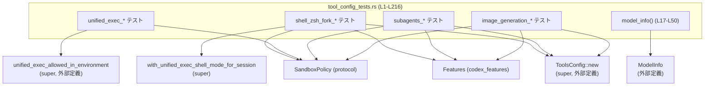
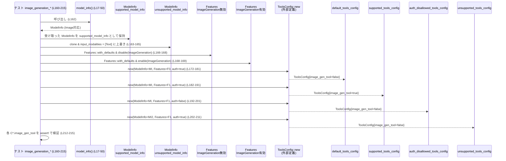

# tools/src/tool_config_tests.rs コード解説

---

## 0. ざっくり一言

このファイルは、`ToolsConfig` および `unified_exec_allowed_in_environment` まわりの **設定ロジックの仕様を固定するユニットテスト群**です。  
特に、Windows サンドボックス条件下での unified exec の可否、シェル実行モードの選択、サブエージェント用ツール群の有効化条件、画像生成ツールの有効化条件を検証しています（`tools/src/tool_config_tests.rs:L52-L215`）。

---

## 1. このモジュールの役割

### 1.1 概要

- このモジュールは、`super::*` でインポートされる `ToolsConfig` などの実装に対し、  
  **特定の入力条件に対して期待されるツール設定が得られるかを検証するテスト**を提供します（L1-L15, L52-L215）。
- また、`ModelInfo` を JSON から構築するヘルパー `model_info` を定義し、  
  テストで共通のモデル設定を使い回すための簡易フィクスチャとして利用しています（L17-L50）。

### 1.2 アーキテクチャ内での位置づけ

このファイルは `tools` クレート（あるいはモジュール）の **テストモジュール**であり、親モジュール (`super`) に定義された `ToolsConfig` などの振る舞いを外部 API 経由で検証しています。

主な依存関係は以下のとおりです（すべてこのファイル内からの利用であり、定義は他ファイル／クレートです）:

- `ToolsConfig`, `ToolsConfigParams`, `unified_exec_allowed_in_environment`（`super::*` 経由, L1, L52-L74, L84-L93, L142-L153, L172-L211）
- 機能フラグ: `codex_features::{Feature, Features}`（L2-L3, L79-L81, L137-L139, L166-L169）
- モデル情報: `codex_protocol::openai_models::ModelInfo`, `InputModality`（L7-L8, L17-L50, L162-L165）
- 設定種別: `WebSearchMode`, `WindowsSandboxLevel`（L4-L5, L88-L93 など）
- セッション・サンドボックス: `SandboxPolicy`, `SessionSource`, `SubAgentSource`（L9-L11, L90-L92, L148-L152）
- シェル関連: `ConfigShellToolType`, `ShellCommandBackendConfig`, `UnifiedExecShellMode`, `ZshForkConfig`, `ToolUserShellType`（後者3つは `super::*` 側の型で、このチャンクには定義が現れませんが、利用は L95-L131 に見られます）
- 補助: `AbsolutePathBuf`, `serde_json`, `pretty_assertions::assert_eq`, `PathBuf`（L12-L15, L17-L50, L95-L131）

依存関係の概略図は次のとおりです。



### 1.3 設計上のポイント

- **責務の分割**
  - モデル情報の準備は `model_info()` に切り出され、複数のテストで共有しています（L17-L50）。
  - 各テストは 1 つの仕様・条件組み合わせにフォーカスしており、責務が明確です（L52-L74, L76-L132, L134-L158, L160-L215）。
- **状態管理**
  - テスト内で構築される `ToolsConfig` は、`ToolsConfigParams` に基づく **不変な設定オブジェクト**として扱われており、  
    生成後はフィールド参照のみを行っています（L84-L93, L142-L153, L172-L211）。
- **エラーハンドリング**
  - `model_info()` は `serde_json::from_value(...).expect(...)` を使用し、  
    JSON がパースできない場合はテストを panic させる方針です（L18-L19, L48-L49）。
  - テスト本体では `assert!` / `assert_eq!` の失敗を通じて **仕様逸脱を panic で検出**します（L54-L73, L95-L131, L155-L157, L212-L215）。
- **並行性**
  - このファイル内ではスレッド、`async`/`await`、チャネルなどの **並行処理は一切使用されていません**。  
    `ToolsConfig` 自体のスレッド安全性等は、このチャンクには現れず不明です。

---

## 2. 主要な機能一覧（このテストが検証する仕様）

- Windows サンドボックス環境で unified exec がブロックされる条件の検証（L52-L74）
- Zsh フォーク機能が有効な場合に **ShellCommand + ZshFork バックエンド**を優先することの検証（L76-L132）
- SubAgent セッションで、`DefaultModeRequestUserInput` 設定と agent jobs 関連ツールが有効化されることの検証（L134-L158）
- 画像生成ツール (`image_gen_tool`) の有効化条件:
  - Feature フラグ `ImageGeneration`
  - モデルが image 入力をサポート (`input_modalities` に `Image` を含む)
  - 認可フラグ `image_generation_tool_auth_allowed`  
  の 3 条件を満たす必要がある、という仕様の検証（L160-L215）

---

## 3. 公開 API と詳細解説

### 3.1 型一覧（構造体・列挙体など）

このファイルでは新しい型定義は行っていませんが、テスト対象として重要な外部型をまとめます。

| 名前 | 種別 | 役割 / 用途 | 本ファイルでの利用位置 |
|------|------|-------------|-------------------------|
| `ModelInfo` | 構造体 | モデルのメタ情報（入力モダリティなど）を保持 | `model_info()` の戻り値型（L17, L18-L48, L162-L165） |
| `Features` | 構造体 | 機能フラグをオン／オフするためのコンテナ | 各テストで `with_defaults`, `enable`, `disable` を使用（L79-L81, L137-L139, L166-L169） |
| `Feature` | 列挙体 | 個別機能の識別子（`UnifiedExec`, `ShellZshFork` など） | `features.enable/disable` の引数（L80-L81, L138-L139, L167, L169） |
| `ToolsConfig` | 構造体 | ツール群の設定（シェル種別、画像生成ツール有効フラグなど） | `ToolsConfig::new` の戻り値（L84-L93, L142-L153, L172-L211） |
| `ToolsConfigParams` | 構造体 | `ToolsConfig::new` に渡す設定パラメータ | リテラル構築（L84-L93, L142-L153, L172-L211） |
| `SandboxPolicy` | 列挙体/構造体 | サンドボックスの権限レベル（読み取り専用、フルアクセスなど） | `new_read_only_policy`, `new_workspace_write_policy`, `DangerFullAccess` の利用（L56-L57, L61-L62, L66-L67, L91, L151-152, L179-180, L199-200, L209-210） |
| `WindowsSandboxLevel` | 列挙体 | Windows サンドボックスのレベル（`RestrictedToken`, `Disabled` など） | unified exec テストと ToolsConfigParams に使用（L57-58, L62-63, L67-68, L72-73, L92-93, L152-153, L180-181, L200-201, L210-211） |
| `ConfigShellToolType` | 列挙体 | シェルツールの種別（UnifiedExec / ShellCommand など） | `tools_config.shell_type` の期待値（L95-L96） |
| `ShellCommandBackendConfig` | 列挙体 | `ShellCommand` 実装のバックエンド（`ZshFork` など） | `tools_config.shell_command_backend` の期待値（L97-L99）※定義はこのチャンクには現れません |
| `UnifiedExecShellMode` | 列挙体 | unified exec シェルの動作モード（`Direct`, `ZshFork(...)` など） | `unified_exec_shell_mode` の比較（L101-L103, L104-L131） |
| `ZshForkConfig` | 構造体 | Zsh フォークモード用のパス設定 | `UnifiedExecShellMode::ZshFork(ZshForkConfig{...})` の引数に使用（L121-L127） |
| `ToolUserShellType` | 列挙体 | ユーザーのシェル種類（Zsh など） | `with_unified_exec_shell_mode_for_session` の引数（L107） |
| `WebSearchMode` | 列挙体 | Web 検索モード（Live / Cached） | `ToolsConfigParams.web_search_mode` に設定（L89, L147, L177, L187, L197, L207） |
| `SessionSource` | 列挙体 | セッションの発生源（CLI, SubAgent など） | `Cli`, `SubAgent(...)` として使用（L90, L148） |
| `SubAgentSource` | 列挙体 | サブエージェントの具体的な種別・ラベル | `Other("agent_job:test".to_string())` として利用（L148-L150） |
| `InputModality` | 列挙体 | モデルがサポートする入力種別（Text, Image など） | `unsupported_model_info.input_modalities` の上書き（L164-L165） |

### 3.1.1 関数インベントリー（本ファイル内）

| 名前 | 種別 | 役割 / 用途 | 定義位置 |
|------|------|-------------|----------|
| `model_info()` | 通常関数 | テスト共通で使用する `ModelInfo` のフィクスチャを JSON から生成 | `tools/src/tool_config_tests.rs:L17-L50` |
| `unified_exec_is_blocked_for_windows_sandboxed_policies_only` | テスト関数 | Windows + サンドボックス条件による unified exec 許可/禁止の組み合わせを検証 | `tools/src/tool_config_tests.rs:L52-L74` |
| `shell_zsh_fork_prefers_shell_command_over_unified_exec` | テスト関数 | UnifiedExec + ShellZshFork 機能が有効なときのシェル種別と unified exec モードの挙動を検証 | `tools/src/tool_config_tests.rs:L76-L132` |
| `subagents_keep_request_user_input_mode_config_and_agent_jobs_workers_opt_in_by_label` | テスト関数 | SubAgent セッションでの user input mode と agent jobs tools の有効化を検証 | `tools/src/tool_config_tests.rs:L134-L158` |
| `image_generation_requires_feature_and_supported_model` | テスト関数 | 画像生成ツールの有効化に必要な 3 条件（Feature, モデル対応, 認可フラグ）を検証 | `tools/src/tool_config_tests.rs:L160-L215` |

---

### 3.2 関数詳細

#### `fn model_info() -> ModelInfo`  

*（tools/src/tool_config_tests.rs:L17-L50）*

**概要**

- テストで共通利用する `ModelInfo` インスタンスを、ハードコードした JSON からデシリアライズして返すヘルパー関数です（L17-L19, L48-L49）。
- `input_modalities` に `"text"` と `"image"` を含むため、画像入力に対応したモデルとして扱われます（L46-L47）。

**引数**

引数はありません。

**戻り値**

- 型: `ModelInfo`
- 内容:
  - `slug = "test-model"`（L19）
  - `shell_type = "unified_exec"`（L23）
  - `input_modalities = ["text", "image"]`（L46）
  - その他、多くのフィールドを固定値で設定（L20-L45）。

**内部処理の流れ**

1. `serde_json::json!` マクロで `ModelInfo` 相当の JSON オブジェクトを構築（L18-L47）。
2. `serde_json::from_value` で JSON から `ModelInfo` にデシリアライズ（L18, L48）。
3. `expect("deserialize test model")` により、デシリアライズ失敗時には panic させる（L48-L49）。

**Examples（使用例）**

テストコードと同様に、フィクスチャとして利用できます。

```rust
// テスト内で共通の ModelInfo を取得する                         // 固定フィクスチャとして model_info() を呼ぶ
let model_info = model_info();                                    // ModelInfo インスタンスを生成

// 生成した ModelInfo を ToolsConfigParams に渡す                  // このモデル設定に基づいてツール設定を構築する
let tools_config = ToolsConfig::new(&ToolsConfigParams {          // ToolsConfig::new を呼び出す
    model_info: &model_info,                                      // モデル情報
    available_models: &Vec::new(),                                // このテストでは空
    features: &Features::with_defaults(),                         // デフォルトの機能フラグ
    image_generation_tool_auth_allowed: true,                     // 画像生成ツール利用は許可
    web_search_mode: Some(WebSearchMode::Cached),                 // Web検索モード
    session_source: SessionSource::Cli,                           // CLI からのセッション
    sandbox_policy: &SandboxPolicy::DangerFullAccess,             // サンドボックスはフルアクセス
    windows_sandbox_level: WindowsSandboxLevel::Disabled,         // Windows サンドボックス無効
});
```

**Errors / Panics**

- JSON からのデシリアライズが失敗した場合、`expect("deserialize test model")` により panic します（L48-L49）。
- 実際には JSON がコードにハードコードされているため、テストコードが変更されない限り通常は発生しません。

**Edge cases（エッジケース）**

- この関数は引数を取らないため、入力に関するエッジケースはありません。
- ただし、`ModelInfo` 型の構造がライブラリ側で変更されると、  
  JSON との整合が崩れてデシリアライズが失敗する可能性があります（このチャンクには `ModelInfo` の定義が現れないため詳細不明）。

**使用上の注意点**

- ハードコードされた JSON のため、**実運用モデルと乖離した設定**になりうる点に注意が必要です。
- テスト用のフィクスチャとしてのみ使われており、本番コードでの使用は想定されていません（根拠: テスト関数のみから参照, L78, L136, L162）。

---

#### `#[test] fn unified_exec_is_blocked_for_windows_sandboxed_policies_only()`  

*（tools/src/tool_config_tests.rs:L52-L74）*

**概要**

- `unified_exec_allowed_in_environment` 関数の振る舞いとして、  
  Windows (`is_windows = true`) で特定のサンドボックス設定のときに unified exec が禁止されることを検証します（L54-L73）。
- 危険度の低いサンドボックス（read-only, workspace write）では禁止、  
  危険度の高い `DangerFullAccess` では許可、というポリシーを前提にしています（L56-L57, L61-L62, L66-L67）。

**引数**

テスト関数自体は引数を取りません。  
テスト内で `unified_exec_allowed_in_environment` に渡される引数は以下です（L54-L73）。

| 引数名（意味） | 型 | 説明 |
|----------------|----|------|
| `is_windows` | `bool` | Windows 環境かどうか。テストではすべて `true` 固定（L55, L60, L65, L70）。 |
| `sandbox_policy` | `&SandboxPolicy` | `new_read_only_policy`, `new_workspace_write_policy`, `DangerFullAccess` のいずれか（L56-L57, L61-L62, L66-L67, L71-L72）。 |
| `windows_sandbox_level` | `WindowsSandboxLevel` | `RestrictedToken` または `Disabled`（L57-L58, L62-L63, L67-L68, L72-L73）。 |

**戻り値**

- `unified_exec_allowed_in_environment` の戻り値は `bool` とみなされ、`assert!` でチェックされています（L54-L73）。
  - `false` が期待されるケース: 読み取り専用ポリシー／workspace write ポリシー + `RestrictedToken`（L54-L63）。
  - `true` が期待されるケース: `DangerFullAccess` + `RestrictedToken` または `Disabled`（L64-L73）。

**内部処理の流れ（テスト側）**

1. `is_windows = true` 固定で 4 パターンの組み合わせで関数を呼び出す（L54-L73）。
2. 読み取り専用と workspace 書き込みポリシーでは `!unified_exec_allowed_in_environment(...)` を `assert!` で検証（L54-L63）。
3. `DangerFullAccess` ポリシーでは `unified_exec_allowed_in_environment(...)` が `true` であることを `assert!` で検証（L64-L73）。

**Examples（使用例）**

このテストは、そのまま unified exec 許可ロジックの利用例にもなります。

```rust
// Windows + 読み取り専用サンドボックス + RestrictedToken の場合は unified exec 禁止 // L54-L58 相当
let allowed = unified_exec_allowed_in_environment(
    true,                                                    // Windows 環境
    &SandboxPolicy::new_read_only_policy(),                  // 読み取り専用ポリシー
    WindowsSandboxLevel::RestrictedToken,                    // 制限付きトークン
);
assert!(!allowed);                                           // 許可されないことを期待
```

**Errors / Panics**

- このテスト関数は `assert!` の失敗によって panic します（L54-L73）。
- `unified_exec_allowed_in_environment` 自体のエラー条件や panic 可能性は、このチャンクには定義がなく不明です。

**Edge cases（エッジケース）**

- `is_windows = false` のケースはこのテストでは扱われていません（L54-L73 では常に `true`）。
- サンドボックスレベル `RestrictedToken` 以外（例えば別の enum バリアント）が存在するかどうかは不明であり、このテストでは検証されていません。

**使用上の注意点**

- このテストは **Windows を前提**として `is_windows = true` を渡しているため、  
  実装側が OS 判定を内部で行うかどうかに依存しません。
- unified exec の安全性ポリシーを変更した場合は、このテストも合わせて更新する必要があります。

---

#### `#[test] fn shell_zsh_fork_prefers_shell_command_over_unified_exec()`  

*（tools/src/tool_config_tests.rs:L76-L132）*

**概要**

- `Feature::UnifiedExec` と `Feature::ShellZshFork` がともに有効な場合に、  
  `ToolsConfig::new` が
  - シェル種別として `ConfigShellToolType::ShellCommand`
  - バックエンドとして `ShellCommandBackendConfig::ZshFork`
  を選択することを検証します（L79-L82, L95-L99）。
- また、`with_unified_exec_shell_mode_for_session` により、Unix 環境では unified exec のシェルモードが `ZshFork(ZshForkConfig {...})` に切り替わることを確認しています（L104-L131）。

**引数**

テスト関数自体は引数を取りません。

テスト内部で重要な入力は以下です（L78-L93, L104-L117）。

| 項目 | 型 | 説明 |
|------|----|------|
| `model_info` | `ModelInfo` | `model_info()` から取得したフィクスチャ（L78）。 |
| `features` | `Features` | `with_defaults` 後に `UnifiedExec`, `ShellZshFork` を有効化（L79-L81）。 |
| `available_models` | `Vec<_>` | 空ベクタ（L83）。 |
| `sandbox_policy` | `&SandboxPolicy` | `DangerFullAccess`（L91）。 |
| `windows_sandbox_level` | `WindowsSandboxLevel` | `Disabled`（L92-93）。 |
| `shell user type` | `ToolUserShellType` | `ToolUserShellType::Zsh`（L107）。 |
| `zsh_path` | `&PathBuf` | OS により `"C:\opt\codex\zsh"` または `"/opt/codex/zsh"`（L108-L112）。 |
| `wrapper_path` | `&PathBuf` | OS により `"C:\opt\codex\codex-execve-wrapper"` または `"/opt/codex/codex-execve-wrapper"`（L113-L117）。 |

**戻り値**

- `ToolsConfig::new` の戻り値 `tools_config` について、以下のフィールドが検証されます（L95-L103）。
  - `shell_type == ConfigShellToolType::ShellCommand`（L95-L96）。
  - `shell_command_backend == ShellCommandBackendConfig::ZshFork`（L97-L99）。
  - `unified_exec_shell_mode == UnifiedExecShellMode::Direct`（L101-L103）。
- さらに、`tools_config.with_unified_exec_shell_mode_for_session(...)` の戻り値の `unified_exec_shell_mode` が、
  - Unix 環境では `UnifiedExecShellMode::ZshFork(ZshForkConfig { ... })`
  - それ以外では `UnifiedExecShellMode::Direct`
  になることを `assert_eq!` で確認しています（L104-L131）。

**内部処理の流れ（テスト側）**

1. `model_info()` からモデル情報フィクスチャを取得（L78）。
2. デフォルトの `Features` を用意し、`UnifiedExec` と `ShellZshFork` を有効化（L79-L81）。
3. `ToolsConfigParams` を構築し、`ToolsConfig::new` を実行して `tools_config` を得る（L83-L93）。
4. `tools_config` の `shell_type`, `shell_command_backend`, `unified_exec_shell_mode` を期待値と比較（L95-L103）。
5. Zsh のパスと wrapper のパスを OS ごとに切り替えつつ `with_unified_exec_shell_mode_for_session` を呼び出し（L104-L118）。
6. Unix なら `UnifiedExecShellMode::ZshFork(ZshForkConfig {...})`、そうでなければ `Direct` であることを `assert_eq!` で検証（L120-L131）。
   - `AbsolutePathBuf::from_absolute_path` で絶対パスに変換し `unwrap()` しているため、パスが絶対でない場合は panic します（L121-L127）。

**Examples（使用例）**

Zsh フォークを使った unified exec のシェルモードを設定するパターンの例です。

```rust
// 機能フラグを設定する                                              // UnifiedExec と ZshFork を有効化する
let mut features = Features::with_defaults();                      // デフォルト状態を取得
features.enable(Feature::UnifiedExec);                             // unified exec を有効にする
features.enable(Feature::ShellZshFork);                            // Zsh フォーク機能を有効にする

// ToolsConfig を構築する                                           // 必要パラメータを指定して ToolsConfig を生成
let model_info = model_info();                                     // テスト用モデル情報
let tools_config = ToolsConfig::new(&ToolsConfigParams {
    model_info: &model_info,                                       // モデル情報
    available_models: &Vec::new(),                                 // 他のモデルは未使用
    features: &features,                                           // 有効化した機能フラグ
    image_generation_tool_auth_allowed: true,                      // 画像生成ツール認可は許可
    web_search_mode: Some(WebSearchMode::Live),                    // Live 検索
    session_source: SessionSource::Cli,                            // CLI セッション
    sandbox_policy: &SandboxPolicy::DangerFullAccess,              // フルアクセス
    windows_sandbox_level: WindowsSandboxLevel::Disabled,          // Windows サンドボックス無効
});

// セッション情報をもとに unified exec シェルモードを更新する        // 実際のユーザーシェルとパスに応じてモードを決める
let updated = tools_config.with_unified_exec_shell_mode_for_session(
    ToolUserShellType::Zsh,                                        // Zsh ユーザー
    Some(&PathBuf::from("/opt/codex/zsh")),                        // Zsh バイナリのパス（Unix の例）
    Some(&PathBuf::from("/opt/codex/codex-execve-wrapper")),       // wrapper のパス
);
```

**Errors / Panics**

- `assert_eq!` が失敗するとテストは panic します（L95-L103, L104-L131）。
- `AbsolutePathBuf::from_absolute_path(...).unwrap()` により、指定パスが絶対パスでない場合や不正なパスの場合に panic する可能性があります（L121-L127）。
- `with_unified_exec_shell_mode_for_session` の内部エラー条件は、このチャンクには現れません。

**Edge cases（エッジケース）**

- Windows 環境では `cfg!(unix)` が `false` のため、期待値は `UnifiedExecShellMode::Direct` になります（L120-L130）。
- `ToolUserShellType` が Zsh 以外の場合の挙動は、このテストではカバーされていません（L107 固定）。
- パス引数が `None` の場合の挙動も、このテストでは検証されていません（両方 `Some(...)` で渡している, L108-L117）。

**使用上の注意点**

- OS によって期待結果が変わるため、**CI 上の対象 OS** を考慮してテストを読む必要があります。
- Zsh フォークを利用したい場合、機能フラグと実行パスの両方を正しく設定する必要があることが、このテストからわかります。

---

#### `#[test] fn subagents_keep_request_user_input_mode_config_and_agent_jobs_workers_opt_in_by_label()`  

*（tools/src/tool_config_tests.rs:L134-L158）*

**概要**

- `SessionSource::SubAgent` で `"agent_job:test"` というラベルを持つサブエージェントセッションの場合に、
  - `default_mode_request_user_input` が `true`
  - `agent_jobs_tools` が `true`
  - `agent_jobs_worker_tools` が `true`
  となることを検証します（L148-L157）。

**引数**

テスト関数自体は引数を取りません。  
重要な入力は以下のとおりです（L136-L153）。

| 項目 | 型 | 説明 |
|------|----|------|
| `model_info` | `ModelInfo` | `model_info()` から取得（L136）。 |
| `features` | `Features` | `DefaultModeRequestUserInput`, `SpawnCsv` が有効（L137-L139）。 |
| `session_source` | `SessionSource` | `SubAgent(SubAgentSource::Other("agent_job:test".to_string()))`（L148-L150）。 |
| `sandbox_policy` | `&SandboxPolicy` | `DangerFullAccess`（L151）。 |
| `windows_sandbox_level` | `WindowsSandboxLevel` | `Disabled`（L152-L153）。 |

**戻り値**

- 生成された `tools_config` について、以下が `true` であることを検証します（L155-L157）。
  - `tools_config.default_mode_request_user_input`
  - `tools_config.agent_jobs_tools`
  - `tools_config.agent_jobs_worker_tools`

**内部処理の流れ（テスト側）**

1. モデル情報と `Features` を準備し、`DefaultModeRequestUserInput` と `SpawnCsv` を有効化（L136-L139）。
2. `SessionSource::SubAgent(SubAgentSource::Other("agent_job:test"))` を指定して `ToolsConfig` を構築（L142-L153）。
3. `ToolsConfig` 内の 3 つのブールフラグが `true` であることを `assert!` で確認（L155-L157）。

**Examples（使用例）**

SubAgent セッション用の `ToolsConfig` 構築例として利用できます。

```rust
// SubAgent 用の機能フラグを設定する                                 // サブエージェントがユーザー入力モードを維持し、CSV スポーンを許可
let mut features = Features::with_defaults();                      // デフォルト機能
features.enable(Feature::DefaultModeRequestUserInput);             // デフォルトでユーザー入力モード
features.enable(Feature::SpawnCsv);                                // CSV スポーン機能有効

// SubAgent セッション向けの ToolsConfig を構築する                    // "agent_job:..." ラベル付きサブエージェント
let tools_config = ToolsConfig::new(&ToolsConfigParams {
    model_info: &model_info(),                                     // モデル情報
    available_models: &Vec::new(),                                 // このテストでは未使用
    features: &features,                                           // 有効化した機能
    image_generation_tool_auth_allowed: true,                      // 画像生成ツール認可
    web_search_mode: Some(WebSearchMode::Cached),                  // キャッシュ検索
    session_source: SessionSource::SubAgent(                       // サブエージェントセッション
        SubAgentSource::Other("agent_job:test".to_string()),       // ラベルでワーカーを識別
    ),
    sandbox_policy: &SandboxPolicy::DangerFullAccess,              // フルアクセス
    windows_sandbox_level: WindowsSandboxLevel::Disabled,          // Windows サンドボックス無効
});
```

**Errors / Panics**

- 3 つの `assert!` が失敗するとテストは panic します（L155-L157）。
- `ToolsConfig::new` 自体のエラー条件は、このチャンクには現れません。

**Edge cases（エッジケース）**

- サブエージェントラベルが `"agent_job:"` プレフィックス以外のときの挙動は、このテストからは読み取れません（固定文字列 `"agent_job:test"` のみ使用, L148-L150）。
- `DefaultModeRequestUserInput` や `SpawnCsv` を無効にした場合の挙動も、このテストではカバーされていません。

**使用上の注意点**

- `agent_jobs_tools` / `agent_jobs_worker_tools` の有効化が、**SubAgent ラベルに依存している**可能性が高い点に注意が必要です（ただし詳細ロジックは別ファイルで定義）。
- ワーカー／ジョブ関連の挙動を変更する際は、このテストで保護されている契約を確認する必要があります。

---

#### `#[test] fn image_generation_requires_feature_and_supported_model()`  

*（tools/src/tool_config_tests.rs:L160-L215）*

**概要**

- 画像生成ツール (`image_gen_tool` フラグ) が有効になる条件として、
  1. Feature `ImageGeneration` が有効であること（L167, L169）
  2. モデルが画像入力をサポートしていること（`input_modalities` に `Image` を含むかどうか, L162-L165）
  3. `image_generation_tool_auth_allowed` が `true` であること（L176, L186, L206）
  
  の **3 条件すべてを満たす必要がある**という仕様をテストで表現しています（L212-L215）。

**引数**

テスト関数自体は引数を取りません。

テスト内部の重要な入力（4 ケース分）は以下です（L162-L211）。

| ケース | Feature::ImageGeneration | モデルの `input_modalities` | `image_generation_tool_auth_allowed` | 期待される `image_gen_tool` |
|--------|--------------------------|-----------------------------|--------------------------------------|-----------------------------|
| default_tools_config | 無効（`disable` 済）(L166-L168) | `["text", "image"]`（model_info デフォルト, L17-L50） | `true`（L176） | `false`（L212） |
| supported_tools_config | 有効（`enable` 済）(L169) | `["text", "image"]` | `true`（L186） | `true`（L213） |
| auth_disallowed_tools_config | 有効 (L169) | `["text", "image"]` | `false`（L196） | `false`（L214） |
| unsupported_tools_config | 有効 (L169) | `["text"]` のみに上書き (L164-L165) | `true`（L206） | `false`（L215） |

**戻り値**

- 各 `ToolsConfig` インスタンスの `image_gen_tool` フラグが `assert!` で検証されます（L212-L215）。

**内部処理の流れ（テスト側）**

1. `supported_model_info` を `model_info()` から取得（L162）。
2. `unsupported_model_info` としてクローンし、`input_modalities` を `vec![InputModality::Text]` に変更（L163-L165）。
3.  
   - `image_generation_disabled_features`: `ImageGeneration` を無効化（L166-L168）。
   - `image_generation_features`: `ImageGeneration` を有効化（L168-L169）。
4. 4 種類の `ToolsConfig` を構築（L172-L211）。
5. 各 `ToolsConfig` の `image_gen_tool` フラグを `assert!` で検証（L212-L215）。

**Examples（使用例）**

画像生成ツール有効化条件の組み立て例です。

```rust
// 画像生成機能を有効にした Feature セットを作る                        // ImageGeneration フラグのみを有効化した例
let mut features = Features::with_defaults();                      // デフォルトの機能フラグ
features.enable(Feature::ImageGeneration);                         // 画像生成機能をオン

// 画像入力をサポートする ModelInfo を用意する                           // input_modalities に Image を含む
let mut model_info = model_info();                                 // デフォルトは ["text", "image"] を含む

// 認可フラグも true にした上で ToolsConfig を構築                     // 3 条件をすべて満たす
let tools_config = ToolsConfig::new(&ToolsConfigParams {
    model_info: &model_info,                                       // 画像対応モデル
    available_models: &Vec::new(),                                 // 他モデルは未使用
    features: &features,                                           // 画像生成機能フラグ
    image_generation_tool_auth_allowed: true,                      // 認可フラグ true
    web_search_mode: Some(WebSearchMode::Cached),                  // 検索モード
    session_source: SessionSource::Cli,                            // CLI セッション
    sandbox_policy: &SandboxPolicy::DangerFullAccess,              // フルアクセス
    windows_sandbox_level: WindowsSandboxLevel::Disabled,          // Windows サンドボックス無効
});

// ここで tools_config.image_gen_tool が true になることが期待される     // テストでは assert!(supported_tools_config.image_gen_tool)
```

**Errors / Panics**

- 4 つの `assert!`（L212-L215）が失敗するとテストは panic します。
- `ToolsConfig::new` や `ModelInfo` の内部でのエラー条件は、このチャンクには定義がなく不明です。

**Edge cases（エッジケース）**

- `input_modalities` が空、または `Image` を含まない複雑なパターン（例えば `[Image]` だけ等）はこのテストではカバーされていません（L164-L165 では `Text` のみ）。
- `image_generation_tool_auth_allowed` が `None` などの別の表現を取る可能性があるかどうかは、この型定義がこのチャンクには現れないため不明です。
- `ImageGeneration` フラグ以外の Feature が画像生成に影響するかどうかは、このテストからは読み取れません。

**使用上の注意点**

- 画像生成ツールを利用するには、**Feature フラグ**・**モデルの対応**・**認可フラグ** の 3 条件をすべて満たす必要があることが明示されています。
- いずれか 1 つでも欠けると `image_gen_tool` は `false` になるため、設定ミスの切り分けに役立ちます。

---

（`image_generation_requires_feature_and_supported_model` 以外のテスト関数についても同様に、「エラー時は assert が panic する」「引数なし」「ToolsConfig の特定フィールドを検証する」という構造であり、詳細は上記のパターンと同様です。）

### 3.3 その他の関数

このファイルには補助的な小関数は `model_info()` のみであり、すでに詳細を記載しました。  
その他の関数はすべて `#[test]` 属性付きのテスト関数です。

---

## 4. データフロー

ここでは、画像生成ツールの有効化条件を検証する  
`image_generation_requires_feature_and_supported_model`（L160-L215）のデータフローを示します。

### 4.1 処理の要点

- `model_info()` によって **画像対応モデル** (`supported_model_info`) を用意し、クローンして画像非対応版 (`unsupported_model_info`) を作成します（L162-L165）。
- Feature セットを 2 種類（ImageGeneration 無効／有効）用意し（L166-L169）、認可フラグと組み合わせて合計 4 通りの `ToolsConfig` を生成します（L172-L211）。
- それぞれの `ToolsConfig.image_gen_tool` が期待どおり `true` / `false` になることを検証します（L212-L215）。

### 4.2 データフロー図



この図から、`ToolsConfig::new` が `ModelInfo`・`Features`・認可フラグを入力として `image_gen_tool` を決定していることがわかります。

---

## 5. 使い方（How to Use）

### 5.1 基本的な使用方法（ToolsConfig の構築パターン）

このファイルのテストは、`ToolsConfig::new` をどのように呼ぶかの実例になっています。  
CLI セッションでの基本パターンは以下のようになります（L84-L93, L172-L181 を整理）。

```rust
// モデル情報を用意する                                                    // テストでは model_info() を利用
let model_info = model_info();                                           // 画像対応モデル情報を取得

// 機能フラグを用意する                                                    // 必要に応じて機能をオン/オフ
let mut features = Features::with_defaults();                            // デフォルトの機能セット
features.enable(Feature::UnifiedExec);                                   // 例: unified exec を有効化する
features.enable(Feature::ImageGeneration);                               // 例: 画像生成機能も有効化する

// ToolsConfigParams を埋めて ToolsConfig::new を呼ぶ                        // 主要な設定値を構成して ToolsConfig を生成する
let tools_config = ToolsConfig::new(&ToolsConfigParams {
    model_info: &model_info,                                             // モデルのメタ情報
    available_models: &Vec::new(),                                       // 他のモデル一覧（テストでは空）
    features: &features,                                                 // 有効化した機能
    image_generation_tool_auth_allowed: true,                            // 画像生成ツールの利用を認可
    web_search_mode: Some(WebSearchMode::Cached),                        // Web 検索モード
    session_source: SessionSource::Cli,                                  // CLI 起点のセッション
    sandbox_policy: &SandboxPolicy::DangerFullAccess,                    // サンドボックス権限
    windows_sandbox_level: WindowsSandboxLevel::Disabled,                // Windows サンドボックスレベル
});

// 生成された tools_config から必要な情報を参照する                           // 例: どのシェルツールを使うか、画像生成を許可するか
let shell_type = tools_config.shell_type;                                // ConfigShellToolType など（定義は別ファイル）
let can_image_gen = tools_config.image_gen_tool;                         // 画像生成ツールの利用可否フラグ
```

### 5.2 よくある使用パターン

1. **OS 別の unified exec シェルモード切り替え**（L104-L131）

   - Unix 環境では Zsh フォークを用い、Windows では `Direct` のままにする。

   ```rust
   let updated = tools_config.with_unified_exec_shell_mode_for_session(
       ToolUserShellType::Zsh,                                           // Zsh ユーザー
       Some(&PathBuf::from(if cfg!(windows) {                            // OS ごとにパスを切り替える
           r"C:\opt\codex\zsh"
       } else {
           "/opt/codex/zsh"
       })),
       Some(&PathBuf::from(if cfg!(windows) {
           r"C:\opt\codex\codex-execve-wrapper"
       } else {
           "/opt/codex/codex-execve-wrapper"
       })),
   );
   ```

2. **SubAgent セッションでの agent jobs 用ツール有効化**（L142-L153）

   - `"agent_job:"` プレフィックス付きラベルのサブエージェントに対して、Worker 用ツールを有効にするパターン。

   ```rust
   let tools_config = ToolsConfig::new(&ToolsConfigParams {
       // 省略（上と同様）
       session_source: SessionSource::SubAgent(
           SubAgentSource::Other("agent_job:test".to_string()),
       ),
       // ...
   });
   ```

3. **機能フラグとモデル能力によるツールの on/off**（L166-L169, L172-L211）

   - `Features` と `ModelInfo` の両方を変化させて、特定ツール（画像生成など）の有効化条件を調整する。

### 5.3 よくある間違い（想定）

テストから推測できる、起こりやすい誤用パターンと修正例です。

```rust
// 間違い例: 画像生成機能を使いたいのに Feature を有効化していない
let mut features = Features::with_defaults();
// features.enable(Feature::ImageGeneration);                         // ← 抜けている
let tools_config = ToolsConfig::new(&ToolsConfigParams { /* ... */ });
assert!(tools_config.image_gen_tool);                                 // 期待に反して false になる

// 正しい例: ImageGeneration フラグを有効化し、画像対応モデルを使用する
let mut features = Features::with_defaults();
features.enable(Feature::ImageGeneration);                            // 必ず有効化する
let tools_config = ToolsConfig::new(&ToolsConfigParams { /* ... */ });
// assert!(tools_config.image_gen_tool);                              // テストではこの条件を保証（L213）
```

```rust
// 間違い例: Zsh フォークを期待しているのに ShellZshFork を有効化していない
let mut features = Features::with_defaults();
features.enable(Feature::UnifiedExec);                                // ShellZshFork を有効にしていない
let tools_config = ToolsConfig::new(&ToolsConfigParams { /* ... */ });
// Zsh フォークバックエンドにならない可能性がある

// 正しい例: UnifiedExec と ShellZshFork を両方有効化する
let mut features = Features::with_defaults();
features.enable(Feature::UnifiedExec);
features.enable(Feature::ShellZshFork);                               // テストでもこの組み合わせ（L79-L81）
let tools_config = ToolsConfig::new(&ToolsConfigParams { /* ... */ });
// assert_eq!(tools_config.shell_command_backend, ShellCommandBackendConfig::ZshFork); // L97-L99
```

### 5.4 使用上の注意点（まとめ） + Bugs/Security 観点

- **契約（Contracts）**
  - unified exec 許可条件は、少なくとも次の組み合わせに関して固定されています（L54-L73）。
    - Windows + `RestrictedToken` + `read_only / workspace_write` → 禁止
    - Windows + `DangerFullAccess` → 許可
  - 画像生成ツールは「Feature + モデル能力 + 認可フラグ」の 3 条件すべてが必要です（L212-L215）。
  - SubAgent セッションで `"agent_job:"` ラベルのとき、`agent_jobs_tools` と `agent_jobs_worker_tools` が有効化される契約があります（L148-L157）。
- **エッジケース**
  - OS ごとの挙動（`cfg!(unix)`, `cfg!(windows)`）に依存するテストがあるため、  
    新たな OS ターゲットを追加する場合は期待値の見直しが必要です（L108-L117, L120-L130）。
- **安全性・セキュリティ**
  - unified exec の許可条件はサンドボックス・Windows サンドボックスレベルに依存しており、  
    危険な設定（フルアクセス）でのみ許可する、という方針がテストで固定されています（L54-L73）。
  - `AbsolutePathBuf::from_absolute_path(...).unwrap()` によって、**絶対パス保証**を前提にした設計になっています（L121-L127）。  
    不正なパスが入り込むとテスト（および本番コード）で panic する可能性があるため、実装側では入力検証が重要です。
- **並行性**
  - このファイル自体には並行処理はなく、`ToolsConfig` や関連型のスレッド安全性はここからは判断できません。

---

## 6. 変更の仕方（How to Modify）

### 6.1 新しい機能を追加する場合（テストの追加）

`ToolsConfig` に新しいフラグやツール機能を追加した場合、テストを追加する際の基本方針です。

1. **フィクスチャの再利用**
   - 共通のモデル設定で十分な場合は、既存の `model_info()` を再利用します（L17-L50）。
   - モデル能力が異なるケース（例: 画像のみ／テキストのみ）を試したい場合は、  
     `image_generation_requires_feature_and_supported_model` と同様にクローンして一部フィールドを書き換えます（L162-L165）。
2. **Feature とセッション条件の組み合わせを明示**
   - 機能フラグは `Features::with_defaults()` から開始し、`enable` / `disable` を明示的に呼び出します（L79-L81, L137-L139, L166-L169）。
   - セッション種別やサンドボックスは `SessionSource`, `SandboxPolicy`, `WindowsSandboxLevel` を組み合わせて、  
     仕様ごとに 1 テスト関数にまとめます。
3. **期待フィールドをピンポイントで検証**
   - 新しいブールフラグや enum フィールドについて、`assert!` / `assert_eq!` で期待値を固定します。
   - テスト名は既存のパターンに倣い、「条件」と「期待される振る舞い」を文章で表すと意図が分かりやすくなります（例: `image_generation_requires_feature_and_supported_model`）。

### 6.2 既存の機能を変更する場合（影響範囲と注意点）

- **影響範囲の確認**
  - `ToolsConfig` のフィールドや `unified_exec_allowed_in_environment` の条件式を変更する場合、  
    このテストファイルの該当テストが失敗する可能性が高いです（L52-L74, L76-L132, L134-L158, L160-L215）。
  - 検索キーワードとしては `default_mode_request_user_input`, `agent_jobs_tools`, `image_gen_tool` などが有用です。
- **契約の見直し**
  - セキュリティポリシー（特に unified exec の許可条件）を変更する場合は、  
    テスト名が表現している契約そのものを見直し、名称と実装を一致させる必要があります。
- **テスト追加／修正時の注意**
  - OS 固有のパス（`/opt/codex/...`, `C:\opt\codex\...`）に依存したアサーションがあるため、  
    パス仕様を変更する場合は `ZshForkConfig` 生成部分の期待値も同時に更新する必要があります（L121-L127）。
  - テストは `pretty_assertions::assert_eq` を使用しており、差分表示が改善される代わりに、  
    ログ出力ではなく panic ベースで失敗を通知する点は変わりません（L13, L95-L103, L104-L131）。

---

## 7. 関連ファイル

このテストモジュールと密接に関係する外部ファイル・クレートを一覧にします（ファイルパスがこのチャンクに現れないものは推測せず、モジュール名レベルで記載します）。

| パス / モジュール | 役割 / 関係 |
|-------------------|------------|
| `super`（親モジュール; 具体的ファイル名はこのチャンクには現れない） | `ToolsConfig`, `ToolsConfigParams`, `ShellCommandBackendConfig`, `UnifiedExecShellMode`, `ZshForkConfig`, `ToolUserShellType`, `unified_exec_allowed_in_environment` などの本体実装を提供し、本テストから直接呼び出されています（L1, L52-L74, L84-L93, L104-L131, L142-L153, L172-L211）。 |
| `codex_features` クレート | `Feature`, `Features` を提供し、機能フラグの on/off に使用されています（L2-L3, L79-L81, L137-L139, L166-L169）。 |
| `codex_protocol::openai_models` モジュール | `ModelInfo`, `InputModality`, `ConfigShellToolType` を提供し、モデル能力やシェル種別の指定に使われています（L6-L8, L17-L50, L95-L96, L162-L165）。 |
| `codex_protocol::config_types` モジュール | `WebSearchMode`, `WindowsSandboxLevel` を提供し、検索モードと Windows サンドボックスレベルの設定に利用されています（L4-L5, L88-L93, L147, L177, L187, L197, L207）。 |
| `codex_protocol::protocol` モジュール | `SandboxPolicy`, `SessionSource`, `SubAgentSource` を提供し、サンドボックス権限とセッション種別の指定に利用されています（L9-L11, L56-L57, L61-L62, L66-L67, L71-L72, L90-L92, L148-L152, L179-180, L199-200, L209-210）。 |
| `codex_utils_absolute_path` クレート | `AbsolutePathBuf` を提供し、Zsh フォーク設定時のパスの絶対性を検証するために使用されています（L12, L121-L127）。 |
| `serde_json` クレート | `json!` マクロと `from_value` 関数により、`ModelInfo` の JSON デシリアライズを行います（L14, L17-L50）。 |
| `pretty_assertions` クレート | `assert_eq` マクロをラップし、テスト失敗時の差分表示を改善します（L13, L95-L99, L100-L103, L104-L131）。 |

このテストファイルは、上記のモジュール群と連携しながら、`ToolsConfig` 周辺の仕様を固定する役割を果たしています。
