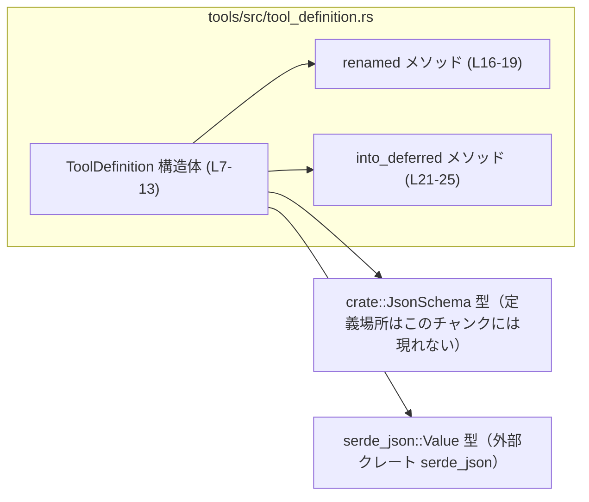
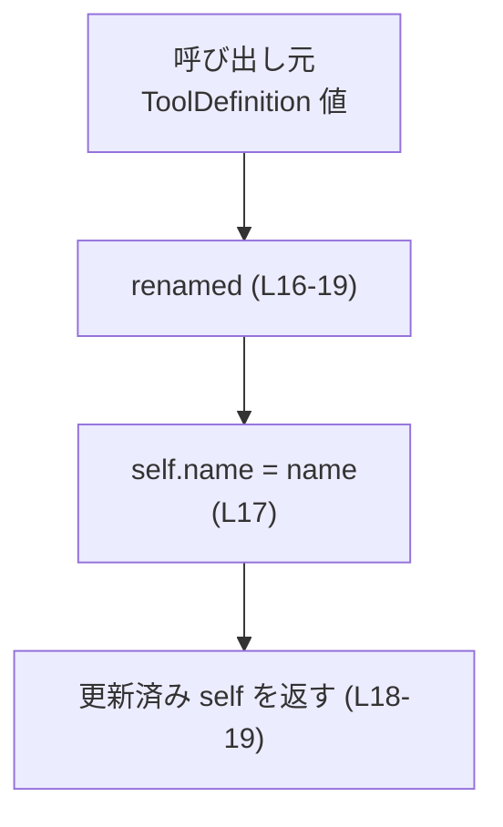
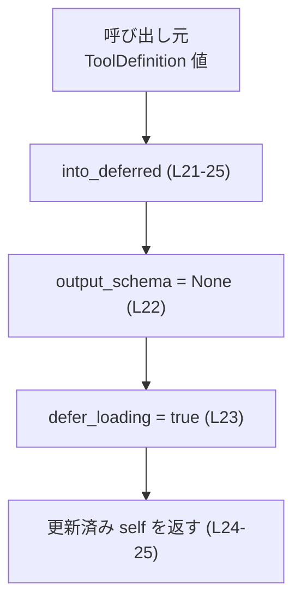
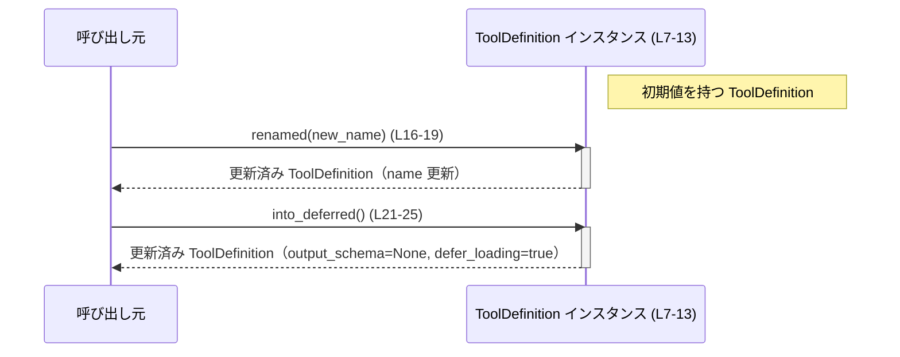

# tools/src/tool_definition.rs

## 0. ざっくり一言

`ToolDefinition` という 1 つの構造体と、その状態を更新する補助メソッドを提供し、ツールのメタデータと入出力スキーマを表現するモジュールです。  
下流クレートがより高レベルな「ツール仕様」に組み立てるための基本情報を保持します（`tools/src/tool_definition.rs:L4-12`）。

---

## 1. このモジュールの役割

### 1.1 概要

- このモジュールは **ツールの名称・説明・入出力スキーマをまとめて表現するためのデータ構造** を提供します。
- ドキュメンテーションコメントから、これを基に **下流クレートが高レベルなツール仕様を構築する** ことが意図されています（`tools/src/tool_definition.rs:L4-5`）。
- 状態を変更するためのメソッドとして、名前の変更と「遅延ロードモード」への切り替え機能を提供します（`tools/src/tool_definition.rs:L15-25`）。

### 1.2 アーキテクチャ内での位置づけ

このモジュール自身は単純なデータホルダであり、他モジュールから利用される前提の「下位レイヤ」の位置づけです。  
外部依存としては `crate::JsonSchema` と `serde_json::Value` を利用しています（`tools/src/tool_definition.rs:L1-2`）。



- `ToolDefinition` が中心となり、`JsonSchema` と `serde_json::Value` をフィールドとして保持します（`tools/src/tool_definition.rs:L7-12`）。
- メソッド `renamed` と `into_deferred` は `ToolDefinition` のインスタンスを受け取って状態を変更し、再び返します（`tools/src/tool_definition.rs:L16-25`）。

### 1.3 設計上のポイント

- **データホルダ型**  
  - `ToolDefinition` はすべてのフィールドが `pub` な単純な構造体です（`tools/src/tool_definition.rs:L7-12`）。
- **所有権とメソッドのスタイル**  
  - メソッドは `mut self`（所有権を取る可変引数）を受け取り `Self` を返す「ビルダー風」スタイルになっています（`tools/src/tool_definition.rs:L16-19, L21-25`）。
  - これにより、メソッドチェーンで状態を組み立てることができます。
- **エラーハンドリング**  
  - メソッドはいずれも `Result` を返さず、エラーを発生させる条件分岐もありません。
  - 入力値のバリデーションは行っていません（例: 空文字列の名前もそのまま受け入れます）。
- **状態不変条件（インバリアント）**  
  - `defer_loading` と `output_schema` の関係を厳密に縛るロジックはありません。  
    どのような組み合わせ（`defer_loading == true` かつ `Some(...)` など）も型システム上は許されています（`tools/src/tool_definition.rs:L7-12`）。
- **並行性**  
  - 構造体には参照や内部可変性（`Cell`, `Mutex` など）がなく、このファイル内には `unsafe` も存在しません（`tools/src/tool_definition.rs` 全体）。
  - ただし `JsonSchema` や `serde_json::Value` が `Send` / `Sync` かどうかはこのチャンクには現れないため不明です。

---

## 2. 主要な機能一覧

このモジュールが提供する機能は次の 3 点です。

- `ToolDefinition` 構造体: ツールの名前・説明・入出力スキーマ・遅延ロードフラグを保持するデータ型（`tools/src/tool_definition.rs:L7-12`）
- `ToolDefinition::renamed`: 既存の `ToolDefinition` インスタンスから名前だけを変更した新しいインスタンスを返すメソッド（`tools/src/tool_definition.rs:L16-19`）
- `ToolDefinition::into_deferred`: 出力スキーマをクリアし、遅延ロードモードに切り替えたインスタンスを返すメソッド（`tools/src/tool_definition.rs:L21-25`）

---

## 3. 公開 API と詳細解説

### 3.1 型一覧（構造体・列挙体など）

このチャンクに現れる型のインベントリです。

| 名前 | 種別 | 公開性 | 役割 / 用途 | 根拠 |
|------|------|--------|-------------|------|
| `ToolDefinition` | 構造体 | `pub` | ツール名・説明・入力スキーマ・出力スキーマ・遅延ロードフラグを保持する中心的なデータ型 | `tools/src/tool_definition.rs:L7-12` |
| `JsonSchema` | 型（詳細不明） | `crate` からインポート | ツールの入力スキーマを表す型。詳細はこのチャンクには現れません | `tools/src/tool_definition.rs:L1, L10` |
| `JsonValue` (`serde_json::Value` の別名) | 型 | 外部クレートからインポート | 出力スキーマを JSON 値として表現するために使用されます | `tools/src/tool_definition.rs:L2, L11` |

`ToolDefinition` のフィールド構成:

| フィールド名 | 型 | 公開性 | 説明 | 根拠 |
|-------------|----|--------|------|------|
| `name` | `String` | `pub` | ツールの識別名 | `tools/src/tool_definition.rs:L8` |
| `description` | `String` | `pub` | ツールの説明文 | `tools/src/tool_definition.rs:L9` |
| `input_schema` | `JsonSchema` | `pub` | ツールの入力スキーマ | `tools/src/tool_definition.rs:L10` |
| `output_schema` | `Option<JsonValue>` | `pub` | ツールの出力スキーマ。`None` の場合は「不明」または「遅延ロード」を表すと解釈できますが、詳細はコードからは断定できません | `tools/src/tool_definition.rs:L11` |
| `defer_loading` | `bool` | `pub` | 出力スキーマのロードを遅延するかどうかを示すフラグ | `tools/src/tool_definition.rs:L12` |

### 3.2 関数詳細

#### `ToolDefinition::renamed(mut self, name: String) -> Self`

**概要**

- 既存の `ToolDefinition` インスタンスの所有権を取り、`name` フィールドだけを新しい値に置き換えた上で、更新済みのインスタンスを返すメソッドです（`tools/src/tool_definition.rs:L16-19`）。
- 他のフィールド（`description`, `input_schema`, `output_schema`, `defer_loading`）は変更されません。

**引数**

| 引数名 | 型 | 説明 | 根拠 |
|--------|----|------|------|
| `self` | `ToolDefinition`（`mut self`） | 変更対象となるインスタンスの所有権。`mut` によりメソッド内でフィールドを書き換えます | `tools/src/tool_definition.rs:L16` |
| `name` | `String` | 新しいツール名。所有権ごと受け取ります | `tools/src/tool_definition.rs:L16` |

**戻り値**

- 型: `Self`（`ToolDefinition`）
- 説明: `name` を更新した後の `ToolDefinition` インスタンスを返します（`tools/src/tool_definition.rs:L18-19`）。

**内部処理の流れ**

1. 受け取った `self` の `name` フィールドに、引数 `name` を代入します（`tools/src/tool_definition.rs:L17`）。
2. その後、更新された `self` をそのまま返します（`tools/src/tool_definition.rs:L18-19`）。



**Examples（使用例）**

```rust
use tools::ToolDefinition;
use tools::JsonSchema;
use serde_json::Value as JsonValue;

fn example_renamed(mut def: ToolDefinition) {
    // 元の名前を確認する
    println!("before: {}", def.name); // ここでは def.name に元の名前が入っている前提

    // 新しい名前 "new_name" に変更する
    let def = def.renamed("new_name".to_string()); // 所有権を def から新しい def にムーブ

    // 名前だけが変わり、他のフィールドはそのまま
    println!("after: {}", def.name); // "new_name" が表示される
}
```

**Errors / Panics**

- このメソッド内にはエラー発生条件や `panic!` 呼び出しはありません（`tools/src/tool_definition.rs:L16-19`）。
- 空文字列や重複している名前などに対するバリデーションは行っていません。

**Edge cases（エッジケース）**

- `name` に空文字列 `""` を渡した場合  
  → `self.name` は空文字列になりますが、エラーや警告は発生しません。
- もともとの `name` と同じ文字列を渡した場合  
  → 実質的な変化はありませんが、再代入は行われます。
- 極端に長い文字列（非常に大きな `String`）  
  → そのまま代入されます。長さに関する制限はこのファイルには定義されていません。

**使用上の注意点**

- `mut self` による所有権移動のため、呼び出し後は元の変数名で `ToolDefinition` を使うことはできません。戻り値を受け取って利用する必要があります。  
  例: `let def = def.renamed(...);`
- バリデーションがないため、「有効な名前」であるかどうかの制約は呼び出し側で保証する必要があります。

---

#### `ToolDefinition::into_deferred(mut self) -> Self`

**概要**

- `ToolDefinition` インスタンスの所有権を取り、出力スキーマをクリアし（`None` に設定）、`defer_loading` を `true` に変えた新しいインスタンスを返すメソッドです（`tools/src/tool_definition.rs:L21-25`）。
- 名前や説明、入力スキーマは変更しません。

**引数**

| 引数名 | 型 | 説明 | 根拠 |
|--------|----|------|------|
| `self` | `ToolDefinition`（`mut self`） | 変更対象となるインスタンスの所有権。メソッド内でフィールドを書き換えます | `tools/src/tool_definition.rs:L21` |

**戻り値**

- 型: `Self`（`ToolDefinition`）
- 説明: `output_schema` が `None` にクリアされ、`defer_loading` が `true` に設定されたインスタンスを返します（`tools/src/tool_definition.rs:L22-25`）。

**内部処理の流れ**

1. `self.output_schema` に `None` を代入し、出力スキーマをクリアします（`tools/src/tool_definition.rs:L22`）。
2. `self.defer_loading` を `true` に設定します（`tools/src/tool_definition.rs:L23`）。
3. 更新された `self` をそのまま返します（`tools/src/tool_definition.rs:L24-25`）。



**Examples（使用例）**

```rust
use tools::ToolDefinition;

fn example_into_deferred(def: ToolDefinition) -> ToolDefinition {
    // もともと output_schema が Some(...) だとしても
    // into_deferred を呼ぶと None にクリアされる
    let def = def.into_deferred(); // 所有権を受け取り、更新済みインスタンスを返す

    assert!(def.output_schema.is_none());   // output_schema は None
    assert!(def.defer_loading);             // defer_loading は true

    def
}
```

**Errors / Panics**

- エラー発生や `panic!` を行うコードはありません（`tools/src/tool_definition.rs:L21-25`）。

**Edge cases（エッジケース）**

- 呼び出し前から `output_schema` がすでに `None` の場合  
  → 再度 `None` を代入するだけで、特別な分岐はありません。
- 呼び出し前から `defer_loading` が `true` の場合  
  → 再度 `true` を代入するだけで、意味的には変化しません。
- 非常に大きな `input_schema` やその他フィールド  
  → これらのフィールドは変更されず、そのまま保持されます。

**使用上の注意点**

- `output_schema` の実際の値が必要な場面で `into_deferred` を呼ぶと、その情報は失われます。呼び出し順序とタイミングには注意が必要です。
- 「`defer_loading == true` のときは必ず `output_schema == None`」というようなインバリアントを保ちたい場合には、このメソッドを経由して状態を変更すると整合性を保ちやすくなりますが、フィールドが `pub` であるため、外部から直接フィールドを書き換えると崩れる可能性があります。

---

### 3.3 その他の関数

このファイルには、上記 2 つ以外の関数・メソッド・関連関数は定義されていません（`tools/src/tool_definition.rs:L15-26`）。

| 関数名 | 役割（1 行） | 根拠 |
|--------|--------------|------|
| （なし） | – | – |

---

## 4. データフロー

ここでは、`ToolDefinition` を生成し、メソッドを呼び出して最終的な状態が呼び出し元に戻るまでの典型的なフローを示します。

### 4.1 代表的な処理シナリオ

1. 呼び出し元で `ToolDefinition` を構築する（構築方法はこのファイルには現れませんが、通常はリテラルやコンストラクタ関数経由と想定されます）。
2. `renamed` を呼び出して名称を変更する（任意）。
3. `into_deferred` を呼び出して「出力スキーマの遅延ロードモード」に変換する（任意）。
4. 更新された `ToolDefinition` が呼び出し元の変数として使われる。



この図は、`ToolDefinition` のインスタンスがメソッド呼び出しのたびに所有権を渡されて更新され、再び呼び出し元に返却されることを表しています。

---

## 5. 使い方（How to Use）

### 5.1 基本的な使用方法

`ToolDefinition` を構築し、その後で名前変更と遅延ロード化を行う典型例です。`JsonSchema` の具体的な生成方法はこのチャンクには現れないため疑似コードとします。

```rust
use tools::ToolDefinition;
use tools::JsonSchema;
use serde_json::Value as JsonValue;

fn main() {
    // 1. 入力スキーマを用意する（実際の定義は crate::JsonSchema 側）
    let input_schema: JsonSchema = /* ... 何らかの方法で生成 ... */;

    // 2. 出力スキーマを JSON で定義する（必要に応じて）
    let output_schema: JsonValue = serde_json::json!({
        "type": "object",
        "properties": {
            "result": { "type": "string" }
        }
    });

    // 3. ToolDefinition を初期化する
    let def = ToolDefinition {
        name: "original_name".to_string(),      // ツールの名前
        description: "example tool".to_string(),// 説明
        input_schema,                            // 入力スキーマ
        output_schema: Some(output_schema),      // 出力スキーマ
        defer_loading: false,                    // 最初は遅延ロードしない
    };

    // 4. 名前を変更し、遅延ロードモードに変換する（メソッドチェーン）
    let def = def
        .renamed("renamed_tool".to_string()) // 名前だけ変更
        .into_deferred();                    // 出力スキーマをクリアし遅延ロードモードに

    // 5. 更新済み ToolDefinition を利用する
    println!("tool name: {}", def.name);
    println!("defer_loading: {}", def.defer_loading); // true
    assert!(def.output_schema.is_none());
}
```

### 5.2 よくある使用パターン

1. **ビルダー風チェーン**

   `mut self` + `Self` 戻り値の設計により、以下のようにメソッドチェーンで状態を構築できます。

   ```rust
   let def = ToolDefinition { /* 初期化 */ };

   let def = def
       .renamed("v2".to_string())  // 名前更新
       .into_deferred();           // 出力スキーマを削除し遅延ロード化
   ```

2. **状態を途中で分岐させる**

   `ToolDefinition` は所有権型のため、そのままコピーはできませんが、クローン可能であれば（`Clone` 実装があるかどうかはこのチャンクには現れないため不明）分岐させることが可能です。クローン実装の有無は別ファイルを参照する必要があります。

### 5.3 よくある間違い

所有権まわりで起こりやすい誤用例と、その修正版です。

```rust
use tools::ToolDefinition;

fn wrong_usage(mut def: ToolDefinition) {
    // 間違い例: 戻り値を受け取らずに呼び出してしまう
    def.renamed("new".to_string());
    // ↑ renamed は self を消費し、新しい ToolDefinition を返すが、ここでは無視している

    // そのため def は古いまま
    // println!("{}", def.name); // ここはコンパイルは通るが名前は更新されていない
}

fn correct_usage(def: ToolDefinition) {
    // 正しい例: 戻り値で新しいインスタンスを受け取る
    let def = def.renamed("new".to_string());
    println!("{}", def.name); // "new"
}
```

- `mut self` を取るメソッドは、元の変数をそのまま更新する挙動ではなく、「値を消費して更新済みの値を返す」ことに注意が必要です。

### 5.4 使用上の注意点（まとめ）

- **所有権とムーブ**  
  - メソッドは `self` の所有権を消費するため、メソッド呼び出しのたびに戻り値を受け取って次に渡す必要があります。
- **フィールドの一貫性**  
  - `defer_loading` と `output_schema` の整合性は型レベルでは強制されていません。`into_deferred` を使うと「`output_schema == None` かつ `defer_loading == true`」という組み合わせを簡単に作れますが、フィールドを直接操作する場合はこの一貫性が崩れる可能性があります。
- **エラー処理**  
  - メソッドはエラーを返さないため、入力値の妥当性チェックを行いたい場合は、呼び出し側で別途検証する必要があります。
- **並行性**  
  - 構造体自体は単純な所有型であり、内部に共有可変状態を持ちません。このファイル内には `unsafe` や同期プリミティブも登場しません。  
    ただし、`ToolDefinition` の `Send` / `Sync` 実装の有無は `JsonSchema` や `serde_json::Value` の実装に依存するため、このチャンクだけからは判断できません。

---

## 6. 変更の仕方（How to Modify）

### 6.1 新しい機能を追加する場合

`ToolDefinition` に新しいメタデータを追加したい場合の典型的な変更箇所です。

1. **フィールドの追加**  
   - `ToolDefinition` に新しいフィールドを追加します（`tools/src/tool_definition.rs:L7-12` 付近）。
2. **メソッドの拡張または追加**  
   - 既存メソッドでそのフィールドも更新したい場合は、`renamed` や `into_deferred` の中での代入ロジックを拡張します（`tools/src/tool_definition.rs:L16-19, L21-25`）。
   - 新しい挙動が必要であれば、同じく `impl ToolDefinition` ブロック内にメソッドを追加します（`tools/src/tool_definition.rs:L15-26`）。
3. **テストの追加 / 修正**  
   - テストモジュール `tool_definition_tests.rs` に対応するテストを追加します（`tools/src/tool_definition.rs:L28-30`）。  
     テストファイルの中身はこのチャンクには現れないため、内容は別途確認が必要です。

### 6.2 既存の機能を変更する場合

- **`renamed` の振る舞いを変える場合**  
  - 例えば、空文字列を禁止したい、名前に一定のパターンを課したい場合は、`renamed` の中で検証し、必要に応じて `Result<Self, Error>` を返すようにシグネチャを変更することが考えられます。  
    ただし、これは公開 API の互換性に影響するため、呼び出し側の影響範囲の確認が必要です。
- **`into_deferred` の条件を厳密にする場合**  
  - 「すでに `defer_loading == true` のときに呼び出すのはエラー」といった仕様を追加する場合は、メソッド内で条件チェックを追加し、`panic!` または `Result` 型を導入する必要があります。
- **影響範囲の確認方法**  
  - `ToolDefinition` は `pub struct` でありフィールドも `pub` であるため、クレート内外から直接フィールドが参照・変更されている可能性があります。  
    そのため、フィールド名・型・意味を変える場合はクレート全体（および公開クレートの場合は外部クレート）での使用箇所を検索して確認する必要があります。

---

## 7. 関連ファイル

このモジュールと密接に関係するファイル・要素です。

| パス / シンボル | 役割 / 関係 | 根拠 |
|----------------|------------|------|
| `crate::JsonSchema` | `ToolDefinition.input_schema` の型として使用されるスキーマ表現。定義場所はこのチャンクには現れません | `tools/src/tool_definition.rs:L1, L10` |
| `serde_json::Value` | `ToolDefinition.output_schema` の中身として利用される JSON 値型。`JsonValue` という別名でインポートされています | `tools/src/tool_definition.rs:L2, L11` |
| `tools/src/tool_definition_tests.rs` | `#[cfg(test)]` で参照されるテストモジュール。`ToolDefinition` のテストがここに記述されていると推測できますが、中身はこのチャンクには現れません | `tools/src/tool_definition.rs:L28-30` |

---

## Bugs / Security（このファイルから読み取れる範囲）

- **潜在的な一貫性問題**  
  - `ToolDefinition` の全フィールドが `pub` のため、外部コードから `output_schema` と `defer_loading` を任意の組み合わせで設定できます（`tools/src/tool_definition.rs:L7-12`）。  
    これによって、利用側が「`defer_loading == true` のときは `output_schema == None` である」といった前提を置くと、破られる可能性があります。
- **セキュリティ**  
  - このファイル内には I/O、ネットワーク、`unsafe` などのコードは含まれていません。  
    セキュリティ上の挙動は上位レイヤ（この構造体を利用するコード）に依存します。

このファイル単体では、直接的なバグや脆弱性を示すコードは見当たりませんが、一貫性の保証については利用側の設計に依存します。
