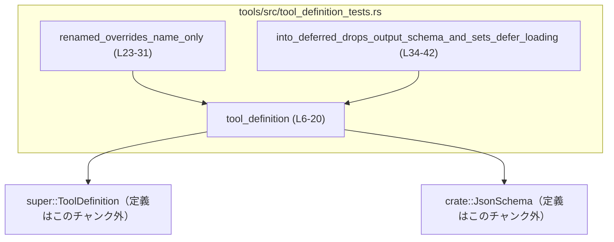
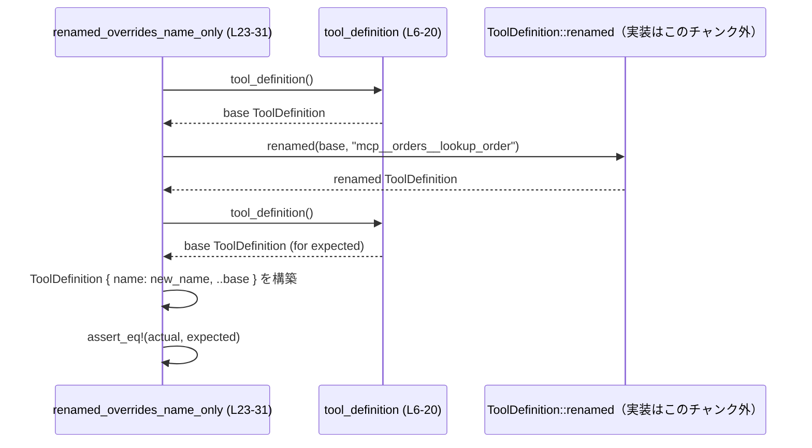

# tools/src/tool_definition_tests.rs コード解説

## 0. ざっくり一言

このファイルは、`ToolDefinition` 型に対する 2 つのメソッド `renamed` と `into_deferred` の挙動を検証する単体テストと、そのための共通テストデータ生成ヘルパー関数 `tool_definition` を定義するテストモジュールです（`tool_definition_tests.rs:L6-20`, `L23-42`）。

---

## 1. このモジュールの役割

### 1.1 概要

- このモジュールは、ツール定義を表す `ToolDefinition` 型の補助メソッドが、**必要なフィールドだけを変更し、その他を維持しているか** をテストする役割を持ちます。
- 具体的には、`ToolDefinition::renamed` と `ToolDefinition::into_deferred` の返り値が、期待通りにフィールドを上書き／クリアしているかを `assert_eq!` で検証しています（`tool_definition_tests.rs:L23-30`, `L34-41`）。

### 1.2 アーキテクチャ内での位置づけ

このファイルはテストコードであり、実装を持つ `ToolDefinition` や `JsonSchema` を他モジュールから利用しています（`tool_definition_tests.rs:L1-2`）。

主な依存関係を Mermeid で示します。



- `ToolDefinition` はこのテストモジュールの親モジュール（`super`）側に定義されています（`tool_definition_tests.rs:L1`）。
- `JsonSchema` はクレートルート `crate` からインポートされます（`tool_definition_tests.rs:L2`）。
- テスト関数は共通の `tool_definition` ヘルパーを介して `ToolDefinition` のインスタンスを生成します（`tool_definition_tests.rs:L24-29`, `L36-41`）。

### 1.3 設計上のポイント

- **共通テストデータのヘルパー化**  
  - `fn tool_definition()` でベースとなる `ToolDefinition` を 1 箇所に定義し、各テストから呼び出す構造になっています（`tool_definition_tests.rs:L6-20`）。
- **構造体更新記法の利用**  
  - 期待値には `ToolDefinition { field: value, ..tool_definition() }` という構造体更新記法を使い、「特定フィールドだけが変化し、他はベース値と同一である」ことを明示的にテストしています（`tool_definition_tests.rs:L26-29`, `L37-41`）。
- **エラーハンドリング**  
  - テストは `assert_eq!` マクロに依存しており、失敗時はパニック（テスト失敗）となります（`tool_definition_tests.rs:L24`, `L35`）。`Result` などによるエラー値の返却は行っていません。
- **並行性**  
  - スレッドや非同期処理は登場せず、並行性に関するロジックは含まれていません。

---

## コンポーネント一覧（このファイル内）

このチャンクに現れる関数の一覧です。

| 名前 | 種別 | 役割 / 用途 | 定義位置 |
|------|------|-------------|----------|
| `tool_definition` | 関数 | テスト用のベースとなる `ToolDefinition` インスタンスを構築する | `tool_definition_tests.rs:L6-20` |
| `renamed_overrides_name_only` | テスト関数 | `ToolDefinition::renamed` が `name` フィールドのみを書き換えることを検証する | `tool_definition_tests.rs:L23-31` |
| `into_deferred_drops_output_schema_and_sets_defer_loading` | テスト関数 | `ToolDefinition::into_deferred` が `output_schema` のクリアと `defer_loading` の設定のみを行うことを検証する | `tool_definition_tests.rs:L34-42` |

---

## 2. 主要な機能一覧

- テスト用 `ToolDefinition` の生成:  
  - `tool_definition` 関数で、入力スキーマ・出力スキーマ・遅延ロードフラグを含む標準的なツール定義を生成します（`tool_definition_tests.rs:L6-19`）。
- 名前変更メソッドの検証:  
  - `renamed_overrides_name_only` テストで、`ToolDefinition::renamed` が `name` 以外のフィールドを変更しないことを検証します（`tool_definition_tests.rs:L23-30`）。
- 遅延ロード変換メソッドの検証:  
  - `into_deferred_drops_output_schema_and_sets_defer_loading` テストで、`ToolDefinition::into_deferred` が `output_schema` と `defer_loading` のみを変更することを検証します（`tool_definition_tests.rs:L34-41`）。

---

## 3. 公開 API と詳細解説

### 3.1 型一覧（構造体・列挙体など）

このファイル内で新たに定義される型はありません。外部から利用している主な型を示します。

| 名前 | 種別 | 役割 / 用途 | このファイルでの現れ方 |
|------|------|-------------|------------------------|
| `ToolDefinition` | 構造体（推定） | ツールの名前・説明・入出力スキーマなどを表す型。テストではフィールド `name`, `description`, `input_schema`, `output_schema`, `defer_loading` が存在することが分かります。 | `use super::ToolDefinition;` としてインポートされ（`tool_definition_tests.rs:L1`）、構造体リテラルで使用されています（`tool_definition_tests.rs:L7-19`, `L26-29`, `L37-41`）。定義自体はこのチャンクにはありません。 |
| `JsonSchema` | 構造体または列挙体（推定） | JSON Schema を表す型。ここでは `object` 関数でオブジェクト型スキーマを生成するために使われます。 | `use crate::JsonSchema;` でインポート（`tool_definition_tests.rs:L2`）。`JsonSchema::object(...)` として使用されています（`tool_definition_tests.rs:L10-14`）。定義はこのチャンク外です。 |

> `ToolDefinition` や `JsonSchema` の内部構造・フィールドの完全な一覧は、このチャンクからは分かりません。ここに記載したフィールド・メソッドは、実際にこのファイルで使用されているものに限られます。

### 3.2 関数詳細

#### `tool_definition() -> ToolDefinition`

**概要**

- テストで共通して使用する「標準的なツール定義」を生成するヘルパー関数です（`tool_definition_tests.rs:L6-20`）。
- `name`, `description`, `input_schema`, `output_schema`, `defer_loading` を特定の値で初期化した `ToolDefinition` を返します（`tool_definition_tests.rs:L8-19`）。

**引数**

- 引数はありません。

**戻り値**

- 型: `ToolDefinition`（`tool_definition_tests.rs:L6`）
- 意味:  
  - 名前が `"lookup_order"`（`tool_definition_tests.rs:L8`）  
  - 説明が `"Look up an order"`（`tool_definition_tests.rs:L9`）  
  - 入力スキーマが空のオブジェクトスキーマ（`JsonSchema::object(BTreeMap::new(), None, None)`）（`tool_definition_tests.rs:L10-14`）  
  - 出力スキーマが `{"type": "object"}` という JSON オブジェクト型（`tool_definition_tests.rs:L15-17`）  
  - `defer_loading` が `false`（`tool_definition_tests.rs:L18`）  
  で初期化されたツール定義です。

**内部処理の流れ**

1. `ToolDefinition` の構造体リテラルを作成します（`tool_definition_tests.rs:L7-19`）。
2. `name` フィールドに `"lookup_order".to_string()` を代入します（`tool_definition_tests.rs:L8`）。
3. `description` フィールドに `"Look up an order".to_string()` を代入します（`tool_definition_tests.rs:L9`）。
4. `input_schema` フィールドに、空の `BTreeMap` と `None` を引数に `JsonSchema::object` を呼び出した結果を代入します（`tool_definition_tests.rs:L10-14`）。
5. `output_schema` フィールドに `Some(serde_json::json!({ "type": "object" }))` を代入します（`tool_definition_tests.rs:L15-17`）。
6. `defer_loading` フィールドに `false` を設定します（`tool_definition_tests.rs:L18`）。
7. 完成した `ToolDefinition` を返します（`tool_definition_tests.rs:L19-20`）。

**Examples（使用例）**

テスト以外で利用する場合のイメージとして、以下のように呼び出せます。

```rust
// テスト用の標準的なツール定義を 1 つ生成する
let base_tool: ToolDefinition = tool_definition(); // ヘルパー関数の呼び出し（tool_definition_tests.rs:L6-20 の再利用）

// 生成したツールをそのまま検証に使う（例: name が "lookup_order" であること）
assert_eq!(base_tool.name, "lookup_order".to_string());
```

**Errors / Panics**

- `tool_definition` 関数内では明示的なパニックやエラー処理は記述されていません（`tool_definition_tests.rs:L6-20`）。
- ただし、`JsonSchema::object` や `serde_json::json!` 内部でパニックが発生する可能性は、ここからは判断できません（このチャンクには実装が現れません）。

**Edge cases（エッジケース）**

- 引数がないため、入力に関するエッジケースはありません。
- 出力は常に同じ内容の `ToolDefinition` であり、条件分岐もないため、ロジック上の分岐エッジケースも存在しません（`tool_definition_tests.rs:L7-19`）。

**使用上の注意点**

- `ToolDefinition` に新しい必須フィールドが追加された場合、この関数の構造体リテラルも更新する必要があります。Rust では必須フィールドを省略するとコンパイルエラーになるためです。
- `JsonSchema::object` の API が変更された場合（引数の数や型など）、この関数の呼び出し部分も合わせて更新する必要があります（`tool_definition_tests.rs:L10-14`）。

---

#### `ToolDefinition::renamed(...) -> ToolDefinition`（シグネチャはこのチャンクには現れません）

**概要**

- `ToolDefinition` の `name` フィールドだけを新しい値に置き換え、それ以外のフィールドは元の値を保った新しいインスタンスを返すメソッドであることが、テストから分かります（`tool_definition_tests.rs:L23-30`）。

**引数**

このチャンクにシグネチャ定義は無いため、正確な型は不明です。ただし以下はテストから読み取れる事実です。

| 引数名 | 型 | 説明 |
|--------|----|------|
| （第1引数: self） | 不明 | インスタンスメソッドとして `tool_definition().renamed(...)` の形で呼び出されています（`tool_definition_tests.rs:L25`）。所有権の移動か借用かは、このチャンクからは分かりません。 |
| `new_name`（推定） | 不明 | テストでは `"mcp__orders__lookup_order".to_string()` が渡されているため、少なくとも `String` から変換可能な型を受け取ることが分かります（`tool_definition_tests.rs:L25`）。 |

**戻り値**

- 型: `ToolDefinition`（テストで `ToolDefinition { ... }` と比較されるため）（`tool_definition_tests.rs:L26-29`）。
- 意味:  
  - ベースとなる `tool_definition()` の値と比較して、`name` フィールドのみが新しい名前に変わり、それ以外のフィールドはすべて同一である `ToolDefinition` を返します（`tool_definition_tests.rs:L25-29`）。

**内部処理の流れ（推定される契約）**

実装本体はこのチャンクにはありませんが、テストから分かる「契約上の挙動」は以下です（`tool_definition_tests.rs:L23-30`）。

1. 元の `ToolDefinition` インスタンスを受け取る。
2. 新しい `ToolDefinition` を返す際に、`name` フィールドの値を引数で渡された新しい名前に置き換える。
3. `description`, `input_schema`, `output_schema`, `defer_loading` など、その他すべてのフィールドは元のインスタンスと同じ値を保つ。  
   - これはテストで `ToolDefinition { name: ..., ..tool_definition() }` との比較を行っていることから分かります（`tool_definition_tests.rs:L26-29`）。

**Examples（使用例）**

テストに近い使用例は次のとおりです。

```rust
// ベースとなるツール定義を生成する（tool_definition_tests.rs:L6-20）
let base = tool_definition();

// 名前だけを変更した新しいツール定義を得る（tool_definition_tests.rs:L25 を参考）
let renamed = base.renamed("mcp__orders__lookup_order".to_string());

// 期待されるツール定義を明示的に組み立てて比較する（tool_definition_tests.rs:L26-29 と同等）
let expected = ToolDefinition {
    name: "mcp__orders__lookup_order".to_string(), // name だけを上書き
    ..tool_definition()                             // 他のフィールドはベースと同じ
};

assert_eq!(renamed, expected);
```

**Errors / Panics**

- テストコード上では、このメソッドが `Result` などを返さず、単に `ToolDefinition` を返していることがうかがえます（`tool_definition_tests.rs:L25-29`）。
- したがって、通常の利用ではエラー値を返さず、パニックも想定されていませんが、実装内部のパニック有無についてはこのチャンクからは分かりません。

**Edge cases（エッジケース）**

- 空文字列や非常に長い文字列を名前として渡した場合の扱いは、このテストからは分かりません（そのようなケースはテストされていません）。
- `new_name` が不正な形式（例えば予約語や禁止文字を含む）である場合の検証ロジックがあるかどうかも、このチャンクからは分かりません。

**使用上の注意点**

- このテストから分かる前提として、`renamed` は**名前以外の設定を変えない**ことが契約になっています。実装を変更する際は、この性質を壊さないようにする必要があります（`tool_definition_tests.rs:L23-30`）。
- `ToolDefinition` にフィールドが追加された場合も、「`name` 以外は元の値を保持する」という性質を満たすように注意する必要があります。テストで `..tool_definition()` を使っているため、新しいフィールドが追加されても、元のインスタンスの値がそのまま適用されることが期待されます（`tool_definition_tests.rs:L26-29`）。

---

#### `ToolDefinition::into_deferred(...) -> ToolDefinition`（シグネチャはこのチャンクには現れません）

**概要**

- `ToolDefinition` の出力スキーマ `output_schema` を `None` にクリアし、遅延ロードフラグ `defer_loading` を `true` に設定した新しいインスタンスを返すメソッドであることが、テストから分かります（`tool_definition_tests.rs:L34-41`）。

**引数**

| 引数名 | 型 | 説明 |
|--------|----|------|
| （第1引数: self） | 不明 | インスタンスメソッドとして `tool_definition().into_deferred()` の形で呼び出されています（`tool_definition_tests.rs:L36`）。所有権の移動か借用かは、このチャンクからは分かりません。 |

**戻り値**

- 型: `ToolDefinition`（テストで `ToolDefinition { ... }` と比較されています）（`tool_definition_tests.rs:L37-41`）。
- 意味:  
  - ベースとなる `tool_definition()` と比較して、`output_schema` が `None` に、`defer_loading` が `true` に変更され、それ以外のフィールドはすべて同一であるツール定義です（`tool_definition_tests.rs:L36-41`）。

**内部処理の流れ（推定される契約）**

実装本体はこのチャンクにはありませんが、テストから読み取れる挙動は次のとおりです（`tool_definition_tests.rs:L34-41`）。

1. 元の `ToolDefinition` インスタンスを受け取る。
2. 新しい `ToolDefinition` を返す際に、`output_schema` を `None` に設定する（`tool_definition_tests.rs:L38`）。
3. `defer_loading` を `true` に設定する（`tool_definition_tests.rs:L39`）。
4. その他のフィールド（`name`, `description`, `input_schema` など）は元のインスタンスと同じ値を保つ（`ToolDefinition { output_schema: None, defer_loading: true, ..tool_definition() }` との比較から分かります）（`tool_definition_tests.rs:L37-41`）。

**Examples（使用例）**

テストと同じ使い方の例です。

```rust
// ベースとなるツール定義を生成（tool_definition_tests.rs:L6-20）
let base = tool_definition();

// 遅延ロード用のツール定義を生成（tool_definition_tests.rs:L36）
let deferred = base.into_deferred();

// 期待されるツール定義を組み立てる（tool_definition_tests.rs:L37-41 と同等）
let expected = ToolDefinition {
    output_schema: None,    // 出力スキーマを削除
    defer_loading: true,    // 遅延ロードフラグを立てる
    ..tool_definition()     // その他のフィールドはベースと同じ
};

assert_eq!(deferred, expected);
```

**Errors / Panics**

- このメソッドも `Result` ではなく `ToolDefinition` を返しており、通常の利用ではエラー値を返さないことが想定されます（`tool_definition_tests.rs:L36-41`）。
- 実装内部でのパニックやエラー発生条件については、このチャンクからは分かりません。

**Edge cases（エッジケース）**

- すでに `output_schema` が `None` の状態で `into_deferred` を呼び出した場合の挙動は、テストからは分かりません（そうした状態を作っていないため）。
- すでに `defer_loading` が `true` の状態での挙動も、同様に不明です。

**使用上の注意点**

- このテストからは、「`output_schema` をクリアして `defer_loading` を立てる以外は、元の定義を変えない」という性質が契約として読み取れます（`tool_definition_tests.rs:L36-41`）。
- 出力スキーマを用いたバリデーションなどを行うコードから見ると、`into_deferred` の呼び出し後は `output_schema` が常に `None` になり得るため、その前提で利用側のコードを書いておく必要があります。

---

### 3.3 その他の関数

テスト関数自体の役割を一覧にします。

| 関数名 | 役割（1 行） | 定義位置 |
|--------|--------------|----------|
| `renamed_overrides_name_only` | `ToolDefinition::renamed` が `name` 以外のフィールドを変更しないことを検証する単体テストです。 | `tool_definition_tests.rs:L23-31` |
| `into_deferred_drops_output_schema_and_sets_defer_loading` | `ToolDefinition::into_deferred` が `output_schema` を `None` にし、`defer_loading` を `true` に設定する以外の変更を行わないことを検証する単体テストです。 | `tool_definition_tests.rs:L34-42` |

---

## 4. データフロー

ここでは `renamed_overrides_name_only` テストを例に、データの流れを説明します。

1. テスト関数が `tool_definition()` を呼び出し、ベースとなる `ToolDefinition` インスタンスを生成します（`tool_definition_tests.rs:L25`）。
2. そのインスタンスに対して `renamed("mcp__orders__lookup_order".to_string())` を呼び出し、名前を書き換えた新しいインスタンスを `actual` として取得します（`tool_definition_tests.rs:L25`）。
3. もう一度 `tool_definition()` を呼び出し、ベースインスタンスから `name` だけを書き換えた構造体リテラルを `expected` として構築します（`tool_definition_tests.rs:L26-29`）。
4. `assert_eq!` で `actual` と `expected` を比較し、構造体の全フィールドが一致することを検証します（`tool_definition_tests.rs:L24-30`）。

Mermaid のシーケンス図で示すと、次のようになります。



`into_deferred_drops_output_schema_and_sets_defer_loading` についても同様で、`ToolDefinition::into_deferred` の出力を、特定フィールドを変更した構造体リテラルと比較する流れになっています（`tool_definition_tests.rs:L34-41`）。

---

## 5. 使い方（How to Use）

### 5.1 基本的な使用方法

このファイルはテスト専用ですが、`ToolDefinition` とそのメソッドの基本的な利用パターンが分かります。

```rust
// 1. ベースとなるツール定義を作成する（tool_definition_tests.rs:L6-20）
let base = tool_definition();

// 2. 名前だけを変更したバリエーションを作る（tool_definition_tests.rs:L25）
let renamed = base.renamed("mcp__orders__lookup_order".to_string());

// 3. 遅延ロード用に変換する（tool_definition_tests.rs:L36）
let deferred = renamed.into_deferred();

// 4. deferred は output_schema なしで defer_loading=true な ToolDefinition であることが期待される
assert_eq!(deferred.defer_loading, true);
assert!(deferred.output_schema.is_none());
```

このように、`tool_definition` を「ひな形」として使い、`renamed` や `into_deferred` で軽微な変更を加えたバリエーションを作るという利用スタイルが想定できます。

### 5.2 よくある使用パターン

- **同一スキーマ・別名ツールの定義**  
  - `tool_definition()` のようなベース定義を作り、`renamed` で名前だけを変えた複数のツールを用意するパターン（`tool_definition_tests.rs:L23-30`）。
- **計算コストの高い出力スキーマの遅延ロード**  
  - 実装はこのチャンクからは見えませんが、`into_deferred` という名前と `defer_loading` フラグから、「出力スキーマのロードを後回しにする」用途が想定されます（`tool_definition_tests.rs:L34-41`）。

### 5.3 よくある間違い（推測される注意点）

コードから推測できる範囲での「誤用パターン」と、「正しい例」を対比します。

```rust
// 誤りになり得る例: 手動でフィールドをコピーしてしまう
let base = tool_definition();
let bad = ToolDefinition {
    name: "mcp__orders__lookup_order".to_string(),
    description: base.description.clone(),   // 他のフィールドを自前でコピー
    input_schema: base.input_schema.clone(),
    output_schema: base.output_schema.clone(),
    defer_loading: base.defer_loading,
};

// 正しい（テストが想定している）例: renamed を使って name だけを変更する
let good = base.renamed("mcp__orders__lookup_order".to_string());
```

- 手動コピーは、将来フィールドが追加されたときにコピー漏れを起こしやすく、テストで検証されている「`name` 以外はそのまま」という契約から外れる可能性があります。
- `renamed` と `into_deferred` を使うことで、「どのフィールドが変わるのか」が明確になり、テストでその性質が保証されます（`tool_definition_tests.rs:L23-30`, `L34-41`）。

### 5.4 使用上の注意点（まとめ）

- **前提条件**  
  - このファイルのテストは、`ToolDefinition` が `PartialEq`／`Eq` と `Debug`（`pretty_assertions::assert_eq` 用）の両方を実装していることを前提としています（`tool_definition_tests.rs:L3`, `L24`, `L35`）。
- **エラー処理**  
  - メソッドはエラーを返さず、テストは `assert_eq!` に依存しているため、異常系は「テスト失敗（パニック）」という形でのみ観測されます。
- **並行性**  
  - スレッドや非同期処理は利用しておらず、スレッド安全性や共有可変状態に関する注意点はこのファイルには存在しません。
- **セキュリティ**  
  - このファイルは純粋なメモリ内のデータ構築と比較のみを行っており、I/O・ネットワーク・シリアライズなど外部入力に関わる処理は含まれていません（`tool_definition_tests.rs:L6-42`）。

---

## 6. 変更の仕方（How to Modify）

### 6.1 新しい機能を追加する場合

`ToolDefinition` に新たなメソッドやフィールドを追加した場合、このテストモジュール側で考慮すべき点です。

1. **新フィールド追加時の影響**  
   - `tool_definition` の構造体リテラルに新フィールドを追加する必要があります（`tool_definition_tests.rs:L7-19`）。
   - `..tool_definition()` を使用する構造体更新記法（`tool_definition_tests.rs:L26-29`, `L37-41`）は、新フィールドにも自動的に適用されるため、「`name` 以外のフィールドは変えない」「`output_schema` と `defer_loading` 以外は変えない」という契約を保つのに有効です。
2. **新しいメソッドのテスト追加**  
   - `ToolDefinition` に新しい変換メソッドを追加する場合、このファイルと同じパターン（ベース定義 + 構造体更新記法 + `assert_eq!`）でテストを追加するのが自然です。

### 6.2 既存の機能を変更する場合

1. **契約の確認**  
   - `renamed` の契約: `name` 以外のフィールドを変更しない（`tool_definition_tests.rs:L23-30`）。
   - `into_deferred` の契約: `output_schema` を `None` に、`defer_loading` を `true` にする以外のフィールドを変更しない（`tool_definition_tests.rs:L34-41`）。
   - 実装を変更するときは、これらの性質を維持するかどうかを明示的に判断し、もし契約を変える場合はテストも合わせて更新する必要があります。
2. **影響範囲**  
   - ここでのテストはフィールドの完全一致を見ているため、`ToolDefinition` の `PartialEq` 実装やフィールド構造を変更した場合にも影響します。
3. **テストの更新**  
   - 仕様変更に伴い、期待値を構成する `ToolDefinition` リテラル（`tool_definition_tests.rs:L26-29`, `L37-41`）を変更する必要があります。

---

## 7. 関連ファイル

このテストモジュールと密接に関係するファイル／モジュール（推定を含みます）です。

| パス / モジュール | 役割 / 関係 |
|-------------------|------------|
| `super` モジュール（具体的なファイルパスはこのチャンクには現れない） | `ToolDefinition` 型とそのメソッド `renamed`, `into_deferred` の実装を提供するモジュールです（`tool_definition_tests.rs:L1`, `L25`, `L36` からの参照）。 |
| `crate` ルート（`JsonSchema` 定義箇所は不明） | `JsonSchema` 型と `JsonSchema::object` 関数の実装を持つモジュールです。`tool_definition` の `input_schema` を構築するのに利用されています（`tool_definition_tests.rs:L2`, `L10-14`）。 |
| `pretty_assertions` クレート | `assert_eq!` を拡張し、差分を見やすく表示するためのテスト支援クレートです（`tool_definition_tests.rs:L3`, `L24`, `L35`）。 |

このチャンクでは、`ToolDefinition` や `JsonSchema` の実装ファイルの正確なパスは分からないため、「super モジュール」「crate ルート」といった表現にとどめています。
