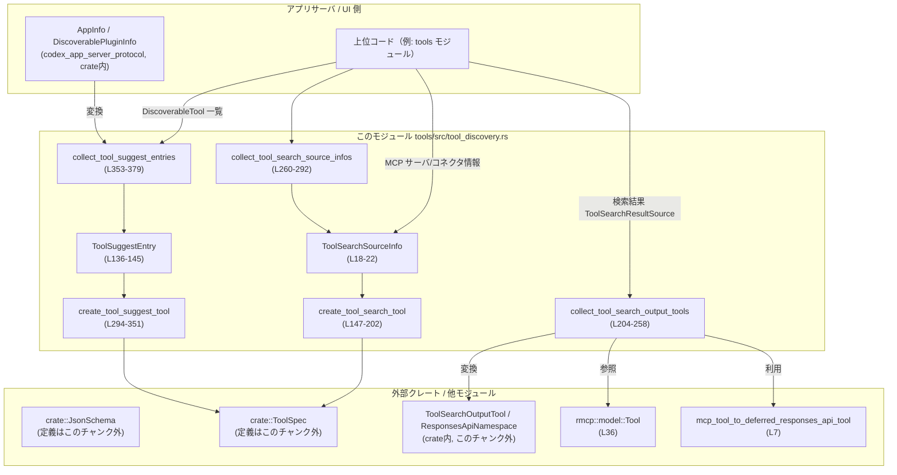
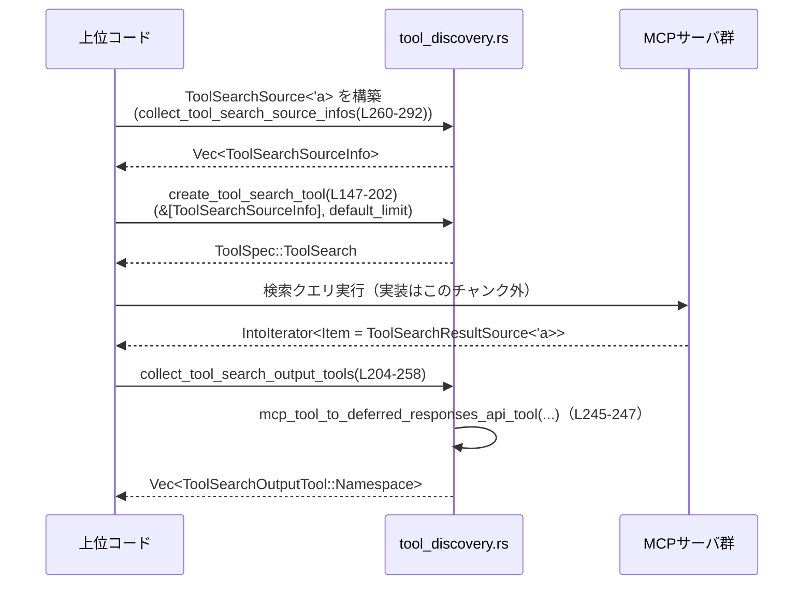
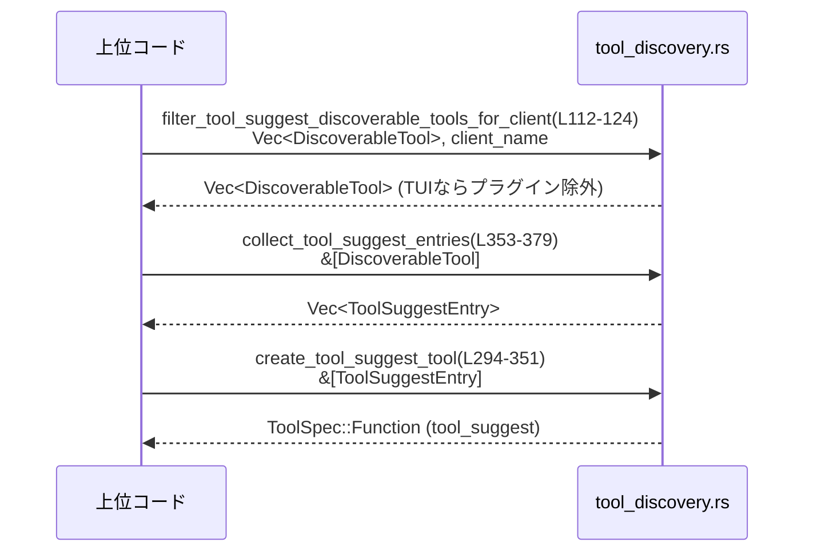

# tools/src/tool_discovery.rs

## 0. ざっくり一言

MCP コネクタ／プラグインのメタデータから、  

- 「tool_search」… MCP ツール検索用ツール  
- 「tool_suggest」… 未インストールコネクタ／プラグイン提案ツール  

を表す `ToolSpec` と、その周辺ヘルパー（検索結果グルーピング・表示用文字列生成など）を組み立てるモジュールです（tool_discovery.rs:L13-16, L147-202, L294-351）。

---

## 1. このモジュールの役割

### 1.1 概要

このモジュールは、MCP ツールやプラグイン／コネクタの「発見・提案」フローをサポートするために存在し、次の機能を提供します。

- MCP ツール検索用の `ToolSpec::ToolSearch` を構築する（tool_discovery.rs:L147-202）
- MCP 検索結果を名前空間単位にまとめ、クライアントに渡す `ToolSearchOutputTool` 群を構築する（L204-258）
- MCP サーバ／コネクタの情報から検索対象ソース一覧を作る（L260-292）
- Discoverable なプラグイン／コネクタから `tool_suggest` 用の `ToolSpec::Function` を構築する（L294-351）
- Discoverable なツールの一覧テキストを整形する内部ヘルパーを提供する（L381-441）

実際の BM25 検索ロジックや MCP 呼び出しはこのモジュールには含まれておらず、ここではメタデータ整形とツール仕様の構築のみを行っています（L189-191）。

### 1.2 アーキテクチャ内での位置づけ

このモジュールは「ツール定義レイヤ」と「MCP アプリ／プラグインメタデータ」レイヤの間に位置し、型変換と表示用メッセージ生成を行います。



※ `JsonSchema`, `ToolSpec`, `ToolSearchOutputTool` などの定義そのものは、別モジュールにありこのチャンクには現れません。

### 1.3 設計上のポイント

- **データ変換に特化した純粋関数**  
  全てのロジックは引数から返り値を生成する純粋関数で、グローバルな状態は持ちません（L147-202, L204-258, L260-292, L294-351, L353-379, L381-441）。
- **安全な Rust コード**  
  `unsafe` ブロックはなく、所有権／借用もシンプルな `&`・`Vec`・`String` に限定されています（全体）。エラーは `Result` による伝播に限定され、パニックを起こすような `unwrap` などは使われていません（L204-258）。
- **表示順の安定化**  
  ソース説明文の構築には `BTreeMap` を用い、出力順がキー順で安定するようになっています（L151-162, L164-187）。
- **TUI クライアント向けの挙動制御**  
  特定クライアント名（`"codex-tui"`）の場合のみプラグインをフィルタリングする機能を持ち、クライアントごとの UI 振る舞いを制御しています（L13-16, L112-124）。
- **コネクタとプラグインの区別**  
  `DiscoverableToolType` と `DiscoverableTool` により、「コネクタ」と「プラグイン」を明示的に区別しつつ共通のハンドリングを可能にしています（L41-46, L64-68, L70-98）。

---

## 2. 主要な機能一覧

- ツール検索ソース情報構築: MCP サーバ／コネクタごとの `ToolSearchSourceInfo` を構築する（L18-22, L24-29, L260-292）
- MCP ツール検索ツール定義生成: `tool_search` 用の `ToolSpec::ToolSearch` を生成する（L147-202）
- MCP 検索結果のグルーピング: `ToolSearchResultSource` を名前空間別にまとめて `ToolSearchOutputTool` として返す（L31-39, L204-258）
- Discoverable ツールメタデータの表現: コネクタ／プラグインの ID や説明を保持する構造体群（L64-68, L126-145）
- ツール提案ツール定義生成: `tool_suggest` 用の `ToolSpec::Function` を生成する（L294-351）
- Discoverable ツール一覧テキスト生成: 提示用の一覧テキストをソート・整形して生成する（L381-441）
- TUI クライアント向けフィルタ: TUI ではプラグインを `tool_suggest` 対象から除外する（L112-124）

---

## 3. 公開 API と詳細解説

### 3.1 型一覧（構造体・列挙体など）

#### 構造体・列挙体

| 名前 | 種別 | 役割 / 用途 | 行範囲 |
|------|------|-------------|--------|
| `ToolSearchSourceInfo` | 構造体 | ツール検索ソース（MCP サーバ／コネクタ）の名前と説明を表す（L18-22） | tool_discovery.rs:L18-22 |
| `ToolSearchSource<'a>` | 構造体 | 検索対象となる MCP サーバ／コネクタを、借用文字列で表現する入力用型（L24-29） | tool_discovery.rs:L24-29 |
| `ToolSearchResultSource<'a>` | 構造体 | MCP ツール検索結果の 1 件を表す。サーバ名・名前空間・ツール名と、`rmcp::model::Tool` への参照を含む（L31-39） | tool_discovery.rs:L31-39 |
| `DiscoverableToolType` | enum | Discoverable なツールの種別を「Connector / Plugin」で表す（L41-46） | tool_discovery.rs:L41-46 |
| `DiscoverableToolAction` | enum | Discoverable ツールに対する推奨操作種別（install / enable）（L57-62）。現状このファイル内では使用箇所はありません。 | tool_discovery.rs:L57-62 |
| `DiscoverableTool` | enum | Discoverable なコネクタ／プラグインをまとめた enum。`AppInfo` または `DiscoverablePluginInfo` を内部に保持する（L64-68） | tool_discovery.rs:L64-68 |
| `DiscoverablePluginInfo` | 構造体 | Discoverable なプラグインのメタ情報（id, name, description, skills 有無, MCP サーバ名, コネクタ ID 群）（L126-134） | tool_discovery.rs:L126-134 |
| `ToolSuggestEntry` | 構造体 | `tool_suggest` 用に正規化された、提案候補ツールエントリ。コネクタ・プラグイン双方に対応（L136-145） | tool_discovery.rs:L136-145 |

#### メソッド・関連 impl（概要）

| メソッド / impl | 役割 | 行範囲 |
|-----------------|------|--------|
| `DiscoverableToolType::as_str` | `connector` / `plugin` の文字列表現を返す（L48-55） | tool_discovery.rs:L48-55 |
| `DiscoverableTool::tool_type` | `DiscoverableTool` の中身から `DiscoverableToolType` を返す（L70-76） | tool_discovery.rs:L70-76 |
| `DiscoverableTool::id` | 内部の `AppInfo` / `DiscoverablePluginInfo` から ID を取り出して返す（L78-83） | tool_discovery.rs:L78-83 |
| `DiscoverableTool::name` | 同様に name を返す（L85-90） | tool_discovery.rs:L85-90 |
| `DiscoverableTool::install_url` | コネクタなら `install_url` を返し、プラグインなら `None` を返す（L92-97） | tool_discovery.rs:L92-97 |
| `impl From<AppInfo> for DiscoverableTool` | `AppInfo` から `DiscoverableTool::Connector` への変換（L100-104） | tool_discovery.rs:L100-104 |
| `impl From<DiscoverablePluginInfo> for DiscoverableTool` | `DiscoverablePluginInfo` から `DiscoverableTool::Plugin` への変換（L106-110） | tool_discovery.rs:L106-110 |

#### 定数

| 名前 | 型 | 値 / 用途 | 行範囲 |
|------|----|-----------|--------|
| `TUI_CLIENT_NAME` | `&'static str` | TUI クライアントを識別する `"codex-tui"`（L13） | tool_discovery.rs:L13-13 |
| `TOOL_SEARCH_TOOL_NAME` | `&'static str` | 検索ツール名 `"tool_search"`（L14） | tool_discovery.rs:L14-14 |
| `TOOL_SEARCH_DEFAULT_LIMIT` | `usize` | ツール検索のデフォルト上限 8（L15） | tool_discovery.rs:L15-15 |
| `TOOL_SUGGEST_TOOL_NAME` | `&'static str` | ツール提案ツール名 `"tool_suggest"`（L16） | tool_discovery.rs:L16-16 |

### 3.2 関数詳細（重要な関数）

#### `filter_tool_suggest_discoverable_tools_for_client(discoverable_tools: Vec<DiscoverableTool>, app_server_client_name: Option<&str>) -> Vec<DiscoverableTool>`

**概要**

特定クライアント（TUI クライアント）向けに、`tool_suggest` 用の Discoverable ツール一覧からプラグインを除外し、コネクタのみを残します（tool_discovery.rs:L112-124）。

**引数**

| 引数名 | 型 | 説明 |
|--------|----|------|
| `discoverable_tools` | `Vec<DiscoverableTool>` | コネクタ／プラグインを含む Discoverable ツール一覧（L112-113） |
| `app_server_client_name` | `Option<&str>` | クライアント名。`Some("codex-tui")` の場合のみフィルタリングを行う（L114-117） |

**戻り値**

- `Vec<DiscoverableTool>`: フィルタ済みの Discoverable ツール一覧。TUI クライアントならプラグインを除外、それ以外のクライアントなら元の一覧をそのまま返します（L116-123）。

**内部処理の流れ**

1. `app_server_client_name` が `Some("codex-tui")` と一致しなければ、入力の `discoverable_tools` をそのまま返す（L116-118）。
2. 一致する場合は、`into_iter()` でベクタを消費しつつイテレートし、`matches!` で `DiscoverableTool::Plugin` を除外するフィルタを適用する（L120-123）。
3. 残った要素を `collect()` して新たなベクタとして返す（L121-123）。

**Examples（使用例）**

```rust
use crate::tool_discovery::{
    DiscoverableTool, DiscoverablePluginInfo,
    filter_tool_suggest_discoverable_tools_for_client,
};
use codex_app_server_protocol::AppInfo;

// コネクタとプラグインを混在させた一覧を作る
let connector_info = AppInfo {
    id: "conn-1".into(),
    name: "Calendar Connector".into(),
    description: Some("Calendar access".into()),
    install_url: Some("https://example.com/install".into()),
    // 他のフィールドはこのチャンクには現れません
};
let plugin_info = DiscoverablePluginInfo {
    id: "plugin-1".into(),
    name: "Calendar Plugin".into(),
    description: None,
    has_skills: true,
    mcp_server_names: vec!["calendar-mcp".into()],
    app_connector_ids: vec!["conn-1".into()],
};

let tools = vec![
    DiscoverableTool::from(connector_info),
    DiscoverableTool::from(plugin_info),
];

// TUI の場合はプラグインが除外される
let filtered_for_tui =
    filter_tool_suggest_discoverable_tools_for_client(tools.clone(), Some("codex-tui"));
// 非 TUI の場合はそのまま
let filtered_for_other =
    filter_tool_suggest_discoverable_tools_for_client(tools.clone(), Some("web-client"));
```

**Errors / Panics**

- パニックや `Result` は使っていません。エラーは発生しません（L112-124）。

**Edge cases（エッジケース）**

- `app_server_client_name == None` の場合  
  `Some("codex-tui")` と一致しないため、フィルタリングは行われず、元の一覧がそのまま返ります（L116-118）。
- `discoverable_tools` が空ベクタの場合  
  そのまま空ベクタが返ります。特別な処理はありません（L120-123）。

**使用上の注意点**

- TUI 以外のクライアントでプラグインを除外したい場合は、この関数を使わず、呼び出し側で別途フィルタリングする必要があります。この関数は `"codex-tui"` 固定の判定を行うためです（L13, L116-118）。

---

#### `create_tool_search_tool(searchable_sources: &[ToolSearchSourceInfo], default_limit: usize) -> ToolSpec`

**概要**

MCP ツール検索用ツール `tool_search` を表す `ToolSpec::ToolSearch` を生成します。説明文には、利用可能な MCP サーバ／コネクタを列挙します（tool_discovery.rs:L147-202）。

**引数**

| 引数名 | 型 | 説明 |
|--------|----|------|
| `searchable_sources` | `&[ToolSearchSourceInfo]` | 検索対象の MCP サーバ／コネクタの名前と説明（L147-149） |
| `default_limit` | `usize` | `limit` パラメータの説明文に埋め込むデフォルト上限値（L149-160） |

**戻り値**

- `ToolSpec`（`ToolSpec::ToolSearch` バリアント）: クライアントへ公開する MCP ツール検索ツール定義（L193-201）。

`ToolSpec` の定義はこのチャンクには現れませんが、ここでは `execution`, `description`, `parameters` を持つ `ToolSearch` バリアントを構築しています（L193-201）。

**内部処理の流れ**

1. `query`（必須文字列）と `limit`（任意の数値）のパラメータ仕様を `JsonSchema` で作成し、`BTreeMap` に格納する（L151-162）。
2. `searchable_sources` からソースごとの説明を生成するために、`BTreeMap<String, Option<String>>` に `name` をキーとして挿入する（L164-174）。  
   - 同じ name が複数回現れた場合、最初に `Some` が入った説明を残し、以降は `None` を上書きしないようにしている（L167-172）。
3. ソースが 1 つもない場合は `"None currently enabled."` を説明文として使う（L176-178）。  
   そうでない場合は、`"- {name}: {description}"` または `"- {name}"` 形式の行に整形し、改行で結合する（L179-187）。
4. 上記の列挙を含む長い説明文を `format!` で生成し、`TOOL_SEARCH_TOOL_NAME`（`"tool_search"`）を組み込む（L189-191）。
5. `ToolSpec::ToolSearch` を `execution = "client"`, `description`, `parameters` 付きで返す（L193-201）。

**Examples（使用例）**

```rust
use crate::tool_discovery::{
    ToolSearchSourceInfo, create_tool_search_tool, TOOL_SEARCH_DEFAULT_LIMIT,
};
use crate::ToolSpec; // 定義はこのチャンクには現れません

let sources = vec![
    ToolSearchSourceInfo {
        name: "calendar-mcp".into(),
        description: Some("Calendar tools".into()),
    },
    ToolSearchSourceInfo {
        name: "files-mcp".into(),
        description: None,
    },
];

// デフォルト上限は定数 TOOL_SEARCH_DEFAULT_LIMIT を使うことが多い
let spec = create_tool_search_tool(&sources, TOOL_SEARCH_DEFAULT_LIMIT);

// spec は ToolSpec::ToolSearch になり、LLM に公開するツール一覧に追加される想定です。
```

**Errors / Panics**

- 例外的なエラー処理や `Result` はありません。  
- 内部で `BTreeMap::from` や `String` 操作を行っていますが、通常の範囲ではパニックを起こす条件は含まれていません（L151-187, L193-201）。

**Edge cases（エッジケース）**

- `searchable_sources` が空の場合  
  説明文中に `"None currently enabled."` と表示されます（L176-178）。
- 同名 `name` のソースが複数ある場合  
  最初に `Some(description)` が設定されたものの説明が優先され、後続のソースが `None` だった場合も最初の説明が保持されます（L167-172）。
- `description` が `None` のソース  
  出力では `"- {name}"` 形式で説明なしの行になります（L181-184）。

**使用上の注意点**

- `default_limit` は説明文にのみ使われ、この関数自身は実際の検索ヒット数を制限しません。実際の検索ロジック側で `TOOL_SEARCH_DEFAULT_LIMIT` との整合を取る必要があります（L147-162, L189-191）。

---

#### `collect_tool_search_output_tools<'a>(tool_sources: impl IntoIterator<Item = ToolSearchResultSource<'a>>) -> Result<Vec<ToolSearchOutputTool>, serde_json::Error>`

**概要**

MCP ツール検索結果 `ToolSearchResultSource` を、`tool_namespace` ごとにグルーピングし、`ToolSearchOutputTool::Namespace` のリストに変換して返します（tool_discovery.rs:L204-258）。

**引数**

| 引数名 | 型 | 説明 |
|--------|----|------|
| `tool_sources` | `impl IntoIterator<Item = ToolSearchResultSource<'a>>` | MCP ツール検索結果のイテレータ。各要素はツールの属するサーバ名・名前空間・ツール名・`rmcp::model::Tool` 参照などを含む（L204-206, L31-39）。 |

**戻り値**

- `Ok(Vec<ToolSearchOutputTool>)`  
  名前空間ごとにまとめられた `ToolSearchOutputTool::Namespace` のリスト（L219-255）。  
  `ToolSearchOutputTool` の定義はこのチャンクには現れませんが、ここでは `Namespace(ResponsesApiNamespace { .. })` バリアントを構築しています（L250-254）。
- `Err(serde_json::Error)`  
  `mcp_tool_to_deferred_responses_api_tool` の呼び出しが失敗した場合のエラーをそのまま返します（L245-248）。

**内部処理の流れ**

1. `tool_sources` をベクタにまとめず、直接イテレートしながら  
   `Vec<(&'a str, Vec<ToolSearchResultSource<'a>>)>` に `tool_namespace` ごとにグルーピングする（L207-217）。
2. グループごとに:
   - 先頭の要素 `first_tool` を取り出す（`Option` をパターンマッチで処理。空グループは `continue`）（L221-223）。
   - 名前空間の説明 `description` を決定する（L225-240）。
     1. `connector_description` があればその文字列をそのまま使う（L225-227）。
     2. なければ `connector_name` をトリムし、空でなければ `"Tools for working with {connector_name}."` を使う（L229-234）。
     3. それもなければ `"Tools from the {server_name} MCP server."` を使う（L235-240）。
   - 名前空間内の各ツールについて、`mcp_tool_to_deferred_responses_api_tool(tool_name, tool)` を呼び、成功時 `ResponsesApiNamespaceTool::Function` に変換する（L242-247）。
   - 上記ツール群と説明文を `ResponsesApiNamespace` にまとめ、それを `ToolSearchOutputTool::Namespace` として `results` に push する（L250-254）。
3. 最終的に `Ok(results)` を返す（L257-257）。

**Examples（使用例）**

```rust
use crate::tool_discovery::{ToolSearchResultSource, collect_tool_search_output_tools};
use crate::ToolSearchOutputTool; // このチャンクには定義がありません
use rmcp::model::Tool;           // MCP ツール定義（外部クレート）

fn convert_results(
    raw_tools: Vec<(&str, &str, &str, &Tool)>
) -> Result<Vec<ToolSearchOutputTool>, serde_json::Error> {
    let sources: Vec<_> = raw_tools.into_iter().map(|(server, ns, name, tool)| {
        ToolSearchResultSource {
            server_name: server,
            tool_namespace: ns,
            tool_name: name,
            tool,
            connector_name: None,
            connector_description: None,
        }
    }).collect();

    collect_tool_search_output_tools(sources)
}
```

**Errors / Panics**

- `mcp_tool_to_deferred_responses_api_tool` が `Result::Err` を返す場合、`collect::<Result<Vec<_>, _>>()?` により、そのエラー（`serde_json::Error`）がこの関数の `Err` として呼び出し元に伝播します（L245-248, L206）。
- 明示的な panic はなく、`unwrap` なども使用していません（L204-258）。

**Edge cases（エッジケース）**

- `tool_sources` が空の場合  
  `grouped` は空のままで、空ベクタを `Ok` で返します（L207-219, L257）。
- 特定の `tool_namespace` にツールが 1 つだけの場合  
  その 1 つだけを含む名前空間が生成されます（L219-255）。
- `connector_name` や `connector_description` がすべて `None` の場合  
  説明文は `"Tools from the {server_name} MCP server."` になります（L225-240）。

**使用上の注意点**

- `tool_namespace` の値が空文字でも特に検証はされないため、その場合も空名の名前空間として扱われます（L207-217）。  
  名前空間の命名ポリシーは呼び出し側で保証する必要があります。
- `rmcp::model::Tool` の内容や `mcp_tool_to_deferred_responses_api_tool` の動作はこのチャンクには現れないため、どのような条件で `serde_json::Error` が発生するかは不明です（L7, L36）。

---

#### `collect_tool_search_source_infos<'a>(searchable_tools: impl IntoIterator<Item = ToolSearchSource<'a>>) -> Vec<ToolSearchSourceInfo>`

**概要**

`ToolSearchSource<'a>`（MCP サーバ／コネクタ情報）から、検索ソースの一覧表示に使う `ToolSearchSourceInfo` を生成します。コネクタ名があればそれを優先し、なければサーバ名を使います（tool_discovery.rs:L260-292）。

**引数**

| 引数名 | 型 | 説明 |
|--------|----|------|
| `searchable_tools` | `impl IntoIterator<Item = ToolSearchSource<'a>>` | MCP サーバ／コネクタ情報（接続名・説明・サーバ名）を含むイテレータ（L260-262, L24-29） |

**戻り値**

- `Vec<ToolSearchSourceInfo>`: 表示用に整形されたソース情報。名前と説明（任意）が含まれます（L263-291）。

**内部処理の流れ**

1. `searchable_tools` をイテレートしながら `filter_map` を適用（L263-291）。
2. 各 `ToolSearchSource` について:
   - まず `connector_name` を取り出して `trim()` し、空でなければそれを `name` として採用する（L266-271）。
     - この場合、`connector_description` を同様に `trim`・空チェックした上で `Option<String>` として設定する（L273-278）。
   - `connector_name` が `None` または空文字の場合は `server_name.trim()` を `name` として使う（L281-287）。
     - ここでは `description` を `None` に固定している（L286-288）。
   - `name` が空文字の場合は `None` を返し、その要素は出力から除外される（L281-284）。
3. 全ての `Some(ToolSearchSourceInfo)` をベクタに集めて返す（L263-291）。

**Examples（使用例）**

```rust
use crate::tool_discovery::{ToolSearchSource, collect_tool_search_source_infos};

let tools = vec![
    ToolSearchSource {
        server_name: "calendar-mcp",
        connector_name: Some("Calendar Connector"),
        connector_description: Some("Read/write calendar events"),
    },
    ToolSearchSource {
        server_name: "files-mcp",
        connector_name: None,
        connector_description: None,
    },
];

let infos = collect_tool_search_source_infos(tools);
// -> name: "Calendar Connector" / desc: "Read/write calendar events"
//    name: "files-mcp" / desc: None
```

**Errors / Panics**

- エラーやパニックは想定されません。`trim` と文字列コピーのみです（L266-289）。

**Edge cases（エッジケース）**

- `server_name` が空白のみ、かつ `connector_name` も空白または `None`  
  -> そのエントリは出力ベクタから除外されます（L281-284）。
- `connector_description` が空文字または空白のみ  
  -> `description` は `None` になります（L273-278）。

**使用上の注意点**

- 出力ベクタの長さは入力と同じとは限りません。空名のエントリはフィルタされることに注意が必要です（L281-284）。

---

#### `create_tool_suggest_tool(discoverable_tools: &[ToolSuggestEntry]) -> ToolSpec`

**概要**

Discoverable なコネクタ／プラグイン一覧から、ツール提案用ツール `tool_suggest` を表す `ToolSpec::Function` を生成します。ツールの使用条件や Discoverable ツール一覧を説明に埋め込みます（tool_discovery.rs:L294-351）。

**引数**

| 引数名 | 型 | 説明 |
|--------|----|------|
| `discoverable_tools` | `&[ToolSuggestEntry]` | 提案候補となる Discoverable ツールエントリ一覧（L294-299, L136-145） |

**戻り値**

- `ToolSpec`（`ToolSpec::Function` バリアント）: `tool_suggest` 用のツール定義（L334-350）。

**内部処理の流れ**

1. `discoverable_tools` から id の一覧を `"id1, id2, ..."` 形式の文字列にまとめ、`tool_id` パラメータの説明に埋め込む（L295-299, L315-318）。
2. `tool_type`, `action_type`, `tool_id`, `suggest_reason` の 4 つの文字列パラメータを `JsonSchema` で定義し、`BTreeMap` に格納する（L300-327）。
3. `format_discoverable_tools` を使って Discoverable ツールの箇条書き文字列を生成する（L329-329, L381-403）。
4. ツールの利用条件・ワークフロー・Discoverable ツール一覧を含む長い説明文を `format!` で作成する（L330-332）。  
   `TOOL_SEARCH_TOOL_NAME` と `TOOL_SUGGEST_TOOL_NAME` も文字列中で参照しています（L14, L16, L330-332）。
5. `ToolSpec::Function` を `name = "tool_suggest"`, `strict = false`, `parameters`, `output_schema = None` で構築して返す（L334-350）。

**Examples（使用例）**

```rust
use crate::tool_discovery::{ToolSuggestEntry, create_tool_suggest_tool};
use crate::ToolSpec; // このチャンクには定義がありません

let entries = vec![
    ToolSuggestEntry {
        id: "calendar-connector".into(),
        name: "Calendar Connector".into(),
        description: Some("Access user's calendar".into()),
        tool_type: crate::tool_discovery::DiscoverableToolType::Connector,
        has_skills: false,
        mcp_server_names: vec![],
        app_connector_ids: vec![],
    },
];

let spec = create_tool_suggest_tool(&entries);

// spec を LLM のツール一覧に登録すると、LLM が tool_suggest を呼び出して
// ユーザにインストール提案などを行えるようになります。
```

**Errors / Panics**

- エラーやパニックは発生しません。文字列操作と `ToolSpec` の構築のみです（L294-351）。

**Edge cases（エッジケース）**

- `discoverable_tools` が空の場合  
  - `discoverable_tool_ids` は空文字になり、`"Must be one of: ."` のような説明文になります（L295-299, L315-318）。  
  - `format_discoverable_tools` の結果も空文字になるため、説明中の「Discoverable tools:\n{discoverable_tools}」の箇所に項目が表示されません（L329-332, L381-403）。
- `ToolSuggestEntry` に description が無いプラグイン  
  -> `plugin_summary` により、skills や MCP サーバ名などから説明が生成されます（L405-418, L421-440）。

**使用上の注意点**

- `tool_id` パラメータの値は説明文上「Must be one of: {discoverable_tool_ids}.」とされていますが、実際のバリデーションはこの関数では行っていません。整合性はツール呼び出し処理側で保証する必要があります（L315-318）。

---

#### `collect_tool_suggest_entries(discoverable_tools: &[DiscoverableTool]) -> Vec<ToolSuggestEntry>`

**概要**

`DiscoverableTool`（コネクタ／プラグイン）一覧から、`tool_suggest` 用の正規化済み `ToolSuggestEntry` 一覧を生成します（tool_discovery.rs:L353-379）。

**引数**

| 引数名 | 型 | 説明 |
|--------|----|------|
| `discoverable_tools` | `&[DiscoverableTool]` | コネクタおよびプラグインの Discoverable なツール一覧（L353-355, L64-68） |

**戻り値**

- `Vec<ToolSuggestEntry>`: `tool_suggest` 向けに正規化されたエントリ（L356-378）。

**内部処理の流れ**

1. `discoverable_tools.iter()` で列挙し、`map` で `DiscoverableTool` を `ToolSuggestEntry` に変換する（L356-378）。
2. `DiscoverableTool::Connector` の場合:
   - `id`, `name`, `description` を `AppInfo` からコピー（L359-363）。
   - `tool_type = DiscoverableToolType::Connector`（L363-364）。
   - `has_skills = false`、`mcp_server_names = []`, `app_connector_ids = []` に固定（L364-366）。
3. `DiscoverableTool::Plugin` の場合:
   - `id`, `name`, `description` を `DiscoverablePluginInfo` からコピー（L369-372）。
   - `tool_type = DiscoverableToolType::Plugin`（L372-373）。
   - `has_skills`, `mcp_server_names`, `app_connector_ids` をそのまま引き継ぐ（L373-375）。
4. 全エントリを `collect()` して返す（L356-378）。

**Examples（使用例）**

```rust
use crate::tool_discovery::{
    DiscoverableTool, DiscoverablePluginInfo, collect_tool_suggest_entries,
};
use codex_app_server_protocol::AppInfo;

let connector = AppInfo {
    id: "conn-1".into(),
    name: "Calendar Connector".into(),
    description: Some("Calendar access".into()),
    install_url: Some("https://example.com/install".into()),
};
let plugin = DiscoverablePluginInfo {
    id: "plugin-1".into(),
    name: "Calendar Plugin".into(),
    description: None,
    has_skills: true,
    mcp_server_names: vec!["calendar-mcp".into()],
    app_connector_ids: vec!["conn-1".into()],
};

let discoverable = vec![
    DiscoverableTool::from(connector),
    DiscoverableTool::from(plugin),
];

let entries = collect_tool_suggest_entries(&discoverable);
// entries[0].tool_type == Connector, entries[1].tool_type == Plugin
```

**Errors / Panics**

- 単純なコピー処理のみで、エラーやパニックは想定されません（L356-378）。

**Edge cases（エッジケース）**

- `discoverable_tools` が空  
  -> 空ベクタを返します（L356-378）。
- プラグイン側の配列フィールドが空  
  -> `plugin_summary` では説明が「No description provided.」になる可能性があります（L421-440）。

**使用上の注意点**

- コネクタについては `has_skills` が常に `false`、`mcp_server_names` / `app_connector_ids` が空に固定されます。コネクタに関する追加メタ情報が必要であれば、この関数と `ToolSuggestEntry` にフィールド追加が必要になります（L359-367, L136-145）。

---

#### `format_discoverable_tools(discoverable_tools: &[ToolSuggestEntry]) -> String`（内部ヘルパー）

**概要**

`ToolSuggestEntry` の一覧を、名前昇順＆ID サブソートでソートし、  
`"- {name} (id:`{id}`, type: {type_str}, action: install): {description}"`  
形式の箇条書きテキストに変換します（tool_discovery.rs:L381-403）。

**引数**

| 引数名 | 型 | 説明 |
|--------|----|------|
| `discoverable_tools` | `&[ToolSuggestEntry]` | Discoverable ツールエントリ一覧（L381-382） |

**戻り値**

- `String`: 1 行に 1 ツールの形式で改行区切りされた箇条書きテキスト（L389-402）。

**内部処理の流れ**

1. `to_vec()` でコピーして `mut discoverable_tools` を作成（L381-382）。
2. `sort_by` を使って  
   - 第一キー: `name` の辞書順  
   - 第二キー: `id` の辞書順  
   でソートする（L383-387）。
3. 各ツールについて:
   - `tool_description_or_fallback(&tool)` で説明文を取得する（L392-392, L405-418）。
   - `format!` で 1 行の文字列に整形する。`tool_type.as_str()` で `connector` / `plugin` を埋め込む（L393-398）。
4. それらの行を `join("\n")` で結合し返す（L389-402）。

**Examples（使用例）**

```rust
use crate::tool_discovery::{ToolSuggestEntry, DiscoverableToolType};

let entries = vec![
    ToolSuggestEntry {
        id: "b".into(),
        name: "B Tool".into(),
        description: None,
        tool_type: DiscoverableToolType::Connector,
        has_skills: false,
        mcp_server_names: vec![],
        app_connector_ids: vec![],
    },
    ToolSuggestEntry {
        id: "a".into(),
        name: "A Tool".into(),
        description: Some("Description A".into()),
        tool_type: DiscoverableToolType::Plugin,
        has_skills: true,
        mcp_server_names: vec!["mcp-a".into()],
        app_connector_ids: vec!["conn-a".into()],
    },
];

let s = format_discoverable_tools(&entries);
// 行順は A Tool -> B Tool の順になり、それぞれ type と description が整形されます。
```

**Errors / Panics**

- ソートと文字列操作のみで、エラーやパニックは想定されません（L381-403）。

**Edge cases（エッジケース）**

- `discoverable_tools` が空  
  -> 空文字列を返します（L381-403）。
- `description` が空または未設定のプラグイン  
  -> `plugin_summary` が skills や MCP サーバ名等から簡易説明を生成します（L405-418, L421-440）。

**使用上の注意点**

- `action: install` が固定文字列として埋め込まれているため、`enable` 等他のアクション種別を示したい場合はこの関数の修正が必要です（L394-398）。

---

### 3.3 その他の関数・メソッド一覧

| 関数 / メソッド名 | 役割（1 行） | 行範囲 |
|-------------------|--------------|--------|
| `DiscoverableToolType::as_str` | 種別を `"connector"` / `"plugin"` の文字列に変換する（L48-55） | tool_discovery.rs:L48-55 |
| `DiscoverableTool::tool_type` | enum のバリアントから `DiscoverableToolType` を返す（L70-76） | tool_discovery.rs:L70-76 |
| `DiscoverableTool::id` | 内部のコネクタ／プラグインから ID を借用して返す（L78-83） | tool_discovery.rs:L78-83 |
| `DiscoverableTool::name` | 同様に name を借用して返す（L85-90） | tool_discovery.rs:L85-90 |
| `DiscoverableTool::install_url` | コネクタの `install_url` を `Option<&str>` として返す（プラグインは常に `None`）（L92-97） | tool_discovery.rs:L92-97 |
| `tool_description_or_fallback` | `ToolSuggestEntry` の description が空の場合にデフォルト説明を決定する（L405-418） | tool_discovery.rs:L405-418 |
| `plugin_summary` | プラグインの skills, MCP サーバ名, コネクタ ID から簡易な説明文を構築する（L421-440） | tool_discovery.rs:L421-440 |

---

## 4. データフロー

ここでは、代表的な 2 つのシナリオについてデータフローを整理します。

### 4.1 MCP ツール検索（tool_search）フロー

1. 上位コードが `ToolSearchSourceInfo` の一覧を組み立てる（`collect_tool_search_source_infos` も利用可）（L260-292）。
2. `create_tool_search_tool` に渡して `ToolSpec::ToolSearch` を生成し、LLM に tool_search を公開する（L147-202）。
3. 実際の MCP 検索結果（`ToolSearchResultSource` のイテレータ）が得られた後、`collect_tool_search_output_tools` で名前空間ごとの `ToolSearchOutputTool::Namespace` に変換する（L204-258）。



### 4.2 ツール提案（tool_suggest）フロー

1. 上位コードが `DiscoverableTool` の一覧（AppInfo / DiscoverablePluginInfo など）を用意する（L64-68, L126-134）。
2. `collect_tool_suggest_entries` を呼び出し、`ToolSuggestEntry` に正規化する（L353-379）。
3. `create_tool_suggest_tool` で `ToolSpec::Function` を生成し、LLM に tool_suggest を公開する（L294-351）。
4. TUI クライアント向けには、事前に `filter_tool_suggest_discoverable_tools_for_client` を通すことで、プラグインを除外できる（L112-124）。



---

## 5. 使い方（How to Use）

### 5.1 基本的な使用方法

`tool_search` と `tool_suggest` をまとめてセットアップする例です（実際の型定義やエラー処理はこのチャンクには現れません）。

```rust
use crate::tool_discovery::{
    ToolSearchSource, ToolSearchSourceInfo,
    DiscoverableTool, DiscoverablePluginInfo,
    collect_tool_search_source_infos,
    create_tool_search_tool,
    collect_tool_suggest_entries,
    create_tool_suggest_tool,
    filter_tool_suggest_discoverable_tools_for_client,
    TOOL_SEARCH_DEFAULT_LIMIT,
};
use crate::ToolSpec;
use codex_app_server_protocol::AppInfo;

// 1. MCP サーバ/コネクタ情報から検索ソースを作る
let raw_sources = vec![
    ToolSearchSource {
        server_name: "calendar-mcp",
        connector_name: Some("Calendar Connector"),
        connector_description: Some("Handle calendar events"),
    },
];
let search_sources: Vec<ToolSearchSourceInfo> =
    collect_tool_search_source_infos(raw_sources);

// 2. tool_search 用の ToolSpec を作る
let tool_search_spec: ToolSpec =
    create_tool_search_tool(&search_sources, TOOL_SEARCH_DEFAULT_LIMIT);

// 3. Discoverable なコネクタ/プラグインを準備する
let connector = AppInfo { /* フィールドはこのチャンクには現れません */ };
let plugin = DiscoverablePluginInfo {
    id: "plugin-1".into(),
    name: "Calendar Plugin".into(),
    description: None,
    has_skills: true,
    mcp_server_names: vec!["calendar-mcp".into()],
    app_connector_ids: vec!["conn-1".into()],
};
let discoverable = vec![
    DiscoverableTool::from(connector),
    DiscoverableTool::from(plugin),
];

// 4. クライアントに応じてフィルタリング
let filtered = filter_tool_suggest_discoverable_tools_for_client(
    discoverable,
    Some("codex-tui"), // TUI ならプラグインは除外される
);

// 5. tool_suggest 用の ToolSpec を作る
let suggest_entries = collect_tool_suggest_entries(&filtered);
let tool_suggest_spec: ToolSpec = create_tool_suggest_tool(&suggest_entries);
```

### 5.2 よくある使用パターン

- **TUI と Web 等で挙動を変える**  
  - Web クライアント: `filter_tool_suggest_discoverable_tools_for_client` を呼ばず、プラグインも提案対象とする（L112-118）。  
  - TUI クライアント: 上記関数に `Some("codex-tui")` を渡し、コネクタのみ提案対象とする（L116-123）。
- **検索ソース情報の自動生成**  
  - MCP サーバ一覧から `ToolSearchSource<'a>` を作り、`collect_tool_search_source_infos` に通して `ToolSearchSourceInfo` に変換し、そのまま `create_tool_search_tool` に渡す（L260-292, L147-202）。

### 5.3 よくある間違い

```rust
use crate::tool_discovery::{
    collect_tool_search_source_infos, ToolSearchSource,
};

// 間違い例: server_name が空白のみで connector_name も空
let sources = vec![
    ToolSearchSource {
        server_name: "   ",           // 空白のみ
        connector_name: None,
        connector_description: None,
    },
];

let infos = collect_tool_search_source_infos(sources);
// infos は空ベクタになる（エントリが除外される）（L281-284）


// 正しい例: 少なくとも server_name または connector_name のどちらかは有効な名前にする
let sources = vec![
    ToolSearchSource {
        server_name: "files-mcp",
        connector_name: None,
        connector_description: None,
    },
];
let infos = collect_tool_search_source_infos(sources);
// infos[0].name == "files-mcp"
```

### 5.4 使用上の注意点（まとめ）

- **前提条件**
  - 文字列フィールドには意味のある名前を設定すること（空白のみの名前はフィルタされます）（L281-284）。
  - `ToolSearchResultSource.tool_namespace` はクライアント側 UI で使われる名前空間であり、整合した命名を呼び出し側で保証する必要があります（L31-35, L207-217）。
- **エラー伝播**
  - `collect_tool_search_output_tools` は `serde_json::Error` を返す可能性がありますが、その発生条件は `mcp_tool_to_deferred_responses_api_tool` の実装に依存します（L7, L204-248）。
- **セキュリティ / 表示上の注意**
  - 説明文には外部から渡された `description` や `name` がそのまま埋め込まれます（L181-184, L393-398）。  
    文字列中に改行やマークアップ等を含めると、そのまま LLM のプロンプトや UI に現れるため、上位層で必要に応じてサニタイズする設計が望ましいです。
- **並行性**
  - このモジュールは共有状態を持たず、すべての関数は引数のみを参照します。そのため、同一データをマルチスレッドで同時に処理しても、このモジュール内でのデータ競合が発生することはありません（ファイル全体）。

---

## 6. 変更の仕方（How to Modify）

### 6.1 新しい機能を追加する場合

- **Discoverable ツール種別を追加したい場合**
  1. `DiscoverableToolType` に新しいバリアントを追加する（L41-46）。
  2. `DiscoverableToolType::as_str` に対応する文字列を追加する（L48-55）。
  3. `ToolSuggestEntry` に必要なフィールドを追加し、`collect_tool_suggest_entries` の変換ロジックを拡張する（L136-145, L353-379）。
  4. 必要であれば `tool_description_or_fallback` / `plugin_summary` 相当の新しいヘルパーを定義する（L405-418, L421-440）。

- **`tool_suggest` のパラメータを増やしたい場合**
  1. `create_tool_suggest_tool` 内の `properties` に新しいキーを追加し（L300-327）、`parameters` の `required` リストに必要なら追加する（L341-346）。
  2. 説明文 `description` に新しいパラメータの説明を追記する（L330-332）。
  3. 呼び出し側のツール呼び出しロジックを更新する（このチャンクには現れません）。

### 6.2 既存の機能を変更する場合

- **影響範囲の確認方法**
  - enum／構造体のフィールドを変更する場合は、`DiscoverableTool` / `ToolSuggestEntry` をパターンマッチしている箇所（特に `collect_tool_suggest_entries`）をすべて確認する必要があります（L64-68, L353-379）。
  - `tool_search` / `tool_suggest` のパラメータ仕様を変える場合は、`create_tool_search_tool` / `create_tool_suggest_tool` と、ToolSpec を解釈する側のコード（このチャンクには現れない）双方の整合を確認する必要があります（L147-202, L294-351）。

- **注意すべき契約**
  - `collect_tool_search_output_tools` は「名前空間ごとにグルーピングする」という前提で設計されているため、`ToolSearchResultSource.tool_namespace` の意味を変えると、クライアントが期待する UI 構造が変わる可能性があります（L31-35, L207-217, L250-254）。
  - `format_discoverable_tools` 出力のフォーマットは `create_tool_suggest_tool` の説明文にそのまま埋め込まれます。変更すると LLM から見えるプロンプトも変わるため、互換性には注意が必要です（L329-332, L381-403）。

---

## 7. 関連ファイル

| パス / モジュール | 役割 / 関係 |
|-------------------|------------|
| `crate::JsonSchema` | ツールパラメータおよび出力の JSON スキーマを構築するために使用される型。定義場所はこのチャンクには現れません（L1, L151-162, L196-200, L300-327, L339-348）。 |
| `crate::ToolSpec` | `ToolSpec::ToolSearch` / `ToolSpec::Function` など、LLM に公開されるツール仕様を表す enum。ここで生成されていますが定義は別ファイルです（L6, L193-201, L334-350）。 |
| `crate::ResponsesApiNamespace`, `crate::ResponsesApiNamespaceTool`, `crate::ResponsesApiTool`, `crate::ToolSearchOutputTool` | tool_search の結果をレスポンス API 形式で表現するための型群。`collect_tool_search_output_tools` および `create_tool_suggest_tool` で使用されます（L2-5, L242-254, L334-350）。 |
| `crate::mcp_tool_to_deferred_responses_api_tool` | `rmcp::model::Tool` を `ResponsesApiNamespaceTool` に変換するヘルパー。失敗時に `serde_json::Error` を返し得ますが、詳細な挙動はこのチャンクには現れません（L7, L245-248）。 |
| `codex_app_server_protocol::AppInfo` | コネクタ／アプリの基本情報を表す型。Discoverable コネクタを表す `DiscoverableTool::Connector` で利用されます（L8, L64-67, L359-363）。 |
| `rmcp::model::Tool` | MCP ツール定義。検索結果ソース `ToolSearchResultSource` の `tool` フィールドに格納されます（L36, L31-37）。 |
| `tools/src/tool_discovery_tests.rs` | このモジュールのテストコード。`#[cfg(test)]` と `#[path = "tool_discovery_tests.rs"]` により同一モジュールとしてコンパイルされます（L443-445）。内容はこのチャンクには現れません。 |

このレポートは、提供された `tools/src/tool_discovery.rs` のコード範囲のみを根拠に作成しています。その他の挙動や外部型の詳細は、このチャンクには現れないため不明です。
