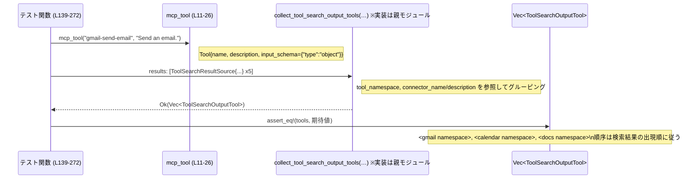

# tools/src/tool_discovery_tests.rs

## 0. ざっくり一言

MCP（Model Context Protocol）系の「ツール検索／ツールサジェスト」の公開 API が、期待どおりのメタデータ・JSON 形式・説明文を生成するかを検証するテスト群です（tool_discovery モジュールの仕様テスト）です。  

---

## 1. このモジュールの役割

### 1.1 概要

- 親モジュール（`super::*`）で定義されているツール発見ロジックに対して、**期待される ToolSpec やレスポンス用モデルを生成できているか**をテストします（`tool_discovery_tests.rs:L28-369`）。
- 主に次の 4 系列の挙動を検証しています。
  - `create_tool_search_tool`：MCP ツール検索用の ToolSpec 生成
  - `create_tool_suggest_tool`：不足ツールのサジェスト用 ToolSpec 生成
  - `collect_tool_search_output_tools`：検索結果のツールを名前空間単位にグルーピング
  - `filter_tool_suggest_discoverable_tools_for_client`：クライアントごとのサジェスト候補フィルタリング

### 1.2 アーキテクチャ内での位置づけ

このファイルはテスト専用であり、実装本体は `super` モジュール側にあります（`use super::*;` `tool_discovery_tests.rs:L1`）。依存関係の概略は次のとおりです。

```mermaid
flowchart TD
  subgraph Impl["親モジュール (super, 実装) ※ファイル名はこのチャンクでは不明"]
    CTS["create_tool_search_tool(...)"]
    CST["create_tool_suggest_tool(...)"]
    CTO["collect_tool_search_output_tools(...)"]
    FTF["filter_tool_suggest_discoverable_tools_for_client(...)"]
  end

  subgraph Tests["tool_discovery_tests.rs (L1-369)"]
    T1["test create_tool_search_tool_* (L28-69)"]
    T2["test create_tool_suggest_tool_* (L71-137)"]
    T3["test collect_tool_search_output_tools_* (L139-272)"]
    T4["test collect_tool_search_output_tools_*_fallback (L274-307)"]
    T5["test discoverable_tool_enums_* (L309-321)"]
    T6["test filter_tool_suggest_*_codex_tui_* (L323-369)"]
    H1["mcp_tool helper (L11-26)"]
  end

  T1 --> CTS
  T2 --> CST
  T3 --> CTO
  T4 --> CTO
  T5 --> Impl
  T6 --> FTF
  T3 --> H1
  T4 --> H1
```



### 1.3 設計上のポイント

コードから読み取れる設計上の特徴は次のとおりです。

- **仕様ドリブンなテスト**  
  - 期待される `ToolSpec` やレスポンスモデルを **構造ごと完全一致** で比較しています（`assert_eq!` を使用 `tool_discovery_tests.rs:L30,73,191,288,311,351`）。
- **テキスト仕様を含む詳細な期待値**  
  - 説明文（Markdown）の長い文字列を固定値として比較し、**ナラティブな仕様（いつどのツールを使うかのガイドライン）**も保証しています（`tool_discovery_tests.rs:L52-66,95-133`）。
- **エラーハンドリングの前提確認**  
  - `collect_tool_search_output_tools` は `Result` を返す実装であることが `.expect(...)` から分かります（`tool_discovery_tests.rs:L188-189,285-286`）。
- **状態は持たない**  
  - テスト内ではすべて関数呼び出しで完結しており、グローバル状態や共有ミュータブル状態は登場しません。
- **並行性**  
  - `mcp_tool` で `Arc<JsonObject>` を使用しており（`tool_discovery_tests.rs:L16-19`）、MCP ツールのスキーマが参照カウント付きで共有される前提であることが分かりますが、テスト内では並行実行は行っていません。

---

## 2. 主要な機能一覧

このテストモジュールがカバーしている主な機能（= 親モジュールの公開 API の挙動）は次のとおりです。

- `create_tool_search_tool` の仕様テスト  
  - 同名の `ToolSearchSourceInfo` を重複排除し、説明付きのソース一覧を Markdown で組み立てる（`tool_discovery_tests.rs:L28-69`）。
- `create_tool_suggest_tool` の仕様テスト  
  - プラグイン／コネクタの一覧から「Discoverable tools: ...」付きの長い説明文を生成し、`tool_suggest` 関数ツールの JSON Schema を構築する（`tool_discovery_tests.rs:L71-137`）。
- `collect_tool_search_output_tools` の仕様テスト  
  - MCP 検索結果を **名前空間ごとにグルーピングしつつ、検索順を保持** した `ToolSearchOutputTool` リストを生成する（`tool_discovery_tests.rs:L139-272`）。
  - コネクタ説明が欠けている場合、コネクタ名から汎用説明「Tools for working with {name}.」を生成する（`tool_discovery_tests.rs:L274-307`）。
- シリアライズのワイヤフォーマットの検証  
  - `DiscoverableToolType::Connector` → `"connector"`、`DiscoverableToolAction::Install` → `"install"` と JSON にシリアライズされることを検証（`tool_discovery_tests.rs:L309-320`）。
- クライアント別のサジェスト候補フィルタリング  
  - クライアント `"codex-tui"` に対しては、`DiscoverableTool::Plugin` を除外し、`DiscoverableTool::Connector` のみ残すことを検証（`tool_discovery_tests.rs:L323-369`）。

---

## 3. 公開 API と詳細解説

このファイル自身には公開関数はありませんが、**親モジュールの公開関数・型**に対するテストとして振る舞います。

### 3.1 型一覧（構造体・列挙体など）

このチャンクに登場する主要な型と、その役割（テストから読み取れる範囲）の一覧です。

| 名前 | 種別 | 役割 / 用途 | 根拠 |
|------|------|-------------|------|
| `Tool` (`rmcp::model::Tool`) | 構造体 | MCP ツールのメタデータ（名前・説明・入出力スキーマなど）を表現し、テストヘルパー `mcp_tool` で生成される | `tool_discovery_tests.rs:L6,L11-25` |
| `JsonObject` | 構造体 | JSON スキーマ（オブジェクト）を表現する型。`JsonObject::from_iter` で `{"type": "object"}` を作成 | `tool_discovery_tests.rs:L5,L16-19` |
| `JsonSchema` | 構造体/型 | JSON Schema を構築するビルダ的な型。`object` / `number` / `string` メソッドを使用 | `tool_discovery_tests.rs:L2,L54-66,L99-127,L203-207,L215-219,L232-237,L245-249,L262-266,L298-302` |
| `ToolSpec` | enum と思われる | `ToolSpec::ToolSearch` / `ToolSpec::Function` など、クライアントに渡すツール仕様を表現 | `tool_discovery_tests.rs:L51-67,L94-135` |
| `ToolSearchSourceInfo` | 構造体 | MCP ツール検索で利用できる「ソース」（コネクタやサーバ）の名前と説明を表す | `tool_discovery_tests.rs:L33-47` |
| `ToolSuggestEntry` | 構造体 | サジェスト対象のツール（プラグイン／コネクタ）のメタ情報。id, name, description, type などを持つ | `tool_discovery_tests.rs:L75-83,L84-92` |
| `DiscoverableToolType` | enum | `Connector` / `Plugin` といったサジェスト候補の種別。JSON で `"connector"` 等にシリアライズ | `tool_discovery_tests.rs:L79,L88,L313-318` |
| `DiscoverableToolAction` | enum | `Install` などのアクション種別。JSON で `"install"` にシリアライズされる | `tool_discovery_tests.rs:L313-318` |
| `ResponsesApiTool` | 構造体 | クライアントに渡す「関数ツール」仕様。name, description, strict, parameters, output_schema などを持つ | `tool_discovery_tests.rs:L94-135,L198-221,L228-251,L257-268,L293-304` |
| `ResponsesApiNamespace` | 構造体 | ツール名前空間（例: Gmail, Calendar）ごとの説明とツール一覧 | `tool_discovery_tests.rs:L194-223,L224-253,L255-269,L290-305` |
| `ResponsesApiNamespaceTool` | enum | 名前空間内に含まれるツール。ここでは `Function(ResponsesApiTool)` として使用 | `tool_discovery_tests.rs:L198-221,L228-251,L257-268,L293-304` |
| `ToolSearchResultSource` | 構造体 | 検索結果 1 件ごとに、MCP サーバ名・ツール名前空間・ツール名・ツール本体・コネクタ名/説明を持つ | `tool_discovery_tests.rs:L148-187,L278-285` |
| `ToolSearchOutputTool` | enum | `Namespace(ResponsesApiNamespace)` として、検索結果を名前空間単位にまとめた出力要素 | `tool_discovery_tests.rs:L193-223,L224-253,L255-269,L289-305` |
| `DiscoverableTool` | enum | `Connector(Box<AppInfo>)` / `Plugin(Box<DiscoverablePluginInfo>)` のようなサジェスト候補 | `tool_discovery_tests.rs:L325-341,L341-348,L353-367` |
| `AppInfo` | 構造体 | コネクタ（アプリ）の ID, name, description, install_url などクライアントアプリ情報 | `tool_discovery_tests.rs:L326-340,L353-367` |
| `DiscoverablePluginInfo` | 構造体 | プラグインの id, name, description, skills 有無, MCP サーバ名一覧, app connector id 一覧 | `tool_discovery_tests.rs:L341-348` |

> 注: これらの型の定義はこのファイルには含まれておらず、フィールド名と利用方法から推測される役割を記述しています。

### 3.2 関数詳細（最大 7 件）

#### 1. `create_tool_search_tool(sources, default_limit) -> ToolSpec::ToolSearch`

**概要**

- MCP ツール検索用の「`tool_search`」ツール仕様 (`ToolSpec::ToolSearch`) を生成する関数です。
- テストでは、ソースの重複を排除しつつ、利用可能な MCP サーバ／コネクタの一覧を説明文に組み込むことを確認しています（`tool_discovery_tests.rs:L28-69`）。

**引数**（テストから分かる範囲）

| 引数名 | 型 | 説明 | 根拠 |
|--------|----|------|------|
| `sources` | `&[ToolSearchSourceInfo]` と推定 | 利用可能な MCP サーバ／コネクタの一覧。各要素に name と任意の description を持つ | スライス参照と `ToolSearchSourceInfo` の配列リテラルを渡している `tool_discovery_tests.rs:L31-48` |
| `default_limit` | 数値型（具体型は不明） | 返すツール数のデフォルト上限。説明文にも `(defaults to 8)` として埋め込まれる | リテラル `8` を渡しており説明文に反映 `tool_discovery_tests.rs:L49,L58-59` |

**戻り値**

- 戻り値は `ToolSpec::ToolSearch { ... }` であり、`execution`, `description`, `parameters` を持つ構造です（`tool_discovery_tests.rs:L51-67`）。
- `parameters` は `JsonSchema::object(...)` によるオブジェクトスキーマで、`limit` と `query` プロパティを持ち、`query` が必須になっています（`tool_discovery_tests.rs:L54-66`）。

**内部処理の流れ（テストから読み取れる仕様）**

テストから読み取れる仕様レベルの処理は次のとおりです（実装コード自体はこのチャンクにはありません）。

1. `sources` から **ユニークな `name` のみ** を残します。  
   - `"Google Drive"` が 2 回登場しますが、説明文には 1 行のみ出現します（`tool_discovery_tests.rs:L33-43,L52-53`）。
2. 各ソースの説明は、**最初に description が定義されているもの**を採用すると解釈できます。  
   - `"Google Drive"` の 1 件目だけが description を持ち、説明文にはそのテキストが採用されています（`tool_discovery_tests.rs:L35-38,L52-53`）。
3. 説明文には、固定のイントロダクションと、`sources` から生成された箇条書きが含まれます（`tool_discovery_tests.rs:L52-53`）。
4. `parameters` の JSON Schema には、次のプロパティが含まれます（`tool_discovery_tests.rs:L54-66`）。
   - `limit`: number, 説明 `"Maximum number of tools to return (defaults to 8)."`
   - `query`: string, 説明 `"Search query for MCP tools."`
   - `required` に `["query"]` が指定されている（`tool_discovery_tests.rs:L66`）。

**Examples（使用例）**

テストを簡略化した利用例です。

```rust
// ソース一覧を用意する
let sources = [
    ToolSearchSourceInfo {
        name: "Google Drive".to_string(),
        description: Some("Use Google Drive as the single entrypoint...".to_string()),
    },
    ToolSearchSourceInfo {
        name: "Google Drive".to_string(), // 重複
        description: None,
    },
    ToolSearchSourceInfo {
        name: "docs".to_string(),
        description: None,
    },
];

// デフォルト上限 8 で ToolSpec を生成
let spec = create_tool_search_tool(&sources, 8); // 実装は親モジュール

// `spec` は ToolSpec::ToolSearch になり、
// description に Google Drive と docs の 2 行が含まれる
```

**Errors / Panics**

- テストからはエラー型や panic 条件は読み取れません。`create_tool_search_tool` の呼び出しは直接 `assert_eq!` の引数に使用されており、`Result` ではないと推測されます（`tool_discovery_tests.rs:L30-51`）。
- Err を返さない前提の純粋な変換関数である可能性がありますが、**このチャンクだけでは断定できません**。

**Edge cases（エッジケース）**

テストがカバーしている・していないケースは以下のとおりです。

- 同名ソースが複数ある場合  
  - 1 度だけ説明文に現れ、重複が排除される（`tool_discovery_tests.rs:L33-47,L52-53`）。
- description が `None` のソース  
  - `"docs"` のように description がない場合、説明文には名前だけが表示されます（`tool_discovery_tests.rs:L44-47,L52-53`）。
- 空の `sources`、極端な `default_limit` などはテストされておらず、挙動はこのチャンクからは不明です。

**使用上の注意点**

- 説明文内に `default_limit` を埋め込む仕様がテストで固定されているため、デフォルト値を変更すると **テキスト仕様も更新する必要があります**（`tool_discovery_tests.rs:L58-59`）。
- ソース名を一意にしたい仕様があるため、同一名称でも異なる説明を出し分けたい要件には合いません（テストでは最初の説明のみ採用とみなせます）。

---

#### 2. `create_tool_suggest_tool(entries: &[ToolSuggestEntry]) -> ToolSpec::Function`

**概要**

- 不足しているプラグイン／コネクタをユーザにサジェストするためのツール `tool_suggest` を表す `ToolSpec::Function` を生成する関数です（`tool_discovery_tests.rs:L71-137`）。
- 説明文に、利用可能な「discoverable tools」の一覧とワークフローを詳細に記述します。

**引数**

| 引数名 | 型 | 説明 | 根拠 |
|--------|----|------|------|
| `entries` | `&[ToolSuggestEntry]` と推定 | Discoverable なツール（プラグイン／コネクタ）の一覧 | スライス参照と `ToolSuggestEntry` の配列を渡している `tool_discovery_tests.rs:L74-93` |

**戻り値**

- `ToolSpec::Function(ResponsesApiTool { ... })` を返します（`tool_discovery_tests.rs:L94-135`）。
- `ResponsesApiTool` の中身は:
  - `name`: `"tool_suggest"`
  - `description`: サジェストの条件・ワークフロー・discoverable tools 一覧を含む長い Markdown テキスト
  - `parameters`: `action_type`, `suggest_reason`, `tool_id`, `tool_type` の 4 つの string プロパティを持つ `JsonSchema::object(...)`（`tool_discovery_tests.rs:L99-133`）
  - `strict`: `false`
  - `defer_loading`: `None`
  - `output_schema`: `None`

**内部処理の流れ（仕様レベル）**

1. `entries` から discoverable tools の一覧をテキスト化します。  
   - GitHub（Plugin）と Slack（Connector）を行単位で列挙している（`tool_discovery_tests.rs:L95-96` の説明文を参照）。
2. 各エントリの description が `None` の場合、説明文として `"No description provided."` を使うことが分かります。  
   - Slack は description: `None` ですが、説明文には `"No description provided."` と記載（`tool_discovery_tests.rs:L76-79,L95-96`）。
3. 説明文全体は次を含みます（`tool_discovery_tests.rs:L95-96`）。
   - いつ `tool_suggest` を使うべきか（既存ツールで解決できない場合のみ、など）
   - Connector と Plugin のサジェストポリシー
   - Discoverable tools の一覧
   - ワークフロー手順 1〜4
4. `parameters` の JSON Schema では、4 つすべてのプロパティが **必須** とされています（`tool_discovery_tests.rs:L128-133`）。

**Examples**

```rust
// Discoverable なツール一覧を準備
let entries = [
    ToolSuggestEntry {
        id: "slack@openai-curated".to_string(),
        name: "Slack".to_string(),
        description: None, // 説明なし
        tool_type: DiscoverableToolType::Connector,
        has_skills: false,
        mcp_server_names: Vec::new(),
        app_connector_ids: Vec::new(),
    },
    ToolSuggestEntry {
        id: "github".to_string(),
        name: "GitHub".to_string(),
        description: None,
        tool_type: DiscoverableToolType::Plugin,
        has_skills: true,
        mcp_server_names: vec!["github-mcp".to_string()],
        app_connector_ids: vec!["github-app".to_string()],
    },
];

// ToolSpec を生成
let spec = create_tool_suggest_tool(&entries);

// spec は ToolSpec::Function で、name = "tool_suggest"。
// parameters には action_type, suggest_reason, tool_id, tool_type がある。
```

**Errors / Panics**

- この関数も `Result` を返していないように見えます（`assert_eq!` に直接渡している `tool_discovery_tests.rs:L73-94`）。
- entries が空の場合などの挙動はテストされておらず、エラーを返すかどうかは不明です。

**Edge cases**

- description が `None` のツール  
  → 説明欄には `"No description provided."` と出力（Slack のケース `tool_discovery_tests.rs:L76-79,L95-96`）。
- Plugin / Connector の違い  
  → 説明文内で type として `plugin` / `connector` を明示（GitHub, Slack の列挙 `tool_discovery_tests.rs:L95-96`）。
- entries が 1 件または 0 件の場合の挙動は、このチャンクからは不明です。

**使用上の注意点**

- 説明文に Discoverable tools 一覧を埋め込む仕様のため、**ランタイムでツール一覧が変化する環境**では、キャッシュなどに注意する必要があります（特に長い説明文が更新されないと挙動が合わなくなる可能性）。
- パラメータ `tool_id` は `"slack@openai-curated, github"` のように **許可される ID の集合から選ぶ必要がある**と説明文に明記されており（`tool_discovery_tests.rs:L115-119`）、この制約を破るとバックエンド側でエラーになる可能性があります。

---

#### 3. `collect_tool_search_output_tools(results) -> Result<Vec<ToolSearchOutputTool>, E>`

**概要**

- MCP ツール検索結果（`ToolSearchResultSource` の配列）を受け取り、**名前空間ごとにグルーピングし、検索順序を保持した** `ToolSearchOutputTool` のベクタを返します（`tool_discovery_tests.rs:L139-272,L274-307`）。

**引数**

| 引数名 | 型 | 説明 | 根拠 |
|--------|----|------|------|
| `results` | 配列またはスライス `ToolSearchResultSource` | MCP 検索結果。server_name, tool_namespace, tool_name, tool, connector_name, connector_description を含む | 配列リテラルを渡している `tool_discovery_tests.rs:L147-187,L278-285` |

**戻り値**

- `Result<Vec<ToolSearchOutputTool>, E>` のような型と推定されます。  
  - `.expect("collect tool search output tools")` を呼び出しているため `Result` であることが分かります（`tool_discovery_tests.rs:L188-189,L285-286`）。
  - エラー型 `E` の具体的な型は、このチャンクからは不明です。

**内部処理の流れ（仕様レベル）**

1. `results` を `tool_namespace` ごとにグルーピングします。
   - `mcp__codex_apps__gmail` グループと `mcp__codex_apps__calendar`、`mcp__docs__` の 3 グループが生成されます（`tool_discovery_tests.rs:L150-151,L158-159,L181-183,L194-223,L224-253,L255-269`）。
2. **名前空間の順序は、最初に登場した順序**を保持します。
   - `gmail` が先、続いて `calendar`、最後に `docs` と並ぶ（`tool_discovery_tests.rs:L148-187,L193-270`）。
3. 各名前空間に属するツールの順序も、検索結果の出現順を保持します。
   - `gmail` では `_send_email` → `_read_email` の順序（`tool_discovery_tests.rs:L151-152,L167-168,L198-221`）。
4. 名前空間の説明 (`ResponsesApiNamespace.description`) は以下の優先順位で決定されるように見えます。
   1. `connector_description` が `Some(...)` のとき、その値を使用（`"Read mail"`, `"Plan events"` → `tool_discovery_tests.rs:L154-155,L162-163,L196-197,L226-227`）。
   2. すべてのエントリで `connector_description` が `None` かつ `connector_name` が `Some(name)` のとき、`"Tools for working with {name}."` を生成（`tool_discovery_tests.rs:L283-285,L291-293`）。
   3. `connector_name` も `None` のときは、`"Tools from the {server_name} MCP server."` を生成（docs サーバ `tool_discovery_tests.rs:L181-186,L255-257`）。
5. `ResponsesApiTool` のフィールドは固定値に設定されています（`tool_discovery_tests.rs:L198-221,L228-251,L257-268,L293-304`）。
   - `strict`: `false`
   - `defer_loading`: `Some(true)`
   - `parameters`: 空オブジェクトスキーマ（`JsonSchema::object(Default::default(), None, None)`）

**Examples**

```rust
// MCP ツール検索結果（例）
let gmail_send_email = mcp_tool("gmail-send-email", "Send an email.");
let gmail_read_email = mcp_tool("gmail-read-email", "Read an email.");

let results = [
    ToolSearchResultSource {
        server_name: "codex_apps",
        tool_namespace: "mcp__codex_apps__gmail",
        tool_name: "_send_email",
        tool: &gmail_send_email,
        connector_name: Some("Gmail"),
        connector_description: Some("Read mail"),
    },
    ToolSearchResultSource {
        server_name: "codex_apps",
        tool_namespace: "mcp__codex_apps__gmail",
        tool_name: "_read_email",
        tool: &gmail_read_email,
        connector_name: Some("Gmail"),
        connector_description: Some("Read mail"),
    },
];

let tools = collect_tool_search_output_tools(results)
    .expect("collect tool search output tools");

// tools[0] は ToolSearchOutputTool::Namespace で、
// name = "mcp__codex_apps__gmail", description = "Read mail"
// tools[0].tools[0].name = "_send_email"
// tools[0].tools[1].name = "_read_email"
```

**Errors / Panics**

- テストでは常に `Ok` パスのみを使用しており、`Err` のケースは検証されていません（`tool_discovery_tests.rs:L188-189,L285-286`）。
- `results` が空、または内部フィールドが不正な場合に `Err` になるかどうかは、このチャンクからは不明です。

**Edge cases**

- 同一名前空間に複数ツールがある場合  
  → 名前空間は 1 つにまとめられ、ツール順序は検索結果の順を保持（`tool_discovery_tests.rs:L148-171,L193-223`）。
- 名前空間が複数ある場合  
  → 最初に現れた順に `ToolSearchOutputTool` が並ぶ（`tool_discovery_tests.rs:L148-187,L193-270`）。
- `connector_description` が `None` だが `connector_name` が `Some("Gmail")` の場合  
  → `"Tools for working with Gmail."` にフォールバック（`tool_discovery_tests.rs:L283-285,L291-293`）。
- `connector_name` / `connector_description` とも `None` の場合  
  → `"Tools from the docs MCP server."` のように server_name ベースで説明生成（`tool_discovery_tests.rs:L181-186,L255-257`）。

**使用上の注意点**

- 名前空間と説明が検索結果のメタ情報に依存するため、**MCP サーバ側での名前・説明変更**があるとクライアント表示仕様も変わる可能性があります。テストとの整合性に注意が必要です。
- `connector_description` がない場合に自動生成される文言（"Tools for working with ...") に依存した UI 文言を組んでいると、国際化などに制約が出ます。

---

#### 4. `filter_tool_suggest_discoverable_tools_for_client(discoverable_tools, client_id) -> Vec<DiscoverableTool>`

**概要**

- Discoverable なツール一覧から、クライアントごとのポリシーに応じてサジェスト候補をフィルタリングする関数です（`tool_discovery_tests.rs:L323-369`）。
- テストではクライアント `"codex-tui"` に対して **プラグインを除外し、コネクタのみ残す** 挙動を検証しています。

**引数**

| 引数名 | 型 | 説明 | 根拠 |
|--------|----|------|------|
| `discoverable_tools` | `Vec<DiscoverableTool>` | コネクタ・プラグイン両方を含むサジェスト候補一覧 | ベクタを渡している `tool_discovery_tests.rs:L325-349` |
| `client_id` | `Option<&str>` と推定 | クライアント ID。ここでは `Some("codex-tui")` が使用される | `Some("codex-tui")` を渡している `tool_discovery_tests.rs:L352-353` |

**戻り値**

- `Vec<DiscoverableTool>`：フィルタされたサジェスト候補一覧（`tool_discovery_tests.rs:L352-367`）。

**内部処理の流れ（仕様レベル）**

1. `client_id` が `"codex-tui"` の場合、`DiscoverableTool::Plugin(_)` を除外します。  
   - 入力ベクタには Connector と Plugin の 2 要素がありますが、出力は Connector のみです（`tool_discovery_tests.rs:L325-349,L351-367`）。
2. `DiscoverableTool::Connector(Box<AppInfo { ... }>)` の内容は入力と同じであり、フィールドは変化しません（`tool_discovery_tests.rs:L326-340,L353-367`）。

**Examples**

```rust
let discoverable_tools = vec![
    DiscoverableTool::Connector(Box::new(AppInfo {
        id: "connector_google_calendar".to_string(),
        name: "Google Calendar".to_string(),
        description: Some("Plan events and schedules.".to_string()),
        // ... 省略 ...
        install_url: Some("https://example.test/google-calendar".to_string()),
        is_accessible: false,
        is_enabled: true,
        plugin_display_names: Vec::new(),
    })),
    DiscoverableTool::Plugin(Box::new(DiscoverablePluginInfo {
        id: "slack@openai-curated".to_string(),
        name: "Slack".to_string(),
        description: Some("Search Slack messages".to_string()),
        has_skills: true,
        mcp_server_names: vec!["slack".to_string()],
        app_connector_ids: vec!["connector_slack".to_string()],
    })),
];

let filtered =
    filter_tool_suggest_discoverable_tools_for_client(discoverable_tools, Some("codex-tui"));

// filtered には Connector の Google Calendar のみが残る
```

**Errors / Panics**

- 戻り値は `Vec` であり、Result ではありません。テストからはエラーパスは見えません（`tool_discovery_tests.rs:L351-367`）。
- `client_id` が `None` や別の値の場合の挙動はテストされていません。

**Edge cases**

- `client_id = Some("codex-tui")` の場合  
  → Plugin はすべて除外される（`tool_discovery_tests.rs:L325-341,L351-367`）。
- `client_id` が他の文字列、もしくは `None` の場合  
  → テストがないため挙動は不明です。「codex-tui だけ特別扱いする」実装である可能性がありますが、断定はできません。

**使用上の注意点**

- クライアント ID によってサジェスト対象が変わるため、**クライアント追加時にはこの関数のポリシーを見直す必要**があります。
- Plugin が除外されるクライアントでは、ツールサジェスト体験が限定されるため、UI 側でもその前提をユーザに伝える必要があるかもしれません。

---

#### 5. `fn mcp_tool(name: &str, description: &str) -> Tool`（テストヘルパー）

**概要**

- テスト用に最小限の `rmcp::model::Tool` を生成するヘルパー関数です（`tool_discovery_tests.rs:L11-26`）。
- 入力スキーマとして、`{"type": "object"}` のみを持つ JSON Schema を設定します。

**引数**

| 引数名 | 型 | 説明 | 根拠 |
|--------|----|------|------|
| `name` | `&str` | MCP ツールの名前 | `Tool { name: name.to_string().into(), ... }` `tool_discovery_tests.rs:L13` |
| `description` | `&str` | ツールの説明文 | `description: Some(description.to_string().into())` `tool_discovery_tests.rs:L15` |

**戻り値**

- `Tool`：`name`, `description`, `input_schema` が設定され、その他のフィールドは `None` の `Tool` インスタンス（`tool_discovery_tests.rs:L12-25`）。

**内部処理の流れ**

1. `name` と `description` をそれぞれ `String` に変換し、`Tool` の `name` と `description` にセット（`tool_discovery_tests.rs:L13,L15`）。
2. `input_schema` として、`JsonObject::from_iter` を用いて `{"type": "object"}` を生成し、`Arc` で包んで設定（`tool_discovery_tests.rs:L16-19`）。
3. それ以外のフィールド (`title`, `output_schema`, `annotations`, `execution`, `icons`, `meta`) は `None` をセット（`tool_discovery_tests.rs:L14,L20-24`）。

**Examples**

```rust
// テスト内での使い方
let gmail_send_email = mcp_tool("gmail-send-email", "Send an email.");
// gmail_send_email.name = "gmail-send-email"
// gmail_send_email.description = "Send an email."
// gmail_send_email.input_schema = {"type": "object"}
```

**Errors / Panics**

- 単純な構造体リテラル生成のみであり、エラーや panic 条件はありません。

**Edge cases**

- 引数 `name` / `description` が空文字列の場合の制約は特にありません（単に空文字をそのままセットします）。

**使用上の注意点**

- テスト専用のヘルパーであり、本番コードでの使用を前提にした設計ではありません。
- `input_schema` が固定で `{ "type": "object" }` のみであるため、実際の MCP ツールの引数スキーマを検証する用途には向きません。

---

### 3.3 その他の関数（テスト関数）

このファイルに定義されている残りの関数（すべて `#[test]`）の一覧です。

| 関数名 | 役割（1 行） | 根拠 |
|--------|--------------|------|
| `create_tool_search_tool_deduplicates_and_renders_enabled_sources` | `create_tool_search_tool` が重複ソースを排除し、ソース一覧付きの説明文と JSON Schema を持つ `ToolSpec::ToolSearch` を生成することを検証 | `tool_discovery_tests.rs:L28-69` |
| `create_tool_suggest_tool_uses_plugin_summary_fallback` | `create_tool_suggest_tool` が Discoverable tools 一覧を説明文に埋め込み、description のないツールに `"No description provided."` を使うことを検証 | `tool_discovery_tests.rs:L71-137` |
| `collect_tool_search_output_tools_preserves_search_order_while_grouping_by_namespace` | 検索結果が名前空間ごとにグルーピングされつつ、名前空間とツールの順序が検索順を保持することを検証 | `tool_discovery_tests.rs:L139-272` |
| `collect_tool_search_output_tools_falls_back_to_connector_name_description` | `connector_description` がない場合に `"Tools for working with {connector_name}."` にフォールバックすることを検証 | `tool_discovery_tests.rs:L274-307` |
| `discoverable_tool_enums_use_expected_wire_names` | `DiscoverableToolType::Connector` と `DiscoverableToolAction::Install` の JSON シリアライズ結果が `"connector"`, `"install"` になることを検証 | `tool_discovery_tests.rs:L309-321` |
| `filter_tool_suggest_discoverable_tools_for_codex_tui_omits_plugins` | `filter_tool_suggest_discoverable_tools_for_client` が `"codex-tui"` クライアントに対して Plugin を除外することを検証 | `tool_discovery_tests.rs:L323-369` |

---

## 4. データフロー

ここでは、`collect_tool_search_output_tools` を呼び出す典型的なフローを図示します。

### 4.1 ツール検索結果から名前空間付き出力への変換

テスト `collect_tool_search_output_tools_preserves_search_order_while_grouping_by_namespace`（`tool_discovery_tests.rs:L139-272`）に基づくデータフローです。



要点:

- テスト内で `mcp_tool` により `Tool` を準備し、それを参照として `ToolSearchResultSource` に渡しています（`tool_discovery_tests.rs:L141-145,L148-187`）。
- `collect_tool_search_output_tools` は `results` を受け取り、`tool_namespace` ごとに `ResponsesApiNamespace` を構築します（`tool_discovery_tests.rs:L193-223,L224-253,L255-269`）。
- 返されたベクタは `assert_eq!` で期待値と比較され、グルーピング・順序・説明文が仕様通りであることが確認されます。

---

## 5. 使い方（How to Use）

このファイル自体はテスト専用ですが、テストコードは親モジュールの公開 API の使い方の例にもなっています。

### 5.1 `create_tool_search_tool` の基本的な使用方法

```rust
// MCP サーバ/コネクタの情報を用意する
let sources = vec![
    ToolSearchSourceInfo {
        name: "Google Drive".to_string(),
        description: Some("Use Google Drive as the single entrypoint...".to_string()),
    },
    ToolSearchSourceInfo {
        name: "docs".to_string(),
        description: None,
    },
];

// ToolSpec を生成
let spec = create_tool_search_tool(&sources, 8);

// spec.parameters は次のような JSON Schema オブジェクト:
// {
//   "properties": {
//     "limit": { "type": "number", "description": "Maximum number of tools to return (defaults to 8)." },
//     "query": { "type": "string", "description": "Search query for MCP tools." }
//   },
//   "required": ["query"]
// }
```

### 5.2 `create_tool_suggest_tool` の使用パターン

```rust
// Discoverable なツールを列挙
let entries = vec![
    ToolSuggestEntry {
        id: "github".to_string(),
        name: "GitHub".to_string(),
        description: None,
        tool_type: DiscoverableToolType::Plugin,
        has_skills: true,
        mcp_server_names: vec!["github-mcp".to_string()],
        app_connector_ids: vec!["github-app".to_string()],
    },
];

// サジェスト用 ToolSpec を生成
let spec = create_tool_suggest_tool(&entries);

// 以降、レスポンス API ツール一覧の 1 つとして `tool_suggest` をモデルに渡す
```

### 5.3 `collect_tool_search_output_tools` の使用パターン

```rust
// MCP 検索結果 (サーバ側から取得したものを想定)
let results: Vec<ToolSearchResultSource> = /* ... */;

// 名前空間ごとにグルーピングし、クライアント向け出力に変換
let tools = collect_tool_search_output_tools(results)
    .expect("failed to collect tool search output tools");

// tools をそのままクライアントにシリアライズして渡す
```

### 5.4 よくある間違い（テストから推測されるもの）

```rust
// 間違い例: 検索結果をそのままクライアントに返す
// クライアント仕様は「名前空間単位のツール一覧」を前提としているため不整合になる可能性がある
let raw_results: Vec<ToolSearchResultSource> = /* ... */;
// send_to_client(raw_results); // ← クライアント仕様と合わない

// 正しい例: collect_tool_search_output_tools でクライアント仕様に合わせて変換する
let grouped = collect_tool_search_output_tools(raw_results)?;
send_to_client(grouped);
```

---

## 6. 変更の仕方（How to Modify）

### 6.1 新しい機能を追加する場合

例: `collect_tool_search_output_tools` に「ツールのタグ」フィールドを追加し、クライアントに渡したい場合。

1. 親モジュールの `ToolSearchResultSource` にタグ情報を追加する（ファイルはこのチャンクには現れていませんが、`super` モジュール側になります）。
2. `collect_tool_search_output_tools` の実装を拡張し、`ResponsesApiTool` か `ResponsesApiNamespace` にタグをコピーする。
3. このテストファイルに、新しい期待値を含むテストケースを追加するか、既存テストの期待値にタグ情報を組み込む。
4. 既存クライアントとの後方互換性（フィールド追加が許されるか）を確認する。

### 6.2 既存の機能を変更する場合

- **説明文や文言を変更する場合**
  - 長い Markdown 文字列が `assert_eq!` で比較されているため、説明文を変更するとテストが即座に失敗します（`tool_discovery_tests.rs:L52-53,L95-96`）。
  - 仕様変更として妥当かどうかを確認し、テストの期待値も同時に更新する必要があります。
- **JSON Schema のプロパティを変更する場合**
  - `JsonSchema::object(...)` によるプロパティ名や `required` の変更は、クライアントとの契約を直接変更します（`tool_discovery_tests.rs:L54-66,L99-133`）。
  - 変更時にはクライアント実装とテストの両方を確認する必要があります。
- **フィルタリングポリシーを変更する場合**
  - 例えば `"codex-tui"` でも Plugin を許可したくなった場合、`filter_tool_suggest_discoverable_tools_for_client` の実装と `filter_tool_suggest_discoverable_tools_for_codex_tui_omits_plugins` テストの期待値を同時に変更します（`tool_discovery_tests.rs:L323-369`）。

---

## 7. 関連ファイル

このモジュールと密接に関係するファイル・クレートです（コードから読み取れる範囲）。

| パス / モジュール | 役割 / 関係 |
|-------------------|------------|
| `super`（親モジュール。具体的ファイル名はこのチャンクには出現しません） | `create_tool_search_tool`, `create_tool_suggest_tool`, `collect_tool_search_output_tools`, `filter_tool_suggest_discoverable_tools_for_client` など、本体実装を提供する |
| `rmcp::model` | `Tool`, `JsonObject` など MCP ツール定義用の型を提供（`tool_discovery_tests.rs:L5-6`） |
| `crate::JsonSchema` | JSON Schema のビルダ機能を提供（`tool_discovery_tests.rs:L2`） |
| `codex_app_server_protocol::AppInfo` | Discoverable なアプリ／コネクタ情報を表す型（`tool_discovery_tests.rs:L3,L326-340,L353-367`） |
| `serde_json::json` | JSON リテラルマクロ。enum のワイヤネーム検証で使用（`tool_discovery_tests.rs:L7,L309-320`） |
| `pretty_assertions::assert_eq` | 構造体同士の比較時に差分表示を改善する `assert_eq!` マクロ（`tool_discovery_tests.rs:L4,L30,L73,L191,L288,L311,L351`） |

---

### 補足: 潜在的な不具合・安全性の観点（このチャンクから見える範囲）

- **ワイヤフォーマットの固定**  
  - `DiscoverableToolType` / `DiscoverableToolAction` の JSON 文字列はテストで固定されているため（`"connector"`, `"install"` `tool_discovery_tests.rs:L309-320`）、この名前を変更するとクライアントとの互換性に影響します。
- **テキスト仕様の強い結合**  
  - 長文の Markdown を完全一致で比較しているため、文言の微修正もすべて仕様変更扱いになります。国際化や A/B テストを行う場合にはテスト戦略の見直しが必要になります。
- **未テストのエラーケース**  
  - `collect_tool_search_output_tools` のエラー条件がテストされておらず、異常入力時の挙動はこのチャンクからは不明です。エラー時の安全なハンドリング（ログ出力、ユーザへのメッセージなど）の検証が別途必要になる可能性があります。
