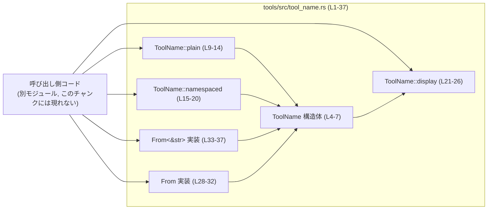
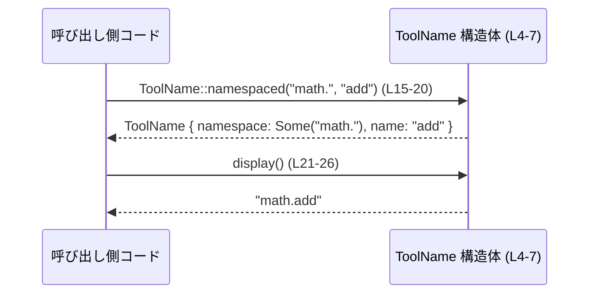

# tools/src/tool_name.rs コード解説

## 0. ざっくり一言

`ToolName` 構造体と、その生成・表示用のユーティリティを定義するファイルです。  
「ツール名」と任意の「名前空間」を別々に保持しつつ、表示用の文字列に結合する役割を持ちます（`tools/src/tool_name.rs:L1-7`）。

---

## 1. このモジュールの役割

### 1.1 概要

- ドキュコメントにあるとおり、この型は「呼び出し可能なツールを識別し、モデルが提供した名前空間の分割を保持する」ために存在します（`tools/src/tool_name.rs:L1-2`）。
- `ToolName` はツールの「名前」と「名前空間」を別々のフィールドとして持ちます（`name`, `namespace`; `tools/src/tool_name.rs:L4-6`）。
- 名前空間付き/なしのインスタンス生成、表示用の文字列生成、`String` / `&str` からの変換を提供します（`tools/src/tool_name.rs:L8-37`）。

### 1.2 アーキテクチャ内での位置づけ

このファイルだけから分かる範囲では、`ToolName` は「ツール実行ロジック」や「モデルとのインタフェース層」から呼び出される単純な値オブジェクトです。他モジュールとの具体的な依存関係はこのチャンクには現れません。

代表的な関係を、想定される呼び出し側を含めて図示します。



### 1.3 設計上のポイント

- **値オブジェクト指向**  
  - `ToolName` はツール識別子のための小さなデータ構造で、状態を変更するメソッドはなく、イミュータブルに扱われます（`tools/src/tool_name.rs:L4-7, L21-26`）。
- **生成パターンの明確化**  
  - 名前空間なし: `ToolName::plain` / `From<String>` / `From<&str>` が利用され、`namespace` は常に `None` になります（`tools/src/tool_name.rs:L9-14, L28-37`）。
  - 名前空間あり: `ToolName::namespaced` を通じて、`namespace: Some(...)` として格納されます（`tools/src/tool_name.rs:L15-20`）。
- **表示ロジックの単純さ**  
  - `display` は `namespace` が `Some` の場合に `namespace + name` を単純に連結し、`None` の場合は `name` をそのまま返します（`tools/src/tool_name.rs:L21-26`）。区切り文字（`.` など）は呼び出し側が `namespace` に含める前提です。
- **Rust の安全性・並行性**  
  - フィールドは `String` と `Option<String>` のみで、内部可変性（`Cell` / `RefCell` 等）は使っていません（`tools/src/tool_name.rs:L4-6`）。  
    これらは `Send` / `Sync` な型であり、`ToolName` も自動的にスレッド安全に共有可能な値オブジェクトになります。
- **標準トレイトの実装**  
  - `Clone, Debug, Eq, Hash, PartialEq` を derive しており（`tools/src/tool_name.rs:L3`）、ハッシュマップのキーや、比較・ログ出力などにそのまま使いやすい設計です。

---

## 2. 主要な機能一覧

このファイルが提供する主な機能は次のとおりです。

- ツール名と名前空間を分離して保持する構造体 `ToolName`（`tools/src/tool_name.rs:L4-7`）
- 名前空間なしの `ToolName` を生成する `ToolName::plain`（`tools/src/tool_name.rs:L9-14`）
- 名前空間つきの `ToolName` を生成する `ToolName::namespaced`（`tools/src/tool_name.rs:L15-20`）
- `ToolName` を表示用文字列に変換する `ToolName::display`（`tools/src/tool_name.rs:L21-26`）
- `String` / `&str` から名前空間なしの `ToolName` を生成する `From` 実装（`tools/src/tool_name.rs:L28-37`）

### 2.1 コンポーネント一覧（インベントリー）

| 種別 | 名前 | 公開性 | 役割 / 用途 | 定義位置 |
|------|------|--------|-------------|----------|
| 構造体 | `ToolName` | `pub` | ツールの名前と任意の名前空間を保持する値オブジェクト | `tools/src/tool_name.rs:L4-7` |
| 関数（関連） | `ToolName::plain` | `pub` | 名前空間なしの `ToolName` を生成するコンストラクタ的メソッド | `tools/src/tool_name.rs:L9-14` |
| 関数（関連） | `ToolName::namespaced` | `pub` | 名前空間と名前を個別に受け取り、`ToolName` を生成する | `tools/src/tool_name.rs:L15-20` |
| 関数（関連） | `ToolName::display` | `pub` | `namespace` と `name` を結合した表示文字列を返す | `tools/src/tool_name.rs:L21-26` |
| 関数（トレイト） | `<ToolName as From<String>>::from` | (トレイト経由で公開) | `String` を `ToolName`（名前空間なし）に変換する | `tools/src/tool_name.rs:L28-32` |
| 関数（トレイト） | `<ToolName as From<&str>>::from` | (トレイト経由で公開) | `&str` を `ToolName`（名前空間なし）に変換する | `tools/src/tool_name.rs:L33-37` |

---

## 3. 公開 API と詳細解説

### 3.1 型一覧（構造体）

| 名前 | 種別 | 役割 / 用途 | 主なフィールド | 定義位置 |
|------|------|-------------|----------------|----------|
| `ToolName` | 構造体 | ツール識別子（名前＋任意の名前空間）を保持する値オブジェクト | `name: String`, `namespace: Option<String>` | `tools/src/tool_name.rs:L4-7` |

---

### 3.2 関数詳細

以下、特に重要な 5 関数について詳細を説明します。

#### `ToolName::plain(name: impl Into<String>) -> Self`

**概要**

- 名前空間なしのツール名を表す `ToolName` を生成します（`tools/src/tool_name.rs:L9-14`）。
- `namespace` フィールドは常に `None` になります。

**引数**

| 引数名 | 型 | 説明 |
|--------|----|------|
| `name` | `impl Into<String>` | ツールの名前。`String` でも `&str` でも渡せます（`tools/src/tool_name.rs:L9`）。 |

**戻り値**

- `ToolName`  
  - `name` フィールドに引数の文字列を格納し、`namespace` は `None` のインスタンスを返します（`tools/src/tool_name.rs:L10-13`）。

**内部処理の流れ**

1. `name.into()` によって、引数を `String` に変換します（`tools/src/tool_name.rs:L11`）。
2. `Self { name: ..., namespace: None }` というリテラルで `ToolName` を生成します（`tools/src/tool_name.rs:L10-13`）。

**Examples（使用例）**

```rust
use crate::tools::ToolName; // 実際のパスはプロジェクト構成に依存（このチャンクには現れない）

// &str から名前空間なしの ToolName を作る
let t1 = ToolName::plain("translate"); // name = "translate", namespace = None

// String からも作成可能
let name_str = String::from("summarize");
let t2 = ToolName::plain(name_str);    // name = "summarize", namespace = None
```

**Errors / Panics**

- この関数内で明示的にエラーを返したり `panic!` を呼び出す処理はありません（`tools/src/tool_name.rs:L9-14`）。
- 実質的な失敗可能性は、`String` のメモリ確保に失敗するような極端な状況のみです（標準ライブラリに委ねられる）。

**Edge cases（エッジケース）**

- 空文字列 `""` を渡した場合も、そのまま `name` に格納されます（`tools/src/tool_name.rs:L11`）。
- 非 UTF-8 データは `String` にできないため、引数として渡す前に UTF-8 である必要があります（これは `String` / `&str` の仕様です）。

**使用上の注意点**

- `From<String>` / `From<&str>` も内部で `ToolName::plain` を呼び出すため（`tools/src/tool_name.rs:L30, L35`）、  
  「分解済みの名前空間＋名前」を扱いたい場合は `plain` ではなく `namespaced` を使う必要があります。

---

#### `ToolName::namespaced(namespace: impl Into<String>, name: impl Into<String>) -> Self`

**概要**

- 名前空間と名前を個別に受け取り、それらを保持する `ToolName` を生成します（`tools/src/tool_name.rs:L15-20`）。
- 名前空間の区切り文字（例: `"tools."` のような末尾ドット）は呼び出し側が付与します。

**引数**

| 引数名 | 型 | 説明 |
|--------|----|------|
| `namespace` | `impl Into<String>` | ツールの名前空間。任意のプレフィックス文字列（`tools/src/tool_name.rs:L15`）。 |
| `name` | `impl Into<String>` | ツールの名前（`tools/src/tool_name.rs:L15`）。 |

**戻り値**

- `ToolName`  
  - `name` と `namespace: Some(...)` を持つインスタンスを返します（`tools/src/tool_name.rs:L16-19`）。

**内部処理の流れ**

1. `name.into()` により、ツール名を `String` に変換します（`tools/src/tool_name.rs:L17`）。
2. `namespace.into()` により、名前空間を `String` に変換し `Some(...)` に包みます（`tools/src/tool_name.rs:L18`）。
3. これらをフィールドに格納した `ToolName` を生成します（`tools/src/tool_name.rs:L16-19`）。

**Examples（使用例）**

```rust
use crate::tools::ToolName;

// "math." 名前空間内の "add" ツールを表現する
let add = ToolName::namespaced("math.", "add");
// add.name == "add"
// add.namespace == Some("math.".to_string())

// 区切り文字を含まない名前空間も指定可能
let t = ToolName::namespaced("math", "add");
// display() の結果は "mathadd" になる（区切りは自分で含める必要がある）
```

**Errors / Panics**

- 内部で明示的な `panic!` やエラー返却はありません（`tools/src/tool_name.rs:L15-20`）。
- メモリ割り当てが不可能な極端な状況を除き、通常の利用で失敗要因はありません。

**Edge cases（エッジケース）**

- `namespace` に空文字列 `""` を渡すと、`Some("")` として保持されます。  
  - `display()` では `"" + name` となるため、`namespace: None` の場合との違いは表示上はありません（`tools/src/tool_name.rs:L21-24`）。
- `namespace` に区切り文字（`.` や `/` など）を含めるかどうかは呼び出し側次第です。`display()` は追加しません。

**使用上の注意点**

- 名前空間と名前を区切る文字（`.` など）が必要な場合は、必ず `namespace` 引数に含める設計です。
- 後から区切りを変えたい場合は、`ToolName::display` の仕様変更が必要になるため、既存の利用箇所への影響に注意が必要です。

---

#### `ToolName::display(&self) -> String`

**概要**

- `ToolName` の `namespace` と `name` を表示用の文字列に変換します（`tools/src/tool_name.rs:L21-26`）。
- `namespace` が存在する場合は先頭に付与し、存在しない場合は `name` のみを返します。

**引数**

| 引数名 | 型 | 説明 |
|--------|----|------|
| `&self` | `&ToolName` | 表示対象となる `ToolName` インスタンス（`tools/src/tool_name.rs:L21`）。 |

**戻り値**

- `String`  
  - `namespace` が `Some(ns)` の場合: `ns + name` の文字列（`tools/src/tool_name.rs:L22-23`）。
  - `namespace` が `None` の場合: `name` のクローン（`tools/src/tool_name.rs:L24`）。

**内部処理の流れ**

1. `match &self.namespace` で `namespace` の有無を判定します（`tools/src/tool_name.rs:L22`）。
2. `Some(namespace)` の場合  
   - `format!("{namespace}{}", self.name)` により、`namespace` と `name` を連結した `String` を作成します（`tools/src/tool_name.rs:L23`）。
3. `None` の場合  
   - `self.name.clone()` を返し、`name` のコピーを作成します（`tools/src/tool_name.rs:L24`）。

**Examples（使用例）**

```rust
use crate::tools::ToolName;

// 名前空間なし
let t1 = ToolName::plain("translate");
assert_eq!(t1.display(), "translate".to_string());

// 名前空間あり（区切り文字を含めた名前空間）
let t2 = ToolName::namespaced("math.", "add");
assert_eq!(t2.display(), "math.add".to_string());

// 区切り文字なしの名前空間
let t3 = ToolName::namespaced("math", "add");
assert_eq!(t3.display(), "mathadd".to_string()); // "math" と "add" がそのまま結合される
```

**Errors / Panics**

- `format!` と `String::clone` 以外の処理はなく、明示的な `panic!` はありません（`tools/src/tool_name.rs:L21-26`）。
- 通常の条件ではエラーやパニックは発生しません。

**Edge cases（エッジケース）**

- `namespace` が `Some("")` の場合: 結果は `"".to_string() + name` となり、`namespace == None` の場合と同じ見た目になります。
- `name` が空文字列の場合: `namespace` のみ、または空文字列がそのまま返ります。
- `namespace` にすでに完全修飾名（例: `"math.add"`）を入れ、`name` に別の値を入れると、そのまま連結されます。この構造体は値の意味を検証しません。

**使用上の注意点**

- 表示形式は非常に単純で、区切り文字やフォーマット（例: `"namespace::name"`）はこの関数内で決め打ちしていません。  
  そのため、「標準の表示形式」を変更したくなったとき、このメソッドの挙動変更が全利用箇所に影響します。
- `display` という名前ですが、`std::fmt::Display` トレイトは実装していません。このため `format!("{}", tool_name)` ではなく `tool_name.display()` を直接呼ぶ必要があります（コード上からは `Display` 未実装が確認できます）。

---

#### `<ToolName as From<String>>::from(name: String) -> ToolName`

**概要**

- `String` から `ToolName` への変換を提供する `From` トレイト実装です（`tools/src/tool_name.rs:L28-32`）。
- 内部的に `ToolName::plain` を呼び出し、名前空間なしの `ToolName` を生成します。

**引数**

| 引数名 | 型 | 説明 |
|--------|----|------|
| `name` | `String` | ツール名として扱う文字列（`tools/src/tool_name.rs:L29`）。 |

**戻り値**

- `ToolName`  
  - `namespace: None` の `ToolName` を返します（`ToolName::plain` に委譲、`tools/src/tool_name.rs:L30`）。

**内部処理の流れ**

1. 受け取った `String` をそのまま `ToolName::plain(name)` に渡します（`tools/src/tool_name.rs:L30`）。
2. `ToolName::plain` が `ToolName` を返します（`tools/src/tool_name.rs:L9-14`）。

**Examples（使用例）**

```rust
use crate::tools::ToolName;

// From<String> による変換
let s = String::from("translate");
let t: ToolName = s.into(); // or ToolName::from(s);
assert_eq!(t.namespace, None);
assert_eq!(t.name, "translate".to_string());
```

**Errors / Panics**

- `ToolName::plain` と同様に、明示的なエラーや `panic!` はありません（`tools/src/tool_name.rs:L28-32`）。

**Edge cases（エッジケース）**

- `"ns.tool"` のように名前空間と名前が区切り文字で含まれている `String` を渡しても、自動で分割はされず、すべて `name` として扱われます（構造上の仕様）。

**使用上の注意点**

- 「入力文字列をパースして `namespace` と `name` を分割する」機能はありません。  
  名前空間を保持したい場合は、外部でパースした結果を `ToolName::namespaced` に渡す必要があります。

---

#### `<ToolName as From<&str>>::from(name: &str) -> ToolName`

**概要**

- `&str` から `ToolName` への変換を提供する `From` 実装です（`tools/src/tool_name.rs:L33-37`）。
- `ToolName::plain` に委譲しており、名前空間なしの `ToolName` を作ります。

**引数**

| 引数名 | 型 | 説明 |
|--------|----|------|
| `name` | `&str` | ツール名として扱う文字列スライス（`tools/src/tool_name.rs:L34`）。 |

**戻り値**

- `ToolName`  
  - `namespace: None` のインスタンスを返します（`tools/src/tool_name.rs:L35`）。

**内部処理の流れ**

1. `ToolName::plain(name)` を呼び出します（`tools/src/tool_name.rs:L35`）。
2. `plain` 内で `name.into()` により `String` に変換され、`namespace: None` の `ToolName` が生成されます（`tools/src/tool_name.rs:L9-14`）。

**Examples（使用例）**

```rust
use crate::tools::ToolName;

// &str からの変換（リテラルや borrowed string に便利）
let t: ToolName = "summarize".into(); // or ToolName::from("summarize");
assert_eq!(t.namespace, None);
assert_eq!(t.name, "summarize".to_string());
```

**Errors / Panics**

- `ToolName::plain` と同様、通常利用でのエラーやパニックはありません（`tools/src/tool_name.rs:L33-37`）。

**Edge cases（エッジケース）**

- 空文字列 `""` を渡すと `name == ""` の `ToolName` が生成されます。
- `"ns.tool"` 形式でも、自動で名前空間へ分割はされません（仕様）。

**使用上の注意点**

- 文字列リテラルから `ToolName` への変換は簡潔に書けますが、その文字列が名前空間込みの「完全修飾名」であっても、`ToolName` 側では名前空間情報としては保持されません。

---

### 3.3 その他の関数

- このファイルには、上記以外の関数やメソッドは定義されていません（`tools/src/tool_name.rs:L1-37`）。

---

## 4. データフロー

ここでは、「名前空間つきツール名を構築し、表示用の文字列に変換する」典型的なフローを示します。

1. 呼び出し側コードが、名前空間とツール名を別々の値として持つ。
2. `ToolName::namespaced` で `ToolName` を生成する。
3. 後段の処理（例: モデルへのリクエスト組み立て）で `display()` を呼び、文字列を取得する。



- このフローでは、`ToolName` は純粋なデータ変換のみを行い、副作用（入出力や状態変更）はありません。
- 並行処理の観点では、`ToolName` はイミュータブルな値オブジェクトであり、スレッド間で共有しても内部状態が変化しない構造になっています（`tools/src/tool_name.rs:L4-7`）。

---

## 5. 使い方（How to Use）

### 5.1 基本的な使用方法

`ToolName` を使ってツール識別子を管理し、表示用の文字列を取得する基本的な例です。

```rust
use crate::tools::ToolName; // 実際のパスはプロジェクト構成に依存（このチャンクには現れない）

fn main() {
    // 名前空間なしのツール名を作成する
    let translate = ToolName::plain("translate");      // name="translate", namespace=None

    // 名前空間つきのツール名を作成する
    let add = ToolName::namespaced("math.", "add");    // name="add", namespace=Some("math.")

    // 表示用の文字列を取得する
    let translate_name = translate.display();          // "translate"
    let add_name = add.display();                      // "math.add"

    println!("tool1 = {translate_name}, tool2 = {add_name}");
}
```

ポイント:

- `plain` / `namespaced` を使い分けることで、「名前空間を使うかどうか」を明確に区別できます。
- 表示用の文字列は `display()` を通じて取得し、他のコンポーネント（例: モデル API へのリクエスト）に渡すことが想定されます。

---

### 5.2 よくある使用パターン

#### パターン1: 文字列リテラルからの簡易生成

`From<&str>` 実装により、`into()` を使って簡潔に生成できます（`tools/src/tool_name.rs:L33-37`）。

```rust
use crate::tools::ToolName;

let t1: ToolName = "translate".into();        // namespace=None
let t2 = ToolName::from("summarize");         // 同じ意味
```

#### パターン2: マップのキーとして利用

`Eq` と `Hash` を derive しているため（`tools/src/tool_name.rs:L3`）、`HashMap` のキーとして利用できます。

```rust
use crate::tools::ToolName;
use std::collections::HashMap;

let mut registry: HashMap<ToolName, usize> = HashMap::new();

registry.insert(ToolName::plain("translate"), 1);
registry.insert(ToolName::namespaced("math.", "add"), 2);

// 取り出し
if let Some(id) = registry.get(&ToolName::plain("translate")) {
    println!("translate id = {id}");
}
```

#### パターン3: 名前空間を明示的に管理

呼び出し側で `namespace` と `name` を分解した状態で保持し、`ToolName` で束ねるパターンです。

```rust
use crate::tools::ToolName;

let ns = "math.";            // 区切り文字ごと名前空間として管理
let name = "add";

let tool = ToolName::namespaced(ns, name);
let full = tool.display();   // "math.add"
```

---

### 5.3 よくある間違い

#### 間違い例1: `From<&str>` が自動で名前空間を分割すると期待する

```rust
use crate::tools::ToolName;

// 間違い例: "math.add" が namespace="math.", name="add" になると期待している
let tool: ToolName = "math.add".into();

// 実際には:
// tool.namespace == None
// tool.name == "math.add"
```

**正しいパターン**

```rust
use crate::tools::ToolName;

// 自分で文字列を分割してから namespaced で構築する必要がある
let tool = ToolName::namespaced("math.", "add");
// tool.namespace == Some("math.".to_string())
// tool.name == "add".to_string()
```

#### 間違い例2: 区切り文字を `display` が追加してくれると思う

```rust
use crate::tools::ToolName;

// 間違い例: namespace="math" でも display が "math.add" を返すと期待している
let tool = ToolName::namespaced("math", "add");
assert_eq!(tool.display(), "math.add"); // 実際は "mathadd" になる
```

**正しいパターン**

```rust
let tool = ToolName::namespaced("math.", "add"); // 名前空間に "." を含める
assert_eq!(tool.display(), "math.add");
```

---

### 5.4 使用上の注意点（まとめ）

- **名前空間の分割はこの型では行わない**  
  - 入力文字列 `"math.add"` を自動的に `("math.", "add")` に分割する機能はありません。分割が必要な場合は、呼び出し側で行う前提です（`tools/src/tool_name.rs:L9-20, L28-37`）。
- **表示形式は単純な連結**  
  - `display()` は `namespace + name` または `name` のみを返すだけで、区切り文字や前後の空白などは一切制御しません（`tools/src/tool_name.rs:L21-26`）。
- **スレッド安全性**  
  - 内部状態は作成後に変更されず、`Clone` / `Eq` / `Hash` が実装されているため、スレッド間で共有してもデータ競合は発生しません（`tools/src/tool_name.rs:L3-7`）。
- **エラー処理**  
  - このファイルに定義される API はすべてエラーを返さず、`Result` 型も使っていません。異常系はほぼ OS レベルのメモリ不足のみです（`tools/src/tool_name.rs:L9-37`）。
- **セキュリティ**  
  - 外部入力をそのまま `name` / `namespace` に格納する設計です。  
    セキュリティ上の意味（例: コマンド名、識別子）を持たせる場合は、利用側でホワイトリストチェックやフィルタリングが必要になります。

---

## 6. 変更の仕方（How to Modify）

### 6.1 新しい機能を追加する場合

想定される拡張例と、それに対応する変更箇所です。

1. **文字列からのパース関数を追加したい場合**
   - 例: `"math.add"` を `namespace="math.", name="add"` に分割する。
   - 追加先: `impl ToolName` ブロックに新たな関連関数（`pub fn parse(...) -> Self` など）を追加するのが自然です（`tools/src/tool_name.rs:L8-27`）。
   - 実装では `ToolName::plain` / `ToolName::namespaced` を再利用すると挙動の一貫性を保てます。

2. **標準の表示形式を複数サポートしたい場合**
   - 例: `"math/add"` や `"math::add"` 形式など。
   - `display` メソッドとは別に、`fn format_with(&self, sep: &str) -> String` のようなメソッドを追加することが考えられます（このチャンクには未実装）。

3. **トレイト実装の追加**
   - 例: `std::fmt::Display` の実装で `display()` と同じロジックを提供する。
   - 追加先: ファイル末尾付近に `impl std::fmt::Display for ToolName { ... }` を追加する形が自然です（`tools/src/tool_name.rs:L28-37` の後など）。

### 6.2 既存の機能を変更する場合

`ToolName` の挙動を変更する際に注意すべき点です。

- **`display` の仕様変更**
  - 区切り文字やフォーマットを変更すると、`ToolName` をログやキーとして使っている箇所に影響が出ます（`tools/src/tool_name.rs:L21-26`）。
  - 特に、`Hash` / `Eq` が derive されているため、`display` を `HashMap` のキー文字列に変換して使っているコードがある場合、挙動が変わる可能性があります（利用側はこのチャンクには現れません）。
- **`From<String>` / `From<&str>` の挙動変更**
  - ここで名前空間の自動分割を行うように変更した場合、既存コードで「名前空間なし」とみなしていた文字列が、暗黙的に名前空間つきとして扱われるようになります（`tools/src/tool_name.rs:L28-37`）。
  - この変更は後方互換性への影響が大きいため、利用箇所の確認が必須です。
- **フィールド構造の変更**
  - 例: `namespace: Option<String>` を別の型に変える場合、`derive` されている各トレイト（`Clone`, `Debug`, `Eq`, `Hash`, `PartialEq`）や、`From` 実装との整合性を確認する必要があります（`tools/src/tool_name.rs:L3-7, L28-37`）。

テストについて:

- このファイル内にはテストコード（`#[cfg(test)] mod tests` 等）は存在しません（`tools/src/tool_name.rs:L1-37`）。  
  挙動変更を行う場合は、別ファイルまたは別モジュールにテストを追加する必要があります。

---

## 7. 関連ファイル

このチャンクには、他ファイルとの具体的な依存関係やモジュールパスは記述されていません。そのため、関連ファイルは不明です。

| パス | 役割 / 関係 |
|------|------------|
| 不明 | このチャンクだけでは `ToolName` をどのモジュールが使用しているか、どのファイルから再エクスポートされているかは分かりません。 |

`ToolName` 自体は汎用的な値オブジェクトであり、ツール実行機構やモデルとのインタフェース層から広く利用されることが想定されますが、その詳細はこのファイルからは読み取れません。
