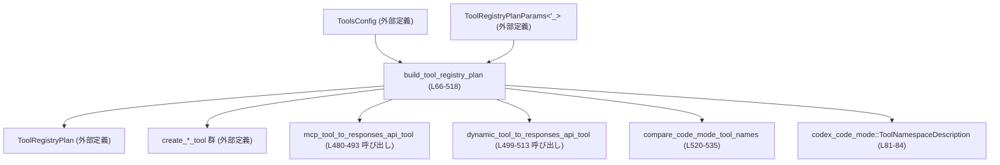
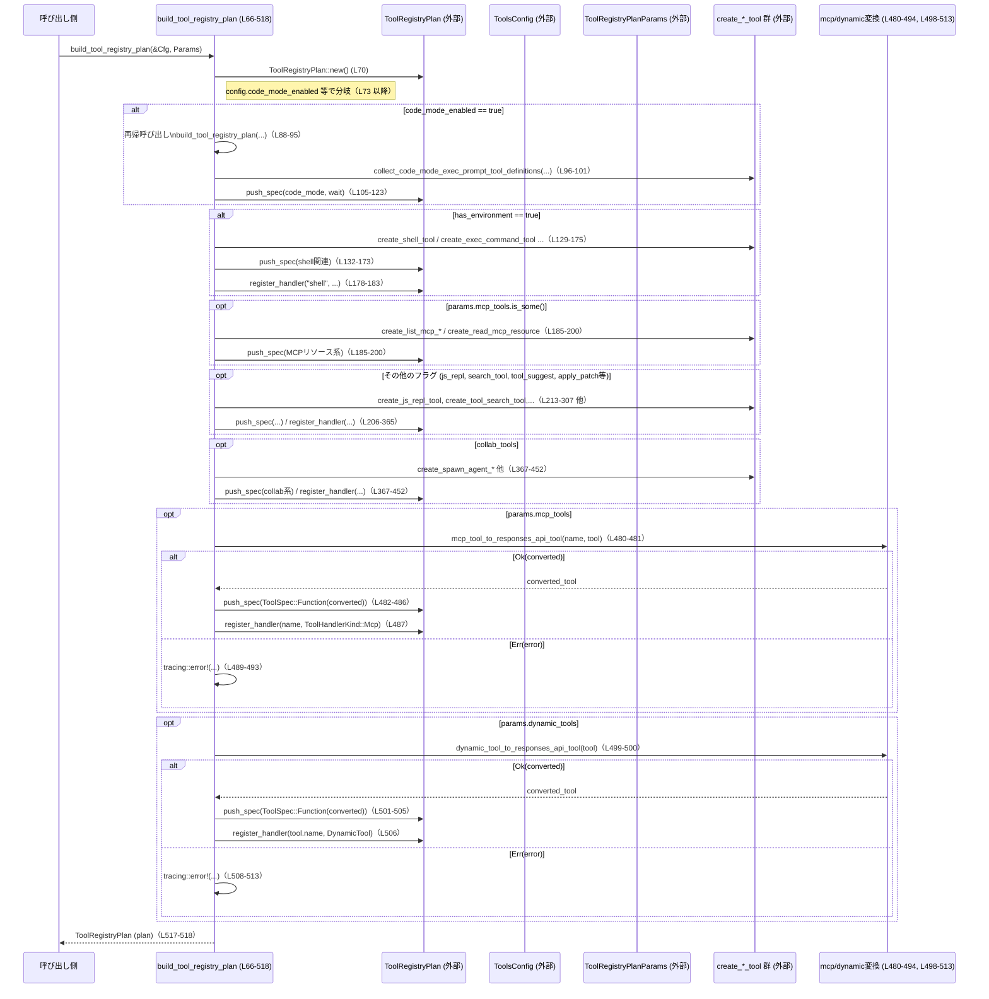

# tools/src/tool_registry_plan.rs

## 0. ざっくり一言

`ToolsConfig` と `ToolRegistryPlanParams` から、利用可能なツール群とそれぞれのハンドラー種別を決定し、`ToolRegistryPlan` を構築するモジュールです（根拠: `build_tool_registry_plan` 全体の処理内容, tools/src/tool_registry_plan.rs:L66-518）。

---

## 1. このモジュールの役割

### 1.1 概要

- このモジュールは、**各種ツール機能をどの条件で有効化するか**を集中管理し、`ToolRegistryPlan` に登録する役割を持ちます（L66-518）。
- 入力として実行環境や機能フラグを含む `ToolsConfig` と、MCP ツールや動的ツール情報を含む `ToolRegistryPlanParams` を受け取り、ツール仕様 (`ToolSpec`) とツール名→ハンドラー種別 (`ToolHandlerKind`) の対応表を構築します（L67-71, L472-488, L498-507）。
- コードモード用ツール、シェル/ファイル操作ツール、MCP/動的ツール、Web 検索や画像生成・マルチエージェントなど、多数の機能をひとつのプランにまとめます。

### 1.2 アーキテクチャ内での位置づけ

このファイルは「ツールレイヤの設定 → 実際の OpenAI/Responses API 用ツール定義」への橋渡しをしています。

- 上位から呼ばれる関数は `build_tool_registry_plan` 1つです（L66-69）。
- 内部で多くの `create_*_tool` 関数や変換関数を呼び出して、`ToolRegistryPlan` の `push_spec` / `register_handler` を行います（L105-123, L132-183, 以降全般）。
- コードモード用のソートロジックだけは、このファイル内の `compare_code_mode_tool_names` / `code_mode_namespace_name` / `code_mode_function_name` が担います（L520-553）。

主要な依存関係を Mermaid 図で表すと次のようになります。



### 1.3 設計上のポイント

コードから読み取れる設計上の特徴は次の通りです。

- **コンフィグ駆動設計**  
  - 多数の `config.*` フラグによって有効化されるツールが分岐します（例: `config.code_mode_enabled` L73, `config.has_environment` L129, `config.search_tool` L249, `config.collab_tools` L367 など）。
- **状態を持たないビルダー関数**  
  - `build_tool_registry_plan` はローカル変数 `plan` を構築して返すだけで、グローバルな可変状態は持っていません（L70, L517-518）。
- **再帰的なプラン構築（コードモード用）**  
  - コードモードが有効な場合、`for_code_mode_nested_tools()` から得た設定で同じ `build_tool_registry_plan` を再帰呼び出しし、その結果からコードモード用の実行ツール群を抽出します（L88-101）。  
    - 再帰が正しく収束するかは `for_code_mode_nested_tools` の実装次第で、このファイルには定義がありません。
- **エラーハンドリング方針**  
  - MCP ツールおよび動的ツールの変換に失敗した場合は `tracing::error!` でログを出力し、そのツールをプランに追加しない動作になっています（L480-494, L499-513）。
  - このファイル内に `panic!` や `unwrap` はなく、明示的なパニックは使っていません（`unwrap_or_default` は安全なフォールバックです, L83-84）。
- **並列実行フラグの管理**  
  - `plan.push_spec` 呼び出しごとに `supports_parallel_tool_calls` フラグを付けており、ツールごとの並列呼び出し可否を Plan に埋め込んでいます（例: L105-113, L132-138, L187-200 など）。

---

## 2. 主要な機能一覧とコンポーネントインベントリー

### 2.1 機能一覧（何をしているか）

このモジュールが提供する主な機能は次の通りです（全て `build_tool_registry_plan` の内部, L66-518）。

- コードモードツールの登録とネームスペースベースのソート（L73-127, L96-104）。
- シェル/コマンド実行系ツールの登録（`shell`, `local_shell`, `exec_command`, `shell_command`, `write_stdin` など）（L129-183）。
- MCP リソース系ツール（`list_mcp_resources`, `list_mcp_resource_templates`, `read_mcp_resource`）の登録（L185-204）。
- プラン更新ツール（`update_plan`）の登録（L206-211）。
- JS REPL とそのリセットツールの登録（L213-226）。
- ユーザー入力要求ツール（`request_user_input`）およびパーミッション要求ツールの登録（L228-247）。
- MCP ベースのツール検索機能と、`ToolSearchSource` の組み立て（L249-273）。
- ツール候補提示機能（`tool_suggest`）の登録（L275-285）。
- `apply_patch` ツール（Freeform / Function 2種）の選択的な登録（L287-307）。
- 実験的ツール (`list_dir`, `test_sync_tool`) の登録（L309-334）。
- Web 検索ツールのオプション付き生成と登録（L336-346）。
- 画像生成ツール（`image_generation` 相当）の登録（L348-354）。
- 画像表示ツール（`view_image`）の登録（L356-365）。
- 協調（マルチエージェント）系ツール（spawn / send / followup / wait / close / list）の V1/V2 分岐付き登録（L367-452）。
- エージェントジョブ系ツール（`spawn_agents_on_csv`, `report_agent_job_result`）の登録（L455-469）。
- MCP ツール一覧から Responses API 用ツールへの変換と登録（L472-496）。
- 動的ツールの Responses API 用ツールへの変換と登録（L498-515）。

### 2.2 コンポーネントインベントリー（関数・モジュール）

このファイル内で定義されている関数・モジュールの一覧です。

| 名前 | 種別 | 公開性 | 定義位置 | 役割 / 用途 |
|------|------|--------|----------|-------------|
| `build_tool_registry_plan` | 関数 | `pub` | tools/src/tool_registry_plan.rs:L66-518 | `ToolsConfig` と `ToolRegistryPlanParams` から `ToolRegistryPlan` を構築するメインエントリポイント |
| `compare_code_mode_tool_names` | 関数 | `fn` (非公開) | tools/src/tool_registry_plan.rs:L520-535 | コードモードツール名をネームスペースと関数名でソートするための比較関数 |
| `code_mode_namespace_name` | 関数 | `fn` (非公開) | tools/src/tool_registry_plan.rs:L537-544 | ツール名からネームスペース名を取得する補助関数 |
| `code_mode_function_name` | 関数 | `fn` (非公開) | tools/src/tool_registry_plan.rs:L546-553 | ネームスペース付きツール名から関数名部分を切り出す補助関数 |
| `tests` | モジュール | `mod` (テスト用, cfg(test)) | tools/src/tool_registry_plan.rs:L555-557 | `tool_registry_plan_tests.rs` にあるテスト群を読み込むテストモジュール |

外部からは `build_tool_registry_plan` のみが公開 API となります（exports=1 というメタ情報とも一致）。

---

## 3. 公開 API と詳細解説

### 3.1 型一覧（このファイルでは定義されないが重要なもの）

このファイル自身は新しい構造体や列挙体を定義していませんが、重要な外部型を多用しています。役割はコードの使われ方から分かる範囲のみ記載します。

| 名前 | 種別 | 定義場所（このファイルからの参照） | 役割 / 用途（このファイルから分かる範囲） |
|------|------|-------------------------------------|--------------------------------------------|
| `ToolsConfig` | 構造体 | `use crate::ToolsConfig;` (L14) | 全体のツール有効化フラグや詳細設定を含む設定。多くの `config.*` フィールドで条件分岐に使用される。 |
| `ToolRegistryPlan` | 構造体 | `use crate::ToolRegistryPlan;` (L10) | `new` / `push_spec` / `register_handler` メソッドを持つ、ツール定義とハンドラー登録の集合。 |
| `ToolRegistryPlanParams<'_>` | 構造体 | `use crate::ToolRegistryPlanParams;` (L11) | MCP ツール群や動的ツール、ツール名前空間など追加情報を保持。`build_tool_registry_plan` の第2引数として使用（L68）。 |
| `ToolHandlerKind` | 列挙体 | `use crate::ToolHandlerKind;` (L8) | それぞれのツールがどのハンドラー種別に紐付くか (`Shell`, `Mcp`, `DynamicTool` など) を表す。 |
| `ToolSpec` | 列挙体? | `use crate::ToolSpec;` (L13) | `ToolSpec::Function(converted_tool)` のように使われ、Responses API 用ツール定義をラップしている（L482-483, L501-502）。 |
| `ToolSearchSource` | 構造体 | `use crate::ToolSearchSource;` (L12) | MCP ベースのツール検索用に、サーバ名・コネクタ名などをまとめる型（L252-258）。 |
| `CommandToolOptions` / `ShellToolOptions` / `SpawnAgentToolOptions` / `ViewImageToolOptions` / `WebSearchToolOptions` | 構造体 | 各 `use crate::...` 宣言 (L1, L3-4, L15-16, L62-63) | 個々のツール生成時に渡されるオプション。フィールドの中身はこのファイルには定義がありませんが、`exec_permission_approvals_enabled` や `web_search_mode` などの設定がここに含まれます。 |

これらの型の詳細なフィールド定義や意味は、このチャンクには現れません。

---

### 3.2 関数詳細

#### `build_tool_registry_plan(config: &ToolsConfig, params: ToolRegistryPlanParams<'_>) -> ToolRegistryPlan`

**概要**

- ツール関連の設定 (`ToolsConfig`) とパラメータ (`ToolRegistryPlanParams`) をもとに、利用可能な全ツールとそのハンドラー種別を含む `ToolRegistryPlan` を構築して返します（L66-71, L517-518）。
- 多数の `config.*` フラグや `params.*` の有無に応じて、個別の `create_*_tool` 関数や変換関数を呼び出し、`plan.push_spec` と `plan.register_handler` を行います。

**引数**

| 引数名 | 型 | 説明 |
|--------|----|------|
| `config` | `&ToolsConfig` | ツール機能を有効/無効にするフラグや詳細設定を含む設定。例: `code_mode_enabled`, `has_environment`, `search_tool`, `collab_tools` などで分岐（L73, L129, L249, L367）。 |
| `params` | `ToolRegistryPlanParams<'_>` | MCP ツールや動的ツール、ツール名前空間、デフォルトエージェント種別など、プラン構築に必要な追加情報を持つパラメータ（L74-77, L249-273, L367-371, L472-476, L498）。 |

※ `ToolRegistryPlanParams` の具体的フィールド一覧はこのチャンクには現れませんが、`tool_namespaces`, `mcp_tools`, `deferred_mcp_tools`, `discoverable_tools`, `dynamic_tools`, `default_agent_type_description`, `wait_agent_timeouts` などが参照されています（L74-77, L185-186, L249-251, L275-278, L370-371, L439-440, L472-476, L498）。

**戻り値**

- `ToolRegistryPlan`  
  - 構築されたツール登録プラン。内部には、呼び出し条件を満たしたツール仕様 (`ToolSpec`) と、それに対応するハンドラー種別 (`ToolHandlerKind`) の登録情報が含まれます（根拠: `plan.push_spec` / `plan.register_handler` を繰り返したのち `plan` を返している, L70, L105-123, L132-183, L185-215, …, L517-518）。

**内部処理の流れ（アルゴリズム）**

高レベルなステップは次の通りです（L66-518）。

1. **初期化**  
   - 空の `ToolRegistryPlan` を作成し（`ToolRegistryPlan::new()`, L70）、`config.exec_permission_approvals_enabled` をローカル変数に退避します（L71）。

2. **コードモード用ツールの構築（`config.code_mode_enabled` が true の場合）**（L73-127）  
   - `params.tool_namespaces` から `BTreeMap<String, ToolNamespaceDescription>` を構築（L74-87）。
   - `config.for_code_mode_nested_tools()` からネストされた設定を取得し、再帰的に `build_tool_registry_plan` を呼び出して `nested_plan` を得ます（L88-95）。  
   - `nested_plan.specs` からコードモード用の実行ツール定義を抽出し、`compare_code_mode_tool_names` でソート（L96-104）。  
   - コードモード実行ツール本体（`create_code_mode_tool`）と `WAIT` ツール（`create_wait_tool`）を `plan.push_spec` し、`ToolHandlerKind::CodeModeExecute` / `ToolHandlerKind::CodeModeWait` としてハンドラー登録（L105-123）。

3. **シェル/コマンド系ツールの構築（`config.has_environment` が true の場合）**（L129-183）  
   - `config.shell_type` に応じて、`create_shell_tool` / `create_local_shell_tool` / `create_exec_command_tool` + `create_write_stdin_tool` / `create_shell_command_tool` のいずれかを `plan.push_spec`（L129-175）。  
   - シェル種別が `Disabled` 以外なら、`"shell"`, `"container.exec"`, `"local_shell"`, `"shell_command"` などのツール名を `ToolHandlerKind::Shell` / `ShellCommand` に紐付けて登録（L178-183）。

4. **MCP リソース系ツールの登録（`params.mcp_tools.is_some()` の場合）**（L185-204）  
   - MCP の有無に応じて、`list_mcp_resources`/`list_mcp_resource_templates`/`read_mcp_resource` ツールを追加し、`ToolHandlerKind::McpResource` でハンドラー登録（L185-203）。

5. **計画更新と JS REPL 関連の登録**  
   - 常に `update_plan` ツールを追加し、`ToolHandlerKind::Plan` で登録（L206-211）。  
   - JS REPL が有効なら、`js_repl` と `js_repl_reset` を追加し、それぞれ専用の `ToolHandlerKind` に登録（L213-226）。

6. **ユーザー入力/パーミッション要求ツール**  
   - `request_user_input` ツールを生成して追加し、`REQUEST_USER_INPUT_TOOL_NAME` を `ToolHandlerKind::RequestUserInput` に紐付け（L228-238）。  
   - `config.request_permissions_tool_enabled` が true なら `request_permissions` ツールも追加し、`ToolHandlerKind::RequestPermissions` に登録（L240-247）。

7. **ツール検索 / ツールサジェスト**  
   - `config.search_tool` かつ `params.deferred_mcp_tools` が Some のとき、`ToolSearchSource` の配列を構築して `create_tool_search_tool` を追加、`TOOL_SEARCH_TOOL_NAME` を `ToolHandlerKind::ToolSearch` に登録（L249-266）。  
   - `config.tool_suggest` かつ `params.discoverable_tools` が Some かつ非空のとき、`create_tool_suggest_tool` を追加し、`ToolHandlerKind::ToolSuggest` に登録（L275-285）。

8. **apply_patch と実験的ツール**  
   - `config.apply_patch_tool_type` が Some であれば、`ApplyPatchToolType` に応じて `create_apply_patch_freeform_tool` か `create_apply_patch_json_tool` のどちらかを追加し、`"apply_patch"` を `ToolHandlerKind::ApplyPatch` に登録（L287-307）。  
   - `config.experimental_supported_tools` に `"list_dir"` / `"test_sync_tool"` が含まれていれば、それぞれのツールを追加し、対応するハンドラー種別で登録（L309-334）。

9. **Web 検索・画像生成・画像表示**  
   - `create_web_search_tool(WebSearchToolOptions { ... })` の結果が Some であれば、そのツールを追加（L336-346）。  
   - `config.image_gen_tool` が true なら `create_image_generation_tool("png")` を追加（L348-354）。  
   - `config.has_environment` が true なら、`create_view_image_tool(ViewImageToolOptions { ... })` を追加し、`"view_image"` を `ToolHandlerKind::ViewImage` で登録（L356-365）。

10. **協調ツール（マルチエージェント）**  
    - `config.collab_tools` が true の場合、`config.multi_agent_v2` に応じて V2 か V1 の API を選択（L367-452）。  
    - 両ケースとも `agent_type_description(config, params.default_agent_type_description)` を使い、`SpawnAgentToolOptions` に含めて `spawn_agent` ツールを構築（L370-378, L414-423）。  
    - V2：`spawn_agent`, `send_message`, `followup_task`, `wait_agent`, `close_agent`, `list_agents` を追加し、各ツール名を V2 系の `ToolHandlerKind` に登録（L372-412）。  
    - V1：`spawn_agent`, `send_input`, `resume_agent`, `wait_agent`, `close_agent` を追加し、V1 系の `ToolHandlerKind` に登録（L417-451）。

11. **エージェントジョブ系ツール**  
    - `config.agent_jobs_tools` が true のとき、`spawn_agents_on_csv` を追加し、`ToolHandlerKind::AgentJobs` に登録（L455-461）。  
    - さらに `config.agent_jobs_worker_tools` が true のとき、`report_agent_job_result` も追加し、同じく `ToolHandlerKind::AgentJobs` に登録（L462-469）。

12. **MCP ツールと動的ツールの変換・登録**  
    - `params.mcp_tools` が Some の場合、(name, &McpTool) のタプル配列をソートしてからループし、`mcp_tool_to_responses_api_tool(name.clone(), tool)` で変換（L472-481）。  
        - `Ok(converted_tool)` の場合は `ToolSpec::Function(converted_tool)` として追加し、`name` を `ToolHandlerKind::Mcp` に登録（L482-488）。  
        - `Err(error)` の場合は `tracing::error!` を出力するのみ（L489-493）。  
    - `params.dynamic_tools` についても同様に `dynamic_tool_to_responses_api_tool(tool)` で変換し、成功したツールのみ `ToolSpec::Function` として追加、ツール名を `ToolHandlerKind::DynamicTool` に登録。失敗した場合はログ出力のみ（L498-507, L508-513）。

13. **プランの返却**  
    - 最終的に構築済みの `plan` を返します（L517-518）。

**Examples（使用例）**

`ToolsConfig` や `ToolRegistryPlanParams` のフィールド定義がこのチャンクにないため、擬似的な例になりますが、呼び出しの形は次のようになります。

```rust
use crate::{ToolsConfig, ToolRegistryPlanParams};
use crate::tool_registry_plan::build_tool_registry_plan;

fn setup_tools() {
    // 設定はこのファイルには定義がないため擬似的な初期化です
    let config = ToolsConfig {
        // code_mode_enabled: true,
        // has_environment: true,
        // など、必要なフィールドを設定
    };

    let params = ToolRegistryPlanParams {
        // mcp_tools: Some(...),
        // dynamic_tools: vec![...],
        // などを設定
        ..Default::default() // 実際に Default が実装されているかはこのチャンクからは不明
    };

    let plan = build_tool_registry_plan(&config, params);

    // plan は以降の処理（LLM へのツール一覧提供など）で利用される想定です
}
```

このコードはこのチャンクだけではコンパイルできませんが、「どのように `build_tool_registry_plan` を呼び出して `ToolRegistryPlan` を取得するか」のパターンを示しています。

**Errors / Panics**

- `build_tool_registry_plan` 自体は `Result` ではなく `ToolRegistryPlan` を直接返しており、この関数の戻り値としてエラーを明示的に返すことはありません（L66-69, L517-518）。
- この関数内に `panic!` / `unwrap` / `expect` の呼び出しは存在せず、明示的なパニックは起こしていません（`unwrap_or_default` は Option が None の場合に空文字列などにフォールバックする安全なメソッド, L83-84）。
- エラーの扱いは次の2箇所でログ出力にとどまります。
  - MCP ツール変換エラー: `mcp_tool_to_responses_api_tool` の `Err` の場合に `tracing::error!` を実行し、そのツールは Plan に追加されません（L480-494）。
  - 動的ツール変換エラー: `dynamic_tool_to_responses_api_tool` の `Err` の場合も同様に `tracing::error!` のみで、Plan から除外されます（L499-513）。
- ただし、呼び出している外部関数（`ToolRegistryPlan::new`, `push_spec`, 各 `create_*_tool` 関数など）が内部でパニックするかどうかは、このチャンクだけからは分かりません。

**Edge cases（エッジケース）**

この関数内の分岐から読み取れる代表的なエッジケースは次の通りです。

- **コードモード無効 (`config.code_mode_enabled == false`)**  
  - コードモード用のツール（`codex_code_mode::PUBLIC_TOOL_NAME`, `codex_code_mode::WAIT_TOOL_NAME`）は追加されません（L73 条件）。  
  - それ以外のツール（update_plan, shell 等）は設定に応じて追加されます。

- **環境がない (`config.has_environment == false`)**  
  - シェル／コマンド系ツール（`shell`, `local_shell`, `exec_command`, `shell_command`, `write_stdin`）は追加されません（L129 条件）。  
  - MCP ツールや `request_user_input` など、環境に依存しないツールはそのまま追加されます。  
  - `apply_patch`、`list_dir`、`view_image` など、`config.has_environment` を条件とするツールも追加されません（L287-289, L309-310, L356-357）。

- **MCP ツールが存在しない (`params.mcp_tools.is_none()`)**  
  - `list_mcp_*` や `read_mcp_resource` は追加されません（L185 条件）。  
  - `params.deferred_mcp_tools` や `params.discoverable_tools` の挙動はそれぞれ別の条件で制御されています（L249-251, L275-278）。

- **ツールサジェスト用の discoverable_tools が None または空**  
  - `create_tool_suggest_tool` は呼ばれず、`TOOL_SUGGEST_TOOL_NAME` も登録されません（L275-285）。  
  - 条件は `params.discoverable_tools.filter(|tools| !tools.is_empty())` なので、Some かつ非空の場合のみ有効になります（L275-278）。

- **apply_patch のツールタイプが設定されていない (`config.apply_patch_tool_type == None`)**  
  - `apply_patch` ツールは追加されず、ハンドラー登録も行われません（L287 条件）。

- **MCP / 動的ツール変換の失敗**  
  - 該当ツールは Plan に含まれず、ログだけが出力されます（L480-494, L498-513）。  
  - 同名ツールが一部だけ登録される場合や、特定のツールだけ欠落する可能性がありますが、それが想定どおりかどうかはこのチャンクからは判断できません。

**使用上の注意点**

- `build_tool_registry_plan` は設定の組み合わせによって大きく挙動が変わるため、**どのフラグがどのツールに影響するか**を事前に把握する必要があります（例: `has_environment`, `js_repl_enabled`, `collab_tools`, `multi_agent_v2` 等, L129-183, L213-226, L367-452）。
- コードモード用の再帰呼び出しがあるため、`ToolsConfig::for_code_mode_nested_tools` が返す設定がどのような値になるか（特に `code_mode_enabled` をどう設定するか）が重要です（L88-95）。  
  - この関数の実装はこのチャンクには現れないため、無限再帰が起こらない保証はこのファイルだけからは分かりません。
- MCP ツールや動的ツール変換に失敗した場合、Plan から黙って除外されるため、**期待しているツールが Plan に含まれているかどうか**は、別途検証が必要です（L480-494, L498-513）。

---

#### `compare_code_mode_tool_names(left_name: &str, right_name: &str, namespace_descriptions: &BTreeMap<String, codex_code_mode::ToolNamespaceDescription>) -> std::cmp::Ordering`

**概要**

- コードモード用ツールの名前をソートするための比較関数です（L520-535）。
- ツール名に紐づく「ネームスペース名」と、そのネームスペースを除いた「関数名部分」を考慮して順序を決定します。

**引数**

| 引数名 | 型 | 説明 |
|--------|----|------|
| `left_name` | `&str` | 左側（比較対象A）のツール名文字列（L521）。 |
| `right_name` | `&str` | 右側（比較対象B）のツール名文字列（L522）。 |
| `namespace_descriptions` | `&BTreeMap<String, ToolNamespaceDescription>` | ツール名→ネームスペースの情報を持つマップ。`code_mode_namespace_name` の内部で利用され、ネームスペース名取得に使われます（L523, L537-544）。 |

**戻り値**

- `std::cmp::Ordering`  
  - `Ordering::Less` / `Equal` / `Greater` のいずれかで、`left_name` が `right_name` より前か後ろかを示します（L524-535）。

**内部処理の流れ**

1. `code_mode_namespace_name` でそれぞれのツール名に対応するネームスペース名（`Option<&str>`）を取得します（L525-526）。
2. まず **ネームスペース名の `Option` 同士** を `cmp` で比較します（L528-529）。
3. ネームスペース名が同じ（またはどちらも None）だった場合は、`code_mode_function_name` でネームスペースを取り除いた関数名部分を比較します（L530-533）。
4. それでも同じ場合は、元のフルのツール名 (`left_name` / `right_name`) を文字列として比較します（L534-535）。

**Examples（使用例）**

この関数は通常 `sort_by` の比較関数として使われます（実際にそう使われている箇所, L102-104）。

```rust
let mut names = vec!["ns1__foo".to_string(), "ns1__bar".to_string()];

// namespace_descriptions は "ns1__foo" などの名前に対するネームスペース情報を持つ BTreeMap。
// 実際の構築は build_tool_registry_plan 内の L74-87 と同様。

names.sort_by(|a, b| compare_code_mode_tool_names(a, b, &namespace_descriptions));
```

`namespace_descriptions` や実際のツール名の規約は、このチャンクには完全には現れませんが、`code_mode_function_name` の実装から `"namespace__function"` のような形式が想定されていることが分かります（L546-552）。

**Errors / Panics**

- この関数内には `panic!` や `unwrap` はなく、標準ライブラリの比較メソッドのみを用いているため、このコード片から直接読み取れるパニック条件はありません（L520-535）。
- `namespace_descriptions` に存在しないキーについては `code_mode_namespace_name` が `None` を返す設計のため、その場合も安全に比較できます（L537-544）。

**Edge cases**

- `namespace_descriptions` に `left_name` / `right_name` が存在しない場合  
  - `code_mode_namespace_name` が `None` を返し、`Option::cmp` の規則に従って比較されます（L525-529）。  
  - `None` と `Some` の比較順序は Rust 標準ライブラリに依存しますが、この関数内では明示的な変更はしていません。
- ツール名にネームスペース接頭辞がついていない場合  
  - `code_mode_function_name` がそのままの文字列を返すため、単純な文字列比較になります（L546-553）。

**使用上の注意点**

- ツール名と `namespace_descriptions` のキーの一致が前提です。どのような規約でキーが管理されるかはこのチャンクには現れませんが、一致しないと `None` として扱われます。
- `"namespace__function"` 形式の名前付けに依存したロジックのため、形式が変わる場合は `code_mode_function_name` を含めた見直しが必要になります（L546-552）。

---

#### `code_mode_namespace_name(name: &str, namespace_descriptions: &BTreeMap<String, ToolNamespaceDescription>) -> Option<&str>`

**概要**

- ツール名から、そのツールが属するコードモード用ネームスペース名（`&str`）を取得する関数です（L537-544）。
- 実際には `namespace_descriptions` から `name` をキーに値を取得し、その `name` フィールドを返します。

**引数**

| 引数名 | 型 | 説明 |
|--------|----|------|
| `name` | `&str` | ツール名（キーとして使われる文字列, L538）。 |
| `namespace_descriptions` | `&BTreeMap<String, ToolNamespaceDescription>` | ツールごとのネームスペース情報を保持するマップ（L539）。 |

**戻り値**

- `Option<&str>`  
  - `Some(namespace_name)` : 対応するエントリが存在する場合、その `ToolNamespaceDescription.name.as_str()` を返します（L541-543）。  
  - `None` : 該当エントリが存在しない場合。

**内部処理**

- `namespace_descriptions.get(name)` を呼び、見つかった場合は `namespace_description.name.as_str()` を返します（L541-543）。

**使用例**

`compare_code_mode_tool_names` の中で使用されています（L525-526）。

---

#### `code_mode_function_name(name: &str, namespace: Option<&str>) -> &str`

**概要**

- `"namespace__function_name"` といった形式のツール名から、ネームスペース部分を除いた「関数名部分」だけを取り出すための関数です（L546-553）。

**引数**

| 引数名 | 型 | 説明 |
|--------|----|------|
| `name` | `&str` | 元のツール名文字列（L546）。 |
| `namespace` | `Option<&str>` | 該当ツール名に対応するネームスペース名（ある場合）。`code_mode_namespace_name` の戻り値を受ける想定です（L547-548）。 |

**戻り値**

- `&str`（`name` の一部または全体へのスライス）  
  - `namespace` が `Some(ns)` で、`name` が `ns` で始まり、続いて `"__"` がある場合: `"__"` より後ろのサフィックスを返します（L548-551）。  
  - それ以外の場合: `name` 全体を返します（L552-553）。

**内部処理**

1. `namespace.and_then(...)` により、`namespace` が `Some(ns)` のときのみ処理を行います（L547-548）。
2. `name.strip_prefix(namespace)` で接頭辞を取り除き、さらに `suffix.strip_prefix("__")` で `"__"` を除去します（L549-550）。
3. 以上の条件が満たされなかった場合、`unwrap_or(name)` により元の `name` を返します（L552-553）。

**使用例**

`compare_code_mode_tool_names` 内で、ツール名から関数名部分を取り出して比較するのに使われています（L530-533）。

**Edge cases**

- `namespace` が `None` の場合  
  - そのまま `name` が返されます（L552-553）。
- ツール名が `namespace` で始まらない場合  
  - `strip_prefix(namespace)` が `None` を返し、結果として `name` そのものが返されます（L549-553）。
- `"__"` 区切りが存在しない場合  
  - `suffix.strip_prefix("__")` が `None` を返し、やはり `name` 全体が返されます（L549-553）。

---

### 3.3 その他の関数・モジュール

| 名前 | 役割（1 行） | 定義位置 |
|------|--------------|----------|
| `mod tests;` | `tool_registry_plan_tests.rs` にある単体テストを読み込むテストモジュール。内容はこのチャンクには現れません。 | tools/src/tool_registry_plan.rs:L555-557 |

---

## 4. データフロー

ここでは、典型的なシナリオとして「環境あり・コードモード有効・MCP ツールと動的ツールも存在する」場合のデータフローを示します。

### 4.1 処理の要点

- 呼び出し側は `ToolsConfig` と `ToolRegistryPlanParams` を用意して `build_tool_registry_plan` を呼び出します（L66-69）。
- 関数内部では、設定に応じて `create_*_tool` や変換関数を呼び出しながら、`ToolRegistryPlan` に `push_spec` / `register_handler` を順次行います（L70-517）。
- MCP ツールや動的ツールは、変換に成功したものだけが Plan に組み込まれます（L480-488, L498-507）。

### 4.2 シーケンス図

以下のシーケンス図は、主な流れを簡略化したものです。



この図は、実行時にどのようなデータがどこからどこへ渡るかの大枠を示しています。実際のツール仕様の中身は `create_*_tool` や変換関数の実装に依存しており、このチャンクには現れません。

---

## 5. 使い方（How to Use）

### 5.1 基本的な使用方法

`build_tool_registry_plan` を使ってツールプランを構築し、それを上位ロジック（例えばエージェントのツール呼び出し管理）に渡す形になります。

```rust
use crate::{ToolsConfig, ToolRegistryPlanParams};
use crate::tool_registry_plan::build_tool_registry_plan;

fn main() {
    // ツール設定を構築する
    let config = ToolsConfig {
        // この構造体のフィールドは、このファイルには定義がないため擬似的な例です
        // has_environment: true,
        // code_mode_enabled: true,
        // search_tool: true,
        // collab_tools: true,
        // ...
    };

    // プラン構築用のパラメータを用意する
    let params = ToolRegistryPlanParams {
        // mcp_tools: Some(...),
        // dynamic_tools: vec![...],
        // ここでも具体的なフィールドは不明のため省略
        ..Default::default() // 実際に Default 実装があるかはこのチャンクからは不明
    };

    // プランを構築する
    let plan = build_tool_registry_plan(&config, params);

    // 以降、plan を LLM へのツール一覧として渡したり、
    // ツール呼び出しのルーティングに利用することが想定されます
}
```

### 5.2 よくある使用パターン（想定されるもの）

コードから読み取れる範囲で、次のような使用パターンが想定されます。

- **開発環境（シェルあり・コードモード有効）**  
  - `config.has_environment = true`  
  - `config.code_mode_enabled = true`  
  - `config.shell_type = ConfigShellToolType::UnifiedExec` など  
  → シェル実行、コードモードツール、パッチ適用、Web 検索などをまとめて有効にした Plan が生成されます（L73-127, L129-183, L287-307, L336-346）。

- **本番環境（安全側に絞る）**  
  - `config.has_environment = false` や `config.apply_patch_tool_type = None`  
  → シェル/ファイル操作や apply_patch が無効化され、MCP や web_search のみを利用する Plan になることが考えられます。  
  実際にどのフラグをどう設定するかはこのチャンクには現れませんが、分岐条件からそのような構成が可能なことが分かります。

### 5.3 よくある間違い（起こりそうな誤用）

コードから推測される「起こりうる誤用」と、その挙動は次のようになります。

```rust
// 誤り例: config.mcp_tools にも params.mcp_tools にも何も入っていないのに、
// MCP リソース系ツールの存在を前提にロジックを書く

let params = ToolRegistryPlanParams {
    mcp_tools: None,   // L185 条件により MCP リソース系ツールは追加されない
    // ...
};

let plan = build_tool_registry_plan(&config, params);

// ここで "list_mcp_resources" ツールが必ず存在すると仮定すると問題になる可能性
```

正しくは、Plan からツールを利用する側で「存在チェック」を行うか、`ToolsConfig` / `ToolRegistryPlanParams` において MCP 関連を適切に設定する必要があります。

```rust
// 正しい例の一案: MCP ツールが存在する場合のみ関連ロジックを有効にする

if params.mcp_tools.is_some() {
    let plan = build_tool_registry_plan(&config, params);
    // この場合のみ MCP リソース系ツールが含まれると期待できる
}
```

※ 実際にどのように Plan からツールを取得する API があるかは、このチャンクには現れません。

### 5.4 使用上の注意点（まとめ）

- `build_tool_registry_plan` の結果に依存するコードを書く際は、**設定フラグの組み合わせによってツールが存在しない可能性**を常に考慮する必要があります（L73-75, L129-131, L185-187, L249-251, L275-278, L287-289, L309-313, L336-340, L367-369, L455-463）。
- MCP ツールおよび動的ツールは、変換に失敗すると Plan から静かに除外されるため、**ログ (`tracing::error!`) の監視**が前提になります（L480-494, L498-513）。
- 並列実行フラグ（`supports_parallel_tool_calls`）がツールごとに異なるので、Plan を解釈する側ではこのフラグに応じて並列実行を制御することが想定されます（L105-113, L132-138, L187-200, L315-333 など）。  
  ただし、このフラグの意味や実際の利用方法は `ToolRegistryPlan` 側の実装に依存し、このチャンクには現れません。
- このファイルには `unsafe` ブロックが一切無く、Rust のメモリ安全性は標準のコンパイル時チェックに委ねられています（全行確認済み）。

---

## 6. 変更の仕方（How to Modify）

### 6.1 新しい機能を追加する場合

このモジュールに新しいツール機能を追加する際の、典型的な入口と手順は次のようになります。

1. **ツール生成関数の実装**  
   - まず別ファイル（例: `create_my_new_tool.rs` など）で `create_my_new_tool` のような関数を実装し、このファイルから `use crate::create_my_new_tool;` でインポートします。  
   - その具体的な実装はこのチャンクには現れませんが、既存の `create_*_tool` と同様のパターンになると考えられます。

2. **設定フラグの追加（必要なら）**  
   - `ToolsConfig` に新しい機能フラグ（例: `my_new_tool_enabled`）を追加し、このファイルで条件分岐を行えるようにします。`ToolsConfig` の定義はこのチャンクにはありません。

3. **`build_tool_registry_plan` 内に条件付きブロックを追加**  
   - `config.my_new_tool_enabled` のような条件のもとで、`plan.push_spec(create_my_new_tool(...), supports_parallel, config.code_mode_enabled)` を追加します。  
   - ツール名に応じた `plan.register_handler("my_new_tool", ToolHandlerKind::XXX)` の登録も行います（既存パターン参照: L178-183, L201-203, L224-225 など）。

4. **テストの追加**  
   - `tool_registry_plan_tests.rs`（L555-557）に新機能用のテストを追加し、期待通りに Plan にツールが含まれるか、ハンドラー種別が正しいかを検証します。  
   - テストファイルの中身はこのチャンクには現れません。

### 6.2 既存の機能を変更する場合

既存機能を変更する場合に注意すべき点を整理します。

- **影響範囲の確認**  
  - `build_tool_registry_plan` は全ツールに対する単一の集約ポイントです。この関数の条件分岐や `plan.register_handler` のツール名を変更すると、多数の呼び出し元に影響する可能性があります（L66-518 全体）。  
  - 特にツール名の変更は、外部からツールを参照するコード（LLM 側のツール名など）に直結するため、慎重に扱う必要があります。

- **前提条件・契約の維持**  
  - 例えば `config.has_environment` が false の場合にシェル系ツールを追加しない、というような「安全側」の条件が複数存在します（L129-131, L287-289, L309-310, L356-357）。  
  - これらの条件を緩めたり削除したりする場合、セキュリティや環境依存性に関する前提が変わる可能性があります。

- **ログ出力とエラー扱いの変更**  
  - 現在は MCP/動的ツール変換エラーをログだけで処理しています（L480-494, L498-513）。  
  - もしこの挙動を変えて（例えばエラーを集約して返すなど）、`build_tool_registry_plan` の戻り値型を変更する場合は、呼び出し側のエラーハンドリングも変更が必要になります。

- **テストの更新**  
  - `mod tests;`（L555-557）で読み込まれるテスト群が、Plan の期待構造を前提にしている可能性があります。  
  - 条件分岐やツール名、ハンドラー種別を変更した際は、テストの確認・更新が必要です。

---

## 7. 関連ファイル

このモジュールと密接に関係する（とコードから読み取れる）ファイル・モジュールをまとめます。実際のパスは `use crate::...` のみからは完全には分かりませんが、役割を併記します。

| パス / モジュール名 | 役割 / 関係 |
|---------------------|------------|
| `crate::ToolRegistryPlan` | ツール仕様とハンドラー登録を保持するプラン本体。`new` / `push_spec` / `register_handler` を提供し、本モジュールから集中して呼び出されます（L70, L105-123, 以降多数）。 |
| `crate::ToolsConfig` | 各種フラグ（`code_mode_enabled`, `has_environment`, `js_repl_enabled`, `collab_tools`, `apply_patch_tool_type` など）を含む設定構造体。Plan 構築時のほぼ全ての分岐の基礎となります（L71-73, L129-131, L213-214, L287-289, L309-313, L336-340, L367-369, L455-463）。 |
| `crate::ToolRegistryPlanParams` | MCP ツールや動的ツール、ツール名前空間、エージェント種別情報などを保持する構造体。`build_tool_registry_plan` の第2引数であり、Plan に含まれるツールの種類を決めます（L68, L74-77, L185-186, L249-251, L275-278, L370-371, L439-440, L472-476, L498）。 |
| `crate::create_*_tool` 群 | 各種ツールの `ToolSpec` を生成する関数群。`create_shell_tool`, `create_code_mode_tool`, `create_tool_search_tool` など、多数のツールがここから生成されます（L20-56, L105-123, L132-138, 以降多数）。このチャンクには実装は現れません。 |
| `crate::tool_registry_plan_types::agent_type_description` | マルチエージェント系ツールの説明文を組み立てる関数として使われています（L61, L370-371, L414-415）。 |
| `codex_code_mode` モジュール | コードモード関連の型 (`ToolNamespaceDescription`) とツール名定数 (`PUBLIC_TOOL_NAME`, `WAIT_TOOL_NAME`) を提供します（L81-82, L115, L124）。 |
| `codex_protocol::openai_models::ApplyPatchToolType` | `apply_patch` ツールの実装種別（Freeform / Function）を表す列挙型で、Plan 構築時にどちらのツールを登録するかを決めます（L62, L287-305）。 |
| `rmcp::model::Tool` | MCP ツールのモデル型。`params.mcp_tools` 内部の型として使用され、Responses API 用ツールへの変換対象になります（L64, L472-480）。 |
| `tool_registry_plan_tests.rs` | `#[path = "tool_registry_plan_tests.rs"]` で指定されるテストファイル。`mod tests;` により読み込まれ、本モジュールの挙動を検証していると考えられますが、内容はこのチャンクには現れません（L555-557）。 |

以上が、このファイルに関する客観的な構造・挙動の整理です。このチャンクに現れない構造体や関数の詳細な仕様については、別ファイルやドキュメントを参照する必要があります。
