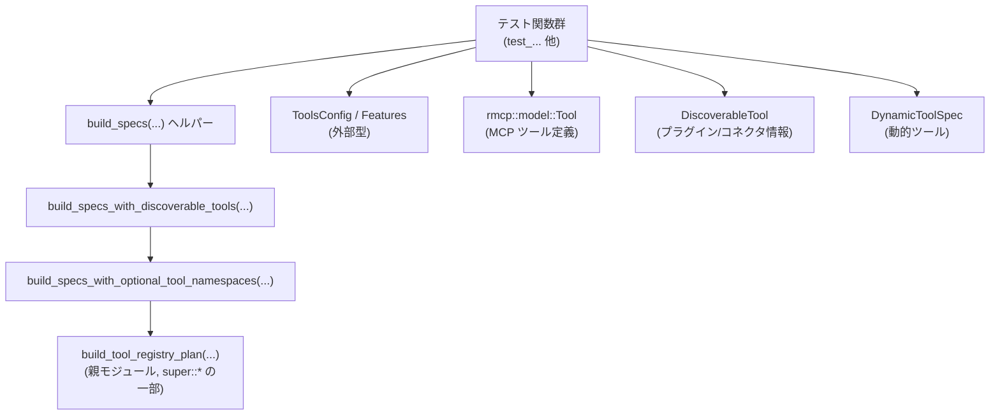
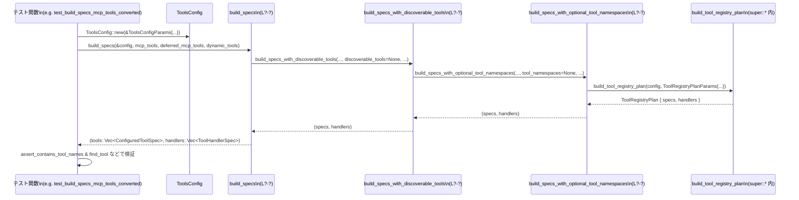

# tools/src/tool_registry_plan_tests.rs

## 0. ざっくり一言

このファイルは、`build_tool_registry_plan` と `ToolsConfig` の組み合わせから生成される **ツール仕様一覧とハンドラ一覧** が、各種機能フラグ・モデル能力・環境条件に応じて期待どおりになることを検証するテストと、そのためのヘルパー関数を集めたモジュールです。

> 注: 行番号情報は与えられていないため、本回答では位置を `tools/src/tool_registry_plan_tests.rs:L?‑?` のように「?」付きで示します。

---

## 1. このモジュールの役割

### 1.1 概要

このモジュールは、次の問題を扱います。

- **問題**: モデル機能や各種 Feature フラグに応じて登録されるツール群が複雑であり、仕様の破壊的変更を検出しづらい。
- **機能**: `build_tool_registry_plan` に対してさまざまな設定を与え、  
  生成された `ConfiguredToolSpec` と `ToolHandlerSpec` を検査する多数のテストを提供します。

これにより、以下が保証されます。

- 特定の Feature フラグを有効/無効にしたときに **どのツールが現れ、どれが消えるか**。
- ツールごとの **JSON Schema や説明文（特に Code Mode 用 TypeScript 宣言）が期待どおりか**。
- MCP ツール・検索ツール・提案ツールなどの **派生ツール仕様** が正しく構成されているか。

### 1.2 アーキテクチャ内での位置づけ

このファイルはテスト専用であり、「本体実装」ではなく **`build_tool_registry_plan` の振る舞いをブラックボックス的に検証する層** です。

依存関係（このファイル視点）を簡略化すると次のようになります。



- `use super::*;` により、このテストは同一モジュール階層にある本体（おそらく `tool_registry_plan.rs`）のすべての公開要素を利用します。
- 実際のツール定義やレジストリ構築ロジックは **親モジュール側** にあり、このファイルはそれを呼び出して結果を検証します。

### 1.3 設計上のポイント

コードから読み取れる設計上の特徴は次のとおりです。

- **Feature フラグ駆動のテスト構成**  
  - `codex_features::Features` を用い、`Feature::UnifiedExec`, `Feature::Collab`, `Feature::ToolSearch` などを有効/無効にしながら、ツールセットの変化を確認しています。
- **ModelInfo 駆動の条件分岐**  
  - `ModelInfo` の `supports_search_tool`, `input_modalities`, `supports_image_detail_original` などの能力フラグに応じたツール登録を検証します。
- **環境依存ツールの明示的な排除テスト**  
  - `ToolsConfig::with_has_environment(false)` を使って「環境無し」条件を作り、シェル・FS・REPL などのツールが落ちることを確認します。
- **JSON Schema ベースの厳密な比較**  
  - MCP ツール入力/出力の変換では、`JsonSchema` 構造全体を構築して `assert_eq!` しており、フィールド構造の逸脱を検出します。
- **Code Mode 用 TypeScript 宣言のスナップショットテスト**  
  - `description` に埋め込まれた TypeScript の `declare const tools: { ... }` 文字列を丸ごと比較することで、コード生成の仕様を固定化しています。
- **安全性・エラー・並行性**  
  - このファイルには `unsafe` やスレッド処理は存在せず、全てシングルスレッドのテストです。
  - 失敗はすべて `assert!`/`assert_eq!`/`panic!` による **テスト失敗としてのパニック** で表現されます。

---

## 2. 主要な機能一覧

このモジュールが検証している主要な機能を、役割レベルでまとめます。

- **ツールセット全体の完全一致検証**  
  - ツール名集合と各ツールの仕様 (`ToolSpec`) を、期待するセットと一括比較します。
- **Collab / MultiAgentV2 / SpawnCsv まわりのツール組合せ検証**  
  - `spawn_agent`, `send_input` / `send_message`, `followup_task`, `wait_agent`, `close_agent`, `list_agents`, `resume_agent`, `spawn_agents_on_csv` などの有無・パラメータ形状を確認します。
- **環境依存ツールの有無検証**  
  - 環境が無効な場合に `exec_command`, `write_stdin`, `js_repl`, `apply_patch`, `list_dir`, `view_image` が登録されないことを確認します。
- **画像生成・Web 検索・ビューア系ツールの設定検証**  
  - `image_generation` ツールの存在条件、`web_search` ツールの `external_web_access`/フィルタ/コンテンツタイプ設定、`view_image` の detail 引数の有無などを検証します。
- **MCP（Model Context Protocol）ツールの変換・並び順検証**  
  - `rmcp::model::Tool` から `ToolSpec::Function(ResponsesApiTool)` への変換とソート順（名前順）を検査します。
- **MCP リソース系ツールの条件付き登録検証**  
  - MCP サーバがない場合に `list_mcp_resources` 等が隠れること、ある場合に現れることを検証します。
- **`tool_search` / `tool_suggest` などメタツールの条件検証**  
  - モデル能力・Feature フラグ・discoverable ツール群に基づいて、ツールの登録有無と説明文内容を厳密に検査します。
- **Code Mode 向け説明文と型サンプルの検証**  
  - Code Mode / Code Mode Only / UnifiedExec の組み合わせに応じた、`exec`/MCP ツール/組み込みツールの TypeScript 宣言文字列を検証します。

### 2.1 コンポーネント一覧（関数インベントリ）

> 位置はすべて `tools/src/tool_registry_plan_tests.rs:L?‑?` と表記します（正確な行番号はこのチャンクからは取得できません）。

#### テスト関数

| 関数名 | 役割 / 検証内容 | 定義位置 |
|--------|----------------|----------|
| `test_full_toolset_specs_for_gpt5_codex_unified_exec_web_search` | GPT‑5 Codex + UnifiedExec + Live Web Search 時のツールセットと各ツール仕様の完全一致を検証 | tools/src/tool_registry_plan_tests.rs:L?‑? |
| `test_build_specs_collab_tools_enabled` | `Feature::Collab` 有効時のコラボレーションツール構成（v1）と spawn_agent パラメータ形状を検証 | L?‑? |
| `test_build_specs_multi_agent_v2_uses_task_names_and_hides_resume` | `Feature::MultiAgentV2` 有効時のコラボツール集合と spawn_agent/send_message/followup_task/wait_agent/list_agents のパラメータ/出力 schema を検証 | L?‑? |
| `test_build_specs_enable_fanout_enables_agent_jobs_and_collab_tools` | `Feature::SpawnCsv` により `spawn_agents_on_csv` とコラボツールが有効になることを検証 | L?‑? |
| `view_image_tool_omits_detail_without_original_detail_feature` | 画像 detail 機能フラグなしでもモデルが original detail をサポートする場合に、`view_image` パラメータから `detail` が除外されることを検証 | L?‑? |
| `view_image_tool_includes_detail_with_original_detail_feature` | `Feature::ImageDetailOriginal` 有効時に `detail` プロパティが含まれ、その説明文内容を検証 | L?‑? |
| `disabled_environment_omits_environment_backed_tools` | `has_environment = false` で環境依存ツール（exec, stdin, js_repl, apply_patch, list_dir, view_image）がすべて消えることを検証 | L?‑? |
| `test_build_specs_agent_job_worker_tools_enabled` | Agent Job ワーカー（`SessionSource::SubAgent`）かつ SpawnCsv + Sqlite 時のツール集合（`report_agent_job_result` 等）を検証 | L?‑? |
| `request_user_input_description_reflects_default_mode_feature_flag` | `Feature::DefaultModeRequestUserInput` の有無で request_user_input ツール仕様が変わることを検証 | L?‑? |
| `request_permissions_requires_feature_flag` | `Feature::RequestPermissionsTool` がないときは `request_permissions` ツールが登録されないこと、あるときは期待仕様で登録されることを検証 | L?‑? |
| `request_permissions_tool_is_independent_from_additional_permissions` | `Feature::ExecPermissionApprovals` だけでは `request_permissions` ツールが登録されないことを検証 | L?‑? |
| `js_repl_requires_feature_flag` | `Feature::JsRepl` 無効時に js_repl/js_repl_reset が登録されないことを検証 | L?‑? |
| `js_repl_enabled_adds_tools` | `Feature::JsRepl` 有効時に js_repl/js_repl_reset が追加されることを検証 | L?‑? |
| `image_generation_tools_require_feature_and_supported_model` | ImageGeneration feature とモデルの input_modalities の組み合わせに応じて image_generation ツールの有無・仕様を検証 | L?‑? |
| `web_search_mode_cached_sets_external_web_access_false` | WebSearchMode::Cached 時に `external_web_access: Some(false)` となることを検証 | L?‑? |
| `web_search_mode_live_sets_external_web_access_true` | WebSearchMode::Live 時に `external_web_access: Some(true)` となることを検証 | L?‑? |
| `web_search_config_is_forwarded_to_tool_spec` | WebSearchConfig の filters/user_location/search_context_size が ToolSpec::WebSearch に正しく転送されることを検証 | L?‑? |
| `web_search_tool_type_text_and_image_sets_search_content_types` | `WebSearchToolType::TextAndImage` の場合に `search_content_types = ["text","image"]` になることを検証 | L?‑? |
| `mcp_resource_tools_are_hidden_without_mcp_servers` | MCP サーバ未設定時に MCP リソース系ツールが登録されないことを検証 | L?‑? |
| `mcp_resource_tools_are_included_when_mcp_servers_are_present` | MCP サーバが存在すると MCP リソース系ツールが追加されることを検証 | L?‑? |
| `test_parallel_support_flags` | （ignore）exec_command/write_stdin の `supports_parallel_tool_calls` フラグを検証 | L?‑? |
| `test_test_model_info_includes_sync_tool` | ModelInfo.experimental_supported_tools に含まれるツール名がそのまま登録されることを検証 | L?‑? |
| `test_build_specs_mcp_tools_converted` | 単一 MCP ツールが期待される JsonSchema/ToolSpec に変換されることを検証 | L?‑? |
| `test_build_specs_mcp_tools_sorted_by_name` | MCP ツールが名前順にソートされて登録されることを検証 | L?‑? |
| `search_tool_description_lists_each_mcp_source_once` | `tool_search` の description に MCP ソースごとの説明が一意に列挙されること、および対応する ToolHandler が登録されることを検証 | L?‑? |
| `search_tool_requires_model_capability_and_feature_flag` | supports_search_tool と Feature::ToolSearch の両方が揃ったときのみ `tool_search` が登録されることを検証 | L?‑? |
| `tool_suggest_is_not_registered_without_feature_flag` | Feature::ToolSuggest が無効なとき `tool_suggest` が登録されないことを検証 | L?‑? |
| `tool_suggest_can_be_registered_without_search_tool` | モデルが search_tool をサポートしていなくても Feature::ToolSuggest などが有効なら `tool_suggest` が登録されることを検証 | L?‑? |
| `tool_suggest_description_lists_discoverable_tools` | `tool_suggest` の description に discoverable connectors/plugins の情報が正しく埋め込まれ、必須パラメータが正しいことを検証 | L?‑? |
| `code_mode_augments_mcp_tool_descriptions_with_namespaced_sample` | CodeMode + CodeModeOnly + UnifiedExec 時に MCP ツール description に TypeScript exec 宣言が付加されることを検証 | L?‑? |
| `code_mode_preserves_nullable_and_literal_mcp_input_shapes` | MCP 入力 schema の anyOf/null/enum/const 等が TypeScript 宣言に正確に反映されることを検証 | L?‑? |
| `code_mode_augments_builtin_tool_descriptions_with_typed_sample` | view_image など組み込みツールの description に型付き exec 宣言が付加されることを検証 | L?‑? |
| `code_mode_only_exec_description_includes_full_nested_tool_details` | CodeModeOnly 時の `exec` freeform ツール description にネストツール概要が含まれることを検証 | L?‑? |
| `code_mode_exec_description_omits_nested_tool_details_when_not_code_mode_only` | CodeMode だが CodeModeOnly でない場合は `exec` description からネストツール詳細を省くことを検証 | L?‑? |
| `code_mode_augments_mcp_tool_descriptions_with_structured_output_sample` | 出力 schema を持つ MCP ツールに対し、`CallToolResult<{ ... }>` 形式の TS 型が description に含まれることを検証 | L?‑? |

#### ヘルパー関数・ユーティリティ

| 関数名 | 役割 / 用途 | 定義位置 |
|--------|------------|----------|
| `model_info()` | テスト用の基本 `ModelInfo` を JSON から構築 | L?‑? |
| `search_capable_model_info()` | `supports_search_tool = true` にした `ModelInfo` を返す | L?‑? |
| `build_specs(...)` | `build_specs_with_discoverable_tools` の薄いラッパー。discoverable_tools を None に固定 | L?‑? |
| `build_specs_with_discoverable_tools(...)` | discoverable_tools を明示パラメータに追加しつつ `build_specs_with_optional_tool_namespaces` を呼び出すラッパー | L?‑? |
| `build_specs_with_optional_tool_namespaces(...)` | `build_tool_registry_plan` を呼び出し、`(Vec<ConfiguredToolSpec>, Vec<ToolHandlerSpec>)` を返す中核ラッパー | L?‑? |
| `mcp_tool(...)` | テスト用の `rmcp::model::Tool` インスタンスを構築 | L?‑? |
| `discoverable_connector(...)` | `AppInfo` から `DiscoverableTool::Connector` を作るヘルパー | L?‑? |
| `deferred_mcp_tool(...)` | `ToolRegistryPlanDeferredTool` 構造体を初期化するヘルパー | L?‑? |
| `assert_contains_tool_names(...)` | `ConfiguredToolSpec` 配列が重複なしで、指定ツール名をすべて含むことを検証 | L?‑? |
| `assert_lacks_tool_name(...)` | 指定ツール名が `ConfiguredToolSpec` 配列に含まれないことを検証 | L?‑? |
| `request_user_input_tool_spec(...)` | request_user_input ツール仕様 (`ToolSpec`) を生成する薄いラッパー | L?‑? |
| `spawn_agent_tool_options(...)` | `SpawnAgentToolOptions` を `ToolsConfig` から構築 | L?‑? |
| `wait_agent_timeout_options()` | 待機時間に関する既定値を `WaitAgentTimeoutOptions` として返す | L?‑? |
| `find_tool(...)` | 名前で `ConfiguredToolSpec` を検索し、見つからなければ panic するテスト用ヘルパー | L?‑? |
| `expect_object_schema(...)` | `JsonSchema` が object 型であることを検査し、properties と required への参照を返す | L?‑? |
| `expect_string_description(...)` | `JsonSchema` が string 型かつ description を持つことを検査して description を返す | L?‑? |
| `strip_descriptions_schema(...)` | `JsonSchema` の description（およびネスト先の description）を再帰的に削除 | L?‑? |
| `strip_descriptions_tool(...)` | `ToolSpec` に含まれる `JsonSchema` から description を削除。テスト比較時に説明文差分を無視するために使用 | L?‑? |

---

## 3. 公開 API と詳細解説

このファイル自身には `pub` な関数や型はありませんが、テストや他のテストファイルから再利用されそうなヘルパー関数を **API 的観点** で解説します。

### 3.1 型一覧

このファイル内で新たに定義される構造体・列挙体はありません（すべて外部クレートまたは親モジュールからのインポートです）。

主に使用している外部型（定義は他ファイル）:

| 名前 | 種別 | 役割 / 用途 |
|------|------|-------------|
| `ToolsConfig` | 構造体 | モデル情報・Feature フラグ・環境情報からツール登録設定を表現 |
| `ConfiguredToolSpec` | 構造体 | 1 つのツールの名前と仕様 (`ToolSpec`) を束ねる |
| `ToolSpec` | enum | 具体的なツール種別（Function/Freeform/WebSearch/ImageGeneration 等）の仕様 |
| `ToolHandlerSpec` | 構造体 | ツール呼び出し時にどのハンドラが使われるかを表現 |
| `ToolRegistryPlanDeferredTool<'a>` | 構造体 | MCP 等の遅延ロードツールのメタ情報を保持 |
| `JsonSchema` | 構造体 | ツール引数や出力の JSON Schema 表現 |
| `Features` / `Feature` | 構造体 / enum | 機能フラグ群とその個別フラグ |
| `ModelInfo` | 構造体 | モデル能力とメタデータ |
| `DiscoverableTool` | enum | コネクタやプラグインなど、インストール/有効化候補のツール |
| `DynamicToolSpec` | 構造体 | 実行時に動的に提供されるツール定義 |

### 3.2 関数詳細（選定 7 件）

#### `build_specs<'a>(config: &ToolsConfig, mcp_tools: Option<HashMap<String, rmcp::model::Tool>>, deferred_mcp_tools: Option<Vec<ToolRegistryPlanDeferredTool<'a>>>, dynamic_tools: &[DynamicToolSpec]) -> (Vec<ConfiguredToolSpec>, Vec<ToolHandlerSpec>)`

**概要**

- MCP ツール・遅延 MCP ツール・動的ツールを含め、`ToolsConfig` から **最終的なツール仕様一覧とハンドラ一覧** を構築するためのテスト用ラッパーです。
- `build_specs_with_discoverable_tools` を呼び出し、discoverable_tools を常に `None` にします。

**引数**

| 引数名 | 型 | 説明 |
|--------|----|------|
| `config` | `&ToolsConfig` | ツール登録に関する設定（モデル・Feature・環境など） |
| `mcp_tools` | `Option<HashMap<String, rmcp::model::Tool>>` | 即時利用可能な MCP ツール群（サーバ名付きキー） |
| `deferred_mcp_tools` | `Option<Vec<ToolRegistryPlanDeferredTool<'a>>>` | 遅延ロード対象の MCP ツール定義リスト |
| `dynamic_tools` | `&[DynamicToolSpec]` | 動的ツール定義の配列 |

**戻り値**

- `(Vec<ConfiguredToolSpec>, Vec<ToolHandlerSpec>)`  
  - `ConfiguredToolSpec`: 登録されたすべてのツール仕様。  
  - `ToolHandlerSpec`: それぞれのツールに対応するハンドラ定義。

**内部処理の流れ**

1. そのままの引数に `discoverable_tools: None` を付け加えて  
   `build_specs_with_discoverable_tools(config, mcp_tools, deferred_mcp_tools, None, dynamic_tools)` を呼び出す。
2. 戻り値 `(specs, handlers)` をそのまま返す。

**Examples（使用例）**

```rust
// ToolsConfig と Features を用意する
let model_info = model_info(); // このファイル内のヘルパー
let features = Features::with_defaults();
let available_models = Vec::new();

let config = ToolsConfig::new(&ToolsConfigParams {
    model_info: &model_info,
    available_models: &available_models,
    features: &features,
    image_generation_tool_auth_allowed: true,
    web_search_mode: Some(WebSearchMode::Cached),
    session_source: SessionSource::Cli,
    sandbox_policy: &SandboxPolicy::DangerFullAccess,
    windows_sandbox_level: WindowsSandboxLevel::Disabled,
});

// MCP ツールなし・遅延 MCP なし・動的ツールなしでツール一覧を構築
let (tools, handlers) = build_specs(&config, None, None, &[]);
assert!(!tools.is_empty());
```

**Errors / Panics**

- この関数自体は `panic!` を直接起こしませんが、内部で呼び出す `build_tool_registry_plan` が `Result` ではなくパニックする実装であれば、そのパニックがテスト失敗として表に出ます（実際の挙動は親モジュール実装に依存します）。

**Edge cases（エッジケース）**

- `mcp_tools`/`deferred_mcp_tools`/`dynamic_tools` が空でも問題なく動作します（テストコードからそう呼び出されています）。
- `config` が特定のツールを一切許可しない設定の場合、`tools` が空になりうることがあります。

**使用上の注意点**

- 実アプリケーションから直接呼び出す想定ではなく、**テスト専用のユーティリティ** です。
- discoverable_tools を利用したい場合は、この関数ではなく `build_specs_with_discoverable_tools` を使う必要があります。

---

#### `build_specs_with_discoverable_tools<'a>(config: &ToolsConfig, mcp_tools: Option<HashMap<String, rmcp::model::Tool>>, deferred_mcp_tools: Option<Vec<ToolRegistryPlanDeferredTool<'a>>>, discoverable_tools: Option<Vec<DiscoverableTool>>, dynamic_tools: &[DynamicToolSpec]) -> (Vec<ConfiguredToolSpec>, Vec<ToolHandlerSpec>)`

**概要**

- discoverable connectors/plugins を含めたすべての入力を取り、`build_specs_with_optional_tool_namespaces` に渡すラッパーです。
- `tool_namespaces` を常に `None` にする点だけが `build_specs_with_optional_tool_namespaces` との違いです。

**引数**

| 引数名 | 型 | 説明 |
|--------|----|------|
| `config` | `&ToolsConfig` | ツール登録設定 |
| `mcp_tools` | `Option<HashMap<String, rmcp::model::Tool>>` | MCP ツール群 |
| `deferred_mcp_tools` | `Option<Vec<ToolRegistryPlanDeferredTool<'a>>>` | 遅延 MCP ツール |
| `discoverable_tools` | `Option<Vec<DiscoverableTool>>` | サーバやアプリから取得した discoverable connectors/plugins 一覧 |
| `dynamic_tools` | `&[DynamicToolSpec]` | 動的ツール群 |

**戻り値**

- `build_specs` と同じです。

**内部処理の流れ**

1. 引数をそのまま `build_specs_with_optional_tool_namespaces` に渡し、`tool_namespaces: None` を追加する。
2. 戻り値 `(specs, handlers)` を返す。

**Examples（使用例）**

```rust
let (tools, _) = build_specs_with_discoverable_tools(
    &config,
    None,                // MCP ツールなし
    None,                // 遅延 MCP なし
    Some(vec![
        discoverable_connector(
            "connector_1",
            "Google Calendar",
            "Plan events and schedules.",
        ),
    ]),
    &[],
);
assert_contains_tool_names(&tools, &[TOOL_SUGGEST_TOOL_NAME]);
```

**Errors / Panics**

- この関数自体はパニックしませんが、下流の `build_tool_registry_plan` に依存します。

**Edge cases**

- `discoverable_tools` が `None` または空ベクタでも正常に動作します（`tool_suggest` のテストで明示的に利用）。
- MCP ツールと discoverable ツールを同時に渡した場合、両方を説明に統合するロジックは親モジュール側に存在し、本関数はそれを阻害しません。

**使用上の注意点**

- tool namespace を明示的に制御したい場合は、更に下層の `build_specs_with_optional_tool_namespaces` を使う必要があります。

---

#### `build_specs_with_optional_tool_namespaces<'a>(config: &ToolsConfig, mcp_tools: Option<HashMap<String, rmcp::model::Tool>>, deferred_mcp_tools: Option<Vec<ToolRegistryPlanDeferredTool<'a>>>, tool_namespaces: Option<HashMap<String, ToolNamespace>>, discoverable_tools: Option<Vec<DiscoverableTool>>, dynamic_tools: &[DynamicToolSpec]) -> (Vec<ConfiguredToolSpec>, Vec<ToolHandlerSpec>)`

**概要**

- このファイル内での **中核的な橋渡し関数** です。
- さまざまな入力（MCP ツール、ツール名前空間、discoverable ツール、動的ツール）をまとめて `build_tool_registry_plan` に渡し、返ってきた `plan.specs` と `plan.handlers` をテスト側に渡します。

**引数**

| 引数名 | 型 | 説明 |
|--------|----|------|
| `config` | `&ToolsConfig` | ツール構成設定 |
| `mcp_tools` | `Option<HashMap<String, rmcp::model::Tool>>` | MCP ツール定義 |
| `deferred_mcp_tools` | `Option<Vec<ToolRegistryPlanDeferredTool<'a>>>` | 遅延 MCP ツール定義 |
| `tool_namespaces` | `Option<HashMap<String, ToolNamespace>>` | ツール名前空間定義（このファイルからは `None` のみ使用） |
| `discoverable_tools` | `Option<Vec<DiscoverableTool>>` | discoverable ツール群 |
| `dynamic_tools` | `&[DynamicToolSpec]` | 動的ツール定義 |

**戻り値**

- `(Vec<ConfiguredToolSpec>, Vec<ToolHandlerSpec>)`  
  - `plan.specs` と `plan.handlers` をそのまま返したタプルです。

**内部処理の流れ**

1. `ToolRegistryPlanParams` を初期化する。フィールドは:
   - `mcp_tools: mcp_tools.as_ref()`
   - `deferred_mcp_tools: deferred_mcp_tools.as_deref()`
   - `tool_namespaces: tool_namespaces.as_ref()`
   - `discoverable_tools: discoverable_tools.as_deref()`
   - `dynamic_tools`
   - `default_agent_type_description: DEFAULT_AGENT_TYPE_DESCRIPTION`
   - `wait_agent_timeouts: wait_agent_timeout_options()`
2. `build_tool_registry_plan(config, params)` を呼び出し、`plan` を受け取る。
3. `(plan.specs, plan.handlers)` を返す。

**Examples（使用例）**

```rust
let mcp_tools = Some(HashMap::from([
    (
        "mcp__sample__echo".to_string(),
        mcp_tool(
            "echo",
            "Echo text",
            serde_json::json!({"type": "object"}),
        ),
    ),
]));

let (tools, handlers) = build_specs_with_optional_tool_namespaces(
    &config,
    mcp_tools,
    None,
    None,          // tool_namespaces
    None,          // discoverable_tools
    &[],           // dynamic_tools
);

assert_contains_tool_names(&tools, &["mcp__sample__echo"]);
assert!(!handlers.is_empty());
```

**Errors / Panics**

- この関数自体は `Result` を返さず、`build_tool_registry_plan` の戻り値をそのまま受け取っています。
- `build_tool_registry_plan` がパニックした場合には、テストも同様にパニックします。

**Edge cases**

- すべての Option 引数が `None` でも動作します（多くのテストケースでそうなっています）。
- `ToolRegistryPlanDeferredTool<'a>` は lifetime パラメータ `'a` を持ちますが、この関数は `.as_deref()` を使って `&[ToolRegistryPlanDeferredTool<'a>]` へ狭めて渡すため、`plan` に所有権として複製されたデータが保持される前提です（具体的な所有権モデルは親モジュールに依存しますが、Rust の型チェックにより不正な借用延長は防がれます）。

**使用上の注意点**

- 実プロダクションコードから直接使うかどうかはプロジェクト設計次第ですが、このファイルでは **テスト用の境界関数** として使用しています。
- `ToolRegistryPlanParams` の `default_agent_type_description` と `wait_agent_timeouts` はここで固定値を与えているため、別の値でテストしたい場合はこの関数を複製・拡張する必要があります。

---

#### `mcp_tool(name: &str, description: &str, input_schema: serde_json::Value) -> rmcp::model::Tool`

**概要**

- JSON 形式の入力 schema と簡単なメタデータから、テスト用の `rmcp::model::Tool` を生成するヘルパーです。
- MCP ツールの入力だけを定義し、出力 schema は `None` で初期化します（テストに応じて後から上書きすることがあります）。

**引数**

| 引数名 | 型 | 説明 |
|--------|----|------|
| `name` | `&str` | MCP ツール名（サーバ側の名前） |
| `description` | `&str` | ツールの説明文 |
| `input_schema` | `serde_json::Value` | ツール引数の JSON Schema（最低限の object など） |

**戻り値**

- `rmcp::model::Tool`  
  - `name`, `description`, `input_schema`, `output_schema = None` などが設定された MCP ツール定義。

**内部処理の流れ**

1. `rmcp::model::object(input_schema)` を呼び出して schema オブジェクトを作る。
2. それを `Arc::new(...)` で包み、`input_schema` フィールドに設定。
3. その他のフィールド (`title`, `output_schema`, `annotations`, など) は `None` で初期化。

**Examples（使用例）**

```rust
let tool = mcp_tool(
    "do_something",
    "Do something useful",
    serde_json::json!({
        "type": "object",
        "properties": {
            "arg": {"type": "string"},
        },
        "required": ["arg"],
    }),
);

// build_specs へ渡して ToolSpec に変換させる
let (tools, _) = build_specs(&config, Some(HashMap::from([(
    "server/do_something".to_string(),
    tool,
)])), None, &[]);

let converted = find_tool(&tools, "server/do_something");
```

**Errors / Panics**

- この関数自体はパニックしません。
- ただし `rmcp::model::object(input_schema)` が期待するフォーマットでない JSON を渡すと、そこでパニックする可能性があります（rmcp 側の実装次第）。

**Edge cases**

- `input_schema` が `{"type":"object"}` など最小限でも問題ありません（`test_build_specs_mcp_tools_sorted_by_name` のテストがその例です）。
- `description` を空文字列にしても構いませんが、後続のテストで説明文比較がある場合は注意が必要です。

**使用上の注意点**

- テスト専用のヘルパーのため、実サービス内で直接使うよりは、MCP 実装テストで使うことが想定されます。
- 出力 schema を検証したい場合は、`tool.output_schema = Some(...)` のように後から上書きしています（`code_mode_augments_mcp_tool_descriptions_with_structured_output_sample` 参照）。

---

#### `discoverable_connector(id: &str, name: &str, description: &str) -> DiscoverableTool`

**概要**

- App Store 風のコネクタ情報（`AppInfo`）から `DiscoverableTool::Connector` を生成するヘルパーです。
- `tool_suggest` や `tool_search` の説明生成テストで、インストール可能な外部サービスを表現するために使われます。

**引数**

| 引数名 | 型 | 説明 |
|--------|----|------|
| `id` | `&str` | コネクタの一意 ID |
| `name` | `&str` | コネクタ表示名 |
| `description` | `&str` | コネクタ説明文 |

**戻り値**

- `DiscoverableTool::Connector(Box<AppInfo>)`  
  - `AppInfo` には `install_url` なども組み立て済みです（`https://chatgpt.com/apps/{slug}/{id}`）。

**内部処理の流れ**

1. `slug = name.replace(' ', "-").to_lowercase()` で URL 用スラッグを生成。
2. `AppInfo` 構造体を初期化し、`id`, `name`, `description`, `install_url`, `is_accessible=false`, `is_enabled=true` 等をセット。
3. それを `Box::new` して `DiscoverableTool::Connector` に包んで返す。

**Examples（使用例）**

```rust
let connector = discoverable_connector(
    "connector_2128aebf...",
    "Google Calendar",
    "Plan events and schedules.",
);

let (tools, _) = build_specs_with_discoverable_tools(
    &config,
    None,
    None,
    Some(vec![connector]),
    &[],
);

// tool_suggest が存在し、description に "Google Calendar" が含まれることを確認
let tool_suggest = find_tool(&tools, TOOL_SUGGEST_TOOL_NAME);
```

**Errors / Panics**

- この関数自体はパニックしません。
- `name` に空文字列を渡すと slug が空になり、`install_url` がやや不自然になりますが、テストではそのようなケースは扱っていません。

**Edge cases**

- `description` を `""` にした場合、`AppInfo.description` は `Some("")` になり、description を利用する下流ロジックの挙動は設計次第です。
- `is_accessible: false` かつ `is_enabled: true` という固定値を使用しており、この意味はテストからは読み取れません。

**使用上の注意点**

- `install_url` のドメインやパス形式はハードコードされているため、実環境の URL 体系が変わるとテストも更新が必要です。
- discoverable plugin の方は `DiscoverableTool::Plugin` を直接構築しており、この関数は connector 専用です。

---

#### `assert_contains_tool_names(tools: &[ConfiguredToolSpec], expected_subset: &[&str])`

**概要**

- ツール一覧に重複がないことと、指定されたツール名がすべて含まれていることを一度にチェックするアサーション用ヘルパーです。
- 複数テストで重複チェックと存在確認を共通化しています。

**引数**

| 引数名 | 型 | 説明 |
|--------|----|------|
| `tools` | `&[ConfiguredToolSpec]` | 検査対象のツール一覧 |
| `expected_subset` | `&[&str]` | 存在を期待するツール名の配列 |

**戻り値**

- なし（`()`）。条件を満たさない場合は `assert!` によりパニックします。

**内部処理の流れ**

1. `HashSet` を用意し、`tools.iter().map(ConfiguredToolSpec::name)` で名前を列挙。
2. 既に挿入済みの名前があれば `duplicates` ベクタに追加。
3. `duplicates` が空であることを `assert!` する（重複があればテスト失敗）。
4. `expected_subset` の各要素について、`names.contains(expected)` を `assert!` する。

**Examples（使用例）**

```rust
let (tools, _) = build_specs(&config, None, None, &[]);
assert_contains_tool_names(
    &tools,
    &["spawn_agent", "send_input", "wait_agent", "close_agent"],
);
```

**Errors / Panics**

- 重複するツール名が存在すると `"duplicate tool entries detected: ..."` というメッセージでパニックします。
- 指定した `expected_subset` のいずれかが存在しない場合、`"expected tool {expected} to be present; had: {names:?}"` でパニックします。

**Edge cases**

- `expected_subset` が空配列の場合、重複チェックのみを行い、存在チェックはスキップされます。
- `tools` が空配列の場合、`expected_subset` が空でなければ必ずパニックします。

**使用上の注意点**

- このアサーションは **重複チェックも兼ねている** ため、単に「含まれているか」を調べたいだけの場合には余計な制約となる可能性があります。
- production コードで使用するとエラー処理がパニック依存になるため、テスト専用ヘルパーとして扱うのが適切です。

---

#### `assert_lacks_tool_name(tools: &[ConfiguredToolSpec], expected_absent: &str)`

**概要**

- 指定したツール名がツール一覧に存在しないことを検証するアサーション用ヘルパーです。

**引数**

| 名前 | 型 | 説明 |
|------|----|------|
| `tools` | `&[ConfiguredToolSpec]` | 検査対象ツール一覧 |
| `expected_absent` | `&str` | 存在してはならないツール名 |

**戻り値**

- なし。条件違反時はパニックします。

**内部処理の流れ**

1. `tools` から `.map(ConfiguredToolSpec::name).collect::<Vec<_>>()` で名前一覧を作成。
2. `names.contains(&expected_absent)` が `false` であることを `assert!` する。

**Examples（使用例）**

```rust
assert_lacks_tool_name(&tools, "js_repl");
assert_lacks_tool_name(&tools, "js_repl_reset");
```

**Errors / Panics**

- `expected_absent` が実際には含まれている場合、`"expected tool {expected_absent} to be absent; had: {names:?}"` でパニックします。

**Edge cases**

- `tools` が空配列の場合は常に成功します。

**使用上の注意点**

- 存在チェックしか行わないため、重複チェックは別途必要な場合があります。

---

#### `find_tool<'a>(tools: &'a [ConfiguredToolSpec], expected_name: &str) -> &'a ConfiguredToolSpec`

**概要**

- ツール一覧から指定名のツールを検索し、見つからなければ即座にパニックするヘルパーです。
- その後のテストで `tool.spec` や `tool.name()` を詳細に検査するための前段階として使われます。

**引数**

| 引数名 | 型 | 説明 |
|--------|----|------|
| `tools` | `&[ConfiguredToolSpec]` | 検索対象ツール一覧 |
| `expected_name` | `&str` | 探したいツール名 |

**戻り値**

- `&ConfiguredToolSpec`  
  - ツール名が一致した最初の要素への参照。見つからない場合はパニック。

**内部処理の流れ**

1. `tools.iter().find(|tool| tool.name() == expected_name)` で線形検索。
2. `unwrap_or_else(|| panic!(...))` で、見つからなければ `"expected tool {expected_name}"` メッセージとともにパニック。

**Examples（使用例）**

```rust
let view_image = find_tool(&tools, VIEW_IMAGE_TOOL_NAME);
let ToolSpec::Function(ResponsesApiTool { parameters, .. }) = &view_image.spec else {
    panic!("view_image should be a function tool");
};
let (properties, _) = expect_object_schema(parameters);
assert!(properties.contains_key("path"));
```

**Errors / Panics**

- 指定名のツールが存在しない場合にパニックします。

**Edge cases**

- 同じ名前のツールが複数存在する場合、最初に見つかったもののみが返されます。  
  （ただし、別途 `assert_contains_tool_names` で重複がないことを検証するテストが多くあります。）

**使用上の注意点**

- production コードで使うと「ツールがなければアプリクラッシュ」という挙動になるため、テスト専用と考えるのが自然です。
- 複数ヒットを区別したい場合は別の検索ロジックを用意すべきです。

---

#### `expect_object_schema(schema: &JsonSchema) -> (&BTreeMap<String, JsonSchema>, Option<&Vec<String>>)`

**概要**

- 渡された `JsonSchema` が **object 型であり、properties を持っている** ことを検証し、その参照を返します。
- 主にツール引数の schema が期待どおりに構造化されているか確認するために使われます。

**引数**

| 引数名 | 型 | 説明 |
|--------|----|------|
| `schema` | `&JsonSchema` | 検査対象の schema |

**戻り値**

- `(&BTreeMap<String, JsonSchema>, Option<&Vec<String>>)`  
  - 1要素目: `properties` への参照  
  - 2要素目: `required` 配列への Option 参照

**内部処理の流れ**

1. `assert_eq!(schema.schema_type, Some(JsonSchemaType::Single(JsonSchemaPrimitiveType::Object)))` で object 型であることを検証。
2. `schema.properties.as_ref().expect("expected object properties")` から properties を取り出し参照を返す。
3. `schema.required.as_ref()` を 2要素目として返す。

**Examples（使用例）**

```rust
let ToolSpec::Function(ResponsesApiTool { parameters, .. }) = &spawn_agent.spec else {
    panic!("spawn_agent should be a function tool");
};
let (properties, required) = expect_object_schema(parameters);

assert!(properties.contains_key("task_name"));
assert_eq!(
    required,
    Some(&vec!["task_name".to_string(), "message".to_string()])
);
```

**Errors / Panics**

- `schema_type` が Object 以外の場合や `properties` が `None` の場合にパニックします。

**Edge cases**

- `required` が `None` の場合は 2 要素目として `None` が返ります（`wait_agent` パラメータなど）。

**使用上の注意点**

- string/number/array 等の schema には使えない前提なので、事前に型判定を行いたい場合は別途分岐が必要です。

---

### 3.3 その他の関数

その他のヘルパーは比較的単純なラッパーや定数生成関数です。

| 関数名 | 役割（1 行） |
|--------|--------------|
| `search_capable_model_info()` | `model_info()` をベースに `supports_search_tool: true` にした `ModelInfo` を返す |
| `request_user_input_tool_spec(...)` | `create_request_user_input_tool(request_user_input_tool_description(...))` の薄いラッパー |
| `spawn_agent_tool_options(...)` | `SpawnAgentToolOptions` を `ToolsConfig` から組み立てる |
| `wait_agent_timeout_options()` | `DEFAULT_WAIT_TIMEOUT_MS`/`MIN_WAIT_TIMEOUT_MS`/`MAX_WAIT_TIMEOUT_MS` を詰めた `WaitAgentTimeoutOptions` を返す |
| `expect_string_description(...)` | `JsonSchema` が string 型で description を持っていることを検証して返す |
| `strip_descriptions_schema(...)` | `JsonSchema` 全体の `description` を再帰的に `None` にする |
| `strip_descriptions_tool(...)` | `ToolSpec` 内の `JsonSchema` description を除去する（ツール種別ごとに分岐） |

---

## 4. データフロー

ここでは代表的なシナリオとして、テストがツール仕様を構築して検証するまでの流れを示します。

### 4.1 ツール構築〜検証のシーケンス



要点:

- テスト関数は `ToolsConfig` と Feature/Model 設定を構築し、`build_specs` を起点に最終ツール一覧を取得します。
- 中間の 2 つのラッパー関数は引数を加工しつつ `build_tool_registry_plan` に集約します。
- 戻ってきた `tools` を、名前ベースで検索 (`find_tool`) し、`ToolSpec` や `JsonSchema` を細かく検査します。

---

## 5. 使い方（How to Use）

### 5.1 基本的な使用方法（テスト追加の典型フロー）

このファイルのヘルパーを利用して、新しい Feature フラグやツールのテストを追加する場合の典型的なコードフローです。

```rust
#[test]
fn new_feature_adds_custom_tool() {
    // 1. ModelInfo と Features を準備
    let model_info = model_info();                         // 既存ヘルパー
    let mut features = Features::with_defaults();          // 既定の Feature セット
    features.enable(Feature::NewFeatureFlag);              // 新しいフラグを有効化

    let available_models = Vec::new();
    let tools_config = ToolsConfig::new(&ToolsConfigParams {
        model_info: &model_info,
        available_models: &available_models,
        features: &features,
        image_generation_tool_auth_allowed: true,
        web_search_mode: Some(WebSearchMode::Cached),
        session_source: SessionSource::Cli,
        sandbox_policy: &SandboxPolicy::DangerFullAccess,
        windows_sandbox_level: WindowsSandboxLevel::Disabled,
    });

    // 2. ツール仕様を構築
    let (tools, _handlers) = build_specs(
        &tools_config,
        None,                                               // MCP ツールなし
        None,                                               // 遅延 MCP なし
        &[],                                                // 動的ツールなし
    );

    // 3. ツールの存在を検証
    assert_contains_tool_names(&tools, &["my_new_tool"]);
    let my_tool = find_tool(&tools, "my_new_tool");

    // 4. schema など詳細を検証
    let ToolSpec::Function(ResponsesApiTool { parameters, .. }) = &my_tool.spec else {
        panic!("my_new_tool should be a function tool");
    };
    let (properties, required) = expect_object_schema(parameters);
    assert!(properties.contains_key("some_param"));
    assert_eq!(required, Some(&vec!["some_param".to_string()]));
}
```

### 5.2 よくある使用パターン

- **有効/無効両方をテストする**  
  同じテスト関数内で Feature の有無を切り替え、ツールの出現/非出現を比較します  
  （例: `request_user_input_description_reflects_default_mode_feature_flag`）。

- **ModelInfo を複製して能力差分だけを変える**  
  `supported_model_info.clone()` のようにして、一部フィールド（`input_modalities`, `supports_search_tool` など）だけ変更して挙動を比較します  
  （例: `image_generation_tools_require_feature_and_supported_model`）。

- **エコシステムツールの説明文をスナップショット的に検証**  
  `assert_eq!(description, "....")` のように、説明文を完全一致で比較することで仕様をロックします  
  （例: Code Mode 関連テスト）。

### 5.3 よくある間違い

```rust
// 間違い例: find_tool の前に重複チェックをしていない
let tool = find_tool(&tools, "spawn_agent");
// 名前が重複していても最初の 1 件だけが返る

// 正しい例: まずは重複がないことを検証し、その後 find_tool を使う
assert_contains_tool_names(&tools, &["spawn_agent"]);
let tool = find_tool(&tools, "spawn_agent");
```

```rust
// 間違い例: JsonSchema が object 型でないのに expect_object_schema を呼ぶ
let (_, _) = expect_object_schema(non_object_schema); // テストが panic する

// 正しい例: まずは schema_type を確認してから使う、または object 前提の箇所だけで使う
assert_eq!(
    non_object_schema.schema_type,
    Some(JsonSchemaType::Single(JsonSchemaPrimitiveType::Object))
);
let (_, _) = expect_object_schema(non_object_schema);
```

### 5.4 使用上の注意点（まとめ）

- ここで定義される関数は **すべてテスト用** であり、プロダクションコードからの利用は想定されていません。
- 失敗時の挙動はすべて `panic!` によるテスト失敗であり、`Result` によるエラー伝播は行いません。
- 並行性は一切扱っておらず、全テストはシングルスレッドで動作する前提です。
- Code Mode に関するテストは description の文字列に強く依存するため、仕様文言を変更するとテストが壊れます。その場合は仕様変更に合わせてテスト文字列も更新する必要があります。

---

## 6. 変更の仕方（How to Modify）

### 6.1 新しい機能を追加する場合

1. **本体側に機能を実装**  
   - 親モジュール側（`build_tool_registry_plan` を含むファイル）に新しいツール登録ロジックや Feature フラグ処理を追加します。
2. **テスト用 ModelInfo / Features を拡張**  
   - 必要なら `model_info()` を拡張したり、`search_capable_model_info()` のようなヘルパーを追加して能力差分を表現します。
3. **新規テスト関数を追加**  
   - `#[test]` 付き関数を追加し、`build_specs` 系ヘルパーを使ってツール一覧を取得します。
   - 新ツールの存在/非存在やパラメータ schema、説明文などを `assert_contains_tool_names`, `find_tool`, `expect_object_schema` で検証します。
4. **エッジケースカバー**  
   - Feature 無効時やモデル能力が足りない場合など、**登録されないこと** を確認するテストも併せて追加します。

### 6.2 既存の機能を変更する場合

- **影響範囲の確認方法**
  - 該当ツール名をテストファイル全体で検索し、どのテストがそのツール仕様を検証しているか確認します。
  - 特に Code Mode 関連テストは description 全文を比較しているため、文言変更があればここのテスト更新が必要です。
- **注意すべき契約**
  - 多くのテストは「ツール名集合」や「required フィールドのリスト」などを厳密に比較しています。  
    仕様にフィールド追加/削除がある場合、その意味を踏まえてテストを調整する必要があります。
- **テストの再実行**
  - 変更後は `cargo test -p <crate>` などでこのファイルのテストを含むテストスイート全体を再実行し、意図しない回帰がないことを確認します。

---

## 7. 関連ファイル

このモジュールと密接に関連するファイル・コンポーネント（推測を含む）をまとめます。

| パス / モジュール | 役割 / 関係 |
|-------------------|------------|
| `tools/src/tool_registry_plan.rs`（推測） | `use super::*;` から、このテストの親モジュール。`build_tool_registry_plan` や `ToolsConfig`、各種 `create_*_tool` 関数の本体実装が存在すると考えられますが、このチャンクには含まれていません。 |
| `codex_features` クレート | `Feature`/`Features` を提供し、ツール登録の機能フラグ管理を行います。 |
| `codex_protocol` クレート | `ModelInfo`, `WebSearchConfig`, `DynamicToolSpec` などツール仕様とモデル能力に関する型を提供します。 |
| `rmcp` クレート | MCP ツール定義 (`rmcp::model::Tool`) と JSON Schema ユーティリティを提供します。 |
| `codex_app_server_protocol::AppInfo` | Discoverable connector のメタ情報を表す構造体。`discoverable_connector` で使用されています。 |

このファイルは、これら外部コンポーネントの **期待される振る舞いを固定する回帰テスト** として機能していると解釈できます。
