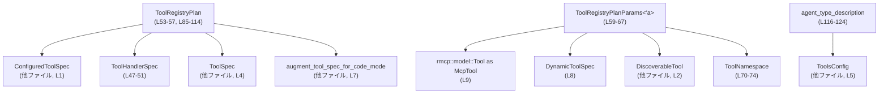
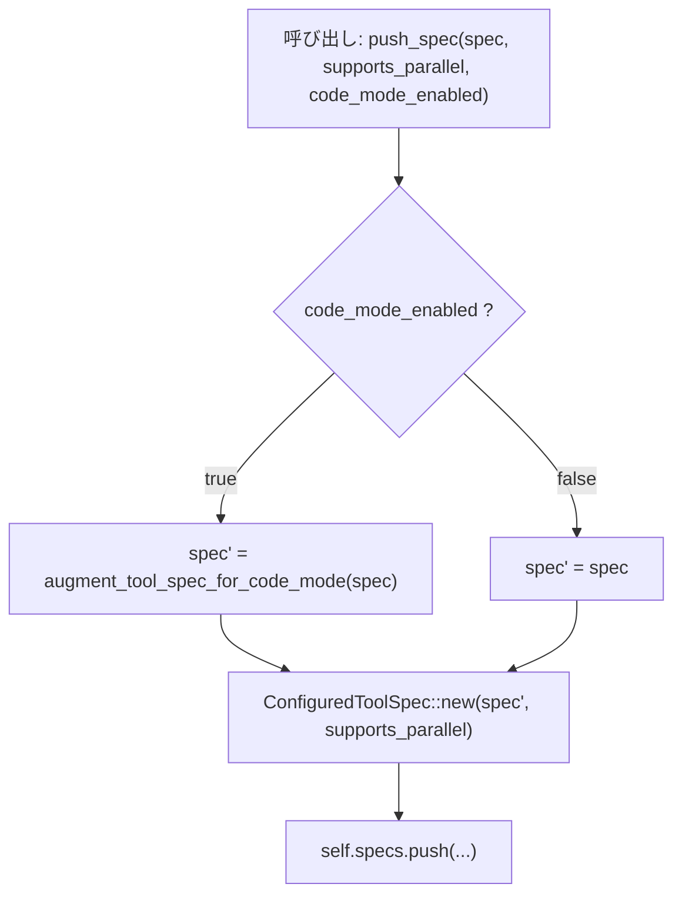
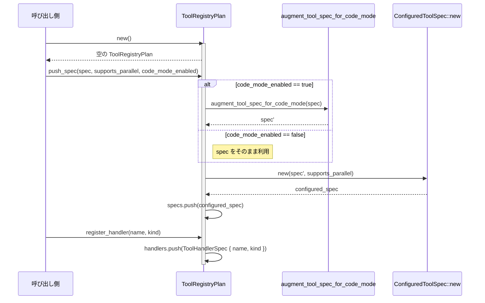
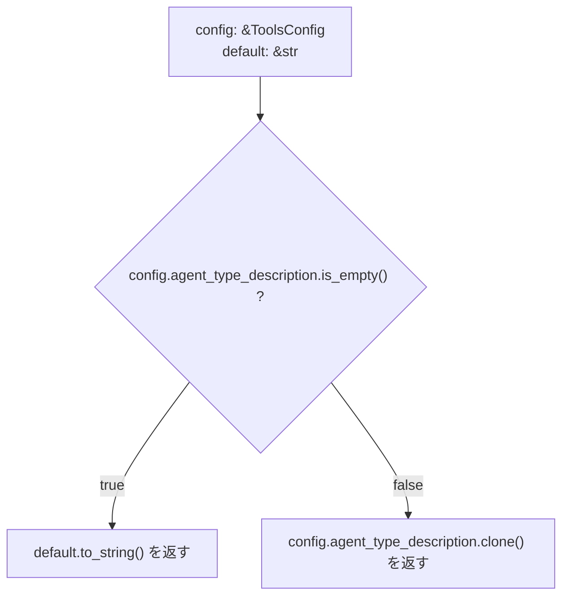

# tools/src/tool_registry_plan_types.rs コード解説

## 0. ざっくり一言

このファイルは、「ツールレジストリ計画（ToolRegistryPlan）」に関する型とヘルパー関数を定義し、  
利用可能なツール仕様と、それに対応するハンドラー種別をまとめて保持するための基盤を提供します。

---

## 1. このモジュールの役割

### 1.1 概要

- このモジュールは、エージェントが利用する各種ツール（Shell や MCP ツールなど）の **仕様とハンドラー種別を一括管理するための型群** を提供します。
- 具体的には:
  - ツール呼び出しの種類を列挙した `ToolHandlerKind`（列挙体）
  - ツール名とそのハンドラー種別の対応を表す `ToolHandlerSpec`（構造体）
  - ツール仕様とハンドラー情報一式を保持する `ToolRegistryPlan`（構造体）
  - `ToolRegistryPlan` を構築するために必要な外部情報を束ねる `ToolRegistryPlanParams`（構造体）
  - ツール名前空間や Deferred MCP ツールのメタデータ構造体
  - エージェント種別説明文を決定するヘルパー `agent_type_description`
  を定義しています（tools/src/tool_registry_plan_types.rs:L12-83, L86-125）。

### 1.2 アーキテクチャ内での位置づけ

`ToolRegistryPlan` は、外部から提供されるツール仕様 (`ToolSpec` / `DynamicToolSpec` / MCP ツールなど) と、  
内部で決めたハンドラー種別 (`ToolHandlerKind`) をまとめる「集約役」のコンテナとして位置づけられています。



※ `ConfiguredToolSpec`, `ToolSpec`, `ToolsConfig`, `augment_tool_spec_for_code_mode` などの定義は  
このファイルには含まれていません（tools/src/tool_registry_plan_types.rs:L1-10）。

### 1.3 設計上のポイント

- **責務の分割**
  - 列挙体 `ToolHandlerKind` でサポートするハンドラー種別を列挙（tools/src/tool_registry_plan_types.rs:L12-45）。
  - メタデータとコンテナ (`ToolRegistryPlan`, `ToolRegistryPlanParams`, `ToolNamespace`, `ToolRegistryPlanDeferredTool`) を分離（L47-83）。
- **状態管理**
  - `ToolRegistryPlan` は `specs`・`handlers` の 2 つの `Vec` を持つ単純な保持構造（L53-57）。
  - 変更は `&mut self` を取るメソッド (`push_spec`, `register_handler`) 経由でのみ行われます（L93-106, L108-113）。
- **エラーハンドリング**
  - 本ファイル内の関数はいずれも `Result` を返さず、明示的なエラー分岐や `panic!` はありません（L86-124）。
- **並行性**
  - いずれの型も `unsafe` を使用しておらず（ファイル全体）、`&mut self` により単一スレッド／単一所有者からの変更前提の API になっています。
  - `ToolRegistryPlan` が `Send` / `Sync` かどうかは内部フィールド型（特に `ConfiguredToolSpec`）に依存し、このチャンクだけでは分かりません。

---

## 2. 主要な機能一覧

このモジュールが提供する主な機能は次のとおりです。

- ツールハンドラー種別の定義: `ToolHandlerKind` でサポートされる全ハンドラー種別を列挙（L12-45）。
- ハンドラー仕様の保持: `ToolHandlerSpec` で「ツール名 → ハンドラー種別」の組を保持（L47-51）。
- レジストリプランの構築・保持:
  - `ToolRegistryPlan::new` で空のプランを生成（L86-91）。
  - `ToolRegistryPlan::push_spec` でツール仕様を追加し、必要に応じてコードモード用の拡張を適用（L93-106）。
  - `ToolRegistryPlan::register_handler` でツール名とハンドラー種別の対応を登録（L108-113）。
- プラン構築用パラメータの集約: `ToolRegistryPlanParams` で MCP ツールや動的ツール、名前空間などをまとめて渡すための構造を提供（L59-67）。
- 名前空間と Deferred MCP ツールのメタ情報: `ToolNamespace`, `ToolRegistryPlanDeferredTool`（L70-83）。
- エージェント種別説明文の決定: `agent_type_description` で設定とデフォルト値から説明文を選択（L116-124）。

---

## 3. 公開 API と詳細解説

### 3.1 型一覧（構造体・列挙体など）

このファイルで `pub` として公開されている主要な型一覧です。

| 名前 | 種別 | 役割 / 用途 | 定義箇所 |
|------|------|-------------|----------|
| `ToolHandlerKind` | 列挙体 | 各種ツールハンドラーの種別（Shell, MCP, CodeMode など）を表す | tools/src/tool_registry_plan_types.rs:L12-45 |
| `ToolHandlerSpec` | 構造体 | ツール名 (`ToolName`) と、そのツールを処理するハンドラー種別 (`ToolHandlerKind`) の 1 組を表す | tools/src/tool_registry_plan_types.rs:L47-51 |
| `ToolRegistryPlan` | 構造体 | 選択されたツール仕様 (`ConfiguredToolSpec`) と、対応するハンドラー仕様一覧を保持するコンテナ | tools/src/tool_registry_plan_types.rs:L53-57 |
| `ToolRegistryPlanParams<'a>` | 構造体 | MCP ツール群、動的ツール群、ツール名前空間など、プラン構築時に必要な外部情報を借用参照として束ねる | tools/src/tool_registry_plan_types.rs:L59-67 |
| `ToolNamespace` | 構造体 | ツールの名前空間名と、その説明文（任意）を表す | tools/src/tool_registry_plan_types.rs:L70-74 |
| `ToolRegistryPlanDeferredTool<'a>` | 構造体 | Deferred MCP ツールと思われるツールの識別情報とコネクタ情報を保持（用途はこのチャンクからは不明） | tools/src/tool_registry_plan_types.rs:L76-83 |

> `ToolRegistryPlanParams`・`ToolRegistryPlanDeferredTool` のフィールド用途については、フィールド名から用途が推測できますが、実際にどう使われるかはこのチャンクには現れません。

### 3.2 関数詳細

このファイルには 4 つの関数／メソッドが定義されています（メソッド 3, 自由関数 1）。すべて `pub(crate)` で crate 内部 API です。

---

#### `ToolRegistryPlan::new() -> Self` （L86-91）

**概要**

- 空の `ToolRegistryPlan` を生成します。
- `specs` と `handlers` を空の `Vec` で初期化します（tools/src/tool_registry_plan_types.rs:L86-91）。

**引数**

- なし

**戻り値**

- `ToolRegistryPlan`  
  - `specs: Vec<ConfiguredToolSpec>` は空  
  - `handlers: Vec<ToolHandlerSpec>` も空

**内部処理の流れ**

1. `Self { specs: Vec::new(), handlers: Vec::new() }` を生成するだけです（L87-90）。

**Examples（使用例）**

```rust
// 実際には ToolRegistryPlan をスコープに持つための use が必要になる
fn create_empty_plan() -> ToolRegistryPlan {
    // 空のレジストリプランを作成する
    let plan = ToolRegistryPlan::new(); // specs, handlers が空の状態で初期化される

    plan // 呼び出し元に返す
}
```

**Errors / Panics**

- 明示的なエラーや `panic!` はありません。
- `Vec::new()` は失敗しない前提で使われています（メモリ枯渇などは通常の Rust プログラム同様、考慮されていません）。

**Edge cases（エッジケース）**

- 特に分岐はなく、常に同じ値を返します。

**使用上の注意点**

- `ToolRegistryPlan` を利用する前に、少なくとも `push_spec` や `register_handler` で必要な情報を追加する必要があります。

---

#### `ToolRegistryPlan::push_spec(&mut self, spec: ToolSpec, supports_parallel_tool_calls: bool, code_mode_enabled: bool)` （L93-106）

**概要**

- `ToolSpec`（ツール仕様）を、必要に応じてコードモード用に拡張し (`augment_tool_spec_for_code_mode`)、`ConfiguredToolSpec` として `specs` ベクタに追加します（L93-106）。

**引数**

| 引数名 | 型 | 説明 |
|--------|----|------|
| `self` | `&mut ToolRegistryPlan` | `specs` にツール仕様を追加したいプラン |
| `spec` | `ToolSpec` | 追加したいツールの仕様。所有権はこの関数に移動します（L95）。 |
| `supports_parallel_tool_calls` | `bool` | ツールが並列呼び出しをサポートするかどうかを表すフラグ（L96）。 |
| `code_mode_enabled` | `bool` | コードモード機能を有効にするかどうか。`true` の場合、ツール仕様が拡張されます（L97-103）。 |

**戻り値**

- なし（`()`）

**内部処理の流れ（アルゴリズム）**

1. `code_mode_enabled` を判定（L99）。
2. `true` の場合:
   - `augment_tool_spec_for_code_mode(spec)` を呼び出して、新しい `ToolSpec` を得ます（L100）。
3. `false` の場合:
   - 引数の `spec` をそのまま使います（L102-103）。
4. 上記で得た `spec` を使って `ConfiguredToolSpec::new(spec, supports_parallel_tool_calls)` を生成し（L104-105）、`self.specs.push(...)` で `specs` ベクタに追加します（L104-105）。



**Examples（使用例）**

```rust
fn add_shell_tool(plan: &mut ToolRegistryPlan, shell_spec: ToolSpec) {
    // 並列実行を許可し、コードモード拡張も有効にする例
    let supports_parallel = true;
    let code_mode_enabled = true;

    // shell_spec の所有権は push_spec に移動する
    plan.push_spec(shell_spec, supports_parallel, code_mode_enabled);
    // ここでは shell_spec はもはや使用できない（所有権が移動したため）
}
```

**Errors / Panics**

- この関数内で明示的な `Result` の返却や `panic!` はありません。
- `augment_tool_spec_for_code_mode` や `ConfiguredToolSpec::new` の内部挙動（エラー発生条件）は、このチャンクには現れないため不明です。

**Edge cases（エッジケース）**

- `code_mode_enabled == false` の場合:
  - ツール仕様は一切変更されず、そのまま `ConfiguredToolSpec` に包まれて追加されます（L99, L102-103）。
- 同じ `ToolSpec` 相当のツールを複数回追加することに対するチェックはありません。
  - 重複追加が問題になるかどうかは、`ToolRegistryPlan` の利用側ロジックに依存し、このチャンクからは分かりません。

**使用上の注意点**

- **所有権**: `spec: ToolSpec` はムーブされるため、呼び出し元で再利用できません。
- 並列実行可否（`supports_parallel_tool_calls`）の扱いは `ConfiguredToolSpec::new` およびその利用側に依存します。
- コードモードを有効にすると、仕様が `augment_tool_spec_for_code_mode` によって変化します。
  - 「どのように変化するか」はこのチャンクには現れないため、仕様変更の影響を確認するには該当関数の定義を確認する必要があります。

---

#### `ToolRegistryPlan::register_handler(&mut self, name: impl Into<ToolName>, kind: ToolHandlerKind)` （L108-113）

**概要**

- ツール名と、そのツールを処理するハンドラーの種別を `handlers` ベクタに登録します（L108-113）。

**引数**

| 引数名 | 型 | 説明 |
|--------|----|------|
| `self` | `&mut ToolRegistryPlan` | ハンドラー情報を追加したいプラン |
| `name` | `impl Into<ToolName>` | ツール名。`&str` や `String` など、`ToolName` に変換可能な型が渡せます（L108-110）。 |
| `kind` | `ToolHandlerKind` | 該当ツールの処理を担当するハンドラー種別（L108, L110-111）。 |

**戻り値**

- なし（`()`）

**内部処理の流れ**

1. `name.into()` を呼び出して `ToolName` に変換します（L110）。
2. `ToolHandlerSpec { name: ..., kind }` を構築します（L109-111）。
3. `self.handlers.push(...)` で `handlers` ベクタに追加します（L109）。

**Examples（使用例）**

```rust
fn register_basic_handlers(plan: &mut ToolRegistryPlan) {
    // "shell" というツール名に Shell ハンドラーを対応付ける
    plan.register_handler("shell", ToolHandlerKind::Shell);

    // "list_dir" というツール名に ListDir ハンドラーを対応付ける
    plan.register_handler("list_dir", ToolHandlerKind::ListDir);
}
```

**Errors / Panics**

- この関数内にエラー処理や `panic!` 呼び出しはありません。
- `name.into()` による変換がパニックを起こすかどうかは、`ToolName` の実装に依存し、このチャンクからは分かりません。

**Edge cases（エッジケース）**

- 同一の `ToolName` に対して複数回 `register_handler` を呼び出すことは可能ですが、重複チェックは行われません（L108-113）。
  - **重複時にどのエントリが使われるか** は、このチャンクには現れない後続処理に依存します。
- 未使用の `ToolHandlerKind`（例えば `TestSync`）を登録しても、このファイルだけではその後どう扱われるかは分かりません。

**使用上の注意点**

- ツール名と `ToolHandlerKind` の対応表が一貫していること（spec と handler のペアリング）が重要です。
  - 例えば、`ToolSpec` 側で "shell" を追加したのに、別名の "bash" にハンドラーを登録すると、利用側で名前不一致が発生する可能性があります。
- 重複登録を避けたい場合は、呼び出し側で一意性を管理する必要があります。

---

#### `agent_type_description(config: &ToolsConfig, default_agent_type_description: &str) -> String` （L116-124）

**概要**

- `ToolsConfig` に設定されているエージェント種別説明文が空かどうかを判定し、空であればデフォルト文字列を返し、そうでなければ設定値のコピーを返します（L116-124）。

**引数**

| 引数名 | 型 | 説明 |
|--------|----|------|
| `config` | `&ToolsConfig` | エージェント設定。`agent_type_description` フィールドを参照します（L117, L120, L123）。 |
| `default_agent_type_description` | `&str` | 設定値が空だった場合に使用するデフォルト説明文（L118, L121）。 |

**戻り値**

- `String`  
  - `config.agent_type_description` が空文字列であれば `default_agent_type_description.to_string()`（L120-121）。
  - 空でなければ `config.agent_type_description.clone()`（L123）。

**内部処理の流れ**

1. `if config.agent_type_description.is_empty()` で設定値の空チェックを行う（L120）。
2. `true` の場合:
   - `default_agent_type_description.to_string()` を返す（L121）。
3. `false` の場合:
   - `config.agent_type_description.clone()` を返す（L123）。

**Examples（使用例）**

```rust
fn describe_agent(config: &ToolsConfig) -> String {
    // Fallback 用のデフォルト説明文
    let default = "汎用エージェント";

    // 設定に説明文があればそれを使い、なければデフォルトを使う
    let description = agent_type_description(config, default);

    description
}
```

**Errors / Panics**

- この関数内にエラー処理や `panic!` はありません。
- `clone` や `to_string` がパニックすることは通常ありません。

**Edge cases（エッジケース）**

- `config.agent_type_description` が **完全な空文字列**（長さ 0）のときのみ「空」と判定します（L120）。
  - スペースや改行のみの文字列など、長さが 1 以上であれば「空ではない」と扱われ、設定値がそのまま返されます。
- `default_agent_type_description` が空文字列の場合:
  - 設定値が空なら空文字列が返り、設定値が非空ならその内容が返ります。

**使用上の注意点**

- 「空白のみの文字列はデフォルト扱いにしたい」といった要件がある場合、この関数のロジック（`is_empty` 判定）では足りないため、呼び出し元で前処理する必要があります。
- `String` を返すため、呼び出し側で所有権を持って安全に保持できます。

---

### 3.3 その他の関数

- このファイルには、上記 4 つ以外の関数・メソッドは定義されていません（tools/src/tool_registry_plan_types.rs:L86-124）。

---

## 4. データフロー

ここでは、`ToolRegistryPlan` を用いてツールレジストリを構築する典型的なフローを示します。

### 4.1 プラン構築時のデータフロー

呼び出し側が `ToolRegistryPlan` を使ってツール仕様とハンドラーを登録する流れです。



- `ToolSpec` と並列実行フラグ、コードモードフラグを渡すと、必要に応じて仕様が拡張された上で `ConfiguredToolSpec` として `specs` に登録されます（L93-106）。
- その後、`register_handler` でツール名とハンドラー種別のペアが `handlers` に登録されます（L108-113）。
- このファイル内には、`specs` と `handlers` を組み合わせて実際に実行する部分は存在しません。

### 4.2 エージェント説明文決定のフロー



---

## 5. 使い方（How to Use）

### 5.1 基本的な使用方法

`ToolRegistryPlan` を作成し、ツール仕様とハンドラーを登録する基本的な例です。

```rust
// 実際には ToolRegistryPlan, ToolHandlerKind, ToolSpec などを
// 適切なモジュールから use する必要があります。
fn build_basic_plan(config: &ToolsConfig, shell_spec: ToolSpec) -> ToolRegistryPlan {
    // 空のプランを作成する
    let mut plan = ToolRegistryPlan::new(); // specs, handlers が空の状態（L86-91）

    // Shell ツール仕様を追加する
    let supports_parallel = true;       // 並列ツール呼び出しを許可する例
    let code_mode_enabled = config      // 設定値に基づいてコードモードを有効化する例
        .code_mode_enabled;             // このフィールドの存在は推測であり、このチャンクには現れません

    // shell_spec の所有権を move して plan に追加する（L93-106）
    plan.push_spec(shell_spec, supports_parallel, code_mode_enabled);

    // "shell" というツール名に Shell ハンドラーを紐付ける（L108-113）
    plan.register_handler("shell", ToolHandlerKind::Shell);

    plan // 完成したプランを返す
}
```

> `ToolsConfig` のフィールド名などはこのファイルには現れないため、上記の `code_mode_enabled` フィールドは「ありそうな例」であり、実在するかどうかは不明です。

### 5.2 よくある使用パターン

#### 5.2.1 複数ツールをまとめて登録する

```rust
fn build_multi_tool_plan(
    config: &ToolsConfig,
    tool_specs: Vec<ToolSpec>,
) -> ToolRegistryPlan {
    let mut plan = ToolRegistryPlan::new();

    for spec in tool_specs {
        // それぞれの spec の所有権を move して追加する
        plan.push_spec(spec, /*supports_parallel=*/ true, /*code_mode_enabled=*/ true);
    }

    // ツール名とハンドラー種別の対応付け
    plan.register_handler("shell", ToolHandlerKind::Shell);
    plan.register_handler("list_dir", ToolHandlerKind::ListDir);
    plan.register_handler("tool_search", ToolHandlerKind::ToolSearch);

    plan
}
```

#### 5.2.2 `ToolRegistryPlanParams` を構築する

`ToolRegistryPlanParams` は本ファイル内では使われていませんが、外部からまとめてパラメータを受け取る用途が想定されます（L59-67）。

```rust
fn make_params<'a>(
    mcp_tools: &'a std::collections::HashMap<String, McpTool>,
    dynamic_tools: &'a [DynamicToolSpec],
) -> ToolRegistryPlanParams<'a> {
    // 他のフィールドは None / 空スライスで初期化する例
    ToolRegistryPlanParams {
        mcp_tools: Some(mcp_tools),
        deferred_mcp_tools: None,
        tool_namespaces: None,
        discoverable_tools: None,
        dynamic_tools,
        default_agent_type_description: "汎用エージェント",
        wait_agent_timeouts: WaitAgentTimeoutOptions::default(), // default 実装があるかは不明
    }
}
```

> `WaitAgentTimeoutOptions::default()` が存在するかどうかはこのチャンクには現れません。実際の初期化方法は定義側を確認する必要があります。

### 5.3 よくある間違い（想定されるもの）

このファイルのコードから想定される誤用パターンを示します。

```rust
fn wrong_example(plan: &mut ToolRegistryPlan, spec: ToolSpec) {
    // 間違い例: spec の所有権が move されることを意識していない
    plan.push_spec(spec, true, true);
    // println!("{:?}", spec); // エラー: spec は move されており再利用できない

    // 間違い例: spec と handler の名前が一致していない
    // spec 側では "shell" というツール名を定義しているのに、
    // ここでは "bash" という別名にハンドラーを紐付けてしまう
    plan.register_handler("bash", ToolHandlerKind::Shell);
}
```

正しい例:

```rust
fn correct_example(mut spec: ToolSpec) -> ToolRegistryPlan {
    let mut plan = ToolRegistryPlan::new();

    // spec の所有権を move することを前提に使う
    plan.push_spec(spec, true, true);

    // spec 内のツール名が "shell" であるなら、handler 側も "shell" で登録する
    plan.register_handler("shell", ToolHandlerKind::Shell);

    plan
}
```

### 5.4 使用上の注意点（まとめ）

- `ToolRegistryPlan` は `&mut self` ベースの API のため、同一インスタンスを複数スレッドから同時に変更する設計は想定されていません。
- `push_spec` は `ToolSpec` の所有権を消費するため、呼び出し元で再利用しない設計にする必要があります。
- `register_handler` は重複登録を防ぎません。
  - 重複時の挙動はこのチャンクには現れないので、呼び出し側で必要なら一意性を担保するべきです。
- `agent_type_description` は「空文字列かどうか」だけを判定し、空白のみ文字列などは設定値としてそのまま使います（L120）。

---

## 6. 変更の仕方（How to Modify）

### 6.1 新しい機能を追加する場合

#### 新しいハンドラー種別を追加したい場合

1. `ToolHandlerKind` に新しいバリアントを追加します（L12-45）。
   - 例: `NewHandlerType,`
2. そのハンドラーを使用する場所（別ファイル）で、`register_handler("new_tool", ToolHandlerKind::NewHandlerType)` を呼び出して登録します（L108-113）。
3. 実際のハンドラー実装やディスパッチロジックは、このファイルの外にあるため、そちらに対応を追加する必要があります（このチャンクには現れません）。

#### `ToolRegistryPlan` に新しいフィールドを持たせたい場合

1. `ToolRegistryPlan` 構造体にフィールドを追加します（L53-57）。
2. `ToolRegistryPlan::new` の初期化ロジックに、追加フィールドの初期値を設定します（L86-91）。
3. 必要に応じて、`push_spec`／`register_handler` にも影響を与えるかどうかを検討します。

### 6.2 既存の機能を変更する場合

- `push_spec` の仕様を変更する場合:
  - `augment_tool_spec_for_code_mode` の呼び出し条件（`code_mode_enabled`）を変えると、コードモード時の仕様が変わります（L99-103）。
  - 変更前後で `ConfiguredToolSpec` の生成方法が変わるため、その利用箇所全体の影響を確認する必要があります。
- `agent_type_description` の空判定ロジックを変えたい場合:
  - `is_empty()` を別の条件（例えばトリミングしてから空判定）に変更することが考えられますが、
  - 既存の設定値との互換性を事前に確認する必要があります（L120）。
- 影響範囲の確認方法:
  - `ToolRegistryPlan`, `ToolRegistryPlanParams`, `ToolHandlerKind` を参照している場所を全て検索し、コンパイルエラーと挙動の変化を確認します。

---

## 7. 関連ファイル

このモジュールと密接に関係すると思われる型・モジュールです。定義自体はこのチャンクには現れません。

| パス / 型名 | 役割 / 関係 |
|------------|------------|
| `crate::ConfiguredToolSpec` | `ToolRegistryPlan.specs` の要素型。`push_spec` で `ToolSpec` と並列実行フラグから生成されます（tools/src/tool_registry_plan_types.rs:L1, L53-56, L104-105）。 |
| `crate::ToolSpec` | ツールの基本仕様を表す型と思われます。`push_spec` の入力として使用されています（L4, L93-98）。 |
| `crate::ToolName` | ツール名を表す型。`ToolHandlerSpec.name` と `register_handler` の引数変換先として使用されます（L3, L47-50, L108-111）。 |
| `crate::ToolsConfig` | ツール／エージェント設定をまとめた型と思われます。`agent_type_description` で `agent_type_description` フィールドを参照します（L5, L116-124）。 |
| `crate::WaitAgentTimeoutOptions` | エージェント待機タイムアウト関連のオプションを表す型と思われます。`ToolRegistryPlanParams.wait_agent_timeouts` の型です（L6, L59-67）。 |
| `crate::DiscoverableTool` | 自動発見可能なツールを表す型と思われます。`ToolRegistryPlanParams.discoverable_tools` に含まれます（L2, L59-65）。 |
| `crate::augment_tool_spec_for_code_mode` | コードモード用に `ToolSpec` を拡張する関数。`push_spec` 内で条件付きで呼び出されます（L7, L93-103）。 |
| `codex_protocol::dynamic_tools::DynamicToolSpec` | 動的に定義されるツール仕様を表す型です。`ToolRegistryPlanParams.dynamic_tools` に含まれます（L8, L59-66）。 |
| `rmcp::model::Tool as McpTool` | MCP（Model Context Protocol）関連のツールを表す型と思われます。`ToolRegistryPlanParams.mcp_tools` で使用されています（L9, L59-62）。 |

---

## Bugs / Security / Contracts / Tests / パフォーマンスに関する補足

- **既知のバグ**
  - このチャンクのコードから明らかに読み取れるバグはありません。
- **セキュリティ**
  - 本ファイルはデータ構造と簡単な補助ロジックのみで、外部入力のパースや I/O は行っていません。
  - セキュリティ上の懸念は、このレベルでは特に見られません。
- **契約（Contracts）・前提条件**
  - `push_spec` は `ToolSpec` の所有権を取得することが前提です（L93-98）。
  - `ToolRegistryPlanParams` のライフタイム `'a` は、フィールドで参照しているデータより長くなければなりません（L59-67）。これは Rust のコンパイラがチェックします。
- **エッジケース**
  - `agent_type_description` では「空文字列のみをデフォルト扱いにする」という仕様になっています（L120）。
  - `register_handler` の重複登録は許容されており、重複時の挙動はこのチャンクには現れません。
- **テスト**
  - このファイル内にはテストコード（`#[cfg(test)]` や `mod tests`）は存在しません。
  - 実際のテストは他ファイルにあるか、まだ用意されていない可能性があります。
- **パフォーマンス / スケーラビリティ**
  - 実装はすべてベクタへの追加と簡単な条件分岐のみで、計算量は追加回数に対しておおよそ O(n) 程度です。
  - 大量のツールを扱う場合も、ここでのオーバーヘッドは小さいと考えられます（より支配的なのは `augment_tool_spec_for_code_mode` など外部関数の処理である可能性がありますが、このチャンクには現れません）。
- **オブザーバビリティ**
  - ログ出力やメトリクス収集などのコードは含まれていません。
  - プラン構築の可視化が必要な場合は、このレイヤーより上位（プランを利用するサービス層）でログを仕込む設計が想定されます。
