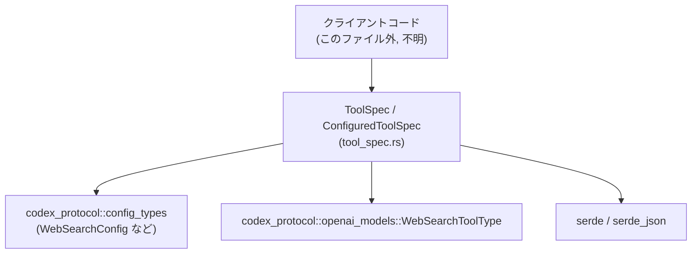
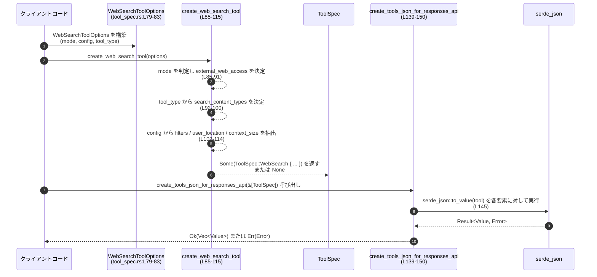

# tools/src/tool_spec.rs コード解説

## 0. ざっくり一言

`tools/src/tool_spec.rs` は、OpenAI Responses API 用の「Tool」定義（関数ツール、ローカルシェル、画像生成、Web 検索、カスタムツール）を表現する型と、その生成・JSON 変換のユーティリティをまとめたモジュールです（`tool_spec.rs:L14-54`, `L69-77`, `L85-115`, `L139-150`）。

---

## 1. このモジュールの役割

### 1.1 概要

- このモジュールは **OpenAI Responses API に渡す「tool」定義** を Rust の型として表現し、  
  それを **JSON にシリアライズ可能な形で構築する** 役割を持ちます（`tool_spec.rs:L16-20`, `L139-150`）。
- Web 検索の設定（フィルタ・ユーザー位置情報）については、`codex_protocol::config_types` 側の設定型から  
  **Responses API 向けの型へ変換するアダプタ** も提供しています（`tool_spec.rs:L152-164`, `L166-190`）。

### 1.2 アーキテクチャ内での位置づけ

このモジュールが依存している主な外部コンポーネントは次のとおりです。

- 設定系：`codex_protocol::config_types::{WebSearchConfig, WebSearchMode, WebSearchFilters, WebSearchUserLocation, WebSearchContextSize}`（`tool_spec.rs:L4-8`）
- モデル定義：`codex_protocol::openai_models::WebSearchToolType`（`L10`）
- ツール定義：`crate::{ResponsesApiTool, FreeformTool, JsonSchema}`（`L1-3`）
- JSON シリアライズ：`serde::Serialize`, `serde_json::Value`（`L11-12`）

呼び出し側の具体的なモジュール名はこのチャンクからは分かりませんが、概略の依存関係は次のようになります。



### 1.3 設計上のポイント

- **列挙型でツール種別を統一管理**  
  `ToolSpec` が Responses API の `type` に対応し、variants で function / tool_search / local_shell / image_generation / web_search / custom を表現します（`tool_spec.rs:L20-53`）。
- **Option と `skip_serializing_if` による柔軟な JSON**  
  Web 検索のオプションやフィルタは `Option` と `#[serde(skip_serializing_if = "Option::is_none")]` で表現し、指定されない項目は JSON から自動的に省略されます（`L41-50`, `L152-156`, `L167-177`）。
- **設定オブジェクトから API 表現への変換レイヤ**  
  `ResponsesApiWebSearchFilters` / `ResponsesApiWebSearchUserLocation` への `From` 実装で、設定を API 用構造体に安全にコピーします（`L158-164`, `L180-189`）。
- **並列ツール呼び出しフラグの保持のみ**  
  `ConfiguredToolSpec` は `supports_parallel_tool_calls` を持ちますが、実際の並列実行ロジックはこのモジュールの外側にあります（`L117-133`）。
- **エラーハンドリングは Result/Option に集約**  
  - Web 検索ツール生成は `Option<ToolSpec>` を返し、無効なモードでは `None` を返す設計（`L85-91`）。  
  - JSON 生成は `Result<Vec<Value>, serde_json::Error>` でシリアライズ失敗を伝搬します（`L139-150`）。  
  いずれも Rust の標準的なエラー表現に従っています。

---

## 2. 主要な機能一覧

- ツール定義列挙型 `ToolSpec`: Responses API の `tool` を型安全に表現（`tool_spec.rs:L20-53`）
- ツール名取得 `ToolSpec::name`: `ToolSpec` から API 上のツール名文字列を取得（`L56-66`）
- ローカルシェルツール生成 `create_local_shell_tool`: `LocalShell` variant の簡易コンストラクタ（`L69-71`）
- 画像生成ツール生成 `create_image_generation_tool`: 出力フォーマットを指定して `ImageGeneration` variant を生成（`L73-77`）
- Web 検索ツール生成 `create_web_search_tool`: 設定とモードに応じて `WebSearch` variant を構築（`L85-115`）
- ツール＋並列実行フラグ格納 `ConfiguredToolSpec`: ツール仕様と並列実行可否を束ねるラッパー（`L117-133`）
- Responses API 用 JSON 生成 `create_tools_json_for_responses_api`: `ToolSpec` 配列を JSON 配列に変換（`L139-150`）
- Web 検索フィルタ変換 `ResponsesApiWebSearchFilters` + `From` 実装: 設定のフィルタを API 用の JSON 形へ変換（`L152-164`）
- Web 検索ユーザー位置情報変換 `ResponsesApiWebSearchUserLocation` + `From` 実装: 位置情報設定を API 用 JSON 形へ変換（`L166-190`）

---

## 3. 公開 API と詳細解説

### 3.1 型一覧（構造体・列挙体など）

#### 型インベントリー

| 名前 | 種別 | 行範囲 | 役割 / 用途 |
|------|------|--------|-------------|
| `ToolSpec` | enum | `tool_spec.rs:L20-53` | Responses API の 1 つの tool を表す列挙型。function / tool_search / local_shell / image_generation / web_search / custom の各 variant を持つ。 |
| `WebSearchToolOptions<'a>` | struct | `tool_spec.rs:L79-83` | Web 検索ツール生成時のオプション。モード・設定・ツールタイプをまとめる。 |
| `ConfiguredToolSpec` | struct | `tool_spec.rs:L117-121` | `ToolSpec` と並列実行サポートフラグを束ねた構造体。 |
| `ResponsesApiWebSearchFilters` | struct | `tool_spec.rs:L152-156` | Responses API の Web 検索 `filters` フィールド用の型。許可ドメイン一覧を保持。 |
| `ResponsesApiWebSearchUserLocation` | struct | `tool_spec.rs:L166-178` | Responses API の Web 検索 `user_location` フィールド用の型。国・地域・都市・タイムゾーン等を表す。 |

#### 定数

| 名前 | 種別 | 行範囲 | 役割 / 用途 |
|------|------|--------|-------------|
| `WEB_SEARCH_TEXT_AND_IMAGE_CONTENT_TYPES` | `const [&str; 2]` | `tool_spec.rs:L14-14` | Text+Image 検索時の `search_content_types` 値として `"text"`, `"image"` をセットするための定数。 |

#### 関数インベントリー

| 関数名 | シグネチャ（抜粋） | 行範囲 | 役割（1 行） |
|--------|--------------------|--------|--------------|
| `ToolSpec::name` | `fn name(&self) -> &str` | `tool_spec.rs:L56-66` | `ToolSpec` から API 上のツール名文字列を取得する。 |
| `create_local_shell_tool` | `fn create_local_shell_tool() -> ToolSpec` | `tool_spec.rs:L69-71` | `ToolSpec::LocalShell` を生成するヘルパー。 |
| `create_image_generation_tool` | `fn create_image_generation_tool(output_format: &str) -> ToolSpec` | `tool_spec.rs:L73-77` | 指定した出力フォーマットの `ImageGeneration` ツールを生成する。 |
| `create_web_search_tool` | `fn create_web_search_tool(options: WebSearchToolOptions<'_>) -> Option<ToolSpec>` | `tool_spec.rs:L85-115` | Web 検索設定に基づいて `ToolSpec::WebSearch` を生成する（無効なモードなら `None`）。 |
| `ConfiguredToolSpec::new` | `fn new(spec: ToolSpec, supports_parallel_tool_calls: bool) -> Self` | `tool_spec.rs:L123-129` | `ConfiguredToolSpec` のコンストラクタ。 |
| `ConfiguredToolSpec::name` | `fn name(&self) -> &str` | `tool_spec.rs:L131-133` | 内部の `ToolSpec` からツール名を返す。 |
| `create_tools_json_for_responses_api` | `fn create_tools_json_for_responses_api(tools: &[ToolSpec]) -> Result<Vec<Value>, serde_json::Error>` | `tool_spec.rs:L139-150` | `ToolSpec` 配列を Responses API 互換の JSON 配列にシリアライズする。 |
| `<ResponsesApiWebSearchFilters as From<_>>::from` | `fn from(filters: ConfigWebSearchFilters) -> Self` | `tool_spec.rs:L158-163` | 設定側フィルタから API 用フィルタ型へ変換する。 |
| `<ResponsesApiWebSearchUserLocation as From<_>>::from` | `fn from(user_location: ConfigWebSearchUserLocation) -> Self` | `tool_spec.rs:L180-189` | 設定側ユーザー位置情報から API 用位置情報型へ変換する。 |

以下では重要度の高い 7 関数について詳細を説明します。

---

### 3.2 関数詳細（7 件）

#### `ToolSpec::name(&self) -> &str`  (`tool_spec.rs:L56-66`)

**概要**

- `ToolSpec` の variant に応じて、Responses API の `tool` に渡す名前文字列（`type` とは別の識別子）を返します。
- `Function` / `Freeform` では内部の `name` フィールドを返し、それ以外は固定文字列です（`L59-64`）。

**引数**

| 引数名 | 型 | 説明 |
|--------|----|------|
| `self` | `&ToolSpec` | ツール仕様。どの variant でも利用可能です。 |

**戻り値**

- `&str`：ツールの論理名。  
  - `Function(tool)` / `Freeform(tool)` -> `tool.name.as_str()`（`L59`, `L64`）  
  - `ToolSearch` -> `"tool_search"`（`L60`）  
  - `LocalShell` -> `"local_shell"`（`L61`）  
  - `ImageGeneration` -> `"image_generation"`（`L62`）  
  - `WebSearch` -> `"web_search"`（`L63`）

**内部処理の流れ**

1. `match self` で variant に応じた分岐を行う（`L58-65`）。
2. `Function` / `Freeform` の場合は内部構造体の `name` フィールドから `&str` を取り出して返す。
3. それ以外の variant は固定のリテラル文字列を返す。

**Examples（使用例）**

```rust
use crate::tool_spec::ToolSpec;

fn print_tool_name(tool: &ToolSpec) {
    // ToolSpec::name() で論理名を取得する
    println!("tool name = {}", tool.name());
}
```

**Errors / Panics**

- この関数は `Result` を返さず、`panic!` も発生させません。
- `match` は全ての variant を網羅しているため、未定義のパターンはありません（`tool_spec.rs:L59-64`）。

**Edge cases（エッジケース）**

- `Function`・`Freeform` variant において、内部の `name` フィールドが空文字列であっても、そのまま返されます。  
  この関数内ではバリデーションを行っていません（`tool_spec.rs:L59`, `L64`）。

**使用上の注意点**

- 返される文字列は **API 側で一意であることが期待** されますが、その保証は `ResponsesApiTool` / `FreeformTool` の定義側に依存します。この関数は単にフィールドを返すだけです。
- 並列呼び出し可否など、他のメタ情報は `ToolSpec::name` からは取得できません。必要な場合は `ConfiguredToolSpec` を利用します（`tool_spec.rs:L117-133`）。

---

#### `create_local_shell_tool() -> ToolSpec`  (`tool_spec.rs:L69-71`)

**概要**

- Responses API の `local_shell` ツールを表す `ToolSpec::LocalShell {}` を生成します。

**引数**

- なし。

**戻り値**

- `ToolSpec::LocalShell {}`：フィールドを持たない空の variant（`tool_spec.rs:L70`）。

**内部処理の流れ**

1. `ToolSpec::LocalShell {}` を直接生成して返します（`L70`）。

**Examples（使用例）**

```rust
use crate::tool_spec::{ToolSpec, create_local_shell_tool};

let shell_tool: ToolSpec = create_local_shell_tool();
// 後で JSON 化して Responses API に渡す
```

**Errors / Panics**

- 失敗条件はなく、`panic!` も発生しません。

**Edge cases（エッジケース）**

- 常に同じ `LocalShell {}` を返すため、特別なエッジケースはありません。

**使用上の注意点**

- ローカルシェルの実行は **セキュリティ上のリスク** を伴う可能性がありますが、その権限制御やサンドボックス化はこのモジュールの責務外です。  
  実際の実行ロジック側で十分な制御が必要です。

---

#### `create_image_generation_tool(output_format: &str) -> ToolSpec`  (`tool_spec.rs:L73-77`)

**概要**

- 指定した `output_format` を持つ画像生成ツール `ToolSpec::ImageGeneration` を生成します。

**引数**

| 引数名 | 型 | 説明 |
|--------|----|------|
| `output_format` | `&str` | 画像生成ツールの出力フォーマット（例: `"png"`, `"jpeg"` 等、ただしこの関数内では制限しません）。 |

**戻り値**

- `ToolSpec`：`ImageGeneration { output_format: output_format.to_string() }`（`tool_spec.rs:L74-76`）。

**内部処理の流れ**

1. 引数 `output_format` を `to_string()` で `String` に変換する（`L75`）。
2. それをフィールドとする `ToolSpec::ImageGeneration` を生成して返す（`L74-76`）。

**Examples（使用例）**

```rust
use crate::tool_spec::{ToolSpec, create_image_generation_tool};

let img_tool: ToolSpec = create_image_generation_tool("png");
// img_tool を tools の 1 要素として Responses API に渡せる
```

**Errors / Panics**

- エラーは発生しません。`to_string()` も常に成功します。

**Edge cases（エッジケース）**

- `output_format` が空文字列や不正な値でも、そのまま `String` 化されます。  
  API が受け付けない値であっても、この関数は弾きません（`tool_spec.rs:L74-76`）。

**使用上の注意点**

- 実際に使用できるフォーマット値は **Responses API の仕様に依存** します。  
  この関数は値の妥当性チェックを行っていないため、呼び出し側でバリデーションを行う必要があります。

---

#### `create_web_search_tool(options: WebSearchToolOptions<'_>) -> Option<ToolSpec>`  (`tool_spec.rs:L85-115`)

**概要**

- Web 検索ツール `ToolSpec::WebSearch` を、モード・設定・ツールタイプに基づいて生成します。
- Web 検索が無効なモードの場合は `None` を返し、ツールを生成しません（`tool_spec.rs:L85-91`）。

**引数**

| 引数名 | 型 | 説明 |
|--------|----|------|
| `options` | `WebSearchToolOptions<'_>` | Web 検索モード・設定・ツールタイプをまとめたオプション（`tool_spec.rs:L79-83`）。 |

`WebSearchToolOptions<'a>` のフィールド（`tool_spec.rs:L79-83`）:

| フィールド名 | 型 | 説明 |
|-------------|----|------|
| `web_search_mode` | `Option<WebSearchMode>` | Web 検索のモード（Cached / Live / Disabled）。`None` なら無効扱い。 |
| `web_search_config` | `Option<&'a WebSearchConfig>` | フィルタやユーザー位置情報などを含む設定への参照。 |
| `web_search_tool_type` | `WebSearchToolType` | Web 検索ツールのタイプ（Text または TextAndImage）。 |

**戻り値**

- `Option<ToolSpec>`：  
  - `Some(ToolSpec::WebSearch { ... })`：Cached または Live モードのとき。  
  - `None`：Disabled または `web_search_mode` が `None` のとき（`tool_spec.rs:L86-91`）。

**内部処理の流れ（アルゴリズム）**

1. `web_search_mode` に応じて `external_web_access` を決定（`tool_spec.rs:L85-90`）。
   - `Some(WebSearchMode::Cached)` -> `Some(false)`（キャッシュのみ）。  
   - `Some(WebSearchMode::Live)` -> `Some(true)`（ライブ検索）。  
   - `Some(WebSearchMode::Disabled)` または `None` -> `None`。
2. 直後の `}?;` により、`external_web_access` が `None` の場合は関数全体が `None` を返して終了（`L90-91`）。  
   これは `Option` に対する `?` 演算子で、「無効モードならツールを作らない」契約を実現しています。
3. `web_search_tool_type` に応じて `search_content_types` を設定（`tool_spec.rs:L92-100`）。
   - `WebSearchToolType::Text` -> `None`（デフォルトの text のみ）。  
   - `WebSearchToolType::TextAndImage` -> `Some(vec!["text", "image"])`（定数配列から `String` ベクタを生成）。
4. `web_search_config` の有無に応じて、各 Option を組み立て（`tool_spec.rs:L102-114`）。
   - `filters`: `config.filters.clone().map(Into::into)` -> `Option<ResponsesApiWebSearchFilters>`（`L104-106`）。  
   - `user_location`: `config.user_location.clone().map(Into::into)` -> `Option<ResponsesApiWebSearchUserLocation>`（`L107-109`）。  
   - `search_context_size`: `config.search_context_size` -> `Option<WebSearchContextSize>`（`L110-112`）。
5. 以上をフィールドとして `ToolSpec::WebSearch { ... }` を組み立て、`Some(...)` で返す（`tool_spec.rs:L102-114`）。

**Examples（使用例）**

Web 検索を Live モード・Text+Image で有効にする例（設定は省略）:

```rust
use codex_protocol::config_types::{WebSearchConfig, WebSearchMode};
use codex_protocol::openai_models::WebSearchToolType;
use crate::tool_spec::{WebSearchToolOptions, create_web_search_tool};

// WebSearchConfig の具体的な中身はこのモジュールからは分からないため、ここでは外部で構築済みとする
let config: WebSearchConfig = /* どこかで読み込んだ設定 */;

let options = WebSearchToolOptions {
    web_search_mode: Some(WebSearchMode::Live),        // ライブ検索
    web_search_config: Some(&config),                  // 設定への参照
    web_search_tool_type: WebSearchToolType::TextAndImage, // テキスト＋画像
};

if let Some(web_tool) = create_web_search_tool(options) {
    // web_tool は ToolSpec::WebSearch variant
    // 後で tools ベクタに追加して JSON 化できる
} else {
    // Disabled / None の場合はこちらに来る
}
```

**Errors / Panics**

- この関数は `Result` ではなく `Option` を返し、内部で `panic!` は使用していません。
- 無効モード時には `Err` ではなく `None` で表現されるため、呼び出し側で `None` をきちんと扱う必要があります（`tool_spec.rs:L85-91`）。

**Edge cases（エッジケース）**

- `web_search_mode` が `None` または `Disabled` の場合  
  -> `external_web_access` が `None` になり、`?` により関数全体が `None` を返します（`tool_spec.rs:L86-91`）。
- `web_search_config` が `None` の場合  
  -> `filters`, `user_location`, `search_context_size` はすべて `None` となり、  
     JSON シリアライズ時にそれらのフィールドは省略されます（`L102-114`, `L41-50`, `L152-156`, `L167-177`）。
- `web_search_tool_type` が `Text` の場合  
  -> `search_content_types` は `None` で、Responses API のデフォルト（text のみ）に任せる設計になっています（`tool_spec.rs:L92-93`）。

**使用上の注意点**

- **モード無指定は「無効」と同義** です。`web_search_mode: None` を渡すと `None` が返り、ツール自体が生成されません（`tool_spec.rs:L86-91`）。
- `web_search_config` のフィールド内容（フィルタやユーザー位置情報）は、この関数内では内容の妥当性チェックを行っていません。  
  API が受け付ける値かどうかは上位で保証する必要があります。
- ファイル上部のコメントにあるように、`web_search` タイプについては「API ドキュメントではサポートされているがエラーになる」との TODO が存在します（`tool_spec.rs:L33-38`）。  
  実際の動作は OpenAI 側の仕様変更に影響される可能性があるため、運用時には最新版ドキュメントやテスト結果の確認が重要です。

---

#### `ConfiguredToolSpec::new(spec: ToolSpec, supports_parallel_tool_calls: bool) -> Self`  (`tool_spec.rs:L123-129`)

**概要**

- `ToolSpec` と「並列ツール呼び出しサポートフラグ」をまとめて `ConfiguredToolSpec` インスタンスを作成するコンストラクタです。

**引数**

| 引数名 | 型 | 説明 |
|--------|----|------|
| `spec` | `ToolSpec` | 実際のツール仕様。所有権は構造体に移動します（`tool_spec.rs:L124-127`）。 |
| `supports_parallel_tool_calls` | `bool` | このツールが並列呼び出しをサポートするかどうかのフラグ。 |

**戻り値**

- `ConfiguredToolSpec`：フィールド `spec` と `supports_parallel_tool_calls` をそのまま保持した新しいインスタンス（`tool_spec.rs:L124-128`）。

**内部処理の流れ**

1. 構造体リテラル `Self { spec, supports_parallel_tool_calls }` を生成して返すだけです（`tool_spec.rs:L124-128`）。

**Examples（使用例）**

```rust
use crate::tool_spec::{ConfiguredToolSpec, create_local_shell_tool};

let tool_spec = create_local_shell_tool();

// ローカルシェルツールは並列実行不可とみなす例
let configured = ConfiguredToolSpec::new(tool_spec, false);

println!("name = {}", configured.name()); // "local_shell" を返す
```

**Errors / Panics**

- エラーは発生せず、`panic!` もありません。

**Edge cases（エッジケース）**

- フラグ値には制約がなく、実際に並列実行が本当に安全かどうかは別途の契約に依存します。ここでは単にブール値を格納するだけです。

**使用上の注意点**

- `supports_parallel_tool_calls` は **実際のスレッド安全性を検証するものではなく、あくまでメタ情報** です。  
  並列で同じツールを呼ぶ場合は、ツール実装側がスレッドセーフであることを別途確認する必要があります。

---

#### `ConfiguredToolSpec::name(&self) -> &str`  (`tool_spec.rs:L131-133`)

**概要**

- 内部に保持している `ToolSpec` に委譲してツール名を返すラッパーです。

**引数**

| 引数名 | 型 | 説明 |
|--------|----|------|
| `self` | `&ConfiguredToolSpec` | ツール仕様と並列フラグを保持した構造体。 |

**戻り値**

- `&str`：`self.spec.name()` の結果（`tool_spec.rs:L132`）。

**内部処理の流れ**

1. `self.spec.name()` を呼び、その戻り値をそのまま返します（`tool_spec.rs:L132`）。

**Examples（使用例）**

```rust
use crate::tool_spec::{ConfiguredToolSpec, create_image_generation_tool};

let spec = create_image_generation_tool("png");
let configured = ConfiguredToolSpec::new(spec, true);

assert_eq!(configured.name(), "image_generation");
```

**Errors / Panics**

- `ToolSpec::name` と同様に、エラーや `panic!` はありません。

**Edge cases（エッジケース）**

- `ToolSpec` に新しい variant が追加された場合は、その `name()` 実装に追従するだけなので、この関数側での変更は不要です。

**使用上の注意点**

- 並列実行可否フラグとは独立した単純なラッパーであるため、名前ベースで処理を分岐するときに `ConfiguredToolSpec` を直接扱う場合に便利です。

---

#### `create_tools_json_for_responses_api(tools: &[ToolSpec]) -> Result<Vec<Value>, serde_json::Error>`  (`tool_spec.rs:L139-150`)

**概要**

- `ToolSpec` のスライスを、Responses API の Function Calling が受け取れる形式の JSON 配列に変換します（`tool_spec.rs:L136-139`）。

**引数**

| 引数名 | 型 | 説明 |
|--------|----|------|
| `tools` | `&[ToolSpec]` | シリアライズ対象のツール一覧。借用によりコピーを避けています（`tool_spec.rs:L139-141`）。 |

**戻り値**

- `Result<Vec<Value>, serde_json::Error>`：  
  - `Ok(Vec<Value>)`：各 `ToolSpec` を JSON 値に変換したベクタ。  
  - `Err(serde_json::Error)`：シリアライズに失敗した場合のエラー。

**内部処理の流れ（アルゴリズム）**

1. 空の `Vec<Value>` を作成し、`tools_json` として保持（`tool_spec.rs:L142`）。
2. `for tool in tools` で各ツールを走査（`L144`）。
3. `serde_json::to_value(tool)?` で `ToolSpec` を `serde_json::Value` に変換（`L145`）。
   - `?` 演算子により、シリアライズに失敗した場合は直ちに `Err` を返す。
4. 変換した JSON 値を `tools_json` に push（`L146`）。
5. ループ完了後、`Ok(tools_json)` を返す（`tool_spec.rs:L149`）。

**Examples（使用例）**

```rust
use serde_json::Value;
use crate::tool_spec::{
    ToolSpec,
    create_local_shell_tool,
    create_image_generation_tool,
    create_tools_json_for_responses_api,
};

let tools: Vec<ToolSpec> = vec![
    create_local_shell_tool(),
    create_image_generation_tool("png"),
];

let tools_json: Vec<Value> = create_tools_json_for_responses_api(&tools)?;

// tools_json をそのまま OpenAI Responses API の "tools" フィールドに渡せる
```

**Errors / Panics**

- シリアライズ時に `serde_json::to_value` が失敗した場合、`Err(serde_json::Error)` が返ります（`tool_spec.rs:L145`）。
- それ以外に `panic!` を発生させるコードはありません。

**Edge cases（エッジケース）**

- `tools` が空のスライスの場合  
  -> `tools_json` は空ベクタのまま `Ok(vec![])` が返ります（`tool_spec.rs:L142-149`）。
- 途中のツールでシリアライズに失敗した場合  
  -> すでに追加済みのツールは破棄され、エラーのみが返されます。部分的成功は返しません。

**使用上の注意点**

- `ToolSpec` の各 variant に対して `Serialize` が正しく実装されていることが前提です（`ToolSpec` には `#[derive(Serialize)]` が付与されています、`tool_spec.rs:L18-19`）。
- シリアライズエラーの詳細をログ等に出力すると、API とのインターフェース不整合をデバッグしやすくなります。

---

### 3.3 その他の関数

以下は比較的単純な変換ヘルパーです。

| 関数名 | 行範囲 | 役割（1 行） |
|--------|--------|--------------|
| `<ResponsesApiWebSearchFilters as From<ConfigWebSearchFilters>>::from` | `tool_spec.rs:L158-163` | 設定側の `ConfigWebSearchFilters` から `ResponsesApiWebSearchFilters` へのコピー（`allowed_domains` をそのまま移す）。 |
| `<ResponsesApiWebSearchUserLocation as From<ConfigWebSearchUserLocation>>::from` | `tool_spec.rs:L180-189` | 設定側の `ConfigWebSearchUserLocation` から API 用の `ResponsesApiWebSearchUserLocation` へ、各フィールドを移動コピーする。 |

---

## 4. データフロー

ここでは、設定から Web 検索ツールを生成し、最終的に JSON に変換する典型的な流れを示します。



要点:

- Web 検索が無効な場合、`create_web_search_tool` の時点で `None` が返り、JSON まで進みません（`tool_spec.rs:L85-91`）。
- JSON 生成時は `serde_json::to_value` のエラーにより全体が `Err` となる可能性があります（`tool_spec.rs:L145-149`）。
- Option フィールドの値は `skip_serializing_if` により、`None` のものは JSON から落とされます（`tool_spec.rs:L41-50`, `L152-156`, `L167-177`）。

---

## 5. 使い方（How to Use）

### 5.1 基本的な使用方法

複数のツール（ローカルシェル、画像生成、Web 検索）をまとめて JSON に変換する例です。

```rust
use serde_json::Value;
use codex_protocol::config_types::{WebSearchConfig, WebSearchMode};
use codex_protocol::openai_models::WebSearchToolType;
use crate::tool_spec::{
    ToolSpec,
    WebSearchToolOptions,
    ConfiguredToolSpec,
    create_local_shell_tool,
    create_image_generation_tool,
    create_web_search_tool,
    create_tools_json_for_responses_api,
};

// Web 検索の設定はこのモジュール外で構築済みとする
let web_config: WebSearchConfig = /* 設定読み込みなど */;

// 1. 各種 ToolSpec を作る
let shell_tool = create_local_shell_tool();                 // LocalShell
let image_tool = create_image_generation_tool("png");       // ImageGeneration

// Web 検索ツール（Live + TextAndImage）
let ws_options = WebSearchToolOptions {
    web_search_mode: Some(WebSearchMode::Live),
    web_search_config: Some(&web_config),
    web_search_tool_type: WebSearchToolType::TextAndImage,
};

let mut tools: Vec<ToolSpec> = vec![shell_tool, image_tool];

if let Some(web_tool) = create_web_search_tool(ws_options) {
    tools.push(web_tool);                                   // WebSearch を追加
}

// 2. 必要なら並列実行フラグ付きに包む（例）
let configured_tools: Vec<ConfiguredToolSpec> = tools
    .into_iter()
    .map(|spec| ConfiguredToolSpec::new(spec, true))        // ここでは一律 true としている
    .collect();

// 3. JSON に変換して Responses API に渡す
let tool_specs: Vec<ToolSpec> = configured_tools
    .iter()
    .map(|c| c.spec.clone())                               // ConfiguredToolSpec から spec を取り出す
    .collect();

let tools_json: Vec<Value> = create_tools_json_for_responses_api(&tool_specs)?;

// tools_json をそのまま API の "tools" フィールドへ
```

### 5.2 よくある使用パターン

1. **Web 検索を完全に無効にする**

```rust
use codex_protocol::config_types::WebSearchMode;
use codex_protocol::openai_models::WebSearchToolType;
use crate::tool_spec::{WebSearchToolOptions, create_web_search_tool};

let options = WebSearchToolOptions {
    web_search_mode: Some(WebSearchMode::Disabled), // 無効
    web_search_config: None,
    web_search_tool_type: WebSearchToolType::Text,
};

let web_tool = create_web_search_tool(options);
assert!(web_tool.is_none()); // 無効モードなら必ず None
```

1. **設定なしでシンプルな Web 検索ツールを有効にする**

```rust
use codex_protocol::config_types::WebSearchMode;
use codex_protocol::openai_models::WebSearchToolType;
use crate::tool_spec::{WebSearchToolOptions, create_web_search_tool};

let options = WebSearchToolOptions {
    web_search_mode: Some(WebSearchMode::Cached),
    web_search_config: None,                          // フィルタ・位置情報なし
    web_search_tool_type: WebSearchToolType::Text,    // テキストのみ
};

let web_tool = create_web_search_tool(options).expect("web search should be enabled");
// filters / user_location / search_context_size / search_content_types は JSON から省略される
```

### 5.3 よくある間違い

```rust
use codex_protocol::config_types::WebSearchMode;
use codex_protocol::openai_models::WebSearchToolType;
use crate::tool_spec::{WebSearchToolOptions, create_web_search_tool};

// 間違い例: web_search_mode を None のままにしている
let options = WebSearchToolOptions {
    web_search_mode: None,                             // ← None は Disabled と同等に扱われる
    web_search_config: None,
    web_search_tool_type: WebSearchToolType::Text,
};

let web_tool = create_web_search_tool(options);

// web_tool が None になり、後続で unwrap すると panic になる可能性がある
// let ws = web_tool.unwrap(); // ← panic の危険

// 正しい例: 明示的に有効モードを指定する
let options_enabled = WebSearchToolOptions {
    web_search_mode: Some(WebSearchMode::Cached),
    web_search_config: None,
    web_search_tool_type: WebSearchToolType::Text,
};

let web_tool_enabled = create_web_search_tool(options_enabled).unwrap();
```

### 5.4 使用上の注意点（まとめ）

- **Web 検索モードの扱い**  
  - `Disabled` または `None` の場合は `create_web_search_tool` が `None` を返す設計です（`tool_spec.rs:L85-91`）。  
    呼び出し側で必ず `Option` をチェックする必要があります。
- **JSON シリアライズのエラー**  
  - `create_tools_json_for_responses_api` は `serde_json::Error` を返す可能性があります（`tool_spec.rs:L139-150`）。  
    エラー内容は API とのインターフェース不整合のヒントになるため、ログ出力が有用です。
- **並列実行フラグとスレッド安全性**  
  - `supports_parallel_tool_calls` はメタ情報であり、このモジュールはスレッドセーフティを検証しません（`tool_spec.rs:L117-133`）。  
    実際に並列でツールを実行する際は、ツールの実装がスレッドセーフであることを別途保証する必要があります。
- **`web_search` タイプの安定性**  
  - ファイル内コメントにある通り、`web_search` ツールは API の実装状況に依存した問題がある可能性が示唆されています（`tool_spec.rs:L33-38`）。  
    運用前に最新ドキュメントとテストで確認することが重要です。

---

## 6. 変更の仕方（How to Modify）

### 6.1 新しいツール種別を追加する場合

1. **`ToolSpec` への variant 追加**  
   - `pub enum ToolSpec` に新しい variant を追加します（`tool_spec.rs:L20-53`）。  
   - 必要なら `#[serde(rename = "...")]` やフィールドに `skip_serializing_if` を付与し、JSON 形式を整えます。
2. **`ToolSpec::name` の更新**  
   - 追加した variant に対する `match` 分岐を `ToolSpec::name` に追加し、適切な名前を返すようにします（`tool_spec.rs:L59-64`）。
3. **生成ヘルパー関数の追加（任意）**  
   - 既存の `create_local_shell_tool` などと同様に、新しい variant を生成する関数を追加すると、呼び出し側のコードが簡潔になります（`tool_spec.rs:L69-77`, `L85-115`）。
4. **JSON 反映確認**  
   - `ToolSpec` は `Serialize` を derive 済みですが、新しい variant のシリアライズ結果が期待通りかテストで確認します（`tool_spec.rs:L18-19`, `L139-150`）。

### 6.2 既存の機能を変更する場合

- **Web 検索ツールの仕様を変更する場合**
  - 設定側の型 (`WebSearchConfig`, `WebSearchFilters`, `WebSearchUserLocation`) に変更が入った場合は、  
    - `create_web_search_tool` の `filters` / `user_location` / `search_context_size` の組み立て部分（`tool_spec.rs:L104-114`）  
    - `ResponsesApiWebSearchFilters` / `ResponsesApiWebSearchUserLocation` のフィールドと `From` 実装（`tool_spec.rs:L152-164`, `L166-189`）  
    を合わせて修正する必要があります。
- **契約の確認ポイント**
  - `create_web_search_tool` は「Disabled/None の場合は `None` を返す」という契約に依存している呼び出し側が存在する可能性があります（`tool_spec.rs:L85-91`）。  
    ここの挙動を変える場合は、影響範囲の調査が必須です。
  - `create_tools_json_for_responses_api` の戻り値型を変更する場合、Responses API とのインターフェースが変わるため、上位層の API クライアント実装も見直す必要があります（`tool_spec.rs:L139-150`）。
- **テスト**
  - テストモジュール `tool_spec_tests.rs`（`tool_spec.rs:L192-194`）がこのモジュールの契約を検証している可能性があります。  
    仕様変更時はこのテストも合わせて更新する必要があります（テスト内容はこのチャンクには現れません）。

---

## 7. 関連ファイル

| パス / モジュール | 役割 / 関係 |
|------------------|------------|
| `codex_protocol::config_types::{WebSearchConfig, WebSearchMode, WebSearchFilters, WebSearchUserLocation, WebSearchContextSize}` | Web 検索の設定値やモードを定義する型群。本モジュールの `WebSearchToolOptions` と Web 検索関連の変換に利用されます（`tool_spec.rs:L4-8`, `L79-83`, `L85-115`, `L152-164`, `L166-190`）。ファイルシステム上の正確なパスはこのチャンクからは分かりません。 |
| `codex_protocol::openai_models::WebSearchToolType` | Web 検索ツールが Text のみか Text+Image かを表す列挙型。本モジュールの `WebSearchToolOptions` で利用（`tool_spec.rs:L10`, `L79-83`, `L92-100`）。 |
| `crate::ResponsesApiTool` | `ToolSpec::Function` variant の内部型。関数ツールの詳細を表現（`tool_spec.rs:L3`, `L21-22`）。定義内容はこのチャンクには現れません。 |
| `crate::FreeformTool` | `ToolSpec::Freeform` variant の内部型。カスタムツールの定義を保持（`tool_spec.rs:L1`, `L52-53`）。 |
| `crate::JsonSchema` | `ToolSpec::ToolSearch` の `parameters` フィールド型。ツール検索のパラメータスキーマを表すと推測されますが、詳細はこのチャンクからは分かりません（`tool_spec.rs:L2`, `L24-28`）。 |
| `tools/src/tool_spec_tests.rs` | `#[cfg(test)]` で参照されるテストモジュール。本モジュールの挙動検証を行うと考えられますが、具体的なテスト内容はこのチャンクには現れません（`tool_spec.rs:L192-194`）。 |

---

### バグになりうる点・セキュリティ上の注意

- **`web_search` サポートの不確実性**  
  - コメントに「API docs ではサポートだがエラーになる」という TODO が記載されており（`tool_spec.rs:L33-38`）、環境によっては `ToolSpec::WebSearch` を使った呼び出しが失敗する可能性があります。  
    実運用では、最新の OpenAI ドキュメントと実際のレスポンスを確認することが重要です。
- **ローカルシェルツールの危険性**  
  - `ToolSpec::LocalShell` 自体は仕様の宣言に過ぎませんが、実際の実行基盤で任意コマンド実行が可能になるため、  
    呼び出し元でのユーザー権限管理・コマンドのサニタイズなど、セキュリティ対策が必須です。
- **並列実行フラグの誤用**  
  - `supports_parallel_tool_calls` が `true` であっても、このモジュールはスレッド安全性を保証していません（`tool_spec.rs:L117-133`）。  
    実際の並列呼び出し可否はツール側の実装と、使用するランタイムの特性に依存します。
