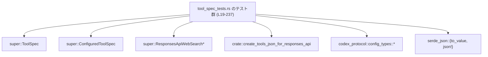
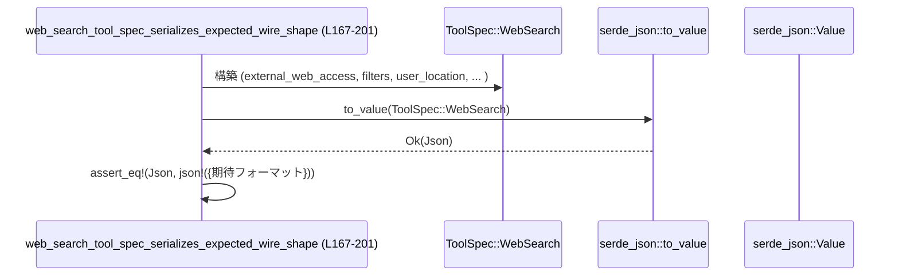

# tools/src/tool_spec_tests.rs コード解説

## 0. ざっくり一言

Tools API 向けの `ToolSpec`／`ConfiguredToolSpec` と Web 検索設定まわりについて、

- `.name()` が全バリアントで期待どおり返ること  
- 設定型からレスポンス API 型への変換  
- JSON シリアライズ時の「ワイヤフォーマット（線路上の形）」  

を検証する単体テストを集めたモジュールです（`tools/src/tool_spec_tests.rs:L19-237`）。

---

## 1. このモジュールの役割

### 1.1 概要

このモジュールは、Responses API 用のツール定義周辺の**公開 API の契約**をテストで保証する役割を持ちます。

- `ToolSpec` や `ConfiguredToolSpec` の `name()` が仕様どおりの文字列を返すことを確認します（`L19-82`, `L84-105`）。
- Web 検索関連の設定型が、Responses API 用の型へ正しく `From` 変換されることを確認します（`L107-133`）。
- `create_tools_json_for_responses_api` や `serde_json::to_value` により生成される JSON が期待される構造になっていることを確認します（`L135-164`, `L167-201`, `L205-236`）。

### 1.2 アーキテクチャ内での位置づけ

このファイルは「テストモジュール」であり、実装そのものではなく、既存の型・関数のふるまいを検証します。

- 親モジュール（`super`）から `ToolSpec`, `ConfiguredToolSpec`, `ResponsesApiWebSearchFilters`, `ResponsesApiWebSearchUserLocation` を参照します（`L1-4`）。
- クレートルート（`crate`）から `JsonSchema`, `ResponsesApiTool`, `FreeformTool`, `FreeformToolFormat`, `AdditionalProperties`, `create_tools_json_for_responses_api` を参照します（`L5-10`, `L70-77`, `L138-149`, `L210-217`）。
- 外部クレート `codex_protocol::config_types` から Web 検索設定関連の型を参照し、それらから Responses API 用型への変換をテストします（`L11-14`, `L110-124`）。
- シリアライズには `serde_json::to_value` と `serde_json::json!` を利用し、`pretty_assertions::assert_eq` で期待値と比較します（`L15-16`, `L151-162`, `L185-200`, `L220-235`）。

依存関係の概要を次の Mermaid 図に示します。



### 1.3 設計上のポイント

コードから読み取れる特徴は次のとおりです。

- **純粋な関数 API を直接たたくテスト**  
  - すべてのテストは、`ToolSpec` などの公開コンストラクタ／メソッドを直接呼び出し、戻り値を確認しています（`ToolSpec::Function` 構築と `.name()` 呼び出し: `L22-36` など）。
- **JSON 形状（ワイヤフォーマット）の固定**  
  - `serde_json::to_value` と `json!` マクロを使い、生成された JSON のキー構造や値が完全一致することをテストしています（`L151-162`, `L185-200`, `L220-235`）。
- **設定型から API 型への `From` 変換の検証**  
  - `ResponsesApiWebSearchFilters::from(ConfigWebSearchFilters { ... })` など `From` 実装を経由した変換結果を、リテラル構築した期待値と比較しています（`L110-116`, `L118-132`）。
- **状態や並行性の要素はなし**  
  - 共有状態・スレッド・非同期処理などは登場せず、テスト対象も純粋なデータ変換とシリアライズに限定されています。

---

## 2. 主要な機能一覧

このモジュールに定義されているテスト関数と、その役割です。

- `tool_spec_name_covers_all_variants`: `ToolSpec` の各バリアントに対して `.name()` が期待どおりの文字列を返すことを検証します（`L19-82`）。
- `configured_tool_spec_name_delegates_to_tool_spec`: `ConfiguredToolSpec::name()` が内部の `ToolSpec` の `name()` に委譲していることを検証します（`L84-105`）。
- `web_search_config_converts_to_responses_api_types`: Web 検索設定のコンフィグ型から Responses API 用型への変換を検証します（`L107-133`）。
- `create_tools_json_for_responses_api_includes_top_level_name`: `create_tools_json_for_responses_api` がトップレベルに `name` フィールドを含む JSON を生成することを検証します（`L135-164`）。
- `web_search_tool_spec_serializes_expected_wire_shape`: `ToolSpec::WebSearch` の JSON シリアライズ結果が期待されるワイヤフォーマットになることを検証します（`L166-202`）。
- `tool_search_tool_spec_serializes_expected_wire_shape`: `ToolSpec::ToolSearch` の JSON シリアライズ結果が期待されるワイヤフォーマットになることを検証します（`L204-237`）。

---

## 3. 公開 API と詳細解説

### 3.1 型一覧（構造体・列挙体など）

このファイル自身には型定義はありませんが、テスト対象として登場する主要な型を整理します（いずれも他モジュールで定義）。

| 名前 | 種別 | 役割 / 用途 | 根拠 |
|------|------|-------------|------|
| `ToolSpec` | 列挙体（推定） | 各種ツール（function, tool_search, local_shell, image_generation, web_search, freeform など）の仕様を表現する型。`Function`, `ToolSearch`, `LocalShell`, `ImageGeneration`, `WebSearch`, `Freeform` といったバリアントが使われています。 | バリアント使用: `L22-36`, `L38-49`, `L50`, `L52-57`, `L59-67`, `L70-80`, `L88-99`, `L138-149`, `L169-183`, `L207-218` |
| `ConfiguredToolSpec` | 構造体（推定） | `ToolSpec` に追加設定（例えば並列呼び出しサポート）を付与したラッパー。`new` と `name` メソッドが存在することが分かります。 | コンストラクタと `.name()` 呼び出し: `L87-103` |
| `ResponsesApiTool` | 構造体（推定） | `ToolSpec::Function` 用の詳細情報（`name`, `description`, `strict`, `defer_loading`, `parameters`, `output_schema`）を保持します。 | 初期化箇所: `L22-33`, `L88-99`, `L138-149` |
| `ResponsesApiWebSearchFilters` | 構造体（推定） | Web 検索のフィルタ設定（ここでは `allowed_domains` のみ）を表します。`From<ConfigWebSearchFilters>` が実装されていることが分かります。 | 使用: `L110-116`, `L171-173` |
| `ResponsesApiWebSearchUserLocation` | 構造体（推定） | Web 検索で利用者の位置情報（`type`, `country`, `region`, `city`, `timezone`）を表します。`From<ConfigWebSearchUserLocation>` が実装されています。 | 使用: `L118-132`, `L174-180` |
| `JsonSchema` | 列挙体/構造体（推定） | JSON Schema を表現する型。`object` と `string` という関連関数から、パラメータ仕様のスキーマを組み立てる用途で使われています。 | `JsonSchema::object`: `L27-31`, `L41-45`, `L93-97`, `L143-147`, `L210-217`／`JsonSchema::string`: `L144-145`, `L212-213` |
| `FreeformTool` | 構造体（推定） | `ToolSpec::Freeform` 用の情報（`name`, `description`, `format`）を保持します。 | 使用: `L70-78` |
| `FreeformToolFormat` | 構造体（推定） | Freeform ツールのフォーマット仕様（`type`, `syntax`, `definition`）を保持します。ここでは grammar + lark という設定です。 | 使用: `L73-77` |
| `AdditionalProperties` | 列挙体（推定） | JSON Schema の `additionalProperties` を表現する型。`Boolean(false)` というバリアントが使われており、追加プロパティ禁止を示しています。 | 使用: `L216-217` |
| `ConfigWebSearchFilters` | 構造体（外部クレート） | 設定ファイルなどで使われる Web 検索フィルタの設定型。Responses API 用のフィルタ型への変換元です。 | 使用: `L12`, `L110-112` |
| `ConfigWebSearchUserLocation` | 構造体（外部クレート） | 設定ファイル側のユーザー位置情報型。Responses API 用の位置情報型への変換元です。 | 使用: `L13`, `L118-124` |
| `WebSearchUserLocationType` | 列挙体（外部クレート） | 位置情報の種別（ここでは `Approximate`）を表します。Responses API 側にも同じ enum が使われています。 | 使用: `L14`, `L119`, `L126` |
| `WebSearchContextSize` | 列挙体（外部クレート） | 検索コンテキストのサイズ（ここでは `High`）を表します。`ToolSpec::WebSearch` のフィールドとして利用されます。 | 使用: `L11`, `L181` |

> 種別欄の「推定」は、このチャンク内に定義がないため、命名と使用方法から判断していることを示します。

### 3.2 関数詳細

このファイルに定義されている 6 個のテスト関数について、テンプレートに沿って整理します。

---

#### `tool_spec_name_covers_all_variants()`

**概要**

- `ToolSpec` のすべての利用バリアントに対して、`ToolSpec::name()` が期待される文字列を返すことをテストします（`tools/src/tool_spec_tests.rs:L19-82`）。

**引数**

- なし（テスト関数標準形）。

**戻り値**

- `()`（テスト関数の標準的な戻り値）。  
  失敗時は `assert_eq!` が panic し、テストが失敗します。

**内部処理の流れ**

1. `ToolSpec::Function(ResponsesApiTool { name: "lookup_order", ... })` を構築し、`.name()` の結果が `"lookup_order"` と等しいことを `assert_eq!` で確認します（`L22-36`）。
2. `ToolSpec::ToolSearch { execution: "sync", description: ..., parameters: JsonSchema::object(...) }` の `.name()` が `"tool_search"` であることを確認します（`L38-49`）。
3. `ToolSpec::LocalShell {}` の `.name()` が `"local_shell"` であることを確認します（`L50`）。
4. `ToolSpec::ImageGeneration { output_format: "png" }` の `.name()` が `"image_generation"` であることを確認します（`L52-57`）。
5. `ToolSpec::WebSearch { ... }` の `.name()` が `"web_search"` であることを確認します（`L59-67`）。
6. `ToolSpec::Freeform(FreeformTool { name: "exec", ... })` の `.name()` が `"exec"` であることを確認します（`L70-80`）。

**Examples（使用例）**

このテスト自体が `.name()` の代表的な使用例になっています。`Function` バリアントを例として抜き出すと、次のようになります。

```rust
// ToolSpec::Function から名前を取得する例（L22-36 を要約）
let tool_spec = ToolSpec::Function(ResponsesApiTool {
    name: "lookup_order".to_string(),
    description: "Look up an order".to_string(),
    strict: false,
    defer_loading: None,
    parameters: JsonSchema::object(
        BTreeMap::new(), // プロパティなしのオブジェクト
        None,            // 必須フィールドなし
        None,            // additionalProperties の指定なし
    ),
    output_schema: None,
});

// name() は function 名を返す
assert_eq!(tool_spec.name(), "lookup_order");
```

**Errors / Panics**

- テスト内で `Result` や `Option` のエラー処理は行っていません。
- `assert_eq!` が失敗した場合に panic しますが、これはテスト失敗を表す通常の挙動です。

**Edge cases（エッジケース）**

- このテストは、実際に利用している 6 種類のバリアントのみを対象とし、未知のバリアントや将来追加されるバリアントはカバーしていません。
- 名前が `String` フィールドから来るもの (`Function`, `Freeform`) と、固定文字列 (`tool_search`, `local_shell`, `image_generation`, `web_search`) の両方をカバーしています。

**使用上の注意点**

- `ToolSpec::name()` を利用してツール識別子を取り出す場合、このテストから分かるように、`Function` と `Freeform` では構築時の `name` がそのまま使われることが前提になっています（`L22-24`, `L70-72`）。
- 新しい `ToolSpec` バリアントを追加した場合は、このテストに対応する `assert_eq!` を追加することで、`name()` の実装漏れを検出できます。

---

#### `configured_tool_spec_name_delegates_to_tool_spec()`

**概要**

- `ConfiguredToolSpec::name()` が内部に保持する `ToolSpec` の `name()` をそのまま返すことをテストします（`L84-105`）。

**引数**

- なし。

**戻り値**

- `()`。

**内部処理の流れ**

1. `ToolSpec::Function(ResponsesApiTool { name: "lookup_order", ... })` を構築します（`L88-99`）。
2. それを `ConfiguredToolSpec::new(…, /*supports_parallel_tool_calls*/ true)` に渡し、`ConfiguredToolSpec` インスタンスを作ります（`L87-101`）。
3. `ConfiguredToolSpec::name()` の返り値が `"lookup_order"` と一致することを `assert_eq!` で確認します（`L86-104`）。

**Examples（使用例）**

```rust
// ToolSpec を ConfiguredToolSpec でラップしてから名前を取得する例（L87-103 を要約）
let tool_spec = ToolSpec::Function(ResponsesApiTool {
    name: "lookup_order".to_string(),
    description: "Look up an order".to_string(),
    strict: false,
    defer_loading: None,
    parameters: JsonSchema::object(BTreeMap::new(), None, None),
    output_schema: None,
});

// true は supports_parallel_tool_calls の設定（詳細な意味はこのチャンクからは不明）
let configured = ConfiguredToolSpec::new(tool_spec, true);

// name() は内部の ToolSpec と同じ値を返す
assert_eq!(configured.name(), "lookup_order");
```

**Errors / Panics**

- 本テスト内でのエラーは `assert_eq!` 失敗による panic のみです。

**Edge cases**

- `supports_parallel_tool_calls` の値の違い（`true` / `false`）による `.name()` の挙動の違いはテストしていません。
- `ToolSpec` の他のバリアントを包含した `ConfiguredToolSpec` の挙動も、このテストではカバーしていません。

**使用上の注意点**

- `ConfiguredToolSpec` を外部へ露出する API で利用している場合、このテストから、利用者が期待するツール名は常に内部 `ToolSpec` 由来であることが暗黙の契約になっていると解釈できます（`L87-103`）。

---

#### `web_search_config_converts_to_responses_api_types()`

**概要**

- `codex_protocol::config_types` にある Web 検索設定用の型から、Responses API 用の `ResponsesApiWebSearchFilters` と `ResponsesApiWebSearchUserLocation` へ正しく変換されることをテストします（`L107-133`）。

**引数**

- なし。

**戻り値**

- `()`。

**内部処理の流れ**

1. `ConfigWebSearchFilters { allowed_domains: Some(vec!["example.com".to_string()]) }` を構築し（`L110-112`）、`ResponsesApiWebSearchFilters::from(...)` で変換します（`L110`）。
2. 変換結果が、同じフィールド値を持つ `ResponsesApiWebSearchFilters` リテラルと等しいことを `assert_eq!` で確認します（`L113-116`）。
3. 同様に `ConfigWebSearchUserLocation` を詳細なフィールド付きで構築し（`L118-124`）、`ResponsesApiWebSearchUserLocation::from(...)` で変換します（`L118`）。
4. 変換結果が、同じフィールド値を持つ `ResponsesApiWebSearchUserLocation` リテラルと等しいことを `assert_eq!` で確認します（`L125-132`）。

**Examples（使用例）**

```rust
// ConfigWebSearchFilters -> ResponsesApiWebSearchFilters への変換例（L110-116 を要約）
let config_filters = ConfigWebSearchFilters {
    allowed_domains: Some(vec!["example.com".to_string()]),
};

// From 実装による変換
let api_filters = ResponsesApiWebSearchFilters::from(config_filters);

// 同じ allowed_domains を持つことを期待
assert_eq!(
    api_filters,
    ResponsesApiWebSearchFilters {
        allowed_domains: Some(vec!["example.com".to_string()]),
    }
);
```

**Errors / Panics**

- `From` 実装を利用しているため、ここではエラー型は存在せず、変換は常に成功する前提です。
- テスト失敗時のみ `assert_eq!` により panic します。

**Edge cases**

- オプションフィールドが `None` のケース、複数ドメインや空ベクタなどはテストされていません。
- 位置情報に含まれる `WebSearchUserLocationType::Approximate` 以外のバリアントに対する挙動は、このテストからは不明です。

**使用上の注意点**

- 設定読み込み側のコードは `ConfigWebSearchFilters` / `ConfigWebSearchUserLocation` を使い、API 実行部分では Responses API 用の型を使う、という責務分離を前提としていると考えられます（型の命名と From 利用からの推測）。

---

#### `create_tools_json_for_responses_api_includes_top_level_name()`

**概要**

- `create_tools_json_for_responses_api` が、`ToolSpec::Function` から生成する JSON において、ツール名がトップレベルの `"name"` プロパティとして含まれることを検証します（`L135-164`）。

**引数**

- なし。

**戻り値**

- `()`。

**内部処理の流れ**

1. `JsonSchema::object` を用いて、`"foo"` という `string` 型プロパティを持つパラメータスキーマを作ります（`L143-147`）。
2. それを含む `ResponsesApiTool { name: "demo", description: "A demo tool", strict: false, ... }` を構築し、`ToolSpec::Function` に包みます（`L138-149`）。
3. この単一要素のスライスを `create_tools_json_for_responses_api(&[...])` に渡し、`Result` の `Ok` 側を `.expect("serialize tools")` で取り出します（`L138-150`）。
4. 結果が `vec![json!({ ... })]` で表現される JSON ベクタと等しいことを `assert_eq!` で確認します（`L151-162`）。

**Examples（使用例）**

```rust
// 単一の function ツールから tools JSON を生成する例（L138-163 を要約）
let tools = &[ToolSpec::Function(ResponsesApiTool {
    name: "demo".to_string(),
    description: "A demo tool".to_string(),
    strict: false,
    defer_loading: None,
    parameters: JsonSchema::object(
        BTreeMap::from([(
            "foo".to_string(),
            JsonSchema::string(None), // foo: string
        )]),
        None, // required なし
        None, // additionalProperties なし
    ),
    output_schema: None,
})];

let tools_json = create_tools_json_for_responses_api(tools).expect("serialize tools");

// 生成される JSON は、type/name/description/strict/parameters を含む
assert_eq!(
    tools_json,
    vec![json!({
        "type": "function",
        "name": "demo",
        "description": "A demo tool",
        "strict": false,
        "parameters": {
            "type": "object",
            "properties": {
                "foo": { "type": "string" }
            },
        },
    })]
);
```

**Errors / Panics**

- `create_tools_json_for_responses_api` は `Result` を返し、`.expect("serialize tools")` でエラー時に panic するようになっています（`L150`）。
- このテストからは、どのような条件でエラーが返るかは分かりません（関数定義がこのチャンクにないため）。

**Edge cases**

- 複数のツールを渡した場合の JSON 形状や順序はテストされていません。
- `required` 配列や `additionalProperties` が指定されるケースも、このテストでは扱っていません。

**使用上の注意点**

- このテストから、生成される JSON のトップレベルには `"type": "function"` と `"name": "<tool name>"` が含まれることが契約として読み取れます（`L151-155`）。
- クライアント側がこのフォーマットを前提としている可能性が高いため、フィールド名や階層を変える場合は互換性に注意する必要があります。

---

#### `web_search_tool_spec_serializes_expected_wire_shape()`

**概要**

- `ToolSpec::WebSearch` を `serde_json::to_value` でシリアライズしたときの JSON 構造が、期待されるワイヤフォーマットどおりであることを検証します（`L166-202`）。

**引数**

- なし。

**戻り値**

- `()`。

**内部処理の流れ**

1. `ToolSpec::WebSearch` を、以下のフィールド付きで構築します（`L169-183`）。
   - `external_web_access: Some(true)`
   - `filters: Some(ResponsesApiWebSearchFilters { allowed_domains: Some(vec!["example.com"]) })`
   - `user_location: Some(ResponsesApiWebSearchUserLocation { ... })`
   - `search_context_size: Some(WebSearchContextSize::High)`
   - `search_content_types: Some(vec!["text", "image"])`
2. これを `serde_json::to_value` に渡し、`serde_json::Value` へ変換します（`L169-184`）。
3. 変換結果が、`json!({ ... })` で表現された期待値と等しいことを `assert_eq!` で確認します（`L185-200`）。

**Examples（使用例）**

```rust
// WebSearch ツール仕様を JSON にシリアライズする例（L169-200 を要約）
let web_search_spec = ToolSpec::WebSearch {
    external_web_access: Some(true),
    filters: Some(ResponsesApiWebSearchFilters {
        allowed_domains: Some(vec!["example.com".to_string()]),
    }),
    user_location: Some(ResponsesApiWebSearchUserLocation {
        r#type: WebSearchUserLocationType::Approximate,
        country: Some("US".to_string()),
        region: Some("California".to_string()),
        city: Some("San Francisco".to_string()),
        timezone: Some("America/Los_Angeles".to_string()),
    }),
    search_context_size: Some(WebSearchContextSize::High),
    search_content_types: Some(vec!["text".to_string(), "image".to_string()]),
};

let json_value = serde_json::to_value(web_search_spec).expect("serialize web_search");

assert_eq!(
    json_value,
    json!({
        "type": "web_search",
        "external_web_access": true,
        "filters": {
            "allowed_domains": ["example.com"],
        },
        "user_location": {
            "type": "approximate",
            "country": "US",
            "region": "California",
            "city": "San Francisco",
            "timezone": "America/Los_Angeles",
        },
        "search_context_size": "high",
        "search_content_types": ["text", "image"],
    })
);
```

**Errors / Panics**

- `serde_json::to_value` のエラー時に `.expect("serialize web_search")` で panic します（`L184`）。
- どのようなフィールド構成でエラーになりうるかは、このテストからは分かりません。

**Edge cases**

- オプションフィールドが `None` の場合の出力（フィールドが省略されるかどうか）はテストされていません。
- `search_content_types` に空ベクタや不正な値を渡した場合の挙動も、このテストではカバーしていません。

**使用上の注意点**

- `"type": "web_search"` という固定文字列が JSON の種別識別子として使われることが、このテストから明確です（`L186`）。
- 列挙体 `WebSearchContextSize::High` が `"high"` という文字列としてシリアライズされることも、このテストが前提としています（`L181`, `L198-199`）。

---

#### `tool_search_tool_spec_serializes_expected_wire_shape()`

**概要**

- `ToolSpec::ToolSearch` の JSON シリアライズ結果が、特定のパラメータスキーマ（必須 `query` プロパティ、`additionalProperties: false`）を伴うワイヤフォーマットになることを検証します（`L204-237`）。

**引数**

- なし。

**戻り値**

- `()`。

**内部処理の流れ**

1. `JsonSchema::string(Some("Tool search query".to_string()))` を用いて `"query"` プロパティのスキーマを作成します（`L210-214`）。
2. それを 1 要素の `BTreeMap` に入れ、`JsonSchema::object(properties, Some(vec!["query"]), Some(AdditionalProperties::Boolean(false)))` を呼び出してオブジェクトスキーマを構築します（`L210-217`）。
3. 上記スキーマを `parameters` に設定した `ToolSpec::ToolSearch { execution: "sync", description: "...", parameters: ... }` を構築します（`L207-218`）。
4. `serde_json::to_value` で JSON に変換し、`json!({ ... })` で表現した期待値と `assert_eq!` で比較します（`L220-235`）。

**Examples（使用例）**

```rust
// ToolSearch ツール仕様を JSON にシリアライズする例（L207-235 を要約）
let tool_search_spec = ToolSpec::ToolSearch {
    execution: "sync".to_string(),
    description: "Search app tools".to_string(),
    parameters: JsonSchema::object(
        BTreeMap::from([(
            "query".to_string(),
            JsonSchema::string(Some("Tool search query".to_string())),
        )]),
        Some(vec!["query".to_string()]), // query は必須
        Some(AdditionalProperties::Boolean(false)), // 追加プロパティ禁止
    ),
};

let json_value = serde_json::to_value(tool_search_spec).expect("serialize tool_search");

assert_eq!(
    json_value,
    json!({
        "type": "tool_search",
        "execution": "sync",
        "description": "Search app tools",
        "parameters": {
            "type": "object",
            "properties": {
                "query": {
                    "type": "string",
                    "description": "Tool search query",
                }
            },
            "required": ["query"],
            "additionalProperties": false,
        },
    })
);
```

**Errors / Panics**

- `serde_json::to_value` のエラーを `.expect("serialize tool_search")` で panic に変換しています（`L219`）。

**Edge cases**

- `required` リストから `"query"` を外した場合や、`additionalProperties` を `true` にした場合の JSON 形状はテストされていませんが、期待フォーマットとの不一致となります。
- `parameters` に複数プロパティを含めるケースは、このテストからは扱われていません。

**使用上の注意点**

- このテストから、Tool Search API は少なくとも `query` プロパティを必須とし、追加プロパティを禁止するスキーマを想定していると読み取れます（`L210-217`, `L224-234`）。
- JSON Schema の `required` と `additionalProperties` を適切に設定しないと、クライアントとサーバのスキーマ不整合が発生する可能性があります。

---

### 3.3 その他の関数

- このモジュールには、上記 6 個のテスト関数以外の関数・メソッド定義はありません。

---

## 4. データフロー

代表的なシナリオとして、Web 検索ツール仕様のシリアライズ処理（`web_search_tool_spec_serializes_expected_wire_shape`, `L167-201`）を取り上げます。

1. テスト内で `ToolSpec::WebSearch` インスタンスが組み立てられます（filters, user_location, search_context_size などを含む）。
2. それを `serde_json::to_value` に渡し、`serde_json::Value`（JSON 値）へシリアライズします。
3. テスト内で構築した期待 JSON（`json!` マクロ）と比較し、一致するかを検証します。

Mermaid のシーケンス図は次のとおりです。



この流れはすべてメモリ内で完結しており、I/O や並行処理は関与しません。

---

## 5. 使い方（How to Use）

このモジュールはテスト専用ですが、その中身は `ToolSpec` や `create_tools_json_for_responses_api` を利用する際の実用的な例にもなっています。

以下のコード例では、このテストと同様に `JsonSchema` などがクレートルートから参照できる前提で記述します（実際のパスはプロジェクト構成に依存します）。

### 5.1 基本的な使用方法

**例: 単一の function ツールから Responses API 用の JSON を生成する**

```rust
use std::collections::BTreeMap;
use crate::{JsonSchema, ResponsesApiTool, ToolSpec, create_tools_json_for_responses_api};

fn build_tools_payload() -> Result<Vec<serde_json::Value>, serde_json::Error> {
    // パラメータスキーマ: 引数を持たない object
    let params = JsonSchema::object(BTreeMap::new(), None, None);

    // Function ツールを定義
    let tool_spec = ToolSpec::Function(ResponsesApiTool {
        name: "demo".to_string(),
        description: "A demo tool".to_string(),
        strict: false,
        defer_loading: None,
        parameters: params,
        output_schema: None,
    });

    // ツールリストを JSON に変換
    // create_tools_json_for_responses_api の戻り値型はこのチャンクからは不明ですが、
    // テストでは serde_json::Value の Vec と比較しています（L151-162）。
    let tools_json = create_tools_json_for_responses_api(&[tool_spec])?;

    Ok(tools_json)
}
```

この例は `create_tools_json_for_responses_api_includes_top_level_name` テスト（`L135-164`）と同じ使い方です。

### 5.2 よくある使用パターン

**パターン 1: WebSearch ツールの構築**

```rust
use crate::{ToolSpec, ResponsesApiWebSearchFilters, ResponsesApiWebSearchUserLocation};
use codex_protocol::config_types::WebSearchUserLocationType;
use codex_protocol::config_types::WebSearchContextSize;

let spec = ToolSpec::WebSearch {
    external_web_access: Some(true),
    filters: Some(ResponsesApiWebSearchFilters {
        allowed_domains: Some(vec!["example.com".to_string()]),
    }),
    user_location: Some(ResponsesApiWebSearchUserLocation {
        r#type: WebSearchUserLocationType::Approximate,
        country: Some("US".to_string()),
        region: Some("California".to_string()),
        city: Some("San Francisco".to_string()),
        timezone: Some("America/Los_Angeles".to_string()),
    }),
    search_context_size: Some(WebSearchContextSize::High),
    search_content_types: Some(vec!["text".to_string(), "image".to_string()]),
};

// 後は serde_json::to_value などでシリアライズ（L169-184 相当）
```

**パターン 2: ToolSearch ツールの構築**

```rust
use std::collections::BTreeMap;
use crate::{ToolSpec, JsonSchema, AdditionalProperties};

let params = JsonSchema::object(
    BTreeMap::from([(
        "query".to_string(),
        JsonSchema::string(Some("Tool search query".to_string())),
    )]),
    Some(vec!["query".to_string()]),              // query を必須にする（L215）
    Some(AdditionalProperties::Boolean(false)),   // 追加プロパティ禁止（L216-217）
);

let spec = ToolSpec::ToolSearch {
    execution: "sync".to_string(),
    description: "Search app tools".to_string(),
    parameters: params,
};

// serde_json::to_value(spec)? で JSON へ変換（L207-219 相当）
```

### 5.3 よくある間違い

**誤り例 1: function ツールのトップレベルに `name` を含めない**

```rust
// 誤り例（テスト L151-162 の期待フォーマットを満たさない）
json!({
    "type": "function",
    "description": "A demo tool",
    "parameters": { /* ... */ },
    // "name": "demo" がない
});
```

この場合、`create_tools_json_for_responses_api_includes_top_level_name` の期待（`L151-155`）に反します。

**正しい例**

```rust
json!({
    "type": "function",
    "name": "demo",
    "description": "A demo tool",
    "parameters": { /* ... */ },
});
```

**誤り例 2: ToolSearch の `required` や `additionalProperties` を設定しない**

```rust
// 誤り例: required と additionalProperties を None にしてしまう
let params = JsonSchema::object(
    /*properties*/ BTreeMap::new(),
    /*required*/ None,
    /*additional_properties*/ None,
);
```

この場合、`tool_search_tool_spec_serializes_expected_wire_shape` が期待している

```json
"required": ["query"],
"additionalProperties": false
```

（`L232-233`）が出力されず、クライアントの期待スキーマとズレる可能性があります。

### 5.4 使用上の注意点（まとめ）

- JSON フォーマットはテストで厳密に固定されているため、フィールド名・階層・列挙体の文字列表現を変更すると既存クライアントとの互換性に影響します（`L151-162`, `L185-200`, `L220-235`）。
- `JsonSchema::object` の `required` と `additional_properties` の指定は、スキーマ上の制約（必須項目・追加フィールド可否）に直結します（`L210-217`）。
- Web 検索関連の設定は、`codex_protocol::config_types` 側の型から `ResponsesApiWebSearch*` 型に変換される前提で設計されています（`L110-116`, `L118-132`）。両者のフィールド構造が変わった場合、`From` 実装とテストの更新が必要です。

---

## 6. 変更の仕方（How to Modify）

### 6.1 新しい機能を追加する場合

**例: 新しい `ToolSpec` バリアントを追加する**

1. 親モジュール（`super`）で `ToolSpec` に新しいバリアントを追加し、その `.name()` 実装とシリアライズロジックを実装します（定義はこのチャンクにはありません）。
2. このテストファイルに、次のような変更を加えるのが自然です。
   - `tool_spec_name_covers_all_variants` に、新バリアントの `.name()` を検証する `assert_eq!` を追加する（`L21-81` に倣う）。
   - 必要に応じて、新バリアント専用のシリアライズテストを追加する（`web_search_tool_spec_serializes_expected_wire_shape` や `tool_search_tool_spec_serializes_expected_wire_shape` を参考にする: `L167-201`, `L205-236`）。
3. `create_tools_json_for_responses_api` が新バリアントを扱う場合、対応する JSON フォーマットのテストを追加します（`L135-164` を参考）。

### 6.2 既存の機能を変更する場合

変更時に確認すべき点を箇条書きで整理します。

- **`ToolSpec::name()` の仕様変更**
  - 影響範囲: `tool_spec_name_covers_all_variants`（`L19-82`）、`ConfiguredToolSpec::name()` の挙動（`L84-105`）を再確認する必要があります。
  - 既存クライアントが名前文字列をキーにしている場合（このチャンクからは不明）、互換性に注意します。

- **Web 検索関連フィールドの追加・変更**
  - 影響範囲: `web_search_config_converts_to_responses_api_types`（設定からの変換: `L107-133`）、`web_search_tool_spec_serializes_expected_wire_shape`（JSON 形状: `L166-202`）。
  - `ConfigWebSearch*` 型と `ResponsesApiWebSearch*` 型の定義、`From` 実装を合わせて更新する必要があります。

- **ToolSearch のパラメータスキーマ変更**
  - 影響範囲: `tool_search_tool_spec_serializes_expected_wire_shape`（`L204-237`）。`required` や `additionalProperties` の契約が変わる場合は、テスト内容もそれに合わせて更新します。

- **エラー処理／戻り値型の変更**
  - `create_tools_json_for_responses_api` のエラー条件や型が変わった場合、`.expect("serialize tools")` の扱い（`L150`）や比較対象の JSON 構造を見直す必要があります。

---

## 7. 関連ファイル

このモジュールと密接に関係するモジュール・クレートを、インポート文を根拠に列挙します。

| パス / モジュール | 役割 / 関係 | 根拠 |
|------------------|------------|------|
| `super`（親モジュール） | `ConfiguredToolSpec`, `ResponsesApiWebSearchFilters`, `ResponsesApiWebSearchUserLocation`, `ToolSpec` を定義するモジュール。これらが本テストの主な対象です。具体的なファイルパスはこのチャンクからは分かりません。 | インポート: `L1-4` |
| `crate`（クレートルートまたは上位モジュール） | `AdditionalProperties`, `FreeformTool`, `FreeformToolFormat`, `JsonSchema`, `ResponsesApiTool`, `create_tools_json_for_responses_api` を提供し、ToolSpec 周辺のツール仕様と JSON 生成ロジックを実装していると考えられます。 | インポート: `L5-10` |
| `codex_protocol::config_types` | Web 検索のコンフィグレーション用型（`WebSearchContextSize`, `WebSearchFilters`, `WebSearchUserLocation`, `WebSearchUserLocationType`）を提供する外部クレート。設定から API 型への変換元となっています。 | インポート: `L11-14`, 使用: `L110-124`, `L181` |
| `serde_json` | `serde_json::json` マクロと `serde_json::to_value` によるシリアライズを提供。ワイヤフォーマットの検証に使われます。 | インポート: `L16`, 使用: `L151-162`, `L169-185`, `L220-235` |
| `pretty_assertions` | `assert_eq` を再エクスポートし、差分表示を改善するためのテスト用ユーティリティ。すべてのテストアサーションで利用されています。 | インポート: `L15`, 使用: `L21-36`, `L37-49`, `L50`, `L52-57`, `L59-67`, `L70-80`, `L86-104`, `L109-116`, `L117-132`, `L137-163`, `L168-201`, `L206-236` |

---

### Bugs / Security / Contracts / Edge Cases（このモジュールから読み取れる範囲）

- **バグの可能性**
  - テストコード自体に明白なロジックバグは見当たりません（すべてが単純な構築と比較です）。
  - ただし、仕様変更時にテストを更新し忘れると、契約に対する検証が漏れる可能性があります（特に新規 `ToolSpec` バリアント追加時）。

- **セキュリティ**
  - このモジュールはシリアライズ結果の形状のみを扱い、外部入力や I/O は扱わないため、直接的なセキュリティ問題は読み取れません。
  - `additionalProperties: false` の指定（`L216-217`, `L232-233`）から、スキーマで許可されていないフィールドを拒否する設計方針があることが分かります。

- **契約（Contracts）**
  - `ToolSpec::name()` が返す識別子の文字列は、少なくともこの 6 ケースにおいて固定であることが契約になっています（`L21-81`）。
  - Web 検索・ToolSearch の JSON 構造（キー名・列挙体の文字列化）はクライアントとの契約です（`L185-200`, `L220-235`）。

- **エッジケース**
  - オプションフィールドが未設定（`None`）のケースや、空コレクションなどはテストされていません。
  - このため、そうしたケースの挙動は、このチャンクのコードだけでは判断できません。
