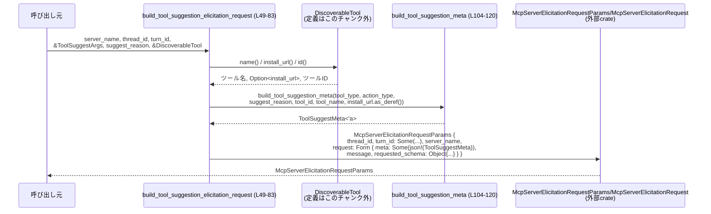
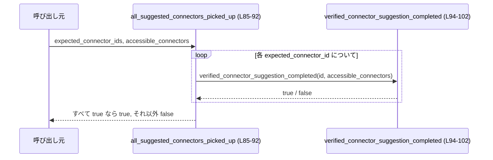

# tools/src/tool_suggest.rs コード解説

## 0. ざっくり一言

`codex_app_server_protocol` の型を用いて、  
「ツール（コネクタ）をユーザーに提案するための elicitation リクエスト」と  
「提案したコネクタが実際に利用可能になったかの判定」を行うヘルパー群です。  
（`ToolSuggest*` 構造体と 3 つの公開関数を提供します。`tool_suggest.rs:L16-47, L49-83, L85-102`）

---

## 1. このモジュールの役割

### 1.1 概要

- このモジュールは **ツール提案用のメタ情報の保持** と **MCP サーバーへの elicitation リクエスト生成**、  
  さらに **提案したコネクタが利用可能になったかの判定ロジック** を提供します。  
  （`ToolSuggestArgs`, `ToolSuggestResult`, `ToolSuggestMeta` と 3 つの関数を定義 `tool_suggest.rs:L18-47, L49-102`）

### 1.2 アーキテクチャ内での位置づけ

依存関係（このチャンクから分かる範囲）:

- 外部クレート
  - `codex_app_server_protocol::{AppInfo, McpElicitationObjectType, McpElicitationSchema, McpServerElicitationRequest, McpServerElicitationRequestParams}`（プロトコル定義）`tool_suggest.rs:L3-7`
  - `serde::{Deserialize, Serialize}`（シリアライズ／デシリアライズ）`tool_suggest.rs:L8-9`
  - `serde_json::json`（JSON メタ生成マクロ）`tool_suggest.rs:L10`
- 同一 crate 内
  - `crate::DiscoverableTool`, `DiscoverableToolAction`, `DiscoverableToolType`（ツール情報表現）`tool_suggest.rs:L12-14`

呼び出し側はこのチャンクには現れませんが、想定される関係を簡略図で表すと次のようになります。

```mermaid
graph TD
    Caller["呼び出し元（不明）"]
    TS["tool_suggest.rs\n(本ファイル)"]
    DT["DiscoverableTool\n(このチャンクには定義なし)"]
    PROTO["codex_app_server_protocol\n(AppInfo, Mcp* 型)"]
    SERDE["serde / serde_json"]

    Caller -->|build_tool_suggestion_elicitation_request (L49-83)| TS
    Caller -->|all_suggested_connectors_picked_up (L85-92)| TS
    TS --> DT
    TS --> PROTO
    TS --> SERDE
```

> ※ `Caller` や `DiscoverableTool` の実装はこのチャンクには現れないため、詳細は不明です。

### 1.3 設計上のポイント

- **データ転送オブジェクト（DTO）としての構造体**  
  - `ToolSuggestArgs` はリクエスト生成用の入力パラメータを保持します `tool_suggest.rs:L18-24`。
  - `ToolSuggestResult` はツール提案の結果（完了フラグ・ユーザー確認等）を表します `tool_suggest.rs:L26-35`。
  - `ToolSuggestMeta<'a>` は JSON に埋め込むメタデータとして設計されており、参照とライフタイムパラメータ `'a` を用いています `tool_suggest.rs:L37-47`。
- **状態を持たない純粋関数のみ**  
  - グローバルな可変状態はなく、関数はすべて引数から戻り値を計算するだけです `tool_suggest.rs:L49-83, L85-102, L104-120`。
- **エラーハンドリング**  
  - すべての公開関数は `bool` や構造体を直接返し、`Result` や `Option` は返していません `tool_suggest.rs:L49-83, L85-102`。
  - 内部で使用している標準ライブラリ操作は、一般的に panic しないもの（`to_string`, `BTreeMap::new` など）で構成されています `tool_suggest.rs:L57-59, L78`。
- **並行性**  
  - 可変な共有状態はなく、すべての関数は与えられた引数にのみ依存します。そのため、このモジュールのロジック自身は並行呼び出しによるデータ競合を持ちません `tool_suggest.rs:L49-83, L85-102`。  
  - ただし、`DiscoverableTool` や `AppInfo` のスレッド安全性はこのチャンクからは不明です。

---

## 2. 主要な機能一覧

- ツール提案引数の保持: `ToolSuggestArgs` — ツール種別・アクション種別・ID・理由を保持します `tool_suggest.rs:L18-24`。
- ツール提案結果の表現: `ToolSuggestResult` — 提案処理の完了状態やユーザー確認結果などを保持します `tool_suggest.rs:L26-35`。
- ツール提案メタデータの表現: `ToolSuggestMeta<'a>` — MCP フォームリクエストの `meta` として埋め込む情報を表現します `tool_suggest.rs:L37-47`。
- MCP フォームリクエスト生成: `build_tool_suggestion_elicitation_request` — ツール提案のための `McpServerElicitationRequestParams` を構築します `tool_suggest.rs:L49-83`。
- 期待したすべてのコネクタが拾われたかの判定: `all_suggested_connectors_picked_up` — 複数 ID について利用可能性を一括確認します `tool_suggest.rs:L85-92`。
- 個々のコネクタ提案完了の判定: `verified_connector_suggestion_completed` — 単一ツール ID について `AppInfo` から利用可能性を確認します `tool_suggest.rs:L94-102`。

---

## 3. 公開 API と詳細解説

### 3.1 型一覧（構造体・定数など）

| 名前 | 種別 | 役割 / 用途 | 定義位置 |
|------|------|------------|----------|
| `TOOL_SUGGEST_APPROVAL_KIND_VALUE` | 定数 `&'static str` | `ToolSuggestMeta.codex_approval_kind` に設定される固定文字列 `"tool_suggestion"` です。提案種別を示すメタ情報として使われます。 | `tool_suggest.rs:L16-16` |
| `ToolSuggestArgs` | 構造体（`Deserialize`） | ツール提案を行うための入力引数。ツール種別・アクション種別・ツール ID・提案理由を保持します。 | `tool_suggest.rs:L18-24` |
| `ToolSuggestResult` | 構造体（`Serialize, PartialEq, Eq`） | ツール提案処理の結果を表すデータ。完了フラグ、ユーザー確認結果、ツール情報、提案理由を含みます。このチャンク内での利用箇所はありません。 | `tool_suggest.rs:L26-35` |
| `ToolSuggestMeta<'a>` | 構造体（`Serialize, PartialEq, Eq`） | MCP の elicitation フォームリクエストの `meta` フィールドに埋め込まれるメタ情報。`&'a str` 参照を用いているため、所有権を持たずに既存の文字列を借用します。`install_url` は `Option` であり、`None` の場合シリアライズ時に省略されます。 | `tool_suggest.rs:L37-47` |

> `AppInfo`, `DiscoverableTool`, `DiscoverableToolType`, `DiscoverableToolAction` はこのチャンクには定義がなく、型の詳細は不明です（別モジュールからのインポートのみ確認できます `tool_suggest.rs:L3-7, L12-14`）。

### 3.2 関数詳細（重要な公開関数）

#### `build_tool_suggestion_elicitation_request(...) -> McpServerElicitationRequestParams`

**シグネチャ**

```rust
pub fn build_tool_suggestion_elicitation_request(
    server_name: &str,
    thread_id: String,
    turn_id: String,
    args: &ToolSuggestArgs,
    suggest_reason: &str,
    tool: &DiscoverableTool,
) -> McpServerElicitationRequestParams
```

- 定義位置: `tool_suggest.rs:L49-83`

**概要**

- ツール提案を MCP サーバーに伝えるための `McpServerElicitationRequestParams` を構築します。
- `ToolSuggestMeta` を JSON にシリアライズした `meta` を含む `Form` リクエストを生成します `tool_suggest.rs:L61-81`。

**引数**

| 引数名 | 型 | 説明 |
|--------|----|------|
| `server_name` | `&str` | サーバー名を表す文字列。`McpServerElicitationRequestParams.server_name` にコピーされます `tool_suggest.rs:L50, L64`。 |
| `thread_id` | `String` | 対象スレッド ID。`McpServerElicitationRequestParams.thread_id` にムーブされます `tool_suggest.rs:L51, L62`。 |
| `turn_id` | `String` | ターン ID。`Some(turn_id)` として `turn_id` フィールドに格納されます `tool_suggest.rs:L52, L63`。 |
| `args` | `&ToolSuggestArgs` | ツール種別・アクション種別・ID・理由が入った構造体。`build_tool_suggestion_meta` 呼び出し時に利用します `tool_suggest.rs:L53, L66-69`。 |
| `suggest_reason` | `&str` | 提案理由の文字列。`message` としてそのまま利用され、`meta` 内にも格納されます `tool_suggest.rs:L54, L59, L69`。 |
| `tool` | `&DiscoverableTool` | 提案対象ツール。`name()`, `install_url()`, `id()` メソッドを通じて情報を取得します `tool_suggest.rs:L55, L57-58, L70`。 |

※ `DiscoverableTool` のメソッドシグネチャはこのチャンクには現れませんが、`tool.name()`, `tool.install_url()`, `tool.id()` の存在は確認できます `tool_suggest.rs:L57-58, L70`。

**戻り値**

- `McpServerElicitationRequestParams`  
  - `Form` バリアントのリクエストを含み、`meta` に `ToolSuggestMeta` を JSON 化した値、`requested_schema` には空のオブジェクトスキーマを持つ構造体です `tool_suggest.rs:L61-81`。

**内部処理の流れ**

1. `tool.name()` を呼び出してツール名を取得し、`String` にコピーします `tool_suggest.rs:L57`。
2. `tool.install_url()` から `Option<T>` を受け取り、`map(ToString::to_string)` で `Option<String>` に変換します `tool_suggest.rs:L58`。
3. `suggest_reason` を文字列コピーして `message` に格納します `tool_suggest.rs:L59`。
4. `McpServerElicitationRequestParams` インスタンスを初期化します `tool_suggest.rs:L61-82`。
   - `thread_id` はそのままフィールドにセットされます `tool_suggest.rs:L62`。
   - `turn_id` は `Some(turn_id)` でラップされます `tool_suggest.rs:L63`。
   - `server_name` は `to_string()` で `String` に変換してセットされます `tool_suggest.rs:L64`。
   - `request` フィールドには `McpServerElicitationRequest::Form` を構築します `tool_suggest.rs:L65-81`。
5. `Form` の `meta` には `build_tool_suggestion_meta(...)` の戻り値を `serde_json::json!` マクロで JSON 値に変換したものを `Some(...)` として格納します `tool_suggest.rs:L66-73`。
6. `requested_schema` は `McpElicitationSchema` の `Object` 型で、`properties: BTreeMap::new()`, `required: None` という空スキーマとして構築されます `tool_suggest.rs:L75-80`。

**Examples（使用例）**

> 実際に `DiscoverableTool` や `ToolSuggestArgs` をどのように生成するかはこのチャンクには現れないため、ここでは既に用意されているものを利用する形の例を示します。

```rust
use codex_app_server_protocol::McpServerElicitationRequestParams; // プロトコル型
use crate::tools::tool_suggest::{ToolSuggestArgs, build_tool_suggestion_elicitation_request}; // パスは例

fn build_request_example(
    server_name: &str,                 // サーバー名
    thread_id: String,                 // スレッドID
    turn_id: String,                   // ターンID
    args: &ToolSuggestArgs,            // 事前に構築された引数
    tool: &DiscoverableTool,           // 事前に取得したツール
) -> McpServerElicitationRequestParams {
    // 提案理由は args 内の値を再利用する例
    let reason = &args.suggest_reason; // &str として借用

    // Elicitation リクエストパラメータを構築する
    build_tool_suggestion_elicitation_request(
        server_name,
        thread_id,
        turn_id,
        args,
        reason,
        tool,
    )
}
```

**Errors / Panics**

- この関数自体は `Result` を返さず、明示的な `panic!` も含みません `tool_suggest.rs:L49-83`。
- 使用している標準／serde 系 API は通常 panic しませんが、`tool.name()`, `tool.install_url()`, `tool.id()` の実装はこのチャンクには現れないため、それらが panic するかどうかは不明です `tool_suggest.rs:L57-58, L70`。

**Edge cases（エッジケース）**

- `install_url` が `None` の場合  
  - `ToolSuggestMeta.install_url` には `None` が入り、シリアライズ時には `skip_serializing_if = "Option::is_none"` によってフィールド自体が省略されます `tool_suggest.rs:L45-46, L58, L110, L119`。
- `suggest_reason` が空文字の場合  
  - そのまま `message` と `meta.suggest_reason` に格納されます。空かどうかのチェックは行っていません `tool_suggest.rs:L59, L69`。
- `requested_schema.properties` は常に空の `BTreeMap` です `tool_suggest.rs:L75-79`。
  - 要求されるフォーム項目が一切定義されない形のリクエストになります。

**使用上の注意点**

- この関数は **フォーム項目（プロパティ）の定義を一切行いません**。ユーザーからの追加入力を求めたい場合は、`requested_schema.properties` に項目を追加する必要があります（変更方法は 6 章参照）`tool_suggest.rs:L75-79`。
- `meta` は常に `Some(...)` で送られます `tool_suggest.rs:L66-73`。メタ情報を省略したいケースがある場合は、呼び出し側または関数の実装を変更する必要があります。

---

#### `all_suggested_connectors_picked_up(expected_connector_ids: &[String], accessible_connectors: &[AppInfo]) -> bool`

- 定義位置: `tool_suggest.rs:L85-92`

**概要**

- 期待している複数のコネクタ ID が、`accessible_connectors` 内で利用可能 (`is_accessible == true`) と判定されるかどうかを一括で確認します `tool_suggest.rs:L85-92, L94-102`。

**引数**

| 引数名 | 型 | 説明 |
|--------|----|------|
| `expected_connector_ids` | `&[String]` | 利用可能になっていることを期待するコネクタ ID の一覧です `tool_suggest.rs:L86, L89`。 |
| `accessible_connectors` | `&[AppInfo]` | 実際にアクセス可能なコネクタ情報一覧。`AppInfo.id` と `AppInfo.is_accessible` を利用します `tool_suggest.rs:L87, L96-101`。 |

**戻り値**

- `bool`  
  - すべての `expected_connector_ids` について `verified_connector_suggestion_completed` が `true` を返せば `true`、1つでも `false` であれば `false` です `tool_suggest.rs:L89-91`。

**内部処理の流れ**

1. `expected_connector_ids.iter()` を取り、各 ID についてクロージャを適用します `tool_suggest.rs:L89`。
2. 各 ID に対して `verified_connector_suggestion_completed(connector_id, accessible_connectors)` を呼び出します `tool_suggest.rs:L89-91`。
3. `.all(...)` により、すべての ID で `true` が返ったときのみ `true` を返します `tool_suggest.rs:L89`。

**Examples（使用例）**

> `AppInfo` の構造はこのチャンクには現れないため、ここでは「既に用意された `accessible_connectors`」を使う例とします。

```rust
use codex_app_server_protocol::AppInfo;
use crate::tools::tool_suggest::all_suggested_connectors_picked_up;

fn check_all_connectors(
    expected_ids: &[String],       // 期待しているコネクタID一覧
    accessible_connectors: &[AppInfo], // 実際にアクセス可能なコネクタ一覧
) -> bool {
    // すべての期待IDが「利用可能」と判定されていれば true
    all_suggested_connectors_picked_up(expected_ids, accessible_connectors)
}
```

**Errors / Panics**

- 明示的なエラーハンドリングや panic はなく、通常のイテレータ操作のみです `tool_suggest.rs:L85-92`。
- `accessible_connectors` の要素アクセスはイテレータ経由で行っており、インデックス越えなどはありません `tool_suggest.rs:L98-101`。

**Edge cases（エッジケース）**

- `expected_connector_ids` が空スライスの場合  
  - `.all(...)` の定義により、空集合に対する全称は真となるため `true` を返します `tool_suggest.rs:L89`。
- `accessible_connectors` が空スライスで `expected_connector_ids` が空でない場合  
  - いずれの ID に対しても `verified_connector_suggestion_completed` が `true` を返さないため、`false` になります `tool_suggest.rs:L89-91, L94-102`。
- `expected_connector_ids` に `accessible_connectors` に存在しない ID が含まれる場合  
  - 該当する `AppInfo` が見つからないので `verified_connector_suggestion_completed` は `false` を返し、全体として `false` になります `tool_suggest.rs:L98-101`。

**使用上の注意点**

- 「一つでも拾われていればよい」のではなく、「**すべて** の ID が拾われているか」を判定します（`all` を使用しているため）`tool_suggest.rs:L89`。
- 空の `expected_connector_ids` に対しては常に `true` を返す点は、仕様として明示しておくと利用側で誤解が減ります。

---

#### `verified_connector_suggestion_completed(tool_id: &str, accessible_connectors: &[AppInfo]) -> bool`

- 定義位置: `tool_suggest.rs:L94-102`

**概要**

- 指定された `tool_id` のコネクタが `accessible_connectors` 内に存在し、かつ `is_accessible` が `true` かどうかを判定します `tool_suggest.rs:L94-102`。

**引数**

| 引数名 | 型 | 説明 |
|--------|----|------|
| `tool_id` | `&str` | 判定対象となるコネクタの ID です `tool_suggest.rs:L95, L100`。 |
| `accessible_connectors` | `&[AppInfo]` | 利用可能性を含むコネクタ情報一覧です `tool_suggest.rs:L96-101`。 |

**戻り値**

- `bool`  
  - 対応する ID の `AppInfo` が存在し、かつ `is_accessible == true` なら `true`、それ以外は `false` です `tool_suggest.rs:L98-101`。

**内部処理の流れ**

1. `accessible_connectors.iter()` でイテレータを取得します `tool_suggest.rs:L98`。
2. `.find(|connector| connector.id == tool_id)` で、`id` が一致する最初の `AppInfo` を検索します `tool_suggest.rs:L99-100`。
3. `.is_some_and(|connector| connector.is_accessible)` を使い、  
   - 見つからなければ `false` を返し、  
   - 見つかった場合は `connector.is_accessible` の値をそのまま返します `tool_suggest.rs:L100-101`。

**Examples（使用例）**

```rust
use codex_app_server_protocol::AppInfo;
use crate::tools::tool_suggest::verified_connector_suggestion_completed;

fn check_single_connector(
    tool_id: &str,                   // 確認したいコネクタID
    accessible_connectors: &[AppInfo],
) -> bool {
    // 該当IDのコネクタが存在し、is_accessible == true なら true
    verified_connector_suggestion_completed(tool_id, accessible_connectors)
}
```

**Errors / Panics**

- イテレータと比較のみで構成されており、明示的なエラーや panic はありません `tool_suggest.rs:L94-102`。

**Edge cases（エッジケース）**

- `accessible_connectors` が空の場合  
  - `find` は常に `None` を返し、結果として `false` になります `tool_suggest.rs:L98-101`。
- 対応する `tool_id` が存在しない場合  
  - 同様に `None` となり、`false` を返します `tool_suggest.rs:L99-101`。
- 対応する `tool_id` が存在するが `is_accessible == false` の場合  
  - `is_some_and` により `false` が返されます `tool_suggest.rs:L100-101`。

**使用上の注意点**

- `tool_id` の比較は **完全一致**（`==`）で行われます。大文字小文字や前後の空白に対する正規化は行われません `tool_suggest.rs:L100`。
- 最初に一致した一件のみを見て `is_accessible` を評価します。重複 ID が存在する場合の挙動は、`accessible_connectors` の内容に依存します。

---

### 3.3 その他の関数

| 関数名 | 役割（1 行） | 定義位置 |
|--------|--------------|----------|
| `build_tool_suggestion_meta` | `ToolSuggestMeta` 構造体を組み立てるヘルパー。`build_tool_suggestion_elicitation_request` からのみ呼び出され、`meta` JSON の元データを提供します。 | `tool_suggest.rs:L104-120` |

`build_tool_suggestion_meta` の処理は単純な構造体初期化のみです。

```rust
fn build_tool_suggestion_meta<'a>(
    tool_type: DiscoverableToolType,
    action_type: DiscoverableToolAction,
    suggest_reason: &'a str,
    tool_id: &'a str,
    tool_name: &'a str,
    install_url: Option<&'a str>,
) -> ToolSuggestMeta<'a> {
    ToolSuggestMeta {
        codex_approval_kind: TOOL_SUGGEST_APPROVAL_KIND_VALUE,
        tool_type,
        suggest_type: action_type,
        suggest_reason,
        tool_id,
        tool_name,
        install_url,
    }
}
```

- すべてのフィールドがそのまま対応する構造体フィールドにコピーされています `tool_suggest.rs:L112-119`。
- ここで設定された値が `json!()` を通じて `meta` にシリアライズされます `tool_suggest.rs:L66-73`。

---

## 4. データフロー

### 4.1 ツール提案リクエスト生成のフロー

`build_tool_suggestion_elicitation_request (L49-83)` を中心としたデータの流れです。



- 呼び出し元は `ToolSuggestArgs` と `DiscoverableTool` を用意し、`build_tool_suggestion_elicitation_request` を呼び出します `tool_suggest.rs:L49-56`。
- 関数内で `ToolSuggestMeta` が構築され JSON 化され、`Form` 型の `McpServerElicitationRequest` に組み込まれます `tool_suggest.rs:L57-73`。
- 最終的に `McpServerElicitationRequestParams` が返却されます `tool_suggest.rs:L61-82`。

### 4.2 コネクタ利用可能性チェックのフロー



- `all_suggested_connectors_picked_up` は `expected_connector_ids` を反復し、各 ID に対して `verified_connector_suggestion_completed` を呼び出します `tool_suggest.rs:L89-91`。
- 個々の判定は `AppInfo.id` と `is_accessible` から算出されます `tool_suggest.rs:L98-101`。

---

## 5. 使い方（How to Use）

### 5.1 基本的な使用方法

#### ツール提案リクエストの生成

```rust
use codex_app_server_protocol::McpServerElicitationRequestParams;      // 戻り値の型
use crate::tools::tool_suggest::{ToolSuggestArgs, build_tool_suggestion_elicitation_request};

fn suggest_tool(
    server_name: &str,                   // サーバー名
    thread_id: String,                   // スレッドID
    turn_id: String,                     // ターンID
    args: &ToolSuggestArgs,              // 既に構築された提案引数
    tool: &DiscoverableTool,             // 対象ツール
) -> McpServerElicitationRequestParams {
    // 提案理由は args 内のフィールドを再利用する例
    let reason: &str = &args.suggest_reason;  // &String を &str として借用

    // MCP サーバーへ送信するリクエストパラメータを生成
    let params = build_tool_suggestion_elicitation_request(
        server_name,
        thread_id,
        turn_id,
        args,
        reason,
        tool,
    );

    params
}
```

- `ToolSuggestArgs` と `DiscoverableTool` の生成方法はこのチャンクには現れませんが、構造体とメソッドが存在することはコード上から確認できます `tool_suggest.rs:L18-24, L57-58, L70`。

#### コネクタがすべて拾われたかの確認

```rust
use codex_app_server_protocol::AppInfo;
use crate::tools::tool_suggest::all_suggested_connectors_picked_up;

fn verify_connectors(
    expected_ids: &[String],      // 期待するコネクタID一覧
    accessible: &[AppInfo],       // アクセス可能コネクタ一覧
) -> bool {
    all_suggested_connectors_picked_up(expected_ids, accessible)
}
```

### 5.2 よくある使用パターン

1. **提案 → コネクタ一覧取得 → 利用可能性チェック**

   - 提案時に記録したコネクタ ID 一覧を `expected_connector_ids` として保持しておき、後で `AppInfo` の一覧が取得できたタイミングで `all_suggested_connectors_picked_up` を呼び出す、という使い方が想定できます（ただし、これは呼び出し側の設計であり、このチャンクには現れません）。
   - コード上は、ID 比較と `is_accessible` フラグで判定していることが確認できます `tool_suggest.rs:L98-101`。

2. **単一コネクタのみチェック**

   - 特定の ID についてだけ確認したい場合は `verified_connector_suggestion_completed` を直接呼ぶことができます `tool_suggest.rs:L94-102`。

### 5.3 よくある間違い（起こりうる誤解）

コードから推測できる、挙動に関する誤解ポイントを列挙します。

```rust
// 誤解しやすい例: 「1件でも拾われていれば true だろう」と思ってしまう
let any_picked = all_suggested_connectors_picked_up(&expected_ids, &accessible);

// 実際の挙動:
// all_suggested_connectors_picked_up は "すべて" の expected_ids が
// 利用可能と判定されたときにのみ true を返します (Iterator::all)。
// 「1件でも拾われていればよい」場合には適しません。
```

- また、`expected_connector_ids` が空の場合に `true` を返す点は、仕様として明示しておかないと「何もチェックしていないのに成功とみなされてしまう」と感じられる可能性があります `tool_suggest.rs:L89`。

### 5.4 使用上の注意点（まとめ）

- **入力検証の欠如**  
  - このモジュールの関数は、文字列のフォーマットや非空チェックなどの入力検証を行いません。  
    例: `suggest_reason` や `tool_id` が空でもそのまま使用されます `tool_suggest.rs:L54, L59, L69, L95, L100`。
- **JSON メタの安全性**  
  - `meta` の生成には `serde_json::json!` が使われており、文字列は適切にエスケープされて JSON に埋め込まれます `tool_suggest.rs:L66-73`。  
    これにより JSON レベルでのインジェクションリスクは低く抑えられます。
- **並行性**  
  - このモジュールはグローバル状態を持たず、関数は引数のみを読み取り、結果を返します `tool_suggest.rs:L49-83, L85-102, L104-120`。  
    したがって、同じ関数を複数スレッドから同時に呼び出しても、このモジュール内でデータ競合が発生することはありません。  
    ただし、渡される `DiscoverableTool` や `AppInfo` のスレッド安全性は別途確認が必要です（このチャンクには情報がありません）。

---

## 6. 変更の仕方（How to Modify）

### 6.1 新しい機能を追加する場合

1. **メタ情報にフィールドを追加したい場合**

   - `ToolSuggestMeta<'a>` に新しいフィールドを追加します `tool_suggest.rs:L37-47`。
   - `build_tool_suggestion_meta` の構造体初期化で、そのフィールドを設定します `tool_suggest.rs:L112-119`。
   - `build_tool_suggestion_elicitation_request` は `build_tool_suggestion_meta` の呼び出し結果を `json!()` に渡しているだけなので、ここを変更する必要はありません `tool_suggest.rs:L66-73`。

2. **フォームに入力項目（スキーマ）を追加したい場合**

   - `requested_schema.properties: BTreeMap::new()` となっている部分にプロパティを挿入する処理を追加します `tool_suggest.rs:L75-79`。
   - 例えば、`properties.insert("field_name".to_string(), /* スキーマ定義 */);` のような形で拡張することが考えられます（具体的なスキーマ型は `McpElicitationSchema` の定義に依存し、このチャンクには現れません）。

3. **ツール提案の種類を増やしたい場合**

   - `DiscoverableToolType` や `DiscoverableToolAction` はこのチャンクには定義がないため、それらの定義側でバリアントを追加する必要があります `tool_suggest.rs:L20-21, L40-41, L105-106`。

### 6.2 既存の機能を変更する場合

- **提案完了の判定ロジックを変更する**

  - 現在は `id` 一致かつ `is_accessible == true` を「拾われた」と見なしています `tool_suggest.rs:L99-101`。
  - 条件を変更したい場合は `verified_connector_suggestion_completed` 内の `find` 条件と `is_some_and` 部分を修正します `tool_suggest.rs:L98-101`。

- **「すべて拾われた」条件を変更する**

  - `all_suggested_connectors_picked_up` は `Iterator::all` を利用して「全 ID が true」を条件としています `tool_suggest.rs:L89`。
  - 「一つ以上拾われればよい」などの条件に変えたい場合は、この `all` の使用箇所を変更することで対応できます。

- **影響範囲の確認**

  - このモジュール内の関数は他の関数からの呼び出し関係が単純で、  
    - `build_tool_suggestion_elicitation_request` → `build_tool_suggestion_meta`  
    - `all_suggested_connectors_picked_up` → `verified_connector_suggestion_completed`  
    の 2 系統のみです `tool_suggest.rs:L66-73, L89-91`。
  - ただし、実際の呼び出し元（他モジュール）はこのチャンクには現れないため、変更時には crate 全体での参照を確認する必要があります。

---

## 7. 関連ファイル

このチャンクから分かる関連ファイル・モジュールは次のとおりです。

| パス / モジュール | 役割 / 関係 |
|------------------|------------|
| `tools/src/tool_suggest_tests.rs` | `#[cfg(test)]` でインポートされているテストモジュール。`tool_suggest.rs` に対するテストが定義されていると推測できますが、内容はこのチャンクには現れません `tool_suggest.rs:L123-125`。 |
| `codex_app_server_protocol::AppInfo` | コネクタの ID (`id`) と利用可能性 (`is_accessible`) を含む型。提案完了の判定に使用されます `tool_suggest.rs:L3, L96-101`。ファイルパスはこのチャンクには現れません。 |
| `codex_app_server_protocol::{McpElicitationObjectType, McpElicitationSchema, McpServerElicitationRequest, McpServerElicitationRequestParams}` | MCP プロトコルに基づく elicitation リクエストおよびスキーマ定義。ツール提案フォームの構築に利用されます `tool_suggest.rs:L4-7, L61-81`。 |
| `crate::DiscoverableTool` | ツールの ID, 名前, インストール URL を提供する型として利用されています `tool_suggest.rs:L12, L55, L57-58, L70`。定義場所はこのチャンクには現れません。 |
| `crate::DiscoverableToolType` | ツール種別を表す型。`ToolSuggestArgs` および `ToolSuggestMeta` にフィールドとして含まれます `tool_suggest.rs:L20, L40, L105`。 |
| `crate::DiscoverableToolAction` | 提案アクション種別を表す型。`ToolSuggestArgs.action_type` および `ToolSuggestMeta.suggest_type` に用いられています `tool_suggest.rs:L21, L41, L106`。 |

---

### Bugs / Security / Contracts / Edge Cases のまとめ（このモジュール視点）

- **Bugs（コードから確認できる問題）**  
  - 明確なバグ（例: インデックス越え、明白なロジックミス）は、このチャンクからは確認できません。
- **Security**  
  - 外部から渡された文字列（例: `suggest_reason`, `tool_id`, `tool_name`）は `serde_json::json!` を通じて JSON にエスケープされます `tool_suggest.rs:L66-73`。  
    JSON レベルでのインジェクションは抑制されますが、ビジネスロジック的な検証（ホワイトリスト／長さ制限など）は行っていません。
- **Contracts（前提条件）**  
  - `verified_connector_suggestion_completed` は `AppInfo.id` が `tool_id` と等しいかどうかだけを見ます `tool_suggest.rs:L99-100`。  
    他の条件（例: バージョン一致など）は契約として含まれていません。
- **Edge Cases**  
  - `expected_connector_ids` が空でも `true` を返す（`all` の仕様）`tool_suggest.rs:L89`。
  - `install_url` が `None` の場合、`meta` の JSON からフィールドが完全に省略される `tool_suggest.rs:L45-46, L58, L110, L119`。

このモジュールは純粋計算とデータ構築のみを行っており、I/O や共有状態は扱っていません。そのため、性能・スケーラビリティ・監視（ロギングなど）は主に呼び出し側の責務となります（このチャンクには関連コードが現れません）。
