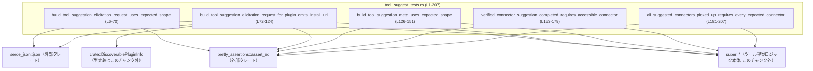
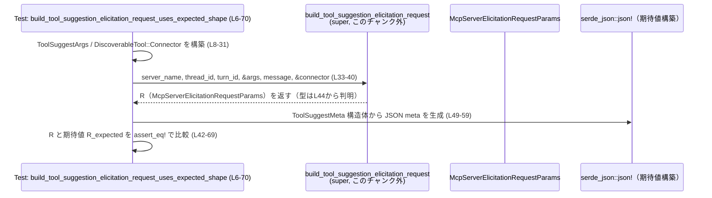

# tools/src/tool_suggest_tests.rs コード解説

## 0. ざっくり一言

- ツール提案（tool suggestion）関連のヘルパ関数が、期待どおりのリクエスト／メタデータ構造を組み立てているか、またコネクタ提案の完了判定ロジックが正しく動いているかを検証するテストモジュールです（`tool_suggest_tests.rs:L6-207`）。

---

## 1. このモジュールの役割

### 1.1 概要

- このモジュールは、親モジュール（`super::*`、定義はこのチャンク外）が提供する以下の関数の挙動をテストします（`tool_suggest_tests.rs:L1-4`）。
  - `build_tool_suggestion_elicitation_request`
  - `build_tool_suggestion_meta`
  - `verified_connector_suggestion_completed`
  - `all_suggested_connectors_picked_up`
- 具体的には、MCP（Model Context Protocol）向けのエリシテーション（入力要求）パラメータやメタデータの「フィールド構成」とコネクタ完了判定ロジックの「真偽値の条件」を固定し、将来の変更でインターフェイスが壊れないようにするための回帰テストになっています。

### 1.2 アーキテクチャ内での位置づけ

このテストモジュールが、どの型・関数に依存しているかを簡略図にします。



- 依存先のコアロジック（`super::*`）や型定義（`DiscoverablePluginInfo` など）は、このファイルには現れず、別ファイルに定義されています。
- このモジュール自体はテスト専用であり、公開 API を直接提供しません。

### 1.3 設計上のポイント

- **構造体の完全一致を検証**  
  - `assert_eq!` で返り値と期待値の構造体を丸ごと比較し、フィールドの取りこぼしや誤設定を検出しています（`tool_suggest_tests.rs:L42-69, L98-123, L137-150`）。
- **JSON メタデータの形を固定**  
  - `serde_json::json!` マクロで `ToolSuggestMeta` を JSON に変換した値を `meta` フィールドとして比較することで、JSON の形（キー・値）を保証しています（`tool_suggest_tests.rs:L49-59, L105-113`）。
- **状態を持たない純粋関数前提のテスト**  
  - すべてのテストは、入力を与えて戻り値を比較するだけであり、副作用や共有状態は前提としていません。
- **ブール関数の契約をテスト**  
  - `verified_connector_suggestion_completed` と `all_suggested_connectors_picked_up` は `bool` を返す関数としてテストされており、特定の ID セットに対する真偽の関係が固定されています（`tool_suggest_tests.rs:L171-178, L199-206`）。

---

## 2. 主要な機能一覧（コンポーネントインベントリー）

### 2.1 このファイル内のテスト関数一覧

| 名前 | 種別 | 役割 / テスト対象 | 根拠 |
|------|------|-------------------|------|
| `build_tool_suggestion_elicitation_request_uses_expected_shape` | テスト関数 | コネクタ向けの `build_tool_suggestion_elicitation_request` が期待どおりの `McpServerElicitationRequestParams` を返すことを検証 | `tool_suggest_tests.rs:L6-70` |
| `build_tool_suggestion_elicitation_request_for_plugin_omits_install_url` | テスト関数 | プラグイン向けの `build_tool_suggestion_elicitation_request` で `install_url` が `None` になることを検証 | `tool_suggest_tests.rs:L72-124` |
| `build_tool_suggestion_meta_uses_expected_shape` | テスト関数 | `build_tool_suggestion_meta` が `ToolSuggestMeta` を正しく構築することを検証 | `tool_suggest_tests.rs:L126-151` |
| `verified_connector_suggestion_completed_requires_accessible_connector` | テスト関数 | `verified_connector_suggestion_completed` が、指定 ID のコネクタが一覧に存在する場合のみ `true` を返すことを検証 | `tool_suggest_tests.rs:L153-179` |
| `all_suggested_connectors_picked_up_requires_every_expected_connector` | テスト関数 | `all_suggested_connectors_picked_up` が、期待されるすべてのコネクタ ID が一覧に含まれる場合のみ `true` を返すことを検証 | `tool_suggest_tests.rs:L181-207` |

### 2.2 テスト対象となっている主な関数・型（このファイル外に定義）

このファイルから参照されているが、定義が現れないコンポーネントです。

| 名前 | 種別 | 役割 / 用途（このファイルから分かる範囲） | 使用箇所 / 根拠 |
|------|------|--------------------------------------------|-----------------|
| `ToolSuggestArgs` | 構造体 | ツール提案のコンテキスト（ツール種別、アクション種別、ID、理由）を保持 | フィールド初期化から `tool_type`, `action_type`, `tool_id`, `suggest_reason` を持つと分かる（`tool_suggest_tests.rs:L8-13, L74-79`） |
| `DiscoverableToolType` | 列挙体 | ツールの種別（`Connector`, `Plugin` 等）を表す | `DiscoverableToolType::Connector` / `::Plugin` の使用（`tool_suggest_tests.rs:L9, L75, L129, L141`） |
| `DiscoverableToolAction` | 列挙体 | ツールに対するアクション種別（例: `Install`）を表す | `DiscoverableToolAction::Install` の使用（`tool_suggest_tests.rs:L10, L76, L130, L142`） |
| `DiscoverableTool` | 列挙体 | コネクタ・プラグインなどの Discoverable なツールを表すラッパー | `DiscoverableTool::Connector(Box::new(AppInfo {..}))` / `::Plugin(Box::new(DiscoverablePluginInfo {..}))`（`tool_suggest_tests.rs:L14-31, L80-87`） |
| `AppInfo` | 構造体 | コネクタアプリの基本情報（`id`, `name`, `description`, `install_url`, `is_accessible` 等）を保持 | `AppInfo { .. }` フィールド列挙から推定（`tool_suggest_tests.rs:L14-31, L155-169, L183-197`）※定義自体はこのチャンクに現れません |
| `DiscoverablePluginInfo` | 構造体 | プラグインの情報（`id`, `name`, `description`, `has_skills`, `mcp_server_names`, `app_connector_ids`）を保持 | `use crate::DiscoverablePluginInfo;` と構造体リテラルから（`tool_suggest_tests.rs:L2, L80-87`） |
| `McpServerElicitationRequestParams` | 構造体 | MCP サーバへのエリシテーションリクエストのパラメータ（`thread_id`, `turn_id`, `server_name`, `request`） | 期待値の構造体リテラルからフィールドが判明（`tool_suggest_tests.rs:L44-68, L100-121`） |
| `McpServerElicitationRequest` | 列挙体 | エリシテーションの種類（ここでは `Form`）とそのペイロードを表す | `McpServerElicitationRequest::Form { meta, message, requested_schema }` の形から（`tool_suggest_tests.rs:L48-67, L104-121`） |
| `ToolSuggestMeta` | 構造体 | ツール提案のメタデータ（承認種別、ツール種別、アクション、理由、ID、名前、インストール URL） | JSON 化と構造体リテラル両方から（`tool_suggest_tests.rs:L49-59, L105-113, L139-149`） |
| `McpElicitationSchema` | 構造体 | フォーム入力のスキーマ（`schema_uri`, `type_`, `properties`, `required`） | リテラルからフィールドが分かる（`tool_suggest_tests.rs:L61-66, L115-120`） |
| `McpElicitationObjectType` | 列挙体 | スキーマの型（ここでは `Object`）を表す | `McpElicitationObjectType::Object` の利用（`tool_suggest_tests.rs:L63, L117`） |
| `TOOL_SUGGEST_APPROVAL_KIND_VALUE` | 定数 | `ToolSuggestMeta.codex_approval_kind` に入る承認種別の文字列（または類似の値） | 構造体リテラルのフィールド値（`tool_suggest_tests.rs:L50, L106, L140`） |

---

## 3. 公開 API と詳細解説（テストから読み取れる契約）

このセクションでは、「親モジュールで公開されているとみなせる」関数について、テストから分かる契約を整理します。  
関数の定義はこのファイルには存在しないため、**型の詳細や内部実装は不明**であり、ここではテストに現れる事実のみを記載します。

### 3.1 型一覧（構造体・列挙体など）

テストで特に重要な型を整理します。

| 名前 | 種別 | 役割 / 用途 | 根拠 |
|------|------|-------------|------|
| `ToolSuggestArgs` | 構造体 | ツール提案リクエストを組み立てる際の引数パック。ツール種別・アクション種別・ツール ID・提案理由を保持 | `ToolSuggestArgs { tool_type, action_type, tool_id, suggest_reason }`（`tool_suggest_tests.rs:L8-13, L74-79`） |
| `DiscoverableTool` | 列挙体 | 実際のツール（コネクタ or プラグイン）を表すラッパー。`Connector(Box<AppInfo>)` / `Plugin(Box<DiscoverablePluginInfo>)` という形で保持 | `DiscoverableTool::Connector(Box::new(AppInfo { .. }))` 等（`tool_suggest_tests.rs:L14-31, L80-87`） |
| `AppInfo` | 構造体 | コネクタアプリのメタ情報。ID・名前・説明・インストール URL・アクセス可否などを保持 | `AppInfo { id, name, description, install_url, is_accessible, is_enabled, .. }`（`tool_suggest_tests.rs:L14-31, L155-169, L183-197`） |
| `DiscoverablePluginInfo` | 構造体 | プラグインのメタ情報。ID・名前・説明・スキル有無・MCP サーバ名・関連コネクタ ID などを保持 | 構造体リテラル（`tool_suggest_tests.rs:L80-87`） |
| `McpServerElicitationRequestParams` | 構造体 | MCP サーバへ送るエリシテーションリクエストパラメータ。スレッド ID、ターン ID、サーバ名、`request` 本体を保持 | 構造体リテラル（`tool_suggest_tests.rs:L44-68, L100-121`） |
| `McpServerElicitationRequest` | 列挙体 | エリシテーション種別。ここでは `Form { meta, message, requested_schema }` バリアントが使用されている | `McpServerElicitationRequest::Form { .. }`（`tool_suggest_tests.rs:L48-67, L104-121`） |
| `ToolSuggestMeta` | 構造体 | ツール提案メタデータ。承認種別、ツール種別、アクション種別、理由、ツール ID、ツール名、インストール URL を記録 | 構造体リテラル（`tool_suggest_tests.rs:L49-59, L105-113, L139-149`） |
| `McpElicitationSchema` | 構造体 | 入力フォームのスキーマ。ここでは空オブジェクト（プロパティなし）の Object 型スキーマを表現 | 構造体リテラル（`tool_suggest_tests.rs:L61-66, L115-120`） |

### 3.2 関数詳細（テストから分かる 4 件）

#### `build_tool_suggestion_elicitation_request(...) -> McpServerElicitationRequestParams`

**概要**

- ツール提案をユーザに提示するための MCP 用エリシテーションリクエスト (`McpServerElicitationRequestParams`) を組み立てる関数です。
- コネクタ向け／プラグイン向けのどちらのツールについても、適切な `ToolSuggestMeta` を `meta` フィールドに埋め込むことがテストされています（`tool_suggest_tests.rs:L42-69, L98-123`）。

**引数（テストから分かる範囲）**

| 引数名（仮） | 型（このチャンクから分かる範囲） | 説明 | 根拠 |
|--------------|----------------------------------|------|------|
| `server_name` | 少なくとも `&str` を受け取れる | MCP サーバ名。例: `"codex-apps"` | 呼び出し側で文字列リテラルを渡している（`tool_suggest_tests.rs:L34, L90`） |
| `thread_id` | 少なくとも `String` を受け取れる | スレッド ID。例: `"thread-1".to_string()` | 呼び出し側（`tool_suggest_tests.rs:L35, L91`） |
| `turn_id` | 少なくとも `String` を受け取れる | ターン ID。例: `"turn-1".to_string()` | 呼び出し側（`tool_suggest_tests.rs:L36, L92`） |
| `args` | `&ToolSuggestArgs` | ツール種別・アクション種別・ID・理由を含む引数パック | `&args` が渡されている（`tool_suggest_tests.rs:L37, L93`） |
| `message` | 少なくとも `&str` を受け取れる | ユーザに表示する提案メッセージ | `"Plan and reference events..."` などのリテラル（`tool_suggest_tests.rs:L38, L94`） |
| `tool` | `&DiscoverableTool` | 提案対象のツール（コネクタまたはプラグイン） | `&connector`, `&plugin` が渡されている（`tool_suggest_tests.rs:L39, L95`） |

**戻り値**

- 型: `McpServerElicitationRequestParams`  
  テストの期待値構築で明示的にこの型が使用されており、`assert_eq!` の両辺の型が一致するためです（`tool_suggest_tests.rs:L44, L100`）。
- 意味:
  - `thread_id`: 引数で渡したスレッド ID がそのまま入る（`tool_suggest_tests.rs:L45, L101`）。
  - `turn_id`: 引数で渡したターン ID が `Some(...)` として入る（`tool_suggest_tests.rs:L46, L102`）。
  - `server_name`: 引数のサーバ名がそのまま入る（`tool_suggest_tests.rs:L47, L103`）。
  - `request`: `McpServerElicitationRequest::Form { .. }` バリアントで、`meta`, `message`, `requested_schema` を持つ（`tool_suggest_tests.rs:L48-67, L104-121`）。

**内部処理の流れ（テストから分かる事実）**

テストから分かるのは、**結果の形**であり、どのような手続きで構築しているかは分かりません。ただし、少なくとも次の条件を満たすように構築されます。

1. `McpServerElicitationRequestParams.thread_id` に、引数のスレッド ID が格納される（`tool_suggest_tests.rs:L45, L101`）。
2. `turn_id` フィールドには `Some(引数のターン ID)` が格納される（`tool_suggest_tests.rs:L46, L102`）。
3. `server_name` フィールドには引数のサーバ名が格納される（`tool_suggest_tests.rs:L47, L103`）。
4. `request` フィールドは `McpServerElicitationRequest::Form { .. }` となり、内部の `message` は関数引数 `message` が `String` に変換されたものと一致する（`tool_suggest_tests.rs:L60-61, L114-115`）。
5. `requested_schema` は、`schema_uri: None`, `type_: McpElicitationObjectType::Object`, `properties: BTreeMap::new()`, `required: None` という空の Object スキーマである（`tool_suggest_tests.rs:L61-66, L115-120`）。
6. `meta` には `Some(json!(ToolSuggestMeta { .. }))` が入り、その中のフィールド値は `ToolSuggestArgs` やツール情報から決定される（`tool_suggest_tests.rs:L49-59, L105-113`）。
   - コネクタの場合: `install_url` は `Some(AppInfo.install_url)` になる（`tool_suggest_tests.rs:L24-27, L56-58`）。
   - プラグインの場合: `install_url` は `None` になる（`tool_suggest_tests.rs:L112-113`）。

**Examples（使用例）**

テストとほぼ同じ形での利用例です。

```rust
// コネクタ提案用の引数を準備する（tool_suggest_tests.rs:L8-13 をベース）
let args = ToolSuggestArgs {
    tool_type: DiscoverableToolType::Connector,
    action_type: DiscoverableToolAction::Install,
    tool_id: "connector_2128aebfecb84f64a069897515042a44".to_string(),
    suggest_reason: "Plan and reference events from your calendar".to_string(),
};

// コネクタ情報を DiscoverableTool でラップする（L14-31）
let connector = DiscoverableTool::Connector(Box::new(AppInfo {
    id: "connector_2128aebfecb84f64a069897515042a44".to_string(),
    name: "Google Calendar".to_string(),
    description: Some("Plan events and schedules.".to_string()),
    // 中略: 他フィールドはテストに準拠
    install_url: Some(
        "https://chatgpt.com/apps/google-calendar/connector_2128aebfecb84f64a069897515042a44"
            .to_string(),
    ),
    is_accessible: false,
    is_enabled: true,
    plugin_display_names: Vec::new(),
}));

// エリシテーションリクエストを構築（L33-40）
let request = build_tool_suggestion_elicitation_request(
    "codex-apps",
    "thread-1".to_string(),
    "turn-1".to_string(),
    &args,
    "Plan and reference events from your calendar",
    &connector,
);
```

**Errors / Panics**

- テストコード中には、この関数が `Result` を返す様子や `panic!` を起こすケースは現れていません。
- したがって、「正常に `McpServerElicitationRequestParams` を返すケース」しかこのチャンクからは分かりません。異常入力時の挙動は不明です。

**Edge cases（エッジケース）**

テストでカバーされているのは次のケースのみです。

- ツール種別:
  - `DiscoverableToolType::Connector`（`tool_suggest_tests.rs:L9`）
  - `DiscoverableToolType::Plugin`（`tool_suggest_tests.rs:L75`）
- アクション種別:
  - `DiscoverableToolAction::Install` のみ（`tool_suggest_tests.rs:L10, L76`）
- コネクタ:
  - `AppInfo.install_url` が `Some(..)` のケースのみ（`tool_suggest_tests.rs:L24-27`）。
- プラグイン:
  - `DiscoverablePluginInfo` に対し `install_url` を持たない前提で `meta.install_url` が `None` になること（`tool_suggest_tests.rs:L105-113`）。

上記以外（例: 他の `DiscoverableToolAction` バリアント、`install_url: None` のコネクタなど）の挙動は、このチャンクには現れません。

**使用上の注意点**

- `meta.install_url` の有無は、ツール種別によって異なることがテストされています。  
  コネクタでは `Some(..)` に、プラグインでは `None` になることが前提になっているため、この挙動を変えると既存テストが失敗します。
- `requested_schema` は常に空の Object 型スキーマとみなされています。入力項目を追加するような変更を行う場合は、このテストの更新が必要になります。

---

#### `build_tool_suggestion_meta(...) -> ToolSuggestMeta`

**概要**

- ツール提案に関するメタデータを `ToolSuggestMeta` 構造体として構築する関数です（`tool_suggest_tests.rs:L126-151`）。
- 少なくともコネクタのインストール提案に関して、各フィールドが期待値どおりに設定されることがテストされています。

**引数（テストから分かる範囲）**

```rust
let meta = build_tool_suggestion_meta(
    DiscoverableToolType::Connector,
    DiscoverableToolAction::Install,
    "Find and reference emails from your inbox",
    "connector_68df038e0ba48191908c8434991bbac2",
    "Gmail",
    Some("https://chatgpt.com/apps/gmail/connector_68df038e0ba48191908c8434991bbac2"),
);
```

| 引数名（仮） | 型（推定レベル） | 説明 | 根拠 |
|--------------|------------------|------|------|
| `tool_type` | `DiscoverableToolType` | ツール種別（ここでは `Connector`） | 呼び出し（`tool_suggest_tests.rs:L129`） |
| `action_type` | `DiscoverableToolAction` | アクション種別（ここでは `Install`） | `tool_suggest_tests.rs:L130` |
| `suggest_reason` | 少なくとも `&str` を受け取れる | 提案理由文 | 文字列リテラル（`tool_suggest_tests.rs:L131`） |
| `tool_id` | 少なくとも `&str` を受け取れる | ツール ID | 文字列リテラル（`tool_suggest_tests.rs:L132`） |
| `tool_name` | 少なくとも `&str` を受け取れる | ツール名 | 文字列リテラル（`tool_suggest_tests.rs:L133`） |
| `install_url` | 少なくとも `Option<&str>` を受け取れる | ツールのインストール URL | `Some("...")` リテラル（`tool_suggest_tests.rs:L134`） |

**戻り値**

- 型: `ToolSuggestMeta`（`tool_suggest_tests.rs:L139`）
- フィールド値（テストによる契約）:
  - `codex_approval_kind`: `TOOL_SUGGEST_APPROVAL_KIND_VALUE`（`tool_suggest_tests.rs:L140`）
  - `tool_type`: 引数 `tool_type`（`Connector`）そのまま（`tool_suggest_tests.rs:L141`）
  - `suggest_type`: 引数 `action_type`（`Install`）（`tool_suggest_tests.rs:L142`）
  - `suggest_reason`: 引数 `suggest_reason`（`tool_suggest_tests.rs:L143`）
  - `tool_id`: 引数 `tool_id`（`tool_suggest_tests.rs:L144`）
  - `tool_name`: 引数 `tool_name`（`tool_suggest_tests.rs:L145`）
  - `install_url`: 引数 `install_url`（`Some(..)`）（`tool_suggest_tests.rs:L146-148`）

**内部処理の流れ（テストから分かる事実）**

- テストから読み取れるのは、「引数がそのままフィールドに対応している」という点のみです。
- 特に `codex_approval_kind` は引数から渡されておらず、定数 `TOOL_SUGGEST_APPROVAL_KIND_VALUE` で固定される、という契約になっています（`tool_suggest_tests.rs:L140`）。

**Edge cases**

- `install_url: None` のケースなどはテストされておらず、このチャンクから挙動は分かりません。
- 他の `DiscoverableToolType` や `DiscoverableToolAction` に対する挙動も不明です。

**使用上の注意点**

- `codex_approval_kind` の値を変更する場合、ここでの期待値（`TOOL_SUGGEST_APPROVAL_KIND_VALUE`）との整合性に注意が必要です。
- `ToolSuggestMeta` にフィールドを追加・削除する場合は、構造体リテラルによる比較が壊れるため、このテストの更新が必要になります。

---

#### `verified_connector_suggestion_completed(connector_id, accessible_connectors) -> bool`

**概要**

- コネクタ提案が「完了」とみなせるかどうかを判定する関数です。
- テストでは、指定した `connector_id` が `accessible_connectors` 内の `AppInfo.id` と一致する場合に `true` を返す、という契約が確認されています（`tool_suggest_tests.rs:L153-179`）。

**引数（テストから分かる範囲）**

| 引数名（仮） | 型（推定レベル） | 説明 | 根拠 |
|--------------|------------------|------|------|
| `connector_id` | 少なくとも `&str` を受け取れる | チェック対象のコネクタ ID | 文字列リテラル `"calendar"`, `"gmail"`（`tool_suggest_tests.rs:L171, L175`） |
| `accessible_connectors` | `&[AppInfo]` または同等のスライス参照 | 利用可能なコネクタ一覧 | `&accessible_connectors` が渡されている（`tool_suggest_tests.rs:L172, L176`） |

**戻り値**

- 型: `bool`（`assert!` の引数として使われていることから分かります。`tool_suggest_tests.rs:L171-178`）

**内部処理の流れ（テストから分かる事実）**

テストで構築されたデータと結果から、次の契約が読み取れます。

1. `accessible_connectors` には `id: "calendar"` の `AppInfo` が 1 件だけ含まれます（`tool_suggest_tests.rs:L155-169`）。
2. `verified_connector_suggestion_completed("calendar", &accessible_connectors)` は `true` を返します（`tool_suggest_tests.rs:L171-174`）。
3. 同じ `accessible_connectors` で `verified_connector_suggestion_completed("gmail", &accessible_connectors)` は `false` を返します（`tool_suggest_tests.rs:L175-178`）。

ここから、

- 少なくとも「`accessible_connectors` 内に一致する `id` を持つ `AppInfo` が存在するかどうか」を見ている、
- 存在する場合に `true`、存在しない場合に `false`  
という振る舞いが確認できます。

`is_accessible` フィールドなど、他フィールドを参照しているかどうかは、このテストからは分かりません。

**Edge cases**

- `accessible_connectors` が空の場合の挙動はテストされていません。
- 同じ ID が複数回登場する場合の挙動も不明です。
- 大文字小文字差異など ID の比較方法（厳密一致かどうか）も、このチャンクからは読み取れません。

**使用上の注意点**

- この関数を「提案完了かどうかの判定ロジックの一部」として扱う場合、`accessible_connectors` に渡すリストがどのように生成されているか（フィルタ済みかどうか）に注意が必要です。  
  テストでは既に「calendar だけが入ったリスト」を渡しています。

---

#### `all_suggested_connectors_picked_up(expected_ids, accessible_connectors) -> bool`

**概要**

- 期待されるコネクタ ID の集合が、実際に利用可能なコネクタ一覧で全て拾われているか（picked up）を判定する関数です。
- テストでは、「一つでも足りない ID がある場合に `false` を返す」ことが確認されています（`tool_suggest_tests.rs:L181-207`）。

**引数（テストから分かる範囲）**

| 引数名（仮） | 型（推定レベル） | 説明 | 根拠 |
|--------------|------------------|------|------|
| `expected_ids` | `&[String]` または同等のスライス参照 | 期待されるコネクタ ID の一覧 | `&["calendar".to_string()]` などが渡されている（`tool_suggest_tests.rs:L199, L203`） |
| `accessible_connectors` | `&[AppInfo]` または同等 | 利用可能なコネクタ一覧 | 先ほどと同じ `accessible_connectors` を使用（`tool_suggest_tests.rs:L183-197, L200-201, L204-205`） |

**戻り値**

- 型: `bool`（`assert!` / `assert!(! .. )` の利用から分かります。`tool_suggest_tests.rs:L199-206`）。

**内部処理の流れ（テストから分かる事実）**

1. `accessible_connectors` には `id: "calendar"` の `AppInfo` が 1 件だけ含まれています（`tool_suggest_tests.rs:L183-197`）。
2. `expected_ids = ["calendar"]` の場合、`all_suggested_connectors_picked_up` は `true` を返します（`tool_suggest_tests.rs:L199-202`）。
3. `expected_ids = ["calendar", "gmail"]` の場合、同じ `accessible_connectors` に対して `false` を返します（`tool_suggest_tests.rs:L203-206`）。

ここから、

- 少なくとも「`expected_ids` の全てが `accessible_connectors` に含まれているか」をチェックし、全て含まれているときのみ `true` になる、
という契約が読み取れます。

**Edge cases**

- `expected_ids` が空のとき（vacuum true かどうか）は、このテストからは分かりません。
- `accessible_connectors` が空の場合の挙動も不明です。
- ID の比較方法（厳密一致かどうか）は不明です。

**使用上の注意点**

- `expected_ids` の順序が意味を持つかどうかはテストされておらず、このチャンクからは読み取れません（テストでは 1 件または 2 件の単純な配列のみを使用しています）。

---

### 3.3 その他の関数

このファイルに定義されている関数はすべてテストであり、補助関数やラッパーは存在しません。

| 関数名 | 役割（1 行） | 根拠 |
|--------|--------------|------|
| `build_tool_suggestion_elicitation_request_uses_expected_shape` | コネクタ向けリクエストの全フィールドが期待形状かを検証 | `tool_suggest_tests.rs:L6-70` |
| `build_tool_suggestion_elicitation_request_for_plugin_omits_install_url` | プラグイン向けリクエストで `install_url` が省略されることを検証 | `tool_suggest_tests.rs:L72-124` |
| `build_tool_suggestion_meta_uses_expected_shape` | 単体のメタデータ生成関数のフィールド値を検証 | `tool_suggest_tests.rs:L126-151` |
| `verified_connector_suggestion_completed_requires_accessible_connector` | 指定 ID のコネクタが一覧に存在する場合だけ `true` になることを検証 | `tool_suggest_tests.rs:L153-179` |
| `all_suggested_connectors_picked_up_requires_every_expected_connector` | 期待される全コネクタが拾われているときだけ `true` になることを検証 | `tool_suggest_tests.rs:L181-207` |

---

## 4. データフロー

ここでは代表的なシナリオとして、「コネクタ提案用エリシテーションリクエストの構築」テストにおけるデータの流れを示します。

### 4.1 コネクタ提案リクエスト構築のフロー

- テスト関数が `ToolSuggestArgs` と `DiscoverableTool::Connector` を構築し、それを `build_tool_suggestion_elicitation_request` に渡します（`tool_suggest_tests.rs:L8-40`）。
- 関数は `McpServerElicitationRequestParams` を返し、テスト側は `serde_json::json!` と構造体リテラルで期待値を作り、`assert_eq!` で比較します（`tool_suggest_tests.rs:L42-69`）。



- この図から分かるとおり、**テストは関数内部の処理を直接検査しているのではなく、入力に対する出力構造の完全一致**を検証しています。

---

## 5. 使い方（How to Use）

ここでは、テストコードをベースに、このモジュール外の関数をどのように利用するかのイメージを示します。

### 5.1 基本的な使用方法

#### コネクタのツール提案リクエストを作る

```rust
// コネクタ用の ToolSuggestArgs を組み立てる（L8-13）
let args = ToolSuggestArgs {
    tool_type: DiscoverableToolType::Connector,
    action_type: DiscoverableToolAction::Install,
    tool_id: "connector_2128aebfecb84f64a069897515042a44".to_string(),
    suggest_reason: "Plan and reference events from your calendar".to_string(),
};

// コネクタ AppInfo を作る（L14-31）
let connector_info = AppInfo {
    id: "connector_2128aebfecb84f64a069897515042a44".to_string(),
    name: "Google Calendar".to_string(),
    description: Some("Plan events and schedules.".to_string()),
    // 他フィールドは適宜設定
    install_url: Some(
        "https://chatgpt.com/apps/google-calendar/connector_2128aebfecb84f64a069897515042a44"
            .to_string(),
    ),
    is_accessible: false,
    is_enabled: true,
    plugin_display_names: Vec::new(),
};

// DiscoverableTool としてラップ（L14-31）
let connector = DiscoverableTool::Connector(Box::new(connector_info));

// エリシテーションリクエストを構築（L33-40）
let request = build_tool_suggestion_elicitation_request(
    "codex-apps",
    "thread-1".to_string(),
    "turn-1".to_string(),
    &args,
    "Plan and reference events from your calendar",
    &connector,
);

// 以降、request を MCP サーバに送信する、といった利用が想定されます。
// （送信処理自体はこのチャンクには現れません）
```

### 5.2 よくある使用パターン

#### プラグインの提案

```rust
// プラグイン用の ToolSuggestArgs（L74-79）
let args = ToolSuggestArgs {
    tool_type: DiscoverableToolType::Plugin,
    action_type: DiscoverableToolAction::Install,
    tool_id: "sample@openai-curated".to_string(),
    suggest_reason: "Use the sample plugin's skills and MCP server".to_string(),
};

// DiscoverablePluginInfo を用意して DiscoverableTool::Plugin に包む（L80-87）
let plugin = DiscoverableTool::Plugin(Box::new(DiscoverablePluginInfo {
    id: "sample@openai-curated".to_string(),
    name: "Sample Plugin".to_string(),
    description: Some("Includes skills, MCP servers, and apps.".to_string()),
    has_skills: true,
    mcp_server_names: vec!["sample-docs".to_string()],
    app_connector_ids: vec!["connector_calendar".to_string()],
}));

// リクエストを構築（L89-96）
let request = build_tool_suggestion_elicitation_request(
    "codex-apps",
    "thread-1".to_string(),
    "turn-1".to_string(),
    &args,
    "Use the sample plugin's skills and MCP server",
    &plugin,
);

// この場合、meta.install_url が None になることがテストから分かります（L105-113）。
```

### 5.3 よくある間違い（このチャンクから分かる範囲）

- ツール種別とツール情報の不整合  
  - 例: `ToolSuggestArgs.tool_type` を `Connector` にしておきながら、`DiscoverableTool::Plugin` を渡す、など。
  - このような不整合が起きた場合の挙動はこのチャンクには現れていませんが、少なくともテストでは「種別と中身が揃った」ケースのみを前提としています。

### 5.4 使用上の注意点（まとめ）

- `build_tool_suggestion_elicitation_request` / `build_tool_suggestion_meta` は、**フィールド名と意味**がテストで厳密に固定されています。  
  フィールドの追加・削除・名前変更を行うとテストが壊れるため、変更時はテスト更新が必須です。
- `verified_connector_suggestion_completed` / `all_suggested_connectors_picked_up` は、ID の存在チェックを行うブール関数として使われていますが、ID の比較方法や大小文字の扱いなど詳細はこのチャンクでは分かりません。  
  これらを変更する場合、既存のテストとの整合性を確認する必要があります。

---

## 6. 変更の仕方（How to Modify）

### 6.1 新しい機能を追加する場合（テスト観点）

このファイルから読み取れる範囲で、「どのようにテストを追加すべきか」を整理します。

1. **新しいツール種別やアクションを追加する場合**
   - `DiscoverableToolType` や `DiscoverableToolAction` にバリアントを追加した場合、その組み合わせに対する `build_tool_suggestion_elicitation_request` / `build_tool_suggestion_meta` の挙動を新しいテストで固定するのが自然です。
   - 例: `Uninstall` アクションを追加した場合、そのメタデータの形を検証するテスト関数を、既存テストと同様のパターンで追加できます。

2. **エリシテーションのスキーマを拡張する場合**
   - 現在は `properties: BTreeMap::new()` で空スキーマになっています（`tool_suggest_tests.rs:L64-65, L118-119`）。
   - 入力項目を追加するなら、`McpElicitationSchema` の期待値を更新するテストを追加・変更する必要があります。

3. **完了判定ロジックを拡張する場合**
   - `verified_connector_suggestion_completed` / `all_suggested_connectors_picked_up` について、より多くのケース（空リスト、重複 ID 等）をテストでカバーすることが考えられます。

### 6.2 既存の機能を変更する場合（テストと契約）

- **インターフェイス契約の確認**
  - このファイルのテストは、「どのフィールドにどの値が入るか」をかなり具体的に固定しています。
  - コアロジック側の変更を行う前に、これらのテストが表している仕様（特に `ToolSuggestMeta` や `McpServerElicitationRequestParams` の形）を再確認する必要があります。

- **影響範囲の確認**
  - `build_tool_suggestion_elicitation_request` の戻り値構造を変更すると、ここだけでなく、その型を利用している他モジュールへの影響があり得ます。  
    このファイルではその利用箇所は分かりませんが、少なくとも本テストは確実に影響を受けます。

- **エッジケースのテスト追加**
  - 現在は「代表的な正常系」のみがテストされているため、欠落しているエッジケース（`install_url: None` コネクタ、空リスト、ID 不一致、複数件など）を追加でテストすることで、安全性が高まります。

---

## 7. 関連ファイル

このモジュールと密接に関係する（と推定される）ファイル・モジュールです。  
実際のパスやファイル名はこのチャンクには現れないため、「super モジュール」として記述します。

| パス / モジュール | 役割 / 関係 | 根拠 |
|-------------------|------------|------|
| 親モジュール（`super`） | `build_tool_suggestion_elicitation_request`, `build_tool_suggestion_meta`, `verified_connector_suggestion_completed`, `all_suggested_connectors_picked_up` などの実装を提供するコアロジック | `use super::*;` とテストからの呼び出し（`tool_suggest_tests.rs:L1, L33-40, L89-96, L128-135, L171-178, L199-206`） |
| `crate::DiscoverablePluginInfo` を定義しているファイル | プラグイン情報の構造体定義を提供 | `use crate::DiscoverablePluginInfo;`（`tool_suggest_tests.rs:L2`） |
| 外部クレート `pretty_assertions` | `assert_eq!` マクロにより差分表示を改善しつつ等価比較を行う | `use pretty_assertions::assert_eq;`（`tool_suggest_tests.rs:L3`） |
| 外部クレート `serde_json` | `json!` マクロにより `ToolSuggestMeta` を JSON 値に変換し、`meta` フィールドの期待値として使用 | `use serde_json::json;`（`tool_suggest_tests.rs:L4, L49-59, L105-113`） |

---

### Bugs / Security / Contracts / Edge Cases / パフォーマンス等について（このファイルから分かる範囲）

- **バグの可能性（テスト観点）**
  - プラグインでも `install_url` を持たせたくなった場合、現状のテストは `None` を期待しているため失敗します（`tool_suggest_tests.rs:L112-113`）。仕様変更の際にはテストの意図を見直す必要があります。
- **セキュリティ**
  - このファイルには I/O や外部入力の処理はなく、固定文字列を使用しているため、直接的なセキュリティリスクは見られません。
- **契約・エッジケース**
  - 上で整理したとおり、テストがカバーしているのはごく一部の正常系です。特に「リストが空」「ID が重複」「install_url が None のコネクタ」などは未カバーです。
- **パフォーマンス / 並行性**
  - すべての関数は、テストから見る限り単純な構造体の組み立て・ bool 判定のみであり、重い計算や並行処理は行っていません。
  - スレッド間共有や同期のコードも登場しないため、並行性に特有の問題はこのチャンクからは読み取れません。
