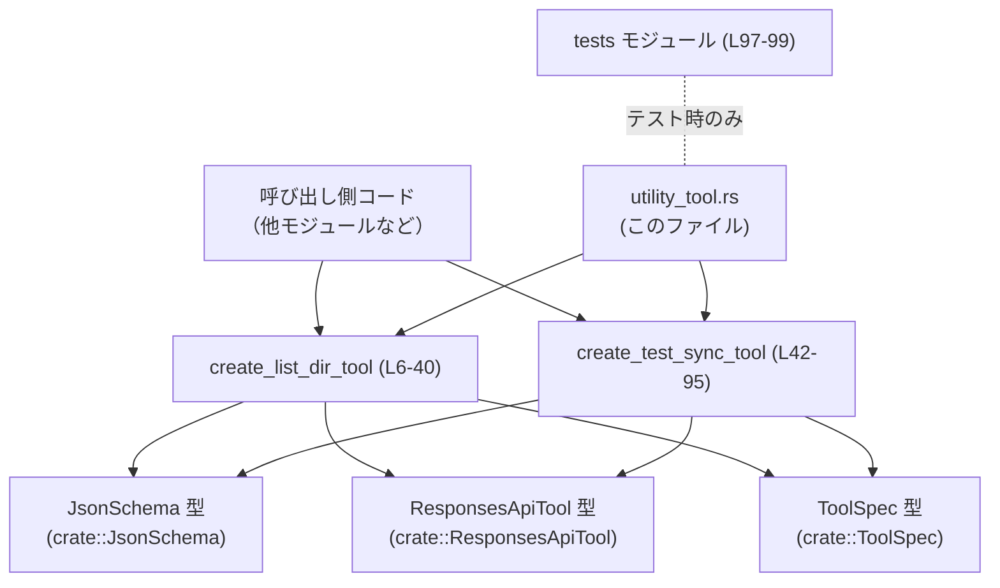
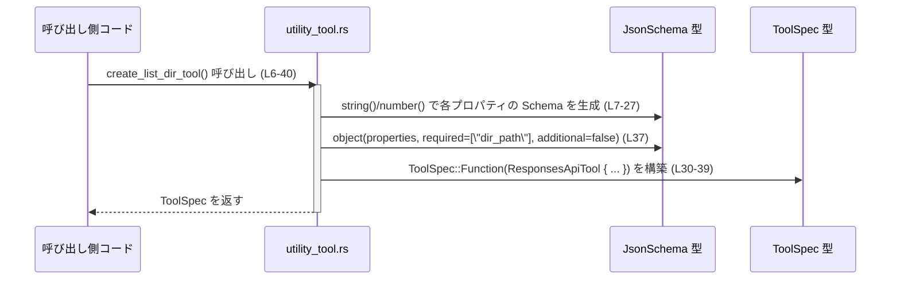
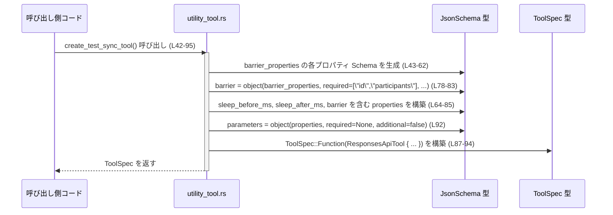

# tools/src/utility_tool.rs コード解説

## 0. ざっくり一言

- ローカルディレクトリ一覧ツール `list_dir` と、並行テスト用同期ツール `test_sync_tool` の **ToolSpec（ツール仕様）と JSON スキーマ定義を組み立てて返すヘルパーモジュール**です（`create_list_dir_tool`, `create_test_sync_tool`、`tools/src/utility_tool.rs:L6-40, L42-95`）。

---

## 1. このモジュールの役割

### 1.1 概要

- このモジュールは、ツール呼び出しに使うパラメータ仕様（JSON Schema）とメタデータをまとめた `ToolSpec` を構築する関数を提供します（`tools/src/utility_tool.rs:L6-40, L42-95`）。
- 提供するツールは次の 2 種類です。
  - `list_dir`: ローカルディレクトリのエントリ一覧を返すツールの仕様定義（`tools/src/utility_tool.rs:L6-40`）。
  - `test_sync_tool`: 複数の並行呼び出しを同期させるための、テスト専用ツールの仕様定義（`tools/src/utility_tool.rs:L42-95`）。
- 実際のディレクトリアクセスや同期処理のロジックはこのファイルには **含まれておらず**、ここではあくまで「型とパラメータ定義」を行っています。

### 1.2 アーキテクチャ内での位置づけ

このモジュールは、他モジュールから呼び出されて `ToolSpec` を返す「定義ファクトリ」の位置にあります。

- 上位コードは `create_list_dir_tool` / `create_test_sync_tool` を呼び出して `ToolSpec` を取得します（`tools/src/utility_tool.rs:L6, L42`）。
- その中で、パラメータの JSON Schema を `JsonSchema` 型で組み立て（`tools/src/utility_tool.rs:L7-27, L37, L43-62, L64-85`）、
- それを `ResponsesApiTool` 構造体に詰めて `ToolSpec::Function` に包んで返します（`tools/src/utility_tool.rs:L30-39, L87-94`）。

依存関係を簡略図で示すと次のようになります。



※ `JsonSchema`, `ResponsesApiTool`, `ToolSpec` がどのファイルに定義されているかは、このチャンクには現れません。

### 1.3 設計上のポイント

- **完全にステートレス**  
  - 構造体・フィールドは定義されず、2 つの `pub fn` が毎回新しい `ToolSpec` を組み立てるだけです（`tools/src/utility_tool.rs:L6-40, L42-95`）。
- **宣言的なパラメータ定義**  
  - 各ツールのパラメータは `BTreeMap<String, JsonSchema>` として定義されており（`tools/src/utility_tool.rs:L7-27, L43-62, L64-85`）、キー＝プロパティ名、値＝その JSON Schema という構造になっています。
- **エラー処理が不要な構造**  
  - 関数は引数を取らず、`Result` も返さず、`unwrap` 等も使っていません（`tools/src/utility_tool.rs` 全体）。通常の実行においてはパニックやエラーは発生しない実装になっています（メモリ確保失敗などは Rust 全体の問題）。
- **並行性の扱いは仕様レベル**  
  - `test_sync_tool` は「並行呼び出し間の同期に使う」ことを説明文で明示していますが（`"Identifier shared by concurrent calls..."`, `tools/src/utility_tool.rs:L45-48`）、同期処理そのものは外部ロジックに委ねられています。
- **テスト専用機能の明示**  
  - `test_sync_tool` が「Codex integration tests 用の内部同期ヘルパー」と説明されており（`tools/src/utility_tool.rs:L88-89`）、本番コードからは通常利用しないことが意図されていると解釈できます。

---

## 2. 主要な機能一覧

### 2.1 機能リスト（概要）

- `create_list_dir_tool`: ローカルディレクトリ一覧ツール `list_dir` の `ToolSpec` と JSON スキーマを構築して返します（`tools/src/utility_tool.rs:L6-40`）。
- `create_test_sync_tool`: 並行呼び出しの同期テスト用ツール `test_sync_tool` の `ToolSpec` と JSON スキーマを構築して返します（`tools/src/utility_tool.rs:L42-95`）。

### 2.2 コンポーネントインベントリー

#### 関数・モジュール

| 種別   | 名前                    | 役割 / 用途                                                      | 定義位置 |
|--------|-------------------------|------------------------------------------------------------------|----------|
| 関数   | `create_list_dir_tool`  | `list_dir` ツールの `ToolSpec` とパラメータ JSON Schema を組み立てて返す | `tools/src/utility_tool.rs:L6-40` |
| 関数   | `create_test_sync_tool` | `test_sync_tool` ツールの `ToolSpec` とパラメータ JSON Schema を組み立てて返す | `tools/src/utility_tool.rs:L42-95` |
| モジュール | `tests`             | テストコードを収めるモジュール。`utility_tool_tests.rs` を参照 | `tools/src/utility_tool.rs:L97-99` |

#### 外部依存コンポーネント（型など）

| 種別 | 名前                | 用途 / 役割                                       | 出現箇所 |
|------|---------------------|---------------------------------------------------|----------|
| 型   | `JsonSchema`        | パラメータの JSON Schema を構築するためのヘルパー | `tools/src/utility_tool.rs:L1, L7-27, L37, L43-62, L64-85, L92` |
| 型   | `ResponsesApiTool`  | ツールのメタデータ（名前・説明・パラメータなど）を格納する構造体 | `tools/src/utility_tool.rs:L2, L30-39, L87-94` |
| 型   | `ToolSpec`          | ツール仕様のトップレベル表現。関数の戻り値に使用 | `tools/src/utility_tool.rs:L3, L6, L30, L42, L87` |
| 型   | `BTreeMap`          | プロパティ名→`JsonSchema` のマップに使用         | `tools/src/utility_tool.rs:L4, L7, L43, L64` |

---

## 3. 公開 API と詳細解説

### 3.1 型一覧（構造体・列挙体など）

このファイルで **新たに定義される型はありません**。ただし、公開関数のインターフェースや内部で以下の型が重要な役割を果たします。

| 名前              | 種別     | 役割 / 用途                                                                 | 出現箇所 |
|-------------------|----------|-----------------------------------------------------------------------------|----------|
| `ToolSpec`        | 型（crate 内） | ツールの仕様（名前・説明・パラメータ定義など）を表すトップレベル型。両関数の戻り値。 | `tools/src/utility_tool.rs:L3, L6, L30, L42, L87` |
| `ResponsesApiTool`| 構造体（crate 内） | `ToolSpec` の一種として、レスポンス API 用のツール仕様を表現する構造体。名前・説明・パラメータを持つ。 | `tools/src/utility_tool.rs:L2, L30-39, L87-94` |
| `JsonSchema`      | 型（crate 内） | JSON Schema 形式でパラメータ定義を行うヘルパー。`string`, `number`, `object` などのコンストラクタを持つ。 | `tools/src/utility_tool.rs:L1, L7-27, L37, L43-62, L64-85, L92` |
| `BTreeMap`        | 標準ライブラリ | プロパティ名→Schema のマップに使用される順序付きマップ。                  | `tools/src/utility_tool.rs:L4, L7, L43, L64` |

※ `ToolSpec`, `ResponsesApiTool`, `JsonSchema` の詳細実装はこのチャンクには現れません。

### 3.2 関数詳細

#### `create_list_dir_tool() -> ToolSpec`

**概要**

- ローカルディレクトリのエントリを列挙するツール `list_dir` の `ToolSpec` を構築して返します（`tools/src/utility_tool.rs:L6-40`）。
- パラメータとして、ディレクトリの絶対パス、開始オフセット、最大件数、探索深度を JSON Schema で定義しています（`tools/src/utility_tool.rs:L7-27, L37`）。

**引数**

- この関数は引数を取りません（`tools/src/utility_tool.rs:L6`）。

**戻り値**

- `ToolSpec`  
  - `ToolSpec::Function(ResponsesApiTool { ... })` の形で、名前 `"list_dir"`（`tools/src/utility_tool.rs:L31`）、説明文（`tools/src/utility_tool.rs:L32-34`）、パラメータスキーマ（`tools/src/utility_tool.rs:L7-27, L37`）を含む仕様オブジェクトです。

**内部処理の流れ（アルゴリズム）**

1. `BTreeMap::from([...])` を用いて、パラメータ名から `JsonSchema` へのマップ `properties` を作成します（`tools/src/utility_tool.rs:L7-27`）。
   - `dir_path`: `JsonSchema::string(...)`、説明は「Absolute path to the directory to list.」（`tools/src/utility_tool.rs:L9-11`）。
   - `offset`: `JsonSchema::number(...)`、「Must be 1 or greater.」（`tools/src/utility_tool.rs:L13-17`）。
   - `limit`: `JsonSchema::number(...)`、「The maximum number of entries to return.」（`tools/src/utility_tool.rs:L19-21`）。
   - `depth`: `JsonSchema::number(...)`、「Must be 1 or greater.」（`tools/src/utility_tool.rs:L23-27`）。
2. `ToolSpec::Function(ResponsesApiTool { ... })` を構築します（`tools/src/utility_tool.rs:L30-39`）。
   - `name` に `"list_dir"` を設定（`tools/src/utility_tool.rs:L31`）。
   - `description` に「Lists entries in a local directory ...」という説明を設定（`tools/src/utility_tool.rs:L32-34`）。
   - `strict` に `false` を設定（`tools/src/utility_tool.rs:L35`）。
   - `defer_loading` に `None` を設定（`tools/src/utility_tool.rs:L36`）。
   - `parameters` に `JsonSchema::object(...)` を設定し、必須フィールドとして `"dir_path"` のみを指定（`tools/src/utility_tool.rs:L37`）。
   - `output_schema` は `None`（`tools/src/utility_tool.rs:L38`）。
3. 構築した `ToolSpec` をそのまま返します（`tools/src/utility_tool.rs:L30-39`）。

簡易フローチャート:

```mermaid
flowchart TD
    A["create_list_dir_tool 呼び出し (L6)"] --> B["properties = BTreeMap::from([...]) (L7-27)"]
    B --> C["parameters = JsonSchema::object(properties, required=[\"dir_path\"], additional=false) (L37)"]
    C --> D["ResponsesApiTool { name=\"list_dir\", description, strict=false, ... } (L30-38)"]
    D --> E["ToolSpec::Function(...) を返す (L30-39)"]
```

**Examples（使用例）**

> 注: 以下の例の `register_tool` 関数や `ToolRegistry` 型は、このチャンクには定義されていません。`ToolSpec` をどこかに登録するコンポーネントがある、という前提の擬似的な例です。

```rust
use crate::ToolSpec;
// create_list_dir_tool は同一モジュール、または適切に use されていると仮定する

// ツールレジストリに list_dir ツールを登録する例
fn register_list_dir_tool(registry: &mut Vec<ToolSpec>) {
    // list_dir の仕様を生成
    let list_dir_spec = create_list_dir_tool(); // utility_tool.rs:L6-40

    // 何らかのレジストリに登録する（ここでは単純に Vec に push）
    registry.push(list_dir_spec);
}
```

このコードにより、`create_list_dir_tool` から得た `ToolSpec` を、任意のレジストリに格納して後から利用できるようにできます。

**Errors / Panics**

- 関数は `Result` を返さず、内部でもエラーを返す API を呼び出していません（`tools/src/utility_tool.rs:L6-40`）。
- 通常の実行において、明示的なパニック呼び出し (`panic!`, `unwrap` 等) は存在しません。
- 実際のファイルシステムアクセスやパラメータバリデーションはこの関数の外部で行われるため、その際のエラー処理は別コンポーネントの責務です。

**Edge cases（エッジケース）**

関数自体は引数を取らないため、呼び出し時のエッジケースはほぼありません。  
ただし、「ツール仕様としての契約」という観点で、以下が示唆されています。

- `offset` / `depth` の説明に「Must be 1 or greater」とあるため（`tools/src/utility_tool.rs:L13-17, L23-27`）、呼び出し側は 0 以下の値を渡さないことが期待されます。  
  この制約をどう扱うか（エラーにするか、補正するか）は、このチャンクには現れません。
- `dir_path` が「Absolute path」と説明されているため（`tools/src/utility_tool.rs:L9-11`）、相対パスや無効なパスを渡した場合の挙動は、ツール実装側に依存します。

**使用上の注意点**

- **セキュリティ上の注意**  
  - `dir_path` は任意の絶対パスを受け付ける仕様になっているように読めます（`tools/src/utility_tool.rs:L9-11`）。どのディレクトリへのアクセスを許可するかは、ツール実装側または上位レイヤーで制御する必要があります。このファイルからは制限の有無は分かりません。
- **契約と検証の分離**  
  - 「Must be 1 or greater」などの制約は説明文として書かれているだけであり、この関数では検証していません（`tools/src/utility_tool.rs:L13-17, L23-27`）。実際のバリデーションは別コンポーネントで実装する前提と考えられます。
- **パフォーマンス**  
  - 呼び出しごとに `BTreeMap` や `String` を新規生成しますが、処理量は少なく、通常は問題にならない程度です。

---

#### `create_test_sync_tool() -> ToolSpec`

**概要**

- 並行実行される複数のツール呼び出しを同期させるためのテスト用ツール `test_sync_tool` の `ToolSpec` を構築して返します（`tools/src/utility_tool.rs:L42-95`）。
- 「Codex integration tests の内部同期ヘルパー」と説明されており（`tools/src/utility_tool.rs:L88-89`）、主にテスト環境での並行性検証に用いられることが意図されています。

**引数**

- この関数も引数は取りません（`tools/src/utility_tool.rs:L42`）。

**戻り値**

- `ToolSpec`  
  - `ToolSpec::Function(ResponsesApiTool { ... })` の形で、名前 `"test_sync_tool"`（`tools/src/utility_tool.rs:L88`）、説明文（`tools/src/utility_tool.rs:L88-89`）、パラメータスキーマ（`tools/src/utility_tool.rs:L43-62, L64-85, L92`）を含む仕様オブジェクトです。

**内部処理の流れ（アルゴリズム）**

1. `barrier_properties` を `BTreeMap<String, JsonSchema>` として構築します（`tools/src/utility_tool.rs:L43-62`）。
   - `id`: `JsonSchema::string(...)`。「Identifier shared by concurrent calls that should rendezvous」（`tools/src/utility_tool.rs:L45-48`）。
   - `participants`: `JsonSchema::number(...)`。「Number of tool calls that must arrive before the barrier opens」（`tools/src/utility_tool.rs:L51-55`）。
   - `timeout_ms`: `JsonSchema::number(...)`。「Maximum time in milliseconds to wait at the barrier」（`tools/src/utility_tool.rs:L57-60`）。
2. 上記を `JsonSchema::object(barrier_properties, Some(vec!["id", "participants"]), Some(false.into()))` でオブジェクト型スキーマに変換します（`tools/src/utility_tool.rs:L78-83`）。
   - 必須プロパティは `"id"` と `"participants"` のみで、`timeout_ms` は任意です（`tools/src/utility_tool.rs:L80-82`）。
3. `properties` として、トップレベルのパラメータ定義を `BTreeMap::from([...])` で構築します（`tools/src/utility_tool.rs:L64-85`）。
   - `sleep_before_ms`: 任意の数値。「Optional delay in milliseconds before any other action」（`tools/src/utility_tool.rs:L66-69`）。
   - `sleep_after_ms`: 任意の数値。「Optional delay in milliseconds after completing the barrier」（`tools/src/utility_tool.rs:L72-75`）。
   - `barrier`: 上記 `barrier_properties` を使ったオブジェクト型スキーマ（`tools/src/utility_tool.rs:L78-83`）。
4. `ToolSpec::Function(ResponsesApiTool { ... })` を構築します（`tools/src/utility_tool.rs:L87-94`）。
   - `name` に `"test_sync_tool"` を設定（`tools/src/utility_tool.rs:L88`）。
   - `description` に「Internal synchronization helper used by Codex integration tests.」を設定（`tools/src/utility_tool.rs:L88-89`）。
   - `strict = false`, `defer_loading = None`（`tools/src/utility_tool.rs:L90-91`）。
   - `parameters` に `JsonSchema::object(properties, None, Some(false.into()))` を設定（必須プロパティは明示指定なし）（`tools/src/utility_tool.rs:L92`）。
   - `output_schema = None`（`tools/src/utility_tool.rs:L93`）。
5. 構築した `ToolSpec` を返します（`tools/src/utility_tool.rs:L87-94`）。

**Examples（使用例）**

> 注: ここでも、`run_concurrent_test_tools` などの関数はこのチャンクには存在しません。`ToolSpec` を利用する仮想的なテストコードの例です。

```rust
use crate::ToolSpec;

// テスト用に test_sync_tool の仕様を取得し、どこかのテストランナーに渡すイメージ
fn prepare_sync_tool_for_tests(tools: &mut Vec<ToolSpec>) {
    // test_sync_tool の ToolSpec を生成
    let sync_tool_spec = create_test_sync_tool(); // utility_tool.rs:L42-95

    tools.push(sync_tool_spec);
}

// （概念的な JSON パラメータ例）
// {
//   "sleep_before_ms": 100,
//   "sleep_after_ms": 50,
//   "barrier": {
//       "id": "test-case-1",
//       "participants": 3,
//       "timeout_ms": 5000
//   }
// }
```

このようなパラメータを持つツール仕様により、**同じ `barrier.id` と `participants` を共有する複数のツール呼び出し**が、テストベンチ外の実装によって同期されることが想定されます（説明文に基づく推測）。

**Errors / Panics**

- 関数自体はエラーを返さず、`panic!` や `unwrap` も使用していません（`tools/src/utility_tool.rs:L42-95`）。
- 並行性に関するエラー（期限切れ、参加者数不足など）が発生するかどうか、またその扱いは、このファイルには記述されていません。

**Edge cases（エッジケース）**

関数自身には引数がないため、実行時のエッジケースはほぼありません。  
ただし、ツール仕様の契約として、次のような点が重要になります（いずれも説明文とフィールド名から読み取れる範囲です）。

- `participants` が 0 または負の値の場合  
  - 説明には「Number of tool calls that must arrive before the barrier opens」とあるだけで、値の範囲は明示されていません（`tools/src/utility_tool.rs:L51-55`）。一般的なバリアの概念からは 1 以上が妥当と考えられますが、このチャンクから実際の検証・挙動は分かりません。
- `timeout_ms` が非常に大きいまたは負値の場合  
  - 説明では「Maximum time in milliseconds」としか述べられていないため（`tools/src/utility_tool.rs:L57-60`）、異常値の扱いは不明です。
- 複数の並行呼び出しが **同じ `id` を共有しない** 場合  
  - 説明には「Identifier shared by concurrent calls」とあるため（`tools/src/utility_tool.rs:L45-48`）、同じ `id` を共有することが前提と考えられます。`id` が一致しない呼び出し同士は同期されない可能性がありますが、具体的な挙動はこのチャンクには現れません。

**使用上の注意点**

- **テスト専用であること**  
  - 説明文に「Internal ... tests」とあることから（`tools/src/utility_tool.rs:L88-89`）、本番環境での使用ではなく、テストコードからのみ利用することが意図されていると解釈できます。
- **並行性の前提**  
  - このツールは複数の並行呼び出しを前提としており、「id を共有する」「participants の数だけ呼び出す」など、テストコード側で守るべき契約が存在すると考えられます。
- **タイムアウトの扱い**  
  - `timeout_ms` は任意であり、指定しない場合のデフォルト挙動（無制限待ちか、既定値を持つか）はこのファイルからは分かりません。テストコードを書く際には、テスト固有の要求に応じて明示的に指定するのが安全です。

---

### 3.3 その他の関数

- このファイルには、上記 2 つ以外の関数は定義されていません（`tools/src/utility_tool.rs` 全体）。

---

## 4. データフロー

このファイルに現れているデータフローは、「呼び出し側が関数を呼び出して `ToolSpec` を取得する」までです。  
`ToolSpec` の後段（実際のツール実行や JSON パラメータの処理）は他モジュールの責務であり、このチャンクには現れません。

### 4.1 `create_list_dir_tool` のデータフロー



### 4.2 `create_test_sync_tool` のデータフロー



---

## 5. 使い方（How to Use）

### 5.1 基本的な使用方法

典型的には、「ツールレジストリ」や「ツール一覧」を持つコンポーネントが、このモジュールの関数を呼び出して `ToolSpec` を登録する形が想定されます。

```rust
use crate::ToolSpec;

// このファイル内の関数を使う前提
fn register_all_tools(registry: &mut Vec<ToolSpec>) {
    // ディレクトリ一覧ツールを登録
    let list_dir_spec = create_list_dir_tool();         // tools/src/utility_tool.rs:L6-40
    registry.push(list_dir_spec);

    // テスト用同期ツールを登録（テスト環境限定で使うことが多い想定）
    let sync_tool_spec = create_test_sync_tool();       // tools/src/utility_tool.rs:L42-95
    registry.push(sync_tool_spec);
}
```

このようにして `ToolSpec` を集約しておくと、実際のツール実行コンポーネントが一覧を参照し、名前やパラメータスキーマに基づいてリクエストを処理できます。

### 5.2 よくある使用パターン

1. **list_dir ツールのみを本番用に登録し、test_sync_tool はテスト時だけ登録する**

```rust
#[cfg(not(test))]
fn register_runtime_tools(registry: &mut Vec<ToolSpec>) {
    registry.push(create_list_dir_tool());
}

#[cfg(test)]
fn register_test_tools(registry: &mut Vec<ToolSpec>) {
    registry.push(create_list_dir_tool());
    registry.push(create_test_sync_tool()); // テスト専用
}
```

1. **test_sync_tool のパラメータ例（JSON）**

ツール実装側に渡す JSON（または同等の構造体）の例:

```json
{
  "sleep_before_ms": 100,
  "sleep_after_ms": 50,
  "barrier": {
    "id": "suite-1-case-3",
    "participants": 4,
    "timeout_ms": 10000
  }
}
```

この JSON は、`create_test_sync_tool` が定義する `JsonSchema` に適合する形になっています（`tools/src/utility_tool.rs:L64-85`）。

### 5.3 よくある間違い

ここでは、定義されている説明文から想定される誤用例と、その是正例を示します。実際にどう扱われるかは、このファイルからは分かりません。

```rust
// 間違い例: offset に 0 を指定（説明では 1 以上が期待されている）
let bad_params = serde_json::json!({
    "dir_path": "/var/log",
    "offset": 0,     // "Must be 1 or greater." に反する（L13-17）
    "limit": 100
});

// 正しい例: offset を 1 以上にする
let ok_params = serde_json::json!({
    "dir_path": "/var/log",
    "offset": 1,
    "limit": 100
});
```

```rust
// 間違い例: test_sync_tool でバリア id をバラバラにする
let call1 = serde_json::json!({
    "barrier": { "id": "A", "participants": 2 }
});
let call2 = serde_json::json!({
    "barrier": { "id": "B", "participants": 2 }
});
// "Identifier shared by concurrent calls" に反する（L45-48）

// 正しい例: 同じ id を共有する
let call1_ok = serde_json::json!({
    "barrier": { "id": "sync-1", "participants": 2 }
});
let call2_ok = serde_json::json!({
    "barrier": { "id": "sync-1", "participants": 2 }
});
```

### 5.4 使用上の注意点（まとめ）

- **このモジュールは仕様定義のみ**  
  - 実際の I/O や同期処理は一切含まれていません。エラー処理・ログ出力・並行性制御は、`ToolSpec` を用いる別モジュール側の責務です。
- **パラメータ制約は説明文ベース**  
  - `offset` / `depth` の下限や `participants` の意味などは説明文字列にのみ記されています（`tools/src/utility_tool.rs:L13-17, L23-27, L45-55`）。これらを前提条件（契約）として扱う場合は、別途バリデーションを実装する必要があります。
- **テスト専用ツールの扱い**  
  - `test_sync_tool` は「内部同期ヘルパー」とされているため（`tools/src/utility_tool.rs:L88-89`）、プロダクションコードに露出させるかどうかは設計上の検討が必要です。
- **再利用コスト**  
  - 関数を呼ぶたびに新しい `ToolSpec` が生成されます。多数回利用する場合は、一度生成してキャッシュする設計も検討できます（このファイルからキャッシュの実装は読み取れません）。

---

## 6. 変更の仕方（How to Modify）

### 6.1 新しい機能を追加する場合

新しいツール用の `ToolSpec` を追加したい場合、このファイルの既存関数に倣うのが自然です。

1. **新しい関数を追加**

   - 例: `pub fn create_foo_tool() -> ToolSpec { ... }` を定義します（`create_list_dir_tool` や `create_test_sync_tool` と同様に、戻り値は `ToolSpec` にします）。

2. **パラメータ定義用の `BTreeMap` を作成**

   - `let properties = BTreeMap::from([...]);` 形式で、プロパティ名ごとに `JsonSchema` を定義します（`tools/src/utility_tool.rs:L7-27, L64-85` を参考）。

3. **必要に応じてネストしたオブジェクトスキーマを定義**

   - `create_test_sync_tool` の `barrier` のように、ネストされたオブジェクトが必要な場合は、別途 `*_properties` を定義し、`JsonSchema::object(...)` で包みます（`tools/src/utility_tool.rs:L43-62, L78-83`）。

4. **`ResponsesApiTool` と `ToolSpec::Function` を構築**

   - `ToolSpec::Function(ResponsesApiTool { ... })` のパターンに従い、`name`, `description`, `parameters` を設定します（`tools/src/utility_tool.rs:L30-39, L87-94`）。

5. **テストを追加**

   - テストは `#[cfg(test)] mod tests;` によって `utility_tool_tests.rs` にまとめられているため（`tools/src/utility_tool.rs:L97-99`）、新しいツール用のテストもそちらに追加するのが一貫した構成になります。  
   - このチャンクには `utility_tool_tests.rs` の内容は現れないため、既存テストの具体例は不明です。

### 6.2 既存の機能を変更する場合

変更時に注意すべき点を列挙します。

- **パラメータ名・構造を変更する場合**
  - `BTreeMap::from([...])` 内のキー名を変更すると、外部からの JSON が期待するフィールド名も変わります（`tools/src/utility_tool.rs:L7-27, L64-85`）。呼び出し側とテストをすべて追従させる必要があります。
- **必須プロパティの変更**
  - `JsonSchema::object` の第 2 引数（`Some(vec![...])`）を変更すると、必須パラメータの集合が変わります（`tools/src/utility_tool.rs:L37, L80-82, L92`）。バリデーションを行っている部分があれば、整合性の確認が必要です。
- **説明文の変更**
  - 説明文（特に「Must be 1 or greater」などの制約文）は事実上の仕様書として利用される可能性があります（`tools/src/utility_tool.rs:L13-17, L23-27, L45-60`）。変更する際は、実際の挙動・バリデーションとの不一致が生じないよう注意が必要です。
- **テストの更新**
  - `list_dir` や `test_sync_tool` のパラメータ仕様を変えた場合、それに依存するテスト（`utility_tool_tests.rs`）も合わせて変更する必要があります。具体的なテスト内容はこのチャンクからは分かりません。

---

## 7. 関連ファイル

| パス / モジュール                         | 役割 / 関係 |
|------------------------------------------|------------|
| `tools/src/utility_tool_tests.rs`       | `#[cfg(test)]` かつ `#[path = "utility_tool_tests.rs"]` で参照されるテストモジュール。`create_list_dir_tool` や `create_test_sync_tool` の仕様が正しく生成されることを検証していると推測されます（内容はこのチャンクには現れません）（`tools/src/utility_tool.rs:L97-99`）。 |
| `crate::ToolSpec` を定義するファイル     | ツール仕様のトップレベル型を定義。`create_*_tool` の戻り値として利用されています（`tools/src/utility_tool.rs:L3, L6, L30, L42, L87`）。パスはこのチャンクには現れません。 |
| `crate::ResponsesApiTool` を定義するファイル | ツールの名前・説明・パラメータスキーマを保持する構造体を定義。`ToolSpec::Function` の中身として利用されています（`tools/src/utility_tool.rs:L2, L30-39, L87-94`）。パスは不明です。 |
| `crate::JsonSchema` を定義するファイル   | JSON Schema ユーティリティを提供し、パラメータ定義に利用されています（`tools/src/utility_tool.rs:L1, L7-27, L37, L43-62, L64-85, L92`）。パスはこのチャンクには現れません。 |

このように、`tools/src/utility_tool.rs` はツール仕様定義の「ハブ」として、他の基盤型 (`ToolSpec`, `ResponsesApiTool`, `JsonSchema`) とテストコード（`utility_tool_tests.rs`）の間をつなぐ役割を果たしています。
