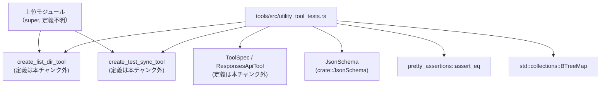
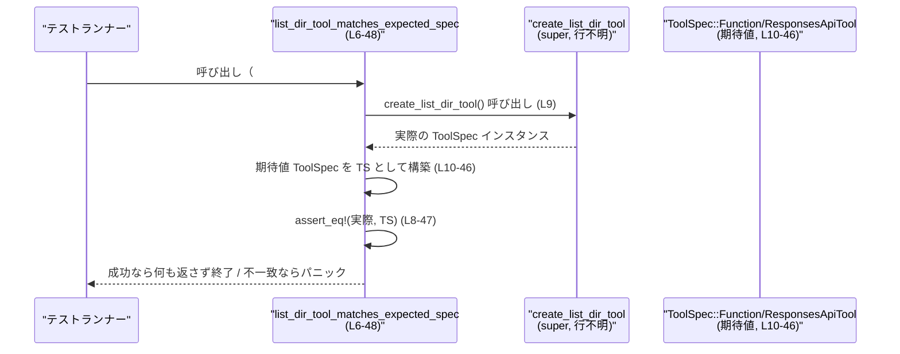

# tools/src/utility_tool_tests.rs コード解説

## 0. ざっくり一言

`create_list_dir_tool` と `create_test_sync_tool` が返すツール仕様（`ToolSpec`）が、期待どおりの JSON スキーマとメタ情報になっているかを検証する単体テスト用モジュールです。  
ファイルシステム操作用ツールと、並行実行テスト用の同期ツールの「契約（インターフェース）」を固定する役割を持ちます。

---

## 1. このモジュールの役割

### 1.1 概要

- このモジュールは、**ユーティリティツールの仕様オブジェクトの形を保証するためのテスト**を提供します。
- 具体的には、上位モジュールで定義されている
  - `create_list_dir_tool`
  - `create_test_sync_tool`  
  が返す `ToolSpec` が、期待されるフィールド・`JsonSchema`・説明文を持つかを `assert_eq!` で検証します（`tools/src/utility_tool_tests.rs:L7-47`, `L51-107`）。

### 1.2 アーキテクチャ内での位置づけ

このテストモジュールは「ユーティリティツール定義モジュール」の子として配置され、ツール仕様の整合性をチェックします。



> `use super::*;` により、`create_list_dir_tool` / `create_test_sync_tool` は上位モジュールからインポートされていますが、このチャンクには定義が現れません（`tools/src/utility_tool_tests.rs:L1`）。

### 1.3 設計上のポイント

- **契約テスト的な性格**:
  - ツールの JSON スキーマとメタ情報を「値の完全一致」で比較するため、仕様変更があればテストが確実に検知します（`assert_eq!` の使用, `L8-47`, `L52-107`）。
- **型安全なスキーマ構築**:
  - `JsonSchema::object`, `JsonSchema::number`, `JsonSchema::string` などの関数を用いて、型付きで JSON スキーマを構築しています（`L17-44`, `L60-104`）。
- **並行性テスト向けツール仕様の固定**:
  - `test_sync_tool` のパラメータに同期バリア（`barrier`）や遅延（`sleep_before_ms` / `sleep_after_ms`）が含まれており、並行実行テストのためのプロトコルを記述しています（`L62-85`, `L91-103`）。
- **エラーハンドリング方針**:
  - 本モジュール内では `assert_eq!` によるテスト失敗（パニック）以外のエラー処理は行っていません。

---

## 2. コンポーネント一覧（インベントリー）

### 2.1 関数（このファイル内で定義）

| 名前 | 種別 | 役割 / 用途 | 行範囲 |
|------|------|-------------|--------|
| `list_dir_tool_matches_expected_spec` | テスト関数 (`#[test]`) | `create_list_dir_tool` が、期待される `ToolSpec`（`list_dir` ツールの仕様）を返すことを検証する | `tools/src/utility_tool_tests.rs:L6-48` |
| `test_sync_tool_matches_expected_spec` | テスト関数 (`#[test]`) | `create_test_sync_tool` が、期待される `ToolSpec`（同期テスト用 `test_sync_tool` の仕様）を返すことを検証する | `tools/src/utility_tool_tests.rs:L50-108` |

### 2.2 このファイルから見える主要な外部コンポーネント

| 名前 | 種別 | 役割 / 用途 | 出現行 | 定義状況 |
|------|------|-------------|--------|----------|
| `create_list_dir_tool` | 関数 | `list_dir` ツール仕様 (`ToolSpec`) を生成 | `L9` | 上位モジュールに定義（このチャンクには現れない） |
| `create_test_sync_tool` | 関数 | `test_sync_tool` ツール仕様 (`ToolSpec`) を生成 | `L53` | 上位モジュールに定義（このチャンクには現れない） |
| `ToolSpec` | enum と思われる | ツール仕様のトップレベルコンテナ。`Function(ResponsesApiTool{...})` というバリアントを持つことが分かる | `L10`, `L54` | 定義はこのチャンクには現れない |
| `ResponsesApiTool` | 構造体と思われる | 1 つの関数ツールの詳細（`name`, `description`, `parameters` など）を保持する | `L10-46`, `L54-106` | 定義はこのチャンクには現れない |
| `JsonSchema` | 型（たぶん enum/struct） | パラメータの JSON スキーマを構築するユーティリティ。`object`, `number`, `string` メソッドを持つ | `L2`, `L17-44`, `L60-104` | `crate::JsonSchema` としてインポートされるが定義は不明 |
| `assert_eq` | マクロ | 期待値と実際の `ToolSpec` を比較し、違えばテスト失敗（パニック）させる | `L8`, `L52` | `pretty_assertions` クレートから |
| `BTreeMap` | 構造体 | プロパティ名→`JsonSchema` のマッピングに使用 | `L4`, `L17-44`, `L60-104` | `std::collections` より |

---

## 3. 公開 API と詳細解説

このファイル自体はテスト専用で「公開 API」を直接定義していませんが、  
**テストを通じて `create_list_dir_tool` / `create_test_sync_tool` の期待される仕様（事実上の API 契約）を明示**しているため、それを中心に説明します。

### 3.1 型一覧（このファイル内で利用される主要型）

| 名前 | 種別 | 役割 / 用途 | 行範囲 | 備考 |
|------|------|-------------|--------|------|
| `ToolSpec` | enum（と推測される） | ツール仕様のトップレベル表現。少なくとも `Function(ResponsesApiTool)` バリアントを持つ | `L10`, `L54` | 実体はこのチャンクには現れない |
| `ResponsesApiTool` | 構造体（と推測される） | 1 つの関数ツールの詳細（名前、説明、引数スキーマ、出力スキーマなど） | `L10-46`, `L54-106` | 実体はこのチャンクには現れない |
| `JsonSchema` | 構造体 / enum（不明） | JSON スキーマを表現・生成する型。`object`, `number`, `string` メソッドでスキーマを作成 | `L2`, `L17-44`, `L60-104` | 実体はこのチャンクには現れない |
| `BTreeMap` | 構造体 | プロパティ名→`JsonSchema` を順序付きマップとして格納 | `L4`, `L17-44`, `L60-104` | 標準ライブラリ |

> `ToolSpec` / `ResponsesApiTool` / `JsonSchema` の **フィールド構造やメソッドの完全な定義は、このチャンクからは分かりません**。

### 3.2 関数詳細

#### `list_dir_tool_matches_expected_spec()`

**概要**

- 上位モジュールの `create_list_dir_tool()` が、`list_dir` という名前のファイルシステムツールの仕様 (`ToolSpec`) を、期待どおりの形で返すことを検証するテストです（`tools/src/utility_tool_tests.rs:L6-48`）。
- JSON スキーマ上、パラメータとして `depth`, `dir_path`, `limit`, `offset` を持ち、`dir_path` のみ必須であることを確認します（`L17-44`）。

**引数**

- なし（テスト関数 `fn list_dir_tool_matches_expected_spec()` は引数を取りません, `L7`）。

**戻り値**

- 戻り値は `()`（ユニット型）です。  
  テストが失敗した場合は `assert_eq!` によりパニックします（`L8-47`）。

**内部処理の流れ**

1. `create_list_dir_tool()` を呼び出し、実際の `ToolSpec` を取得します（`L9`）。
2. リテラルとして期待される `ToolSpec::Function(ResponsesApiTool { ... })` を構築します（`L10-46`）。
   - `name: "list_dir"`（`L11`）
   - `description`: ローカルディレクトリのエントリを 1 始まりの番号と簡易型ラベル付きで列挙する旨（`L12-14`）
   - `parameters`: `JsonSchema::object` で以下のパラメータスキーマを定義（`L17-44`）
     - `"depth"`: 数値。説明文で「1 以上」とされている（`L19-23`）
     - `"dir_path"`: 文字列。「列挙対象ディレクトリの絶対パス」（`L26-29`）
     - `"limit"`: 数値。「返すエントリ数の最大値」（`L32-35`）
     - `"offset"`: 数値。「列挙開始位置（エントリ番号）。1 以上と記述」（`L38-42`）
     - `required` 引数として `Some(vec!["dir_path".to_string()])` を渡しており、`dir_path` のみ必須であることが示されています（`L44`）。
3. `pretty_assertions::assert_eq!` を用いて、1. と 2. の `ToolSpec` が完全に一致することを検証します（`L8-47`）。

**Examples（使用例）**

この関数は `#[test]` によりテストランナーから自動的に呼ばれます（`L6`）。  
通常のコードから直接呼び出すことは想定されていませんが、「仕様がどうなっているか」を知る用途でパターンを再利用できます。

```rust
// list_dir ツール仕様を取得し、その名前と説明を確認する例
use super::*; // create_list_dir_tool をインポート（テストと同じ前提）

fn inspect_list_dir_tool() {
    let spec = create_list_dir_tool(); // ツール仕様を取得（L9 と同じ呼び出し）

    // ここで ToolSpec のマッチングを行うには、ToolSpec の定義が必要ですが、
    // このチャンクには定義がないため、具体的なパターンは不明です。
    // テストコード（L10-46）を参考に、同等の構造を持つことが前提になります。
}
```

> 上記コードは、このファイルに現れる情報だけを前提にした疑似的な利用例です。`ToolSpec` の詳細な API は、このチャンクには現れません。

**Errors / Panics**

- `assert_eq!` により、期待値と実際の `ToolSpec` が一致しない場合にはパニックし、テスト失敗となります（`L8-47`）。
- その他の I/O や `Result` を返す処理は含まれていません。

**Edge cases（エッジケース）**

- **仕様変更時**:
  - `create_list_dir_tool` 側でパラメータ名や説明文、`required` 配列などを変更すると、このテストは失敗します。これにより、ツール仕様の「破壊的変更」が検出されます。
- **文字列説明と実際の制約の乖離**:
  - `"Must be 1 or greater."` といった説明文は存在しますが（`L21-22`, `L40-41`）、このテストでは「説明文がそう書かれていること」しか検証していません。
  - `JsonSchema::number` が実際に最小値制約などを持つかどうかは、このチャンクからは分かりません。

**使用上の注意点**

- この関数自体はテスト専用です。実際にツールを利用するコードから呼び出すのではなく、**`create_list_dir_tool` の仕様固定のため**に使われます。
- `create_list_dir_tool` の実装を変更する場合、**仕様の変更なのか、実装のみの変更なのか**を明確に区別する必要があります。仕様を変えた場合は、このテストも併せて更新する必要があります。

---

#### `test_sync_tool_matches_expected_spec()`

**概要**

- 上位モジュールの `create_test_sync_tool()` が、並行実行テスト向けの同期ツール `test_sync_tool` の `ToolSpec` を期待どおりに返すことを検証します（`tools/src/utility_tool_tests.rs:L50-108`）。
- ツールの目的は説明文字列から「Codex 統合テストで用いる内部同期ヘルパー」であると分かります（`L55-57`）。

**引数**

- なし（`fn test_sync_tool_matches_expected_spec()` は引数を取りません, `L51`）。

**戻り値**

- 戻り値は `()` で、`assert_eq!` による比較に失敗した場合のみパニックします（`L52-107`）。

**内部処理の流れ**

1. `create_test_sync_tool()` を呼び出し、実際の `ToolSpec` を取得します（`L53`）。
2. 期待される `ToolSpec::Function(ResponsesApiTool { ... })` を構築します（`L54-106`）。
   - `name: "test_sync_tool"`（`L55`）
   - `description`: 「Codex integration tests」で用いる内部同期ヘルパーと記述（`L56-57`）。
   - `parameters`: `JsonSchema::object` により、以下のパラメータを持つことを明示（`L60-104`）:
     - `"barrier"`: オブジェクト型（`JsonSchema::object`, `L63-89`）
       - フィールド `id`: 文字列。「同期したい複数呼び出しで共有する識別子」と説明（`L66-70`）。
       - フィールド `participants`: 数値。「バリアが開くまでに到達すべきツール呼び出し数」と説明（`L73-77`）。
       - フィールド `timeout_ms`: 数値。「バリアで待機する最大時間（ミリ秒）」と説明（`L80-84`）。
       - サブオブジェクトの `required` として `["id", "participants"]` が指定されており、この 2 つが必須であることが示されています（`L86-87`）。
     - `"sleep_after_ms"`: 数値。「バリア完了後に行うオプションの遅延（ミリ秒）」と説明（`L91-97`）。
     - `"sleep_before_ms"`: 数値。「他の処理の前に行うオプションの遅延（ミリ秒）」と説明（`L98-102`）。
     - 最外層の `required` 引数は `/*required*/ None` であり、トップレベルで必須とされるプロパティはないことが読み取れます（`L104` のコメントから）。
3. `assert_eq!` で 1. と 2. の `ToolSpec` が一致することを検証します（`L52-107`）。

**Examples（使用例）**

このテストも自動実行されることを前提としていますが、  
`test_sync_tool` のパラメータ構造を理解する例として、以下のような JSON 相当の構造を考えることができます。

```rust
// test_sync_tool に渡すパラメータのイメージを Rust の擬似コードで表現
// ※ 実際の呼び出し方法や型はこのチャンクには現れないため、あくまで構造のイメージです。
fn example_test_sync_tool_params() {
    // バリアパラメータのイメージ (L62-85)
    let barrier = {
        // "id": 同期したい並行呼び出しで共有される ID
        let id = "sync-group-1";
        // "participants": このバリアに到達すべき呼び出しの総数
        let participants = 3;
        // "timeout_ms": バリアで待機する上限時間
        let timeout_ms = 5_000;
        (id, participants, timeout_ms)
    };

    // sleep_before_ms / sleep_after_ms は任意で指定可能 (L92-103)
    let sleep_before_ms = Some(100);
    let sleep_after_ms = Some(0);

    // 実際には、これらの値を `test_sync_tool` のパラメータ JSON として
    // エンコードして渡すことになりますが、その具体的な API はこのチャンクからは分かりません。
}
```

**Errors / Panics**

- テストコードとしては、期待する `ToolSpec` と一致しない場合に `assert_eq!` によりパニックします（`L52-107`）。
- 並行性やタイムアウトに関する**ランタイムの挙動**（例: `timeout_ms` を過ぎた場合の動作）は、このテストファイルには実装されていません。

**Edge cases（エッジケース）**

ツール仕様の観点から考えられるエッジケースと、このテストがどこまでカバーしているかを整理します。

- **`participants` が 0 または 1 の場合**:
  - 説明文は「Number of tool calls that must arrive before the barrier opens」となっており（`L73-77`）、通常は 2 以上が意味を持つことが多いですが、このテストでは値域の制約は検証していません。
- **`timeout_ms` が非常に小さい / 大きい場合**:
  - 説明文のみであり、具体的な最小・最大値は示されていません（`L80-84`）。このテストでも、値域やオーバーフローなどは検証していません。
- **トップレベルで `barrier` が省略された場合**:
  - `required` に `None` を渡しているため（`L104`）、トップレベルとしてはどのプロパティも必須ではないことが示唆されます。
  - ただし、実際のツール実装が `barrier` の省略を許容するかどうかは、このチャンクからは分かりません。

**使用上の注意点**

- 説明文から、`test_sync_tool` は **並行呼び出しの同期を行う内部テスト用ツール**であり（`L56-57`, `L68-76`）、プロダクション環境での利用を想定していない可能性があります。  
  ただし、これは説明文からの読み取りであり、実際の利用範囲はこのチャンクだけでは断定できません。
- 並行性テストで使用する場合、**`participants` の値と実際に並行して呼び出す回数が一致していないと、バリア待機ロジックが期待どおりに動作しない可能性**があります。  
  本テストでは、このようなランタイムの振る舞いは検証していません。

---

### 3.3 その他の関数

このファイルには上記 2 つ以外の関数は定義されていません。

---

## 4. データフロー

ここでは、`list_dir_tool_matches_expected_spec` における代表的なデータフローを示します。  
テストランナーがテスト関数を実行し、`ToolSpec` の形を比較するまでの流れです。



`test_sync_tool_matches_expected_spec` も同様で、`create_test_sync_tool()` を呼び出し、期待される `ToolSpec` リテラルと比較するだけのデータフローになっています（`L51-107`）。

---

## 5. 使い方（How to Use）

### 5.1 基本的な使用方法（このテストモジュールの観点）

本ファイルの関数はすべて `#[test]` 属性付きであり、`cargo test` 実行時に自動的に呼び出されます。  
開発者が直接呼び出す対象ではありません。

ただし、「`create_list_dir_tool` / `create_test_sync_tool` が**どのような仕様を返すべきか**」を知りたい場合、  
このテストコードが **単一の情報源（ソース・オブ・トゥルース）** として機能します。

```rust
// 例: ツール仕様を取得して、その名前だけを確認する
use super::*; // テストモジュールと同様に上位モジュールからインポート

fn print_tool_names() {
    let list_dir_spec = create_list_dir_tool();   // L9 と同じ呼び出し
    let sync_tool_spec = create_test_sync_tool(); // L53 と同じ呼び出し

    // ここで ToolSpec から name を取り出すには、ToolSpec / ResponsesApiTool の定義が必要ですが、
    // このチャンクには定義がないため、具体的なコードは不明です。
    // テスト（L10-46, L54-106）から、少なくとも "list_dir" と "test_sync_tool" という name を持つことだけは分かります。
}
```

### 5.2 よくある使用パターン

このテストファイルが示しているパターンは次の通りです。

- **ツール仕様の「完全一致」テスト**
  - ツールを定義する関数（ここでは `create_list_dir_tool`, `create_test_sync_tool`）が返すオブジェクトの構造・説明文を、リテラルで構築した期待値と `assert_eq!` で比較する（`L8-47`, `L52-107`）。
  - 変更に強い契約テストとして機能します。

- **ネストした JSON スキーマ構築**
  - `JsonSchema::object` の中に別の `JsonSchema::object` をネストし（`barrier` パラメータ, `L62-89`）、複雑なパラメータ構造を表現する方法を示しています。

### 5.3 よくある間違い（想定）

テストコードとその対象 API との関係から、起こりうる誤用を整理します。

```rust
// 誤り例: ツール仕様を変更したのにテストを更新しない
// （create_list_dir_tool の実装どこかで description を変更したが、このファイルはそのまま）
#[test]
fn list_dir_tool_matches_expected_spec() {
    assert_eq!(
        create_list_dir_tool(),   // 実装側は変更済み
        ToolSpec::Function(ResponsesApiTool {
            // こちらは古い description を期待している
            description: "古い説明のまま".to_string(),
            /* ... */
        })
    );
}
// => テストが失敗し、意図せず CI が落ちる

// 正しい対応例: 仕様変更であることを認識した上で、テストの期待値も更新する
// （description 変更が仕様として正しい場合）
```

- **仕様変更と実装変更の混同**:
  - 単なる内部実装の変更で `ToolSpec` の形が変わらないのであれば、このテストは変える必要はありません。
  - ツールの名前・パラメータ構造・説明文を変更した場合は、**API 契約の変更**になるため、このテストも合わせて更新する必要があります。

### 5.4 使用上の注意点（まとめ）

- このファイルは「テスト」であり、**プロダクションコードとして利用することは想定されていません**。
- `list_dir` ツールはファイルシステム上のディレクトリへアクセスする仕様を持つことが、説明文から分かります（`L12-14`, `L26-29`）。  
  実際の実装では、アクセス可能なパスの制限など **セキュリティ上の配慮** が必要になりますが、このテストファイルはその点を扱っていません。
- `test_sync_tool` は並行実行を前提とした同期機構（バリア）を提供することが説明文から読み取れます（`L68-76`）。  
  並行呼び出し数やタイムアウト値を誤って設定すると、テストがハングしたり予期しないタイミングで進行する可能性がありますが、これも本ファイルでは検証していません。

---

## 6. 変更の仕方（How to Modify）

### 6.1 新しいツール仕様を追加する場合

このファイルのパターンから、新しいユーティリティツールを追加する一般的な流れを整理します。

1. **上位モジュールにツール定義関数を追加**  
   例: `fn create_new_tool() -> ToolSpec { ... }`  
   ※ 実際の関数名・シグネチャはこのチャンクには現れませんが、`create_list_dir_tool` / `create_test_sync_tool` と同様のスタイルが想定されます。

2. **本テストファイルに対応するテスト関数を追加**
   - `#[test] fn new_tool_matches_expected_spec() { ... }` という名前でテストを追加します。
   - 中で `create_new_tool()` を呼び、`ToolSpec::Function(ResponsesApiTool { ... })` の期待値を構築して `assert_eq!` します。

3. **JSON スキーマのルールを明文化**
   - `JsonSchema::object` / `JsonSchema::number` / `JsonSchema::string` でパラメータスキーマを組み立て、必要な項目は `required` に列挙します（`L17-44`, `L60-104` を参照）。
   - 文字列説明に、入力値に関する前提条件（例: 「Must be 1 or greater」）を明記することで、ツール利用者に契約を提示できます。

### 6.2 既存のツール仕様を変更する場合

`create_list_dir_tool` / `create_test_sync_tool` の仕様を変更する場合の注意点です。

- **影響範囲の確認**
  - 検索で `create_list_dir_tool` / `create_test_sync_tool` を参照している箇所をすべて確認します。
  - 特に、統合テストやクライアントコードが、パラメータ名や説明文に依存していないかを確認する必要があります。

- **契約（前提条件・返り値の意味）の維持**
  - `list_dir` の説明文にある「1-indexed entry numbers」や「Must be 1 or greater」といった契約を変更する場合、クライアント側が前提としているロジック（例: 1 始まりのインデックス計算）にも影響します（`L12-14`, `L21-22`, `L40-41`）。
  - `test_sync_tool` における `participants` や `timeout_ms` の意味を変えると、並行テストの結果解釈が変わるため、関連テストをすべて見直す必要があります（`L73-77`, `L80-84`）。

- **テストの更新**
  - 仕様の変更が意図したものである場合は、本ファイル内の期待値リテラルも同時に更新します（`L10-46`, `L54-106`）。
  - 変更が意図せず生じた場合は、本テストがそれを検知してくれるため、実装側を元に戻すか、仕様として認めるかを判断します。

---

## 7. 関連ファイル

このチャンクから分かる範囲で、関連コンポーネントを整理します。

| パス / モジュール | 役割 / 関係 |
|-------------------|------------|
| `super` モジュール（正確なファイルパスはこのチャンクには現れない） | `create_list_dir_tool`, `create_test_sync_tool` の定義を提供する（`tools/src/utility_tool_tests.rs:L1`, `L9`, `L53`）。本テストモジュールはその挙動を検証する。 |
| `crate::JsonSchema` | JSON スキーマ構築ユーティリティ。ツールのパラメータ仕様を記述するために使用される（`L2`, `L17-44`, `L60-104`）。 |
| `pretty_assertions` クレート | `assert_eq!` マクロでの差分表示を改善し、`ToolSpec` が一致しない場合に分かりやすい出力を行う（`L3`, `L8`, `L52`）。 |
| `std::collections::BTreeMap` | パラメータ名から `JsonSchema` へのマップを構築するために使用（`L4`, `L17-44`, `L60-104`）。 |

> これら以外の実装詳細（例えば `ToolSpec` や `ResponsesApiTool` のソースファイル）は、**このチャンクには現れないため不明**です。
