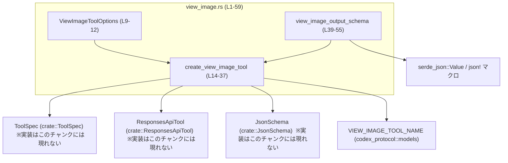
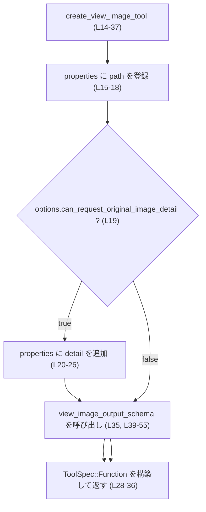
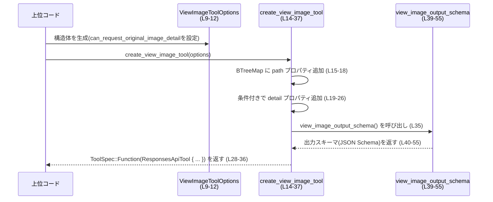

tools/src/view_image.rs

---

## 0. ざっくり一言

ローカル画像閲覧用の「view_image」ツールの **パラメータ仕様と出力スキーマ（JSON Schema）を組み立てるモジュール** です（view_image.rs:L9-37, L39-55）。

---

## 1. このモジュールの役割

### 1.1 概要

- このモジュールは、エージェント／ツール実行基盤において「ローカルファイルシステム上の画像を閲覧する」ためのツール仕様を定義します（view_image.rs:L14-37）。
- 呼び出し側からの入力パラメータ（`path` と必要に応じて `detail`）の JSON Schema と、出力オブジェクトの JSON Schema を構築します（view_image.rs:L15-18, L20-35, L39-55）。
- オプションにより「オリジナル解像度要求（`original`）」パラメータを受け付けるかどうかを制御できます（view_image.rs:L10-11, L19-26）。

### 1.2 アーキテクチャ内での位置づけ

このモジュールは、ツール定義の一部として `ToolSpec` を返しますが、実際の画像ファイル読み込み処理は **このチャンクには現れません**。  
依存関係は概ね次のようになります。



### 1.3 設計上のポイント

コードから読み取れる設計上の特徴です。

- **責務の分割**
  - ツールのメタ情報（名前・説明・パラメータスキーマ）を構築する関数 `create_view_image_tool` と、出力スキーマ生成関数 `view_image_output_schema` が分離されています（view_image.rs:L14-37, L39-55）。
- **状態の有無**
  - モジュール内にグローバル状態はなく、`ViewImageToolOptions` を入力として純粋な値（`ToolSpec`, `Value`）を生成するだけです（view_image.rs:L9-12, L14-37, L39-55）。
- **オプション駆動のスキーマ構築**
  - `ViewImageToolOptions.can_request_original_image_detail` の真偽値に応じて、入力スキーマに `detail` プロパティを含めるかどうかを切り替えています（view_image.rs:L15-18, L19-26）。
- **エラーハンドリング**
  - いずれの関数も `Result` を返さず、失敗を表現するコードパスは定義されていません。主な失敗要因はメモリ不足など標準ライブラリ内部のパニックに限られます。
- **並行性**
  - グローバル可変状態や `unsafe` は使用しておらず、関数は参照透過に近い振る舞いのため、複数スレッドから同時に呼び出しても問題ない構造です（view_image.rs 全体に `static mut` や `unsafe` が存在しないことから）。

### 1.4 コンポーネント一覧（インベントリ）

| 名前                       | 種別      | 公開範囲 | 役割 / 用途 | 根拠 |
|----------------------------|-----------|----------|-------------|------|
| `ViewImageToolOptions`     | 構造体    | `pub`    | ツール作成時のオプション（`detail` パラメータを許可するかどうか）を保持する | view_image.rs:L9-12 |
| `create_view_image_tool`   | 関数      | `pub`    | `ViewImageToolOptions` からローカル画像閲覧ツールの `ToolSpec` を構築する | view_image.rs:L14-37 |
| `view_image_output_schema` | 関数      | `fn`（非公開） | ツール出力（`image_url`, `detail`）の JSON Schema を返す | view_image.rs:L39-55 |
| `tests`                    | モジュール | `mod`（`cfg(test)`） | テストコードを外部ファイル `view_image_tests.rs` から読み込む | view_image.rs:L57-59 |

---

## 2. 主要な機能一覧

- ローカル画像閲覧ツールの生成: `create_view_image_tool` により、名前・説明文・入力パラメータスキーマ・出力スキーマを含む `ToolSpec` を構築します（view_image.rs:L14-37）。
- 出力 JSON スキーマの定義: `view_image_output_schema` により、ツールが返すオブジェクト（`image_url` と `detail`）の型・必須項目・追加プロパティ制限を定義します（view_image.rs:L39-55）。

---

## 3. 公開 API と詳細解説

### 3.1 型一覧（構造体・列挙体など）

| 名前                   | 種別   | フィールド / 概要 | 役割 / 用途 | 根拠 |
|------------------------|--------|-------------------|-------------|------|
| `ViewImageToolOptions` | 構造体 | `can_request_original_image_detail: bool` — オリジナル解像度要求を入力として許可するかどうか | ツール生成処理に対する構成オプション | view_image.rs:L9-12 |

### 3.2 関数詳細

#### `create_view_image_tool(options: ViewImageToolOptions) -> ToolSpec`

**概要**

- ローカルファイルシステム上の画像を閲覧するためのツールを表す `ToolSpec` を構築します（view_image.rs:L14-37）。
- 入力パラメータとして必須 `path`（画像ファイルへのローカルパス）と、オプション `detail`（`original` を指定可能）をスキーマに定義します（view_image.rs:L15-18, L19-26）。

**引数**

| 引数名   | 型                     | 説明 | 根拠 |
|----------|------------------------|------|------|
| `options` | `ViewImageToolOptions` | `detail` パラメータを受け付けるかどうかを指定するオプション | view_image.rs:L10-11, L14 |

**戻り値**

- 型: `ToolSpec`（`ToolSpec::Function(ResponsesApiTool { ... })` という形で返却）（view_image.rs:L28-36）。
- 意味: 「view_image」ツールの名前・説明・引数スキーマ・出力スキーマを含む仕様オブジェクト。

**内部処理の流れ（アルゴリズム）**

1. `BTreeMap` を `path` プロパティ 1 件で初期化します。`path` は文字列型で「画像ファイルへのローカルファイルシステムパス」を説明に持つ JSON Schema として定義されます（view_image.rs:L15-18）。
2. `options.can_request_original_image_detail` が `true` の場合、プロパティマップに `detail` プロパティを追加します（view_image.rs:L19-26）。
   - `detail` は文字列型で、「`original` のみをサポートし、指定するとリサイズせず元の解像度を保持する」という趣旨の説明文が付与されます（view_image.rs:L21-24）。
3. `ToolSpec::Function(ResponsesApiTool { ... })` を構築し、以下を設定します（view_image.rs:L28-36）。
   - `name`: `VIEW_IMAGE_TOOL_NAME` を文字列化したもの（view_image.rs:L29）。
   - `description`: ローカルファイルシステムから画像を閲覧するツールであること、および使用条件（フルパスが与えられており、かつ画像が `<image ...>` タグとしてスレッドに添付されていない場合のみ使う）を説明する文字列（view_image.rs:L30-31）。
   - `strict`: `false`（view_image.rs:L32）。
   - `defer_loading`: `None`（view_image.rs:L33）。
   - `parameters`: 1〜2 個のプロパティを持つ JSON Schema オブジェクト。`required` は `["path"]`、`additionalProperties` は `false` 相当 (`Some(false.into())`) です（view_image.rs:L34）。
   - `output_schema`: `view_image_output_schema()` の返り値を `Some(...)` で包んだもの（view_image.rs:L35）。

**Mermaid フローチャート（関数内処理）**



**Examples（使用例）**

簡単な使用例として、ツール一覧に追加するケースを示します。外側の型定義（`ToolSpec`, `JsonSchema` 等）の詳細はこのチャンクには現れません。

```rust
use crate::view_image::{ViewImageToolOptions, create_view_image_tool}; // モジュールのインポート

fn build_tools() -> Vec<ToolSpec> {                                   // 複数ツールの一覧を作る想定
    let options = ViewImageToolOptions {                               // オプションを指定
        can_request_original_image_detail: true,                       // detail=original を許可
    };

    let view_image_tool = create_view_image_tool(options);             // ツール仕様を生成

    vec![view_image_tool]                                              // 他ツールがあればここに追加
}
```

**Errors / Panics**

- 関数は `Result` を返さず、明示的なエラー分岐はありません。
- 内部で使用している処理（`String::to_string`, `BTreeMap::from`, `insert` 等）は通常パニックを起こしませんが、極端なメモリ不足などランタイム依存の例外的状況ではパニックが起きる可能性があります。
- ファイルパスの妥当性やファイル存在チェックなどは一切行っていません。**この関数はあくまでスキーマ定義のみ** であり、実際の I/O エラー処理は別コンポーネントに委ねられていると解釈できます（ただし、その実装はこのチャンクには現れません）。

**Edge cases（エッジケース）**

- `options.can_request_original_image_detail == false` の場合
  - `detail` プロパティは入力スキーマに含まれず、クライアントから `detail` を送ってはいけない（`additionalProperties: false` のため）という契約になります（view_image.rs:L19-26, L34）。
- `options.can_request_original_image_detail == true` の場合
  - `detail` は任意プロパティとして許可されますが、説明文上は値に `original` 以外を期待していません（view_image.rs:L21-24）。
  - スキーマ上は単なる `"type": "string"` なので、値制約（enum的制限）は別レイヤーで行う必要があります。この制約がどこで担保されるかは、このチャンクには現れません。
- 入力スキーマの `additionalProperties` が `false` のため（view_image.rs:L34）、`path` と（許可されている場合の）`detail` 以外のプロパティを渡すとバリデーションエラーになる設計です。

**使用上の注意点**

- この関数はツール仕様の構築のみを行い、**ローカルファイルパスに対する安全性チェック（パストラバーサル防止等）を実施していません**。実際のファイルアクセスは他のコンポーネントで安全に実装されている必要があります（このチャンクには現れません）。
- `can_request_original_image_detail` を `true` にすると、クライアントが高解像度画像を要求できる設計になります。帯域・メモリ・プライバシーに関する影響を考慮する必要があります（これらの制限機構もこのチャンクには現れません）。
- 関数はグローバル状態を持たず、`&self` 等も受け取らない純粋な関数であるため、多数のスレッドから何度呼び出してもデータ競合は発生しません。

---

#### `view_image_output_schema() -> Value`

**概要**

- `view_image` ツールが返す **出力オブジェクトの JSON Schema** を生成する内部関数です（view_image.rs:L39-55）。
- 返却オブジェクトは `image_url`（string）と `detail`（string または null）の 2 プロパティを必須とし、追加プロパティを禁止する形で定義されています（view_image.rs:L41-52）。

**引数**

- 引数なし。

**戻り値**

- 型: `serde_json::Value`（view_image.rs:L39）。
- 意味: ツール出力の JSON Schema を表す JSON オブジェクト。構造は以下の通りです（view_image.rs:L40-54）。
  - `type`: `"object"`
  - `properties`:
    - `image_url`: `type: "string"`, 「Data URL for the loaded image.」という説明付き。
    - `detail`: `type: ["string", "null"]`, 「オリジナル解像度保持時は `original`、それ以外は `null`」という説明付き。
  - `required`: `["image_url", "detail"]`
  - `additionalProperties`: `false`

**内部処理の流れ**

1. `json!` マクロを用いて、上記構造の JSON オブジェクトをリテラル的に構築します（view_image.rs:L40-54）。
2. それを `serde_json::Value` として返します（`json!` の戻り値がそのまま関数の戻り値になる）（view_image.rs:L39-55）。

**Examples（使用例）**

通常は `create_view_image_tool` 内から呼び出され、直接利用するケースは少ないと考えられます（view_image.rs:L35）。単体利用例を示します。

```rust
fn inspect_view_image_output_schema() {
    let schema: serde_json::Value = view_image_output_schema(); // スキーマを取得

    // 例: スキーマの required フィールドを確認する
    let required = schema["required"].as_array().unwrap();      // ["image_url", "detail"] を想定
    assert_eq!(required.len(), 2);
}
```

※ この関数は非公開（`pub` ではない）なので、実際には同じモジュール内からしか呼び出せません（view_image.rs:L39）。

**Errors / Panics**

- `json!` マクロと `serde_json::Value` の構築は通常パニックを起こしません。
- 返される値は固定構造であり、実行時条件に依存した失敗はありません。

**Edge cases（エッジケース）**

- スキーマ上、`image_url` と `detail` の両方が **必須** です（view_image.rs:L52）。
  - `detail` は `"string"` と `null` のユニオン型ですが、フィールド自体が省略されることは許されません。
- `additionalProperties: false` のため、`image_url` と `detail` 以外のプロパティ（例: `width`, `height`）をレスポンスに含めると、スキーマバリデーションに失敗する設計です（view_image.rs:L53-54）。

**使用上の注意点**

- 実際にツール実装が返すオブジェクトは、本スキーマと整合する必要があります。
  - 例えば実装側が `detail` を完全に返さない設計に変更すると、このスキーマと矛盾します。
- `detail` の値が `original` または `null` になるという制約は、説明文でのみ表現されており、スキーマレベルでは単なる `"string"` です（view_image.rs:L48-50）。  
  したがって、値の妥当性チェックは別レイヤー（実装コードや追加のバリデーション）で行う必要があります。

### 3.3 その他の関数

このモジュールには、上記 2 関数以外のロジック関数は存在しません。  
テストモジュール `tests` が `view_image_tests.rs` を参照していますが、その内容は **このチャンクには現れません**（view_image.rs:L57-59）。

---

## 4. データフロー

ここでは、「クライアントが利用可能なツール一覧に view_image ツールを追加する」処理を想定したデータフローを示します。

1. 上位コンポーネントが `ViewImageToolOptions` を構築します（view_image.rs:L9-12）。
2. 上位コンポーネントが `create_view_image_tool(options)` を呼び出し、`ToolSpec` を取得します（view_image.rs:L14-37）。
3. `create_view_image_tool` 内で入力スキーマ（`parameters`）と出力スキーマ（`view_image_output_schema()`）が組み立てられます（view_image.rs:L15-18, L19-26, L34-35, L39-55）。
4. 生成された `ToolSpec` は、ツールレジストリなどのコンテナに登録され、実行時にクライアントへ公開されると想定されます（登録処理はこのチャンクには現れません）。



---

## 5. 使い方（How to Use）

### 5.1 基本的な使用方法

`ViewImageToolOptions` を指定してツール仕様を生成し、ツール一覧に登録するパターンが基本です。

```rust
use crate::view_image::{ViewImageToolOptions, create_view_image_tool}; // モジュールをインポート

fn register_tools() -> Vec<ToolSpec> {
    // 1. オプションを設定する
    let options = ViewImageToolOptions {
        can_request_original_image_detail: false,   // detail パラメータを受け付けない
    };

    // 2. view_image ツール仕様を生成する
    let view_image_spec = create_view_image_tool(options);

    // 3. 他のツールと一緒に登録する
    vec![view_image_spec]
}
```

このようにして生成された `ToolSpec` は、実行基盤によりクライアントへ公開され、  
クライアントは `"path"`（および許可されていれば `"detail"`）を指定してツールを呼び出すことができます。

### 5.2 よくある使用パターン

1. **オリジナル解像度要求を無効化する場合**

```rust
let options = ViewImageToolOptions {
    can_request_original_image_detail: false,       // デフォルトのリサイズ動作のみ
};
let tool = create_view_image_tool(options);         // detail プロパティはスキーマに含まれない
```

1. **オリジナル解像度要求を有効化する場合**

```rust
let options = ViewImageToolOptions {
    can_request_original_image_detail: true,        // detail=original を許可
};
let tool = create_view_image_tool(options);         // detail プロパティがスキーマに追加される
```

### 5.3 よくある間違い

```rust
// 誤り例: detail を送るつもりなのに、オプションで無効化している
let options = ViewImageToolOptions {
    can_request_original_image_detail: false,       // detail を許可していない
};
let tool = create_view_image_tool(options);

// クライアント側（ツール呼び出し時に detail を送信）
/*
{
  "path": "/tmp/image.png",
  "detail": "original"
}
*/
// 追加プロパティが禁止されているため、スキーマバリデーションエラーになる可能性が高い（view_image.rs:L34）。
```

```rust
// 正しい例: detail を利用する場合はオプションで有効化する
let options = ViewImageToolOptions {
    can_request_original_image_detail: true,        // detail を許可
};
let tool = create_view_image_tool(options);

// クライアント側:
/*
{
  "path": "/tmp/image.png",
  "detail": "original"
}
*/
```

### 5.4 使用上の注意点（まとめ）

- **セキュリティ**
  - このモジュールはローカルファイルパスのスキーマ定義のみを行います。  
    実際のファイルアクセスでのパストラバーサル対策・アクセス制御・サンドボックス化などは、別コンポーネントで実装されている必要があります。  
    それらの実装は **このチャンクには現れません**。
- **契約（Contract）**
  - 入力:
    - `path` は常に必須であり、`detail` は `can_request_original_image_detail` が `true` のときのみスキーマで許可されます（view_image.rs:L15-18, L19-26, L34）。
    - `additionalProperties: false` により余分なフィールドは禁止です。
  - 出力:
    - `image_url` と `detail` の両方が必須で、`additionalProperties: false` です（view_image.rs:L41-52）。
- **並行性**
  - どの関数も `&mut self` やグローバル可変状態を持たず、`unsafe` も使っていないため、並行呼び出しによるデータ競合の懸念はほぼありません。
- **エラーハンドリング**
  - スキーマ定義自体でエラーは想定しておらず、`Result` も返しません。  
    スキーマに基づくバリデーションエラーや I/O エラーは、呼び出し側やツール実行エンジンで処理される前提です（このチャンクには現れません）。

---

## 6. 変更の仕方（How to Modify）

### 6.1 新しい機能を追加する場合

例: 新しい入力パラメータ（例: `max_width`）を追加したい場合。

1. **オプション設計の検討**
   - 条件付きで追加したい場合は、`ViewImageToolOptions` に新しいフラグや値を追加します（view_image.rs:L9-12 を拡張）。
2. **パラメータスキーマの拡張**
   - `create_view_image_tool` 内で `properties` に対して `insert` を追加します（view_image.rs:L15-26 周辺）。
3. **required / additionalProperties の調整**
   - 必須項目とする場合は `JsonSchema::object(...)` の第 2 引数（`Some(vec!["path".to_string()])`）に項目名を追加する必要があります（view_image.rs:L34）。
   - `additionalProperties` の振る舞いを変更したい場合は第 3 引数を調整します（view_image.rs:L34）。
4. **出力スキーマの対応**
   - 出力に新しいフィールドを追加する場合は、`view_image_output_schema` 内の `properties`, `required` を更新します（view_image.rs:L40-52）。

### 6.2 既存の機能を変更する場合

- **`detail` の意味を変える / 値の制約を厳密にする**
  - スキーマレベルで値を制約したい場合は、`view_image_output_schema` / 入力スキーマの `detail` 定義に `enum` や `pattern` 等を追加する必要があります（view_image.rs:L21-24, L47-50）。
  - その変更にあわせて、実際のツール実装側のロジックも更新する必要があります（実装はこのチャンクには現れません）。
- **既存の契約を壊さないための注意**
  - `required` からフィールドを削除すると、既存クライアントが期待していた必須性が変わります（view_image.rs:L52）。
  - `additionalProperties: false` を `true` に変えると、余分なフィールドを許容する方向の互換性拡張にはなりますが、逆方向（`true`→`false`）は互換性を失う可能性があります。

変更時には、`view_image_tests.rs` にあるテスト（内容はこのチャンクには現れません）がスキーマ仕様に追随しているか確認する必要があります（view_image.rs:L57-59）。

---

## 7. 関連ファイル

| パス                           | 役割 / 関係 |
|--------------------------------|-------------|
| `tools/src/view_image.rs`      | 本レポート対象ファイル。view_image ツールのスキーマ定義を提供する。 |
| `tools/src/view_image_tests.rs` | `#[cfg(test)]` でインポートされるテストコード。具体的なテスト内容はこのチャンクには現れません（view_image.rs:L57-59）。 |
| `crate::JsonSchema`            | JSON Schema の生成ユーティリティ。`string` や `object` メソッドを提供していると解釈できるが、実装はこのチャンクには現れません（view_image.rs:L1, L15-18, L34）。 |
| `crate::ResponsesApiTool`      | `ToolSpec::Function` の中核となる構造体。ツール名・説明・パラメータスキーマなどを保持すると解釈できるが、実装はこのチャンクには現れません（view_image.rs:L2, L28-36）。 |
| `crate::ToolSpec`              | ツール仕様全体を表す列挙体または構造体。`ToolSpec::Function` というバリアントを持つが、詳細はこのチャンクには現れません（view_image.rs:L3, L28）。 |
| `codex_protocol::models::VIEW_IMAGE_TOOL_NAME` | ツール名の定数。実際の値はこのチャンクには現れませんが、ツール名として使用されます（view_image.rs:L4, L29）。 |

以上が、`tools/src/view_image.rs` の構造・データフロー・契約・使用上の注意点を中心とした解説です。
