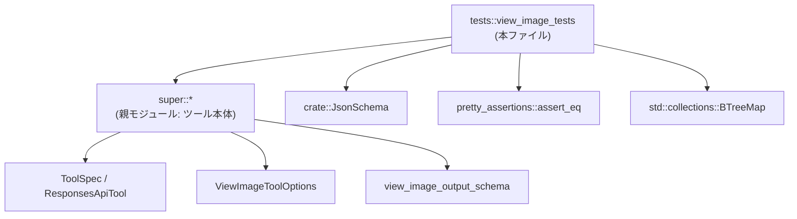
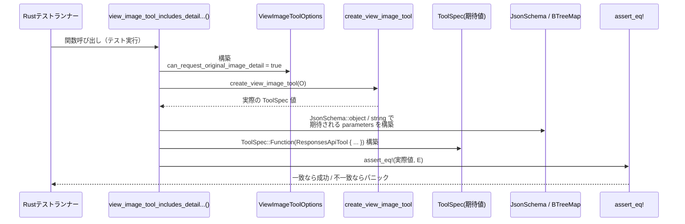

# tools/src/view_image_tests.rs コード解説

## 0. ざっくり一言

`create_view_image_tool` 関数が返すツール仕様に、画像の「detail」パラメータが **オプションフラグの有無によって含まれるかどうか** を検証するテストモジュールです（view_image_tests.rs:L6-54）。

---

## 1. このモジュールの役割

### 1.1 概要

- このモジュールは、`create_view_image_tool` が生成する `ToolSpec` が  
  `ViewImageToolOptions.can_request_original_image_detail` の値に応じて正しい JSON スキーマを持つことを確認します（view_image_tests.rs:L8-23, L29-52）。
- 特に、`can_request_original_image_detail` が `true` の場合のみ、パラメータに `"detail"` フィールドが追加されることを保証します（view_image_tests.rs:L39-50）。

### 1.2 アーキテクチャ内での位置づけ

このテストモジュールは、上位モジュール（`super::*`）で定義されているツール生成ロジックを検証する位置づけです（view_image_tests.rs:L1）。

- 依存関係（このチャンクからわかる範囲）  
  - 親モジュールの公開 API: `create_view_image_tool`, `ViewImageToolOptions`, `ToolSpec`, `ResponsesApiTool`, `view_image_output_schema`（view_image_tests.rs:L8-23, L29-52）
  - ルートクレートの型: `crate::JsonSchema`（view_image_tests.rs:L2）
  - 外部クレート: `pretty_assertions::assert_eq`（view_image_tests.rs:L3）
  - 標準ライブラリ: `std::collections::BTreeMap`（view_image_tests.rs:L4）

依存関係を簡略に図示すると次のようになります。



※ `S` 以下の詳細な実装ファイルパスは、このチャンクからは分かりません（`use super::*;` のみが記載されています: view_image_tests.rs:L1）。

### 1.3 設計上のポイント

- テストはすべて **純粋な値比較** によって挙動を検証しています。  
  `create_view_image_tool(...)` の返り値と、自前で構築した `ToolSpec::Function` を `assert_eq!` で比較する設計です（view_image_tests.rs:L8-24, L29-53）。
- JSON スキーマの構造は `JsonSchema::object` / `JsonSchema::string` と `BTreeMap::from` で明示的に定義されており、フィールド名・必須プロパティ・説明文まで含めて一致を確認します（view_image_tests.rs:L18-21, L39-50）。
- 状態や並行性は扱っておらず、**副作用のない関数呼び出しと比較** に限定されたテストになっています。

---

## 2. 主要な機能一覧

このファイルに定義される主な機能（テスト）は次の 2 つです。

- `view_image_tool_omits_detail_without_original_detail_feature`:  
  `can_request_original_image_detail = false` のとき、パラメータスキーマに `"detail"` フィールドが含まれないことを検証します（view_image_tests.rs:L6-25）。
- `view_image_tool_includes_detail_with_original_detail_feature`:  
  `can_request_original_image_detail = true` のとき、パラメータスキーマに `"detail"` フィールドが含まれることを検証します（view_image_tests.rs:L27-54）。

---

## 3. 公開 API と詳細解説

このファイルはライブラリの公開 API を定義せず、テスト関数のみを定義しています。

### 3.1 コンポーネント一覧

#### 3.1.1 このファイルで定義される関数

| 名前 | 種別 | 役割 / 用途 | 定義位置 |
|------|------|-------------|----------|
| `view_image_tool_omits_detail_without_original_detail_feature` | 関数（テスト） | `can_request_original_image_detail = false` の場合のツール仕様を検証する | view_image_tests.rs:L6-25 |
| `view_image_tool_includes_detail_with_original_detail_feature` | 関数（テスト） | `can_request_original_image_detail = true` の場合のツール仕様を検証する | view_image_tests.rs:L27-54 |

#### 3.1.2 このファイルで参照される主な外部コンポーネント

※ いずれも定義は別モジュールにあり、このチャンクには現れません。

| 名前 | 種別 | 役割 / 用途 | 参照位置 |
|------|------|-------------|----------|
| `create_view_image_tool` | 関数 | `ViewImageToolOptions` から `ToolSpec` を生成する関数（テスト対象） | view_image_tests.rs:L8-11, L29-32 |
| `ViewImageToolOptions` | 構造体と推定 | `can_request_original_image_detail` フラグを含むオプション | view_image_tests.rs:L9-11, L30-32 |
| `ToolSpec` | 列挙体と推定 | ツール仕様のトップレベル型。ここでは `ToolSpec::Function` バリアントが使用される | view_image_tests.rs:L12-23, L33-52 |
| `ResponsesApiTool` | 構造体と推定 | 関数ツールの詳細情報（name, description, parameters など）を格納 | view_image_tests.rs:L12-23, L33-52 |
| `JsonSchema` | 型（列挙体 or 構造体） | JSON スキーマを表現するための型 | view_image_tests.rs:L2, L18-21, L39-50 |
| `view_image_output_schema` | 関数 | 出力スキーマを返す関数 | view_image_tests.rs:L22, L51 |
| `assert_eq` | マクロ | 実際値と期待値の等価性を検証するテスト用マクロ | view_image_tests.rs:L3, L8-24, L29-53 |

### 3.2 関数詳細

#### `view_image_tool_omits_detail_without_original_detail_feature()`

**概要**

- `can_request_original_image_detail: false` を指定して `create_view_image_tool` を呼び出したとき、  
  ツールのパラメータスキーマに `"detail"` プロパティが存在しないことを検証するテストです（view_image_tests.rs:L6-25）。

**引数**

- ありません。

**戻り値**

- 戻り値の型は `()` です。  
  Rust のテスト関数と同様、戻り値は利用されず、`assert_eq!` マクロがパニックを起こさなければテスト成功となります。

**内部処理の流れ**

1. `ViewImageToolOptions { can_request_original_image_detail: false }` を構築します（view_image_tests.rs:L9-11）。
2. そのオプションで `create_view_image_tool` を呼び出し、実際の `ToolSpec` を取得します（view_image_tests.rs:L8-11）。
3. 期待値として、`ToolSpec::Function(ResponsesApiTool { ... })` をリテラルで構築します（view_image_tests.rs:L12-23）。
   - `parameters` フィールドには `"path"` プロパティのみを持つ `JsonSchema::object` を指定しています（view_image_tests.rs:L18-21）。
   - `required` プロパティとして `["path"]` を要求しています（`Some(vec!["path".to_string()])`: view_image_tests.rs:L21）。
4. `assert_eq!` により、実際値と期待値が完全に一致することを検証します（view_image_tests.rs:L8-24）。

**Examples（使用例）**

このテストは通常 `cargo test` 実行時に自動で呼び出されます。  
類似のテストを書きたい場合のパターンは次のようになります。

```rust
// 別のオプションに対する挙動を検証するテスト例
#[test]
fn view_image_tool_with_custom_option_example() {
    // 実際値: テスト対象の関数から取得
    let actual = create_view_image_tool(ViewImageToolOptions {
        can_request_original_image_detail: false, // テスト対象のフラグ
    });

    // 期待値: ToolSpec をリテラルで構築
    let expected = ToolSpec::Function(ResponsesApiTool {
        name: "view_image".to_string(),
        description: "View a local image from the filesystem (only use if given a full filepath by the user, and the image isn't already attached to the thread context within <image ...> tags).".to_string(),
        strict: false,
        defer_loading: None,
        parameters: JsonSchema::object(
            std::collections::BTreeMap::from([(
                "path".to_string(),
                JsonSchema::string(Some("Local filesystem path to an image file".to_string())),
            )]),
            Some(vec!["path".to_string()]),
            Some(false.into()),
        ),
        output_schema: Some(view_image_output_schema()),
    });

    // 等価性の検証
    pretty_assertions::assert_eq!(actual, expected);
}
```

※ 上記は本ファイルのテストと同じパターンを明示的に書き下した例です。

**Errors / Panics**

- 実装が期待値と異なる場合、`pretty_assertions::assert_eq!` がパニックし、テストは失敗します（view_image_tests.rs:L8-24）。
- その他のエラー（`create_view_image_tool` 内部のパニックなど）が発生した場合も、テストは失敗となりますが、その詳細はこのチャンクからは分かりません。

**Edge cases（エッジケース）**

- このテスト自体は特別なエッジ入力を扱っているわけではなく、  
  「機能フラグが `false` の場合に `"detail"` を一切含めない」という **仕様上の分岐** を検証しています（view_image_tests.rs:L9-11, L18-21）。
- `"path"` の値の形式や存在チェックなど、文字列内容に関する検証は行っていません。

**使用上の注意点**

- `ToolSpec` および関連型は `PartialEq` を実装している必要があります。そうでない場合、このテストはコンパイルできません。
- このテストは I/O やスレッドを使わないため、並行性や安全性に関する特別な注意点はありません。

---

#### `view_image_tool_includes_detail_with_original_detail_feature()`

**概要**

- `can_request_original_image_detail: true` を指定して `create_view_image_tool` を呼び出したとき、  
  ツールのパラメータスキーマに `"detail"` プロパティが含まれることを検証するテストです（view_image_tests.rs:L27-54）。

**引数**

- ありません。

**戻り値**

- 戻り値の型は `()` で、テスト成功/失敗は `assert_eq!` のパニック有無で決まります。

**内部処理の流れ**

1. `ViewImageToolOptions { can_request_original_image_detail: true }` を構築します（view_image_tests.rs:L30-32）。
2. そのオプションで `create_view_image_tool` を呼び出し、実際の `ToolSpec` を取得します（view_image_tests.rs:L29-32）。
3. 期待値として、`ToolSpec::Function(ResponsesApiTool { ... })` をリテラルで構築します（view_image_tests.rs:L33-52）。
   - `parameters` の `JsonSchema::object` には `"detail"` と `"path"` の 2 つのプロパティを持つ `BTreeMap` を指定します（view_image_tests.rs:L39-50）。
   - `"detail"` の説明文として、「サポートされる値は `original` のみ」であることや、`original` を使うことで元解像度を維持する旨が記載されています（view_image_tests.rs:L42-44）。
   - `required` は依然として `["path"]` のみ必須であり、`"detail"` はオプショナルである仕様を表現しています（view_image_tests.rs:L50）。
4. `assert_eq!` で実際値と期待値が一致することを検証します（view_image_tests.rs:L29-53）。

**Examples（使用例）**

実テストコードがそのまま代表的な使用例です（view_image_tests.rs:L27-54）。

```rust
#[test]
fn view_image_tool_includes_detail_with_original_detail_feature() {
    assert_eq!(
        create_view_image_tool(ViewImageToolOptions {
            can_request_original_image_detail: true, // detail フィールドを許可
        }),
        ToolSpec::Function(ResponsesApiTool {
            name: "view_image".to_string(),
            description: "View a local image from the filesystem (only use if given a full filepath by the user, and the image isn't already attached to the thread context within <image ...> tags).".to_string(),
            strict: false,
            defer_loading: None,
            parameters: JsonSchema::object(
                std::collections::BTreeMap::from([
                    (
                        "detail".to_string(),
                        JsonSchema::string(Some(
                            "Optional detail override. The only supported value is `original`; omit this field for default resized behavior. Use `original` to preserve the file's original resolution instead of resizing to fit. This is important when high-fidelity image perception or precise localization is needed, especially for CUA agents.".to_string(),
                        )),
                    ),
                    (
                        "path".to_string(),
                        JsonSchema::string(Some(
                            "Local filesystem path to an image file".to_string(),
                        )),
                    ),
                ]),
                Some(vec!["path".to_string()]),
                Some(false.into()),
            ),
            output_schema: Some(view_image_output_schema()),
        })
    );
}
```

**Errors / Panics**

- 前述のテストと同様、期待値と実際値が異なる場合や、内部でパニックが発生した場合はテストが失敗します（view_image_tests.rs:L29-53）。

**Edge cases（エッジケース）**

- `"detail"` フィールドの **唯一の許容値が `original` である** という説明文が期待値に含まれているため（view_image_tests.rs:L42-44）、  
  少なくとも説明レベルでは仕様が明示されています。ただし、実装側が値をバリデーションしているかどうかはこのチャンクからは分かりません。
- `"detail"` は必須ではなくオプションである点が `required = ["path"]` という設定から読み取れます（view_image_tests.rs:L50）。

**使用上の注意点**

- `"detail"` フィールドの説明文はかなり長く、特定ドメイン（CUA agents）向けの注釈を含んでいます。テストは説明文も含めて完全一致を要求するため、メッセージ文言の変更にも敏感です。
- 並行性・メモリアクセスに関する懸念はなく、安全性は一般的な Rust のテストコードと同等です。

### 3.3 その他の関数

- このファイルには、上記 2 つ以外の関数定義はありません（view_image_tests.rs:L6-25, L27-54）。

---

## 4. データフロー

ここでは、テスト実行時におけるデータの流れを概観します。  
（`create_view_image_tool` および `view_image_output_schema` の内部実装はこのチャンクにはないため、**呼び出し境界まで** を示します。）



`can_request_original_image_detail = false` のテスト（view_image_tests.rs:L6-25）も基本構造は同じですが、期待値の `JsonSchema` が `"path"` のみを含む点だけが異なります。

---

## 5. 使い方（How to Use）

### 5.1 基本的な使用方法

このモジュールは通常、クレートルートから次のように実行されます。

```bash
# クレート全体のテストを実行
cargo test

# このモジュール内のテストだけを実行（モジュール名はプロジェクト構成に依存）
cargo test view_image_tool_includes_detail_with_original_detail_feature
```

テストコードの基本フローは以下のとおりです。

1. テスト対象のオプション（`ViewImageToolOptions`）を構築する（view_image_tests.rs:L9-11, L30-32）。
2. `create_view_image_tool` を呼び出して、実際の `ToolSpec` を取得する（view_image_tests.rs:L8-11, L29-32）。
3. `JsonSchema` と `BTreeMap` を用いて、期待される `ToolSpec::Function(ResponsesApiTool { ... })` を構築する（view_image_tests.rs:L12-23, L33-52）。
4. `pretty_assertions::assert_eq!` で実際値と期待値を比較する（view_image_tests.rs:L8-24, L29-53）。

### 5.2 よくある使用パターン

- **フラグによる仕様分岐の検証**  
  このテストは、構造体フィールド（`can_request_original_image_detail`）の真偽値に応じて、  
  出力構造（`ToolSpec`）が変化するという **契約** を検証する典型例です。
- **JSON スキーマの正確な検証**  
  スキーマのプロパティ名・説明文・必須フィールド・`additionalProperties` 相当（`Some(false.into())`）まで、  
  期待値を明示的に記述することで、仕様変更を早期に検出する目的に適しています（view_image_tests.rs:L18-21, L39-50）。

### 5.3 よくある間違い

```rust
// 誤り例: 期待値の JsonSchema を曖昧に書いてしまう（例: detail を含め忘れる）
#[test]
fn wrong_test_example() {
    let actual = create_view_image_tool(ViewImageToolOptions {
        can_request_original_image_detail: true,
    });

    // detail フィールドを入れ忘れている
    let expected = ToolSpec::Function(ResponsesApiTool {
        // ...
        parameters: JsonSchema::object(
            std::collections::BTreeMap::from([(
                "path".to_string(),
                JsonSchema::string(Some("Local filesystem path to an image file".to_string())),
            )]),
            Some(vec!["path".to_string()]),
            Some(false.into()),
        ),
        // ...
    });

    assert_eq!(actual, expected); // 本来は失敗すべきだが、期待値が誤っている
}
```

```rust
// 正しい例: オプションの意味に応じて、detail フィールドを含める/含めない
#[test]
fn correct_test_example() {
    let actual = create_view_image_tool(ViewImageToolOptions {
        can_request_original_image_detail: true,
    });

    let expected = /* 本ファイルと同様に detail + path を持つ ToolSpec を構築 */;

    assert_eq!(actual, expected); // 契約どおりなら成功
}
```

### 5.4 使用上の注意点（まとめ）

- **仕様変更に対する敏感さ**  
  説明文やフィールド名まで含めて完全一致を要求するため、  
  メッセージ文言の微調整やフィールド追加・削除の際にはテストの更新が必要です。
- **エラー・パニックの扱い**  
  `assert_eq!` は不一致時にパニックしますが、これは Rust のテストとして通常の挙動です。  
  特別なリカバリ処理はありません。
- **並行性**  
  テストは共有状態を持たず、外部 I/O も行わないため、並列実行（`cargo test -- --test-threads`）でも安全です。

---

## 6. 変更の仕方（How to Modify）

### 6.1 新しい機能を追加する場合

`ViewImageToolOptions` や `view_image` ツールに新しいオプションが追加された場合のテスト拡張例を示します。

1. 親モジュールで新しいオプションフィールドを `ViewImageToolOptions` に追加し、`create_view_image_tool` の挙動を実装する。  
   （具体的な定義場所やシグネチャはこのチャンクからは分かりませんが、`super::*` に含まれると考えられます: view_image_tests.rs:L1。）
2. 本ファイルに新しいテスト関数を追加し、
   - 新しいオプションを `true` / `false` にしたときの両方の挙動を検証する。
   - 期待値として、`ToolSpec::Function(ResponsesApiTool { ... })` をリテラルで構築する。
3. 既存テスト同様、`assert_eq!` を用いて期待値と実際値を比較する。

### 6.2 既存の機能を変更する場合

- **`detail` フィールドの仕様変更**  
  例えば、「`original` 以外の値も許可する」など仕様を変える場合は、
  - 実装側の説明文・バリデーションロジックを変更する。
  - 本ファイルの `"detail"` の説明文（view_image_tests.rs:L42-44）およびスキーマ定義を新仕様に合わせて更新する。
- **出力スキーマ形式の変更**  
  `view_image_output_schema()` の戻り値定義を変えた場合、テストは `output_schema: Some(view_image_output_schema())` の形だけを検証しており（view_image_tests.rs:L22, L51）、  
  **スキーマ本体の詳細** まではこのファイルでは比較していません。  
  出力スキーマの内容も検証したい場合は、このテストを拡張し、`view_image_output_schema()` の戻り値を明示的に展開した期待値を構築する必要があります。

変更時には、`cargo test` を実行して、既存の契約を満たしているかを確認することが重要です。

---

## 7. 関連ファイル

このチャンクから分かる範囲での関連コンポーネントは次のとおりです。

| パス / モジュール | 役割 / 関係 |
|-------------------|------------|
| `super` モジュール (`use super::*;`) | `create_view_image_tool`, `ViewImageToolOptions`, `ToolSpec`, `ResponsesApiTool`, `view_image_output_schema` など、テスト対象の実装を含む親モジュールです（view_image_tests.rs:L1）。具体的なファイルパスはこのチャンクには現れません。 |
| `crate::JsonSchema` | JSON スキーマ表現用の型で、ツールの `parameters` を構築するために利用されています（view_image_tests.rs:L2, L18-21, L39-50）。 |
| `pretty_assertions::assert_eq` | 見やすい差分表示を提供するテスト用 `assert_eq!` マクロです（view_image_tests.rs:L3）。 |
| `std::collections::BTreeMap` | JSON スキーマのプロパティ名（`"detail"`, `"path"`）をキーとするマップ構造に利用されています（view_image_tests.rs:L4, L18-21, L39-50）。 |

---

### Bugs / Security に関する補足（このファイルの範囲で）

- **バグ**  
  - このテストは、`detail` の有無に関する仕様を明確に検証しているため、その点についての実装バグを検出しやすい構成になっています。  
  - 一方で、`detail` の実際の値（`"original"` 以外）や `view_image_output_schema()` の内容までは検証していないため、それらに関するバグはこのテストだけでは検出できません。
- **セキュリティ**  
  - テストコードはファイルシステムアクセスや外部入力を扱わず、`String` と `BTreeMap` の構築に限定されているため、直接的なセキュリティリスクは見当たりません。
  - 画像パスの内容や解像度指定はあくまで説明文レベルであり、実際のファイルアクセスやリサイズ処理は、別コンポーネントの責務です。このファイルからはそれらの安全性は判断できません。
