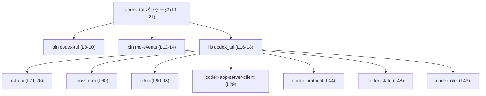
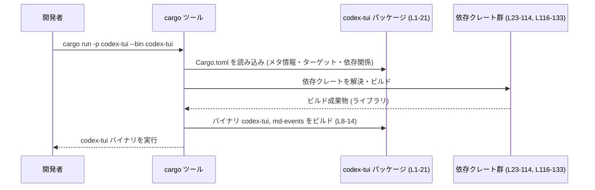

# tui/Cargo.toml コード解説

## 0. ざっくり一言

`tui/Cargo.toml` は、Codex プロジェクトにおける TUI クレート `codex-tui` の **ビルド設定と依存関係** を定義する Cargo マニフェストファイルです（`tui/Cargo.toml:L1-21`）。  
バイナリ 2 本とライブラリ 1 本、および多数の内部 `codex-*` クレートや外部クレートへの依存が記述されています（`tui/Cargo.toml:L8-18, L23-114, L116-133, L136-148`）。

---

## 1. このモジュールの役割

### 1.1 概要

- このファイルは `codex-tui` パッケージの **メタデータ**（名前・バージョン・エディション・ライセンス）を定義します（`tui/Cargo.toml:L1-6`）。
- 2 つのバイナリターゲット（`codex-tui`, `md-events`）と 1 つのライブラリターゲット（`codex_tui`）を登録します（`tui/Cargo.toml:L8-18`）。
- 共通の依存クレート・ターゲット別依存・テスト専用依存をまとめて宣言します（`tui/Cargo.toml:L23-114, L116-133, L136-148`）。

### 1.2 アーキテクチャ内での位置づけ

#### コンポーネントインベントリ（エントリポイントと主要依存）

| コンポーネント | 種別 | 定義行 | メモ |
|---------------|------|--------|------|
| `codex-tui` | バイナリ | `tui/Cargo.toml:L8-10` | `src/main.rs` をエントリポイントとする実行ファイル |
| `md-events` | バイナリ | `tui/Cargo.toml:L12-14` | `src/bin/md-events.rs` をエントリポイントとする実行ファイル |
| `codex_tui` | ライブラリ | `tui/Cargo.toml:L16-18` | `src/lib.rs` に実装を持つライブラリクレート |
| 依存クレート群 | ランタイム依存 | `tui/Cargo.toml:L23-114` | TUI 表示、ネットワーク、エラー処理など |
| ターゲット別依存 | プラットフォーム依存 | `tui/Cargo.toml:L116-133` | OS によって有効・無効が切り替わる依存 |
| dev-dependencies | テスト・開発用依存 | `tui/Cargo.toml:L136-148` | CLI テスト、スナップショットテストなどに利用されると推測されますが、具体的な使い方は本ファイルからは分かりません |

`tui/Cargo.toml` から分かる依存関係の **高レベル構造** を示すと、次のようになります。



> この図は「codex-tui パッケージがどの種別のクレートに依存しているか」の **ビルド時の依存関係** を表しています。  
> どの関数がどの関数を呼ぶかといった実行時の制御フローは、このファイルからは分かりません。

### 1.3 設計上のポイント（Cargo 設定レベル）

コードからではなくマニフェストの記述から読み取れる設計上の特徴は次のとおりです。

- **ワークスペース一括管理**  
  - 多くのフィールドが `workspace = true` になっており、バージョンやエディション、ライセンス、依存クレートのバージョン管理をワークスペース側に委ねています（`tui/Cargo.toml:L3-5, L23-114, L136-148`）。
  - これにより、複数クレート間で依存バージョンを揃える方針であると分かります。

- **バイナリの明示指定 (`autobins = false`)**  
  - `autobins = false` により、`src/bin` 以下のファイルを自動的にバイナリ扱いしない設定になっています（`tui/Cargo.toml:L6`）。
  - その代わりに、`[[bin]]` セクションでビルド対象のバイナリを明示しています（`tui/Cargo.toml:L8-14`）。

- **ターゲット別依存を活用したポータビリティ**  
  - `cfg(not(target_os = "linux"))`, `cfg(unix)`, `cfg(windows)`, `cfg(not(target_os = "android"))` などの条件付き依存が定義されています（`tui/Cargo.toml:L116-133`）。
  - これにより、OS ごとに異なるライブラリ（例: `cpal`, `libc`, `windows-sys`, `arboard`）を利用する設計であると分かります。

- **非同期・並行処理基盤の利用**  
  - 依存関係に `tokio`（マルチスレッドランタイム含む）、`tokio-stream`, `tokio-util` が含まれます（`tui/Cargo.toml:L90-99, L113-114`）。
  - 非同期 I/O やタイマーなど、Rust の標準的な async 実行環境の上で動作することが想定されますが、具体的な並行性のパターンはソースコードを確認する必要があります。

- **エラー処理と診断用クレート**  
  - `anyhow`, `thiserror`, `color-eyre`, `tracing`, `tracing-subscriber`, `tracing-appender` など、エラーラッピングとログ・トレース用の依存が含まれています（`tui/Cargo.toml:L24, L59, L89, L101-103`）。
  - これらの存在から、エラーやログを比較的整備された形で扱う方針であることが分かりますが、実際の扱いはコード側に依存します。

---

## 2. 主要な機能一覧（Cargo 設定が提供する「機能」）

このファイル自体は Rust の関数や構造体を定義していませんが、ビルド・実行単位としての「機能」は次のように整理できます。

- **`codex-tui` バイナリのビルド設定**  
  - 名前とエントリポイント: `name = "codex-tui"`, `path = "src/main.rs"`（`tui/Cargo.toml:L8-10`）。

- **`md-events` バイナリのビルド設定**  
  - 名前とエントリポイント: `name = "md-events"`, `path = "src/bin/md-events.rs"`（`tui/Cargo.toml:L12-14`）。

- **`codex_tui` ライブラリクレートの定義**  
  - `name = "codex_tui"`, `path = "src/lib.rs"`（`tui/Cargo.toml:L16-18`）。

- **TUI/端末関連機能のための依存クレート指定**  
  - `ratatui`, `ratatui-macros`, `crossterm`, `supports-color`, `vt100`(dev) など（`tui/Cargo.toml:L60-61, L71-77, L86, L147`）。

- **非同期・ネットワーク機能のための依存指定**  
  - `tokio`, `tokio-stream`, `tokio-util`, `reqwest`, `codex-app-server-client`, `codex-protocol`, `rmcp` など（`tui/Cargo.toml:L29, L44, L79-80, L90-99, L113-114`）。

- **設定・状態管理・ユーティリティ用クレートの集約**  
  - 多数の `codex-*` 系クレート（例: `codex-config`, `codex-state`, `codex-login`, `codex-features` 等）と、`serde`, `serde_json`, `toml`, `uuid` など（`tui/Cargo.toml:L31-58, L81-82, L100-101, L111`）。

- **テスト・開発支援機能**  
  - `insta`, `pretty_assertions`, `serial_test`, `vt100` などの dev-dependencies（`tui/Cargo.toml:L141-147`）。

---

## 3. 公開 API と詳細解説

このファイルは **マニフェスト** であり、Rust の型・関数・モジュール API は含まれていません。  
ここでは、「外部から直接利用されるビルド単位（バイナリ / ライブラリ）」を「コンポーネント」とみなし整理します。

### 3.1 コンポーネント一覧（バイナリ / ライブラリ）

| 名前 | 種別 | ソースパス | 定義行 | 役割 / 用途（本ファイルから分かる範囲） |
|------|------|------------|--------|------------------------------------------|
| `codex-tui` | バイナリ | `src/main.rs` | `tui/Cargo.toml:L8-10` | パッケージ名と同名のバイナリターゲット。`cargo run -p codex-tui` で実行されるメイン TUI バイナリになる構成です。具体的な動作はソースから確認する必要があります。 |
| `md-events` | バイナリ | `src/bin/md-events.rs` | `tui/Cargo.toml:L12-14` | サブコマンド的に利用される別バイナリと考えられますが、実際の機能は本ファイルからは分かりません。 |
| `codex_tui` | ライブラリ | `src/lib.rs` | `tui/Cargo.toml:L16-18` | 他クレートや上記バイナリから利用されるライブラリクレート。公開 API の詳細は `src/lib.rs` 側で定義されます。 |

### 3.2 関数詳細

- このファイルには **関数・メソッドの定義やシグネチャは一切含まれていません**。
- したがって、「引数」「戻り値」「エラー型」などを伴う関数レベルの詳細は、このチャンクだけからは記述できません。

関数の詳細解説が必要な場合は、`src/lib.rs` や `src/main.rs` など、対応する Rust ソースファイルの内容が必要になります。

### 3.3 その他の関数

- 関数に関する情報はこのファイルには現れないため、「補助関数」等の一覧も作成できません。

---

## 4. データフロー

### 4.1 Cargo レベルの処理フロー

このファイルから確実に分かる「データフロー」は、**ビルド・実行時に Cargo がどのようにこの設定を利用するか** という観点です。

1. 開発者が `cargo run -p codex-tui` または `cargo run -p codex-tui --bin md-events` を実行する。
2. Cargo が `tui/Cargo.toml` を読み込み、バイナリとライブラリ、および依存関係を解決する（`tui/Cargo.toml:L1-21, L23-114, L116-133, L136-148`）。
3. Cargo が依存クレートをビルドし、その後 `codex-tui` または `md-events` バイナリをビルドする。
4. ビルドされたバイナリが起動し、その中で `tokio` や `ratatui` などのライブラリが利用される（利用の仕方はソースコード依存で、このファイルからは分かりません）。

これをシーケンス図で表すと次のようになります。



### 4.2 並行性・エラー処理に関するライブラリレベルの情報

このファイルから分かる、**言語特有の安全性・エラー・並行性に関する要素** は依存クレートの選択に現れています。

- **並行性 / 非同期処理まわり**
  - `tokio`（`rt-multi-thread` 含む）, `tokio-stream`, `tokio-util` が依存に含まれています（`tui/Cargo.toml:L90-99, L113-114`）。
    - これらは Rust の async 機能を提供し、多数のタスクをマルチスレッドで並行処理する基盤です。
    - ただし、「どの非同期 API が使われているか」「どの程度の並行度で動いているか」は、このファイルからは分かりません。
  - dev-dependency として `serial_test` があり、一部テストが並列実行ではなく直列実行に制限されていることが示唆されます（`tui/Cargo.toml:L146`）。

- **エラー処理・診断**
  - `anyhow`（汎用エラーラッパ）、`thiserror`（エラー型定義のマクロ）、`color-eyre`（カラフルなスタックトレース付きレポート）などが依存として宣言されています（`tui/Cargo.toml:L24, L59, L89`）。
  - `tracing`, `tracing-subscriber`, `tracing-appender` の組み合わせにより、構造化ログやトレースを出力する設計であることが分かります（`tui/Cargo.toml:L101-103`）。
  - どのエラーがどのようにログに出されるかといった振る舞いは、ソースコード側の実装次第であり、このファイルだけでは分かりません。

- **安全性（FFI 関連）**
  - `libc`（UNIX）, `windows-sys`（Windows）, `cpal`（オーディオ I/O）, `arboard`（クリップボード）など、OS ネイティブ API と連携するクレートがあります（`tui/Cargo.toml:L116-133`）。
  - これらは通常 `unsafe` を内部で用いる FFI クレートであり、使い方次第ではメモリ安全性に関わる可能性がありますが、実際の安全性は Rust ソース側の利用方法に依存します。Manifest からは判断できません。

---

## 5. 使い方（How to Use）

### 5.1 基本的な使用方法（Cargo コマンド）

このファイルに基づき、`codex-tui` パッケージをビルド・実行する典型的なフローは次のとおりです。

```bash
# ワークスペースルートからメイン TUI バイナリを実行
cargo run -p codex-tui                 # デフォルトで bin "codex-tui" を実行（L2, L8-10）

# 明示的にバイナリを指定して実行
cargo run -p codex-tui --bin codex-tui # メイン TUI バイナリ
cargo run -p codex-tui --bin md-events # サブバイナリ md-events (L12-14)

# テストの実行（dev-dependencies を用いたテストコードがあれば利用されます）
cargo test -p codex-tui                # (L136-148)
```

> 実行時にどのようなコマンドラインオプションが利用できるかは、`clap` の利用コードがある `src/main.rs` などを確認する必要があります（`tui/Cargo.toml:L27`）。

### 5.2 よくある使用パターン

このファイルから推測できる、Cargo レベルでの典型的な使用パターンは次のとおりです。

1. **通常利用（TUI の起動）**

   ```bash
   cargo run -p codex-tui
   ```

   - パッケージ名と同名のバイナリ `codex-tui` が起動します（`tui/Cargo.toml:L2, L8-10`）。

2. **補助バイナリの起動**

   ```bash
   cargo run -p codex-tui --bin md-events
   ```

   - `src/bin/md-events.rs` をエントリポイントとするバイナリを起動します（`tui/Cargo.toml:L12-14`）。

3. **テスト実行**

   ```bash
   cargo test -p codex-tui
   ```

   - `insta`, `pretty_assertions`, `serial_test` など dev-dependencies を利用したテストが存在する場合、それらが利用されます（`tui/Cargo.toml:L141-147`）。  
     具体的なテスト内容はテストコード側に依存します。

### 5.3 よくある間違い（Cargo 設定観点）

このファイルから想定できる、Cargo コマンドレベルの誤用例と注意点を挙げます。

```bash
# （誤りになりうる例）
cargo run                           # ワークスペース全体に対して run を実行

# 正しい例（tui パッケージを明示）
cargo run -p codex-tui              # 対象パッケージを指定 (L2)
```

- ワークスペース内に複数のバイナリパッケージが存在する場合、`-p codex-tui` を明示しないと、意図しないパッケージが実行される可能性があります。  
  ただし、ワークスペース構成はこのファイルからは分からず、一般的な Cargo の挙動に基づく注意点です。
- バイナリが複数あるため、`md-events` を実行したい場合は `--bin md-events` を付ける必要があります（`tui/Cargo.toml:L12-14`）。

### 5.4 使用上の注意点（まとめ）

このマニフェストに基づく、モジュール全体としての注意点です。

- **ワークスペース依存 (`workspace = true`) の前提**  
  - 多くの依存が `workspace = true` になっているため、このパッケージは **ワークスペースのルート Cargo.toml に依存** しています（`tui/Cargo.toml:L3-5, L23-114, L136-148`）。
  - このパッケージだけを切り出して別プロジェクトに移すと、バージョン情報が欠けてビルドできなくなります。

- **ターゲット別依存の前提**  
  - Android 向けビルドでは `arboard` が有効にならない（`cfg(not(target_os = "android"))`）と明記されており（`tui/Cargo.toml:L130-133`）、Android/Termux ではクリップボード機能が制限される可能性があります。
  - Linux では `cpal` が依存に含まれない（`cfg(not(target_os = "linux"))`）ため、一部音声関連機能が制限されることが考えられますが、実際にどの機能が制限されるかはコード側を確認する必要があります（`tui/Cargo.toml:L116-117`）。

- **非同期ランタイム依存**  
  - `tokio` の `rt-multi-thread` フィーチャが有効になっているため（`tui/Cargo.toml:L90-98`）、実行時にマルチスレッド async ランタイムが前提になっている可能性があります。
  - 同じプロセス内で別のランタイムを併用する場合は、通常通りランタイムの二重起動禁止など Rust async の一般的な制約に注意する必要がありますが、そのような使い方がされているかどうかは、このファイルからは分かりません。

---

## 6. 変更の仕方（How to Modify）

### 6.1 新しい機能（バイナリ / ライブラリ）を追加する場合

このファイルを変更して、新しいバイナリやライブラリ機能を追加する際の入口は次のとおりです。

1. **新しいバイナリを追加する場合**
   - 新しいエントリポイントファイルを作成（例: `src/bin/new-tool.rs`）。
   - Cargo.toml に `[[bin]]` セクションを追加します。

   ```toml
   [[bin]]
   name = "new-tool"              # 新バイナリ名
   path = "src/bin/new-tool.rs"   # エントリポイント
   ```

   - 既存の `[[bin]]` 定義（`tui/Cargo.toml:L8-14`）と同様の形式で追加します。

2. **ライブラリのパスや名前を変更する場合**
   - `[lib]` セクションの `name` または `path` を変更します（`tui/Cargo.toml:L16-18`）。
   - ライブラリ名を変更すると、他クレートからの参照パス（`codex_tui` というクレート名）も変わるため、ワークスペース内の参照箇所をすべて更新する必要があります。

3. **依存クレートを追加する場合**
   - `[dependencies]` セクションに新しいエントリを追加します（`tui/Cargo.toml:L23-114`）。
   - 既存と同様に、可能であれば `workspace = true` でバージョン管理を委ねるか、明示的なバージョンを指定します。
   - OS ごとに依存を分けたい場合は `[target.'cfg(...)'.dependencies]` セクションを追加します（`tui/Cargo.toml:L116-133`）。

### 6.2 既存の機能（依存・ターゲット設定）を変更する場合

変更時に注意すべき点を整理します。

- **依存の削除・差し替え**
  - 例: `ratatui` を別の TUI フレームワークに置き換える場合、`[dependencies]` から `ratatui` を削除または変更し（`tui/Cargo.toml:L71-76`）、ソースコード側の `use ratatui::...` などをすべて修正する必要があります。
  - 同様に、`tokio` のフィーチャを変更する場合は `features = [...]` のリストを変更します（`tui/Cargo.toml:L90-98`）。

- **ターゲット別依存の変更**
  - 例: `cpal` を Linux でも使いたい場合は、`[target.'cfg(not(target_os = "linux"))'.dependencies]` ではなく `[dependencies]` に移す、といった変更が考えられます（`tui/Cargo.toml:L116-117`）。
  - ただし、この場合 Linux 環境でのビルド・実行が想定どおりに動作するかは、ソースコード側の条件付きコンパイル（`#[cfg(...)]`）などとの整合性を確認する必要があります。この情報は本ファイルにはありません。

- **ワークスペース設定との整合性**
  - `workspace = true` を外して独自バージョンを指定すると、ワークスペース内の他クレートと依存バージョンがズレる可能性があります（`tui/Cargo.toml:L3-5, L23-114, L136-148`）。
  - 互換性やビルド設定の整合性を保つため、変更前にワークスペースルートの `Cargo.toml` を確認する必要があります。

---

## 7. 関連ファイル

このマニフェストから参照されているファイル・ディレクトリをまとめます。

| パス | 役割 / 関係 | 根拠 |
|------|------------|------|
| `tui/src/main.rs` | バイナリ `codex-tui` のエントリポイント。`main` 関数等が定義され、この TUI アプリケーションの起動処理が実装されていると考えられますが、具体的な内容はこのチャンクには現れません。 | `tui/Cargo.toml:L8-10` |
| `tui/src/bin/md-events.rs` | バイナリ `md-events` のエントリポイント。補助的な CLI ツールである可能性がありますが、内容は不明です。 | `tui/Cargo.toml:L12-14` |
| `tui/src/lib.rs` | ライブラリクレート `codex_tui` の実装。公開 API やコアロジックはここに定義されていると考えられますが、このチャンクにはコードは現れません。 | `tui/Cargo.toml:L16-18` |
| ワークスペースルートの `Cargo.toml` | バージョン・エディション・ライセンス、`workspace = true` な依存クレートのバージョンなどを定義していると考えられますが、このチャンクには含まれていません。 | `tui/Cargo.toml:L3-5, L23-114, L136-148` |

---

### まとめ

- `tui/Cargo.toml` は、`codex-tui` クレートの **ビルド単位（2 バイナリ + 1 ライブラリ）と豊富な依存関係** を定義するファイルです。
- 公開 API やコアロジックの具体的な内容、エラー処理や並行性の実際の扱いは、ここではなく `src/*.rs` のコードにあります。
- このチャンクからは、**どのような技術スタック（TUI, async, FFI, ログ・トレース等）が前提とされているか** と、**OS ごとの依存切り替えポリシー** が読み取れます。
