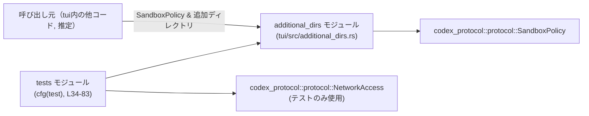
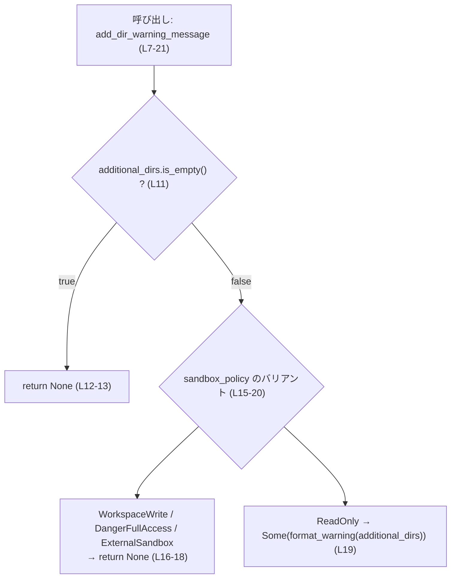
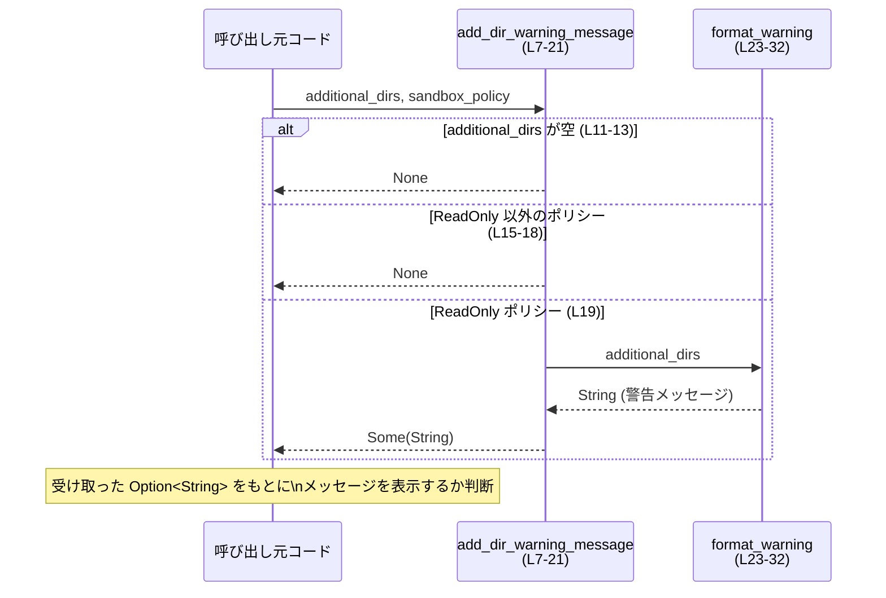

# tui/src/additional_dirs.rs

## 0. ざっくり一言

このモジュールは、`codex_protocol::protocol::SandboxPolicy` と `--add-dir` で指定された追加ディレクトリ一覧から、「追加ディレクトリが無視される理由」を説明する警告メッセージ文字列を生成するユーティリティです（`add_dir_warning_message` 関数, `tui/src/additional_dirs.rs:L4-21`）。

---

## 1. このモジュールの役割

### 1.1 概要

- 解決する問題  
  サンドボックスが「読み取り専用」のような制限付きモードのとき、CLI オプション `--add-dir` で指定されたディレクトリが実際には書き込み可能なルートとしては使われない、というギャップを利用者に伝える必要があります。

- 提供する機能  
  公開関数 `add_dir_warning_message` が、追加ディレクトリとサンドボックスポリシーを入力として受け取り、  
  - 警告が不要な場合は `None`  
  - `--add-dir` が無視される場合は、その理由を説明する `String` を `Some(..)`  
  として返します（`tui/src/additional_dirs.rs:L4-21`）。

### 1.2 アーキテクチャ内での位置づけ

- このモジュールは `tui` クレート内で、**サンドボックス設定（`SandboxPolicy`）の値**と**CLI 由来の追加ディレクトリ（`&[PathBuf]`）**から警告文言を決定する薄い変換レイヤとして位置づけられています（`L1-2, L7-10`）。
- サンドボックスの種類は `codex_protocol::protocol::SandboxPolicy` の列挙体の各バリアントで表現されます（`L1, L15-20`）。
- 実際のメッセージ整形は内部ヘルパー `format_warning` に委譲され、公開 API はロジックと条件分岐に集中しています（`L19, L23-32`）。

依存関係の概略図（概念レベル）です。



※ 呼び出し元の具体的なファイルは、このチャンクには現れないため不明です。

### 1.3 設計上のポイント

- **プレゼンテーションとロジックの分離**  
  ドキュメンテーションコメントにある通り、「警告をユーザーに見せる責任は呼び出し側」にあり、このモジュールは文字列生成だけを担当します（`L4-6`）。I/O（stderr への出力など）は行いません。

- **ポリシーに応じた分岐**  
  `SandboxPolicy` のバリアントに応じて警告の有無を決定します（`L15-20`）。  
  - `WorkspaceWrite` / `DangerFullAccess` / `ExternalSandbox`：警告なし (`None`)  
  - `ReadOnly`：警告あり（`Some(..)`）

- **Option による安全な表現**  
  警告が不要な場合は `Option::None`、必要な場合は `Option::Some(String)` で明示的に区別しており、「警告があるかどうか」をコンパイル時に型で表現しています（`L7-13, L19-20`）。

- **関数はどちらも純粋関数**  
  グローバル状態を書き換えたり I/O を行わず、引数にのみ依存して結果を返す純粋関数として実装されています（`L7-21, L23-32`）。

- **テストによる振る舞いの明示**  
  5 つのテストで、各ポリシー・入力パターンに対する戻り値が明示的に検証されています（`L42-82`）。

### 1.4 コンポーネントインベントリ（関数・テスト）

| 名前 | 種別 | 公開範囲 | 定義行 | 役割 | 根拠 |
|------|------|----------|--------|------|------|
| `add_dir_warning_message` | 関数 | `pub` | L7-21 | 追加ディレクトリと `SandboxPolicy` から警告メッセージ `Option<String>` を返す | `tui/src/additional_dirs.rs:L4-21` |
| `format_warning` | 関数 | モジュール内のみ（非公開） | L23-32 | 複数の `PathBuf` を結合し、固定メッセージに埋め込んだ警告文を生成する | `tui/src/additional_dirs.rs:L23-32` |
| `returns_none_for_workspace_write` | テスト関数 | `#[test]`（`cfg(test)` 内） | L42-47 | `WorkspaceWrite` ポリシーでは警告が `None` になることを検証 | `tui/src/additional_dirs.rs:L42-47` |
| `returns_none_for_danger_full_access` | テスト関数 | 同上 | L49-54 | `DangerFullAccess` ポリシーで警告が `None` であることを検証 | `tui/src/additional_dirs.rs:L49-54` |
| `returns_none_for_external_sandbox` | テスト関数 | 同上 | L56-63 | `ExternalSandbox` ポリシーで警告が `None` であることを検証 | `tui/src/additional_dirs.rs:L56-63` |
| `warns_for_read_only` | テスト関数 | 同上 | L65-74 | `ReadOnly` ポリシーで期待されるメッセージ文字列が返ることを検証 | `tui/src/additional_dirs.rs:L65-74` |
| `returns_none_when_no_additional_dirs` | テスト関数 | 同上 | L77-81 | 追加ディレクトリが空の場合は警告が `None` であることを検証 | `tui/src/additional_dirs.rs:L77-81` |

---

## 2. 主要な機能一覧

- サンドボックスポリシーに応じた警告の有無判定  
  (`add_dir_warning_message` が `SandboxPolicy` の各バリアントに応じて `Option<String>` を返却, `L7-20`)

- `--add-dir` が無視される理由のメッセージ整形  
  （複数パスをカンマ区切りで結合し、固定の英語メッセージに埋め込む `format_warning`, `L23-31`）

- テストによる期待動作の検証  
  （各種ポリシー・入力パターンに対応する 5 つのテスト, `L42-82`）

---

## 3. 公開 API と詳細解説

### 3.1 型一覧（構造体・列挙体など）

このモジュール内で**新しく定義される型はありません**。  
ただし、他モジュールから以下の型を利用しています。

| 名前 | 種別 | 定義元 | 用途 / 役割 | 根拠 |
|------|------|--------|-------------|------|
| `SandboxPolicy` | 列挙体（推定） | `codex_protocol::protocol` クレート | サンドボックスの動作モード（`WorkspaceWrite`, `DangerFullAccess`, `ExternalSandbox`, `ReadOnly` など）を表現し、警告の有無を決定する | 使用箇所：関数引数・`match` パターン（`L1, L7-10, L15-20`） |
| `PathBuf` | 構造体 | 標準ライブラリ (`std::path`) | ファイルシステム上のパスを所有する型。ここでは CLI 等から渡された追加ディレクトリの集合として使用 | 使用箇所：引数・テスト内のベクタ生成（`L2, L8, L23-28, L45, L52, L61, L68, L80`） |
| `NetworkAccess` | 列挙体（推定） | `codex_protocol::protocol` クレート | `ExternalSandbox` バリアントのフィールドとして使用。テスト内のみ登場し、ネットワークアクセスの有効/無効を表すと推測される | 使用箇所：テスト内 `SandboxPolicy::ExternalSandbox { network_access: NetworkAccess::Enabled }`（`L37-38, L56-60`） |

`SandboxPolicy` や `NetworkAccess` の詳細な定義（フィールドや他のバリアント）は、このチャンクには現れないため不明です。

---

### 3.2 関数詳細

#### `add_dir_warning_message(additional_dirs: &[PathBuf], sandbox_policy: &SandboxPolicy) -> Option<String>`

**定義位置**

- `tui/src/additional_dirs.rs:L7-21`

**概要**

- 追加ディレクトリ一覧とサンドボックスポリシーをもとに、「`--add-dir` が無視されることを知らせる警告メッセージ」を返す関数です。
- 警告が不要な場合は `None` を返し、必要な場合は説明文を含んだ `String` を `Some` で返します（`L4-6, L7-13, L15-20`）。

**引数**

| 引数名 | 型 | 説明 | 根拠 |
|--------|----|------|------|
| `additional_dirs` | `&[PathBuf]` | CLI などから渡された追加ディレクトリのスライス。空であれば警告自体を行いません。 | 関数シグネチャ／`is_empty` チェック（`L7-12`） |
| `sandbox_policy` | `&SandboxPolicy` | 既に決定されているサンドボックスポリシー。バリアントに応じて警告の有無を分岐します。 | シグネチャ／`match sandbox_policy`（`L7-10, L15-20`） |

**戻り値**

- 型：`Option<String>`（`L10`）
- 意味：
  - `None`：警告不要（`--add-dir` が有効に機能する、または `additional_dirs` 自体が空）
  - `Some(message)`：`--add-dir` が実際には無視されるため、利用者に知らせるべき警告文

**内部処理の流れ（アルゴリズム）**

1. 追加ディレクトリが空かどうかを確認し、空であれば即座に `None` を返して処理終了（`L11-13`）。
2. 空でない場合、`sandbox_policy` のバリアントに応じて `match` で分岐（`L15-20`）。
3. 次のバリアントでは警告なし（`None` を返却）:
   - `SandboxPolicy::WorkspaceWrite { .. }`
   - `SandboxPolicy::DangerFullAccess`
   - `SandboxPolicy::ExternalSandbox { .. }`（`L16-18`）
4. `SandboxPolicy::ReadOnly { .. }` の場合のみ、ヘルパー `format_warning(additional_dirs)` を呼び出し、その戻り値を `Some(..)` で包んで返す（`L19`）。

簡易フローチャート：



**Examples（使用例）**

1. 読み取り専用サンドボックスでの典型的な使用例（テスト `warns_for_read_only` に相当, `L65-74`）：

```rust
use codex_protocol::protocol::SandboxPolicy;   // SandboxPolicy 型をインポート（L1）
use std::path::PathBuf;                        // PathBuf 型をインポート（L2）
use tui::additional_dirs::add_dir_warning_message; // このモジュールの関数をインポート（パスは例）

fn main() {
    // 読み取り専用ポリシーを生成（テストでも使用されているコンストラクタ, L67, L79）
    let sandbox = SandboxPolicy::new_read_only_policy();

    // CLI から得た追加ディレクトリ（相対パスと絶対パスの例, L68）
    let dirs = vec![PathBuf::from("relative"), PathBuf::from("/abs")];

    // 警告メッセージを取得
    if let Some(msg) = add_dir_warning_message(&dirs, &sandbox) {
        eprintln!("{msg}"); // 呼び出し側の責務としてユーザーに表示（L4-6）
    }
}
```

1. `workspace-write` ポリシーでは何も表示しない例（テスト `returns_none_for_workspace_write`, `L42-47`）：

```rust
use codex_protocol::protocol::SandboxPolicy;
use std::path::PathBuf;
use tui::additional_dirs::add_dir_warning_message;

fn main() {
    let sandbox = SandboxPolicy::new_workspace_write_policy();  // L44
    let dirs = vec![PathBuf::from("/tmp/example")];            // L45

    // workspace-write のため、警告は None になる（L16-18）
    if let Some(msg) = add_dir_warning_message(&dirs, &sandbox) {
        // ここには入らない想定
        eprintln!("{msg}");
    }
}
```

**Errors / Panics**

- この関数は `Result` ではなく `Option` を返し、内部でも `unwrap` や `panic!` を使用していません（`L7-21`）。
- したがって、通常の使用では **エラー型は返さず、panic の可能性もありません**。
- ただし、呼び出し側が戻り値に対して `unwrap()` を呼ぶなどすれば、それは呼び出し側のコードでの panic になります。

**Edge cases（エッジケース）**

- `additional_dirs` が空のスライス  
  → `is_empty()` が `true` になり、サンドボックスポリシーに関わらず `None` を返します（`L11-13`）。

- サンドボックスポリシーが `WorkspaceWrite` / `DangerFullAccess` / `ExternalSandbox`  
  → 追加ディレクトリがあっても警告は `None`（`L16-18`）。

- サンドボックスポリシーが `ReadOnly`  
  → 追加ディレクトリが 1 件以上あれば、`Some(format_warning(..))` を返します（`L19`）。

- 追加ディレクトリに非 UTF-8 なパスが含まれる場合  
  → 内部で `to_string_lossy()` が使われるため、文字化け（置換文字）が発生しうるが、これは警告メッセージ表示に限定され、機能上のエラーにはなりません（`L26`）。  

**使用上の注意点**

- この関数は「警告メッセージを生成するだけ」であり、**ユーザーへの表示やログ出力は呼び出し側の責務**です（`L4-6`）。
- 戻り値が `Option<String>` であるため、`if let Some(msg) = ..` や `match` などで分岐し、`None` の場合に警告を出さないことを明示的に扱うと安全です。
- マルチスレッド環境でも、引数と戻り値にのみ依存する純粋関数のため、同じ引数に対して常に同じ結果が得られ、スレッド安全性の問題はありません（共有可変状態を持たない, `L7-21`）。

---

#### `format_warning(additional_dirs: &[PathBuf]) -> String`

**定義位置**

- `tui/src/additional_dirs.rs:L23-32`

**概要**

- `PathBuf` のスライスから人間可読なパス一覧文字列を生成し、それを固定メッセージ中に埋め込んで、「読み取り専用モードのため `--add-dir` を無視する」という英語の警告メッセージを作成します（`L23-31`）。
- この関数はモジュール内のヘルパーであり、通常は `add_dir_warning_message` からのみ利用されます（`L19`）。

**引数**

| 引数名 | 型 | 説明 | 根拠 |
|--------|----|------|------|
| `additional_dirs` | `&[PathBuf]` | 警告メッセージに含める追加ディレクトリのスライス。空で呼ばれる想定は、`add_dir_warning_message` の前段チェックにより通常ありません。 | シグネチャ・`iter()` 呼び出し（`L23-25`） |

**戻り値**

- 型：`String`
- 内容：  
  `"Ignoring --add-dir ({joined_paths}) because the effective sandbox mode is read-only. Switch to workspace-write or danger-full-access to allow additional writable roots."`  
  のフォーマット文字列に、`joined_paths`（パス一覧）を埋め込んだもの（`L29-31`）。

**内部処理の流れ（アルゴリズム）**

1. `additional_dirs.iter()` でスライスを走査（`L24-25`）。
2. 各 `PathBuf` について `to_string_lossy()` を呼び、`Cow<str>` としてパスを文字列化（`L26`）。
3. それらを `collect::<Vec<_>>()` でベクタに集約し（`L27`）、さらに `join(", ")` で `", "` 区切りの 1 つの文字列に結合する（`L28`）。
4. 結合されたパス一覧を `{joined_paths}` プレースホルダに埋め込んだ固定メッセージ文字列を `format!` で生成し、それを返す（`L29-31`）。

**Examples（使用例）**

通常は直接呼び出さず、`add_dir_warning_message` を介して利用しますが、動作イメージとして：

```rust
use std::path::PathBuf;

// 擬似的に format_warning が公開されていると仮定した例です。
// 実際のコードでは add_dir_warning_message を通じて使用されます。
fn demo_format_warning_like_behavior() {
    let dirs = vec![PathBuf::from("relative"), PathBuf::from("/abs")];
    let joined_paths = dirs
        .iter()
        .map(|path| path.to_string_lossy())
        .collect::<Vec<_>>()
        .join(", ");

    let message = format!(
        "Ignoring --add-dir ({joined_paths}) because the effective sandbox mode is read-only. \
         Switch to workspace-write or danger-full-access to allow additional writable roots."
    );

    println!("{message}");
}
```

この例は実際の実装（`L23-31`）と等価な処理を示しています。

**Errors / Panics**

- `to_string_lossy`, `collect`, `join`, `format!` いずれも通常の状況では panic を起こさない標準ライブラリ機能です。
- メモリ不足などの極端な状況を除けば、特別なエラー処理は不要です。

**Edge cases（エッジケース）**

- 非 UTF-8 なパス  
  → `to_string_lossy()` が置換文字を含む文字列に変換しますが、警告メッセージ用なので、機能上は問題になりにくい（`L26`）。

- パスが多数ある場合  
  → `collect::<Vec<_>>()` と `join(", ")` により、パスの数に比例した長さの文字列を生成します。大量のパスがあればメッセージが長くなり得ます（`L24-28`）。

**使用上の注意点**

- モジュール外から直接利用する設計にはなっておらず（`pub` ではない, `L23`）、外部からメッセージを生成したい場合は `add_dir_warning_message` を経由するのが前提です。
- `additional_dirs` が空の前提は呼び出し側で保証されています（`add_dir_warning_message` の `is_empty` チェック, `L11-13`）。

---

### 3.3 その他の関数（テスト）

本体ロジック以外には、振る舞いを検証するテスト関数が 5 つ定義されています（`L34-82`）。

| 関数名 | 役割（1 行） | 根拠 |
|--------|--------------|------|
| `returns_none_for_workspace_write` | `WorkspaceWrite` ポリシーで `add_dir_warning_message` が `None` を返すことを検証 | `tui/src/additional_dirs.rs:L42-47` |
| `returns_none_for_danger_full_access` | `DangerFullAccess` ポリシーで `None` が返ることを検証 | `tui/src/additional_dirs.rs:L49-54` |
| `returns_none_for_external_sandbox` | `ExternalSandbox { network_access: Enabled }` で `None` が返ることを検証 | `tui/src/additional_dirs.rs:L56-63` |
| `warns_for_read_only` | `ReadOnly` ポリシーで、具体的な文字列が期待通りに返ることを検証 | `tui/src/additional_dirs.rs:L65-74` |
| `returns_none_when_no_additional_dirs` | `ReadOnly` ポリシーでも、追加ディレクトリが空であれば `None` を返すことを検証 | `tui/src/additional_dirs.rs:L77-81` |

---

## 4. データフロー

### 4.1 代表的な処理シナリオ

典型的なシナリオは次のようになります。

1. 呼び出し元（例：CLI/TUI のコマンドハンドラ）が、  
   - ユーザー指定の追加ディレクトリ（`Vec<PathBuf>` など）  
   - 実行時に決定した `SandboxPolicy`  
   を用意する（テスト例からの推定, `L42-45, L50-52, L67-68`）。

2. 呼び出し元が `add_dir_warning_message(&dirs, &sandbox_policy)` を呼び出す（`L46-47, L53-54, L62-63, L69-70, L81`）。

3. `add_dir_warning_message` が内部でポリシーと追加ディレクトリを確認し、必要に応じて `format_warning` を呼び出す（`L11-13, L15-20`）。

4. 呼び出し元は戻り値の `Option<String>` を評価し、`Some(msg)` であれば標準エラー出力などでメッセージをユーザーに表示する（表示処理はこのモジュール外, `L4-6`）。

### 4.2 シーケンス図



---

## 5. 使い方（How to Use）

### 5.1 基本的な使用方法

典型的には、サンドボックスポリシー決定後、`--add-dir` のパラメータ処理と一緒に呼び出します。

```rust
use codex_protocol::protocol::SandboxPolicy;     // サンドボックスポリシー（L1）
use std::path::PathBuf;
use tui::additional_dirs::add_dir_warning_message;

fn handle_command() {
    // 1. サンドボックスポリシーを決定（実際には設定や引数から決まる想定）
    let sandbox = SandboxPolicy::new_read_only_policy();    // テストと同様のコンストラクタ使用（L67）

    // 2. CLI から取得した追加ディレクトリ
    let additional_dirs: Vec<PathBuf> = vec![
        PathBuf::from("project/tmp"),
        PathBuf::from("/var/tmp"),
    ];

    // 3. 警告メッセージ生成
    if let Some(msg) = add_dir_warning_message(&additional_dirs, &sandbox) {
        // 4. 呼び出し側の責務としてユーザーに通知（ドキュコメント, L4-6）
        eprintln!("{msg}");
    }

    // 5. 以降、実際のサンドボックス処理を続行
}
```

### 5.2 よくある使用パターン

- **パターン1：その場で表示する**  
  上記のように `if let Some(msg)` で分岐し、`eprintln!` などで即時にユーザーへ通知します。

- **パターン2：メッセージを集約してまとめて表示する**  
  `Option<String>` をそのまま別のコンポーネントに渡し、収集してから一括表示することも型上可能です（戻り値が `Option` であり、副作用を伴わないため, `L7-21`）。

### 5.3 よくある間違い（起こりうる誤用の例）

```rust
// 誤用例: 戻り値を必ず Some だと仮定して unwrap してしまう
let msg = add_dir_warning_message(&dirs, &sandbox).unwrap(); // None の場合に panic する可能性

// 正しい例: Option を安全に扱う
if let Some(msg) = add_dir_warning_message(&dirs, &sandbox) {
    eprintln!("{msg}");
}
```

- `add_dir_warning_message` はポリシーや入力に応じて `None` を返しうるため、`unwrap()` の使用は避け、`if let` / `match` などで明示的に扱うのが安全です（`L7-13, L15-20`）。

### 5.4 使用上の注意点（まとめ）

- **責務の分離**：  
  このモジュールは警告メッセージ生成に限定されており、ユーザーへの表示は呼び出し側で行う必要があります（`L4-6`）。

- **セキュリティ観点**：  
  - 実際のサンドボックスの安全性は `SandboxPolicy` の値とそれを解釈する別コンポーネントに依存します。このモジュールは警告の有無と文言のみを扱い、サンドボックスの強制は行いません（`L7-21`）。
  - 警告文は情報表示のみであり、ユーザー入力の再解釈やコマンド実行などは行わないため、このコード片自体が直接のセキュリティリスクになる可能性は低いです。

- **パフォーマンス面**：  
  - `format_warning` で `Vec` に収集してから `join` するため、ディレクトリ数に比例した文字列生成コストがありますが、通常はディレクトリ数が小さいと考えられるため、一般的な CLI 利用では問題になりにくい規模です（`L24-28`）。

- **並行性**：  
  - グローバル状態や可変静的変数を使っていないため、複数スレッドから同時に呼び出しても競合状態は発生しません（`L7-21, L23-32`）。

---

## 6. 変更の仕方（How to Modify）

### 6.1 新しい機能を追加する場合

例：サンドボックスポリシーごとにメッセージを変えたい場合。

1. **`SandboxPolicy` の新バリアントに対応**  
   - `codex_protocol::protocol::SandboxPolicy` に新しいバリアントが追加された場合、`add_dir_warning_message` の `match` 式にそのバリアントを追加する必要があります（`L15-20`）。
   - Rust の `match` は網羅性チェックがあるため、コンパイル時に不足が検出されます。

2. **メッセージ文言のカスタマイズ**  
   - `format_warning` のフォーマット文字列を変更することで、メッセージ文言を編集できます（`L29-31`）。
   - ポリシーごとに文言を変える場合は、`format_warning` にポリシー種別を渡す、あるいは複数のヘルパー関数に分割する、などの方針が考えられます（設計次第であり、このチャンクからは詳細は不明）。

3. **多言語対応など**  
   - 現状は英語固定のリテラル文字列のため（`L29-31`）、多言語対応が必要な場合は、文字列リテラルを外部のロケール管理機構に移すなどの変更が必要になります。

### 6.2 既存の機能を変更する場合の注意点

- **契約（前提条件）の確認**  
  - `additional_dirs.is_empty()` の場合に無条件で `None` を返す現在の仕様（`L11-13`）を変更すると、既存の呼び出し側が「空なら警告なし」と期待している前提を壊す可能性があります。テスト `returns_none_when_no_additional_dirs` にも反映されています（`L77-81`）。

- **返り値の意味**  
  - 戻り値の `Option<String>` は「警告の有無」を表す契約になっているため、これを `Result` や単なる `String` に変更すると呼び出し側のコード全体に影響が及びます（`L7-13`）。

- **テストの更新**  
  - メッセージ文言を変える場合、`warns_for_read_only` テストは固定文字列で比較しているため（`L71-73`）、テストの期待値も一緒に更新する必要があります。

---

## 7. 関連ファイル

このモジュールと密接に関連する型やモジュールは、`use` 文やテストから次のように推測できます。

| パス / モジュール | 役割 / 関係 | 根拠 |
|-------------------|-------------|------|
| `codex_protocol::protocol::SandboxPolicy` | サンドボックスの動作モードを表す型。`add_dir_warning_message` の分岐の基準となる。実際のサンドボックス実装側で解釈される。ファイルパスはこのチャンクからは不明。 | 使用箇所：`use` 文、関数引数、`match` 式、テスト内コンストラクタ（`L1, L7-10, L15-20, L42-45, L50-52, L56-59, L67, L79`） |
| `codex_protocol::protocol::NetworkAccess` | `SandboxPolicy::ExternalSandbox` のフィールドとして使われる補助的な型。テストでのみ登場。ファイルパスは不明。 | 使用箇所：`use` 文、`ExternalSandbox { network_access: NetworkAccess::Enabled }`（`L37-38, L56-60`） |
| `pretty_assertions::assert_eq` | テストで期待値比較に使用されるアサートマクロ。見やすい差分表示を提供。 | 使用箇所：`use` 文およびテスト本体（`L39, L46, L53, L62, L71-73, L81`） |
| `tui` クレート内の他モジュール（呼び出し元） | `add_dir_warning_message` を呼び出し、実際に警告メッセージをユーザーに表示する役割。具体的なファイルパスはこのチャンクには現れません。 | 公開関数 `pub fn add_dir_warning_message` の存在（`L7`）、およびドキュコメント中の「caller is responsible for presenting the warning」の記述（`L4-6`） |

このファイル単体からは、実際にどのコマンドや UI がこの関数を呼んでいるかは分かりませんが、公開 API として他モジュールから利用される前提で設計されていることが読み取れます。
