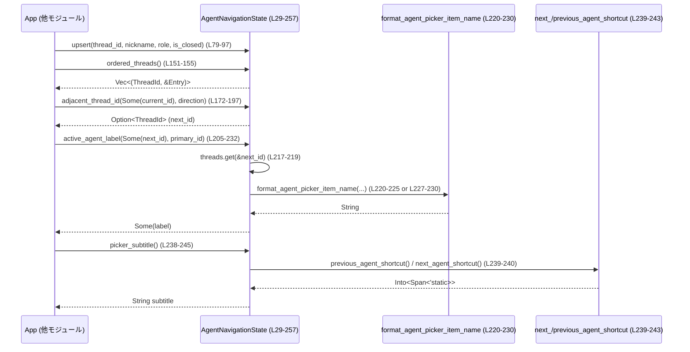

# tui/src/app/agent_navigation.rs

## 0. ざっくり一言

TUI アプリにおけるマルチエージェント用 `/agent` ピッカーの **巡回順序（spawn順）とフッターラベル** を管理する、純粋な状態コンテナです。  
スレッドの発見や表示切替など UI 本体の処理から切り離し、**安定した巡回順序と文言生成のロジックだけ** をここに集約しています。  
（`tui/src/app/agent_navigation.rs:L1-19, L29-37`）

---

## 1. このモジュールの役割

### 1.1 概要

このモジュールは **マルチエージェントスレッドの安定した巡回とラベリング** の問題を解決するために存在し、次の機能を提供します。

- `/agent` ピッカーの項目と、その **初回発見順（spawn順）に基づく巡回順序** の保持  
  （`AgentNavigationState` の `threads` / `order`、`tui/src/app/agent_navigation.rs:L34-37, L39-43`）
- 「次のスレッドはどれか？」といった **キーボードナビゲーション** の問い合わせ  
  （`adjacent_thread_id`, `tui/src/app/agent_navigation.rs:L166-197`）
- `/agent` ピッカーやフッター用の **ユーザー向けラベル文字列の生成**  
  （`active_agent_label`, `picker_subtitle`, `tui/src/app/agent_navigation.rs:L199-232, L234-245`）

スレッド発見・現在表示中スレッドの決定・UI ウィジェット更新などの副作用は `App` 側に残し、ここでは **副作用のないロジックと状態管理** のみに責務を絞っています。（`tui/src/app/agent_navigation.rs:L12-15, L29-37`）

### 1.2 アーキテクチャ内での位置づけ

このモジュールは、`App` とバックエンド／描画層の間で、**マルチエージェントのナビゲーション専用状態** を提供する位置づけです。

- `App` からは `AgentNavigationState` に対して
  - スレッド更新 → `upsert` / `mark_closed` / `remove` / `clear`  
  - UI 操作 → `adjacent_thread_id`, `active_agent_label`, `picker_subtitle`, `has_non_primary_thread` など  
  を呼び出す想定です。（`tui/src/app/agent_navigation.rs:L55-133, L135-245`）
- スレッドIDには `codex_protocol::ThreadId` を使用します。（`tui/src/app/agent_navigation.rs:L25`）
- ピッカー・フッターの文言は `crate::multi_agents::format_agent_picker_item_name`、  
  ショートカット文字列は `next_agent_shortcut` / `previous_agent_shortcut` と `ratatui::text::Span` に依存します。  
  （`tui/src/app/agent_navigation.rs:L21-24, L238-244`）

```mermaid
graph TD
    App["App (他モジュール, 設計説明のみ)"]
    ANS["AgentNavigationState<br/>(L29-257)"]
    ThreadId["codex_protocol::ThreadId<br/>(外部, L25)"]
    PickerEntry["multi_agents::AgentPickerThreadEntry<br/>(外部, L21)"]
    FormatName["format_agent_picker_item_name<br/>(L22, L220-230)"]
    Shortcuts["next_/previous_agent_shortcut<br/>(L23-24, L239-243)"]
    Span["ratatui::text::Span<br/>(L26, L239-244)"]

    App -->|スレッド発見/更新| ANS
    App -->|ナビゲーション要求<br/>adjacent_thread_id (L172-197)| ANS
    App -->|ラベル生成要求<br/>active_agent_label (L205-232)| ANS
    ANS -->|ThreadId キー| ThreadId
    ANS -->|PickerEntry 値| PickerEntry
    ANS -->|ラベル生成| FormatName
    ANS -->|ショートカット取得| Shortcuts
    Shortcuts -->|Into&lt;Span&gt;| Span
```

### 1.3 設計上のポイント

- **安定した spawn 順序の保持**  
  - `order` は「初めて見たスレッドID」を記録し、その後は位置を変えないという不変条件を持ちます。  
    （`tui/src/app/agent_navigation.rs:L34-37, L74-78, L86-88`）
- **メタデータと順序の分離**  
  - `threads`: `ThreadId` → `AgentPickerThreadEntry` の最新メタデータを保持  
    （`tui/src/app/agent_navigation.rs:L39-41, L90-96`）  
  - `order`: spawn 順による巡回順序のみを Vec で保持  
    （`tui/src/app/agent_navigation.rs:L42-43`）
- **閉じたスレッドも順序から外さない**  
  - `mark_closed` は削除せず `is_closed` を true にするだけで、`order` からも削除しません。  
    （`tui/src/app/agent_navigation.rs:L99-107`）
- **安全側に倒した戻り値設計（Option 返却）**  
  - 「ないかもしれない」状況では `Option` を返し、呼び出し側の誤った仮定による panic を避けています。  
    （`get`, `adjacent_thread_id`, `active_agent_label` など, `tui/src/app/agent_navigation.rs:L62-64, L172-197, L205-232`）
- **UI 文言をキーバインド実装から動的に組み立てる**  
  - `picker_subtitle` は `next_/previous_agent_shortcut` から動的に文字列を取り、設定変更とのズレを防ぎます。  
    （`tui/src/app/agent_navigation.rs:L234-245`）
- **スレッド安全性**  
  - `unsafe` ブロックや低レベル同期原語は使用しておらず、この型自体は通常の Rust の所有権・借用ルールに従うシングルスレッド前提の状態コンテナです。  
    （ファイル全体に `unsafe` が存在しないことより、`tui/src/app/agent_navigation.rs:L1-354`）

---

## 2. 主要な機能一覧

- スレッドメタデータの登録・更新: `upsert` で `ThreadId` ごとの `AgentPickerThreadEntry` を保存し、初回のみ `order` に追加する。（`tui/src/app/agent_navigation.rs:L74-97`）
- スレッドを「閉じた」状態にマーク: `mark_closed` で `is_closed` フラグだけを立て、巡回順序は保持する。（`tui/src/app/agent_navigation.rs:L99-113`）
- スレッドの完全削除: `remove` で `threads` と `order` の両方から対象スレッドを削除する。（`tui/src/app/agent_navigation.rs:L125-133`）
- ピッカーに並ぶスレッドの列挙: `ordered_threads` / `tracked_thread_ids` で spawn 順のリストを得る。（`tui/src/app/agent_navigation.rs:L146-155, L158-164`）
- 次 / 前スレッドの決定: `adjacent_thread_id` で現在表示中スレッドに対する隣接スレッドIDを返す。（`tui/src/app/agent_navigation.rs:L166-197`）
- フッターラベルの生成: `active_agent_label` で現在表示中スレッドのラベル文字列を生成する。（`tui/src/app/agent_navigation.rs:L199-232`）
- ピッカーのサブタイトル生成: `picker_subtitle` でショートカット記載付きの説明文を生成する。（`tui/src/app/agent_navigation.rs:L234-245`）
- 補助的情報: `get`, `is_empty`, `has_non_primary_thread`, `clear` などのユーティリティ。（`tui/src/app/agent_navigation.rs:L62-72, L135-144, L120-123`）

---

## 3. 公開 API と詳細解説

### 3.1 型一覧（構造体・列挙体など）

| 名前 | 種別 | 役割 / 用途 | 定義位置 |
|------|------|-------------|----------|
| `AgentNavigationState` | 構造体 | `/agent` ピッカーのためのスレッドメタデータと、spawn順の巡回順序を保持する状態コンテナ。`App` からの更新・ナビゲーション問い合わせに応答する。 | `tui/src/app/agent_navigation.rs:L29-44` |
| `AgentNavigationDirection` | 列挙体 | キーボードによる巡回方向（前 / 次）を表す。`adjacent_thread_id` の引数として使用。 | `tui/src/app/agent_navigation.rs:L46-53` |

内部フィールド（抜粋）:

- `threads: HashMap<ThreadId, AgentPickerThreadEntry>` – 各スレッドIDの最新メタデータ。（`tui/src/app/agent_navigation.rs:L39-41`）
- `order: Vec<ThreadId>` – spawn順の安定した巡回順序。（`tui/src/app/agent_navigation.rs:L42-43`）

### 3.2 関数詳細（重要な 7 件）

#### `AgentNavigationState::upsert(&mut self, thread_id: ThreadId, agent_nickname: Option<String>, agent_role: Option<String>, is_closed: bool)`

**概要**

- 指定された `thread_id` のエントリを **挿入または更新** します。
- 初めて見る `thread_id` の場合は `order` の末尾に追記し、巡回順序の一貫性を保ちます。  
  （`tui/src/app/agent_navigation.rs:L74-78, L86-90`）

**引数**

| 引数名 | 型 | 説明 |
|--------|----|------|
| `thread_id` | `ThreadId` | スレッドを一意に識別する ID。（`tui/src/app/agent_navigation.rs:L81`） |
| `agent_nickname` | `Option<String>` | ピッカーやフッターに表示するニックネーム。`None` の場合はデフォルト名にフォールバック。（`tui/src/app/agent_navigation.rs:L82, L220-223`） |
| `agent_role` | `Option<String>` | エージェントの役割（role）を表す文字列。`None` の場合はデフォルトの役割にフォールバック。（`tui/src/app/agent_navigation.rs:L83, L220-223`） |
| `is_closed` | `bool` | スレッドが閉じているかどうか。ピッカーには残るが UI 側で表示スタイルなどに使われる想定。（`tui/src/app/agent_navigation.rs:L84, L91-95`） |

**戻り値**

- なし（`()`）。状態は `self` の内部に更新されます。

**内部処理の流れ**

1. `threads` に指定の `thread_id` のキーが存在するかを確認します。  
   （`self.threads.contains_key(&thread_id)`, `tui/src/app/agent_navigation.rs:L86`）
2. 存在しない場合、`order` の末尾に `thread_id` を push します。  
   （`self.order.push(thread_id)`, `tui/src/app/agent_navigation.rs:L87-88`）
3. `AgentPickerThreadEntry { agent_nickname, agent_role, is_closed }` を生成し、`threads.insert` で保存します。  
   （`tui/src/app/agent_navigation.rs:L90-96`）

**Examples（使用例）**

```rust
use crate::app::agent_navigation::{AgentNavigationState};
use crate::multi_agents::AgentPickerThreadEntry;
use codex_protocol::ThreadId;

fn example_upsert_usage() {
    let mut state = AgentNavigationState::default(); // デフォルト状態を生成

    let main_id = ThreadId::from_string("...main-id...").unwrap();
    let agent_id = ThreadId::from_string("...agent-id...").unwrap();

    // メインスレッド（デフォルト設定）
    state.upsert(main_id, None, None, false);

    // サブエージェント（ニックネームと役割あり）
    state.upsert(
        agent_id,
        Some("Robie".to_string()),
        Some("explorer".to_string()),
        false,
    );

    // spawn順で ID を取得
    let ids = state.tracked_thread_ids(); // [main_id, agent_id] の順になる想定
}
```

**Errors / Panics**

- この関数内で明示的な panic は発生しません。
- `HashMap::insert` や `Vec::push` は通常 panic しません（メモリ不足を除く）。

**Edge cases（エッジケース）**

- 同じ `thread_id` を何度も `upsert` した場合  
  → `order` には **最初の一度だけ追加** され、それ以降はメタデータのみが更新されます。  
  （`contains_key` 分岐, `tui/src/app/agent_navigation.rs:L86-90`）
- `agent_nickname` / `agent_role` が `None` の場合  
  → 後で `active_agent_label` 経由で `format_agent_picker_item_name` に渡され、デフォルト名にフォールバックします。  
  （`tui/src/app/agent_navigation.rs:L220-223, L227-230`）
- `is_closed = true` でも `order` から削除されません。巡回順序は変わりません。

**使用上の注意点**

- spawn順を維持したい場合は、スレッド更新は常に `upsert` を経由させる必要があります（`threads` や `order` を直接操作する API は公開されていません）。  
  （`tui/src/app/agent_navigation.rs:L34-37, L39-43`）
- 「閉じる」動作は `mark_closed` を使う方が意図に近く、削除とは区別されています。

---

#### `AgentNavigationState::adjacent_thread_id(&self, current_displayed_thread_id: Option<ThreadId>, direction: AgentNavigationDirection) -> Option<ThreadId>`

**概要**

- 現在画面に表示されているスレッド ID と巡回方向を元に、spawn順で **前後のスレッド ID** を返します。  
  （`tui/src/app/agent_navigation.rs:L166-171`）
- スレッド数が 1 未満、または現在スレッドが未指定／見つからない場合は `None` を返し、安全側に倒します。  
  （`tui/src/app/agent_navigation.rs:L177-185`）

**引数**

| 引数名 | 型 | 説明 |
|--------|----|------|
| `current_displayed_thread_id` | `Option<ThreadId>` | 画面に実際に表示されているスレッドID。`None` の場合はナビゲーション不可として `None` を返す。 |
| `direction` | `AgentNavigationDirection` | `Next` または `Previous`。巡回方向を指定。 |

**戻り値**

- `Option<ThreadId>` – 条件を満たせば隣接するスレッド ID、そうでなければ `None`。

**内部処理の流れ**

1. `ordered_threads()` で spawn順の `(ThreadId, &Entry)` の Vec を取得。  
   （`tui/src/app/agent_navigation.rs:L177, L151-155`）
2. 要素数が 2 未満なら隣接スレッドが存在しないため `None` を返却。  
   （`tui/src/app/agent_navigation.rs:L178-179`）
3. `current_displayed_thread_id` が `None` の場合、`?` により `None` を即時返却。  
   （`tui/src/app/agent_navigation.rs:L182`）
4. `position` で現在スレッドのインデックスを検索。見つからなければ `None` を返却。  
   （`tui/src/app/agent_navigation.rs:L183-185`）
5. `direction` に応じて次のインデックスを決定。  
   - `Next`: `(current_idx + 1) % len` で末尾から先頭へのラップアラウンドを実現。  
     （`tui/src/app/agent_navigation.rs:L186-187`）  
   - `Previous`: 先頭なら `len - 1`、それ以外なら `current_idx - 1`。  
     （`tui/src/app/agent_navigation.rs:L188-193`）
6. `ordered_threads[next_idx].0`（スレッドID）を返却。  
   （`tui/src/app/agent_navigation.rs:L196`）

**Examples（使用例）**

```rust
use crate::app::agent_navigation::{AgentNavigationState, AgentNavigationDirection};
use codex_protocol::ThreadId;

fn example_adjacent() {
    let mut state = AgentNavigationState::default();

    let a = ThreadId::from_string("...01").unwrap();
    let b = ThreadId::from_string("...02").unwrap();
    let c = ThreadId::from_string("...03").unwrap();

    state.upsert(a, None, None, false);
    state.upsert(b, None, None, false);
    state.upsert(c, None, None, false);

    // 次方向: c の次は a にラップする
    let next_from_c = state.adjacent_thread_id(Some(c), AgentNavigationDirection::Next);
    assert_eq!(next_from_c, Some(a));

    // 前方向: a の前は c にラップする
    let prev_from_a = state.adjacent_thread_id(Some(a), AgentNavigationDirection::Previous);
    assert_eq!(prev_from_a, Some(c));
}
```

**Errors / Panics**

- インデックス計算は `len` を前提にしており、`ordered_threads.len() < 2` のチェックと `position` の `?` によって **範囲外アクセスを防いでいる** ため、通常の使用では panic しません。  
  （`tui/src/app/agent_navigation.rs:L177-185, L187-196`）

**Edge cases（エッジケース）**

- トラッキング対象スレッドが 0 または 1 件しかない場合 → 常に `None`。  
  （`tui/src/app/agent_navigation.rs:L178-179`）
- `current_displayed_thread_id` が `None` の場合 → `None`。  
  （`tui/src/app/agent_navigation.rs:L182`）
- `current_displayed_thread_id` が `ordered_threads` に存在しない場合 → `position` が `None` となり `None` を返す。  
  （`tui/src/app/agent_navigation.rs:L183-185`）

**使用上の注意点**

- 引数 `current_displayed_thread_id` は「UI に実際に表示しているスレッド」を渡す必要があります。別の「論理上のアクティブスレッド」を渡すと、ナビゲーションが不自然になります（コメントより, `tui/src/app/agent_navigation.rs:L168-171`）。
- 閉じたスレッドも巡回対象に含まれます。閉じたスレッドをスキップしたい場合は、`ordered_threads` のフィルタリングなど、追加ロジックが必要になります。

---

#### `AgentNavigationState::active_agent_label(&self, current_displayed_thread_id: Option<ThreadId>, primary_thread_id: Option<ThreadId>) -> Option<String>`

**概要**

- 現在表示中のスレッドに対して、フッターなどに出す **エージェントラベル文字列** を生成します。  
- トラッキングしているスレッドが 1 件以下の場合は `None` を返し、フッター領域を節約します。  
  （`tui/src/app/agent_navigation.rs:L199-212`）

**引数**

| 引数名 | 型 | 説明 |
|--------|----|------|
| `current_displayed_thread_id` | `Option<ThreadId>` | 現在表示しているスレッド ID。`None` ならラベルも `None`。 |
| `primary_thread_id` | `Option<ThreadId>` | メイン（プライマリ）スレッド ID。ラベル生成時に「Main」などの扱いを変えるために使われます。 |

**戻り値**

- `Option<String>` – 表示用ラベル文字列。スレッドが 1 件以下、または現在スレッド未指定／不整合な場合は `None`。

**内部処理の流れ**

1. `self.threads.len() <= 1` なら即座に `None` を返却。  
   （`tui/src/app/agent_navigation.rs:L210-212`）
2. `current_displayed_thread_id` を取り出し、`thread_id` とする。`None` なら `None` を返却。  
   （`tui/src/app/agent_navigation.rs:L214`）
3. `is_primary` を `primary_thread_id == Some(thread_id)` で判定。  
   （`tui/src/app/agent_navigation.rs:L215`）
4. `self.threads.get(&thread_id)` でメタデータを取得できれば、`format_agent_picker_item_name` に `agent_nickname` / `agent_role` / `is_primary` を渡してラベル生成。  
   （`tui/src/app/agent_navigation.rs:L217-225`）
5. メタデータがなければ、`agent_nickname = None, agent_role = None` で同じ関数にフォールバック。  
   （`tui/src/app/agent_navigation.rs:L226-230`）

**Examples（使用例）**

```rust
use crate::app::agent_navigation::AgentNavigationState;
use codex_protocol::ThreadId;

fn example_label() {
    let (state, main_id, first_agent_id, _) = populated_state_for_example();

    // サブエージェントのラベル
    let label = state.active_agent_label(Some(first_agent_id), Some(main_id));
    assert_eq!(label, Some("Robie [explorer]".to_string())); // テストより, L345-348

    // メインスレッドのラベル
    let main_label = state.active_agent_label(Some(main_id), Some(main_id));
    assert_eq!(main_label, Some("Main [default]".to_string())); // テストより, L349-352
}

// populated_state_for_example は tests::populated_state(L265-294)と同様の初期化を行う想定
```

**Errors / Panics**

- 内部で panic を発生させるコードはありません。`Option` とフォールバックにより、メタデータ欠如時も安全に動作します。  
  （`tui/src/app/agent_navigation.rs:L214-231`）

**Edge cases（エッジケース）**

- トラッキング中スレッドが 1 件以下 → 常に `None`。  
  （`tui/src/app/agent_navigation.rs:L210-212`）
- `current_displayed_thread_id` が `None` → `None`。  
  （`tui/src/app/agent_navigation.rs:L214`）
- 現在スレッドのメタデータが `threads` に存在しない → ニックネーム／ロールなしでフォールバックラベルを生成。  
  （`tui/src/app/agent_navigation.rs:L217-231`）

**使用上の注意点**

- 単一スレッドセッションでフッターを抑制するための仕様として `threads.len() <= 1` で `None` を返しています。複数スレッドが存在する状態でのみフッターに意味があります。
- `format_agent_picker_item_name` の具体的な実装はこのチャンクには現れませんが、テストから少なくとも `"名前 [役割]"` と `"Main [default]"` といった形式を生成していることが分かります。  
  （`tui/src/app/agent_navigation.rs:L345-352`）

---

#### `AgentNavigationState::ordered_threads(&self) -> Vec<(ThreadId, &AgentPickerThreadEntry)>`

**概要**

- ピッカーで表示する行と同じ順番（spawn順）で、スレッド ID とメタデータのペアを Vec として返します。  
  （`tui/src/app/agent_navigation.rs:L146-151`）

**引数**

- なし。

**戻り値**

- `Vec<(ThreadId, &AgentPickerThreadEntry)>` – spawn順に並んだ `(thread_id, entry)` のリスト。

**内部処理の流れ**

1. `self.order.iter()` で順序ベクトルを辿る。  
   （`tui/src/app/agent_navigation.rs:L152-153`）
2. 各 `thread_id` について `self.threads.get(thread_id)` を試み、存在するものだけを `(id, entry)` へマップ。  
   （`filter_map`, `tui/src/app/agent_navigation.rs:L154`）
3. Vec に collect して返す。  
   （`tui/src/app/agent_navigation.rs:L155`）

**Examples（使用例）**

```rust
fn example_ordered_threads(state: &AgentNavigationState) {
    for (id, entry) in state.ordered_threads() {
        println!("Thread {:?} closed? {}", id, entry.is_closed);
    }
}
```

**Errors / Panics**

- インデックスアクセスは行わず、イテレータベースなので panic の可能性は低いです。

**Edge cases（エッジケース）**

- `order` に含まれるが `threads` にメタデータがない ID は **自動的にスキップ** されます。  
  （`filter_map` 利用, `tui/src/app/agent_navigation.rs:L148-150, L154`）

**使用上の注意点**

- UI で「表示可能な行」を作る場合は、`order` を直接読むのではなく、この関数の結果を使うことで、メタデータが欠落したエントリを自然に除外できます。

---

#### `AgentNavigationState::tracked_thread_ids(&self) -> Vec<ThreadId>`

**概要**

- ピッカーで使用されるのと同じ spawn順で、トラッキング中の `ThreadId` だけを Vec で返します。  
  （`tui/src/app/agent_navigation.rs:L158-163`）

**引数**

- なし。

**戻り値**

- `Vec<ThreadId>` – spawn順のスレッド ID リスト。

**内部処理の流れ**

1. `ordered_threads()` を呼び出して `(ThreadId, &Entry)` の Vec を取得。  
   （`tui/src/app/agent_navigation.rs:L160`）
2. `(thread_id, _)` のタプルから `thread_id` だけを抽出し collect。  
   （`tui/src/app/agent_navigation.rs:L161-163`）

**Examples（使用例）**

```rust
fn example_tracked_ids(state: &AgentNavigationState) {
    let ids = state.tracked_thread_ids();
    // /agent ピッカーの最初の行にフォーカスを当てるなど
    if let Some(first) = ids.first() {
        println!("First tracked thread: {:?}", first);
    }
}
```

**Errors / Panics**

- panic 要因はありません。

**Edge cases（エッジケース）**

- トラッキング中スレッドが 0 の場合 → 空 Vec を返します。

**使用上の注意点**

- テストでは `#[cfg(test)]` の `ordered_thread_ids`（同じ実装）を使っていますが、本番コード側では `tracked_thread_ids` を使う想定です。  
  （`tui/src/app/agent_navigation.rs:L247-257`）

---

#### `AgentNavigationState::has_non_primary_thread(&self, primary_thread_id: Option<ThreadId>) -> bool`

**概要**

- プライマリスレッド以外にトラッキング中のスレッドが存在するかどうかを判定します。  
  （`tui/src/app/agent_navigation.rs:L135-144`）
- コラボレーション機能フラグが無効でも、すでに存在しているサブエージェントスレッドがあるかどうかの判定に使われます（コメントより）。  

**引数**

| 引数名 | 型 | 説明 |
|--------|----|------|
| `primary_thread_id` | `Option<ThreadId>` | プライマリスレッド ID。`None` の場合は「プライマリの概念なし」と解釈されます。 |

**戻り値**

- `bool` – プライマリ以外のスレッドが一つでもあれば `true`、そうでなければ `false`。

**内部処理の流れ**

1. `self.threads.keys()` で全スレッドIDをイテレート。  
   （`tui/src/app/agent_navigation.rs:L141-142`）
2. `Some(*thread_id) != primary_thread_id` を満たすものが一つでもあれば `true`。  
   （`any` 呼び出し, `tui/src/app/agent_navigation.rs:L143`）

**Edge cases（エッジケース）**

- `primary_thread_id = None` で `threads` が 1 件以上ある場合 → いずれの `thread_id` も `Some(id) != None` なので `true` になります。
- `threads` が空 → `false`。

**使用上の注意点**

- 「プライマリ以外があるか？」という意味なので、プライマリスレッドが Map に存在するかどうかは問わず、単純に「primary と異なるキーが存在するか」だけを見ています。

---

#### `AgentNavigationState::picker_subtitle() -> String`

**概要**

- `/agent` ピッカーのサブタイトル（説明文）を生成します。  
  - 文言: `"Select an agent to watch. {prev} previous, {next} next."`  
    （`tui/src/app/agent_navigation.rs:L241-243`）
- `previous_agent_shortcut` / `next_agent_shortcut` から取得したショートカット表示を埋め込むため、キーバインド変更と文字列がずれません。  
  （`tui/src/app/agent_navigation.rs:L234-240`）

**引数**

- なし（関連するショートカットは内部で取得）。

**戻り値**

- `String` – サブタイトル用の説明文。

**内部処理の流れ**

1. `previous_agent_shortcut().into()` で `Span<'static>` に変換し、`previous` とする。  
   （`tui/src/app/agent_navigation.rs:L239`）
2. 同様に `next_agent_shortcut().into()` を `next` とする。  
   （`tui/src/app/agent_navigation.rs:L240`）
3. `"Select an agent to watch. {} previous, {} next."` に `previous.content` と `next.content` を埋め込んで `format!`。  
   （`tui/src/app/agent_navigation.rs:L241-244`）

**Examples（使用例）**

```rust
use crate::app::agent_navigation::AgentNavigationState;

fn example_subtitle() {
    let subtitle = AgentNavigationState::picker_subtitle();
    println!("{}", subtitle);
    // "Select an agent to watch. <PrevKey> previous, <NextKey> next." のような文言
}
```

**Errors / Panics**

- 文字列操作のみであり、panic の可能性は通常ありません。

**Edge cases（エッジケース）**

- ショートカットがどのような文字列かは `next_/previous_agent_shortcut` の実装次第ですが、このチャンクには現れません。
- テストでは `subtitle` が `previous.content` と `next.content` を含んでいることのみを検証しています。  
  （`tui/src/app/agent_navigation.rs:L331-338`）

**使用上の注意点**

- 文言の国際化やカスタマイズを行いたい場合、この関数の実装を変更する必要があります。
- 文字列の一部にショートカット名を埋め込んでいるため、ショートカットが空文字の場合などにも対応できるよう、UI 側での見栄え確認が必要です。

---

### 3.3 その他の関数

| 関数名 | 役割（1 行） | 定義位置 |
|--------|--------------|----------|
| `AgentNavigationState::get(&self, thread_id: &ThreadId) -> Option<&AgentPickerThreadEntry>` | 指定したスレッドIDのピッカーエントリを取得する。（メタデータを直接参照したいときに使用） | `tui/src/app/agent_navigation.rs:L56-64` |
| `AgentNavigationState::is_empty(&self) -> bool` | トラッキング中のスレッドが存在するかどうかを判定する。 | `tui/src/app/agent_navigation.rs:L66-72` |
| `AgentNavigationState::mark_closed(&mut self, thread_id: ThreadId)` | スレッドを「閉じた」とマークするが、`order` からは削除しない。 | `tui/src/app/agent_navigation.rs:L99-113` |
| `AgentNavigationState::clear(&mut self)` | `threads` と `order` を両方クリアし、状態を初期化する。 | `tui/src/app/agent_navigation.rs:L116-123` |
| `AgentNavigationState::remove(&mut self, thread_id: ThreadId)` | スレッドをメタデータと巡回順序の両方から完全に削除する。 | `tui/src/app/agent_navigation.rs:L125-133` |
| `AgentNavigationState::ordered_thread_ids(&self) -> Vec<ThreadId>` | （テスト専用）`ordered_threads` と同じ順序で `ThreadId` だけを返す。 | `tui/src/app/agent_navigation.rs:L247-257` |

---

## 4. データフロー

ここでは、「スレッドの追加 → ピッカー表示 → キー操作による巡回 → フッターラベル更新」という典型的なシナリオを例に、データの流れを説明します。

1. バックエンドから新しいスレッドが見つかるたびに、`App` は `upsert` を呼び出して `AgentNavigationState` に登録します。  
   （`tui/src/app/agent_navigation.rs:L74-97`）
2. `/agent` ピッカーを開くとき、`App` は `ordered_threads` / `tracked_thread_ids` を使って行を構築します。  
   （`tui/src/app/agent_navigation.rs:L146-155, L158-164`）
3. ユーザーが「次/前エージェント」ショートカットを押すと、`App` は現在表示中の `ThreadId` と方向を `adjacent_thread_id` に渡して巡回先を決定します。  
   （`tui/src/app/agent_navigation.rs:L166-197`）
4. 新しいスレッドが表示されたら、`active_agent_label` でフッターに出すラベル文字列を取得します。  
   （`tui/src/app/agent_navigation.rs:L199-232`）
5. `/agent` ピッカーのサブタイトルは `picker_subtitle` により生成され、ショートカット表示と同期しています。  
   （`tui/src/app/agent_navigation.rs:L234-245`）



このように、`AgentNavigationState` は外部との I/O を直接持たず、**純粋な状態更新と問い合わせ** に専念しています。

---

## 5. 使い方（How to Use）

### 5.1 基本的な使用方法

代表的な利用フロー（初期化 → スレッド登録 → ナビゲーション → ラベル取得）の例です。

```rust
use crate::app::agent_navigation::{AgentNavigationState, AgentNavigationDirection};
use codex_protocol::ThreadId;

fn basic_flow_example() {
    // 1. 状態の初期化
    let mut state = AgentNavigationState::default(); // L38-39

    // 2. スレッド ID の用意（例として 3 つ）
    let main_id  = ThreadId::from_string("000...101").unwrap();
    let agent1_id = ThreadId::from_string("000...102").unwrap();
    let agent2_id = ThreadId::from_string("000...103").unwrap();

    // 3. スレッドの登録（spawn順に upsert）
    state.upsert(main_id, None, None, false); // メイン
    state.upsert(agent1_id, Some("Robie".into()), Some("explorer".into()), false);
    state.upsert(agent2_id, Some("Bob".into()),   Some("worker".into()),   false);

    // 4. ピッカーに出す ID 一覧（spawn順）
    let ids = state.tracked_thread_ids(); // L159-163
    assert_eq!(ids, vec![main_id, agent1_id, agent2_id]);

    // 5. ナビゲーション: agent2 の次は main にラップ
    let next_from_agent2 =
        state.adjacent_thread_id(Some(agent2_id), AgentNavigationDirection::Next); // L172-197
    assert_eq!(next_from_agent2, Some(main_id));

    // 6. フッターラベル（例: サブエージェント視点）
    let label = state.active_agent_label(Some(agent1_id), Some(main_id)); // L205-232
    println!("Footer label: {:?}", label); // Some("Robie [explorer]")
}
```

### 5.2 よくある使用パターン

1. **ピッカー行の構築**

   ```rust
   fn build_picker_rows(state: &AgentNavigationState) {
       for (thread_id, entry) in state.ordered_threads() { // L151-155
           // entry.agent_nickname / agent_role / is_closed などを使って行を描画
           println!("id={:?}, closed={}", thread_id, entry.is_closed);
       }
   }
   ```

2. **コラボレーション機能の有効可否判定**

   ```rust
   fn can_show_agent_picker(state: &AgentNavigationState, primary_id: Option<ThreadId>) -> bool {
       // primary 以外のスレッドがあるか
       state.has_non_primary_thread(primary_id) // L140-144
   }
   ```

3. **セッション終了時のリセット**

   ```rust
   fn reset_session(state: &mut AgentNavigationState) {
       state.clear(); // L120-123
       // 以後、ピッカーは「No agents available yet.」などのメッセージを出す前提
   }
   ```

### 5.3 よくある間違い

```rust
use crate::app::agent_navigation::{AgentNavigationState, AgentNavigationDirection};
use codex_protocol::ThreadId;

fn wrong_current_id_example() {
    let mut state = AgentNavigationState::default();
    let id1 = ThreadId::from_string("...1").unwrap();
    let id2 = ThreadId::from_string("...2").unwrap();

    state.upsert(id1, None, None, false);
    state.upsert(id2, None, None, false);

    // 間違い例: まだ upsert していない ID を current として渡している
    let bogus_id = ThreadId::from_string("...999").unwrap();
    let next = state.adjacent_thread_id(Some(bogus_id), AgentNavigationDirection::Next);

    // next は None になる（位置が見つからないため） L183-185
    assert_eq!(next, None);
}

// 正しい例: 画面に実際に表示している ID をそのまま渡す
fn correct_current_id_example(state: &AgentNavigationState, displayed: ThreadId) {
    let _ = state.adjacent_thread_id(Some(displayed), AgentNavigationDirection::Next);
}
```

- **誤用**: `current_displayed_thread_id` に「論理上のアクティブスレッド」など別の ID を渡す。  
- **正しい使い方**: UI に実際に表示しているスレッド ID を必ず渡す。  
  （コメントで警告されている通り, `tui/src/app/agent_navigation.rs:L168-171`）

### 5.4 使用上の注意点（まとめ）

- **不変条件**
  - `order` は **初回だけ** `thread_id` を追加し、その後は位置を変えない設計です（`upsert` 内の `contains_key` 判定, `tui/src/app/agent_navigation.rs:L86-90`）。
  - 「閉じた」スレッドも `order` から削除されないため、ナビゲーションの形はセッション中に変わりません（`mark_closed`, `tui/src/app/agent_navigation.rs:L99-107`）。
- **エラー／安全性**
  - すべての主関数は `Option` や `Vec` を返し、`unwrap` などによる panic を避けています。  
    （`adjacent_thread_id`, `active_agent_label` など, `tui/src/app/agent_navigation.rs:L172-197, L205-232`）
  - `unsafe` は使用されていません。
- **並行性**
  - この構造体はミュータブル参照経由で更新する設計であり、スレッド間共有を行う場合は `Arc<Mutex<AgentNavigationState>>` のような外部同期が必要です。このチャンクでは並行アクセス用の仕組みは提供していません。
- **パフォーマンス**
  - `ordered_threads` および `adjacent_thread_id` は Vec 上の線形走査・位置検索を行うため、スレッド数に対して O(n) です（`tui/src/app/agent_navigation.rs:L152-155, L183-187`）。
  - 一般的な TUI 用マルチエージェント数であれば問題になりにくいですが、大量のスレッドを扱う場合は考慮が必要です。
- **セッション管理**
  - セッション切り替えやアプリ終了時には `clear` を呼び、状態の持ち越しを避けます（`tui/src/app/agent_navigation.rs:L116-123`）。

---

## 6. 変更の仕方（How to Modify）

### 6.1 新しい機能を追加する場合

例: 「閉じたスレッドをナビゲーションからスキップしたい」

1. **どこに手を入れるか**
   - 巡回の入口である `adjacent_thread_id`（`tui/src/app/agent_navigation.rs:L172-197`）か、
   - 巡回対象リストを作る `ordered_threads`（`tui/src/app/agent_navigation.rs:L151-155`）
   のどちらかで「`entry.is_closed` を除外する」フィルタを追加するのが自然です。
2. **依存する型**
   - `AgentPickerThreadEntry` の `is_closed` フィールドを利用することが前提です（構築箇所, `tui/src/app/agent_navigation.rs:L91-95`）。
3. **呼び出し側への影響**
   - `/agent` ピッカーの行数やキーボードショートカットの挙動が変わるため、テスト（`adjacent_thread_id_wraps_in_spawn_order` など, `tui/src/app/agent_navigation.rs:L313-328`）も更新が必要です。

### 6.2 既存の機能を変更する場合

- **巡回順序を変えたい（例: ニックネーム順）**
  - 現在は spawn順を維持する設計であるため、`order` 構造自体を変える必要があります。`upsert` のコメント・テスト（`upsert_preserves_first_seen_order`, `tui/src/app/agent_navigation.rs:L296-311`）が前提とする仕様も変更対象です。
- **ラベルのフォーマットを変更したい**
  - `active_agent_label` 内の `format_agent_picker_item_name` 呼び出しを変更するか、その関数本体（別モジュール）を修正します（`tui/src/app/agent_navigation.rs:L220-230`）。
- **影響範囲の確認**
  - このモジュール内のテスト（`mod tests`, `tui/src/app/agent_navigation.rs:L260-353`）に加えて、`App` や `/agent` ピッカー UI からの呼び出し箇所（このチャンクには現れません）を grep して確認する必要があります。
- **契約（Contract）に注意すべき点**
  - `adjacent_thread_id` が「`None` を返すケースに依存している UI 側の処理」がある可能性があります（例: ナビゲーションを無効化する条件）。その前提を変える場合は呼び出し側の仕様も更新する必要があります。

---

## 7. 関連ファイル

| パス / モジュール | 役割 / 関係 |
|------------------|------------|
| `crate::app::App` | モジュール冒頭のコメントで、この型から本モジュールの状態が利用される旨が説明されています。スレッドの発見・現在表示スレッドの決定・UI 更新などを担当します。（`tui/src/app/agent_navigation.rs:L3-15`）具体的な実装はこのチャンクには現れません。 |
| `crate::multi_agents::AgentPickerThreadEntry` | ピッカー用スレッドメタデータの型。`threads: HashMap<ThreadId, AgentPickerThreadEntry>` として保持され、`agent_nickname` / `agent_role` / `is_closed` フィールドが参照されています。（`tui/src/app/agent_navigation.rs:L21, L41, L91-95, L221-223`） |
| `crate::multi_agents::format_agent_picker_item_name` | エージェントのニックネーム・役割・プライマリかどうかからラベル文字列を生成する関数。`active_agent_label` から呼び出されます。（`tui/src/app/agent_navigation.rs:L22, L220-230`） |
| `crate::multi_agents::next_agent_shortcut` / `previous_agent_shortcut` | 「次/前エージェント」ショートカットの表現を返すヘルパー。`picker_subtitle` とテストで使用されます。（`tui/src/app/agent_navigation.rs:L23-24, L239-240, L333-338`） |
| `codex_protocol::ThreadId` | スレッド識別子の型。`HashMap` のキー、`order` の要素、各種メソッドの引数／戻り値として使用されます。（`tui/src/app/agent_navigation.rs:L25, L39-43, L79-82, L140-175`） |
| `ratatui::text::Span` | ショートカットの表示テキストを保持するために利用。`picker_subtitle` とテストで `Span<'static>` に変換しています。（`tui/src/app/agent_navigation.rs:L26, L239-244, L333-338`） |

---

### テストのカバレッジと安全性・バグ観点（補足）

- **テスト内容**（`tui/src/app/agent_navigation.rs:L260-353`）
  - `upsert_preserves_first_seen_order` – `upsert` が spawn順を崩さないことを検証。  
  - `adjacent_thread_id_wraps_in_spawn_order` – 前後方向で末尾・先頭へのラップを含む巡回が正しいことを検証。  
  - `picker_subtitle_mentions_shortcuts` – サブタイトルにショートカット表示が含まれることを検証。  
  - `active_agent_label_tracks_current_thread` – 現在スレッドに応じて適切なラベルが生成されることを検証。

- **安全性 / バグの可能性**
  - メモリ安全性: `unsafe` 不使用・境界チェック付きインデックス・`Option` ベースの制御により、明白なメモリ安全バグは確認できません。
  - ロジック面:  
    - `order` は `upsert` でのみ追加されるため、同じ ID が重複して入ることは設計上防がれています（`tui/src/app/agent_navigation.rs:L86-88`）。  
    - コメントには「`order` と `threads` が一時的にずれる可能性」が言及されていますが、このファイル内のコードだけを見る限り、`remove` / `clear` は両方を同時に更新しており、そのようなズレの具体的な発生条件はこのチャンクには現れません。（`tui/src/app/agent_navigation.rs:L34-37, L120-123, L130-133`）
  - セキュリティ: ユーザー入力のパースや外部 I/O は扱っておらず、UI ナビゲーション専用ロジックのため、このモジュール単体からのセキュリティリスクは低いと考えられます（このチャンクから分かる範囲では）。
