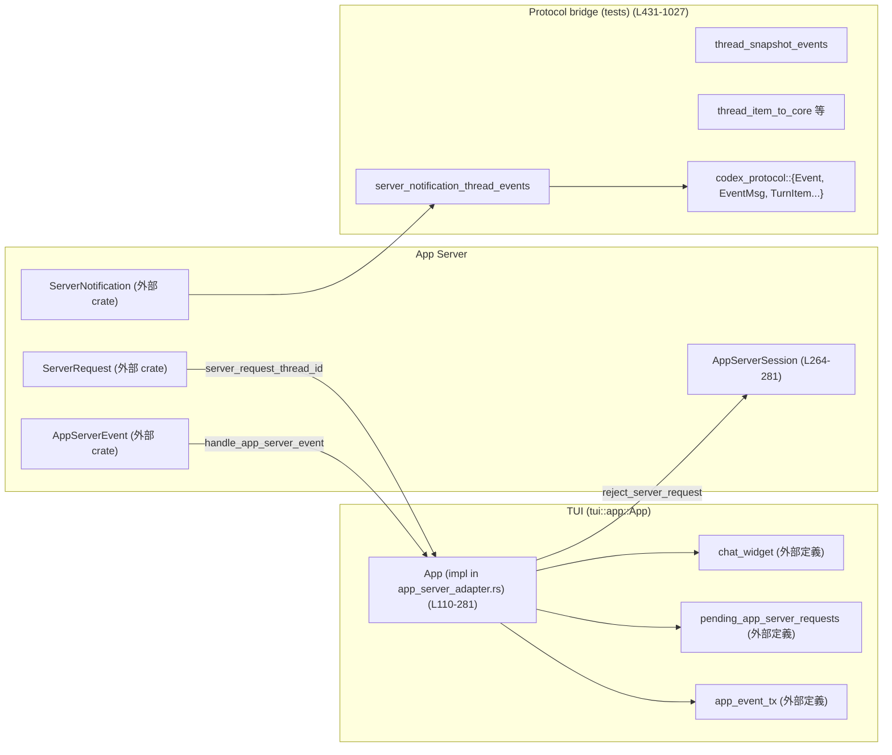
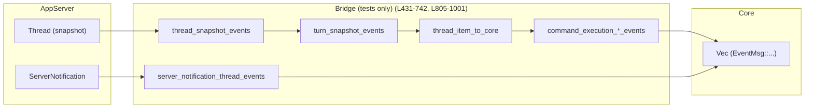

tui/src/app/app_server_adapter.rs

---

## 0. ざっくり一言

- TUI 側の `App` とアプリケーションサーバ（app-server）の間の **イベントアダプタ**です。  
- app-server からのイベント/リクエストを TUI の状態（スレッド単位のキューや `chat_widget`）に橋渡しし、テスト用には app-server のスナップショットや通知を既存の Core プロトコル `Event` 列に変換します。

---

## 1. このモジュールの役割

### 1.1 概要

このモジュールは次の問題を解決するために存在します。

- **問題**: 既存 TUI は「直接 Core」を前提にしたイベントモデルを持っているが、段階的に app-server を挟むハイブリッド構成に移行している（コメントより, L1-11）。  
- **機能**:
  - app-server からのストリームイベント `AppServerEvent` を受け取り、TUI の `App` 状態・UI・スレッドキューに振り分ける（`handle_app_server_event` など, L124-152, L154-263）。
  - app-server の `ServerNotification` / `Thread` スナップショットを **既存の Core/TUI イベント (`EventMsg`) にブリッジ**する（テスト用関数群, L431-742, L805-1001）。

### 1.2 アーキテクチャ内での位置づけ

主な依存関係は次の通りです。

- `App`（このモジュールの `impl` 対象）  
  - `chat_widget` 経由で UI 更新・エラーメッセージ・MCP サーバ状態更新などを行う（例: L112-121, L167-171, L173-186）。
  - `pending_app_server_requests` により app-server からのリクエストのサポート有無や状態を管理（L160-162, L225-227）。
  - `primary_thread_id` と `enqueue_*` メソッドで、通知・リクエストをスレッド単位のキューにルーティング（L192-199, L255-259）。
  - `app_event_tx` で致命的エラーを上位へ通知（L147-150）。
- `AppServerSession`  
  - 未サポートなリクエストを `reject_server_request` 経由で明示的に拒否（L264-281）。
- `codex_app_server_protocol` / `codex_protocol`  
  - app-server 側型 → Core/TUI 側型への変換を実装（`thread_item_to_core`, `token_usage_from_app_server` 等, L666-676, L805-890）。
- `tracing`  
  - ラグ・不正スレッド ID・未サポート項目などをログに記録（例: L131-134, L207-210, L443-447, L887-888）。

これを簡略化した図です。



※ `chat_widget`・`pending_app_server_requests`・`enqueue_*` メソッド等の定義はこのチャンクには現れないため詳細は不明です。

### 1.3 設計上のポイント

- **イベント駆動 + 非同期**  
  - app-server からのイベントは `App::handle_app_server_event` で一元的に受け、非同期で分派します（L124-152）。  
  - `&mut self` を取る async メソッドであり、Rust の借用規則により同時に複数タスクから `App` を可変参照できないため、状態一貫性はコンパイル時に担保されています。
- **スレッド単位のルーティング**  
  - `ServerNotificationThreadTarget`（L310-315）および `server_notification_thread_target`（L317-428）で通知の対象スレッドを特定し、`primary_thread_id` と比較して、  
    - プライマリスレッド用キュー or 個別スレッド用キュー or グローバル UI 更新  
    を選択します（L192-205, L213-218）。
- **型ベースの安全性**  
  - スレッド ID は `String` ではなく `ThreadId` にパースし、不正な UUID の場合はログを出して無視することで、下流での ID 不整合を防いでいます（L422-428, L442-447）。
- **エラーハンドリングの方針**  
  - 失敗しうる外部呼び出し（例: `reject_server_request`）は `Result` を返し、呼び出し側で `tracing::warn!` ログに落とすだけでアプリを落とさない（L237-245, L270-281）。  
  - ただし app-server ストリーム切断時は `FatalExitRequest` を送出し、アプリ全体の終了を促します（L147-150）。
- **後方互換のためのブリッジ層（テスト）**  
  - app-server の `Thread` / `ServerNotification` を、既存 TUI が期待する `EventMsg` 群に変換する多くの関数が `#[cfg(test)]` で定義されています（L431-741, L805-1001）。  
  - テストコードは「どの通知がどの `EventMsg` にマップされるか」を詳細に検証しています（L1066-1645）。

---

## 2. 主要な機能一覧

- app-server イベント処理:
  - `App::handle_app_server_event`: `AppServerEvent` を種類ごとに分派し、TUI 状態に反映します（L124-152）。
- サーバ通知処理:
  - `App::handle_server_notification_event`: `ServerNotification` を pending-request 解決・MCP 状態・アカウント状態更新・スレッドキュー・UI へ振り分けます（L154-218）。
- サーバリクエスト処理:
  - `App::handle_server_request_event`: 未サポートリクエストの検出／拒否と、スレッド単位のリクエストキューへの投入を行います（L220-263）。
  - `App::reject_app_server_request`: app-server へ JSON-RPC エラーを返信します（L264-281）。
- スレッド ID 抽出・ルーティング:
  - `server_request_thread_id`: `ServerRequest` から `ThreadId` を安全に取り出します（L284-307）。
  - `ServerNotificationThreadTarget` / `server_notification_thread_target`: 通知がどのスレッドに属するかを判定します（L310-315, L317-428）。
- テスト用 Core ブリッジ:
  - `thread_snapshot_events`: `Thread` スナップショットを `Event` 列に展開します（L431-455）。
  - `server_notification_thread_events`: 単一の `ServerNotification` を `(ThreadId, Vec<Event>)` に変換します（L457-664）。
  - `turn_snapshot_events`, `append_terminal_turn_events`: 1 ターンを legacy `EventMsg` 列に展開します（L679-742, L755-802）。
  - `thread_item_to_core`: app-server の `ThreadItem` を Core の `TurnItem` に変換します（L805-890）。
  - `command_execution_*_event(s)`: コマンド実行アイテムを legacy の ExecCommand イベントに変換します（L893-925, L928-991, L995-1000）。

---

## 3. 公開 API と詳細解説

### 3.1 型一覧（構造体・列挙体など）

| 名前 | 種別 | 役割 / 用途 | 定義位置 |
|------|------|-------------|----------|
| `App` | 構造体（外部定義） | TUI 全体のアプリケーション状態・イベントループを表す。ここで app-server 連携ロジックが `impl` されている。 | 定義はこのチャンクには現れない |
| `ServerNotificationThreadTarget` | 列挙体 | `ServerNotification` が属するスレッド or グローバル通知であるかを表す（`Thread`, `InvalidThreadId`, `Global`） | `tui/src/app/app_server_adapter.rs:L310-315` |

### 3.2 重要関数詳細（7件）

#### 1. `App::handle_app_server_event(&mut self, app_server_client: &AppServerSession, event: AppServerEvent)`

**概要**

- app-server から流れてくる `AppServerEvent` を一元的に受け取り、内容に応じて処理を分岐します（L124-152）。
- ラグ・通知・リクエスト・切断の 4 種類を扱います。

**引数**

| 引数名 | 型 | 説明 |
|--------|----|------|
| `self` | `&mut App` | アプリケーション状態。`chat_widget` や pending リクエストキューを更新します。 |
| `app_server_client` | `&AppServerSession` | app-server への RPC 用セッション。ここではリクエスト拒否に利用されます。 |
| `event` | `AppServerEvent` | app-server からの高レベルイベント（Lagged / ServerNotification / ServerRequest / Disconnected）。 |

**戻り値**

- なし（`async fn` ですが `()` を返します）。

**内部処理の流れ**

- `match event` により分岐（L129-150）:
  1. `Lagged { skipped }`:  
     - `tracing::warn!` でスキップ数をログ（L131-134）。  
     - MCP サーバ期待一覧を設定し直し（`refresh_mcp_startup_expected_servers_from_config`, L135-136）。  
     - `chat_widget.finish_mcp_startup_after_lag()` で UI 上の MCP 起動完了処理を行います（L136）。
  2. `ServerNotification(notification)`:
     - `handle_server_notification_event(self, app_server_client, notification).await` を呼び出し（L138-141）。
  3. `ServerRequest(request)`:
     - `handle_server_request_event(self, app_server_client, request).await` を呼び出し（L142-145）。
  4. `Disconnected { message }`:
     - 切断を warn ログ（L147）。
     - `chat_widget.add_error_message(message.clone())` で UI に表示（L148）。
     - `app_event_tx.send(AppEvent::FatalExitRequest(message))` でアプリ終了リクエストを送信（L149-150）。

**Examples（使用例）**

```rust
// app_server_event_stream からのイベントハンドリング例
while let Some(event) = app_server_event_stream.next().await {
    // app_server_session は AppServerSession 型のクライアント
    app.handle_app_server_event(&app_server_session, event).await;
}
```

（`app_server_event_stream` や `App` の具体的定義はこのチャンクには現れないため概念的な例です。）

**Errors / Panics**

- 自身は `Result` を返さず、内部で発生しうるエラーはログと副作用でのみ扱います。
  - 切断時の `FatalExitRequest` 送信が失敗した場合の挙動は、`send` の戻り値が無視されているためコードからは分かりません（L149-150）。  

**Edge cases（エッジケース）**

- ラグが大量に発生した場合でも、処理は `warn` ログと期待 MCP サーバ一覧の再設定のみに留まり、スキップされたイベントの再取得は行いません（L131-137）。
- 切断イベントでは app-server との再接続は行っておらず、必ず `FatalExitRequest` を投げます（L147-150）。

**使用上の注意点**

- `&mut self` を要求するため、複数の async タスクから同時にこのメソッドを呼ぶことはできません。イベントループ側で直列に処理する前提です（所有権システムによる安全性）。
- `app_server_client` は `Disconnected` の時点でも有効である前提ですが、このチャンクにはその保障は現れません。

---

#### 2. `App::handle_server_notification_event(&mut self, _app_server_client: &AppServerSession, notification: ServerNotification)`

**概要**

- app-server の `ServerNotification` を TUI 状態・スレッドキュー・UI に反映する中核処理です（L154-218）。
- ペンディングリクエストの解決、MCP サーバ状態・アカウント情報の反映、スレッド単位のルーティングを行います。

**引数**

| 引数名 | 型 | 説明 |
|--------|----|------|
| `self` | `&mut App` | TUI アプリケーション状態。 |
| `_app_server_client` | `&AppServerSession` | 現状この関数では未使用（プレースホルダ）。 |
| `notification` | `ServerNotification` | app-server 側定義のサーバ通知。 |

**戻り値**

- なし（`async fn`、`()`）。

**内部処理の流れ**

1. **特定の通知タイプを即時処理**（L159-187）:
   - `ServerRequestResolved` → `pending_app_server_requests.resolve_notification` で内部状態更新のみ（L160-163）。
   - `McpServerStatusUpdated` → MCP 期待サーバ一覧を設定し直し（L164-166）。
   - `AccountRateLimitsUpdated` → `app_server_rate_limit_snapshot_to_core` で Core 用 snapshot に変換し、`chat_widget.on_rate_limit_snapshot` に渡す（L167-171）。
   - `AccountUpdated` → `status_account_display_from_auth_mode` などで UI 用表示情報を計算し、`chat_widget.update_account_state` を更新（L173-185）。

   これらは処理後すぐ `return` して、それ以降のルーティングには進みません（L171, L185）。

2. **スレッドターゲット判定**（L190-205）:
   - `server_notification_thread_target(&notification)` を呼び、  
     - `Thread(thread_id)` / `InvalidThreadId(string)` / `Global` のいずれかを取得（L190-214）。
   - `Thread(thread_id)` の場合:
     - `self.primary_thread_id` が `Some(thread_id)` または `None` のとき → `enqueue_primary_thread_notification` に入れる（L192-195）。
     - それ以外 → `enqueue_thread_notification(thread_id, notification)` に入れる（L196-199）。
     - enqueue に失敗した場合は警告ログ（L201-203）。
   - `InvalidThreadId` の場合:
     - `tracing::warn!` して通知を無視（L206-212）。
   - `Global` の場合:
     - スレッドキューには入れず、後述の `chat_widget.handle_server_notification` に流れます。

3. **グローバル通知の UI 処理**（L215-218）:
   - `chat_widget.handle_server_notification(notification, None)` に渡して UI 側が処理します。

**Examples（使用例）**

通常は `handle_app_server_event` 経由で呼ばれるので、直接呼ぶことは少ない想定です。

```rust
// 直接テストなどで使う場合
app.handle_server_notification_event(&app_server_session, notification).await;
```

**Errors / Panics**

- enqueue 系メソッドの戻り値が `Result<_, _>` であり、`Err` の場合は warn ログのみに留めています（L201-203）。
- 不正なスレッド ID の場合も panic せず、`InvalidThreadId` としてログを残すだけです（L206-212, L422-427）。

**Edge cases**

- `primary_thread_id` が `None` のとき、最初の通知は **暗黙にプライマリスレッド扱い** で `enqueue_primary_thread_notification` に入ります（L192-195, L255-256）。この初期化タイミングは別ファイルにあり、このチャンクからは分かりません。
- `ServerNotification` にスレッド ID が含まれないタイプ（グローバル通知）は常に `Global` として UI 直接処理されます（L405-419, L215-218）。

**使用上の注意点**

- 新しい `ServerNotification` バリアントを app-server で追加した場合、この関数と `server_notification_thread_target` を同時に拡張しないと、通知が無視されたり全てグローバル扱いになったりします（L317-420）。
- enqueue 失敗時のリカバリ（再試行など）は実装されていません。

---

#### 3. `App::handle_server_request_event(&mut self, app_server_client: &AppServerSession, request: ServerRequest)`

**概要**

- app-server からの「ユーザー承認が必要なリクエスト」などを処理し、未サポートのものは即時拒否、それ以外はスレッドごとのキューへ enqueu します（L220-263）。

**引数**

| 引数名 | 型 | 説明 |
|--------|----|------|
| `self` | `&mut App` | アプリケーション状態。 |
| `app_server_client` | `&AppServerSession` | RPC 呼び出し用セッション。リクエスト拒否に利用します。 |
| `request` | `ServerRequest` | app-server 側のリクエスト。 |

**戻り値**

- なし（`async fn`）。

**内部処理の流れ**

1. **未サポートリクエスト検出**（L225-247）:
   - `pending_app_server_requests.note_server_request(&request)` を呼び、未サポートな場合は `Some(unsupported)` を返す前提です（実装はこのチャンク外）。
   - `unsupported` があれば:
     - warn ログ（L229-233）。
     - `chat_widget.add_error_message` でユーザーに表示（L234-235）。
     - `reject_app_server_request(app_server_client, unsupported.request_id, unsupported.message)` を await（L236-242）。
       - `Err` の場合は `tracing::warn!` ログのみ（L243-245）。
     - `return` で終了（L246）。

2. **スレッド ID 抽出**（L249-252）:
   - `server_request_thread_id(&request)` で `Option<ThreadId>` を取得（L249）。  
   - `None` の場合は warn ログ「threadless app-server request」を出して終了（L250-251）。

3. **プライマリ vs その他スレッドのルーティング**（L254-259）:
   - `primary_thread_id` が `Some(thread_id)` または未設定の場合:
     - `enqueue_primary_thread_request(request).await`（L255-256）。
   - それ以外は `enqueue_thread_request(thread_id, request).await`（L257）。
   - enqueu 失敗時は warn ログ（L260-261）。

**Examples**

```rust
// 通常は handle_app_server_event から間接的に呼ばれます。
app.handle_server_request_event(&app_server_session, request).await;
```

**Errors / Panics**

- `reject_app_server_request` は `Result<(), String>` を返し、失敗時には warn ログを出すだけです（L264-281, L243-245）。
- スレッド ID が取れないリクエストは単純に無視されます（L249-252）。

**Edge cases**

- `ServerRequest::ChatgptAuthTokensRefresh` / `ApplyPatchApproval` / `ExecCommandApproval` は `server_request_thread_id` が常に `None` を返すため（L304-307）、ここでは必ず「threadless」として warn ログに終わります。
- `primary_thread_id` 初期状態では全リクエストをプライマリスレッド扱いで enqueue する挙動になります（L255-256）。

**使用上の注意点**

- 新しい `ServerRequest` バリアントを app-server 側で追加した場合、`server_request_thread_id` と pending リクエスト管理（このチャンク外）を同時に拡張する必要があります。
- 拒否理由の JSON-RPC エラーコードは固定 `-32000` になっており（L273-276）、詳細なエラー分類が必要ならここを拡張する必要があります。

---

#### 4. `server_notification_thread_target(notification: &ServerNotification) -> ServerNotificationThreadTarget`

**概要**

- `ServerNotification` から「スレッド ID を伴うか」「グローバルか」「不正 ID か」を判定し、ルーティングに使う `ServerNotificationThreadTarget` を返します（L317-428）。

**引数**

| 引数名 | 型 | 説明 |
|--------|----|------|
| `notification` | `&ServerNotification` | app-server のサーバ通知。 |

**戻り値**

- `ServerNotificationThreadTarget`:
  - `Thread(ThreadId)`  
  - `InvalidThreadId(String)`  
  - `Global`

**内部処理の流れ**

1. 通知バリアントごとに `thread_id: Option<&str>` を求める（L320-420）。
   - 多くの通知は `notification.thread_id.as_str()` を返します（例: `TurnStarted`, L337）。
   - グローバルな通知 (`SkillsChanged` など) は `None` とします（L405-419）。
2. `match thread_id`（L422-428）:
   - `Some(id_str)`:
     - `ThreadId::from_string(id_str)` を試みる（UUID など）（L423-424）。
     - 成功 → `ServerNotificationThreadTarget::Thread(thread_id)`（L424-425）。
     - 失敗 → `ServerNotificationThreadTarget::InvalidThreadId(id_str.to_string())`（L425-426）。
   - `None` → `ServerNotificationThreadTarget::Global`（L427-428）。

**Examples**

```rust
match server_notification_thread_target(&notification) {
    ServerNotificationThreadTarget::Thread(thread_id) => {
        // スレッド別キューへ
    }
    ServerNotificationThreadTarget::Global => {
        // グローバル UI 更新
    }
    ServerNotificationThreadTarget::InvalidThreadId(raw) => {
        tracing::warn!(%raw, "invalid thread id");
    }
}
```

**Errors / Panics**

- `ThreadId::from_string` が失敗しても panic せず、`InvalidThreadId` として返します（L423-426）。

**Edge cases**

- 新しい通知バリアントが追加された場合、ここに `match` 分が追加されないと、その通知は自動的に `Global` と扱われます（L405-419）。

**使用上の注意点**

- app-server 側の `thread_id` が UUID 以外の形式に変わった場合、この関数の `ThreadId::from_string` との整合性を保つ必要があります。

---

#### 5. `thread_snapshot_events(thread: &Thread, show_raw_agent_reasoning: bool) -> Vec<Event>` （テスト専用）

**概要**

- app-server の `Thread` スナップショットを、TUI のイベントストアにそのままリプレイできる `Event` の列に変換します（L431-455）。
- 不正な `thread.id` の場合はログして空ベクタを返します。

**引数**

| 引数名 | 型 | 説明 |
|--------|----|------|
| `thread` | `&Thread` | app-server のスレッドスナップショット。複数ターンを含みます。 |
| `show_raw_agent_reasoning` | `bool` | 推論の「生テキスト」を別イベントとして出力するかどうか（L679-742 で使用）。 |

**戻り値**

- `Vec<Event>`: 各ターンを展開した `Event` 列。`TurnStarted` から終端イベントまで含む（L450-455）。

**内部処理の流れ**

1. `ThreadId::from_string(&thread.id)` を試みる（L442）。
   - 失敗 → warn ログ出力後、`Vec::new()` で終了（L443-447）。
2. `thread.turns.iter().flat_map(|turn| turn_snapshot_events(thread_id, turn, show_raw_agent_reasoning))` で各ターンを展開・連結（L451-454）。

**Examples**

テストからの使用例（簡略化）:

```rust
let events = thread_snapshot_events(&thread, /*show_raw_agent_reasoning*/ false);
// events[0].msg は TurnStarted のはず、などを検証（L1280-1335）
```

**Errors / Panics**

- `thread_id` 変換失敗時も panic せず、空ベクタを返します（L442-448）。

**Edge cases**

- ターン内に未サポートな `ThreadItem` が含まれると `thread_item_to_core` が `None` を返し、そのアイテムはスキップされます（L805-890, L708-710）。
- `TurnStatus::InProgress` のターンは終端イベントを出さず、中途状態のままリプレイされます（L755-802）。

**使用上の注意点**

- これは `#[cfg(test)]` のみ有効であり、実運用コードでは使えません（L431）。
- スナップショットの形式変更があった場合、`turn_snapshot_events` とセットで更新する必要があります。

---

#### 6. `server_notification_thread_events(notification: ServerNotification) -> Option<(ThreadId, Vec<Event>)>`（テスト専用）

**概要**

- 単一の `ServerNotification` を、TUI のイベントストアに流せる `(ThreadId, Vec<Event>)` に変換します（L457-664）。
- 対応していないバリアントは `None` を返します。

**引数**

| 引数名 | 型 | 説明 |
|--------|----|------|
| `notification` | `ServerNotification` | app-server のサーバ通知。 |

**戻り値**

- `Some((ThreadId, Vec<Event>))` または `None`。

**内部処理の流れ（例）**

- `match notification`（L461-662）でバリアントごとに処理:
  - `ThreadTokenUsageUpdated` → `TokenCount` イベント生成（L462-479, L666-676）。
  - `Error` → `ErrorEvent` に変換（L480-492）。
  - `ThreadNameUpdated` → `ThreadNameUpdatedEvent` を生成（L493-502）。
  - `TurnStarted` / `TurnCompleted` → `TurnStartedEvent` / `append_terminal_turn_events` を用いて終端イベント列を生成（L503-524, L755-802）。
  - `ItemStarted` / `ItemCompleted` →  
    - まずコマンド実行イベント試行（`command_execution_*_event`）し、  
    - それが `None` の場合は `thread_item_to_core` で `ItemStarted/ItemCompleted` イベントにします（L525-554, L893-925）。
  - コマンド出力 delta や各種 delta 系通知 → 対応する `*DeltaEvent` に変換（L555-603）。
  - Realtime 系通知 → `RealtimeConversation*` イベントに変換（L605-661）。

**Examples**

テスト例（`ItemCompleted` → `ItemCompleted` イベント）:

```rust
let (thread_id, events) = server_notification_thread_events(
    ServerNotification::ItemCompleted(ItemCompletedNotification { ... })
).expect("notification should bridge");
// events[0].msg が EventMsg::ItemCompleted であることを検証（L1066-1115）
```

**Errors / Panics**

- `ThreadId::from_string` の失敗は `ok()?` で `None` につながるため、この関数自体は `None` を返して「ブリッジできない通知」として扱います（例: L462-463）。
- `thread_item_to_core(&notification.item)?` を用いている箇所では、未サポート `ThreadItem` だと `None` → `?` → 関数全体が `None` になり、その通知はブリッジされません（L533-535, L548-550）。

**Edge cases**

- コマンド実行で `status == InProgress` の `ItemCompleted` 通知は、`command_execution_completed_event` が `Some(Vec::new())` を返すため、イベント 0 件として扱われます（L945-950）。
- サポートしていない通知バリアントは `match` の最後で `None`（L662）。

**使用上の注意点**

- これも `#[cfg(test)]` のためテスト専用です。
- app-server 側の新規通知追加時には、この関数とテスト（L1066 以降）を更新する必要があります。

---

#### 7. `turn_snapshot_events(thread_id: ThreadId, turn: &Turn, show_raw_agent_reasoning: bool) -> Vec<Event>`（テスト専用）

**概要**

- 1 つの `Turn` を「TUI がリアルタイムで見ていたと仮定したときのイベント列」に展開します（L679-742）。
- コマンド実行アイテムや推論/検索/画像生成/コンテキスト圧縮を legacy イベントに変換します。

**引数**

| 引数名 | 型 | 説明 |
|--------|----|------|
| `thread_id` | `ThreadId` | 対象スレッド ID（既に検証済み）。 |
| `turn` | `&Turn` | app-server のターンスナップショット。 |
| `show_raw_agent_reasoning` | `bool` | 推論コンテンツを追加の raw イベントとして出力するか。 |

**戻り値**

- `Vec<Event>`: `TurnStarted` + アイテムごとのイベント + 終端イベント列。

**内部処理の流れ**

1. 先頭に `TurnStarted` イベントを追加（L692-700）。
2. 各 `turn.items` を順番に処理（L702-737）。
   - `command_execution_snapshot_events` が `Some(events)` を返せばそれを追加し、次のアイテムへ（L703-706, L995-1000）。
   - それ以外は `thread_item_to_core(item)` で `TurnItem` に変換し、種類によって:
     - `UserMessage` / `Plan` / `AgentMessage` → `ItemCompleted` として 1 イベント（L712-721）。
     - `Reasoning` / `WebSearch` / `ImageGeneration` / `ContextCompaction` → `item.as_legacy_events(show_raw_agent_reasoning)` で複数イベントに展開（L722-734）。
3. 最後に `append_terminal_turn_events` で終端イベントを追加（L739-740）。

**Examples**

テスト `bridges_non_message_snapshot_items_via_legacy_events` などが使用例です（L1552-1612）。

**Errors / Panics**

- `thread_item_to_core` が `None` を返すアイテム（未サポート）は単純にスキップされます（L708-710）。

**Edge cases**

- `show_raw_agent_reasoning == true` の場合、`ReasoningItem` から summary と raw content の両方のイベントを生成し、イベント数が増えます（L1615-1645）。
- `TurnStatus::InProgress` のターンは終端イベントなしで終了します（L755-802）。

**使用上の注意点**

- app-server 側の `ThreadItem` バリアント追加時には `thread_item_to_core` と `TurnItem::as_legacy_events` 側の両方を確認する必要があります。

---

### 3.3 その他の関数一覧

| 関数名 | 役割（1行） | 定義位置 |
|--------|-------------|----------|
| `App::refresh_mcp_startup_expected_servers_from_config` | 設定から有効な MCP サーバ名を収集し、`chat_widget` に初期期待サーバとして渡します。 | `tui/src/app/app_server_adapter.rs:L110-122` |
| `App::reject_app_server_request` | app-server に JSON-RPC エラー `JSONRPCErrorError` を返してリクエストを拒否します。 | `tui/src/app/app_server_adapter.rs:L264-281` |
| `server_request_thread_id` | `ServerRequest` から `ThreadId` を抽出し、不要なバリアントでは `None` を返します。 | `tui/src/app/app_server_adapter.rs:L284-307` |
| `token_usage_from_app_server` | app-server のトークン使用量構造体を Core 側の `TokenUsage` にコピー変換します。 | `tui/src/app/app_server_adapter.rs:L666-676` |
| `append_terminal_turn_events` | `TurnStatus` に応じて `TurnComplete` / `TurnAborted` / `Error` イベントを追加します。 | `tui/src/app/app_server_adapter.rs:L755-802` |
| `thread_item_to_core` | 各種 `ThreadItem` を Core の `TurnItem` に変換し、未サポート項目は `None` にします。 | `tui/src/app/app_server_adapter.rs:L805-890` |
| `command_execution_started_event` | `ThreadItem::CommandExecution` から `ExecCommandBegin` イベントを生成します。 | `tui/src/app/app_server_adapter.rs:L893-925` |
| `command_execution_completed_event` | コマンド実行完了アイテムから `ExecCommandEnd` イベントを生成します。 | `tui/src/app/app_server_adapter.rs:L927-991` |
| `command_execution_snapshot_events` | コマンド実行アイテムを Begin/End の 2 イベントに展開します（End が空の場合もあり）。 | `tui/src/app/app_server_adapter.rs:L995-1000` |
| `app_server_web_search_action_to_core` | app-server 側の WebSearchAction を Core モデルの WebSearchAction に変換します。 | `tui/src/app/app_server_adapter.rs:L1003-1020` |
| `app_server_codex_error_info_to_core` | app-server 側の `CodexErrorInfo` を serde 経由で Core 側型に変換します。 | `tui/src/app/app_server_adapter.rs:L1023-1027` |

---

## 4. データフロー

### 4.1 ランタイム: app-server イベント処理フロー

`AppServerEvent` がどのように `App` → UI / スレッドキューに流れるかを示します。

```mermaid
sequenceDiagram
    title handle_app_server_event (L124-152) とその下流

    participant S as AppServerSession
    participant Loop as EventLoop(外部)
    participant App as App
    participant CW as chat_widget
    participant PR as pending_app_server_requests
    participant TX as app_event_tx

    Loop->>App: handle_app_server_event(&S, event)
    activate App

    alt Lagged (L129-137)
        App->>App: refresh_mcp_startup_expected_servers_from_config (L110-122)
        App->>CW: finish_mcp_startup_after_lag()
    else ServerNotification (L138-141)
        App->>App: handle_server_notification_event(&S, notification)
    else ServerRequest (L142-145)
        App->>App: handle_server_request_event(&S, request)
    else Disconnected (L146-150)
        App->>CW: add_error_message(message.clone())
        App->>TX: send(FatalExitRequest(message))
    end
    deactivate App
```

- `handle_server_notification_event` 内では、まず pending リクエストや MCP/アカウントを更新し、その後 `server_notification_thread_target` によるスレッドルーティング、最後に `chat_widget.handle_server_notification` による UI 更新が行われます（L154-218, L317-428）。
- `handle_server_request_event` 内では、`pending_app_server_requests` によるサポート判定 → `reject_app_server_request` or スレッド別 enqueue となります（L220-263, L264-281, L284-307）。

### 4.2 テスト時: スナップショット・通知のブリッジ

テストでは app-server のスナップショットがどのように Core/TUI イベントに変換されるかを次のように流します。



---

## 5. 使い方（How to Use）

### 5.1 基本的な使用方法

実運用コードでは、おおよそ次のようなイメージで使われます。

```rust
use tui::app::App;
use crate::app_server_session::AppServerSession;
use codex_app_server_client::AppServerEvent;

// app と app_server_session の構築はこのチャンクには現れない
async fn main_loop(mut app: App, app_server_session: AppServerSession) {
    let mut events = app_server_session.event_stream().await; // 仮の API

    while let Some(event) = events.next().await {
        app.handle_app_server_event(&app_server_session, event).await;
    }
}
```

- 実際の `event_stream` や `App` コンストラクタなどの API はこのチャンクには現れませんが、`handle_app_server_event` をイベントループの中心に置く構成になります。

### 5.2 よくある使用パターン

- **app-server 切断時の終了**  
  `Disconnected` イベントで `FatalExitRequest` が送られるので、アプリ側のメインループは `app_event_tx` 経由で終了指示を受ける構成になると考えられます（L146-150）。
- **テストでのスナップショット再生**  
  - テストでは `thread_snapshot_events` を用いて、スナップショットから生成した `Event` 列を TUI のイベントストアに流し、UI 状態の復元を検証できます（例: L1453-1549）。

### 5.3 よくある間違い（推測される点）

コードから推測できる注意点を挙げます。

```rust
// 誤りの可能性: 直接 ServerNotification を処理し、スレッドルーティングを行わない
app.handle_server_notification_event(&session, notification).await;
// → server_notification_thread_target によるルーティングはされるが、
//   pending_app_server_requests や primary_thread_id 初期化との整合を
//   他の呼び出し方と分断してしまうリスクがあります。

// より一貫性のある例:
app.handle_app_server_event(&session, AppServerEvent::ServerNotification(notification)).await;
```

- `handle_server_request_event` / `handle_server_notification_event` を単独で使うと、将来 `handle_app_server_event` に追加される共通処理と乖離する可能性があります。

### 5.4 使用上の注意点（まとめ）

- **前提条件**
  - `App` 内部の `chat_widget`, `pending_app_server_requests`, `primary_thread_id`, `enqueue_*` メソッドなどは初期化済みである必要があります（定義はこのチャンクには現れません）。
- **スレッド安全性**
  - `&mut self` を取る設計により、Rust の所有権システムが同時書き込みを防いでいるため、**並行性バグはコンパイル時に防がれます**。
- **エラー処理**
  - 多くのエラーは `tracing::warn!` ログのみで処理され、呼び出し側には `Result` として伝播しません。そのため、アプリ全体の停止や再試行戦略は上位で設計する必要があります。

---

## 6. 変更の仕方（How to Modify）

### 6.1 新しい app-server 機能を追加する場合

例: 新しい `ServerNotification::FooBar` を app-server 側に追加したケース。

1. **スレッドターゲット判定への対応**  
   - `server_notification_thread_target` に新バリアントを追加し、スレッド ID がある場合は `Some(&notification.thread_id)`、グローバルなら `None` を返すようにします（L317-420）。
2. **通知本体の処理**  
   - スレッド単位で処理したい場合は `handle_server_notification_event` 内に分岐を足すか、`chat_widget.handle_server_notification` 側で対応します（L159-188, L215-218）。
3. **テストブリッジ（必要なら）**  
   - TUI の legacy `Event` へ変換したい場合、`server_notification_thread_events` に新バリアント処理を追加し、テストを追記します（L457-664, L1031 以降）。

### 6.2 既存の機能を変更する場合の注意点

- **契約（Contracts）**
  - `server_request_thread_id` が `None` を返すバリアントは「スレッドレス」として無視されるという暗黙の契約があります（L304-307, L249-252）。
  - `thread_snapshot_events` / `turn_snapshot_events` は「TUI がリアルタイムに見た場合のイベント列と同一である」ことを前提にテストが書かれています（コメント L679-685, テスト L1453-1549）。これを崩すとテストが失敗します。
- **影響範囲の確認**
  - `handle_*` 系メソッドはアプリ全体のイベントループ中核にあるため、変更時には上位のイベントループと `chat_widget` 実装も確認する必要があります（定義はこのチャンクには現れません）。
- **テスト**
  - このファイルには詳細なユニットテストが多数含まれているため、仕様変更時にはまずここを実行すると挙動差分を把握しやすいです（L1066-1645）。

---

## 7. 関連ファイル

| パス（推定含む） | 役割 / 関係 |
|-----------------|------------|
| `tui/src/app/app.rs` | `App` 構造体本体とメインのアプリケーションループを提供していると推測されます（`use super::App;` より, L14）。定義はこのチャンクには現れません。 |
| `tui/src/app/app_event.rs` | `AppEvent::FatalExitRequest` 等、アプリ内イベント型を定義しています（L15, L147-150）。 |
| `tui/src/app/app_server_session.rs` | `AppServerSession` および `app_server_rate_limit_snapshot_to_core`, `status_account_display_from_auth_mode` の実装を提供します（L16-18, L167-171, L173-179）。 |
| `tui/src/exec_command.rs` | テストで使う `split_command_string` を提供します（L19-20, L914-915, L973-975）。 |
| `codex_app_server_client` crate | `AppServerEvent` 型など、app-server クライアント API を定義します（L21, L124-128）。 |
| `codex_app_server_protocol` crate | `ServerNotification`, `ServerRequest`, `Thread`, `ThreadItem`, `Turn` など app-server プロトコル型を定義します（L22-33, L461 以降多数）。 |
| `codex_protocol` crate | 既存 TUI / Core の `Event`, `EventMsg`, `TurnItem` などを定義し、ブリッジの出力先となります（L34-106, L457 以降多数）。 |

---

## Bugs / Security / Edge Cases のまとめ

- **潜在的バグ候補**
  - `server_notification_thread_events` で、`ThreadId::from_string(...).ok()?` や `thread_item_to_core(...) ?` によりブリッジできない通知は静かに `None` になり、テスト以外で気付きづらい可能性があります（L462-463, L533-535, L548-550）。
- **セキュリティ観点**
  - JSON-RPC エラー返却時のコード `-32000` は汎用エラーであり、より詳細なエラー分類が必要な場合はサーバ側の解釈と合わせて調整が必要です（L273-276）。
  - スレッド ID の検証を行っているため、不正な ID によるスレッド混入は防がれています（L422-427, L442-447）。
- **エッジケース**
  - `duration_ms` が `u64` に変換不能な場合は 0ms として扱われます（L961-965）。
  - コマンド実行 `status == InProgress` な `ItemCompleted` は「イベント 0 件」として扱われ、Begin のみ存在する状態になります（L945-950）。この仕様はテストで検証されています（L1155-1248）。

---

## Tests（概要）

このファイルには、多くのユニットテストが含まれています（L1066-1645）。主な検証内容は:

- agent メッセージ・ターン完了通知の正しいブリッジ（L1066-1153, L1372-1409）。
- コマンド実行の Begin/Delta/End イベントへの変換（L1155-1248, L1250-1277, L1279-1335）。
- スナップショットからのターン再生（完了/中断/失敗）のイベント列一致（L1453-1549）。
- Reasoning / WebSearch / ImageGeneration / ContextCompaction の legacy イベントへの展開（L1551-1612, L1615-1645）。

これにより、ブリッジロジックの後方互換性が高い信頼度で担保されています。

---

## Performance / Scalability（要点のみ）

- 各関数は主に `match` と軽量な `clone` / `collect()` を行うだけで、I/O は app-server セッションやチャネル送信程度です（例: L270-281, L555-565）。
- ボトルネックになりうるのはイベント数が極端に多いスナップショットの `thread_snapshot_events` ですが、単純な線形処理のみであり、通常の TUI 用途では問題になりにくい実装です（L450-455, L702-737）。

---

## Observability（ログ・監視）

- `tracing::warn!` / `tracing::debug!` により、以下の状況がログに残ります。
  - イベント消費ラグ（L131-134）。
  - 未サポートリクエスト・enqueue 失敗・不正スレッド ID（L229-233, L201-203, L207-210）。
  - 不正な thread スナップショットや未サポート `ThreadItem`（L443-447, L887-888）。
- これらを利用することで、移行期間中の app-server/TUI 間の不整合を検知しやすくなっています。
