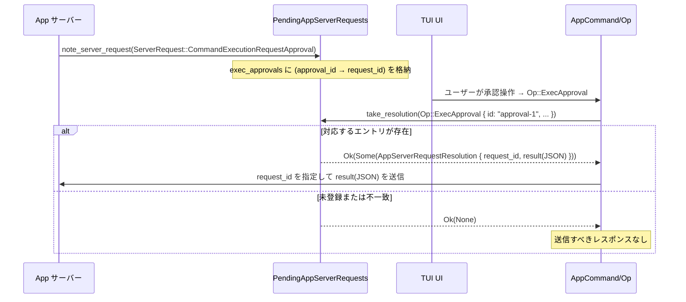

# tui/src/app/app_server_requests.rs

## 0. ざっくり一言

App サーバーから届く各種承認リクエスト（コマンド実行・ファイル変更・権限・ユーザー入力・MCP elicitation）を TUI 内で追跡し、ユーザー操作（`AppCommand`）を対応するサーバー向けレスポンス JSON に変換するための状態管理モジュールです。（根拠: app_server_requests.rs:L??-??）

> 注: 提供チャンクに行番号情報が含まれていないため、根拠は `L??-??` としています。

---

## 1. このモジュールの役割

### 1.1 概要

- このモジュールは **App サーバーからの「承認を要するリクエスト」** を一時的に記録し、  
  後で TUI 側で行われたユーザー操作と相互に対応付けるために存在します。
- 具体的には:
  - `ServerRequest` を受信したときに `note_server_request` で内部の `HashMap` に登録し、
  - ユーザー操作に基づく `AppCommand` を `take_resolution` に渡すことで、
    対応する `AppServerRequestId` とレスポンス JSON（`serde_json::Value`）を生成します。
- 未対応のサーバーリクエスト（動的ツール呼び出しなど）を検知し、  
  `UnsupportedAppServerRequest` として TUI に知らせる役割も持ちます。
  （根拠: `PendingAppServerRequests` と `note_server_request`, `take_resolution` の実装）

### 1.2 アーキテクチャ内での位置づけ

このモジュールは、TUI 内部の `AppCommand` と外部の `codex_app_server_protocol::ServerRequest` / レスポンス型の橋渡しを行うコンポーネントです。

```mermaid
graph TD
    Server["App サーバー\n(codex_app_server_protocol::ServerRequest)"]
    Pending["PendingAppServerRequests\n(本モジュール)"]
    UI["TUI UI / ユーザー"]
    AppCmd["AppCommand / AppCommandView\n(crate::app_command)"]
    Res["AppServerRequestResolution\n(request_id + JSON)"]

    Server -->|ServerRequest| Pending
    Pending -->|Option<UnsupportedAppServerRequest>| UI
    UI -->|操作| AppCmd
    AppCmd -->|view()| Pending
    Pending -->|Option<Res>| Res
    Res -->|レスポンス送信| Server
```

- サーバーからの `ServerRequest` はまず `PendingAppServerRequests::note_server_request` に渡されます。
- ユーザー操作により生成された `AppCommand`（実際には `Op` など、`Into<AppCommand>` な型）が  
  `PendingAppServerRequests::take_resolution` に渡され、対応するサーバーリクエストのレスポンスが生成されます。
- 未サポートのリクエストは `UnsupportedAppServerRequest` として UI に返されます。
  （根拠: `note_server_request`, `take_resolution` の分岐）

### 1.3 設計上のポイント

- **責務の分割**
  - この構造体は「ペンディング中のサーバーリクエストの管理」に特化しています。
  - 実際の UI 制御やネットワーク送受信は別モジュールにあり、本モジュールは状態と変換ロジックのみを持ちます。
- **状態管理**
  - `PendingAppServerRequests` は複数種類のリクエストごとに `HashMap` を持ちます:
    - `exec_approvals`（コマンド実行承認）
    - `file_change_approvals`（ファイル変更承認）
    - `permissions_approvals`（追加権限承認）
    - `user_inputs`（ツールからのユーザー入力）
    - `mcp_requests`（MCP elicitation）
  - いずれもキーは UI 側が扱いやすい ID（`String` または MCP の RequestId）で、  
    値に App サーバー側の `AppServerRequestId` を保持します。
- **エラーハンドリング**
  - レスポンス生成時のエラーは `Result<_, String>` で呼び出し元に返します。
  - JSON 変換には `serde_json::to_value` / `from_value` を用い、失敗時は詳細メッセージを付けて `Err(String)` を返します。
  - パニックは発生させず、すべてランタイムエラーとして扱います。
- **並行性**
  - すべてのメソッドは `&mut self` を取る設計であり、  
    `PendingAppServerRequests` 自体はスレッドセーフではありません（共有したい場合は上位で `Mutex` 等が必要です）。
- **プロトコル間変換**
  - `file_change_decision` や `app_server_request_id_to_mcp_request_id` など、  
    プロトコル型間の変換を小さな関数／ヘルパーに分離しています。
  - 権限関連は `granted_permission_profile_from_request` に委譲しています。

---

## 2. 主要な機能一覧

- サーバーリクエストの記録: `note_server_request` による `ServerRequest` の分類と保存
- ユーザー操作からのレスポンス生成: `take_resolution` による `AppCommand` → JSON レスポンス変換
- MCP elicitation の相関: `McpLegacyRequestKey` と ID 変換を用いた MCP リクエストとの対応付け
- 未サポートリクエストの検出: Dynamic tool call や legacy 承認リクエストを `UnsupportedAppServerRequest` として通知
- ペンディング状態のクリア／部分削除: `clear` および `resolve_notification` によるクリーンアップ
- ファイル変更承認決定のバリデーション: `file_change_decision` による `ReviewDecision` のチェックと変換

---

## 3. 公開 API と詳細解説

### 3.1 型一覧（構造体・列挙体など）

| 名前 | 種別 | 公開範囲 | 役割 / 用途 | 主なフィールド |
|------|------|----------|-------------|----------------|
| `AppServerRequestResolution` | 構造体 | `pub(super)` | サーバーへのレスポンス送信に必要な情報（リクエスト ID と JSON ペイロード）をまとめたコンテナです。`take_resolution` の戻り値として使われます。 | `request_id: AppServerRequestId`, `result: serde_json::Value` |
| `UnsupportedAppServerRequest` | 構造体 | `pub(super)` | TUI がまだサポートしていないサーバーリクエスト（動的ツール呼び出しなど）を表し、UI にメッセージを表示するために使われます。 | `request_id: AppServerRequestId`, `message: String` |
| `PendingAppServerRequests` | 構造体 | `pub(super)` | ペンディング中の各種サーバーリクエストを種類別に保持し、`note_server_request` / `take_resolution` / `resolve_notification` で操作するメインの状態オブジェクトです。 | 5 つの `HashMap`（`exec_approvals`, `file_change_approvals`, `permissions_approvals`, `user_inputs`, `mcp_requests`） |
| `McpLegacyRequestKey` | 構造体 | モジュール内 (`struct`) | MCP elicitation リクエストを識別するためのキーで、サーバー名と MCP 側の `RequestId` のペアです。`mcp_requests` のキーに利用されます。 | `server_name: String`, `request_id: McpRequestId` |

（根拠: 構造体定義部とフィールド宣言）

---

### 3.2 関数詳細

#### 3.2.1 `PendingAppServerRequests::note_server_request(&mut self, request: &ServerRequest) -> Option<UnsupportedAppServerRequest>`

**概要**

- App サーバーから届いた `ServerRequest` を種類ごとの `HashMap` に登録します。
- TUI で未サポートのリクエストの場合は `UnsupportedAppServerRequest` を返し、  
  UI がユーザーに通知できるようにします。（根拠: `match request { ... }` の各分岐）

**引数**

| 引数名 | 型 | 説明 |
|--------|----|------|
| `self` | `&mut PendingAppServerRequests` | 内部状態（ペンディングリクエストのマップ）を更新します。 |
| `request` | `&ServerRequest` | App サーバーから届いたリクエスト全体です。各バリアントに応じた処理を行います。 |

**戻り値**

- `Option<UnsupportedAppServerRequest>`  
  - `None`: TUI がサポートしており、正常に記録された場合
  - `Some(UnsupportedAppServerRequest)`: TUI で未サポートの種類であり、エラーメッセージ付きで返される場合

**内部処理の流れ**

1. `match request` で `ServerRequest` のバリアントを判別します。
2. 各バリアントごとに、対応する `HashMap` に `(キー, AppServerRequestId)` を挿入します:
   - `CommandExecutionRequestApproval`:
     - キー: `approval_id` があればそれを、なければ `item_id`（文字列 ID）。
     - マップ: `exec_approvals`。（根拠: `approval_id.unwrap_or_else(|| params.item_id.clone())`）
   - `FileChangeRequestApproval`:
     - キー: `item_id`
     - マップ: `file_change_approvals`
   - `PermissionsRequestApproval`:
     - キー: `item_id`
     - マップ: `permissions_approvals`
   - `ToolRequestUserInput`:
     - キー: `turn_id`
     - マップ: `user_inputs`
   - `McpServerElicitationRequest`:
     - キー: `McpLegacyRequestKey { server_name, request_id: app_server_request_id_to_mcp_request_id(request_id) }`
     - マップ: `mcp_requests`
3. 未サポートのリクエストタイプでは `UnsupportedAppServerRequest` を返します:
   - `DynamicToolCall` → `"Dynamic tool calls are not available in TUI yet."`
   - `ApplyPatchApproval` → `"Legacy patch approval requests are not available in TUI yet."`
   - `ExecCommandApproval` → `"Legacy command approval requests are not available in TUI yet."`
4. `ChatgptAuthTokensRefresh` は無視（`None` を返し、マップにも登録しません）。

**Examples（使用例）**

_動作確認はテストコードに示されています。_

- コマンド実行承認の記録（テスト: `resolves_exec_approval_through_app_server_request_id`）

```rust
let mut pending = PendingAppServerRequests::default();

let request = ServerRequest::CommandExecutionRequestApproval {
    request_id: AppServerRequestId::Integer(41),
    params: CommandExecutionRequestApprovalParams {
        item_id: "call-1".to_string(),
        approval_id: Some("approval-1".to_string()),
        // その他フィールド省略
        ..Default::default()
    },
};

assert_eq!(pending.note_server_request(&request), None); // 正常に記録される
```

- 未サポートの Dynamic tool call（テスト: `rejects_dynamic_tool_calls_as_unsupported`）

```rust
let mut pending = PendingAppServerRequests::default();

let unsupported = pending
    .note_server_request(&ServerRequest::DynamicToolCall {
        request_id: AppServerRequestId::Integer(99),
        params: DynamicToolCallParams { /* ... */ },
    })
    .expect("dynamic tool calls should be rejected");

assert_eq!(unsupported.request_id, AppServerRequestId::Integer(99));
assert_eq!(
    unsupported.message,
    "Dynamic tool calls are not available in TUI yet."
);
```

**Errors / Panics**

- 本関数は `Result` を返さず、内部でパニックも起こしません。
- すべての分岐で確定的な処理（`HashMap::insert` と構造体生成）のみを行います。

**Edge cases（エッジケース）**

- 同じキー（例: 同じ `approval_id`）で複数回呼ばれた場合、  
  `HashMap::insert` により最後のリクエストのみが保持されます。
- `ChatgptAuthTokensRefresh` はペンディングとして記録されません。  
  そのため、`take_resolution` で対応するものを解決しようとしても何も見つかりません。
- MCP リクエストでは、App サーバー側の `RequestId` が `McpRequestId` に変換されてからキーに使われます。

**使用上の注意点**

- 後で `take_resolution` で解決したい `ServerRequest` は、**必ず** `note_server_request` を通過させておく必要があります。
- `CommandExecutionRequestApproval` では、キーとして `approval_id` が優先されます。  
  ユーザー操作側が使う ID も同じ値（`approval_id`）になる前提です（テストでも `approval-1` を使用）。
- 未サポートリクエストの `message` は UI に直接表示される可能性が高いため、  
  他コードからハードコーディングで参照する場合はテストと整合を取る必要があります。

---

#### 3.2.2 `PendingAppServerRequests::take_resolution<T>(&mut self, op: T) -> Result<Option<AppServerRequestResolution>, String> where T: Into<AppCommand>`

**概要**

- ユーザー操作を表す `op`（`AppCommand` への変換可能な型）から、  
  対応するペンディング中のサーバーリクエストを検索し、適切なレスポンス JSON を組み立てます。
- 対応するペンディングが見つからなければ `Ok(None)` を返します。
- 変換や検証に失敗した場合は `Err(String)` でエラーメッセージを返します。

**引数**

| 引数名 | 型 | 説明 |
|--------|----|------|
| `self` | `&mut PendingAppServerRequests` | ペンディングマップから該当エントリを取り出し（`remove`）、レスポンス生成に利用します。 |
| `op` | `T: Into<AppCommand>` | ユーザー操作を表すコマンド（例: `Op::ExecApproval`）。`AppCommand` に変換され、`view()` で中身を参照します。 |

**戻り値**

- `Result<Option<AppServerRequestResolution>, String>`
  - `Ok(Some(resolution))`: 対応するペンディングリクエストがあり、レスポンス生成に成功した場合。
  - `Ok(None)`: 対応するペンディングが存在しなかった、または関係ないコマンドだった場合。
  - `Err(String)`: JSON 変換失敗や、`file_change_decision` によるバリデーションエラーなど。

**内部処理の流れ（アルゴリズム）**

1. `let op: AppCommand = op.into();` で `AppCommand` に変換し、`op.view()` でビューとなる `AppCommandView` を取得します。
2. `match` で `AppCommandView` のバリアントを判別し、それぞれに対応するマップから `remove` でエントリを取り出します。
3. 見つかった場合（`Some(request_id)`）だけ、サーバー側のレスポンス型を組み立てて JSON にシリアライズします。
   - コマンド実行承認 (`ExecApproval`):
     - `CommandExecutionRequestApprovalResponse { decision: decision.clone().into() }`
     - 例: `{ "decision": "accept" }`
   - ファイル変更承認 (`PatchApproval`):
     - `file_change_decision(decision)?` で `ReviewDecision` を `FileChangeApprovalDecision` に変換。
     - `FileChangeRequestApprovalResponse { decision: ... }`
   - 権限リクエスト応答 (`RequestPermissionsResponse`):
     - `granted_permission_profile_from_request(response.permissions.clone())` でプロトコル間変換。
     - `PermissionsRequestApprovalResponse { permissions, scope: response.scope.into() }`
   - ユーザー入力応答 (`UserInputAnswer`):
     - TUI 側のレスポンス構造体を一度 JSON にし、サーバー側の `ToolRequestUserInputResponse` にデシリアライズしてから再度 JSON に戻します。
   - MCP elicitation 解決 (`ResolveElicitation`):
     - `McpServerElicitationRequestResponse { action, content: content.clone(), meta: meta.clone() }`
     - `action` は `ElicitationAction` から `McpServerElicitationAction` にマッピング。
4. `serde_json::to_value` / `from_value` が失敗した場合や `file_change_decision` が `Err` を返した場合、  
   `?` によりその場で `Err(String)` を返します。
5. `AppCommandView` が上記いずれにも該当しない場合（たとえば別種のコマンド）の場合は `None` を返します。

**Examples（使用例）**

- 正常系: コマンド実行承認（テスト: `resolves_exec_approval_through_app_server_request_id`）

```rust
let mut pending = PendingAppServerRequests::default();

// 事前に note_server_request で登録
pending.note_server_request(&ServerRequest::CommandExecutionRequestApproval {
    request_id: AppServerRequestId::Integer(41),
    params: CommandExecutionRequestApprovalParams {
        item_id: "call-1".to_string(),
        approval_id: Some("approval-1".to_string()),
        ..Default::default()
    },
}).unwrap_or_default();

// ユーザーが承認した操作（Op）は Into<AppCommand> になっている
let resolution = pending
    .take_resolution(&Op::ExecApproval {
        id: "approval-1".to_string(),
        turn_id: None,
        decision: ReviewDecision::Approved,
    })?
    .expect("request should be pending");

assert_eq!(resolution.request_id, AppServerRequestId::Integer(41));
assert_eq!(resolution.result, json!({ "decision": "accept" }));
```

- エラー系: 無効なファイル変更決定（テスト: `rejects_invalid_patch_decisions_for_file_change_requests`）

```rust
let mut pending = PendingAppServerRequests::default();

// FileChangeRequestApproval を登録
pending.note_server_request(&ServerRequest::FileChangeRequestApproval {
    request_id: AppServerRequestId::Integer(13),
    params: FileChangeRequestApprovalParams {
        item_id: "patch-1".to_string(),
        ..Default::default()
    },
}).unwrap_or_default();

// ファイル変更には使えない決定種別を渡す
let err = pending
    .take_resolution(&Op::PatchApproval {
        id: "patch-1".to_string(),
        decision: ReviewDecision::ApprovedExecpolicyAmendment {
            proposed_execpolicy_amendment: ExecPolicyAmendment::new(vec![
                "echo".to_string(),
                "hi".to_string(),
            ]),
        },
    })
    .expect_err("invalid patch decision should fail");

assert_eq!(
    err,
    "execpolicy amendment is not a valid file change approval decision"
);
```

**Errors / Panics**

- 返り値の `Err(String)` が発生しうるケース:
  - `file_change_decision` が `ReviewDecision::ApprovedExecpolicyAmendment` または `NetworkPolicyAmendment` を受け取った場合。
  - `serde_json::to_value` / `from_value` が何らかの理由で失敗した場合（構造体の `Serialize` / `Deserialize` 実装に依存）。
- 関数内部でパニックを起こすコードはありません（テスト側では `expect` を使っていますが、本体は安全です）。

**Edge cases（エッジケース）**

- 対応する ID がマップに存在しない場合（`remove` が `None` を返す場合）、  
  その分岐は `None` になり、最終的に `Ok(None)` が返されます。
- `remove` は常にマップからエントリを削除するため、**エラーが起きてもエントリは戻されません**。  
  つまり、一度 `take_resolution` を呼び出してエラーになった場合、その ID については再度解決することができません。
- 一つの `take_resolution` 呼び出しで複数種のマップが操作されることはありません。  
  `AppCommandView` のバリアントは相互排他的です。
- MCP elicitation では、`server_name` と `request_id`（`McpRequestId`）のペアでマップを引くため、  
  どちらかが間違っていると対応するリクエストを見つけられません。

**使用上の注意点**

- `take_resolution` の戻り値は `Result<Option<_>, String>` であり、  
  `Err` と `Ok(None)` を区別して扱う必要があります。
  - `Err`: 変換やバリデーションに失敗したケース（通常はログ・ユーザー通知が必要）。
  - `Ok(None)`: 関連するペンディングリクエストが見つからなかったケース。
- エラー時に対応するペンディングが削除される点は重要です。  
  呼び出し側で再試行ロジックを組む場合、この挙動を前提に設計する必要があります。
- 本関数は `&mut self` を取るため、同じインスタンスを複数スレッドから同時に呼び出す場合は上位で排他制御が必要です。

---

#### 3.2.3 `PendingAppServerRequests::resolve_notification(&mut self, request_id: &AppServerRequestId)`

**概要**

- 与えられた `AppServerRequestId` に対応するペンディング中のリクエストを、  
  すべてのマップから一括削除するヘルパーです。
- サーバーから別経路で「このリクエストはもう不要」といった通知を受け取った場合などに利用される想定です。

**引数**

| 引数名 | 型 | 説明 |
|--------|----|------|
| `self` | `&mut PendingAppServerRequests` | 内部マップを破壊的に更新します。 |
| `request_id` | `&AppServerRequestId` | 削除対象となるサーバー側リクエスト ID です。 |

**戻り値**

- なし（`()`）。失敗もしません。

**内部処理の流れ**

1. 各マップに対して `retain` を呼び出し、値（`AppServerRequestId`）が `request_id` と異なるエントリのみ残します。
   - `exec_approvals.retain(|_, value| value != request_id);`
   - `file_change_approvals.retain(|_, value| value != request_id);`
   - `permissions_approvals.retain(|_, value| value != request_id);`
   - `user_inputs.retain(|_, value| value != request_id);`
   - `mcp_requests.retain(|_, value| value != request_id);`

**Examples（使用例）**

```rust
let mut pending = PendingAppServerRequests::default();

// どこかで note_server_request により request_id = 42 が登録されていると仮定
let id = AppServerRequestId::Integer(42);

// サーバーから「このリクエストはキャンセルされた」と通知された場面など
pending.resolve_notification(&id);

// 以後、この request_id に対応するペンディングは存在しない
```

**Errors / Panics**

- `retain` のクロージャは単純な比較のみで、パニックする要素はありません。

**Edge cases（エッジケース）**

- 同じ `AppServerRequestId` が複数マップにまたがって登録されている場合、  
  すべてのマップから削除されます。
- 渡された `request_id` がどのマップにも存在しない場合、何も削除されず副作用はありません。

**使用上の注意点**

- `resolve_notification` は **キーではなく値（`AppServerRequestId`）で削除** する点に注意が必要です。  
  キー（たとえば `approval_id` や `item_id`）が分かっていても、この関数だけでは削除できません。
- もともと `note_server_request` を通して登録されていないリクエスト ID を指定しても、何も起こりません。

---

#### 3.2.4 `fn app_server_request_id_to_mcp_request_id(request_id: &AppServerRequestId) -> McpRequestId`

**概要**

- App サーバープロトコル側の `RequestId` と MCP プロトコル側の `RequestId` の間の単純な型変換です。
- 文字列／整数の区別を保ったままラップし直します。

**引数**

| 引数名 | 型 | 説明 |
|--------|----|------|
| `request_id` | `&AppServerRequestId` | App サーバー側のリクエスト ID（文字列または整数）。 |

**戻り値**

- `McpRequestId`  
  - `AppServerRequestId::String` → `McpRequestId::String`
  - `AppServerRequestId::Integer` → `McpRequestId::Integer`

**内部処理の流れ**

1. `match request_id` でバリアントを判別します。
2. それぞれに対応する `McpRequestId` のバリアントを生成して返します。

**Examples（使用例）**

```rust
let app_id = AppServerRequestId::Integer(12);
let mcp_id = app_server_request_id_to_mcp_request_id(&app_id);
assert_eq!(mcp_id, McpRequestId::Integer(12));
```

**Errors / Panics**

- エラーは発生しません。全てのバリアントを網羅しています。

**Edge cases / 使用上の注意点**

- 現状 `RequestId` は文字列と整数のみであり、それ以外の型は想定していません。  
  新しいバリアントが追加された場合は、この関数の `match` も更新する必要があります。

---

#### 3.2.5 `fn file_change_decision(decision: &ReviewDecision) -> Result<FileChangeApprovalDecision, String>`

**概要**

- ファイル変更承認に対して許容される `ReviewDecision` をチェックし、  
  App サーバー側の `FileChangeApprovalDecision` に変換します。
- ファイル変更に不適切な決定種別（例: execpolicy amendment）に対してはエラーを返します。

**引数**

| 引数名 | 型 | 説明 |
|--------|----|------|
| `decision` | `&ReviewDecision` | ユーザーのレビュー結果を表す決定。ファイル変更に対して妥当かチェックされます。 |

**戻り値**

- `Result<FileChangeApprovalDecision, String>`
  - `Ok(FileChangeApprovalDecision::Accept)` など、妥当な決定の場合
  - `Err(String)`：ファイル変更には使えない決定種別だった場合

**内部処理の流れ**

1. `match decision` でバリアントを判別します。
2. 次のようにマッピングします:
   - `ReviewDecision::Approved` → `FileChangeApprovalDecision::Accept`
   - `ReviewDecision::ApprovedForSession` → `FileChangeApprovalDecision::AcceptForSession`
   - `ReviewDecision::Denied` → `FileChangeApprovalDecision::Decline`
   - `ReviewDecision::TimedOut` → `FileChangeApprovalDecision::Decline`
   - `ReviewDecision::Abort` → `FileChangeApprovalDecision::Cancel`
3. 次のバリアントはエラーとして扱われます:
   - `ReviewDecision::ApprovedExecpolicyAmendment { .. }`
     - エラーメッセージ: `"execpolicy amendment is not a valid file change approval decision"`
   - `ReviewDecision::NetworkPolicyAmendment { .. }`
     - エラーメッセージ: `"network policy amendment is not a valid file change approval decision"`

**Examples（使用例）**

```rust
assert_eq!(
    file_change_decision(&ReviewDecision::Approved).unwrap(),
    FileChangeApprovalDecision::Accept
);

assert!(file_change_decision(
    &ReviewDecision::ApprovedExecpolicyAmendment { /* ... */ }
).is_err());
```

**Errors / Panics**

- 対象外の決定種別に対してのみ `Err(String)` を返します。
- パニックはありません。

**Edge cases（エッジケース）**

- `TimedOut` は `Denied` と同様に `Decline` として扱われます。
- エラーメッセージはテストで文字列比較されているため、変更する場合はテストも合わせて修正する必要があります。

**使用上の注意点**

- `ReviewDecision` に将来新しいバリアントが追加された場合、本関数の `match` にも対応を追加しないとコンパイルエラーになります。  
  逆に、それに気づかず `match` を `_` で受けると、対応漏れが静かに通ってしまうため注意が必要になります（現コードは全バリアントを列挙しているため安全です）。

---

### 3.3 その他の関数・メソッド

| 関数名 | 役割（1 行） |
|--------|--------------|
| `PendingAppServerRequests::clear(&mut self)` | すべての `HashMap` をクリアし、ペンディング状態を初期化します。 |

---

## 4. データフロー

ここでは、コマンド実行承認リクエストがサーバーから届き、ユーザーが承認し、レスポンスが返るまでの典型的なフローを示します。

1. App サーバーが `ServerRequest::CommandExecutionRequestApproval` を送信します。
2. TUI 側で `note_server_request` が呼ばれ、`exec_approvals` マップに登録されます。
3. ユーザーが UI 上で「承認」などの操作を行い、それが `Op::ExecApproval`（→ `AppCommand`）として表現されます。
4. `take_resolution` にその `Op` を渡すと、対応するエントリがマップから削除されつつ、
   `CommandExecutionRequestApprovalResponse` が生成され JSON に変換されます。
5. 呼び出し元は `AppServerRequestResolution` に含まれる `request_id` と `result` を使い、サーバーへレスポンスを送信します。



同様のパターンが、ファイル変更承認・権限リクエスト・ユーザー入力・MCP elicitation に対して繰り返されます。  
MCP の場合のみ、キーに `McpLegacyRequestKey`（server_name + MCP RequestId）を使う点が異なります。

---

## 5. 使い方（How to Use）

### 5.1 基本的な使用方法

以下は、アプリケーションが `PendingAppServerRequests` を使ってサーバーリクエストとユーザー操作を関連付ける基本フローの例です。

```rust
use tui::app::app_server_requests::{PendingAppServerRequests, AppServerRequestResolution};
use codex_app_server_protocol::ServerRequest;
use codex_protocol::protocol::Op;

struct AppState {
    pending: PendingAppServerRequests, // ペンディング管理
    // その他の状態 ...
}

impl AppState {
    // サーバーからのリクエストを受信した時に呼ぶ
    fn on_server_request(&mut self, request: ServerRequest) {
        if let Some(unsupported) = self.pending.note_server_request(&request) {
            // 未サポートなので、ユーザーに通知するなどの処理を行う
            // 例: self.show_message(unsupported.message);
        } else {
            // ペンディングとして登録されたので、UI に承認画面を表示するなど
        }
    }

    // ユーザー操作（Op）を処理する
    fn on_user_op(&mut self, op: Op) {
        match self.pending.take_resolution(op) {
            Ok(Some(AppServerRequestResolution { request_id, result })) => {
                // request_id を付けて result(JSON) をサーバーに送る
                // send_response_to_server(request_id, result);
            }
            Ok(None) => {
                // この Op はサーバーリクエストとは無関係か、既に解決済み
            }
            Err(err) => {
                // 変換やバリデーションに失敗。ログやエラー表示を行う。
                // log::error!("failed to resolve app-server request: {}", err);
            }
        }
    }
}
```

### 5.2 よくある使用パターン

1. **コマンド実行承認**

   - `CommandExecutionRequestApproval` を受信 → `note_server_request`
   - ユーザーが「承認」/「拒否」を選択 → `Op::ExecApproval`
   - `take_resolution` で `{"decision": "accept" | "decline" | ...}` のような JSON を生成・送信

2. **権限リクエスト + ユーザー入力**

   - `PermissionsRequestApproval` と `ToolRequestUserInput` を別々に受信し、それぞれ登録
   - ユーザーが権限ダイアログで詳細を設定 → `Op::RequestPermissionsResponse`
   - 別途、ユーザー回答フォーム → `Op::UserInputAnswer`
   - それぞれが `PermissionsRequestApprovalResponse` と `ToolRequestUserInputResponse` に変換されます  
     （テスト `resolves_permissions_and_user_input_through_app_server_request_id` 参照）

3. **MCP elicitation**

   - `McpServerElicitationRequest` を受信 → `note_server_request` が `McpLegacyRequestKey` を作成
   - ユーザーがフォームに入力 → `Op::ResolveElicitation { server_name, request_id, decision, content, meta }`
   - `take_resolution` が `McpServerElicitationRequestResponse` を生成し、`action` や `_meta` を含む JSON を返す  
     （テスト `correlates_mcp_elicitation_server_request_with_resolution` 参照）

### 5.3 よくある間違い

```rust
// 間違い例: note_server_request を呼ばずに take_resolution だけ呼ぶ
let mut pending = PendingAppServerRequests::default();

// サーバーリクエストを登録していない
let result = pending.take_resolution(&Op::ExecApproval {
    id: "approval-1".to_string(),
    turn_id: None,
    decision: ReviewDecision::Approved,
});
// result は Ok(None) になり、何もサーバーに返せない

// 正しい例: 先に ServerRequest を記録しておく
pending.note_server_request(&ServerRequest::CommandExecutionRequestApproval {
    request_id: AppServerRequestId::Integer(1),
    params: CommandExecutionRequestApprovalParams {
        item_id: "call-1".to_string(),
        approval_id: Some("approval-1".to_string()),
        ..Default::default()
    },
});
let result = pending.take_resolution(&Op::ExecApproval {
    id: "approval-1".to_string(),
    turn_id: None,
    decision: ReviewDecision::Approved,
});
// Ok(Some(AppServerRequestResolution { ... })) が得られる
```

その他の誤用例:

- **ID の不一致**:  
  `note_server_request` で `approval_id = "approval-1"` を登録しているのに、  
  `take_resolution` 側で `id = "call-1"` を渡すと対応が取れません。
- **`Err` の無視**:  
  `take_resolution` の結果を `unwrap()` してしまうと、  
  無効な `ReviewDecision` などが渡されたときにアプリケーションがパニックする可能性があります。

### 5.4 使用上の注意点（まとめ）

- **エラーの扱い**
  - `take_resolution` の `Err(String)` は、ユーザー入力やプロトコル変換のエラーを意味します。  
    ログ出力や UI でのエラーメッセージ表示など、適切に扱う前提で設計されています。
- **状態の消費的な性質**
  - `take_resolution` は対応するエントリを `remove` するため、一度解決したリクエストを再度解決することはできません。
  - エラー時もエントリは戻らないため、「やり直し」機能が必要な場合は上位で再リクエストなどの仕組みが必要です。
- **スレッド安全性**
  - `PendingAppServerRequests` 自体はスレッドセーフではないため、  
    複数スレッドから共有する場合は `Mutex` 等で保護する必要があります。
- **セキュリティ面**
  - レスポンスペイロードはすべて `serde_json` による安全なシリアライズに依存しており、  
    文字列連結による JSON 生成は行っていません。
  - サーバーから渡される値を直接 UI に表示するもの（未サポートメッセージなど）は、  
    現状このファイル内ではハードコードされた英語メッセージのみを使用しています。

---

## 6. 変更の仕方（How to Modify）

### 6.1 新しい機能を追加する場合

（例: `ServerRequest` に新しいリクエストタイプが追加され、それを TUI で扱いたい場合）

1. **マップの追加が必要か検討**
   - 既存のどのマップにも分類しづらい新種の承認リクエストであれば、  
     `PendingAppServerRequests` に新しい `HashMap` フィールドを追加します。
2. **`note_server_request` に分岐を追加**
   - 新しい `ServerRequest::Foo { request_id, params }` に対する `match` 分岐を追加し、  
     適切なキーでマップに `request_id` を登録します。
3. **`AppCommandView` 側への対応**
   - そのリクエストを解決するための `AppCommandView::FooResponse` のようなバリアントがある前提で、  
     `take_resolution` の `match op.view()` に分岐を追加します。
   - 適切なレスポンス型（`FooApprovalResponse` など）を組み立て、`serde_json::to_value` で JSON にします。
4. **`resolve_notification` の更新**
   - 値が `AppServerRequestId` であるマップを追加した場合は、`resolve_notification` に対応する `retain` 呼び出しを追加します。
5. **テストの追加**
   - 新しいリクエストが「登録 → 解決」される一連の流れを、既存のテストを参考に `#[test]` として追加します。

### 6.2 既存の機能を変更する場合

- **ID のマッピングロジックを変更する場合**
  - 例: コマンド実行承認のキーを `approval_id` ではなく `item_id` に統一したい場合。
  - `note_server_request` と `AppCommandView` 側（外部）の両方で同じキーを使うように揃える必要があります。
- **決定種別の意味を変える場合**
  - 例: `ReviewDecision::TimedOut` を `Decline` ではなく `Cancel` にしたいなど。
  - `file_change_decision` の `match` を修正し、関連するテスト (`rejects_invalid_patch_decisions_for_file_change_requests` など) を更新します。
- **エラー文言を変更する場合**
  - エラーメッセージ文字列はテストで直接比較されている箇所があるため、  
    文言を変更するとテストも一緒に直す必要があります。
- **パフォーマンス・スケーラビリティ**
  - 現在は `HashMap` を素直に使うシンプルな実装です。  
    ペンディング数が大量（数万単位）になると `retain` や `clear` のコストが無視できなくなる可能性がありますが、  
    このファイルからは具体的な使用規模は読み取れません。

---

## 7. 関連ファイル

| パス / モジュール | 役割 / 関係 |
|-------------------|------------|
| `crate::app_command::{AppCommand, AppCommandView}` | ユーザー操作を表すコマンド型です。本モジュールの `take_resolution` が `AppCommandView` を通じて内容を参照します。 |
| `crate::app_server_approval_conversions::granted_permission_profile_from_request` | 権限リクエストのプロファイルを、App サーバー用の granted プロファイルに変換します。`take_resolution` の権限応答生成で利用されます。 |
| `codex_app_server_protocol::*` | サーバーとの通信プロトコル定義です。`ServerRequest` のバリアントや各種 `*Params` / `*Response` 型がここから使われています。 |
| `codex_protocol::*` | TUI 内部／クライアント側のプロトコル型です。`ReviewDecision`, `Op`, MCP 関連型などを通じて `AppCommand` やレスポンス生成に関与します。 |
| `tui/src/app/app_server_requests.rs`（本ファイル内の `mod tests`） | このモジュールの動作（相関付け・レスポンス生成・エラーハンドリング）がユニットテストとして定義されています。 |

このファイル単体からは、上位レベルの TUI アプリケーション構造（イベントループやネットワーク層）の詳細は分かりませんが、  
少なくとも上記の型・モジュールと密接に連携していることが確認できます。
