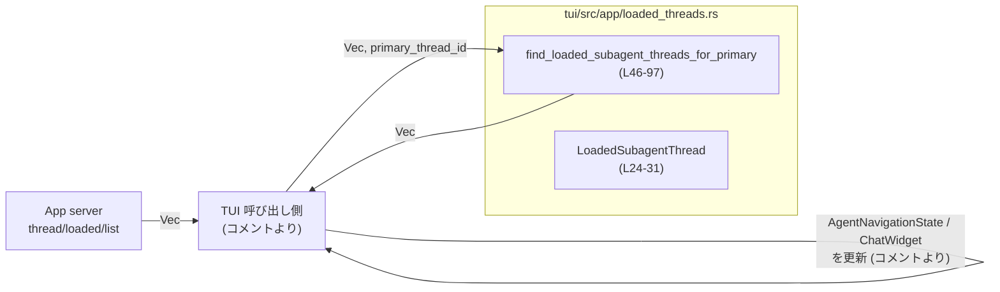
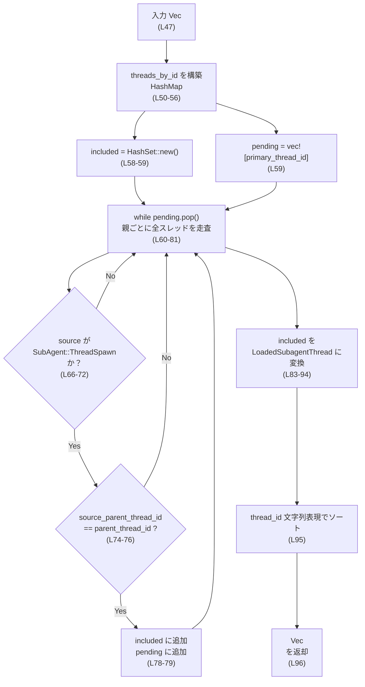
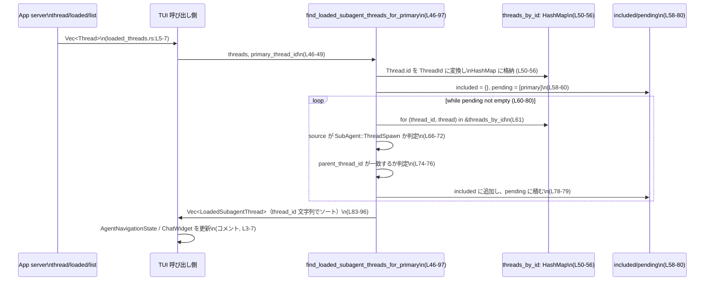

# tui/src/app/loaded_threads.rs コード解説

---

## 0. ざっくり一言

`thread/loaded/list` で取得したフラットな `Thread` 一覧から、指定した **primary thread** を根とする **SubAgent サブツリー（子孫スレッド）だけ** を抽出し、TUI ナビゲーション用の軽量な構造体 `LoadedSubagentThread` にまとめる **純粋な同期処理**を提供するモジュールです（`loaded_threads.rs:L1-15`,`L24-31`,`L46-97`）。

---

## 1. このモジュールの役割

### 1.1 概要

- TUI はサーバーから「現在ロードされているスレッド一覧」を `thread/loaded/list` 経由で受け取りますが、それは **全スレッドのフラットなリスト** です（`loaded_threads.rs:L5-7`）。
- ある primary thread に対して、「そのライフタイム中に spawn された SubAgent スレッド（子・孫…）」だけを知りたい、という問題を解決するために、このモジュールが存在します（`loaded_threads.rs:L3-7`,`L13-15`）。
- `SessionSource::SubAgent(SubAgentSource::ThreadSpawn { parent_thread_id, .. })` という **親スレッドへの参照**をたどり、primary を根とする **子孫スレッド集合**を計算します（`loaded_threads.rs:L13-15`,`L35-37`,`L66-76`）。
- 処理は **同期・純粋関数** であり、I/O や副作用がないため、単体テストしやすい設計になっています（`loaded_threads.rs:L9-11`）。

### 1.2 アーキテクチャ内での位置づけ

コメントから読み取れる全体像です：

- App server:
  - エンドポイント `thread/loaded/list` から `Vec<Thread>` を返す（`loaded_threads.rs:L5-7`）。
- TUI:
  - primary thread にフォーカスしたときに、ナビゲーションや `ChatWidget` 用に SubAgent 情報を必要とする（`loaded_threads.rs:L3-7`）。
  - 本モジュールの `find_loaded_subagent_threads_for_primary` を呼び出して、必要な SubAgent サブツリーを抽出する（`loaded_threads.rs:L33-37`,`L46-97`）。



※ `AgentNavigationState` や `ChatWidget` 自体の定義場所は、このチャンクには現れません（コメントのみ、`loaded_threads.rs:L3-7`）。

### 1.3 設計上のポイント

- **純粋関数・同期処理**
  - `find_loaded_subagent_threads_for_primary` は I/O・グローバル状態・スレッド操作を行いません（`loaded_threads.rs:L9-11`,`L46-97`）。
  - 同じ入力なら常に同じ出力になる **参照透過**な関数として設計されています。
- **ID 正規化とバリデーション**
  - `Thread.id`（文字列）を `ThreadId::from_string` でパースし、失敗したスレッドは静かにスキップします（`loaded_threads.rs:L50-55`）。
  - これにより、「不正な ID を持つスレッドを無視する」という挙動が明確になります。
- **spawn-tree 走査**
  - `SessionSource::SubAgent(SubAgentSource::ThreadSpawn { parent_thread_id, .. })` の `parent_thread_id` をたどることでツリーを構築します（`loaded_threads.rs:L35-37`,`L66-76`）。
  - `included: HashSet<ThreadId>` により、同じスレッドを二重に処理しないようにしています（`loaded_threads.rs:L58-59`,`L62-63`,`L78`）。
- **結果の決定論的順序**
  - 内部では `HashMap` 反復順序に依存する探索を行いますが（`loaded_threads.rs:L61`）、最終的に `thread_id.to_string()` でソートすることで、出力順序を決定論的にしています（`loaded_threads.rs:L83-96`）。
  - テストやスナップショット比較を安定させることが目的であり、順序は意味上の契約ではないとコメントされています（`loaded_threads.rs:L39-41`）。
- **安全性・並行性**
  - `unsafe` ブロックは一切なく、標準ライブラリの `HashMap` と `HashSet` を使った通常の計算のみです（`loaded_threads.rs:L21-22`,`L50-81`）。
  - ローカル変数のみを使うため **データ競合の可能性はなく**、複数スレッドから同時に呼び出しても問題ありません（共有可変状態が無いため）。

---

## 2. 主要な機能一覧（コンポーネントインベントリー）

このモジュールが提供する主なコンポーネントと機能です。

- `LoadedSubagentThread`: SubAgent スレッドの最小限のメタデータ構造（`loaded_threads.rs:L24-31`）。
- `find_loaded_subagent_threads_for_primary`: primary thread を根とした SubAgent サブツリーを探索し、`LoadedSubagentThread` のリストとして返す関数（`loaded_threads.rs:L33-45`,`L46-97`）。
- （テスト）`test_thread`: テスト用に `Thread` を構築するヘルパー（`loaded_threads.rs:L111-131`）。
- （テスト）`finds_loaded_subagent_tree_for_primary_thread`: 基本的な親・子・孫・無関係スレッドのケースを検証するユニットテスト（`loaded_threads.rs:L133-208`）。

---

## 3. 公開 API と詳細解説

### 3.1 型一覧（構造体・列挙体など）

| 名前 | 種別 | 役割 / 用途 | 主なフィールド | 定義位置 |
|------|------|-------------|----------------|----------|
| `LoadedSubagentThread` | 構造体 | spawn-tree 走査で見つかった SubAgent スレッドを、TUI ナビゲーション用に簡略化して保持する | `thread_id: ThreadId`, `agent_nickname: Option<String>`, `agent_role: Option<String>` | `loaded_threads.rs:L24-31` |

#### `LoadedSubagentThread` のフィールド

- `thread_id: ThreadId`  
  - SubAgent スレッドの一意な ID（`loaded_threads.rs:L27-30`）。
- `agent_nickname: Option<String>`  
  - エージェントのニックネーム（例: `"Scout"`）を保持します。存在しない場合は `None`（`loaded_threads.rs:L29`）。
- `agent_role: Option<String>`  
  - エージェントのロール（例: `"explorer"`）を保持します。存在しない場合は `None`（`loaded_threads.rs:L30`）。

`#[derive(Debug, Clone, PartialEq, Eq)]` により、デバッグ表示・クローン・等価比較が可能です（`loaded_threads.rs:L26`）。  
テストでは `assert_eq!` で期待値との比較に利用されています（`loaded_threads.rs:L193-207`）。

---

### 3.2 関数詳細

#### `find_loaded_subagent_threads_for_primary(threads: Vec<Thread>, primary_thread_id: ThreadId) -> Vec<LoadedSubagentThread>`

**概要**

- サーバーから取得したフラットな `Vec<Thread>` の中から、
  - `SessionSource::SubAgent(SubAgentSource::ThreadSpawn { parent_thread_id, .. })`
  - かつ `parent_thread_id` から辿って primary thread に連なるすべての **子孫スレッド**
- を探索し、`LoadedSubagentThread` のリストとして返します（`loaded_threads.rs:L33-37`,`L46-97`）。
- primary thread 自身は **結果に含めません**（`loaded_threads.rs:L37`,`L59-80`）。

**引数**

| 引数名 | 型 | 説明 |
|--------|----|------|
| `threads` | `Vec<Thread>` | App server から取得した、現在ロードされているスレッド一覧。`id` フィールド（文字列）を `ThreadId::from_string` でパースし、キーに使います（`loaded_threads.rs:L47`,`L50-55`）。所有権はこの関数にムーブされ、呼び出し側では再利用できません。 |
| `primary_thread_id` | `ThreadId` | 走査の起点となる primary thread の ID。`pending` の初期要素として使用されます（`loaded_threads.rs:L48`,`L59-60`）。 |

**戻り値**

- `Vec<LoadedSubagentThread>`  
  - `primary_thread_id` を根とする SubAgent サブツリーに属する **すべての子孫スレッド** を表す構造体のリスト（`loaded_threads.rs:L83-96`）。
  - `thread_id` の文字列表現でソート済み（`sort_by_key(|thread| thread.thread_id.to_string())`、`loaded_threads.rs:L95`）。
  - primary 自身は含まれません（`loaded_threads.rs:L59-80`）。

**内部処理の流れ（アルゴリズム）**

概略の流れと、対応するコード行です。

1. **`Thread.id` を `ThreadId` に変換し、マップ化**
   - 空の `HashMap<ThreadId, Thread>` を作成（`threads_by_id`、`loaded_threads.rs:L50`）。
   - `threads` を消費しながらループし、`ThreadId::from_string(&thread.id)` を試みます（`loaded_threads.rs:L51-55`）。
     - パースに失敗したスレッドは `continue` でスキップ（`loaded_threads.rs:L52-54`）。
     - 成功したものは `threads_by_id.insert(thread_id, thread)` で登録（`loaded_threads.rs:L55`）。
2. **探索用セット・スタックの初期化**
   - `included: HashSet<ThreadId>` を空で作成（すでに発見されたスレッド ID を保持、`loaded_threads.rs:L58-59`）。
   - `pending: Vec<ThreadId>` を `vec![primary_thread_id]` で初期化（次に親として調べるべきスレッド ID を保持、`loaded_threads.rs:L59`）。
3. **親 ID ごとに全スレッドをスキャン**
   - `while let Some(parent_thread_id) = pending.pop()` で、`pending` から 1 つ親候補を取り出すループ（`loaded_threads.rs:L60`）。
   - 各親について、`for (thread_id, thread) in &threads_by_id` で全スレッドを走査（`loaded_threads.rs:L61`）。
4. **すでに included のものはスキップ**
   - `if included.contains(thread_id) { continue; }` で、すでに子孫として登録済みのスレッドを飛ばします（`loaded_threads.rs:L62-64`）。
5. **SubAgent ThreadSpawn 以外は除外**
   - `let SessionSource::SubAgent(SubAgentSource::ThreadSpawn { parent_thread_id: source_parent_thread_id, .. }) = &thread.source else { continue; };`  
     というパターンマッチで、`SessionSource::SubAgent(ThreadSpawn { .. })` 以外のスレッドをスキップします（`loaded_threads.rs:L66-72`）。
6. **parent_thread_id の一致チェック**
   - `if *source_parent_thread_id != parent_thread_id { continue; }`  
     で、現在の親候補 `parent_thread_id` にぶら下がっているかを確認します（`loaded_threads.rs:L74-76`）。
7. **一致した場合は子として登録し、次の親候補にも追加**
   - `included.insert(*thread_id);` でこの子スレッド ID を「発見済み集合」に追加（`loaded_threads.rs:L78`）。
   - `pending.push(*thread_id);` で、このスレッドを次の親候補として追加（`loaded_threads.rs:L79`）。
8. **探索完了後、`LoadedSubagentThread` へ変換**
   - `included.into_iter()` で発見済み ID を列挙（`loaded_threads.rs:L83-85`）。
   - `threads_by_id.remove(&thread_id)` で元の `Thread` を取り出し（`loaded_threads.rs:L86-87`）、
     `LoadedSubagentThread { thread_id, agent_nickname: thread.agent_nickname, agent_role: thread.agent_role }` に変換（`loaded_threads.rs:L88-92`）。
   - `filter_map` を使って、`remove` が `None` を返す可能性に備えています（`loaded_threads.rs:L85-93`）。
9. **thread_id 文字列表現によるソート**
   - `loaded_threads.sort_by_key(|thread| thread.thread_id.to_string());` により、最終結果をソート（`loaded_threads.rs:L95`）。

> 注記：コメントでは「The walk is breadth-first」とありますが（`loaded_threads.rs:L35`）、`pending.pop()` により実際には **スタック的な探索順（深さ優先寄り）** になります（`loaded_threads.rs:L60-79`）。  
> ただし、最後に `thread_id` でソートするため、探索順は**結果の順序には影響しません**。

**処理フロー図（サブツリー探索）**



**Examples（使用例）**

コメントとテストコードに基づき、primary・子・孫・無関係なスレッドを含むケースの例です（`loaded_threads.rs:L133-208`）。

```rust
use tui::app::loaded_threads::{
    LoadedSubagentThread,
    find_loaded_subagent_threads_for_primary,
}; // 本モジュールの関数と型をインポートする

use codex_app_server_protocol::{Thread, SessionSource, ThreadStatus}; // サーバープロトコル側の型
use codex_protocol::ThreadId;
use codex_protocol::protocol::SubAgentSource;
use std::path::PathBuf;

// テスト用と同様の Thread コンストラクタ（loaded_threads.rs:L111-131 を参考）
fn make_thread(thread_id: ThreadId, source: SessionSource) -> Thread {
    Thread {
        id: thread_id.to_string(),          // ThreadId を文字列化して格納
        forked_from_id: None,              // ここでは未使用なので None
        preview: String::new(),
        ephemeral: false,
        model_provider: "openai".to_string(),
        created_at: 0,
        updated_at: 0,
        status: ThreadStatus::Idle,
        path: None,
        cwd: PathBuf::from("/tmp"),
        cli_version: "0.0.0".to_string(),
        source,                            // 呼び出し側から渡された SessionSource
        agent_nickname: None,
        agent_role: None,
        git_info: None,
        name: None,
        turns: Vec::new(),
    }
}

fn example() {
    // primary, child, grandchild, unrelated を用意する
    let primary = ThreadId::from_string("00000000-0000-0000-0000-000000000001")
        .expect("valid id");
    let child = ThreadId::from_string("00000000-0000-0000-0000-000000000002")
        .expect("valid id");
    let grandchild = ThreadId::from_string("00000000-0000-0000-0000-000000000003")
        .expect("valid id");
    let unrelated_parent = ThreadId::from_string("00000000-0000-0000-0000-000000000004")
        .expect("valid id");
    let unrelated_child = ThreadId::from_string("00000000-0000-0000-0000-000000000005")
        .expect("valid id");

    // primary 自体（source は Cli など SubAgent ではない）
    let primary_thread = make_thread(primary, SessionSource::Cli);

    // primary の直接の子
    let mut child_thread = make_thread(
        child,
        SessionSource::SubAgent(SubAgentSource::ThreadSpawn {
            parent_thread_id: primary,
            depth: 1,
            agent_path: None,
            agent_nickname: Some("Scout".to_string()),
            agent_role: Some("explorer".to_string()),
        }),
    );
    child_thread.agent_nickname = Some("Scout".to_string());
    child_thread.agent_role = Some("explorer".to_string());

    // child の子（= primary の孫）
    let mut grandchild_thread = make_thread(
        grandchild,
        SessionSource::SubAgent(SubAgentSource::ThreadSpawn {
            parent_thread_id: child,
            depth: 2,
            agent_path: None,
            agent_nickname: Some("Atlas".to_string()),
            agent_role: Some("worker".to_string()),
        }),
    );
    grandchild_thread.agent_nickname = Some("Atlas".to_string());
    grandchild_thread.agent_role = Some("worker".to_string());

    // 無関係な親子
    let unrelated_child_thread = make_thread(
        unrelated_child,
        SessionSource::SubAgent(SubAgentSource::ThreadSpawn {
            parent_thread_id: unrelated_parent,
            depth: 1,
            agent_path: None,
            agent_nickname: Some("Other".to_string()),
            agent_role: Some("researcher".to_string()),
        }),
    );

    // フラットな一覧を作る（primary 自身も含む）
    let threads = vec![
        primary_thread,
        child_thread,
        grandchild_thread,
        unrelated_child_thread,
    ];

    // primary を根とする SubAgent サブツリーだけが抽出される
    let loaded: Vec<LoadedSubagentThread> =
        find_loaded_subagent_threads_for_primary(threads, primary);

    // 返り値は thread_id 文字列でソート済みなので、この順になる
    assert_eq!(loaded.len(), 2);
    assert_eq!(loaded[0].agent_nickname.as_deref(), Some("Scout"));
    assert_eq!(loaded[1].agent_nickname.as_deref(), Some("Atlas"));
}
```

**Errors / Panics（エラー・パニック条件）**

- この関数自体は `Result` ではなく **常に `Vec<LoadedSubagentThread>` を返します**（`loaded_threads.rs:L46-49`,`L96`）。
- 内部では `ThreadId::from_string(&thread.id)` の失敗を `let Ok(thread_id) = ... else { continue; };` で扱い、該当スレッドを静かにスキップします（`loaded_threads.rs:L51-55`）。
  - したがって、「ID が不正なスレッドがある」という状況は **エラーとしては観測されず、単に結果から除外される** 形になります。
- パニックを引き起こすような `unwrap` / `expect` は本関数内にはありません（テストコードには存在、`loaded_threads.rs:L135-144`）。
- ループ条件や `HashMap`/`HashSet` 操作も、標準ライブラリの safe API だけを使用しており、通常の入力範囲ではパニックしません（`loaded_threads.rs:L50-81`,`L83-96`）。

**Edge cases（エッジケース）**

コードから読み取れる代表的なエッジケースと挙動です。

- **`threads` が空**
  - `threads_by_id` は空のまま（`loaded_threads.rs:L50-56`）。
  - `pending` は `[primary_thread_id]` ですが、内部の `for (thread_id, thread) in &threads_by_id` が空なので `included` は最後まで空（`loaded_threads.rs:L60-81`）。
  - 結果は空の `Vec<LoadedSubagentThread>` です（`loaded_threads.rs:L83-96`）。
- **primary thread が `threads` に含まれない**
  - それでも `pending` に `primary_thread_id` は入るため探索は行われますが、親として一致するスレッドが見つからないため `included` は空のままです（`loaded_threads.rs:L59-81`）。
  - 結果は空ベクタです。
- **`Thread.id` が不正なスレッド**
  - `ThreadId::from_string` が `Err` を返し、そのスレッドは `threads_by_id` に登録されません（`loaded_threads.rs:L51-55`）。
  - そのスレッドは探索対象外となり、結果に登場しません。
- **同じ `ThreadId` を持つ複数の `Thread` が渡された場合**
  - `HashMap::insert` により最後に挿入された `Thread` が有効になります（`loaded_threads.rs:L50-55`）。
  - earlier なエントリは上書きされます。
- **サイクルが存在する場合（サーバーの前提が破られた場合）**
  - コメントでは「サイクルは存在しない」と明記されていますが（`loaded_threads.rs:L43-45`）、
  - 実装上は `included` が再訪問を防止するため、サイクルがあっても無限ループにはなりません（`loaded_threads.rs:L58-59`,`L62-64`,`L78`）。

**使用上の注意点（Rust 言語固有の観点を含む）**

- **所有権（Ownership）**
  - `threads: Vec<Thread>` は **ムーブ** され、関数内部で消費されます（`loaded_threads.rs:L47`,`L51`）。
    - 呼び出し後に同じ `threads` を再利用したい場合は、事前に `threads.clone()` するか、別の構造に分ける必要があります。
- **スレッド安全性**
  - ローカル変数 (`threads_by_id`, `included`, `pending`) のみを操作し、共有可変状態はありません（`loaded_threads.rs:L50-81`）。
  - `unsafe` を使用しない純粋な計算であるため、**どのスレッドから呼んでもデータ競合を起こしません**。
- **結果順序への依存禁止**
  - コメントにある通り、「結果の順序はテストとナビゲーションキャッシュの安定性のため」であり、意味的な契約ではありません（`loaded_threads.rs:L39-41`）。
  - ロジック上の意味で「子が常に親より先に来る」といった前提を置いてはいけません。
- **計算量**
  - 各親ごとに `threads_by_id` 全体を走査するため、スレッド数 `N`、子孫数 `K` の場合、おおよそ `O(N * K)` の複雑さになります（`loaded_threads.rs:L60-81`）。
  - 通常の GUI 用 TUI では `N` はそれほど大きくない想定ですが、極端に巨大なスレッド数に対しては負荷が増える可能性があります。

---

### 3.3 その他の関数（テスト用）

| 関数名 | 役割（1 行） | 定義位置 |
|--------|--------------|----------|
| `test_thread(thread_id: ThreadId, source: SessionSource) -> Thread` | テスト用に、必要なフィールドだけ埋めた `Thread` インスタンスを構築するヘルパー関数です。`Thread` 構造体のフィールド構造の例にもなります。 | `loaded_threads.rs:L111-131` |
| `finds_loaded_subagent_tree_for_primary_thread()` | primary / child / grandchild / unrelated からなる最小構成のツリーを用いて、探索結果と `LoadedSubagentThread` の内容を検証するユニットテストです。 | `loaded_threads.rs:L133-208` |

---

## 4. データフロー

ここでは、呼び出し側から見た典型的なデータの流れと、関数内部の主要ステップを示します。

1. App server が `thread/loaded/list` で `Vec<Thread>` を返す（コメントより、`loaded_threads.rs:L5-7`）。
2. TUI が画面復帰やスレッド切り替えのタイミングで、この `Vec<Thread>` と `primary_thread_id` を `find_loaded_subagent_threads_for_primary` に渡す（`loaded_threads.rs:L3-7`,`L33-37`）。
3. 関数内部で `threads_by_id: HashMap<ThreadId, Thread>` に変換し、spawn-tree を探索（`loaded_threads.rs:L50-81`）。
4. 見つかった子孫スレッドを `LoadedSubagentThread` に変換して返す（`loaded_threads.rs:L83-96`）。
5. 呼び出し側が結果を `AgentNavigationState` や `ChatWidget` に登録する（コメントより、`loaded_threads.rs:L3-7`）。



---

## 5. 使い方（How to Use）

### 5.1 基本的な使用方法

TUI 側で、サーバーから取得した `Vec<Thread>` と primary thread の ID を使って、SubAgent サブツリーをナビゲーション状態に反映する典型的な流れです。

```rust
use tui::app::loaded_threads::{
    LoadedSubagentThread,
    find_loaded_subagent_threads_for_primary,
}; // 本モジュールの関数と型をインポートする

use codex_app_server_protocol::Thread;        // サーバープロトコルから Thread 型をインポート
use codex_protocol::ThreadId;                 // ThreadId 型をインポート

fn build_navigation(threads: Vec<Thread>, primary_thread_id: ThreadId) {
    // primary_thread_id を根とする SubAgent サブツリーだけを抽出する
    let subagents: Vec<LoadedSubagentThread> =
        find_loaded_subagent_threads_for_primary(threads, primary_thread_id);

    // ここで subagents を AgentNavigationState や ChatWidget に登録するなど、
    // UI 側の状態更新を行う
    for sub in subagents {
        println!(
            "SubAgent {:?}: nickname={:?}, role={:?}",
            sub.thread_id,
            sub.agent_nickname,
            sub.agent_role,
        );
    }
}
```

ポイント：

- `threads` は関数にムーブされるため、この関数の中で消費され、呼び出し元には戻りません（`loaded_threads.rs:L47`,`L51`）。
- 戻り値の順序は `thread_id` の文字列表現でソートされていますが（`loaded_threads.rs:L95`）、意味的な順序ではないので、インデックスにセマンティクスを持たせないようにします。

### 5.2 よくある使用パターン

1. **スレッド切り替え時に毎回計算するパターン**

   - `thread/loaded/list` の結果と、新しい primary thread ID を受け取ったタイミングで都度呼び出す。
   - メリット：実装が単純で、状態をキャッシュしなくてもよい。
   - デメリット：スレッド数が多い場合、毎回探索コストがかかる。

2. **`thread/loaded/list` のキャッシュと組み合わせるパターン**

   - 別の場所で `Vec<Thread>` をキャッシュし、primary thread の変更ごとに `threads.clone()` を渡す。
   - `clone` はコストがかかりますが、サーバー呼び出しを減らすことができます。
   - Rust の所有権モデル上、この関数は `Vec<Thread>` を消費するため、このような設計になる可能性があります。

### 5.3 よくある間違い

**例 1: `threads` を再利用しようとしてコンパイルエラーになる**

```rust
let threads: Vec<Thread> = fetch_loaded_threads(); // サーバーから取得したとする

let subagents =
    find_loaded_subagent_threads_for_primary(threads, primary_thread_id);

// これはコンパイルエラーになる:
// threads は上でムーブされており、ここでは所有権を失っている
// println!("thread count = {}", threads.len());
```

**正しい例（クローンする場合）**

```rust
let threads: Vec<Thread> = fetch_loaded_threads(); // サーバーから取得したとする

// threads を別用途にも使いたいので clone して渡す
let subagents =
    find_loaded_subagent_threads_for_primary(threads.clone(), primary_thread_id);

// ここで元の threads を再利用できる
println!("thread count = {}", threads.len());
```

> 注意: `clone` はスレッド数や `Thread` の大きさに応じたコストがかかります。必要に応じて別の API（例えば `&[Thread]` を受け取る関数）を検討することもありえますが、このチャンクではそのような関数は定義されていません。

**例 2: `SessionSource` が SubAgent でないスレッドを期待してしまう**

- `SessionSource::Cli` や、その他 `SubAgent(ThreadSpawn)` 以外の `source` を持つスレッドは、この関数では **一切探索対象になりません**（`loaded_threads.rs:L66-72`）。
- primary thread 自身も通常 `SessionSource::Cli` であるため、結果には含まれません。

### 5.4 使用上の注意点（まとめ）

- `threads` はこの関数にムーブされるため、呼び出し後に同じベクタを使いたい場合は事前にクローンするなどの対策が必要です（`loaded_threads.rs:L47`,`L51`）。
- `Thread.id` が `ThreadId::from_string` でパースできないスレッドは静かに無視されます。入力データの整合性を監視したい場合は、別レイヤーで検証する必要があります（`loaded_threads.rs:L51-55`）。
- `SessionSource::SubAgent(SubAgentSource::ThreadSpawn { .. })` 以外のスレッドは無条件に探索対象外となります（`loaded_threads.rs:L66-72`）。
- 結果順は `thread_id` の文字列表現でソートされており、意味上の順序ではありません（`loaded_threads.rs:L39-41`,`L95`）。
- 処理は同期・CPU バウンドであり、I/O を伴わないため、UI スレッド上で直接呼び出してもブロッキング I/O の心配はありません（`loaded_threads.rs:L9-11`,`L46-97`）。

---

## 6. 変更の仕方（How to Modify）

### 6.1 新しい機能を追加する場合

1. **LoadedSubagentThread にフィールドを追加したい場合**

   - 例: `depth`（root からの深さ）を持たせたいなど。
   - 手順:
     1. `LoadedSubagentThread` にフィールドを追加（`loaded_threads.rs:L27-30`）。
     2. 探索ループ内では `Thread` 自体の情報しか見ていないため、必要なら `Thread` 側に深さ情報があるか、または `pending` に `(thread_id, depth)` のようなタプルを積むようにロジックを拡張します（`loaded_threads.rs:L59-80`）。
     3. `filter_map` 内で新フィールドを埋める（`loaded_threads.rs:L85-93`）。
     4. テスト `finds_loaded_subagent_tree_for_primary_thread` を更新し、新しいフィールドも比較対象に含めます（`loaded_threads.rs:L133-208`）。

2. **フィルタ条件を追加したい場合（例: 特定の role のみ）**

   - `SessionSource::SubAgent` のパターンマッチの直後、`agent_role` 等で条件分岐を追加するのが自然です（`loaded_threads.rs:L66-72`）。
   - ただし、`agent_role` は `Thread` -> `LoadedSubagentThread` の変換時にのみ触っているため、フィルタ条件として利用するには、探索ループ内で `thread.agent_role` を参照する必要があります（`loaded_threads.rs:L88-92`）。

3. **複数の primary を同時に扱いたい場合**

   - 現在は `primary_thread_id` ひとつに対するサブツリーしか扱いません（`loaded_threads.rs:L48`）。
   - 複数 root に対応するには:
     - `pending` の初期値を複数 ID で初期化する。
     - または、関数をラップする呼び出し側で primary ごとにこの関数を呼び出す。

### 6.2 既存の機能を変更する場合の注意点

- **契約（前提・保証）の確認**

  - primary thread 自身を結果に含めない、という契約がコメントに明記されています（`loaded_threads.rs:L37`）。
  - `SessionSource::SubAgent(ThreadSpawn)` のみを子孫判定に使う、という契約もコメントと実装で一致しています（`loaded_threads.rs:L35-37`,`L66-72`）。
  - 結果順序はテスト安定性のために `thread_id` でソートする、という仕様があります（`loaded_threads.rs:L39-41`,`L95`）。

- **影響範囲の確認**

  - `pub(crate)` な関数と構造体であるため、同一クレート内の他モジュールから参照されている可能性があります（`loaded_threads.rs:L27`,`L46`）。
  - 変更前には `ripgrep` などで `LoadedSubagentThread` と `find_loaded_subagent_threads_for_primary` の使用箇所を検索し、期待されている挙動と整合するように変更する必要があります。

- **テストの更新**

  - 既存テスト `finds_loaded_subagent_tree_for_primary_thread` は、最小限の spawn-tree が正しく探索されることと、`LoadedSubagentThread` のフィールドがコピーされていることを検証しています（`loaded_threads.rs:L133-208`）。
  - フィルタ条件や構造体フィールドを変える場合、このテストを必ず更新し、**期待仕様を明示**した上で緑に戻すことが重要です。

- **パフォーマンス上の注意**

  - 探索アルゴリズムは、親ごとに `threads_by_id` を全スキャンする構造になっています（`loaded_threads.rs:L60-81`）。
  - 大域的なパフォーマンス最適化（例: 「親 ID -> 子リスト」の `HashMap` を事前構築するなど）を行う場合は、探索ロジック全体の見直しが必要となります。

---

## 7. 関連ファイル・型

このモジュールと密接に関係する外部型・コンポーネントです（このチャンクに現れる範囲のみ）。

| パス / 型 | 役割 / 関係 |
|-----------|------------|
| `codex_app_server_protocol::Thread` | サーバー側のスレッドメタデータを表す構造体。`thread/loaded/list` のレスポンス要素と推測されます（`loaded_threads.rs:L18`,`L111-131`）。本モジュールでは入力として受け取り、最終的に `LoadedSubagentThread` に変換します。 |
| `codex_app_server_protocol::SessionSource` | スレッドがどのように開始されたかを表す列挙体。`Cli` や `SubAgent(SubAgentSource::ThreadSpawn { .. })` などを取り得ます（`loaded_threads.rs:L17`,`L35-37`,`L66-72`,`L103-104`）。 |
| `codex_protocol::ThreadId` | 型付きのスレッド ID。`Thread.id` の文字列表現から `ThreadId::from_string` でパースされ、`HashMap`/`HashSet` のキーとして利用されます（`loaded_threads.rs:L19`,`L50-55`）。 |
| `codex_protocol::protocol::SubAgentSource` | SubAgent セッションの起源（`ThreadSpawn` など）を表す列挙体。`SessionSource::SubAgent(SubAgentSource::ThreadSpawn { parent_thread_id, .. })` から `parent_thread_id` を取り出すために使用されます（`loaded_threads.rs:L20`,`L35-37`,`L66-72`,`L107`,`L148-154`）。 |
| `AgentNavigationState` / `ChatWidget`（パス不明） | コメント中で言及される、TUI 側のナビゲーション状態とチャット UI コンポーネントです。`LoadedSubagentThread` はこれらに登録するための最小限の情報を運ぶと説明されています（`loaded_threads.rs:L3-7`,`L24-25`）。 |

---

以上が、`tui/src/app/loaded_threads.rs` に含まれる公開 API とコアロジック、およびそれに関わる安全性・エッジケース・データフローの整理です。
