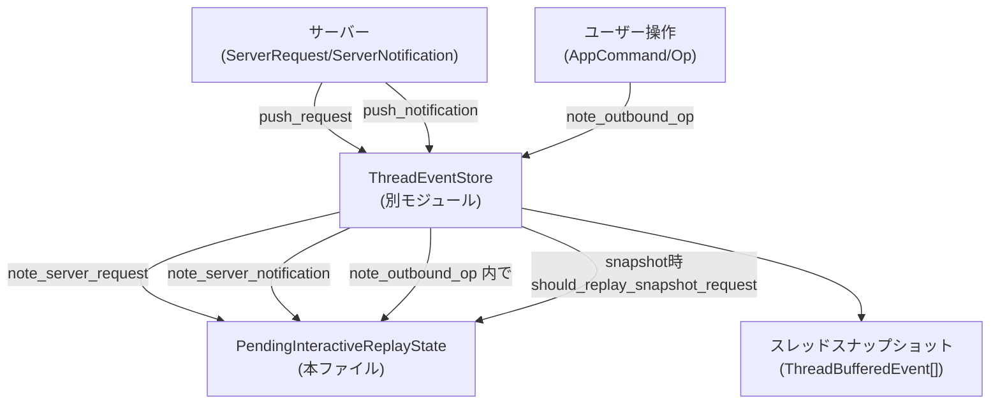
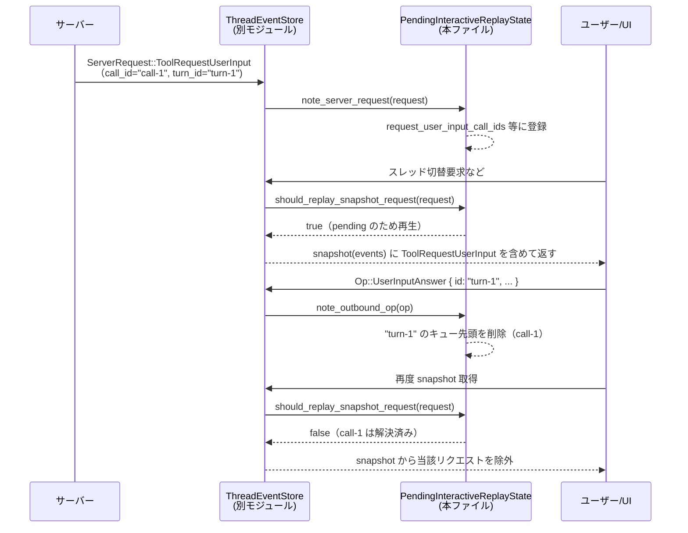

# tui/src/app/pending_interactive_replay.rs

※このチャンクには行番号情報が含まれていないため、根拠欄では形式に合わせて `pending_interactive_replay.rs:L??-??` と記載します（位置は概略であり、正確な行番号ではありません）。

---

## 0. ざっくり一言

スレッドのイベントバッファをスナップショット再生するときに、  
「まだ未解決の対話的プロンプト（承認・ユーザー入力・MCPエリシテーション等）だけを再生し、すでに解決済みのものは再生しない」ための状態管理ロジックです。  
`ThreadEventStore` から呼ばれ、受信リクエスト・送信コマンド・サーバ通知・バッファ追い出しに応じて状態を更新します。

---

## 1. このモジュールの役割

### 1.1 概要

- スレッドの履歴（ThreadEventStore 内のイベントバッファ）を元に UI を再構築する際、サーバーから来た「対話的な要求」（承認要求・ユーザー入力要求・MCP エリシテーション・権限要求など）がまだ未処理かどうかを判定するための状態を保持します。  
- 未処理のプロンプトだけを snapshot に残し、すでに回答・承認済みのものは snapshot から除外することで、スレッド切り替え時に古いプロンプトが再表示されるのを防ぎます。  
- 状態は以下から更新されます（コメントにも明記）:
  - inbound: `ServerRequest`（サーバーからのリクエスト）
  - outbound: `AppCommand` / `Op`（ユーザー操作による応答）
  - `ServerNotification`（ターン完了・リクエスト解決・スレッドクローズ等）
  - イベントバッファからの追い出し

### 1.2 アーキテクチャ内での位置づけ

このモジュールは、上位の `ThreadEventStore` から利用される内部状態として機能しています。

- `ThreadEventStore`（別モジュール）:
  - スレッドごとの `ServerRequest` / `ServerNotification` / `Op` をバッファリングし、snapshot を返すコンポーネント（テストから推測）。
- `PendingInteractiveReplayState`（本ファイル）:
  - 「どの `ServerRequest` がまだ対話的に pending か」を追跡。
  - `ThreadEventStore::snapshot()` がイベントをフィルタリングする際に `should_replay_snapshot_request` を参照していると考えられます（テストがその挙動を検証）。

概念的な依存関係は次のようになります。



（根拠：`tests` で `ThreadEventStore::push_request / push_notification / note_outbound_op / snapshot` が呼ばれ、その結果が本状態に依存していることが確認できます  
`pending_interactive_replay.rs:L??-??`）

### 1.3 設計上のポイント

- **種類ごとの独立トラッキング**  
  コマンド実行承認・ファイル変更承認・MCP エリシテーション・権限承認・ユーザー入力要求を、それぞれ別のセット/マップで管理しています。  
  （フィールド群と `PendingInteractiveRequest` の列挙子から明らか  
  `pending_interactive_replay.rs:L??-??`）

- **2 系統のインデックス**  
  - call_id / request_key ベースの `HashSet`  
  - turn_id ごとの `HashMap<String, Vec<String>>`  
  によって、  
  - スナップショットのフィルタリング（高速な存在チェック）  
  - ターン完了 (`TurnCompleted`) 時の一括削除  
  の両方を効率的に行います。

- **サーバーリクエスト ID との対応付け**  
  `pending_requests_by_request_id: HashMap<AppServerRequestId, PendingInteractiveRequest>` によって、`ServerRequestResolved` 通知やバッファ追い出し時に「どの pending を消すべきか」を逆引きできるようにしています。

- **Rust の所有権/安全性**  
  - すべてのメソッドが `&mut self` を取り、内部状態への同時書き込みはコンパイル時に禁止されます。
  - `unsafe` コードは存在せず、`HashMap` / `HashSet` の操作も `get_mut`, `retain`, `remove` などパニックしない API のみを使っています。
  - 並行性制御（`Mutex` 等）はこの型では行っておらず、呼び出し側で単一スレッド/排他アクセスが前提です（コードから推測）。

---

## 2. 主要な機能一覧（コンポーネントインベントリー）

### 2.1 型（構造体・列挙体）

| 名前 | 種別 | 役割 / 用途 | 根拠 |
|------|------|------------|------|
| `ElicitationRequestKey` | 構造体 | MCP エリシテーションを一意に識別するためのキー（`server_name`+`mcp::RequestId`）。`HashSet` のキーとして利用。 | `pending_interactive_replay.rs:L??-??` |
| `PendingInteractiveReplayState` | 構造体 | すべての「pending な対話的プロンプト」を保持・更新し、snapshot 再生可否を判定するコア状態。 | `pending_interactive_replay.rs:L??-??` |
| `PendingInteractiveRequest` | 列挙体 | 各 `AppServerRequestId` ごとの pending 種類と詳細（turn_id, call_id など）を表現。`pending_requests_by_request_id` の値として使用。 | `pending_interactive_replay.rs:L??-??` |

### 2.2 メソッド・関数（本体部分）

主に `PendingInteractiveReplayState` のメソッドが公開（`pub(super)`）API です。

| 種別 | 名前 | 役割（1 行） | 根拠 |
|------|------|--------------|------|
| 関数 | `ElicitationRequestKey::new` | `server_name` と `mcp::RequestId` からキーを構築。 | `pending_interactive_replay.rs:L??-??` |
| メソッド | `PendingInteractiveReplayState::op_can_change_state` | 与えられた `AppCommand` が pending 状態を変え得るかどうかを判定。 | `pending_interactive_replay.rs:L??-??` |
| メソッド | `PendingInteractiveReplayState::note_outbound_op` | ユーザー側の応答 (`AppCommand`) を受けて pending 状態を更新し、解決済みプロンプトを消去。 | `pending_interactive_replay.rs:L??-??` |
| メソッド | `PendingInteractiveReplayState::note_server_request` | `ServerRequest` を受けて新しい pending プロンプトを登録。 | `pending_interactive_replay.rs:L??-??` |
| メソッド | `PendingInteractiveReplayState::note_server_notification` | `ServerNotification`（ターン完了・リクエスト解決・スレッドクローズ等）によって pending を一括更新。 | `pending_interactive_replay.rs:L??-??` |
| メソッド | `PendingInteractiveReplayState::note_evicted_server_request` | バッファから追い出された `ServerRequest` に対応する pending 状態を削除。 | `pending_interactive_replay.rs:L??-??` |
| メソッド | `PendingInteractiveReplayState::should_replay_snapshot_request` | snapshot 再生時に、該当 `ServerRequest` を再生すべきかどうかを判定。 | `pending_interactive_replay.rs:L??-??` |
| メソッド | `PendingInteractiveReplayState::has_pending_thread_approvals` | スレッドに未処理の「承認系」プロンプトが残っているかを報告。 | `pending_interactive_replay.rs:L??-??` |
| メソッド | `clear_*_turn` 群 | ターン ID を指定して、そのターンに紐づく pending を一括削除。 | `pending_interactive_replay.rs:L??-??` |
| メソッド | `remove_call_id_from_turn_map(_entry)` | `turn_id -> Vec<call_id>` マップから特定 call_id を削除し、不要になったエントリを除去。 | `pending_interactive_replay.rs:L??-??` |
| メソッド | `clear` | すべての pending 状態をクリア。 | `pending_interactive_replay.rs:L??-??` |
| メソッド | `remove_request` | `request_id` から `PendingInteractiveRequest` を逆引きし、関連するすべての状態を削除。 | `pending_interactive_replay.rs:L??-??` |
| 関数 | `request_matches_server_request` | `PendingInteractiveRequest` と `ServerRequest` が同一プロンプトを指すかを判定。 | `pending_interactive_replay.rs:L??-??` |
| 関数 | `app_server_request_id_to_mcp_request_id` | App サーバー側 RequestId と MCP RequestId を相互変換。 | `pending_interactive_replay.rs:L??-??` |

テストモジュール内には、上記ロジックを検証するための補助関数と `#[test]` 関数が多数定義されていますが、ここでは概略だけ後述の「テスト」節で扱います。

---

## 3. 公開 API と詳細解説

### 3.1 型一覧（詳細）

| 名前 | 種別 | フィールド / 内容 | 役割 / 用途 |
|------|------|------------------|-------------|
| `ElicitationRequestKey` | 構造体 | `server_name: String`, `request_id: codex_protocol::mcp::RequestId` | MCP サーバー名＋MCP RequestId で 1 つのエリシテーション要求を一意に同定するためのキー。`Hash`, `Eq` を実装しており `HashSet` での管理に使われています。 |
| `PendingInteractiveReplayState` | 構造体 | 各種 `HashSet<String>`・`HashMap<String, Vec<String>>`・`HashSet<ElicitationRequestKey>`・`HashMap<AppServerRequestId, PendingInteractiveRequest>` | 各種対話的プロンプトの pending 状態を保持し、入出力イベントに応じて更新する中心的な状態オブジェクト。 |
| `PendingInteractiveRequest` | 列挙体 | `ExecApproval{ turn_id, approval_id }`, `PatchApproval{ turn_id, item_id }`, `Elicitation(ElicitationRequestKey)`, `RequestPermissions{ turn_id, item_id }`, `RequestUserInput{ turn_id, item_id }` | 各 pending に紐づく「解決に必要な情報」をまとめた内部表現。`pending_requests_by_request_id` の値として `ServerRequestResolved`・追い出し時の処理で使用。 |

---

### 3.2 重要な関数詳細（7件）

#### 1. `PendingInteractiveReplayState::op_can_change_state<T>(op: T) -> bool`

**概要**

与えられた `AppCommand`（またはそれに変換可能な型）が、この pending 状態を変化させ得るコマンドかどうかを判定します。  
対象は、承認・回答・シャットダウンなど、対話プロンプトを解決しうるコマンドです。

**シグネチャ**

```rust
pub(super) fn op_can_change_state<T>(op: T) -> bool
where
    T: Into<AppCommand>,
```

**引数**

| 引数名 | 型 | 説明 |
|--------|----|------|
| `op` | `T: Into<AppCommand>` | `AppCommand` またはそれに変換可能な型（テストでは `&Op` が渡されると推測されます）。 |

**戻り値**

- `bool`  
  - `true`: このコマンドは pending 状態を変更し得る（ExecApproval, PatchApproval, ResolveElicitation, RequestPermissionsResponse, UserInputAnswer, Shutdown）。  
  - `false`: 状態に影響しないコマンド。

**内部処理の流れ**

1. `T` を `AppCommand` に変換。
2. `op.view()` で `AppCommandView` を取得。
3. `matches!` マクロで特定のバリアントかどうかをパターンマッチ。
4. 対象バリアントなら `true`、そうでなければ `false` を返却。

**Examples（使用例）**

```rust
// AppCommand または Op が状態を変え得るか事前にチェックする例
fn handle_user_op(state: &mut PendingInteractiveReplayState, op: codex_protocol::protocol::Op) {
    // Op から AppCommand への変換は別モジュールで実装されている前提
    if PendingInteractiveReplayState::op_can_change_state(&op) {
        // 状態に影響がある場合だけ詳細処理を行う
        state.note_outbound_op(&op);
    }
}
```

**Errors / Panics**

- 明示的なエラー型は返しません。
- `op.view()` の呼び出しやパターンマッチはパニックしません（通常の enum マッチ）。

**Edge cases（エッジケース）**

- 新しい `AppCommandView` バリアントが追加され、ここに列挙されていない場合、そのコマンドは `false` 判定となり、状態を変更しない扱いになります。  
  新しい対話的コマンドを追加した場合は、この関数の更新が必要です。

**使用上の注意点**

- このメソッドは純粋関数であり、副作用はありません。  
- `note_outbound_op` を必ず呼ぶ前提で設計されているので、「`true` かどうか」に関わらず実際の状態更新は `note_outbound_op` 側で行われます。

---

#### 2. `PendingInteractiveReplayState::note_outbound_op<T>(&mut self, op: T)`

**概要**

ユーザー側から送信されるコマンド（承認・回答など）を受け取り、それに対応する pending プロンプトを解決済みとして状態から削除します。  
`Shutdown` コマンドの場合は全 pending をクリアします。

**シグネチャ**

```rust
pub(super) fn note_outbound_op<T>(&mut self, op: T)
where
    T: Into<AppCommand>,
```

**引数**

| 引数名 | 型 | 説明 |
|--------|----|------|
| `op` | `T: Into<AppCommand>` | 送信されたコマンド（承認・解決・回答・Shutdown 等）。 |

**戻り値**

- なし（`()`）。  
  状態 (`self`) を破壊的に更新します。

**内部処理の流れ（簡略）**

1. `op` を `AppCommand` に変換し、`view()` で `AppCommandView` を取得。
2. `match` でバリアントごとに処理:
   - **ExecApproval**:  
     - `exec_approval_call_ids` から `id` を削除。  
     - `turn_id` がある場合、`exec_approval_call_ids_by_turn_id` の該当ターンから `id` を削除。  
     - `pending_requests_by_request_id` から `approval_id == id` な要素をすべて削除。
   - **PatchApproval**:  
     - パッチ承認用セット/マップから `id` を削除。
   - **ResolveElicitation**:  
     - `ElicitationRequestKey(server_name, request_id)` に対応するキーを `elicitation_requests` から削除。  
     - `PendingInteractiveRequest::Elicitation` で同じキーを持つ要素を `pending_requests_by_request_id` から削除。
   - **RequestPermissionsResponse**:  
     - `request_permissions_call_ids` と対応マップから `id` を削除し、`PendingInteractiveRequest::RequestPermissions` を削除。
   - **UserInputAnswer**:  
     - `id` はターン ID として扱う。  
     - `request_user_input_call_ids_by_turn_id[id]` のキューから最古の call_id を `remove(0)` で取り出し、対応する `request_user_input_call_ids` および `PendingInteractiveRequest::RequestUserInput` を削除（FIFO）。  
     - キューが空になったらそのターンエントリ自体も削除。
   - **Shutdown**:  
     - `clear()` を呼び出し、すべての pending 状態を削除。
   - その他: 何もしない。

**Examples（使用例）**

テストに近い形の例です（実際には `ThreadEventStore` がこの呼び出しをラップしています）。

```rust
// ExecApproval の応答を処理する例
fn on_exec_approval_approved(
    state: &mut PendingInteractiveReplayState,
    approval_id: String,
    turn_id: String,
) {
    // codex_protocol::protocol::Op::ExecApproval だと仮定
    let op = codex_protocol::protocol::Op::ExecApproval {
        id: approval_id,                 // 承認IDまたは item_id
        turn_id: Some(turn_id),          // 関連するターンID
        decision: ReviewDecision::Approved,
    };

    // 状態を更新し、該当の pending 承認を消去
    state.note_outbound_op(&op);
}
```

**Errors / Panics**

- 自前の `Result` は返さず、失敗パスはありません。
- `HashMap::get_mut` と `retain`、`HashSet::remove` の組み合わせのみで、キーが存在しなくてもパニックしません。
- `Vec::remove(0)` は、要素が存在する場合のみ実行されるように `if !call_ids.is_empty()` でガードされています。

**Edge cases**

- 同じ `id` に対応する複数の pending（例えば同じ `approval_id` を持つ複数リクエスト）があった場合、`retain` によりすべて削除されます。
- `UserInputAnswer` はターン単位でキューを持っているため、1 回の回答で 1 つのプロンプトだけが消えます。  
  複数プロンプトのあるターンに対して連続して回答する場合、回答回数に応じて FIFO で消えていきます（テストで確認）。

**使用上の注意点**

- `op.view()` の `id` / `turn_id` は、`note_server_request` で登録した値と整合している必要があります。不整合な ID を渡すと、対応する pending が見つからず状態が更新されません。
- 複数スレッドから同じ `PendingInteractiveReplayState` を扱うことは想定されておらず、`&mut self` によりコンパイル時に排他が保証されています。

---

#### 3. `PendingInteractiveReplayState::note_server_request(&mut self, request: &ServerRequest)`

**概要**

サーバーから受信した `ServerRequest` が対話的なプロンプトの場合、それを pending として登録します。  
非対話的なリクエストは状態に影響しません。

**シグネチャ**

```rust
pub(super) fn note_server_request(&mut self, request: &ServerRequest)
```

**引数**

| 引数名 | 型 | 説明 |
|--------|----|------|
| `request` | `&ServerRequest` | サーバーから届いたリクエスト。 |

**戻り値**

- なし。内部状態を更新するだけです。

**内部処理の流れ（主要分岐）**

1. `match request` でバリアント別に処理:
   - **CommandExecutionRequestApproval**:
     - `approval_id = params.approval_id.unwrap_or(params.item_id.clone())` を計算。
     - `exec_approval_call_ids` に `approval_id` を追加。
     - `exec_approval_call_ids_by_turn_id[turn_id]` の末尾に `approval_id` を push。
     - `pending_requests_by_request_id[request_id]` に `PendingInteractiveRequest::ExecApproval` を登録。
   - **FileChangeRequestApproval**:
     - `params.item_id` を patch 承認用セット/マップに登録。
     - `pending_requests_by_request_id` に `PatchApproval` を登録。
   - **McpServerElicitationRequest**:
     - `app_server_request_id_to_mcp_request_id(request_id)` で MCP RequestId に変換し、`ElicitationRequestKey` を生成。
     - `elicitation_requests` セットに登録。
     - `pending_requests_by_request_id` に `Elicitation(key)` を登録。
   - **ToolRequestUserInput**:
     - `params.item_id` を `request_user_input_call_ids` と `request_user_input_call_ids_by_turn_id`（キュー）に登録。
     - `pending_requests_by_request_id` に `RequestUserInput` を登録。
   - **PermissionsRequestApproval**:
     - `params.item_id` を権限承認用セット/マップに登録。
     - `pending_requests_by_request_id` に `RequestPermissions` を登録。
   - その他のバリアント: 何もしない。

**Examples（使用例）**

```rust
// ThreadEventStore 内部のイメージコード
fn push_request(
    state: &mut PendingInteractiveReplayState,
    buffered_events: &mut Vec<ThreadBufferedEvent>,
    request: ServerRequest,
) {
    // バッファにイベントとして追加
    buffered_events.push(ThreadBufferedEvent::Request(request.clone())); // Clone される前提

    // 対話的なものなら pending 状態に登録
    state.note_server_request(&request);
}
```

**Errors / Panics**

- 不正な入力に対してパニックする箇所はありません。
- `HashMap::entry(...).or_default()` は常に有効な `Vec` を返し、パニックしません。

**Edge cases**

- `approval_id` が `None` の ExecApproval は `item_id` で一意に管理されます。後続の `note_outbound_op` でも同じ ID を使う必要があります（テストで確認済み）。
- `ToolRequestUserInput` は turn ごとのキューに push されるため、ターン内で複数プロンプトを受信した場合は FIFO の順序が保持されます。

**使用上の注意点**

- `request_id` をキーにした `pending_requests_by_request_id` が、`ServerRequestResolved` / 追い出し処理で使われるため、同じ `request_id` で複数の `ServerRequest` を投入しない前提になっています（そのような挙動は通常の RPC プロトコルでは起こらない想定）。

---

#### 4. `PendingInteractiveReplayState::note_server_notification(&mut self, notification: &ServerNotification)`

**概要**

サーバーからの通知（スレッド内のアイテム開始・ターン完了・リクエスト解決・スレッドクローズ等）によって pending 状態を一括更新します。

**シグネチャ**

```rust
pub(super) fn note_server_notification(&mut self, notification: &ServerNotification)
```

**引数**

| 引数名 | 型 | 説明 |
|--------|----|------|
| `notification` | `&ServerNotification` | サーバー通知オブジェクト。 |

**戻り値**

- なし。内部状態のみ更新します。

**内部処理の流れ**

1. `match notification`:
   - **ItemStarted(notification)**:
     - `notification.item` が `ThreadItem::CommandExecution { id, .. }` の場合:
       - `exec_approval_call_ids` から `id` を削除し、`exec_approval_call_ids_by_turn_id` からも `id` を削除。
     - `notification.item` が `ThreadItem::FileChange { id, .. }` の場合:
       - 同様に patch 承認のセット/マップから `id` を削除。
   - **TurnCompleted(notification)**:
     - `notification.turn.id` を使って
       - `clear_exec_approval_turn`
       - `clear_patch_approval_turn`
       - `clear_request_permissions_turn`
       - `clear_request_user_input_turn`
       を順に呼び、該当ターンの pending を一括削除。
   - **ServerRequestResolved(notification)**:
     - `remove_request(&notification.request_id)` を呼び出し、`pending_requests_by_request_id` から該当要素を取り出しつつ、種別に応じて各セット/マップの整合性をとる。
   - **ThreadClosed(_)**:
     - `clear()` を呼び出し、すべての pending 状態をクリア。
   - その他: 何もしない。

**Examples（使用例）**

```rust
fn push_notification(
    state: &mut PendingInteractiveReplayState,
    buffered_events: &mut Vec<ThreadBufferedEvent>,
    notification: ServerNotification,
) {
    buffered_events.push(ThreadBufferedEvent::Notification(notification.clone()));

    // ターン完了やリクエスト解決などに応じて pending 状態を更新
    state.note_server_notification(&notification);
}
```

**Errors / Panics**

- `clear_*_turn` や `remove_request` 内で使っている操作はすべて安全で、キーが存在しない場合にもパニックしません。
- `ServerRequestResolved` で `request_id` に対応する pending がなければ、そのまま何もせずリターンします。

**Edge cases**

- `ItemStarted` 通知では `request_id` が渡されないため、ここでは call_id ベースでのみ pending を削除しており、`pending_requests_by_request_id` は触りません。  
  実際のリクエスト解消は `ServerRequestResolved` 通知に委ねられている設計と考えられます。
- `TurnCompleted` は、まだユーザ回答されていないプロンプトも含めて**ターン単位で一括削除**します（テストで確認済み）。  
  したがって「ターンが完了した後にプロンプトが再表示される」ことはありません。

**使用上の注意点**

- `ThreadEventStore` 側で、必ずすべての `ServerNotification` を `note_server_notification` に渡すことが前提です。  
  特に `ServerRequestResolved` を見落とすと `pending_requests_by_request_id` に孤児が残ります。

---

#### 5. `PendingInteractiveReplayState::note_evicted_server_request(&mut self, request: &ServerRequest)`

**概要**

ThreadEventStore のキャパシティを超えたなどの理由で、古い `ServerRequest` がバッファから追い出されたときに呼ばれます。そのリクエストに対応する pending 状態を削除し、snapshot からも再生されないようにします。

**シグネチャ**

```rust
pub(super) fn note_evicted_server_request(&mut self, request: &ServerRequest)
```

**内部処理の流れ**

1. `match request` でバリアントごとに対応するセット/マップから call_id を削除。
2. `ToolRequestUserInput` / `PermissionsRequestApproval` の場合は、`turn_id -> Vec<call_id>` のエントリを更新し、空になったらエントリごと削除。
3. 最後に共通処理として  
   `pending_requests_by_request_id.retain(|_, pending| !Self::request_matches_server_request(pending, request));`  
   を呼び、`request` と一致する `PendingInteractiveRequest` をすべて削除。

**Examples（使用例）**

```rust
fn evict_oldest_request(
    state: &mut PendingInteractiveReplayState,
    buffered_events: &mut Vec<ThreadBufferedEvent>,
) {
    if let Some(ThreadBufferedEvent::Request(req)) = buffered_events.first() {
        // 状態からも削除
        state.note_evicted_server_request(req);
    }
    buffered_events.remove(0); // 実際のバッファから削除
}
```

**Edge cases / 使用上の注意**

- ここでは `ServerRequestResolved` 通知ではなく、ローカルなバッファ管理の都合で削除されるケースを扱います。  
  つまりサーバー側では pending のままかもしれませんが、「スレッド切り替え時に再生はしない」ことを優先しています。
- `request_matches_server_request` では turn_id や `server_name` も含めて照合しているため、誤って他のリクエストを消してしまう可能性は低い設計です。

---

#### 6. `PendingInteractiveReplayState::should_replay_snapshot_request(&self, request: &ServerRequest) -> bool`

**概要**

snapshot を生成するときに、バッファ内の `ServerRequest` を再生すべきかどうか（＝まだ pending かどうか）を判定します。  
これが `false` を返したリクエストは snapshot から除外されます。

**シグネチャ**

```rust
pub(super) fn should_replay_snapshot_request(&self, request: &ServerRequest) -> bool
```

**戻り値**

- `true`: snapshot に残し、スレッド切り替え時などに UI で再表示する。  
- `false`: 解決済みとして snapshot から除外する。

**内部処理の流れ**

1. `match request`:
   - **CommandExecutionRequestApproval**:  
     - `exec_approval_call_ids.contains(approval_id_or_item_id)` の結果を返す。
   - **FileChangeRequestApproval**:  
     - `patch_approval_call_ids.contains(&item_id)` の結果を返す。
   - **McpServerElicitationRequest**:  
     - `ElicitationRequestKey` を組み立て、`elicitation_requests.contains(&key)` を返す。
   - **ToolRequestUserInput**:  
     - `request_user_input_call_ids.contains(&item_id)` の結果を返す。
   - **PermissionsRequestApproval**:  
     - `request_permissions_call_ids.contains(&item_id)` の結果を返す。
   - その他の `ServerRequest`:  
     - `true` を返し、フィルタリングしません（すべて再生）。

**Examples（使用例）**

```rust
fn snapshot(
    state: &PendingInteractiveReplayState,
    buffered_events: &[ThreadBufferedEvent],
) -> Vec<ThreadBufferedEvent> {
    buffered_events
        .iter()
        .filter(|event| {
            match event {
                ThreadBufferedEvent::Request(req) => state.should_replay_snapshot_request(req),
                _ => true, // 通知などはそのまま残す想定
            }
        })
        .cloned()
        .collect()
}
```

**Errors / Panics**

- `HashSet::contains` のみを使用しているため、パニックはありません。

**Edge cases**

- 本モジュールが認識していない `ServerRequest` 種類（今後追加されるものなど）は常に `true` となり、snapshot で再生されます。  
  新しい対話的リクエストを追加した場合は、ここに分岐を追加する必要があります。
- request_user_input は `has_pending_thread_approvals` には含まれませんが、ここではきちんと pending として扱われます（テストで確認）。

**使用上の注意点**

- この判定は「現在の pending 状態」に依存しているため、snapshot 前に適切に  
  - `note_server_request`  
  - `note_outbound_op`  
  - `note_server_notification`  
  - `note_evicted_server_request`  
  がすべて呼ばれていることが前提です。

---

#### 7. `PendingInteractiveReplayState::has_pending_thread_approvals(&self) -> bool`

**概要**

現在のスレッドに「承認系」の pending が残っているかどうかを判定します。  
ユーザーに「まだ承認が残っています」という UI インジケータを出す用途などが想定されます。

**シグネチャ**

```rust
pub(super) fn has_pending_thread_approvals(&self) -> bool
```

**戻り値**

- `true`: 何らかの pending 承認が存在する。  
- `false`: 承認系 pending は存在しない。

**内部処理の流れ**

- 以下のどれかのセットが空でなければ `true`:
  - `exec_approval_call_ids`
  - `patch_approval_call_ids`
  - `elicitation_requests`
  - `request_permissions_call_ids`
- すべて空なら `false`。

※ `request_user_input_call_ids` はカウント対象に含まれていません （テスト `request_user_input_does_not_count_as_pending_thread_approval` 参照）。

**Examples（使用例）**

```rust
fn update_thread_badge(state: &PendingInteractiveReplayState) {
    if state.has_pending_thread_approvals() {
        // スレッドタブに「要承認」バッジを表示するなど
    } else {
        // バッジを消す
    }
}
```

**Errors / Panics**

- 単純な `is_empty()` チェックのみで、パニックはありません。

**Edge cases**

- request_user_input だけが pending の場合、この関数は `false` を返します。  
  これはテストで明示的に検証されており、「承認」と「単なる入力要求」を区別する設計意図があると考えられます。

**使用上の注意点**

- 「まだユーザーとのインタラクションが残っているか？」ではなく、「**承認**が残っているか？」に焦点を当てた API です。  
  入力要求も含めた総 pending 数を知りたい場合は別途計算が必要です。

---

### 3.3 その他の関数（一覧）

| 関数名 / メソッド名 | 役割（1 行） |
|---------------------|--------------|
| `ElicitationRequestKey::new` | MCP エリシテーションキーを構築するヘルパー。 |
| `PendingInteractiveReplayState::clear_request_user_input_turn` | 指定ターンの request_user_input 関連状態（セット・マップ・pending_map）をすべて削除。 |
| `PendingInteractiveReplayState::clear_request_permissions_turn` | 指定ターンの permissions 承認関連状態をすべて削除。 |
| `PendingInteractiveReplayState::clear_exec_approval_turn` | 指定ターンの exec 承認関連状態をすべて削除。 |
| `PendingInteractiveReplayState::clear_patch_approval_turn` | 指定ターンの patch 承認関連状態をすべて削除。 |
| `PendingInteractiveReplayState::remove_call_id_from_turn_map` | すべてのターンのキューから指定 `call_id` を削除し、空になったターンを削除するユーティリティ。 |
| `PendingInteractiveReplayState::remove_call_id_from_turn_map_entry` | 単一ターンに限定して `call_id` を削除するユーティリティ。 |
| `PendingInteractiveReplayState::clear` | すべての pending 状態（セット・マップ）をクリア。 |
| `PendingInteractiveReplayState::remove_request` | `request_id` に紐づく pending を逆引きし、種別に応じたクリア処理を行う。 |
| `request_matches_server_request` | `PendingInteractiveRequest` と `ServerRequest` が同一かどうかをフィールド値で比較する純粋関数。 |
| `app_server_request_id_to_mcp_request_id` | `AppServerRequestId` を `codex_protocol::mcp::RequestId` に変換する単純なマッピング。 |

---

## 4. データフロー

ここでは代表的なシナリオとして「request_user_input のライフサイクル」を扱います。

### 4.1 概要

1. サーバーが `ServerRequest::ToolRequestUserInput` を送信。  
2. `ThreadEventStore::push_request` 経由で `note_server_request` が呼ばれ、pending に登録。  
3. snapshot を取得すると `should_replay_snapshot_request` により、そのリクエストは再生対象となる。  
4. ユーザーが `Op::UserInputAnswer`（＝`AppCommandView::UserInputAnswer`）を送信。  
5. `note_outbound_op` が呼ばれ、そのターンのキューから最古の request_user_input を 1 つだけ削除。  
6. 以降の snapshot では、その call_id に対応するリクエストは再生されない。

### 4.2 シーケンス図



（根拠：`note_server_request`, `note_outbound_op`, `should_replay_snapshot_request` の実装と  
テスト `thread_event_snapshot_keeps_pending_request_user_input` / `thread_event_snapshot_drops_resolved_request_user_input_after_user_answer`  
`pending_interactive_replay.rs:L??-??`）

---

## 5. 使い方（How to Use）

### 5.1 基本的な使用方法（ThreadEventStore との統合イメージ）

このモジュール単体ではなく、`ThreadEventStore` 等の上位から利用される前提のコードです。以下は簡略化した統合例です。

```rust
use codex_app_server_protocol::{ServerRequest, ServerNotification};
use crate::app::pending_interactive_replay::PendingInteractiveReplayState;

// スレッドごとのイベントストアの簡略版
struct ThreadEventStore {
    events: Vec<ThreadBufferedEvent>,             // イベントバッファ
    pending: PendingInteractiveReplayState,       // 本モジュールの状態
}

enum ThreadBufferedEvent {
    Request(ServerRequest),                       // サーバーリクエスト
    Notification(ServerNotification),             // サーバー通知
    // 他のイベント種別...
}

impl ThreadEventStore {
    fn new() -> Self {
        Self {
            events: Vec::new(),                   // 空のイベントバッファ
            pending: PendingInteractiveReplayState::default(), // pending 状態を初期化
        }
    }

    fn push_request(&mut self, request: ServerRequest) {
        self.pending.note_server_request(&request);             // pending に登録
        self.events.push(ThreadBufferedEvent::Request(request)); // バッファに追加
    }

    fn push_notification(&mut self, notification: ServerNotification) {
        self.pending.note_server_notification(&notification);   // pending を更新
        self.events.push(ThreadBufferedEvent::Notification(notification));
    }

    fn note_outbound_op<T>(&mut self, op: T)
    where
        T: Into<AppCommand>,
    {
        if PendingInteractiveReplayState::op_can_change_state(&op) {
            self.pending.note_outbound_op(op);                  // pending を更新
        }
    }

    fn snapshot(&self) -> Vec<ThreadBufferedEvent> {
        self.events
            .iter()
            .filter(|event| {
                match event {
                    ThreadBufferedEvent::Request(req) =>
                        self.pending.should_replay_snapshot_request(req), // pending だけ残す
                    _ => true,                                           // 通知などはそのまま
                }
            })
            .cloned()
            .collect()
    }
}
```

このように、`PendingInteractiveReplayState` は

- リクエスト受信時 (`note_server_request`)
- 通知受信時 (`note_server_notification`)
- ユーザー応答送信時 (`note_outbound_op`)
- スナップショット生成時 (`should_replay_snapshot_request`)

の 4 箇所で使用されるのが典型的です。

---

### 5.2 よくある使用パターン

1. **ターン完了時に pending をまとめて落とす**

   - `ServerNotification::TurnCompleted` を `note_server_notification` に渡すだけで、そのターンに紐づくすべての pending プロンプトが削除されます。
   - テスト `thread_event_snapshot_drops_pending_approvals_when_turn_completes` がこの挙動を確認しています。

2. **スレッドクローズ時のクリーンアップ**

   - `ServerNotification::ThreadClosed` を渡すと `clear()` が呼ばれ、すべての pending 状態がクリアされます。
   - テスト `thread_event_snapshot_drops_pending_requests_when_thread_closes` 参照。

3. **承認バッジの表示**

   - スレッドタブなどで `has_pending_thread_approvals()` を使い、「承認待ちがあるか」を簡単に判定できます。
   - request_user_input はここにはカウントされないことに注意が必要です。

---

### 5.3 よくある間違い・注意したい点

```rust
// NG 例: ServerRequest をバッファに積むだけで pending を更新しない
fn push_request_ng(store: &mut ThreadEventStore, request: ServerRequest) {
    store.events.push(ThreadBufferedEvent::Request(request));
    // store.pending.note_server_request(...) を呼んでいない
}

// OK 例: 必ず pending にも登録する
fn push_request_ok(store: &mut ThreadEventStore, request: ServerRequest) {
    store.pending.note_server_request(&request);
    store.events.push(ThreadBufferedEvent::Request(request));
}
```

**想定される誤用と影響**

- `note_server_request` / `note_server_notification` / `note_outbound_op` / `note_evicted_server_request` のいずれかを呼び忘れると、snapshot との整合性が崩れます。
  - 例: `note_outbound_op` を呼ばないと、解決済みのプロンプトが snapshot に残り、「二重に承認/回答してしまう」UI になり得ます。
- `AppCommand` と `ServerRequest` で ID を取り違えると pending が削除されません。  
  テストでは  
  - ExecApproval: `approval_id` または `item_id`  
  - UserInputAnswer: `id` = `turn_id`（call_id ではない）  
  という前提に沿って使われている点に注意が必要です。

---

### 5.4 使用上の注意点（まとめ）

- **前提条件**
  - 本構造体は `&mut self` を通じてのみ変更されるため、スレッドセーフな同期は呼び出し側で行う前提です（通常は単一スレッドの TUI イベントループ）。
  - `ServerRequest` / `AppCommand` / `ServerNotification` の ID フィールドが、プロトコル設計どおり一意で整合していることが前提です。

- **禁止事項 / 推奨されない使い方**
  - 同じ `PendingInteractiveReplayState` を複数スレッドから同時に操作すること（コンパイル時エラーになりますが、`Arc<Mutex<_>>` でラップした場合はランタイムのロック順序に注意が必要です）。
  - `ThreadEventStore` 側で「バッファだけを書き換え、pending を更新しない」ショートカット。

- **エラー・パニック**
  - 明示的な `Result` や `panic!` は使われておらず、通常の入力に対してはパニックしない実装です。
  - 不整合な ID が渡された場合は「何も削除されない」だけで、パニックすることはありません。

- **パフォーマンス上の注意**
  - ターンごとのキューを `Vec<String>` とし、`remove(0)` を使って FIFO を実現しているため、ターン内に大量の request_user_input があると O(n) のシフトコストが発生します。  
    テストやコメントからは、1 ターン内のプロンプト数は比較的少ないことが前提と推測されます。

---

## 6. 変更の仕方（How to Modify）

### 6.1 新しい対話的プロンプト種別を追加する場合

例えば、新しい `ServerRequest::CustomApproval` が追加されるケースを想定します。

1. **enum とフィールドの追加**
   - `PendingInteractiveRequest` に `CustomApproval { turn_id: String, item_id: String }` のようなバリアントを追加。
   - `PendingInteractiveReplayState` に
     - `custom_approval_call_ids: HashSet<String>`
     - `custom_approval_call_ids_by_turn_id: HashMap<String, Vec<String>>`
     を追加。

2. **状態更新メソッドの拡張**
   - `note_server_request` に `ServerRequest::CustomApproval` 分岐を追加して、セット/マップ/pending_map を更新。
   - `note_outbound_op` に、対応する `AppCommandView::CustomApproval` 分岐を追加。
   - 必要に応じて `note_server_notification`（`ItemStarted` や `TurnCompleted`）/`note_evicted_server_request` にも分岐を追加。

3. **snapshot フィルタの拡張**
   - `should_replay_snapshot_request` に `ServerRequest::CustomApproval` 分岐を追加し、新しいセットを参照させる。

4. **ヘルパーの更新**
   - `clear_*_turn` 群に `clear_custom_approval_turn` を追加し、`TurnCompleted` ハンドリングに組み込む。
   - `remove_request` と `request_matches_server_request` に新しいバリアント用のマッチを追加。

5. **テストの追加**
   - 既存のテストパターン（pending を保つ / 解決後に snapshot から消える / TurnCompleted で消える 等）に倣い、新種別用のテストを追加する。

### 6.2 既存の挙動を変更する場合の注意点

- **契約（Contract）の確認**
  - request_user_input が `has_pending_thread_approvals` にカウントされないなど、テストで明示された仕様があるため、変更時には該当テストも見直す必要があります。
  - ExecApproval の `approval_id` vs `item_id` の扱いは、プロトコル契約の一部と考えられるため、サーバ側と揃っているか確認が必要です。

- **影響範囲**
  - `pending_requests_by_request_id` を扱う部分（`remove_request`, `note_evicted_server_request`, `note_server_notification`）は相互に密接に関係しているため、一つのメソッドの条件を変えると他にも影響します。
  - スナップショットのフィルタリングは UI 体験に直結するため、テストを増やし、特に「二重表示」や「表示されないべきものが表示される」ケースがないか確認が必要です。

---

## 7. 関連ファイル・モジュール

このチャンクから参照されている他モジュールとの関係を整理します（ファイルパスはコードからは特定できないため、モジュール名のみ記載します）。

| パス / モジュール名（推定） | 役割 / 関係 |
|-----------------------------|------------|
| `crate::app_command` （`AppCommand`, `AppCommandView`） | ユーザー側の操作を表すコマンド。`note_outbound_op` / `op_can_change_state` がこれを入力として pending を更新します。 |
| `codex_app_server_protocol` (`ServerRequest`, `ServerNotification`, `ThreadItem`, 各種 *Params 型 等) | サーバーからのリクエスト・通知の型定義。対話的プロンプトの種別はここで定義されており、本モジュールはそれらを解釈して pending を管理します。 |
| `super::super::ThreadEventStore` | テストから参照されるイベントストア。`PendingInteractiveReplayState` を内部で保持し、`push_request` / `push_notification` / `note_outbound_op` / `snapshot` を提供していると考えられます。 |
| `super::super::ThreadBufferedEvent` | `ThreadEventStore` 内部で snapshot に含めるイベントの列挙体。テストで snapshot のフィルタ結果の検証に使用されています。 |
| `codex_protocol::protocol::Op` | 低レベルのプロトコルコマンド型。テストではこれを `ThreadEventStore::note_outbound_op` に渡し、AppCommand にラップされた上で本モジュールに到達していると推測されます。 |

---

## テストと契約・エッジケースの補足

最後に、テストから読み取れる**契約**と**エッジケース**を列挙します（すべて `pending_interactive_replay.rs:L??-??` 内の `#[cfg(test)] mod tests` から）。

- **request_user_input**
  - 受信しただけなら snapshot に残り、再生される（`thread_event_snapshot_keeps_pending_request_user_input`）。
  - `UserInputAnswer` を送ると、該当ターンのキュー先頭だけが消える。多プロンプト時は FIFO で一つずつ解消（`thread_event_snapshot_drops_answered_request_user_input_for_multi_prompt_turn`, `thread_event_snapshot_keeps_newer_request_user_input_pending_when_same_turn_has_queue`）。
  - `ServerRequestResolved` 通知でも snapshot から消える（`thread_event_snapshot_drops_resolved_request_user_input_after_server_resolution`）。
  - `has_pending_thread_approvals` ではカウントされない（`request_user_input_does_not_count_as_pending_thread_approval`）。

- **ExecApproval**
  - アウトバウンドの ExecApproval で解決されると snapshot から消える（`thread_event_snapshot_drops_resolved_exec_approval_after_outbound_approval_id`）。
  - `ServerRequestResolved` 通知でも消える（`thread_event_snapshot_drops_resolved_exec_approval_after_server_resolution`）。
  - `has_pending_thread_approvals` のカウント対象（`thread_event_store_reports_pending_thread_approvals`）。

- **PatchApproval**
  - アウトバウンドの PatchApproval で snapshot から消える（`thread_event_snapshot_drops_resolved_patch_approval_after_outbound_approval`）。
  - TurnCompleted 時には Exec/Patch 両方とも snapshot から消える（`thread_event_snapshot_drops_pending_approvals_when_turn_completes`）。

- **MCP Elicitation**
  - Outbound の ResolveElicitation で snapshot から消える（`thread_event_snapshot_drops_resolved_elicitation_after_outbound_resolution`）。

- **Thread lifecycle**
  - ThreadClosed 通知で、ExecApproval などの pending は snapshot からすべて消える（`thread_event_snapshot_drops_pending_requests_when_thread_closes`）。

これらのテストは本モジュールの**期待される契約**そのものであり、挙動を変える場合は必ず追随する必要があります。

---

## Bugs / Security 観点の補足（コードから読み取れる範囲）

- **同一 call_id の衝突に対する前提**  
  `remove_call_id_from_turn_map` は「すべてのターンのキューから該当 call_id を削除する」挙動であり、call_id がグローバルに一意である前提に基づいていると考えられます。  
  もし異なるターンで同じ call_id を使うプロトコル設計になっていると、一方を削除した際にもう一方も消える可能性があります。

- **二重承認の防止**  
  本モジュールは「解決済みプロンプトを snapshot から再生しない」ことを保証することにより、ユーザーが同じ承認を二度行うリスクを軽減しています。  
  ただし、`ThreadEventStore` が適切にこのモジュールを呼び出していない場合、その保証は崩れるため、統合側の実装も重要です。

- **並行性**  
  `&mut self` により、単一の `PendingInteractiveReplayState` インスタンスに対し同時に複数スレッドから書き込みを行うことは Rust の型システム上禁止されています。  
  `Arc<Mutex<PendingInteractiveReplayState>>` などで共有した場合は、呼び出し側でロック戦略を適切に設計する必要がありますが、本ファイルにはそのようなコードは含まれていません。

以上が、本ファイル `tui/src/app/pending_interactive_replay.rs` のコアロジック・公開 API・データフロー・契約/エッジケースの整理です。
