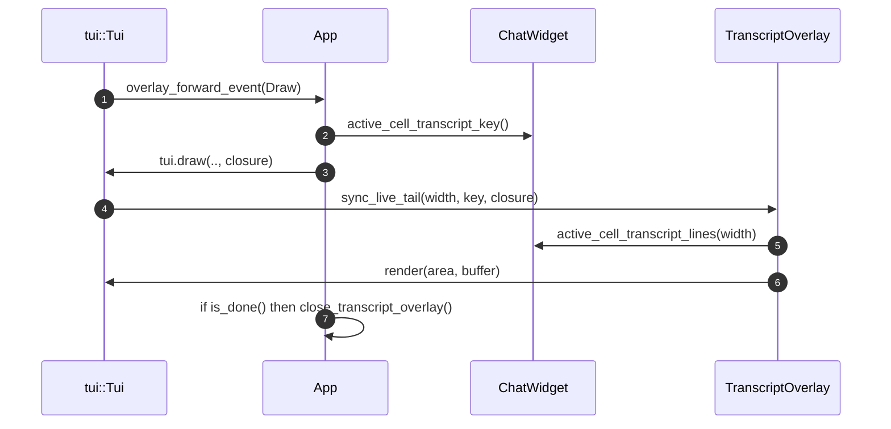

# tui/src/app_backtrack.rs

## 0. ざっくり一言

チャット履歴の「巻き戻し」（バックトラック）機能と、トランスクリプト（履歴）オーバーレイのイベントルーティング・描画同期を管理するモジュールです（`app_backtrack.rs:L1-24`）。

---

## 1. このモジュールの役割

### 1.1 概要

このモジュールは、TUI アプリのチャット履歴に対して以下を実現するために存在します。

- Esc/Enter キーを使った「バックトラック」操作の状態管理（どのユーザメッセージまで巻き戻すか）  
- トランスクリプトオーバーレイ（`Ctrl+T`）とメインビューの履歴状態の同期  
- コア（エージェント）側の実際のロールバック完了イベントに合わせたローカル履歴のトリム（削除）

バックトラックは「ロールバック要求 → コアからの成功通知 → ローカルトランスクリプトを同じ境界でトリム」という流れで行われます（`app_backtrack.rs:L1-24,L183-228,L464-488`）。

### 1.2 アーキテクチャ内での位置づけ

主要コンポーネントの関係を簡略化すると次のようになります。

```mermaid
graph TD
    User["ユーザ入力<br/>Esc/Enter キー"] 
    Tui["tui::Tui / TuiEvent"] 
    App["App（本ファイルの impl）"]
    ChatWidget["ChatWidget<br/>(composer, active cell, thread_id)"]
    Overlay["Overlay::Transcript<br/>(TranscriptOverlay)"]
    Core["Core/Agent<br/>AppCommand::thread_rollback"]
    AppEventTx["app_event_tx<br/>AppEvent::ApplyThreadRollback"]

    User --> Tui
    Tui --> App

    App --> ChatWidget
    App --> Overlay
    App --> Tui

    App -->|submit_op(thread_rollback)| Core
    Core -->|ThreadRolledBack イベント| App
    App -->|AppEvent::ApplyThreadRollback| AppEventTx

    ChatWidget -->|active_cell_transcript_*| Overlay
```

- `App` がバックトラック状態（`BacktrackState`）と `Overlay` のライフサイクルを持ちます（`app_backtrack.rs:L47-68,L230-251`）。
- `ChatWidget` が現在のスレッド ID・編集中メッセージ（composer）・アクティブセル（ストリーミング中メッセージ）のソースです（名前からの推測; 具体的な定義はこのチャンクにはありません）。
- `Overlay::Transcript` はコミット済み履歴に加え、`ChatWidget` のアクティブセルから「ライブテイル」を同期して描画します（`app_backtrack.rs:L352-377`）。
- ロールバック要求は `AppCommand::thread_rollback` 経由でコアへ送られ、`ThreadRolledBack` イベント経由で戻ってくる想定です（`app_backtrack.rs:L183-228,L464-488`）。

### 1.3 設計上のポイント

コードから読み取れる設計上の特徴です。

- **明示的な状態機械**  
  - `BacktrackState` が「primed / overlay_preview_active / pending_rollback」などの状態を一箇所に集約します（`app_backtrack.rs:L47-68`）。
- **スレッド境界のガード**  
  - `base_id: Option<ThreadId>` を保存し、スレッドが切り替わった場合の古い選択を無視します（`backtrack_selection` 内; `app_backtrack.rs:L511-515`）。
- **ロールバックガード**  
  - `pending_rollback: Option<PendingBacktrackRollback>` を使い、コアから応答が来るまで追加のロールバック要求をブロックします（`app_backtrack.rs:L47-68,L183-228,L464-475`）。
- **履歴トリムの抽象化**  
  - 履歴ベクタ `Vec<Arc<dyn HistoryCell>>` に対する「nth ユーザメッセージまで削る」「最後の n ユーザターンを削る」といった処理を関数に分離（`trim_transcript_*`, `user_positions_iter` など; `app_backtrack.rs:L568-606,L612-638`）。
- **ランタイム型判定によるフィルタリング**  
  - `TypeId` と `as_any()` を用いて `UserHistoryCell` / `SessionInfoCell` / `AgentMessageCell` の位置を動的に判定します（`app_backtrack.rs:L621-638,L645-665, L679-688`）。
- **非同期イベントループ前提**  
  - `handle_backtrack_overlay_event` が `async fn` であり、TUI イベントループから非同期に呼ばれる前提です（`app_backtrack.rs:L101-111`）。
- **描画と状態更新の分離**  
  - `overlay_forward_event` が、描画時のライブテイル同期とオーバーレイクローズ判定を一手に担い、他のロジックは主に状態更新に集中しています（`app_backtrack.rs:L352-401`）。

---

## 2. 主要な機能一覧

このモジュールが提供する主な機能です。

- バックトラック状態管理（`BacktrackState`）: Esc プライミング状態、選択中メッセージ、オーバーレイプレビュー状態、保留中ロールバックの管理
- メインビューでの Esc バックトラック操作（`handle_backtrack_esc_key`）
- トランスクリプトオーバーレイでのバックトラック操作とイベントルーティング（`handle_backtrack_overlay_event`, `overlay_forward_event`）
- ロールバック要求の発行と、成功/失敗応答に連動したローカル履歴トリム（`apply_backtrack_rollback`, `finish_pending_backtrack`, `apply_non_pending_thread_rollback`）
- 履歴ベクタからユーザメッセージの位置を求めるユーティリティ（`user_positions_iter`, `user_count`, `trim_transcript_cells_*`）
- ロールバック後にオーバーレイとスクロールバックを整合させる処理（`sync_overlay_after_transcript_trim`, `render_transcript_once`）

---

## 3. 公開 API と詳細解説

### 3.1 型一覧（構造体）

| 名前 | 種別 | 役割 / 用途 | 根拠 |
|------|------|-------------|------|
| `BacktrackState` | 構造体 | バックトラック関連の状態（primed / base_id / 選択インデックス / オーバーレイプレビュー状態 / 保留中ロールバック）を集約する。`App` のフィールドとして利用される。 | `app_backtrack.rs:L47-68` |
| `BacktrackSelection` | 構造体 | ユーザが選んだバックトラック対象メッセージを表す。ロールバック深さ計算とトランスクリプトトリム、および composer へのプレフィルに使用。 | `app_backtrack.rs:L70-89` |
| `PendingBacktrackRollback` | 構造体 | コアに対して発行したロールバック要求の情報を保持。ローカルトリム適用時に正しいスレッドか確認するために使用。 | `app_backtrack.rs:L91-99` |

### 3.2 関数詳細（主要 7 件）

#### `handle_backtrack_overlay_event(&mut self, tui: &mut tui::Tui, event: TuiEvent) -> Result<bool>`

**概要**

トランスクリプトオーバーレイが表示されている間のイベント（特にキー入力）を処理し、バックトラックプレビュー中かどうかに応じて Esc/←/→/Enter の挙動を切り替えます（`app_backtrack.rs:L101-166`）。

- `overlay_preview_active == true` の場合: Esc/Left で「前のユーザメッセージ」、Right で「次のユーザメッセージ」、Enter でロールバック確定。
- それ以外のキーは通常のオーバーレイにフォワード。
- `overlay_preview_active == false` で Esc を押した場合、バックトラックプレビューを開始します。

**引数**

| 引数名 | 型 | 説明 |
|--------|----|------|
| `tui` | `&mut tui::Tui` | 端末描画やフレームスケジューリングを行う TUI オブジェクト。オーバーレイ操作にも使用されます。 |
| `event` | `TuiEvent` | キーボード等の TUI イベント。Esc/Enter/Left/Right の Key イベントや Draw などが含まれると推測されます。 |

**戻り値**

- `Result<bool>`:  
  - `Ok(true)` 固定で返しており、「イベントを消費した」ことを呼び出し元に示します（`app_backtrack.rs:L119-121,L127-129,L135-137,L143-145,L160-165`）。  
  - `Err` の場合は `overlay_forward_event` など内部処理からのエラーを伝播します。

**内部処理の流れ**

1. `self.backtrack.overlay_preview_active` を確認（`app_backtrack.rs:L112`）。
2. プレビュー中であれば `match event` でキー種別と `KeyEventKind` を判別（`Press` / `Repeat` のみ反応; `app_backtrack.rs:L114-145`）。
   - Esc or Left → `overlay_step_backtrack` を呼び出し、前のユーザメッセージを選択。
   - Right → `overlay_step_backtrack_forward`。
   - Enter（`KeyEventKind::Press` のみ） → `overlay_confirm_backtrack` でロールバック確定。
   - それ以外 → `overlay_forward_event` でオーバーレイへフォワード。
3. プレビュー中でなく、かつ Esc キーなら `begin_overlay_backtrack_preview` を呼び出し、最後のユーザメッセージにハイライトを当てる（`app_backtrack.rs:L152-160,L281-291`）。
4. それ以外のイベントは単純に `overlay_forward_event` にフォワード（`app_backtrack.rs:L161-165`）。

**Examples（使用例）**

TUI イベントループの中で、オーバーレイがアクティブな場合のイベント処理の一部として使われるイメージです。

```rust
// crate 内部での擬似例。実際のイベントループ実装はこのチャンクにはありません。
async fn on_tui_event(app: &mut App, tui: &mut tui::Tui, event: TuiEvent) -> color_eyre::Result<()> {
    if matches!(event, TuiEvent::Overlay(..)) {
        // トランスクリプトオーバーレイ用イベントのルート
        let _handled = app.handle_backtrack_overlay_event(tui, event).await?;
    } else {
        // その他のイベント処理...
    }
    Ok(())
}
```

※ 上記は関数シグネチャとフィールドからの推測を含みます。実際のイベントループ定義はこのチャンクには現れません。

**Errors / Panics**

- `overlay_forward_event` 内で `tui.draw(..)` や `overlay.handle_event(..)` からエラーが返った場合、そのまま `Err` として呼び出し元に伝播します（`app_backtrack.rs:L148-149,L163-164,L365-401`）。
- panic を発生させるコード（`unwrap` 等）は含まれていません。

**Edge cases（エッジケース）**

- オーバーレイプレビュー中に Esc/Left/Right 以外のキーが押された場合、通常オーバーレイのイベントとして処理します（`app_backtrack.rs:L146-150`）。
- Esc が `KeyEventKind::Press` / `Repeat` 以外（例: `Release`）の場合は無視されます（`app_backtrack.rs:L153-155`）。

**使用上の注意点**

- 必ず TUI スレッド（イベントループ）から呼ぶ前提で設計されており、スレッドセーフな同期は行っていません（`&mut self` で排他的に App を借用; Rust の所有権システムによりコンパイル時に保証）。
- オーバーレイ状態（`self.overlay`）がこの関数外で変更される場合は、`overlay_preview_active` との整合性に注意する必要があります。

---

#### `handle_backtrack_esc_key(&mut self, tui: &mut tui::Tui)`

**概要**

オーバーレイが存在しないときのグローバル Esc キーによるバックトラック操作を扱います（`app_backtrack.rs:L168-181`）。

- 最初の Esc: バックトラックモードを「プライム」してヒントを表示。
- 2 回目の Esc: トランスクリプトオーバーレイを開き、最新のユーザメッセージにハイライト。
- プレビュー中の 3 回目以降の Esc: さらに古いユーザメッセージへステップ。

**引数**

| 引数名 | 型 | 説明 |
|--------|----|------|
| `tui` | `&mut tui::Tui` | トランスクリプトオーバーレイを開くために使用します。 |

**戻り値**

- 戻り値はありません。`self` と `tui` を直接更新します。

**内部処理の流れ**

1. composer が空でない場合は何もせず return（`app_backtrack.rs:L170-172`）。  
   → ユーザが編集中のメッセージを誤って消さないためのガードと解釈できます。
2. `self.backtrack.primed` が `false` なら `prime_backtrack` を呼び出し、プライミング状態に移行（`app_backtrack.rs:L174-176,L264-270`）。
3. 既に primed で、かつ `self.overlay.is_none()` なら `open_backtrack_preview` でオーバーレイを開いてプレビュー開始（`app_backtrack.rs:L176-178,L272-279`）。
4. オーバーレイプレビューがアクティブなら `step_backtrack_and_highlight` でさらに古いユーザメッセージへ移動（`app_backtrack.rs:L178-180,L293-314`）。

**Examples（使用例）**

```rust
fn on_global_key_event(app: &mut App, tui: &mut tui::Tui, key: crossterm::event::KeyEvent) {
    if key.code == KeyCode::Esc && key.kind == KeyEventKind::Press {
        app.handle_backtrack_esc_key(tui);
    }
}
```

**Edge cases**

- composer 非空の場合は一切バックトラック動作をしません（`app_backtrack.rs:L170-172`）。
- `self.overlay` が `Some` だが `overlay_preview_active == false` の場合、Esc はここでは何もしません。この状態での Esc は `handle_backtrack_overlay_event` 側で処理される想定です。

**使用上の注意点**

- composer の空判定に依存しているため、別の場所で composer の状態と backtrack の状態を同時に変更する場合は整合性に注意する必要があります。

---

#### `apply_backtrack_rollback(&mut self, selection: BacktrackSelection)`

**概要**

ユーザが選択したバックトラック位置に基づいて、ロールバック要求をコアに発行し、必要なローカル状態を準備します（`app_backtrack.rs:L183-228`）。

- ユーザメッセージ数からロールバック深さ（何ターン戻すか）を計算し、`AppCommand::thread_rollback(num_turns)` を送信。
- pending ガードをセットして、重複ロールバックを防止。
- ロールバック対象メッセージから得たプレフィルや画像情報を composer に適用。

**引数**

| 引数名 | 型 | 説明 |
|--------|----|------|
| `selection` | `BacktrackSelection` | 選択されたユーザメッセージのインデックスと、プレフィル・画像情報等を含む。 |

**戻り値**

- 戻り値はありません。内部状態と `ChatWidget` を更新する副作用のみです。

**内部処理の流れ**

1. 現在のセッション中のユーザメッセージ数を `user_count` で取得（`app_backtrack.rs:L191,L608-610`）。
   - 0 件なら即 return（`app_backtrack.rs:L192-194`）。
2. すでに `pending_rollback` が存在する場合、「Backtrack rollback already in progress.」というエラーメッセージを `chat_widget` に追加し、return（`app_backtrack.rs:L196-200`）。
3. ロールバック深さ `num_turns` を計算（`app_backtrack.rs:L202-205`）。
   - `user_total.saturating_sub(selection.nth_user_message)` で差を取り、`u32::try_from` で変換。変換に失敗した場合は `u32::MAX` にフォールバック。
   - `num_turns == 0` の場合は return。
4. `selection` の内容をローカル変数に clone（`prefill`, `text_elements`, `local_image_paths`, `remote_image_urls`; `app_backtrack.rs:L208-213`）。
5. `pending_rollback` に `PendingBacktrackRollback { selection, thread_id: self.chat_widget.thread_id() }` をセット（`app_backtrack.rs:L213-216`）。
6. `self.chat_widget.submit_op(AppCommand::thread_rollback(num_turns))` でコアへロールバック要求（`app_backtrack.rs:L217-218`）。
7. `self.chat_widget.set_remote_image_urls(remote_image_urls)` で画像 URL を composer 側に設定（`app_backtrack.rs:L219`）。
8. プレフィルかテキスト・ローカル画像・リモート画像のいずれかが非空なら、`set_composer_text` で composer を更新（`app_backtrack.rs:L220-227`）。

**Examples（使用例）**

トランスクリプトオーバーレイで Enter を押したときの処理の一部として呼ばれています（`overlay_confirm_backtrack` 内; `app_backtrack.rs:L403-412`）。

```rust
fn on_confirm_from_overlay(app: &mut App, tui: &mut tui::Tui) {
    // overlay_confirm_backtrack 内部のイメージ
    let nth = app.backtrack.nth_user_message;
    if let Some(selection) = app.backtrack_selection(nth) {
        app.apply_backtrack_rollback(selection);
        tui.frame_requester().schedule_frame();
    }
}
```

**Errors / Panics**

- `u32::try_from` 失敗時の `unwrap_or(u32::MAX)` により panic は発生しません（`app_backtrack.rs:L203`）。
- `chat_widget.submit_op` や `set_composer_text` は `Result` を返さず、ここではエラーを返しません（戻り値型はこのチャンクには現れませんが、`?` や `unwrap` が使われていないことから推測）。

**Edge cases**

- ユーザメッセージ 0 件 → 何もしない（`app_backtrack.rs:L191-194`）。
- `selection.nth_user_message` が非常に大きく `usize -> u32` 変換に失敗する場合 → `num_turns = u32::MAX` として扱う（`app_backtrack.rs:L202-203`）。
- `num_turns == 0`（最新のユーザメッセージを選択済みで、差分が 0 になるケース）の場合も、何もしません（`app_backtrack.rs:L204-205`）。

**使用上の注意点**

- ロールバック深さは「セッション開始以降の総ユーザメッセージ数 − 選択インデックス」という定義であり、トランスクリプトのトリム側（`trim_transcript_cells_drop_last_n_user_turns` / `trim_transcript_cells_to_nth_user`）と整合している必要があります（テストで検証; `app_backtrack.rs:L792-826`）。
- `pending_rollback` をクリアするのは成功/失敗ハンドラ側（`handle_backtrack_rollback_succeeded`, `handle_backtrack_rollback_failed`）に限定されます。

---

#### `overlay_forward_event(&mut self, tui: &mut tui::Tui, event: TuiEvent) -> Result<()>`

**概要**

トランスクリプトオーバーレイにイベントをフォワードし、必要なときに描画とクローズ処理を行います（`app_backtrack.rs:L352-401`）。特に `TuiEvent::Draw` の場合、`ChatWidget` のアクティブセルを「ライブテイル」としてオーバーレイに合成するのが特徴です。

**引数**

| 引数名 | 型 | 説明 |
|--------|----|------|
| `tui` | `&mut tui::Tui` | 描画・フレームスケジューリングのためのオブジェクト。 |
| `event` | `TuiEvent` | Draw イベントまたはその他の TUI イベント。 |

**戻り値**

- `Result<()>`: 描画やオーバーレイイベント処理で発生したエラーをそのまま返します。

**内部処理の流れ**

1. `if let TuiEvent::Draw = &event && let Some(Overlay::Transcript(t)) = &mut self.overlay` かどうか確認（`app_backtrack.rs:L365-368`）。
   - Draw かつ Transcript オーバーレイであれば、ライブテイル付き描画パスに入ります。
2. `chat_widget.active_cell_transcript_key()` でアクティブセルのキャッシュキーを取得（`app_backtrack.rs:L369-370`）。
3. `tui.draw(u16::MAX, |frame| { ... })` 内で:
   - フレーム幅を取得し、`t.sync_live_tail(width, active_key, |w| chat_widget.active_cell_transcript_lines(w))` を呼ぶことで、コミット済みセル + アクティブセルをオーバーレイに同期（`app_backtrack.rs:L371-375`）。
   - `t.render(frame.area(), frame.buffer)` で実際に描画（`app_backtrack.rs:L376`）。
4. `let close_overlay = t.is_done();` でオーバーレイ終了条件を判定（`app_backtrack.rs:L378`）。
5. アニメーションが必要なら `schedule_frame_in(50ms)` で次のフレームを予約（`app_backtrack.rs:L379-385`）。
6. `close_overlay == true` の場合、`close_transcript_overlay` と `schedule_frame()` を呼んでオーバーレイを閉じる（`app_backtrack.rs:L386-389`）。
7. Draw かつ Transcript でない場合は、`overlay.handle_event(tui, event)?` で通常のイベントフォワードを行い、`overlay.is_done()` ならオーバーレイを閉じる（`app_backtrack.rs:L393-399`）。

**Examples（使用例）**

この関数は `handle_backtrack_overlay_event` から内部的に呼ばれます。

```rust
// Draw イベントのルーティング例（擬似コード）
fn on_draw(app: &mut App, tui: &mut tui::Tui) -> color_eyre::Result<()> {
    app.overlay_forward_event(tui, TuiEvent::Draw)
}
```

**Errors / Panics**

- `tui.draw`・`overlay.handle_event` の失敗が `Result` として伝播します（`app_backtrack.rs:L371-377,L393-395`）。
- panic を起こすコードは含まれていません。

**Edge cases**

- `self.overlay` が `None` のときは `if let Some(overlay)` に入らず、何もせず `Ok(())` を返します（`app_backtrack.rs:L393-401`）。
- `active_key` にアニメーション情報がなく、またはオーバーレイが最下部までスクロールされていない場合は、追加のフレーム予約を行いません（`app_backtrack.rs:L379-385`）。

**使用上の注意点**

- この関数は「描画」と「オーバーレイクローズ判定」を兼ねているため、オーバーレイのライフサイクル管理と密接に結合しています。
- アニメーションがあるアクティブセルが存在し、スクロール位置が最下部のときのみ 50ms 間隔で再描画されるため、パフォーマンスに配慮した設計になっています。

---

#### `apply_non_pending_thread_rollback(&mut self, num_turns: u32) -> bool`

**概要**

この TUI インスタンスでロールバック要求を発行していない（`pending_rollback == None`）にもかかわらず、`ThreadRolledBack` 相当のイベントを受け取った場合に、ローカルのトランスクリプトを整合させるための関数です（`app_backtrack.rs:L477-488`）。

**引数**

| 引数名 | 型 | 説明 |
|--------|----|------|
| `num_turns` | `u32` | ロールバックされたユーザターンの数。 |

**戻り値**

- `bool`: ローカルの `transcript_cells` に変更があった場合は `true`、そうでなければ `false`。

**内部処理の流れ**

1. `trim_transcript_cells_drop_last_n_user_turns(&mut self.transcript_cells, num_turns)` を呼び出し、最後の `num_turns` ユーザターン（＋その後のセル）を削除（`app_backtrack.rs:L481-483,L584-606`）。
   - 変更がなければ `false` を返して終了。
2. 変更があった場合、`sync_overlay_after_transcript_trim()` を呼んでオーバーレイとバックトラック状態を同期（`app_backtrack.rs:L485,L540-565`）。
3. `self.backtrack_render_pending = true` をセットし、スクロールバック再レンダリングが必要であることをマーク（`app_backtrack.rs:L486`）。
4. 最終的に `true` を返す（`app_backtrack.rs:L487`）。

**Examples（使用例）**

```rust
fn on_thread_rolled_back_event(app: &mut App, num_turns: u32) {
    // 自身が pending_rollback を持たない場合に呼ぶ想定
    if app.apply_non_pending_thread_rollback(num_turns) {
        // 変更があったので、別途 render_transcript_once などでスクロールバックを再構築する
    }
}
```

**Errors / Panics**

- 内部で使用する関数はいずれも `Result` を返さず、panic を起こす可能性のある操作は含まれていません。

**Edge cases**

- `num_turns == 0` → `trim_transcript_cells_drop_last_n_user_turns` が即 `false` を返し、何も変更しません（`app_backtrack.rs:L588-590`）。
- ユーザメッセージがそもそも存在しない場合も `false` を返します（`app_backtrack.rs:L592-595`）。

**使用上の注意点**

- この関数は「自分がロールバックを発行していない」前提の処理です。`pending_rollback` が存在する場合は `handle_backtrack_rollback_succeeded`→`finish_pending_backtrack` を通す必要があります（`app_backtrack.rs:L464-471`）。

---

#### `finish_pending_backtrack(&mut self)`

**概要**

コアからロールバック成功通知を受けた際に、`pending_rollback` の情報を用いてトランスクリプトを実際にトリムし、表示を更新する処理です（`app_backtrack.rs:L490-508`）。

**引数 / 戻り値**

- 引数なし（`&mut self` のみ）、戻り値なし。内部状態を更新します。

**内部処理の流れ**

1. `self.backtrack.pending_rollback.take()` で保留中ロールバックを取り出し、`Option` から `Some` の場合のみ続行（`app_backtrack.rs:L495-497`）。
2. `pending.thread_id != self.chat_widget.thread_id()` の場合は、そのイベントは古いスレッドに対するものなので無視して return（`app_backtrack.rs:L498-500`）。
3. `trim_transcript_cells_to_nth_user(&mut self.transcript_cells, pending.selection.nth_user_message)` を呼び出し、指定されたユーザメッセージ以降（そのメッセージ自身を含む）を削除（`app_backtrack.rs:L502-505,L568-582`）。
4. トリムにより変更があった場合、`sync_overlay_after_transcript_trim()` を呼び、`backtrack_render_pending = true` をセット（`app_backtrack.rs:L506-507`）。

**Examples（使用例）**

```rust
fn on_thread_rolled_back_success(app: &mut App, num_turns: u32) {
    if app.backtrack.pending_rollback.is_some() {
        app.finish_pending_backtrack();
    } else {
        // 他クライアントからのロールバックなど
        app.apply_non_pending_thread_rollback(num_turns);
    }
}
```

※ 実際には `handle_backtrack_rollback_succeeded` がこのロジックを内包しています（`app_backtrack.rs:L464-471`）。

**Edge cases**

- `pending_rollback` が None の場合は何もせず return（`app_backtrack.rs:L495-497`）。
- ロールバックイベントの `thread_id` が現在の `chat_widget.thread_id()` と異なる場合も何もせず return（`app_backtrack.rs:L498-500`）。
- `nth_user_message == usize::MAX` の場合、`trim_transcript_cells_to_nth_user` は false を返し、何も変更されません（`app_backtrack.rs:L572-574`）。

**使用上の注意点**

- thread_id の一致チェックにより、「セッション切替後に遅延到着したロールバックイベント」を防いでいます。これにより UI とコアのスレッド状態の不整合を避けています。

---

#### `trim_transcript_cells_drop_last_n_user_turns(transcript_cells: &mut Vec<Arc<dyn HistoryCell>>, num_turns: u32) -> bool`

**概要**

トランスクリプト中の「最後の `num_turns` 個のユーザメッセージ（ターン）」と、その後ろのセルをすべて削除します（`app_backtrack.rs:L584-606`）。`ThreadRolledBack` で渡されるロールバック深さに対応するローカルトリム関数です。

**引数**

| 引数名 | 型 | 説明 |
|--------|----|------|
| `transcript_cells` | `&mut Vec<Arc<dyn crate::history_cell::HistoryCell>>` | 履歴セルの可変参照。`UserHistoryCell` / `AgentMessageCell` / `SessionInfoCell` などが含まれます。 |
| `num_turns` | `u32` | 削除するユーザターンの数。 |

**戻り値**

- `bool`: トランスクリプトを実際に変更したら `true`、変更がなければ `false`。

**内部処理の流れ**

1. `num_turns == 0` の場合、即 `false`（`app_backtrack.rs:L588-590`）。
2. `user_positions_iter(transcript_cells).collect()` で、セッション開始以降のすべてのユーザメッセージ位置のベクタを取得（`app_backtrack.rs:L592-593,L621-638`）。
3. 最初のユーザ位置 `first_user_idx` が存在しなければ何もせず `false`（`app_backtrack.rs:L593-595`）。
4. `usize::try_from(num_turns).unwrap_or(usize::MAX)` により、削除するターン数を usize に変換（変換失敗時は `usize::MAX`）し、`turns_from_end` とする（`app_backtrack.rs:L597`）。
5. `cut_idx` を以下のように決定（`app_backtrack.rs:L598-602`）。
   - `turns_from_end >= user_positions.len()` → `cut_idx = first_user_idx`（すべてのユーザターンを削除）。
   - そうでない → `user_positions[user_positions.len() - turns_from_end]`。
6. `let original_len = transcript_cells.len();` を保存し、`transcript_cells.truncate(cut_idx)` でトランスクリプトを先頭 `cut_idx` 要素に縮める（`app_backtrack.rs:L603-604`）。
7. `transcript_cells.len() != original_len` を戻り値として返す（`app_backtrack.rs:L605`）。

**Examples（使用例）**

テストに具体例があります。

```rust
// 最後の 1 ユーザターン（＋その後のセル）を削る例（app_backtrack.rs:L792-826）
let mut cells: Vec<Arc<dyn HistoryCell>> = vec![
    Arc::new(UserHistoryCell { message: "first".to_string(), /* 略 */ }) as Arc<dyn HistoryCell>,
    Arc::new(AgentMessageCell::new(vec![Line::from("after first")], false)) as Arc<dyn HistoryCell>,
    Arc::new(UserHistoryCell { message: "second".to_string(), /* 略 */ }) as Arc<dyn HistoryCell>,
    Arc::new(AgentMessageCell::new(vec![Line::from("after second")], false)) as Arc<dyn HistoryCell>,
];

let changed = trim_transcript_cells_drop_last_n_user_turns(&mut cells, 1);
assert!(changed);
assert_eq!(cells.len(), 2);
assert_eq!(
    cells[0]
        .as_any()
        .downcast_ref::<UserHistoryCell>()
        .unwrap()
        .message,
    "first"
);
```

**Errors / Panics**

- `usize::try_from(num_turns).unwrap_or(usize::MAX)` により変換失敗時も panic せず `usize::MAX` にフォールバックします（`app_backtrack.rs:L597`）。
- ベクタインデックスアクセス前に十分な長さを確認しており、不正インデックスによる panic は避けられています。

**Edge cases**

- `num_turns == 0` → 何も削らない（`app_backtrack.rs:L588-590`）。
- ユーザメッセージが存在しない → 何も削らない（`app_backtrack.rs:L592-595`）。
- `num_turns` が実際のユーザメッセージ数以上（または `u32::MAX` のように非常に大きい）  
  → 最初のユーザメッセージ以前で切り詰め、すべてのユーザターンを削除（`app_backtrack.rs:L597-600, L828-861`）。

**使用上の注意点**

- ユーザターンの定義は `user_positions_iter` に依存しており、「最新の session start (`SessionInfoCell`) 以降の `UserHistoryCell`」のみを数えます（`app_backtrack.rs:L621-638`）。
- それ以前の履歴やシステムメッセージは削除されない点に注意が必要です。

---

#### `user_positions_iter(cells: &[Arc<dyn HistoryCell>]) -> impl Iterator<Item = usize>`

**概要**

直近のセッション開始（`SessionInfoCell`）以降に現れる `UserHistoryCell` のインデックスを列挙するイテレータを返します（`app_backtrack.rs:L621-638`）。`user_count`, `nth_user_position`, `trim_transcript_*` などの基盤となる関数です。

**引数**

| 引数名 | 型 | 説明 |
|--------|----|------|
| `cells` | `&[Arc<dyn crate::history_cell::HistoryCell>]` | トランスクリプトセル配列。 |

**戻り値**

- `impl Iterator<Item = usize>`: ユーザメッセージセルの **インデックス** を返すイテレータ。

**内部処理の流れ**

1. `session_start_type = TypeId::of::<SessionInfoCell>()` と `user_type = TypeId::of::<UserHistoryCell>()` を用意（`app_backtrack.rs:L624-625`）。
2. `type_of` クロージャで任意セルの `TypeId` を取得（`as_any().type_id()`; `app_backtrack.rs:L626`）。
3. トランスクリプト全体から最後の `SessionInfoCell` の位置を `rposition` で探し、その直後のインデックスを `start` とする（見つからなければ 0; `app_backtrack.rs:L628-631`）。
4. `cells.iter().enumerate().skip(start)` した上で、`type_of(cell) == user_type` なものだけを `filter_map` で抽出し、そのインデックスを返す（`app_backtrack.rs:L633-637`）。

**Examples（使用例）**

```rust
let user_positions: Vec<usize> = user_positions_iter(&transcript_cells).collect();
// 0-based インデックスで、各ユーザメッセージの位置が得られる
```

**使用上の注意点**

- セッション開始前のユーザメッセージは含まれません。
- ランタイム型判定に依存しているため、新しいセル型を追加しても「ユーザメッセージ」として数えたい場合は `UserHistoryCell` を使う必要があります。

---

### 3.3 その他の関数一覧

代表的なもののみ列挙します。

| 関数名 | シグネチャ（簡略） | 役割（1 行） | 根拠 |
|--------|---------------------|--------------|------|
| `open_transcript_overlay` | `(&mut self, &mut tui::Tui)` | Alt スクリーンに入り、現在の `transcript_cells` を使って `Overlay::Transcript` を表示。 | `app_backtrack.rs:L230-235` |
| `close_transcript_overlay` | `(&mut self, &mut tui::Tui)` | Alt スクリーンを離脱し、オーバーレイを閉じる。バックトラック中なら状態リセット。 | `app_backtrack.rs:L237-251` |
| `render_transcript_once` | `(&mut self, &mut tui::Tui)` | 現在の `transcript_cells` を端末のスクロールバックに一括でレンダリング。 | `app_backtrack.rs:L253-262` |
| `prime_backtrack` | `(&mut self)` | `BacktrackState` をバックトラック primed 状態にし、Esc ヒントを composer に表示。 | `app_backtrack.rs:L264-270` |
| `open_backtrack_preview` | `(&mut self, &mut tui::Tui)` | オーバーレイを開き、バックトラックプレビューを開始して最初のハイライトを行う。 | `app_backtrack.rs:L272-279` |
| `begin_overlay_backtrack_preview` | `(&mut self, &mut tui::Tui)` | 既存オーバーレイ上でバックトラックプレビューを開始。最新のユーザメッセージを選択。 | `app_backtrack.rs:L281-291` |
| `step_backtrack_and_highlight` | `(&mut self, &mut tui::Tui)` | より古いユーザメッセージへ選択をステップし、オーバーレイのハイライトを更新。 | `app_backtrack.rs:L293-314` |
| `step_forward_backtrack_and_highlight` | `(&mut self, &mut tui::Tui)` | より新しいユーザメッセージへ選択をステップ。 | `app_backtrack.rs:L316-335` |
| `apply_backtrack_selection_internal` | `(&mut self, usize)` | `nth_user_message` を更新し、`Overlay::Transcript` のハイライトセルを設定/クリア。 | `app_backtrack.rs:L337-350` |
| `overlay_confirm_backtrack` | `(&mut self, &mut tui::Tui)` | 選択中のユーザメッセージから `BacktrackSelection` を作成し、オーバーレイを閉じた上でロールバックを適用。 | `app_backtrack.rs:L403-412` |
| `overlay_step_backtrack` | `(&mut self, &mut tui::Tui, TuiEvent)` | プレビュー armed 時に Esc で古い方へステップ、未 armed 時は通常オーバーレイへフォワード。 | `app_backtrack.rs:L415-422` |
| `overlay_step_backtrack_forward` | `(&mut self, &mut tui::Tui, TuiEvent)` | Right キーで新しい方へステップ、未 armed 時はフォワード。 | `app_backtrack.rs:L425-435` |
| `confirm_backtrack_from_main` | `(&mut self) -> Option<BacktrackSelection>` | メインビューからのバックトラック確定用。現在の選択に基づく `BacktrackSelection` を返し、状態をリセット。 | `app_backtrack.rs:L438-444` |
| `reset_backtrack_state` | `(&mut self)` | `BacktrackState` の primed/base_id/nth_user_message をリセットし、Esc ヒントをクリア。 | `app_backtrack.rs:L446-453` |
| `apply_backtrack_selection` | `(&mut self, &mut tui::Tui, BacktrackSelection)` | 外部から `BacktrackSelection` を渡してロールバックを適用し、再描画をスケジュール。 | `app_backtrack.rs:L455-462` |
| `handle_backtrack_rollback_succeeded` | `(&mut self, u32)` | ロールバック成功時に pending の有無で `finish_pending_backtrack` か `AppEvent::ApplyThreadRollback` を選択。 | `app_backtrack.rs:L464-471` |
| `handle_backtrack_rollback_failed` | `(&mut self)` | ロールバック失敗時に `pending_rollback` をクリア。 | `app_backtrack.rs:L473-475` |
| `backtrack_selection` | `(&self, usize) -> Option<BacktrackSelection>` | `nth_user_message` に対応する `UserHistoryCell` からプレフィルなどを抽出し、`BacktrackSelection` を構築。 | `app_backtrack.rs:L511-538` |
| `sync_overlay_after_transcript_trim` | `(&mut self)` | トリム後にオーバーレイのセルを差し替え、選択インデックスをクランプし、バッファ済みスクロールバック行を破棄。 | `app_backtrack.rs:L540-565` |
| `trim_transcript_cells_to_nth_user` | `(&mut Vec<Arc<dyn HistoryCell>>, usize) -> bool` | `nth` 番目のユーザメッセージ以降を削除。 | `app_backtrack.rs:L568-582` |
| `user_count` | `(&[Arc<dyn HistoryCell>]) -> usize` | セッション開始以降のユーザメッセージ数を返す。 | `app_backtrack.rs:L608-610` |
| `nth_user_position` | `(&[Arc<dyn HistoryCell>], usize) -> Option<usize>` | `nth` 番目のユーザメッセージのセルインデックスを返す。 | `app_backtrack.rs:L612-619` |

---

## 4. データフロー

### 4.1 バックトラック（オーバーレイ経由）の典型的な流れ

ユーザがメインビューで Esc を押してバックトラックし、トランスクリプトオーバーレイで Enter で確定し、コアからの成功イベントで履歴がトリムされるまでの流れです。

```mermaid
sequenceDiagram
    autonumber
    participant U as ユーザ
    participant T as tui::Tui / TuiEvent
    participant A as App
    participant CW as ChatWidget
    participant O as Overlay::Transcript
    participant C as Core/Agent

    U->>T: Esc (メインビュー)
    T->>A: handle_backtrack_esc_key (L168-181)
    A->>A: prime_backtrack (L264-270)

    U->>T: Esc (2回目)
    T->>A: handle_backtrack_esc_key
    A->>T: open_transcript_overlay (L230-235)
    A->>A: open_backtrack_preview (L272-279)
    A->>O: step_backtrack_and_highlight (選択=最新ユーザ; L293-314)

    loop Overlay 表示中
        U->>T: Esc / ← / →
        T->>A: handle_backtrack_overlay_event (L101-166)
        A->>A: overlay_step_backtrack(_forward) (L415-435)
        A->>O: apply_backtrack_selection_internal (ハイライト更新; L337-350)
    end

    U->>T: Enter
    T->>A: handle_backtrack_overlay_event
    A->>A: overlay_confirm_backtrack (L403-412)
    A->>A: backtrack_selection (L511-538)
    A->>A: apply_backtrack_rollback (L183-228)
    A->>CW: submit_op(thread_rollback(num_turns))

    C-->>A: ThreadRolledBack(num_turns)
    A->>A: handle_backtrack_rollback_succeeded (L464-471)
    A->>A: finish_pending_backtrack (L490-508)
    A->>A: sync_overlay_after_transcript_trim (L540-565)
    Note right of A: backtrack_render_pending = true
```

このシーケンスにより、

- ロールバック要求が失敗した場合でも、トランスクリプトをトリムする前にコアの確認を待つことで、UI とエージェントの状態がずれないようになっています（`app_backtrack.rs:L183-188`）。

### 4.2 Draw 時のライブテイル同期

`TuiEvent::Draw` 時のデータフローです（`overlay_forward_event`; `app_backtrack.rs:L365-385`）。



- コミット済みの `transcript_cells` に、`ChatWidget` が持つアクティブセルの表示行を「キャッシュ付きライブテイル」として合成します。
- アニメーション中は 50ms 間隔で再描画をスケジュールします（`app_backtrack.rs:L379-385`）。

---

## 5. 使い方（How to Use）

### 5.1 基本的な使用方法（Esc → オーバーレイ → Enter）

以下は、バックトラック機能の典型的な利用イメージです。

```rust
use crate::tui::{Tui, TuiEvent};
use crossterm::event::{KeyCode, KeyEvent, KeyEventKind};

async fn handle_event(app: &mut App, tui: &mut Tui, event: TuiEvent) -> color_eyre::Result<()> {
    match event {
        // オーバーレイ表示中のキー入力
        TuiEvent::Key(KeyEvent { code: KeyCode::Esc, .. })
            if app.overlay.is_some() =>
        {
            // トランスクリプトオーバーレイ用のハンドラに委譲
            let _ = app.handle_backtrack_overlay_event(tui, event).await?;
        }

        // メインビューでの Esc (バックトラック)
        TuiEvent::Key(KeyEvent {
            code: KeyCode::Esc,
            kind: KeyEventKind::Press,
            ..
        }) => {
            app.handle_backtrack_esc_key(tui);
        }

        // その他のイベント...
        _ => {}
    }

    Ok(())
}
```

※ `app.overlay` フィールドなどの存在はこのチャンクから読み取れますが、外部からの可視性は `App` の定義に依存します（このチャンクには現れません）。

### 5.2 よくある使用パターン

1. **メインビューから一気にロールバックしたい場合**

   - `handle_backtrack_esc_key` を用いて Esc でプライミング → オーバーレイを開かずに別の UI 側で選択し、`confirm_backtrack_from_main` から `BacktrackSelection` を取り出して `apply_backtrack_selection` に渡す、という使い方が可能です（`app_backtrack.rs:L438-444,L455-462`）。

   ```rust
   if let Some(selection) = app.confirm_backtrack_from_main() {
       app.apply_backtrack_selection(tui, selection);
   }
   ```

2. **外部イベントからのロールバック反映**

   - 他クライアントによるロールバックなど、「この TUI が pending_rollback を持っていない」場合に `apply_non_pending_thread_rollback` を呼び、トランスクリプトを整合させます（`app_backtrack.rs:L477-488`）。

   ```rust
   if !app.backtrack.pending_rollback.is_some() {
       let changed = app.apply_non_pending_thread_rollback(num_turns);
       if changed {
           app.render_transcript_once(tui);
       }
   }
   ```

### 5.3 よくある間違いと正しいパターン

```rust
// 間違い例: pending_rollback を無視して常に apply_non_pending_thread_rollback を呼ぶ
fn on_thread_rolled_back_wrong(app: &mut App, num_turns: u32) {
    app.apply_non_pending_thread_rollback(num_turns); // 自分起点のロールバックもここを通ってしまう
}

// 正しい例: pending_rollback の有無で分岐
fn on_thread_rolled_back_correct(app: &mut App, num_turns: u32) {
    if app.backtrack.pending_rollback.is_some() {
        app.handle_backtrack_rollback_succeeded(num_turns);
    } else {
        app.apply_non_pending_thread_rollback(num_turns);
    }
}
```

### 5.4 使用上の注意点（まとめ）

- **前提条件**
  - バックトラック開始前に composer が空である必要があります（`handle_backtrack_esc_key`; `app_backtrack.rs:L170-172`）。
  - ロールバック対象は「最新の session start 以降のユーザメッセージ」に限定されます（`user_positions_iter`; `app_backtrack.rs:L621-638`）。
- **禁止事項 / 推奨されない使い方**
  - `pending_rollback` を外部から直接書き換えると、ガードロジックと整合性が崩れます。
  - `BacktrackSelection.nth_user_message` を手動で操作して `apply_backtrack_rollback` に渡す場合、`user_count` の範囲内にあるか注意する必要があります。
- **エラー・パニック条件**
  - このモジュール内では panic を伴う `unwrap` 等は使われておらず、`Result` を返す関数では `color_eyre::Result` を通じてエラーが伝播します。
- **パフォーマンス**
  - 描画更新（特にアニメーション時）は 50ms 間隔でスケジュールされるため、イベントループがそれより大幅に遅いとアニメーションがカクつく可能性があります（`app_backtrack.rs:L379-385`）。
  - 履歴サイズが大きい場合、`render_transcript_once` で全履歴を再描画する処理はコストが掛かる可能性があります（`app_backtrack.rs:L253-262`）。

---

## 6. 変更の仕方（How to Modify）

### 6.1 新しい機能を追加する場合

例: 「バックトラック時に '確認ダイアログ' を表示したい」場合。

1. **入力ハンドラレイヤ**  
   - `handle_backtrack_overlay_event` または `handle_backtrack_esc_key` に分岐を追加し、Enter 押下時にダイアログ表示状態へ遷移させる（`app_backtrack.rs:L101-166,L168-181`）。
2. **状態の追加**  
   - `BacktrackState` に「ダイアログ表示中」等のフラグを追加し、その状態に応じて Esc/Enter の挙動を切り替える（`app_backtrack.rs:L47-68`）。
3. **ロールバック適用ポイント**  
   - 実際に `apply_backtrack_rollback` を呼ぶのはダイアログで確定した後に限定する（`app_backtrack.rs:L183-228,L403-412`）。

### 6.2 既存の機能を変更する場合

- **ロールバック深さの定義を変えたい場合**
  - `apply_backtrack_rollback` 内の `num_turns` 計算（`app_backtrack.rs:L202-205`）と、`trim_transcript_cells_drop_last_n_user_turns` の仕様（`app_backtrack.rs:L584-606`）、および関連テスト（`app_backtrack.rs:L792-861`）をセットで見直す必要があります。
- **「ユーザターン」の定義を変えたい場合**
  - `user_positions_iter` と `agent_group_positions_iter` のロジック（`app_backtrack.rs:L621-638,L645-665`）を変更し、テストで期待挙動を確認します。
- **影響範囲の確認**
  - `BacktrackState` のフィールドは複数のメソッドから参照されるため、新しいフィールドを追加・変更する際は、`impl App` 内の全メソッドに対するコンパイルエラーと挙動を確認するのが安全です。

---

## 7. 関連ファイル

このモジュールと密接に関係するファイル・モジュールです（import とコメントから判断できる範囲）。

| パス / モジュール | 役割 / 関係 | 根拠 |
|-------------------|------------|------|
| `crate::app::App` | 本ファイルで `impl` 対象となっているアプリケーション本体。`transcript_cells`, `chat_widget`, `overlay`, `backtrack` などのフィールドを持つ。 | `app_backtrack.rs:L30,L101` |
| `crate::app_command::AppCommand` | `thread_rollback(num_turns)` など、コアへ送る操作コマンドを表す。 | `app_backtrack.rs:L31,L217-218` |
| `crate::app_event::AppEvent` | `ApplyThreadRollback { num_turns }` など、アプリ内部で扱うイベント。 | `app_backtrack.rs:L32,L468-469` |
| `crate::history_cell::{SessionInfoCell, UserHistoryCell, AgentMessageCell}` | トランスクリプトの各セル型。ユーザメッセージやセッション開始マーカーなど。 | `app_backtrack.rs:L35-36,L640-665,L676-688` |
| `crate::pager_overlay::Overlay` | トランスクリプトオーバーレイなどのオーバーレイ UI コンポーネント。 | `app_backtrack.rs:L37,L230-235,L337-350,L365-399` |
| `crate::tui` / `crate::tui::TuiEvent` | TUI のラッパ型とイベント型。描画・キーボードイベントなどを表す。 | `app_backtrack.rs:L38-39,L101-111,L365-385` |
| `codex_protocol::ThreadId` | チャットスレッド（セッション）を一意に識別する ID。`BacktrackState.base_id` や `PendingBacktrackRollback.thread_id` で利用。 | `app_backtrack.rs:L40,L55,L98,L511-515` |
| `codex_protocol::user_input::TextElement` | ユーザメッセージを構成するテキスト要素。プレフィルやバックトラック選択に含まれる。 | `app_backtrack.rs:L41,L84,L517-528` |

---

## Bugs / Security / Contracts / Tests についての補足

### 潜在的な懸念点（Bugs / Security）

- **AppEvent チャネルの send エラー無視**  
  - `handle_backtrack_rollback_succeeded` で `self.app_event_tx.send(AppEvent::ApplyThreadRollback { num_turns });` の戻り値が無視されています（`app_backtrack.rs:L468-470`）。  
    受信側が既に閉じている場合、イベントが失われても検知されません。この挙動が仕様かどうかは、このチャンクだけでは判断できません。

- **BacktrackSelection とスレッド ID の分離**  
  - `BacktrackSelection` 自体には `ThreadId` 情報がなく、`backtrack_selection` 内で `base_id` と現在の `thread_id` を比較してフィルタしています（`app_backtrack.rs:L511-515`）。  
    `BacktrackSelection` を外部で長期間保持してから `apply_backtrack_selection` に渡す場合、スレッド切替との整合性を別途考慮する必要があります。

### Contracts / Edge Cases（まとめ）

- `BacktrackState.base_id` は「バックトラックが有効なベーススレッド」を表し、`backtrack_selection` は現在の `thread_id` がこれと一致しない場合に `None` を返します（`app_backtrack.rs:L511-515`）。
- `nth_user_message == usize::MAX` は「選択なし」を意味し、`apply_backtrack_selection_internal` 等で特別扱いされています（`app_backtrack.rs:L60,L301-305,L345-347`）。
- ユーザターン数やトリム深さに対するオーバーフローは `saturating_*` や `try_from + unwrap_or` で吸収され、パニックを避けるようになっています（`app_backtrack.rs:L202-203,L597`）。

### Tests（テストの概要）

`#[cfg(test)] mod tests` 内で、履歴トリムロジックの挙動が詳細に検証されています（`app_backtrack.rs:L668-882`）。

- `trim_transcript_for_first_user_drops_user_and_newer_cells`  
  - 最初のユーザメッセージを指定したとき、そのユーザとそれ以降のセルがすべて削除されることを確認（`app_backtrack.rs:L676-693`）。
- `trim_transcript_preserves_cells_before_selected_user`  
  - ユーザメッセージより前のエージェントメッセージが保持されることを確認（`app_backtrack.rs:L695-727`）。
- `trim_transcript_for_later_user_keeps_prior_history`  
  - 2 番目のユーザを指定した場合に、それより前の履歴と直後のエージェントメッセージが残ることを確認（`app_backtrack.rs:L729-788`）。
- `trim_drop_last_n_user_turns_applies_rollback_semantics`  
  - `trim_transcript_cells_drop_last_n_user_turns` が最後の 1 ユーザターンとその後のセルを削除することを検証（`app_backtrack.rs:L792-826`）。
- `trim_drop_last_n_user_turns_allows_overflow`  
  - `num_turns = u32::MAX` のようなオーバーフローケースでも安全に機能し、期待どおり「最初のユーザターン以前」で切り詰められることを確認（`app_backtrack.rs:L828-861`）。
- `agent_group_count_ignores_context_compacted_marker`  
  - `agent_group_positions_iter` がコンテキストコンパクション用の info イベントを無視し、エージェントメッセージの「グループ数」を正しく数えることを検証（`app_backtrack.rs:L864-881`）。

これらのテストにより、履歴トリムの境界条件とオーバーフロー時の挙動が十分にカバーされていることが読み取れます。
