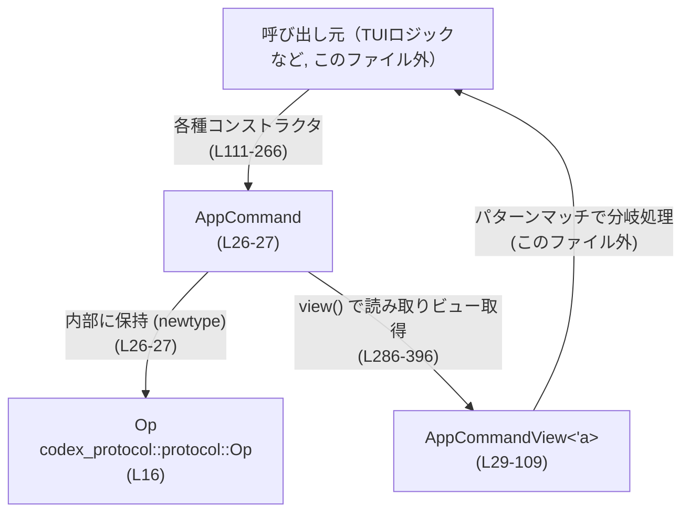
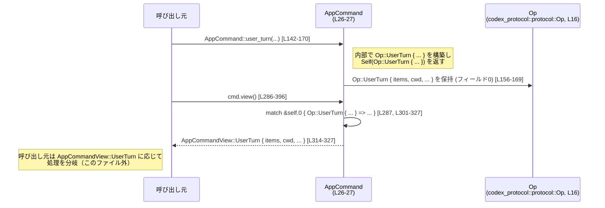

# tui/src/app_command.rs コード解説

## 0. ざっくり一言

- プロトコル層のコマンド型 `Op` をアプリケーション/TUI側で扱いやすくするための **ラッパー型 (`AppCommand`) とビュー型 (`AppCommandView`) を提供するモジュール** です（`tui/src/app_command.rs:L26-27, L29-109`）。
- 各種操作（会話開始、シェル実行、レビュー、設定変更など）ごとに便利なコンストラクタと、`Op` を安全にパターンマッチするための `view()` を定義しています（`L111-266, L286-396`）。

---

## 1. このモジュールの役割

### 1.1 概要

- このモジュールは、**外部プロトコル型 `Op` をアプリケーションコマンドとしてまとめて扱う**ために存在し、次の機能を提供します。
  - `Op` を内部に保持する新しい型 `AppCommand` の定義（`L26-27`）。
  - 各 `Op` バリアントに対応する **便利なコンストラクタ群**（`interrupt`, `user_turn` など, `L111-266`）。
  - `AppCommand` を読み取り専用ビュー `AppCommandView<'a>` に変換する `view()` による **安全な分岐処理**（`L286-396`）。
  - `Op` との相互変換 (`From` 実装) による既存コードとの橋渡し（`L399-421`）。

### 1.2 アーキテクチャ内での位置づけ

`AppCommand` はプロトコル層の `Op` と、TUIやアプリケーションロジックの間の薄いアダプタとして機能します。



- `Op` 自体は `codex_protocol::protocol` にある外部型で、このファイルではインポートのみを行い（`L16`）、直接定義はしていません。
- 呼び出し元は、`AppCommand` のコンストラクタで操作を生成し（`L111-266`）、受け取った側が `view()` → `AppCommandView` で中身を分岐する、という使い方が想定されます。

### 1.3 設計上のポイント

- **newtype ラッパー**  
  - `AppCommand` は単なる `struct AppCommand(Op);` で、状態は `Op` を 1 つ持つだけです（`L26-27`）。
- **イミュータブルな読み取り専用ビュー**  
  - `AppCommandView<'a>` はほぼすべてのフィールドを参照として持ち、`AppCommand` の所有権を崩さずに中身を観察できます（`L29-109`, `L286-396`）。
- **便利コンストラクタでの一元化**  
  - `interrupt`, `user_turn`, `review` などのメソッドが、各 `Op` バリアントの構築ロジックを一箇所に集約しています（`L111-266`）。
- **エラーハンドリング**  
  - このモジュール内には `Result` や `Option` を返す関数・`panic!`・`unwrap` などは登場せず、**データの構築と変換に専念**しています（`L111-421`）。
- **並行性**  
  - `async` 関数やスレッド関連APIは出現せず、このモジュール自体は完全に同期的な純粋データ変換コードです（`L1-421`）。
- **安全性**  
  - `unsafe` ブロックは一切使用されていません（`L1-421`）。  
  - `view()` が返す参照のライフタイム `'a` は `&self` に束縛されており、**ダングリング参照が生じない設計**になっています（`L286-396`）。

---

## 2. 主要な機能一覧（コンポーネントインベントリー概要）

このモジュールが提供する主要機能を一覧します（詳細な表は 3 章）。

- `AppCommand` 型の定義:  
  - プロトコルコマンド `Op` をラップする newtype（`L26-27`）。
- `AppCommandView<'a>` 型の定義:  
  - `AppCommand` 内部の `Op` を読み出すためのビュー enum。`Op` のバリアントにほぼ 1:1 対応（`L29-109`）。
- 各種コンストラクタ関数（`impl AppCommand` 内, `L111-266`）:
  - `interrupt`, `clean_background_terminals`, `realtime_conversation_*`, `run_user_shell_command`, `user_turn`, `override_turn_context`, `exec_approval`, `patch_approval`, `resolve_elicitation`, `user_input_answer`, `request_permissions_response`, `reload_user_config`, `list_skills`, `compact`, `set_thread_name`, `thread_rollback`, `review`。
- コアロジック:
  - `view()` による `Op` → `AppCommandView` 変換（`L286-396`）。
  - `is_review()` による簡易判定（`L282-284`）。
- `Op` との相互変換:
  - `From<Op> for AppCommand`, `From<&Op> for AppCommand`, `From<&AppCommand> for AppCommand`, `From<AppCommand> for Op`（`L399-421`）。

### 構造体・列挙体・関数インベントリー（定義位置つき）

主なコンポーネントと定義行範囲です。

#### 型

| 名前 | 種別 | 役割 / 用途 | 定義位置 |
|------|------|-------------|----------|
| `AppCommand` | 構造体 (newtype) | プロトコルコマンド `Op` をラップし、TUI内部で扱うための基本コマンド型 | `tui/src/app_command.rs:L26-27` |
| `AppCommandView<'a>` | 列挙体 | `AppCommand` 内の `Op` を読み取り専用で表現するビュー。ほぼ全ての `Op` バリアントに対応 | `tui/src/app_command.rs:L29-109` |

#### 関数（メソッド・変換含む）一覧

| 名前 | 種別 | 説明 (1 行) | 定義位置 |
|------|------|-------------|----------|
| `interrupt()` | 関連関数 | `Op::Interrupt` を持つ `AppCommand` を生成 | `L111-114` |
| `clean_background_terminals()` | 関連関数 | `Op::CleanBackgroundTerminals` を生成 | `L116-118` |
| `realtime_conversation_start(params)` | 関連関数 | リアルタイム会話開始 `Op::RealtimeConversationStart` を生成 | `L120-122` |
| `realtime_conversation_audio(params)` | 関連関数 | 音声ストリーム用 `Op::RealtimeConversationAudio` を生成 | `L124-127` |
| `realtime_conversation_text(params)` | 関連関数 | テキストストリーム用 `Op::RealtimeConversationText` を生成 | `L129-132` |
| `realtime_conversation_close()` | 関連関数 | リアルタイム会話終了 `Op::RealtimeConversationClose` を生成 | `L134-136` |
| `run_user_shell_command(command)` | 関連関数 | ユーザーのシェルコマンド実行 `Op::RunUserShellCommand` を生成 | `L138-140` |
| `user_turn(...)` | 関連関数 | 1 ターン分のユーザー入力とコンテキストをまとめた `Op::UserTurn` を生成 | `L142-170` |
| `override_turn_context(...)` | 関連関数 | 現在のターンコンテキストの一部を上書きする `Op::OverrideTurnContext` を生成 | `L172-198` |
| `exec_approval(id, turn_id, decision)` | 関連関数 | 実行許可のレビュー決定 `Op::ExecApproval` を生成 | `L201-210` |
| `patch_approval(id, decision)` | 関連関数 | パッチ適用許可のレビュー決定 `Op::PatchApproval` を生成 | `L213-215` |
| `resolve_elicitation(...)` | 関連関数 | MCP の補足情報要求(エリシテーション)への応答 `Op::ResolveElicitation` を生成 | `L217-230` |
| `user_input_answer(id, response)` | 関連関数 | `RequestUserInput` への回答 `Op::UserInputAnswer` を生成 | `L233-235` |
| `request_permissions_response(id, response)` | 関連関数 | 権限要求への回答 `Op::RequestPermissionsResponse` を生成 | `L237-241` |
| `reload_user_config()` | 関連関数 | ユーザー設定の再読み込み要求 `Op::ReloadUserConfig` を生成 | `L244-245` |
| `list_skills(cwds, force_reload)` | 関連関数 | スキル一覧の取得/再読み込み `Op::ListSkills` を生成 | `L248-250` |
| `compact()` | 関連関数 | セッション圧縮などを指示する `Op::Compact` を生成 | `L252-253` |
| `set_thread_name(name)` | 関連関数 | スレッド名の設定 `Op::SetThreadName` を生成 | `L256-257` |
| `thread_rollback(num_turns)` | 関連関数 | 直近のターンを巻き戻す `Op::ThreadRollback` を生成 | `L260-261` |
| `review(review_request)` | 関連関数 | レビュー開始 `Op::Review` を生成 | `L264-266` |
| `kind(&self)` | メソッド | 内部 `Op` の種別文字列を取得（`Op::kind()` の委譲） | `L268-271` |
| `as_core(&self)` | メソッド | 内部の `Op` への参照を取得 | `L273-276` |
| `into_core(self)` | メソッド | 所有権を消費して内部の `Op` を取り出す | `L278-280` |
| `is_review(&self)` | メソッド | コマンドがレビュー関連かどうかを `view()` 経由で判定 | `L282-284` |
| `view(&self)` | メソッド | 内部 `Op` から `AppCommandView<'_>` を構築 | `L286-396` |
| `From<Op> for AppCommand` | トレイト実装 | `Op` をそのまま `AppCommand` に包む | `L399-402` |
| `From<&Op> for AppCommand` | トレイト実装 | `&Op` をクローンして `AppCommand` に変換 | `L405-408` |
| `From<&AppCommand> for AppCommand` | トレイト実装 | `AppCommand` のクローンを作成 | `L411-414` |
| `From<AppCommand> for Op` | トレイト実装 | `AppCommand` から内部の `Op` を取り出す | `L417-420` |

---

## 3. 公開 API と詳細解説

### 3.1 型一覧（構造体・列挙体など）

| 名前 | 種別 | 役割 / 用途 | 主なフィールド / バリアント | 定義位置 |
|------|------|-------------|------------------------------|----------|
| `AppCommand` | 構造体 (タプル struct) | 1 つの `Op` を保持する newtype。`Clone`, `Debug`, `PartialEq`, `Serialize` を derive 済み | フィールド: `0: Op` | `L26-27` |
| `AppCommandView<'a>` | 列挙体 | `&AppCommand` の中身に対する読み取りビュー。`Op` とほぼ対応するバリアント群 | `Interrupt`, `UserTurn { ... }`, `OverrideTurnContext { ... }`, `Review { ... }`, など | `L29-109` |

### 3.2 関数詳細（主要 7 件）

#### `user_turn(...) -> AppCommand`

```rust
pub(crate) fn user_turn(
    items: Vec<UserInput>,
    cwd: PathBuf,
    approval_policy: AskForApproval,
    sandbox_policy: SandboxPolicy,
    model: String,
    effort: Option<ReasoningEffortConfig>,
    summary: Option<ReasoningSummaryConfig>,
    service_tier: Option<Option<ServiceTier>>,
    final_output_json_schema: Option<Value>,
    collaboration_mode: Option<CollaborationMode>,
    personality: Option<Personality>,
) -> Self { /* ... */ }
```

**概要**

- 1 回分のユーザーターン（入力と実行コンテキスト）を `Op::UserTurn` として組み立て、その `Op` を保持する `AppCommand` を返します（`L142-170`）。

**引数**

| 引数名 | 型 | 説明 |
|--------|----|------|
| `items` | `Vec<UserInput>` | ユーザーの入力アイテム群（`codex_protocol::user_input::UserInput`, `L22, L144`） |
| `cwd` | `PathBuf` | コマンド実行などのカレントディレクトリ（`L145`） |
| `approval_policy` | `AskForApproval` | 実行前の承認ポリシー（`L12, L146`） |
| `sandbox_policy` | `SandboxPolicy` | サンドボックスの動作ポリシー（`L19, L147`） |
| `model` | `String` | 使用するモデル名（`L148`） |
| `effort` | `Option<ReasoningEffortConfig>` | 推論コスト/努力度の指定（`L11, L149`） |
| `summary` | `Option<ReasoningSummaryConfig>` | 要約設定（`L7, L150`） |
| `service_tier` | `Option<Option<ServiceTier>>` | サービスタイア設定。`None` / `Some(None)` / `Some(Some(...))` の 3 状態を表現（`L8, L151`） |
| `final_output_json_schema` | `Option<Value>` | 最終出力の JSON スキーマ（`serde_json::Value`, `L24, L152`） |
| `collaboration_mode` | `Option<CollaborationMode>` | コラボレーションモード設定（`L5, L153`） |
| `personality` | `Option<Personality>` | エージェントの人格/スタイル設定（`L6, L154`） |

**戻り値**

- `AppCommand`: 内部に `Op::UserTurn { ... }` を持つコマンド（`L156-169`）。

**内部処理の流れ**

1. 引数をそのまま `Op::UserTurn { ... }` のフィールドに詰めます（`L156-169`）。
2. `approvals_reviewer` フィールドだけはこのコンストラクタでは `None` に固定されています（`L160`）。
3. 生成した `Op::UserTurn` を `Self(Op::UserTurn { ... })` で `AppCommand` として返します（`L156, L169`）。

**Errors / Panics**

- この関数内で `panic!`, `unwrap`, `?` などは使用していません（`L142-170`）。
- 引数に対する検証は行われておらず、不正な値であってもそのまま `Op` に格納されます。実際のエラーチェックは下位レイヤーまたは実行側に委ねられます。

**Edge cases（エッジケース）**

- `items` が空 (`Vec::new()`) の場合でも、そのまま `Op::UserTurn` に設定されます（`L156-158`）。
- `cwd` が存在しないパスでも、この関数ではチェックされません。
- `service_tier` の 2 重 `Option`（`Option<Option<ServiceTier>>`）により、「指定なし」「明示的に未設定」「具体的なティア指定」を区別できますが、この関数は意味解釈を行いません（`L151, L165`）。

**使用上の注意点**

- セキュリティ的には、`items` 内に含まれるコマンドやファイルパスなどは、この関数では検証されないため、**呼び出し元でバリデーションを行う必要**があります。
- `approvals_reviewer` を指定したい場合、このコンストラクタではなく、別の経路（例えば `Op` を直接構築するなど）が必要になります（`L160`）。

---

#### `override_turn_context(...) -> AppCommand`

**概要**

- 既存のターンコンテキストの一部（`cwd`, `approval_policy`, モデルなど）をオプションで上書きする `Op::OverrideTurnContext` を構築します（`L172-198`）。

**引数**

すべて `Option<...>` で、「`Some(value)` のときだけ上書き」という意味になります。

| 引数名 | 型 | 説明 |
|--------|----|------|
| `cwd` | `Option<PathBuf>` | カレントディレクトリの上書き（`L174`） |
| `approval_policy` | `Option<AskForApproval>` | 承認ポリシーの上書き（`L175`） |
| `approvals_reviewer` | `Option<ApprovalsReviewer>` | レビュアー設定（`L3, L176`） |
| `sandbox_policy` | `Option<SandboxPolicy>` | サンドボックスポリシーの上書き（`L177`） |
| `windows_sandbox_level` | `Option<WindowsSandboxLevel>` | Windows 用サンドボックスレベル（`L9, L178`） |
| `model` | `Option<String>` | モデル名の上書き（`L179`） |
| `effort` | `Option<Option<ReasoningEffortConfig>>` | 推論コスト設定（3 状態表現）（`L180`） |
| `summary` | `Option<ReasoningSummaryConfig>` | 要約設定（`L181`） |
| `service_tier` | `Option<Option<ServiceTier>>` | サービスタイア設定（3 状態表現）（`L182`） |
| `collaboration_mode` | `Option<CollaborationMode>` | コラボモード（`L183`） |
| `personality` | `Option<Personality>` | 人格設定（`L184`） |

**戻り値**

- `AppCommand`: 内部に `Op::OverrideTurnContext { ... }` を持ちます（`L186-197`）。

**内部処理の流れ**

1. 全ての引数を `Op::OverrideTurnContext { ... }` にそのまま代入します（`L186-197`）。
2. 生成した `Op` を `Self(...)` で `AppCommand` にラップします（`L186-198`）。

**Errors / Panics**

- ここでも検証やパニックは一切ありません（`L172-198`）。
- `Option<Option<...>>` のネストに対する一貫性チェックも行っていません。

**Edge cases**

- すべての引数が `None` の場合でも、`Op::OverrideTurnContext` は生成されます。この場合の意味（何も変えない更新要求）は `Op` の処理側に依存します（`L186-197`）。
- `effort`, `service_tier` の 2 重 `Option` は、未指定 / 明示的な「なし」/ 具体的指定の 3 状態を表現できますが、この関数はその意味を解釈しません。

**使用上の注意点**

- 「上書きしない」状態を正しく表現するため、`None` と `Some(None)` の区別を意識する必要があります（`L180, L182`）。
- 呼び出し側で「必須項目が `None` になっていないか」をチェックしないと、意図しないコンテキスト変更になる可能性があります。

---

#### `view(&self) -> AppCommandView<'_>`

**概要**

- 内部に保持している `Op` を参照し、そのバリアントごとに `AppCommandView<'_>` の対応するバリアントを返します（`L286-396`）。
- これにより、呼び出し側は `AppCommand` を所有権移動させずにパターンマッチできます。

**引数**

| 引数名 | 型 | 説明 |
|--------|----|------|
| `&self` | `&AppCommand` | 対象コマンド |

**戻り値**

- `AppCommandView<'_>`: `Op` の内容への参照またはコピーを含む列挙体。ライフタイム `'_'` は `&self` に束縛されます（`L286`）。

**内部処理の流れ**

1. `match &self.0 { ... }` で `Op` の値を参照でパターンマッチします（`L287`）。
2. 各 `Op` バリアントごとに対応する `AppCommandView` バリアントを作成します。
   - 例: `Op::Interrupt` → `AppCommandView::Interrupt`（`L288`）。
   - 例: `Op::UserTurn { ... }` → `AppCommandView::UserTurn { ... }`（`L301-327`）。
3. `UserTurn` の `approval_policy` や `effort`、`ListSkills` の `force_reload`、`ThreadRollback` の `num_turns` など、一部のフィールドは参照から値にコピーされています（`L317, L321, L385, L391`）。
4. `Op` に列挙されていないバリアント（将来追加されたものなど）はフォールバックとして `AppCommandView::Other(op)` で表現されます（`L393-394`）。

**Errors / Panics**

- マッチは網羅的であり（`match &self.0 { ... op => AppCommandView::Other(op) }`、`L287-395`）、パニック要素はありません。
- いくつかのフィールドコピーは `*` 演算子で行われており、該当型に `Copy` が実装されている前提ですが、これはコンパイル時に検証されるため実行時エラーにはなりません（`L317, L321, L385, L391`）。

**Edge cases**

- `Op` に新しいバリアントが追加され、この `match` で個別ケースが書かれていない場合でも、最後の `op => AppCommandView::Other(op)` で拾われます（`L393-394`）。  
  ⇒ 呼び出し側が `AppCommandView::Other` をハンドリングしていれば、クラッシュせずに動作します。
- 各ビューのフィールドは基本的に参照のまま渡されるため、`AppCommand` の寿命を超えて `AppCommandView` を保持しようとするとコンパイルエラーになります（ライフタイム `'a` により防止, `L29, L286`）。

**使用上の注意点**

- `view()` の戻り値に対して `match` する際は、`AppCommandView::Other(_)` を忘れずに扱うと将来の拡張に強くなります（`L393-394`）。
- `approval_policy` など一部フィールドはコピーされるため、非常に大きな値を格納する設計には向いていません。ただし、現状このファイルには大きな構造体のコピーは見当たりません（`L317, L321`）。

---

#### `run_user_shell_command(command: String) -> AppCommand`

**概要**

- 任意のシェルコマンド文字列を `Op::RunUserShellCommand { command }` としてラップします（`L138-140`）。

**引数**

| 引数名 | 型 | 説明 |
|--------|----|------|
| `command` | `String` | 実行したいシェルコマンド文字列 |

**戻り値**

- `AppCommand`: 内部に `Op::RunUserShellCommand { command }` を持ちます（`L138-140`）。

**内部処理**

- 渡された `command` をそのまま `Op::RunUserShellCommand { command }` に詰めるだけの薄いラッパーです（`L139`）。

**Errors / Panics**

- パニックや検証はありません。

**Edge cases**

- 空文字列や非常に長いコマンドでも、この関数では拒否されずに通ります。

**使用上の注意点**

- **セキュリティ**: コマンドインジェクション・危険なオプションなどのチェックは一切行わないため、呼び出し元で必ずバリデーションを行う必要があります。

---

#### `exec_approval(id: String, turn_id: Option<String>, decision: ReviewDecision) -> AppCommand`

**概要**

- 実行許可に関するレビュー決定 `Op::ExecApproval` を表す `AppCommand` を構築します（`L201-210`）。

**引数**

| 引数名 | 型 | 説明 |
|--------|----|------|
| `id` | `String` | 対象レビュー/アクションの識別子（`L202`） |
| `turn_id` | `Option<String>` | 関連するターン ID（存在しない場合は `None`, `L203`） |
| `decision` | `ReviewDecision` | 許可/拒否などの決定内容（`L17, L204`） |

**戻り値**

- `AppCommand` (`Op::ExecApproval { ... }` を保持, `L206-210`)

**Errors / Panics / Edge cases**

- 特になし（値をそのままフィールドに詰めるだけ, `L206-210`）。

**使用上の注意点**

- `id` や `turn_id` の整合性（既存ターンに紐づくかどうか）をこの関数はチェックしません。上位レイヤーで扱う契約になります。

---

#### `list_skills(cwds: Vec<PathBuf>, force_reload: bool) -> AppCommand`

**概要**

- スキル探索の対象ディレクトリ群と再読み込みフラグから `Op::ListSkills` を構築します（`L248-250`）。

**引数**

| 引数名 | 型 | 説明 |
|--------|----|------|
| `cwds` | `Vec<PathBuf>` | スキル探索対象のディレクトリ一覧（`L248`） |
| `force_reload` | `bool` | キャッシュを無視して強制再読み込みするかどうか（`L248`） |

**戻り値**

- `AppCommand` (`Op::ListSkills { cwds, force_reload }` を保持, `L248-250`)

**内部処理**

- 引数をそのままフィールドに詰めて `Self(Op::ListSkills { ... })` を返します（`L248-250`）。

**Edge cases / 注意点**

- `cwds` が空の場合の扱い（例: 「すべてのデフォルトパスを対象にする」など）は、このモジュールでは決めていません。
- 大量のパスを渡すと後段の I/O 負荷が増えますが、この関数自体は非同期/同期を含め I/O を行っていません。

---

#### `is_review(&self) -> bool`

**概要**

- 内部の `Op` がレビュー関連 (`Op::Review`) かどうかを、`view()` の結果で判定します（`L282-284`）。

**引数 / 戻り値**

- 引数: `&self`
- 戻り値: `bool` (`true` の場合 `AppCommandView::Review { .. }` であることを意味)

**内部処理**

1. `self.view()` を呼び出して `AppCommandView` を取得（`L283`）。
2. `matches!(..., AppCommandView::Review { .. })` でパターンマッチし、結果を返します（`L283`）。

**Errors / Panics / 注意点**

- `view()` も `is_review()` もパニックしません。
- `AppCommandView::Other` でラップされた未対応の `Op` バリアントは、ここでは `false` となります（`L283, L393-394`）。

---

### 3.3 その他の関数

上記以外の関数・トレイト実装を一覧でまとめます。

| 関数名 / 実装 | 役割（1 行） | 定義位置 |
|---------------|--------------|----------|
| `interrupt()` | `Op::Interrupt` を生成するシンプルなコンストラクタ | `L111-114` |
| `clean_background_terminals()` | バックグラウンドターミナルのクリーンアップコマンドを生成 | `L116-118` |
| `realtime_conversation_start(params)` | 会話の開始パラメータをラップ | `L120-122` |
| `realtime_conversation_audio(params)` | リアルタイム音声ストリーム用コマンド生成 | `L124-127` |
| `realtime_conversation_text(params)` | リアルタイムテキストストリーム用コマンド生成 | `L129-132` |
| `realtime_conversation_close()` | リアルタイム会話終了コマンド生成 | `L134-136` |
| `patch_approval(id, decision)` | パッチ承認レビューコマンド生成 | `L213-215` |
| `resolve_elicitation(...)` | MCP エリシテーションへの応答コマンド生成 | `L217-230` |
| `user_input_answer(id, response)` | ユーザー入力要求への回答コマンド生成 | `L233-235` |
| `request_permissions_response(id, response)` | 権限要求への回答コマンド生成 | `L237-241` |
| `reload_user_config()` | ユーザー設定再読み込みコマンド生成 | `L244-245` |
| `compact()` | Compact 操作（ログ圧縮など）を指示するコマンド生成 | `L252-253` |
| `set_thread_name(name)` | スレッド名セットコマンド生成 | `L256-257` |
| `thread_rollback(num_turns)` | ターンを巻き戻すコマンド生成 | `L260-261` |
| `review(review_request)` | レビューセッション開始コマンド生成 | `L264-266` |
| `kind(&self)` | 内部 `Op` の種別文字列を返す（`Op::kind()` への委譲） | `L268-271` |
| `as_core(&self)` | 内部 `Op` への参照を返す | `L273-276` |
| `into_core(self)` | `AppCommand` の所有権を消費して `Op` に戻す | `L278-280` |
| `From<Op> for AppCommand` | `Op` → `AppCommand` の変換 | `L399-402` |
| `From<&Op> for AppCommand` | `&Op` を clone して `AppCommand` へ | `L405-408` |
| `From<&AppCommand> for AppCommand` | `AppCommand` の clone を生成 | `L411-414` |
| `From<AppCommand> for Op` | `AppCommand` → `Op` の逆変換 | `L417-420` |

---

## 4. データフロー

ここでは代表的なシナリオとして、「ユーザーターンの生成と処理分岐」の流れを示します。

1. 呼び出し元が `AppCommand::user_turn(...)` を使ってコマンドを生成（`L142-170`）。
2. 生成された `AppCommand` がどこかに渡される（キューやハンドラなど。このファイル外）。
3. 受け取った側が `cmd.view()` を呼び、`AppCommandView::UserTurn { ... }` に基づいて処理を分岐（`L286-327`）。



- このフローにおいて、`AppCommand` の中身は常に所有権付きの `Op` ですが、`view()` が返すのは **参照ベースのビュー** なので、コピーコストを最小化しつつ分岐できます（`L286-396`）。

---

## 5. 使い方（How to Use）

### 5.1 基本的な使用方法

`AppCommand` を生成して `view()` で分岐する、最小構成の例です。

```rust
use std::path::PathBuf;
use serde_json::json;

use codex_protocol::protocol::{AskForApproval, SandboxPolicy, ReviewRequest};
use codex_protocol::user_input::UserInput;
use crate::app_command::{AppCommand, AppCommandView}; // ファイルパスから推定

fn handle_command(cmd: &AppCommand) {
    match cmd.view() {                                        // AppCommandView を取得 (L286-396)
        AppCommandView::RunUserShellCommand { command } => {
            // ここでコマンド文字列を検証してから実行するなど
            println!("run shell: {command}");
        }
        AppCommandView::UserTurn { items, cwd, .. } => {
            println!("{} items from cwd {:?}", items.len(), cwd);
        }
        AppCommandView::Review { review_request } => {
            println!("review: {:?}", review_request);
        }
        AppCommandView::Other(_) => {
            // 未対応のコマンドに対するフォールバック処理
        }
        _ => {}
    }
}

fn example() {
    // 仮のユーザー入力・コンテキスト
    let items: Vec<UserInput> = Vec::new();                   // 実際には適切な UserInput を作成
    let cwd = PathBuf::from(".");
    let cmd = AppCommand::user_turn(
        items,
        cwd,
        AskForApproval::default(),                            // 仮: Default 実装があると仮定（コードからは不明）
        SandboxPolicy::default(),                             // 同上
        "gpt-4.1".to_string(),
        None,
        None,
        None,
        Some(json!({"type": "object"})),
        None,
        None,
    );

    handle_command(&cmd);
}
```

> `AskForApproval::default()` などの存在有無はこのチャンクには出てこないため、「あると仮定した例」です。この点はコードからは断定できません。

### 5.2 よくある使用パターン

1. **軽量な種別判定**

```rust
fn is_review_flow(cmd: &AppCommand) -> bool {
    cmd.is_review()                                          // view().matches!(Review { .. }) (L282-284)
}
```

1. **シェルコマンドのラップ**

```rust
fn build_shell_cmd(raw: &str) -> AppCommand {
    // ここで raw をバリデートしてから渡すのが安全
    AppCommand::run_user_shell_command(raw.to_string())      // L138-140
}
```

### 5.3 よくある間違い

```rust
use crate::app_command::{AppCommand, AppCommandView};

// 誤り例: AppCommand を直接 Op としてマッチしようとしている
fn wrong(cmd: &AppCommand) {
    // コンパイルエラー: cmd は AppCommand であり、Op ではない
    // match cmd {
    //     Op::Interrupt => { /* ... */ }
    // }
}

// 正しい例: view() で AppCommandView に変換してからマッチ
fn correct(cmd: &AppCommand) {
    match cmd.view() {                                       // L286-396
        AppCommandView::Interrupt => { /* ... */ }
        AppCommandView::Other(_) => { /* フォールバック */ }
        _ => {}
    }
}
```

### 5.4 使用上の注意点（まとめ）

- **前提条件**
  - このモジュールはデータの構築のみを行い、**バリデーションや権限チェックを行いません**（例: `run_user_shell_command`, `user_turn`, `list_skills`, `L138-140, L142-170, L248-250`）。
- **セキュリティ**
  - シェルコマンドやファイルパスなど、外部環境に影響する値は呼び出し元で必ず検証する必要があります。
- **拡張性**
  - `view()` の `Other(&Op)` 分岐により、`Op` に新しいバリアントが追加されても最低限の互換性が保たれますが、より良い UX のためには新しいバリアントに対する `AppCommandView` の追加が望ましいです（`L393-394`）。
- **並行性**
  - このモジュールはスレッドや async を扱っていません。`AppCommand` が `Send` / `Sync` かどうかは内部の `Op` の実装に依存し、このチャンクからは判断できません。
- **パフォーマンス**
  - `view()` は主に参照を渡すため軽量ですが、一部フィールド（`approval_policy`, `effort`, `force_reload`, `num_turns`）はコピーされます（`L317, L321, L385, L391`）。これらの型が軽量である前提の設計です。

---

## 6. 変更の仕方（How to Modify）

### 6.1 新しい機能を追加する場合

「`Op` に新しいバリアントが追加された場合」を想定します。

1. **`AppCommandView` にバリアントを追加**  
   - 例: `NewFeature { ... }` のようなバリアントを `AppCommandView<'a>` に追加（`L29-109`）。
2. **`view()` の `match` に分岐を追加**  
   - `match &self.0 { ... }`（`L287-395`）に `Op::NewFeature { ... } => AppCommandView::NewFeature { ... }` を追加。
3. **必要ならコンストラクタを追加**
   - `impl AppCommand` ブロック内に `pub(crate) fn new_feature(...) -> Self { Self(Op::NewFeature { ... }) }` を追加（`L111-266` のパターンに倣う）。
4. **呼び出し元側の `match` 更新**
   - `AppCommandView` に対する `match` で、新しいバリアントをハンドルするよう変更（このファイル外）。

### 6.2 既存の機能を変更する場合

- **影響範囲の確認**
  - 該当するコンストラクタ関数と、`view()` 内の該当バリアント分岐が主な変更箇所です（例: `UserTurn` なら `L142-170` と `L301-327`）。
- **契約を守るべき点**
  - `view()` は **所有権を移動しないビュー** を提供するという前提があるため、フィールドの型を変更するときは、`AppCommandView` 側の型とライフタイムも揃える必要があります。
  - `Option<Option<...>>` のような 3 状態表現を別の表現に変える場合、呼び出し側との契約が変わるため注意が必要です（`L151, L180-182`）。
- **テスト**
  - このチャンクにはテストコードは含まれていません（`L1-421`）。  
    変更時は、外部のテスト（プロトコルレベル、TUI レベル）で `AppCommand` と `AppCommandView` の組み合わせが期待通り動作するかを確認する必要があります。

---

## 7. 関連ファイル

このモジュールと密接に関係する型は、すべて外部クレートからインポートされています。

| パス / 型 | 役割 / 関係 | 根拠 |
|-----------|------------|------|
| `codex_protocol::protocol::Op` | コアとなるプロトコルコマンド列挙体。`AppCommand` がこれをラップし、`view()` で分岐対象として使用 | `tui/src/app_command.rs:L16, L26-27, L286-396` |
| `codex_protocol::protocol::{AskForApproval, SandboxPolicy, ReviewDecision, ReviewRequest}` | ユーザー承認ポリシー、サンドボックス設定、レビュー関連の型。`user_turn`, `override_turn_context`, `exec_approval`, `review` などで利用 | `L12, L17-18, L19, L146-147, L175, L201-205, L264-266` |
| `codex_protocol::config_types::{CollaborationMode, Personality, ReasoningSummary as ReasoningSummaryConfig, ServiceTier, WindowsSandboxLevel}` | モデル動作や UI の性格付けなどの設定値。ターン文脈の構築や上書きに利用 | `L5-9, L7, L41-53, L55-66, L149-154, L172-184` |
| `codex_protocol::openai_models::ReasoningEffort as ReasoningEffortConfig` | 推論コスト指定。`user_turn` と `override_turn_context` で利用 | `L11, L48-49, L149-150, L180` |
| `codex_config::types::ApprovalsReviewer` | 承認レビュアー設定。`AppCommandView::UserTurn` / `OverrideTurnContext` で参照として扱われる | `L3, L45-46, L58-59, L176` |
| `codex_protocol::user_input::UserInput` | ユーザー入力項目。`UserTurn` の要素として使用 | `L22, L41-42, L144` |
| `codex_protocol::request_user_input::RequestUserInputResponse` | ユーザー入力要求への応答。`UserInputAnswer` バリアントに使用 | `L21, L84-87, L233-235` |
| `codex_protocol::request_permissions::RequestPermissionsResponse` | 権限要求への応答。`RequestPermissionsResponse` バリアントに使用 | `L20, L88-91, L237-241` |
| `codex_protocol::approvals::ElicitationAction` | エリシテーション（追加情報要求）のアクション種別。`ResolveElicitation` バリアントで利用 | `L4, L77-82, L218-221` |
| `codex_protocol::mcp::RequestId as McpRequestId` | MCP リクエスト ID。`ResolveElicitation` バリアントで利用 | `L10, L79-80, L219-220` |

---

### Bugs / Security / Contracts についての補足（モジュール全体）

- **明示的なバグはコードからは確認できません**。関数はすべて値を `Op` に詰めるだけで、複雑なロジックや状態遷移は行っていません（`L111-266`）。
- **セキュリティ観点**
  - このモジュール自体は実行を行わず、あくまでコマンド構築のみですが、`run_user_shell_command` など外部環境に影響しうる値をラップする関数は、**呼び出し元での入力検証が必須**です（`L138-140`）。
- **Contracts / Edge Cases**
  - 「検証しない・パニックしない」というのがこのモジュールの暗黙の契約です。  
    したがって、「入力の妥当性は呼び出し元またはプロトコル処理層で保証する」設計になっていると解釈できます（`L111-266`）。
- **Observability**
  - ログ出力やメトリクス計測は一切行っていません（`L1-421`）。  
    挙動を観測するには、`AppCommand` を生成/消費する側でログを挿入する必要があります。
