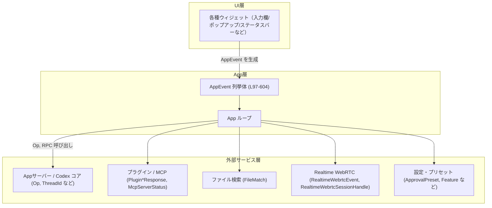
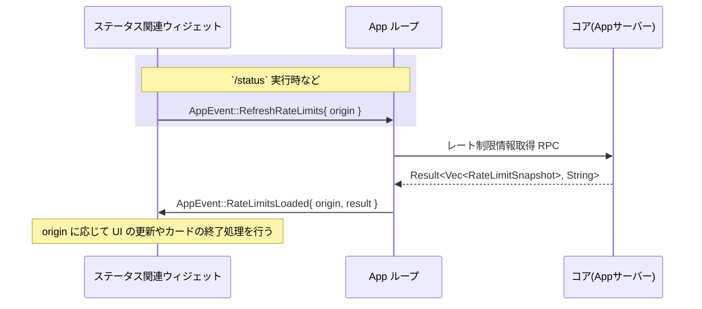
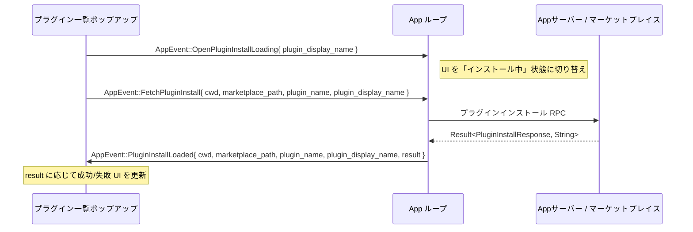
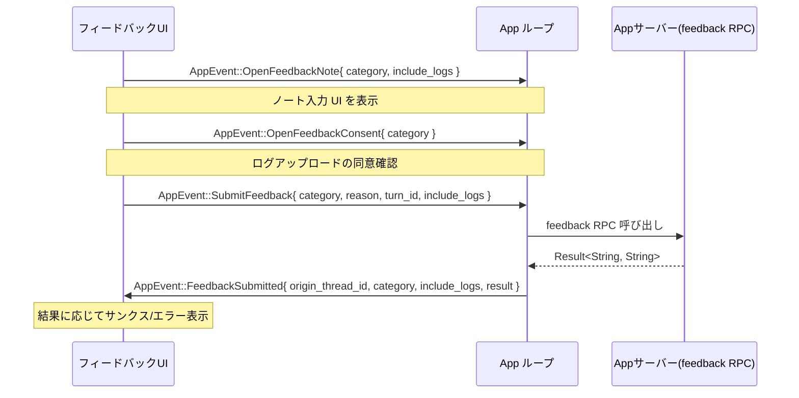

# tui/src/app_event.rs コード解説

## 0. ざっくり一言

このファイルは、TUI 全体で共有される「アプリケーション内部イベントバス」を定義するモジュールです。  
`AppEvent` 列挙体と、それを補助するいくつかの小さな列挙体・構造体が定義されており、UI ウィジェットとトップレベル `App` ループの間でやり取りされるメッセージの型を表現します（tui/src/app_event.rs:L1-9,97-604）。

---

## 1. このモジュールの役割

### 1.1 概要

- モジュール先頭のコメントにあるように、`AppEvent` は UI コンポーネントとトップレベル `App` ループの間の内部メッセージバスとして機能します（tui/src/app_event.rs:L1-9）。
- 各ウィジェットは、アプリ層で処理すべき操作（ピッカーのオープン、設定保存、エージェント終了など）を直接 `App` の内部構造に触れずに要求するために、対応する `AppEvent` を発行します（tui/src/app_event.rs:L3-7,97-604）。
- アプリ終了は `AppEvent::Exit(ExitMode)` で明示的に表現され、UI 側から「シャットダウンを先に実行してから終了する」などの終了戦略を指定できます（tui/src/app_event.rs:L8-9,612-626）。

### 1.2 アーキテクチャ内での位置づけ

このモジュールは、TUI 内のさまざまなコンポーネントを疎結合に結ぶハブとして位置づけられます。

- **送信側（主に UI ウィジェット）**  
  - 下部ペイン（`ApprovalRequest`, `StatusLineItem`, `TerminalTitleItem`）などの UI コンポーネントが、ユーザー操作に応じて `AppEvent` を生成します（tui/src/app_event.rs:L29-31,97-604）。
- **受信側（トップレベル `App` ループ）**  
  - メインのイベントループが `AppEvent` を受け取り、コアロジック（サーバー RPC 呼び出し、ファイル検索、プラグイン操作、設定の永続化など）を実行します。
- **外部サービスとの橋渡し**  
  - App サーバー・OpenAI モデル・MCP/プラグイン・WebRTC などの外部コンポーネントに対するリクエスト/レスポンスも `AppEvent` 経由で表現されます（tui/src/app_event.rs:L13-27,42-43,97-604）。

代表的な依存関係を Mermaid 図で表すと、次のような構造になります（AppEvent 定義: tui/src/app_event.rs:L97-604）:



### 1.3 設計上のポイント

コードから読み取れる主な設計上の特徴は次の通りです。

- **単一の大きなイベント列挙体**  
  - `AppEvent` は非常に多くのバリアントを持つため、`#[allow(clippy::large_enum_variant)]` で警告を抑制しています（tui/src/app_event.rs:L97-99）。  
    → イベントの種類を 1 つの型で網羅し、`match` による網羅的な分岐を可能にする設計です。

- **型付きペイロードによる安全性**  
  - スレッド ID (`ThreadId`)、操作 (`Op`)、検索結果 (`Vec<FileMatch>`)、レート制限スナップショット (`Vec<RateLimitSnapshot>`)、各種レスポンス (`Plugin*Response`, `McpServerStatus` など) がバリアントのフィールドとして埋め込まれています（tui/src/app_event.rs:L103-115,157-160,169-171,210-212,250-256,266-271,285-287）。  
    → 文字列ベースのメッセージではなく、コンパイル時に整合性が保証される Rust の型を使ってやり取りしています。

- **結果イベントは `Result` で成功/失敗を表現**  
  - 非同期処理の結果イベント（`RateLimitsLoaded`, `ConnectorsLoaded`, `PluginsLoaded`, `PluginInstallLoaded`, `PluginUninstallLoaded`, `McpInventoryLoaded`, `FeedbackSubmitted`, `RealtimeWebrtcOfferCreated` など）は `Result<成功型, String>` を保持し、成功・失敗を明示的に区別します（tui/src/app_event.rs:L169-171,175-177,210-212,250-256,266-271,285-287,351-352,567-572）。
  - エラー側は `String` であり、詳細な型付けエラーではなく、メッセージとして扱う設計です。

- **状態更新イベントと永続化イベントの分離**  
  - モデルや推論設定などについて、「メモリ上の状態を更新するイベント」（例: `UpdateModel`, `UpdateReasoningEffort`, `UpdatePlanModeReasoningEffort`）と、「設定ファイルに永続化するイベント」（例: `PersistModelSelection`, `PersistPlanModeReasoningEffort`）が分離されています（tui/src/app_event.rs:L304-330,468-483）。
  - これにより、UI の即時反映と設定の保存タイミングを明確に分けています。

- **プラットフォーム依存コードの条件付きコンパイル**  
  - Windows サンドボックス関連イベントや Linux 固有のイベントなどは `#[cfg_attr(..., allow(dead_code))]` でプラットフォーム差を吸収しています（tui/src/app_event.rs:L67-72,74-78,382-439,421-432,491-492,462-463,475-476）。

- **所有権・並行性の観点**  
  - このファイル内には `unsafe` や明示的な同期原語（`Mutex`, `Arc` など）は登場せず、すべて「所有権付きの値」や `Box<dyn HistoryCell>` を持つだけの純粋なデータ型です（tui/src/app_event.rs:L45-78,97-604,606-610,618-626,628-635）。
  - `AppEvent` が実際にスレッド間で送られるかどうかは、このチャンクには記述がなく不明ですが、少なくともここでは「スレッドセーフな共有の仕組み」ではなく「イベントの型付け」が責務になっています。

---

## 2. 主要な機能一覧

`AppEvent` のバリアントを機能グループごとに概観します（すべて tui/src/app_event.rs:L97-604）。

- **スレッド / セッション管理**
  - `OpenAgentPicker`, `SelectAgentThread`, `SubmitThreadOp`, `ThreadHistoryEntryResponse`
  - `NewSession`, `ClearUi`, `OpenResumePicker`, `ResumeSessionByIdOrName`, `ForkCurrentSession`
  - `ApplyThreadRollback`, `InsertHistoryCell`
- **アプリ終了 / エラー**
  - `Exit(ExitMode)`, `FatalExitRequest`
- **ファイル検索 / 差分**
  - `StartFileSearch`, `FileSearchResult`, `DiffResult`
- **レート制限・ステータス**
  - `RefreshRateLimits`, `RateLimitsLoaded`, `UpdateRateLimitSwitchPromptHidden`, `PersistRateLimitSwitchPromptHidden`
- **コネクタ / プラグイン / MCP**
  - `RefreshConnectors`, `ConnectorsLoaded`, `FetchPluginsList`, `PluginsLoaded`
  - `OpenPluginDetailLoading`, `FetchPluginDetail`, `PluginDetailLoaded`
  - `OpenPluginInstallLoading`, `OpenPluginUninstallLoading`
  - `FetchPluginInstall`, `PluginInstallLoaded`
  - `FetchPluginUninstall`, `PluginUninstallLoaded`
  - `PluginInstallAuthAdvance`, `PluginInstallAuthAbandon`
  - `FetchMcpInventory`, `McpInventoryLoaded`
- **モデル・推論・サービス設定**
  - `OpenReasoningPopup`, `OpenPlanReasoningScopePrompt`, `OpenAllModelsPopup`
  - `UpdateReasoningEffort`, `UpdateModel`, `UpdateCollaborationMode`, `UpdatePersonality`
  - `UpdatePlanModeReasoningEffort`
  - `PersistModelSelection`, `PersistPersonalitySelection`, `PersistServiceTierSelection`, `PersistPlanModeReasoningEffort`
  - `PersistModelMigrationPromptAcknowledged`
- **権限・サンドボックス / フルアクセス / Windows**
  - `OpenFullAccessConfirmation`, `UpdateFullAccessWarningAcknowledged`, `PersistFullAccessWarningAcknowledged`
  - `OpenWorldWritableWarningConfirmation`, `UpdateWorldWritableWarningAcknowledged`, `PersistWorldWritableWarningAcknowledged`, `SkipNextWorldWritableScan`
  - `OpenWindowsSandboxEnablePrompt`, `OpenWindowsSandboxFallbackPrompt`
  - `BeginWindowsSandboxElevatedSetup`, `BeginWindowsSandboxLegacySetup`
  - `BeginWindowsSandboxGrantReadRoot`, `WindowsSandboxGrantReadRootCompleted`
  - `EnableWindowsSandboxForAgentMode`
  - `UpdateAskForApprovalPolicy`, `UpdateSandboxPolicy`, `UpdateApprovalsReviewer`
- **リアルタイム音声 / WebRTC**
  - `OpenRealtimeAudioDeviceSelection`, `PersistRealtimeAudioDeviceSelection`, `RestartRealtimeAudioDevice`
  - `RealtimeWebrtcOfferCreated`, `RealtimeWebrtcEvent`, `RealtimeWebrtcLocalAudioLevel`
- **承認プリセット / スキル / アプリ**
  - `OpenApprovalsPopup`, `OpenPermissionsPopup`
  - `OpenSkillsList`, `OpenManageSkillsPopup`, `SetSkillEnabled`, `SetAppEnabled`, `ManageSkillsClosed`
- **フィーチャーフラグ / 警告フラグ**
  - `UpdateFeatureFlags`, `UpdateFullAccessWarningAcknowledged`, `UpdateWorldWritableWarningAcknowledged`, `UpdateRateLimitSwitchPromptHidden`
- **フィードバック / 評価**
  - `OpenFeedbackNote`, `OpenFeedbackConsent`, `SubmitFeedback`, `FeedbackSubmitted`
  - 補助的に `FeedbackCategory` 列挙体を利用（tui/src/app_event.rs:L628-635）。
- **ステータスライン / ターミナルタイトル / テーマ**
  - `StatusLineBranchUpdated`, `StatusLineSetup`, `StatusLineSetupCancelled`
  - `TerminalTitleSetup`, `TerminalTitleSetupPreview`, `TerminalTitleSetupCancelled`
  - `SyntaxThemeSelected`
- **その他 UI 操作**
  - `OpenAppLink`, `OpenUrlInBrowser`
  - `CodexOp`, `LaunchExternalEditor`
  - レビュー・ブランチ/コミット/カスタムプロンプト関連:  
    `OpenReviewBranchPicker`, `OpenReviewCommitPicker`, `OpenReviewCustomPrompt`
  - 協調モード付き送信: `SubmitUserMessageWithMode`
  - フルスクリーン承認: `FullScreenApprovalRequest`
  - 音声録音メーター（非 Linux）: `UpdateRecordingMeter`
- **リアルタイムデバイスの種類・レート制限起因など補助型**
  - `RealtimeAudioDeviceKind`, `RateLimitRefreshOrigin`, `ExitMode`, `FeedbackCategory` など（tui/src/app_event.rs:L45-49,80-95,618-626,628-635）。

---

## 3. 公開 API と詳細解説

### 3.1 型一覧（構造体・列挙体など）

このファイルで定義されている主な型の一覧です。

| 名前 | 種別 | 役割 / 用途 | 定義位置 |
|------|------|-------------|----------|
| `RealtimeAudioDeviceKind` | enum | リアルタイム音声デバイスの種別（マイク／スピーカー）を区別するための列挙体です。UI のデバイスピッカーや設定更新イベントで利用されます。 | tui/src/app_event.rs:L45-49 |
| `WindowsSandboxEnableMode` | enum | Windows 版でのサンドボックス機能の有効化モード（昇格/elevated or legacy）の区別に使用される列挙体です（条件付きコンパイル対象）。 | tui/src/app_event.rs:L67-72 |
| `ConnectorsSnapshot` | struct | App コネクタ一覧のスナップショットを保持する構造体で、`Vec<AppInfo>` をラップします（条件付きコンパイル対象）。 | tui/src/app_event.rs:L74-78 |
| `RateLimitRefreshOrigin` | enum | レート制限情報更新の発火元を区別する列挙体です。`StartupPrefetch` と `/status` コマンドからの `StatusCommand { request_id }` を区別します。 | tui/src/app_event.rs:L80-95 |
| `AppEvent` | enum | このモジュールの中心となる列挙体で、UI と App ループ間のあらゆるアプリケーションレベルのイベントを表現します。各バリアントはドメイン型付きのペイロードを持つことがあります。 | tui/src/app_event.rs:L97-604 |
| `RealtimeWebrtcOffer` | struct | TUI が所有する WebRTC セッションにおける offer SDP とセッションハンドルをまとめた構造体です。`RealtimeWebrtcOfferCreated` イベントのペイロードとして利用されます。 | tui/src/app_event.rs:L606-610 |
| `ExitMode` | enum | アプリ終了の戦略（`ShutdownFirst` / `Immediate`）を表現する列挙体で、`AppEvent::Exit` のペイロードとして使われます。 | tui/src/app_event.rs:L612-626 |
| `FeedbackCategory` | enum | フィードバックのカテゴリ（`BadResult`, `GoodResult`, `Bug`, `SafetyCheck`, `Other`）を表す列挙体で、フィードバック関連イベントで使用されます。 | tui/src/app_event.rs:L628-635 |

#### `AppEvent` バリアントのグルーピング（抜粋）

バリアントが多いため、代表的なグループごとの概要を示します（行範囲はグループの開始〜終了付近）。

| グループ | 主なバリアント | 説明 | 定義位置（目安） |
|---------|----------------|------|-------------------|
| スレッド/セッション | `OpenAgentPicker`, `SelectAgentThread`, `SubmitThreadOp`, `ThreadHistoryEntryResponse`, `NewSession`, `ClearUi`, `OpenResumePicker`, `ResumeSessionByIdOrName`, `ForkCurrentSession`, `ApplyThreadRollback`, `InsertHistoryCell` | スレッドの切り替え、新規セッション開始、UI クリア、履歴レスポンス、ロールバックなどを扱います。 | tui/src/app_event.rs:L100-132,L289-298 |
| 終了関連 | `Exit(ExitMode)`, `FatalExitRequest` | ユーザーまたは致命的エラーによるアプリ終了要求を表します。 | tui/src/app_event.rs:L133-143 |
| ファイル検索/差分 | `StartFileSearch`, `FileSearchResult`, `DiffResult` | 非同期ファイル検索の開始と結果、および `/diff` コマンドの結果を表します。 | tui/src/app_event.rs:L149-160,L179-180 |
| レート制限 | `RefreshRateLimits`, `RateLimitsLoaded`, `UpdateRateLimitSwitchPromptHidden`, `PersistRateLimitSwitchPromptHidden` | レート制限情報のバックグラウンド更新と結果、レート制限切り替えプロンプトの表示制御と永続化を扱います。 | tui/src/app_event.rs:L162-171,L465-467,L478-479 |
| コネクタ/プラグイン | `RefreshConnectors`, `ConnectorsLoaded`, `FetchPluginsList`, `PluginsLoaded`, `OpenPluginDetailLoading`, `FetchPluginDetail`, `PluginDetailLoaded`, `OpenPluginInstallLoading`, `OpenPluginUninstallLoading`, `FetchPluginInstall`, `PluginInstallLoaded`, `FetchPluginUninstall`, `PluginUninstallLoaded`, `PluginInstallAuthAdvance`, `PluginInstallAuthAbandon` | コネクタやプラグインの一覧取得・詳細取得・インストール/アンインストール・ポップアップ状態遷移・認可フローを表現します。 | tui/src/app_event.rs:L173-177,L198-201,L203-213,L214-239,L241-271,L273-280 |
| MCP | `FetchMcpInventory`, `McpInventoryLoaded` | MCP インベントリ取得とその結果を扱います。 | tui/src/app_event.rs:L281-287 |
| モデル/推論/サービス | `OpenReasoningPopup`, `OpenPlanReasoningScopePrompt`, `OpenAllModelsPopup`, `UpdateReasoningEffort`, `UpdateModel`, `UpdateCollaborationMode`, `UpdatePersonality`, `UpdatePlanModeReasoningEffort`, `PersistModelSelection`, `PersistPersonalitySelection`, `PersistServiceTierSelection`, `PersistPlanModeReasoningEffort`, `PersistModelMigrationPromptAcknowledged` | モデル・推論設定・協調モード・パーソナリティ・サービスティアの選択と永続化、および関連ポップアップを扱います。 | tui/src/app_event.rs:L304-330,L360-374,L468-488 |
| Windows サンドボックス/フルアクセス | `OpenFullAccessConfirmation`, `OpenWorldWritableWarningConfirmation`, `OpenWindowsSandboxEnablePrompt`, `OpenWindowsSandboxFallbackPrompt`, `BeginWindowsSandboxElevatedSetup`, `BeginWindowsSandboxLegacySetup`, `BeginWindowsSandboxGrantReadRoot`, `WindowsSandboxGrantReadRootCompleted`, `EnableWindowsSandboxForAgentMode`, `SkipNextWorldWritableScan`, `UpdateWorldWritableWarningAcknowledged`, `PersistWorldWritableWarningAcknowledged` | フルアクセスモードや Windows のサンドボックス・世界書き込みディレクトリ警告に関する UI と状態更新を扱います（条件付きコンパイル含む）。 | tui/src/app_event.rs:L376-395,L397-439,L461-463,L474-476,L490-492 |
| リアルタイム音声/WebRTC | `OpenRealtimeAudioDeviceSelection`, `PersistRealtimeAudioDeviceSelection`, `RestartRealtimeAudioDevice`, `RealtimeWebrtcOfferCreated`, `RealtimeWebrtcEvent`, `RealtimeWebrtcLocalAudioLevel` | リアルタイム音声デバイスの選択・再起動、および WebRTC セッションの offer 作成結果やイベント・音声レベルを扱います。 | tui/src/app_event.rs:L332-347,L349-358 |
| フィードバック | `OpenFeedbackNote`, `OpenFeedbackConsent`, `SubmitFeedback`, `FeedbackSubmitted` | フィードバックの入力・同意・送信・結果表示を扱います。 | tui/src/app_event.rs:L547-572 |
| ステータスライン/タイトル/テーマ | `StatusLineBranchUpdated`, `StatusLineSetup`, `StatusLineSetupCancelled`, `TerminalTitleSetup`, `TerminalTitleSetupPreview`, `TerminalTitleSetupCancelled`, `SyntaxThemeSelected` | ステータスラインとターミナルタイトルの構成、ブランチ表示、シンタックステーマ選択を扱います。 | tui/src/app_event.rs:L577-603 |

※ 行番号は概算ではなく、このチャンク内の実際の位置に基づきます。

### 3.2 関数詳細

このファイル内で定義されている関数は `RealtimeAudioDeviceKind` のメソッド 2 つのみです（tui/src/app_event.rs:L51-64）。

#### `RealtimeAudioDeviceKind::title(self) -> &'static str`

**概要**

- リアルタイム音声デバイスの種類に応じた「タイトル用途」の英語ラベルを返します。  
  例: `RealtimeAudioDeviceKind::Microphone` → `"Microphone"`（tui/src/app_event.rs:L51-57）。

**引数**

| 引数名 | 型 | 説明 |
|--------|----|------|
| `self` | `RealtimeAudioDeviceKind` | ラベル化したいデバイス種別。`Microphone` または `Speaker` のいずれかです。 |

**戻り値**

- 型: `&'static str`  
- 内容: UI でタイトルとして表示する短い文字列（"Microphone" または "Speaker"）。

**内部処理の流れ**

1. `match self` で `RealtimeAudioDeviceKind` のバリアントを判定します（tui/src/app_event.rs:L53-56）。
2. `Microphone` の場合は `"Microphone"` を返し、`Speaker` の場合は `"Speaker"` を返します。

**Examples（使用例）**

```rust
use crate::app_event::RealtimeAudioDeviceKind;

fn print_device_title(kind: RealtimeAudioDeviceKind) {
    // タイトル用途のラベルを取得する
    let title = kind.title();
    println!("Selected device: {title}");
}

// 例: マイクのタイトルを表示
print_device_title(RealtimeAudioDeviceKind::Microphone);
// => "Selected device: Microphone" が出力される
```

**Errors / Panics**

- パニックやエラーは発生しません。`match` は 2 バリアントを網羅しており、`self` は常にどちらかのバリアントです（tui/src/app_event.rs:L53-56）。

**Edge cases（エッジケース）**

- 現在の列挙体には 2 バリアントのみのため、特別な境界ケースはありません。
- 将来バリアントが追加された場合は、`match` が非網羅となりコンパイルエラーが発生するため、ここを更新する必要があります。

**使用上の注意点**

- 戻り値は `'static` な文字列スライスであり、所有権やライフタイム問題は発生しません。
- 表示文言をユーザー向けにローカライズする場合には、このメソッドの中身を変更することになります。

---

#### `RealtimeAudioDeviceKind::noun(self) -> &'static str`

**概要**

- リアルタイム音声デバイスの種類に応じた「名詞用途」の英語ラベルを返します。  
  例: `RealtimeAudioDeviceKind::Microphone` → `"microphone"` と、小文字・名詞形になります（tui/src/app_event.rs:L59-64）。

**引数**

| 引数名 | 型 | 説明 |
|--------|----|------|
| `self` | `RealtimeAudioDeviceKind` | ラベル化したいデバイス種別。 |

**戻り値**

- 型: `&'static str`  
- 内容: UI の説明文などで使いやすい、名詞形の文字列（"microphone" または "speaker"）。

**内部処理の流れ**

1. `match self` でバリアントを判定します（tui/src/app_event.rs:L60-63）。
2. `Microphone` の場合は `"microphone"`, `Speaker` の場合は `"speaker"` を返します。

**Examples（使用例）**

```rust
use crate::app_event::RealtimeAudioDeviceKind;

fn describe_device(kind: RealtimeAudioDeviceKind) {
    // 名詞形のラベルを取得して文章に埋め込む
    let noun = kind.noun();
    println!("Please check your {noun} settings.");
}

describe_device(RealtimeAudioDeviceKind::Speaker);
// => "Please check your speaker settings." が出力される
```

**Errors / Panics**

- こちらもパニック・エラーはありません。`match` は網羅的です。

**Edge cases**

- 追加バリアントが生じた場合の扱いは `title` と同様で、コンパイルエラーを通じて更新が必要になります。

**使用上の注意点**

- 戻り値は `'static` な定数文字列なので、パフォーマンスコストは極小です。
- UI の文言一貫性を保つため、ハードコード文字列ではなくこのメソッド経由で取得することが推奨される設計です。

### 3.3 その他の関数

- このファイルには上記 2 メソッド以外の関数定義はありません（コンストラクタ的な関数やメソッドも定義されていません）。

---

## 4. データフロー

このモジュール自体はロジック（処理）を持たず、イベント型のみを定義していますが、コメントから推定される代表的なイベントフローを整理します。すべて、このファイルに書かれている説明と型定義に基づくものであり、実際の実装は別モジュールにあります。

### 4.1 レート制限情報の更新フロー

`RateLimitRefreshOrigin` と `RefreshRateLimits` / `RateLimitsLoaded` イベントのコメントから、次のようなフローが想定されています（tui/src/app_event.rs:L80-87,L162-171）。



- `RateLimitRefreshOrigin::StartupPrefetch` は起動時に 1 回だけ発火し、ステータスカードの finalize とは無関係にキャッシュのみ更新されるとコメントされています（tui/src/app_event.rs:L80-87）。
- `RateLimitRefreshOrigin::StatusCommand { request_id }` の場合は、特定の `/status` 実行に紐づくカードが「refreshing」状態から戻れるよう、完了時に `finish_status_rate_limit_refresh` 相当の処理が走るべきとされています（この関数自体は別モジュールに存在）。

### 4.2 プラグインインストールフロー

プラグイン関連のイベントから読み取れる典型的なフローは次の通りです（tui/src/app_event.rs:L231-256,L241-256）。



- `FetchPluginInstall` は「インストール実行要求」、`PluginInstallLoaded` はその結果イベントとして設計されています。
- 結果イベントの `result` は `Result<PluginInstallResponse, String>` で、成功時レスポンスとエラーメッセージのどちらかを保持します（tui/src/app_event.rs:L250-256）。

### 4.3 フィードバック送信フロー

フィードバック関連イベントから読み取れるフロー（tui/src/app_event.rs:L547-572）。



ここでも、`SubmitFeedback` と `FeedbackSubmitted` のペアで非同期処理の開始と結果をモデル化しています。

---

## 5. 使い方（How to Use）

### 5.1 基本的な使用方法

このモジュールの型は「イベントを表すデータ」であり、実際の使用は「イベント送信側（ウィジェットなど）が `AppEvent` を生成し、`App` ループへ送る」形になります。送信手段（チャンネルやキューなど）はこのチャンク内には登場しないため、以下は一般的な利用イメージです。

```rust
use crate::app_event::AppEvent;
use crate::app_event::RateLimitRefreshOrigin;
// 送信先は何らかのチャンネル（型はこのチャンクには現れません）
fn trigger_status_refresh(app_tx: &Sender<AppEvent>) { // Sender 型は例示
    // `/status` コマンド由来のレート制限更新を要求
    let event = AppEvent::RefreshRateLimits {
        origin: RateLimitRefreshOrigin::StatusCommand { request_id: 42 },
    };
    app_tx.send(event).expect("failed to send AppEvent");
}
```

- 実際の `Sender` 型（標準ライブラリの `mpsc` か、クロスビーム、`tokio::mpsc` かなど）はこのファイルからは分かりません。
- `App` 側では `match AppEvent` によりバリアントごとの処理を行う設計が自然です。

### 5.2 よくある使用パターン

#### 5.2.1 リクエスト/レスポンス対のイベント

非同期処理に対して、次のような「開始イベント」と「結果イベント」のペアが存在します。

- ファイル検索: `StartFileSearch` → `FileSearchResult`（tui/src/app_event.rs:L149-160）
- レート制限: `RefreshRateLimits` → `RateLimitsLoaded`（tui/src/app_event.rs:L162-171）
- コネクタ: `RefreshConnectors` → `ConnectorsLoaded`（tui/src/app_event.rs:L198-201,L173-177）
- プラグイン一覧: `FetchPluginsList` → `PluginsLoaded`（tui/src/app_event.rs:L203-213）
- プラグイン詳細: `FetchPluginDetail` → `PluginDetailLoaded`（tui/src/app_event.rs:L219-229）
- プラグインインストール: `FetchPluginInstall` → `PluginInstallLoaded`（tui/src/app_event.rs:L241-256）
- プラグインアンインストール: `FetchPluginUninstall` → `PluginUninstallLoaded`（tui/src/app_event.rs:L258-271）
- MCP インベントリ: `FetchMcpInventory` → `McpInventoryLoaded`（tui/src/app_event.rs:L281-287）
- フィードバック: `SubmitFeedback` → `FeedbackSubmitted`（tui/src/app_event.rs:L558-572）
- WebRTC offer: `RealtimeWebrtcOfferCreated`（結果イベントのみ定義されており、開始イベントは別のファイルにあると推定されます）

UI 側では、開始イベント送信時にローディング状態を表示し、結果イベント受信時に `result: Result<_, String>` を確認して成功/失敗 UI を切り替える使い方が想定されます。

#### 5.2.2 設定の更新と永続化

多くの設定関連は、「メモリ上の選択」と「永続化」の二段階に分かれています。

```rust
use crate::app_event::{AppEvent};
use codex_protocol::config_types::ServiceTier;

fn change_service_tier(app_tx: &Sender<AppEvent>, tier: Option<ServiceTier>) {
    // メモリ上の状態更新（必要であれば別の Update 系イベントもある）
    app_tx.send(AppEvent::PersistServiceTierSelection {
        service_tier: tier,
    }).unwrap();
}
```

- 実際には `UpdateXXX` イベントで UI/アプリ状態を更新し、`PersistXXX` イベントで設定ファイルに保存するような分離が行われていると読み取れます（tui/src/app_event.rs:L304-330,L316-330,L468-483）。

#### 5.2.3 UI オープン/クローズイベント

ポップアップやピッカーなどは、オープンとクローズまたはキャンセル用のイベントがペアで存在します。

- スキル管理: `OpenManageSkillsPopup` / `ManageSkillsClosed`（tui/src/app_event.rs:L500-516）
- 権限プリセット: `OpenApprovalsPopup`, `OpenPermissionsPopup`（tui/src/app_event.rs:L494-519）
- ステータスライン設定: `StatusLineSetup`, `StatusLineSetupCancelled`（tui/src/app_event.rs:L582-587）
- ターミナルタイトル設定: `TerminalTitleSetup`, `TerminalTitleSetupPreview`, `TerminalTitleSetupCancelled`（tui/src/app_event.rs:L589-598）

### 5.3 よくある間違い（起こり得る注意点）

このファイルだけから推測できる範囲で、起こり得る誤用パターンを挙げます。

```rust
// 誤り例: 新しい AppEvent バリアントを追加したのに、App ループ側で match に追加していない
match event {
    AppEvent::OpenAgentPicker => { /* ... */ }
    // 他の既存バリアント...
    // 新しく追加した AppEvent::FooBar がここで未処理だとコンパイルエラーになる
}

// 正しい例: すべてのバリアントを網羅する
match event {
    AppEvent::OpenAgentPicker => { /* ... */ }
    // ...
    AppEvent::SyntaxThemeSelected { name } => { /* ... */ }
}
```

- `AppEvent` は `#[non_exhaustive]` ではないため、新しいバリアントを追加すると、既存の `match` はコンパイルエラーになり、未処理ケースに気付きやすい設計です。

また、結果イベントの `Result<_, String>` を無視する形で扱うと、エラー時の UI 表示が抜け落ちる可能性があります。

```rust
// 良くない例（エラーを無視している）
if let AppEvent::PluginsLoaded { result, .. } = event {
    let plugins = result.unwrap(); // エラー時にパニック
}

// より安全な例
if let AppEvent::PluginsLoaded { result, .. } = event {
    match result {
        Ok(list) => { /* 正常表示 */ }
        Err(msg) => { /* エラーメッセージを UI へ表示 */ }
    }
}
```

### 5.4 使用上の注意点（まとめ）

- **エラー処理**  
  - `Result<_, String>` をペイロードに持つイベントはすべて、`Err` ケースを意識して処理する必要があります（tui/src/app_event.rs:L169-171,175-177,210-212,250-256,266-271,285-287,351-352,567-572）。
- **並行性**  
  - このファイルだけでは `AppEvent` がスレッド間で送られるかどうか、`Send`/`Sync` を満たすかどうかは分かりません。特に `InsertHistoryCell(Box<dyn HistoryCell>)` は `HistoryCell` のトレイトに `Send` 境界があるかどうかに依存します（tui/src/app_event.rs:L289）。  
  - マルチスレッドでの使用を想定する場合、利用側で `AppEvent: Send` であることを型システム上確認することが重要です。
- **プラットフォーム条件**  
  - Windows サンドボックス関連や Linux 以外の録音メーターなど、`#[cfg_attr]` や `#[cfg]` 付きのイベントは特定 OS でのみ有効です。OS 間でビルドが通るかどうかを確認する必要があります（tui/src/app_event.rs:L67-78,L382-439,L421-432,L462-463,L475-476,L491-492,L523-527）。
- **コメントと実装の差異**  
  - `/// Update the Windows sandbox feature mode without changing approval presets.` に続く対応するバリアント本体がこの列挙体内に存在していません（tui/src/app_event.rs:L441-443）。  
    コメントが残存しているのか、別の場所に移動したのかはこのチャンクからは分かりませんが、ドキュメントと実装の整合性チェックが必要な箇所といえます。

---

## 6. 変更の仕方（How to Modify）

### 6.1 新しい機能を追加する場合

新しい UI 機能やバックエンド操作を追加する際、`AppEvent` に対して行う変更の一般的な流れは次の通りです。

1. **イベントバリアントの追加**
   - このファイルの `AppEvent` 列挙体に、新しいバリアントを追加します。  
     - 単純な UI アクションなら `NewFeature`,  
     - ペイロードが必要なら `NewFeature { field1: Type1, field2: Type2 }` のように型付きで追加します（tui/src/app_event.rs:L97-604 の既存バリアントに倣う）。

2. **関連する補助型の定義**
   - 追加イベントが新しいドメイン型（例: 新しい設定プリセット、カテゴリなど）を必要とする場合は、このファイル内または適切な別モジュールに `enum` や `struct` を追加します。

3. **イベント送信側の実装**
   - 対応するウィジェットや UI コンポーネントで、新バリアントを生成して `App` ループへ送信するコードを追加します。  
   - この部分は別ファイルに存在し、このチャンクには現れません。

4. **App ループ側の `match` 更新**
   - `AppEvent` を受け取るメインループで、新しいバリアントに対する分岐処理を追加します。  
   - `match` がコンパイルエラーを出して教えてくれるため、抜け漏れが検出しやすい設計です。

### 6.2 既存の機能を変更する場合

既存バリアントに変更を加える際の注意点です。

- **フィールドの追加/削除**
  - 例: `PluginInstallLoaded` にフィールドを追加する場合（tui/src/app_event.rs:L250-256）、そのバリアントをパターンマッチしているすべての箇所（App ループや UI）でコンパイルエラーが発生します。  
    → 影響範囲を特定するには、`rg "PluginInstallLoaded"` のような全体検索が有効です。
- **意味の変更**
  - コメントに「何を行うイベントか」がかなり詳細に書かれている箇所（例えば `RateLimitRefreshOrigin`, Windows サンドボックス関連など）は、その仕様が他のドキュメントや UI 文言と整合しているかを確認する必要があります（tui/src/app_event.rs:L80-87,L382-395,L421-432）。
- **プラットフォーム条件の変更**
  - `#[cfg_attr]` や `#[cfg]` の条件を変えると、特定 OS でイベントが存在しなくなったり、逆に新たに存在するようになります。  
    → その OS 向けビルドでコンパイルが通るかを必ず確認する必要があります。

---

## 7. 関連ファイル

このモジュールと直接的に関連するファイル・外部クレートです（このチャンクの `use` 句と型定義から分かる範囲）。

| パス / クレート | 役割 / 関係 | 根拠 |
|-----------------|------------|------|
| `crate::bottom_pane::ApprovalRequest` | `FullScreenApprovalRequest` イベントのペイロードとして使用される UI 下部ペインの承認リクエスト型です。 | tui/src/app_event.rs:L29,L544-546 |
| `crate::bottom_pane::StatusLineItem` | ステータスラインの構成要素を表す型で、`StatusLineSetup` イベントのペイロードに使われます。 | tui/src/app_event.rs:L30,L583-585 |
| `crate::bottom_pane::TerminalTitleItem` | ターミナルタイトル構成の要素で、`TerminalTitleSetup`/`TerminalTitleSetupPreview` イベントで使用されます。 | tui/src/app_event.rs:L31,L590-596 |
| `crate::history_cell::HistoryCell` | 履歴セルのインターフェースを表すトレイトであり、`InsertHistoryCell(Box<dyn HistoryCell>)` のペイロードとして利用されます。 | tui/src/app_event.rs:L32,L289 |
| `codex_protocol::ThreadId` | スレッド ID 型で、スレッド選択や履歴レスポンス、フィードバック起点などのイベントで使用されます。 | tui/src/app_event.rs:L21,L103,L112,L568 |
| `codex_protocol::protocol::Op` | コアとのやり取りに使う操作列挙体で、`SubmitThreadOp` や `CodexOp` などのペイロードに使われます。 | tui/src/app_event.rs:L24,L106-109,L145-147 |
| `codex_file_search::FileMatch` | ファイル検索結果の 1 エントリを表す型で、`FileSearchResult` の `matches` に使用されます。 | tui/src/app_event.rs:L20,L157-160 |
| `codex_app_server_protocol::{PluginListResponse, PluginReadResponse, PluginInstallResponse, PluginUninstallResponse, McpServerStatus}` | プラグイン一覧/詳細/インストール/アンインストール結果および MCP 状態を表す型で、対応するイベントのペイロードとして利用されます。 | tui/src/app_event.rs:L13-18,L209-212,L227-229,L250-256,L266-271,L285-287 |
| `codex_realtime_webrtc::{RealtimeWebrtcEvent, RealtimeWebrtcSessionHandle}` | WebRTC セッションイベントとセッションハンドルを表す型で、`RealtimeWebrtcEvent`, `RealtimeWebrtcOffer` で使用されます。 | tui/src/app_event.rs:L42-43,L355,L606-610 |
| `codex_utils_absolute_path::AbsolutePathBuf` | 絶対パスを保持する型で、プラグインマーケットプレイスのパス指定に利用されます（`FetchPluginInstall`, `PluginInstallLoaded`）。 | tui/src/app_event.rs:L26,L241-247,L250-256 |
| `codex_utils_approval_presets::ApprovalPreset` | 権限プリセットを表す型で、フルアクセス警告や Windows サンドボックス設定イベントで使用されます。 | tui/src/app_event.rs:L27,L377-380,L387-389,L399-401,L405-407,L411-413,L417-419,L437-439 |
| `codex_features::Feature` | フィーチャーフラグを表す型で、`UpdateFeatureFlags` イベントに使用されます。 | tui/src/app_event.rs:L35,L453-456 |
| `codex_protocol::config_types::{CollaborationModeMask, Personality, ServiceTier}` | 協調モード・パーソナリティ・サービスティアの設定値を表す型で、モデル/協調モード関連イベントのペイロードに使用されます。 | tui/src/app_event.rs:L36-38,L311,L314-315,L328-330,L539-542 |
| `codex_protocol::openai_models::{ModelPreset, ReasoningEffort}` | モデルプリセットおよび推論努力度を表す型で、モデル選択ポップアップや推論設定イベントのペイロードに使用されます。 | tui/src/app_event.rs:L22,L39,L361-363,L366-369,L304-305,L317-320,L468-469 |
| `codex_protocol::protocol::{GetHistoryEntryResponseEvent, RateLimitSnapshot, AskForApproval, SandboxPolicy}` | 履歴エントリレスポンス、レート制限、承認ポリシー、サンドボックスポリシーなどの型で、対応するイベントペイロードに使われます。 | tui/src/app_event.rs:L23-25,L40-41,L111-115,L169-171,L445,L448 |

このファイルはあくまで「イベント型の定義」であり、実際のイベントループ・RPC 実装・UI ロジックは他ファイルに存在しています。それらと組み合わさることで、TUI 全体の動作が構成されます。
