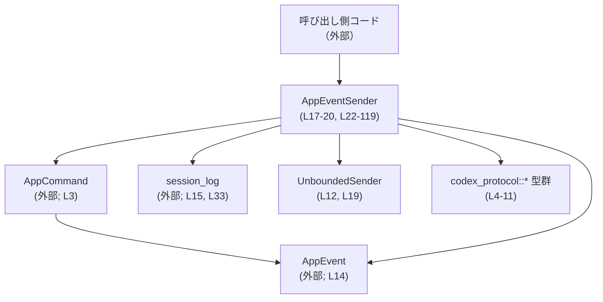

tui/src/app_event_sender.rs コード解説
==================================

## 0. ざっくり一言

このモジュールは、`AppEvent` を Tokio の `UnboundedSender` 経由で送信するための小さなラッパ型 `AppEventSender` を提供し、**ログ記録とエラーハンドリングを一箇所に集約する役割**を持ちます（`AppEventSender` 定義とメソッド: `tui/src/app_event_sender.rs:L17-L20, L22-L119`）。

---

## 1. このモジュールの役割

### 1.1 概要

- このモジュールは、アプリケーション内部で発生するさまざまな操作（割り込み、レビュー、権限応答など）を **`AppEvent` としてイベントループに送信するための窓口**として機能します（`AppEventSender` メソッド群: `L23-L119`）。
- 送信前に必要な変換（`AppCommand` の生成・`AppEvent` の構築）と、送信時のログ記録・エラー出力を担当します（`send` メソッド: `L27-L38`）。
- これにより、呼び出し側は `AppEventSender` のメソッドを呼ぶだけで、適切な `AppEvent` をチャネルに投入できます（例えば `interrupt`, `exec_approval` など: `L40-L42, L79-L84`）。

### 1.2 アーキテクチャ内での位置づけ

このモジュールが依存している主なコンポーネントは以下の通りです。

- `AppEvent`（アプリケーション内イベント型）: `use crate::app_event::AppEvent;`（`L14`）
- `AppCommand`（アプリケーションコマンド表現）: `use crate::app_command::AppCommand;`（`L3`）
- セッションログ: `use crate::session_log;`（`L15`）
- ドメイン型（スレッド ID やレビュー関連）: `codex_protocol` 以下の型群（`L4-L11`）
- イベント配送チャネル: `tokio::sync::mpsc::UnboundedSender<AppEvent>`（`L12, L19`）

これらの関係を簡略に図示します。



- 呼び出し側は `AppEventSender` に対してメソッド呼び出しを行います（例: `interrupt`, `exec_approval`）。
- `AppEventSender` は内部で `AppCommand` を生成し、`AppEvent` にラップした上で `UnboundedSender` に送信します（`L40-L42, L79-L84`）。
- `send` メソッド内で、`AppEvent::CodexOp` 以外のイベントはセッションログにも記録されます（`L29-L37`）。

### 1.3 設計上のポイント

- **責務の分割**
  - イベント送信・ログ記録・エラーハンドリングを `AppEventSender::send` に集約し（`L27-L38`）、各種操作ごとのメソッドは「どの `AppCommand` を送るか」を決めるだけの薄いラッパになっています（例: `interrupt`, `exec_approval`: `L40-L42, L79-L84`）。
- **状態管理**
  - 構造体 `AppEventSender` が持つ状態は `UnboundedSender<AppEvent>` 一つだけです（`L17-L20`）。それ以外の内部状態はありません。
- **エラーハンドリング**
  - `UnboundedSender::send` の失敗は `tracing::error!` でログ出力するのみで、呼び出し側には伝播しません（`if let Err(e) = self.app_event_tx.send(event) { ... }`: `L35-L37`）。
- **ログポリシー**
  - 高忠実度セッションリプレイのため、**すべての受信イベント**をログに記録しつつ（コメント: `L30-L31`）、`AppEvent::CodexOp` だけは「二重ログ」を避けるため除外しています（`if !matches!(event, AppEvent::CodexOp(_)) { ... }`: `L32-L34`）。
- **スレッド／会話単位の操作**
  - `ThreadId` を伴う操作は `AppEvent::SubmitThreadOp` 経由で送られ（`L79-L84, L86-L96, L98-L103, L105-L119`）、スレッドに紐づかない操作は `AppEvent::CodexOp` 経由で送られています（`L40-L42, L44-L46, L48-L52, L54-L58, L60-L64, L67-L71, L73-L77`）。

---

## 2. 主要な機能一覧

このモジュールが提供する主な機能（メソッド）を列挙します。

- イベント送信の共通処理: `send(&self, event: AppEvent)` — ログ記録とチャネル送信（`L27-L38`）
- 送信ラッパ:
  - `interrupt(&self)` — 割り込みコマンドを `AppEvent::CodexOp` として送信（`L40-L42`）
  - `compact(&self)` — スレッドのコンパクション要求を送信（`L44-L46`）
  - `set_thread_name(&self, name: String)` — スレッド名変更コマンド送信（`L48-L52`）
  - `review(&self, review_request: ReviewRequest)` — レビュー要求送信（`L54-L58`）
  - `list_skills(&self, cwds: Vec<PathBuf>, force_reload: bool)` — スキル一覧リクエスト送信（`L60-L64`）
  - `realtime_conversation_audio(&self, params: ConversationAudioParams)` — リアルタイム会話音声のパラメータ送信（`L66-L71`）
  - `user_input_answer(&self, id: String, response: RequestUserInputResponse)` — UI からの回答を送信（`L73-L77`）
  - `exec_approval(&self, thread_id: ThreadId, id: String, decision: ReviewDecision)` — 実行承認の決定をスレッドに紐づけて送信（`L79-L84`）
  - `request_permissions_response(&self, thread_id: ThreadId, id: String, response: RequestPermissionsResponse)` — 権限要求への応答送信（`L86-L96`）
  - `patch_approval(&self, thread_id: ThreadId, id: String, decision: ReviewDecision)` — 承認内容の更新を送信（`L98-L103`）
  - `resolve_elicitation(&self, thread_id: ThreadId, server_name: String, request_id: McpRequestId, decision: ElicitationAction, content: Option<serde_json::Value>, meta: Option<serde_json::Value>)` — Elicitation（追加情報要求）の解決結果を送信（`L105-L119`）

---

## 3. 公開 API と詳細解説

### 3.0 コンポーネント一覧（インベントリー）

このファイル内に定義されている構造体・メソッドの一覧です。

| 名前 | 種別 | 役割 / 用途 | 定義範囲 |
|------|------|-------------|----------|
| `AppEventSender` | 構造体 | `UnboundedSender<AppEvent>` を保持し、各種イベント送信メソッドを提供する | `tui/src/app_event_sender.rs:L17-L20` |
| `new` | メソッド | 送信用チャネルを受け取り `AppEventSender` を生成するコンストラクタ | `tui/src/app_event_sender.rs:L23-L25` |
| `send` | メソッド | `AppEvent` をログしつつ `UnboundedSender` に送信する共通処理 | `tui/src/app_event_sender.rs:L27-L38` |
| `interrupt` | メソッド | `AppCommand::interrupt()` を `AppEvent::CodexOp` として送信 | `tui/src/app_event_sender.rs:L40-L42` |
| `compact` | メソッド | `AppCommand::compact()` を送信 | `tui/src/app_event_sender.rs:L44-L46` |
| `set_thread_name` | メソッド | スレッド名変更コマンドを送信 | `tui/src/app_event_sender.rs:L48-L52` |
| `review` | メソッド | レビュー要求を送信 | `tui/src/app_event_sender.rs:L54-L58` |
| `list_skills` | メソッド | スキル一覧リクエストを送信 | `tui/src/app_event_sender.rs:L60-L64` |
| `realtime_conversation_audio` | メソッド | 会話音声関連コマンド送信（Linux では `dead_code` 許容） | `tui/src/app_event_sender.rs:L66-L71` |
| `user_input_answer` | メソッド | ユーザー入力への回答を送信 | `tui/src/app_event_sender.rs:L73-L77` |
| `exec_approval` | メソッド | 実行承認の決定をスレッドに紐づけて送信 (`SubmitThreadOp`) | `tui/src/app_event_sender.rs:L79-L84` |
| `request_permissions_response` | メソッド | 権限要求への応答を `SubmitThreadOp` として送信 | `tui/src/app_event_sender.rs:L86-L96` |
| `patch_approval` | メソッド | 承認の更新を `SubmitThreadOp` として送信 | `tui/src/app_event_sender.rs:L98-L103` |
| `resolve_elicitation` | メソッド | Elicitation 解決結果を `SubmitThreadOp` として送信 | `tui/src/app_event_sender.rs:L105-L119` |

### 3.1 型一覧（構造体・列挙体など）

このファイルで定義されている公開（`pub(crate)`）型は 1 つです。

| 名前 | 種別 | フィールド | 役割 / 用途 | 定義範囲 |
|------|------|-----------|-------------|----------|
| `AppEventSender` | 構造体 | `pub app_event_tx: UnboundedSender<AppEvent>` | `AppEvent` を送信するための Tokio MPSC 送信ハンドルを保持するラッパです。フィールドは crate 内から直接アクセス可能です。 | `tui/src/app_event_sender.rs:L17-L20` |

- `UnboundedSender<AppEvent>` は Tokio の「上限なし」MPSC チャネルの送信側ハンドルです（一般的な Tokio の仕様に基づく知識であり、このチャンクには実装は現れません）。
- `#[derive(Clone, Debug)]` により、`AppEventSender` 自体も `Clone` として複製可能・`Debug` としてフォーマット可能です（`L17`）。

### 3.2 関数詳細（重要なメソッド）

#### `AppEventSender::new(app_event_tx: UnboundedSender<AppEvent>) -> Self`

**概要**

- 渡された `UnboundedSender<AppEvent>` を内部に保持する `AppEventSender` を生成します（`L23-L25`）。
- 初期化以外のロジックはありません。

**引数**

| 引数名 | 型 | 説明 |
|--------|----|------|
| `app_event_tx` | `UnboundedSender<AppEvent>` | イベントループ側と接続された送信チャネルハンドル（`L23`） |

**戻り値**

- `Self` (`AppEventSender`) — 引数 `app_event_tx` をそのまま格納したインスタンスです（`Self { app_event_tx }`: `L24`）。

**内部処理の流れ**

1. 構造体リテラル `Self { app_event_tx }` を生成します（`L24`）。
2. それをそのまま返します（`L23-L25`）。

**Examples（使用例）**

```rust
use tokio::sync::mpsc;                             // Tokioのチャネルを利用する
use crate::app_event::AppEvent;                    // AppEvent型（このファイルには定義なし）
use crate::app_event_sender::AppEventSender;       // AppEventSender（L17-20, L22-119）

// アプリケーション起動時などにチャネルを作成する
let (tx, _rx) = mpsc::unbounded_channel::<AppEvent>(); // UnboundedSender/AppEvent用チャネルを生成

// AppEventSenderを初期化する
let sender = AppEventSender::new(tx);              // newでラップ（L23-L25）
```

**Errors / Panics**

- `new` 自体はエラーもパニックも発生させません（`L23-L25` にエラーパスなし）。

**Edge cases（エッジケース）**

- `app_event_tx` がすでにクローズされたチャネルであっても、`new` はそれを区別しません。後続の `send` 呼び出しで初めてエラーになる可能性があります（`send` 内エラーハンドリング参照: `L35-L37`）。

**使用上の注意点**

- `new` の時点ではチャネルの接続状況は検証されないため、**チャネル生成側と受信側のライフサイクル管理**は別途必要です。このファイルにはその管理ロジックは現れません。

---

#### `AppEventSender::send(&self, event: AppEvent)`

**概要**

- `AppEvent` を受け取り、必要に応じてセッションログへ記録した後、`UnboundedSender` に送信します（`L27-L38`）。
- 送信失敗時はエラーをログ出力しますが、呼び出し元にエラーは返しません。

**引数**

| 引数名 | 型 | 説明 |
|--------|----|------|
| `&self` | `&AppEventSender` | 内部チャネルハンドルへアクセスするための参照 |
| `event` | `AppEvent` | 送信するアプリケーションイベント（`L29`） |

**戻り値**

- なし（`()`）。成功・失敗の別を戻り値では表しません（`L29`）。

**内部処理の流れ**

1. コメントで「高忠実度セッションリプレイのためのインバウンドイベント記録」「Ops の二重ログ回避」が明示されています（`L30-L31`）。
2. `if !matches!(event, AppEvent::CodexOp(_)) { ... }` で、イベントが `AppEvent::CodexOp(_)` **ではない**場合のみログ関数を呼びます（`L32-L34`）。
   - `session_log::log_inbound_app_event(&event);` でイベントをログ記録します（`L33`）。実装はこのファイルには現れません。
3. `self.app_event_tx.send(event)` を呼び、イベントをチャネルに送信します（`L35`）。
4. `send` がエラーを返した場合、`tracing::error!("failed to send event: {e}");` でエラーログを出力します（`L35-L37`）。

**Examples（使用例）**

`send` は通常、直接ではなく他のメソッド経由で使われますが、概念的な例を示します。

```rust
use crate::app_event::AppEvent;                    // AppEvent型（このファイルには定義なし）
use crate::app_event_sender::AppEventSender;       // ラッパ（L17-20, L22-119）

fn send_custom_event(sender: &AppEventSender, event: AppEvent) {
    // AppEventSender::sendを直接呼び出してイベントを送信する（L29-38）
    sender.send(event);
    // 成否は戻り値ではわからないが、失敗時はtracingにエラーが出力される（L35-L37）
}
```

**Errors / Panics**

- **Errors**:
  - `self.app_event_tx.send(event)` が `Err` を返す場合があります（通常、受信側がドロップされたときなど、Tokio の仕様に基づく一般知識）※この挙動は `UnboundedSender` 側の仕様であり、このファイルには実装は現れません。
  - その際、この関数は `tracing::error!` でログを残しつつ処理を継続します（`L35-L37`）。
- **Panics**:
  - この関数内に `panic!` 等は存在しません（`L29-L37`）。

**Edge cases（エッジケース）**

- `event` が `AppEvent::CodexOp(_)` の場合:
  - `matches!(event, AppEvent::CodexOp(_))` が `true` となり、`session_log::log_inbound_app_event` は呼ばれません（`L32-L34`）。
  - これはコメントにある「Ops は投稿時点でログされるため二重ログを避ける」というポリシーに対応すると読めます（コメント: `L30-L31`）。
- `event` が他のバリアントの場合:
  - `log_inbound_app_event` が呼ばれ、セッションログに記録された後に送信されます（`L32-L35`）。
- チャネルがクローズされている場合:
  - `send` は `Err` を返し、イベントは破棄されます（Tokio 一般仕様）。この関数はエラーログを出力するだけで、再送やリトライは行いません（`L35-L37`）。

**使用上の注意点**

- 呼び出し側では送信の成功／失敗を検出できないため、「イベントが必ず配信される」ことを前提にしたロジックは置かない設計が前提になります。
- `AppEvent::CodexOp` の場合はセッションログに記録されないことに注意が必要です。`CodexOp` をログしたい場合は別の仕組みが必要になる可能性があります（`L30-L34`）。

---

#### `AppEventSender::interrupt(&self)`

**概要**

- コアシステムに対する「割り込み」コマンドを `AppEvent::CodexOp` として送信します（`L40-L42`）。

**引数**

| 引数名 | 型 | 説明 |
|--------|----|------|
| `&self` | `&AppEventSender` | 送信チャネルにアクセスするための参照 |

**戻り値**

- なし（`()`）。

**内部処理の流れ**

1. `AppCommand::interrupt()` を呼び出します（`L41`）。
2. `into_core()` メソッドでコマンドを別の表現に変換しています（`L41`）。`into_core` の具体的な挙動はこのチャンクには現れません。
3. 上記を `AppEvent::CodexOp(...)` でラップします（`L41`）。
4. 生成した `AppEvent` を `self.send(...)` で送信します（`L41`）。

**Examples（使用例）**

```rust
use crate::app_event_sender::AppEventSender;       // ラッパ型

fn user_pressed_interrupt(sender: &AppEventSender) {
    // ユーザーが中断操作を行ったときに呼ぶことを想定できる（L40-L42）
    sender.interrupt();                            // CodexOpイベントが送信される
}
```

**Errors / Panics**

- `interrupt` 自体はエラーを返さず、内部で `send` がエラーをログ出力するのみです（`L41`, `L29-L38`）。

**Edge cases**

- チャネルが既にクローズされている場合:
  - 割り込みイベントは送信されず、`send` 内でエラーがログ出力されます（`L35-L37`）。

**使用上の注意点**

- 割り込みが「確実に届く」ことを前提にした制御はできません。到達保証が必要な場合は上位レベルで別途確認手段を設ける必要があります。

---

#### `AppEventSender::user_input_answer(&self, id: String, response: RequestUserInputResponse)`

**概要**

- ユーザーに対して行った入力要求に対する回答を、`AppCommand::user_input_answer` 経由で送信します（`L73-L77`）。
- `AppEvent::CodexOp` 経由で送られるため、セッションログでの扱いは `send` の条件に従います。

**引数**

| 引数名 | 型 | 説明 |
|--------|----|------|
| `id` | `String` | 入力要求を識別する ID（`L73`） |
| `response` | `RequestUserInputResponse` | ユーザーの回答内容を表す型（定義はこのチャンクには現れませんが、`codex_protocol::request_user_input` からインポート: `L11`） |

**戻り値**

- なし（`()`）。

**内部処理の流れ**

1. `AppCommand::user_input_answer(id, response)` を呼び出します（`L75`）。
2. その戻り値に対して `.into_core()` を適用します（`L75`）。
3. `AppEvent::CodexOp(...)` でラップします（`L74-L76`）。
4. `self.send(...)` で送信します（`L74`）。

**Errors / Panics**

- `send` と同様、エラーは内部でログに記録されるのみで、呼び出し側には返りません（`L29-L38`）。
- パニックを起こすコードは含まれていません（`L73-L77`）。

**Edge cases**

- `id` が存在しない／無効な ID であっても、この関数はそれを検証しません。検証はおそらく下流のハンドラに委ねられていますが、このチャンクには確認できるコードはありません。
- `response` の詳細な構造は不明ですが、この関数内ではそのまま渡されるだけです（`L73-L76`）。

**使用上の注意点**

- `id` と `response` の整合性（ID が示すリクエストに対して妥当な応答であるか）はこの関数では保証されません。呼び出し側が責任を持つ必要があります。

---

#### `AppEventSender::exec_approval(&self, thread_id: ThreadId, id: String, decision: ReviewDecision)`

**概要**

- レビュー結果に基づいて「承認された実行」を行うための決定を、特定スレッドに紐づけてイベントとして送信します（`L79-L84`）。

**引数**

| 引数名 | 型 | 説明 |
|--------|----|------|
| `thread_id` | `ThreadId` | 対象スレッドの ID（`codex_protocol::ThreadId` からインポート: `L4, L79`） |
| `id` | `String` | レビュー／承認対象を識別する ID（`L79-82`） |
| `decision` | `ReviewDecision` | レビューの決定内容を表す型（`L8, L79-82`） |

**戻り値**

- なし（`()`）。

**内部処理の流れ**

1. `AppCommand::exec_approval(id, /*turn_id*/ None, decision)` を呼び出します（`L82`）。
   - コメント `/*turn_id*/ None` から、3 番目の引数がターン ID 的な意味を持つことが推測されますが、詳細はこのチャンクには現れません。
2. `.into_core()` を呼び、内部表現に変換します（`L82`）。
3. `AppEvent::SubmitThreadOp { thread_id, op: ... }` 構造体を生成します（`L80-L83`）。
4. 生成したイベントを `self.send(...)` に渡して送信します（`L80`）。

**Examples（使用例）**

```rust
use crate::app_event_sender::AppEventSender;       // ラッパ
use codex_protocol::{ThreadId};                    // スレッドID（このファイルには定義なし）
use codex_protocol::protocol::ReviewDecision;      // レビュー決定型（L8）

fn approve_execution(sender: &AppEventSender, thread_id: ThreadId, approval_id: String, decision: ReviewDecision) {
    // スレッドに対して承認実行を指示するイベントを送信する（L79-L84）
    sender.exec_approval(thread_id, approval_id, decision);
}
```

**Errors / Panics**

- 送信失敗時は `send` 内でログされるのみです（`L35-L37`）。
- このメソッド自体にパニック要因はありません（`L79-L84`）。

**Edge cases**

- `thread_id` が無効なスレッドを指している場合の挙動は、このファイルからは分かりません。下流のイベント処理側に依存します。
- `decision` の値がどのようなバリエーションを持つかは `ReviewDecision` の定義がこのチャンクにないため不明です（`L8`）。

**使用上の注意点**

- `exec_approval` は `AppEvent::SubmitThreadOp` を使っているため、`send` 内で `matches!(event, AppEvent::CodexOp(_))` にマッチせず、**セッションログに記録される**点に注意が必要です（`L32-L34, L80-L83`）。

---

#### `AppEventSender::request_permissions_response(&self, thread_id: ThreadId, id: String, response: RequestPermissionsResponse)`

**概要**

- 何らかの「権限要求」に対する応答を、特定スレッドに紐づけてイベントとして送信します（`L86-L96`）。

**引数**

| 引数名 | 型 | 説明 |
|--------|----|------|
| `thread_id` | `ThreadId` | 対象スレッド ID（`L88, L4`） |
| `id` | `String` | 権限要求を識別する ID（`L89`） |
| `response` | `RequestPermissionsResponse` | 権限要求に対する応答（定義はこのチャンクには現れませんが、`codex_protocol::request_permissions` からインポート: `L10`） |

**戻り値**

- なし（`()`）。

**内部処理の流れ**

1. `AppCommand::request_permissions_response(id, response)` を呼びます（`L94`）。
2. `.into_core()` で内部表現に変換します（`L94`）。
3. `AppEvent::SubmitThreadOp { thread_id, op: ... }` を生成します（`L92-L95`）。
4. `self.send(...)` で送信します（`L92`）。

**Errors / Panics**

- `exec_approval` と同様です。送信失敗はログのみ（`L35-L37`）。

**Edge cases**

- `response` の内容が不正な場合の扱いは、このファイルからは分かりません。下流の処理に委ねられます。

**使用上の注意点**

- このイベントも `SubmitThreadOp` 経由のため、セッションログに記録されると考えられます（`L32-L34, L92-L95`）。

---

#### `AppEventSender::resolve_elicitation(&self, thread_id: ThreadId, server_name: String, request_id: McpRequestId, decision: ElicitationAction, content: Option<serde_json::Value>, meta: Option<serde_json::Value>)`

**概要**

- Elicitation（追加情報要求）の結果を、MCP（Model Context Protocol）関連の情報とともにスレッドへ送信します（`L105-L119`）。
- 内容・メタ情報は JSON としてオプショナルに添付されます（`Option<serde_json::Value>`: `L111-L112`）。

**引数**

| 引数名 | 型 | 説明 |
|--------|----|------|
| `thread_id` | `ThreadId` | 対象スレッド ID（`L107`） |
| `server_name` | `String` | サーバー名・接続先を表すと推測される文字列（`L108`）※用途はこのチャンクには明示されていません |
| `request_id` | `McpRequestId` | MCP のリクエスト ID（`codex_protocol::mcp::RequestId` に別名: `L6, L109`） |
| `decision` | `ElicitationAction` | Elicitation に対する決定内容（`L5, L110`） |
| `content` | `Option<serde_json::Value>` | 追加コンテンツ（任意; `Some` の場合に内容が添付される）（`L111`） |
| `meta` | `Option<serde_json::Value>` | メタ情報（任意; `Some` の場合にメタデータが添付される）（`L112`） |

**戻り値**

- なし（`()`）。

**内部処理の流れ**

1. `AppCommand::resolve_elicitation(server_name, request_id, decision, content, meta)` を呼び出します（`L116`）。
2. 戻り値に `.into_core()` を適用します（`L116-117`）。
3. `AppEvent::SubmitThreadOp { thread_id, op: ... }` を生成します（`L114-L117`）。
4. `self.send(...)` によって送信します（`L114`）。

**Examples（使用例）**

```rust
use crate::app_event_sender::AppEventSender;       // ラッパ
use codex_protocol::ThreadId;                      // スレッドID
use codex_protocol::approvals::ElicitationAction;  // 決定種別（L5）
use codex_protocol::mcp::RequestId as McpRequestId;// MCPリクエストID（L6）
use serde_json::json;                              // JSON値構築用（標準クレートではなくserde_json）

fn resolve(
    sender: &AppEventSender,
    thread_id: ThreadId,
    server_name: String,
    request_id: McpRequestId,
) {
    let decision = ElicitationAction::/* 具体的なバリアントはこのチャンクには不明 */ todo!();
    let content = Some(json!({"answer": "value"})); // 追加情報
    let meta = None;                                // メタ情報なし

    sender.resolve_elicitation(thread_id, server_name, request_id, decision, content, meta);
}
```

（※ `ElicitationAction` の具体的なバリアント名はこのチャンクには現れないため `todo!()` で代用しています。）

**Errors / Panics**

- 他メソッド同様、送信失敗は `send` 内でログされるのみです（`L35-L37`）。
- このメソッド自体にパニックを起こすコードはありません（`L105-L119`）。

**Edge cases**

- `content` / `meta` が `None` の場合:
  - そのまま `AppCommand::resolve_elicitation` に渡されます（`L111-L112, L116`）。具体的にどのように扱われるかは `AppCommand` 側実装次第で、このチャンクからは不明です。
- JSON の構造が想定と異なる場合:
  - この関数内では検証されません。後続の処理に依存します。

**使用上の注意点**

- `serde_json::Value` を直接受け取るため、**外部からの入力をそのまま渡すと型安全性が低くなる**可能性がありますが、このモジュールでは検証を行わず単純な転送に徹しています（`L111-L112, L116`）。
- 下流のコマンド処理側で適切なバリデーションやサニタイズが必要になることが多いと考えられます。

---

### 3.3 その他の関数

詳細解説を省略した補助メソッドです。いずれも `AppCommand` の対応するコンストラクタを呼び、`AppEvent` にラップして `send` するだけの薄いラッパです。

| 関数名 | シグネチャ | 役割（1 行） | 定義範囲 |
|--------|------------|--------------|----------|
| `compact` | `fn compact(&self)` | `AppCommand::compact().into_core()` を `AppEvent::CodexOp` として送信する | `tui/src/app_event_sender.rs:L44-L46` |
| `set_thread_name` | `fn set_thread_name(&self, name: String)` | スレッド名変更コマンドを `CodexOp` として送信する | `tui/src/app_event_sender.rs:L48-L52` |
| `review` | `fn review(&self, review_request: ReviewRequest)` | レビュー要求を送信する | `tui/src/app_event_sender.rs:L54-L58` |
| `list_skills` | `fn list_skills(&self, cwds: Vec<PathBuf>, force_reload: bool)` | スキル一覧を取得するコマンドを送信する | `tui/src/app_event_sender.rs:L60-L64` |
| `realtime_conversation_audio` | `fn realtime_conversation_audio(&self, params: ConversationAudioParams)` | 会話音声関連のパラメータを送信する | `tui/src/app_event_sender.rs:L66-L71` |
| `patch_approval` | `fn patch_approval(&self, thread_id: ThreadId, id: String, decision: ReviewDecision)` | 既存承認の内容を更新するイベントを送信する (`SubmitThreadOp`) | `tui/src/app_event_sender.rs:L98-L103` |

---

## 4. データフロー

### 4.1 代表的な処理シナリオ

ここでは、「実行承認を行うイベント」を送信する流れを例に、データの流れを説明します。

1. 呼び出し側コードが `AppEventSender::exec_approval` を呼び出す（`L79-L84`）。
2. `exec_approval` が `AppCommand::exec_approval(...)` を生成し、`AppEvent::SubmitThreadOp { thread_id, op }` にラップして `send` を呼ぶ（`L79-L83`）。
3. `send` が、`AppEvent::CodexOp(_)` かどうかを判定し、該当しないためセッションログに記録する（`L32-L34`）。
4. `send` が `UnboundedSender<AppEvent>` に対して `send` を実行し、イベントをチャネルに投入する（`L35`）。
5. 受信側（このファイルには現れない）がチャネルから `AppEvent::SubmitThreadOp` を受け取り、実際の処理を行う。

### 4.2 シーケンス図

```mermaid
sequenceDiagram
    participant Caller as "呼び出し側コード<br/>(外部)"
    participant Exec as "exec_approval (L79-84)"
    participant Send as "send (L27-38)"
    participant Log as "session_log::log_inbound_app_event<br/>(外部; L33)"
    participant Chan as "app_event_tx: UnboundedSender<AppEvent><br/>(L19)"

    Caller->>Exec: exec_approval(thread_id, id, decision)
    Note right of Exec: AppCommand::exec_approval(...).into_core() を構築し<br/>AppEvent::SubmitThreadOp { thread_id, op } を生成（L80-83）
    Exec->>Send: send(AppEvent::SubmitThreadOp { ... })
    alt event is CodexOp?
        Note over Send: 今回は SubmitThreadOp のため<br/>matches!(event, AppEvent::CodexOp(_)) == false（L32）
    end
    Send->>Log: log_inbound_app_event(&event)（L33）
    Send->>Chan: app_event_tx.send(event)（L35）
    Chan-->>Send: Result<(), SendError<_>>（Tokio一般仕様）
    alt Err
        Send->>Send: tracing::error!(...);（L35-37）
    end
```

- ここでの `event` は `AppEvent::SubmitThreadOp` であるため、ログ記録の対象になります（`L32-L34`）。
- `AppEvent::CodexOp` を送るメソッド（例: `interrupt`）では、`Send` → `Log` への呼び出しはスキップされます（`L32-L34, L40-L42`）。

---

## 5. 使い方（How to Use）

### 5.1 基本的な使用方法

このモジュールを利用する典型的なフローは以下の通りです。

1. アプリケーション起動時に `UnboundedSender<AppEvent>` / 受信側を生成する（このファイル外の処理）。
2. `AppEventSender::new` でラッパを作る（`L23-L25`）。
3. 必要に応じて、`interrupt` や `exec_approval` などのメソッドを呼ぶ。

```rust
use tokio::sync::mpsc;                             // チャネル生成用（L12）
use crate::app_event::AppEvent;                    // イベント型（L14）
use crate::app_event_sender::AppEventSender;       // このモジュールの型（L17-20, L22-119）

// 初期化フェーズ
let (tx, _rx) = mpsc::unbounded_channel::<AppEvent>(); // UnboundedSender/AppEvent用チャネルを作成（Tokioの一般API）

// AppEventSenderを構築
let sender = AppEventSender::new(tx);              // コンストラクタ呼び出し（L23-L25）

// メイン処理中で、何らかの操作をイベントとして送信
// 例: ユーザーが「実行を承認」した
// sender.exec_approval(thread_id, approval_id, decision); // L79-L84
// 例: ユーザーが「中断」ボタンを押した
sender.interrupt();                                // 割り込みイベントを送信（L40-L42）
```

### 5.2 よくある使用パターン

1. **単純な操作の送信（CodexOp 系）**

   - 例: 中断、コンパクション、スキル一覧取得など（`L40-L46, L60-L64`）。

   ```rust
   // 中断要求
   sender.interrupt();                             // L40-L42

   // スキル一覧の再読み込みを強制
   use std::path::PathBuf;
   sender.list_skills(vec![PathBuf::from(".")], true); // L60-L64
   ```

2. **スレッド単位の操作送信（SubmitThreadOp 系）**

   - 例: 承認決定、権限応答、Elicitation 解決など（`L79-L84, L86-L96, L105-L119`）。

   ```rust
   use codex_protocol::ThreadId;                  // スレッドID（L4）
   use codex_protocol::protocol::ReviewDecision;  // レビュー決定（L8）

   fn approve(sender: &AppEventSender, thread_id: ThreadId, id: String, decision: ReviewDecision) {
       sender.exec_approval(thread_id, id, decision);  // L79-L84
   }
   ```

### 5.3 よくある間違い（推測）

コードから想定される「好ましくない」パターンを挙げます（あくまで推測であり、このチャンクには誤用例は現れません）。

```rust
// （誤りになりうる例）AppEventSenderを経由せずに生のチャネルに送る
// sender.app_event_tx.send(event).unwrap();      // L19: フィールドはpubだが、sendはエラーを返しうる

// 正しい例: AppEventSender::sendを経由する
sender.send(event);                               // L29-38: ログとエラーハンドリングが一元化される
```

- `AppEventSender::send` を使わずフィールドの `app_event_tx` を直接使うと、セッションログへの記録とエラーのログ出力が行われなくなります（`L29-L37`）。  
  ただし `app_event_tx` は `pub` であるため、設計として意図的に直接送信するケースもあり得ます。

### 5.4 使用上の注意点（まとめ）

- **エラー伝播がない**
  - 送信失敗は `tracing::error!` のログのみで、呼び出し側には通知されません（`L35-L37`）。
  - 重要な操作であっても、「送れなかったこと」を上位に伝える仕組みがない点に注意が必要です。
- **ログの対象**
  - `AppEvent::CodexOp(_)` 以外はセッションログに記録されますが、`CodexOp` はここでのログ対象外です（`L32-L34`）。  
    `CodexOp` は別の場所でログされているとコメントから読み取れます（`L30-L31`）。
- **Unbounded チャネル**
  - `UnboundedSender` はキューに上限がないチャネルであり、多数のイベントを短時間に送信するとメモリ使用量が増加しうることが一般仕様として知られています。  
    このファイルではその制御やバックプレッシャーは行っていません（`L19, L35`）。

---

## 6. 変更の仕方（How to Modify）

### 6.1 新しい機能を追加する場合

このモジュールのパターンに従うと、新しいイベント送信機能は次のステップで追加することができます。

1. **`AppCommand` に対応するコマンドを追加**（推測）
   - 既存メソッドはすべて `AppCommand::something(...).into_core()` を呼んでいるため（`L40-L42, L44-L46, L48-L52, L54-L58, L60-L64, L67-L71, L73-L77, L79-L84, L86-L96, L98-L103, L105-L119`）、新機能もまず `AppCommand` 側に対応メソッドを追加するのが自然です。
   - この部分は `crate::app_command` に実装されるため、このチャンクには現れません。

2. **`AppEventSender` に薄いラッパメソッドを追加**
   - 例として、`foo` という新コマンドを `CodexOp` として送信したい場合:

   ```rust
   impl AppEventSender {
       pub(crate) fn foo(&self, arg: FooArgType) {
           self.send(AppEvent::CodexOp(
               AppCommand::foo(arg).into_core(),   // 既存パターンに合わせる
           ));
       }
   }
   ```

3. **スレッドに紐づくかどうかで `AppEvent` のバリアントを選ぶ**
   - スレッド ID を伴う操作は `AppEvent::SubmitThreadOp { thread_id, op }` が使用されているため（`L79-L84, L86-L96, L98-L103, L105-L119`）、同様の性質を持つ新機能もそれに倣うのが一貫した設計になります。

### 6.2 既存の機能を変更する場合

- **影響範囲の確認**
  - 送信ロジックを変えたい場合は、まず `send` の挙動（ログ記録とエラー処理: `L27-L38`）を確認する必要があります。
  - 各メソッドは `send` にイベントを渡すだけなので、`send` の仕様変更は全メソッドに影響します。

- **契約（前提条件・返り値の意味）**
  - 現在の契約は「送信失敗を呼び出し側に返さない」点です（`L29-L38`）。
  - これを `Result` 返しに変更する場合、全呼び出し側コードの対応が必要になります。このファイルには呼び出し側は現れないため、別の場所での影響調査が必要です。

- **ログポリシーを変える場合**
  - `AppEvent::CodexOp` をログ対象に含めたい、あるいは逆に特定の `SubmitThreadOp` を除外したい場合は、`matches!` の条件（`L32`）や `AppEvent` のバリアント構成に合わせて条件分岐を変更することになります。

---

## 7. 関連ファイル

このモジュールと密接に関係する外部ファイル・クレートを一覧にします（いずれもこのチャンクには定義が現れません）。

| パス / クレート | 役割 / 関係 | 根拠 |
|-----------------|------------|------|
| `crate::app_event` | `AppEvent` 型を提供し、本モジュールで送信対象となるイベント表現を定義していると考えられます | `use crate::app_event::AppEvent;`（`tui/src/app_event_sender.rs:L14`） |
| `crate::app_command` | 各種コマンド (`interrupt`, `compact`, `review`, など) の生成ロジックを提供します。`into_core` メソッドもここで定義されていると考えられます（推測） | `use crate::app_command::AppCommand;`（`L3`）と、各メソッド内の `AppCommand::...().into_core()` 呼び出し（`L40-L42, L44-L46, L48-L52, L54-L58, L60-L64, L67-L71, L73-L77, L79-L84, L86-L96, L98-L103, L105-L119`） |
| `crate::session_log` | セッションリプレイ用のログ記録機能を提供します。ここでは `log_inbound_app_event` を使用しています | `use crate::session_log;`（`L15`）、`session_log::log_inbound_app_event(&event);`（`L33`） |
| `codex_protocol` クレート | スレッド ID・レビュー関連型・MCP リクエスト ID・権限応答など、ドメイン固有の型を提供します。`ThreadId`, `ReviewRequest`, `ReviewDecision`, `ConversationAudioParams`, `RequestPermissionsResponse`, `RequestUserInputResponse`, `ElicitationAction`, `McpRequestId` などが使われています | `use codex_protocol::...` 群（`L4-L11`） |
| `tokio::sync::mpsc` | `UnboundedSender<AppEvent>` を通じて非同期イベントループとのチャネル通信を提供します | `use tokio::sync::mpsc::UnboundedSender;`（`L12`）、`pub app_event_tx: UnboundedSender<AppEvent>`（`L19`） |

---

## Bugs / Security / Tests / パフォーマンスに関する補足（このファイルに現れる範囲）

- **明確なバグ**
  - このチャンク単体から明らかなロジックバグは読み取れません。すべてのメソッドは一貫したパターンで `AppCommand` → `AppEvent` → `send` という流れを取っています（`L40-L42` など）。
- **Security**
  - `resolve_elicitation` で `serde_json::Value` をそのまま下流に渡しているため（`L111-L112, L116`）、外部入力の検証はコマンド処理側に依存します。このファイル内ではバリデーションは行っていません。
- **Tests**
  - このファイル内にテストコード（`#[test]` など）は存在しません（`L1-L120` を通して該当箇所なし）。
- **Performance / Scalability**
  - `UnboundedSender` を使っているため、イベント量が非常に多い環境ではメモリ使用量増大の可能性があります（`L19, L35`）。
  - 各メソッドはほぼ一定時間で終了し、CPU 的には軽量です（単純な構造体生成とメソッド呼び出しのみ: `L40-L42`, `L79-L84` など）。
- **Observability**
  - `session_log::log_inbound_app_event` と `tracing::error!` によって、**正常系のイベント到達（`CodexOp` 以外）**と**送信失敗**が観測できる設計になっています（`L30-L31, L33, L35-L37`）。
