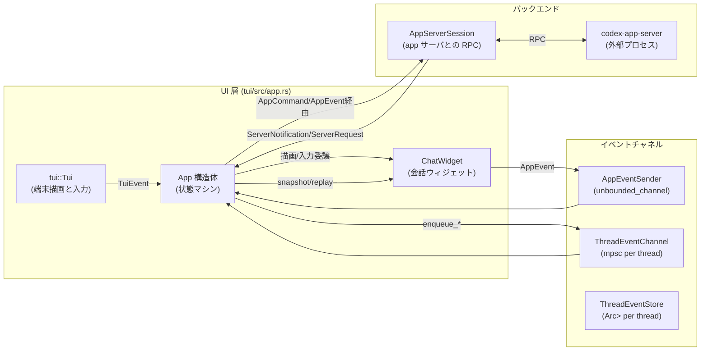
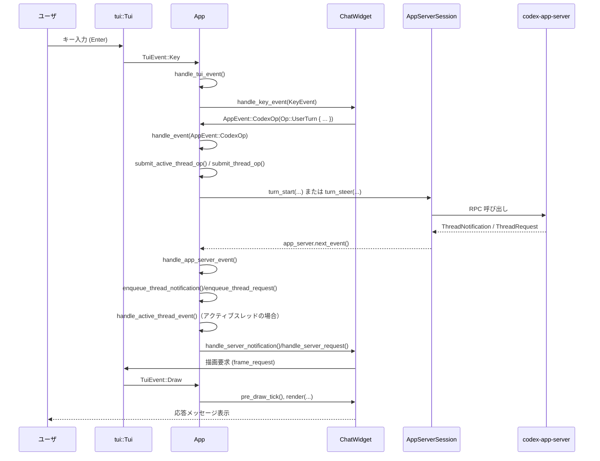

tui/src/app.rs

---

## 0. ざっくり一言

このファイルは、Codex CLI の TUI アプリケーション全体の **メイン状態マシン** です。  
`ChatWidget`・`AppServerSession`・端末イベント・アプリ内イベント・マルチエージェントスレッドを束ねて、1 本の非同期イベントループとして動かします。

> ※行番号はこのインターフェースから取得できないため、根拠は「tui/src/app.rs 内の該当定義」として記載します。

---

## 1. このモジュールの役割

### 1.1 概要

このモジュールは **TUI セッションのライフサイクル全体** を管理するために存在し、主に次の機能を提供します。

- 埋め込み / リモート `AppServerSession` と接続し、スレッド（会話）を開始・再開・フォークする
- 各スレッドのイベント（通知・リクエスト・履歴レスポンス・フィードバック）を **ThreadEventStore** にバッファし、`ChatWidget` に再生する
- `/agent` による **マルチエージェント切替** と、非アクティブスレッドの承認待ちなどの UI 表示を管理する
- モデル移行プロンプト、フィードバック送信、Windows サンドボックス、MCP/プラグイン一覧などの **周辺機能** を TUI に統合する
- 端末イベント（キー入力・リサイズ・ペースト）とアプリイベントを `tokio::select!` で捌く非同期イベントループを構成する

### 1.2 アーキテクチャ内での位置づけ

このファイルに登場する主なコンポーネントの関係は次のようになります。



- `App::run` がこのグラフ全体の **イベントループの中核** です。
- 各スレッドごとに `ThreadEventChannel` + `ThreadEventStore` があり、`App` がそれらを仲介して `ChatWidget` にイベントを供給します。

### 1.3 設計上のポイント

コードから読み取れる設計上の特徴を列挙します。

- **イベント駆動・ノンブロッキング**
  - `tokio::select!` で TUI イベント・AppEvent・スレッドイベント・サーバイベントを並列に待ち受ける設計です（`App::run`）。
  - 重い処理やブロッキングな処理（ファイル I/O、外部コマンド、Windows スキャンなど）は `tokio::task::spawn_blocking` や OS スレッドで実行されています。

- **スレッドごとのイベントバッファ**
  - `ThreadEventStore`（`Arc<Mutex<…>>` で共有）が、サーバからの通知 / リクエスト / 履歴レスポンス / フィードバックなどをリングバッファ的に保持します。
  - `ThreadEventSnapshot` と `replay_thread_snapshot` によって、**スレッドの再選択・再開時に UI 状態を再構築**します。

- **マルチエージェント / マルチスレッド**
  - `AgentNavigationState` と `agent_navigation` フィールドで、複数スレッド（エージェント）のメタデータとナビゲーション（前/次スレッド）を管理します。
  - `/agent` ピッカーや、Alt+←/→（あるいは Option+f/b のフォールバック）でスレッドを切り替えます。

- **安全なエラーハンドリング**
  - ほぼすべての公開関数が `color_eyre::Result` でエラーを返し、ユーザ向けには `chat_widget.add_error_message(...)` で通知します。
  - App-server RPC エラーは、状況に応じて再試行（アクティブターンの steer レース）・フォールバック・単なる情報メッセージに分けて扱われています。

- **Rust 固有の安全性**
  - 共有状態は `Arc<Mutex<...>>` と `Arc<AtomicBool>` で管理され、可変状態へのアクセスはすべて `await store.lock()` 経由になっています（データレース防止）。
  - チャネルの `TrySendError::Full` 時は非同期タスクで送信をリトライし、呼び出し側をブロックしないようになっています。

---

## 2. 主要な機能一覧

このモジュールが提供する主な機能を用途別に整理します。

- セッション管理
  - 新規スレッド開始 / 再開 / フォーク (`App::run`, `start_fresh_session_with_summary_hint`, `resume_target_session`)
  - セッション終了・終了理由の集約 (`AppExitInfo`, `handle_exit_mode`)
- スレッドイベント管理
  - スレッドごとのイベントバッファリング (`ThreadEventStore`, `ThreadEventChannel`)
  - スナップショット取得と再生 (`ThreadEventStore::snapshot`, `App::replay_thread_snapshot`)
  - アクティブスレッドへのイベント配送 (`handle_active_thread_event`, `drain_active_thread_events`)
- マルチエージェント / スレッドナビゲーション
  - `/agent` ピッカー表示 (`open_agent_picker`)
  - 前 / 次エージェントへのキーボードショートカット (`handle_key_event`, `adjacent_thread_id_with_backfill`)
  - サブエージェントスレッドのバックフィル (`backfill_loaded_subagent_threads`)
- 承認フロー・対話的リクエスト
  - コマンド実行 / ファイル変更 / MCP / 権限リクエストの UI 生成 (`interactive_request_for_thread_request`)
  - 非アクティブスレッドの承認待ちバッジ表示 (`refresh_pending_thread_approvals`)
- 設定・機能フラグ管理
  - `Config` 再構築・再読込 (`rebuild_config_for_cwd`, `refresh_in_memory_config_from_disk`)
  - 実験フラグや Guardian Approvals の切り替え (`update_feature_flags`)
  - モデル移行プロンプト / NUX ツールチップ (`handle_model_migration_prompt_if_needed`, `prepare_startup_tooltip_override`)
- 外部連携
  - MCP サーバ一覧取得・表示 (`fetch_all_mcp_server_statuses`, `handle_mcp_inventory_result`)
  - プラグイン一覧 / 詳細 / インストール / アンインストール (`fetch_plugins_list`, `fetch_plugin_detail`, `fetch_plugin_install`, `fetch_plugin_uninstall`)
  - アカウントレートリミット取得 (`fetch_account_rate_limits`, `refresh_rate_limits`)
  - フィードバックアップロード (`build_feedback_upload_params`, `fetch_feedback_upload`, `submit_feedback`)
- UI 操作
  - TUI クリアとヘッダー描画 (`clear_terminal_ui`, `clear_ui_header_lines_with_version`)
  - トランスクリプトオーバーレイ（全文ページャ） (`Overlay::Transcript`, `handle_backtrack_overlay_event` ※実装は別モジュール)
  - 外部エディタ連携 (`launch_external_editor`, `request_external_editor_launch`, `reset_external_editor_state`)
  - Windows サンドボックス・world-writable スキャン（Windows 限定） (`spawn_world_writable_scan`, Windows 関連 AppEvent 分岐)
- テスト用ユーティリティ
  - MCP 結果のマップ変換 (`mcp_inventory_maps_from_statuses`)
  - 各種ユニット / 統合テスト（`mod tests`）: バッファリング・再生・マルチエージェント・Guardian Approvals などの挙動を詳細に検証

---

## 3. 公開 API と詳細解説

### 3.1 型一覧（構造体・列挙体など）

主要な公開 / 準公開型を抜粋して整理します。

| 名前 | 種別 | 可視性 | 役割 / 用途 | 根拠 |
|------|------|--------|-------------|------|
| `App` | 構造体 | `pub(crate)` | TUI アプリケーションのメイン状態。チャットウィジェット・設定・スレッドイベントなど全体を保持し、イベントループ内で操作します。 | `tui/src/app.rs` 内定義 |
| `AppExitInfo` | 構造体 | `pub` | `App::run` 終了時の情報（トークン使用量・スレッド ID・更新アクション・終了理由）をまとめた戻り値。 | 同上 |
| `AppRunControl` | enum | `pub(crate)` | イベント処理の継続 / 終了を表す制御フラグ。`Continue` または `Exit(ExitReason)`。 | 同上 |
| `ExitReason` | enum | `pub` | アプリ終了理由（ユーザ要求 / 致命的エラー）を表します。 | 同上 |
| `ThreadEventStore` | 構造体 | private | 単一スレッドのセッション情報・ターン一覧・イベントバッファ・インタラクティブリプレイ状態を保持します。`Arc<Mutex<…>>` 経由で共有されます。 | 同上 |
| `ThreadEventChannel` | 構造体 | private | 各スレッドに対応する `mpsc::Sender/Receiver<ThreadBufferedEvent>` とその `ThreadEventStore` をまとめたラッパ。 | 同上 |
| `ThreadEventSnapshot` | 構造体 | private | `ThreadEventStore::snapshot()` が返す、スレッド状態のコピー。`replay_thread_snapshot` で UI 再構築に使われます。 | 同上 |
| `ThreadBufferedEvent` | enum | private | バッファされるスレッドイベント種別（サーバ通知・サーバ要求・履歴レスポンス・フィードバック）。 | 同上 |
| `GuardianApprovalsMode` | 構造体 | private | Guardian Approvals 実験が有効なときの標準プリセット（approval policy / reviewer / sandbox policy）をまとめたもの。 | 同上 |
| `StartupTooltipOverride` | 構造体 | private | 起動時ツールチップをモデル可用性 NUX で上書きする際の設定。 | 同上 |
| `WindowsSandboxState` | 構造体 | private | Windows サンドボックス関連の一時状態（セットアップ開始時刻等）。 | 同上 |
| `ActiveTurnSteerRace` | enum | private | `turn/steer` RPC の競合条件（アクティブターン無し / 期待 ID ミスマッチ）を表す補助的なエラー種別。 | 同上 |
| `ThreadInteractiveRequest` | enum | private | サーバからの `ServerRequest` を UI 向けの「承認」または「MCP フォーム入力」リクエストに変換した型。 | 同上 |

> ※可視性はこのモジュール内の `pub` / `pub(crate)` の指定から判断しています。

### 3.2 関数詳細（7件）

主要関数についてテンプレート形式で解説します。

---

#### `App::run(...) -> Result<AppExitInfo>`

**概要**

TUI アプリケーションのメインエントリです。  
`tui::Tui`・`AppServerSession`・初期 `Config` などを受け取り、イベントループを開始し、ユーザが終了するまで処理を続けます。終了時に `AppExitInfo` を返します。

**シグネチャ（簡略）**

```rust
impl App {
    pub async fn run(
        tui: &mut tui::Tui,
        app_server: AppServerSession,
        config: Config,
        cli_kv_overrides: Vec<(String, TomlValue)>,
        harness_overrides: ConfigOverrides,
        active_profile: Option<String>,
        initial_prompt: Option<String>,
        initial_images: Vec<PathBuf>,
        session_selection: SessionSelection,
        feedback: codex_feedback::CodexFeedback,
        is_first_run: bool,
        should_prompt_windows_sandbox_nux_at_startup: bool,
        remote_app_server_url: Option<String>,
        remote_app_server_auth_token: Option<String>,
        environment_manager: Arc<EnvironmentManager>,
    ) -> Result<AppExitInfo>
}
```

**引数（要点）**

| 引数名 | 型 | 説明 |
|--------|----|------|
| `tui` | `&mut tui::Tui` | 端末描画・イベント取得を担当するオブジェクト。 |
| `app_server` | `AppServerSession` | コアアプリサーバへの RPC クライアント。 |
| `config` | `Config` | 初期設定。モデル・サンドボックス・機能フラグなどを含みます。 |
| `cli_kv_overrides` | `Vec<(String, TomlValue)>` | CLI から渡された設定上書き。 |
| `harness_overrides` | `ConfigOverrides` | テストハーネスなどからの追加設定。 |
| `active_profile` | `Option<String>` | 有効なプロファイル名。 |
| `initial_prompt` | `Option<String>` | 起動時に送る初期プロンプト。 |
| `initial_images` | `Vec<PathBuf>` | 初期メッセージに添付される画像パス。 |
| `session_selection` | `SessionSelection` | 新規開始 / 再開 / フォーク / 終了 のどれで起動するか。 |
| `feedback` | `codex_feedback::CodexFeedback` | フィードバック送信処理用。 |
| `is_first_run` | `bool` | 初回起動かどうか。NUX 表示に利用。 |
| `should_prompt_windows_sandbox_nux_at_startup` | `bool` | Windows サンドボックス NUX を出すかどうか。 |
| `remote_app_server_url` | `Option<String>` | リモート app-server 利用時の URL。 |
| `remote_app_server_auth_token` | `Option<String>` | リモート app-server の認証トークン。 |
| `environment_manager` | `Arc<EnvironmentManager>` | 実行環境（exec サーバ）管理。 |

**戻り値**

- `Ok(AppExitInfo)`  
  - セッション中のトークン使用量・最後のスレッド ID / 名・アップデートアクション・終了理由が入っています。
- `Err(color_eyre::Report)`  
  - 初期化やイベントループ中の想定外エラー。

**内部処理の流れ（概要）**

1. `unbounded_channel` で `AppEventSender` と `app_event_rx` を生成。
2. 設定の警告（project config disable / system bwrap）を表示し、TUI の通知設定を適用。
3. `normalize_harness_overrides_for_cwd` で `ConfigOverrides` を正規化。
4. `app_server.bootstrap(&config)` で利用可能モデルなどを取得し、`ModelCatalog` や `SessionTelemetry` を初期化。
5. モデル移行プロンプトが必要なら `handle_model_migration_prompt_if_needed` を実行し、場合によっては即時終了。
6. `SessionSelection` に応じて、`start_thread` / `resume_thread` / `fork_thread` を呼び、`ChatWidget` 初期化と組み合わせて `App` インスタンスを構築。
7. 必要なら Windows world-writable スキャンやレートリミット事前フェッチを開始。
8. `tui.event_stream()` と `app_server.next_event()` 等を `tokio::select!` で待ち受けるメインループを実行。
   - `AppEvent` は `handle_event` へ
   - アクティブスレッドの `ThreadBufferedEvent` は `handle_active_thread_event` へ
   - `TuiEvent` は `handle_tui_event` へ
9. ループ終了後、`app_server.shutdown()`・`tui.terminal.clear()` を実行し、`AppExitInfo` を構築して返却。

**Examples（使用例）**

この関数は通常 crate 内部から 1 回だけ呼ばれます。簡略化した疑似コードは以下のようになります。

```rust
use std::sync::Arc;
use color_eyre::Result;
use tui::Tui;
use codex_exec_server::EnvironmentManager;
use crate::legacy_core::config::ConfigBuilder;
use crate::app_server_session::AppServerSession;
use crate::resume_picker::SessionSelection;
use crate::app::App;

#[tokio::main]
async fn main() -> Result<()> {
    let mut tui = Tui::new()?;                     // 端末初期化
    let config = ConfigBuilder::default()
        .build()
        .await?;                                   // 設定ロード

    let app_server = AppServerSession::start(&config).await?;
    let env_manager = Arc::new(EnvironmentManager::new(/* ... */));

    let exit_info = App::run(
        &mut tui,
        app_server,
        config,
        Vec::new(),                                // CLI KV override なし
        ConfigOverrides::default(),
        None,                                      // active_profile なし
        None,                                      // initial_prompt なし
        Vec::new(),                                // initial_images なし
        SessionSelection::StartFresh,
        codex_feedback::CodexFeedback::new(),
        /*is_first_run*/ false,
        /*prompt_win_sandbox*/ false,
        None,
        None,
        env_manager,
    ).await?;

    eprintln!("Session ended: {:?}", exit_info.exit_reason);
    Ok(())
}
```

**Errors / Panics**

- `config` 読み込みや `app_server.bootstrap` / `start_thread` / `resume_thread` などの RPC 失敗時に `Err` を返します。
- 内部で `unwrap` による panic は本編ではほとんど使われておらず、テストコードに限られています。

**Edge cases（エッジケース）**

- `SessionSelection::Exit` の場合でも `start_thread` は呼ばれ、`wait_for_initial_session_configured` によりアクティブスレッド処理が一時的にゲートされます（テストで検証されています）。
- app-server イベントストリームが閉じた場合も、TUI は継続しますが `listen_for_app_server_events = false` になり、以後バックエンドからの通知は来ません。

**使用上の注意点**

- 非公開 API (`pub(crate)`) ですが、アプリ全体の制御を担うため、ここに新たな分岐やブロッキング処理を追加する場合は **イベントループの応答性** に注意する必要があります。
- `tokio::select!` 内の分岐は、追加順・条件（`if` ガード）次第で優先度が変わるため、仕様変更の際は既存分岐との相互作用を確認する必要があります。

---

#### `App::submit_thread_op(&mut self, app_server: &mut AppServerSession, thread_id: ThreadId, op: AppCommand) -> Result<()>`

**概要**

特定スレッドに紐づく `AppCommand` を処理します。  
ローカル履歴用のコマンドであればローカルで完結させ、承認リクエスト解決であれば `resolve_server_request` を呼び、残りを app-server の RPC として送信します。

**引数**

| 引数名 | 型 | 説明 |
|--------|----|------|
| `app_server` | `&mut AppServerSession` | RPC を送信するための app-server セッション。 |
| `thread_id` | `ThreadId` | コマンド対象のスレッド ID。 |
| `op` | `AppCommand` | 実行する操作（ユーザターン、履歴参照、承認応答など）。 |

**戻り値**

- `Ok(())`: コマンド処理成功（あるいは「TUI 未対応」メッセージを出して終了）。
- `Err(color_eyre::Report)`: app-server RPC 失敗など致命的なエラー。

**内部処理（簡略）**

1. `crate::session_log::log_outbound_op(&op)` でログ出力。
2. `try_handle_local_history_op` で履歴系コマンドならローカル処理し、`true` なら終了。
3. `try_resolve_app_server_request` でペンディング中のサーバリクエスト解決に使えるかを確認し、成功したら終了。
4. `try_submit_active_thread_op_via_app_server` で RPC 実行を試みる。
   - 成功し、かつ `op` がインタラクティブリプレイ状態を変える可能性がある場合、`note_thread_outbound_op`・`refresh_pending_thread_approvals` を呼ぶ。
5. どの分岐にも当てはまらない場合、 `"Not available in TUI yet for thread {thread_id}."` というエラーをチャットに表示。

**Examples（使用例）**

通常は直接呼び出さず、`AppEvent::SubmitThreadOp` を経由して `handle_event` 内から利用されます。

```rust
// AppEvent handler 内の一部
AppEvent::SubmitThreadOp { thread_id, op } => {
    self.submit_thread_op(app_server, thread_id, op.into()).await?;
}
```

**Errors / Panics**

- app-server RPC 呼び出し (`turn_start`, `skills_list`, `thread_rollback` など) が `Err` を返すと、そのまま `Err` として呼び出し元に伝播します。
- `thread_rollback` の失敗時のみ、`handle_backtrack_rollback_failed` で UI 状態を調整した上で `Err` を返す特別扱いがあります。

**Edge cases**

- アクティブスレッドが存在しない状態で `AppEvent::CodexOp` が来た場合、`submit_active_thread_op` 内で `"No active thread is available."` というエラー表示だけを行い、エラーにはしません。
- ローカル履歴コマンドは app-server とは無関係に処理されるため、オフライン状態でも動作します。

**使用上の注意点**

- 新しい `AppCommand` バリアントを追加する場合は、`AppCommandView` の match 分岐を `try_submit_active_thread_op_via_app_server` および `try_handle_local_history_op`・`try_resolve_app_server_request` のいずれかに追加する必要があります。
- インタラクティブリプレイに影響するコマンドは `ThreadEventStore::op_can_change_pending_replay_state` を通じて追跡されるので、UI 再生を壊さないように注意が必要です。

---

#### `App::handle_event(&mut self, tui: &mut tui::Tui, app_server: &mut AppServerSession, event: AppEvent) -> Result<AppRunControl>`

**概要**

`ChatWidget` やバックグラウンドタスクから送られる `AppEvent` を処理し、UI 更新・RPC 発行・設定変更などを行います。  
「新セッション開始」「/fork」「プラグイン管理」「MCP 一覧」「フィードバック」など、ほぼすべての高レベル操作の入口です。

**引数**

| 引数名 | 型 | 説明 |
|--------|----|------|
| `tui` | `&mut tui::Tui` | 描画や alt-screen 切り替えなど UI 操作に使用。 |
| `app_server` | `&mut AppServerSession` | app-server RPC 実行に使用。 |
| `event` | `AppEvent` | UI / バックグラウンドから送られたアプリイベント。 |

**戻り値**

- `Ok(AppRunControl::Continue)`  
  - イベント処理後もループ続行。
- `Ok(AppRunControl::Exit(reason))`  
  - アプリ終了要求（`NewSession` からの `Exit` など）。
- `Err(color_eyre::Report)`  
  - 重大なエラー。

**内部処理のパターン**

`match event { ... }` で非常に多くの分岐がありますが、多くは次のどれかに分類できます。

1. **セッションライフサイクル**
   - `NewSession`, `ClearUi`, `OpenResumePicker`, `ResumeSessionByIdOrName`, `ForkCurrentSession` など。
   - `start_fresh_session_with_summary_hint` や `resume_target_session` を呼び出します。

2. **スレッド操作 / コマンド送信**
   - `CodexOp`, `SubmitThreadOp`, `ThreadHistoryEntryResponse` など。

3. **プラグイン / MCP / レートリミット**
   - `FetchPluginsList`, `PluginInstallLoaded`, `FetchMcpInventory`, `McpInventoryLoaded`, `RefreshRateLimits`, `RateLimitsLoaded` など。

4. **設定変更 / 永続化**
   - `UpdateReasoningEffort`, `UpdateModel`, `UpdateFeatureFlags`, `PersistModelSelection`, `PersistPersonalitySelection`, 各種 warning acknowledgement など。

5. **UI 操作**
   - オーバーレイ、ステータスライン / ターミナルタイトルセットアップ、Approval ポップアップ、Agent ピッカーなどの開閉。

6. **Windows サンドボックス関連（Windows 限定）**
   - Elevation セットアップ、world-writable 警告など。

**Examples（使用例）**

`ChatWidget` 側から `app_event_tx.send(AppEvent::NewSession)` のように送信され、ここで処理されます。

```rust
// ChatWidget 内のある操作から
self.app_event_tx.send(AppEvent::NewSession);

// App::handle_event 内での処理
AppEvent::NewSession => {
    self.start_fresh_session_with_summary_hint(
        tui, app_server, /*session_start_source*/ None,
    ).await;
}
```

**Errors / Edge cases**

- 各分岐で `ConfigEditsBuilder::apply()` や app-server RPC を叩くため、その失敗は原則ログ・ユーザ向けエラーメッセージで扱われ、`AppRunControl::Continue` を返します。
- 例外的に、`AppEvent::FatalExitRequest` は `AppRunControl::Exit(ExitReason::Fatal(message))` を即座に返します。

**使用上の注意点**

- 新しい機能を追加する場合、多くは
  1. `AppEvent` に新バリアント追加
  2. `handle_event` に対応する分岐追加  
  の流れになります。既存コードのパターンに従うと読みやすくなります。
- ここで同期 I/O を直接書くとイベントループ全体が詰まるため、長時間かかる処理は `tokio::spawn` / `spawn_blocking` で別タスクに切り離す必要があります。

---

#### `App::handle_tui_event(&mut self, tui: &mut tui::Tui, app_server: &mut AppServerSession, event: TuiEvent) -> Result<AppRunControl>`

**概要**

端末からのイベント（キー入力・ペースト・描画要求）を処理する関数です。  
`ChatWidget` への委譲、オーバーレイの表示・消去、Ctrl+L クリア、Ctrl+G 外部エディタ起動などのショートカット処理もここで行います。

**引数**

| 引数 | 型 | 説明 |
|------|----|------|
| `tui` | `&mut tui::Tui` | 端末操作・描画用。 |
| `app_server` | `&mut AppServerSession` | キー入力から直接 op を送る場面は少ないが、引数として受け取る。 |
| `event` | `TuiEvent` | `Draw` / `Key` / `Paste` のいずれか。 |

**戻り値**

常に `AppRunControl::Continue` を返し、終了制御はしません（終了は `AppEvent::Exit` 経由）。

**内部処理の流れ（概要）**

1. `Draw` イベントの場合、端末サイズ変更があればステータスラインを更新。
2. `overlay` が存在する場合は `handle_backtrack_overlay_event` に委譲。
3. そうでなければ:
   - `Key` イベントは `handle_key_event` へ。
   - `Paste` は `\r` → `\n` 正規化後 `chat_widget.handle_paste` へ。
   - `Draw` では `backtrack_render_pending` を確認し、必要に応じてトランスクリプトを再レンダリング、その後 `tui.draw` で `ChatWidget` を描画。

**使用上の注意点**

- `Draw` イベントの描画処理は UI レイヤーの中心となるため、ここに高負荷な処理を追加することは避ける必要があります。
- `external_editor_state` が `Requested` のときに `AppEvent::LaunchExternalEditor` を送るなど、状態とイベントの整合性に依存する部分があるため、仕様変更時はテストも合わせて確認する必要があります。

---

#### `App::handle_active_thread_event(&mut self, tui: &mut tui::Tui, app_server: &mut AppServerSession, event: ThreadBufferedEvent) -> Result<()>`

**概要**

「現在アクティブなスレッド」から受け取ったイベント（`ThreadBufferedEvent`）を処理します。  
非アクティブスレッドのイベントとは別のルートで処理され、特に「サブエージェントスレッドの予期せぬ終了時にメインスレッドへフェイルオーバする」ロジックを持ちます。

**引数**

| 引数 | 型 | 説明 |
|------|----|------|
| `tui` | `&mut tui::Tui` | UI 更新に利用。 |
| `app_server` | `&mut AppServerSession` | フェイルオーバ時のサブ呼び出しに利用。 |
| `event` | `ThreadBufferedEvent` | アクティブスレッドからのイベント。 |

**戻り値**

- 常に `Ok(())` または `Err`。終了制御は行わない（`AppRunControl` は返さない）。

**内部処理（主な分岐）**

1. イベントが `ThreadClosed` 通知かつ
   - アクティブスレッド ≠ プライマリスレッド
   - `pending_shutdown_exit_thread_id` に一致しない（ユーザ主導の終了ではない）  
   → `active_non_primary_shutdown_target` が `(closed_thread_id, primary_thread_id)` を返す。
2. 上記の場合:
   - `mark_agent_picker_thread_closed(closed_thread_id)` でピッカー表示を更新。
   - `select_agent_thread` でメインスレッドへ切替。成功したら情報メッセージ、失敗したらエラーメッセージ。
3. `pending_shutdown_exit_completed`（exit 用にマークされたスレッドの shutdown 完了）なら `pending_shutdown_exit_thread_id` をクリア。
4. 通常ルート:
   - `ServerNotification` なら `hydrate_collab_agent_metadata_for_notification` でコラボレシーバスレッドのメタデータを補完。
   - `handle_thread_event_now(event)` で `ChatWidget` に反映。
   - `backtrack_render_pending` が真なら `tui.frame_requester().schedule_frame()` で再描画。

**注意点（Rust の並行性観点）**

- 内部で `select_agent_thread` を呼ぶと、アクティブスレッド ID や `active_thread_rx` が切り替わるため、メソッド冒頭で `pending_shutdown_exit_completed` の判定に使う `self.active_thread_id` は先にキャプチャしています。これにより、**別スレッドの shutdown が exit 用マーカーを誤って消費しない**ようになっています。

---

#### `ThreadEventStore::snapshot(&self) -> ThreadEventSnapshot`

**概要**

1 スレッド分のイベントストアから現在の状態をコピーし、  
`ThreadEventSnapshot` として返します。  
`replay_thread_snapshot` による UI 再構築の元データです。

**戻り値**

- `ThreadEventSnapshot`  
  - `session`: 推測 / 再開済みの `ThreadSessionState`（ある場合）
  - `turns`: 保持している `Vec<Turn>`
  - `events`: リプレイ対象の `Vec<ThreadBufferedEvent>`（一部フィルタリング済み）
  - `input_state`: `ThreadInputState`（ドラフトやキューされた入力の状態）

**内部処理**

- `buffer` 内のイベントのうち、
  - `Request` の場合は `pending_interactive_replay.should_replay_snapshot_request(request)` が `true` のものだけを残し、
  - `Notification` / `HistoryEntryResponse` / `FeedbackSubmission` はそのまま残します。
- `PendingInteractiveReplayState` によるフィルタを通すことで、
  - すでに無効化されたインタラクティブリクエストを再生しない
  - しかし必要な承認・入力は再生される  
  という挙動になっています。（テストで詳細に検証されています）

---

#### `App::replay_thread_snapshot(&mut self, snapshot: ThreadEventSnapshot, resume_restored_queue: bool)`

**概要**

`ThreadEventSnapshot` を使って、`ChatWidget` の状態を「スレッドを選択した時点の状態」に再構築します。  
ターン履歴・サーバ通知・承認リクエスト・入力キューなどを適切な順番で `ChatWidget` に渡します。

**引数**

| 引数名 | 型 | 説明 |
|--------|----|------|
| `snapshot` | `ThreadEventSnapshot` | `ThreadEventStore::snapshot` で取得したスナップショット。 |
| `resume_restored_queue` | `bool` | 復元したキュー済み入力をそのまま自動送信するかどうか。 |

**内部処理の流れ**

1. `snapshot.session` があれば `chat_widget.handle_thread_session(session)` を呼ぶ。
2. キュー自動送信を一時停止 (`set_queue_autosend_suppressed(true)`)、入力状態を復元 (`restore_thread_input_state`)。
3. `snapshot.turns` があれば `ReplayKind::ThreadSnapshot` で `replay_thread_turns` を実行。
4. `snapshot.events` の各 `ThreadBufferedEvent` を `handle_thread_event_replay` で処理。
5. キュー自動送信・初回メッセージの抑制フラグを解除し、必要なら `submit_initial_user_message_if_pending` を呼ぶ。
6. `resume_restored_queue == true` かつ「前回ターンが完了している」などの条件を満たす場合、`maybe_send_next_queued_input` でキューを自動送信。
7. `refresh_status_line` でステータスラインを更新。

**Edge cases**

テストから読み取れる主な挙動:

- 前回ターンが **完了している** スナップショットでは、「キューされた follow-up」を自動送信する（`resume_restored_queue = true` の場合）。
- 前回ターンが **進行中 (`InProgress`) / 未完了** の場合、キューは保持されますが **自動送信されず**、ユーザが Enter を押すまで送信されません。
- 前回ターンが **`Interrupted`** の場合、キューされていた follow-up は **コンポーザーに戻され**、ユーザが編集・再送信できるようになります。

**使用上の注意点**

- `resume_restored_queue` を `true` にすると UI の挙動がやや複雑になるため、新しいリプレイパスを追加する際はテスト例（特にキュー再生まわり）に倣う必要があります。
- この関数は UI レイヤー寄りですが、`ThreadEventStore` のバッファリング戦略と密接に結びついているため、どちらか片方だけを変更すると整合性が崩れる可能性があります。

---

#### `fetch_all_mcp_server_statuses(request_handle: AppServerRequestHandle) -> Result<Vec<McpServerStatus>>`

**概要**

app-server の `mcpServerStatus/list` RPC をページネーション付きで呼び出し、  
すべての MCP サーバステータスを 1 つの `Vec<McpServerStatus>` に集約して返します。  
`/mcp` コマンドの裏側で使われます。

**引数**

| 引数名 | 型 | 説明 |
|--------|----|------|
| `request_handle` | `AppServerRequestHandle` | typed RPC を送信するハンドル。 |

**戻り値**

- `Ok(Vec<McpServerStatus>)`: 各 MCP サーバのツール・リソース・認証状態など。
- `Err(color_eyre::Report)`: `request_typed` が失敗した場合。

**内部処理**

1. `cursor = None` と空の `statuses` ベクタを準備。
2. ループ内で:
   - `RequestId::String("mcp-inventory-<uuid>")` を生成。
   - `ClientRequest::McpServerStatusList { ... }` を `request_typed` で送信。
   - 戻り値の `ListMcpServerStatusResponse` から `data` を `statuses.extend`。
   - `next_cursor` が `Some` なら `cursor` を更新して継続、`None` なら break。
3. 全件を `Ok(statuses)` として返す。

**使用上の注意点**

- 1 リクエストあたり `limit: Some(100)` でページングしているため、MCP サーバ数が多い環境では複数回の RPC が発生します。
- 同名サーバが複数回返る仕様はここでは想定しておらず、`data` をそのまま `extend` しています。

---

### 3.3 その他の関数（カテゴリ別）

数が多いため、役割ごとに代表例だけを挙げます。

| 関数名 | 役割（1 行） |
|--------|--------------|
| `normalize_harness_overrides_for_cwd` | 相対パスの writable roots を CWD 基準で絶対パスに正規化する。 |
| `should_show_model_migration_prompt` | モデル移行ダイアログを表示すべきか判定する。 |
| `prepare_startup_tooltip_override` | モデル可用性 NUX による起動ツールチップを決定・保存する。 |
| `active_turn_steer_race` | `turn/steer` RPC エラーから「アクティブターン無し / ID ミスマッチ」を抽出する。 |
| `interactive_request_for_thread_request` | `ServerRequest` を UI 用の `ThreadInteractiveRequest`（Approval/MCP）に変換する。 |
| `enqueue_thread_notification` / `enqueue_thread_request` | スレッドごとのイベントストアに通知 / リクエストをバッファし、必要に応じてチャネル送信する。 |
| `open_agent_picker` | `/agent` ピッカーを開く前にサブエージェントスレッドをバックフィルする。 |
| `update_feature_flags` | Config と ChatWidget の両方に対して実験フラグを更新し、必要なら `OverrideTurnContext` を送信する。 |
| `handle_mcp_inventory_result` | MCP 一覧取得完了時にローディングセルを消し、結果またはエラーを履歴に出力する。 |
| `build_feedback_upload_params` / `fetch_feedback_upload` | フィードバックアップロードのパラメータ作成と RPC 実行。 |
| `launch_external_editor` | `$VISUAL` / `$EDITOR` を使って外部エディタを起動し、戻り結果を Composer に反映する。 |

---

## 4. データフロー

### 4.1 代表的なフロー: ユーザ入力 → app-server → レスポンス描画

ユーザがメッセージを送信し、app-server の応答が TUI に表示されるまでの流れをシーケンス図で示します。



ポイント:

- ユーザ入力は `TuiEvent::Key` として `handle_tui_event` に入り、その後 `ChatWidget` → `AppEvent` → `App::submit_thread_op` と伝わります。
- サーバからの通知・リクエストは一度 `ThreadEventStore` にバッファされ、アクティブスレッドであれば `handle_active_thread_event` 経由で即座に `ChatWidget` に渡されます。
- スレッド切換え時には `ThreadEventSnapshot` を取得して `replay_thread_snapshot` で UI を再構築します。

---

## 5. 使い方（How to Use）

### 5.1 基本的な使用方法

このファイルの利用者は通常「アプリ全体の起動側」です。典型的なフローは次のようになります。

```rust
use std::sync::Arc;
use color_eyre::Result;
use codex_exec_server::EnvironmentManager;
use crate::tui::Tui;
use crate::app::App;
use crate::app_server_session::AppServerSession;
use crate::legacy_core::config::{ConfigBuilder, ConfigOverrides};
use crate::resume_picker::SessionSelection;

#[tokio::main]
async fn main() -> Result<()> {
    color_eyre::install()?;

    // 設定読み込み
    let config = ConfigBuilder::default()
        .build()
        .await?;

    // TUI と app-server を初期化
    let mut tui = Tui::new()?;
    let app_server = AppServerSession::start(&config).await?;
    let env_manager = Arc::new(EnvironmentManager::new(/* 略 */));

    // メインループを開始
    let exit_info = App::run(
        &mut tui,
        app_server,
        config,
        Vec::new(),                    // CLI override なし
        ConfigOverrides::default(),
        None,                          // active_profile
        None,                          // initial_prompt
        Vec::new(),                    // initial_images
        SessionSelection::StartFresh,  // 新規セッション
        codex_feedback::CodexFeedback::new(),
        false,                         // is_first_run?
        false,                         // Windows sandbox NUX?
        None, None,                    // remote app-server なし
        env_manager,
    ).await?;

    println!("Used tokens: {:?}", exit_info.token_usage);
    Ok(())
}
```

### 5.2 よくある使用パターン

- **CLI サブコマンドからのセッション再開**
  - CLI 側で `SessionSelection::Resume(SessionTarget { ... })` を組み立てて `App::run` に渡す。
  - 実際の再開処理は `run` 内で `resume_thread` → `resume_target_session` と進みます。

- **TUI 内での新規セッション開始**
  - `/new` や `/clear` 相当の操作から `AppEvent::NewSession` / `AppEvent::ClearUi` を送る。
  - `handle_event` 内で `start_fresh_session_with_summary_hint` を呼び、現在のスレッドを shutdown → 新しいスレッド開始 → `ChatWidget` 再構築。

- **AppEvent によるバックグラウンド操作**
  - 例: `/mcp` コマンドから `AppEvent::FetchMcpInventory` を送信 → `fetch_mcp_inventory` → 非同期タスクで `fetch_all_mcp_server_statuses` → 結果が `AppEvent::McpInventoryLoaded` として戻り、`handle_mcp_inventory_result` で描画。

### 5.3 よくある間違い

このコードから推測される、起こりがちな誤用パターンを挙げます。

```rust
// 誤り例: App を作らずに直接 ChatWidget や AppServerSession を操作する
let exit_info = App::run(/* ... */).await?;
// その後、勝手に app_server を再利用する → すでに shutdown 済みの可能性がある

// 正しい例: App::run をアプリ全体のライフサイクルの入口・出口とみなし、
//          戻り値の情報だけを外側で使う
let exit_info = App::run(/* ... */).await?;
println!("exit_reason={:?}", exit_info.exit_reason);
```

```rust
// 誤り例: 任意の場所から勝手に SubmitThreadOp を送る（thread_id が不整合）
app.app_event_tx.send(AppEvent::SubmitThreadOp {
    thread_id: ThreadId::new(), // 実際には存在しないスレッド
    op: AppCommand::user_turn(/* ... */),
});

// 正しい例: 既に存在する thread_id を使うか、
//          active_thread_id が決まっている場面では AppEvent::CodexOp を使う
if let Some(thread_id) = app.chat_widget.thread_id() {
    app.app_event_tx.send(AppEvent::SubmitThreadOp {
        thread_id,
        op: AppCommand::user_turn(/* ... */),
    });
}
```

### 5.4 使用上の注意点（まとめ）

- **スレッドイベントの整合性**
  - `ThreadEventStore` と `ChatWidget` の状態は、`snapshot` と `replay_thread_snapshot` によって再現されます。片方だけの仕様変更は整合性を崩す可能性があります。
- **並行処理**
  - ブロッキング処理を `handle_event` / `handle_tui_event` に直接追加すると、TUI 全体がフリーズします。必ず `tokio::spawn` / `spawn_blocking` を使って切り離す必要があります。
- **チャネル容量**
  - `THREAD_EVENT_CHANNEL_CAPACITY` は 32768 に設定されています。大量のイベントを送る可能性がある処理を追加する場合、この上限と `Full` 時の挙動（バックグラウンド send）を考慮する必要があります。

---

## 6. 変更の仕方（How to Modify）

### 6.1 新しい機能を追加する場合

代表的な手順は次のようになります。

1. **イベントの追加**
   - `AppEvent` enum（別ファイル）に新しいバリアントを追加する。
   - 必要であれば `AppCommand` / `AppCommandView`にも対応するバリアント・ビューを追加する。

2. **ハンドラの追加**
   - `App::handle_event` の `match event { ... }` に新バリアントの分岐を追加する。
   - バックエンド RPC を伴うなら、`AppServerSession` にメソッドを追加し、この分岐から呼び出す。

3. **UI との接続**
   - `ChatWidget` や他の UI コンポーネントから、適切なタイミングで `app_event_tx.send(AppEvent::YourEvent)` を呼ぶ。

4. **テストの追加**
   - `mod tests` にユニットテストを追加し、期待する AppEvent → ChatWidget / Config への影響を検証する。

### 6.2 既存の機能を変更する場合

注意すべき点を箇条書きで示します。

- **スレッドスイッチ / スナップショット**
  - `ThreadEventStore` と `replay_thread_snapshot` の両方を確認し、`ThreadEventSnapshot` のフィールドに新情報を追加する場合は、両方の処理を更新する必要があります。
- **承認フロー**
  - `interactive_request_for_thread_request` から生成される `ApprovalRequest` は `ChatWidget` で処理されるため、新たな `ServerRequest` バリアントを扱う場合はここに分岐を追加する必要があります。
- **Guardian Approvals / 機能フラグ**
  - `update_feature_flags` は Config 永続化と UI 状態の両方を行います。ここを変更すると、テストが多数影響を受けるため、既存のテストケースを確認した上で慎重に変更する必要があります。
- **Windows サンドボックス**
  - Windows のみ有効なコード（`#[cfg(target_os = "windows")]`）が多く存在します。他 OS でのビルドを壊さないように、条件付きコンパイルの範囲に注意する必要があります。

---

## 7. 関連ファイル

このモジュールと密接に連携するファイル・ディレクトリを整理します。

| パス | 役割 / 関係 |
|------|------------|
| `tui/src/chatwidget.rs` | `ChatWidget` の実装。ユーザインタラクション・描画・AppEvent 送信の多くをここから行います。`App` はこれを内包して操作します。 |
| `tui/src/app_event.rs` | `AppEvent` enum の定義。`App::handle_event` の入力となるイベント種別が定義されています。 |
| `tui/src/app_command.rs` | `AppCommand` とそのビュー型 `AppCommandView` の定義。app-server RPC やローカル操作の抽象化に利用されます。 |
| `tui/src/app_server_session.rs` | `AppServerSession` の実装。embedded / remote app-server との接続および typed RPC を提供し、`App` から呼ばれます。 |
| `tui/src/bottom_pane/*` | Approval リクエスト・MCP Elicitation・ステータスラインなどの UI コンポーネント。`ApprovalRequest` 型等を通じて `App` と連携します。 |
| `legacy_core/config/*` | `Config`・`ConfigBuilder`・`ConfigEditsBuilder` など。設定の読み込みと永続化に関するロジックがあり、`App` が動的に設定を更新する際に利用します。 |
| `model_catalog.rs` / `model_migration.rs` | モデル一覧・コラボレーションモード設定と、モデル移行プロンプト関連。`App::run` 内で初期化・利用されます。 |
| `multi_agents/*` | エージェントナビゲーション UI（`AgentNavigationState`、`format_agent_picker_item_name` など）。`App` はスレッド情報を渡し、ここからピッカー UI 情報を受け取ります。 |
| `resume_picker/*` | セッション再開ピッカー。`AppEvent::OpenResumePicker` 内で一時的に別 app-server を起動して利用しています。 |

このファイルは TUI の「中枢」になるため、上記の多くのモジュールとの依存関係を持っています。変更の際は、関係するモジュールの役割も合わせて確認すると安全です。
