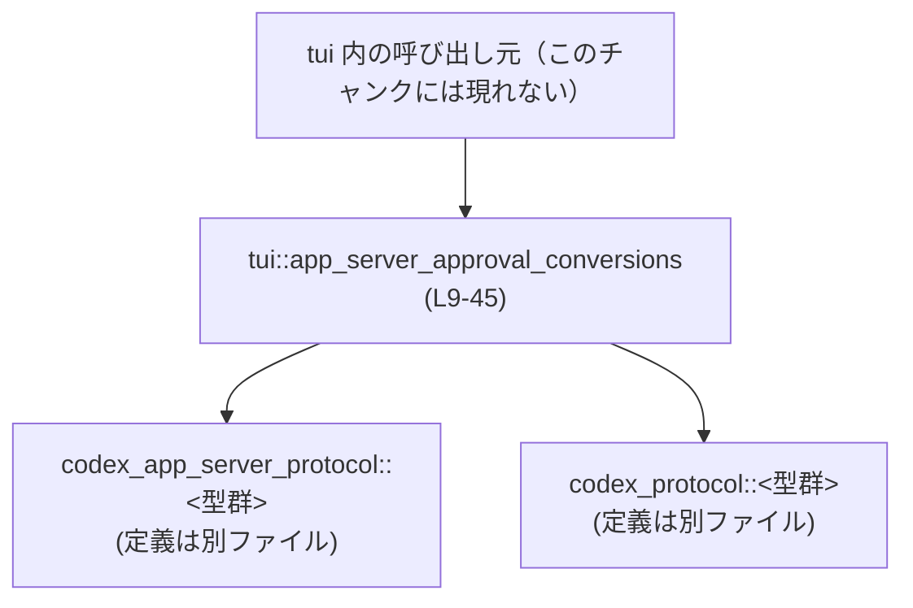
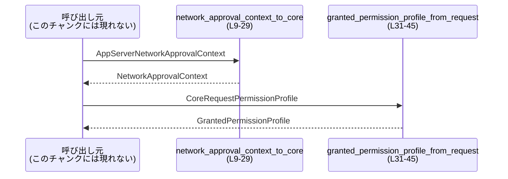

# tui/src/app_server_approval_conversions.rs

## 0. ざっくり一言

`codex_app_server_protocol` で定義された承認関連の型を、`codex_protocol` 側のコア型に変換するための、小さな変換ユーティリティ群です（ネットワーク承認コンテキストと権限プロファイルの変換を行います）。  

---

## 1. このモジュールの役割

### 1.1 概要

- このモジュールは、**アプリサーバ側プロトコルとコアプロトコルの間の型の差異を吸収する**ために存在しています。
- 具体的には、次の変換を提供します（いずれも `pub(crate)` でクレート内部専用です）。
  - アプリサーバ側の `NetworkApprovalContext` → コア側の `NetworkApprovalContext`（`network_approval_context_to_core`）  
    根拠: `tui/src/app_server_approval_conversions.rs:L9-29`
  - コア側の `RequestPermissionProfile` → アプリサーバ側の `GrantedPermissionProfile`（`granted_permission_profile_from_request`）  
    根拠: `tui/src/app_server_approval_conversions.rs:L31-45`

### 1.2 アーキテクチャ内での位置づけ

このモジュールは、tui クレート内部の呼び出し元と、`codex_app_server_protocol` / `codex_protocol` の型群との間に位置する変換レイヤーです。



- 呼び出し元コード（tui 内の他モジュール）は、このチャンクには登場しないため不明です。
- 依存先として `codex_app_server_protocol` と `codex_protocol` の型を利用しており、それらの定義はこのファイル外にあります。  
  根拠: `use` 群 `tui/src/app_server_approval_conversions.rs:L1-7`

### 1.3 設計上のポイント

- **ステートレスな変換関数のみ**を持ち、グローバル状態や内部状態は保持していません。  
  根拠: モジュール内に構造体・静的変数の定義が存在しない `L1-101`
- **所有権を消費する変換**  
  - 両関数とも引数を値として受け取り、その所有権を消費して別の型に組み直します。  
    根拠: 関数シグネチャの引数が参照ではなく値 `L9-11`, `L31-33`
- **エラーのない単純なマッピング**  
  - どちらの関数も `Result` を返さず単純に構造体フィールドを対応させるだけで、パニックやエラー分岐はありません。  
    根拠: 関数本体に `match` の網羅パターン以外のエラーハンドリングがない `L12-27`, `L34-44`
- **列挙型の明示的マッピング**  
  - ネットワークプロトコルの enum を、アプリサーバ版→コア版へ 1:1 で `match` しています。  
    根拠: `NetworkApprovalProtocol` を `match` で変換している部分 `L14-27`

---

## 2. 主要な機能一覧

- ネットワーク承認コンテキスト変換:  
  `network_approval_context_to_core`  
  アプリサーバ側 `NetworkApprovalContext` をコア側 `NetworkApprovalContext` に変換します。  
  根拠: `L9-29`
- 権限プロファイル変換:  
  `granted_permission_profile_from_request`  
  コア側 `RequestPermissionProfile` をアプリサーバ側 `GrantedPermissionProfile` に変換します。  
  根拠: `L31-45`

### 2.1 コンポーネント一覧（インベントリー）

| 名称 | 種別 | 可視性 | 定義範囲 | 役割 |
|------|------|--------|----------|------|
| `network_approval_context_to_core` | 関数 | `pub(crate)` | `tui/src/app_server_approval_conversions.rs:L9-29` | アプリサーバ側 `NetworkApprovalContext` をコア側 `NetworkApprovalContext` に変換する |
| `granted_permission_profile_from_request` | 関数 | `pub(crate)` | `tui/src/app_server_approval_conversions.rs:L31-45` | コア側 `RequestPermissionProfile` をアプリサーバ側 `GrantedPermissionProfile` に変換する |
| `tests` | モジュール | 非公開（テスト用） | `tui/src/app_server_approval_conversions.rs:L47-101` | 上記 2 関数の振る舞いを検証するユニットテストを保持する |
| `absolute_path` | 関数（テスト専用） | モジュール内 private | `tui/src/app_server_approval_conversions.rs:L60-62` | テスト内で `AbsolutePathBuf` を生成するための補助関数 |

---

## 3. 公開 API と詳細解説

### 3.1 型一覧（構造体・列挙体など）

このファイル内で新たに定義される公開構造体・列挙体はありません。  
利用している主な型は、すべて外部モジュールで定義されています。

| 名前 | 種別 | 定義場所 | 役割 / 用途 |
|------|------|----------|-------------|
| `AppServerNetworkApprovalContext` | 型エイリアス | `codex_app_server_protocol::NetworkApprovalContext`（このチャンクには定義が現れない） | アプリサーバ側で用いるネットワーク承認コンテキスト |
| `NetworkApprovalContext` | 構造体 | `codex_protocol::protocol`（このチャンクには定義が現れない） | コアプロトコル側で用いるネットワーク承認コンテキスト |
| `NetworkApprovalProtocol` | 列挙体 | `codex_protocol::protocol`（このチャンクには定義が現れない） | コア側の HTTP / HTTPS / SOCKS5 などのプロトコル種別 |
| `GrantedPermissionProfile` | 構造体 | `codex_app_server_protocol`（このチャンクには定義が現れない） | アプリサーバ側で実際に付与された権限のプロファイル |
| `CoreRequestPermissionProfile` | 型エイリアス | `codex_protocol::request_permissions::RequestPermissionProfile`（このチャンクには定義が現れない） | コア側でリクエストされる権限のプロファイル |
| `AdditionalNetworkPermissions` | 構造体 | `codex_app_server_protocol`（このチャンクには定義が現れない） | 追加のネットワーク権限設定（`enabled` フラグなど） |
| `AdditionalFileSystemPermissions` | 構造体 | `codex_app_server_protocol`（このチャンクには定義が現れない） | 追加のファイルシステム権限設定（read/write パスなど） |

> これらの型の具体的なフィールド定義は、このチャンクには含まれていないため不明です。

### 3.2 関数詳細

#### `network_approval_context_to_core(value: AppServerNetworkApprovalContext) -> NetworkApprovalContext`

**概要**

- アプリサーバ側の `NetworkApprovalContext` を、コアプロトコル側の `NetworkApprovalContext` に変換します。  
- `host` フィールドをそのままコピーし、`protocol` フィールドの enum をアプリサーバ版からコア版へマッピングします。  
  根拠: `tui/src/app_server_approval_conversions.rs:L12-27`

**引数**

| 引数名 | 型 | 説明 |
|--------|----|------|
| `value` | `AppServerNetworkApprovalContext` | アプリサーバ側プロトコルのネットワーク承認コンテキスト（`codex_app_server_protocol::NetworkApprovalContext` のエイリアス）。この関数に渡すと所有権は消費されます。 |

**戻り値**

- `NetworkApprovalContext`（`codex_protocol::protocol::NetworkApprovalContext`）  
  - `host`: `value.host` をそのまま移動（move）した値。  
    根拠: `L13`
  - `protocol`: `value.protocol` を `match` によりコア側 `NetworkApprovalProtocol` に変換した値。  
    根拠: `L14-27`

**内部処理の流れ**

1. 新しい `NetworkApprovalContext` 構造体をリテラル構文で生成します。  
   根拠: 構造体リテラル `NetworkApprovalContext { ... }` `L12-28`
2. `host` フィールドには `value.host` をそのまま代入（所有権移動）します。  
   根拠: `L13`
3. `protocol` フィールドについて、`value.protocol` を `match` し、各バリアントをコア側の `NetworkApprovalProtocol` の対応するバリアントにマッピングします。  
   - `Http` → `NetworkApprovalProtocol::Http` `L15-17`
   - `Https` → `NetworkApprovalProtocol::Https` `L18-20`
   - `Socks5Tcp` → `NetworkApprovalProtocol::Socks5Tcp` `L21-23`
   - `Socks5Udp` → `NetworkApprovalProtocol::Socks5Udp` `L24-26`
4. 生成した `NetworkApprovalContext` を返します。  
   根拠: 関数末尾 `L12-28`

**Examples（使用例）**

以下は、テストコード（`L64-76`）と同様の使い方の例です。

```rust
use codex_app_server_protocol::NetworkApprovalContext as AppServerNetworkApprovalContext;
use codex_app_server_protocol::NetworkApprovalProtocol as AppServerNetworkApprovalProtocol;
use codex_protocol::protocol::{NetworkApprovalContext, NetworkApprovalProtocol};

// アプリサーバ側のコンテキストを構築する
let app_ctx = AppServerNetworkApprovalContext {
    host: "example.com".to_string(),                      // ホスト名
    protocol: AppServerNetworkApprovalProtocol::Socks5Tcp // SOCKS5/TCP プロトコル
};

// コア側のコンテキストに変換する（所有権は app_ctx から移動される）
let core_ctx: NetworkApprovalContext = network_approval_context_to_core(app_ctx);

// core_ctx.host == "example.com"
// core_ctx.protocol == NetworkApprovalProtocol::Socks5Tcp
```

**Errors / Panics**

- この関数内ではエラー型（`Result`）や `panic!` 相当の呼び出しは行っていません。  
  根拠: 関数本体 `L12-28` にエラー処理が存在しない
- enum の `match` は全バリアントを列挙しているため、ランタイムエラーではなく「コンパイル時に網羅性が検証される」形式になっています。  
  根拠: `NetworkApprovalProtocol` の 4 バリアントがすべて列挙されている `L14-27`

**Edge cases（エッジケース）**

- `host` が空文字列の場合  
  - この関数は何も検証せず、そのまま `NetworkApprovalContext.host` としてコピーします。  
    根拠: `L13` にバリデーションがない
- `value.protocol` がいずれかのバリアントである場合  
  - 4 バリアントのいずれであっても対応するコア側バリアントが返されます。未知のバリアントは存在しない前提でコンパイルされています。  
    根拠: `L14-27`

**使用上の注意点**

- `value` は所有権を消費するため、呼び出し後に `value` を再利用することはできません。必要であれば、呼び出し前に `clone` する設計が必要になります（ただし、そのコストは型定義次第であり、このチャンクからは不明です）。  
  根拠: 引数が `value: AppServerNetworkApprovalContext` と値渡しになっている `L9-11`
- この関数は入力値の妥当性チェック（ホスト名の形式や許可されたプロトコルかどうかなど）を行いません。チェックが必要な場合は呼び出し元で行う必要があります。  
  根拠: 関数本体に検証ロジックがない `L12-28`

---

#### `granted_permission_profile_from_request(value: CoreRequestPermissionProfile) -> GrantedPermissionProfile`

**概要**

- コア側 `RequestPermissionProfile` を、アプリサーバ側 `GrantedPermissionProfile` に変換します。  
- `network` と `file_system` の各フィールドを、`Option` を維持したままラップする形でコピーします。  
  根拠: `tui/src/app_server_approval_conversions.rs:L34-44`

**引数**

| 引数名 | 型 | 説明 |
|--------|----|------|
| `value` | `CoreRequestPermissionProfile` | コアプロトコル側でリクエストされた権限プロファイル（`codex_protocol::request_permissions::RequestPermissionProfile` の別名）。所有権は関数内で消費されます。 |

**戻り値**

- `GrantedPermissionProfile`（`codex_app_server_protocol::GrantedPermissionProfile`）  
  - `network`: `Option<AdditionalNetworkPermissions>`  
    - 元の `value.network` (`Option<NetworkPermissions>`) を `map` し、`enabled` をそのままコピーします。  
      根拠: `L35-37`
  - `file_system`: `Option<AdditionalFileSystemPermissions>`  
    - 元の `value.file_system` (`Option<FileSystemPermissions>`) を `map` し、`read` と `write` フィールドをそのままコピーします。  
      根拠: `L38-43`

**内部処理の流れ**

1. 新しい `GrantedPermissionProfile` 構造体のリテラルを生成します。  
   根拠: `L34-44`
2. `network` フィールド:
   - `value.network`（`Option<NetworkPermissions>`）に対して `map` を呼び出し、`Some(network)` の場合に `AdditionalNetworkPermissions { enabled: network.enabled }` に変換します。  
     根拠: `L35-37`
   - `None` の場合は `None` のままです（`Option::map` の仕様）。  
3. `file_system` フィールド:
   - `value.file_system`（`Option<FileSystemPermissions>`）に対して `map` を呼び出し、`Some(file_system)` の場合に `AdditionalFileSystemPermissions { read: file_system.read, write: file_system.write }` に変換します。  
     根拠: `L38-43`
   - `None` の場合は `None` のままです。
4. 生成した `GrantedPermissionProfile` を返します。  

**Examples（使用例）**

テスト `converts_request_permissions_into_granted_permissions`（`L78-100`）と同様の例です。

```rust
use codex_protocol::models::{NetworkPermissions, FileSystemPermissions};
use codex_protocol::request_permissions::RequestPermissionProfile as CoreRequestPermissionProfile;
use codex_app_server_protocol::{
    GrantedPermissionProfile,
    AdditionalNetworkPermissions,
    AdditionalFileSystemPermissions,
};

// Core側のリクエスト権限プロファイル
let core_profile = CoreRequestPermissionProfile {
    network: Some(NetworkPermissions {
        enabled: Some(true), // ネットワーク使用を許可
    }),
    file_system: Some(FileSystemPermissions {
        read: Some(vec![/* 読み取り許可パス */]),
        write: Some(vec![/* 書き込み許可パス */]),
    }),
};

// App server側の「付与された権限プロファイル」に変換
let granted: GrantedPermissionProfile =
    granted_permission_profile_from_request(core_profile);

// granted.network.unwrap().enabled == Some(true)
// granted.file_system.unwrap().read / write も元の値をそのまま保持
```

**Errors / Panics**

- この関数そのものは `Result` を返さず、`unwrap` や `expect` も使っていないため、パニックは発生しません。  
  根拠: 関数本体 `L34-44` にエラー処理がない
- ただし、この関数の利用者が `granted.network.unwrap()` のように `Option` を強制的に開く場合には、別途パニックの可能性がありますが、それは呼び出し側の責務であり、このチャンクからは分かりません。

**Edge cases（エッジケース）**

- `value.network == None` の場合  
  - `granted.network` も `None` になります。  
    根拠: `Option::map` の使用 `L35-37`
- `value.network == Some(NetworkPermissions { enabled: None })` の場合  
  - `AdditionalNetworkPermissions { enabled: None }` に変換されます（意味的には「フラグ未指定」のままを保持）。  
    根拠: フィールドをそのままコピー `L35-37`
- `value.file_system == None` の場合  
  - `granted.file_system` も `None` です。  
    根拠: `L38-43`
- `value.file_system == Some(FileSystemPermissions { read: None, write: None })` の場合  
  - 対応する `AdditionalFileSystemPermissions` でも `read: None, write: None` を保持します。  
    根拠: フィールドコピー `L40-42`

**使用上の注意点**

- この変換は **単純なフィールドコピー** であり、「リクエストされた権限をそのまま付与する」ような振る舞いになっています。  
  - 実際に「拒否された権限」を落とし込むロジック（例えばリクエストと実際の可用権限の差分を取るなど）は、このファイル内には存在しません。  
    根拠: `L34-44` にフィルタリングや検証がない
- `value` の所有権を消費するため、呼び出し後に元の `CoreRequestPermissionProfile` を再利用することはできません。  
  根拠: 引数が値渡し `L31-33`

---

### 3.3 その他の関数

| 関数名 | 定義範囲 | 役割（1 行） |
|--------|----------|--------------|
| `absolute_path(path: &str) -> AbsolutePathBuf` | `tui/src/app_server_approval_conversions.rs:L60-62` | テスト内で、文字列パスから `AbsolutePathBuf` を生成する補助関数（非絶対パスの場合には `expect` でパニックする） |

---

## 4. データフロー

このモジュールの関数は純粋なデータ変換であり、I/O や非同期処理を伴いません。代表的な利用シナリオとしては、呼び出し元がアプリサーバ／コア間のプロトコルで受信・送信するオブジェクトを、内部ロジックで扱いやすい型に変換する場面が想定されます（呼び出し元はこのチャンクには現れません）。



- `Caller` は tui クレート内の別モジュールであり、このファイルには現れないため具体的な型や関数名は不明です。
- 両関数は引数→戻り値の単純変換のみで、他の内部コンポーネントを呼び出していません。  
  根拠: 関数本体 `L12-27`, `L34-44` に外部関数呼び出しがない

---

## 5. 使い方（How to Use）

### 5.1 基本的な使用方法

**ネットワーク承認コンテキストの変換**

```rust
use codex_app_server_protocol::NetworkApprovalContext as AppServerNetworkApprovalContext;
use codex_app_server_protocol::NetworkApprovalProtocol as AppServerNetworkApprovalProtocol;
use codex_protocol::protocol::{NetworkApprovalContext, NetworkApprovalProtocol};

// app_server_approval_conversions.rs と同一モジュール、または同一クレート内の呼び出し例

let app_ctx = AppServerNetworkApprovalContext {
    host: "example.com".to_string(),
    protocol: AppServerNetworkApprovalProtocol::Https,
};

let core_ctx: NetworkApprovalContext = network_approval_context_to_core(app_ctx);

// core_ctx.host == "example.com"
// core_ctx.protocol == NetworkApprovalProtocol::Https
```

**権限プロファイルの変換**

```rust
use codex_protocol::models::{NetworkPermissions, FileSystemPermissions};
use codex_protocol::request_permissions::RequestPermissionProfile as CoreRequestPermissionProfile;
use codex_app_server_protocol::GrantedPermissionProfile;

let core_profile = CoreRequestPermissionProfile {
    network: Some(NetworkPermissions { enabled: Some(true) }),
    file_system: Some(FileSystemPermissions {
        read: None,
        write: None,
    }),
};

let granted: GrantedPermissionProfile =
    granted_permission_profile_from_request(core_profile);

// granted.network.is_some()、かつ enabled == Some(true)
// granted.file_system.unwrap().read / write は元の値（ここでは None）を維持
```

> どちらの関数も `pub(crate)` のため、**同一クレート内からのみ呼び出し可能**です。  
> 根拠: `pub(crate) fn` 宣言 `L9`, `L31`

### 5.2 よくある使用パターン（想定）

呼び出し元コードはこのチャンクには現れないため確定的な利用パターンは分かりませんが、次のような利用が自然に想定されます（あくまで想定であり、コードからは断定できません）:

- アプリサーバから受け取った `NetworkApprovalContext` をコアロジックに渡す前に `network_approval_context_to_core` で変換する。
- コアロジックが計算した `RequestPermissionProfile` を、アプリサーバに返す `GrantedPermissionProfile` に変換するために `granted_permission_profile_from_request` を用いる。

### 5.3 よくある間違い（起こりうる注意点）

- **同じ入力値を再利用しようとする**

  ```rust
  // 誤りの例: app_ctx を変換後も使おうとしている
  let app_ctx = AppServerNetworkApprovalContext { /* ... */ };
  let core_ctx = network_approval_context_to_core(app_ctx);
  // let again = app_ctx; // コンパイルエラー: app_ctx の所有権はすでに move 済み
  ```

  正しくは、必要であればクローンするか、再度生成する必要があります。  
  根拠: 引数が値渡しであり、関数内でそのまま move されている `L9-11`, `L12-13`

- **クレート外から呼び出そうとする**

  - 両関数は `pub(crate)` のため、別クレートからは可視ではありません（これはコンパイル時にエラーになります）。  
    根拠: `pub(crate)` 修飾子 `L9`, `L31`

### 5.4 使用上の注意点（まとめ）

- 両関数とも **入力の検証・正規化は行わない** ため、必要であれば呼び出し元でバリデーションを行う前提となります。  
  根拠: いずれの関数にも検証ロジックが存在しない `L12-27`, `L34-44`
- 両関数は **純粋な関数** (pure function) であり、副作用（I/O・ログ出力・グローバル状態の変更など）は持ちません。並行環境でも安全に再利用しやすい構造になっています。  
  根拠: 外部呼び出しやミューテーションがない `L9-45`
- パフォーマンス面では、フィールドコピーと `Option::map`／`match` のみであり、オーバーヘッドは定数時間・定数メモリにとどまる構造です（フィールド自体のコストは外部型の定義によります）。  

---

## 6. 変更の仕方（How to Modify）

### 6.1 新しい機能を追加する場合

- **ネットワークプロトコルが増えた場合**  
  - 例えばアプリサーバ側 `NetworkApprovalProtocol` に新たなバリアントが追加された場合、このファイルの `match` にも同様のバリアントを追加する必要があります。  
    根拠: 現状 4 バリアントを明示列挙している `L14-27`
  - 追加後、網羅性が確保されないとコンパイルエラーになるため、変更箇所の特定は容易です。
- **権限プロファイルのフィールドが増えた場合**  
  - `CoreRequestPermissionProfile` に新しいフィールド（例: `clipboard` 権限など）が追加された場合、それを `GrantedPermissionProfile` にどのようにマッピングするかを `granted_permission_profile_from_request` 内に明示的に追加する必要があります。  
    根拠: 現状、`network` と `file_system` のみを扱っている `L34-44`
  - 追加したフィールドのテストケースも `tests` モジュールに追加すると、挙動が明確になります。

### 6.2 既存の機能を変更する場合

- **変換仕様を変更する際の影響範囲**

  - `network_approval_context_to_core` の変換仕様変更は、コア側で `NetworkApprovalContext` を受け取っている全箇所に影響します。呼び出し元はこのチャンクには現れないため、クレート全体を検索して確認する必要があります。
  - `granted_permission_profile_from_request` の仕様変更は、アプリサーバ側で `GrantedPermissionProfile` を利用している箇所に影響します。

- **契約（前提条件・返り値の意味）の確認**

  - このファイルでは「フィールドをそのままコピーする」という暗黙の契約があります。  
    - 例えば「リクエストされた権限の一部を拒否して `GrantedPermissionProfile` に反映しない」という仕様を導入する場合、テスト `converts_request_permissions_into_granted_permissions`（`L78-100`）も合わせて変更する必要があります。

- **テストの更新**

  - 2 つのユニットテスト `converts_app_server_network_approval_context_to_core`（`L64-76`）と `converts_request_permissions_into_granted_permissions`（`L78-100`）は、この変換ロジックの仕様を具体的な値で固定しています。
  - 変換仕様を変更した場合、期待値側の `assert_eq!` を適切に更新し、意図した新仕様を反映させる必要があります。

---

## 7. 関連ファイル

このモジュールが依存している主な外部ファイル・モジュールは以下のとおりです。いずれも、このチャンクには定義が現れていません。

| パス / モジュール | 役割 / 関係 |
|-------------------|------------|
| `codex_app_server_protocol::NetworkApprovalContext` | アプリサーバ側のネットワーク承認コンテキスト型。`AppServerNetworkApprovalContext` エイリアスとして使用され、`network_approval_context_to_core` の入力となる。`L4`, `L67-70` |
| `codex_protocol::protocol::NetworkApprovalContext` | コア側のネットワーク承認コンテキスト型。`network_approval_context_to_core` の戻り値およびテストの期待値で使用。`L5`, `L53`, `L71-74` |
| `codex_app_server_protocol::NetworkApprovalProtocol` | アプリサーバ側ネットワークプロトコル enum。`match` の入力として使用。`L14-27`, `L69` |
| `codex_protocol::protocol::NetworkApprovalProtocol` | コア側ネットワークプロトコル enum。`match` の出力として使用。`L16`, `L19`, `L22`, `L25`, `L54`, `L73` |
| `codex_protocol::request_permissions::RequestPermissionProfile` | コア側の権限リクエストプロファイル。`CoreRequestPermissionProfile` エイリアスとして使用し、`granted_permission_profile_from_request` の入力となる。`L7`, `L55`, `L81-89` |
| `codex_app_server_protocol::GrantedPermissionProfile` | アプリサーバ側の付与された権限プロファイル。`granted_permission_profile_from_request` の戻り値およびテストの期待値で使用。`L3`, `L90-98` |
| `codex_app_server_protocol::{AdditionalNetworkPermissions, AdditionalFileSystemPermissions}` | アプリサーバ側のネットワーク / ファイルシステムの追加権限設定。`granted_permission_profile_from_request` 内でフィールドを構築するために利用。`L1-2`, `L35-37`, `L40-42`, `L91-97` |
| `codex_utils_absolute_path::AbsolutePathBuf` | テスト用の絶対パス型。`absolute_path` 関数で使用。`L56`, `L60-62`, `L86-87`, `L95-96` |

---

## Bugs / Security / Contracts / Tests / パフォーマンス まとめ（簡潔）

- **既知のバグ**: このチャンクから読み取れる範囲では、明らかなバグは確認できません。変換は対応するフィールドをそのままマッピングしています。  
- **セキュリティ**:
  - ネットワークやファイルシステムへのアクセスは行っておらず、単に権限情報の構造体を変換するのみです。
  - 実際の「権限チェック」や「制約 enforcing」は、このファイル外で行われる前提ですが、その詳細は不明です。
- **契約 / エッジケース**:
  - Option フィールド (`network`, `file_system`, それぞれの `enabled` / `read` / `write`) は、`None` を `None` のまま維持する契約になっています。  
    根拠: `Option::map` を用いた単純コピー `L35-37`, `L38-43`
- **テスト**:
  - 2 つのユニットテストが存在し、変換ロジックの代表的なケースをカバーしています。  
    - プロトコル `Socks5Tcp` の変換テスト `L64-76`  
    - `network.enabled` と `file_system.read/write` のコピーのテスト `L78-100`
- **パフォーマンス / 並行性**:
  - 定数時間・定数メモリの変換関数であり、高負荷シナリオでもボトルネックにはなりにくい構造です。
  - グローバル状態やミュータブルな共有データを持たないため、複数スレッドから同時に呼び出しても競合状態は発生しません（ただし、渡される型自体のスレッド安全性はこのチャンクからは分かりません）。
- **観測性**:
  - ログ出力やメトリクス送信などの観測コードは一切含まれていません。必要であれば呼び出し元側でログを追加するのが自然です。
