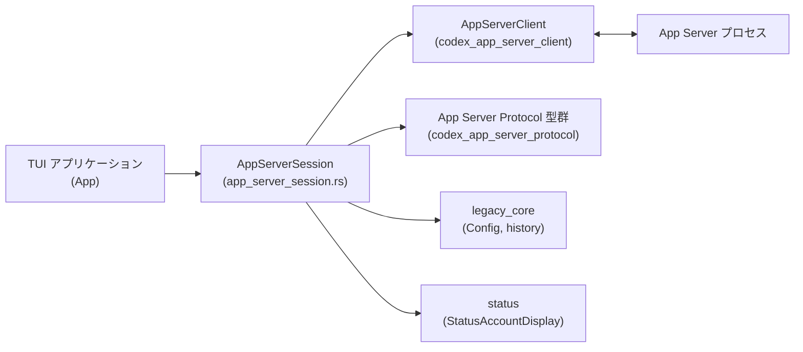
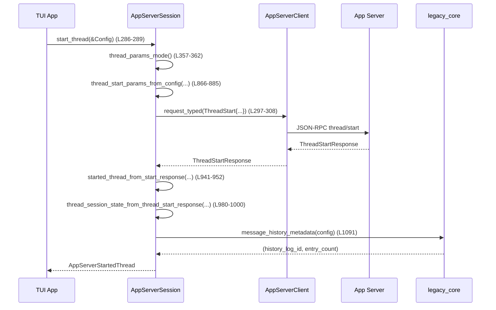

# tui/src/app_server_session.rs 解説レポート

## 0. ざっくり一言

TUI からアプリケーションサーバーへの通信を抽象化する「セッション層」のモジュールで、  
アカウント情報取得、モデル一覧・スレッドライフサイクル・ターン操作・リアルタイム会話・レート制限情報などを一括して扱います。  
[根拠: `tui/src/app_server_session.rs`:L96-1159]

---

## 1. このモジュールの役割

### 1.1 概要

- このモジュールは **TUI と App Server 間の JSON-RPC/typed RPC を隠蔽するセッションオブジェクト** を提供します。  
- 具体的には、アカウント情報・モデル一覧の取得、Thread（会話スレッド）の開始/再開/分岐、Turn（1ラウンド）の開始/制御、レビュー・スキル・リアルタイム音声/テキストなど多くの操作を 1 つの `AppServerSession` 経由で行えるようにします。  
  [根拠: L117-121, L162-760]

### 1.2 アーキテクチャ内での位置づけ

AppServerSession は TUI 側のコードと App Server クライアントライブラリの間に位置する薄いファサードです。



- TUI (`App` 相当) はこのモジュールの `AppServerSession` を通じてサーバー操作を行います。[L162-760]
- `AppServerSession` は `AppServerClient` に対して typed request (`ClientRequest::*`) を送り、typed response を受け取ります。[L8-11, L184-199, L296-308 など]
- `Config` やメッセージ履歴などのローカル状態は `legacy_core` から取得します。[L4-5, L1091]
- ステータス表示用の情報は `StatusAccountDisplay` などにマッピングされます。[L6, L763-777]

### 1.3 設計上のポイント

- **ファサード/ラッパー設計**  
  - ほとんどのメソッドは `ClientRequest::*` にパラメータを組み立てて `AppServerClient::request_typed` に渡す薄いラッパーとして実装されています。[L184-199, L296-308, L364-373 など]
- **セッション単位の request_id 管理**  
  - `AppServerSession` が `next_request_id: i64` を持ち、すべてのリクエストにユニークな `RequestId::Integer` を付与します。[L117-120, L756-760]
- **接続モードごとのパラメータ制御**  
  - `ThreadParamsMode`（Embedded/Remote）を導入し、ローカル実行とリモート実行で `cwd` や `model_provider` をどう送るかを切り替えます。[L142-155, L866-885, L887-904, L907-925]
- **エラーハンドリング**  
  - 多くのメソッドは `color_eyre::Result` を返し、`wrap_err` で文脈を付与して上位に伝搬します。[L90-92, L184-199, L269-280 など]
  - 一部のメソッド（`turn_steer` や I/O メソッド）はより具体的なエラー型（`TypedRequestError`, `std::io::Error`）を返します。[L473-491, L732-746]
- **非同期 & 所有権/借用**  
  - ネットワーク呼び出しはすべて `async fn` + `.await` で実装され、`&mut self` を取ることで同一セッションに対するリクエストの直列化が保証されます。[L184-263, L286-355 など]
- **セッション状態の明示的モデリング**  
  - `ThreadSessionState` 構造体により、現在のスレッドのモデル・Sandbox ポリシー・履歴メタデータなどを一箇所にまとめています。[L123-140, L1069-1110]
- **プロトコル間マッピング**  
  - モデルプリセット・レート制限・レビュー対象などを、App Server プロトコル型と内部コア型の間で変換するユーティリティが用意されています。[L789-832, L1046-1062, L1113-1158]

---

## 2. 主要な機能一覧

このモジュールが提供する主な機能は次のとおりです。

- TUI ブートストラップ:
  - アカウント情報とモデル一覧の取得、デフォルトモデル・フィードバック向け属性の決定。[L184-263]
- Thread ライフサイクル管理:
  - `thread/start`, `thread/resume`, `thread/fork`, `thread/list`, `thread/read`, `thread/rollback` など。[L286-355, L364-373, L391-409, L581-597]
- Thread メタ情報操作:
  - 名前設定、購読解除、コンパクト開始、シェルコマンド実行、バックグラウンドターミナルのクリーンアップ。[L493-561, L563-579]
- Turn 操作:
  - 新規ターン開始（ユーザー入力送信）、進行中ターンの中断・ステア（追加入力）。[L411-451, L453-471, L473-491]
- レビューとスキル:
  - コードレビュー開始、スキル一覧取得。[L599-615, L618-627]
- リアルタイム会話:
  - 音声・テキストストリームによるリアルタイム会話開始/追記/終了。[L647-675, L677-695, L697-715, L717-729]
- 設定リロード:
  - `config/batchWrite` によるユーザー設定リロードトリガー。[L629-645]
- サーバーからのリクエストへの応答:
  - JSON-RPC リクエストの成功/失敗応答を送信。[L732-746]
- レート制限・クレジット情報マッピング:
  - App Server からのレート制限スナップショットを TUI コア型へ変換。[L1113-1158]
- UI 表示用マッピング:
  - アカウント種別から `StatusAccountDisplay` や `FeedbackAudience` を決定。[L763-787]
- Thread セッション状態構築:
  - Thread レスポンスから `ThreadSessionState` を構築し、履歴メタデータを埋める。[L980-1000, L1002-1022, L1024-1044, L1069-1110]

---

## 3. 公開 API と詳細解説

### 3.1 型一覧（構造体・列挙体など）

| 名前 | 種別 | 役割 / 用途 | 定義位置 |
|------|------|-------------|----------|
| `AppServerBootstrap` | 構造体 | TUI ブートストラップ時に取得するアカウント・モデル・フィードバック関連情報のまとめ。メインループ初期化に使用。 | `tui/src/app_server_session.rs:L96-115` |
| `AppServerSession` | 構造体 | `AppServerClient` を内包し、すべての App Server 操作をメソッドとして提供するセッションオブジェクト。 | L117-121, L162-760 |
| `ThreadSessionState` | 構造体 | 現在の会話スレッドの ID・モデル設定・Sandbox・履歴メタデータなどを保持する TUI 側セッション状態。 | L123-140, L1094-1110 |
| `ThreadParamsMode` | enum | Thread 開始/再開/フォーク時のパラメータ生成モード（ローカル実行＝Embedded かリモート実行＝Remote か）。 | L142-155 |
| `AppServerStartedThread` | 構造体 | Thread 開始/再開/フォーク API から戻る「初期セッション状態 + 既存ターン一覧」。 | L157-160, L941-952, L954-965, L967-978 |

※ いずれも `pub(crate)` なのでクレート内の他モジュールから利用されます。

---

### 3.2 関数詳細（7 件）

このセクションでは、特に重要な 7 関数を詳細に説明します。

#### 1. `AppServerSession::bootstrap(&mut self, config: &Config) -> Result<AppServerBootstrap>`

**概要**

- TUI 起動時に一度だけ呼び出されることを想定したメソッドで、  
  アカウント情報とモデル一覧を App Server から取得し、UI 初期化に必要な `AppServerBootstrap` を構築します。[L184-263]

**引数**

| 引数名 | 型 | 説明 |
|--------|----|------|
| `self` | `&mut AppServerSession` | セッションオブジェクト。内部で request_id を更新するため可変参照。 |
| `config` | `&Config` | ローカル設定。デフォルトモデル選択などに利用。 |

**戻り値**

- `Result<AppServerBootstrap>`（`color_eyre::Result` エイリアス）  
  - 成功時: アカウントメール・Auth モード・プラン・デフォルトモデル・利用可能なモデル一覧・フィードバック送付先などが入った構造体。  
  - 失敗時: `AppServerClient` 経由のエラーやモデル一覧が空の場合などに `Report` を返す。  

**内部処理の流れ**

1. `read_account()` を呼び出して、現在のアカウント情報を取得。[L185-186, L269-280]
2. `next_request_id()` で新しい `RequestId` を採番。[L186-187, L756-760]
3. `ClientRequest::ModelList` を `request_typed` で送信し、モデル一覧 (`ModelListResponse`) を取得。[L187-199]
4. `model_preset_from_api_model` で App Server の `ApiModel` を TUI コアの `ModelPreset` に変換し、`available_models` とする。[L199-203, L789-832]
5. デフォルトモデルを次の優先順で決定。[L204-214]
   - `config.model` が設定されていればそれを使用。[L204-207]
   - そうでなければ、`available_models` のうち `is_default == true` のものを探す。[L208-212]
   - それもなければ、`available_models` の先頭要素を使用。[L213-213]
   - どれも該当しない場合（= モデル一覧が空など）は `wrap_err` によりエラーにする。[L214]
6. `account.account` のバリアントごとに Telemetry 用 Auth モード、ステータス表示、フィードバック送付先、プラン種別を判定。[L216-251]
7. 得られた情報と `account.requires_openai_auth`・`available_models` をまとめて `AppServerBootstrap` を返す。[L252-262]

**Examples（使用例）**

```rust
use codex_app_server_client::AppServerClient;
use tui::app_server_session::AppServerSession;
use crate::legacy_core::config::Config;

// クライアントとセッションを構築
let client = AppServerClient::Remote(/* ...接続設定... */);
let mut session = AppServerSession::new(client);          // L162-169

// 設定を読み込み（詳細は別モジュール）
let config: Config = /* ... */;

// ブートストラップを実行
let bootstrap = session.bootstrap(&config).await?;

// 取得した情報を UI 初期化に利用
println!("Default model: {}", bootstrap.default_model);
```

**Errors / Panics**

- `read_account()` 内のネットワークエラー・認証エラーなどがあれば、そのまま `Err` として返ります。[L269-280]
- `model/list` リクエストが失敗した場合、`"model/list failed during TUI bootstrap"` というメッセージを付加したエラーになります。[L187-199]
- モデル一覧が空、かつ `config.model` も設定されていない場合は `"model/list returned no models for TUI bootstrap"` というエラーになります。[L204-214]
- パニックを起こすような `unwrap` は使用していません（`wrap_err` 経由でエラーに変換）。

**Edge cases（エッジケース）**

- モデル一覧が 1 件も返ってこない場合: 上記のとおりエラーを返して起動に失敗します。[L204-214]
- アカウントが匿名 (`account.account == None`) の場合: メールやプランなし、`FeedbackAudience::External` として扱われます。[L250-251]
- ChatGPT アカウントで `@openai.com` ドメインの場合: フィードバック先が `OpenAiEmployee` になります。[L233-237]

**使用上の注意点**

- 非同期関数のため、必ず `async` コンテキストから `await` する必要があります。
- この関数はネットワーク I/O を伴うため、繰り返し頻繁に呼ぶと起動時間に影響します。通常は TUI 起動時の 1 回の利用が想定されます。
- 成功してもレート制限スナップショットは含まれていません（コメントで明示）。レート制限は別途非同期で取得する前提です。[L96-101]

---

#### 2. `AppServerSession::start_thread_with_session_start_source(...) -> Result<AppServerStartedThread>`

**概要**

- 新しい Thread（会話セッション）を App Server 上に作成し、その Thread の初期状態 (`ThreadSessionState` + 既存ターン) を返します。[L291-311]
- Thread がどのような「開始ソース」（例: `Clear`）から始まったかを `session_start_source` で指定できます。[L870-882, L1195-1207]

**引数**

| 引数名 | 型 | 説明 |
|--------|----|------|
| `self` | `&mut AppServerSession` | セッション。`next_request_id` を更新するため可変。 |
| `config` | `&Config` | Thread 初期パラメータ（モデル、Sandbox ポリシー、approval ポリシーなど）のソース。 |
| `session_start_source` | `Option<ThreadStartSource>` | Thread 開始の理由やソース（例: 画面クリアからの新規開始など）。`None` の場合は指定なし。 |

**戻り値**

- `Result<AppServerStartedThread>`  
  - `session`: `ThreadSessionState`（ローカルで追跡するセッション状態）  
  - `turns`: その Thread に既に存在するターン一覧  

**内部処理の流れ**

1. `next_request_id()` でリクエスト ID を採番。[L296-297]
2. `thread_params_mode()` により、Embedded/Remote モードを判定。[L301-304, L357-362]
3. `thread_start_params_from_config` を呼び、`ThreadStartParams` を生成。[L301-306, L866-885]
   - `cwd`・`model_provider`・Sandbox・approval・config override などを設定。
4. `ClientRequest::ThreadStart` を `request_typed` で送信し、`ThreadStartResponse` を受信。[L297-308]
5. `started_thread_from_start_response` を通じて `AppServerStartedThread` に変換。[L309-310, L941-952]
   - 内部で `thread_session_state_from_thread_start_response` が呼ばれ、履歴メタデータを含む `ThreadSessionState` が構築されます。[L980-1000, L1069-1110]

**Examples（使用例）**

```rust
// config は既に構築済みとする
let started = session
    .start_thread_with_session_start_source(&config, Some(ThreadStartSource::Clear))
    .await?;                                             // L291-311

println!("New thread id = {}", started.session.thread_id);
println!("Existing turns = {}", started.turns.len());
```

**Errors / Panics**

- `thread/start` リクエストが失敗した場合、`"thread/start failed during TUI bootstrap"` という文脈つきエラーになります。[L297-309]
- `ThreadStartResponse` 内の `thread.id` が不正文字列だった場合などは、`thread_session_state_from_thread_response` 内で `Err(String)` になります。[L1084-1085]
  - これは `started_thread_from_start_response` 内で `eyre::Report` に変換され、`Result` のエラーとして返ります。[L945-947]
- `message_history_metadata` の返す件数が `u64` に収まらないほど大きい場合、`history_entry_count` は `u64::MAX` に丸められますが、パニックにはなりません。[L1091-1092]

**Edge cases**

- Remote セッションで `remote_cwd_override` が設定されていない場合、`cwd` は `None` となり、サーバー側のデフォルトに任せる挙動になります（テストで保証）。[L928-938, L1210-1241]
- Embedded セッションの場合は常にローカル `config.cwd` が送られます。[L928-933, L1179-1193]

**使用上の注意点**

- `config` の内容（特に Sandbox ポリシーや approval ポリシー）は Thread に引き継がれます。危険な Sandbox ポリシー（`DangerFullAccess`）を設定している場合はサーバー側でファイルシステム全体へのアクセスが許可される可能性があります。[L851-863]
- `session_start_source` の指定は UI 側での挙動解析やテレメトリに使われることが想定されます。テストで `ThreadStartSource::Clear` が反映されることが確認されています。[L1195-1207]

---

#### 3. `AppServerSession::turn_start(...) -> Result<TurnStartResponse>`

**概要**

- 指定した Thread に対して新しい Turn（ユーザー入力とそれに対するエージェントの応答ラウンド）を開始します。[L411-451]
- モデルや Sandbox ポリシー、Personality、出力スキーマなど、Turn 単位の詳細な実行パラメータを指定できます。

**引数**

| 引数名 | 型 | 説明 |
|--------|----|------|
| `self` | `&mut AppServerSession` | セッション。 |
| `thread_id` | `ThreadId` | 対象の Thread。`to_string()` で送信。 |
| `items` | `Vec<codex_protocol::user_input::UserInput>` | ユーザー入力（テキスト/コードなど）の配列。 |
| `cwd` | `PathBuf` | 実行時カレントディレクトリ。`Some(cwd)` として送信。 |
| `approval_policy` | `AskForApproval` | 実行前にユーザー承認を要するかどうか。 |
| `approvals_reviewer` | `config_types::ApprovalsReviewer` | レビューを誰が行うか（ユーザー/チームなど）。 |
| `sandbox_policy` | `SandboxPolicy` | ファイルアクセスなどの Sandbox 制御ポリシー。 |
| `model` | `String` | 使用するモデル名。 |
| `effort` | `Option<ReasoningEffort>` | 推論強度（深い推論/軽い推論）など。 |
| `summary` | `Option<ReasoningSummary>` | 推論サマリ構成用設定。 |
| `service_tier` | `Option<Option<ServiceTier>>` | サービスグレード（通常/高速など）指定。 |
| `collaboration_mode` | `Option<CollaborationMode>` | 協働モード設定。 |
| `personality` | `Option<Personality>` | エージェントの性格・スタイル設定。 |
| `output_schema` | `Option<serde_json::Value>` | 構造化出力のスキーマ。 |

**戻り値**

- `Result<TurnStartResponse>`  
  - 成功時: App Server の `turn/start` レスポンス。  
  - 失敗時: `eyre::Report` にラップされたエラー。

**内部処理の流れ**

1. `next_request_id()` で request_id を採番。[L428-429]
2. `items` を App Server プロトコルの `UserInput` に変換して `TurnStartParams::input` に格納。[L433-435]
3. `cwd` や approval/sandbox/model など、各種パラメータを `TurnStartParams` に設定。[L436-447]
4. `ClientRequest::TurnStart` を `request_typed` で送信し、`TurnStartResponse` を受信。[L429-448]
5. エラー時には `"turn/start failed in TUI"` という文脈でエラーを返す。[L449-451]

**Examples（使用例）**

```rust
use codex_protocol::user_input::UserInput;

// 単純なテキスト入力から Turn を開始する例
let inputs = vec![UserInput::from_text("Explain this function")]; // 型変換は Into 実装に依存

let resp = session
    .turn_start(
        thread_id,
        inputs,
        config.cwd.clone(),
        AskForApproval::Never,
        config.approvals_reviewer,
        config.permissions.sandbox_policy.get().clone(),
        config.model.clone().expect("model must be set"),
        None,          // effort
        None,          // summary
        None,          // service_tier
        None,          // collaboration_mode
        None,          // personality
        None,          // output_schema
    )
    .await?;
```

**Errors / Panics**

- ネットワークエラーやサーバー側のエラーが発生すると `Err(Report)` になります。[L449-451]
- パニックを誘発するような `unwrap` や `expect` はこの関数内には存在しません。

**Edge cases**

- `items` が空の `Vec` の場合の挙動はサーバー側の仕様に依存します。このモジュールでは特別なチェックを行っていません。[L415-416, L433-435]
- `service_tier` が `None` の場合はサーバー側のデフォルトに任せる形になります。[L423-424, L441-442]
- `output_schema` を `Some` にした場合、サーバーが schema-aware な応答を返すことが想定されますが、このモジュール側では検証などは行いません。

**使用上の注意点**

- `SandboxPolicy` が `DangerFullAccess` の場合、ターン実行中に広範なファイルシステムアクセスが許される可能性があります。必要に応じて ReadOnly/WorkspaceWrite を利用することが推奨されます。[L851-863]
- TUI 上で複数 Turn を連打する場合も、`&mut self` により同一セッションでは直列化されるため、request_id の重複は防がれますが、サーバー側での実行の並列度は App Server 実装次第です。

---

#### 4. `thread_start_params_from_config(...) -> ThreadStartParams`

**概要**

- `thread/start` RPC 呼び出しに渡す `ThreadStartParams` を `Config` から構成します。[L866-885]
- Embedded/Remote モードやリモート CWD override を考慮して `cwd` や `model_provider` を適切に設定します。  

**引数**

| 引数名 | 型 | 説明 |
|--------|----|------|
| `config` | `&Config` | ローカル設定。 |
| `thread_params_mode` | `ThreadParamsMode` | Embedded か Remote か。 |
| `remote_cwd_override` | `Option<&Path>` | Remote モード時にサーバー側で使う CWD を上書きするための値。 |
| `session_start_source` | `Option<ThreadStartSource>` | Thread 開始ソース。 |

**戻り値**

- `ThreadStartParams`（App Server プロトコルの型）  

**内部処理の流れ**

1. `model` に `config.model.clone()` を設定。[L872-872]
2. `model_provider` は `thread_params_mode.model_provider_from_config(config)` によって決定。[L873, L148-154]
   - Embedded: `Some(config.model_provider_id.clone())`
   - Remote: `None`
3. `cwd` は `thread_cwd_from_config` で決定。[L874, L928-938]
   - Embedded: ローカル `cwd` を文字列化 `Some(...)`。
   - Remote: `remote_cwd_override` が `Some` ならその文字列、なければ `None`。
4. `approval_policy`, `approvals_reviewer`, `sandbox`, `config` override などを Config から設定。[L875-879, L834-849, L851-863]
5. `ephemeral`, `session_start_source`, `persist_extended_history` を設定し、`ThreadStartParams::default()` をベースに残りフィールドを埋める。[L880-883]

**Examples（使用例）**

```rust
let params = thread_start_params_from_config(
    &config,
    ThreadParamsMode::Embedded,
    None,
    Some(ThreadStartSource::Clear),
);

// Embedded セッションでは cwd と model_provider が設定される
assert_eq!(params.cwd, Some(config.cwd.to_string_lossy().to_string()));
assert_eq!(params.model_provider, Some(config.model_provider_id.clone()));
```

（この動作は `thread_start_params_include_cwd_for_embedded_sessions` テストでも検証されています。[L1179-1193]）

**Errors / Panics**

- `ThreadStartParams::default()` の生成以外に fallible な操作は行っておらず、この関数自体は `Result` を返さないため、ここでエラーが発生することはありません。
- `config` フィールドのアクセスに `unwrap` 等は使っていません。

**Edge cases**

- Remote モードで `remote_cwd_override == None` の場合、`cwd` は `None` となり、サーバー側のデフォルト CWD に依存します。[L928-938, L1210-1241]
- `config.active_profile` が `None` の場合、`config` override には何も入らず `None` になります。[L840-849]
- `SandboxPolicy::ExternalSandbox` の場合、`sandbox` は `None` になり、サーバー側の挙動に委ねられます。[L851-863]

**使用上の注意点**

- Remote セッションでサーバー側のリポジトリパスに合わせた CWD を使いたい場合は、必ず `remote_cwd_override` を指定する必要があります（テストでその挙動が確認されています）。[L1243-1275]
- `ephemeral` や `persist_extended_history` の設定は Thread の永続化戦略に影響するため、変更する場合はサーバー側の仕様と合わせて検討する必要があります。

---

#### 5. `thread_session_state_from_thread_response(...) -> Result<ThreadSessionState, String>`

**概要**

- `ThreadStartResponse` / `ThreadResumeResponse` / `ThreadForkResponse` から共通的に呼ばれ、  
  Thread の IDやパス、モデル、Sandbox、CWD に加え、ローカルメッセージ履歴メタデータを付加した `ThreadSessionState` を構築します。[L1065-1110]

**引数（抜粋）**

| 引数名 | 型 | 説明 |
|--------|----|------|
| `thread_id` | `&str` | Thread ID 文字列（レスポンス内の値）。 |
| `forked_from_id` | `Option<String>` | 元になった Thread ID（フォーク元）。 |
| `thread_name` | `Option<String>` | Thread 名。 |
| `rollout_path` | `Option<PathBuf>` | Rollout 関連パス（TUI 内部用途）。 |
| `model` | `String` | 使用モデル名。 |
| `model_provider_id` | `String` | モデルプロバイダ ID。 |
| `service_tier` | `Option<ServiceTier>` | サービスグレード。 |
| `approval_policy` | `AskForApproval` | 承認ポリシー。 |
| `approvals_reviewer` | `ApprovalsReviewer` | レビュワー種別。 |
| `sandbox_policy` | `SandboxPolicy` | Sandbox ポリシー。 |
| `cwd` | `PathBuf` | スレッドの CWD。 |
| `reasoning_effort` | `Option<ReasoningEffort>` | 推論強度。 |
| `config` | `&Config` | ローカル Config（履歴メタデータ取得に使用）。 |

**戻り値**

- `Result<ThreadSessionState, String>`  
  - 成功時: 完全な `ThreadSessionState`。  
  - 失敗時: ID パースエラーなどを説明する文字列。

**内部処理の流れ**

1. `ThreadId::from_string(thread_id)` で Thread ID をパース。失敗した場合は `"thread id`<id>`is invalid: <err>`" というエラーメッセージを返す。[L1084-1085]
2. `forked_from_id` が `Some` の場合、その文字列を `ThreadId` にパース。失敗した場合は `"forked_from_id is invalid: <err>"` を返す。[L1086-1090]
3. `message_history_metadata(config).await` を呼んで、ローカルのメッセージ履歴ログ ID とエントリ数を取得。[L1091]
4. `history_entry_count` を `u64::try_from` で変換し、オーバーフロー時は `u64::MAX` に丸める。[L1092]
5. 以上の情報と引数から `ThreadSessionState` を構築し、`Ok` で返す。[L1094-1110]

**Examples（使用例）**

```rust
let session_state = thread_session_state_from_thread_response(
    &response.thread.id,
    response.thread.forked_from_id.clone(),
    response.thread.name.clone(),
    response.thread.path.clone(),
    response.model.clone(),
    response.model_provider.clone(),
    response.service_tier,
    response.approval_policy.to_core(),
    response.approvals_reviewer.to_core(),
    response.sandbox.to_core(),
    response.cwd.clone(),
    response.reasoning_effort,
    &config,
).await?;
```

（`thread_session_state_from_thread_*_response` がこの呼び出しをカプセル化しています。[L980-1000, L1002-1022, L1024-1044]）

**Errors / Panics**

- Thread ID / forked_from_id が不正形式の場合のみエラーになります。[L1084-1090]
- `message_history_metadata` が返す件数が `u64` に収まらない場合、`unwrap_or(u64::MAX)` により `u64::MAX` が設定されますが、パニックにはなりません。[L1091-1092]
- その他の部分は fallible な操作を含まないため、ここでパニックする可能性はありません。

**Edge cases**

- 履歴エントリ数が極端に多く `u64` に収まらない場合、`history_entry_count` が最大値 `u64::MAX` になり、実数より大きく見える可能性があります。[L1092]
- `forked_from_id == None` の場合、`ThreadSessionState::forked_from_id` は `None` になります（テストで確認済み）。[L1356-1376, L1378-1402]

**使用上の注意点**

- この関数は `String` ベースのエラーを返すため、上位では適宜ログ出力や `eyre::Report` への変換が必要です（`started_thread_from_*_response` でそうしています）。[L941-952, L954-965, L967-978]
- 履歴メタデータ取得は I/O を伴う可能性があるため（実装は別モジュール）、Thread 開始/再開/フォーク時のレスポンス処理がわずかに重くなることがあります。

---

#### 6. `app_server_rate_limit_snapshots_to_core(response: GetAccountRateLimitsResponse) -> Vec<RateLimitSnapshot>`

**概要**

- App Server から返されるレート制限レスポンスを、TUI コアで扱う `RateLimitSnapshot` のベクタに変換します。[L1113-1126]
- デフォルトの `rate_limits` に加え、`rate_limits_by_limit_id` に含まれる追加スナップショットも展開します。

**引数**

| 引数名 | 型 | 説明 |
|--------|----|------|
| `response` | `GetAccountRateLimitsResponse` | App Server からのレート制限レスポンス。 |

**戻り値**

- `Vec<RateLimitSnapshot>`  
  - 1 要素目は `response.rate_limits` を変換したもの。  
  - それ以降に `rate_limits_by_limit_id` に存在する各スナップショットを変換して追加。

**内部処理の流れ**

1. 空の `Vec` を作成。[L1116]
2. `response.rate_limits` を `app_server_rate_limit_snapshot_to_core` で変換し、`snapshots` に push。[L1116-1117, L1128-1138]
3. `rate_limits_by_limit_id` が `Some` の場合、`into_values` で値を取り出し、同じ変換関数で `snapshots` に extend。[L1118-1123]
4. `snapshots` を返す。[L1124-1125]

**Errors / Panics**

- この関数は fallible な処理を持たず、`Result` も返しません。パニック要因もありません。

**使用上の注意点**

- レート制限ウィンドウの `used_percent` は整数を `f64` にキャストして格納しています。[L1141-1148]
- `credits` 情報 (`CreditsSnapshot`) は存在する場合のみ `Some` として設定されます。[L1134-1137, L1151-1158]

---

#### 7. `status_account_display_from_auth_mode(...) -> Option<StatusAccountDisplay>`

**概要**

- App Server の `AuthMode` とプラン種別から、UI ステータス表示用の `StatusAccountDisplay` を構築します。[L763-777]
- ブートストラップ時の処理と同様の判定を、UI ステータス更新など別の箇所からも再利用できるようにした関数です。

**引数**

| 引数名 | 型 | 説明 |
|--------|----|------|
| `auth_mode` | `Option<AuthMode>` | 認証モード（API key / ChatGPT / なしなど）。 |
| `plan_type` | `Option<PlanType>` | ChatGPT プラン種別。 |

**戻り値**

- `Option<StatusAccountDisplay>`  
  - `Some(AuthMode::ApiKey)` → `StatusAccountDisplay::ApiKey`。  
  - `Some(AuthMode::Chatgpt | ChatgptAuthTokens)` → ChatGPT 用ステータス（メールなし、プランは `plan_type_display_name` によりマッピング）。  
  - `None` → `None`。

**内部処理の流れ**

1. `match auth_mode` で分岐。[L767-775]
2. `AuthMode::ApiKey` の場合、API key 表示にマッピング。[L768]
3. `AuthMode::Chatgpt` / `ChatgptAuthTokens` の場合、メールなし (`email: None`)・プランは `plan_type` があれば `plan_type_display_name` でラベルに変換し `Some(plan)` に設定。[L769-773]
4. `None` の場合、`None` を返す。[L775]

**使用上の注意点**

- メールアドレスは含まれません（`email: None`）。メールを含める場合はブートストラップ時の `AppServerBootstrap` 内 `status_account_display` を使う必要があります。[L96-115, L216-251]
- プラン名は `plan_type_display_name` によるマッピングに依存しており、テストで `Enterprise` / `Business` といったラベルになることが確認されています。[L1406-1431]

---

### 3.3 その他の関数（コンポーネントインベントリー）

`AppServerSession` メソッドおよびモジュール内の全関数の一覧です（テストを除く）。

#### AppServerSession メソッド一覧

| メソッド名 | 役割（1 行） | 定義位置 |
|-----------|--------------|----------|
| `new(client)` | `AppServerSession` を初期化し、`next_request_id` を 1 に設定。 | L162-169 |
| `with_remote_cwd_override(self, remote_cwd_override)` | Remote セッション用の CWD 上書きを設定した新インスタンスを返す。 | L171-174 |
| `remote_cwd_override(&self)` | 現在のリモート CWD オーバーライドを返す。 | L176-178 |
| `is_remote(&self)` | クライアントが `Remote` かどうか判定する。 | L180-182 |
| `bootstrap(&mut self, &Config)` | TUI ブートストラップ情報を取得。（詳細は 3.2 参照） | L184-263 |
| `read_account(&mut self)` | トークンをリフレッシュせずにアカウント情報を取得。 | L269-280 |
| `next_event(&mut self)` | App Server から次のイベントを 1 件取得。 | L282-284 |
| `start_thread(&mut self, &Config)` | `start_thread_with_session_start_source` の簡易版（ソース無し）。 | L286-289 |
| `start_thread_with_session_start_source(...)` | Thread を開始し、`AppServerStartedThread` を返す。 | L291-311 |
| `resume_thread(&mut self, Config, ThreadId)` | 既存 Thread を再開し、状態＋ターン一覧を復元。 | L313-333 |
| `fork_thread(&mut self, Config, ThreadId)` | 既存 Thread から新 Thread をフォーク。 | L335-355 |
| `thread_params_mode(&self)` | `AppServerClient` の種別から Embedded/Remote モードを判定。 | L357-362 |
| `thread_list(&mut self, ThreadListParams)` | Thread 一覧を取得。 | L364-373 |
| `thread_loaded_list(&mut self, ThreadLoadedListParams)` | メモリ上にロード済みの Thread ID 一覧を取得。 | L380-389 |
| `thread_read(&mut self, ThreadId, bool)` | 単一 Thread のメタデータやターンを取得。 | L391-409 |
| `turn_start(&mut self, ...)` | 新しい Turn を開始。（詳細は 3.2 参照） | L411-451 |
| `turn_interrupt(&mut self, ThreadId, String)` | 進行中 Turn を中断する。 | L453-471 |
| `turn_steer(&mut self, ThreadId, String, Vec<UserInput>)` | 進行中 Turn にユーザー入力を追加してステアリング。`TypedRequestError` を返す。 | L473-491 |
| `thread_set_name(&mut self, ThreadId, String)` | Thread 名を設定。 | L493-511 |
| `thread_unsubscribe(&mut self, ThreadId)` | Thread の購読を解除。 | L513-525 |
| `thread_compact_start(&mut self, ThreadId)` | Thread のコンパクション（履歴圧縮）を開始。 | L528-540 |
| `thread_shell_command(&mut self, ThreadId, String)` | Thread コンテキストでシェルコマンドを実行。 | L543-561 |
| `thread_background_terminals_clean(&mut self, ThreadId)` | Thread に紐づくバックグラウンド端末をクリーンアップ。 | L563-579 |
| `thread_rollback(&mut self, ThreadId, u32)` | 最新のターンを指定数ロールバック。 | L581-597 |
| `review_start(&mut self, ThreadId, ReviewRequest)` | コードレビューを開始。 | L599-615 |
| `skills_list(&mut self, SkillsListParams)` | 利用可能なスキル一覧を取得。 | L618-627 |
| `reload_user_config(&mut self)` | `config/batchWrite` を使ってユーザー設定リロードをトリガー。 | L629-645 |
| `thread_realtime_start(&mut self, ThreadId, ConversationStartParams)` | リアルタイム会話セッションを開始。 | L647-675 |
| `thread_realtime_audio(&mut self, ThreadId, ConversationAudioParams)` | リアルタイム会話に音声フレームを追加。 | L677-695 |
| `thread_realtime_text(&mut self, ThreadId, ConversationTextParams)` | リアルタイム会話にテキストを追加。 | L697-715 |
| `thread_realtime_stop(&mut self, ThreadId)` | リアルタイム会話を停止。 | L717-729 |
| `reject_server_request(&self, RequestId, JSONRPCErrorError)` | サーバー起点の JSON-RPC リクエストをエラーとして応答。 | L732-738 |
| `resolve_server_request(&self, RequestId, serde_json::Value)` | サーバー起点の JSON-RPC リクエストを成功として応答。 | L740-746 |
| `shutdown(self)` | クライアントをシャットダウンし、セッションを閉じる（所有権を消費）。 | L748-750 |
| `request_handle(&self)` | `AppServerRequestHandle` を取得（他コンポーネントに渡す用）。 | L752-754 |
| `next_request_id(&mut self)` | 連番の `RequestId::Integer` を生成。 | L756-760 |

#### その他のモジュール関数

| 関数名 | 役割（1 行） | 定義位置 |
|--------|--------------|----------|
| `status_account_display_from_auth_mode` | AuthMode とプランから UI 表示用 Status を生成。 | L763-777 |
| `feedback_audience_from_account_email` | メールドメインからフィードバック先オーディエンスを判定。 | L779-787 |
| `model_preset_from_api_model` | App Server の `ApiModel` を TUI コアの `ModelPreset` に変換。 | L789-832 |
| `approvals_reviewer_override_from_config` | Config の `approvals_reviewer` を App Server プロトコル型に変換。 | L834-838 |
| `config_request_overrides_from_config` | active_profile を JSON マップに変換し、リクエスト override として使用。 | L840-849 |
| `sandbox_mode_from_policy` | `SandboxPolicy` を App Server プロトコルの `SandboxMode` に変換。 | L851-863 |
| `thread_start_params_from_config` | ThreadStart 用パラメータを Config から生成。（詳細は 3.2） | L866-885 |
| `thread_resume_params_from_config` | ThreadResume 用パラメータを Config から生成。 | L887-904 |
| `thread_fork_params_from_config` | ThreadFork 用パラメータを Config から生成。 | L907-925 |
| `thread_cwd_from_config` | Embedded/Remote モードとリモート CWD override から `cwd` 文字列を生成。 | L928-938 |
| `started_thread_from_start_response` | ThreadStartResponse から `AppServerStartedThread` を構築。 | L941-952 |
| `started_thread_from_resume_response` | ThreadResumeResponse から `AppServerStartedThread` を構築。 | L954-965 |
| `started_thread_from_fork_response` | ThreadForkResponse から `AppServerStartedThread` を構築。 | L967-978 |
| `thread_session_state_from_thread_start_response` | Start レスポンスから `ThreadSessionState` を構築。 | L980-1000 |
| `thread_session_state_from_thread_resume_response` | Resume レスポンスから `ThreadSessionState` を構築。 | L1002-1022 |
| `thread_session_state_from_thread_fork_response` | Fork レスポンスから `ThreadSessionState` を構築。 | L1024-1044 |
| `review_target_to_app_server` | コア側 `ReviewTarget` を App Server プロトコル型に変換。 | L1046-1062 |
| `thread_session_state_from_thread_response` | 共通の `ThreadSessionState` 構築処理。（詳細は 3.2） | L1065-1110 |
| `app_server_rate_limit_snapshots_to_core` | レート制限レスポンスをスナップショット一覧に変換。 | L1113-1126 |
| `app_server_rate_limit_snapshot_to_core` | 単一レート制限スナップショットをコア型に変換。 | L1128-1138 |
| `app_server_rate_limit_window_to_core` | レート制限ウィンドウをコア型に変換。 | L1141-1148 |
| `app_server_credits_snapshot_to_core` | クレジットスナップショットをコア型に変換。 | L1151-1158 |

---

## 4. データフロー

ここでは代表的なシナリオとして「Thread の開始」を取り上げ、データフローを示します。

### Thread 開始時のデータフロー

1. TUI アプリは `AppServerSession::start_thread` を呼びます。[L286-289]
2. 内部で `start_thread_with_session_start_source` が呼ばれ、`ThreadParamsMode` や `remote_cwd_override` を考慮して `ThreadStartParams` を構築します。[L291-311, L357-362, L866-885]
3. `AppServerClient::request_typed` によって `ClientRequest::ThreadStart` が App Server に送信されます。[L297-308]
4. App Server から返ってきた `ThreadStartResponse` は `started_thread_from_start_response` に渡され、`ThreadSessionState` へマッピングされます。[L941-952, L980-1000]
5. `thread_session_state_from_thread_response` 内で `message_history_metadata(config)` を呼び、ローカル履歴のログ ID と件数が埋め込まれます。[L1069-1092]
6. 最終的に `AppServerStartedThread { session, turns }` が TUI に返り、UI は新規スレッドの状態と既存ターンを描画できます。[L941-952]



この流れにより、「リモートサーバーのスレッド情報」と「ローカルの履歴情報」が統合された `ThreadSessionState` が構築されます。

---

## 5. 使い方（How to Use）

### 5.1 基本的な使用方法

TUI アプリケーションから見た典型的な利用フローは次の通りです。

1. `AppServerClient` を構築し、`AppServerSession` を作る。
2. `bootstrap` でアカウント・モデル情報を取得し、UI を初期化する。
3. `start_thread` で新規スレッドを開始し、`turn_start` でユーザー入力を送る。
4. 必要に応じて `thread_realtime_*` やレビュー API を使う。
5. 終了時に `shutdown` を呼ぶ。

```rust
use codex_app_server_client::AppServerClient;
use tui::app_server_session::AppServerSession;
use crate::legacy_core::config::Config;
use codex_protocol::user_input::UserInput;

#[tokio::main]
async fn main() -> color_eyre::Result<()> {
    // 1. クライアントとセッションを構築
    let client = AppServerClient::Remote(/* ... */);
    let mut session = AppServerSession::new(client);          // L162-169

    // 2. Config と bootstrap
    let config: Config = /* ... */;
    let bootstrap = session.bootstrap(&config).await?;        // L184-263
    println!("Using model: {}", bootstrap.default_model);

    // 3. Thread を開始
    let started = session.start_thread(&config).await?;       // L286-289
    let thread_id = started.session.thread_id;

    // 4. ユーザー入力で Turn を開始
    let inputs = vec![UserInput::from_text("Hello Codex!")];
    let _turn = session
        .turn_start(
            thread_id,
            inputs,
            config.cwd.clone(),
            AskForApproval::Never,
            config.approvals_reviewer,
            config.permissions.sandbox_policy.get().clone(),
            bootstrap.default_model.clone(),
            None, None, None, None, None, None,
        )
        .await?;                                              // L411-451

    // 5. 必要な処理の後、シャットダウン
    session.shutdown().await?;                                // L748-750
    Ok(())
}
```

### 5.2 よくある使用パターン

- **リモートセッションと CWD の制御**  
  - Remote モードでサーバー上のリポジトリパスを明示的に指定したい場合:

```rust
let client = AppServerClient::Remote(/* ... */);
let session = AppServerSession::new(client)
    .with_remote_cwd_override(Some(PathBuf::from("repo/on/server"))); // L171-174

let mut session = session;
let started = session.start_thread(&config).await?;
assert_eq!(started.session.cwd, PathBuf::from("repo/on/server"));
```

（テストで `thread_lifecycle_params_forward_explicit_remote_cwd_override_for_remote_sessions` がこの挙動を確認。[L1243-1275]）

- **Thread の再開/フォーク**  

```rust
// 既存 thread_id がある場合
let resumed = session
    .resume_thread(config.clone(), thread_id)
    .await?;                                   // L313-333

let forked = session
    .fork_thread(config, thread_id)
    .await?;                                   // L335-355
```

- **リアルタイム音声セッション**  

```rust
// 1. 会話開始
session.thread_realtime_start(thread_id, start_params).await?; // L647-675

// 2. 音声フレームをストリーミング（ループの中など）
session.thread_realtime_audio(thread_id, audio_params).await?; // L677-695

// 3. テキスト補足
session.thread_realtime_text(thread_id, text_params).await?;   // L697-715

// 4. 終了
session.thread_realtime_stop(thread_id).await?;                // L717-729
```

### 5.3 よくある間違い

```rust
// 間違い例: Remote セッションでサーバー側 CWD を想定しているが override していない
let client = AppServerClient::Remote(/* ... */);
let mut session = AppServerSession::new(client);
let started = session.start_thread(&config).await?;
// started.session.cwd は None となり、サーバーのデフォルト CWD に依存してしまう

// 正しい例: remote_cwd_override を利用して明示的に指定
let client = AppServerClient::Remote(/* ... */);
let session = AppServerSession::new(client)
    .with_remote_cwd_override(Some(PathBuf::from("repo/on/server")));
let mut session = session;
let started = session.start_thread(&config).await?;
assert_eq!(started.session.cwd, PathBuf::from("repo/on/server"));
```

```rust
// 間違い例: AppServerSession を &self だけで複数タスクから同時に書き込みメソッドを呼ぶ
// （コード上は &mut self を要求するためコンパイルエラーになるが、設計意図として）
tokio::join!(
    session.turn_start(/* ... */),
    session.turn_start(/* ... */),
);

// 正しい例: 1 つのタスク内で順次呼び出すか、別セッションを使う
session.turn_start(/* ... */).await?;
session.turn_start(/* ... */).await?;
```

### 5.4 使用上の注意点（まとめ）

- **並行性**  
  - ほぼすべてのメソッドが `&mut self` を受け取るため、同一 `AppServerSession` に対する複数の非同期操作を同時に実行することは型システム上できません。これにより request_id の競合や内部状態の破壊が防がれます。[L162-760]
- **エラーハンドリング**  
  - `color_eyre::Result` により、どの RPC が失敗したかという文脈付きでエラーが伝搬します。`?` 演算子での早期リターンが基本パターンです。[L184-199, L269-280 など]
- **安全性（Sandbox）**  
  - `SandboxPolicy::DangerFullAccess` は App Server 側で広範なファイルアクセスを許すモードにマップされます。操作対象が信頼できる環境かどうかを前提に利用する必要があります。[L851-857]
- **履歴メタデータ**  
  - `ThreadSessionState` の履歴件数は `u64::MAX` で丸められる場合があり、非常に大きな履歴では実際の件数より小さくなることはありません（多く見積もる方向）。[L1091-1092]
- **テスト依存**  
  - CWD や model_provider の設定、session_start_source、履歴メタデータ、プランラベルのマッピングなどはテストで検証されていますが、テストモジュールは `#[cfg(test)]` でコンパイル時にのみ存在します。[L1161-1431]

---

## 6. 変更の仕方（How to Modify）

### 6.1 新しい機能を追加する場合

App Server の新しい RPC エンドポイント（例: `ThreadArchive`）をサポートしたい場合の手順:

1. **プロトコル型の確認**  
   - `codex_app_server_protocol` に対応する `*Params` / `*Response` / `ClientRequest::NewMethod` などが追加されていることを確認します。

2. **メソッドの追加場所**  
   - 通常は `impl AppServerSession` ブロック内に、既存のメソッドと同様のシグネチャの `async fn` を追加します。[L162-760]
   - 例: `pub(crate) async fn thread_archive(&mut self, thread_id: ThreadId) -> Result<...>`

3. **リクエスト送信パターンの踏襲**

```rust
pub(crate) async fn thread_archive(
    &mut self,
    thread_id: ThreadId,
) -> Result<ThreadArchiveResponse> {
    let request_id = self.next_request_id();            // L756-760
    self.client
        .request_typed(ClientRequest::ThreadArchive {
            request_id,
            params: ThreadArchiveParams {
                thread_id: thread_id.to_string(),
            },
        })
        .await
        .wrap_err("thread/archive failed in TUI")
}
```

1. **エラーメッセージの文脈**  
   - 既存のメソッドに倣い、一意で検索しやすい文字列（`"thread/archive failed in TUI"` など）を `wrap_err` に指定します。

2. **テスト追加**  
   - CWD や model_provider など、Config 依存のパラメータがある場合は、既存テストに倣って `TempDir` を用いたテストを追加します。[L1171-1177, L1179-1207]

### 6.2 既存の機能を変更する場合

- **影響範囲の確認**
  - 対象メソッドに対応するテストが存在するかどうかを確認します（例: `thread_start_params_from_config` は複数のテストに依存）。[L1179-1241]
  - そのメソッドを呼び出している上位 API（例: `started_thread_from_*` → `start_thread`/`resume_thread`）を把握します。[L291-355, L941-978]

- **契約の維持**
  - `thread_start_params_from_config` などは、Embedded/Remote での `cwd` / `model_provider` の挙動がテストで固定されています。この契約を変える場合は、呼び出し側の期待とテストを一貫して更新する必要があります。[L1179-1241]
  - `thread_session_state_from_thread_response` は Thread ID のバリデーションと履歴メタデータ取得を行う契約を持っています。ここで新しいフィールドを追加する場合は、`ThreadSessionState` とテストも合わせて更新します。[L123-140, L1356-1402]

- **エラーメッセージの変更**
  - `wrap_err` のメッセージはログ検索やデバッグに使用されるため、大きく変更する場合は十分な理由を確認することが望ましいです。[L184-199, L629-645 など]

---

## 7. 関連ファイル

このモジュールと密接に関係するファイル・ディレクトリの例です。

| パス | 役割 / 関係 |
|------|------------|
| `crate::legacy_core::config` | `Config` および `ConfigBuilder` を提供し、Thread パラメータ生成やブートストラップに利用されます。[L4, L1164-1177] |
| `crate::legacy_core::message_history_metadata` | ローカルメッセージ履歴のログ ID と件数を取得し、`ThreadSessionState` に格納するために使われます。[L5, L1091-1092] |
| `crate::legacy_core::append_message_history_entry` | テストで履歴件数の検証のために使用されています。[L2, L1349-1354] |
| `crate::status` | `StatusAccountDisplay` と `plan_type_display_name` を提供し、UI ステータス表示に利用されます。[L6-7, L763-777] |
| `codex_app_server_client` | `AppServerClient`, `AppServerEvent`, `AppServerRequestHandle`, `TypedRequestError` を提供し、このモジュールのコア依存先です。[L8-11] |
| `codex_app_server_protocol` | RPC パラメータ/レスポンス型および JSON-RPC エラー型を定義しており、すべての RPC 呼び出しで使用されます。[L12-71, L21 以降] |
| `codex_protocol` | TUI コア側のモデル・レート制限・レビュー・Sandbox などの型を提供し、プロトコル間マッピングで利用されます。[L73-89, L84-87, L1113-1158] |

---

### Bugs / Security 上の気付き（簡単なメモ）

※ 専用セクション名は避けつつ、実務上重要と思われる点をまとめます。

- `thread_session_state_from_thread_response` で履歴件数が `u64` を超える場合、`history_entry_count` が `u64::MAX` になるため、実際の件数が分からなくなりますが、少なく見積もるより安全側です。[L1091-1092]
- `SandboxPolicy::DangerFullAccess` → `SandboxMode::DangerFullAccess` マッピングにより、サーバー側で非常に広い権限が付与される可能性があります。TUI からこのポリシーを選択できる UI を提供する場合は、ユーザーへの警告が望ましいです。[L851-857]
- 全体として `unwrap` / `expect` はテスト以外にほぼ存在せず、Rust の型システムと `Result` によってランタイムパニックは避けられています。[L1092 の `unwrap_or` はパニックしない]

---

### テストのカバレッジ（要約）

`mod tests` では次のような点が検証されています。[L1161-1431]

- Embedded/Remote モードにおける `ThreadStartParams` の `cwd` / `model_provider` の挙動。[L1179-1241]
- Remote モードで `remote_cwd_override` が渡されたとき、それが start/resume/fork すべてに反映されること。[L1243-1275]
- Resume レスポンスから `AppServerStartedThread` を構築するとき、ターン一覧が正しくコピーされること。[L1277-1341]
- `thread_session_state_from_thread_response` が履歴メタデータ（ログ ID・件数）を適切に埋めること。[L1343-1376]
- フォーク元 Thread ID が保持されること。[L1378-1402]
- `status_account_display_from_auth_mode` がプランラベルを期待通りにマッピングすること（Enterprise/Business）。[L1406-1431]

これらにより、主要な契約（CWD/モデルプロバイダの扱い、履歴メタデータ、表示ラベル）が守られていることが確認できます。
