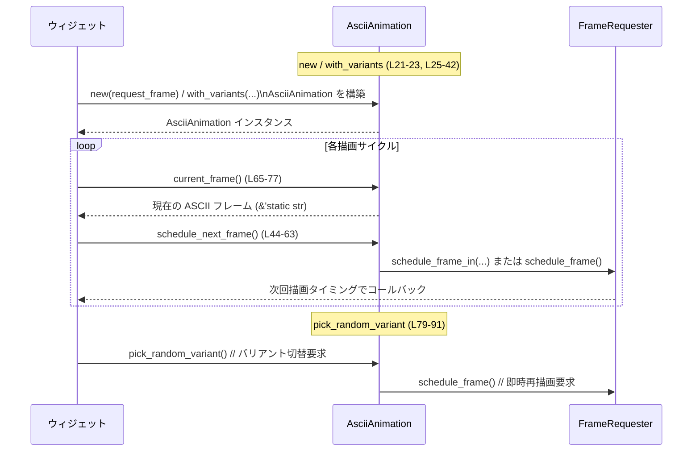

# tui/src/ascii_animation.rs

## 0. ざっくり一言

ASCII アートのアニメーションを、ポップアップやオンボーディング用ウィジェットで共有して使うための、小さなドライバ（状態とタイミング計算）を提供するモジュールです（`ascii_animation.rs:L11-18`）。

---

## 1. このモジュールの役割

### 1.1 概要

- このモジュールは、**複数フレームからなる ASCII アニメーションを、一定間隔で切り替えて描画する**問題を解決するために存在し、以下の機能を提供します。
  - 現在の再生開始時刻からの経過時間にもとづくフレームインデックス計算（`current_frame`）。
  - 次に描画すべき時刻までの遅延時間を計算し、フレーム再描画をスケジュールする処理（`schedule_next_frame`）。
  - 利用可能なアニメーション「バリアント」（種類）の中からランダムに 1 つ選び直す処理（`pick_random_variant`）。

### 1.2 アーキテクチャ内での位置づけ

このモジュールは以下のコンポーネントに依存しています。

- `crate::frames::ALL_VARIANTS` / `FRAME_TICK_DEFAULT`  
  アニメーションフレーム集合とデフォルトのフレーム間隔（`ascii_animation.rs:L7-8`）。中身はこのチャンクには現れません。
- `crate::tui::FrameRequester`  
  フレーム再描画を要求するための型で、`schedule_frame` / `schedule_frame_in` メソッドを持つことが分かります（`ascii_animation.rs:L13, L47-48, L58-59, L61-62, L89-95`）。
- 標準ライブラリの `Duration` / `Instant` による時間計測（`ascii_animation.rs:L2-3, L16-17, L40-41, L45, L50, L70, L74`）。
- `rand` クレートの RNG によるランダムなバリアント選択（`ascii_animation.rs:L5, L83-87`）。

これを図にすると次のようになります。

```mermaid
graph TD
    A[AsciiAnimation<br/>(L12-18)] -->|使用| FR[FrameRequester<br/>(別モジュール)]
    A -->|使用| ALL[ALL_VARIANTS<br/>(frames モジュール)]
    A -->|使用| TICK[FRAME_TICK_DEFAULT<br/>(frames モジュール)]
    A -->|時間計測| INST[Instant / Duration]
    A -->|乱択| RAND[rand クレート]

    %% このファイル内の範囲: ascii_animation.rs 全体 (L1-111)
```

### 1.3 設計上のポイント

コードから読み取れる設計上の特徴は次のとおりです。

- **状態を持つオブジェクト**  
  - フィールド `variant_idx`, `start`, `frame_tick` によって、現在どのバリアントを、いつから、どの間隔で再生しているかを表現します（`ascii_animation.rs:L12-17`）。
- **所有権と借用**  
  - アニメーションデータ `variants` は `'static` な参照（`&'static [&'static [&'static str]]`）で管理され、実体は不変の静的データであることが示唆されます（`ascii_animation.rs:L14`）。
  - 状態変更を伴うメソッド（`pick_random_variant`）は `&mut self` を要求するため、同時に複数スレッドから変更されない前提になっています（`ascii_animation.rs:L79`）。
- **エラーハンドリング方針**  
  - 不変条件（variants が空でない）は `assert!` によるパニックで検証（`ascii_animation.rs:L30-33`）。
  - 時刻計算のオーバーフローは `u64::try_from` の失敗時に「即座にフレーム要求」にフォールバックして扱っています（`ascii_animation.rs:L57-62`）。
- **安全性**  
  - `unsafe` ブロックは使用されておらず、すべて安全な Rust で実装されています。
  - スライスアクセスは、`variants` 非空チェックと `variant_idx` のクランプにより境界外アクセスを避けています（`ascii_animation.rs:L30-39, L98-100`）。
- **並行性**  
  - 内部に同期プリミティブはなく、`AsciiAnimation` 自体はスレッド間共有を前提としていません。マルチスレッドで共有する場合は、外側で `Mutex` 等が必要になる設計です。

---

## 2. 主要な機能一覧（コンポーネントインベントリー）

このチャンクに現れる構造体・関数・テストの一覧です（行番号は定義範囲の根拠を示します）。

| 名前 | 種別 | 役割 / 用途 | 定義位置 |
|------|------|-------------|----------|
| `AsciiAnimation` | 構造体 | アニメーション状態（バリアント選択・開始時刻・フレーム間隔）とフレーム要求手段を保持する中核オブジェクト | `ascii_animation.rs:L12-18` |
| `AsciiAnimation::new` | 関数（関連関数） | デフォルトのアニメーション集合 `ALL_VARIANTS` を使って `AsciiAnimation` を構築する簡易コンストラクタ | `ascii_animation.rs:L21-23` |
| `AsciiAnimation::with_variants` | 関数（関連関数） | 任意のアニメーション集合と開始バリアントを指定して `AsciiAnimation` を構築するコンストラクタ。variants 非空を検証し、インデックスをクランプする | `ascii_animation.rs:L25-42` |
| `AsciiAnimation::schedule_next_frame` | メソッド | 現在時刻とフレーム間隔にもとづき、次フレーム描画までの遅延を計算して `FrameRequester` にスケジュールさせる | `ascii_animation.rs:L44-63` |
| `AsciiAnimation::current_frame` | メソッド | `start` からの経過時間とフレーム間隔から現在表示すべき ASCII フレームを選んで返す | `ascii_animation.rs:L65-77` |
| `AsciiAnimation::pick_random_variant` | メソッド（可変） | 利用可能なバリアントから現在と異なるものを乱択し、切り替え後にフレーム再描画を要求する | `ascii_animation.rs:L79-91` |
| `AsciiAnimation::request_frame` | メソッド | シンプルに `FrameRequester::schedule_frame` を呼び出すラッパー（テストやデバッグ用途を想定） | `ascii_animation.rs:L93-95` |
| `AsciiAnimation::frames` | メソッド（プライベート） | 現在選択されているバリアントに対応するフレーム配列への参照を返すヘルパ | `ascii_animation.rs:L98-100` |
| `tests::frame_tick_must_be_nonzero` | テスト関数 | `FRAME_TICK_DEFAULT.as_millis() > 0` を検証し、デフォルトのフレーム間隔が 0 にならないことを保証する | `ascii_animation.rs:L103-111` |

---

## 3. 公開 API と詳細解説

ここでの「公開」は crate 内から見た `pub(crate)` API を指します。

### 3.1 型一覧（構造体・列挙体など）

| 名前 | 種別 | フィールド | 役割 / 用途 | 定義位置 |
|------|------|-----------|-------------|----------|
| `AsciiAnimation` | 構造体 | `request_frame: FrameRequester` | フレーム再描画を依頼するためのオブジェクト | `ascii_animation.rs:L12-13` |
| | | `variants: &'static [&'static [&'static str]]` | 全アニメーションバリアントの集合。各バリアントは複数フレームの配列 | `ascii_animation.rs:L14` |
| | | `variant_idx: usize` | 現在再生中のバリアントのインデックス | `ascii_animation.rs:L15` |
| | | `frame_tick: Duration` | フレーム間隔（ミリ秒換算で使用） | `ascii_animation.rs:L16` |
| | | `start: Instant` | 再生開始時刻（`with_variants` 呼び出し時） | `ascii_animation.rs:L17` |

### 3.2 重要な関数・メソッド詳細

#### `AsciiAnimation::new(request_frame: FrameRequester) -> AsciiAnimation`

**概要**

- デフォルトのアニメーション集合 `ALL_VARIANTS` と `variant_idx = 0` を使って `AsciiAnimation` を生成します（`ascii_animation.rs:L21-23`）。

**引数**

| 引数名 | 型 | 説明 |
|--------|----|------|
| `request_frame` | `FrameRequester` | フレーム再描画を要求するために利用するオブジェクト |

**戻り値**

- `AsciiAnimation`  
  - デフォルトのアニメーション集合とフレーム間隔を持つインスタンス。

**内部処理の流れ**

1. `Self::with_variants(request_frame, ALL_VARIANTS, 0)` をそのまま呼び出します（`ascii_animation.rs:L22`）。

**Examples（使用例）**

```rust
// 例: 既存の FrameRequester から AsciiAnimation を構築し、現在のフレームを描画する
fn draw_widget(requester: FrameRequester) {                // FrameRequester を引数として受け取る
    let anim = AsciiAnimation::new(requester);             // デフォルトバリアントでアニメーションを生成（L21-23）
    let frame = anim.current_frame();                      // 現在表示すべき ASCII フレームを取得（L65-77）
    println!("{}", frame);                                 // フレームをコンソールなどに描画

    anim.schedule_next_frame();                            // 次のフレーム描画をスケジュール（L44-63）
}
```

**Errors / Panics**

- `new` 自体にはパニック条件はなく、内部で呼ぶ `with_variants` の事前条件（`ALL_VARIANTS` 非空）が満たされていることを前提にしています。  
  - `ALL_VARIANTS` が空であれば `with_variants` 内の `assert!` がパニックしますが、そのような定義になっているかはこのチャンクには現れません。

**Edge cases（エッジケース）**

- `FrameRequester` が無効な状態で渡された場合の挙動は、このチャンクからは分かりません（`FrameRequester` の実装が別モジュールのため）。

**使用上の注意点**

- `AsciiAnimation` のライフタイムは `request_frame` のライフタイムに従います。`request_frame` の有効期間外で `AsciiAnimation` を使わない前提が必要です（所有権モデル上は通常コンパイル時に保証されます）。

---

#### `AsciiAnimation::with_variants(request_frame, variants, variant_idx) -> AsciiAnimation`

**概要**

- 利用するアニメーション集合と開始バリアントを明示的に指定して `AsciiAnimation` を構築します（`ascii_animation.rs:L25-42`）。

**引数**

| 引数名 | 型 | 説明 |
|--------|----|------|
| `request_frame` | `FrameRequester` | フレームを要求するためのオブジェクト |
| `variants` | `&'static [&'static [&'static str]]` | アニメーションバリアントの集合。各要素が 1 バリアントを構成するフレーム配列 |
| `variant_idx` | `usize` | 初期状態で利用するバリアントのインデックス（範囲外の場合はクランプされる） |

**戻り値**

- `AsciiAnimation`  
  - 指定されたバリアント集合・開始バリアント・デフォルトフレーム間隔・現在時刻を持つインスタンス。

**内部処理の流れ**

1. `assert!(!variants.is_empty(), "...")` で `variants` が空でないことを検証（`ascii_animation.rs:L30-33`）。
2. `variant_idx.min(variants.len() - 1)` により、`variant_idx` を `0..=len-1` にクランプ（`ascii_animation.rs:L34`）。
3. フィールドを初期化:
   - `request_frame` に引数をそのまま保存（`ascii_animation.rs:L36`）。
   - `variants` に引数を保存（`ascii_animation.rs:L37`）。
   - `variant_idx` にクランプ後のインデックスを保存（`ascii_animation.rs:L38`）。
   - `frame_tick` に `FRAME_TICK_DEFAULT` を設定（`ascii_animation.rs:L39`）。
   - `start` に `Instant::now()` の結果を保存（`ascii_animation.rs:L40-41`）。

**Examples（使用例）**

```rust
// 例: カスタムアニメーションバリアント集合を使って AsciiAnimation を構築する
static CUSTOM_VARIANTS: &[&[&str]] = &[
    &["frame A1", "frame A2"],                           // バリアント 0
    &["frame B1", "frame B2", "frame B3"],               // バリアント 1
];

fn make_custom_anim(requester: FrameRequester) -> AsciiAnimation {
    AsciiAnimation::with_variants(requester, CUSTOM_VARIANTS, 1)  // variant_idx=1 で開始（L25-42）
}
```

**Errors / Panics**

- `variants` が空のときパニックします（`assert!(!variants.is_empty(), ...)`、`ascii_animation.rs:L30-33`）。
- それ以外のランタイムエラー要因はこのメソッド内にはありません。

**Edge cases（エッジケース）**

- `variant_idx` が `variants.len()` より大きい場合  
  → 自動的に `variants.len() - 1` にクランプされます（`ascii_animation.rs:L34`）。
- `variants` 内の各バリアントが空フレーム配列である場合  
  → `current_frame` 内で `frames.is_empty()` チェックがあるため、最終的に空文字列 `""` を返します（`ascii_animation.rs:L65-69`）。

**使用上の注意点**

- `variants` は `'static` な参照であり、一般的には静的定数として定義されたデータを指します。実行時に変更されない前提です。
- 安全のため、各バリアントには少なくとも 1 フレームを含める設計にすると、`current_frame` が常に意味のあるフレームを返します（空バリアントの場合の挙動は空文字列になります）。

---

#### `AsciiAnimation::schedule_next_frame(&self)`

**概要**

- フレーム間隔 `frame_tick` と再生開始時刻 `start` に基づいて、**次にフレームを更新すべき時刻までの残り時間**を計算し、その時間後にフレーム再描画を行うよう `FrameRequester` に依頼します（`ascii_animation.rs:L44-63`）。

**引数**

- `&self` のみ（共有参照）。内部状態を変更しません。

**戻り値**

- なし（`()`）。`FrameRequester` に副作用としてスケジュールを依頼するだけです。

**内部処理の流れ**

1. `tick_ms = self.frame_tick.as_millis()` を取得（`ascii_animation.rs:L45`）。
2. `tick_ms == 0` の場合はすぐに `schedule_frame()` を呼び出し、即座に次フレーム描画を要求して終了（`ascii_animation.rs:L46-49`）。
3. そうでない場合、`elapsed_ms = self.start.elapsed().as_millis()` を取得（`ascii_animation.rs:L50`）。
4. `rem_ms = elapsed_ms % tick_ms` により、直近のフレーム境界からの経過時間を求める（`ascii_animation.rs:L51`）。
5. `rem_ms == 0` なら `delay_ms = tick_ms`、そうでなければ `delay_ms = tick_ms - rem_ms` として、次のフレーム境界までの残り時間を計算（`ascii_animation.rs:L52-56`）。
6. `delay_ms`（`u128`）を `u64::try_from(delay_ms)` で変換:
   - 成功時: `Duration::from_millis(delay_ms_u64)` を作り、`schedule_frame_in` に渡す（`ascii_animation.rs:L57-59`）。
   - 失敗時: `schedule_frame()` を呼び、即時描画にフォールバック（`ascii_animation.rs:L60-62`）。

**Examples（使用例）**

```rust
// 例: 描画ループ内で schedule_next_frame を使って再描画をスケジュールする
fn render_loop(mut anim: AsciiAnimation) {
    loop {
        let frame = anim.current_frame();                 // 現在フレームを取得（L65-77）
        println!("{frame}");                              // 描画処理（実際には TUI フレームに描くなど）

        anim.schedule_next_frame();                       // 次のフレーム更新をスケジュール（L44-63）

        // 実際にはここでイベントループに制御を戻すなどするはずです
        break;                                            // デモなので 1 回で終了
    }
}
```

**Errors / Panics**

- このメソッド内には `assert!` や `unwrap` 等はなく、パニック要因はありません。
- `u64::try_from` の失敗時もパニックではなく、即時 `schedule_frame()` にフォールバックします（`ascii_animation.rs:L57-62`）。  
  これは非常に大きな `frame_tick` が設定された場合の保険です。

**Edge cases（エッジケース）**

- `frame_tick == 0` の場合  
  → すぐに `schedule_frame()` を呼び、遅延なしで再描画を要求します（`ascii_animation.rs:L46-49`）。  
  デフォルト値 `FRAME_TICK_DEFAULT` はテストで「ミリ秒換算で 0 ではない」ことが保証されており（`ascii_animation.rs:L103-111`）、通常はここには到達しません。
- 非常に大きな `frame_tick` によって `delay_ms` が `u64::MAX` を超える場合  
  → 変換エラーとなり、`schedule_frame()` にフォールバックします（`ascii_animation.rs:L57-62`）。  
  この場合、意図したより早く再描画が行われます。

**使用上の注意点**

- `schedule_next_frame` は内部状態 `start` を更新しません。`start` はコンストラクタ呼び出し時点固定です。したがって、アニメーションは「コンストラクタからの経過時間」によって決まる設計です。
- 実際の TUI イベントループでは、`schedule_next_frame` の呼び出し後に制御をイベントループへ戻す必要があります。ここから先の挙動は `FrameRequester` の実装に依存し、このチャンクには現れません。

---

#### `AsciiAnimation::current_frame(&self) -> &'static str`

**概要**

- 現在の経過時間に対応するアニメーションフレーム（ASCII 文字列）を返します（`ascii_animation.rs:L65-77`）。

**引数**

- `&self` のみ。

**戻り値**

- `&'static str`  
  - 現在表示すべきフレーム文字列。
  - ただしフレーム配列が空の場合は空文字列 `""` を返します（`ascii_animation.rs:L65-69`）。

**内部処理の流れ**

1. `frames = self.frames()` で現在バリアントのフレーム配列を取得（`ascii_animation.rs:L66, L98-100`）。
2. `frames.is_empty()` なら空文字列 `""` を返す（`ascii_animation.rs:L67-69`）。
3. `tick_ms = self.frame_tick.as_millis()` を取得（`ascii_animation.rs:L70`）。
4. `tick_ms == 0` なら常に `frames[0]` を返す（`ascii_animation.rs:L71-73`）。
5. それ以外の場合:
   - `elapsed_ms = self.start.elapsed().as_millis()`（`ascii_animation.rs:L74`）。
   - `idx = ((elapsed_ms / tick_ms) % frames.len() as u128) as usize` でフレームインデックスを計算（`ascii_animation.rs:L75`）。
   - `frames[idx]` を返す（`ascii_animation.rs:L76`）。

**Examples（使用例）**

```rust
// 例: current_frame で得たフレームを画面に描画する
fn draw_once(anim: &AsciiAnimation) {
    let frame = anim.current_frame();                     // 現在のフレームを取得（L65-77）
    println!("{frame}");                                  // フレームを描画
}
```

**Errors / Panics**

- `frames` が空でない限り、`frames[idx]` は範囲内アクセスになるように計算されています。
  - `idx` は `0..frames.len()-1` の範囲で計算されるためです（`ascii_animation.rs:L75`）。
- `frames` が空の場合は早期リターンで空文字列を返すため、インデックスアクセスは行われません（`ascii_animation.rs:L67-69`）。
- したがって、`current_frame` 自体にパニック要因はありません。

**Edge cases（エッジケース）**

- `frames.is_empty()` の場合  
  → 必ず `""` が返されます（`ascii_animation.rs:L67-69`）。  
  これは `variants` 内の特定バリアントが空配列である場合の挙動です。
- `frame_tick == 0` の場合  
  → 常に最初のフレーム `frames[0]` を返します（`ascii_animation.rs:L71-73`）。
- 非常に大きな `elapsed_ms` の場合  
  → `elapsed_ms / tick_ms` は大きくなりますが、最終的に `% frames.len() as u128` で周期化されるため、インデックスは常に範囲内になります（`ascii_animation.rs:L75`）。

**使用上の注意点**

- `&'static str` を返すため、呼び出し側は所有権を気にせずに文字列を参照できます。データは静的領域に存在します。
- 描画ループなどで頻繁に呼び出しても、内部でヒープ割り当ては行われません（`&'static str` と `Duration` / `Instant` 呼び出しのみ）。

---

#### `AsciiAnimation::pick_random_variant(&mut self) -> bool`

**概要**

- 現在とは異なるアニメーションバリアントをランダムに選び、切り替えた後にフレーム再描画を要求します（`ascii_animation.rs:L79-91`）。

**引数**

- `&mut self`  
  - バリアントインデックスを更新するため、排他的借用が必要です。

**戻り値**

- `bool`  
  - `true`: バリアントが実際に切り替わった場合。  
  - `false`: バリアントが 1 つ以下しかなく、切り替えが行われなかった場合。

**内部処理の流れ**

1. `self.variants.len() <= 1` なら `false` を返して終了（`ascii_animation.rs:L80-82`）。
2. `let mut rng = rand::rng();` で乱数生成器を取得（`ascii_animation.rs:L83`）。  
   - 具体的な RNG の型はこのチャンクには現れません。
3. `next = self.variant_idx` として、初期値を現在のインデックスと同じに設定（`ascii_animation.rs:L84`）。
4. `while next == self.variant_idx` ループの中で `next = rng.random_range(0..self.variants.len())` を実行し、現在とは異なるインデックスが選ばれるまで繰り返す（`ascii_animation.rs:L85-87`）。
5. `self.variant_idx = next` に更新（`ascii_animation.rs:L88`）。
6. `self.request_frame.schedule_frame()` を呼び、即座に再描画を要求（`ascii_animation.rs:L89`）。
7. `true` を返す（`ascii_animation.rs:L90`）。

**Examples（使用例）**

```rust
// 例: ユーザー操作に応じてアニメーションバリアントを切り替える
fn on_user_action(anim: &mut AsciiAnimation) {
    if anim.pick_random_variant() {                       // バリアントが切り替われば true（L79-91）
        // バリアントが変わったので、次のフレームが自動的にスケジュールされる
        // 追加の処理が必要であればここに書く
    }
}
```

**Errors / Panics**

- `self.variants.len() > 1` の場合にのみループに入ります（`ascii_animation.rs:L80-82`）。  
  このとき `random_range(0..self.variants.len())` の範囲は常に少なくとも 0..2 なので、`variants` のインデックスとして安全です。
- RNG の実装がパニックを起こすかどうかは、このチャンクには現れません。通常の `rand` クレートでは、正常に初期化できない場合にパニックすることがありますが、本コードからは断定できません。

**Edge cases（エッジケース）**

- `self.variants.len() <= 1`  
  → バリアントの選択余地がないため、すぐに `false` を返し、`self.variant_idx` も `FrameRequester` も変更されません（`ascii_animation.rs:L80-82`）。
- RNG が連続して同じ値を返す場合  
  → `while` ループがその分だけ長く回ります（`ascii_animation.rs:L85-87`）。  
  選択範囲が有限であるため、理論上は非常に長く続く可能性はありますが、コード上は上限を設けていません。

**使用上の注意点**

- `&mut self` を取るため、呼び出し側は `AsciiAnimation` を同時に複数スレッドから変更しないようにする必要があります（Rust の型システム上、`&mut` は同時借用を禁止するため、通常はコンパイル時に防がれます）。
- `pick_random_variant` 呼び出し後は自動的に `schedule_frame()` が呼ばれるため（`ascii_animation.rs:L89`）、呼び出し側で直後に改めて `schedule_next_frame` を呼ばなくても、少なくとも 1 回の再描画は行われます。

---

### 3.3 その他の関数

| 関数名 | 役割（1 行） | 定義位置 |
|--------|--------------|----------|
| `AsciiAnimation::request_frame(&self)` | `FrameRequester::schedule_frame` をそのまま呼ぶ、簡易な再描画要求メソッド | `ascii_animation.rs:L93-95` |
| `AsciiAnimation::frames(&self) -> &'static [&'static str]` | 現在の `variant_idx` に対応するフレーム配列を返す内部ヘルパー | `ascii_animation.rs:L98-100` |
| `tests::frame_tick_must_be_nonzero()` | `FRAME_TICK_DEFAULT.as_millis() > 0` を検証するテスト | `ascii_animation.rs:L107-110` |

---

## 4. データフロー

ここでは、典型的な「描画ループでの利用シナリオ」におけるデータと呼び出しの流れを示します。

1. ウィジェットが `AsciiAnimation::new` または `with_variants` でインスタンスを作成する。
2. 描画処理で `current_frame` を呼び、現在のフレーム文字列を取得する。
3. 描画後に `schedule_next_frame` を呼び、次の再描画タイミングを `FrameRequester` に登録する。
4. 別のタイミング（例: ユーザー操作）で `pick_random_variant` を呼ぶと、バリアントが切り替わり、即時に `schedule_frame` が呼ばれる。

この流れをシーケンス図で表すと次のようになります。



---

## 5. 使い方（How to Use）

### 5.1 基本的な使用方法

`AsciiAnimation` を利用する最小限のパターンを示します。

```rust
// 仮の FrameRequester 型。実際の定義はこのチャンクには現れません。
fn run(requester: FrameRequester) {
    // 1. AsciiAnimation を初期化する
    let anim = AsciiAnimation::new(requester);             // デフォルトバリアントで構築（L21-23）

    // 2. 描画タイミングで現在のフレームを取得する
    let frame = anim.current_frame();                      // 現在フレームを取得（L65-77）
    println!("{frame}");                                   // TUI 画面などに描画する

    // 3. 次のフレーム更新をスケジュールする
    anim.schedule_next_frame();                            // 経過時間に応じた遅延で再描画を依頼（L44-63）
}
```

### 5.2 よくある使用パターン

1. **カスタムバリアントの利用**

```rust
// 静的なカスタムバリアント定義
static SPINNER_VARIANTS: &[&[&str]] = &[
    &["-", "\\", "|", "/"],                               // バリアント 0
    &[".", "o", "O", "o"],                                // バリアント 1
];

fn use_custom_variants(requester: FrameRequester) {
    let mut anim = AsciiAnimation::with_variants(         // カスタムバリアントで構築（L25-42）
        requester,
        SPINNER_VARIANTS,
        0,                                                // 最初はバリアント 0
    );

    // 描画ごとにフレームを更新
    let frame = anim.current_frame();                     // 現在フレームを取得
    println!("{frame}");

    anim.schedule_next_frame();                           // 次回の再描画をスケジュール
}
```

1. **ユーザー操作によるバリアント変更**

```rust
fn on_key_press(anim: &mut AsciiAnimation) {
    // 例: 任意のキーでバリアントを切り替える
    let changed = anim.pick_random_variant();             // 別バリアントに切り替え（L79-91）
    if changed {
        // バリアントが変わったので、次のフレームで見た目が変わる
    }
}
```

### 5.3 よくある間違い

**間違い例: 空のバリアント集合を渡す**

```rust
// 間違い: variants に空スライスを渡す
static EMPTY_VARIANTS: &[&[&str]] = &[];

fn bad(requester: FrameRequester) {
    // ここでパニックになる: assert!(!variants.is_empty())（L30-33）
    let _anim = AsciiAnimation::with_variants(requester, EMPTY_VARIANTS, 0);
}
```

**正しい例: 少なくとも 1 つバリアントを用意する**

```rust
static ONE_VARIANT: &[&[&str]] = &[
    &["frame1", "frame2"],                               // 少なくとも 1 バリアント
];

fn good(requester: FrameRequester) {
    let _anim = AsciiAnimation::with_variants(requester, ONE_VARIANT, 0);
}
```

**間違い例: `schedule_next_frame` を呼ばない**

```rust
// 間違い: current_frame だけ呼び、schedule_next_frame を呼ばない
fn no_animation(requester: FrameRequester) {
    let anim = AsciiAnimation::new(requester);
    println!("{}", anim.current_frame());                 // 初期フレームのみ表示
    // schedule_next_frame() を呼ばないので、次のフレーム更新がスケジュールされない
}
```

**正しい例**

```rust
fn animated(requester: FrameRequester) {
    let anim = AsciiAnimation::new(requester);
    println!("{}", anim.current_frame());
    anim.schedule_next_frame();                           // フレーム更新をスケジュール
}
```

### 5.4 使用上の注意点（まとめ）

- **前提条件**
  - `with_variants` に渡す `variants` は空であってはいけません（`ascii_animation.rs:L30-33`）。
  - 各バリアントにフレームを 1 つ以上含めると、`current_frame` が常に意味のある値を返します。
- **エラー / パニック条件**
  - `variants.is_empty()` のときに `with_variants` がパニックします。
  - その他のメソッドは、このチャンクの範囲ではパニックしない設計です。
- **並行性**
  - `pick_random_variant` は `&mut self` を要求するため、同時に複数スレッドからの変更は Rust の型システム上禁止されます（`ascii_animation.rs:L79`）。
  - `AsciiAnimation` を複数スレッドで共有する場合は、外側で `Arc<Mutex<AsciiAnimation>>` のような同期が必要です（このファイルには実装例はありません）。
- **セキュリティ / RNG**
  - 乱数には `rand::rng()` と `random_range` を使っており（`ascii_animation.rs:L83, L86`）、暗号論的安全性は意図されていません。  
    ただし、ドキュコメントにある通り用途は UI アニメーションであり（`ascii_animation.rs:L11`）、セキュリティ用途には使わない前提で設計されていると解釈できます。

---

## 6. 変更の仕方（How to Modify）

### 6.1 新しい機能を追加する場合

例として、「フレーム間隔を動的に変更する」機能を追加したい場合の観点です。

1. **変更すべきフィールドの確認**
   - フレーム間隔は `frame_tick: Duration` フィールドに保持されています（`ascii_animation.rs:L16`）。
2. **新メソッドの追加位置**
   - `impl AsciiAnimation` ブロック内（`ascii_animation.rs:L20-101`）に、`set_frame_tick(&mut self, tick: Duration)` のようなメソッドを追加するのが自然です。
3. **既存ロジックとの関係**
   - `schedule_next_frame` と `current_frame` は `self.frame_tick` を使用しているため（`ascii_animation.rs:L45, L70`）、新しいフレーム間隔はこれらのメソッドに自動的に反映されます。
4. **テストの追加**
   - 変更後のフレーム間隔が 0 にならないことなどを確認するテストを、既存のテストモジュール（`ascii_animation.rs:L103-111`）に追加することが考えられます。

（ここでは「どのように実装すべきか」の詳細な提案ではなく、「どの箇所を見ればよいか」という観点にとどめています。）

### 6.2 既存の機能を変更する場合

- **`with_variants` の事前条件を変更する場合**
  - 空バリアントを許容するようにするなら、`assert!` を削除または緩和する必要があります（`ascii_animation.rs:L30-33`）。
  - その場合、`frames()` や `current_frame()` の `frames.is_empty()` 分岐（`ascii_animation.rs:L65-69`）と整合するかを確認する必要があります。
- **フレームスケジューリングのアルゴリズムを変える場合**
  - `schedule_next_frame` の時間計算部分（`ascii_animation.rs:L50-56`）を変更します。
  - `FRAME_TICK_DEFAULT` の意味合いが変わる場合は、テスト `frame_tick_must_be_nonzero`（`ascii_animation.rs:L107-110`）も見直す必要があります。
- **乱数バリアント選択ロジックを変更する場合**
  - `pick_random_variant` の `while next == self.variant_idx` ループ（`ascii_animation.rs:L84-88`）を別の方法（例えば事前にシャッフルした列）に変える場合、常に異なるインデックスが選ばれるかを確認する必要があります。

---

## 7. 関連ファイル

このモジュールと密接に関係する他モジュール（ファイル名はこのチャンクからは特定できません）の一覧です。

| パス / モジュール名 | 役割 / 関係 |
|---------------------|------------|
| `crate::frames` | `ALL_VARIANTS` と `FRAME_TICK_DEFAULT` を提供するモジュール。アニメーションデータ本体とデフォルトフレーム間隔の定義が含まれる（`ascii_animation.rs:L7-8`）。 |
| `crate::tui::FrameRequester` | `schedule_frame` および `schedule_frame_in(Duration)` を通じて、実際の TUI イベントループに「次のフレーム再描画」を要求するための型（`ascii_animation.rs:L9, L13, L47-48, L58-59, L61-62, L89-95`）。 |
| `tui::ascii_animation::tests`（本ファイル内モジュール） | `FRAME_TICK_DEFAULT` が 0 ミリ秒でないことを検証し、時間計算ロジックの前提条件を担保するテスト（`ascii_animation.rs:L103-111`）。 |

このチャンク内には、`FrameRequester` や `frames` モジュールの具体的な実装は現れず、詳細な挙動は別ファイルに委ねられています。
