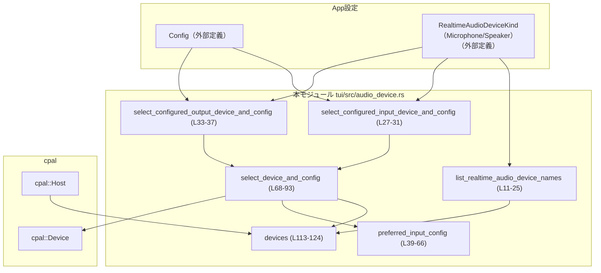
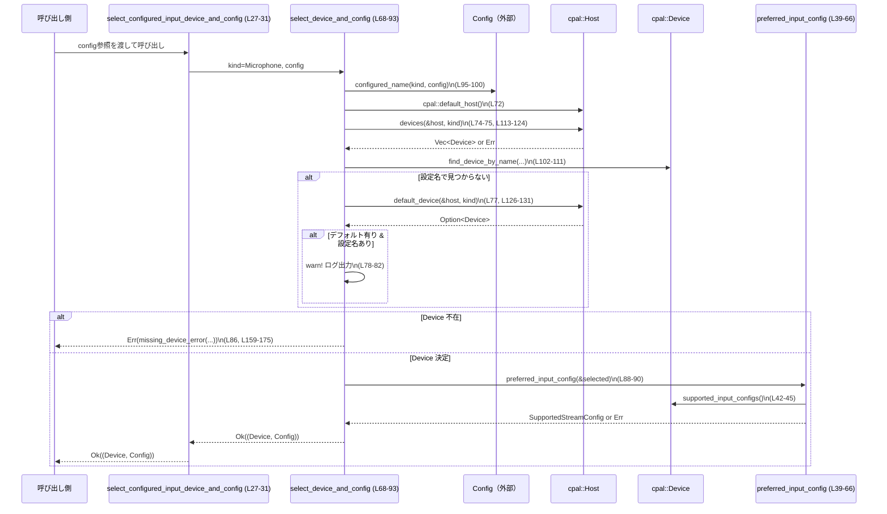

# tui/src/audio_device.rs コード解説

## 0. ざっくり一言

- `cpal` クレートを使って、**マイク／スピーカーなどリアルタイム音声デバイスの列挙と選択、入出力設定の決定**を行うユーティリティ関数群です（`tui/src/audio_device.rs:L1-175`）。

---

## 1. このモジュールの役割

### 1.1 概要

- このモジュールは、**システム上のリアルタイム音声デバイスを列挙し、設定ファイルの指定に基づいて適切なデバイスとストリーム設定を選ぶ問題**を解決するために存在します。
- 主な機能として、以下を提供します。
  - 利用可能なマイク／スピーカーの名前一覧取得（`list_realtime_audio_device_names`、`tui/src/audio_device.rs:L11-25`）
  - 設定ファイル（`Config`）で指定された入出力デバイス＋対応する `cpal::SupportedStreamConfig` の選択（`select_configured_*`、`tui/src/audio_device.rs:L27-37`）
  - マイク入力に対して、希望サンプリングレート・チャンネル数に最も近い `SupportedStreamConfig` を選択（`preferred_input_config`、`tui/src/audio_device.rs:L39-66`）

### 1.2 アーキテクチャ内での位置づけ

- 外部から読み込まれた `Config` とアプリ内の列挙体 `RealtimeAudioDeviceKind` を受け取り、`cpal` のホスト／デバイス API を呼び出して、アプリが使う音声デバイス情報を返す薄いラッパーです。
- ログ出力には `tracing::warn` を用いて、設定されたデバイスが利用不能だった場合のフォールバックを可視化しています（`tui/src/audio_device.rs:L78-82`）。



※ `Config` や `RealtimeAudioDeviceKind` の定義はこのファイルには含まれていません（`tui/src/audio_device.rs:L1,6`）。

### 1.3 設計上のポイント

- **状態を持たない関数群**
  - すべての関数は引数に基づいて処理を行い、内部に永続的な状態は保持していません。
- **エラーは `Result<…, String>` で表現**
  - `cpal` からの各種エラーを文字列に変換して返しています（例: `preferred_input_config` の `map_err`、`tui/src/audio_device.rs:L42-45`）。
- **入力デバイス設定の「好み」をスコア付きで評価**
  - サンプルレート・チャンネル数・サンプルフォーマットに基づいてスコアリングし、「もっとも希望に近い構成」を選択しています（`tui/src/audio_device.rs:L46-61`）。
- **フォールバック戦略**
  - 設定されたデバイスが見つからない場合はシステムのデフォルトデバイスにフォールバックし、その際には警告ログを出します（`tui/src/audio_device.rs:L73-85`）。
  - 希望条件に合う入力設定がない場合は、デバイスのデフォルト入力設定にフォールバックします（`tui/src/audio_device.rs:L62-65`）。
- **並行性**
  - このモジュール自身はスレッド生成や共有可変状態を扱っておらず、すべて同期的な関数です。
  - 実際のデバイスアクセスやスレッド処理は `cpal` ライブラリ側に委ねられています。

---

## 2. 主要な機能一覧（コンポーネントインベントリー）

### 2.1 機能一覧（概要）

- 音声デバイス名一覧取得: 指定種別（マイク／スピーカー）のユニークなデバイス名一覧を返す（`tui/src/audio_device.rs:L11-25`）
- 設定済み入力デバイス選択: `Config` の指定に基づいてマイクデバイスと入力設定を選ぶ（`tui/src/audio_device.rs:L27-31`）
- 設定済み出力デバイス選択: `Config` の指定に基づいてスピーカーデバイスと出力設定を選ぶ（`tui/src/audio_device.rs:L33-37`）
- 入力デバイスの優先設定決定: 希望サンプリングレート・チャンネル数・サンプルフォーマットに最も近い入力設定を選ぶ（`tui/src/audio_device.rs:L39-66`）
- 汎用デバイス＋設定選択ロジック: 入出力共通のデバイス選択とエラーメッセージ生成（`tui/src/audio_device.rs:L68-93,159-175`）
- デバイス列挙ユーティリティ: `cpal::Host` からマイク／スピーカーの `cpal::Device` を列挙（`tui/src/audio_device.rs:L113-124`）

### 2.2 関数インベントリー（行番号付き）

| 関数名 | 可視性 | 役割 / 用途 | 根拠 |
|--------|--------|-------------|------|
| `list_realtime_audio_device_names` | `pub(crate)` | 指定種別（マイク／スピーカー）の利用可能なデバイス名一覧を重複排除して取得 | `tui/src/audio_device.rs:L11-25` |
| `select_configured_input_device_and_config` | `pub(crate)` | `Config` に基づきマイク入力デバイスと `SupportedStreamConfig` を取得 | `tui/src/audio_device.rs:L27-31` |
| `select_configured_output_device_and_config` | `pub(crate)` | `Config` に基づきスピーカー出力デバイスと `SupportedStreamConfig` を取得 | `tui/src/audio_device.rs:L33-37` |
| `preferred_input_config` | `pub(crate)` | 入力デバイスに対し優先条件に最も近い `SupportedStreamConfig` を決定 | `tui/src/audio_device.rs:L39-66` |
| `select_device_and_config` | `fn`（モジュール内） | `Config` と種別に基づく共通デバイス選択ロジック | `tui/src/audio_device.rs:L68-93` |
| `configured_name` | `fn` | `Config` から種別ごとの設定デバイス名（Option<&str>）を取り出す | `tui/src/audio_device.rs:L95-100` |
| `find_device_by_name` | `fn` | デバイス一覧から名前一致する `cpal::Device` を検索 | `tui/src/audio_device.rs:L102-111` |
| `devices` | `fn` | `cpal::Host` から入出力デバイス一覧を `Vec<Device>` として取得 | `tui/src/audio_device.rs:L113-124` |
| `default_device` | `fn` | 種別ごとのデフォルト入出力デバイスを取得 | `tui/src/audio_device.rs:L126-131` |
| `default_config` | `fn` | デバイスのデフォルト入出力設定を取得 | `tui/src/audio_device.rs:L133-145` |
| `preferred_input_sample_rate` | `fn` | 設定レンジ内で希望サンプルレートに最も近い値を決定 | `tui/src/audio_device.rs:L147-156` |
| `missing_device_error` | `fn` | 種別と設定名に応じた人間向けエラーメッセージを生成 | `tui/src/audio_device.rs:L159-175` |

---

## 3. 公開 API と詳細解説

### 3.1 型一覧（このファイルで利用している主要型）

このファイル内で**新たに定義されている構造体・列挙体はありません**。外部から利用している主な型は次の通りです。

| 名前 | 種別 | 役割 / 用途 | 根拠 |
|------|------|-------------|------|
| `Config` | 構造体（外部定義） | 設定ファイルの内容を表し、`realtime_audio.microphone` / `speaker` フィールドから希望デバイス名を取得 | `tui/src/audio_device.rs:L1, L95-99` |
| `RealtimeAudioDeviceKind` | 列挙体（外部定義） | `Microphone` / `Speaker` など、リアルタイム音声デバイスの種別を表す | `tui/src/audio_device.rs:L6, L27-37, L68-71, L95-99, L113-123, L126-131, L159-175` |
| `cpal::Host` | 構造体（外部ライブラリ） | 音声 API のホスト（Windows なら WASAPI など）を抽象化し、デバイス列挙・デフォルト取得に使用 | `tui/src/audio_device.rs:L14, L72, L102-107, L113-124, L126-131` |
| `cpal::Device` | 構造体（外部ライブラリ） | 個々の音声デバイスを表し、名前やストリーム設定にアクセスする | `tui/src/audio_device.rs:L16-22, L39-41, L68-93, L102-111, L113-124, L126-145` |
| `cpal::SupportedStreamConfig` | 構造体（外部ライブラリ） | デバイスがサポートする具体的なストリーム設定（フォーマット、レート、チャンネル） | `tui/src/audio_device.rs:L29-36, L39-66, L68-71, L133-145` |
| `cpal::SupportedStreamConfigRange` | 構造体（外部ライブラリ） | サポートされる設定の範囲（レート min/max など）を表す | `tui/src/audio_device.rs:L47-61, L147-156` |
| `cpal::SampleRate` | 構造体（外部ライブラリ） | サンプリングレート（Hz）を包む新しい型 | `tui/src/audio_device.rs:L54-55, L147-156` |

※ `Config` や `RealtimeAudioDeviceKind` の具体的なフィールドやメソッド定義は、このチャンクには現れません。

---

### 3.2 関数詳細（7 件）

#### 1. `list_realtime_audio_device_names(kind: RealtimeAudioDeviceKind) -> Result<Vec<String>, String>`

**概要**

- 指定されたデバイス種別（マイク／スピーカー）について、利用可能な `cpal::Device` を列挙し、**重複を除いたデバイス名の一覧**を返します（`tui/src/audio_device.rs:L11-25`）。

**引数**

| 引数名 | 型 | 説明 |
|--------|----|------|
| `kind` | `RealtimeAudioDeviceKind` | `Microphone` か `Speaker` を指定し、どちらのデバイス一覧を取得するかを表します。 |

**戻り値**

- `Ok(Vec<String>)`: 利用可能なデバイス名の一覧。名前の重複は削除されています。
- `Err(String)`: デバイス列挙に失敗した場合のエラーメッセージ（`devices` からのエラーを文字列化）。

**内部処理の流れ**

1. `cpal::default_host()` でホストを取得（`tui/src/audio_device.rs:L14`）。
2. `devices(&host, kind)?` を呼び出し、指定種別のデバイス一覧を取得（エラー時はそのまま `Err` を返して終了、`tui/src/audio_device.rs:L16`）。
3. 各 `cpal::Device`について `device.name()` を呼び、名前取得に失敗したデバイスはスキップ（`tui/src/audio_device.rs:L17-19`）。
4. 取得した名前がまだ `device_names` に含まれていない場合のみ `push`（重複排除、`tui/src/audio_device.rs:L20-21`）。
5. 最終的な `device_names` ベクタを `Ok(device_names)` として返却（`tui/src/audio_device.rs:L24`）。

**Examples（使用例）**

指定種別ごとにデバイス名一覧を取得する例です。

```rust
use crate::app_event::RealtimeAudioDeviceKind;
use crate::tui::audio_device::list_realtime_audio_device_names;

fn print_audio_devices() {
    // マイクデバイス名一覧を取得する
    let mics = list_realtime_audio_device_names(RealtimeAudioDeviceKind::Microphone);
    match mics {
        Ok(names) => {
            for name in names {
                println!("Mic device: {name}"); // マイクデバイス名を表示
            }
        }
        Err(err) => eprintln!("マイクデバイス列挙エラー: {err}"), // エラー内容を表示
    }

    // スピーカーデバイス名一覧を取得する
    let speakers = list_realtime_audio_device_names(RealtimeAudioDeviceKind::Speaker);
    if let Ok(names) = speakers {
        for name in names {
            println!("Speaker device: {name}"); // スピーカーデバイス名を表示
        }
    }
}
```

**Errors / Panics**

- `devices(&host, kind)` がエラーを返した場合、そのメッセージを含む `Err(String)` を返します（`tui/src/audio_device.rs:L16, L113-123`）。
- この関数内で `panic!` を呼び出してはいません。`cpal` 内部でのパニックの有無は、このチャンクには現れません。

**Edge cases（エッジケース）**

- 対象種別のデバイスが 0 個の場合  
  → `devices` は `Ok(Vec::new())` を返し、結果も空の `Vec<String>` になります。
- `device.name()` が失敗するデバイスがある場合  
  → そのデバイスだけスキップされ、エラーにはなりません（`tui/src/audio_device.rs:L17-19`）。
- 同名のデバイスが複数存在する場合  
  → 最初のデバイス名だけが `Vec` に登録され、その後の同名デバイスは `contains` チェックでスキップされます（`tui/src/audio_device.rs:L20-21`）。

**使用上の注意点**

- 戻り値は `Result` なので、必ず `match` や `?` でエラー処理を行う必要があります。
- デバイス名は OS やドライバに依存するため、ユーザー表示用に使うことはできますが、将来にわたる安定性は保証されません（デバイスの差し替えなどで変化します）。

---

#### 2. `select_configured_input_device_and_config(config: &Config) -> Result<(cpal::Device, cpal::SupportedStreamConfig), String>`

**概要**

- 設定ファイル `Config` からマイクデバイスの希望名を取り出し、利用可能であればそのデバイスと入力設定を、利用不可能ならデフォルトデバイスを選択する**高レベル API** です（`tui/src/audio_device.rs:L27-31`）。
- 実装は `select_device_and_config` に委譲しています。

**引数**

| 引数名 | 型 | 説明 |
|--------|----|------|
| `config` | `&Config` | アプリ全体の設定を保持する構造体への参照。`config.realtime_audio.microphone` から希望デバイス名を取得します。 |

**戻り値**

- `Ok((device, config))`:
  - `device`: 選択されたマイクの `cpal::Device`
  - `config`: そのデバイスに対する `SupportedStreamConfig`（入力用）
- `Err(String)`: デバイスが見つからなかった／設定取得に失敗した場合のエラーメッセージ。

**内部処理の流れ**

1. `select_device_and_config(RealtimeAudioDeviceKind::Microphone, config)` をそのまま呼び出し（`tui/src/audio_device.rs:L30`）。
2. エラー処理やログ出力は `select_device_and_config` 側で行われます（`tui/src/audio_device.rs:L68-93`）。

**Examples（使用例）**

```rust
use crate::legacy_core::config::Config;
use crate::tui::audio_device::select_configured_input_device_and_config;

fn init_input(config: &Config) -> Result<(), String> {
    // 設定に基づいてマイクデバイスと入力設定を選択する
    let (device, stream_config) = select_configured_input_device_and_config(config)?;

    // ここで device と stream_config を用いて cpal の入力ストリームを構築する
    println!(
        "Selected input device: {:?}, config: {:?}",
        device.name().unwrap_or_else(|_| "<name error>".to_string()), // 名前取得に失敗した場合は代替文字列
        stream_config
    );

    Ok(())
}
```

**Errors / Panics**

- `select_device_and_config` からのエラーをそのまま返します。
  - 設定名が存在せず、デフォルトデバイスも存在しない場合（`missing_device_error` によるメッセージ、`tui/src/audio_device.rs:L86, L159-175`）。
  - 入力設定の選択（`preferred_input_config`）でエラーとなった場合（`tui/src/audio_device.rs:L88-90`）。
- 自身で `panic!` は発生させません。

**Edge cases**

- `Config` 上で `microphone` が `None` の場合  
  → システムのデフォルト入力デバイスを探し、それも存在しない場合は `"no input audio device available"` というエラー（`tui/src/audio_device.rs:L73, L86, L171-173`）。
- 希望デバイス名が存在するが、そのデバイスが現在利用不可能な場合  
  → デフォルト入力デバイスがあればそれを利用し、`tracing::warn!` で警告ログを出力します（`tui/src/audio_device.rs:L78-82`）。

**使用上の注意点**

- 戻り値の `cpal::Device` と `SupportedStreamConfig` は、その後の `cpal` 入力ストリーム構築に使われる想定です。
- エラー文字列だけでは機械的な判定がしにくいため、ログ出力などに使うのが適しています。

---

#### 3. `select_configured_output_device_and_config(config: &Config) -> Result<(cpal::Device, cpal::SupportedStreamConfig), String>`

**概要**

- 入力版との対になる関数で、`Config` に基づきスピーカー出力デバイスとその `SupportedStreamConfig` を選択します（`tui/src/audio_device.rs:L33-37`）。
- 内部で `RealtimeAudioDeviceKind::Speaker` を指定して `select_device_and_config` を呼び出します。

**引数**

| 引数名 | 型 | 説明 |
|--------|----|------|
| `config` | `&Config` | `config.realtime_audio.speaker` から希望のスピーカーデバイス名を取得します。 |

**戻り値**

- `Ok((device, config))`:
  - `device`: 選択されたスピーカーの `cpal::Device`
  - `config`: そのデバイスに対する出力用 `SupportedStreamConfig`（`default_output_config` ベース）
- `Err(String)`: デバイスが見つからない／デフォルト出力設定取得に失敗した場合などのエラー。

**内部処理の流れ**

1. `select_device_and_config(RealtimeAudioDeviceKind::Speaker, config)` を呼び出します（`tui/src/audio_device.rs:L36`）。
2. ロジックは入力版と同様に、設定名 → 名前検索 → デフォルトデバイス → エラーの順でフォールバックします。

**Examples（使用例）**

```rust
use crate::legacy_core::config::Config;
use crate::tui::audio_device::select_configured_output_device_and_config;

fn init_output(config: &Config) -> Result<(), String> {
    // 設定に基づいてスピーカーデバイスと出力設定を選択する
    let (device, stream_config) = select_configured_output_device_and_config(config)?;

    println!(
        "Selected output device: {:?}, config: {:?}",
        device.name().unwrap_or_else(|_| "<name error>".to_string()),
        stream_config
    );

    Ok(())
}
```

**Errors / Panics**

- `select_device_and_config` の `Speaker` 分岐で発生したエラーをそのまま返します。
  - デフォルト出力デバイス不在などで `missing_device_error` が返す `"no output audio device available"` 等（`tui/src/audio_device.rs:L86, L174`）。
  - `default_config` 内の `default_output_config` 取得失敗（`tui/src/audio_device.rs:L90, L141-143`）。

**Edge cases**

- `Config` 上で `speaker` が `None` の場合  
  → デフォルト出力デバイスを探し、存在しなければ `"no output audio device available"` エラー（`tui/src/audio_device.rs:L73, L86, L174`）。
- 設定されたスピーカー名が存在しないが、デフォルト出力デバイスは存在する場合  
  → デフォルトデバイスにフォールバックし、警告ログを出力（`tui/src/audio_device.rs:L78-82`）。

**使用上の注意点**

- 出力側は入力側と違い、「好みの設定」を探すのではなく、`cpal` が選ぶデフォルト出力設定をそのまま採用します（`default_config`、`tui/src/audio_device.rs:L133-145`）。

---

#### 4. `preferred_input_config(device: &cpal::Device) -> Result<cpal::SupportedStreamConfig, String>`

**概要**

- 入力デバイスのサポート設定一覧から、**サンプルレート 24 kHz／1 チャンネルに最も近く、かつサンプルフォーマットが [i16, u16, f32] のいずれか**である設定を選択します（`tui/src/audio_device.rs:L39-66`）。
- 条件に合う設定がない場合は、デバイスのデフォルト入力設定にフォールバックします。

**引数**

| 引数名 | 型 | 説明 |
|--------|----|------|
| `device` | `&cpal::Device` | 対象となる入力デバイス。後続のストリーム構築にもこのオブジェクトを用います。 |

**戻り値**

- `Ok(SupportedStreamConfig)`: 選択された入力ストリーム設定。
- `Err(String)`: 入力設定列挙・デフォルト入力設定取得いずれも失敗した場合のエラーメッセージ。

**内部処理の流れ**

1. `device.supported_input_configs()` で入力設定の範囲一覧を取得し、失敗時は `"failed to enumerate input audio configs: {err}"` という `Err` を返す（`tui/src/audio_device.rs:L42-45`）。
2. 各 `range: SupportedStreamConfigRange` について `filter_map` で以下の処理を行う（`tui/src/audio_device.rs:L46-61`）。
   - `range.sample_format()` が `I16`, `U16`, `F32` のいずれかでなければ `None`（スキップ）（`tui/src/audio_device.rs:L48-53`）。
   - `preferred_input_sample_rate(&range)` で希望レート（24 kHz）に最も近いレートを選択（`tui/src/audio_device.rs:L54, L147-156`）。
   - 希望レートからの差分とチャンネル数差分、およびフォーマット順位をスコア `(sample_rate_penalty, channel_penalty, sample_format_rank)` として計算（`tui/src/audio_device.rs:L55-58`）。
   - `range.with_sample_rate(sample_rate)` で具体的な `SupportedStreamConfig` を生成し、スコアとのタプルを `Some` で返す。
3. `.min_by_key(|(score, _)| *score)` で、スコアが最も小さいエントリ（希望に最も近い設定）を選択（`tui/src/audio_device.rs:L62`）。
4. `.map(|(_, config)| config)` で `SupportedStreamConfig` のみを取り出し（`tui/src/audio_device.rs:L63`）。
5. `.or_else(|| device.default_input_config().ok())` により、候補が 0 件だった場合はデフォルト入力設定にフォールバック（`tui/src/audio_device.rs:L64`）。
6. 最終的に `Option<SupportedStreamConfig>` を `ok_or_else(|| "failed to get default input config".to_string())` で `Result` に変換（`tui/src/audio_device.rs:L65`）。

**Examples（使用例）**

```rust
use cpal::traits::{DeviceTrait, HostTrait};
use crate::tui::audio_device::preferred_input_config;

fn choose_input_config() -> Result<(), String> {
    // システムのデフォルトホストを取得
    let host = cpal::default_host(); // Host を取得

    // デフォルト入力デバイスを取得
    let device = host
        .default_input_device()
        .ok_or_else(|| "no default input device".to_string())?; // デバイスがなければエラー

    // 好みに近い入力設定を選択
    let config = preferred_input_config(&device)?; // 24kHz/mono に近い設定を選ぶ

    println!("Selected input config: {:?}", config); // 選ばれた設定を表示
    Ok(())
}
```

**Errors / Panics**

- `device.supported_input_configs()` がエラーを返した場合  
  → `"failed to enumerate input audio configs: {err}"` を返します（`tui/src/audio_device.rs:L42-45`）。
- フィルタリング後の候補がなく、`device.default_input_config()` もエラーになる場合  
  → `"failed to get default input config"` を返します（`tui/src/audio_device.rs:L64-65`）。
- この関数自体は `panic!` を呼びません。

**Edge cases**

- デバイスが `I16/U16/F32` 以外のサンプルフォーマットしかサポートしない場合  
  → すべて `filter_map` で `None` となり、候補 0 件。デフォルト入力設定にフォールバックします（`tui/src/audio_device.rs:L48-53, L64`）。
- 対応範囲に 24 kHz が含まれない場合  
  → `preferred_input_sample_rate` が最も近い min または max を選択します（`tui/src/audio_device.rs:L147-156`）。
- 入力設定は存在するが `device.default_input_config()` がエラーを返す場合  
  → サポート設定から候補が選ばれていればそちらが使われるため問題ありません。両方とも失敗した場合だけ `"failed to get default input config"` エラーとなります。

**使用上の注意点**

- 戻り値の `SupportedStreamConfig` は入力用に設計されています。出力ストリームには `default_output_config` 等を使う必要があります。
- 「好み」の定義はソースコードの定数 `PREFERRED_INPUT_SAMPLE_RATE`（24 kHz）と `PREFERRED_INPUT_CHANNELS`（1 チャンネル）に依存します（`tui/src/audio_device.rs:L8-9`）。

---

#### 5. `select_device_and_config(kind: RealtimeAudioDeviceKind, config: &Config) -> Result<(cpal::Device, cpal::SupportedStreamConfig), String>`

**概要**

- 入力／出力共通の**デバイス選択と設定決定のコアロジック**です（`tui/src/audio_device.rs:L68-93`）。
- 設定されたデバイス名を優先し、見つからない場合はデフォルトデバイスにフォールバックし、それも無い場合にエラーを返します。

**引数**

| 引数名 | 型 | 説明 |
|--------|----|------|
| `kind` | `RealtimeAudioDeviceKind` | `Microphone` または `Speaker`。どちらの処理を行うかを決めます。 |
| `config` | `&Config` | 設定から希望デバイス名を取得するために使用します。 |

**戻り値**

- `Ok((device, config))`: 選択された `cpal::Device` と、入出力いずれかに対応する `SupportedStreamConfig`。
- `Err(String)`: デバイス不在または設定取得失敗時のエラー。

**内部処理の流れ**

1. `let host = cpal::default_host();` でホスト取得（`tui/src/audio_device.rs:L72`）。
2. `let configured_name = configured_name(kind, config);` で設定名（Option<&str>）取得（`tui/src/audio_device.rs:L73, L95-100`）。
3. `configured_name.and_then(|name| find_device_by_name(&host, kind, name))` で、設定名に一致するデバイスを検索（`tui/src/audio_device.rs:L74-75, L102-111`）。
4. `.or_else(|| { ... })` のクロージャでフォールバック処理（`tui/src/audio_device.rs:L76-85`）:
   - `let default_device = default_device(&host, kind);` でデフォルトデバイス取得（`tui/src/audio_device.rs:L77, L126-131`）。
   - `configured_name` が `Some(name)` で、`default_device` が `Some` の場合、`warn!` ログを出力（設定デバイスが見つからずデフォルトにフォールバックしたことを通知、`tui/src/audio_device.rs:L78-82`）。
   - `default_device` を返す。
5. 全体として `Option<cpal::Device>` を `ok_or_else(|| missing_device_error(kind, configured_name))?` で `Result` 化（`tui/src/audio_device.rs:L86`）。
   - 見つからなければ `missing_device_error` が生成したメッセージで `Err`。
6. 見つかった `selected` デバイスに対して、`kind` に応じてストリーム設定を取得（`tui/src/audio_device.rs:L88-91`）:
   - `Microphone` → `preferred_input_config(&selected)?`
   - `Speaker` → `default_config(&selected, kind)?`
7. `(selected, stream_config)` を `Ok` で返却（`tui/src/audio_device.rs:L92`）。

**Examples（使用例）**

通常は直接ではなく `select_configured_input_device_and_config` / `select_configured_output_device_and_config` を通じて利用されますが、汎用的に使う例です。

```rust
use crate::legacy_core::config::Config;
use crate::app_event::RealtimeAudioDeviceKind;
use crate::tui::audio_device::select_device_and_config; // 同一モジュール内からなら利用可能

fn init_any(kind: RealtimeAudioDeviceKind, config: &Config) -> Result<(), String> {
    // 種別に応じてデバイスと設定を取得
    let (device, stream_config) = select_device_and_config(kind, config)?;

    println!(
        "Selected {:?} device: {:?}, config: {:?}",
        kind,
        device.name().unwrap_or_else(|_| "<name error>".to_string()),
        stream_config
    );

    Ok(())
}
```

**Errors / Panics**

- デバイスが全く存在しない、または設定名とデフォルトデバイスの両方が見つからない場合  
  → `missing_device_error` から生成された文字列を含む `Err` を返します（`tui/src/audio_device.rs:L86, L159-175`）。
- デバイスは見つかるが、`preferred_input_config` / `default_config` でエラーが発生した場合  
  → それぞれのエラー文字列を含む `Err` を返します（`tui/src/audio_device.rs:L88-90`）。
- 本関数自身で `panic!` は使用していません。

**Edge cases**

- 設定ファイルでデバイス名が指定されているが、そのデバイスが現在利用不可であり、かつデフォルトデバイスも存在しない場合  
  → `"configured microphone`{name}`was unavailable and no default input audio device was found"` など詳細メッセージで `Err`（`tui/src/audio_device.rs:L161-169`）。
- 設定名が `None` で、デフォルトデバイスも無い場合  
  → `"no input audio device available"` / `"no output audio device available"` エラー（`tui/src/audio_device.rs:L171-174`）。

**使用上の注意点**

- ログ出力には `tracing` クレートを使用しているため、呼び出し側で `tracing` のサブスクライバを設定しておくとフォールバック時の警告が観測しやすくなります（`tui/src/audio_device.rs:L78-82`）。
- 本関数は `pub(crate)` ではなくモジュール内非公開ですが、同一モジュール内（`tui::audio_device`）からは自由に呼び出せます。

---

#### 6. `devices(host: &cpal::Host, kind: RealtimeAudioDeviceKind) -> Result<Vec<cpal::Device>, String>`

**概要**

- `cpal::Host` から指定種別（入力／出力）の `cpal::Device` を列挙し、`Vec<cpal::Device>` として返します（`tui/src/audio_device.rs:L113-124`）。
- 上位の `list_realtime_audio_device_names` や `find_device_by_name` から使用される基礎ユーティリティです。

**引数**

| 引数名 | 型 | 説明 |
|--------|----|------|
| `host` | `&cpal::Host` | デバイス列挙の元となるホストオブジェクト。 |
| `kind` | `RealtimeAudioDeviceKind` | `Microphone` なら入力デバイス一覧、`Speaker` なら出力デバイス一覧を取得します。 |

**戻り値**

- `Ok(Vec<cpal::Device>)`: 該当種別のデバイス一覧。順序は `cpal` 依存。
- `Err(String)`: `host.input_devices()` または `host.output_devices()` が失敗した場合のエラー文字列。

**内部処理の流れ**

1. `match kind` で入力／出力を分岐（`tui/src/audio_device.rs:L114-122`）。
2. `Microphone` の場合:
   - `host.input_devices()` を呼び、成功したらイテレータ `devices` を `collect()` して `Vec<cpal::Device>` に変換（`tui/src/audio_device.rs:L115-117`）。
   - 失敗した場合 `"failed to enumerate input audio devices: {err}"` に変換して `Err`（`tui/src/audio_device.rs:L118`）。
3. `Speaker` の場合:
   - `host.output_devices()` を使う点以外は同様です（`tui/src/audio_device.rs:L119-122`）。

**Examples（使用例）**

```rust
use cpal::traits::HostTrait;
use crate::app_event::RealtimeAudioDeviceKind;
use crate::tui::audio_device::devices;

fn debug_devices() -> Result<(), String> {
    let host = cpal::default_host(); // ホストを取得

    // 入力デバイス一覧を取得
    let input_devices = devices(&host, RealtimeAudioDeviceKind::Microphone)?;
    println!("Input devices: {}", input_devices.len());

    // 出力デバイス一覧を取得
    let output_devices = devices(&host, RealtimeAudioDeviceKind::Speaker)?;
    println!("Output devices: {}", output_devices.len());

    Ok(())
}
```

**Errors / Panics**

- `host.input_devices()` / `host.output_devices()` がエラーを返した場合  
  → それぞれ `"failed to enumerate input audio devices: {err}"` / `"failed to enumerate output audio devices: {err}"` を返します（`tui/src/audio_device.rs:L118, L122`）。
- `panic!` は使用していません。

**Edge cases**

- 対象種別に 1 つもデバイスが存在しない場合  
  → `Ok(Vec::new())` が返り、呼び出し側の `for` ループなどは 1 回も実行されません。
- デバイス数が多い場合  
  → `collect()` によりすべて `Vec` に格納されます。デバイス数は通常それほど多くはない想定ですが、理論的にはメモリ使用量はデバイス数に比例します。

**使用上の注意点**

- 戻り値の `Vec<cpal::Device>` を保持している間、`cpal::Host` のライフタイムに注意する必要があります（所有権や借用は Rust の型システムが保証しますが、論理的にホストが有効な文脈で使用する必要があります）。

---

#### 7. `missing_device_error(kind: RealtimeAudioDeviceKind, configured_name: Option<&str>) -> String`

**概要**

- デバイスが見つからなかった場合に、種別と設定名に応じて**人間が理解しやすいエラーメッセージ**を生成するヘルパー関数です（`tui/src/audio_device.rs:L159-175`）。
- `select_device_and_config` からのみ呼ばれます（`tui/src/audio_device.rs:L86`）。

**引数**

| 引数名 | 型 | 説明 |
|--------|----|------|
| `kind` | `RealtimeAudioDeviceKind` | 入力か出力かを示します。 |
| `configured_name` | `Option<&str>` | 設定ファイルに書かれていたデバイス名。設定されていない場合は `None`。 |

**戻り値**

- 状況に応じたエラーメッセージを含む `String`。

**内部処理の流れ**

1. `match (kind, configured_name)` で 4 パターンに分岐（`tui/src/audio_device.rs:L160-175`）。
2. `(Microphone, Some(name))` の場合  
   → `"configured microphone`{name}`was unavailable and no default input audio device was found"` を返す（`tui/src/audio_device.rs:L161-164`）。
3. `(Speaker, Some(name))` の場合  
   → `"configured speaker`{name}`was unavailable and no default output audio device was found"` を返す（`tui/src/audio_device.rs:L166-169`）。
4. `(Microphone, None)` の場合  
   → `"no input audio device available"` を返す（`tui/src/audio_device.rs:L171-172`）。
5. `(Speaker, None)` の場合  
   → `"no output audio device available"` を返す（`tui/src/audio_device.rs:L174`）。

**Examples（使用例）**

通常は直接呼び出さず、`select_device_and_config` 内で使用されます。単体での挙動確認例です。

```rust
use crate::app_event::RealtimeAudioDeviceKind;
use crate::tui::audio_device::missing_device_error;

fn debug_messages() {
    // 設定名あり・マイクのエラーメッセージ例
    let msg1 = missing_device_error(
        RealtimeAudioDeviceKind::Microphone,
        Some("USB Mic"),
    );
    println!("{msg1}");

    // 設定名なし・スピーカーのエラーメッセージ例
    let msg2 = missing_device_error(
        RealtimeAudioDeviceKind::Speaker,
        None,
    );
    println!("{msg2}");
}
```

**Errors / Panics**

- この関数は常に `String` を返し、`Result` ではありません。
- `panic!` は使用していません。

**Edge cases**

- `configured_name` に空文字列 `""` が来た場合  
  → コード上の扱いは `"configured microphone `` was unavailable ..."` のようなメッセージになります。空文字かどうかのチェックは行っていません。

**使用上の注意点**

- エラーメッセージは英語です。ユーザー向け UI でローカライズが必要な場合は、呼び出し側で変換する必要があります。

---

### 3.3 その他の関数

| 関数名 | 役割（1 行） | 根拠 |
|--------|--------------|------|
| `configured_name(kind, config) -> Option<&str>` | `Config` から `realtime_audio.microphone` / `speaker` を参照し、`Option<String>` を `Option<&str>` に変換して返すヘルパー | `tui/src/audio_device.rs:L95-100` |
| `find_device_by_name(host, kind, name) -> Option<cpal::Device>` | デバイス一覧を取得して、`device.name()` が `name` と一致する最初のデバイスを返す | `tui/src/audio_device.rs:L102-111` |
| `default_device(host, kind) -> Option<cpal::Device>` | 入力／出力いずれかのデフォルトデバイスを `cpal` から取得する | `tui/src/audio_device.rs:L126-131` |
| `default_config(device, kind) -> Result<cpal::SupportedStreamConfig, String>` | デバイスのデフォルト入力／出力設定を取得し、文字列エラー付きの `Result` で返す | `tui/src/audio_device.rs:L133-145` |
| `preferred_input_sample_rate(range) -> cpal::SampleRate` | 設定レンジに対して希望レート 24 kHz を優先しつつ、範囲外の場合は min/max に丸める | `tui/src/audio_device.rs:L147-156` |

---

## 4. データフロー

ここでは、**設定ファイルからマイク入力デバイスと設定を取得する典型的なフロー**を示します。

### 4.1 処理の要点

1. 呼び出し側は `Config` をロード済みとし、`select_configured_input_device_and_config` を呼びます（`tui/src/audio_device.rs:L27-31`）。
2. 内部で `select_device_and_config` が呼ばれ、設定名取得 → 名前検索 → デフォルトデバイス → エラーという順でデバイス選択が行われます（`tui/src/audio_device.rs:L68-93`）。
3. デバイスが決まると、`preferred_input_config` が呼ばれ、希望に近い `SupportedStreamConfig` が決まります（`tui/src/audio_device.rs:L88-90`）。
4. 呼び出し側は `(Device, SupportedStreamConfig)` を使って `cpal` の入力ストリームを作成します。

### 4.2 シーケンス図



※ スピーカーの場合は、`preferred_input_config` の代わりに `default_config` が呼ばれる以外は同様のフローです（`tui/src/audio_device.rs:L88-90, L133-145`）。

---

## 5. 使い方（How to Use）

### 5.1 基本的な使用方法

ここでは、**設定ファイルからマイク／スピーカー両方のデバイスと設定を取得し、その後のストリーム構築に渡す**基本フローを示します。

```rust
use crate::legacy_core::config::Config;                       // Config 型（外部定義）をインポート
use crate::tui::audio_device::{
    select_configured_input_device_and_config,
    select_configured_output_device_and_config,
};

fn init_audio(config: &Config) -> Result<(), String> {
    // 入力側（マイク）のデバイスと設定を取得する
    let (input_device, input_config) =
        select_configured_input_device_and_config(config)?;   // エラー時は呼び出し元に伝播

    // 出力側（スピーカー）のデバイスと設定を取得する
    let (output_device, output_config) =
        select_configured_output_device_and_config(config)?;  // 同様にエラー伝播

    // ここで input_device / input_config を使って cpal の入力ストリームを構築する
    // ここで output_device / output_config を使って cpal の出力ストリームを構築する

    println!(
        "Using input: {:?}, output: {:?}",
        input_device.name().unwrap_or_else(|_| "<name error>".to_string()), // デバイス名取得（失敗時は代替文字列）
        output_device.name().unwrap_or_else(|_| "<name error>".to_string()),
    );

    Ok(())
}
```

このコードを使うと、設定ファイルに指定されたデバイスが利用可能であればそれを優先し、利用不可能な場合はシステムのデフォルトデバイスにフォールバックします（`tui/src/audio_device.rs:L68-85`）。

### 5.2 よくある使用パターン

#### パターン1: デバイス名一覧からユーザーに選ばせる

```rust
use crate::app_event::RealtimeAudioDeviceKind;
use crate::tui::audio_device::list_realtime_audio_device_names;

fn choose_device_interactively() -> Result<(), String> {
    // マイクデバイス一覧を取得
    let mic_names =
        list_realtime_audio_device_names(RealtimeAudioDeviceKind::Microphone)?; // エラー処理付き

    if mic_names.is_empty() {
        println!("利用可能なマイクデバイスがありません");
        return Ok(());
    }

    // とりあえず先頭のデバイスを選択する例（本来はユーザーに選ばせる）
    let selected_name = &mic_names[0];
    println!("Selected microphone: {selected_name}");

    Ok(())
}
```

#### パターン2: デバイス種別を切り替えながら列挙（デバッグ用途）

```rust
use crate::app_event::RealtimeAudioDeviceKind;
use crate::tui::audio_device::list_realtime_audio_device_names;

fn debug_all_devices() {
    for kind in [RealtimeAudioDeviceKind::Microphone, RealtimeAudioDeviceKind::Speaker] {
        // 種別ごとにデバイス名を取得
        let names = list_realtime_audio_device_names(kind);
        match names {
            Ok(list) => {
                println!("{:?} devices:", kind);
                for name in list {
                    println!("  - {name}");
                }
            }
            Err(err) => eprintln!("Error listing {:?} devices: {err}", kind),
        }
    }
}
```

### 5.3 よくある間違い

```rust
use crate::legacy_core::config::Config;
use crate::tui::audio_device::select_configured_input_device_and_config;

// 間違い例: Result を無視して unwrap してしまう
fn wrong_usage(config: &Config) {
    // デバイスが存在しない環境ではパニックになる可能性がある
    let (_device, _config) = select_configured_input_device_and_config(config).unwrap();
}

// 正しい例: Result をきちんと扱い、エラー内容をログやメッセージに出す
fn correct_usage(config: &Config) {
    match select_configured_input_device_and_config(config) {
        Ok((device, cfg)) => {
            println!(
                "Input device: {:?}, config: {:?}",
                device.name().unwrap_or_else(|_| "<name error>".to_string()),
                cfg
            );
        }
        Err(err) => {
            eprintln!("入力デバイス初期化エラー: {err}");
        }
    }
}
```

**ポイント**

- `Result` を `unwrap` するのは、ユーザー環境に「必ずデバイスが存在する」と言い切れない限り危険です。
- このモジュールはデバイス不在を正しく `Err(String)` として通知しているため、その情報を利用して UI などで適切なエラーメッセージを表示するのが安全です。

### 5.4 使用上の注意点（まとめ）

- **エラー型はすべて `String`**
  - エラーの種類はメッセージからしか分からないため、機械的な分類には向きません。ログやユーザー表示向きです。
- **デバイス名の安定性**
  - デバイス名はドライバや OS 設定に依存し、USB の抜き差しなどで変化する可能性があります。設定ファイルで名前を固定する場合は、その点に注意が必要です。
- **並行性**
  - このモジュールは同期 API だけを利用しています。非同期処理や別スレッドから使う場合は、`cpal` 側のスレッド安全性に従ってください。
- **ログ観測**
  - 設定されたデバイスが利用不能でデフォルトにフォールバックした場合だけ `warn!` が出力されます（`tui/src/audio_device.rs:L78-82`）。運用時にこのログを監視することで設定ミスに気づきやすくなります。

---

## 6. 変更の仕方（How to Modify）

### 6.1 新しい機能を追加する場合

例として、「新しいリアルタイムデバイス種別（例: `Loopback`）をサポートする」場合を考えます。

1. **`RealtimeAudioDeviceKind` の拡張**  
   - 列挙体に新しいバリアントを追加する（この定義は別ファイルで行われているため、このチャンクには現れません）。
2. **本モジュール内の `match kind` を更新**  
   - `configured_name`（`tui/src/audio_device.rs:L95-100`）
   - `devices`（`tui/src/audio_device.rs:L113-124`）
   - `default_device`（`tui/src/audio_device.rs:L126-131`）
   - `default_config`（`tui/src/audio_device.rs:L133-145`）
   - `missing_device_error`（`tui/src/audio_device.rs:L159-175`）  
   など、`kind` で分岐しているすべての `match` に新しいバリアントを追加する必要があります。
3. **選択ロジックの再利用**
   - 可能であれば、`select_device_and_config`（`tui/src/audio_device.rs:L68-93`）をそのまま再利用し、種別と設定フィールドを適切に渡します。

### 6.2 既存の機能を変更する場合

- **入力デバイスの「好み」を変更したい場合**
  - サンプルレート、チャンネル数、フォーマットの優先順位は以下の箇所で定義されています。
    - `PREFERRED_INPUT_SAMPLE_RATE` / `PREFERRED_INPUT_CHANNELS`（`tui/src/audio_device.rs:L8-9`）
    - `preferred_input_config` 内のスコアリングロジック（`tui/src/audio_device.rs:L48-58`）
    - `preferred_input_sample_rate` の丸めロジック（`tui/src/audio_device.rs:L147-156`）
  - これらを変更することで、例えばステレオ優先や 48 kHz 優先といったポリシーに変えることができます。
- **エラーメッセージやログ内容を変更したい場合**
  - `missing_device_error` の各メッセージ（`tui/src/audio_device.rs:L161-174`）
  - `warn!` で出力するメッセージ（`tui/src/audio_device.rs:L78-82`）  
    を編集することで、ユーザー向けメッセージを調整できます。
- **影響範囲の確認方法**
  - `select_configured_*` 関数は本モジュール外から呼ばれるエントリポイントになっている可能性が高いです（`tui/src/audio_device.rs:L27-37`）。シグネチャを変更する場合は、クレート内の呼び出し箇所をすべて検索して確認する必要があります。

---

## 7. 関連ファイル

| パス / クレート | 役割 / 関係 |
|----------------|------------|
| `crate::legacy_core::config::Config` | 音声デバイス名設定を含むアプリ全体の設定構造体。`configured_name` などで参照されます（`tui/src/audio_device.rs:L1, L95-99`）。 |
| `crate::app_event::RealtimeAudioDeviceKind` | マイク／スピーカーなど、リアルタイム音声デバイスの種別を表す列挙体。ほぼ全関数で使用されます（`tui/src/audio_device.rs:L6` 他）。 |
| `cpal` クレート | 実際のオーディオデバイス列挙・デフォルトデバイス取得・ストリーム設定を提供する外部ライブラリ。`HostTrait` / `DeviceTrait` を通じて利用します（`tui/src/audio_device.rs:L2-3, L14, L42, L113-145`）。 |
| `tracing` クレート | 設定されたデバイスが利用不能でデフォルトにフォールバックした際の警告ログを出力するために使用されます（`tui/src/audio_device.rs:L4, L78-82`）。 |

このファイル単体ではテストコードは含まれておらず、テストの場所や有無はこのチャンクからは分かりません。
