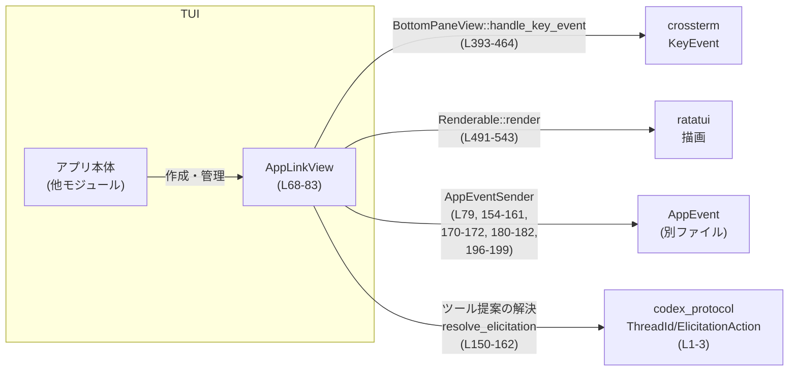

# tui/src/bottom_pane/app_link_view.rs コード解説

## 0. ざっくり一言

ChatGPT アプリ（コネクタ）の詳細とリンクをボトムペインに表示し、  
キーボード操作で「ブラウザで開く」「有効化／無効化」「インストール確認」「提案の承諾／拒否」などを行うためのビュー実装です。  
（`AppLinkView` 本体: `tui/src/bottom_pane/app_link_view.rs:L68-83`）

---

## 1. このモジュールの役割

### 1.1 概要

- このモジュールは **1つのアプリ（コネクタ）のリンク画面** をボトムペインで表示し、  
  ユーザーがキーボードで操作できる UI を提供します。
- インストール済みかどうか・有効化済みかどうかに応じて表示内容と操作項目を切り替えます  
  （`AppLinkView::action_labels`: `app_link_view.rs:L117-136`）。
- モデル側（サーバー／MCP）との対話は `AppEventSender` 経由で行い、  
  アプリの有効化・インストール完了時のコネクタ更新・ツール提案の承諾／拒否の解決を行います  
  （`resolve_elicitation`: `L150-162` など）。

### 1.2 アーキテクチャ内での位置づけ

`AppLinkView` はボトムペイン用のビューとして `BottomPaneView` と `Renderable` を実装し、  
キーイベントと描画の両方を担当します。ビュー自体はイベントを `AppEventSender` に投げるだけで、  
実際の I/O やネットワーク処理は別モジュールが処理します。



### 1.3 設計上のポイント

- **明示的な状態管理**
  - 画面状態を `AppLinkScreen`（Link / InstallConfirmation）で持ちます（`L36-40`）。
  - 現在選択中のアクションを `selected_action: usize` で管理します（`L81`）。
- **ステートマシンによるアクション分岐**
  - `activate_selected_action` が `screen`, `is_installed`, `suggestion_type` などに基づき、  
    「開く／有効化／インストール確認／承諾／拒否」を切り替えます（`L206-245`）。
- **イベント駆動・疎結合**
  - ビューは `AppEventSender` に `AppEvent` を送るだけで、I/O やビジネスロジックを持ちません  
    （例: `OpenUrlInBrowser`, `RefreshConnectors`, `SetAppEnabled`: `L169-182, 196-199`）。
- **安全なインデックス処理**
  - 選択移動は `saturating_sub` や `min` を使い、範囲外インデックスやオーバーフローを避けています  
    （`move_selection_prev`: `L138-140`, `move_selection_next`: `L142-144`）。
- **ツール提案の解決フローを内包**
  - MCP の Elicitation（ユーザーへの質問／提案）を Accept/Decline するロジックを内包し、  
    適切なタイミングで `resolve_elicitation` を呼び出します（`L150-162, 164-167, 179-187, 194-204`）。

---

## 2. 主要な機能一覧

- アプリ情報の表示:
  - タイトル・説明・利用手順・インストール状況などをラップして表示（`link_content_lines`: `L254-312`）。
- インストール確認画面の表示:
  - 「ブラウザでセットアップ → ここで『インストール済み』確認」のフローを案内（`install_confirmation_lines`: `L314-343`）。
- アクション選択 UI:
  - 「ブラウザで開く」「有効化／無効化」「戻る」「インストール済み」の行を生成し、  
    カーソル位置をハイライト（`action_rows`, `action_state`: `L345-367`）。
- キーボード入力処理:
  - 矢印 / Tab / Vim ライクキー / 数字 / Enter / Esc を処理し、  
    選択移動やアクション実行・クローズを行う（`handle_key_event`: `L393-464`）。
- ツール提案の承諾／拒否:
  - `AppLinkElicitationTarget` を元に ElicitationAction を Accept/Decline で解決（`resolve_elicitation`: `L150-162`）。
- レイアウト計算と描画:
  - コンテンツ・アクション・ヒントの高さを計算して表示エリアを分割し、  
    ratatui で描画する（`desired_height`: `L480-488`, `render`: `L491-543`）。

---

## 3. 公開 API と詳細解説

### 3.1 型一覧（構造体・列挙体など）

| 名前 | 種別 | 公開範囲 | 行 | 役割 / 用途 |
|------|------|----------|----|-------------|
| `AppLinkScreen` | enum | private | `L36-40` | ビューの画面状態（リンク画面／インストール確認画面）を表します。 |
| `AppLinkSuggestionType` | enum | `pub(crate)` | `L42-46` | ツール提案の種別（Install / Enable）を表します。 |
| `AppLinkElicitationTarget` | struct | `pub(crate)` | `L48-53` | ツール提案を解決するために必要な ThreadId / server_name / request_id を保持します。 |
| `AppLinkViewParams` | struct | `pub(crate)` | `L55-66` | `AppLinkView` 初期化時に渡すパラメータ（アプリ情報・提案情報など）をまとめたデータ構造です。 |
| `AppLinkView` | struct | `pub(crate)` | `L68-83` | ボトムペインに表示するアプリリンクビュー本体。状態とイベント送信チャネルを保持します。 |

#### 関数インベントリー（プロダクションコード）

| 関数名 | 所属 | 行 | 役割（1行） |
|--------|------|----|-------------|
| `new` | `impl AppLinkView` | `L86-115` | パラメータとイベント送信チャネルからビューを構築します。 |
| `action_labels` | `impl AppLinkView` | `L117-136` | 現在の状態に応じたアクションラベル一覧を生成します。 |
| `move_selection_prev` | `impl AppLinkView` | `L138-140` | 選択中アクションを前へ移動します（先頭で止まる）。 |
| `move_selection_next` | `impl AppLinkView` | `L142-144` | 選択中アクションを次へ移動します（末尾で止まる）。 |
| `is_tool_suggestion` | `impl AppLinkView` | `L146-148` | ツール提案コンテキストかどうかを判定します。 |
| `resolve_elicitation` | `impl AppLinkView` | `L150-162` | ElicitationAction を AppEventSender 経由で解決します。 |
| `decline_tool_suggestion` | `impl AppLinkView` | `L164-167` | 提案を Decline し、ビューを完了状態にします。 |
| `open_chatgpt_link` | `impl AppLinkView` | `L169-177` | ブラウザで URL を開き、未インストールなら確認画面に遷移します。 |
| `refresh_connectors_and_close` | `impl AppLinkView` | `L179-187` | コネクタの再取得を要求し、必要に応じて提案を Accept にしつつビューを閉じます。 |
| `back_to_link_screen` | `impl AppLinkView` | `L189-192` | インストール確認画面からリンク画面に戻します。 |
| `toggle_enabled` | `impl AppLinkView` | `L194-204` | 有効／無効状態を反転し、AppEvent を送信、ツール提案なら Accept して完了します。 |
| `activate_selected_action` | `impl AppLinkView` | `L206-245` | 現在の選択と状態に応じて適切なアクション（開く／切替／承諾／拒否など）を実行します。 |
| `content_lines` | `impl AppLinkView` | `L247-252` | 現在の画面用のテキスト行（`Line<'static>`）一覧を生成します。 |
| `link_content_lines` | `impl AppLinkView` | `L254-312` | リンク画面用のテキストを折り返して生成します。 |
| `install_confirmation_lines` | `impl AppLinkView` | `L314-343` | インストール確認画面用のテキストを生成し、URL を特殊なラップで表示します。 |
| `action_rows` | `impl AppLinkView` | `L345-361` | アクション選択用の `GenericDisplayRow` を生成します。 |
| `action_state` | `impl AppLinkView` | `L363-367` | 現在の選択インデックスを含む `ScrollState` を生成します。 |
| `action_rows_height` | `impl AppLinkView` | `L369-373` | アクション行の高さ（行数）を測定します。 |
| `hint_line` | `impl AppLinkView` | `L375-389` | キーボード操作のヒント行を生成します。 |
| `handle_key_event` | `impl BottomPaneView for AppLinkView` | `L393-464` | キー入力を解釈し、選択移動やアクション実行・クローズを行います。 |
| `on_ctrl_c` | `impl BottomPaneView for AppLinkView` | `L466-472` | Ctrl-C 等のキャンセル操作を処理し、必要なら提案を Decline にします。 |
| `is_complete` | `impl BottomPaneView for AppLinkView` | `L474-476` | ビューが完了（閉じるべき）状態かどうかを返します。 |
| `desired_height` | `impl Renderable for AppLinkView` | `L480-488` | コンテンツとアクションの高さから、必要なビュー高さを計算します。 |
| `render` | `impl Renderable for AppLinkView` | `L491-543` | ratatui を使って内容・アクション・ヒントの 3領域を描画します。 |

（テスト用関数・テストケースは `mod tests` 内 `L546-949` に定義されています。）

---

### 3.2 関数詳細（主要 7 件）

#### `AppLinkView::new(params: AppLinkViewParams, app_event_tx: AppEventSender) -> Self`

**定義**: `tui/src/bottom_pane/app_link_view.rs:L86-115`

**概要**

- ビューに必要なアプリ情報・提案情報を `AppLinkViewParams` から取り出し、  
  イベント送信チャネルとともに `AppLinkView` を初期化します。
- 初期画面はリンク画面 (`AppLinkScreen::Link`)、選択アクションは先頭（0）、未完了状態です。

**引数**

| 引数名 | 型 | 説明 |
|--------|----|------|
| `params` | `AppLinkViewParams` | アプリ名・説明・インストール状態・提案情報など一式。 |
| `app_event_tx` | `AppEventSender` | `AppEvent` と Elicitation 解決を上位へ送るためのチャネルラッパ。 |

**戻り値**

- `AppLinkView`: 渡された情報を内部フィールドにコピーした新しいビューインスタンス。

**内部処理の流れ**

1. `params` をパターンマッチで分解し、各フィールドをローカル変数に束縛（`L87-98`）。
2. それらをフィールドに設定して `Self` を生成（`L99-114`）。
3. `screen` を `AppLinkScreen::Link`、`selected_action` を `0`、`complete` を `false` に初期化。

**Examples（使用例）**

```rust
use tokio::sync::mpsc::unbounded_channel;
use crate::app_event::AppEvent;
use crate::app_event_sender::AppEventSender;
use crate::tui::bottom_pane::app_link_view::{AppLinkView, AppLinkViewParams, AppLinkSuggestionType};

let (tx_raw, _rx) = unbounded_channel::<AppEvent>();       // AppEvent 用のチャネルを作成
let app_event_tx = AppEventSender::new(tx_raw);            // AppEventSender にラップ

let view = AppLinkView::new(
    AppLinkViewParams {
        app_id: "connector_google_calendar".into(),
        title: "Google Calendar".into(),
        description: Some("Plan events and schedules.".into()),
        instructions: "Install this app in your browser, then return here.".into(),
        url: "https://example.test/google-calendar".into(),
        is_installed: false,
        is_enabled: false,
        suggest_reason: None,
        suggestion_type: Some(AppLinkSuggestionType::Install),
        elicitation_target: None,
    },
    app_event_tx,
);
```

**Errors / Panics**

- この関数内ではパニックを起こす可能性のある処理はありません（単純な構造体初期化のみ）。

**Edge cases（エッジケース）**

- `description` や `suggest_reason` が `None` または空文字列でも問題なく動作します（後続の描画処理で無視されます）。
- `suggestion_type` と `elicitation_target` は共に `None` でもよく、その場合は単なる情報表示ビューとして動作します。

**使用上の注意点**

- ツール提案を扱いたい場合は、`suggestion_type` と `elicitation_target` をセットで指定する必要があります（Accept/Decline が動作する前提）。  

---

#### `BottomPaneView::handle_key_event(&mut self, key_event: KeyEvent)`

**定義**: `tui/src/bottom_pane/app_link_view.rs:L393-464`

**概要**

- キーイベントを解釈し、選択行の移動・アクションの実行・キャンセル処理を行います。
- Vim ライクキー (`h/j/k/l`)、数字キー（1〜9）、矢印キー、Tab/BackTab、Enter、Esc をサポートします。

**引数**

| 引数名 | 型 | 説明 |
|--------|----|------|
| `key_event` | `KeyEvent` | crossterm から渡されるキー入力。キー種別と修飾キーを含みます。 |

**戻り値**

- ありません（副作用で内部状態を更新し、必要ならイベントを送信します）。

**内部処理の流れ**

1. `match key_event` でキー種別ごとに分岐（`L394-463`）。
2. `Esc`:
   - `self.on_ctrl_c()` を呼び出し、キャンセル処理（`L395-399`）。
3. 上移動系 (`Up`, `Left`, `BackTab`, `k`, `h`):
   - `move_selection_prev()` を呼び出し、選択インデックスを前へ（`L400-420`）。
4. 下移動系 (`Down`, `Right`, `Tab`, `j`, `l`):
   - `move_selection_next()` を呼び出し、選択インデックスを次へ（`L421-441`）。
5. 数字 (`'1'`〜`'9'`, 修飾なし):
   - `to_digit(10)` → `checked_sub(1)` → `usize` に変換し、`action_labels().len()` 未満なら  
     `selected_action` にセットして `activate_selected_action()` を呼ぶ（`L447-455`）。
6. `Enter`（修飾なし）:
   - `activate_selected_action()` を呼び出す（`L457-461`）。
7. それ以外のキーは無視（`_ => {}`）。

**Examples（使用例）**

```rust
use crossterm::event::{KeyEvent, KeyCode, KeyModifiers};
use crate::tui::bottom_pane::app_link_view::AppLinkView;

// view は既に AppLinkView::new で作成されているとする
let mut view = view;

// 「2」キーで 2 番目のアクションを実行
view.handle_key_event(KeyEvent::new(KeyCode::Char('2'), KeyModifiers::NONE));

// Enter キーで現在選択中のアクションを実行
view.handle_key_event(KeyEvent::new(KeyCode::Enter, KeyModifiers::NONE));
```

**Errors / Panics**

- インデックス計算は `checked_sub` と `index < self.action_labels().len()` チェックにより安全です（`L447-452`）。
- パニックを起こす可能性がある操作はありません。

**Edge cases（エッジケース）**

- `0` キー: `checked_sub(1)` が `None` になるため無視されます。
- `action_labels().len()` より大きな数字が押された場合: 条件 `index < len` を満たさないため無視されます（例: アクション数2で `'3'` を押しても何も起きません）。
- 修飾キー付きの数字や Enter は無視されます（`modifiers: KeyModifiers::NONE` を要求しているため）。

**使用上の注意点**

- この関数は同期的であり、`AppEventSender` の送信は内部で行われます。  
  上位のイベントループ側での追加の非同期処理は不要ですが、AppEvent の受信側は別途非同期で処理される設計になっている可能性があります。
- Esc キーと Ctrl-C はどちらも `on_ctrl_c` にマップされている設計である点に注意が必要です（Ctrl-C 自体は別経路でこのメソッドが呼ばれる想定と推測されますが、コード上は Esc にのみ対応しています）。

---

#### `AppLinkView::activate_selected_action(&mut self)`

**定義**: `tui/src/bottom_pane/app_link_view.rs:L206-245`

**概要**

- 現在の画面 (`screen`)、ツール提案の有無と種類 (`suggestion_type`)、インストール状態などに基づいて、  
  選択中アクションに対応する処理を実行する「中心のステートマシン」です。
- 通常モードとツール提案モードで挙動が分かれます。

**引数**

| 引数名 | 型 | 説明 |
|--------|----|------|
| `&mut self` | `AppLinkView` | ビューの内部状態（画面・選択・インストール状態など）を更新します。 |

**戻り値**

- ありません。副作用としてイベント送信・状態更新を行います。

**内部処理の流れ（ツール提案がある場合）**（`is_tool_suggestion() == true`、`L207-231`）

1. `self.suggestion_type` で分岐（`L208-220`）。
2. `Some(Enable)` の場合:
   - `screen == Link`:
     - `selected_action == 0`: `open_chatgpt_link()`（ブラウザを開く、`L210-212`）。
     - `selected_action == 1` かつ `is_installed`: `toggle_enabled()`（有効化しつつ Accept, `L212-213`）。
     - それ以外: `decline_tool_suggestion()`（Decline + 完了, `L213`）。
   - `screen == InstallConfirmation`:
     - `selected_action == 0`: `refresh_connectors_and_close()`（Accept + 完了, `L215-217`）。
     - それ以外: `decline_tool_suggestion()`。
3. `Some(Install)` または `None` の場合:
   - `screen == Link`:
     - `selected_action == 0`: `open_chatgpt_link()`。
     - それ以外: `decline_tool_suggestion()`。
   - `screen == InstallConfirmation`:
     - `selected_action == 0`: `refresh_connectors_and_close()`。
     - それ以外: `decline_tool_suggestion()`。
4. ツール提案モードの処理後は `return` し、通常モード分岐に入らない（`L231`）。

**内部処理の流れ（ツール提案がない場合）**（`L234-244`）

1. `match self.screen` で画面を分岐。
2. `Link` 画面:
   - `selected_action == 0`: `open_chatgpt_link()`。
   - `selected_action == 1` かつ `is_installed`: `toggle_enabled()`。
   - それ以外: `self.complete = true;`（ビューを閉じる）。  
3. `InstallConfirmation` 画面:
   - `selected_action == 0`: `refresh_connectors_and_close()`。
   - それ以外: `back_to_link_screen()` によりリンク画面に戻る。

**Examples（使用例）**

`handle_key_event` から内部的に呼ばれるため、通常は直接呼び出す必要はありません。  
テストコードでは、キーイベントを経由して期待するステート遷移を検証しています（例: `enable_tool_suggestion_resolves_elicitation_after_enable`: `L842-890`）。

**Errors / Panics**

- 分岐はすべて列挙体とブール値に基づくものであり、パニックを起こす可能性はありません。
- 想定外の `suggestion_type` は存在せず、`None` も `Install` と同じ扱いで安全に処理されます（`L220`）。

**Edge cases（エッジケース）**

- `suggestion_type == None` かつ `elicitation_target.is_some()` の場合:
  - コード上は `Install` と同じ扱いになります（`Some(AppLinkSuggestionType::Install) | None` の分岐）。
- `Enable` 提案だが `is_installed == false` の場合:
  - `selected_action == 1 if self.is_installed` の条件により `toggle_enabled` が呼ばれず、他の選択肢は `decline_tool_suggestion` になります。  
  - このような不整合状態は上位ロジック側で避ける前提と考えられます。

**使用上の注意点**

- 新たなアクションを追加したい場合は、`action_labels` とこのメソッドの分岐を一貫して変更する必要があります。  
  両者を同期させないと、ラベルと挙動がずれる可能性があります。

---

#### `AppLinkView::resolve_elicitation(&self, decision: ElicitationAction)`

**定義**: `tui/src/bottom_pane/app_link_view.rs:L150-162`

**概要**

- ツール提案（Elicitation）に対して Accept/Decline の決定を送信します。
- `elicitation_target` が設定されているときのみ動作し、AppEventSender に委譲して実際のプロトコルメッセージを送ります。

**引数**

| 引数名 | 型 | 説明 |
|--------|----|------|
| `decision` | `ElicitationAction` | Accept または Decline（codex_protocol の型）。 |

**戻り値**

- ありません。

**内部処理の流れ**

1. `self.elicitation_target.as_ref()` でターゲット情報があるかをチェック（`L151`）。
2. `None` の場合は何もせず `return`（`L152-153`）。
3. `Some(target)` の場合:
   - `self.app_event_tx.resolve_elicitation(...)` を呼び出し、  
     `thread_id`, `server_name.clone()`, `request_id.clone()`, `decision`, `content=None`, `meta=None` を渡す（`L154-161`）。

**Examples（使用例）**

このメソッドは内部利用専用で、`toggle_enabled`, `refresh_connectors_and_close`, `decline_tool_suggestion`, `on_ctrl_c` などから呼ばれます（`L164-167, 179-187, 194-204, 466-472`）。

**Errors / Panics**

- `elicitation_target` が `None` の場合は安全に何もせず終了します。
- クローンやコピーのみであり、パニックの可能性はありません。
- 下流の `AppEventSender::resolve_elicitation` 内の動作はこのファイルからは分かりませんが、  
  テストでは `AppEvent::SubmitThreadOp` が送られることが確認されています（例: `install_tool_suggestion_resolves_elicitation_after_confirmation`: `L780-793`）。

**Edge cases（エッジケース）**

- `elicitation_target == None` の場合:
  - 何も送信されず静かに戻ります。  
    → ツール提案でない利用ケースではこれが期待される挙動です。
- 同じビューで複数回呼び出した場合:
  - `complete` フラグの制御は呼び出し側で行っているため、  
    複数回 Accept/Decline が送られる可能性は呼び出し側の実装次第です（このファイル単体では分かりません）。

**使用上の注意点**

- ツール提案を導入する際は、必ず `elicitation_target` を設定した上でこのメソッドを間接的に呼び出すようにする必要があります。

---

#### `AppLinkView::toggle_enabled(&mut self)`

**定義**: `tui/src/bottom_pane/app_link_view.rs:L194-204`

**概要**

- アプリの有効状態をトグルし、`AppEvent::SetAppEnabled` を送信します。
- ツール提案コンテキストの場合は、その時点で提案を Accept として解決し、ビューを完了状態にします。

**引数**

| 引数名 | 型 | 説明 |
|--------|----|------|
| `&mut self` | `AppLinkView` | `is_enabled` の更新とイベント送信、完了フラグの更新を行います。 |

**戻り値**

- ありません。

**内部処理の流れ**

1. `self.is_enabled = !self.is_enabled;` で有効フラグを反転（`L195`）。
2. `AppEvent::SetAppEnabled { id, enabled }` を `app_event_tx.send` で送信（`L196-199`）。
3. `is_tool_suggestion()` が真なら:
   - `resolve_elicitation(ElicitationAction::Accept)` を呼ぶ（`L201`）。
   - `self.complete = true;` にしてビューを完了状態にする（`L202`）。

**Examples（使用例）**

テスト `toggle_action_sends_set_app_enabled_and_updates_label`（`L611-646`）で以下が検証されています:

- `'2'` キーでトグルアクションが選択される。
- `AppEvent::SetAppEnabled { id: "connector_1", enabled: false }` が送信される。
- `action_labels()` が `"Disable app"` から `"Enable app"` に変わる。

**Errors / Panics**

- パニック要因はなく、`AppEventSender::send` の失敗は型上は表現されていません（fire-and-forget）。

**Edge cases（エッジケース）**

- ツール提案でない場合（`elicitation_target == None`）:
  - Elicitation の解決は行われず、単にトグルとイベント送信のみ行われます。
- `is_installed == false` の場合の扱い:
  - 通常のアクション分岐（`activate_selected_action`）側で `1 if self.is_installed` のガードがあるため、  
    未インストールでこの関数が呼ばれることは想定されていません。

**使用上の注意点**

- UI ラベルは `action_labels` が `self.is_enabled` を参照して切り替えるため、  
  トグル後に再描画しないと表示と内部状態が一致しなくなります。
- ツール提案コンテキストでは、この関数がビューの終端（complete=true）にもなります。

---

#### `AppLinkView::content_lines(&self, width: u16) -> Vec<Line<'static>>`

**定義**: `tui/src/bottom_pane/app_link_view.rs:L247-252`

**概要**

- 現在の画面種別に応じて、表示すべきテキスト行（`Line<'static>`）を生成します。
- リンク画面とインストール確認画面で異なる文面・レイアウトを返します。

**引数**

| 引数名 | 型 | 説明 |
|--------|----|------|
| `width` | `u16` | 折り返しに使う幅（文字数）。0 の場合も 1 に切り上げて扱います。 |

**戻り値**

- `Vec<Line<'static>>`: ratatui の `Paragraph` に渡す行列。  

**内部処理の流れ**

1. `match self.screen` で画面種別を判定（`L248-251`）。
2. `AppLinkScreen::Link` の場合:
   - `link_content_lines(width)` を呼び出す（`L254-312`）。
3. `AppLinkScreen::InstallConfirmation` の場合:
   - `install_confirmation_lines(width)` を呼び出す（`L314-343`）。

`link_content_lines` の主な処理（`L254-312`）:

- `width.max(1)` で幅 0 を 1 に補正（`L255`）。
- タイトルを太字で 1 行目に表示（`L258`）。
- `description`, `suggest_reason`, `instructions` をそれぞれ `textwrap::wrap` で折り返しつつ行を追加（`L259-307`）。
- インストール済みなら「Use $ to insert this app...」案内を表示（`L282-287`）。
- 常に「Newly installed apps can take...」メッセージを追加し、未インストール時は追記メッセージも表示（`L294-307`）。

`install_confirmation_lines` の主な処理（`L314-343`）:

- 見出し「Finish App Setup」を太字で表示（`L318`）。
- ブラウザでのセットアップ手順を説明文として折り返し表示（`L321-332`）。
- 「Setup URL:」ラベルと、`self.url` をシアン＋下線付きで表示（`L335-337`）。
- URL 行は `adaptive_wrap_lines` を用いてラップし、URL 全体／末尾が見えやすくなるよう調整（`L337-340`）。

**Examples（使用例）**

テスト `install_confirmation_does_not_split_long_url_like_token_without_scheme`（`L648-689`）では:

- `content_lines(40)` で得られた行のうち、URL ライク文字列が 1 行にまとまっていることを確認しています。

**Errors / Panics**

- `width` は `.max(1)` で補正されるため、`textwrap::wrap` や `adaptive_wrap_lines` で 0 幅によるパニックは発生しません。
- 文字列操作と所有権の移動のみで、パニック要因は見当たりません。

**Edge cases（エッジケース）**

- `description` や `suggest_reason` が空文字（スペースのみ含む等）の場合:
  - `str::trim` → `filter(|s| !s.is_empty())` によりスキップされます（`L259-276`）。
- `instructions` が空文字の場合:
  - `!instructions.is_empty()` が偽となり、案内文や後続メッセージは追加されません（`L289-309`）。
- 非常に長い URL の場合:
  - `install_confirmation_render_keeps_url_tail_visible_when_narrow` テスト (`L692-739`) が、  
    幅 36 のときに URL 末尾 "tail42" が表示領域に含まれることを保証しています。

**使用上の注意点**

- 返される `Line<'static>` は内部で `String` を所有しており、ライフタイム `'static` を取っています。  
  ratatui のライフタイム設計に基づいた用法であり、ビューが短命であれば問題ありません。
- ラップ動作を変えたい場合は、`textwrap::wrap` や `adaptive_wrap_lines` の呼び出し部分を変更する必要があります。

---

#### `Renderable::desired_height(&self, width: u16) -> u16`

**定義**: `tui/src/bottom_pane/app_link_view.rs:L480-488`

**概要**

- 現在のコンテンツを与えられた幅で表示するために必要な高さ（行数）を計算します。
- コンテンツ区域＋アクション区域＋ヒント1行の合計を返します。

**引数**

| 引数名 | 型 | 説明 |
|--------|----|------|
| `width` | `u16` | 全体の幅（ボックス枠を含む）。 |

**戻り値**

- `u16`: 必要な高さ。少なくとも 3 行（コンテンツ 1 + アクション 1 + ヒント 1）以上。

**内部処理の流れ**

1. コンテンツ領域の幅 `content_width` を `width.saturating_sub(4).max(1)` で計算（`L481`）。
   - 左右のインデント分 4 列を差し引き、0 以下にならないよう 1 に切り上げます。
2. `content_lines(content_width)` を呼び、行ベクタを得る（`L482`）。
3. `Paragraph::new(content_lines).wrap(Wrap { trim: false }).line_count(content_width)` で  
   実際の折り返し後の行数を計算し、少なくとも 1 行になるよう `.max(1)`（`L483-486`）。
4. `action_rows_height(content_width)` でアクション領域の高さを計算（`L487`）。
5. 最終的な高さとして `content_rows + action_rows_height + 3` を返す（`L488`）。
   - `+3` は上下の余白とヒント行 1 行分と考えられます。

**Examples（使用例）**

```rust
use ratatui::layout::Rect;
use crate::tui::bottom_pane::app_link_view::AppLinkView;

let width: u16 = 72;
let height = view.desired_height(width);
let area = Rect::new(0, 0, width, height);
// area を使って render() に渡す
```

テスト `install_confirmation_render_keeps_url_tail_visible_when_narrow` でも、  
`desired_height(width)` を用いてバッファ領域を決定しています（`L714-717`）。

**Errors / Panics**

- `saturating_sub` と `max(1)` を使っているため、0 幅によるパニックは回避されています。
- `Paragraph::line_count()` は ratatui の API に依存しますが、ここでの使用は通常安全です。

**Edge cases（エッジケース）**

- 非常に狭い幅（例: 1〜3）:
  - `content_width` は最小でも 1 になるため、折り返し行数は増えますが計算自体は安全です。
  - アクション領域の幅も同様に狭くなりますが、`measure_rows_height` 内で幅 0 → 1 に補正されています。

**使用上の注意点**

- レイアウト計画の前に必ず `desired_height` を呼んでおくことで、他のペインとの高さ調整が容易になります。
- コンテンツの動的変化（説明文やインストール状態が変わるなど）がある場合、  
  再度 `desired_height` を計算し直す必要があります。

---

#### `Renderable::render(&self, area: Rect, buf: &mut Buffer)`

**定義**: `tui/src/bottom_pane/app_link_view.rs:L491-543`

**概要**

- 指定された領域にボックス付きのビューを描画し、テキストコンテンツ・アクションリスト・ヒント行を縦に配置します。
- ratatui を用いて実際の TUI バッファにスタイル付きの文字を出力します。

**引数**

| 引数名 | 型 | 説明 |
|--------|----|------|
| `area` | `Rect` | 描画する矩形領域。幅・高さが 0 の場合は何も描画しません。 |
| `buf` | `&mut Buffer` | ratatui のスタイル付きセルバッファ。 |

**戻り値**

- ありません。

**内部処理の流れ**

1. `area.height == 0 || area.width == 0` の場合は早期 return（`L492-494`）。
2. `Block::default().style(user_message_style()).render(area, buf);` で背景ボックスとスタイルを適用（`L496-498`）。
3. アクション領域の高さを `self.action_rows_height(area.width.saturating_sub(4))` で計算（`L500`）。
4. `Layout::vertical([...]).areas(area)` により、`content_area`, `actions_area`, `hint_area` の 3 つに縦割り（`L501-506`）。
5. コンテンツ描画:
   - `content_area.inset(Insets::vh(1, 2))` で上下 1・左右 2 のインセット（`L508`）。
   - `content_width = inner.width.max(1)` を算出（`L509`）。
   - `content_lines(content_width)` を取得し、`Paragraph::new(...).wrap(...).render(inner, buf)` で描画（`L510-513`）。
6. アクション描画（`actions_area.height > 0` のとき）:
   - 左端を 2 文字右にずらし、幅を 2 小さくした `Rect` を計算（`L516-520`）。
   - `action_rows` と `action_state` を取得（`L522-523`）。
   - `render_rows` を使ってリスト形式で描画（`L524-531`）。
7. ヒント描画（`hint_area.height > 0` のとき）:
   - 同様に左右に 2 文字のマージンをとった `Rect` を計算（`L535-539`）。
   - `self.hint_line().dim().render(hint_area, buf);` で dim スタイルのヒント行を描画（`L541`）。

**Examples（使用例）**

テストヘルパー `render_snapshot`（`L563-583`）は、このメソッドを用いて文字列スナップショットを生成しています:

```rust
fn render_snapshot(view: &AppLinkView, area: Rect) -> String {
    let mut buf = Buffer::empty(area);
    view.render(area, &mut buf);
    // buf から行ごとの文字列を組み立てて返す...
}
```

**Errors / Panics**

- `area.width` / `height` が 0 の場合は即座に return するため、ratatui 側の制約によるパニックを避けています。
- `actions_area.width` が 0 の場合でも、`render_rows` 側での処理がどうなるかはこのファイルから分かりませんが、  
  `Rect` 自体は 0 幅を許容するため、少なくともここでのパニック要因はありません。

**Edge cases（エッジケース）**

- 非常に狭い幅:
  - インデントや枠の分を差し引くため、実質的な表示幅が非常に小さくなることがありますが、  
    `content_width.max(1)` により 0 に落ちることはありません。
- アクション行が 0 の場合:
  - `action_rows.len().max(1)` で高さを計算しているため、`render_rows` には少なくとも 1 行分の高さが渡されます（`L369-373`）。  
    ただし `action_labels` は常に 2 つ以上を返す実装なので、このケースは実際には発生しません。

**使用上の注意点**

- 外側で `desired_height` を使って適切な `area` を確保することで、  
  コンテンツが切れずに表示されることが保証されます。
- この関数は描画のみを行い状態変更をしません。状態更新は `handle_key_event` や他のメソッドで行われます。

---

### 3.3 その他の関数（補助的なもの）

| 関数名 | 行 | 役割（1 行） |
|--------|----|--------------|
| `action_labels` | `L117-136` | 画面状態とインストール状態に応じてアクションラベル配列を生成します。 |
| `move_selection_prev` | `L138-140` | 選択インデックスを 1 つ前に移動（0 未満にはならない）。 |
| `move_selection_next` | `L142-144` | 選択インデックスを 1 つ次に移動（末尾を超えない）。 |
| `is_tool_suggestion` | `L146-148` | `elicitation_target` の有無でツール提案コンテキストかどうかを判定。 |
| `decline_tool_suggestion` | `L164-167` | `resolve_elicitation(Decline)` を呼び、`complete = true` にします。 |
| `open_chatgpt_link` | `L169-177` | `AppEvent::OpenUrlInBrowser` を送信し、未インストール時は確認画面へ遷移。 |
| `refresh_connectors_and_close` | `L179-187` | `RefreshConnectors` イベント送信と Elicitation Accept、完了フラグ設定。 |
| `back_to_link_screen` | `L189-192` | インストール確認画面からリンク画面に戻す。 |
| `link_content_lines` | `L254-312` | リンク画面のテキストコンテンツを生成。 |
| `install_confirmation_lines` | `L314-343` | インストール確認画面のテキストコンテンツを生成。 |
| `action_rows` | `L345-361` | `GenericDisplayRow` のリストを作成し、選択行の先頭に矢印を付ける。 |
| `action_state` | `L363-367` | 現在の選択インデックスを反映した `ScrollState` を作成。 |
| `action_rows_height` | `L369-373` | アクション一覧が占める高さを測定。 |
| `hint_line` | `L375-389` | 「Use Tab / ↑ / ↓ ...」形式のキーヒント行を生成。 |
| `on_ctrl_c` | `L466-472` | キャンセル時に Elicitation を Decline し、ビューを完了状態に。 |
| `is_complete` | `L474-476` | 現在の完了フラグを返す。 |

---

## 4. データフロー

### 4.1 代表的なシナリオ: 「インストール提案を承諾する」フロー

ここでは、`suggestion_type = Some(Install)` かつ `elicitation_target` がある  
ツール提案のケースにおいて、ユーザーが Enter キーで提案を受け入れる流れを説明します。

1. ユーザーが Enter キーを押す。
2. TUI イベントループが `KeyEvent` を受信し、`AppLinkView::handle_key_event` に渡す（`L393-461`）。
3. `handle_key_event` が `activate_selected_action` を呼び出す（`L457-461`）。
4. `activate_selected_action` が `suggestion_type == Some(Install)` かつ `screen == Link` の分岐に入り、  
   `selected_action == 0` なら `open_chatgpt_link()` を呼ぶ（`L220-223`）。
5. `open_chatgpt_link` が `AppEvent::OpenUrlInBrowser { url }` を送信し（`L169-172`）、  
   `is_installed == false` なので `screen = InstallConfirmation` に遷移（`L173-176`）。
6. ブラウザでユーザーがインストール作業を行った後、再びアプリに戻り Enter を押す。
7. 再度 `handle_key_event` → `activate_selected_action` が呼ばれ、  
   今度は `screen == InstallConfirmation` かつ `selected_action == 0` なので  
   `refresh_connectors_and_close()` が呼ばれる（`L225-227`）。
8. `refresh_connectors_and_close` が `AppEvent::RefreshConnectors` を送信し（`L179-182`）、  
   さらに `is_tool_suggestion()` が真なら `resolve_elicitation(Accept)` を呼び出す（`L183-185`）。
9. `resolve_elicitation` が `AppEventSender::resolve_elicitation` を通じて  
   `Op::ResolveElicitation { decision: Accept, ... }` を送信し（テスト `L780-793`）、`complete = true` に設定（`L186`）。

この流れはテスト `install_tool_suggestion_resolves_elicitation_after_confirmation` によって検証されています（`L742-798`）。

```mermaid
sequenceDiagram
    autonumber
    participant U as ユーザー
    participant Loop as TUIイベントループ
    participant V as AppLinkView<br/>(activate_selected_action L206-245)
    participant S as AppEventSender
    participant Server as Codex/MCP サーバー

    U->>Loop: Enter キー (1回目)
    Loop->>V: handle_key_event(Enter) (L393-461)
    V->>V: activate_selected_action() (L206-245)
    V->>V: open_chatgpt_link() (L169-177)
    V->>S: send(AppEvent::OpenUrlInBrowser) (L170-172)
    Note right of V: screen = InstallConfirmation (L173-176)

    U->>Loop: Enter キー (2回目)
    Loop->>V: handle_key_event(Enter)
    V->>V: activate_selected_action() (InstallConfirmation 分岐, L225-227)
    V->>V: refresh_connectors_and_close() (L179-187)
    V->>S: send(AppEvent::RefreshConnectors) (L180-182)
    V->>V: resolve_elicitation(Accept) (L183-185,150-162)
    V->>S: resolve_elicitation(...) → SubmitThreadOp (テスト L780-793)
    S->>Server: ResolveElicitation(decision=Accept)
    V->>V: complete = true (L186)
```

---

## 5. 使い方（How to Use）

### 5.1 基本的な使用方法

典型的な利用は、「TUI アプリのボトムペインとして `AppLinkView` を表示し、  
イベントループでキー入力を流し込み、`is_complete` になったら閉じる」という流れになります。

```rust
use tokio::sync::mpsc::unbounded_channel;
use crossterm::event::{read, Event, KeyEvent};
use ratatui::{backend::CrosstermBackend, Terminal};
use ratatui::layout::Rect;

use crate::app_event::AppEvent;
use crate::app_event_sender::AppEventSender;
use crate::tui::bottom_pane::app_link_view::{AppLinkView, AppLinkViewParams};
use crate::render::renderable::Renderable;

fn run_app_link_view() -> crossterm::Result<()> {
    // 1. AppEvent の送信用チャネルを用意する
    let (tx_raw, _rx) = unbounded_channel::<AppEvent>();
    let app_event_tx = AppEventSender::new(tx_raw);

    // 2. ビューを初期化する
    let mut view = AppLinkView::new(
        AppLinkViewParams {
            app_id: "connector_1".into(),
            title: "Notion".into(),
            description: Some("Your notes, docs & tasks.".into()),
            instructions: "Install this app in your browser, then return here.".into(),
            url: "https://example.test/notion".into(),
            is_installed: false,
            is_enabled: false,
            suggest_reason: None,
            suggestion_type: None,          // 単なる情報ビュー
            elicitation_target: None,
        },
        app_event_tx,
    );

    // 3. ratatui の Terminal を初期化（詳細は省略）
    let backend = CrosstermBackend::new(std::io::stdout());
    let mut terminal = Terminal::new(backend)?;

    // 4. イベントループ
    loop {
        terminal.draw(|frame| {
            let size = frame.size();
            // ボトムペイン用の Rect を決める（ここでは単純化して高さを desired_height に任せる）
            let height = view.desired_height(size.width);
            let area = Rect::new(0, size.height.saturating_sub(height), size.width, height);
            view.render(area, frame.buffer_mut());
        })?;

        if view.is_complete() {
            break;
        }

        // crossterm からイベントを読む（ブロッキング）
        if let Event::Key(key_event) = read()? {
            view.handle_key_event(key_event);
        }
    }

    Ok(())
}
```

### 5.2 よくある使用パターン

1. **インストール提案ビュー**
   - `suggestion_type: Some(AppLinkSuggestionType::Install)`  
     `elicitation_target: Some(...)` を設定し、ユーザーが Enter で承諾するフローを提供（`L742-798` のテスト参照）。
2. **有効化提案ビュー**
   - 既にインストール済みで `is_installed: true`, `is_enabled: false`,  
     `suggestion_type: Some(AppLinkSuggestionType::Enable)` を設定すると、  
     「2: Enable app」の選択で有効化＋Elicitation Accept が行われます（`L842-890` のテスト参照）。
3. **通常のアプリ管理ビュー**
   - `suggestion_type` と `elicitation_target` を `None` にして  
     単に「ブラウザで管理」と「有効化／無効化」「戻る」の UI として利用（`L585-609`）。

### 5.3 よくある間違い

```rust
// 間違い例: is_complete を見ずに永遠に表示し続ける
loop {
    view.render(area, buf);
    // view.handle_key_event(...); だけでループを続けている
}

// 正しい例: is_complete で終了条件を判定する
loop {
    view.render(area, buf);
    if view.is_complete() {
        break;
    }
    view.handle_key_event(read_key_event()?);
}
```

```rust
// 間違い例: suggestion_type だけ設定し、elicitation_target を None のままにする
let view = AppLinkView::new(
    AppLinkViewParams {
        // ...
        suggestion_type: Some(AppLinkSuggestionType::Install),
        elicitation_target: None, // ← Elicitation の解決が行われない
    },
    tx,
);

// 正しい例: ツール提案には suggestion_type と elicitation_target をセットで渡す
let view = AppLinkView::new(
    AppLinkViewParams {
        // ...
        suggestion_type: Some(AppLinkSuggestionType::Install),
        elicitation_target: Some(AppLinkElicitationTarget { /* ... */ }),
    },
    tx,
);
```

### 5.4 使用上の注意点（まとめ）

- **前提条件**
  - ツール提案を解決したい場合は、`suggestion_type` と `elicitation_target` を両方設定する必要があります。
  - `AppEventSender` の送信先チャネルが枯渇しないよう、上位で適切に受信処理を行う必要があります（このファイルの外の責務）。
- **キャンセル時の挙動**
  - Esc キー／Ctrl-C 相当の操作では、ツール提案コンテキストの場合 `Decline` が送信されます（`on_ctrl_c`: `L466-472`）。  
    提案を黙って無視したい場合は、この挙動を理解しておく必要があります。
- **セキュリティ観点**
  - `open_chatgpt_link` は `params.url` をそのままブラウザに開くイベントとして送信します（`L169-172`）。  
    URL の妥当性チェックやサニタイズは上位で行う前提です。
- **パフォーマンス**
  - 描画ごとに `content_lines` や `Paragraph::line_count` が実行されるため、  
    非常に長いテキストを頻繁に更新する場合はコストに注意が必要です。  
    ただし通常の利用範囲では問題になりにくいと考えられます。

---

## 6. 変更の仕方（How to Modify）

### 6.1 新しい機能を追加する場合

例: 新しいアクション「ヘルプを表示」を追加したい場合

1. **アクションラベルの追加**
   - `action_labels` に新しいラベルを追加します（`L117-136`）。
   - 位置（インデックス）に応じて `"Help"` などを追加。

2. **ステートマシンへの分岐追加**
   - `activate_selected_action` 内で、該当インデックスの分岐を追加します（`L206-245`）。
   - ツール提案モードと通常モード双方で必要な分岐を追加することを検討します。

3. **描画高さの調整**
   - アクション数が増えると `action_rows_height` の返す高さが変わり、  
     自動的に `desired_height` に反映されます。追加の変更は不要です。

4. **テストの追加**
   - 新しいアクションのラベルとイベント送信を検証するテストを `mod tests` 内に追加します（`L546-949` 参照）。

### 6.2 既存の機能を変更する場合

- **`AppLinkViewParams` のフィールドを変更する**
  - パラメータの変更は `AppLinkView::new` のパターンマッチ部分（`L87-98`）と  
    使用箇所（`link_content_lines` 等）を一貫して更新する必要があります。
- **Elicitation の扱いを変える**
  - `resolve_elicitation` とその呼び出し元（`decline_tool_suggestion`, `refresh_connectors_and_close`, `toggle_enabled`, `on_ctrl_c`）を全て確認し、  
    Accept/Decline のタイミングが期待どおりになるようにします。
- **使用上の契約（前提条件）**
  - 例えば「Enable 提案時には必ず `is_installed == true` である」などの前提が崩れる場合、  
    `activate_selected_action` 内のガード条件（`1 if self.is_installed`）や挙動を見直す必要があります。

---

## 7. 関連ファイル

| パス | 役割 / 関係 |
|------|------------|
| `tui/src/bottom_pane/bottom_pane_view.rs` | `BottomPaneView` トレイトの定義。`AppLinkView` はこれを実装しています（`L392-477`）。 |
| `tui/src/bottom_pane/scroll_state.rs` | `ScrollState` 型を提供し、アクションリストの選択状態に利用しています（`L363-367`）。 |
| `tui/src/bottom_pane/selection_popup_common.rs` | `GenericDisplayRow`, `measure_rows_height`, `render_rows` を提供し、アクション一覧の表示に利用しています（`L24-26, 345-373, 515-531`）。 |
| `tui/src/render/renderable.rs` | `Renderable` トレイトの定義。`AppLinkView` は高さ計算と描画のために実装しています（`L479-544`）。 |
| `crate::app_event.rs` | `AppEvent` 列挙体の定義。`OpenUrlInBrowser`, `RefreshConnectors`, `SetAppEnabled`, `SubmitThreadOp` などがここにあります（利用箇所: `L169-182, 196-199` とテスト）。 |
| `crate::app_event_sender.rs` | `AppEventSender` の実装。`send` と `resolve_elicitation` を通じて `AppEvent` を送信します（`L79, 154-161`）。 |
| `crate::wrapping.rs` | `RtOptions`, `adaptive_wrap_lines` を提供し、インストール確認画面の URL ラップに利用されています（`L33-34, 336-340`）。 |
| `crate::style.rs` | `user_message_style` 関数を提供し、ボックス全体のスタイルに使用されています（`L32, 496-498`）。 |
| `tui/src/bottom_pane/app_link_view.rs` (本ファイル) | テストモジュール `mod tests` 内でスナップショットや動作テストを行い、UI 表示・イベント送信・Elicitation 解決の挙動を検証しています（`L546-949`）。 |

この構成により、`AppLinkView` は UI 表示と入力処理に特化し、  
アプリの状態管理やネットワーク I/O と疎結合な形で連携するように設計されています。
