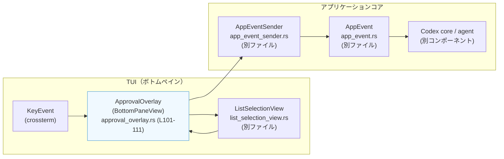
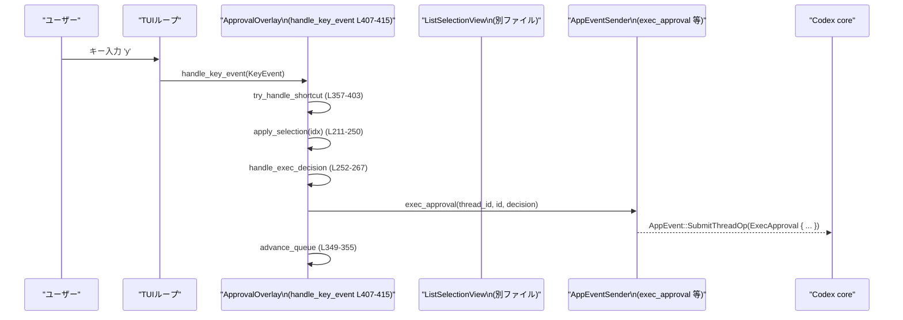

tui/src/bottom_pane/approval_overlay.rs

---

## 0. ざっくり一言

エージェントからの「実行・権限・ファイル変更・MCP 質問」などの承認リクエストを TUI 上に一覧表示し、ユーザーのキー入力に応じて承認・拒否・キャンセルを行い、結果を `AppEvent` 経由でアプリケーションに返すモーダルオーバーレイです。  
（根拠: approval_overlay.rs:L44-79, L101-111, L252-347）

---

## 1. このモジュールの役割

### 1.1 概要

このモジュールは「エージェントが行いたい操作に対するユーザー承認」を扱う UI コンポーネントを提供します。

- **解決する問題**:  
  コマンド実行・追加権限付与・パッチ適用・MCP 情報提供など、リスクを伴う操作をそのまま実行せず、ユーザーに分かりやすいプロンプトとショートカットキーで承認を取ること。  
  （ApprovalRequest 列挙体で対象操作を表現: L46-79）

- **提供する機能**:
  - 各種承認リクエストの表示内容（ヘッダー・選択肢・フッター）を構築し、`ListSelectionView` に委譲して描画する（L133-140, L142-209, L501-620）。
  - キー入力（ショートカットや Enter, Ctrl+C）に応じて承認/拒否/中断を決定し、`AppEventSender` 経由でバックエンドに通知する（L357-403, L406-467, L252-347）。
  - 複数リクエストの「キュー」（実装上はスタック）を内部で管理し、順次処理する（L101-111, L129-140, L349-355）。

### 1.2 アーキテクチャ内での位置づけ

このモジュールは「ボトムペイン TUI」の 1 ビューとして機能し、`BottomPaneView` トレイトを実装しています（L406-467）。  
ユーザー入力とバックエンドの間で承認フローを仲介する位置づけです。



- `ApprovalOverlay` は `KeyEvent` を受け取り (`handle_key_event`: L407-415)、  
  まず独自ショートカット処理 (`try_handle_shortcut`: L357-403)、  
  続いて `ListSelectionView` にイベントを委譲し（L411-413）、  
  選択されたインデックスから承認処理 `apply_selection` を呼び出します（L412-414, L211-250）。

- 承認結果は `AppEventSender` のメソッド (`exec_approval`, `patch_approval`, など) を通じて `AppEvent` としてバックエンドへ送信されます（L252-267, L314-324, L339-346）。

### 1.3 設計上のポイント

- **承認対象の抽象化**  
  - `ApprovalRequest` 列挙体で 4 種類の承認対象を統一的に表現しています（Exec / Permissions / ApplyPatch / McpElicitation）。  
    （L46-79）
  - 共通情報（スレッド ID・ラベル）はヘルパーメソッド `thread_id`, `thread_label` で抽象化（L81-98）。

- **状態管理**  
  - 現在のリクエスト (`current_request`) と未処理リクエストのキュー (`queue`) を持つ構造体 `ApprovalOverlay`（L101-111）。
  - `current_complete` と `done` フラグで「現リクエストが処理済みか」「全体が終了したか」を区別（L101-111）。

- **UI 構築の分離**  
  - ヘッダー行の構築 `build_header`（L501-620）と選択肢の構築 `build_options` / `exec_options` / `patch_options` / `permissions_options` / `elicitation_options` を分離し、  
    表示ロジックを整理（L142-209, L645-734, L779-845）。

- **エラーハンドリング／安全性**  
  - `Option` と `if let` / `match` を多用し、`unwrap` などによるパニックを避けています（例: `apply_selection`: L211-246, `handle_*` 系: L252-347）。
  - `AppEventSender` 経由のイベント送信は全て戻り値を受け取らず、この層ではエラーを扱いません（例: L265-266, L304-311, L339-346）。エラー処理は送信側の実装に委譲されています。

- **並行性**  
  - このファイル内のロジックは全て同期的で、`&mut self` or `&self` のメソッドのみです。  
  - テストでは `tokio::sync::mpsc::unbounded_channel` を用いて `AppEventSender` を構築しており（L848-860, L924-927 など）、実行時にはイベントが別タスク／スレッドへ非同期に送られる設計であることが示唆されますが、詳細は他ファイルに依存します。

---

## 2. 主要な機能一覧

- 承認対象の表現 (`ApprovalRequest`): コマンド実行、追加パーミッション、パッチ適用、MCP 質問を一つの enum で表現（L46-79）。
- 承認オーバーレイ UI (`ApprovalOverlay`):
  - 現在のリクエストとキューの管理（L101-111, L129-140, L349-355）。
  - キー入力処理とショートカットの解釈（L357-403, L406-415）。
  - `BottomPaneView` / `Renderable` としての描画インターフェイス実装（L406-467, L469-480）。
- 決定ロジック:
  - `apply_selection` による選択肢から各種 `handle_*_decision` への分配（L211-250）。
  - Exec / Permissions / Patch / MCP の各種決定処理 `handle_exec_decision`, `handle_permissions_decision`, `handle_patch_decision`, `handle_elicitation_decision`（L252-347）。
- 選択肢の生成:
  - `exec_options`: 利用可能な `ReviewDecision` とコンテキスト（ネットワーク・追加権限）から exec 用の選択肢とショートカットを生成（L645-734）。
  - `patch_options`, `permissions_options`, `elicitation_options`: 他種別の固定選択肢生成（L779-800, L802-823, L825-845）。
- 表示内容の構築:
  - `build_header`: スレッドラベル・理由・パーミッションルール・コマンド・Diff などを組み合わせたヘッダー描画（L501-620）。
  - `approval_footer_hint`: Enter/Esc/`o` ショートカットのフッターヒント（L483-499）。
- パーミッション表現ユーティリティ:
  - `format_additional_permissions_rule`: `PermissionProfile` から `"network; read \`...\`; write \`...\`"` のような説明文字列生成（L736-771）。
  - `format_requested_permissions_rule`: `RequestPermissionProfile` から上記へ変換（L773-777）。

---

## 3. 公開 API と詳細解説

### 3.1 型一覧（構造体・列挙体など）

| 名前 | 種別 | 可視性 | 役割 / 用途 | 定義位置 |
|------|------|--------|-------------|----------|
| `ApprovalRequest` | enum | `pub(crate)` | エージェントからの承認要求を表現する。Exec / Permissions / ApplyPatch / McpElicitation の 4 種別。 | approval_overlay.rs:L46-79 |
| `ApprovalOverlay` | struct | `pub(crate)` | `BottomPaneView` として承認モーダルを表示し、キー入力を処理して `AppEvent` を送る UI コンポーネント。 | approval_overlay.rs:L101-111 |
| `ApprovalDecision` | enum | private | 選択肢が表す内部決定種別（`ReviewDecision` または `ElicitationAction`） | approval_overlay.rs:L623-627 |
| `ApprovalOption` | struct | private | UI 上の一つの選択肢（ラベル、決定内容、表示ショートカット、追加ショートカット） | approval_overlay.rs:L629-635 |

補助的な型メソッド:

| 名前 | 種別 | 可視性 | 役割 / 用途 | 定義位置 |
|------|------|--------|-------------|----------|
| `ApprovalRequest::thread_id` | メソッド | private | どのバックスレッドに対する承認かを取得。全部のバリアント共通。 | approval_overlay.rs:L81-89 |
| `ApprovalRequest::thread_label` | メソッド | private | スレッドラベル（他スレッドの代理承認かどうかの判定に使用）を `Option<&str>` で取得。 | approval_overlay.rs:L91-98 |
| `ApprovalOption::shortcuts` | メソッド | private | display 用ショートカットと追加ショートカットを一つのイテレータにまとめる。 | approval_overlay.rs:L637-642 |

公開関数（モジュール外から利用可能）:

| 関数名 | 可視性 | 役割 / 用途 | 定義位置 |
|--------|--------|-------------|----------|
| `format_additional_permissions_rule` | `pub(crate)` | `PermissionProfile` から人間向けパーミッション説明文字列を生成する。 | approval_overlay.rs:L736-771 |
| `format_requested_permissions_rule` | `pub(crate)` | `RequestPermissionProfile` を `PermissionProfile` に変換してから上記フォーマッタを呼ぶ。 | approval_overlay.rs:L773-777 |

### 3.2 関数詳細（主要 7 件）

#### `ApprovalOverlay::new(request: ApprovalRequest, app_event_tx: AppEventSender, features: Features) -> Self`

**概要**

最初の承認リクエストを受け取って `ApprovalOverlay` を初期化し、内部のリストビューと選択肢を構築します。  
（根拠: approval_overlay.rs:L113-127）

**引数**

| 引数名 | 型 | 説明 |
|--------|----|------|
| `request` | `ApprovalRequest` | 最初に表示する承認リクエスト。 |
| `app_event_tx` | `AppEventSender` | 承認結果などのイベントを送信するための送信オブジェクト。クローンされて構造体に保持されます。 |
| `features` | `Features` | 機能フラグ群。現状このファイルでは `build_options` 内で未使用ですが構造体に保存されます（将来の条件付き UI 切り替えに利用される想定）。 |

**戻り値**

- `ApprovalOverlay` インスタンス。`current_request` に `request` が設定され、`list` や `options` も初期化済みです。

**内部処理の流れ**

1. フィールドをデフォルト値で初期化（`current_request: None`, `queue: Vec::new()`, 等）（L115-123）。
2. `AppEventSender` をクローンし、`list` は `ListSelectionView::new(Default::default(), app_event_tx)` で空のビューとして作成（L118-120）。
3. `set_current(request)` を呼んで、現在のリクエスト・選択肢・リストビューを実際の内容で設定（L125-126, L133-140）。
4. 初期化された `view` を返す。

**Examples（使用例）**

```rust
use tui::bottom_pane::approval_overlay::{ApprovalOverlay, ApprovalRequest};
use tui::app_event_sender::AppEventSender;
use codex_features::Features;
use codex_protocol::ThreadId;

// 実行リクエストを作成する
let request = ApprovalRequest::Exec {
    thread_id: ThreadId::new(),
    thread_label: None,
    id: "req-1".to_string(),
    command: vec!["echo".into(), "hello".into()],
    reason: Some("demo".into()),
    available_decisions: vec![
        codex_protocol::protocol::ReviewDecision::Approved,
        codex_protocol::protocol::ReviewDecision::Abort,
    ],
    network_approval_context: None,
    additional_permissions: None,
};

// AppEventSender は mpsc::UnboundedSender<AppEvent> などから構築される想定
let app_event_tx: AppEventSender = /* … */;

// 承認オーバーレイを生成
let overlay = ApprovalOverlay::new(request, app_event_tx, Features::with_defaults());
```

**Errors / Panics**

- この関数内では `unwrap` などは使用しておらず、通常パニックしません。  
  （構造体フィールド初期化とメソッド呼び出しのみ: L115-127）

**Edge cases（エッジケース）**

- `request` 自体が妥当でない場合（例: `available_decisions` が空など）の扱いは、この関数では検証していません。`build_options` 側で「空の選択肢リスト」が生成される可能性があります（L142-209）。

**使用上の注意点**

- `ApprovalOverlay` は `BottomPaneView` として使用される前提のため、生成後は TUI ループから `handle_key_event` / `on_ctrl_c` を呼び続ける必要があります。

---

#### `BottomPaneView for ApprovalOverlay::handle_key_event(&mut self, key_event: KeyEvent)`

**概要**

ボトムペインのキーイベントを受け取り、ショートカット処理かリスト選択処理（Enter など）を行い、必要に応じて承認を実行します。  
（根拠: approval_overlay.rs:L406-415）

**引数**

| 引数名 | 型 | 説明 |
|--------|----|------|
| `key_event` | `KeyEvent` | crossterm から渡されるキーイベント。キー種別と修飾キー情報を持ちます。 |

**戻り値**

- なし (`()`)

**内部処理の流れ**

1. `try_handle_shortcut(&key_event)` を呼び、ショートカット（Ctrl+A, `o`, 各種承認ショートカット）で処理できれば即 return（L407-410, L357-403）。
2. ショートカットでなかった場合、`self.list.handle_key_event(key_event)` にイベントを渡し、リストビュー側に処理させる（L411）。
3. リストビューから最後に選択されたインデックス (`take_last_selected_index`) を取得し、`Some(idx)` であれば `apply_selection(idx)` を呼ぶ（L412-414）。

**Examples（使用例）**

TUI ループからの呼び出し例:

```rust
fn handle_input(overlay: &mut ApprovalOverlay, key_event: crossterm::event::KeyEvent) {
    overlay.handle_key_event(key_event);
    if overlay.is_complete() {
        // 承認フローが終了したので、オーバーレイを閉じるなど
    }
}
```

**Errors / Panics**

- `try_handle_shortcut` / `apply_selection` 内部は `Option` を安全に取り扱うため、通常のキー入力でパニックは発生しません（L215-217, L252-277 など）。
- `ListSelectionView` の実装に依存するパニック可能性は、このファイルからは分かりません。

**Edge cases**

- 未知のキーや割り当てのないショートカットの場合は何も行われずに終了します（`try_handle_shortcut` が `false` を返し、`take_last_selected_index` が `None` のまま: L390-402, L412-414）。
- `Enter` 押下は `ListSelectionView` 側で選択インデックスを設定し、本メソッド内で `apply_selection` が呼ばれることがテストで確認されています（L1443-1453）。

**使用上の注意点**

- `handle_key_event` は **必ず同じスレッドから** 呼び出される前提（`&mut self`）です。マルチスレッドから同時に呼ぶ設計にはなっていません。
- Ctrl+C は `on_ctrl_c` が別途呼ばれる想定であり、ここでは扱っていません。

---

#### `ApprovalOverlay::apply_selection(&mut self, actual_idx: usize)`

**概要**

選択されたインデックスに対応する `ApprovalOption` を取得し、その決定内容に応じて適切なハンドラ（Exec / Permissions / Patch / MCP）を呼び出し、その後キューを進めます。  
（根拠: approval_overlay.rs:L211-250）

**引数**

| 引数名 | 型 | 説明 |
|--------|----|------|
| `actual_idx` | `usize` | `options` ベクタ内のインデックス。`ListSelectionView` から渡された値です。 |

**戻り値**

- なし (`()`)

**内部処理の流れ**

1. `current_complete` が真なら何もせず return（同じリクエストに対する二重処理を防止）（L212-214）。
2. `self.options.get(actual_idx)` で該当の `ApprovalOption` を取得。存在しない場合も何もしない（L215-217）。
3. 現在のリクエスト `current_request` を参照し、`match (request, &option.decision)` により組み合わせに応じたハンドラを呼び分ける（L218-244）:
   - Exec + ReviewDecision → `handle_exec_decision`（L220-222）。
   - Permissions + ReviewDecision → `handle_permissions_decision`（L224-231）。
   - ApplyPatch + ReviewDecision → `handle_patch_decision`（L231-233）。
   - McpElicitation + MCP 決定 → `handle_elicitation_decision`（L235-243）。
4. `current_complete = true` に設定し、`advance_queue()` により次のリクエストへ遷移、なければ `done = true` にする（L248-250, L349-355）。

**Errors / Panics**

- `get` と `Option` のパターンマッチのみを使っているため、インデックス範囲外でもパニックせず無視されます（L215-217）。
- 各 `handle_*_decision` 内でも `Option` チェックと早期 return を行っており、パニック要因はありません（L252-277, L314-337）。

**Edge cases**

- `options` が空の場合: `get` が `None` になり、何も行われません。
- `current_request` が `None` の場合: 何も行われません（L218-246）。通常は `set_current` で必ず設定されるため、正常な使用では起こらない前提です。

**使用上の注意点**

- 基本的にはユーザーコードから直接呼び出すことはなく、`handle_key_event` / `try_handle_shortcut` が内部的に利用します。
- リクエスト 1 件につき 1 度だけ有効な呼び出しになるよう `current_complete` によるガードが入っています。

---

#### `BottomPaneView for ApprovalOverlay::on_ctrl_c(&mut self) -> CancellationEvent`

**概要**

Ctrl+C によるキャンセル操作を処理します。現在のリクエストが未完了の場合は「中断（Abort/Cancel）」扱いの決定を送信し、キューをクリアしてオーバーレイを終了済み (`done = true`) 状態にします。  
（根拠: approval_overlay.rs:L417-454）

**戻り値**

- `CancellationEvent::Handled` を常に返します。
  - ただし、`done` がすでに `true` の場合は何も副作用を持たずに返ります（L418-420）。

**内部処理の流れ**

1. `self.done` が `true` であれば、何もせず `CancellationEvent::Handled` を返す（L418-420）。
2. `!self.current_complete` かつ `current_request` が `Some` の場合に限り、リクエスト種別に応じて「中断」ハンドラを呼び出す（L421-449）:
   - Exec → `handle_exec_decision(..., ReviewDecision::Abort)`（L425-427）。
   - Permissions → `handle_permissions_decision(..., ReviewDecision::Abort)`（L428-434）。
   - ApplyPatch → `handle_patch_decision(..., ReviewDecision::Abort)`（L435-437）。
   - MCP → `handle_elicitation_decision(..., ElicitationAction::Cancel)`（L438-447）。
3. `self.queue.clear()` で残りのリクエストを破棄し、`self.done = true` にする（L451-452）。
4. `CancellationEvent::Handled` を返す（L453）。

**Errors / Panics**

- 上記と同様に `Option` を使った安全なアクセスのみで、パニックは発生しません。

**Edge cases**

- すでに `current_complete = true` の状態で Ctrl+C が押された場合: 現リクエストに対して追加の中断通知は送られず、キューがクリアされて `done = true` になるだけです（L421-449）。
- 同じオーバーレイに対して複数回 Ctrl+C が押された場合: 2 回目以降は `done` が真なので何も起きません（L418-420）。

**使用上の注意点**

- Ctrl+C を別のレイヤー（アプリ全体の終了など）と共有する場合、`CancellationEvent` の戻り値を見て「既に承認オーバーレイで処理されたか」を判定する前提の設計です。

---

#### `exec_options(available_decisions: &[ReviewDecision], network_approval_context: Option<&NetworkApprovalContext>, additional_permissions: Option<&PermissionProfile>) -> Vec<ApprovalOption>`

**概要**

コマンド実行リクエストに対して、利用可能な `ReviewDecision` 列挙値とコンテキスト（ネットワーク承認か・追加権限承認か）から、ユーザーに提示する選択肢とショートカットを生成します。  
（根拠: approval_overlay.rs:L645-734）

**引数**

| 引数名 | 型 | 説明 |
|--------|----|------|
| `available_decisions` | `&[ReviewDecision]` | バックエンドが許可する決定種別の一覧。ここに含まれないものの選択肢は表示されません。 |
| `network_approval_context` | `Option<&NetworkApprovalContext>` | ネットワークアクセス承認かどうか、および対象ホストなどの情報。`Some` のときラベル文言がネットワーク向けに変わります。 |
| `additional_permissions` | `Option<&PermissionProfile>` | 追加権限（ファイルシステムやネットワーク）を伴う実行かどうか。`Some` のときセッション単位のラベルが変更されます。 |

**戻り値**

- `Vec<ApprovalOption>`: 各 `ReviewDecision` に対応するラベル・ショートカット付き選択肢のリスト。  
  `ReviewDecision::TimedOut` は常に非表示です（L725）。

**内部処理の流れ（主要分岐）**

1. `available_decisions.iter().filter_map(...)` で 1 つずつ決定種別に対応する `ApprovalOption` を生成し、`None` をフィルタリング（L650-652, L725）。
2. `ReviewDecision` ごとの動作:
   - `Approved`:
     - ラベル: `network_approval_context` が `Some` の場合 `"Yes, just this once"`、それ以外は `"Yes, proceed"`（L653-658）。
     - ショートカット: `'y'` キー（L661-662）。
   - `ApprovedExecpolicyAmendment`:
     - コマンドプレフィックスを `strip_bash_lc_and_escape` で整形し（L666-667）、改行を含む場合は UI に表示しない（`None` を返す）（L668-670）。
     - ラベル: ``Yes, and don't ask again for commands that start with `...` ``（L673-675）。
     - ショートカット: `'p'` キー（L682-683）。
   - `ApprovedForSession`:
     - ネットワーク文脈 → `"Yes, and allow this host for this conversation"`（L686-688）。  
       追加権限文脈 → `"Yes, and allow these permissions for this session"`（L688-690）。  
       それ以外 → `"Yes, and don't ask again for this command in this session"`（L690-692）。
     - ショートカット: `'a'` キー（L695-696）。
   - `NetworkPolicyAmendment`:
     - `NetworkPolicyRuleAction::Allow` → `"Yes, and allow this host in the future"` + `'p'` キー（L700-704）。  
       `Deny` → `"No, and block this host in the future"` + `'d'` キー（L705-708）。
   - `Denied`:
     - ラベル: `"No, continue without running it"`、ショートカット `'d'`（L719-724）。
   - `Abort`:
     - ラベル: `"No, and tell Codex what to do differently"`（L727-728）。
     - 表示ショートカット: `Esc`、追加ショートカット: `'n'`（L729-731）。
   - `TimedOut`: 常に `None` を返し、UI 上に選択肢を出さない（L725）。

**Examples（使用例）**

テストではさまざまな組み合わせが使用されています。

```rust
use codex_protocol::protocol::{ReviewDecision, NetworkApprovalContext, NetworkApprovalProtocol};

// ネットワーク承認ケースの例
let network_context = NetworkApprovalContext {
    host: "example.com".to_string(),
    protocol: NetworkApprovalProtocol::Https,
};

let options = exec_options(
    &[
        ReviewDecision::Approved,
        ReviewDecision::ApprovedForSession,
        ReviewDecision::Abort,
    ],
    Some(&network_context),
    None,
);

let labels: Vec<_> = options.into_iter().map(|opt| opt.label).collect();
// => ["Yes, just this once", "Yes, and allow this host for this conversation", "No, and tell Codex what to do differently"]
```

（根拠: テスト `network_exec_options_use_expected_labels_and_hide_execpolicy_amendment`: L1136-1167）

**Errors / Panics**

- `filter_map` と文字列操作のみで、パニックを起こす操作はありません。
- `strip_bash_lc_and_escape` や `command()` の挙動は他モジュールに依存しますが、ここでは戻り値を安全に扱っています。

**Edge cases**

- ExecPolicy 改訂案のコマンドに改行が含まれている場合、その選択肢は UI に出ません（L666-670）。  
  → 複数行や制御文字を含む危険なプレフィックスがそのまま表示されないようにする意図が読み取れます。
- `available_decisions` に特定の `ReviewDecision` が含まれない限り、その選択肢は一切表示されません。ネットワーク承認 UI で ExecPolicy 系オプションを隠したい場合は、そもそも `ApprovedExecpolicyAmendment` を配列に含めない設計になっています（テスト参照: L1136-1167, L1193-1215）。

**使用上の注意点**

- `exec_options` は純粋関数であり、副作用はありません。  
- 呼び出し側は「何を `available_decisions` に含めるか」によってユーザーに提示される選択肢を制御します。  
  特にネットワーク許可ダイアログで意図しないオプションが出ないように、決定種別の選定に注意が必要です。

---

#### `format_additional_permissions_rule(additional_permissions: &PermissionProfile) -> Option<String>`

**概要**

追加の `PermissionProfile` から、人間向けの簡潔な説明文字列（例: `"network; read`/tmp/readme.txt`; write`/tmp/out.txt`"`）を生成します。パーミッションが空なら `None` を返します。  
（根拠: approval_overlay.rs:L736-771）

**引数**

| 引数名 | 型 | 説明 |
|--------|----|------|
| `additional_permissions` | `&PermissionProfile` | エージェントが要求している追加パーミッション。ネットワークとファイルシステムアクセスを含みます。 |

**戻り値**

- `Option<String>`:
  - 権限が一つも有効でない場合 → `None`（L766-768）。
  - 何らかの権限がある場合 → `Some("...")` の説明文（L769-770）。

**内部処理の流れ**

1. `parts: Vec<String>` を用意し、ネットワーク・ファイルシステム権限ごとに文字列を追加（L739-765）。
2. ネットワーク権限:
   - `additional_permissions.network.as_ref().and_then(|n| n.enabled).unwrap_or(false)` が `true` の場合、`"network"` を追加（L740-747）。
3. ファイルシステム権限:
   - `read` 一覧があれば ``"`パス`"`` をカンマ区切りに並べた `"read ..."` を追加（L748-755）。
   - `write` 一覧があれば `"write ..."` を同様に追加（L757-764）。
4. `parts` が空なら `None`、そうでなければ `"; "` 区切りで join して `Some` を返す（L766-770）。

**Examples（使用例）**

```rust
use codex_protocol::models::{PermissionProfile, FileSystemPermissions, NetworkPermissions};
use codex_utils_absolute_path::AbsolutePathBuf;

let profile = PermissionProfile {
    network: Some(NetworkPermissions { enabled: Some(true) }),
    file_system: Some(FileSystemPermissions {
        read: Some(vec![AbsolutePathBuf::from_absolute_path("/tmp/readme.txt").unwrap()]),
        write: Some(vec![AbsolutePathBuf::from_absolute_path("/tmp/out.txt").unwrap()]),
    }),
    ..Default::default()
};

let rule = format_additional_permissions_rule(&profile);
assert_eq!(
    rule.as_deref(),
    Some("network; read `/tmp/readme.txt`; write `/tmp/out.txt`")
);
```

（ほぼ同様のケースがテスト `additional_permissions_prompt_shows_permission_rule_line` で使用されています: L1261-1308）

**Errors / Panics**

- `unwrap_or(false)` を使っている箇所は `Option<bool>` のデフォルト値を `false` にするためであり、パニックはしません（L744-745）。
- パス文字列の生成では `display()` を使用し、`to_string` のみなのでパニックはありません。

**Edge cases**

- 全ての権限が `None` または `false` の場合: `None` が返るので、呼び出し側では「Permission rule: ...」行を出さないようになっています（`build_header` 内の `if let Some(rule_line)` 分岐: L523-530, L560-565）。
- 読み／書きパスが空配列の場合: `read` / `write` の `Some(Vec::new())` という状態はコード上で特別扱いされておらず、そのまま `"read "` / `"write "` のような文字列になる可能性があります。この値が実際に生成されるかは上位層の入力に依存します。

**使用上の注意点**

- 出力文字列は UI 表示前提であり、機械可読な形式ではありません（パース用途には向きません）。
- `permissions.clone().into()` を使う `format_requested_permissions_rule` 経由で `RequestPermissionProfile` からも利用されます（L773-777）。

---

#### `build_header(request: &ApprovalRequest) -> Box<dyn Renderable>`

**概要**

承認ダイアログのヘッダー部分（スレッドラベル、理由、パーミッションルール、コマンド、Diff など）の `Renderable` を構築します。リクエスト種別ごとに異なる内容を整形し、`Paragraph` や `ColumnRenderable` で描画可能な形に変換します。  
（根拠: approval_overlay.rs:L501-620）

**引数**

| 引数名 | 型 | 説明 |
|--------|----|------|
| `request` | `&ApprovalRequest` | 現在表示すべき承認リクエスト。 |

**戻り値**

- `Box<dyn Renderable>`:
  - Exec / Permissions / MCP では `Paragraph` を、ApplyPatch では `ColumnRenderable` を含むレイアウト構成を返します。

**内部処理の流れ（主要分岐）**

1. `match request` でバリアントごとに処理を分岐（L502-620）。

**Exec の場合（L503-541）**

- `Vec<Line<'static>>` に行を積み上げる。
- スレッドラベルがあれば `"Thread: {label}"` を太字で追加（L511-517）。
- 理由があれば `"Reason: {reason}"` を italic で追加（L519-521）。
- 追加パーミッションがあり、`format_additional_permissions_rule` が `Some` を返す場合 `"Permission rule: {rule}"` 行をシアンで追加（L523-531）。
- コマンドを `strip_bash_lc_and_escape` で整形し、`highlight_bash_to_lines` でシンタックスハイライト済み行に変換し、先頭行の頭に `"$ "` を挿入（L532-535）。
- `network_approval_context` が `None` のときのみコマンド行を実際にヘッダーに追加（L537-539）。
- 以上の行から `Paragraph::new(header).wrap(Wrap { trim: false })` を作成し、`Box<dyn Renderable>` にして返す（L540-541）。

Exec についてはテストで以下が検証されています:

- コマンドスニペットが含まれる (`header_includes_command_snippet`: L1098-1133)。
- ネットワーク承認の場合はタイトルにホスト名が入り、コマンド行が表示されない (`network_exec_prompt_title_includes_host`: L1352-1409)。

**Permissions の場合（L542-567）**

- Exec と同様にスレッドラベルと理由を追加（L548-558）。
- `format_requested_permissions_rule` が `Some` を返す場合 `"Permission rule: {rule}"` 行を追記（L560-565）。
- `Paragraph` として返す（L566）。

**ApplyPatch の場合（L568-597）**

- `Vec<Box<dyn Renderable>>` を用意し、必要に応じて以下を追加:
  - スレッドラベル行（`Line`）と空行（L575-582）。
  - 理由が `Some` かつ空でない場合、`Paragraph` で `"Reason: {reason}"` 行を追加（L583-593）。
  - 最後に `DiffSummary::new(changes.clone(), cwd.clone()).into()` で変更内容のサマリー表示を追加（L595）。
- `ColumnRenderable::with(header)` で縦に並べた表示として返す（L596-597）。

**McpElicitation の場合（L598-619）**

- `Vec<Line<'static>>` に:
  - 任意のスレッドラベル行（L605-610）。
  - `"Server: {server_name}"` 行（L612-613）。
  - 空行とユーザへのメッセージ行（L614-616）。
- これを `Paragraph` にラップして返す（L617-618）。

**Errors / Panics**

- いずれの分岐でも `Option` を `if let Some` で扱っているだけで、パニック要因はありません。
- `DiffSummary::new` など外部コンポーネントの挙動はこのファイルからは分かりませんが、ここでは `clone()` した値を渡しているだけです（L595）。

**Edge cases**

- Exec のネットワーク承認 (`network_approval_context.is_some()`) の場合、コマンド行は表示されません（L537-539）。テストでこれが保証されています（L1352-1409）。
- ApplyPatch で理由が空文字列の場合は、理由行を表示しません（L583-585）。

**使用上の注意点**

- `build_options` の中から呼ばれる前提であり、単体で使うことは通常ありません（L133-140, L142-209）。
- 新しい `ApprovalRequest` バリアントを追加する場合は、この関数への分岐追加が必須です。

---

#### `ApprovalOverlay::try_handle_shortcut(&mut self, key_event: &KeyEvent) -> bool`

**概要**

ショートカットキー（Ctrl+A, `o`, その他各選択肢に紐づいたショートカット）による操作を処理し、何らかの処理を行ったかどうかを返します。  
（根拠: approval_overlay.rs:L357-403）

**引数**

| 引数名 | 型 | 説明 |
|--------|----|------|
| `key_event` | `&KeyEvent` | 判定対象のキーイベント。 |

**戻り値**

- `bool`:  
  - `true` … 何らかのショートカットとして解釈し処理した。  
  - `false` … 該当ショートカットがなかった。

**内部処理の流れ**

1. Ctrl+A（Press, `'a'`, `KeyModifiers::CONTROL`）:
   - `current_request` が `Some` なら `AppEvent::FullScreenApprovalRequest(request.clone())` を送信し、`true` を返す（L359-368）。
   - そうでなければ `false`（L369-371）。
2. `o` キー（Press, `'o'`）:
   - `current_request` があり、`thread_label` が `Some` の場合のみ `AppEvent::SelectAgentThread(request.thread_id())` を送信し `true`（L378-382）。
   - そうでなければ `false`（L383-388）。
3. それ以外のキー:
   - `self.options.iter().position(|opt| opt.shortcuts().any(|s| s.is_press(*e)))` で、どの `ApprovalOption` に紐づいたショートカットかを探索（L391-395）。
   - 見つかった場合 `apply_selection(idx)` を呼び、`true` を返す（L396-399）。
   - 見つからなければ `false`（L399-400）。

**Examples（使用例）**

- テスト `shortcut_triggers_selection` では、`'y'` キーが exec の `"Yes, proceed"` に紐づいていることが検証されています（L935-951）。
- テスト `o_opens_source_thread_for_cross_thread_approval` では、`'o'` キーで `AppEvent::SelectAgentThread` が送信されることが確認されています（L953-980）。

**Errors / Panics**

- `position` + `Option` の処理のみで、パニックは起こりません。
- `request.clone()` を行う部分も `Clone` 実装に依存するだけです（`ApprovalRequest: Clone` は L45 で定義済み）。

**Edge cases**

- リクエストに `thread_label` がない場合、`'o'` キーは何もしません（L378-385）。
- 同じキーが複数の `ApprovalOption` に紐づいている場合（例: `'a'` は exec のセッション承認と、Ctrl+A とは別物として存在）、ここでは `KeyModifiers` の違いで区別されます（`Ctrl+A` と単独 `a` は別分岐: L359-364 vs L685-696）。

**使用上の注意点**

- `handle_key_event` からのみ呼ばれる内部メソッドであり、UI レイヤーで独自に呼び出す必要はありません。
- ショートカットのバインドは `ApprovalOption` 側の `KeyBinding` 設定に依存するため、新しいオプションを追加する場合は衝突に注意が必要です。

---

### 3.3 その他の関数

補助的な関数の概要です。

| 関数名 | 役割（1 行） | 定義位置 |
|--------|--------------|----------|
| `ApprovalOverlay::enqueue_request` | 追加の `ApprovalRequest` をキューに積む（実装は `Vec::push`）。 | L129-131 |
| `ApprovalOverlay::set_current` | 現在のリクエスト・選択肢・`ListSelectionView` を更新する内部メソッド。 | L133-140 |
| `ApprovalOverlay::handle_exec_decision` | Exec 承認の履歴セル追加と `exec_approval` イベント送信を行う。 | L252-267 |
| `ApprovalOverlay::handle_permissions_decision` | 付与されたパーミッションとスコープを計算し、履歴セルと `request_permissions_response` を送る。 | L269-312 |
| `ApprovalOverlay::handle_patch_decision` | パッチ承認の `patch_approval` イベントを送信する。 | L314-324 |
| `ApprovalOverlay::handle_elicitation_decision` | MCP Elicitation の回答 (`ElicitationAction`) を `resolve_elicitation` で送信する。 | L326-347 |
| `ApprovalOverlay::advance_queue` | キューから次のリクエストを `pop` して現在に設定し、なければ `done = true` にする。 | L349-355 |
| `ApprovalOverlay::is_complete` | `done` フラグを返す。 | L456-458 |
| `ApprovalOverlay::try_consume_approval_request` | 新しい `ApprovalRequest` を内部キューに登録し、常に `None` を返す。 | L460-466 |
| `Renderable for ApprovalOverlay::desired_height` | 内部 `ListSelectionView` の必要高さを返す。 | L469-472 |
| `Renderable for ApprovalOverlay::render` | 内部 `ListSelectionView` に描画を委譲する。 | L474-476 |
| `Renderable for ApprovalOverlay::cursor_pos` | 内部 `ListSelectionView` のカーソル位置を返す。 | L478-480 |
| `approval_footer_hint` | 承認フッターヒント（Enter/Esc/`o`）の `Line` を構築する。 | L483-499 |
| `format_requested_permissions_rule` | `RequestPermissionProfile` を `PermissionProfile` に変換して `format_additional_permissions_rule` を呼ぶ。 | L773-777 |
| `patch_options` | パッチ適用時の選択肢（Yes, session, No）を返す。 | L779-800 |
| `permissions_options` | パーミッション承認ダイアログの選択肢を返す。 | L802-823 |
| `elicitation_options` | MCP Elicitation ダイアログの選択肢を返す。 | L825-845 |

---

## 4. データフロー

ここでは「Exec コマンド承認」の典型的なフローを示します。

1. バックエンドから `ApprovalRequest::Exec` が渡され、`ApprovalOverlay::new` または `try_consume_approval_request` によりオーバーレイに登録される（L113-127, L460-466）。
2. TUI ループがキー入力を取得し、`handle_key_event` に渡す（L406-415）。
3. ユーザーが `'y'` を押すと `try_handle_shortcut` が実行され、対応する `ApprovalOption` が見つかり `apply_selection` が呼ばれる（L357-403, L391-399, L211-250）。
4. `apply_selection` は `handle_exec_decision` を呼び、履歴セルを追加（必要なら）しつつ `AppEventSender::exec_approval` を送信する（L252-267）。
5. `advance_queue` が呼ばれ、次のリクエストがあれば現在に設定し、なければ `done = true` となる（L248-250, L349-355）。

Mermaid のシーケンス図（主要メソッドと行番号付き）:



- `ListSelectionView` を経由するパス（Enter キーなど）の場合、`try_handle_shortcut` が `false` を返した後に `LSV.handle_key_event` → `AO.apply_selection` の経路になります（L411-414）。

---

## 5. 使い方（How to Use）

### 5.1 基本的な使用方法

典型的な使用パターンは:

- 最初の `ApprovalRequest` と `AppEventSender` を使って `ApprovalOverlay` を生成。
- TUI のイベントループから `handle_key_event` と `on_ctrl_c` を呼び出し続ける。
- `is_complete` が `true` になったらオーバーレイを閉じる。

```rust
use tui::bottom_pane::approval_overlay::{ApprovalOverlay, ApprovalRequest};
use tui::bottom_pane::BottomPaneView;
use tui::app_event_sender::AppEventSender;
use codex_features::Features;
use codex_protocol::{ThreadId};
use codex_protocol::protocol::ReviewDecision;
use crossterm::event::{read, Event, KeyEvent};

fn make_exec_request() -> ApprovalRequest {
    ApprovalRequest::Exec {
        thread_id: ThreadId::new(),
        thread_label: None,
        id: "req-1".to_string(),
        command: vec!["echo".into(), "hello".into()],
        reason: Some("demo".into()),
        available_decisions: vec![ReviewDecision::Approved, ReviewDecision::Abort],
        network_approval_context: None,
        additional_permissions: None,
    }
}

fn approvals_loop(app_event_tx: AppEventSender) {
    let mut overlay = ApprovalOverlay::new(
        make_exec_request(),
        app_event_tx,
        Features::with_defaults(),
    );

    while !overlay.is_complete() {
        if let Event::Key(key_event) = read().unwrap() {
            overlay.handle_key_event(key_event);
        }
        // Ctrl+C はアプリ側で捕捉して overlay.on_ctrl_c() を呼ぶ設計もありうる
    }

    // ここまで来た時点で全ての承認リクエストが処理済み
}
```

### 5.2 よくある使用パターン

1. **複数リクエストをまとめて処理する**

   - 追加の `ApprovalRequest` は `try_consume_approval_request` から渡すと、内部キューに積まれます（L460-466）。

   ```rust
   fn submit_additional_request(overlay: &mut ApprovalOverlay, req: ApprovalRequest) {
       // 返り値は常に None だが、インターフェイス的に「消費するかどうか」を表現している
       let _ = overlay.try_consume_approval_request(req);
   }
   ```

   - 注意: キューは `Vec` に対する `push` と `pop` で処理されるため、**後から追加されたリクエストが先に処理される（LIFO）** 挙動になっています（L129-131, L349-351）。

2. **クロススレッド承認から元スレッドを開く**

   - `ApprovalRequest::Exec` などに `thread_label: Some("...".to_string())` を付与すると、フッターに `o` ショートカットが表示され（L491-497）、`'o'` キーで `AppEvent::SelectAgentThread` が送信されます（L378-382, テスト L953-980）。

3. **Ctrl+A でフルスクリーン承認ビューに切り替える**

   - Ctrl+A（`KeyModifiers::CONTROL` + `'a'`）で `AppEvent::FullScreenApprovalRequest(request.clone())` が送信されます（L359-368）。  
   - これを受け取る側でフルスクリーン UI に切り替える設計が想定されています。

### 5.3 よくある間違い

```rust
// 間違い例: ApprovalRequest を生成しただけでオーバーレイを作らない
let req = make_exec_request();
// これでは TUI に何も表示されない

// 正しい例: ApprovalOverlay を生成し、TUI ループで handle_key_event を呼び続ける
let mut overlay = ApprovalOverlay::new(req, app_event_tx, Features::with_defaults());
loop {
    if overlay.is_complete() { break; }
    if let Event::Key(key) = read().unwrap() {
        overlay.handle_key_event(key);
    }
}
```

```rust
// 間違い例: キューに積んだリクエストが FIFO だと思い込む
overlay.enqueue_request(req1);
overlay.enqueue_request(req2);
// req1 -> req2 の順に処理されると思っている

// 実際: advance_queue は Vec::pop を使うため LIFO
// 先に req2, 次に req1 が処理される (approval_overlay.rs:L349-351)
```

### 5.4 使用上の注意点（まとめ + Bugs/Security/Contracts/Tests/性能）

#### 安全性・エラー・並行性

- **メモリ安全性 (Rust 特有)**:
  - 全て安全な Rust コードのみで、`unsafe` は用いられていません。
  - `ApprovalRequest` は全て所有データ（`String`, `PathBuf`, `HashMap`）を含んでおり、ライフタイムの管理はコンパイラにより保証されます（L46-79）。
  - `Option` や `match` による分岐で `None` / 不在ケースを明示的に扱っています。

- **エラーハンドリング**:
  - このモジュール自身は `Result` を返さず、失敗可能な操作（イベント送信など）のエラーは `AppEventSender` の実装に委譲しています（例: L265-266, L304-311, L339-346）。
  - UI ロジックとしては「入力が無効なら何もしない」方針（たとえば不正なインデックスは `get` で無視）になっています（L215-217）。

- **並行性**:
  - `&mut self` を前提としており、`ApprovalOverlay` へのアクセスは単一スレッドであるべきです。
  - テストでは `tokio::sync::mpsc::unbounded_channel` を使用しており、イベントは非同期チャネルでバックエンドに渡ります（L848-860, L924-927 など）。  
    このファイル内にはロックなどの並行制御はなく、「UI スレッドからイベントを投げるだけ」の役割に限定されています。

#### Bugs / Security 上の観点

- **スタック型キュー**:
  - `queue` は `Vec` で実装され、`enqueue_request` で `push`、`advance_queue` では `pop` を使用しているため、**後入れ先出し** で処理されます（L129-131, L349-351）。  
  - 名前として「queue」ですが実体はスタックであり、意図が FIFO か LIFO かはこのファイルだけでは断定できません。

- **ショートカットの安全性**:
  - `exec_options` における ExecPolicy 改訂案オプションは、コマンドプレフィックスに改行が含まれる場合は UI に表示されないようにしています（L666-670）。  
    これは、複数行の危険な表示を避けるための安全対策と解釈できます。
  - ネットワーク承認において「deny forever」ショートカットが意図せず有効にならないことをテストで確認しています（`network_deny_forever_shortcut_is_not_bound`: L1059-1096）。

- **情報漏洩リスク**:
  - コマンドラインやファイルパスなどが TUI 上にそのまま表示されます（L532-539, L748-764）。  
    これ自体は設計ですが、第三者に見える環境での使用時には注意が必要です。

#### コントラクト / エッジケース

- **ApprovalRequest 契約**:
  - `available_decisions` に含める `ReviewDecision` の種類によって、ユーザーに提示される選択肢が変わります。  
    例: ネットワーク承認時に ExecPolicy 改訂案を表示したくない場合は `ApprovedExecpolicyAmendment` を含めない必要があります（テスト L1136-1167）。
  - Permissions の `ReviewDecision::ApprovedForSession` は `PermissionGrantScope::Session` に対応し、それ以外は `Turn` スコープになります（L286-290）。

- **Ctrl+C の意味**:
  - `on_ctrl_c` は「現在の承認リクエストを中断し、残りも破棄してこのオーバーレイを終了する」契約になっています（L417-454, テスト L924-933）。

- **Edge Cases まとめ**:
  - `ApprovalRequest` が `McpElicitation` の場合、`ApprovalDecision::Review` と組み合わさっても `apply_selection` では何も起こりません（`match` の `_ => {}` 分岐: L244-245）。
  - Exec のネットワーク承認ではコマンド行が表示されないため、ユーザーは「ホスト名」だけを見て判断することになります（L537-539, テスト L1352-1409）。

#### テスト概要

テストモジュール（L848-1467）では主に以下が検証されています。

- Ctrl+C の挙動（キュークリアと完了フラグ）: `ctrl_c_aborts_and_clears_queue`（L924-933）。
- ショートカットキーでの承認・イベント発行: `shortcut_triggers_selection`（L935-951）。
- クロススレッド承認での `'o'` ショートカット: `o_opens_source_thread_for_cross_thread_approval`（L953-980）。
- ラベルやオプション表示のスナップショットテスト（`insta` 利用）: 複数テスト（L982-1005, L1311-1350 など）。
- ExecPolicy 改訂案オプションとネットワーク承認オプションの組み合わせ: `exec_prefix_option_emits_execpolicy_amendment`, `network_exec_options_use_expected_labels_and_hide_execpolicy_amendment`（L1007-1057, L1136-1167）。
- 追加パーミッションの表示（Permission rule 行）とスコープ設定: `additional_permissions_prompt_shows_permission_rule_line`, `permissions_session_shortcut_submits_session_scope`（L1234-1258, L1261-1309）。
- Enter キーでの選択処理: `enter_sets_last_selected_index_without_dismissing`（L1443-1467）。

#### 性能・スケーラビリティ

- ヘッダーや選択肢は都度 `Vec` や文字列を組み立てる実装ですが、承認ダイアログという性質上、パフォーマンス上の問題になるケースは限定的です。
- `queue` は `Vec<ApprovalRequest>` として保持されるため、非常に多くのリクエストをキューに積むとメモリ消費が増大しますが、通常は人間が処理できる程度の件数が想定されます。

---

## 6. 変更の仕方（How to Modify）

### 6.1 新しい機能を追加する場合（例: 新種別の承認リクエスト）

たとえば「データベース操作の承認」など新たな承認種別を追加したい場合の大まかなステップです。

1. **`ApprovalRequest` にバリアントを追加**

   ```rust
   pub(crate) enum ApprovalRequest {
       // 既存バリアント...
       DatabaseOp {
           thread_id: ThreadId,
           thread_label: Option<String>,
           reason: Option<String>,
           // 追加情報...
       },
   }
   ```

   - 併せて `thread_id` / `thread_label` メソッドにパターンを追加する必要があります（L81-98）。

2. **ヘッダー表示を追加**

   - `build_header` の `match request` に新バリアント分岐を追加し、ヘッダー用の `Renderable` を構築します（L501-620）。

3. **選択肢生成ロジックを追加**

   - `build_options` の `match request` に新バリアント用の `(options, title)` を追加します（L147-181）。
   - 必要に応じて `db_options()` のような専用ヘルパー関数を定義すると整理されます。

4. **選択処理 (`apply_selection`) の拡張**

   - `apply_selection` の `match (request, &option.decision)` に新バリアント + 新しい `ApprovalDecision` バリアントを追加し、専用の `handle_*_decision` を呼び出します（L219-244, L623-627）。

5. **Ctrl+C 時の挙動を定義**

   - `on_ctrl_c` の `match request` に新バリアントを追加し、「中断」がどのアクションに対応するかを明確にします（L424-449）。

6. **テスト追加**

   - 新バリアント用のスナップショットテストやショートカット動作テストを、既存テストを参考に追加します（L848-1467）。

### 6.2 既存の機能を変更する場合

変更時に注意すべきポイントです。

- **選択肢テキストやショートカットを変える場合**:
  - 主に `exec_options`, `patch_options`, `permissions_options`, `elicitation_options` を修正します（L645-734, L779-845）。
  - テストではラベルの配列を `assert_eq!` している箇所があるため（L1136-1167, L1170-1190, L1218-1231）、テストの更新も必要になります。

- **承認スコープや意味論を変える場合**:
  - Permissions の `scope` 設定は `handle_permissions_decision` 内で決めているため（L286-290）、ここを変更することで `Turn` / `Session` の意味付けを変えることができます。
  - その場合、`permissions_session_shortcut_submits_session_scope` などのテストと、バックエンド側の `RequestPermissionsResponse` の解釈も合わせて確認する必要があります（L1234-1258, L304-311）。

- **イベント送信部分 (`AppEventSender` 呼び出し) を変更する場合**:
  - `handle_exec_decision` / `handle_permissions_decision` / `handle_patch_decision` / `handle_elicitation_decision` がそれぞれどの `AppEvent` を送っているかを確認し（L252-267, L304-311, L322-324, L339-346）、契約を崩さないように注意します。
  - テスト内では `AppEvent::SubmitThreadOp` など具体的な形でイベントを検査しているため（例: L935-951, L1007-1057）、影響範囲が広くなります。

---

## 7. 関連ファイル

| パス | 役割 / 関係 |
|------|------------|
| `tui/src/bottom_pane/list_selection_view.rs` | `ListSelectionView`, `SelectionItem`, `SelectionViewParams` を提供し、リスト形式の選択 UI を描画・管理します。ApprovalOverlay のメイン UI コンポーネントです（L8-10, L106-107, L139-140, L411-414, L469-480）。 |
| `tui/src/app_event.rs` | `AppEvent` 列挙体を定義し、`InsertHistoryCell`, `FullScreenApprovalRequest`, `SelectAgentThread`, 各種スレッド操作などが含まれています（L4, L262-263, L367-368, L381-382）。 |
| `tui/src/app_event_sender.rs` | `AppEventSender` の実装。`exec_approval`, `patch_approval`, `request_permissions_response`, `resolve_elicitation` などのメソッドを通じて `AppEvent` を非同期チャネルへ送信します（L5, L265-266, L304-311, L322-323, L339-346）。 |
| `tui/src/diff_render.rs` | `DiffSummary` 型を定義し、ApplyPatch リクエストの変更内容をヘッダー内で視覚的に要約するために使用されます（L11, L595）。 |
| `tui/src/exec_command.rs` | `strip_bash_lc_and_escape` 関数を提供し、シェルラッパ（`bash -lc` など）を取り除いた安全なコマンド表示用文字列を生成します（L12, L532, L666-667）。 |
| `tui/src/history_cell.rs` | `new_approval_decision_cell` や `PlainHistoryCell` を通じて承認結果をチャット履歴などに表示するセルを構築します（L13, L257-262, L299-301, テスト L1412-1441）。 |
| `tui/src/key_hint.rs` | `KeyBinding` 型と `plain` 関数を提供し、キーハンドルやフッターヒントに使用されます（L14-15, L484-496, L661-662, L729-731 など）。 |
| `tui/src/render/highlight.rs` | `highlight_bash_to_lines` により、Exec コマンド行にシンタックスハイライトを適用します（L16, L533-539）。 |
| `tui/src/render/renderable.rs` | `Renderable` トレイトと `ColumnRenderable` 型を提供し、TUI コンポーネントの描画インターフェイスを定義します（L17-18, L183-187, L575-597）。 |
| `codex_protocol` クレート | `ThreadId`, `ReviewDecision`, `PermissionProfile`, `RequestPermissionProfile`, `FileChange`, `NetworkApprovalContext`, `ElicitationAction`, `NetworkPolicyRuleAction` など、バックエンドとのプロトコル定義を提供します（L19-31, L23-26, L29-31）。 |

このモジュールは、これらのコンポーネントを組み合わせて「承認ダイアログ」という UI レベルの責務をまとめており、バックエンドとの境界部分（`AppEvent`）と TUI 描画コンポーネント（`ListSelectionView`, `Renderable`）の橋渡しを行っています。
