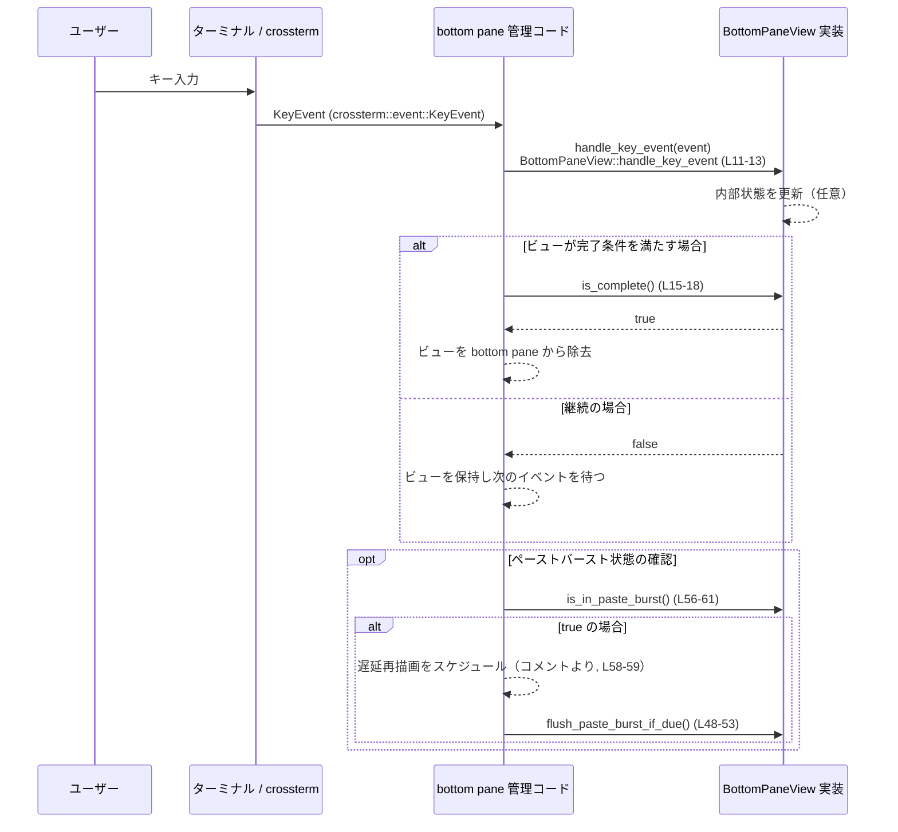
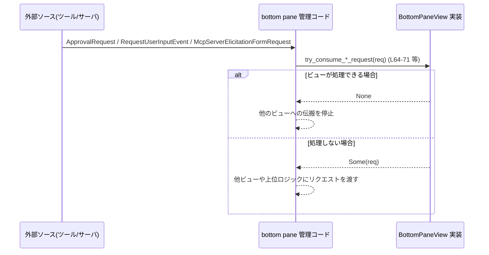

tui/src/bottom_pane/bottom_pane_view.rs

---

## 0. ざっくり一言

bottom pane に表示される各種ビューの共通インターフェース（トrait）を定義し、キー入力・キャンセル・ペースト・外部リクエストの取り扱い方法を規定するモジュールです（bottom_pane_view.rs:L9-10, L64-88）。

---

## 1. このモジュールの役割

### 1.1 概要

- このモジュールは「bottom pane に表示可能なビューの共通契約」を定義するために存在し、`BottomPaneView` トレイトを通じて以下の機能を提供します（bottom_pane_view.rs:L9-10）。
  - キー入力（`KeyEvent`）の処理（L11-13）
  - ビューの完了状態の判定（L15-18）
  - 安定識別子と選択インデックスの提供（L20-23, L25-29）
  - Ctrl-C / Esc のキャンセル処理（L31-34, L36-40）
  - ペーストおよび「ペーストバースト」状態の管理（L42-45, L48-53, L56-61）
  - Approval / user input / MCP server elicitation といった外部リクエストの「消費」可否の判定（L64-71, L73-80, L82-88）

### 1.2 アーキテクチャ内での位置づけ

依存関係は次のとおりです。

- `BottomPaneView` は `Renderable` トレイトを継承しています（super-trait）（bottom_pane_view.rs:L3, L10）。
- bottom pane 関連の型 `ApprovalRequest` と `McpServerElicitationFormRequest` を利用します（L1-2）。
- プロトコル層からの `RequestUserInputEvent` を扱います（L4）。
- キーボード入力は `crossterm::event::KeyEvent` に依存します（L5）。
- キャンセル処理の結果は親モジュール側の `CancellationEvent` を返します（L7, L31-34）。

これを簡略な依存関係図で表します。

```mermaid
graph TD
    subgraph tui::bottom_pane (bottom_pane_view.rs L1-90)
        BPV["BottomPaneView トレイト"]
    end

    BPV --> R["Renderable トレイト\n(crate::render::renderable) (L3,10)"]
    BPV --> AR["ApprovalRequest\n(crate::bottom_pane) (L1)"]
    BPV --> MCP["McpServerElicitationFormRequest\n(crate::bottom_pane) (L2)"]
    BPV --> RUI["RequestUserInputEvent\n(codex_protocol::request_user_input) (L4)"]
    BPV --> KE["KeyEvent\n(crossterm::event) (L5,13)"]
    BPV --> CE["CancellationEvent\n(super) (L7,31-34)"]
```

※ `Renderable`, `ApprovalRequest` などの具体的な中身はこのチャンクには現れません。

### 1.3 設計上のポイント

コードから読み取れる特徴は次のとおりです。

- **デフォルト実装中心**  
  - すべてのメソッドがトレイト側にデフォルト実装を持ち、何もしない・`false` を返す・元のリクエストを返す、という保守的な挙動になっています（L13, L16-18, L21-23, L27-29, L32-34, L38-40, L44-45, L52-53, L60-62, L69-71, L78-80, L87-89）。
- **状態は実装側が保持**  
  - トレイト自体はフィールドを持たず、すべて `&self` / `&mut self` 経由で実装側の状態にアクセスする前提です（全メソッドのシグネチャ）。
- **エラーを返さない API**  
  - すべてのメソッドは `Result` を返さず、panic も使っていません。完了フラグや `CancellationEvent` や `Option<…>` で制御します（L16-18, L31-34, L66-71 など）。
- **シングルスレッド前提の API 形状**  
  - すべての変更系メソッドは `&mut self` を要求し、内部ミューテックス等はありません（L13, L32, L44, L52, L67, L76, L85）。これは「1つのビューインスタンスは1つのスレッド（またはイベントループ）から排他的に操作される」形を前提としている設計と解釈できます。
- **イベント駆動のインターフェース**  
  - キーイベント、ペースト、キャンセル、外部リクエストといった「イベント」を個別メソッドで受け取り、ビューの内部状態や画面更新に反映するためのフックになっています（コメントおよびシグネチャ全体）。

---

## 2. 主要な機能一覧

`BottomPaneView` トレイトが提供する主要機能は次のとおりです。

- キー入力処理: `handle_key_event` で bottom pane アクティブ時のキーを処理（L11-13）
- 完了状態判定: `is_complete` でビューが閉じてよいかどうかを返す（L15-18）
- 安定識別子の提供: `view_id` で外部からのリフレッシュに使うIDを返す（L20-23）
- 選択インデックスの保持: `selected_index` でリストビューの選択状態を外部リフレッシュと連動させる（L25-29）
- キャンセル処理: `on_ctrl_c` と `prefer_esc_to_handle_key_event` で Ctrl-C / Esc の扱いを指定（L31-34, L36-40）
- ペースト処理: `handle_paste` でペースト文字列を受け取り、`flush_paste_burst_if_due` / `is_in_paste_burst` でペーストバーストの時間窓に関わる状態を管理（L42-45, L48-53, L56-61）
- Approval リクエスト処理: `try_consume_approval_request` で `ApprovalRequest` を消費するかどうかを決定（L64-71）
- user input リクエスト処理: `try_consume_user_input_request` で `RequestUserInputEvent` の消費を決定（L73-80）
- MCP サーバフォーム要求処理: `try_consume_mcp_server_elicitation_request` で `McpServerElicitationFormRequest` の消費を決定（L82-89）

---

## 3. 公開 API と詳細解説

### 3.1 型一覧（構造体・列挙体など）

| 名前 | 種別 | 役割 / 用途 | 根拠 |
|------|------|-------------|------|
| `BottomPaneView` | トレイト | bottom pane に表示できるすべてのビューが実装すべきインターフェース。描画 (`Renderable`) に加え、キー入力・キャンセル・ペースト・外部リクエスト処理などを定義する。 | bottom_pane_view.rs:L9-10 |

※ `Renderable`, `ApprovalRequest`, `McpServerElicitationFormRequest`, `RequestUserInputEvent`, `CancellationEvent` の定義はこのチャンクには存在しません。

### 3.2 関数詳細（主要 7 メソッド）

#### `handle_key_event(&mut self, _key_event: KeyEvent)`

**概要**

- ビューがアクティブな間に発生したキー入力を処理するためのフックです（bottom_pane_view.rs:L11-13）。
- デフォルト実装は何も行いません（空ブロック）（L13）。

**引数**

| 引数名 | 型 | 説明 |
|--------|----|------|
| `_key_event` | `KeyEvent` | 端末から受け取ったキーイベント。`crossterm::event::KeyEvent` 型（L5）。未使用引数として `_` プレフィックスが付いています（L13）。 |

**戻り値**

- 戻り値はありません。副作用（`self` の内部状態の変更）を通じて処理結果を反映します（`&mut self`、L13）。

**内部処理の流れ（デフォルト実装）**

- 何も実行しません（空の関数本体）（L13）。
- コメント上、「呼び出し後には必ず再描画がスケジュールされる」と書かれているため、このメソッドは「再描画のきっかけ」として扱われる契約になっています（L11-12）。

**Examples（使用例）**

キー入力の一部に反応して内部状態を更新する簡単な例です。

```rust
use crossterm::event::{KeyCode, KeyEvent};
use crate::bottom_pane::bottom_pane_view::BottomPaneView;
use crate::render::renderable::Renderable;

// シンプルなビューの例
struct CounterView {
    count: i32,                      // カウンタ値を保持する
}

// Renderable の実装はこのチャンクにないため省略
impl Renderable for CounterView {
    // ...
}

impl BottomPaneView for CounterView {
    fn handle_key_event(&mut self, key_event: KeyEvent) {
        // Enterキーが押されたらカウントアップする例
        if key_event.code == KeyCode::Enter {
            self.count += 1;         // 内部状態を変更
        }
    }
}
```

**Errors / Panics**

- デフォルト実装は空であり、panic の可能性はありません（L13）。
- 戻り値に `Result` や `Option` を用いていないため、エラーは呼び出し側に伝播しません。

**Edge cases（エッジケース）**

- どのキーが来ても、デフォルト実装では何も変化しません（L13）。
- `KeyEvent` に特殊キーが含まれる場合も、デフォルトでは無視されます。

**使用上の注意点**

- ビューの状態が変化した場合（選択項目が変わるなど）は、このメソッドの中で `self` を更新する必要があります。そうしないと再描画しても見た目が変わりません。
- 「常に再描画がスケジュールされる」というコメントがあるため（L11-12）、軽量に保つことが望ましいメソッドです。重い処理をここに集中させると TUI のレスポンスが低下する可能性があります。

---

#### `is_complete(&self) -> bool`

**概要**

- ビューが完了し、bottom pane から取り除いてよいかどうかを判定するためのメソッドです（L15-18）。

**引数**

- 引数はありません。ビューの内部状態を参照して判定する前提です（`&self`、L16）。

**戻り値**

- `bool`  
  - `true`: ビューは完了しており、bottom pane から閉じるべきである。  
  - `false`: まだ表示を続けるべきである。  
- デフォルト実装では常に `false` を返します（L16-18）。

**内部処理の流れ（デフォルト実装）**

- 単に `false` を返します（L17）。

**Examples（使用例）**

Enter が押されたら完了とみなすビューの例です。

```rust
use crossterm::event::{KeyCode, KeyEvent};
use crate::bottom_pane::bottom_pane_view::BottomPaneView;
use crate::render::renderable::Renderable;

struct ConfirmView {
    done: bool,                           // 完了フラグ
}

impl Renderable for ConfirmView {
    // ...
}

impl BottomPaneView for ConfirmView {
    fn handle_key_event(&mut self, key_event: KeyEvent) {
        if key_event.code == KeyCode::Enter {
            self.done = true;             // Enterで完了状態にする
        }
    }

    fn is_complete(&self) -> bool {
        self.done                         // 内部フラグに基づいて返す
    }
}
```

**Errors / Panics**

- デフォルト実装は panic を起こしません（L16-18）。

**Edge cases**

- デフォルトのままでは常に `false` なので、ビューが閉じられることはありません。  
  → 実用的なビューでは `is_complete` のオーバーライドがほぼ必須です（L17）。

**使用上の注意点**

- この戻り値を見て bottom pane 側がビューを除去する設計と読み取れるため、誤って `true` を返しすぎるとビューがすぐに閉じてしまいます。
- 非同期処理の完了などをトリガにする場合は、`&self` から安全に参照できる形で状態を同期する必要があります（トレイト自体は非同期を扱いません）。

---

#### `view_id(&self) -> Option<&'static str>`

**概要**

- ビューを一意に（あるいは安定的に）識別する ID を返すためのメソッドです（L20-23）。
- コメントによれば、開いている間に外部からリフレッシュが必要なビューが利用する ID とされています（L20）。

**引数**

- なし。ID はビュー内部に固定された静的文字列である前提です（戻り値が `&'static str`、L21）。

**戻り値**

- `Option<&'static str>`  
  - `Some(id)`: このビューは外部リフレッシュの対象となり、`id` で識別されます。  
  - `None`: 特に安定 ID は持たない（デフォルト挙動、L21-23）。

**内部処理の流れ（デフォルト実装）**

- 常に `None` を返します（L22）。

**Examples**

```rust
use crate::bottom_pane::bottom_pane_view::BottomPaneView;
use crate::render::renderable::Renderable;

struct LogView;

impl Renderable for LogView {
    // ...
}

impl BottomPaneView for LogView {
    fn view_id(&self) -> Option<&'static str> {
        // ログビューを識別する固定ID
        Some("log_view")
    }
}
```

**Errors / Panics**

- デフォルト実装にエラーや panic はありません（L21-23）。

**Edge cases**

- 複数のビューが同じ `view_id` を返した場合の扱いは、このチャンクには記述がありません（不明）。

**使用上の注意点**

- `'static` な文字列スライスのみが許されているため、ヒープ確保された `String` をそのまま返すことはできません。
- ID の重複が許容されるかどうかは、bottom pane 側の実装に依存します。このチャンクからは判断できません。

---

#### `on_ctrl_c(&mut self) -> CancellationEvent`

**概要**

- ビューがアクティブな状態で Ctrl-C が押されたときの処理を行い、その結果を `CancellationEvent` として返します（L31-34）。

**引数**

- 引数はありません。`Ctrl-C` は外部イベントとして暗黙に与えられている前提です（`&mut self` のみ、L32）。

**戻り値**

- `CancellationEvent`  
  - デフォルトでは `CancellationEvent::NotHandled` を返します（L33-34）。
  - 具体的なバリアントの定義はこのチャンクにはありません（`super::CancellationEvent`、L7）。

**内部処理の流れ（デフォルト実装）**

- `CancellationEvent::NotHandled` を返すだけです（L33-34）。

**Examples**

```rust
use crate::bottom_pane::bottom_pane_view::BottomPaneView;
use crate::render::renderable::Renderable;
use super::CancellationEvent;

struct PromptView {
    aborted: bool,
}

impl Renderable for PromptView {
    // ...
}

impl BottomPaneView for PromptView {
    fn on_ctrl_c(&mut self) -> CancellationEvent {
        self.aborted = true;                 // 内部状態を更新
        CancellationEvent::Handled           // 仮のバリアント名（実際の定義はこのチャンク外）
    }
}
```

※ `CancellationEvent` の具体的なバリアント名はこのチャンクには出てこないため、上記はパターンの一例であり、実際の API 名は不明です。

**Errors / Panics**

- デフォルト実装に panic はありません（L32-34）。

**Edge cases**

- デフォルトでは「何も処理しない」扱いです。呼び出し側は `NotHandled` を見て、上位のキャンセルロジックにフォールバックすると考えられます（L33-34）。
- Ctrl-C の多重入力や Esc との優先順位などは、このチャンクには記述がありません。

**使用上の注意点**

- `prefer_esc_to_handle_key_event` との組み合わせで、Esc がキャンセル側に流れるか `handle_key_event` に流れるかが変化するため（L36-40）、ユーザー体験を揃えるためには両者の設計を合わせる必要があります。

---

#### `handle_paste(&mut self, _pasted: String) -> bool`

**概要**

- ペーストされたテキストをビューが受け取るためのオプションのハンドラです（L42-45）。
- コメントによれば、戻り値は「ビューが状態を変更し、再描画が必要かどうか」を表します（L42-43）。

**引数**

| 引数名 | 型 | 説明 |
|--------|----|------|
| `_pasted` | `String` | ペーストされたテキスト全体。所有権を受け取ります（L44）。 |

**戻り値**

- `bool`  
  - `true`: ビュー内部状態が変化し、再描画が必要。  
  - `false`: 状態は変化していない（デフォルト実装の挙動、L44-45）。

**内部処理の流れ（デフォルト実装）**

- `_pasted` を一切使わず、単に `false` を返します（L44-45）。

**Examples**

```rust
use crate::bottom_pane::bottom_pane_view::BottomPaneView;
use crate::render::renderable::Renderable;

struct InputView {
    text: String,
}

impl Renderable for InputView {
    // ...
}

impl BottomPaneView for InputView {
    fn handle_paste(&mut self, pasted: String) -> bool {
        self.text.push_str(&pasted);     // ペーストされた文字列を入力欄に追加
        true                             // 状態が変化したので再描画が必要
    }
}
```

**Errors / Panics**

- デフォルト実装には panic はありません（L44-45）。
- 引数はムーブされるため、呼び出し元が同じ文字列を別途使いたい場合は事前にクローンが必要です（Rust の所有権ルールの一般論）。

**Edge cases**

- 空文字列 (`""`) が渡された場合でも、デフォルト実装は `false` を返すだけです（L44-45）。
- 非 UTF-8 文字列は `String` 型では渡せないため、このレイヤでは考慮不要です。

**使用上の注意点**

- 高頻度のペースト（ペーストバースト）に対しては、`flush_paste_burst_if_due` と `is_in_paste_burst` も併用して設計することが想定されています（L48-53, L56-61）。

---

#### `flush_paste_burst_if_due(&mut self) -> bool`

**概要**

- 「ペーストバースト」（短時間に連続でペーストが発生する状況）に関する一時的な状態をフラッシュするためのメソッドです（コメント、L48-51）。
- コメントによれば、`ChatComposer` を再利用するモーダルが、プライマリ composer と同じ時間ベースのペーストバーストフラッシュに参加できるようにするためのフックです（L50-51）。

**引数**

- なし（`&mut self` のみ、L52）。

**戻り値**

- `bool`  
  - `true`: フラッシュ処理により状態が変化した。  
  - `false`: 何も変化していない（デフォルト挙動、L52-53）。

**内部処理の流れ（デフォルト実装）**

- 単に `false` を返します（L52-53）。

**Examples**

```rust
impl BottomPaneView for InputView {
    fn flush_paste_burst_if_due(&mut self) -> bool {
        // 例: 自前で保持している「ペーストバッファ」を時間条件に応じて確定させる
        if self.paste_burst_expired() {
            self.commit_paste_buffer();  // 仮想メソッド: バッファを本体テキストに適用
            true
        } else {
            false
        }
    }
}
```

※ `paste_burst_expired` や `commit_paste_buffer` は例示であり、実際の実装はこのチャンクからは不明です。

**Errors / Panics**

- デフォルト実装は panic しません（L52-53）。

**Edge cases**

- デフォルトでは常に `false` を返すため、bottom pane 側からこのメソッドが呼ばれても、何も起こらない設計です（L52-53）。

**使用上の注意点**

- コメントから、「bottom pane が短い遅延再描画をスケジュールし、その間にこのメソッドで状態を確定させる」という運用が想定されます（L48-51, L58-59）。
- 実装する場合、時間判定やタイマーの扱いはビュー側・呼び出し元側のいずれかで担う必要がありますが、このチャンクからは具体方法は分かりません。

---

#### `try_consume_approval_request(&mut self, request: ApprovalRequest) -> Option<ApprovalRequest>`

**概要**

- bottom pane が受け取った `ApprovalRequest` を、このビューが消費（handle）するかどうかを決めるメソッドです（L64-71）。
- 消費しない場合は、元のリクエストを `Some(request)` として返します（L69-71）。

**引数**

| 引数名 | 型 | 説明 |
|--------|----|------|
| `request` | `ApprovalRequest` | bottom pane に届いた approval 用リクエスト。所有権を受け取ります（L67-70）。 |

**戻り値**

- `Option<ApprovalRequest>`  
  - `None`: このビューがリクエストを消費した（自分で処理する）ことを示す。  
  - `Some(request)`: このビューでは処理しないため、呼び出し元にリクエストを返却する（L69-71）。

**内部処理の流れ（デフォルト実装）**

- 受け取った `request` をそのまま `Some(request)` で返し、何も処理しません（L69-71）。

**Examples**

```rust
use crate::bottom_pane::{ApprovalRequest};
use crate::bottom_pane::bottom_pane_view::BottomPaneView;
use crate::render::renderable::Renderable;

struct ApprovalView;

impl Renderable for ApprovalView {
    // ...
}

impl BottomPaneView for ApprovalView {
    fn try_consume_approval_request(
        &mut self,
        request: ApprovalRequest,
    ) -> Option<ApprovalRequest> {
        // このビューが扱える種類のリクエストなら消費する
        if self.can_handle(&request) {
            self.show_request(request);   // 内部で表示・処理する（仮想メソッド）
            None                          // 呼び出し元には返さない
        } else {
            Some(request)                 // 自分では扱わないので返却
        }
    }
}
```

**Errors / Panics**

- デフォルト実装は panic を起こしません（L69-71）。
- エラーは `Option` による「消費／未消費」のみで表現され、詳細なエラー種別は扱いません。

**Edge cases**

- どのような `ApprovalRequest` が渡されても、デフォルトでは必ず `Some(request)` を返し、自分では何も処理しません（L69-71）。
- `None` を返した場合に、呼び出し側がどのように振る舞うか（例: 他ビューへのフォールバックを止めるかどうか）は、このチャンクからは分かりません。

**使用上の注意点**

- このメソッドは「チェーン可能」な設計です。呼び出し元は複数ビューに対して順に `try_consume_approval_request` を呼び、`None` を返したビューでチェーンを止めるパターンが想定されます（`Option` の意味からの推測）。
- `request` はムーブされるため、`Some(request)` で返さない限り、呼び出し元には戻りません（所有権の移動）。

---

### 3.3 その他の関数（メソッド）一覧

ここでは詳細解説を割愛した補助的メソッドをまとめます。

| 関数名 | シグネチャ | 役割（1 行） | 根拠 |
|--------|------------|--------------|------|
| `selected_index` | `fn selected_index(&self) -> Option<usize>` | リストベースのビューが、外部リフレッシュ間で選択項目を保持するためのインデックスを返す（デフォルトは `None`）。 | L25-29 |
| `prefer_esc_to_handle_key_event` | `fn prefer_esc_to_handle_key_event(&self) -> bool` | Esc キーをキャンセル (`on_ctrl_c`) ではなく `handle_key_event` にルーティングすべきかどうかを返す（デフォルトは `false`）。 | L36-40 |
| `is_in_paste_burst` | `fn is_in_paste_burst(&self) -> bool` | ビューが現在ペーストバースト（一時的な貼り付け状態）を保持しているかどうかを返す。`true` の場合、bottom pane は短い遅延再描画をスケジュールするとコメントされています（デフォルトは `false`）。 | L56-61 |
| `try_consume_user_input_request` | `fn try_consume_user_input_request(&mut self, request: RequestUserInputEvent) -> Option<RequestUserInputEvent>` | `RequestUserInputEvent` をこのビューが処理するかどうかを判定し、未処理なら元のリクエストを返す（デフォルトは常に `Some(request)`）。 | L73-80 |
| `try_consume_mcp_server_elicitation_request` | `fn try_consume_mcp_server_elicitation_request(&mut self, request: McpServerElicitationFormRequest) -> Option<McpServerElicitationFormRequest>` | MCP サーバの「elicitation form request」を処理できるビュー用のフック。未処理なら元のリクエストを返す（デフォルトは常に `Some(request)`）。 | L82-89 |

---

## 4. データフロー

### 4.1 キーイベント処理のデータフロー

ユーザーのキー入力が bottom pane ビューに届き、完了判定やペーストバースト処理につながる典型的な流れを、概念的なシーケンス図で示します。



この図は型名や管理コードの具体名を仮のラベルで表現しています。bottom pane 側の実装詳細（どの関数から呼ばれるか等）はこのチャンクには現れません。

### 4.2 外部リクエスト（Approval / user input / MCP）のフロー

外部から届いたリクエストがビューによって消費される／されないの流れは次のように整理できます。



実際に複数ビューに対してどの順序で呼ばれるか、また `None` の扱いはこのチャンクからは分かりませんが、`Option` の使い方から「チェーン型ハンドラ」として設計されていることが分かります。

---

## 5. 使い方（How to Use）

### 5.1 基本的な使用方法

bottom pane に表示する新しいビューを作る場合は、`Renderable` と `BottomPaneView` の両方を実装することになります（L10）。

```rust
use crossterm::event::{KeyCode, KeyEvent};
use crate::render::renderable::Renderable;
use crate::bottom_pane::bottom_pane_view::BottomPaneView;
use super::CancellationEvent;

// シンプルな入力ビューの例
struct SimpleInputView {
    text: String,           // 入力中のテキスト
    done: bool,             // 完了フラグ
}

impl Renderable for SimpleInputView {
    // 描画ロジックは別モジュールの Renderable 定義に従う
    // fn render(&self, ...) { ... } など（詳細はこのチャンクには存在しません）
}

impl BottomPaneView for SimpleInputView {
    fn handle_key_event(&mut self, key_event: KeyEvent) {
        match key_event.code {
            KeyCode::Char(c) => self.text.push(c),   // 文字を入力欄に追加
            KeyCode::Enter => self.done = true,      // Enterで完了
            _ => {}
        }
    }

    fn is_complete(&self) -> bool {
        self.done
    }

    fn on_ctrl_c(&mut self) -> CancellationEvent {
        self.done = true;                            // Ctrl-Cでも終了とみなす
        CancellationEvent::NotHandled               // あるいは別バリアント（定義はこのチャンク外）
    }

    fn handle_paste(&mut self, pasted: String) -> bool {
        self.text.push_str(&pasted);                // ペースト文字列を追加
        true                                        // 状態が変わったので再描画
    }
}
```

bottom pane 管理側のコードは、イベントループの中でこのトレイトメソッドを順に呼び出していくことが想定されますが、その実装はこのチャンクには含まれていません。

### 5.2 よくある使用パターン

1. **リストビューの選択保持**

```rust
impl BottomPaneView for MyListView {
    fn view_id(&self) -> Option<&'static str> {
        Some("my_list_view")        // 外部リフレッシュ時に識別するためのID
    }

    fn selected_index(&self) -> Option<usize> {
        Some(self.selected)         // 現在選択中のインデックス
    }
}
```

- 外部の「リフレッシュ処理」が `view_id` と `selected_index` を利用してスクロール位置や選択を維持する設計が想定されます（L20-23, L25-29）。

1. **ペーストバースト対応ビュー**

```rust
impl BottomPaneView for MyInputView {
    fn handle_paste(&mut self, pasted: String) -> bool {
        self.buffer.push_str(&pasted);
        self.in_paste_burst = true;
        true
    }

    fn is_in_paste_burst(&self) -> bool {
        self.in_paste_burst         // ペースト中であれば true
    }

    fn flush_paste_burst_if_due(&mut self) -> bool {
        if self.should_flush_burst() {
            self.in_paste_burst = false;
            true                    // 状態が変わったので再描画
        } else {
            false
        }
    }
}
```

- コメントにある「短い遅延再描画」ロジック（L58-59）に対応させるパターンです。

1. **特定のリクエストだけを消費するモーダルビュー**

```rust
impl BottomPaneView for ApprovalView {
    fn try_consume_approval_request(
        &mut self,
        request: ApprovalRequest,
    ) -> Option<ApprovalRequest> {
        if self.matches(&request) {
            self.show(request);     // 自身が扱う approval を表示
            None                    // 消費したことを示す
        } else {
            Some(request)           // 他のビューに処理を任せる
        }
    }
}
```

### 5.3 よくある間違い

```rust
// 間違い例: 状態を変えているのに handle_paste で false を返している
impl BottomPaneView for InputView {
    fn handle_paste(&mut self, pasted: String) -> bool {
        self.text.push_str(&pasted);
        false  // ← 状態は変化しているのに false を返すと、呼び出し元が再描画しない可能性がある
    }
}

// 正しい例: 状態が変化したときは true を返す
impl BottomPaneView for InputView {
    fn handle_paste(&mut self, pasted: String) -> bool {
        self.text.push_str(&pasted);
        true   // 再描画が必要であることを示す
    }
}
```

```rust
// 間違い例: try_consume_approval_request で None を返さず、
// request の所有権を破棄してしまう（コンパイルエラーになるはず）
impl BottomPaneView for BadApprovalView {
    fn try_consume_approval_request(
        &mut self,
        request: ApprovalRequest,
    ) -> Option<ApprovalRequest> {
        self.show(request);
        // Some(request) とも None とも返さない → 実装として不完全
        // (実際にはコンパイルエラー)
    }
}

// 正しい例: 消費するなら None、しないなら Some(request) を必ず返す
impl BottomPaneView for GoodApprovalView {
    fn try_consume_approval_request(
        &mut self,
        request: ApprovalRequest,
    ) -> Option<ApprovalRequest> {
        if self.can_handle(&request) {
            self.show(request);
            None
        } else {
            Some(request)
        }
    }
}
```

### 5.4 使用上の注意点（まとめ）

- **再描画の契約**  
  - コメントに「キーイベント処理後には必ず再描画がスケジュールされる」（L11-12）、「ペーストで状態が変われば再描画が必要」（L42-43）とあるため、ビュー側は「どのメソッドが再描画トリガになりうるか」を意識して戻り値を設計する必要があります。
- **リクエスト消費の契約**  
  - `try_consume_*` 系メソッドは `Option` を通じて「このビューが処理するかどうか」を表現します（L66-71, L76-80, L85-89）。`None` を返したリクエストは、それ以降のハンドラに渡らない設計であると考えられるため、むやみに `None` を返すと他機能の動作を阻害する可能性があります。
- **スレッド安全性 / 並行性**  
  - すべての変更系メソッドが `&mut self` を使っており（L13, L32, L44, L52, L67, L76, L85）、内部で `Send` / `Sync` を要求していません。このため「1つのビューインスタンスを複数スレッドから同時に操作する」ことは想定されていません。イベントループから一元的に呼び出す設計が前提と考えられます。
- **エラー処理**  
  - トレイトのメソッド群は `Result` を返さず、エラーを明示的に表現しません。エラーが起こりうる処理（I/O 等）は、実装側で `Result` を処理して内部状態に反映する必要があります。

---

## 6. 変更の仕方（How to Modify）

### 6.1 新しい機能を追加する場合（ビュー側の実装）

このトレイト自体を変更せず、新しい振る舞いを追加する基本パターンは「新しいビュー型を定義し、`BottomPaneView` を実装する」ことです。

1. **新しい構造体を定義**  
   - 必要な状態（テキスト、選択インデックス、フラグなど）をフィールドとして持つ。
2. **`Renderable` を実装**  
   - 描画方法を定義。`Renderable` の詳細は別ファイルにあるため、このチャンクからは不明です。
3. **`BottomPaneView` を実装**  
   - 必要なメソッドだけオーバーライドする（デフォルトはすべて安全な no-op になっているため、必要なものだけ実装すればよい）。
4. **bottom pane 管理コードに登録**  
   - 新ビューを生成し、bottom pane のビューリストに追加する処理を実装する（この部分は別ファイルの責務であり、このチャンクにはありません）。

### 6.2 既存の機能を変更する場合（トレイト定義の変更）

トレイト自体を変更する場合の注意点です。

- **デフォルト実装の変更は広範な影響**  
  - 例えば `is_complete` のデフォルトを `true` にすると、すべての既存ビューが即座に閉じられるようになってしまう可能性があります（L16-18）。
  - `try_consume_*` のデフォルトを `None` にすると、すべてのビューが全リクエストを「消費したこと」にしてしまう恐れがあります（L69-71, L78-80, L87-89）。
- **メソッド追加はトレイト利用者全体に影響**  
  - デフォルト実装を持たないメソッドを追加すると、すべての実装側でコンパイルエラーが発生します。新メソッドは基本的にデフォルト実装を持たせる方針が、このトレイトの既存設計からも読み取れます。
- **シグネチャ変更は破壊的変更**  
  - 引数や戻り値の型を変更すると、すべての実装側で修正が必要になります。特に外部依存型 (`ApprovalRequest` など) を変更する場合は、その型定義側への影響も考慮する必要があります。

---

## 7. 関連ファイル・モジュール

このモジュールと密接に関係する型・モジュールです。ファイルパスはコードから直接は分からないため、モジュールパスで記載します。

| パス / モジュール | 役割 / 関係 | 根拠 |
|-------------------|------------|------|
| `crate::render::renderable::Renderable` | `BottomPaneView` の super-trait。 bottom pane ビューが描画機能も持つことを保証します。 | bottom_pane_view.rs:L3, L10 |
| `crate::bottom_pane::ApprovalRequest` | `try_consume_approval_request` で扱う approval リクエストの型。詳細なフィールドはこのチャンクにはありません。 | L1, L66-71 |
| `crate::bottom_pane::McpServerElicitationFormRequest` | MCP サーバの elicitation フォームリクエストを表す型。`try_consume_mcp_server_elicitation_request` で利用されます。 | L2, L84-89 |
| `codex_protocol::request_user_input::RequestUserInputEvent` | user input リクエストを表す型。`try_consume_user_input_request` で利用されます。 | L4, L75-80 |
| `crossterm::event::KeyEvent` | キーボード入力イベントの型。`handle_key_event` の引数として使用されます。 | L5, L13 |
| `super::CancellationEvent` | Ctrl-C 処理の結果を表す列挙または構造体と考えられますが、定義はこのチャンクにはありません。`on_ctrl_c` の戻り値として使用されます。 | L7, L31-34 |

---

## Bugs / Security / Contracts / Tests / パフォーマンス などの補足

- **既知のバグ**  
  - このチャンクからは具体的なバグは読み取れません。すべてのデフォルト実装が単純な戻り値のみを返しており、境界チェックや I/O もありません。
- **セキュリティ**  
  - ユーザー入力やペースト文字列をどう扱うかはビュー実装側の責務であり、このトレイト自体には文字列処理や外部通信はありません。したがって、このファイル単体から明確なセキュリティリスクは読み取れません。
- **契約 / エッジケース**  
  - `is_complete = false` デフォルト（L16-18）、`try_consume_*` がすべて「何も消費しない」デフォルト（L69-71, L78-80, L87-89）である点が、最も重要な契約です。  
  - `handle_paste` / `flush_paste_burst_if_due` / `is_in_paste_burst` の戻り値 `bool` は、「状態が変化したかどうか」を表す契約であることがコメントから分かります（L42-45, L48-53, L56-61）。
- **テスト**  
  - このチャンクにはテストコードは含まれていません。トレイトのデフォルト実装のテストや、ビュー実装のテストは別ファイルに存在するか、もしくは存在しないかは不明です。
- **パフォーマンス / スケーラビリティ**  
  - メソッド自体は極めて軽量です。パフォーマンスは専ら「実装する側でどれだけ重い処理を行うか」と「イベントループがどれだけ頻繁に呼ぶか」に依存します。
- **オブザーバビリティ**  
  - ログ出力やメトリクス収集の仕組みはこのトレイトには組み込まれていません。必要に応じて実装側でログマクロなどを利用する設計になります。
