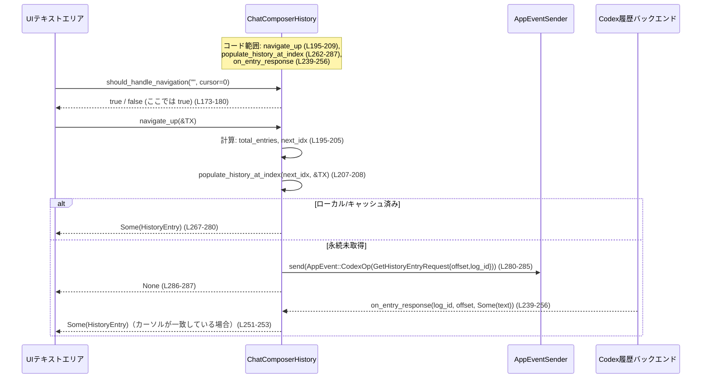

# tui/src/bottom_pane/chat_composer_history.rs

## 0. ざっくり一言

チャット入力欄の「↑ / ↓ キーによる履歴移動」を管理する **状態機械** と、履歴 1 件分のデータ（テキスト・メンション・画像など）を表す構造体を定義するモジュールです。永続履歴（過去セッション）とローカル履歴（現在セッション）をまとめて、シェル風の履歴操作を実現します。  
（chat_composer_history.rs:L11-26, L84-110）

---

## 1. このモジュールの役割

### 1.1 概要

- このモジュールは **チャットコンポーザ（入力欄）の履歴をシェル風にナビゲートする問題** を解決するために存在し、次の機能を提供します。
  - 1 件分の履歴エントリを表す `HistoryEntry` 構造体（テキスト・メンション・添付画像などを保持）（L13-25）
  - 永続履歴とローカル履歴を統合し、↑ / ↓ キー操作で履歴をたどる `ChatComposerHistory` 状態機械（L84-110, L112-287）
  - 非同期に取得される永続履歴（`GetHistoryEntryResponse` 相当のイベント）の統合（`on_entry_response`）（L238-256）
  - 「現在のカーソル位置とテキスト内容に応じて、↑ / ↓ を履歴移動として扱うべきか」を判定するロジック（`should_handle_navigation`）（L163-191）

### 1.2 アーキテクチャ内での位置づけ

このファイルに登場する主要コンポーネントと外部依存の関係は次のようになります。

```mermaid
graph TD
    UI["UIテキストエリア<br/>（キー入力ハンドラ）"]
    CH["ChatComposerHistory<br/>(状態機械)"]
    HE["HistoryEntry<br/>(履歴1件のスナップショット)"]
    MC["decode_history_mentions()<br/>(mention_codec)"]
    AES["AppEventSender"]
    AE["AppEvent::CodexOp"]
    OP["Op::GetHistoryEntryRequest"]
    BACK["Codex 履歴バックエンド"]

    UI --> CH:::code        %% ↑/↓ キー, 送信イベント
    CH --> HE:::code        %% 履歴エントリの返却・保存
    HE --> MC:::code        %% HistoryEntry::new 内でメンション復元 (L29-45)
    CH --> AES:::code       %% populate_history_at_index 内で送信 (L281-285)
    AES --> AE:::code
    AE --> OP:::code
    OP --> BACK             %% 永続履歴の取得
    BACK --> CH:::code      %% on_entry_response() で統合 (L239-256)

    classDef code fill:#eef,stroke:#336,stroke-width:1px;
```

- `ChatComposerHistory` は UI ウィジェットとは独立しており、「履歴インデックス」と「最後に挿入されたテキスト」を内部状態として保持します（L84-110）。
- 永続履歴は `AppEventSender` 経由で `CodexOp::GetHistoryEntryRequest` を送信して取得し、後から `on_entry_response` で統合します（L195-209, L262-287, L239-256）。
- 各履歴エントリは `HistoryEntry` にまとめられ、テキストだけでなくメンション・画像・ペーストプレースホルダも持ちます（L13-25）。

### 1.3 設計上のポイント

コードから読み取れる設計上の特徴です。

- **表示ロジックからの分離**  
  コメントにある通り、レンダリングウィジェットから切り離された「状態機械」として実装されています（L84-86）。これによりテストしやすい構造になっています（テストモジュールが同ファイル内にあり、状態のみを検証していることからも分かります（L290-423））。

- **永続履歴とローカル履歴の分離 + 統合インデックス**  
  - 永続履歴の件数は `history_entry_count`、ローカル履歴は `local_history: Vec<HistoryEntry>` として別々に管理されます（L90-96）。
  - グローバルインデックス `global_idx` に対し、`global_idx < history_entry_count` なら永続履歴、そうでなければローカル履歴として扱う設計です（L267-273, L277-280）。

- **非同期取得を前提としたキャッシュ**  
  - 永続履歴は `fetched_history: HashMap<usize, HistoryEntry>` にキャッシュします（L98-99）。
  - 未取得の永続エントリに対しては `AppEventSender` 経由で `GetHistoryEntryRequest` を送信し（L281-285）、レスポンス到着後に `on_entry_response` でキャッシュに格納します（L239-250）。

- **シェル風の履歴ナビゲーション条件**  
  - `should_handle_navigation` で「今のテキストとカーソル位置なら、↑ / ↓ を履歴操作として扱ってよいか」を判定します（L163-191）。
  - 条件は「履歴が一件でもある」かつ「テキストが空、または最後に復元した履歴テキストと一致」かつ「カーソルが先頭または末尾」のときです（L173-191）。

- **Rustの安全性・エラー処理**  
  - 全て安全な Rust だけで書かれており、`unsafe` はありません。
  - 永続履歴の取得失敗や未取得状態は `Option<HistoryEntry>` の `None` で表現されます（`navigate_up` / `navigate_down` / `on_entry_response` の戻り値など）（L195-209, L212-236, L239-256）。
  - 理論的には `usize -> isize` キャストがありますが（L201-205）、`history_cursor` の値に対して 0 未満を生成しない条件分岐があり、通常の範囲では負値にならないようになっています（L201-205, L203）。

---

## 2. 主要な機能一覧

このモジュールが提供する主な機能です。

- 履歴エントリの表現: `HistoryEntry` でテキスト・メンション・画像・ペーストプレースホルダを保持（L13-25）。
- メンション文字列のデコードとバインディング生成: `HistoryEntry::new` で `decode_history_mentions` を呼び出し、`mention_bindings` を構築（L29-45）。
- チャット履歴状態機械: `ChatComposerHistory` が永続 + ローカル履歴を統合して管理（L84-110）。
- セッション開始時のメタデータ設定: `set_metadata` でログIDと永続履歴件数を設定し、状態をリセット（L124-132）。
- ローカル送信メッセージの記録: `record_local_submission` で現在セッションで送信したメッセージを履歴に追加（重複と空エントリは除外）（L134-155）。
- 履歴ナビゲーション条件判定: `should_handle_navigation` で現在のテキストとカーソル位置に基づき、↑ / ↓ を履歴操作に割り当てるかを判定（L163-191）。
- 履歴の上方向・下方向移動: `navigate_up` / `navigate_down` でインデックスを進め、該当する `HistoryEntry` を返す、または永続履歴の取得要求を送信（L193-209, L211-236）。
- 永続履歴レスポンスの統合: `on_entry_response` で非同期に届くエントリをキャッシュし、必要に応じて呼び出し元に返す（L239-256）。

---

## 3. 公開 API と詳細解説

### 3.1 型一覧（構造体など）

| 名前 | 種別 | 公開レベル | 役割 / 用途 | 定義位置 |
|------|------|-----------|-------------|----------|
| `HistoryEntry` | 構造体 | `pub(crate)` | 履歴1件分のスナップショット。テキスト、テキスト要素（メンション等）、ローカル画像パス、リモート画像URL、メンションバインディング、大きなペーストのプレースホルダ等を保持する。 | chat_composer_history.rs:L13-25 |
| `ChatComposerHistory` | 構造体 | `pub(crate)` | チャットコンポーザの履歴（永続＋ローカル）を管理する状態機械。履歴カーソル、最後に挿入した履歴テキスト、永続履歴のキャッシュなどを保持する。 | chat_composer_history.rs:L84-110 |

依存する主な外部型:

- `TextElement`（`codex_protocol::user_input::TextElement`）: テキスト中の特定範囲（メンション等）を表す型と推測されますが、詳細はこのチャンクにはありません（L9, L17）。
- `MentionBinding`（`crate::bottom_pane::MentionBinding`）: メンションとその参照先パスを結びつける型で、`HistoryEntry::new` で構築されています（L6, L36-43）。
- `AppEvent`, `AppEventSender`, `Op`: 永続履歴要求を外部に送るためのイベント関連型です（L4-8, L281-285, L340-350）。

### 3.2 関数詳細（主要7件）

以下では、クレート内から利用される可能性が高いメソッド 7 件について詳しく説明します。

---

#### `ChatComposerHistory::new() -> ChatComposerHistory`

**概要**

チャット履歴状態機械の新しいインスタンスを初期化します。永続履歴件数 0、ローカル履歴空、カーソル無しといった初期状態になります（L113-122）。

**引数**

なし。

**戻り値**

- `ChatComposerHistory`  
  空の履歴状態を持つインスタンス。

**内部処理の流れ**

1. `history_log_id` を `None` に設定（L115）。
2. `history_entry_count` を 0 に設定（L116）。
3. `local_history` を空の `Vec` に初期化（L117）。
4. `fetched_history` を空の `HashMap` に初期化（L118）。
5. `history_cursor` と `last_history_text` を `None` に初期化（L119-120）。

**Examples（使用例）**

```rust
use tui::bottom_pane::chat_composer_history::{ChatComposerHistory, HistoryEntry}; // モジュールパスは例示

fn create_history_state() -> ChatComposerHistory {
    let mut history = ChatComposerHistory::new(); // 空の履歴状態を作成 (L113-122)

    // セッション開始時にサーバーから得た履歴件数を設定する
    history.set_metadata(1, 3); // log_id=1, 永続履歴3件とする (L124-132)

    history
}
```

**Errors / Panics**

- この関数自身が `Result` を返すことはなく、パニックを起こすコード（`unwrap` 等）も含みません（L113-122）。

**Edge cases（エッジケース）**

- `new()` 直後は `history_entry_count == 0` であるため、`should_handle_navigation` は常に `false` を返します（L173-176）。永続履歴の件数を設定するには `set_metadata` の呼び出しが前提になります。

**使用上の注意点**

- 永続履歴を利用する場合、`new()` の直後に必ず `set_metadata` を呼ぶ必要があります（L125-128）。そうしないと永続履歴件数は 0 のままです。

---

#### `ChatComposerHistory::set_metadata(&mut self, log_id: u64, entry_count: usize)`

**概要**

新しいセッションが構成された際に呼び出され、永続履歴のログIDと件数を更新します。同時にキャッシュやローカル履歴、ナビゲーション状態をクリアします（L124-132）。

**引数**

| 引数名 | 型 | 説明 |
|--------|----|------|
| `log_id` | `u64` | 永続履歴ファイルの識別子。`GetHistoryEntryRequest` でサーバーに渡されます（L245-247, L281-284）。 |
| `entry_count` | `usize` | セッション開始時点で永続履歴に存在するエントリの件数（L124-132）。 |

**戻り値**

- なし（`()`）。

**内部処理の流れ**

1. `history_log_id` を `Some(log_id)` に設定（L126）。
2. `history_entry_count` を `entry_count` に設定（L127）。
3. `fetched_history` と `local_history` をクリア（L128-129）。
4. `history_cursor` と `last_history_text` を `None` にリセット（L130-131）。

**Examples（使用例）**

```rust
fn on_session_configured(history: &mut ChatComposerHistory, log_id: u64, count: usize) {
    // 新しいセッション開始時のメタデータを設定する (L124-132)
    history.set_metadata(log_id, count);

    // ここから navigate_up などは永続履歴 `count` 件分を扱える
}
```

**Errors / Panics**

- パニックを発生させるコードは含まれていません（L124-132）。

**Edge cases（エッジケース）**

- `set_metadata` を呼ぶと `local_history` もクリアされるため（L128-129）、それまでに記録した現在セッション中の送信履歴はすべて失われます。
- `entry_count == 0` を渡すと、永続履歴は無いものと扱われます（`navigate_up` / `should_handle_navigation` で履歴なし扱いになります）（L173-176, L195-199）。

**使用上の注意点**

- セッションの切り替え時専用と考えられます。セッション途中で不用意に呼び出すと、ユーザーが送信したローカル履歴も消える点に注意が必要です（L128-129）。
- この関数以外に `history_entry_count` や `history_log_id` を変更する API はなく、両者は常に一緒に更新されます（L113-122, L124-132）。

---

#### `ChatComposerHistory::record_local_submission(&mut self, entry: HistoryEntry)`

**概要**

現在の UI セッション中にユーザーが送信したメッセージをローカル履歴として記録します。空のエントリや、直前と完全に同一のエントリは記録されません（L134-155）。

**引数**

| 引数名 | 型 | 説明 |
|--------|----|------|
| `entry` | `HistoryEntry` | 保存したい履歴エントリ。テキストや画像などを含みます（L13-25）。 |

**戻り値**

- なし。

**内部処理の流れ**

1. `entry` が実質的に空かチェックします。以下のすべてが空であれば何もせず `return` します（L137-144）。
   - `text`
   - `text_elements`
   - `local_image_paths`
   - `remote_image_urls`
   - `mention_bindings`
   - `pending_pastes`
2. 履歴ナビゲーション状態をリセットします（`history_cursor` と `last_history_text` を `None` に）（L146-147）。
3. 直前のローカル履歴と完全一致する場合、重複を避けるため何もせず return します（`is_some_and(|prev| prev == &entry)`）（L149-152）。
4. それ以外の場合、`local_history` の末尾に `entry` を push します（L154）。

**Examples（使用例）**

```rust
fn on_user_submitted(
    history: &mut ChatComposerHistory,
    text: String,
) {
    // テキストだけから履歴エントリを作成 (L29-45)
    let entry = HistoryEntry::new(text);

    // ローカル履歴として記録 (L134-155)
    history.record_local_submission(entry);
}
```

**Errors / Panics**

- パニックを起こす可能性のある操作は使っていません（L134-155）。

**Edge cases（エッジケース）**

- テキストが空でも、画像やメンションなど他のフィールドに何かが入っていれば記録されます（L137-143）。
- 直前と「完全一致」する場合だけ重複排除されます。`PartialEq` は構造体全フィールドに対して自動導出されているため（L12）、テキスト以外のフィールドが 1 つでも違えば別エントリとして記録されます。
- 最初のエントリが空であれば無視されます。テスト `duplicate_submissions_are_not_recorded` でこれが確認されています（L298-304）。

**使用上の注意点**

- この関数を呼ぶたびに履歴ナビゲーション状態（`history_cursor`, `last_history_text`）がリセットされるため（L146-147）、送信直後に↑ / ↓ を押すと常に「最新から」履歴をたどる挙動になります。
- 履歴登録の前に `HistoryEntry::new` 等でメンションをデコードしておく必要があります（L29-45）。

---

#### `ChatComposerHistory::should_handle_navigation(&self, text: &str, cursor: usize) -> bool`

**概要**

現在のテキスト内容とカーソル位置に基づき、「↑ / ↓ キーを履歴ナビゲーションとして処理すべきか」を判定します（L163-191）。  
シェル風の挙動を維持するため、「テキストが空」または「最後に呼び出し側に返した履歴テキストと一致」し、かつカーソルが先頭または末尾にある場合にのみ `true` になります。

**引数**

| 引数名 | 型 | 説明 |
|--------|----|------|
| `text` | `&str` | 現在のテキストエリア内の内容（L173-181）。 |
| `cursor` | `usize` | テキスト内のカーソル位置。`0` が先頭、`text.len()` が末尾とみなされています（L186-187）。 |

**戻り値**

- `bool`  
  - `true`: ↑ / ↓ を履歴移動として扱うべき。
  - `false`: 通常のカーソル上下移動として扱うべき。

**内部処理の流れ**

1. 永続履歴件数とローカル履歴が共に空なら、常に `false` を返します（履歴が何もない）（L173-176）。
2. `text` が空文字列であれば、常に `true` を返します（どの履歴からでも開始できる）（L178-180）。
3. テキストが非空の場合:
   - カーソルが先頭 (`0`) でも末尾 (`text.len()`) でもない場合は `false` を返します（L186-187）。
   - そうでなければ、`last_history_text` が `Some(prev)` かつ `prev == text` のときだけ `true` を返します（`matches!` マクロ）（L190）。

**Examples（使用例）**

```rust
fn on_up_key(
    history: &mut ChatComposerHistory,
    current_text: &str,
    cursor: usize,
    app_event_tx: &AppEventSender,
) {
    // ↑キーを履歴ナビゲーションとして扱うべきか判定 (L173-191)
    if history.should_handle_navigation(current_text, cursor) {
        if let Some(entry) = history.navigate_up(app_event_tx) { // L195-209
            // entry.text をテキストエリアに反映する、など
        }
    } else {
        // 通常のカーソル移動処理
    }
}
```

**Errors / Panics**

- この関数は `Result` を返さず、パニックを起こすコードも含んでいません（L173-191）。

**Edge cases（エッジケース）**

- テキストが空文字列なら、カーソル位置に関わらず `true` になります（L178-180）。  
  → 最初の↑キーで履歴の最新にジャンプできる動作になります（テスト `navigation_with_async_fetch` の最初の `assert!(history.should_handle_navigation("", 0));` 参照（L335-337））。
- テキストが非空だが `last_history_text` が `None` の場合（まだ履歴から復元していない状態）は、カーソルが端にあっても `false` になります（L190）。
- テキストが履歴から復元したものと異なる場合（ユーザーが編集した場合）も `false` です（L190）。  
  テスト `should_handle_navigation_when_cursor_is_at_line_boundaries` で、`"hello"` と `"other"` で挙動が分かれることが確認されています（L413-422）。

**使用上の注意点**

- 呼び出し側は「↑ / ↓ キーが押されたとき、まずこの関数でナビゲーション可否をチェックし、`true` の場合にのみ `navigate_up` / `navigate_down` を呼ぶ」というパターンを前提にしていると解釈できます（L163-172）。
- `cursor` は `text.len()` を基準に末尾を判定しているため（L186-187）、呼び出し側のカーソル座標系も同じ想定（バイト単位かコードポイント単位か等）である必要がありますが、このチャンクだけでは詳細は分かりません。

---

#### `ChatComposerHistory::navigate_up(&mut self, app_event_tx: &AppEventSender) -> Option<HistoryEntry>`

**概要**

↑キーに対応し、履歴カーソルを 1 つ「古い側」に移動します。ローカルまたはキャッシュ済み永続履歴があれば `HistoryEntry` を返し、まだ取得していない永続履歴の場合は `GetHistoryEntryRequest` を送信して `None` を返します（L193-209, L262-287）。  
※ ドキュメントコメントには「Returns true when the key was consumed」とありますが、実際のシグネチャは `Option<HistoryEntry>` です（L193-195）。

**引数**

| 引数名 | 型 | 説明 |
|--------|----|------|
| `app_event_tx` | `&AppEventSender` | 永続履歴の取得要求イベントを送るための送信オブジェクト（L195, L281-285）。 |

**戻り値**

- `Option<HistoryEntry>`  
  - `Some(entry)`: 応じる履歴エントリがすでに利用可能であり、それを返す。
  - `None`: 応じる履歴エントリが存在しない、または永続履歴の非同期取得中でまだエントリがない。

**内部処理の流れ（アルゴリズム）**

1. トータルの履歴件数 `total_entries = history_entry_count + local_history.len()` を計算（L195-197）。
2. `total_entries == 0` の場合、すぐに `None` を返す（履歴が何もない）（L197-199）。
3. 次のインデックス `next_idx` を `isize` として求める（L201-205）。
   - `history_cursor == None` の場合: `next_idx = total_entries as isize - 1`（最新の履歴にジャンプ）（L201-202）。
   - `history_cursor == Some(0)` の場合: これ以上古い履歴は無いので `None` を返す（L203）。
   - それ以外の場合: `next_idx = idx - 1` で 1 つ前に移動（L204）。
4. `history_cursor` を `Some(next_idx)` に更新（L207）。
5. `populate_history_at_index(next_idx as usize, app_event_tx)` を呼び、その結果をそのまま返す（L207-208）。
   - ローカルまたはキャッシュ済み永続エントリが存在する場合は、`Some(entry)` を返し、その際 `last_history_text` も更新されます（L267-280, L274-275, L278-279）。
   - 未取得の永続履歴で `history_log_id` が設定されている場合は、`AppEvent::CodexOp(Op::GetHistoryEntryRequest { offset, log_id })` を送信し、`None` を返します（L280-285）。

**Examples（使用例）**

テスト `navigation_with_async_fetch` と同様の流れです（L327-378）。

```rust
fn handle_up_key(
    history: &mut ChatComposerHistory,
    app_event_tx: &AppEventSender,
) {
    if let Some(entry) = history.navigate_up(app_event_tx) { // L195-209
        // entry.text や entry.text_elements をテキストエリアに反映する
    } else {
        // None の場合:
        //   - 履歴が空
        //   - すでに最古のエントリにいる
        //   - または、永続履歴の取得要求を送信した直後で、まだデータが来ていない
        // いずれかの可能性がある
    }
}
```

**Errors / Panics**

- 関数内には `unwrap` などパニックを起こすコードはありません（L195-209, L262-287）。
- `usize -> isize` キャストがありますが（L201-202）、コード上は `total_entries >= 1` の場合にのみ `total_entries as isize - 1 >= 0` となり、負値を `usize` にキャストしないようになっています（L197-205）。  
  理論上 `total_entries` が `isize::MAX` を超えると負値になる可能性がありますが、UI 履歴という用途から、このチャンクだけでは想定範囲外かどうかは判断できません。

**Edge cases（エッジケース）**

- 履歴が全くない場合 (`history_entry_count == 0` かつ `local_history.is_empty()`): いかなる状態でも `None` を返します（L195-199, L173-176）。
- 最古のエントリに到達している場合 (`history_cursor == Some(0)`): さらに `navigate_up` を呼ぶと何もせず `None` を返します（L201-205, L203）。
- 永続履歴の未取得エントリに対応する `next_idx` の場合:
  - `populate_history_at_index` 内で `AppEvent` を送信し（L280-285）、`None` を返します（L286-287）。
  - 後で `on_entry_response` が呼ばれたときに、カーソル位置が対応していれば `Some(entry)` が返ります（L239-256, L251-253）。

**使用上の注意点**

- ドキュメントコメントの「Returns true...」は実装と一致していないため、戻り値 `Option<HistoryEntry>` に基づいて実装を理解する必要があります（L193-195）。
- `None` が返ってきたとき、「キーを消費したが非同期取得中」なのか「履歴が無い/これ以上無い」のかは、この関数だけでは区別できません。テストでは、`None` が返ってきた後に `AppEvent` を受信していることから、「キーは消費した」とみなしていることがわかります（L335-350）。

---

#### `ChatComposerHistory::navigate_down(&mut self, app_event_tx: &AppEventSender) -> Option<HistoryEntry>`

**概要**

↓キーに対応し、履歴カーソルを 1 つ「新しい側」に移動します。履歴リストの末尾を超えた場合はブラウジングを終了し、空の `HistoryEntry` を返して入力欄をクリアする用途を想定しています（L211-236）。

**引数**

| 引数名 | 型 | 説明 |
|--------|----|------|
| `app_event_tx` | `&AppEventSender` | 永続履歴取得要求を送るための送信オブジェクト（L212, L262-287）。 |

**戻り値**

- `Option<HistoryEntry>`  
  - `Some(entry)`: 対応する履歴エントリ、または末尾を超えた際の「空」エントリ。
  - `None`: 履歴を閲覧していない状態、または永続履歴の非同期取得中。

**内部処理の流れ**

1. `total_entries` を `history_entry_count + local_history.len()` として計算（L213-214）。
2. `total_entries == 0` の場合 `None` を返す（L214-216）。
3. `next_idx_opt` を決定（L218-222）。
   - `history_cursor == None`: 履歴閲覧モードではないので `None` を返す（L219）。
   - `history_cursor == Some(idx)` かつ `idx + 1 >= total_entries`: すでに最新より新しい位置に進めないため `None` を設定（L220）。
   - それ以外: `Some(idx + 1)`。
4. `match next_idx_opt`（L224-235）。
   - `Some(idx)` の場合:
     - `history_cursor` を更新して `populate_history_at_index(idx as usize, app_event_tx)` を呼び、その結果を返す（L225-228）。
   - `None` の場合（末尾を超えた状態）:
     - `history_cursor` と `last_history_text` をクリアし（L231-232）、
     - `HistoryEntry::new(String::new())`（空テキストからのエントリ）を返す（L233-234）。

**Examples（使用例）**

```rust
fn handle_down_key(
    history: &mut ChatComposerHistory,
    app_event_tx: &AppEventSender,
) {
    if let Some(entry) = history.navigate_down(app_event_tx) { // L212-236
        // 末尾を超えた場合は entry.text が空文字列になる (L233-234)
        // その場合はテキストエリアをクリアするなどの処理が想定される
    }
}
```

**Errors / Panics**

- パニックを起こすコードは含まれていません（L212-236, L262-287）。

**Edge cases（エッジケース）**

- `history_cursor == None` の状態で `navigate_down` を呼ぶと、`None` が返ってきます（L218-220）。
- 履歴の最新エントリにいる状態からさらに `navigate_down` すると、`None` ではなく「空の `HistoryEntry`」が返され、ブラウジング状態が解除されます（L224-235）。  
  これにより、↑ で履歴を辿った後、↓ を押して元の空の入力欄に戻れる挙動になります。
- 永続履歴で未取得のエントリに到達した場合は、`navigate_up` 同様 `AppEvent` が送信され `None` が返ります（L225-228, L262-287）。

**使用上の注意点**

- 「ブラウジング中かどうか」は `history_cursor` が `Some(_)` か `None` かで判定されているため（L101-104, L218-220, L231-232）、`reset_navigation` や `set_metadata` によってこの状態が変わる点に注意が必要です（L157-161, L130-131）。
- 「末尾を超えた状態」と「履歴閲覧モードに入っていない状態」の `None` の区別は、この関数の戻り値だけからは判別できないため、呼び出し側の状態管理が必要になります。

---

#### `ChatComposerHistory::on_entry_response(&mut self, log_id: u64, offset: usize, entry: Option<String>) -> Option<HistoryEntry>`

**概要**

外部から届いた永続履歴取得レスポンス（概念的には `GetHistoryEntryResponse`）を統合します（L238-256）。  
ログIDが一致し、かつ `entry` が `Some(text)` の場合、そのテキストから `HistoryEntry` を作成してキャッシュし、もし現在の履歴カーソルがそのオフセットを指していれば呼び出し元に返します。

**引数**

| 引数名 | 型 | 説明 |
|--------|----|------|
| `log_id` | `u64` | レスポンスが属する履歴ログID（L239-246）。 |
| `offset` | `usize` | 永続履歴内のインデックス（`GetHistoryEntryRequest` の `offset` と対応）（L242-243, L281-283）。 |
| `entry` | `Option<String>` | テキスト本体。存在しない場合（`None`）もありえます（L243-244）。 |

**戻り値**

- `Option<HistoryEntry>`  
  - `Some(entry)`: 現在の履歴カーソルがちょうどこの `offset` を指している場合、その `HistoryEntry` を返す。
  - `None`: ログID不一致、`entry` が `None`、またはカーソルが異なる位置を指している場合。

**内部処理の流れ**

1. `history_log_id != Some(log_id)` の場合、無関係なレスポンスとして `None` を返す（L245-247）。
2. `let entry = HistoryEntry::new(entry?);` によって、`entry` が `None` なら早期に `None` を返し、`Some(text)` なら `HistoryEntry` を構築（L248）。  
   - ここで `?` 演算子を使い、`Option<String>` から `String` を取り出しています（Rust のエラー伝播の一種ですが、`Option` 版）。
3. `fetched_history.insert(offset, entry.clone());` でキャッシュに格納（L249-250）。
4. `history_cursor == Some(offset as isize)` ならば（L251）:
   - `last_history_text` を `Some(entry.text.clone())` に更新（L252）。
   - `Some(entry)` を返す（L253）。
5. そうでない場合 `None` を返します（L255）。

**Examples（使用例）**

```rust
fn on_history_entry_response(
    history: &mut ChatComposerHistory,
    log_id: u64,
    offset: usize,
    text: Option<String>,
) {
    if let Some(entry) = history.on_entry_response(log_id, offset, text) { // L239-256
        // 現在のカーソル位置に対するレスポンスだったので、即座にテキストエリアに反映できる
        // entry.text を適用するなど
    } else {
        // キャッシュには保存されているが、カーソルは別の位置を指しているか、
        // ログIDが違う/エントリ無しなどのケース
    }
}
```

**Errors / Panics**

- `entry?` による早期リターンは、`entry == None` の場合に `None` を返すだけでパニックにはなりません（L248）。
- それ以外にパニックを起こすコードは見当たりません（L239-256）。

**Edge cases（エッジケース）**

- `log_id` が一致しないレスポンスは完全に無視されます（L245-247）。セッション切り替え直後に古いレスポンスが来ても、状態が汚染されません。
- `entry == None` の場合、キャッシュは更新されず `None` が返ります（L248）。
- カーソルがレスポンスの `offset` を指していない場合も `None` ですが、そのオフセットはキャッシュに保存されます（L249-250, L255）。

**使用上の注意点**

- 呼び出し側は `Some(HistoryEntry)` が返ってきたときのみテキストエリアを更新し、それ以外のときは「キャッシュが増えただけ」と解釈するのが自然です（L249-253）。
- `offset` と `history_cursor` は `isize` / `usize` の別型ですが、`offset as isize` として比較しています（L251）。このチャンク内では `offset` が `isize::MAX` を超える場面は想定されていません。

---

#### `ChatComposerHistory::reset_navigation(&mut self)`

**概要**

履歴ナビゲーション状態（`history_cursor` と `last_history_text`）のみをリセットします。履歴自体（永続・ローカル）は保持されたままです（L157-161）。

**引数**

なし。

**戻り値**

- なし。

**内部処理の流れ**

1. `history_cursor = None`（L159）。
2. `last_history_text = None`（L160）。

**Examples（使用例）**

```rust
fn on_user_started_typing(history: &mut ChatComposerHistory) {
    // ユーザーが履歴から復元したテキストを編集し始めたタイミングなどで呼ぶことが想定される
    history.reset_navigation(); // L157-161
}
```

**Errors / Panics**

- パニックを起こすコードは含まれていません（L157-161）。

**Edge cases（エッジケース）**

- `history_cursor` が `None` のときに呼んでも何も変化はありません（L159-160）。
- テスト `reset_navigation_resets_cursor` で、連続して `navigate_up` を呼んだ後にリセットすると、次の `navigate_up` が再び最新のエントリを返すことが確認されています（L381-411）。

**使用上の注意点**

- `set_metadata` でも同様にナビゲーション状態はクリアされますが（L130-131）、`reset_navigation` は履歴自体は消さない点で意味が異なります。

---

### 3.3 その他の関数

補助的またはテスト専用の関数です。

| 関数名 | 役割（1 行） | 定義位置 |
|--------|--------------|----------|
| `HistoryEntry::new(text: String) -> HistoryEntry` | テキストからメンションをデコードし、`mention_bindings` を構築した履歴エントリを生成します（L29-45）。 | chat_composer_history.rs:L29-45 |
| `HistoryEntry::with_pending(...)` | テスト用: `pending_pastes` やローカル画像パスなどを任意に指定して `HistoryEntry` を生成します（`#[cfg(test)]`）（L48-63）。 | chat_composer_history.rs:L48-63 |
| `HistoryEntry::with_pending_and_remote(...)` | テスト用: 上記に加えて `remote_image_urls` を設定できるコンストラクタ（L65-81）。 | chat_composer_history.rs:L65-81 |
| `ChatComposerHistory::populate_history_at_index(&mut self, global_idx: usize, app_event_tx: &AppEventSender) -> Option<HistoryEntry>` | 内部ヘルパ: グローバルインデックスからローカル/永続履歴を解決し、必要なら `GetHistoryEntryRequest` を送信します（L262-287）。 | chat_composer_history.rs:L262-287 |
| `duplicate_submissions_are_not_recorded()` | テスト: ローカル送信履歴の重複排除と空エントリ無視を検証します（L297-324）。 | chat_composer_history.rs:L297-324 |
| `navigation_with_async_fetch()` | テスト: 永続履歴を非同期取得する際の `navigate_up` と `on_entry_response` の挙動を検証します（L326-378）。 | chat_composer_history.rs:L326-378 |
| `reset_navigation_resets_cursor()` | テスト: `reset_navigation` がカーソルと `last_history_text` をリセットすることを検証します（L381-411）。 | chat_composer_history.rs:L381-411 |
| `should_handle_navigation_when_cursor_is_at_line_boundaries()` | テスト: `should_handle_navigation` がカーソル位置とテキスト一致に基づいて正しく判定することを検証します（L413-422）。 | chat_composer_history.rs:L413-422 |

---

## 4. データフロー

ここでは、典型的な「↑キーで永続履歴を辿る」シナリオを取り上げ、データの流れを説明します。

1. ユーザーが空の入力欄で ↑キーを押す。
2. 呼び出し側が `should_handle_navigation("", cursor)` を呼び、`true` が返る（履歴が存在し、テキストが空なので）（L173-180, L335-337）。
3. 呼び出し側が `navigate_up(&app_event_tx)` を呼ぶ（L195-209）。
   - 初回なので `history_cursor == None` から `next_idx = total_entries - 1`（最新の永続エントリ）に設定される（L201-202）。
   - `populate_history_at_index` が呼ばれ、永続履歴でまだキャッシュされていないため、`GetHistoryEntryRequest` が送信され `None` が返る（L267-287, L281-285, L337-349）。
4. バックエンドから `GetHistoryEntryResponse` 相当のイベントが届き、呼び出し側が `on_entry_response(log_id, offset, Some(text))` を呼ぶ（L239-256, L352-356）。
   - `history_cursor` がちょうど `offset` を指していれば、`Some(HistoryEntry)` が返り、入力欄を更新できる（L251-253）。
5. さらに ↑キーを押すと、同様に次のインデックスへ移動し、必要に応じて再度非同期取得が行われます（L358-377）。

この流れをシーケンス図で表すと次のようになります。



---

## 5. 使い方（How to Use）

### 5.1 基本的な使用方法

典型的な利用フローは以下の通りです。

1. アプリ起動時に `ChatComposerHistory::new()` で状態を生成する（L113-122）。
2. セッションが確立されたタイミングで `set_metadata(log_id, entry_count)` を呼び、永続履歴のメタデータを設定する（L124-132）。
3. ユーザーがメッセージを送信したら `record_local_submission` でローカル履歴に追加する（L134-155）。
4. ↑ / ↓ キーが押されたとき:
   - まず `should_handle_navigation(text, cursor)` でナビゲーション可否を確認する（L163-191）。
   - `true` の場合 `navigate_up` / `navigate_down` を呼び、戻り値の `Option<HistoryEntry>` に応じてテキストを更新する。
5. 永続履歴のレスポンスを受け取ったら `on_entry_response` を呼び、必要に応じてテキストを更新する（L239-256）。

コード例:

```rust
use tui::bottom_pane::chat_composer_history::{ChatComposerHistory, HistoryEntry}; // パスは例
use crate::app_event_sender::AppEventSender;

struct ComposerContext {
    history: ChatComposerHistory,   // 履歴状態 (L84-110)
    app_event_tx: AppEventSender,   // イベント送信
}

impl ComposerContext {
    fn new(app_event_tx: AppEventSender, log_id: u64, entry_count: usize) -> Self {
        let mut history = ChatComposerHistory::new(); // L113-122
        history.set_metadata(log_id, entry_count);    // L124-132
        Self { history, app_event_tx }
    }

    fn on_submit(&mut self, text: String) {
        // 送信されたテキストを履歴エントリに変換 (L29-45)
        let entry = HistoryEntry::new(text);
        // ローカル履歴に記録 (L134-155)
        self.history.record_local_submission(entry);
    }

    fn on_up_key(&mut self, current_text: &str, cursor: usize) {
        if self.history.should_handle_navigation(current_text, cursor) { // L173-191
            if let Some(entry) = self.history.navigate_up(&self.app_event_tx) { // L195-209
                // entry.text をテキストエリアに反映する
            }
        } else {
            // 通常のカーソル移動処理
        }
    }

    fn on_history_response(&mut self, log_id: u64, offset: usize, text: Option<String>) {
        if let Some(entry) = self.history.on_entry_response(log_id, offset, text) { // L239-256
            // entry.text をテキストエリアに反映する
        }
    }
}
```

### 5.2 よくある使用パターン

1. **永続履歴 + ローカル履歴の両方を扱うパターン**

   - セッション開始時に `set_metadata(log_id, count)` で永続履歴件数を設定（L124-132）。
   - 実行中に `record_local_submission` でローカル履歴を蓄積（L134-155）。
   - `navigate_up` / `navigate_down` は永続→ローカルを一続きの履歴として扱います（L195-209, L267-273）。

2. **ローカル履歴のみを扱うパターン**

   - `set_metadata` で `entry_count = 0` を渡すか、あるいは呼ばない。
   - `record_local_submission` のみで履歴を作ると、永続履歴は一切使わずローカルのみを辿ることになります（L195-199, L267-273）。

3. **履歴ブラウジングのキャンセル**

   - ユーザーが履歴から復元したテキストを編集し始めたタイミングなどで `reset_navigation` を呼び、`history_cursor` と `last_history_text` をクリアします（L157-161）。  
   - これにより、編集後に ↑ / ↓ を押しても、新たに履歴ブラウジングを開始するまで履歴移動は行われません（L190）。

### 5.3 よくある間違い

コードから推測できる誤用例と正しい例です。

```rust
// 誤り例: ↑キーで毎回 navigate_up を呼んでしまう
fn on_up_key_wrong(history: &mut ChatComposerHistory, app_event_tx: &AppEventSender) {
    // should_handle_navigation を見ずに直接 navigate_up を呼ぶ
    let _ = history.navigate_up(app_event_tx); // L195-209
    // 入力中のテキストがある場合でも履歴モードに入ってしまう可能性がある
}

// 正しい例: まず should_handle_navigation で判定する
fn on_up_key_correct(
    history: &mut ChatComposerHistory,
    current_text: &str,
    cursor: usize,
    app_event_tx: &AppEventSender,
) {
    if history.should_handle_navigation(current_text, cursor) { // L173-191
        let _ = history.navigate_up(app_event_tx);              // L195-209
    } else {
        // 通常のカーソル移動処理
    }
}
```

```rust
// 誤り例: set_metadata をセッション途中で呼んでしまう
fn reconfigure_mid_session_wrong(history: &mut ChatComposerHistory) {
    // これを呼ぶと local_history が消える (L128-129)
    history.set_metadata(42, 10);
    // それまでのローカル送信履歴がすべて失われる
}

// 注意したい例: セッション開始時だけに限定する
fn reconfigure_on_new_session(history: &mut ChatComposerHistory, log_id: u64, count: usize) {
    // 新しいセッション開始時にだけ呼ぶことが想定される (L124-132)
    history.set_metadata(log_id, count);
}
```

### 5.4 使用上の注意点（まとめ）

- **ナビゲーション判定 (`should_handle_navigation`) を必ず使う**  
  これを介さずに `navigate_up` / `navigate_down` を直接呼ぶと、マルチラインテキストの通常カーソル移動を妨げる可能性があります（L163-172, L186-190）。

- **`set_metadata` はセッション切り替え専用**  
  ローカル履歴をクリアするため、セッション途中で使うとユーザーの履歴が失われます（L128-129）。

- **非同期取得中の `None` と履歴なしの `None` の区別**  
  `navigate_up` / `navigate_down` の `None` には複数の意味があり得るため（履歴なし / 端に到達 / 非同期中）（L195-205, L218-223, L280-287）、呼び出し側は `AppEvent` 送信有無など別の情報と組み合わせて扱う必要があります。テストでは `rx.try_recv()` でイベントが届いたことを確認しています（L328-350, L361-372）。

- **並行性**  
  - このモジュールの状態は全て `&mut self` を通じてのみ変更されるため、Rust の所有権ルールに従えばデータ競合は起こりません（L112-287）。
  - 内部に `Mutex` や `Arc` などのスレッド共有機構はなく、スレッド安全性は呼び出し側が複数スレッドから同時に `&mut ChatComposerHistory` を触らないことで保証されます。

- **パフォーマンス**  
  - 履歴エントリは `Clone` されて返されます（`HistoryEntry: Clone`（L12）、`cloned()` 呼び出し（L270-273, L277-279））。  
    大きなペーストなどを多く含む場合、このコピーコストが効いてくる可能性がありますが、このチャンクだけではどの程度のサイズが想定されているかは分かりません。

---

## 6. 変更の仕方（How to Modify）

### 6.1 新しい機能を追加する場合

例として、「履歴エントリに新しいフィールド（例: タイムスタンプ）を追加する」ケースを考えます。

1. **`HistoryEntry` にフィールドを追加する**  
   - `pub(crate) struct HistoryEntry` にフィールドを追加します（L13-25）。
   - テスト用コンストラクタ `with_pending` / `with_pending_and_remote` にもそのフィールドを埋める処理を追加する必要があります（L48-63, L65-81）。

2. **エントリ生成箇所の更新**  
   - `HistoryEntry::new` 内で新フィールドを適切に初期化します（L29-45）。
   - 永続履歴からテキストを復元する `on_entry_response` も `HistoryEntry::new` を通じているため（L248）、通常はここを直せばよいです。

3. **ローカル履歴処理との整合性確認**
   - `record_local_submission` の「空エントリ判定」に新しいフィールドを含める必要があるか検討し、必要なら条件を追加します（L137-143）。

4. **テストの更新**
   - 既存テストが新フィールドを前提としていない場合、期待値 `HistoryEntry::new("hello".to_string())` 等を更新する必要があります（L305-323, L354-377）。

### 6.2 既存の機能を変更する場合

1. **ナビゲーション条件を変えたい場合 (`should_handle_navigation`)**
   - 条件は `should_handle_navigation` にまとまっているため（L173-191）、この関数を中心に変更します。
   - 変更した場合は `should_handle_navigation_when_cursor_is_at_line_boundaries` テストが影響を受けるため、期待値を合わせるか新しいテストを書きます（L413-422）。

2. **永続履歴取得ロジックを変えたい場合**
   - 永続履歴の取得は `populate_history_at_index` 内の `AppEvent::CodexOp(Op::GetHistoryEntryRequest { ... })` で行われています（L280-285）。
   - 新しいイベントタイプが必要であれば、この部分を書き換え、`on_entry_response` との対応関係が維持されるようにします（L239-256）。

3. **履歴カーソルの扱いを変えたい場合**
   - `history_cursor` の更新は `navigate_up` / `navigate_down` / `reset_navigation` / `set_metadata` の 4 箇所だけです（L201-205, L207, L218-227, L159, L130）。
   - インデックス計算や端の扱いを変えるときは、これら全てを確認する必要があります。
   - 関連するテスト `navigation_with_async_fetch` / `reset_navigation_resets_cursor` は特に影響を受けやすいです（L326-378, L381-411）。

---

## 7. 関連ファイル

このモジュールと密接に関係するファイル・モジュールです（パスはモジュール名から推測されるもので、このチャンクだけでは正確なファイルパスは分かりません）。

| パス / モジュール | 役割 / 関係 |
|-------------------|------------|
| `crate::app_event` | `AppEvent` 型を提供し、`AppEvent::CodexOp` 経由で `Op::GetHistoryEntryRequest` を送るために使われます（L4, L281-285, L340-350）。 |
| `crate::app_event_sender` | `AppEventSender` を提供し、`AppEvent` を送信するラッパです。テストでは `tokio::sync::mpsc::unbounded_channel` の sender が渡されています（L5, L328-330）。 |
| `crate::bottom_pane::MentionBinding` | `HistoryEntry` の `mention_bindings` に格納される型で、メンションとパスのペアを表します（L6, L22-23, L36-43）。 |
| `crate::mention_codec` | `decode_history_mentions` を提供し、履歴テキスト内のメンションを解析して `HistoryEntry` の `text` と `mention_bindings` を構築します（L7, L29-45）。 |
| `codex_protocol::protocol::Op` | 永続履歴取得のためのプロトコル操作 `Op::GetHistoryEntryRequest` を定義する列挙体です（L8, L281-285, L345-371）。 |
| `codex_protocol::user_input::TextElement` | `HistoryEntry::text_elements` の要素型で、テキスト内のメンション等の範囲情報を持つと推測されます（L9, L17）。 |

このチャンク内のテスト（`mod tests`）は、`ChatComposerHistory` のコアロジックの振る舞い（重複排除、非同期取得、カーソルリセット、ナビゲーション条件）をカバーしており、実装と利用方法を理解するうえでの具体例にもなっています（L291-423）。
