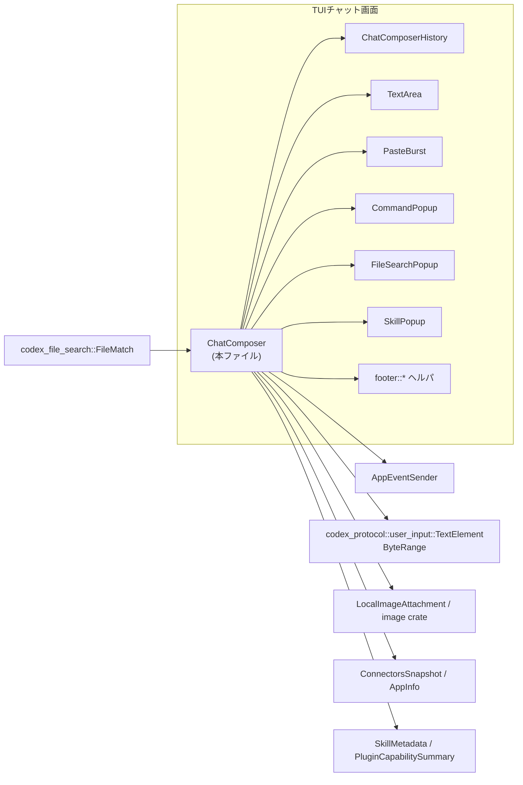
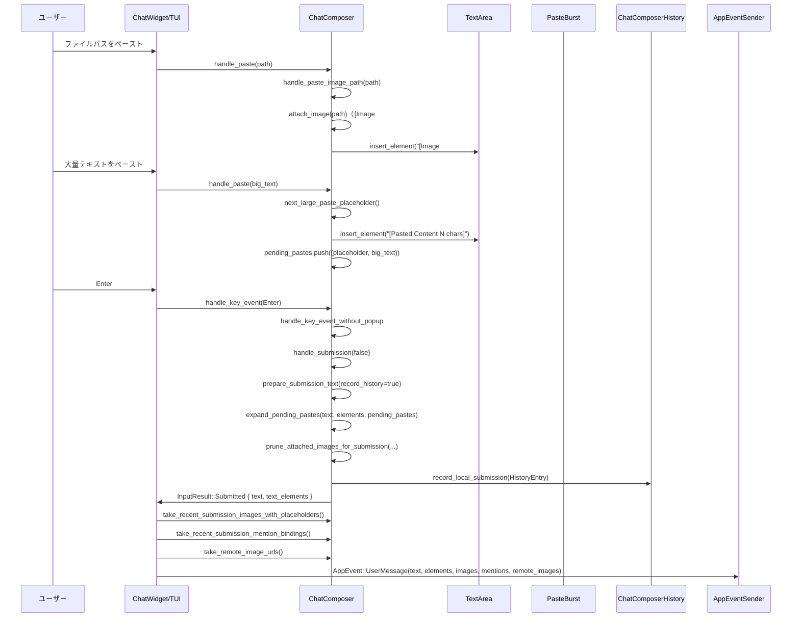

# tui/src/bottom_pane/chat_composer.rs

## 0. ざっくり一言

- チャット入力欄（下ペイン）の **状態機械** です。
- 文字入力・履歴・スラッシュコマンド・ファイル/スキル/アプリ補完ポップアップ・画像添付・ペースト検出・フッター表示を一括で管理します。

> 注: 提供されたコード断片には行番号が含まれていないため、本レポートでは正確な `Lxx-Lyy` 範囲は記載できません。

---

## 1. このモジュールの役割

### 1.1 概要

このモジュールは **チャット入力 UI のすべての状態とキー入力処理** を一か所で扱うために存在し、次の機能を提供します。

- テキスト入力バッファ（`TextArea`）の編集とカーソル制御
- スラッシュコマンド・ファイル検索・スキル/アプリメンション用ポップアップの表示とキー振り分け
- ローカル画像ファイル/リモート画像 URL の添付とプレースホルダ管理
- 非ブラケットペースト（特に Windows）のバースト検出とペースト統合
- Enter / Tab による送信・キューイング処理と、メッセージ長制限チェック
- 上下キーによる履歴ナビゲーション（ローカル & 永続）と再構成
- フッター（ショートカット、コンテキスト情報、エージェントモード）の描画状態管理

### 1.2 アーキテクチャ内での位置づけ

主な依存関係とやり取りを簡略化した図です。



- `ChatComposer` は TUI 下部の「入力部コンポーネント」であり、`ChatWidget` などの親ウィジェットからキーイベントやペーストイベントを受け取ります。
- ユーザー入力に応じて:
  - 内部の `TextArea` を編集
  - `ChatComposerHistory` を使って履歴を前後に移動
  - `PasteBurst` を使ってペーストバースト検出
  - `CommandPopup` / `FileSearchPopup` / `SkillPopup` を出したり閉じたり
  - `AppEventSender` でアプリ側へイベント（エラーメッセージ、ファイル検索開始など）を送信します。

### 1.3 設計上のポイント

- **状態機械としての一元化**
  - 「ポップアップの有無」「入力有効/無効」「タスク実行中」「エスケープヒント表示中」などの状態を `ChatComposer` がまとめて保持し、キー入力の遷移条件に使っています。
- **要素化されたテキスト**
  - `TextArea` 上の特定区間（画像プレースホルダ、大きなペーストプレースホルダ、スラッシュコマンド名、メンション）を `TextElement` として **1トークン扱い** にし、削除や移動で壊れないようにしています。
- **非ブラケットペースト対応**
  - Windows など bracketed paste が使えない環境向けに `PasteBurst` で「すごく速い Char イベント列」をペーストとみなし、まとめて `handle_paste` に渡します。
  - ASCII / 非 ASCII で検出方針を変え（IME 入力を誤検出しないため）、Enter 抑止や retro-grab（既に入力済みプレフィックスの取り戻し）を行います。
- **履歴の二層構造**
  - 永続履歴（テキストのみ）と、セッションローカル履歴（テキスト + 要素 + ローカル/リモート画像 + ペンディングペースト + メンションバインディング）を統合的に扱う `ChatComposerHistory` を利用しています。
- **安全な送信前処理**
  - 送信時に:
    - ペンディングペーストの展開
    - 余白トリムとそれに伴う `TextElement` の byte-range 再計算
    - テキスト長制限 `MAX_USER_INPUT_TEXT_CHARS` のチェック（超過時はエラーを AppEvent で通知）
    - スラッシュコマンドの解釈 & 未知コマンド/利用不能コマンドの拒否
  - を行い、送信抑止時には元のドラフトを復元します。
- **スレッドモデル**
  - `RefCell<TextAreaState>` を使うなど、明確に **単一スレッド UI コンテキスト前提** の設計です。`Send` / `Sync` を想定していません。
  - 他スレッドとのやり取りは `AppEventSender` 経由のメッセージングに限定されています。

---

## 2. 主要な機能一覧

- テキスト入力編集: `TextArea` ベースのカーソル移動・挿入・削除・マスク描画
- スラッシュコマンド処理:
  - 入力中の `/name` をコマンド候補としてポップアップ表示
  - `/name` 単独送信 (`InputResult::Command`)
  - `/name args` 送信 (`InputResult::CommandWithArgs`)
  - 無効/未知コマンドの検出とエラー表示
- 履歴ナビゲーション:
  - `ChatComposerHistory` による `↑/↓` でのローカル/永続履歴移動
  - 履歴復元時の画像・メンション・ペンディングペーストの再構成
- 画像添付:
  - ローカル画像パスのペースト/ファイル補完からの添付 (`attach_image`, `handle_paste_image_path`)
  - リモート画像 URL の表示・選択・削除（行としてレンダリング）
- ペースト処理:
  - 明示的ペーストイベント (`handle_paste`)
  - 非ブラケットペーストバースト (`PasteBurst`) の検出と `handle_paste` への統合
  - 大きなペーストのプレースホルダ化と送信時展開
- メンション (`$...`) 補完:
  - `SkillMetadata` / `PluginCapabilitySummary` / `ConnectorsSnapshot` からメンション候補生成
  - メンションを要素として挿入し、`mention_bindings` で解決先パスを保持
- フッター表示制御:
  - ショートカットオーバーレイ・Esc ヒント・終了ショートカットヒント
  - コンテキストウィンドウ使用率やステータスライン表示制御
- 入力無効モード:
  - サンドボックス準備中などで `input_enabled = false` にして編集を無効化
  - プレースホルダメッセージに切替え
- レンダリング:
  - `Renderable` 実装を通じて ratatui での描画
  - Zellij でのスタイル崩れ回避のための特殊処理

---

## 3. 公開 API と詳細解説

### 3.1 型一覧（構造体・列挙体など）

| 名前 | 種別 | 可視性 | 役割 / 用途 |
|------|------|--------|-------------|
| `InputResult` | enum | `pub` | キー入力ハンドラから呼び出し元 (`ChatWidget` 等) へ返す結果。送信・キューイング・コマンドなどを表現。 |
| `AttachedImage` | struct | `#[derive(Clone, Debug, PartialEq)]`（モジュール内のみ） | ローカル画像1枚分のプレースホルダ文字列とファイルパス。`attached_images` ベクタの要素。 |
| `ChatComposerConfig` | struct | `pub(crate)` | このコンポーザを他のボトムペインで再利用する際の機能フラグ（ポップアップ/スラッシュ/画像ペースト）。 |
| `ChatComposer` | struct | `pub(crate)` | チャット入力欄の中核。テキストバッファ・ポップアップ・履歴・ペースト・画像・フッターなどの状態を保持し、キー入力を処理する。 |
| `FooterFlash` | struct | モジュール内 | 一時的なフッターメッセージ（行+有効期限）を表現。テスト用 API で制御。 |
| `ComposerMentionBinding` | struct | モジュール内 | メンション `$name` → 解決パス `path` の内部表現。`mention_bindings: HashMap<u64, _>` に格納。 |
| `ActivePopup` | enum | モジュール内 | 現在表示中のポップアップ: なし/スラッシュコマンド/ファイル検索/スキル・アプリメンション。 |
| `FooterMode` | enum | 他モジュール | フッターの表示モード（空・ドラフトあり・Esc ヒント・ショートカットオーバーレイ・終了ヒント）。`footer` モジュール側で定義。 |
| `LocalImageAttachment` | struct | 他モジュール | ローカル画像添付を上位層へ渡すためのプレーンな型。`ChatComposer::local_images` や `take_recent_submission_images` で利用。 |

> ほかにもテスト用ヘルパや `Renderanble` 実装など多数ありますが、ここでは「外部から呼ばれる/意味を持つ」型に絞っています。

### 3.2 関数詳細（主要 API）

#### `ChatComposer::new(has_input_focus, app_event_tx, enhanced_keys_supported, placeholder_text, disable_paste_burst) -> ChatComposer`

**概要**

- 標準設定のチャットコンポーザを構築します。
- 内部的には `new_with_config(..., ChatComposerConfig::default())` を呼びます。

**引数**

| 引数名 | 型 | 説明 |
|--------|----|------|
| `has_input_focus` | `bool` | 初期状態で入力フォーカスを持っているか。フッターヒントなどに影響。 |
| `app_event_tx` | `AppEventSender` | App 全体へイベントを送るための送信チャネル。エラー/情報メッセージやファイル検索開始などに使う。 |
| `enhanced_keys_supported` | `bool` | Shift+Enter など拡張キーがサポートされているか。フッターヒント表示に影響。 |
| `placeholder_text` | `String` | 入力が空のときに表示するプレースホルダ文言。 |
| `disable_paste_burst` | `bool` | 非ブラケットペースト検出 (`PasteBurst`) を無効化するかどうか。 |

**戻り値**

- 初期化された `ChatComposer`。
- この時点でテキストは空、履歴も空、ポップアップも表示されていません。

**内部処理の流れ**

- `ChatComposerConfig::default()` を生成し、`new_with_config` を呼び出す。
- `new_with_config` 側で:
  - `textarea`, `textarea_state`, `history`, `paste_burst` など全てのフィールドを `Default`/空で初期化。
  - Zellijかどうかを `codex_terminal_detection::terminal_info()` から判定し、Zellij対策フラグを設定。
  - 最後に `set_disable_paste_burst(disable_paste_burst)` を呼んで、必要なら既存バースト状態をフラッシュ。

**Examples（使用例）**

```rust
let (tx, _rx) = tokio::sync::mpsc::unbounded_channel::<AppEvent>();
let app_event_tx = AppEventSender::new(tx);

let mut composer = ChatComposer::new(
    /*has_input_focus*/ true,
    app_event_tx,
    /*enhanced_keys_supported*/ false,
    "Ask Codex to do anything".to_string(),
    /*disable_paste_burst*/ false,
);
```

**Edge cases**

- `disable_paste_burst = true` でも、`new` 直後はバースト状態は空なので副作用はありません。
- Zellij 環境かどうかで描画スタイルが変わりますが、 API の挙動には影響しません。

**使用上の注意点**

- `ChatComposer` は `pub(crate)` なので、同クレート内でのみ `new` を呼び出せます。
- UI メインスレッドからのみ操作することが想定されています（`RefCell` を多用）。

---

#### `ChatComposer::handle_key_event(&mut self, key_event: KeyEvent) -> (InputResult, bool)`

**概要**

- メイン UI から渡される **すべてのキー入力の入り口** です。
- ポップアップの有無に応じて適切なハンドラへディスパッチし、必要に応じて送信やコマンド実行をトリガします。

**引数**

| 引数名 | 型 | 説明 |
|--------|----|------|
| `key_event` | `crossterm::event::KeyEvent` | 押下されたキー。キーコード + 修飾キー + kind (Press/Release) を含む。 |

**戻り値**

- `(InputResult, bool)` のタプル。
  - `InputResult` は送信/コマンド/何もしない等の結果。
  - `bool` は「再描画が必要かどうか」。

**内部処理の流れ**

1. `input_enabled` が `false` なら `(InputResult::None, false)` を返し、入力を全て無視。
2. `KeyEvent.kind` が `Release` の場合も、重複入力防止のため無視。
3. 現在の `active_popup` に応じて以下のいずれかを呼ぶ:
   - `handle_key_event_with_slash_popup`
   - `handle_key_event_with_file_popup`
   - `handle_key_event_with_skill_popup`
   - `handle_key_event_without_popup`
4. ハンドラからの結果を受け取ったあと、必ず `sync_popups()` を呼んで、最新のテキスト/カーソル状態にポップアップを追従させる。
5. 結果をそのまま返す。

**Examples（使用例）**

```rust
fn on_key(&mut self, key: KeyEvent) {
    let (result, needs_redraw) = self.composer.handle_key_event(key);
    if needs_redraw {
        self.request_frame();
    }
    match result {
        InputResult::Submitted { text, text_elements } => {
            // ChatWidget 側で画像やメンション情報も合わせて送信
            let images = self.composer.take_recent_submission_images_with_placeholders();
            let mentions = self.composer.take_recent_submission_mention_bindings();
            self.send_user_message(text, text_elements, images, mentions);
        }
        InputResult::Command(cmd) => {
            // スラッシュコマンドの実行。成功したら:
            self.composer.record_pending_slash_command_history();
        }
        InputResult::CommandWithArgs(cmd, args, elems) => {
            // コマンドに引数付きで渡す。
            self.dispatch_inline_command(cmd, args, elems);
            self.composer.record_pending_slash_command_history();
        }
        InputResult::Queued { .. } | InputResult::None => {}
    }
}
```

**Errors / Panics**

- パニックは、コード上は UTF-8 境界を `clamp_to_char_boundary` で明示的に調整しているため、通常のキー入力で発生しないようにしています。
- エラーは `InputResult` ではなく `AppEventSender` による `InsertHistoryCell` メッセージで伝えられます（例: 未知コマンド、メッセージ長超過）。

**Edge cases**

- `KeyEventKind::Release` は無視されるため、テストで複合キーを再現する場合は `Press` を明示して送る必要があります。
- 入力無効 (`set_input_enabled(false, ..)`) モードでは、`InputResult::None` が返され続けます。
- ポップアップが開いているときの `Enter/Tab/Up/Down/Esc` は、コンポーザ本体ではなくポップアップ専用ハンドラに処理されます。

**使用上の注意点**

- `InputResult::Command` / `CommandWithArgs` を受け取った呼び出し元は、 slash 履歴用に `record_pending_slash_command_history()` を呼ぶ責務があります（コメントにも明記）。
- 送信後に画像やメンションを取り出すには、`take_recent_submission_images*` や `take_recent_submission_mention_bindings()` を使います。

---

#### `ChatComposer::handle_paste(&mut self, pasted: String) -> bool`

**概要**

- 明示的なペーストイベント（および `PasteBurst` からのフラッシュ）を一元的に扱う関数です。
- 大きなペースト→プレースホルダ化、画像パス→画像添付、それ以外→通常挿入、という分岐を行います。

**引数**

| 引数名 | 型 | 説明 |
|--------|----|------|
| `pasted` | `String` | ペーストされたテキスト。改行やパスを含む可能性がある。 |

**戻り値**

- `bool` — 何らかの変更を行った場合は常に `true` を返します（実装上、現状 `true` 固定）。

**内部処理の流れ**

1. 改行を LF に正規化（`\r\n`・`\r` → `\n`）。
2. `chars().count()` で Unicode 文字数を計測。
3. 分岐:
   - 文字数 > `LARGE_PASTE_CHAR_THRESHOLD`:
     - `next_large_paste_placeholder` で `[Pasted Content N chars]` プレースホルダを生成。
     - `TextArea::insert_element` で要素として挿入。
     - `(placeholder, pasted)` を `pending_pastes` に push。
   - それ以外かつ `image_paste_enabled()` かつ `handle_paste_image_path` が `true`:
     - 画像ファイルとして添付され、`TextArea` には `" "`（スペース）を挿入。
   - 上記に当てはまらない:
     - 単に `insert_str(&pasted)` で通常テキストとして挿入。
4. `paste_burst.clear_after_explicit_paste()` でバースト検出状態をリセット。
5. `sync_popups()` でポップアップ状態を更新。

**Examples（使用例）**

```rust
// 明示的ペーストイベントを受け取ったとき
fn on_paste(&mut self, content: String) {
    let needs_redraw = self.composer.handle_paste(content);
    if needs_redraw {
        self.request_frame();
    }
}
```

**Errors / Panics**

- `image::image_dimensions` 内部でのエラーは `handle_paste_image_path` で `false` に変換され、通常テキストとして扱われるだけです（`tracing::trace!` にログ）。
- 行数やプレースホルダ処理でパニックしないよう、UTF-8 バイト境界は他メソッドで調整されています。

**Edge cases**

- しきい値を少し超える程度の長さでも必ずプレースホルダ化されます。
- ペースト後にユーザーがプレースホルダを削除すると、`pending_pastes` からも対応エントリが削除され、送信時に誤って展開されないようにしています（`reconcile_deleted_elements` 参照）。
- CRLF 改行を含むテキストは `\n` に正規化され、送信時もその形で扱われます（テストで確認）。

**使用上の注意点**

- 大規模ペーストを許容しつつ TUI の表示を壊さないための設計なので、「見えているプレースホルダ」と「実際に送信されるテキスト」を混同しないようにしてください。実際の送信テキストは `prepare_submission_text` や `current_text_with_pending` で確認します。

---

#### `ChatComposer::prepare_submission_text(&mut self, record_history: bool) -> Option<(String, Vec<TextElement>)>`

**概要**

- **送信・キューイング前の標準的な正規化処理** を行います。
- ペンディングペースト展開、トリミング、長さ制限チェック、画像添付の pruning、履歴登録などを担い、送信すべきか（`Option`）も判断します。

**引数**

| 引数名 | 型 | 説明 |
|--------|----|------|
| `record_history` | `bool` | 成功時にローカル履歴 (`ChatComposerHistory`) に登録するかどうか。 |

**戻り値**

- `Some((text, elements))`:
  - `text`: トリミング + ペンディングペースト展開後の送信用テキスト。
  - `elements`: 上記 `text` に対応する `TextElement` 群（画像プレースホルダ等）。
- `None`:
  - 送信を抑止すべき状況（空入力・超過・未知コマンドなど）。呼び出し元はドラフト復元などを行う必要があります。

**内部処理の主なステップ**

1. 現在の入力状態をスナップショット:
   - `original_input`, `original_text_elements`, `original_mention_bindings`,
     `original_local_image_paths`, `original_pending_pastes` を保存。
2. `textarea.set_text_clearing_elements("")` で一旦表示をクリア（kill バッファなどは保持）。
3. `pending_pastes` があれば `expand_pending_pastes` でプレースホルダを実データに展開し、新しい `text` + `text_elements` を構築。
4. `text.trim()` で空白をトリムし、`trim_text_elements` で byte-range をトリム後の文字列に合わせて調整。
5. スラッシュコマンド判定:
   - `parse_slash_name` で `/name rest` を抽出。
   - 未知コマンドで、かつ「先頭スペースなし」「`name` に `/` を含まない」場合:
     - ユーザーにエラーメッセージ (`AppEvent::InsertHistoryCell`) を送信。
     - 元のドラフト状態を `set_text_content_with_mention_bindings` + `pending_pastes` 復元で戻し、`None` を返す。
6. 文字数制限チェック:
   - `text.chars().count()` > `MAX_USER_INPUT_TEXT_CHARS` の場合:
     - エラーイベントを送信 (`user_input_too_large_message`)。
     - 元のドラフトを復元。
     - `None`。
7. `prune_attached_images_for_submission(&text, &text_elements)` で、プレースホルダとして残っていない添付画像を削除。
8. テキスト・添付画像・リモート画像すべて空なら `None` を返す（空送信抑止）。
9. `record_history` が true で、何かコンテンツがある場合:
   - `HistoryEntry` を組み立て、`history.record_local_submission(..)` でローカル履歴に保存。
10. `pending_pastes.clear()` して完了。

**Errors / Panics**

- 検証エラーはすべて `AppEvent::InsertHistoryCell` として報告されます:
  - 未知スラッシュコマンド
  - 入力文字数超過
- 内部でパニックするような `unwrap` は見当たらず、UTF-8 境界も `trim_text_elements` 内で安全に計算されています。

**Edge cases**

- 先頭にスペースがある `/ path` のような入力は、**スラッシュコマンド扱いせず普通のテキスト** として送信されます（テストあり）。
- テキストが空でも、添付画像やリモート画像があれば `Some` が返ります（画像のみ送信）。
- スラッシュコマンド拒否時（未知 or 利用不可）は、元のドラフト状態（カーソル位置含む）が復元されます。

**使用上の注意点**

- 通常は直接呼ばず、`handle_submission` / `handle_submission_with_time` 経由で使用されます。
- インラインスラッシュコマンドの引数だけを別途正規化したい場合は、`prepare_inline_args_submission` を使うほうが安全です。

---

#### `ChatComposer::handle_input_basic(&mut self, input: KeyEvent) -> (InputResult, bool)`

**概要**

- 「ポップアップ以外のキー入力が `TextArea` をどう変えるか」を司る **低レベル入力ハンドラ** です。
- ペーストバースト検出 (`PasteBurst`) と通常タイプ入力の橋渡しを行います。

**引数・戻り値**

- `KeyEvent` → `(InputResult::None, needs_redraw)` がほとんどで、送信やコマンドは返しません。

**内部処理の要点**

1. `KeyEventKind` が Press/Repeat 以外なら無視。
2. 現在時間 `Instant::now()` を取り、`handle_input_basic_with_time` を呼ぶ。
3. `handle_input_basic_with_time` では:
   - まず `handle_paste_burst_flush(now)` を呼び、フラッシュすべきバーストがあれば先に処理。
   - ESC 以外のキーなら `footer_mode` をアクティビティ基準にリセット。
   - `Enter` かつバースト中 → `append_newline_if_active` によりバッファに改行を追加し、送信抑止。
   - `KeyCode::Char(ch)` & 修飾なし & `!disable_paste_burst`:
     - ASCII かどうかで分岐。
     - ASCII:
       - `paste_burst.on_plain_char` の `CharDecision` に応じて:
         - バッファに追加 (BufferAppend/BeginBuffer/BeginBufferFromPending)
         - 一時保留 (RetainFirstChar)
         - retro-grab で既入力文字をまとめてバーストに取り込む。
     - 非 ASCII:
       - `handle_non_ascii_char` で、バースト持ち越しを避けつつ IME 入力とペーストを区別。
   - 非 Char/Enter の入力の前には `flush_before_modified_input()` でバーストバッファをフラッシュしてから `textarea.input(input)` を適用。
   - 入力前に取得した要素一覧 (`element_payloads`) と入力後の一覧を比較し、削除されたプレースホルダに対応する `pending_pastes` や画像添付を削除 (`reconcile_deleted_elements`)。
   - 再度バーストのタイミング窓を `clear_window_after_non_char` などで更新。

**Edge cases**

- 非 ASCII の連続入力（IME や中国語/日本語ペーストなど）でも、ペーストとタイプを適切に区別するよう調整されています（多数のテストあり）。
- バースト中の Enter は、「送信」ではなく「ペーストバッファ内の改行」として扱われます。

**使用上の注意点**

- 通常直接呼ぶ必要はなく、`handle_key_event` または `handle_key_event_with_*_popup` が内部から利用します。
- 端末のペースト機構を独自に処理している場合は、`disable_paste_burst` を有効にしてこのロジックを避けられます。

---

#### `ChatComposer::sync_popups(&mut self)`

**概要**

- 現在のテキスト・カーソル位置・履歴状態・メンション有無に基づき、**どのポップアップを出すか/更新するか/閉じるか** を決める関数です。
- ほぼすべての編集・入力後に呼ばれます。

**内部処理の主な流れ**

1. `sync_slash_command_elements()` で一行目の `/command` 要素を最新のテキストに合わせて再構成。
2. `!popups_enabled()` の場合は `active_popup = None` で終了。
3. `file_token = current_at_token(&textarea)` で `@` ファイルトークンを検出。
4. `history.should_handle_navigation(text, cursor)` が true（履歴ブラウズ中）なら:
   - ファイル検索の pending クエリをクリアし、 `StartFileSearch("")` を送信。
   - すべてのポップアップを閉じて return。
5. `$` メンショントークンを `current_mention_token()` で検出。
6. スラッシュコマンドポップアップ:
   - スラッシュ有効 & `@`/`$` トークンがない & `allow_command_popup` のとき `sync_command_popup(true)` へ。
   - そうでなければ slash popup を閉じる。
7. `ActivePopup::Command` が生きている場合:
   - ファイル検索クエリをクリアし、フラグをリセット後 return（他ポップアップを出さない）。
8. メンションがあれば `sync_mention_popup(token)` を呼び、なければ `dismissed_mention_popup_token = None`。
9. ファイルトークンがあれば `sync_file_search_popup(token)` を呼ぶ。
10. どちらもない場合:
    - 現在のファイル検索クエリをクリア & `StartFileSearch("")` を送信。
    - file/skill ポップアップを閉じる。

**Edge cases**

- 入力履歴を `↑/↓` で移動している最中は、ポップアップを一切出さないようになっています（履歴移動が途切れないようにするため）。
- ユーザーが特定のトークンでポップアップを明示的に閉じた場合、そのトークンに対しては同一テキストの間は再表示しないよう `dismissed_*_popup_token` で記録しています。

**使用上の注意点**

- 新しい種類のポップアップを追加する場合は、`ActivePopup` enum とこの関数内の同期ロジックの両方に変更が必要になります。
- `sync_popups` はほぼ全ての入力経路から呼ばれるため、重い処理を入れるとキー入力全体のレスポンスに影響します。

---

#### `ChatComposer::flush_paste_burst_if_due(&mut self) -> bool`

**概要**

- UI の **タイマティック（定期）処理** から呼び出し、ペーストバーストのフラッシュが必要になったタイミングでペースト/タイプを確定させる関数です。
- `PasteBurst::flush_if_due` の結果を `handle_paste` または通常の文字挿入に変換します。

**戻り値**

- 何かフラッシュ/挿入を行った場合は `true`。

**内部処理**

- `handle_paste_burst_flush(Instant::now())` を呼び、その戻り値をそのまま返します。
  - `FlushResult::Paste(pasted)` → `handle_paste(pasted)`（大ペーストのプレースホルダ処理も適用）。
  - `FlushResult::Typed(ch)` → 文字1つをそのまま挿入。
  - `FlushResult::None` → 何もしない。

**Examples（使用例）**

```rust
// TUI のメインループなどで一定間隔ごとに
fn on_tick(&mut self) {
    if self.composer.flush_paste_burst_if_due() {
        self.request_frame();
    }
}
```

**Edge cases**

- 1文字だけの高速 ASCII 入力でも、一定時間バーストが続かなければ「通常タイプ」としてここで反映されます（テスト `pending_first_ascii_char_flushes_as_typed` 参照）。
- `disable_paste_burst` が true の環境では、バーストが起きないためこの関数は常に `false` を返します。

---

### 3.3 その他の関数（グループ概要）

関数数が非常に多いため、代表的なグループごとに役割をまとめます。

| グループ | 主な関数例 | 役割（1 行） |
|----------|------------|--------------|
| 履歴関連 | `set_history_metadata`, `on_history_entry_response`, `apply_history_entry`, `clear_for_ctrl_c` | 永続/ローカル履歴のメタデータ設定・エントリ応答適用・`Ctrl+C` でのドラフト退避と履歴登録。 |
| 画像添付関連 | `attach_image`, `local_images`, `take_recent_submission_images*`, `relabel_attached_images_and_update_placeholders`, `set_remote_image_urls`, `take_remote_image_urls`, `handle_remote_image_selection_key` | ローカル/リモート画像の添付・番号付け・削除・送信後の取り出し。 |
| ペースト関連 | `handle_paste_image_path`, `set_disable_paste_burst`, `expand_pending_pastes`, `current_text_with_pending`, `pending_pastes`, `set_pending_pastes` | 画像パス検出・ペーストバーストON/OFF・プレースホルダ展開・ペンディングペースト管理。 |
| スラッシュコマンド関連 | `try_dispatch_bare_slash_command`, `try_dispatch_slash_command_with_args`, `prepare_inline_args_submission`, `reject_slash_command_if_unavailable`, `stage_*_slash_command_history*`, `slash_command_args_elements`, `sync_slash_command_elements`, `slash_command_element_range`, `looks_like_slash_prefix` | `/name` の検出とコマンド実行、履歴への記録、コマンド名を要素として強調、引数部分の `TextElement` 再マッピング。 |
| ファイル検索ポップアップ関連 | `on_file_search_result`, `sync_file_search_popup`, `insert_selected_path`, `is_image_path` | `@token` 下でのファイル補完ポップアップ同期と選択結果挿入（パス or 画像添付）。 |
| メンションポップアップ関連 | `current_mention_token`, `sync_mention_popup`, `mention_items`, `insert_selected_mention`, `mention_name_from_insert_text`, `current_mention_elements`, `snapshot_mention_bindings`, `bind_mentions_from_snapshot`, `take_mention_bindings`, `take_recent_submission_mention_bindings` | `$` メンショントークンの検出、スキル/プラグイン/アプリからの候補生成、メンションの挿入と `$name -> path` バインディング管理。 |
| フッター・状態表示関連 | `show_quit_shortcut_hint`, `clear_quit_shortcut_hint`, `quit_shortcut_hint_visible`, `set_task_running`, `set_context_window`, `set_esc_backtrack_hint`, `set_status_line`, `set_status_line_enabled`, `set_active_agent_label`, `footer_props`, `footer_mode`, `custom_footer_height`, `handle_shortcut_overlay_key` | 終了ショートカットの2段階ヒント、コンテキストウィンドウ表示、Esc バックトラックヒント、ショートカットオーバーレイの切り替え。 |
| レンダリング関連 | `layout_areas`, `cursor_pos` (impl Renderable), `desired_height`, `render`, `render_with_mask`, `render_textarea`, `remote_images_lines`, `set_has_focus` | コンポーザ・リモート画像列・ポップアップ・フッターを含むレイアウト計算と描画。 |
| 入力制御関連 | `set_input_enabled`, `is_empty`, `cursor_pos (pub)`, `move_cursor_to_end`, `set_placeholder_text` | 一時的な入力無効化、空判定、カーソル操作、プレースホルダ変更。 |
| OS別機能 | `next_id`, `update_recording_meter_in_place`, `insert_recording_meter_placeholder`, `remove_recording_meter_placeholder` (非 Linux) | 音声録音メーター用の特殊要素 (named element) の挿入/更新/削除。 |

---

## 4. データフロー

### 4.1 代表的なシナリオ: 画像と大きなペーストを含むメッセージ送信

1. ユーザーがファイルパスをペースト → `handle_paste` 経由で `handle_paste_image_path` が画像を認識し、`attach_image` で `[Image #M+1]` 要素を挿入。
2. 続いて大きなテキストをペースト → `handle_paste` がプレースホルダ `[Pasted Content N chars]` を挿入し、`pending_pastes` に (`placeholder`, `actual_text`) を保存。
3. ユーザーが `Enter` を押す → `handle_key_event` → `handle_key_event_without_popup` → `handle_submission`。
4. `handle_submission` 内でまずスラッシュコマンドなどを消化した後、`prepare_submission_text` を呼ぶ。
5. `prepare_submission_text` が:
   - `expand_pending_pastes` でプレースホルダを実データに展開し、`TextElement` の byte-range を再計算。
   - トリミング・長さ制限チェックを行い、画像プレースホルダに対応しない添付画像を削除。
   - ローカル履歴に `HistoryEntry` を記録。
6. `InputResult::Submitted { text, text_elements }` が返る。
7. 上位の `ChatWidget` 等が:
   - `take_recent_submission_images_with_placeholders()` でローカル画像添付を取り出す。
   - `take_recent_submission_mention_bindings()` でメンション解決情報を取り出す。
   - `take_remote_image_urls()` でリモート画像も取り出す。

これをシーケンス図で表すと以下のようになります。



---

## 5. 使い方（How to Use）

### 5.1 基本的な使用方法

典型的な `ChatWidget` 側からの利用フロー（簡略版）です。

```rust
use crate::bottom_pane::chat_composer::{ChatComposer, InputResult};
use crate::app_event::{AppEvent, AppEventSender};
use crossterm::event::KeyEvent;

struct ChatWidget {
    composer: ChatComposer,
    app_tx: AppEventSender,
}

impl ChatWidget {
    fn new(app_tx: AppEventSender) -> Self {
        let composer = ChatComposer::new(
            /*has_input_focus*/ true,
            app_tx.clone(),
            /*enhanced_keys_supported*/ false,
            "Ask Codex to do anything".to_string(),
            /*disable_paste_burst*/ false,
        );
        Self { composer, app_tx }
    }

    fn on_key(&mut self, key: KeyEvent) {
        let (result, needs_redraw) = self.composer.handle_key_event(key);
        if needs_redraw {
            self.request_frame();
        }

        match result {
            InputResult::Submitted { text, text_elements } => {
                let images = self.composer.take_recent_submission_images_with_placeholders();
                let mentions = self.composer.take_recent_submission_mention_bindings();
                let remote_images = self.composer.take_remote_image_urls();

                self.app_tx.send(AppEvent::UserMessage {
                    text,
                    text_elements,
                    images,
                    mentions,
                    remote_images,
                });
            }
            InputResult::Queued { text, text_elements } => {
                // タスク実行中のキューイング。上位でキュー管理する。
                self.queue_message(text, text_elements);
            }
            InputResult::Command(cmd) => {
                // スラッシュコマンド実行
                self.dispatch_command(cmd);
                self.composer.record_pending_slash_command_history();
            }
            InputResult::CommandWithArgs(cmd, args, elems) => {
                self.dispatch_inline_command(cmd, args, elems);
                self.composer.record_pending_slash_command_history();
            }
            InputResult::None => {}
        }
    }

    fn on_paste(&mut self, content: String) {
        if self.composer.handle_paste(content) {
            self.request_frame();
        }
    }

    fn on_tick(&mut self) {
        if self.composer.flush_paste_burst_if_due() {
            self.request_frame();
        }
    }

    fn draw(&mut self, f: &mut ratatui::Frame) {
        let area = f.size();
        let mut buf = ratatui::buffer::Buffer::empty(area);
        self.composer.render(area, &mut buf);
        // ... bufferを実際のフレームに適用 ...
    }
}
```

### 5.2 よくある使用パターン

- **plain text 入力として再利用したい場合**
  - スラッシュコマンド・ポップアップ・画像ペーストを無効化した構成で作るには `ChatComposerConfig::plain_text()` と `new_with_config` を使います（同クレート内）。

- **入力一時無効化**
  - サンドボックス起動中など:

    ```rust
    composer.set_input_enabled(false, Some("Sandbox is starting...".to_string()));
    ```

  - 完了後に:

    ```rust
    composer.set_input_enabled(true, None);
    ```

- **リモート画像を履歴から再表示**
  - 応答から URL 配列を得たら:

    ```rust
    composer.set_remote_image_urls(urls);
    ```

  - 送信後に消費する場合:

    ```rust
    let urls = composer.take_remote_image_urls();
    ```

- **外部エディタで編集した内容を反映**
  - 一度エディタに渡したドラフトが編集されて戻ってきた場合:

    ```rust
    composer.apply_external_edit(edited_text);
    ```

### 5.3 よくある間違い

```rust
// 誤り例: コマンド結果を無視してドラフト状態を壊す
let (result, _) = composer.handle_key_event(key);
// result が CommandWithArgs だったのに pending history を記録しない
// → Up で正しいコマンドが再現されない可能性

// 正しい例:
if let InputResult::Command(cmd) = result {
    dispatch_cmd(cmd);
    composer.record_pending_slash_command_history();
}
```

```rust
// 誤り例: 送信後に画像添付を取り出さない
if let InputResult::Submitted { text, .. } = result {
    send_to_backend(text, Vec::new(), Vec::new());
    // composer 内に添付が残り続ける可能性

// 正しい例:
if let InputResult::Submitted { text, text_elements } = result {
    let imgs = composer.take_recent_submission_images_with_placeholders();
    send_to_backend(text, text_elements, imgs);
}
```

### 5.4 使用上の注意点（まとめ）

- **前提条件**
  - `ChatComposer` は単一スレッド UI からのみ操作する前提です（`RefCell` による内部可変があるため）。
  - `handle_key_event` と `handle_paste` を組み合わせて使い、実キー入力のペーストと明示的ペーストイベントが二重にならないよう設計する必要があります。
- **禁止事項 / 気を付けたい点**
  - `ChatComposer` を複数スレッドで共有し、同時に `&mut self` メソッドを呼ぶこと。
  - 送信後に `take_*` 系メソッドを呼ばず、添付やメンション情報を取りこぼすこと。
  - `disable_paste_burst` を途中で ON/OFF するときに `set_disable_paste_burst` 以外の手段で `PasteBurst` をいじること（既に同期処理が含まれています）。
- **エラー条件**
  - メッセージ文字数が `MAX_USER_INPUT_TEXT_CHARS` を超えると送信は抑止され、エラー行が履歴に挿入されます。
  - 未知スラッシュコマンド（`/unknown`）やタスク中に利用不可のコマンドは、送信抑止 + エラーヒストリセル挿入となります。
- **パフォーマンス**
  - ペンディングペースト展開・要素レンジ再計算は O(テキスト長 + 要素数) 程度です。非常に大きなドラフト（数千文字以上）では送信時に多少のコストがかかります。
  - ポップアップ同期 (`sync_popups`) はほぼ全入力後に呼ばれるため、ここに重い処理を追加する場合は特に注意が必要です。

---

## 6. 変更の仕方（How to Modify）

### 6.1 新しい機能を追加する場合

**例: 新しいスラッシュコマンド `/foo` を追加**

1. `super::slash_commands` モジュールに新しい `SlashCommand::Foo` を追加し、`find_builtin_command` / `has_builtin_prefix` に対応するエントリを追加します。
2. 必要なら `BuiltinCommandFlags` に `foo_enabled` のようなフラグを足し、`ChatComposer::builtin_command_flags` にも反映します。
3. コマンド実行側（`ChatWidget` など）で `InputResult::Command(SlashCommand::Foo)` に対する処理を追加します。
4. 必要であればテストモジュールに `/foo` を入力するスナップショットテストとロジックテストを追加します。

**例: 新しいメンション種別を追加**

1. 新しいメタデータ型（例: `ProjectMetadata`）を取得できるようにし、`mention_items()` 内でそれを iterate して `MentionItem` を組み立てます。
2. `$` prefix の解析は `current_prefixed_token` / `current_mention_token` が共通で使っているので、既存 `$skill` や `$plugin` と共存します。
3. 必要なら `category_tag` に `[Project]` などを付けて表示上区別します。

### 6.2 既存の機能を変更する場合

- **影響範囲の確認方法**
  - 該当関数を `rg` / `grep` 等で検索し、テストモジュール内の呼び出しを含めてすべての使用箇所を確認します。
  - 特に `prepare_submission_text`, `handle_input_basic`, `sync_popups` は多くの挙動の中心にあるため、ここの変更は多数のテストに影響します。
- **注意すべき契約**
  - `InputResult` の各バリアントは明確な契約を持っています。例:
    - `Command` / `CommandWithArgs` はテキストエリアをクリアした状態で返す。
    - `Submitted` / `Queued` は `textarea` をクリアし、画像添付は内部に残したまま `take_*` で回収させる。
  - `TextElement.byte_range` は常に現在のテキストに対して有効なバイト範囲でなければなりません。
  - ペンディングペーストが `pending_pastes` と `TextArea` の要素リストで矛盾しないよう、編集系関数で `reconcile_deleted_elements` を呼んでいます。
- **テスト・使用箇所の再確認**
  - 本ファイル末尾のテストモジュールは非常に網羅的で、多数の挙動（ペーストバースト、画像番号付け、履歴移動、スラッシュコマンド、メンション、フッター表示など）を検証しています。
  - 挙動を変えた場合は、該当テストを更新するか追加することで仕様を明文化するのが望ましいです。

---

## 7. 関連ファイル

| パス | 役割 / 関係 |
|------|------------|
| `tui/src/bottom_pane/chat_composer_history.rs` | `ChatComposerHistory` の実装。永続履歴メタデータとローカル履歴のマージ・ナビゲーションを提供し、本モジュールから呼び出されます。 |
| `tui/src/bottom_pane/paste_burst.rs` | `PasteBurst` と `FlushResult`, `CharDecision` の実装。非ブラケットペーストの検出状態機械。 |
| `tui/src/bottom_pane/command_popup.rs` | スラッシュコマンド補完ポップアップ (`CommandPopup`, `CommandItem`, `CommandPopupFlags`) の描画と選択ロジック。 |
| `tui/src/bottom_pane/file_search_popup.rs` | ファイル検索ポップアップ (`FileSearchPopup`) の UI 実装。`@token` 入力と `AppEvent::StartFileSearch` の結果を結び付けます。 |
| `tui/src/bottom_pane/skill_popup.rs` | スキル/プラグイン/アプリメンションポップアップ (`SkillPopup`, `MentionItem`) の UI 実装。 |
| `tui/src/bottom_pane/footer.rs` | `FooterMode`, `FooterProps` および各種フッター描画ヘルパ関数（`render_footer_from_props` 等）。`ChatComposer` のフッター状態計算に利用。 |
| `tui/src/bottom_pane/textarea.rs` | `TextArea`, `TextAreaState` の実装。テキストバッファ・カーソル位置・`TextElement` 管理・描画を提供。 |
| `tui/src/bottom_pane/prompt_args.rs` | `parse_slash_name` 関数。`/command args` のパースに使われます。 |
| `tui/src/bottom_pane/clipboard_paste.rs` | `normalize_pasted_path`, `pasted_image_format`, `is_probably_wsl` など。ペーストされたパスからローカル画像添付を判断するのに使用。 |
| `codex_protocol::user_input` | `TextElement`, `ByteRange`, `MAX_USER_INPUT_TEXT_CHARS` 等のプロトコル定義。送信メッセージの構造を規定。 |
| `tui/src/app_event.rs`, `tui/src/app_event_sender.rs` | `AppEvent`, `AppEventSender` の定義。エラー表示やファイル検索など UI 外の処理を通知するために利用。 |
| `legacy_core::skills::model::SkillMetadata`, `legacy_core::plugins::PluginCapabilitySummary`, `codex_chatgpt::connectors::AppInfo` | メンション候補 (`$skill`, `$plugin`, `$app`) のデータソース。`mention_items()` から参照。 |

---

以上が `ChatComposer` モジュールの構造・挙動・利用方法の要点です。  
さらに特定の関数や挙動について詳細が必要であれば、その部分に絞って補足説明を出すことができます。
