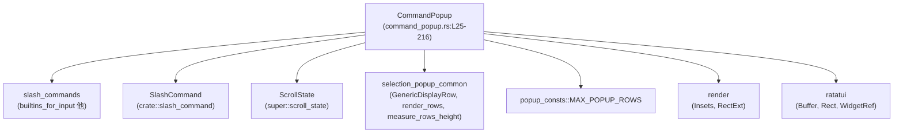
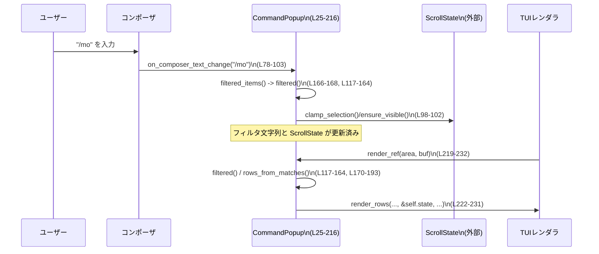

# tui/src/bottom_pane/command_popup.rs

## 0. ざっくり一言

- スラッシュコマンド (`/model` など) のポップアップ一覧を管理し、入力中のテキストから候補を絞り込み、スクロール状態とともに ratatui で描画するモジュールです。  
  根拠: `CommandPopup` とそのメソッド定義 `command_popup.rs:L25-29, L58-216`, `WidgetRef` 実装 `L219-233`

---

## 1. このモジュールの役割

### 1.1 概要

- このモジュールは、**コンポーザ（入力欄）のテキスト**からスラッシュコマンド候補を計算し、**スクロール・選択状態**を管理しつつ、ratatui 上にポップアップとして描画する役割を持ちます。  
  根拠: `on_composer_text_change` でのフィルタ更新 `L78-103` と `filtered`／`filtered_items` `L117-168`, `move_up` / `move_down` `L195-208`, `render_ref` `L219-232`

### 1.2 アーキテクチャ内での位置づけ

- 依存関係の概要:

  - `slash_commands::builtins_for_input` から、利用可能なビルトインコマンド一覧を取得します。  
    根拠: `CommandPopup::new` `L59-66`
  - `ScrollState` にスクロールと選択インデックスを委譲します。  
    根拠: フィールド `state: ScrollState` `L28`, 利用箇所 `L98-103, L195-207`
  - `selection_popup_common::{GenericDisplayRow, render_rows}` を使って、一覧の行データ生成と描画を行います。  
    根拠: `rows_from_matches` `L170-193`, `calculate_required_height` `L107-112`, `render_ref` `L219-232`
  - `popup_consts::MAX_POPUP_ROWS` で最大表示行数を制御します。  
    根拠: `calculate_required_height` 引数 `L111`, `move_up` / `move_down` `L199, L207`, `render_ref` `L229`
  - `render::{Insets, RectExt}` で描画領域のインセット（余白）を計算します。  
    根拠: `area.inset(Insets::tlbr(...))` `L223-225`
  - ratatui の `WidgetRef` を実装し、TUI フレームワークから描画されます。  
    根拠: `impl WidgetRef for CommandPopup` `L219-233`



### 1.3 設計上のポイント

- **状態管理の分離**: スクロール・選択は `ScrollState` に委譲し、`CommandPopup` はコマンド候補の計算と描画に集中しています。  
  根拠: フィールド `state: ScrollState` `L28`, 利用箇所 `L98-103, L195-207, L221-228`
- **表示ロジックとフィルタロジックの分離**: 候補のマッチングは `filtered`、描画用行データへの変換は `rows_from_matches` に分けられています。  
  根拠: `filtered` `L117-164`, `rows_from_matches` `L170-193`
- **機能フラグによるコマンド制御**: `CommandPopupFlags` から `BuiltinCommandFlags` へ変換し、利用可能なコマンドを外部モジュール側で制御します。  
  根拠: `CommandPopupFlags` `L32-40`, `impl From<CommandPopupFlags>` `L43-55`, `CommandPopup::new` `L59-66`
- **エイリアス非表示ロジック**: デフォルト表示ではエイリアスコマンドを隠し、プレフィックス検索時には表示することで、リストの重複を避けつつ検索性を維持しています。  
  根拠: `ALIAS_COMMANDS` `L17`, `filtered` の `filter.is_empty()` 分岐 `L120-127`, テスト `quit_hidden_in_empty_filter_but_shown_for_prefix` `L317-327`
- **安全なエラーハンドリング**: パース処理には `unwrap_or` 等のフォールバックを使っており、パニックを起こさない構造になっています（`Result` や `panic!` は使用なし）。  
  根拠: `unwrap_or("")` `L79, L86`, `clear()` `L95`, 他に `unwrap` や `panic!` を使用していないこと

---

## 2. 主要な機能一覧

- スラッシュコマンド一覧の構築: フラグに基づいたビルトインコマンドの取得と、デバッグ・特定コマンドの除外。  
  根拠: `CommandPopup::new` `L59-72`
- コンポーザのテキストからのフィルタ更新: `/` で始まる1行目からコマンドトークンを抽出し、候補リストを更新。  
  根拠: `on_composer_text_change` `L78-103`
- コマンド候補のマッチング: 完全一致とプレフィックス一致を区別し、表示順を保ったまま件数とハイライトインデックスを計算。  
  根拠: `filtered` `L117-164`
- 描画用行データの生成: `/` 付きのコマンド名と説明から `GenericDisplayRow` を構築。  
  根拠: `rows_from_matches` `L170-193`
- ポップアップ高さの計算: 表示行とラップされた説明に基づく必要高さの算出。  
  根拠: `calculate_required_height` `L107-112`
- カーソル移動とスクロール: 候補数に応じて上下移動とスクロール位置を更新。  
  根拠: `move_up` `L195-200`, `move_down` `L203-207`
- 選択中コマンドの取得: 現在の選択インデックスから `CommandItem` を取得。  
  根拠: `selected_item` `L211-216`
- ratatui への描画: 行データとスクロール状態を使ってポップアップを描画。  
  根拠: `render_ref` `L219-232`

---

## 3. 公開 API と詳細解説

### 3.1 型一覧（構造体・列挙体など）

| 名前 | 種別 | 役割 / 用途 | 定義位置 |
|------|------|-------------|----------|
| `CommandItem` | enum | ポップアップで選択可能な項目。現在はビルトインのスラッシュコマンドのみを保持します。 | `command_popup.rs:L21-23` |
| `CommandPopup` | 構造体 | コマンドフィルタ文字列・ビルトインコマンド一覧・スクロール状態を保持し、フィルタリングと描画を行うメインコンポーネントです。 | `command_popup.rs:L25-29` |
| `CommandPopupFlags` | 構造体 | どの機能（コラボレーションモード等）が利用可能かを表すブールフラグ群です。`slash_commands` への入力に変換されます。 | `command_popup.rs:L31-40` |

※ 補助定数

- `ALIAS_COMMANDS: &[SlashCommand]`: デフォルト表示から除外するエイリアスコマンド（`Quit`, `Approvals`）の一覧。  
  根拠: `command_popup.rs:L14-17`

---

### 3.2 関数詳細（主要 7 件）

#### `CommandPopup::new(flags: CommandPopupFlags) -> CommandPopup`  

`command_popup.rs:L59-72`

**概要**

- 利用可能なビルトインコマンド一覧を、与えられた機能フラグに基づいて取得し、デバッグコマンドと `Apps` コマンドを除外したうえで `CommandPopup` を初期化します。

**引数**

| 引数名 | 型 | 説明 |
|--------|----|------|
| `flags` | `CommandPopupFlags` | コラボレーションモードやプラグイン等の有効/無効設定。`BuiltinCommandFlags` に変換され、利用可能なスラッシュコマンドを決定します。 |

**戻り値**

- `CommandPopup`: 空のフィルタ文字列、フィルタ済みのビルトインコマンド一覧、初期化されたスクロール状態を持つインスタンス。

**内部処理の流れ**

1. `flags` を `slash_commands::BuiltinCommandFlags` に変換する。  
   根拠: `flags.into()` 呼び出し `L62`, `impl From<CommandPopupFlags>` `L43-55`
2. `slash_commands::builtins_for_input(...)` を呼び出して `(name, SlashCommand)` のベクタを取得する。  
   根拠: `L61-62`
3. `into_iter()` し、`name.starts_with("debug")` な要素を除外する。  
   根拠: `L63-64`
4. `SlashCommand::Apps` に対応する要素を除外する。  
   根拠: `L65-66`
5. 残りをベクタ `builtins` に収集し、`command_filter` を空文字列、`state` を `ScrollState::new()` で初期化した `CommandPopup` を返す。  
   根拠: `L67-71`

**Examples（使用例）**

```rust
use tui::bottom_pane::command_popup::{CommandPopup, CommandPopupFlags};

// 機能フラグを指定してポップアップを初期化する例                // CommandPopup インスタンスの生成
let flags = CommandPopupFlags {
    collaboration_modes_enabled: true,                          // コラボレーション機能を有効
    connectors_enabled: false,                                  // コネクタ機能は無効
    plugins_command_enabled: false,
    fast_command_enabled: false,
    personality_command_enabled: true,
    realtime_conversation_enabled: false,
    audio_device_selection_enabled: false,
    windows_degraded_sandbox_active: false,
};

let mut popup = CommandPopup::new(flags);                       // 利用可能なコマンド一覧を含んだポップアップ
```

**Errors / Panics**

- この関数は `Result` を返さず、内部でも `unwrap` を使用していないため、通常の使用でパニックを起こす箇所はありません。  
  根拠: `L59-72` 内に `unwrap` や `panic!` が存在しないこと

**Edge cases（エッジケース）**

- `slash_commands::builtins_for_input` が空を返した場合、`builtins` は空ベクタとなり、ポップアップに表示するコマンドがなくなります。以降のメソッドは `len == 0` を前提に安全に動作するよう実装されています。  
  根拠: `filtered_items` や `move_up` が `.len()` のみを使いインデックス直接アクセスをしない `L166-168, L195-200`

**使用上の注意点**

- コマンドの有効/無効の基本的な判定は `slash_commands::builtins_for_input` 側で行われます。この関数で除外しているのは「デバッグ系」と `Apps` コマンドのみです。  
  根拠: `L63-66`
- コラボレーションモードやパーソナリティ機能など、特定機能の有効化/無効化は `CommandPopupFlags` → `BuiltinCommandFlags` の変換に依存します。変更時は `impl From<CommandPopupFlags>` も合わせて確認する必要があります。  
  根拠: `L43-55`

---

#### `CommandPopup::on_composer_text_change(&mut self, text: String)`  

`command_popup.rs:L78-103`

**概要**

- コンポーザのテキストが変更されたときに呼び出され、1行目先頭の `/` 以降の最初のトークンをフィルタ文字列として抽出します。その後、フィルタ済みコマンド数に応じて選択インデックスとスクロール位置を調整します。

**引数**

| 引数名 | 型 | 説明 |
|--------|----|------|
| `text` | `String` | コンポーザ上の全文字列。1行目先頭が `/` の場合、その後ろのトークンをコマンド名として解釈します。 |

**戻り値**

- なし（`()`）。内部状態（フィルタ文字列・スクロール状態）を更新します。

**内部処理の流れ**

1. `text.lines().next().unwrap_or("")` で最初の行を取得し、空なら空文字列にフォールバック。  
   根拠: `L79`
2. その行が `'/'` で始まる場合だけ、`strip_prefix('/')` で `/` を削除した文字列 `stripped` を得る。  
   根拠: `L81`
3. `stripped.trim_start()` で先頭の空白を除去し、`split_whitespace().next().unwrap_or("")` で最初のトークン（空白で区切られた最初の単語）を抽出し、`self.command_filter` に設定する。  
   根拠: `L82-90`
4. 1行目が `/` で始まらない場合は、`self.command_filter.clear()` でフィルタを空にし、ポップアップが全件表示モードになるようにする。  
   根拠: `L91-96`
5. `self.filtered_items().len()` で新しいフィルタ結果の件数を求め、`self.state.clamp_selection(matches_len)` で選択インデックスを 0..len-1 の範囲に収める（または None にする）。  
   根拠: `L98-101`
6. `self.state.ensure_visible(matches_len, MAX_POPUP_ROWS.min(matches_len))` で、現在の選択行がスクロール範囲内に収まるようにスクロール位置を調整する。  
   根拠: `L101-102`

**Examples（使用例）**

```rust
// コンポーザのテキストが変更されたときに呼び出す例               // `/mo` を入力した状態をシミュレート
let mut popup = CommandPopup::new(CommandPopupFlags::default()); // デフォルトフラグで初期化
popup.on_composer_text_change("/mo".to_string());                // フィルタ文字列 "mo" が設定される

// 絞り込まれたコマンド一覧を確認する                             // フィルタ結果取得
let matches = popup.filtered_items();                            // CommandItem のベクタ
```

**Errors / Panics**

- 空文字列や改行だけの入力に対しても `unwrap_or("")` により安全に動作し、パニックしません。  
  根拠: `L79, L86`
- `/` が含まれない場合も、`strip_prefix('/')` の `None` 分岐でフィルタをクリアするだけです。  

**Edge cases（エッジケース）**

- 入力が `"/"` の場合: `strip_prefix('/')` の結果は空文字列になり、トークンも空文字列になるため、フィルタは空になります。結果として「デフォルトリスト」（エイリアス除外）表示になります。  
  根拠: `L81-87`, `filtered` の `filter.is_empty()` 分岐 `L120-127`, テスト `quit_hidden_in_empty_filter_but_shown_for_prefix` `L317-323`
- 入力が `"/clear something"` の場合: コメントにある通り、フィルタは `"clear"` になり、サフィックス `"something"` は無視されます。  
  根拠: コメント `L82-84` とトークン抽出ロジック `L85-87`
- 複数行テキストの場合: 最初の行 (`lines().next()`) だけが解釈され、2行目以降の内容は無視されます。  
  根拠: `L79`

**使用上の注意点**

- コンポーザ側は、**常に全文字列**を渡す前提で設計されています。部分文字列だけを渡すと、コメントにある「1行目の最初の `/`」という仕様とズレるため注意が必要です。  
  根拠: コメント `L74-77`
- このメソッドは `&mut self` を要求するため、UI スレッドで状態を一元管理する設計と相性が良いです。並行スレッドから同時に呼び出す設計は避ける必要があります（Rust の借用規則によりコンパイル時に防がれます）。

---

#### `CommandPopup::calculate_required_height(&self, width: u16) -> u16`  

`command_popup.rs:L107-112`

**概要**

- 現在のフィルタ状態とスクロール状態に基づき、与えられた幅でポップアップを表示するのに必要な行数（高さ）を計算します。説明テキストの折り返しも考慮されます。

**引数**

| 引数名 | 型 | 説明 |
|--------|----|------|
| `width` | `u16` | ポップアップの描画幅。行の折り返し計算に使用されます。 |

**戻り値**

- `u16`: 現在の内容を表示するために必要な推奨高さ（行数）。

**内部処理の流れ**

1. `self.filtered()` でフィルタ済みの `(CommandItem, Option<Vec<usize>>)` リストを取得する。  
   根拠: `L109`
2. それを `self.rows_from_matches(...)` に渡して `Vec<GenericDisplayRow>` へ変換する。  
   根拠: `L109-110`
3. `measure_rows_height(&rows, &self.state, MAX_POPUP_ROWS, width)` を呼び出して、折り返しや最大行数を考慮した高さを計算し、そのまま返す。  
   根拠: `L111-112`

**Examples（使用例）**

```rust
use ratatui::layout::Rect;
use ratatui::buffer::Buffer;

// 幅 40 の領域で必要な高さを計算する例                       // 横幅を 40 と仮定
let popup = CommandPopup::new(CommandPopupFlags::default());     // デフォルト状態のポップアップ
let height = popup.calculate_required_height(40);                // 必要な行数を取得

// 必要に応じて Rect を組み立てて描画に利用できる
let area = Rect::new(0, 0, 40, height);                          // 幅 40, 求めた高さの矩形
let mut buf = Buffer::empty(area);
popup.render_ref(area, &mut buf);                                // 実際に描画
```

**Errors / Panics**

- `measure_rows_height` 内部の挙動は本チャンクからは分かりませんが、この関数自身は単純な委譲であり、パニックを起こすコードは含みません。  
  根拠: `L107-112`

**Edge cases（エッジケース）**

- 候補が 0 件の場合でも、`rows` は空ベクタとなり、`measure_rows_height` がそれに応じた高さを返すと想定されます（具体的な値はこのチャンクからは分かりません）。  
  根拠: `rows_from_matches` が `matches` の `into_iter()` のみで空入力に問題がないこと `L174-193`

**使用上の注意点**

- 高さはあくまで「推奨値」であり、実際のレイアウトとの調整は呼び出し側で行う必要があります。
- `width` を実際の描画幅と一致させないと、折り返し行数の計算と実際の表示に差異が生じる可能性があります。

---

#### `CommandPopup::filtered(&self) -> Vec<(CommandItem, Option<Vec<usize>>)>`  

`command_popup.rs:L117-164`

**概要**

- 現在のフィルタ文字列に基づき、ビルトインコマンド一覧から候補を抽出します。  
  - フィルタが空: デフォルト一覧（エイリアス除外）。  
  - フィルタ非空: 完全一致 → プレフィックス一致の順で並べ替えた一覧。  
- それぞれの項目には、マッチ部分のハイライト用インデックスがオプションとして付与されます。

**引数**

- なし（内部状態 `self.command_filter` と `self.builtins` を参照します）。

**戻り値**

- `Vec<(CommandItem, Option<Vec<usize>>)>`:  
  - `CommandItem`: 現在は `Builtin(SlashCommand)` のみ。  
  - `Option<Vec<usize>>`: コマンド名中のマッチ位置（文字インデックス）の一覧。`None` の場合はハイライトなし。

**内部処理の流れ**

1. `filter = self.command_filter.trim()` でフィルタ文字列の前後空白を除去。  
   根拠: `L118`
2. `filter.is_empty()` なら:
   - `self.builtins` を順番通りに走査。
   - `ALIAS_COMMANDS.contains(cmd)` なものを除外し、それ以外を `(CommandItem::Builtin(*cmd), None)` として `out` に追加し、そのまま返す。  
   根拠: `L120-127`
3. フィルタ非空の場合:
   - `filter_lower = filter.to_lowercase()` で小文字化し、`filter_chars = filter.chars().count()` で文字数を取得。  
     根拠: `L130-131`
   - `exact` と `prefix` の 2 つのベクタを用意。  
     根拠: `L132-133`
   - `indices_for = |offset| Some((offset..offset + filter_chars).collect());` で、マッチ部分のインデックス範囲を `Vec<usize>` にするロジックを定義。  
     根拠: `L134`
   - `push_match` クロージャで、1つの候補に対して以下を行う:  
     根拠: `L136-155`
     1. `display_lower = display.to_lowercase()` を計算。
     2. `name_lower`（現在は常に `None` が渡される）があれば小文字化。
     3. `display_lower == filter_lower` なら「表示名で完全一致」。  
        `name_lower` がフィルタと一致する場合も「別名での完全一致」とみなす（将来の拡張用）。
     4. 完全一致なら `exact` に追加し、ハイライトインデックスは `offset` から `offset + filter_chars - 1` までとする。
     5. そうでなければ `display_lower.starts_with(&filter_lower)` または `name_lower.starts_with(&filter_lower)` をプレフィックス一致として判定し、`prefix` に追加。
   - 現状、`push_match` は `cmd.command()` を `display` として呼ばれ、`name` は常に `None`・`name_offset` は `0` です。  
     根拠: `L157-159`
4. 全てのビルトインコマンドに `push_match` を適用した後、`out.extend(exact); out.extend(prefix);` で完全一致→プレフィックス一致の順に結合して返す。  
   根拠: `L161-163`

**Examples（使用例）**

```rust
// フィルタが非空の場合のマッチ順序を確認する例
let mut popup = CommandPopup::new(CommandPopupFlags::default()); // デフォルト初期化
popup.on_composer_text_change("/mo".to_string());                // フィルタ "mo"

let matches_with_indices = popup.filtered();                      // CommandItem とインデックス付き
let first = matches_with_indices.first().unwrap().0;              // 先頭要素の CommandItem

// 先頭は "/model" であることがテストで期待されている           // テスト参照: model_is_first_suggestion_for_mo
if let CommandItem::Builtin(cmd) = first {
    assert_eq!(cmd.command(), "model");
}
```

**Errors / Panics**

- `filter` が空の場合も、`self.builtins` が空の場合も安全に処理されます。`get` やインデックスアクセスは使用していません。  
  根拠: ループと `push` のみ `L120-127`

**Edge cases（エッジケース）**

- フィルタが空文字列の場合:  
  - `ALIAS_COMMANDS` に含まれるコマンド（`Quit`, `Approvals`）は除外されます。  
    根拠: `L120-127`, 定数 `L17`
- フィルタが非空の場合:  
  - エイリアスも候補に含められます。テストで `/qu` で `Quit` が出ることが確認されています。  
    根拠: `filter.is_empty()` でのみ除外していること `L120-127`, テスト `quit_hidden_in_empty_filter_but_shown_for_prefix` `L317-327`
- フィルタに一致するコマンドがない場合:  
  - `exact` も `prefix` も空のままになり、空ベクタが返されます。`selected_item` は `None` になります。  
    根拠: `exact`/`prefix` を初期化してから条件付きでのみ push し、その他の値を追加していないこと `L132-133, L136-155, L161-163`

**使用上の注意点**

- マッチングは **小文字化して比較** していますが、ハイライトインデックスは `filter_chars`（フィルタの Unicode 文字数）と `offset` を元に計算しています。  
  Rust の `to_lowercase` は Unicode 文字によっては文字数が変化することがあるため、非 ASCII コマンド名を導入する場合はハイライトインデックスのずれに注意が必要です（現在のコードとテストは英小文字コマンドを前提としているように見えます）。  
  根拠: `filter.to_lowercase()` と `display.to_lowercase()` `L130, L138`, インデックス計算 `L134, L143-144, L152-153`
- `name` 引数は現状常に `None` で呼ばれており、将来的に別名やユーザープロンプトを追加する際には `push_match` 呼び出し側の修正が必要になります。  
  根拠: `push_match(..., None, 0)` `L157-159`

---

#### `CommandPopup::rows_from_matches(&self, matches: Vec<(CommandItem, Option<Vec<usize>>)>) -> Vec<GenericDisplayRow>`  

`command_popup.rs:L170-193`

**概要**

- `filtered` が返すマッチ結果から、描画用の行データ `GenericDisplayRow` のベクタに変換します。  
- `/` プレフィックス付きのコマンド名と説明テキストを整形し、ハイライトインデックスは `/` ぶんだけシフトします。

**引数**

| 引数名 | 型 | 説明 |
|--------|----|------|
| `matches` | `Vec<(CommandItem, Option<Vec<usize>>)>` | `filtered` が生成するコマンド候補とハイライトインデックスの一覧。 |

**戻り値**

- `Vec<GenericDisplayRow>`: `render_rows` に渡すための行データの一覧。

**内部処理の流れ**

1. `matches.into_iter()` でベクタを消費しつつイテレート。  
   根拠: `L174-176`
2. 各 `(item, indices)` について `let CommandItem::Builtin(cmd) = item;` でコマンドを取り出す（現状他のバリアントは存在しない）。  
   根拠: `L177`
3. `name = format!("/{}", cmd.command())` で `/` 付きのコマンド名文字列を構築。  
   根拠: `L178`
4. `description = cmd.description().to_string()` で説明文字列を取得。  
   根拠: `L179`
5. `GenericDisplayRow` を組み立てる。  
   - `name`: 上記で作った `/command` 文字列。  
   - `name_prefix_spans`: 空ベクタ。  
   - `match_indices`: `indices.map(|v| v.into_iter().map(|i| i + 1).collect())` で、元のハイライト位置に 1 を足し、`/` の文字分だけシフト。  
   - `display_shortcut`: `None`。  
   - `description`: `Some(description)`。  
   - `category_tag`, `wrap_indent`, `disabled_reason`: すべて `None`。  
   - `is_disabled`: `false`。  
   根拠: `L180-189`
6. 最後に `collect()` してベクタとして返す。  
   根拠: `L191-192`

**Examples（使用例）**

```rust
// `filtered` から `GenericDisplayRow` を生成する低レベルな例
let popup = CommandPopup::new(CommandPopupFlags::default());
let matches_with_indices = popup.filtered();                     // マッチ済みコマンド
let rows = popup.rows_from_matches(matches_with_indices);        // 描画用行データ

// 1 行目の name と description を確認する
if let Some(row) = rows.first() {
    println!("Name: {}", row.name);                              // 例: "/model"
    if let Some(desc) = &row.description {
        println!("Description: {}", desc);
    }
}
```

**Errors / Panics**

- `CommandItem` が他のバリアントを持つように拡張された場合、`let CommandItem::Builtin(cmd) = item;` の部分がコンパイルエラーになるか、将来パターンマッチが必要になります。現状の enum 定義では唯一のバリアントなので問題ありません。  
  根拠: `CommandItem` 定義 `L21-23`, パターン `L177`
- `indices` が `Some` の場合でも単純に `+1` しているだけで、インデックス範囲外アクセスは行っていません。

**Edge cases（エッジケース）**

- `indices` が `None` の場合: `match_indices` も `None` のままとなり、ハイライトが行われない行として扱われます。  
  根拠: `Option::map` の使用 `L183`
- `indices` に複数のインデックスが含まれる場合: そのすべてについて `+1` されます。プレフィックスマッチでは連続した範囲を構築しているので、通常は連続インデックスです。  
  根拠: `indices_for` の実装 `L134`, `rows_from_matches` の `map` `L183`

**使用上の注意点**

- `/` 付与によるインデックスシフトは、この関数に依存しており、`filtered` 側では常に `/` なしの名前でインデックスを計算している前提です。  
  `rows_from_matches` をスキップして独自に `GenericDisplayRow` を生成する場合は、この前提を満たす必要があります。  
  根拠: `filtered` が `cmd.command()` に対してインデックスを計算していること `L157-159` と `+1` している箇所 `L183`

---

#### `CommandPopup::move_up(&mut self)`  

`command_popup.rs:L195-200`

**概要**

- 現在のフィルタ状態の候補数に応じて、選択インデックスを 1 つ上に移動し、必要に応じてスクロール位置を更新します。先頭から更に上に移動しようとした場合は、末尾にラップします（`ScrollState::move_up_wrap` に依存）。

**引数**

- なし（内部状態を更新）。

**戻り値**

- なし。

**内部処理の流れ**

1. `len = self.filtered_items().len()` で現在の候補数を取得。  
   根拠: `L197`
2. `self.state.move_up_wrap(len)` を呼び出して、選択インデックスを 1 つ上に移動。候補数 `len` に応じてラップ処理を行う。  
   根拠: `L198`
3. `self.state.ensure_visible(len, MAX_POPUP_ROWS.min(len))` を呼び出して、選択行が表示範囲内に入るようスクロール位置を調整。  
   根拠: `L199`

**Examples（使用例）**

```rust
// 上矢印キーが押されたときに呼ぶイメージ                          // キーハンドラ内など
let mut popup = CommandPopup::new(CommandPopupFlags::default());
popup.on_composer_text_change("/m".to_string());                 // "/m" でフィルタ

popup.move_up();                                                 // 選択を 1 つ上に移動
let selected = popup.selected_item();                            // 新しい選択項目を取得
```

**Errors / Panics**

- 候補数 `len` が 0 の場合でも、`move_up_wrap(0)` と `ensure_visible(0, 0)` が呼ばれます。`ScrollState` 側の実装次第ですが、少なくともこの関数内にパニックを起こすようなインデックスアクセスはありません。  
  根拠: `L195-200` にインデックスアクセスがないこと

**Edge cases（エッジケース）**

- フィルタやビルトインコマンドの変更により候補数が変化しても、この関数自体は常に現在の `len` に基づいて動作します。前後関係は `on_composer_text_change` 側の `clamp_selection` が保証しています。  
  根拠: `on_composer_text_change` 最後の処理 `L98-102`

**使用上の注意点**

- 実際のカーソル位置更新は `ScrollState` に依存しているため、そちらの仕様（0 件時の振る舞いなど）を理解したうえで UI 側のキーバインドを設計する必要があります。
- 同様のロジックを持つ `move_down` も存在するため、上下キーで対称な挙動になるように呼び出すのが前提です。  
  根拠: `move_down` 実装 `L203-207`

---

#### `CommandPopup::selected_item(&self) -> Option<CommandItem>`  

`command_popup.rs:L211-216`

**概要**

- 現在の `ScrollState` に設定されている選択インデックスに対応する `CommandItem` を返します。候補がない、または選択インデックスが設定されていない場合は `None` を返します。

**引数**

- なし。

**戻り値**

- `Option<CommandItem>`:  
  - `Some(item)`: 現在選択されているコマンド。  
  - `None`: 選択されていない、または候補が存在しない。

**内部処理の流れ**

1. `matches = self.filtered_items()` で現在の候補一覧を取得。  
   根拠: `L212`
2. `self.state.selected_idx`（`Option<usize>`）を `and_then` で処理し、`Some(idx)` なら `matches.get(idx).copied()` を返す。  
   - インデックス範囲外の場合は `get(idx)` が `None` を返すため、そのまま `None` になります。  
   根拠: `L213-215`

**Examples（使用例）**

```rust
// Enter キーが押されたときに選択中コマンドを取得するイメージ
let mut popup = CommandPopup::new(CommandPopupFlags::default());
popup.on_composer_text_change("/init".to_string());              // 正確に "/init" を入力

if let Some(CommandItem::Builtin(cmd)) = popup.selected_item() { // exact match の場合は init が選択される
    println!("Selected command: /{}", cmd.command());
} else {
    println!("No command selected");
}
```

**Errors / Panics**

- インデックスアクセスは `.get(idx)` を通じて行われており、範囲外のインデックスでもパニックせず `None` を返します。  
  根拠: `L213-215` に `matches[idx]` のような直接アクセスがないこと

**Edge cases（エッジケース）**

- フィルタ変更後に候補数が減った場合でも、`on_composer_text_change` 側で `clamp_selection` が呼ばれているため、通常は `selected_idx` は有効範囲内にあります。  
  根拠: `L98-101`
- フィルタにマッチするコマンドが 0 件の場合: `matches` は空ベクタとなり、`get` は必ず `None` を返すため、`selected_item` も `None` になります。  

**使用上の注意点**

- コマンド実行ロジックはこの関数の戻り値に依存するはずなので、呼び出し側は必ず `None` ケースを扱う必要があります（たとえば Enter キー押下時に何もしない、など）。
- コマンドの種類（ビルトインかユーザー定義か）を判断するには `CommandItem` のバリアントで `match` する必要があります。現状は `Builtin` のみですが、将来拡張を想定する場合は `match` を使う書き方が安全です。  

---

#### `impl WidgetRef for CommandPopup { fn render_ref(&self, area: Rect, buf: &mut Buffer) }`  

`command_popup.rs:L219-232`

**概要**

- ratatui の `WidgetRef` トレイト実装として、現在のフィルタ状態とスクロール状態に基づくコマンド一覧ポップアップを描画します。

**引数**

| 引数名 | 型 | 説明 |
|--------|----|------|
| `area` | `Rect` | ポップアップを描画する矩形領域。 |
| `buf` | `&mut Buffer` | ratatui の描画バッファ。 |

**戻り値**

- なし（`buf` に描画結果を反映）。

**内部処理の流れ**

1. `self.filtered()` で現在のフィルタ済み候補を取得し、`self.rows_from_matches(...)` で `Vec<GenericDisplayRow>` に変換。  
   根拠: `L221`
2. `area.inset(Insets::tlbr(0, 2, 0, 0))` で描画領域を左に 2 文字分インセットし、ポップアップ内に余白を作る。  
   根拠: `L223-225`
3. `render_rows` に対して以下の引数を渡して描画を行う:  
   - インセット済み `area`。  
   - `buf`。  
   - `&rows`。  
   - `&self.state`（スクロール/選択状態）。  
   - `MAX_POPUP_ROWS`（最大表示行数）。  
   - `"no matches"`（候補が 0 件のときに表示するメッセージ）。  
   根拠: `L222-231`

**Examples（使用例）**

```rust
use ratatui::layout::Rect;
use ratatui::buffer::Buffer;

// 単体で `render_ref` を呼び出して描画内容をバッファに生成する例
let mut popup = CommandPopup::new(CommandPopupFlags::default());
popup.on_composer_text_change("/m".to_string());                 // "/m" でフィルタ

let area = Rect::new(0, 0, 80, 10);                              // 幅 80, 高さ 10 の描画領域
let mut buf = Buffer::empty(area);                               // 空の描画バッファ

popup.render_ref(area, &mut buf);                                // ポップアップを描画
// ここで buf を検査することで、テストやカスタムレンダリングが可能になります
```

**Errors / Panics**

- この関数自体にはパニックを起こすコードはありません。  
  `render_rows` の内部実装はこのチャンクにはありませんが、引数チェック等によるパニックの有無は不明です。  
  根拠: `L219-232`

**Edge cases（エッジケース）**

- 候補が 0 件の場合でも、`rows` は空ベクタとなり、`render_rows` が `"no matches"` のメッセージを表示することが期待されます。  
  根拠: 最後の引数 `"no matches"` `L230`
- `area` の高さが `MAX_POPUP_ROWS` より小さい場合: この関数は高さを変更せずに `area` をそのまま渡すため、`render_rows` 側で高さ不足をどう扱うかに依存します。

**使用上の注意点**

- 通常は ratatui の `Frame` から `WidgetRef` 実装を通じて呼ばれる前提のため、アプリケーション側が `render_ref` を直接呼び出す必要はありません。
- `CommandPopup` の内部状態は外部から `&mut` で更新されるため、描画中に別スレッドから状態を変更するような設計は避けるべきです（Rust の借用規則により実装が難しい構造でもあります）。

---

### 3.3 その他の関数

| 関数名 | 役割（1 行） | 定義位置 |
|--------|--------------|----------|
| `impl From<CommandPopupFlags> for slash_commands::BuiltinCommandFlags::from` | UI 側のフラグ構造体を、`slash_commands` モジュール用のフラグ構造体に 1:1 対応で変換します。| `command_popup.rs:L43-55` |
| `CommandPopup::filtered_items(&self) -> Vec<CommandItem>` | `filtered` からハイライトインデックスを捨てて `CommandItem` のみを抽出するヘルパーです。| `command_popup.rs:L166-168` |
| `CommandPopup::move_down(&mut self)` | `move_up` と対称に、選択インデックスを 1 つ下に移動し、スクロール状態を更新します。| `command_popup.rs:L203-207` |

---

## 4. データフロー

このセクションでは、「ユーザーがコンポーザに `/mo` と入力してポップアップが更新・描画される」一連のデータフローを示します。

1. コンポーザがテキスト変更イベントを検知し、`CommandPopup::on_composer_text_change` に最新テキストを渡す。  
   根拠: `on_composer_text_change` `L78-103`
2. `CommandPopup` はフィルタ文字列を更新し、`filtered_items` を通じて候補一覧を再計算、`ScrollState` の選択・スクロールを調整する。  
   根拠: `L98-102`, `filtered` `L117-164`, `filtered_items` `L166-168`
3. 次の描画フレームで、`WidgetRef::render_ref` が呼ばれ、`filtered` → `rows_from_matches` を通じて行データを生成し、`render_rows` で描画される。  
   根拠: `render_ref` `L219-232`



- `CommandPopup` は「入力→状態更新」と「状態→描画」の両方の責務を持ちますが、フィルタリングロジックと表示ロジックは別メソッドに分離されており、テストで個別に検証されています。  
  根拠: テスト群 `L241-481` が `on_composer_text_change` と `filtered_items` の組み合わせを検証していること

---

## 5. 使い方（How to Use）

### 5.1 基本的な使用方法

典型的なフローは「初期化 → テキスト変更イベントでフィルタ更新 → キーイベントで移動 → Enter で選択コマンド取得 → 描画」です。

```rust
use tui::bottom_pane::command_popup::{CommandPopup, CommandPopupFlags};
use ratatui::layout::Rect;
use ratatui::buffer::Buffer;

// 1. 初期化                                                      // アプリ起動時など
let flags = CommandPopupFlags::default();                        // 全ての機能がデフォルト設定
let mut popup = CommandPopup::new(flags);                        // ポップアップを生成

// 2. コンポーザのテキスト変更時にフィルタを更新                // 例: ユーザーが "/mo" と入力
let composer_text = "/mo".to_string();
popup.on_composer_text_change(composer_text);                    // 候補は "/model" などに絞り込まれる

// 3. キーイベントでカーソル移動                                 // 例: 下矢印キー
popup.move_down();                                               // 次の候補に移動

// 4. Enter キーでコマンドを取得                                  // 実行対象のコマンドを取り出す
if let Some(selected) = popup.selected_item() {
    match selected {
        CommandItem::Builtin(cmd) => {
            println!("Execute: /{}", cmd.command());             // コマンド実行側に渡す
        }
    }
}

// 5. 描画処理                                                    // ratatui の描画ループ内など
let area = Rect::new(0, 0, 80, 10);                              // ポップアップの矩形
let mut buf = Buffer::empty(area);
popup.render_ref(area, &mut buf);                                // バッファに描画
// 通常は ratatui の Frame 経由で描画しますが、ここでは直接呼び出しています
```

根拠: `CommandPopup` API 一式 `L58-216`, `WidgetRef` 実装 `L219-232`

### 5.2 よくある使用パターン

1. **機能フラグで特定コマンドを有効化／無効化**

```rust
// コラボレーションモードと personality コマンドだけを有効にした例
let flags = CommandPopupFlags {
    collaboration_modes_enabled: true,
    connectors_enabled: false,
    plugins_command_enabled: false,
    fast_command_enabled: false,
    personality_command_enabled: true,
    realtime_conversation_enabled: false,
    audio_device_selection_enabled: false,
    windows_degraded_sandbox_active: false,
};

let mut popup = CommandPopup::new(flags);
// テストでは、この設定で "/collab" や "/plan" が表示・選択可能であることが確認されています
// 根拠: テスト collab_command_visible_when_collaboration_modes_enabled `L351-369`
//       plan_command_visible_when_collaboration_modes_enabled `L371-388`
```

1. **特定フィルタで候補の順序を検査（テスト用途）**

```rust
// "/m" での候補順序を検査する例（テストコードを参考にしたパターン）
// 根拠: テスト filtered_commands_keep_presentation_order_for_prefix `L285-297`
let mut popup = CommandPopup::new(CommandPopupFlags::default());
popup.on_composer_text_change("/m".to_string());

let cmds: Vec<&str> = popup
    .filtered_items()
    .into_iter()
    .map(|item| match item {
        CommandItem::Builtin(cmd) => cmd.command(),
    })
    .collect();

// model → mention → mcp の順であることを期待
assert_eq!(cmds, vec!["model", "mention", "mcp"]);
```

### 5.3 よくある間違い

```rust
// 間違い例: コンポーザのテキストではなくコマンド名だけを渡している
let mut popup = CommandPopup::new(CommandPopupFlags::default());
// NG: 先頭の '/' がないため、フィルタがクリアされてしまう
popup.on_composer_text_change("model".to_string());  // 1 行目が '/' で始まらない → フィルタクリア

// 正しい例: 実際のコンポーザと同じ形式で、先頭に '/' を含める
popup.on_composer_text_change("/model".to_string()); // "/model" でフィルタされる
```

根拠: `on_composer_text_change` が 1 行目の `strip_prefix('/')` の有無で分岐していること `L81-96`

```rust
// 間違い例: &mut self のライフタイムを無視して同時に複数の可変参照を持とうとする
let mut popup = CommandPopup::new(CommandPopupFlags::default());

// これはコンパイルエラーになるイメージ:
// let r1 = &mut popup;
// let r2 = &mut popup; // 同時に 2 つの可変参照は取れない

// 正しい例: スコープを分けて 1 つずつ利用する
{
    let r1 = &mut popup;
    r1.on_composer_text_change("/m".to_string());
} // r1 の借用がここで終わる

{
    let r2 = &mut popup;
    r2.move_down();
} // r2 の借用がここで終わる
```

Rust の所有権・借用規則により、コンパイラがこのような誤用を防いでくれます。

### 5.4 使用上の注意点（まとめ）

- **前提条件**
  - `on_composer_text_change` には「コンポーザのテキスト全体」を渡す前提で設計されています。1行目が `/` で始まらないとフィルタはクリアされます。  
    根拠: `L79-96`
  - `CommandPopup` は UI スレッドでミュータブルに扱う設計であり、並行スレッドから同時に変更することは想定されていません（`&mut self` API）。  

- **禁止事項 / 推奨されない使い方**
  - `filtered` や `rows_from_matches` を外部から直接多用すると、同じフィルタに対して何度も再計算が発生します。高頻度で呼び出す場合は、結果を一時変数に保持して再利用する方が効率的です。  
    根拠: `filtered` が毎回 `self.builtins` をフルスキャンしていること `L120-159`

- **エラー・パニック条件**
  - 本モジュール内には明示的な `panic!` や `unwrap` はなく、通常の入力に対してはパニックしない設計です。エラー処理は主に `Option` を用いたフォールバック (`unwrap_or`) で行われています。  
    根拠: 全体コードに `panic!` や `unwrap` が存在しないこと、`unwrap_or` の明示 `L79, L86`

- **パフォーマンス上の注意**
  - コマンド候補数は一般的にそれほど多くないと想定されますが、`filtered` を毎キー入力で呼ぶ構造のため、`builtins` が非常に大きくなる設計は避ける方が無難です（毎回全走査）。  
    根拠: `self.builtins.iter()` を毎回走査する実装 `L120-127, L157-159`

---

## 6. 変更の仕方（How to Modify）

### 6.1 新しい機能を追加する場合

1. **新しい種類の項目（例: ユーザー定義プロンプト）をポップアップに出したい場合**

   - `CommandItem` に新しいバリアント（例: `UserPrompt(PromptId)`）を追加する。  
     根拠: 現状は `Builtin(SlashCommand)` のみ `L21-23`
   - `filtered` にユーザー定義項目の検索ロジックを追加し、`push_match` を活用して `exact` / `prefix` ベクタに追加する。  
     根拠: `push_match` が `name` パラメータを受け取る設計になっていること `L136-155`
   - `rows_from_matches` を拡張し、新しい `CommandItem` バリアントに応じた `GenericDisplayRow` を構築するようにパターンマッチを追加する。  
     根拠: 現状 `CommandItem::Builtin(cmd)` のみを扱っている `L177`

2. **新しいフラグに基づいてコマンドを制御したい場合**

   - `CommandPopupFlags` に新しいフィールドを追加する。  
     根拠: 既存フィールド `L32-40`
   - `impl From<CommandPopupFlags> for BuiltinCommandFlags` に対応するフィールドを追加し、`slash_commands` 側に情報を伝える。  
     根拠: 現状の 1:1 対応 `L45-53`
   - `slash_commands::builtins_for_input` 側でそのフラグを解釈するように変更する（本チャンク外）。

### 6.2 既存の機能を変更する場合

- **フィルタの仕様を変える（例: 説明文でも検索したい）**

  - `filtered` 内で `cmd.description()` を `display` または `name` として `push_match` に渡す必要があります。  
    根拠: 現状 `cmd.command()` のみを `display` として渡している `L157-159`
  - ハイライトインデックスの解釈が変わるため、`rows_from_matches` の `+1` ロジックや `GenericDisplayRow` 側の描画ロジックも確認する必要があります。  

- **デフォルト表示から除外するエイリアスを増やす**

  - `ALIAS_COMMANDS` 定数に対象の `SlashCommand` を追加します。  
    根拠: `ALIAS_COMMANDS` 定義 `L17` と `filter.is_empty()` の分岐 `L120-127`
  - 既存テスト `quit_hidden_in_empty_filter_but_shown_for_prefix` を参考に、新しいエイリアスに対するテストを追加すると安全です。  

- **関連するテスト・使用箇所の再確認**

  - テストモジュール `tests` 内にはフィルタ挙動やフラグ挙動に関するテストが多数あり、仕様変更時にはこれらが期待通りか再確認する必要があります。  
    根拠: `mod tests` 内の 13 個のテスト `L241-481`

---

## 7. 関連ファイル

このモジュールと密接に関係するモジュール（ファイルパスは推定できないためモジュール名で記載します）。

| モジュール / パス（推定） | 役割 / 関係 |
|---------------------------|------------|
| `super::popup_consts` | `MAX_POPUP_ROWS` を提供し、ポップアップの最大表示行数を制御します。`CommandPopup` は高さ計算と描画で使用します。根拠: `use super::popup_consts::MAX_POPUP_ROWS;` `L5`, 利用箇所 `L102, L111, L199, L207, L229` |
| `super::scroll_state` | `ScrollState` 型を提供し、カーソル位置とスクロールオフセットを管理します。`CommandPopup` は移動・表示範囲の調整に利用します。根拠: `use super::scroll_state::ScrollState;` `L6`, 利用箇所 `L28, L70, L98-102, L195-207, L221-228` |
| `super::selection_popup_common` | `GenericDisplayRow`, `render_rows`, `measure_rows_height` など、共通のポップアップ描画ロジックを提供します。本モジュールは行変換と描画・高さ計算で利用します。根拠: `use ...::GenericDisplayRow;` `L7`, `use ...::render_rows;` `L8`, ローカル `measure_rows_height` `L108`, 利用箇所 `L170-193, L219-232` |
| `super::slash_commands` | ビルトインスラッシュコマンドとフラグ (`BuiltinCommandFlags`) を定義し、`builtins_for_input` で利用可能なコマンド一覧を返します。`CommandPopup::new` で利用します。根拠: `use super::slash_commands;` `L9`, `builtins_for_input` 呼び出し `L61-62`, フラグ変換 `L43-55` |
| `crate::slash_command` | `SlashCommand` 列挙体を定義し、各コマンドの名前 (`command()`) と説明 (`description()`) を提供します。`CommandItem` と `rows_from_matches` で利用します。根拠: `use crate::slash_command::SlashCommand;` `L12`, 利用箇所 `L17, L21-23, L61-62, L122, L157-159, L178-179` |
| `crate::render` | `Insets`, `RectExt` を提供し、描画領域のインセット処理を可能にします。`render_ref` で利用します。根拠: `use crate::render::Insets;` `L10`, `use crate::render::RectExt;` `L11`, 利用箇所 `L223-225` |
| `ratatui::buffer`, `ratatui::layout`, `ratatui::widgets` | TUI 描画バッファと矩形、`WidgetRef` トレイトを提供し、端末画面への描画を実現します。根拠: `use ratatui::buffer::Buffer;` `L1`, `use ratatui::layout::Rect;` `L2`, `use ratatui::widgets::WidgetRef;` `L3`, 実装 `L219-232` |

---

### テストの補足（カバレッジと契約確認）

- フィルタ挙動
  - プレフィックス入力で特定コマンドが候補に含まれること (`init`, `model`, `mention`, `mcp` など)。  
    根拠: `filter_includes_init_when_typing_prefix` `L241-257`, `model_is_first_suggestion_for_mo` `L273-282`, `filtered_commands_keep_presentation_order_for_prefix` `L285-297`
  - `/ac` で `compact` が含まれないなど、プレフィックス制御の細かい仕様。  
    根拠: `prefix_filter_limits_matches_for_ac` `L299-315`
  - エイリアスコマンド `quit` の表示条件（デフォルトでは非表示、プレフィックス時に表示）。  
    根拠: `quit_hidden_in_empty_filter_but_shown_for_prefix` `L317-327`
- 機能フラグによるコマンド表示制御
  - コラボレーションモードが無効なとき `collab`/`plan` が表示されないこと、有効なとき exact match で選択されること。  
    根拠: `collab_command_hidden_when_collaboration_modes_disabled` `L330-349`, `collab_command_visible_when_collaboration_modes_enabled` `L351-369`, `plan_command_visible_when_collaboration_modes_enabled` `L371-388`
  - `personality` コマンドや `settings` コマンドが対応するフラグの有効/無効で表示/非表示になること。  
    根拠: `personality_command_hidden_when_disabled` `L391-415`, `personality_command_visible_when_enabled` `L419-435`, `settings_command_hidden_when_audio_device_selection_is_disabled` `L439-463`
  - デバッグコマンドがポップアップに表示されないこと。  
    根拠: `debug_commands_are_hidden_from_popup` `L467-480`

これらのテストにより、**フィルタ仕様とフラグ連動の契約**が明確にドキュメント化されていると言えます。
