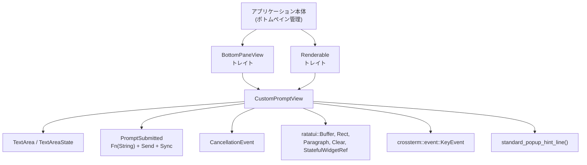
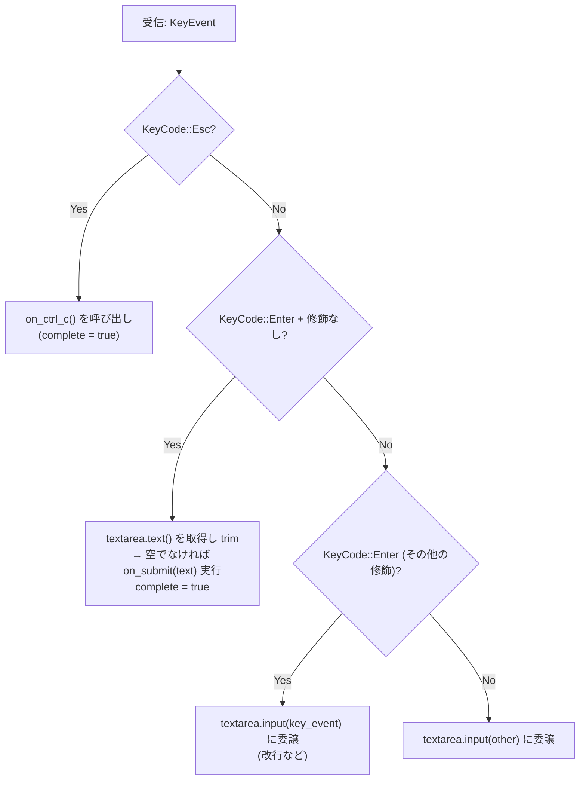
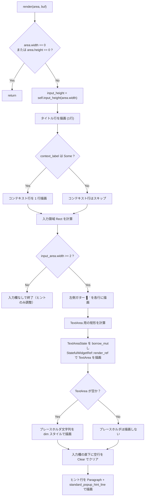
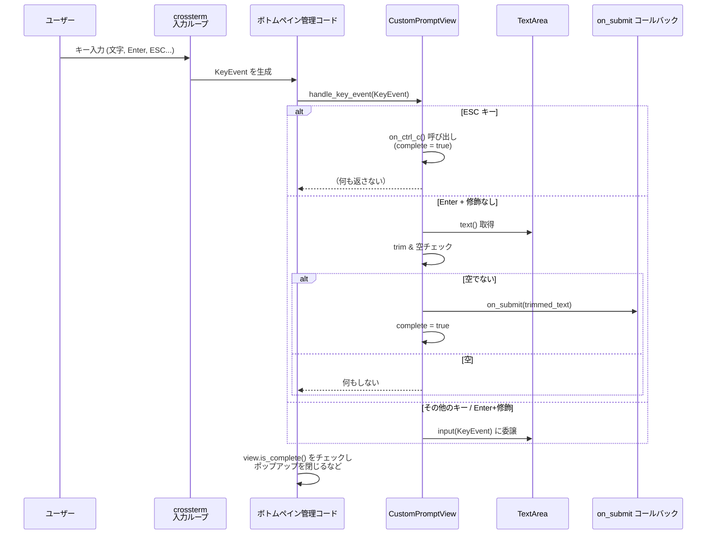
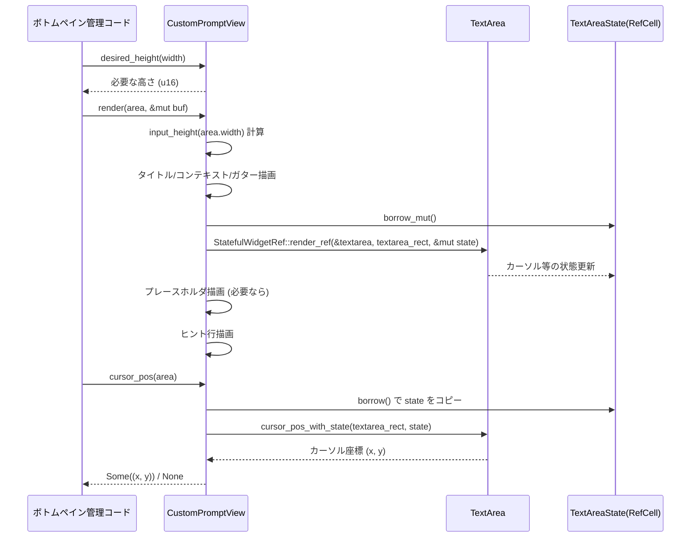

# tui/src/bottom_pane/custom_prompt_view.rs コード解説

## 0. ざっくり一言

カスタムレビュー指示（プロンプト）を入力させるための、下部ポップアップ用のシンプルなマルチライン入力ビューです。ユーザーのキー入力やペーストを受け取り、テキストエリアに反映しつつ、Enterで送信・ESCでキャンセルする挙動を実装しています（custom_prompt_view.rs:L24-38, L59-106）。

---

## 1. このモジュールの役割

### 1.1 概要

- このモジュールは、TUI（テキスト UI）の「ボトムペイン」に表示されるカスタムプロンプト入力ポップアップを実装します（custom_prompt_view.rs:L27-38）。
- ユーザーのキーイベントを処理して `TextArea` に反映し、送信確定時にコールバック `PromptSubmitted` を呼び出します（custom_prompt_view.rs:L24-25, L60-88）。
- ratatui での描画・カーソル位置計算を行うために `Renderable` トレイトを実装し、外側の描画ループから利用できるようになっています（custom_prompt_view.rs:L15, L108-214, L216-234）。

### 1.2 アーキテクチャ内での位置づけ

主な依存関係は次の通りです。

- 入力イベント: `crossterm::event::{KeyEvent, KeyCode, KeyModifiers}`（custom_prompt_view.rs:L1-3）
- 描画: `ratatui::{buffer::Buffer, layout::Rect, widgets::{Paragraph, Clear, StatefulWidgetRef}}`（custom_prompt_view.rs:L4-12）
- テキスト入力ウィジェット: `TextArea`, `TextAreaState`（custom_prompt_view.rs:L21-22）
- ビューのインターフェース: `BottomPaneView`, `Renderable`, `CancellationEvent`（custom_prompt_view.rs:L15, L19-20）

これを簡略な依存関係図で表します。



- アプリケーションは `BottomPaneView` / `Renderable` トレイト越しに `CustomPromptView` を扱います（custom_prompt_view.rs:L59, L108）。
- `CustomPromptView` は内部で `TextArea` を持ち、入力編集のロジックを委譲します（custom_prompt_view.rs:L35-36）。
- Enter確定時は `PromptSubmitted` コールバックを実行し、送信内容を外部へ通知します（custom_prompt_view.rs:L24-25, L72-76）。

### 1.3 設計上のポイント

- **責務分割**
  - キーイベント処理は `BottomPaneView::handle_key_event` 実装に集中（custom_prompt_view.rs:L60-88）。
  - 描画と高さ計算は `Renderable` 実装と `input_height` に切り出し（custom_prompt_view.rs:L108-214, L237-242）。
  - テキスト編集の詳細は `TextArea` に委譲（custom_prompt_view.rs:L35, L52, L72, L82, L85, L103, L119, L182-183, L220, L232-233）。
- **状態管理**
  - テキスト内容は `TextArea` 内部に保持（推測、直接メンバーとして保持：custom_prompt_view.rs:L35）。
  - カーソル・スクロールなどの UI 状態は `TextAreaState` を `RefCell` でラップし、`&self` からでも変更可能にする「内部可変性」を採用しています（custom_prompt_view.rs:L36, L53, L182-183）。
  - ビューの完了状態は単純な `bool` フラグ `complete` で管理（custom_prompt_view.rs:L37, L75-76, L90-92, L95-97）。
- **エラーハンドリングと安全性**
  - 描画時は `area.width == 0` や `area.height == 0` の場合に即 return し、不正な rect で描画しないようにしています（custom_prompt_view.rs:L114-117）。
  - 各種座標計算に `saturating_add` / `saturating_sub` を利用し、u16 のアンダーフロー / オーバーフローを避けています（custom_prompt_view.rs:L132, L142, L157, L165, L169-170, L177-178, L191-193, L202-203, L224-229, L239-241）。
  - `RefCell` を使っているため、同一スレッド内の借用ルール違反時にはランタイム panic の可能性がありますが、現状の実装では `borrow_mut` と `borrow` は異なるメソッド内でシーケンシャルにしか呼ばれていません（custom_prompt_view.rs:L36, L53, L182-183, L232）。
- **並行性**
  - 送信コールバック `PromptSubmitted` は `Send + Sync` 制約付きで、スレッドセーフなクロージャのみを受け取ります（custom_prompt_view.rs:L24-25）。
  - 一方 `CustomPromptView` は `RefCell` を含むため、そのままでは `Send` / `Sync` とは限らず、単一スレッド（UI スレッド）で使用される設計とみなせます（custom_prompt_view.rs:L28-37）。

### 1.4 コンポーネント一覧（インベントリー）

このファイル内で定義されている型・関数の一覧です。

| 名前 | 種別 | 公開範囲 | 役割 / 説明 | 行範囲 |
|------|------|----------|-------------|--------|
| `PromptSubmitted` | 型エイリアス | `pub(crate)` | 送信時コールバックの型（`Fn(String) + Send + Sync`） | custom_prompt_view.rs:L24-25 |
| `CustomPromptView` | 構造体 | `pub(crate)` | カスタムプロンプト入力ポップアップビュー | custom_prompt_view.rs:L27-38 |
| `CustomPromptView::new` | 関数（関連関数） | `pub(crate)` | ビューの初期化 | custom_prompt_view.rs:L41-56 |
| `BottomPaneView for CustomPromptView::handle_key_event` | メソッド | crate 内で利用 | キーイベントに応じて送信・編集・キャンセルを行う | custom_prompt_view.rs:L60-88 |
| `BottomPaneView for CustomPromptView::on_ctrl_c` | メソッド | crate 内で利用 | Ctrl-C / ESC 相当のキャンセル処理 | custom_prompt_view.rs:L90-93 |
| `BottomPaneView for CustomPromptView::is_complete` | メソッド | crate 内で利用 | ビューが完了状態かどうかを返す | custom_prompt_view.rs:L95-97 |
| `BottomPaneView for CustomPromptView::handle_paste` | メソッド | crate 内で利用 | ペースト文字列を TextArea に挿入 | custom_prompt_view.rs:L99-105 |
| `Renderable for CustomPromptView::desired_height` | メソッド | crate 内で利用 | ビューが必要とする高さを計算 | custom_prompt_view.rs:L109-112 |
| `Renderable for CustomPromptView::render` | メソッド | crate 内で利用 | タイトル・コンテキスト・テキストエリア・ヒントを描画 | custom_prompt_view.rs:L114-213 |
| `Renderable for CustomPromptView::cursor_pos` | メソッド | crate 内で利用 | カーソルのスクリーン座標を返す | custom_prompt_view.rs:L216-234 |
| `CustomPromptView::input_height` | メソッド（プライベート） | モジュール内 | テキスト入力領域の高さを計算 | custom_prompt_view.rs:L238-242 |
| `gutter` | 関数（プライベート） | モジュール内 | 左側の縦バー付きスペーサ（`"▌ "` をシアン表示）を生成 | custom_prompt_view.rs:L245-246 |

---

## 2. 主要な機能一覧

このモジュールが提供する主要な機能です。

- カスタムプロンプト入力ビューの生成: `CustomPromptView::new` でタイトル・プレースホルダ・コンテキストラベル・送信コールバックを設定（custom_prompt_view.rs:L41-56）。
- キーイベント処理: `handle_key_event` で ESC / Enter / その他キーを処理し、送信・編集・キャンセルを行う（custom_prompt_view.rs:L60-88）。
- ペースト処理: `handle_paste` でペーストされた文字列を `TextArea` に挿入（custom_prompt_view.rs:L99-105）。
- ビュー完了判定: `is_complete` と `on_ctrl_c` で完了状態を管理（custom_prompt_view.rs:L90-93, L95-97）。
- レイアウト計算: `desired_height` / `input_height` でコンテンツに応じた高さを算出（custom_prompt_view.rs:L109-112, L238-242）。
- 描画処理: `render` でタイトル・コンテキスト・テキストエリア・ヒントの行を ratatui を用いて描画（custom_prompt_view.rs:L114-213）。
- カーソル座標計算: `cursor_pos` で TextArea 内のカーソル位置をスクリーン座標に変換（custom_prompt_view.rs:L216-234）。

---

## 3. 公開 API と詳細解説

### 3.1 型一覧（構造体・型エイリアスなど）

| 名前 | 種別 | 役割 / 用途 | フィールド / 中身 | 行範囲 |
|------|------|-------------|--------------------|--------|
| `PromptSubmitted` | 型エイリアス | ユーザーがプロンプトを送信したときに呼ばれるコールバック。マルチスレッド環境でも安全に共有できるよう `Send + Sync` 制約付き（custom_prompt_view.rs:L24-25）。 | `Box<dyn Fn(String) + Send + Sync>` | custom_prompt_view.rs:L24-25 |
| `CustomPromptView` | 構造体 | カスタムプロンプト入力用のビュー。タイトル・プレースホルダ・コンテキストラベル・テキストエリア・状態を保持する（custom_prompt_view.rs:L27-38）。 | `title: String`, `placeholder: String`, `context_label: Option<String>`, `on_submit: PromptSubmitted`, `textarea: TextArea`, `textarea_state: RefCell<TextAreaState>`, `complete: bool` | custom_prompt_view.rs:L27-38 |

### 3.2 関数詳細（最大 7 件）

#### `CustomPromptView::new(title: String, placeholder: String, context_label: Option<String>, on_submit: PromptSubmitted) -> Self`

**概要**

- カスタムプロンプトビューを初期化するコンストラクタです（custom_prompt_view.rs:L41-56）。
- タイトル・プレースホルダ・コンテキストラベル・送信コールバックを設定し、空の `TextArea` とデフォルト状態の `TextAreaState` を持つインスタンスを返します（custom_prompt_view.rs:L48-54）。

**引数**

| 引数名 | 型 | 説明 |
|--------|----|------|
| `title` | `String` | 上部に表示するタイトル文字列（custom_prompt_view.rs:L42, L48）。 |
| `placeholder` | `String` | 入力が空のときにテキストエリア内に薄く表示するプレースホルダ（custom_prompt_view.rs:L43, L49, L185-186）。 |
| `context_label` | `Option<String>` | タイトルと入力欄の間に表示するコンテキスト説明テキスト。`None` の場合は非表示（custom_prompt_view.rs:L44, L50, L133-143）。 |
| `on_submit` | `PromptSubmitted` | Enter 確定時に入力文字列を受け取るコールバック（custom_prompt_view.rs:L45, L51, L72-76）。 |

**戻り値**

- 初期化された `CustomPromptView` インスタンス（custom_prompt_view.rs:L47-55）。

**内部処理の流れ**

1. 引数を受け取り `Self { ... }` リテラルで構造体フィールドを初期化（custom_prompt_view.rs:L47-55）。
2. `textarea` には `TextArea::new()` による新しいテキストエリアインスタンスを格納（custom_prompt_view.rs:L52）。
3. `textarea_state` には `TextAreaState::default()` を `RefCell::new` でラップしたものを格納（custom_prompt_view.rs:L53）。
4. `complete` フラグは初期値 `false` に設定（custom_prompt_view.rs:L54）。

**Examples（使用例）**

> ビューを生成し、簡単な送信コールバックを設定する例です。パスやモジュール階層はプロジェクト構成に応じて調整が必要です。

```rust
// カスタムプロンプトビューを作成する
let view = CustomPromptView::new(
    "Custom review prompt".to_string(),           // タイトル
    "Type additional instructions here...".to_string(), // プレースホルダ
    Some("Will be applied to the next review run.".to_string()), // コンテキストラベル
    Box::new(|prompt| {                           // 送信コールバック
        println!("User submitted prompt: {}", prompt);
    }),
);
```

**Errors / Panics**

- `new` 自体には明示的なエラーや panic はありません。
- 内部で使用する `TextArea::new()` / `TextAreaState::default()` が panic するかは、このチャンクでは分かりません（custom_prompt_view.rs:L52-53）。

**Edge cases（エッジケース）**

- `title` や `placeholder` が空文字でも、そのまま描画に使用されます（custom_prompt_view.rs:L48-50, L128-129, L185-186）。
- `context_label` が `None` の場合、コンテキスト行はレンダリングされません（custom_prompt_view.rs:L133-143）。

**使用上の注意点**

- `on_submit` には `Send + Sync` 制約があるため、クロージャの中で非スレッドセーフな状態を直接キャプチャしないようにする必要があります（custom_prompt_view.rs:L24-25）。
- `CustomPromptView` 自体は `RefCell` を含むため、並列アクセスを想定した共有は避け、UI スレッドでのみ扱う前提になります（custom_prompt_view.rs:L36）。

---

#### `CustomPromptView::handle_key_event(&mut self, key_event: KeyEvent)`

（`BottomPaneView` トレイト実装の一部）

**概要**

- キーイベントを解釈し、ESC でキャンセル、Enter（修飾無し）で送信、それ以外のキーは `TextArea` に渡す処理を行います（custom_prompt_view.rs:L60-88）。
- 送信時にはテキストを trim し、空でない場合にのみコールバック `on_submit` を呼び出し、ビューを完了状態にします（custom_prompt_view.rs:L72-76）。

**引数**

| 引数名 | 型 | 説明 |
|--------|----|------|
| `key_event` | `KeyEvent` | crossterm から渡されるキーイベント（キーコードと修飾キーを含む）（custom_prompt_view.rs:L60, L62-63, L67-70, L78-81）。 |

**戻り値**

- なし（`()`）。「キャンセルされた / 送信された」といった状態は内部の `complete` フラグで表現されます（custom_prompt_view.rs:L37, L75-76, L90-92, L95-97）。

**内部処理の流れ（アルゴリズム）**



1. `match key_event` でキーごとの分岐を行います（custom_prompt_view.rs:L61）。
2. `KeyCode::Esc` の場合: `self.on_ctrl_c()` を呼び出しキャンセル処理を行います（戻り値は無視）（custom_prompt_view.rs:L62-66, L90-93）。
3. `KeyCode::Enter` かつ `KeyModifiers::NONE` の場合:
   - `self.textarea.text()` で入力全体を取り出し（custom_prompt_view.rs:L72）、`trim()` で前後の空白を除去し `String` に変換。
   - その結果が空文字でなければ `on_submit` コールバックを呼び、`complete = true` に設定（custom_prompt_view.rs:L72-76）。
4. `KeyCode::Enter`（修飾キーあり）その他の場合:
   - `self.textarea.input(key_event)` にイベントを渡し、テキストエリアに編集処理を委譲（custom_prompt_view.rs:L78-83, L85-86）。

**Examples（使用例）**

> 簡易イベントループから `handle_key_event` を呼ぶイメージです。

```rust
fn process_event(view: &mut CustomPromptView, key_event: crossterm::event::KeyEvent) {
    // キーイベントをビューに渡す
    view.handle_key_event(key_event);  // ESC, Enter, 文字入力などを処理

    // ビューが完了したら呼び出し側で閉じるなどの処理を行う
    if view.is_complete() {
        // ポップアップを閉じる等
    }
}
```

**Errors / Panics**

- 関数自体に明示的なエラーはありません。
- 内部で `self.textarea.text()` や `self.textarea.input(...)` が panic するかどうかは、このチャンク内からは分かりません（custom_prompt_view.rs:L72, L82, L85）。
- `on_submit` コールバック内で発生するエラー・panic はここではハンドリングされていません（custom_prompt_view.rs:L72-76）。

**Edge cases（エッジケース）**

- Enter（修飾無し）で送信しようとした際、テキストが空または空白のみの場合は、`on_submit` は呼ばれず `complete` も `true` になりません（custom_prompt_view.rs:L72-76）。
- Enter + 修飾キー（例: Ctrl+Enter）の場合は、送信ではなく `TextArea` に渡されるため、改行として扱われる可能性があります（custom_prompt_view.rs:L78-83）。具体的な挙動は `TextArea::input` 実装に依存します。
- ESC キーは `on_ctrl_c` を通じてキャンセル扱いになりますが、`CancellationEvent` の種別は戻り値を無視しているため、ここからは `Handled` 以外を返す拡張は考慮されていません（custom_prompt_view.rs:L62-66, L90-93）。

**使用上の注意点**

- 送信トリガーとなるのはあくまで「Enter + 修飾なし」のみなので、マルチライン入力を前提とする場合は Enter の扱いを変更する必要があります（custom_prompt_view.rs:L67-76, L78-83）。
- `on_submit` 内で重い処理を行うと UI 応答性に影響する可能性があります。必要に応じて非同期タスクに渡すなどの設計が必要です（コールバックの型は `Send + Sync` なのでスレッドに渡しやすい設計になっています: custom_prompt_view.rs:L24-25）。

---

#### `CustomPromptView::handle_paste(&mut self, pasted: String) -> bool`

（`BottomPaneView` トレイト実装の一部）

**概要**

- 外部からペーストされた文字列を `TextArea` に挿入するためのメソッドです（custom_prompt_view.rs:L99-105）。
- 空文字列なら何もしないで `false` を返し、それ以外は `insert_str` を呼び出して挿入し `true` を返します（custom_prompt_view.rs:L100-105）。

**引数**

| 引数名 | 型 | 説明 |
|--------|----|------|
| `pasted` | `String` | ペーストされたテキスト全体。改行を含んでいる場合も想定されます（custom_prompt_view.rs:L99-104）。 |

**戻り値**

- `bool`:
  - `true`: 何かしらのテキストを `TextArea` に挿入した場合（custom_prompt_view.rs:L103-105）。
  - `false`: `pasted` が空文字列で、挿入処理を行わなかった場合（custom_prompt_view.rs:L100-102）。

**内部処理の流れ**

1. `if pasted.is_empty()` で空文字列かを確認（custom_prompt_view.rs:L100）。
2. 空なら即座に `false` を返却（custom_prompt_view.rs:L100-102）。
3. 空でなければ `self.textarea.insert_str(&pasted)` を呼び、テキストを挿入（custom_prompt_view.rs:L103）。
4. 最後に `true` を返却（custom_prompt_view.rs:L103-105）。

**Examples（使用例）**

```rust
fn on_paste(view: &mut CustomPromptView, clipboard_text: String) {
    let changed = view.handle_paste(clipboard_text);
    if changed {
        // 再描画が必要などのフラグを立てる
    }
}
```

**Errors / Panics**

- `TextArea::insert_str` の内部挙動はこのチャンクからは不明です。挿入位置の範囲チェックなどで panic する可能性があるかどうかは分かりません（custom_prompt_view.rs:L103）。
- この関数自身はエラー型を返しません。

**Edge cases（エッジケース）**

- 空文字列のペーストは無視されます（custom_prompt_view.rs:L100-102）。
- 改行を含むペースト内容は、そのまま `TextArea` に渡されます。どう扱うか（複数行に分割するかなど）は `TextArea::insert_str` 実装に依存します（custom_prompt_view.rs:L103）。

**使用上の注意点**

- 貼り付けテキストのサイズ制限やサニタイズはこのレイヤーでは行っていません。必要に応じて、呼び出し側で長すぎる入力を制限することが考えられます。
- `handle_paste` の戻り値 (`bool`) は、再描画が必要かどうかの判定に使うなどの用途が想定できます。

---

#### `CustomPromptView::desired_height(&self, width: u16) -> u16`

（`Renderable` トレイト実装の一部）

**概要**

- 指定された幅に対して、このビューが必要とする高さ（行数）を計算します（custom_prompt_view.rs:L109-112）。
- タイトル行・オプションのコンテキスト行・入力領域・ヒント行などを踏まえた合計高さを返します。

**引数**

| 引数名 | 型 | 説明 |
|--------|----|------|
| `width` | `u16` | 利用可能な横幅。入力領域の高さ計算に使用されます（custom_prompt_view.rs:L109, L111）。 |

**戻り値**

- `u16`: ビューが推奨する高さ。計算式は `1 + extra_top + input_height(width) + 3`（custom_prompt_view.rs:L110-111）。
  - `1`: タイトル行（custom_prompt_view.rs:L122-129）。
  - `extra_top`: コンテキストラベル行がある場合は 1、それ以外は 0（custom_prompt_view.rs:L110, L133-143）。
  - `input_height(width)`: 入力領域の高さ（後述）（custom_prompt_view.rs:L111, L238-242）。
  - `3`: 下部の空行 + ヒント行などに相当すると考えられます（custom_prompt_view.rs:L191-213）。

**内部処理の流れ**

1. `extra_top` を `self.context_label.is_some()` に応じて 0 または 1 として計算（custom_prompt_view.rs:L110）。
2. `self.input_height(width)` で入力部分の高さを取得（custom_prompt_view.rs:L111, L238-242）。
3. `1 + extra_top + input_height + 3` を計算して返す（custom_prompt_view.rs:L110-111）。

**Examples（使用例）**

```rust
let height = view.desired_height(80);
// レイアウトエンジン側で高さを確保してから render を呼び出す
```

**Errors / Panics**

- 単純な整数演算のみで panic の可能性はありません（u16 の範囲内での加算）。

**Edge cases（エッジケース）**

- `width` が 0 でも `input_height(0)` は 1〜9 の範囲に clamp された値を返すため（custom_prompt_view.rs:L238-242）、`desired_height` 自体は 4〜13 の範囲の値を返すことになります。ただし `render` 側では `area.width == 0` の場合に何も描画しません（custom_prompt_view.rs:L114-117）。
- コンテキストラベルがない場合、タイトル行の直下から入力領域になります（custom_prompt_view.rs:L110, L132-143）。

**使用上の注意点**

- `desired_height` はあくまで推奨値であり、実際のレイアウトは呼び出し側で調整する必要があります。
- レイアウトエンジン側で高さが不足した場合、入力領域が極端に小さくなる可能性があるため、呼び出し側で最低高さを確保する設計が望ましいです。

---

#### `CustomPromptView::render(&self, area: Rect, buf: &mut Buffer)`

（`Renderable` トレイト実装の一部）

**概要**

- 指定された `area` へ、タイトル・オプションのコンテキストラベル・左側のガター・テキスト入力欄・ヒント行を描画します（custom_prompt_view.rs:L114-213）。
- 実際のテキスト入力欄は `TextArea` の `StatefulWidgetRef::render_ref` を通じて描画します（custom_prompt_view.rs:L182-183）。

**引数**

| 引数名 | 型 | 説明 |
|--------|----|------|
| `area` | `Rect` | 描画先矩形領域（x, y, width, height）（custom_prompt_view.rs:L114, L122-127, L145-151 など）。 |
| `buf` | `&mut Buffer` | ratatui の描画バッファ。ここに文字・スタイル情報を書き込みます（custom_prompt_view.rs:L114, L129, L141, L154-162, L174-175, L183, L186, L199-200, L204-212）。 |

**戻り値**

- なし（`()`）。描画結果は `buf` に反映されます。

**内部処理の流れ（概要）**



**処理の詳細**

1. area がゼロサイズなら早期 return（custom_prompt_view.rs:L114-117）。
2. `input_height` を `self.input_height(area.width)` から取得（custom_prompt_view.rs:L119, L238-242）。
3. **タイトル行**:
   - `title_area` を高さ 1 で設定し（custom_prompt_view.rs:L122-127）、
   - `vec![gutter(), self.title.clone().bold()]` を `Paragraph` で描画（custom_prompt_view.rs:L128-129）。
4. **コンテキスト行（任意）**:
   - `context_label` が `Some` の場合、ガターとシアン色のラベルを 1 行描画（custom_prompt_view.rs:L132-143）。
   - `input_y` を 1 行分進める（custom_prompt_view.rs:L142）。
5. **入力領域**:
   - `input_area` を高さ `input_height` として確保（custom_prompt_view.rs:L145-151）。
   - `input_area.width >= 2` の場合のみ描画を行う（縦ガター用の幅を確保）（custom_prompt_view.rs:L152-153）。
   - 各行の左 2 列に `gutter()` を描画（custom_prompt_view.rs:L153-163）。
   - `text_area_height = input_area.height - 1` を算出し、0 より大きければ TextArea 部分を描画（custom_prompt_view.rs:L165-166）。
     - `input_area.width > 2` なら、ガター右側の 1 行分を `Clear` でクリア（custom_prompt_view.rs:L167-175）。
     - TextArea 領域を `textarea_rect` として計算し、`textarea_state.borrow_mut()` の結果を渡して `StatefulWidgetRef::render_ref` により描画（custom_prompt_view.rs:L176-183）。
     - `self.textarea.text().is_empty()` の場合、プレースホルダを dim スタイルで TextArea 上に描画（custom_prompt_view.rs:L184-186）。
6. **ヒント行**:
   - 入力領域の下に 1 行分の空行を `Clear` でクリア（custom_prompt_view.rs:L191-200）。
   - そのさらに下に `standard_popup_hint_line()` の内容を描画（custom_prompt_view.rs:L202-213）。

**Examples（使用例）**

```rust
fn draw_view(view: &CustomPromptView, frame: &mut ratatui::Frame) {
    let area = frame.size(); // 画面全体など、実際の使用に応じた Rect
    let height = view.desired_height(area.width);

    let popup_area = ratatui::layout::Rect {
        x: area.x,
        y: area.y + area.height.saturating_sub(height),
        width: area.width,
        height,
    };

    view.render(popup_area, frame.buffer_mut());
}
```

**Errors / Panics**

- `textarea_state.borrow_mut()` は、同一 `RefCell` に対してすでに `borrow_mut` または `borrow` が有効な状態であれば panic します（custom_prompt_view.rs:L36, L53, L182-183）。現状のコードでは `render` 内で一度だけ呼び出しており、他の借用と重複していないため、通常の使用では問題ないと考えられます。
- ratatui の `Paragraph::render` や `Clear.render` 自体は、渡された Rect がバッファの範囲内にある前提で動作します。このコードでは `area` を引数として受け取り、その中で座標計算を行っているため、呼び出し側が適切な `area` を渡す必要があります（custom_prompt_view.rs:L114-151）。

**Edge cases（エッジケース）**

- `area.width < 2` の場合、`input_area.width >= 2` 条件を満たさないため、入力欄のガターと TextArea は描画されません。この場合でもタイトル行や（高さが足りれば）ヒント行などは描画されます（custom_prompt_view.rs:L145-153, L191-213）。
- `input_height` が 1 の場合、`text_area_height = input_area.height - 1` が 0 になり、TextArea 自体は描画されません（custom_prompt_view.rs:L165-166）。このケースではガターだけが表示される可能性があります。
- `self.textarea.text()` が空文字列の場合のみプレースホルダが描画され、そうでない場合はユーザ入力が TextArea に描画されます（custom_prompt_view.rs:L184-186）。

**使用上の注意点**

- `render` は副作用として `textarea_state` を更新する（TextArea が内部でカーソル位置などを変更する）可能性があります。そのため、`Render` 呼び出しの順序と `cursor_pos` の呼び出し順序は一貫性を保つ必要があります（custom_prompt_view.rs:L182-183, L232-233）。
- サイズ計算に `saturating_add` / `saturating_sub` を多用しているため、極端な `area` 値でもパニックしにくい設計ですが、視覚的な崩れは起こり得ます（custom_prompt_view.rs:L132, L142, L157, L165, L169-170, L177-178, L191-193, L202-203, L224-229, L239-241）。

---

#### `CustomPromptView::cursor_pos(&self, area: Rect) -> Option<(u16, u16)>`

（`Renderable` トレイト実装の一部）

**概要**

- 現在の `TextArea` 内のカーソル位置を、画面上の絶対座標 `(x, y)` に変換して返します（custom_prompt_view.rs:L216-234）。
- 十分なスペースがない場合（高さや幅が足りない場合）は `None` を返し、カーソルを表示しないことを示します（custom_prompt_view.rs:L217-223）。

**引数**

| 引数名 | 型 | 説明 |
|--------|----|------|
| `area` | `Rect` | `render` と同様の描画領域。ここを基準にカーソル位置を算出します（custom_prompt_view.rs:L216-229）。 |

**戻り値**

- `Option<(u16, u16)>`:
  - `Some((x, y))`: カーソルを表示すべきスクリーン座標。
  - `None`: 幅・高さなどの制約によりカーソルを表示すべきでない場合（custom_prompt_view.rs:L217-223）。

**内部処理の流れ**

1. `area.height < 2` または `area.width <= 2` の場合は `None` を返す（custom_prompt_view.rs:L217-218）。
2. `text_area_height = self.input_height(area.width).saturating_sub(1)` を計算し、0 なら `None`（custom_prompt_view.rs:L220-222）。
3. 上部行数 `top_line_count` を `1 + extra_offset` として計算。`extra_offset` は `context_label.is_some()` なら 1、それ以外は 0（custom_prompt_view.rs:L224-225）。
4. `textarea_rect` を `x = area.x + 2`（ガター 2 列）、`y = area.y + top_line_count + 1` として構築（custom_prompt_view.rs:L226-230）。
5. `let state = *self.textarea_state.borrow();` で `TextAreaState` をコピー（custom_prompt_view.rs:L232）。
6. `self.textarea.cursor_pos_with_state(textarea_rect, state)` を呼び、最終的なカーソル座標を返す（custom_prompt_view.rs:L233-234）。

**Examples（使用例）**

```rust
fn draw_cursor(view: &CustomPromptView, frame: &mut ratatui::Frame) {
    let area = frame.size();
    if let Some((x, y)) = view.cursor_pos(area) {
        frame.set_cursor(x, y); // ratatui 側のカーソル設定 API の一例
    }
}
```

**Errors / Panics**

- `self.textarea_state.borrow()` が、すでにミュータブル借用されている状態で呼び出されると panic します（custom_prompt_view.rs:L36, L232）。通常は `render` と `cursor_pos` が別フェーズで呼ばれるため問題になりにくいですが、同一フレーム内で不適切な再帰的呼び出しがあると危険です。
- `TextArea::cursor_pos_with_state` の内部挙動（範囲外座標などで panic するか）はこのチャンクでは不明です（custom_prompt_view.rs:L233）。

**Edge cases（エッジケース）**

- 小さな `area` の場合（高さ < 2 または幅 <= 2）、常に `None` を返します（custom_prompt_view.rs:L217-218）。
- `input_height` が 1 の場合、`text_area_height` は 0 となりやはり `None` です（custom_prompt_view.rs:L220-222, L238-242）。
- `context_label` の有無に応じて `top_line_count` が変化するため、カーソルの y 座標も 1 行分ずれます（custom_prompt_view.rs:L224-225）。

**使用上の注意点**

- 呼び出し側は、`render` に渡したのと同じ `area` を `cursor_pos` に渡す必要があります。異なる `area` を使うとカーソルと描画位置がずれます（custom_prompt_view.rs:L216-230）。
- `TextAreaState` をコピーして渡しているため、このメソッド内で `state` が変更されても元の `RefCell` 内状態には反映されません（custom_prompt_view.rs:L232-233）。`cursor_pos_with_state` が state を変更する設計でないことが前提と考えられます。

---

#### `CustomPromptView::input_height(&self, width: u16) -> u16`

（プライベートメソッド）

**概要**

- 与えられた幅をもとに、入力領域（タイトル下の TextArea 含む）の高さを計算します（custom_prompt_view.rs:L238-242）。
- TextArea の望む高さを 1〜8 行に clamp し、さらにその上に 1 行を加えた値を、最大 9 行までに制限して返します（custom_prompt_view.rs:L239-241）。

**引数**

| 引数名 | 型 | 説明 |
|--------|----|------|
| `width` | `u16` | ビュー全体の幅。実際に TextArea に使える幅はガター分を差し引いた `width - 2` になります（custom_prompt_view.rs:L238-240）。 |

**戻り値**

- `u16`: 入力領域の高さ。範囲は 2〜9 の間になります（`text_height` が 1〜8、それに 1 を加え、最大 9 に制限: custom_prompt_view.rs:L239-241）。

**内部処理の流れ**

1. `usable_width = width.saturating_sub(2)` で、ガター分の 2 列を差し引いた実効幅を計算（custom_prompt_view.rs:L239）。
2. `text_height = self.textarea.desired_height(usable_width).clamp(1, 8)` で、TextArea による希望高さを 1〜8 の範囲に制限（custom_prompt_view.rs:L240）。
3. `text_height.saturating_add(1).min(9)` を返却。1 行分はガター行などに相当すると考えられます（custom_prompt_view.rs:L241）。

**Examples（使用例）**

```rust
let input_height = view.input_height(80);
// desired_height 内部からのみ呼ばれる想定だが、レイアウト調整の参考値としても使える
```

**Errors / Panics**

- `saturating_sub` / `saturating_add` を使用しているため、`width` が小さくても panic しません（custom_prompt_view.rs:L239-241）。
- `TextArea::desired_height` の挙動はこのチャンクからは不明ですが、ここではその値を 1〜8 に切り詰めているため、極端な値になっても影響は制限されます（custom_prompt_view.rs:L240）。

**Edge cases（エッジケース）**

- `width < 2` の場合、`usable_width` は 0 になり得ますが `TextArea::desired_height(0)` の結果を clamp しているため、最終的な `input_height` は 2〜9 のいずれかになります（custom_prompt_view.rs:L239-241）。
- 非常に長いテキストでも `text_height` は最大 8 行に制限され、全体としては 9 行を超えません（custom_prompt_view.rs:L240-241）。

**使用上の注意点**

- 入力領域の最大高さを 9 行に制限しているため、非常に長いテキストはスクロール前提になります（スクロール処理の有無は `TextArea` 実装に依存: custom_prompt_view.rs:L35）。
- レイアウト全体の高さは `desired_height` が管理しており、`input_height` は主に内部計算用です（custom_prompt_view.rs:L109-112, L238-242）。

---

### 3.3 その他の関数

| 関数名 / メソッド名 | 所属 | 役割（1 行） | 行範囲 |
|---------------------|------|--------------|--------|
| `on_ctrl_c(&mut self) -> CancellationEvent` | `BottomPaneView for CustomPromptView` | `complete = true` に設定し、`CancellationEvent::Handled` を返すキャンセル処理（custom_prompt_view.rs:L90-93）。 | custom_prompt_view.rs:L90-93 |
| `is_complete(&self) -> bool` | `BottomPaneView for CustomPromptView` | ビューが完了状態かどうかを返す getter（custom_prompt_view.rs:L95-97）。 | custom_prompt_view.rs:L95-97 |
| `gutter() -> Span<'static>` | モジュール関数 | 左端に表示する `"▌ "` をシアン色にした Span を返す（custom_prompt_view.rs:L245-246）。 | custom_prompt_view.rs:L245-246 |

---

## 4. データフロー

### 4.1 代表的なシナリオ: ユーザーがプロンプトを入力して送信する

このシナリオでは、ユーザーのキー入力が `CustomPromptView` に渡され、Enter で送信、コールバックが呼び出されるまでの流れを示します。



- 入力編集の詳細は `TextArea::input` / `text` に委譲されます（custom_prompt_view.rs:L72, L82, L85）。
- `complete` フラグは送信またはキャンセル時に `true` となり、外側のコードが `is_complete` を通じて検知します（custom_prompt_view.rs:L75-76, L90-97）。

### 4.2 代表的なシナリオ: 描画とカーソル位置取得



- `render` と `cursor_pos` は `area` の整合性が取れている前提で座標を計算します（custom_prompt_view.rs:L145-151, L226-230）。
- `TextAreaState` は `RefCell` を通じてミュータブルに更新・参照されますが、`render` 側は `borrow_mut`、`cursor_pos` 側はコピーのみを取得します（custom_prompt_view.rs:L182-183, L232）。

---

## 5. 使い方（How to Use）

### 5.1 基本的な使用方法

典型的な利用パターンは以下のようになります。

1. `CustomPromptView::new` でビューを生成。
2. メインイベントループで `handle_key_event` と `handle_paste` を呼び出して入力を反映。
3. 各フレームで `render` と `cursor_pos` を使って描画とカーソル表示を行う。
4. `is_complete` が `true` になったらビューを閉じる。

```rust
// 1. ビューの作成
let mut view = CustomPromptView::new(
    "Custom review prompt".to_string(),                  // タイトル
    "Add extra instructions for the review...".to_string(), // プレースホルダ
    Some("These instructions affect only this run.".to_string()), // コンテキスト
    Box::new(|prompt: String| {
        // 送信されたプロンプトを受け取り、アプリ側に渡す
        println!("Prompt submitted: {}", prompt);
    }),
);

// 2. イベントループ (擬似コード)
loop {
    // crossterm からイベントを取得
    if let crossterm::event::Event::Key(key_event) = crossterm::event::read().unwrap() {
        view.handle_key_event(key_event);
    }

    // 必要に応じてペーストイベントを処理
    // view.handle_paste(pasted_text);

    // 3. 描画
    // frame: ratatui の Frame と仮定
    let area = frame.size();
    let height = view.desired_height(area.width);
    let popup_area = ratatui::layout::Rect {
        x: area.x,
        y: area.y + area.height.saturating_sub(height),
        width: area.width,
        height,
    };
    view.render(popup_area, frame.buffer_mut());

    if let Some((x, y)) = view.cursor_pos(popup_area) {
        frame.set_cursor(x, y);
    }

    // 4. 完了判定
    if view.is_complete() {
        break; // ビューを閉じる
    }
}
```

※ 上記は概念的な例であり、実際のアプリケーションのフレーム管理やエラーハンドリングに合わせて調整が必要です。

### 5.2 よくある使用パターン

- **一時的なポップアップとしての利用**
  - レビュー前に一度だけプロンプトを入力させる用途で、`is_complete` を見てポップアップを閉じるパターン（custom_prompt_view.rs:L37, L75-76, L90-97）。
- **マルチライン入力のサポート**
  - 通常の Enter は送信、改行は Ctrl+Enter など修飾付きの Enter に割り当てる構成（custom_prompt_view.rs:L67-76, L78-83）。改行挿入は `TextArea::input` 側の実装に依存します。

### 5.3 よくある間違い

```rust
// 間違い例: desired_height を無視して狭すぎるエリアを渡す
let popup_area = ratatui::layout::Rect {
    x: area.x,
    y: area.y,
    width: 10,
    height: 2, // 高さ不足: TextArea が描画されない可能性がある
};
view.render(popup_area, frame.buffer_mut());

// 正しい例: desired_height を参考に十分な高さを確保する
let height = view.desired_height(area.width);
let popup_area = ratatui::layout::Rect {
    x: area.x,
    y: area.y + area.height.saturating_sub(height),
    width: area.width,
    height,
};
view.render(popup_area, frame.buffer_mut());
```

```rust
// 間違い例: render と cursor_pos に異なる Rect を渡す
view.render(popup_area, frame.buffer_mut());
if let Some((x, y)) = view.cursor_pos(other_area) { // 別の area
    frame.set_cursor(x, y); // カーソル位置が描画とずれる
}

// 正しい例: 同じ Rect を使う
view.render(popup_area, frame.buffer_mut());
if let Some((x, y)) = view.cursor_pos(popup_area) {
    frame.set_cursor(x, y);
}
```

### 5.4 使用上の注意点（まとめ）

- **前提条件**
  - `render` と `cursor_pos` は同じ `area` を前提として座標計算を行います（custom_prompt_view.rs:L145-151, L226-230）。
  - `CustomPromptView` は `RefCell` を利用しているため、通常は単一スレッドで使用することが前提です（custom_prompt_view.rs:L36）。
- **禁止事項 / 注意事項**
  - 同じ `CustomPromptView` に対して並行して `render` と `cursor_pos` を別スレッドから呼び出すと、`RefCell` の借用ルール違反による panic の可能性があります（custom_prompt_view.rs:L36, L182-183, L232）。
  - `on_submit` コールバック内で UI 状態を再帰的に変更すると、`RefCell` の二重借用が発生しうるため注意が必要です。
- **エラー・パニック条件**
  - `RefCell::borrow_mut` / `borrow` の不適切な多重利用で panic の可能性があります（custom_prompt_view.rs:L182-183, L232）。
  - コールバックや `TextArea` / ratatui 側での panic はここでは捕捉されません。
- **パフォーマンス**
  - 描画ごとにガター行をループで描画していますが、行数は最大でも 9 行程度に制限されており、パフォーマンスへの影響は限定的です（custom_prompt_view.rs:L153-163, L238-242）。
  - `textarea.text().is_empty()` チェックはプレースホルダ描画の有無判断だけに使われており、テキスト量が多い場合でもコストは `TextArea::text` の実装次第です（custom_prompt_view.rs:L72, L184-186）。

---

## 6. 変更の仕方（How to Modify）

### 6.1 新しい機能を追加する場合

例: 「Shift+Enter で改行、Enter で送信」という挙動にしたい場合。

1. **キー処理の拡張**
   - `handle_key_event` 内の `match` 分岐に新しいパターンを追加する（custom_prompt_view.rs:L60-88）。
   - たとえば `KeyCode::Enter` かつ `KeyModifiers::SHIFT` の場合に `self.textarea.input(key_event)` を呼ぶ分岐を明示的に記述する。
2. **送信条件の調整**
   - 送信に用いる Enter の条件を変えたい場合、`KeyModifiers::NONE` 判定部分を修正する（custom_prompt_view.rs:L67-71）。
3. **UI の変更**
   - ヒント行にキー操作の説明を追加したい場合は、`standard_popup_hint_line()` の実装側で変更するか、このビュー専用のヒント行生成関数に差し替える（custom_prompt_view.rs:L17, L202-213）。

### 6.2 既存の機能を変更する場合

- **送信のトリガーを変える**
  - `handle_key_event` 内の Enter 分岐ロジックを変更し、trim 条件や空文字時の挙動を調整する（custom_prompt_view.rs:L67-76）。
- **レイアウトを変える**
  - タイトルやコンテキスト行の行数・スタイルを変えたい場合は、`render` の該当箇所（`title_area` / `context_area`）を編集（custom_prompt_view.rs:L122-143）。
  - 最大行数を変えたい場合は `input_height` の clamp 範囲（1, 8）や `min(9)` の値を変更（custom_prompt_view.rs:L239-241）。
- **影響範囲の確認方法**
  - トレイト境界: `BottomPaneView` / `Renderable` のシグネチャが変わらない限り、呼び出し側コードへの影響は局所的です（custom_prompt_view.rs:L59, L108）。
  - テキスト入力関連: `TextArea` / `TextAreaState` に依存する部分（描画・カーソル位置）を変更すると、他のビューも影響を受ける可能性があります（custom_prompt_view.rs:L35-36, L52-53, L182-183, L232-233）。
- **テストや使用箇所の再確認**
  - このチャンクにはテストコードは含まれていません（custom_prompt_view.rs に `mod tests` 等は存在しません）。変更時には、ボトムペインを利用する高レベルの統合テストやスナップショットテストの有無を別ファイルで確認する必要があります。

---

## 7. 関連ファイル

このモジュールと密接に関係するモジュール（コードから読み取れる範囲）です。

| パス / モジュール | 役割 / 関係 |
|-------------------|------------|
| `crate::render::renderable::Renderable` | 本ビューが実装している描画インターフェース。`desired_height`, `render`, `cursor_pos` を通じて TUI フレームに統合されます（custom_prompt_view.rs:L15, L108-214, L216-234）。 |
| `super::bottom_pane_view::BottomPaneView` | ボトムペインビュー共通のインターフェース。`handle_key_event`, `on_ctrl_c`, `is_complete`, `handle_paste` などのメソッドを定義していると考えられます（custom_prompt_view.rs:L20, L59-106）。 |
| `super::textarea::{TextArea, TextAreaState}` | 実際のテキスト編集・カーソル管理・高さ計算を行うテキスト入力ウィジェットとその状態（custom_prompt_view.rs:L21-22, L35-36, L52-53, L72, L82, L85, L103, L182-183, L232-233）。 |
| `super::popup_consts::standard_popup_hint_line` | 下部のヒント行に表示するテキストを生成する関数（custom_prompt_view.rs:L17, L202-213）。 |
| `super::CancellationEvent` | Ctrl-C / ESC などのキャンセル操作の結果を表す列挙体など（custom_prompt_view.rs:L19, L90-93）。 |

---

### Bugs / Security / Contracts / Edge Cases / Tests / Performance のまとめ

- **潜在バグ**
  - `RefCell` の使用に伴う二重借用 panic の可能性はありますが、現状のコードパスでは明確な衝突は見当たりません（custom_prompt_view.rs:L36, L182-183, L232）。
- **セキュリティ**
  - このモジュールは UI レイヤーであり、外部入力は `TextArea` 経由でのみ扱います。入力の検証・サニタイズはコールバックあるいは上位レイヤーの責務です。
- **契約（Contracts）**
  - `on_submit` は非空（trim 後）テキストに対してのみ呼び出される（custom_prompt_view.rs:L72-76）。
  - `is_complete` が `true` になるのは、送信またはキャンセルが行われたときのみ（custom_prompt_view.rs:L75-76, L90-92, L95-97）。
- **エッジケース**
  - ゼロサイズの `area` では描画を行わない（custom_prompt_view.rs:L114-117）。
  - 幅が 2 未満の場合、入力エリアは描画されないがタイトルなどは描画され得る（custom_prompt_view.rs:L145-153）。
  - TextArea 高さは最大 8 行（入力領域 9 行）に制限（custom_prompt_view.rs:L239-241）。
- **テスト**
  - このファイルにはテストコードが含まれていません。動作保証は別の統合テスト等に依存します（custom_prompt_view.rs 全体に `#[cfg(test)]` などは見当たりません）。
- **パフォーマンス / スケーラビリティ**
  - 入力エリアの高さが最大 9 行に制限されているため、描画・計算量は小さく保たれています（custom_prompt_view.rs:L238-242）。
  - コールバック `on_submit` に重い処理を入れると UI レスポンスが低下するため、必要に応じて非同期処理と組み合わせる設計が望ましいです（custom_prompt_view.rs:L24-25）。
