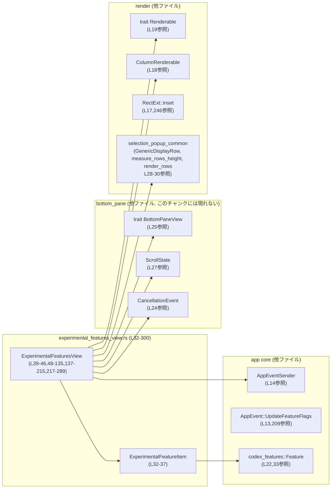
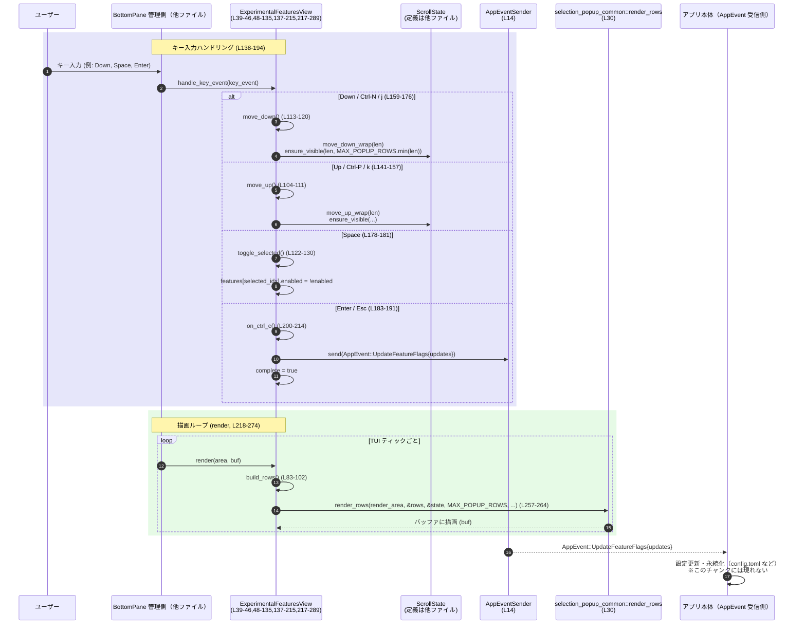

# tui/src/bottom_pane/experimental_features_view.rs コード解説

## 0. ざっくり一言

実験的機能（`Feature`）のオン／オフを一覧表示し、キーボード操作でトグルして設定変更イベント（`AppEvent::UpdateFeatureFlags`）を送るポップアップ風ボトムペインビューを実装するモジュールです（`experimental_features_view.rs:L32-300`）。

---

## 1. このモジュールの役割

### 1.1 概要

- このモジュールは、実験的機能フラグをユーザーが TUI 上で確認・切り替えできるようにするためのビューを提供します。
- `ExperimentalFeaturesView` は、スクロール・選択状態を管理し、キーボード入力に応じて選択行の移動や有効／無効の切り替えを行います（`experimental_features_view.rs:L39-135, L137-215`）。
- 決定（Enter / Esc / Ctrl-C 相当）時に、現在のフラグ状態を `AppEventSender` 経由でアプリケーション本体へ送信します（`experimental_features_view.rs:L200-214`）。
- `Renderable` トレイトの実装により、ヘッダ・行リスト・フッタを TUI バッファ上に描画します（`experimental_features_view.rs:L217-289`）。

### 1.2 アーキテクチャ内での位置づけ

このビューは「ボトムペイン」の一画面として機能し、他コンポーネントとの関係は概ね次のようになります。



> `BottomPaneView` や `ScrollState` などの詳細な実装は、別ファイルにあり、このチャンクには現れません。

### 1.3 設計上のポイント（コードから読み取れる範囲）

- **状態管理**
  - 表示対象の機能リストと、それに対応する選択・スクロール状態を `ExperimentalFeaturesView` が内部フィールドとして持ちます（`features`, `state`。`experimental_features_view.rs:L39-45`）。
  - 完了状態（このビューが閉じるべきか）を `complete: bool` で持ちます（`L42`）。
- **イベント駆動**
  - キーボード入力は `BottomPaneView::handle_key_event` で受け取り、内部の private メソッド（`move_up`, `move_down`, `toggle_selected`, `on_ctrl_c`）に委譲します（`experimental_features_view.rs:L138-194`）。
- **エラーハンドリング／安全性**
  - 要素数 0 の場合を明示的にチェックしてスクロール処理を早期リターンすることで、範囲外アクセスを避けています（`move_up` / `move_down`, `experimental_features_view.rs:L104-120`）。
  - インデックスアクセスには `Vec::get_mut` を使用し、`Option` を通じて安全に要素にアクセスしています（`toggle_selected`, `experimental_features_view.rs:L122-129`）。
  - 幅・高さ計算には `saturating_sub` や `max` を用いて、オーバーフローおよび 0 未満相当の値を避けています（`rows_width`, `render`, `desired_height`。`experimental_features_view.rs:L132-133, L231-235, L254-255, L278-283, L286-288`）。
  - ファイル内に `unsafe` ブロックや `unwrap`/`expect`、`panic!` の明示的呼び出しはありません（`experimental_features_view.rs:L1-300`）。
- **描画ロジックの分離**
  - 行の構築（`build_rows`）、高さ計算（`measure_rows_height` 呼び出し）、実際の描画（`render_rows`）を分け、`selection_popup_common` モジュールに委譲しています（`experimental_features_view.rs:L83-102, L235-240, L257-264`）。

---

## 2. 主要な機能一覧

- 実験的機能アイテムの保持: `ExperimentalFeatureItem` でフラグとメタ情報を保持（`experimental_features_view.rs:L32-37`）
- 実験的機能ビューの構築: `ExperimentalFeaturesView::new`（`L48-69`）
- 初期選択状態の設定: `initialize_selection`（`L71-77`）
- 行データの構築: `build_rows` で `GenericDisplayRow` のリストを生成（`L83-102`）
- スクロール・選択移動: `move_up`, `move_down`（`L104-120`）
- 選択項目の有効／無効切り替え: `toggle_selected`（`L122-129`）
- キーボードイベント処理: `handle_key_event`（`L138-194`）
- 更新内容の送信と完了フラグ設定: `on_ctrl_c`（`L200-214`）
- 画面描画: `render`（`L218-274`）
- レイアウト高さの計算: `desired_height`（`L276-289`）
- フッターヒントの生成: `experimental_popup_hint_line`（`L292-299`）

---

## 3. 公開 API と詳細解説

### 3.1 型一覧（構造体・列挙体など）

| 名前 | 種別 | 可視性 | 役割 / 用途 | 定義箇所 |
|------|------|--------|-------------|----------|
| `ExperimentalFeatureItem` | 構造体 | `pub(crate)` | 単一の実験的機能の識別子（`Feature`）、表示名、説明文、有効フラグを保持するビュー用データ | `experimental_features_view.rs:L32-37` |
| `ExperimentalFeaturesView` | 構造体 | `pub(crate)` | 実験的機能一覧ポップアップの状態（機能リスト、スクロール状態、完了状態）と描画・イベント処理ロジックを持つビュー本体 | `experimental_features_view.rs:L39-46` |

関連トレイト実装（このファイルに現れるもの）:

| 型 | 実装トレイト | 役割 | 定義箇所 |
|----|-------------|------|----------|
| `ExperimentalFeaturesView` | `BottomPaneView` | ボトムペインとしてのキーボードイベント処理と完了通知のインターフェースを実装 | `experimental_features_view.rs:L137-215` |
| `ExperimentalFeaturesView` | `Renderable` | TUI ライブラリ (`ratatui`) 用の描画インターフェースを実装 | `experimental_features_view.rs:L217-289` |

### 3.2 関数詳細（重要な 7 件）

#### `ExperimentalFeaturesView::new(features: Vec<ExperimentalFeatureItem>, app_event_tx: AppEventSender) -> Self`

**概要**

- 実験的機能ビューのインスタンスを初期化します（ヘッダ文言の組み立て、スクロール状態の初期化、初期選択の確定を含む）。（`experimental_features_view.rs:L48-69`）

**引数**

| 引数名 | 型 | 説明 |
|--------|----|------|
| `features` | `Vec<ExperimentalFeatureItem>` | 表示および編集対象となる実験的機能アイテムのリスト |
| `app_event_tx` | `AppEventSender` | 完了時に `AppEvent::UpdateFeatureFlags` を送信するためのイベント送信チャネル |

**戻り値**

- `Self` (`ExperimentalFeaturesView`): 初期化済みのビュー。スクロール状態は `ScrollState::new()`、ヘッダ行は英語メッセージ 2 行で構成され、選択状態は `initialize_selection` のルールに従います。

**内部処理の流れ**

1. `ColumnRenderable::new()` でヘッダ用の縦方向レンダラを生成（`L53`）。
2. 太字タイトル行「Experimental features」を追加（`L54`）。
3. 説明文「Toggle experimental features. Changes are saved to config.toml.」を減色スタイルで追加（`L55-57`）。
4. フィールドを埋めて `Self` を生成（`features`, `ScrollState::new()`, `complete: false`, `app_event_tx`, `header`, `footer_hint: experimental_popup_hint_line()`）（`L59-66`）。
5. `initialize_selection()` を呼び出し、要素数に応じて選択インデックスを適切に設定（`L67`）。
6. 生成したビューを返す（`L68`）。

**Examples（使用例）**

実際の `Feature` の構築方法はこのチャンクには現れないため、ここでは空リストの例を示します。

```rust
use tui::bottom_pane::experimental_features_view::{
    ExperimentalFeaturesView, ExperimentalFeatureItem,
};
use crate::app_event_sender::AppEventSender; // 実際には適切なパス

fn create_view(app_event_tx: AppEventSender) -> ExperimentalFeaturesView {
    // features は別モジュールでロード・構築されることを想定する
    let features: Vec<ExperimentalFeatureItem> = Vec::new();

    // ビューを初期化する（ヘッダ文言やスクロール状態も設定される）
    ExperimentalFeaturesView::new(features, app_event_tx)
}
```

**Errors / Panics**

- この関数内で `Result` は使用されず、明示的な `panic!` もありません（`experimental_features_view.rs:L48-69`）。
- 依存するコンポーネント（`ColumnRenderable::new`, `bold`, `dim` など）が内部でパニックを起こす可能性については、このチャンクからは分かりません。

**Edge cases（エッジケース）**

- `features` が空ベクタの場合:
  - `initialize_selection` により `state.selected_idx` は `None` になります（`experimental_features_view.rs:L71-77`）。
  - ビュー自体は正常に生成されます。
- `features` に多くの要素が含まれている場合:
  - `ScrollState::new()` は初期値を持つだけで、要素数には依存しません（`ScrollState` の詳細はこのチャンクには現れません）。

**使用上の注意点**

- ビュー生成は必ず `new` を通すことで、`initialize_selection` を含む初期化が行われるという前提になっています。フィールドを直接構築するパターンは想定されていません。
- `features` の所有権は `ExperimentalFeaturesView` に移動します（Rust の所有権移動）。ビュー外から同じベクタを参照し続けることはできません。

---

#### `ExperimentalFeaturesView::handle_key_event(&mut self, key_event: KeyEvent)`

（`BottomPaneView` 実装の一部、`experimental_features_view.rs:L138-194`）

**概要**

- ボトムペインにフォーカスがある状態で受け取ったキーボード入力に応じて、スクロール・トグル・完了処理を行います。

**引数**

| 引数名 | 型 | 説明 |
|--------|----|------|
| `key_event` | `crossterm::event::KeyEvent` | 押下されたキーと修飾キー情報 |

**戻り値**

- なし（`()`）。ビュー内部の状態（スクロール位置・選択インデックス・`features` の `enabled` フラグ・`complete`）を更新するのみです。

**内部処理の流れ**

1. `match key_event` でキー種別と修飾キーをパターンマッチ（`L139-193`）。
2. 上移動:
   - 上矢印 (`KeyCode::Up`)（`L141`）
   - `Ctrl-P` (`KeyCode::Char('p')` + `KeyModifiers::CONTROL`)（`L144-146`）
   - いわゆる `^P`（ASCII コード `\u{0010}`）単体（`L149-151`）
   - `k`（`KeyModifiers::NONE`） （`L154-157`）
   → いずれも `self.move_up()` を実行（`L152,157`）。
3. 下移動:
   - 下矢印 (`KeyCode::Down`)（`L159-161`）
   - `Ctrl-N` (`'n'` + `CONTROL`)（`L163-165`）
   - `^N`（ASCII `\u{000e}`）単体（`L168-170`）
   - `j`（`KeyModifiers::NONE`）（`L173-176`）
   → いずれも `self.move_down()` を実行（`L171,176`）。
4. 選択状態のトグル:
   - スペースキー (`KeyCode::Char(' ')`, 修飾なし) で `self.toggle_selected()` を実行（`L178-181`）。
5. 完了（保存して閉じる）:
   - Enter (`KeyCode::Enter`, 修飾なし) または Esc (`KeyCode::Esc`) で `self.on_ctrl_c()` を呼び出し（`L183-191`）。
6. 上記に該当しないキーは無視（`_ => {}`、`L192`）。

**Examples（使用例）**

```rust
fn handle_input(view: &mut ExperimentalFeaturesView, key_event: crossterm::event::KeyEvent) {
    // ビューにキーイベントを伝える
    view.handle_key_event(key_event);

    // ここで view.state や view.features の状態が変化している可能性がある
}
```

**Errors / Panics**

- `handle_key_event` 自体は `Result` を返さず、パニックを明示的に発生させる処理もありません（`experimental_features_view.rs:L138-194`）。
- 内部で呼び出す `move_up`, `move_down`, `toggle_selected`, `on_ctrl_c` も、このファイル内ではパニックを発生させる形で定義されていません（`experimental_features_view.rs:L104-134, L122-130, L200-214`）。

**Edge cases（エッジケース）**

- `features` が空のとき:
  - `move_up`/`move_down` は `len == 0` で早期 return するため、`ScrollState` に対して移動処理は行われません（`experimental_features_view.rs:L104-107, L113-116`）。
  - `toggle_selected` は `selected_idx` が `None` の場合に早期 return するため、安全です（`experimental_features_view.rs:L122-125`）。
- `on_ctrl_c` が呼ばれたあとのキー入力:
  - `complete` フラグは `true` になりますが（`experimental_features_view.rs:L212`）、`handle_key_event` 内では `complete` の値による分岐はありません。この後の呼び出しは、呼び出し側（ボトムペイン管理側）が `is_complete` を見て制御する前提と考えられます（ただし設計詳細はこのチャンクには現れません）。

**使用上の注意点**

- 呼び出し側は、ビューがフォーカスを持っているかどうかを外側で管理し、フォーカスがあるときだけ `handle_key_event` を呼ぶ必要があります（フォーカス管理ロジックはこのチャンクには現れません）。
- `on_ctrl_c` を Enter / Esc からも呼び出しているため、「Esc で変更を破棄」という挙動ではなく、「Enter / Esc で保存して閉じる」という挙動になっています（`experimental_features_view.rs:L183-191`）。UI とユーザー期待との整合性は、仕様として確認が必要です。

---

#### `ExperimentalFeaturesView::on_ctrl_c(&mut self) -> CancellationEvent`

（`BottomPaneView` 実装の一部、`experimental_features_view.rs:L200-214`）

**概要**

- 現在の機能フラグ状態を集約して `AppEvent::UpdateFeatureFlags` として送信し、ビューを完了状態にします。

**引数**

| 引数名 | 型 | 説明 |
|--------|----|------|
| `&mut self` | `&mut ExperimentalFeaturesView` | ビュー自身。`features` と `complete` を更新します。 |

**戻り値**

- `CancellationEvent`（`super` モジュール由来）: ここでは常に `CancellationEvent::Handled` を返します（`experimental_features_view.rs:L213-214`）。呼び出し側はこれを見て、ボトムペインを閉じるなどの後処理を行うと考えられます（詳細はこのチャンクには現れません）。

**内部処理の流れ**

1. `features` が空でなければ（`!self.features.is_empty()`）、更新内容を作る（`experimental_features_view.rs:L202-207`）。
   - `features.iter().map(|item| (item.feature, item.enabled)).collect()` で `(Feature, bool)` のペアのコレクションを生成（正確なコンテナ型は `AppEvent::UpdateFeatureFlags` のフィールド型に依存し、このチャンクには現れません）。
2. `AppEvent::UpdateFeatureFlags { updates }` を `self.app_event_tx.send(...)` で送信（`experimental_features_view.rs:L208-209`）。
3. `self.complete = true` として完了フラグを立てる（`experimental_features_view.rs:L212`）。
4. `CancellationEvent::Handled` を返す（`experimental_features_view.rs:L213-214`）。

**Examples（使用例）**

```rust
fn close_view(view: &mut ExperimentalFeaturesView) {
    // Enter や Esc に相当する操作の代わりに直接呼ぶこともできる
    let result = view.on_ctrl_c();

    // result が CancellationEvent::Handled であることを前提に、
    // 呼び出し側でペインを閉じるなどを行う設計が想定される
    assert!(view.is_complete());
}
```

**Errors / Panics**

- `AppEventSender::send` の戻り値は無視されており、送信失敗を呼び出し側に伝播しません（`experimental_features_view.rs:L208-209`）。
  - 送信が失敗した場合の挙動（ログ出力や内部での panic など）は、このチャンクでは分かりません。
- この関数自体は `Result` を返さず、明示的な panic を発生させるコードもありません。

**Edge cases（エッジケース）**

- `features` が空のとき:
  - `is_empty()` が真となり、`UpdateFeatureFlags` イベントは送信されません（`experimental_features_view.rs:L202-210`）。
  - それでも `complete` は `true` になり、`CancellationEvent::Handled` が返されます。
- `features` 内に同じ `Feature` 値が複数ある場合:
  - `updates` に同じキーが複数回含まれる可能性があります。これをどう解釈するかは `AppEvent::UpdateFeatureFlags` とその受信側の実装に依存し、このチャンクからは分かりません。

**使用上の注意点**

- この関数を呼び出した時点で `complete` が `true` になり、以降はビューを閉じる前提で扱うのが自然です。再度このビューを再利用するには、新たな `ExperimentalFeaturesView` を生成する必要があると考えられます。
- 送信失敗を検知したい場合は、`AppEventSender::send` の戻り値にアクセスできるようインターフェースを拡張する必要があるかもしれませんが、そのような拡張はこのファイルからは行われていません。

---

#### `ExperimentalFeaturesView::render(&self, area: Rect, buf: &mut Buffer)`

（`Renderable` 実装の一部、`experimental_features_view.rs:L218-274`）

**概要**

- 指定された矩形領域に、ヘッダ・リスト・フッタからなる実験的機能ビューを描画します。

**引数**

| 引数名 | 型 | 説明 |
|--------|----|------|
| `area` | `ratatui::layout::Rect` | このビューが描画される画面領域 |
| `buf` | `&mut ratatui::buffer::Buffer` | 描画対象のバッファ |

**戻り値**

- なし。`buf` に対して副作用として描画します。

**内部処理の流れ（アルゴリズム）**

1. `area.height == 0` または `area.width == 0` の場合、即 return し描画をスキップ（`experimental_features_view.rs:L219-221`）。
2. `Layout::vertical([Constraint::Fill(1), Constraint::Length(1)])` を使って `area` を上部コンテンツ領域 (`content_area`) と下部フッタ領域 (`footer_area`) に分割（`experimental_features_view.rs:L223-224`）。
3. `Block::default().style(user_message_style()).render(content_area, buf)` により、`content_area` 全体に背景スタイルを適用（`experimental_features_view.rs:L226-228`）。
4. ヘッダ高さを計算:
   - `self.header.desired_height(content_area.width.saturating_sub(4))`（左右余白を考慮した幅で計算）（`experimental_features_view.rs:L230-232`）。
5. 行データを構築:
   - `let rows = self.build_rows();`（`experimental_features_view.rs:L233`）。
6. 行領域の幅と高さを計算:
   - `rows_width = Self::rows_width(content_area.width)`（`L234`）。
   - `rows_height = measure_rows_height(&rows, &self.state, MAX_POPUP_ROWS, rows_width.saturating_add(1))`（`L235-240`）。
7. `content_area.inset(Insets::vh(1, 2))` で内側の描画領域を求め（上下 1, 左右 2 のインセット）、再度 `Layout::vertical` でヘッダ・スペーサ・リスト領域に分割（`experimental_features_view.rs:L241-246`）。
8. `self.header.render(header_area, buf)` でヘッダを描画（`experimental_features_view.rs:L248`）。
9. リスト領域 `list_area` の高さが 0 より大きい場合:
   - `render_area` を `list_area` をベースに少し左に広げた矩形として構築（`x` を `saturating_sub(2)`, `width` を `rows_width.max(1)`）（`experimental_features_view.rs:L250-255`）。
   - `render_rows` に `render_area`, `&rows`, `&self.state`, `MAX_POPUP_ROWS`, および空リストメッセージを渡して実際の行描画を行う（`experimental_features_view.rs:L257-264`）。
10. フッタ領域にキー操作ヒントを描画:
    - `hint_area` を `footer_area` から左に 2 文字分インセットした領域として計算（`experimental_features_view.rs:L267-271`）。
    - `self.footer_hint.clone().dim().render(hint_area, buf)` でヒント行を減色スタイルで描画（`experimental_features_view.rs:L273`）。

**Examples（使用例）**

```rust
fn draw_bottom_pane(
    view: &ExperimentalFeaturesView,
    full_area: ratatui::layout::Rect,
    buf: &mut ratatui::buffer::Buffer,
) {
    // ボトムペイン用の area を計算したうえで render を呼び出す想定
    view.render(full_area, buf);
}
```

**Errors / Panics**

- `render` 自体は `Result` を返さず、関数内に明示的なパニック要因はありません。
- `Layout::vertical(...).areas(area)` や `render_rows` の内部実装が持つ可能性のある panic 条件は、このチャンクには現れません。
- `self.footer_hint.clone()` は `Line<'static>` の `Clone` 実装に依存しますが、ここで失敗する可能性は通常ありません。

**Edge cases（エッジケース）**

- `area.width == 0` または `area.height == 0`:
  - 即 return し、描画は一切行われません（`experimental_features_view.rs:L219-221`）。
- `rows` が空（`features` が空）のとき:
  - `measure_rows_height` の挙動はこのチャンクには現れませんが、少なくとも `rows` は空ベクタとして渡されます（`experimental_features_view.rs:L233-240`）。
  - `render_rows` には `"  No experimental features available for now"` というメッセージが渡されており、これが空リスト時の表示メッセージとして利用されると考えられます（`experimental_features_view.rs:L257-264`）。
- 非常に狭い `area.width` のとき:
  - `rows_width = total_width.saturating_sub(2)` のため、`total_width` が 0,1 の場合でも 0 で止まり、さらに `rows_width.max(1)` によって `render_area.width` は最低 1 になります（`experimental_features_view.rs:L132-133, L254-255`）。

**使用上の注意点**

- `render` は不変参照 `&self` を受け取るため、複数スレッドから同時に描画しない限り、Rust の型システムにより排他制御は不要です（並行描画の設計はこのチャンクには現れません）。
- 外側のレイアウト計算で、`area` がボトムペイン用に適切に確保されていることが前提です。

---

#### `ExperimentalFeaturesView::desired_height(&self, width: u16) -> u16`

（`Renderable` 実装の一部、`experimental_features_view.rs:L276-289`）

**概要**

- 指定された幅に対して、このビューが必要とする高さを計算します。レイアウトの自動計算などに利用することが想定されます。

**引数**

| 引数名 | 型 | 説明 |
|--------|----|------|
| `width` | `u16` | 想定される描画幅 |

**戻り値**

- `u16`: ビュー全体（ヘッダ、リスト、余白、フッタ）に必要な高さ。

**内部処理の流れ**

1. `rows = self.build_rows()` で行データを構築（`experimental_features_view.rs:L277`）。
2. `rows_width = Self::rows_width(width)` でリスト表示幅を計算（`experimental_features_view.rs:L278`）。
3. `rows_height = measure_rows_height(&rows, &self.state, MAX_POPUP_ROWS, rows_width.saturating_add(1))` で行表示に必要な高さを求める（`experimental_features_view.rs:L279-283`）。
4. `height = self.header.desired_height(width.saturating_sub(4))` でヘッダの高さを計算（`experimental_features_view.rs:L286`）。
5. `height = height.saturating_add(rows_height + 3)` で行表示部分と余白（固定 3 行相当）を加算（`experimental_features_view.rs:L287`）。
6. 最後に `height.saturating_add(1)` を返し、さらに 1 行（フッタ行とみられる）を含める（`experimental_features_view.rs:L288`）。

**Examples（使用例）**

```rust
fn allocate_bottom_pane_height(view: &ExperimentalFeaturesView, total_width: u16) -> u16 {
    // ビューが要求する高さをもとに、ボトムペインに割り当てる高さを決める
    view.desired_height(total_width)
}
```

**Errors / Panics**

- `saturating_add` を使用しているため、`u16` の最大値を超える場合でもオーバーフロー panic は発生せず、最大値で飽和します（`experimental_features_view.rs:L287-288`）。
- この関数は純粋計算であり、I/O やスレッド操作などの副作用はありません。

**Edge cases（エッジケース）**

- 非常に大きな `width` が渡された場合:
  - `saturating_add` によってオーバーフローは防がれますが、高さが `u16::MAX` で頭打ちになる可能性があります。
- `width` が小さい（0 や 1）の場合:
  - `rows_width` は `width.saturating_sub(2)` となり、0 に落ちますが、`measure_rows_height` 内の扱いはこのチャンクには現れません。
  - ヘッダの `desired_height` は `width.saturating_sub(4)` に基づいて計算されるため、ここでも幅 0 での挙動はヘッダ実装依存です。

**使用上の注意点**

- 実際の `render` では `area` の高さを外側レイアウトが決定しているため、この関数を利用するかどうかは上位レイアウトモジュールの設計に依存します。
- `build_rows` を毎回呼び出すため、`features` のサイズに比例したコストがかかります（`O(n_features)`）。

---

#### `ExperimentalFeaturesView::toggle_selected(&mut self)`

（`experimental_features_view.rs:L122-130`）

**概要**

- 現在選択されている行に対応する `ExperimentalFeatureItem` の `enabled` フラグを反転させます。

**引数**

| 引数名 | 型 | 説明 |
|--------|----|------|
| `&mut self` | `&mut ExperimentalFeaturesView` | ビュー自身。`features` の内容を変更します。 |

**戻り値**

- なし。

**内部処理の流れ**

1. `let Some(selected_idx) = self.state.selected_idx else { return; };` で、選択インデックスが存在しない場合は何もせずに終了（`experimental_features_view.rs:L122-125`）。
2. `self.features.get_mut(selected_idx)` によって安全にミュータブル参照を取得し、見つかった場合は `item.enabled = !item.enabled` でブール値を反転（`experimental_features_view.rs:L127-128`）。

**Examples（使用例）**

```rust
fn toggle_current(view: &mut ExperimentalFeaturesView) {
    // 通常はスペースキーから呼ばれるが、テストなどでは直接呼んでもよい
    view.toggle_selected();
}
```

**Errors / Panics**

- `get_mut` を使用しているため、インデックス範囲外で panic することはありません（`experimental_features_view.rs:L127`）。
- `selected_idx` が `Some` でも、`features` の長さが縮んでいる場合には `get_mut` が `None` を返し、何も起きません。

**Edge cases（エッジケース）**

- `selected_idx` が `None` のとき:
  - 何もせず return する挙動になります（`experimental_features_view.rs:L122-125`）。
- `features` が空のとき:
  - `initialize_selection` により通常 `selected_idx` は `None` であり（`experimental_features_view.rs:L71-77`）、ここでも何も起きません。
- `features` の長さが動的に減った場合:
  - このファイルでは `features` の長さを変更するコードはありませんが、もし将来的に追加された場合でも、範囲外アクセスは `get_mut` によって防止されます。

**使用上の注意点**

- `toggle_selected` は `build_rows` とは独立して動作するため、選択インデックスと `features` の整合性（同じ順序で対応すること）が前提になります。
- トグル後に設定を永続化するには、別途 `on_ctrl_c` を通じて `UpdateFeatureFlags` を送信する必要があります。

---

#### `ExperimentalFeaturesView::move_up(&mut self)` / `move_down(&mut self)`

（`experimental_features_view.rs:L104-111, L113-120`）

**概要**

- 現在の選択行を 1 行上／下に移動し、スクロール状態を更新します。ラップ（最上行から上へ移動すると最下行へ、など）も `ScrollState` に委譲して行います。

**引数**

| 関数 | 引数 | 型 | 説明 |
|------|------|----|------|
| `move_up` | `&mut self` | `&mut ExperimentalFeaturesView` | 上方向の移動とスクロール調整を行う |
| `move_down` | `&mut self` | `&mut ExperimentalFeaturesView` | 下方向の移動とスクロール調整を行う |

**戻り値**

- どちらも戻り値は `()` です。

**内部処理の流れ**

共通部分:

1. `let len = self.visible_len();` で表示対象行数（`features.len()`）を取得（`experimental_features_view.rs:L105, L114`）。
2. `len == 0` の場合は何もせず return（`experimental_features_view.rs:L106-107, L115-116`）。
3. `self.state.move_up_wrap(len)` / `move_down_wrap(len)` を呼び出し、選択インデックスをラップ移動（`experimental_features_view.rs:L109, L118`）。
4. `self.state.ensure_visible(len, MAX_POPUP_ROWS.min(len))` で、スクロール位置を調整して選択行が可視範囲内に収まるようにする（`experimental_features_view.rs:L110-111, L119-120`）。

**Examples（使用例）**

```rust
fn move_selection(view: &mut ExperimentalFeaturesView, direction: i32) {
    if direction < 0 {
        view.move_up();
    } else {
        view.move_down();
    }
}
```

**Errors / Panics**

- 要素数チェックにより、`len == 0` の場合に `ScrollState` のメソッドは呼ばれません。
- このファイル内では、`ScrollState` のメソッドが panic を起こすかどうかは分かりません。

**Edge cases（エッジケース）**

- 要素数 1 のとき:
  - `move_up_wrap(1)` / `move_down_wrap(1)` はどちらも同じ要素を指し続ける挙動となることが想定されますが、正確な挙動は `ScrollState` 実装に依存します（このチャンクには現れません）。
- 要素数が非常に多いとき:
  - 各呼び出しで `visible_len`（`features.len()`）を取得するだけで、`O(1)` 処理です。

**使用上の注意点**

- `ScrollState` のインターフェースが `len` と `MAX_POPUP_ROWS` を前提としているため、それに合わせて呼び出している形です。`MAX_POPUP_ROWS` の値や意味は `popup_consts` 側に定義されており、このチャンクには現れません。

---

#### `ExperimentalFeaturesView::build_rows(&self) -> Vec<GenericDisplayRow>`

（`experimental_features_view.rs:L83-102`）

**概要**

- 内部の `features` と選択状態をもとに、描画用の `GenericDisplayRow` のリストを構築します。各行に選択マーカー（`›`）と有効フラグマーカー（`[x]` または `[ ]`）を付与します。

**引数**

| 引数名 | 型 | 説明 |
|--------|----|------|
| `&self` | `&ExperimentalFeaturesView` | ビューの現状態（`features`, `state.selected_idx`） |

**戻り値**

- `Vec<GenericDisplayRow>`: このビューの行表示に使用されるデータ。

**内部処理の流れ**

1. `rows` ベクタを `features.len()` 分の容量で初期化（`experimental_features_view.rs:L84`）。
2. `selected_idx = self.state.selected_idx` をローカルに保持（`experimental_features_view.rs:L85`）。
3. `for (idx, item) in self.features.iter().enumerate()` で全要素を走査（`experimental_features_view.rs:L86`）。
4. 各要素について:
   - `prefix`:
     - 選択行のとき `'›'`, それ以外は `' '`（`experimental_features_view.rs:L87-91`）。
   - `marker`:
     - `item.enabled` が `true` のとき `'x'`, それ以外は `' '`（`experimental_features_view.rs:L92`）。
   - `name = format!("{prefix} [{marker}] {}", item.name)` で先頭マーカー付きの表示名を組み立て（`experimental_features_view.rs:L93`）。
   - `GenericDisplayRow { name, description: Some(item.description.clone()), ..Default::default() }` を `rows` に push（`experimental_features_view.rs:L94-98`）。
5. 最後に `rows` を返す（`experimental_features_view.rs:L101`）。

**Examples（使用例）**

```rust
fn dump_rows(view: &ExperimentalFeaturesView) {
    let rows = view.build_rows();
    for row in rows {
        println!("{}", row.name); // 実際には TUI 上で描画される想定
    }
}
```

**Errors / Panics**

- ベクタへの push や文字列の `clone` は通常 panic を発生させません（メモリ不足など極端な状況を除く）。
- `format!` によるフォーマット指定は固定文字列と `{}` のみであり、フォーマットエラーは発生しません（`experimental_features_view.rs:L93`）。

**Edge cases（エッジケース）**

- `features` が空のとき:
  - `rows` は空ベクタとして返されます。
- 非 ASCII 文字を含む `item.name` や `item.description`:
  - Rust の `String` は UTF-8 であり、特に問題なく格納・クローンされます。描画側（`render_rows`）での扱いは別ファイルに依存します。

**使用上の注意点**

- `description` は常に `Some(item.description.clone())` として設定されています。説明文の有無に応じた条件分岐などを行いたい場合は、`ExperimentalFeatureItem` の定義や `build_rows` の実装を拡張する必要があります。

---

### 3.3 その他の関数・メソッド一覧（インベントリ）

> ※ 重要関数は 3.2 で詳細解説済みです。それ以外のシンプルな関数を一覧します。

| 名前 | シグネチャ | 役割（1 行） | 定義箇所 |
|------|------------|--------------|----------|
| `ExperimentalFeaturesView::initialize_selection` | `fn initialize_selection(&mut self)` | `features` の長さと `state.selected_idx` を見て、選択インデックスを `None` または `Some(0)` にする | `experimental_features_view.rs:L71-77` |
| `ExperimentalFeaturesView::visible_len` | `fn visible_len(&self) -> usize` | 現在の表示対象件数（= `features.len()`）を返す | `experimental_features_view.rs:L79-81` |
| `ExperimentalFeaturesView::rows_width` | `fn rows_width(total_width: u16) -> u16` | 行リスト部分の幅を `total_width.saturating_sub(2)` として計算 | `experimental_features_view.rs:L132-133` |
| `ExperimentalFeaturesView::is_complete` | `fn is_complete(&self) -> bool` | ビューが完了状態かどうかを返す（`complete` フィールドをそのまま返す） | `experimental_features_view.rs:L196-198` |
| `experimental_popup_hint_line` | `fn experimental_popup_hint_line() -> Line<'static>` | フッタに表示するキー操作ヒントの `Line` を構築するユーティリティ関数 | `experimental_features_view.rs:L292-299` |

---

## 4. データフロー

ここでは、典型的な「ユーザーがフラグを変更して保存する」シナリオにおけるデータフローを説明します。

### 4.1 概要

1. ユーザーが矢印キーや `j`/`k` で選択行を移動（`handle_key_event` → `move_up` / `move_down`）。
2. スペースキーで選択行の `enabled` フラグをトグル（`handle_key_event` → `toggle_selected`）。
3. Enter あるいは Esc を押下して確定すると、`on_ctrl_c` が `features` から `updates` を組み立て、`AppEventSender` に `UpdateFeatureFlags` イベントを送信。
4. 描画ループでは `render` が `build_rows` と `render_rows` を通じて最新状態を画面に反映。

### 4.2 シーケンス図



> 図中の行番号は `experimental_features_view.rs` を指します。

---

## 5. 使い方（How to Use）

### 5.1 基本的な使用方法

このビューをボトムペインとして利用する典型的なフローは次のようになります。

```rust
use tui::bottom_pane::experimental_features_view::{
    ExperimentalFeaturesView, ExperimentalFeatureItem,
};
use crate::app_event_sender::AppEventSender;
use ratatui::buffer::Buffer;
use ratatui::layout::Rect;

fn use_experimental_features_view(
    app_event_tx: AppEventSender,
    area: Rect,
    buf: &mut Buffer,
) {
    // 1. ExperimentalFeatureItem の一覧を用意する
    //    実際には codex_features::Feature から構築されると考えられます。
    let features: Vec<ExperimentalFeatureItem> = Vec::new(); // プレースホルダ

    // 2. ビューを初期化する
    let mut view = ExperimentalFeaturesView::new(features, app_event_tx);

    // 3. イベントループ内でキーイベントを渡す
    // for key_event in key_events() {
    //     view.handle_key_event(key_event);
    //     if view.is_complete() {
    //         break;
    //     }
    // }

    // 4. 描画ループで render を呼び出す
    view.render(area, buf);
}
```

### 5.2 よくある使用パターン

1. **ボトムペインとしての一時的表示**
   - あるコマンドやキー操作でこのビューを開き、ユーザーが Enter / Esc を押下したら閉じる、というモーダル的な使い方。
   - 管理側で `Box<dyn BottomPaneView>` として保持し、フォーカス中は `handle_key_event` と `render` をこのビューに委譲する、という構造が想定されます（`BottomPaneView` の詳細はこのチャンクには現れません）。

2. **高さ自動調整**
   - レイアウト決定時に `desired_height(width)` を呼び、ボトムペインの高さを「現在の機能リストにちょうど収まる程度」に調整する使い方。

```rust
fn layout_bottom_pane(view: &ExperimentalFeaturesView, total_width: u16) -> u16 {
    // ビューが必要とする高さを使ってレイアウトを決める
    view.desired_height(total_width)
}
```

### 5.3 よくある間違い（推測されるもの）

コードから推測される誤用例と正しい使用方法を対比します。

```rust
// 誤りの可能性がある例: フィールドを直接構築してしまう
/*
let view = ExperimentalFeaturesView {
    features,
    state: ScrollState::new(),
    complete: false,
    app_event_tx,
    header: Box::new(ColumnRenderable::new()),
    footer_hint: Line::from("..."),
};
*/

// 正しい例: new を経由して初期化する（initialize_selection やヘッダ文言が設定される）
let view = ExperimentalFeaturesView::new(features, app_event_tx);
```

```rust
// 誤りの可能性がある例: is_complete を見ずにいつまでもキーイベントを渡し続ける
// これでは、ユーザーが Enter / Esc を押してもビューが閉じない。
/*
loop {
    let key_event = read_key_event();
    view.handle_key_event(key_event);
    // is_complete をチェックしていない
}
*/

// 正しい例: is_complete で完了状態をチェックする
loop {
    let key_event = read_key_event();
    view.handle_key_event(key_event);

    if view.is_complete() {
        break;
    }
}
```

> `read_key_event` は例示用の仮関数であり、このコードベースの一部として存在するとは限りません。

### 5.4 使用上の注意点（まとめ）

- **前提条件**
  - ビューのライフサイクルは `complete` フラグを通じて管理される前提です。`on_ctrl_c` が呼ばれたビューを再利用し続ける設計は想定されていません（`experimental_features_view.rs:L212`）。
  - `features` の長さはこのファイル内では変更されない前提で処理されています（`visible_len` はただの `features.len()`、`experimental_features_view.rs:L79-81`）。
- **エラー・例外**
  - このモジュールは `Result` や `panic!` を用いたエラー通知を行いません。エラーは主に「何もしない」（空リスト時のスクロールなど）という形で処理されます。
  - `AppEventSender::send` の失敗は無視されるため、確実な永続化が必要な場合は上位層での監視や再送設計が別途必要になります（`experimental_features_view.rs:L208-209`）。
- **並行性**
  - このビューは `&mut self` を通じて更新されるため、同時に複数スレッドから操作するには外側で排他制御が必要です。
  - `AppEventSender` がスレッドセーフかどうかは定義ファイルに依存し、このチャンクからは分かりません。
- **パフォーマンス**
  - `render` と `desired_height` は毎回 `build_rows` を呼び出し、`features` の全要素に対して処理を行います（`O(n_features)`）。通常、実験的機能の数はそれほど多くないと想定されますが、非常に多い場合は描画コストに影響します。

---

## 6. 変更の仕方（How to Modify）

### 6.1 新しい機能を追加する場合

ここでは「機能」とはコード上の機能拡張（UI 挙動の追加）を指します。

1. **キー割り当てを追加したい場合**
   - `handle_key_event` 内の `match key_event` に新しいパターンを追加し、適切なメソッドを呼び出します（`experimental_features_view.rs:L138-194`）。
   - 例: `KeyCode::Char('g')` を「先頭へ移動」に割り当てたい場合は、`ScrollState` に先頭移動メソッドがあるかを確認し、`ExperimentalFeaturesView` にラッパーメソッドを追加する必要があります（`ScrollState` の API はこのチャンクには現れません）。

2. **行表示内容を拡張したい場合**
   - `ExperimentalFeatureItem` に新しいフィールドを追加し（`experimental_features_view.rs:L32-37`）、`build_rows` で `GenericDisplayRow` に反映させます（`experimental_features_view.rs:L83-102`）。
   - `GenericDisplayRow` の構造は `selection_popup_common` に定義されており、このチャンクには現れませんが、`Default` 実装に頼っている部分 (`..Default::default()`) を拡張することになると考えられます。

3. **フッターヒントの文言や内容を変更したい場合**
   - `experimental_popup_hint_line` の戻り値を変更します（`experimental_features_view.rs:L292-299`）。
   - 例えば、新しいキー操作を追加した場合はそれをここに追記します。

### 6.2 既存の機能を変更する場合

- **スクロール挙動を変更したい**
  - 影響範囲:
    - `move_up`, `move_down`（`experimental_features_view.rs:L104-120`）
    - `render` / `desired_height` における `measure_rows_height` と `MAX_POPUP_ROWS`（`experimental_features_view.rs:L235-240, L279-283`）
  - 注意点:
    - `ensure_visible` の意味や契約は `ScrollState` の実装に依存します。変更前にそちらの API 契約を確認する必要があります。
- **保存タイミングを変更したい（例: Esc で破棄にしたい）**
  - 影響範囲:
    - `handle_key_event` の Enter/Esc 処理（`experimental_features_view.rs:L183-191`）
    - `on_ctrl_c` の「保存して完了」挙動（`experimental_features_view.rs:L200-214`）
  - 注意点:
    - `AppEvent::UpdateFeatureFlags` を送るタイミングが変更されると、上位アプリケーションの期待する挙動と異なる可能性があります。`AppEvent` の受信側実装も合わせて確認する必要があります。
- **UI スタイルの変更**
  - 影響範囲:
    - `header` のスタイル（`bold`, `dim`）（`experimental_features_view.rs:L54-57`）
    - `Block::default().style(user_message_style())`（`experimental_features_view.rs:L226-228`）
    - フッターヒントの `dim`（`experimental_features_view.rs:L273`）
  - 注意点:
    - `user_message_style` や `key_hint::plain` の挙動は他ファイルに依存するため、共通スタイルガイドにしたがう必要があります。

---

## 7. 関連ファイル

このモジュールと密接に関係するファイル・型（推測ではなく、`use` や型名から分かる範囲）をまとめます。

| パス / シンボル | 役割 / 関係 | 根拠 |
|-----------------|-------------|------|
| `crate::app_event::AppEvent` | `UpdateFeatureFlags { updates }` イベントの型。`on_ctrl_c` で使用され、機能フラグの更新を外部へ伝える。 | `use crate::app_event::AppEvent;`（`experimental_features_view.rs:L13`）、`AppEvent::UpdateFeatureFlags { updates }`（`L209`） |
| `crate::app_event_sender::AppEventSender` | アプリケーションイベントの送信チャネル。`on_ctrl_c` から `AppEvent` を送るために利用される。 | `use crate::app_event_sender::AppEventSender;`（`L14`）、`self.app_event_tx.send(...)`（`L208-209`） |
| `codex_features::Feature` | 実験的機能を識別する列挙型または構造体と考えられる。`ExperimentalFeatureItem::feature` フィールドで使用。詳細はこのチャンクには現れない。 | `use codex_features::Feature;`（`experimental_features_view.rs:L22`）、`pub feature: Feature`（`L33`） |
| `super::bottom_pane_view::BottomPaneView` | ボトムペインビューの共通インターフェースとなるトレイト。`ExperimentalFeaturesView` がこれを実装している。 | `use super::bottom_pane_view::BottomPaneView;`（`L25`）、`impl BottomPaneView for ExperimentalFeaturesView`（`L137-215`） |
| `super::scroll_state::ScrollState` | スクロール位置と選択行インデックスを管理する状態クラス（あるいは構造体）。`ExperimentalFeaturesView::state` として使用。 | `use super::scroll_state::ScrollState;`（`L27`）、`state: ScrollState`（`L41`） |
| `super::selection_popup_common::{GenericDisplayRow, measure_rows_height, render_rows}` | 選択ポップアップ共通の描画用構造体と関数群。行構築・高さ計算・描画に利用される。 | `use super::selection_popup_common::...;`（`experimental_features_view.rs:L28-30`）、`build_rows`, `render`, `desired_height` 内で使用（`L83-102, L235-240, L257-264, L279-283`） |
| `crate::render::renderable::{Renderable, ColumnRenderable}` | `Renderable` は描画トレイト、`ColumnRenderable` は縦方向に複数行を描画するユーティリティ。ヘッダ表示とビュー全体の描画に使用される。 | `use crate::render::renderable::ColumnRenderable;`（`L18`）、`use crate::render::renderable::Renderable;`（`L19`）、`impl Renderable for ExperimentalFeaturesView`（`L217-289`）、`ColumnRenderable::new()`（`L53`） |
| `super::popup_consts::MAX_POPUP_ROWS` | ポップアップに表示する行数の上限。スクロール処理と高さ計算に使用される。 | `use super::popup_consts::MAX_POPUP_ROWS;`（`L26`）、`ensure_visible(len, MAX_POPUP_ROWS.min(len))`（`L110-111, L119-120`）、`measure_rows_height(..., MAX_POPUP_ROWS, ...)`（`L235-240, L279-283`） |
| `crate::key_hint` と `key_hint::plain` | キーボード操作のヒントを表示するためのユーティリティ。フッタのヒント行を構築する際に使用される。 | `use crate::key_hint;`（`L15`）、`key_hint::plain(...)`（`L295, L297`） |

> このファイルにはテストコード（`mod tests` や `#[cfg(test)]` ブロック）は存在しません（`experimental_features_view.rs:L1-300`）。テストは別ファイルにあるか、まだ用意されていない可能性がありますが、このチャンクからは分かりません。
