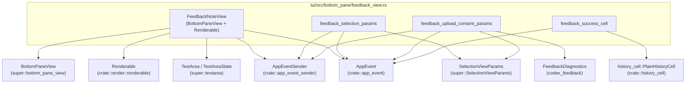
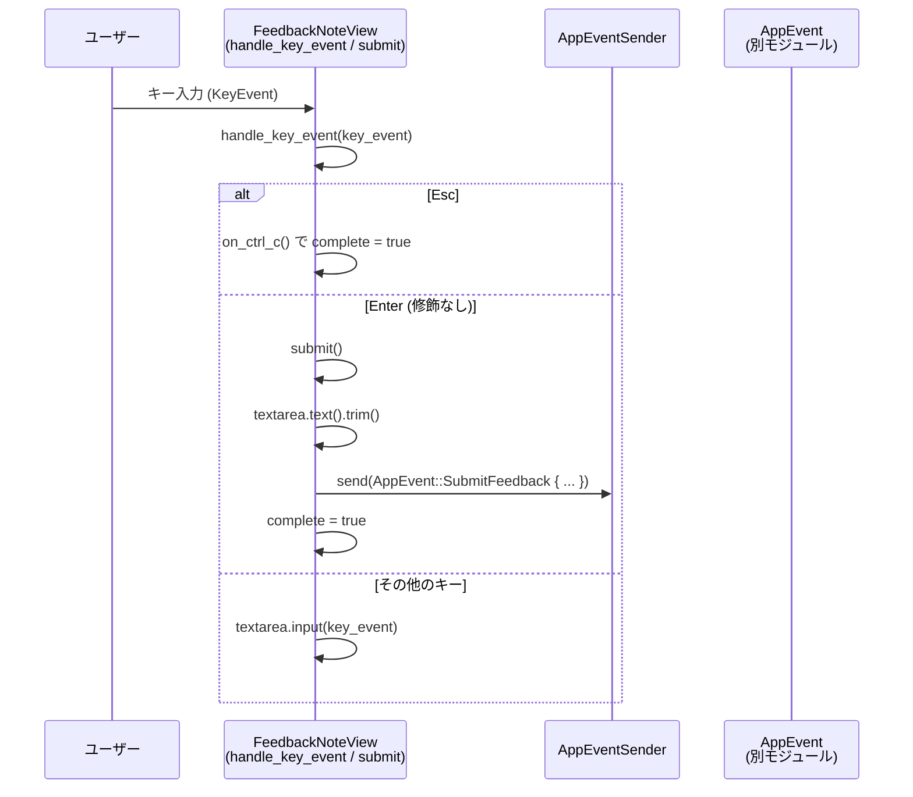
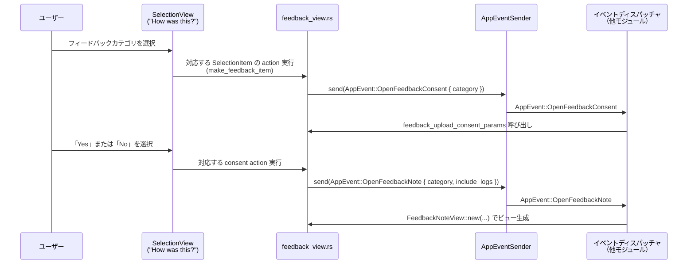

# tui/src/bottom_pane/feedback_view.rs

## 0. ざっくり一言

このモジュールは、CLI/TUI でユーザーからフィードバックを集める UI 部分を担当し、  
「フィードバック分類 → ログ送信同意 → 追加メモ入力 → 成功メッセージ生成」の一連の画面パラメータを構築します。

---

## 1. このモジュールの役割

### 1.1 概要

- このモジュールは **フィードバック入力とその周辺の UI ロジック** をまとめています。
- 具体的には:
  - 追加メモを入力するためのボトムペイン `FeedbackNoteView`
  - フィードバック種別選択ポップアップ用パラメータ
  - ログアップロードへの同意ポップアップ用パラメータ
  - フィードバック送信後に表示する履歴セル
  を構成します。
- フィードバック送信そのもの（サーバとの通信など）は行わず、`AppEvent` を発行することで外部に依頼する構造になっています。

### 1.2 アーキテクチャ内での位置づけ

このモジュールが直接参照している主なコンポーネントとの関係を図示します。



※ 行番号情報はコードチャンクに含まれていないため、ここでは「どのファイルか」のみを根拠として示しています（以降同様）。

### 1.3 設計上のポイント

- **責務分離**
  - メモ入力 UI は `FeedbackNoteView` として `BottomPaneView` / `Renderable` に分離。
  - 選択ポップアップ用のデータ構築は純粋関数（`feedback_selection_params` など）で実装。
  - 成功メッセージのテキスト生成も `feedback_success_cell` として別関数化。
- **状態管理**
  - 入力中テキストは `TextArea` / `TextAreaState` に委譲。
  - `TextAreaState` は `RefCell` で内部可変に保持し、`Renderable::render(&self, ..)` から安全に更新できるようにしています（Rust 固有の「内部可変性」パターン）。
  - ビューの終了判定用に `complete: bool` を持ち、`is_complete` 経由で呼び出し側が閉じるタイミングを判断します。
- **イベント駆動**
  - 送信ボタンなどは持たず、キー入力（Enter/Esc）に応じて `AppEventSender` を通じて `AppEvent` を送信するだけです。
- **エラーハンドリング**
  - このモジュール内では I/O や fallible な処理はほとんど無く、`Result` を返す関数はありません。
  - `AppEventSender::send` の戻り値はこのコードからは見えませんが、返り値は無視されています（失敗時の扱いは `AppEventSender` 側の設計に依存）。
- **並行性**
  - `FeedbackNoteView` は `RefCell` を用いているため、スレッドセーフ（`Sync`）ではない可能性が高く、**単一スレッドの TUI イベントループ内で使用される前提**と考えられます。
  - `AppEventSender` はテストコードから `tokio::sync::mpsc::UnboundedSender` ベースであることがわかりますが、このモジュールでは非同期処理自体は行っていません。

---

## 2. 主要な機能一覧

- フィードバックメモ入力ビュー:
  - `FeedbackNoteView`: メモ入力と送信、キャンセル、ペースト処理、描画、カーソル位置計算。
- フィードバック分類関連ユーティリティ:
  - `feedback_title_and_placeholder`: カテゴリに応じたタイトルとプレースホルダ文字列生成。
  - `feedback_classification`: カテゴリを内部用の文字列ラベルに変換。
- フィードバック送信結果表示:
  - `feedback_success_cell`: 送信結果に応じた履歴セル (`PlainHistoryCell`) を生成。
  - `issue_url_for_category`: カテゴリや受け手に応じて GitHub / 社内向けリンクを生成。
- フィードバック UI 設定:
  - `feedback_selection_params`: 「How was this?」ポップアップの項目一覧を構築。
  - `feedback_disabled_params`: フィードバック機能が無効な場合のポップアップを構築。
  - `feedback_upload_consent_params`: ログ送信への同意ポップアップ（ヘッダに送信されるファイル一覧・接続診断を表示）。
  - `should_show_feedback_connectivity_details`: 接続診断を表示するか否かの判定。
- 補助:
  - `gutter`: 左側の罫線装飾 `▌` を生成。
  - `slack_feedback_url`: 社内向け固定リンク生成。

---

## 3. 公開 API と詳細解説

行番号は指定されていませんが、すべて `tui/src/bottom_pane/feedback_view.rs` 内で定義されています。

### 3.1 型一覧（構造体・列挙体など）

| 名前 | 種別 | 役割 / 用途 | 定義位置の根拠 |
|------|------|-------------|----------------|
| `FeedbackAudience` | 列挙体 | フィードバック完了メッセージ／リンクの対象読者を区別する（社内社員 / 外部ユーザ）。メッセージ文言・リンクパスのみを切り替えるために使用。 | `feedback_view.rs` 内の `enum FeedbackAudience` 定義コメントより |
| `FeedbackNoteView` | 構造体 | ボトムペインに表示される「追加フィードバックメモ」入力ビュー。フィードバックカテゴリ・ターン ID・ログ同意フラグ・テキストエリア状態などを保持し、`BottomPaneView` + `Renderable` を実装。 | `pub(crate) struct FeedbackNoteView` 定義とその impl ブロックより |

※ 行番号が与えられていないため、`Lxx-yy` 形式での厳密な指定はできません。

### 3.2 関数詳細（最大 7 件）

重要度の高いメソッド／関数を 7 つ選んで詳細に説明します。

---

#### `FeedbackNoteView::new(category, turn_id, app_event_tx, include_logs) -> FeedbackNoteView`

**概要**

- フィードバックカテゴリとコンテキスト情報を持つ、新しいメモ入力ビューを初期化します。
- 内部で `TextArea` と `TextAreaState` をデフォルト状態で構築し、`complete` フラグを `false` に設定します。

**引数**

| 引数名 | 型 | 説明 |
|--------|----|------|
| `category` | `FeedbackCategory` | このビューで扱うフィードバックの種別（バグ、良い結果など）。 |
| `turn_id` | `Option<String>` | フィードバック対象の対話スレッド ID。無い場合は `None`。 |
| `app_event_tx` | `AppEventSender` | フィードバック送信などの `AppEvent` を外部に通知するチャネル。 |
| `include_logs` | `bool` | このフィードバックにログを同送するかどうかのフラグ（事前の同意ポップアップで決定）。 |

**戻り値**

- 初期化済みの `FeedbackNoteView` インスタンス。
  - テキストエリアは空。
  - `complete == false`。

**内部処理の流れ**

1. 受け取った引数をそのままフィールドに格納。
2. `textarea` は `TextArea::new()` で新規作成。
3. `textarea_state` は `TextAreaState::default()` を `RefCell` でラップ。
4. `complete` を `false` で初期化。

**Examples（使用例）**

```rust
use crate::app_event::{AppEvent, FeedbackCategory};
use crate::app_event_sender::AppEventSender;
use crate::bottom_pane::feedback_view::FeedbackNoteView;

fn make_bug_feedback_view() -> FeedbackNoteView {
    // AppEvent 用のチャンネルを用意する
    let (tx_raw, _rx) = tokio::sync::mpsc::unbounded_channel::<AppEvent>(); // 非同期チャネル
    let app_event_tx = AppEventSender::new(tx_raw);                          // ラッパ型に変換

    // バグ報告用のフィードバックビューを作成する
    FeedbackNoteView::new(
        FeedbackCategory::Bug,        // カテゴリ
        Some("thread-123".to_string()), // 対象スレッド ID
        app_event_tx,                 // イベント送信チャネル
        true,                         // ログ同送フラグ
    )
}
```

**Errors / Panics**

- この関数自体はエラーも `panic!` も発生しない単純な初期化です。

**Edge cases（エッジケース）**

- `turn_id` が `None` の場合でも、そのまま `AppEvent::SubmitFeedback` に渡されます（後段で `None` として扱われる前提）。
- `AppEventSender` が内部的に無効な状態であっても、ここでは検証しません。

**使用上の注意点**

- `FeedbackNoteView` は内部に `RefCell<TextAreaState>` を持つため、スレッド間で共有する設計には向きません。単一スレッドでの UI 管理に使用する前提で扱う必要があります。

---

#### `FeedbackNoteView::submit(&mut self)`

**概要**

- テキストエリアの内容を取得・トリムし、空でなければメモとして `AppEvent::SubmitFeedback` を送信します。
- 送信後は `complete` フラグを `true` にします。

**引数**

- なし（`&mut self` メソッド）。

**戻り値**

- なし（`()`）。

**内部処理の流れ**

1. `textarea.text()` で現在の入力テキストを取得し、`trim()` で前後の空白を削除して `String` に変換。
2. トリム後の文字列が空なら `reason = None`、非空なら `Some(note)` に設定。
3. `AppEventSender::send` を使って `AppEvent::SubmitFeedback { category, reason, turn_id.clone(), include_logs }` を送信。
4. `self.complete = true` とし、このビューを完了状態にする。

**Examples（使用例）**

テストコードと同様のパターン:

```rust
use crate::app_event::AppEvent;
use crate::bottom_pane::feedback_view::FeedbackNoteView;

// 送信イベントが正しく出ることを確認する補助例
fn example_submit() {
    let (tx_raw, mut rx) = tokio::sync::mpsc::unbounded_channel::<AppEvent>();
    let tx = AppEventSender::new(tx_raw);
    let mut view = FeedbackNoteView::new(
        FeedbackCategory::Bug,
        Some("turn-123".to_string()),
        tx,
        true, // include_logs
    );

    // テキストを入力
    view.textarea.insert_str("  something broke  ");

    // 送信
    view.submit();

    // チャネルにイベントが飛んでいる
    if let Ok(event) = rx.try_recv() {
        match event {
            AppEvent::SubmitFeedback { reason, .. } => {
                assert_eq!(reason.as_deref(), Some("something broke"));
            }
            _ => {}
        }
    }
}
```

**Errors / Panics**

- `AppEventSender::send` の戻り値は無視されています。
  - 送信失敗時の挙動は `AppEventSender` の実装依存です（このコードからは判別できません）。
- `submit` 内には明示的な `panic!` はありません。

**Edge cases（エッジケース）**

- 入力が空文字列、または空白のみの場合:
  - `reason` は `None` になり、サーバ側には「メモなし」として送信されます（テスト `submit_feedback_omits_empty_note` で確認）。
- `turn_id` が `None` の場合:
  - `AppEvent::SubmitFeedback` の `turn_id` も `None` になります。

**使用上の注意点**

- `submit` を呼ぶと `complete` が `true` になるため、呼び出し側は `is_complete` を見てこのビューを閉じる前提になっています。
- `submit` 自体はテキストエリアの中身をクリアしません。ビューを再利用する場合は、必要であれば別途クリア処理が必要です。

---

#### `impl BottomPaneView for FeedbackNoteView::handle_key_event(&mut self, key_event: KeyEvent)`

**概要**

- このビュー上でのキー入力を処理し、キャンセル・送信・テキスト入力に振り分けます。

**引数**

| 引数名 | 型 | 説明 |
|--------|----|------|
| `key_event` | `crossterm::event::KeyEvent` | 押下されたキーと修飾キー情報。 |

**戻り値**

- なし（`()`）。

**内部処理の流れ**

1. `Esc` キーなら `self.on_ctrl_c()` を呼び出し、キャンセルとして扱う。
2. `Enter` + 修飾キーなし (`KeyModifiers::NONE`) の場合は `self.submit()` を呼び、フィードバック送信。
3. `Enter` だが修飾キーありの場合（例: Shift+Enter）は `textarea.input(key_event)` に渡す（改行入力など）。
4. その他のキーはすべて `textarea.input(other)` に渡し、テキスト編集として処理。

**Examples（使用例）**

```rust
use crossterm::event::{KeyCode, KeyEvent, KeyModifiers};

fn handle_enter(view: &mut FeedbackNoteView) {
    // 通常の Enter で送信
    let enter = KeyEvent::new(KeyCode::Enter, KeyModifiers::NONE);
    view.handle_key_event(enter);
}

fn handle_shift_enter(view: &mut FeedbackNoteView) {
    // Shift+Enter はテキストエリアへの改行として扱われる
    let shift_enter = KeyEvent::new(KeyCode::Enter, KeyModifiers::SHIFT);
    view.handle_key_event(shift_enter);
}
```

**Errors / Panics**

- `on_ctrl_c` および `submit` はこのモジュール内では `panic!` を発生させません。
- `textarea.input` の内部実装はこのファイルにはないため、そこでのエラー可能性は不明です。

**Edge cases（エッジケース）**

- `Esc` キーを押した時点で `complete` が `true` になり、ビューが閉じられる前提になります。
- キーのリピートなど、同じキーが何度も来ても特別なガードはありません。

**使用上の注意点**

- `Esc` を「キャンセル」として扱う設計になっています。他のボトムペインとキー割り当てを揃えると、ユーザー体験が一貫します。
- `Enter` の挙動は修飾キーの有無で分岐するため、他の部分で `KeyEvent` を生成する際にも `KeyModifiers` の指定に注意が必要です。

---

#### `impl Renderable for FeedbackNoteView::render(&self, area: Rect, buf: &mut Buffer)`

**概要**

- 指定された矩形領域に、タイトル行・メモ入力欄・ヒント行を描画します。
- `TextAreaState` は `RefCell` に格納されており、ここで `borrow_mut` して描画に利用します。

**引数**

| 引数名 | 型 | 説明 |
|--------|----|------|
| `area` | `ratatui::layout::Rect` | 描画領域（x, y, width, height）。 |
| `buf`  | `&mut ratatui::buffer::Buffer` | 描画先バッファ。 |

**戻り値**

- なし（`()`）。

**内部処理の流れ（簡略）**

1. `area.width == 0` または `area.height == 0` の場合は何もせず早期 return。
2. `intro_lines(width)` でタイトル行を生成し、上から順に `Paragraph` で描画。
3. 入力欄の高さ `input_height` を計算し、その領域を `input_area` として決定。
4. `input_area` の左端 2 列に `gutter()`（`▌` をシアンで装飾）を行ごとに描画。
5. `input_area` の残り部分をテキストエリア領域として扱い、1 行目を `Clear`、2 行目以降を `TextArea` の描画に使用。
   - `textarea_state` を `borrow_mut` して `StatefulWidgetRef::render_ref` に渡す。
   - テキストが空の場合は `placeholder.dim()` をテキストエリア上に描画。
6. 入力欄の下に空行を 1 行クリアし、そのさらに下に `standard_popup_hint_line()` を描画（領域に余裕がある場合のみ）。

**Examples（使用例）**

テストコードと同様に、描画結果を文字列として取り出す例:

```rust
use ratatui::layout::Rect;
use ratatui::buffer::Buffer;

fn render_to_string(view: &FeedbackNoteView, width: u16) -> String {
    let height = view.desired_height(width);      // 必要な高さを計算
    let area = Rect::new(0, 0, width, height);    // 領域定義
    let mut buf = Buffer::empty(area);           // 空バッファを用意
    view.render(area, &mut buf);                 // 描画

    // バッファを文字列に変換（テストコードと同様のやり方）
    (0..area.height)
        .map(|row| {
            (0..area.width)
                .map(|col| buf[(area.x + col, area.y + row)].symbol())
                .collect::<String>()
        })
        .collect::<Vec<_>>()
        .join("\n")
}
```

**Errors / Panics**

- `RefCell::borrow_mut` を 1 箇所で呼び出しています。
  - もし同じ `RefCell` に対して同時に `borrow()` / `borrow_mut()` がネストされるとランタイム panic になりますが、この関数内ではネストしていないため、単独呼び出しとしては安全です。
- `Clear` や `Paragraph` などのウィジェットは通常 panic しません（このファイルからは特別な panic は読み取れません）。

**Edge cases（エッジケース）**

- `area.width < 2` の場合:
  - `gutter` とテキストエリアを描画する余地が無く、入力欄は描画されません（条件 `if input_area.width >= 2`）。
- `area.height` が小さすぎる場合:
  - `input_height` やヒント行の描画部分で `saturating_add` / `saturating_sub` を用いており、領域外描画を避けています。
  - 高さ不足により、プレースホルダやヒント行が描かれないことがあります。
- テキストが空の場合のみ、プレースホルダが描画されます。

**使用上の注意点**

- `render` は `&self` ですが、内部で `RefCell<TextAreaState>` を `borrow_mut` するため、**同じインスタンスに対する再入可能な描画呼び出し** は行わない前提になっています（通常の TUI ループでは問題になりません）。
- レイアウト計算はすべてローカルに完結しているため、呼び出し側は `Rect` を適切に割り当てるだけで済みます。

---

#### `feedback_success_cell(category, include_logs, thread_id, feedback_audience) -> history_cell::PlainHistoryCell`

**概要**

- フィードバック送信後に、履歴ビューに表示するテキスト（`PlainHistoryCell`）を生成します。
- ログ同送の有無・カテゴリ・読者種別（社員か外部か）によって文言・リンクを切り替えます。

**引数**

| 引数名 | 型 | 説明 |
|--------|----|------|
| `category` | `FeedbackCategory` | フィードバックの種別。 |
| `include_logs` | `bool` | ログがアップロードされたかどうか。 |
| `thread_id` | `&str` | 対象スレッド ID（URL/メッセージに含める）。 |
| `feedback_audience` | `FeedbackAudience` | メッセージの対象（社員 / 外部ユーザー）。 |

**戻り値**

- `history_cell::PlainHistoryCell`:
  - 1 行目に概要（「Feedback uploaded.」など）。
  - 以降に GitHub issue / 社内リンク / Thread ID 表示などを含む複数行のテキスト。

**内部処理の流れ**

1. `include_logs` に応じてプレフィックス文言を決定。
   - `true` → `"• Feedback uploaded."`
   - `false` → `"• Feedback recorded (no logs)."`
2. `issue_url_for_category` を呼び出し、追従用リンクの有無を取得。
3. 最初の行として、`issue_url` と `feedback_audience` に応じたメッセージを生成。
4. `issue_url` が `Some(url)` の場合:
   - 社員向け:
     - URL 行と、`https://go/codex-feedback/{thread_id}` を示す行を追加。
   - 外部向け:
     - GitHub issue の URL と、既存 issue への Thread ID 記載を促す行を追加。
5. `issue_url` が `None` の場合（`GoodResult`）:
   - 「Thanks for the feedback!」と Thread ID 行のみにする。
6. 生成した `Vec<Line>` を `PlainHistoryCell::new` に渡す。

**Examples（使用例）**

```rust
use crate::history_cell::HistoryCell;
use crate::bottom_pane::feedback_view::{feedback_success_cell, FeedbackAudience};
use crate::app_event::FeedbackCategory;

fn show_success_example() {
    let cell = feedback_success_cell(
        FeedbackCategory::Bug,
        true,                      // include_logs
        "thread-42",
        FeedbackAudience::External,
    );

    // 任意の幅で表示行を取得
    let rendered = cell.display_lines(80)
        .into_iter()
        .map(|line| line.spans.into_iter()
            .map(|span| span.content.into_owned())
            .collect::<String>())
        .collect::<Vec<_>>()
        .join("\n");

    println!("{rendered}");
}
```

**Errors / Panics**

- この関数内に明示的な `panic!` はありません。
- `issue_url_for_category` は常に `Some`/`None` のいずれかを返し、エラー型は使用していません。

**Edge cases（エッジケース）**

- `FeedbackCategory::GoodResult` の場合:
  - `issue_url_for_category` が `None` となり、リンクは表示されず Thread ID のみが表示されます。
- `thread_id` にどのような文字列を渡しても、そのまま URL の末尾やテキストに埋め込まれます（エンコードなどは行っていません）。
- 社員向けの場合、固定の社内リンク `http://go/codex-feedback-internal` と `https://go/codex-feedback/{thread_id}` が表示されます。

**使用上の注意点**

- `feedback_audience` を正しく指定しないと、社内向けリンクが外部ユーザーに露出する可能性があります（コメントにも「This must not be shown to external users」とあります）。
- `thread_id` にスペースや制御文字などが含まれていると、表示が崩れる可能性があります（呼び出し元側で ID の形式を制限している前提と思われますが、このファイルからは確認できません）。

---

#### `feedback_upload_consent_params(app_event_tx, category, rollout_path, feedback_diagnostics) -> super::SelectionViewParams`

**概要**

- 「Upload logs?」ポップアップの設定を構築します。
- 送信対象ファイル一覧と、必要に応じて接続診断情報をヘッダに表示し、「Yes」「No」の 2 つの選択肢を提供します。

**引数**

| 引数名 | 型 | 説明 |
|--------|----|------|
| `app_event_tx` | `AppEventSender` | 同意後に `AppEvent::OpenFeedbackNote` を送信するためのチャネル。 |
| `category` | `FeedbackCategory` | 対象フィードバックカテゴリ。 |
| `rollout_path` | `Option<std::path::PathBuf>` | 追加で送信される可能性のあるファイルパス（存在する場合のみリスト表示）。 |
| `feedback_diagnostics` | `&FeedbackDiagnostics` | 接続診断情報（非空かつカテゴリが GoodResult 以外のときヘッダに表示）。 |

**戻り値**

- `super::SelectionViewParams`:
  - `header`: 送信されるファイルや接続診断を説明するカラムレンダラ。
  - `items`: 「Yes」「No」の 2 項目と、それぞれのアクション。
  - `footer_hint`: 共通のヒント行。

**内部処理の流れ**

1. 「Yes」ボタン用のアクション `yes_action` を生成。
   - `AppEventSender` をクローンしてクロージャにキャプチャ。
   - 選択時に `AppEvent::OpenFeedbackNote { category, include_logs: true }` を送信。
2. 「No」ボタン用のアクション `no_action` を生成。
   - `AppEventSender` をムーブキャプチャ。
   - 選択時に `AppEvent::OpenFeedbackNote { category, include_logs: false }` を送信。
3. `header_lines` を構築:
   - 「Upload logs?」タイトルと説明。
   - 固定ファイル `"codex-logs.log"` をリスト。
   - `rollout_path` のファイル名が取得できれば、それも追加。
   - `feedback_diagnostics` が非空なら、`FEEDBACK_DIAGNOSTICS_ATTACHMENT_FILENAME` も追加。
4. `should_show_feedback_connectivity_details(category, feedback_diagnostics)` が `true` の場合:
   - 「Connectivity diagnostics」セクションを追加し、各診断の `headline` と `details` を箇条書きで列挙。
5. `header_lines` を `ColumnRenderable::with` に渡してヘッダレンダラを構築。
6. 上記を `SelectionViewParams` に詰めて返却。

**Examples（使用例）**

```rust
use codex_feedback::FeedbackDiagnostics;
use crate::app_event::FeedbackCategory;
use crate::app_event_sender::AppEventSender;
use crate::bottom_pane::feedback_view::feedback_upload_consent_params;

fn build_consent_popup(tx: AppEventSender) -> super::SelectionViewParams {
    let diagnostics = FeedbackDiagnostics::default(); // 診断なしのケース

    feedback_upload_consent_params(
        tx,
        FeedbackCategory::Bug,
        None,            // rollout_path なし
        &diagnostics,    // 診断なし
    )
}
```

**Errors / Panics**

- `rollout_path.file_name()` が `None` の場合（パス末尾がファイル名でないなど）は単にスキップされます。`unwrap` などは使っていません。
- `feedback_diagnostics.diagnostics()` は `for` で列挙されるだけで、エラー型は使用していません。

**Edge cases（エッジケース）**

- `feedback_diagnostics` が空 (`is_empty() == true`) の場合:
  - 接続診断セクションは表示されません。
- カテゴリが `GoodResult` の場合:
  - `should_show_feedback_connectivity_details` が `false` になるため、診断セクションは表示されません。
- `rollout_path` が `Some` でも `file_name()` が `None` の場合（ディレクトリパスなど）:
  - そのパス名はヘッダに表示されません。

**使用上の注意点**

- この関数は UI 構成のみを行い、実際のログ送信は行いません。送信は後段の `AppEvent::SubmitFeedback` を処理するコンポーネントに委ねられます。
- `AppEventSender` はアクション内でクローンされるため、ここで渡すインスタンスは有効なチャネルに接続されている必要があります。

---

#### `issue_url_for_category(category, thread_id, feedback_audience) -> Option<String>`

**概要**

- フィードバックカテゴリと読者種別に応じて、追従用の issue / 社内フィードバック URL を返します。
- 良い結果（`GoodResult`）の場合はリンクを返しません。

**引数**

| 引数名 | 型 | 説明 |
|--------|----|------|
| `category` | `FeedbackCategory` | フィードバックの種別。 |
| `thread_id` | `&str` | スレッド ID（URL パラメータやパスの一部に使用）。 |
| `feedback_audience` | `FeedbackAudience` | 読者種別（社員 / 外部ユーザー）。 |

**戻り値**

- `Some(String)`:
  - 対象カテゴリかつリンクが定義されている場合。
- `None`:
  - `FeedbackCategory::GoodResult` の場合。

**内部処理の流れ**

1. `match category` により、リンクを出すカテゴリかどうかを判定。
   - `Bug`, `BadResult`, `SafetyCheck`, `Other` の場合のみリンクを生成。
   - `GoodResult` の場合は `None`。
2. 対象カテゴリの場合、`match feedback_audience` により内部 / 外部の URL を切り替え。
   - `OpenAiEmployee`:
     - `slack_feedback_url(thread_id)` を呼び出し（実際には `thread_id` を使わず固定 URL を返す）。
   - `External`:
     - `BASE_CLI_BUG_ISSUE_URL` に `steps=Uploaded thread: {thread_id}` をクエリとして追加した GitHub issue URL を返す。

**Examples（使用例）**

```rust
use crate::app_event::FeedbackCategory;
use crate::bottom_pane::feedback_view::{issue_url_for_category, FeedbackAudience};

fn example_urls() {
    let url_employee = issue_url_for_category(
        FeedbackCategory::Bug,
        "thread-1",
        FeedbackAudience::OpenAiEmployee,
    );
    assert!(url_employee.is_some()); // 社員向け社内リンク

    let url_external = issue_url_for_category(
        FeedbackCategory::Bug,
        "thread-1",
        FeedbackAudience::External,
    );
    assert!(url_external
        .as_deref()
        .unwrap()
        .contains("github.com/openai/codex/issues/new"));
}
```

**Errors / Panics**

- この関数は純粋な文字列生成であり、エラーや `panic!` はありません。

**Edge cases（エッジケース）**

- `thread_id` に URL エンコードが必要な文字が含まれていても、そのままクエリ文字列に埋め込まれます。
  - `BASE_CLI_BUG_ISSUE_URL` の後半 `"&steps=Uploaded%20thread:%20{thread_id}"` に直接連結されます。
- `FeedbackCategory::GoodResult` は常に `None` を返し、その場合 `feedback_success_cell` 側でリンクを表示しない文言になります。

**使用上の注意点**

- コメントに「内部ユーザーには内部 go link を使い、外部 GitHub の挙動は同じに保つ」と記載されています。
  - 呼び出し元は `feedback_audience` を正しく指定する必要があります。
- `thread_id` のフォーマットを制限したい場合は、より上位の層でサニタイズするのが適切です。

---

#### `should_show_feedback_connectivity_details(category, diagnostics) -> bool`

**概要**

- 接続診断情報をポップアップに含めるべきかどうかを判定します。

**引数**

| 引数名 | 型 | 説明 |
|--------|----|------|
| `category` | `FeedbackCategory` | フィードバックカテゴリ。 |
| `diagnostics` | `&FeedbackDiagnostics` | 現在の接続診断情報。 |

**戻り値**

- `true`:
  - カテゴリが `GoodResult` 以外 **かつ** `diagnostics` が非空 (`!is_empty()`) の場合。
- `false`:
  - 上記以外。

**内部処理の流れ**

1. 単純なブール式:

   ```rust
   category != FeedbackCategory::GoodResult && !diagnostics.is_empty()
   ```

**Examples（使用例）**

```rust
use codex_feedback::{FeedbackDiagnostics, FeedbackDiagnostic};
use crate::app_event::FeedbackCategory;
use crate::bottom_pane::feedback_view::should_show_feedback_connectivity_details;

fn example_connectivity_flag() {
    let diagnostics = FeedbackDiagnostics::new(vec![FeedbackDiagnostic {
        headline: "Proxy settings may affect connectivity.".to_string(),
        details: vec!["HTTP_PROXY=...".to_string()],
    }]);

    assert!(should_show_feedback_connectivity_details(
        FeedbackCategory::Bug,
        &diagnostics
    ));
    assert!(!should_show_feedback_connectivity_details(
        FeedbackCategory::GoodResult,
        &diagnostics
    ));
}
```

**Errors / Panics**

- 単純な比較とメソッド呼び出しであり、エラーや `panic!` はありません。

**Edge cases（エッジケース）**

- `diagnostics` が空 (`is_empty() == true`) の場合は、カテゴリに関わらず `false` になります。
- `GoodResult` の場合は、診断があっても `false` になります。

**使用上の注意点**

- 接続診断を表示するかどうかの判定はこの関数に集約されているため、条件を変えたい場合はここを変更するとよいです（例: `GoodResult` でも診断を表示したい場合など）。

---

### 3.3 その他の関数・メソッド一覧

ここでは補助的な関数や、比較的単純なメソッドを一覧にします（説明は 1 行程度）。

| 名前 | 種別 | 役割 / 説明 |
|------|------|-------------|
| `FeedbackNoteView::is_complete(&self) -> bool` | メソッド | ビューが完了状態かどうかを返す。`submit` や `on_ctrl_c` で `true` になる。 |
| `FeedbackNoteView::on_ctrl_c(&mut self) -> CancellationEvent` | メソッド | `Esc` キーなどで呼ばれ、`complete = true` にして `CancellationEvent::Handled` を返す。 |
| `FeedbackNoteView::handle_paste(&mut self, pasted: String) -> bool` | メソッド | 空でない文字列をテキストエリアに挿入し、挿入した場合は `true` を返す。 |
| `FeedbackNoteView::desired_height(&self, width: u16) -> u16` | メソッド | タイトル行数 + 入力欄高さ + 2 行（スペース・ヒント）で必要高さを計算。 |
| `FeedbackNoteView::cursor_pos(&self, area: Rect) -> Option<(u16, u16)>` | メソッド | 表示領域と `TextAreaState` からカーソル位置を算出。表示不能な場合は `None`。 |
| `FeedbackNoteView::input_height(&self, width: u16) -> u16` | メソッド | テキスト内容に基づき入力欄の高さを 2〜9 行の範囲で決定。 |
| `FeedbackNoteView::intro_lines(&self, _width: u16) -> Vec<Line<'static>>` | メソッド | カテゴリに応じたタイトル行（`gutter` + 太字タイトル）を 1 行返す。 |
| `gutter() -> Span<'static>` | 関数 | 左罫線 `"▌ "` をシアンで装飾した `Span` を返す。 |
| `feedback_title_and_placeholder(category) -> (String, String)` | 関数 | カテゴリごとのタイトル文字列と入力欄プレースホルダ文字列を返す。 |
| `feedback_classification(category) -> &'static str` | 関数 | カテゴリを `"bad_result"` などの短いラベル文字列に変換する。 |
| `feedback_selection_params(app_event_tx) -> super::SelectionViewParams` | 関数 | 「How was this?」ポップアップの項目（バグ / 良い結果 / その他など）を構築。 |
| `feedback_disabled_params() -> super::SelectionViewParams` | 関数 | フィードバック機能が無効な場合の単一項目ポップアップ（Close のみ）を構築。 |
| `make_feedback_item(app_event_tx, name, description, category) -> super::SelectionItem` | 関数 | 指定カテゴリのフィードバック consent 画面を開くアクション付き `SelectionItem` を生成。 |
| `slack_feedback_url(_thread_id: &str) -> String` | 関数 | 固定の社内向けフィードバック URL (`CODEX_FEEDBACK_INTERNAL_URL`) を返す。 |

### 3.4 安全性・エラー処理・並行性の観点（まとめ）

- **所有権・借用**
  - `FeedbackNoteView` は `TextAreaState` を `RefCell` で保持し、`render(&self, ..)` からも状態を更新できるようにしています。  
    これは Rust の「内部可変性」パターンで、**単一スレッドかつ再入のない呼び出し**であれば安全です。
- **エラーハンドリング**
  - このファイル内では `Result` 型や `?` 演算子は使用しておらず、エラーは外部コンポーネント（`AppEventSender` やサーバ側）に委ねられています。
- **並行性**
  - テストコードから `AppEventSender` の内部に `tokio::sync::mpsc::unbounded_channel` が使われていることがわかりますが、このファイルはそのチャネルを同期的に `send` するだけです。
  - `FeedbackNoteView` 自体は `RefCell` を含むため、`Send`/`Sync` かどうかは不明であり、**他スレッドから同時利用しない前提**で使うのが安全です。

---

## 4. データフロー

### 4.1 キー入力からフィードバック送信イベントまで

以下は、「ユーザーがメモを入力して Enter を押した」ケースでのデータフローです。



- この図に出てくる `handle_key_event` と `submit` は、本ファイル内に完全な実装が含まれています（行番号はこのチャンクに含まれていないため省略）。
- `AppEvent::SubmitFeedback` がどのように処理されるか（サーバへの送信など）は他モジュールの責務です。

### 4.2 フィードバックカテゴリ選択からメモ入力まで

フィードバック開始〜ログ同意〜メモ入力までの、イベントレベルの流れをまとめます。



- `SelectionView` 自体の実装はこのファイルにはありませんが、`feedback_selection_params` / `feedback_upload_consent_params` で組み立てられた `SelectionViewParams` に従って動作すると想定されます。
- このファイルは **「どのイベントを発行するか」まで** を担当し、イベント処理（画面遷移など）は外部に委ねています。

---

## 5. 使い方（How to Use）

### 5.1 基本的な使用方法（FeedbackNoteView）

`FeedbackNoteView` をボトムペインに組み込む基本的な流れです。

```rust
use ratatui::layout::Rect;
use ratatui::buffer::Buffer;
use crossterm::event::{KeyCode, KeyEvent, KeyModifiers};
use crate::app_event::{AppEvent, FeedbackCategory};
use crate::app_event_sender::AppEventSender;
use crate::bottom_pane::bottom_pane_view::BottomPaneView;
use crate::bottom_pane::feedback_view::FeedbackNoteView;

fn example_feedback_note_flow() {
    // AppEvent 用チャネルの準備
    let (tx_raw, _rx) = tokio::sync::mpsc::unbounded_channel::<AppEvent>();
    let app_event_tx = AppEventSender::new(tx_raw);

    // ビューの作成
    let mut view = FeedbackNoteView::new(
        FeedbackCategory::Bug,
        Some("thread-123".to_string()),
        app_event_tx,
        true, // include_logs
    );

    // レイアウト決定
    let width: u16 = 60;
    let height: u16 = view.desired_height(width);
    let area = Rect::new(0, 0, width, height);
    let mut buf = Buffer::empty(area);

    // 初回描画
    view.render(area, &mut buf);

    // キー入力を処理（例: ユーザーが Enter を押した）
    let enter = KeyEvent::new(KeyCode::Enter, KeyModifiers::NONE);
    view.handle_key_event(enter);

    // 完了したか確認
    if view.is_complete() {
        // ビューを閉じるなどの処理を呼び出し側で行う
    }
}
```

ポイント:

- `desired_height` で必要な高さを計算し、`Rect` を用意します。
- `render` は都度呼び出して再描画できます。
- `handle_key_event` / `handle_paste` によって編集操作を反映させます。
- `is_complete` が `true` になったら、ビューを UI から取り除くタイミングです。

### 5.2 よくある使用パターン

#### 5.2.1 フィードバックカテゴリ選択 → ログ同意 → メモ入力

1. フィードバック開始時:
   - `feedback_selection_params(app_event_tx)` を呼び出し、カテゴリ選択ポップアップを表示。
2. 選択結果の `AppEvent::OpenFeedbackConsent` を受け取ったら:
   - `feedback_upload_consent_params(app_event_tx, category, rollout_path, &feedback_diagnostics)` を呼び出し、ログ同意ポップアップを表示。
3. 同意結果の `AppEvent::OpenFeedbackNote` を受け取ったら:
   - `FeedbackNoteView::new(category, turn_id, app_event_tx, include_logs)` でメモ入力ビューを生成。

この一連の流れにより、UI ロジックの大部分がこのファイル内のユーティリティで賄われます。

### 5.3 よくある間違い

```rust
// ❌ 間違い例: is_complete を見ずにビューを表示し続けてしまう
fn wrong_loop(mut view: FeedbackNoteView, area: Rect, buf: &mut Buffer) {
    loop {
        // ... キー入力取得 ...
        // view.handle_key_event(event);

        // 常に描画し続けているが、complete を確認していない
        view.render(area, buf);

        // ここで break する条件がないため、送信後もビューが消えない
    }
}

// ✅ 正しい例: is_complete を確認してビューを閉じる
fn correct_loop(mut view: FeedbackNoteView, area: Rect, buf: &mut Buffer) {
    loop {
        // ... キー入力取得 ...
        // view.handle_key_event(event);

        if view.is_complete() {
            break; // ビューを閉じる
        }

        view.render(area, buf);
    }
}
```

```rust
// ❌ 間違い例: feedback_audience を常に External にしてしまう
let cell = feedback_success_cell(
    FeedbackCategory::Bug,
    true,
    "thread-1",
    FeedbackAudience::External, // 実際には社内向けのターミナル
);

// ✅ 正しい例: 実行環境に応じて FeedbackAudience を選択する
let audience = if running_in_internal_env() {
    FeedbackAudience::OpenAiEmployee
} else {
    FeedbackAudience::External
};

let cell = feedback_success_cell(
    FeedbackCategory::Bug,
    true,
    "thread-1",
    audience,
);
```

### 5.4 使用上の注意点（まとめ）

- `FeedbackNoteView` は `RefCell` を用いるため、**同一インスタンスを複数スレッドから同時に操作しない**ことが前提です。
- `AppEventSender::send` の失敗はこのモジュールでは扱っていないため、チャネルがクローズされないよう、上位層でライフサイクルを管理する必要があります。
- `issue_url_for_category` は `thread_id` を URL エンコードせずに埋め込むため、`thread_id` の内容が URL として妥当な文字から構成されていることが前提です。
- `cursor_pos` が `None` を返すケース（幅が極端に小さいなど）を、呼び出し側のカーソル描画ロジックで考慮する必要があります。

---

## 6. 変更の仕方（How to Modify）

### 6.1 新しい機能を追加する場合

例: 新しいフィードバックカテゴリ `PerformanceIssue` を追加したい場合。

1. **`FeedbackCategory` の拡張**（別ファイル）
   - `crate::app_event::FeedbackCategory` に新しいバリアントを追加。
2. **タイトル・プレースホルダの対応**
   - 本ファイルの `feedback_title_and_placeholder` に `FeedbackCategory::PerformanceIssue` 用の `(title, placeholder)` を追加。
3. **分類ラベルの対応**
   - `feedback_classification` に `"performance_issue"` などのラベルを追加。
4. **issue URL の扱い**
   - `issue_url_for_category` に新しいカテゴリを含めるかどうかを検討し、`match` に追加。
5. **選択ポップアップへの組み込み**
   - `feedback_selection_params` の `items` に `make_feedback_item` を追加。
6. **接続診断の表示条件**
   - ログ送信同意ポップアップで診断を表示したい場合は、`should_show_feedback_connectivity_details` の条件を確認し、必要に応じて変更。

### 6.2 既存の機能を変更する場合

- **影響範囲の確認**
  - `feedback_success_cell` や `issue_url_for_category` の文言を変更する際は、テストモジュール内のスナップショットや文字列比較テストが壊れないか確認する必要があります。
- **契約の維持**
  - `FeedbackNoteView::submit` は「空白のみ」のメモを `None` として扱うことがテストで保証されています。  
    この挙動を変える場合は、サーバ側や UI 仕様に影響が出るため要注意です。
- **テストの更新**
  - 文言変更や URL フォーマット変更など、ユーザーに見える出力に影響する変更を行った場合は、`#[cfg(test)] mod tests` のアサーションやスナップショットを更新する必要があります。

---

## 7. 関連ファイル

| パス | 役割 / 関係 |
|------|------------|
| `tui/src/bottom_pane/bottom_pane_view.rs` | `BottomPaneView` トレイトを定義し、`FeedbackNoteView` がこれを実装します。 |
| `tui/src/bottom_pane/textarea.rs` | `TextArea` と `TextAreaState` の実装。文字入力やカーソル移動のロジックが含まれます。 |
| `tui/src/bottom_pane/popup_consts.rs` | `standard_popup_hint_line` など、ポップアップ共通のヒント行を提供します。 |
| `tui/src/app_event.rs` | `AppEvent` 列挙体および `FeedbackCategory` を定義。フィードバック関連のイベント種別がここに含まれます。 |
| `tui/src/app_event_sender.rs` | `AppEventSender` 型を定義し、内部で `tokio::sync::mpsc` チャネルを用いて `AppEvent` を送信します（テストコードから推定）。 |
| `tui/src/history_cell.rs` | `PlainHistoryCell` および `HistoryCell` トレイトを定義し、履歴表示のための表示行管理を行います。 |
| `tui/src/render/renderable.rs` | `Renderable` トレイトと `ColumnRenderable` を定義し、TUI コンポーネントの描画インターフェースを提供します。 |
| `codex_feedback` クレート | `FeedbackDiagnostics`, `FeedbackDiagnostic`, `FEEDBACK_DIAGNOSTICS_ATTACHMENT_FILENAME` を提供し、接続診断情報の構造を定義します。 |

---

### テストについての補足

このファイルには複数のテストが含まれ、主に次の点を保証しています。

- 各カテゴリごとの `FeedbackNoteView` 描画がスナップショットと一致すること。
- `submit` がテキストをトリムし、空白のみの入力を `None` として送信すること。
- `should_show_feedback_connectivity_details` の条件が期待どおりであること。
- `issue_url_for_category` がカテゴリ・読者種別に応じて適切な URL/None を返すこと。
- `feedback_success_cell` の出力文言が仕様どおりであること（社員向け/外部向け・カテゴリ別）。

これらのテストにより、UI 文言の変更やイベント生成ロジックの変更が意図せず挙動を変えないように守られています。
