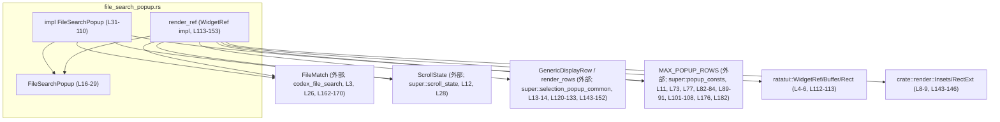
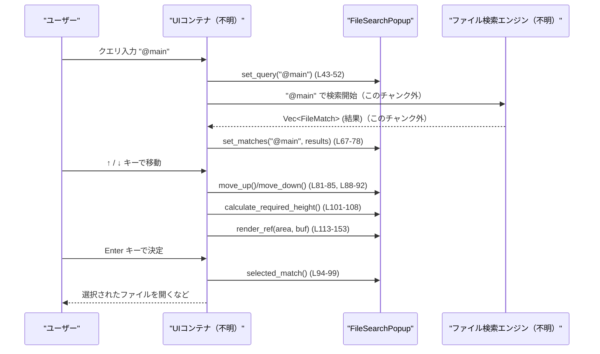

# tui/src/bottom_pane/file_search_popup.rs コード解説

## 0. ざっくり一言

ファイル検索ポップアップの **表示状態（クエリ・検索結果・選択・スクロール）と描画** を管理する TUI コンポーネントです。  
バックグラウンドで動くファイル検索結果を受け取り、最大行数にページングしつつ、共通のポップアップ描画ロジックに渡します。

---

## 1. このモジュールの役割

### 1.1 概要

- このモジュールは、ファイル検索機能のポップアップに必要な状態と描画処理をまとめた構造体 `FileSearchPopup` を提供します（`tui/src/bottom_pane/file_search_popup.rs:L16-29`）。
- ユーザーが入力したクエリ、検索中かどうか、検索結果の `FileMatch` 一覧、選択・スクロール位置（`ScrollState`）を保持します（L18-28）。
- 背景で実行されるファイル検索エンジンから結果を受け取り、古いクエリの結果を無視することで **検索の取り違えを防ぐ** 振る舞いを実装しています（`set_matches` のクエリ一致チェック, L67-70）。
- `WidgetRef` の実装として `render_ref` を提供し、`GenericDisplayRow` と `render_rows` を使って ratatui 上にポップアップを描画します（L112-153）。

### 1.2 アーキテクチャ内での位置づけ

このファイル単体から読み取れる依存関係を図示します。



このチャンクには、`ScrollState`・`GenericDisplayRow`・`render_rows`・`MAX_POPUP_ROWS` の定義本体は現れません。役割は以下のとおりです（コードから推測できる範囲）:

- `ScrollState`: 選択インデックス `selected_idx` とスクロール位置を管理し、`move_up_wrap` / `move_down_wrap` / `clamp_selection` / `ensure_visible` を提供する状態オブジェクト（L28, L76-77, L83-84, L90-91, L95-97）。
- `GenericDisplayRow`: ポップアップの 1 行分の表示情報（ファイル名・ハイライトインデックスなど）を保持する構造体（L120-133）。
- `render_rows`: 与えられた `GenericDisplayRow` とスクロール状態から、実際の TUI バッファへ描画する共通関数（L14, L143-152）。
- `MAX_POPUP_ROWS`: ポップアップに表示する最大行数（L11, L73, L77, L82-84, L89-91, L101-108, L176, L182）。

### 1.3 設計上のポイント

コードから読み取れる設計上の特徴を列挙します。

- **クエリの二重管理**（L18-24）
  - `display_query`: 現在の画面表示に対応するクエリ。
  - `pending_query`: 最新のユーザー入力クエリ。検索中の場合は `display_query` と異なる可能性あり。
  - これにより「新しい検索結果が届くまで旧結果を表示し続ける」ことが可能になっています（コメント L20-23）。

- **古い検索結果の無視**（L67-70）
  - `set_matches` 内で `if query != self.pending_query { return; }` としており、**結果のクエリ文字列と現在の `pending_query` が一致したときだけ結果を受理**します。
  - これにより、並行して走った古いクエリの結果が UI に反映されることを防いでいます。

- **最大表示行数と高さ計算の一貫性**  
  - `set_matches` で `matches.into_iter().take(MAX_POPUP_ROWS).collect()` により、内部に保持する結果は常に `MAX_POPUP_ROWS` 以下に制限されます（L72-74）。
  - `calculate_required_height` も `self.matches.len().clamp(1, MAX_POPUP_ROWS) as u16` を返すため（L101-108）、**内部に保持する件数と描画高さの上限が一致**します。
  - テストで「1ページ分だけ保持され、高さも一致する」ことが確認されています（L172-183）。

- **スクロールと選択状態の一元管理**  
  - `ScrollState` に `selected_idx` を含めて選択とスクロールを統合管理し、`move_up_wrap` / `move_down_wrap` / `ensure_visible` でカーソル移動と表示範囲の整合性を保っています（L81-85, L88-92, L95-97）。
  - `set_matches` で `clamp_selection` と `ensure_visible` を呼び出すことで、新しい結果セットに対して選択インデックスが不正にならないようにしています（L75-77）。

- **描画は純粋関数的に行う**  
  - `render_ref` は `&self` を受け取り、副作用はバッファ書き込みのみです（L112-153）。
  - `matches` から毎回 `Vec<GenericDisplayRow>` を構築して `render_rows` に渡すことで、描画ロジックを共通化しています（L115-135, L143-152）。

- **Rust の安全性**  
  - `unsafe` は一切使われていません。このファイルでは `Option` と `Vec::get` を組み合わせて配列アクセスを安全に行っています（`selected_match`, L94-99）。
  - エラーは `Result` ではなく UI 状態（`waiting` フラグや空の `matches`、メッセージ文字列）で表現しています（L23-24, L137-141）。

---

## 2. コンポーネント一覧と主要機能

### 2.1 型・コンポーネント一覧

| 名前 | 種別 | 役割 / 用途 | 定義 / 使用行 |
|------|------|------------|----------------|
| `FileSearchPopup` | 構造体 | ファイル検索ポップアップの表示状態（クエリ、待機フラグ、マッチ一覧、スクロール状態）を保持する | 定義: L16-29 |
| `ScrollState` | 構造体（外部） | 選択インデックス `selected_idx` やスクロール位置を管理し、カーソル移動と可視範囲の制御を行う | 使用: L12, L28, L62, L76-77, L83-84, L90-91, L95-97, L149 |
| `FileMatch` | 構造体（外部; codex_file_search） | ファイルパス・スコア・マッチ位置などを表す。`matches` の要素型として利用 | 使用: L3, L26, L67, L73, L94-99, L162-170, L176, L179-181 |
| `GenericDisplayRow` | 構造体（外部） | 汎用ポップアップ用の 1 行表示モデル。ファイル名やハイライトインデックスなどを保持 | 使用: L13, L115-135 |
| `render_rows` | 関数（外部） | `GenericDisplayRow` と `ScrollState` を元に、領域内に行を描画する共通関数 | 使用: L14, L143-152 |
| `MAX_POPUP_ROWS` | 定数（外部） | ポップアップに表示する最大行数。内部保持件数や高さ計算にも利用 | 使用: L11, L73, L77, L82-84, L89-91, L101-108, L176, L182 |
| `Insets`, `RectExt` | 構造体 / トレイト（外部） | 描画領域 `Rect` に対するインセット（余白調整）を行うために使用 | 使用: L8-9, L143-146 |
| `WidgetRef` | トレイト（外部; ratatui） | `render_ref` メソッドを定義するトレイト。参照を受け取って描画するウィジェットを実装 | 使用: L6, L112-153 |

### 2.2 関数・メソッド一覧（インベントリ）

| 名前 | 所属 | 受け取り | 概要 | 行範囲 |
|------|------|----------|------|--------|
| `new()` | `impl FileSearchPopup` | - | 空の状態でポップアップを初期化し、`waiting = true` に設定 | L32-40 |
| `set_query(&mut self, query: &str)` | `impl FileSearchPopup` | `&mut self` | ユーザーの新しいクエリを `pending_query` に保存し、検索待ち状態にする | L43-52 |
| `set_empty_prompt(&mut self)` | `impl FileSearchPopup` | `&mut self` | クエリが空（例: "@" のみ）の場合の「待機・ヒント表示」状態へリセット | L56-63 |
| `set_matches(&mut self, query: &str, matches: Vec<FileMatch>)` | `impl FileSearchPopup` | `&mut self` | 指定クエリに対する検索結果で `matches` を更新（古いクエリは無視）。件数を `MAX_POPUP_ROWS` に制限 | L67-78 |
| `move_up(&mut self)` | `impl FileSearchPopup` | `&mut self` | 選択カーソルを 1 行上に移動（先頭からは末尾へラップ）し、可視範囲を調整 | L81-85 |
| `move_down(&mut self)` | `impl FileSearchPopup` | `&mut self` | 選択カーソルを 1 行下に移動（末尾からは先頭へラップ）し、可視範囲を調整 | L88-92 |
| `selected_match(&self) -> Option<&PathBuf>` | `impl FileSearchPopup` | `&self` | 現在選択されている `FileMatch` のパスを安全に取得 | L94-99 |
| `calculate_required_height(&self) -> u16` | `impl FileSearchPopup` | `&self` | 現在の `matches` 件数から必要なポップアップ高さ（行数）を計算 | L101-108 |
| `render_ref(&self, area: Rect, buf: &mut Buffer)` | `impl WidgetRef for &FileSearchPopup` | `&self` | 現在の状態に基づいてポップアップを ratatui バッファへ描画 | L113-153 |
| `file_match(index: usize) -> FileMatch` | `tests` モジュール | - | テスト用に連番付きファイルパスを持つ `FileMatch` を生成 | L162-170 |
| `set_matches_keeps_only_the_first_page_of_results()` | `tests` モジュール | - | `set_matches` が 1 ページ分（`MAX_POPUP_ROWS` 件）だけを保持し、高さも一致することを検証 | L172-183 |

### 2.3 主要な機能一覧（概念レベル）

- 検索クエリ管理: 表示用クエリと未確定クエリ（`display_query` / `pending_query`）の管理と更新（L18-24, L43-52, L56-63, L72）。
- 検索結果の適用とページング: `set_matches` による結果の取り込み、古い結果の破棄、1ページ分へのトリミング（L67-78）。
- 選択・スクロール制御: `ScrollState` と `move_up` / `move_down` / `calculate_required_height` を通じたカーソル移動と表示範囲制御（L81-85, L88-92, L101-108）。
- 選択結果の取得: 現在選択されているファイルパスを `Option<&PathBuf>` として取得（L94-99）。
- 描画: `WidgetRef` 実装 `render_ref` による、マッチ一覧または「loading...」/「no matches」メッセージの描画（L113-153）。

---

## 3. 公開 API と詳細解説

### 3.1 型一覧（構造体・列挙体など）

| 名前 | 種別 | 役割 / 用途 | 主なフィールド（このファイルから分かる範囲） |
|------|------|------------|----------------------------------------------|
| `FileSearchPopup` | 構造体 | ファイル検索ポップアップの表示状態を一括管理する。クエリ、待機フラグ、`FileMatch` の一覧、`ScrollState` を保持 | `display_query: String`（表示中クエリ, L19）、`pending_query: String`（最新入力クエリ, L22）、`waiting: bool`（検索待ちかどうか, L24）、`matches: Vec<FileMatch>`（検索結果, L26）、`state: ScrollState`（選択・スクロール状態, L28） |

`ScrollState` や `FileMatch` など外部型の詳細な中身は、このチャンクには現れませんが、`selected_idx: Option<usize>` フィールドが存在することは参照から分かります（L95-97）。

---

### 3.2 重要関数の詳細

#### `FileSearchPopup::new() -> Self`（L32-40）

**概要**

- `FileSearchPopup` を **初期状態** で構築します。
- クエリは空文字列、結果リストは空、`waiting = true`、`ScrollState` は `ScrollState::new()` で初期化されます（L34-39）。

**引数**

なし。

**戻り値**

- `FileSearchPopup` 初期インスタンス。

**内部処理の流れ**

1. `display_query` と `pending_query` を空文字列で初期化（L34-35）。
2. `waiting` を `true` にセット（L36）。
3. `matches` を空の `Vec` で初期化（L37）。
4. `state` を `ScrollState::new()` で初期化（L38）。

**Examples（使用例）**

```rust
use tui::bottom_pane::file_search_popup::FileSearchPopup; // 実際のパスは crate 構成に依存（このチャンクからは不明）

fn create_popup() -> FileSearchPopup {
    // 空のポップアップ状態を作成する
    FileSearchPopup::new()
}
```

**Errors / Panics**

- `new` はメモリ確保以外に失敗要因はなく、`Result` を返しません。
- この関数自体からパニックを起こすコードは見当たりません（L32-40）。

**Edge cases（エッジケース）**

- 特に入力がないため、エッジケースはありません。

**使用上の注意点**

- `waiting` が `true` の状態から始まるため、初期描画時は `empty_message` として `"loading..."` が表示されます（`render_ref`, L137-141）。

---

#### `FileSearchPopup::set_query(&mut self, query: &str)`（L43-52）

**概要**

- ユーザーの新しい検索クエリを `pending_query` に保存し、**検索待ち状態 (`waiting = true`) に遷移**させます。
- すでに同じ `query` が設定されている場合は何もしません（L44-46）。

**引数**

| 引数名 | 型 | 説明 |
|--------|----|------|
| `query` | `&str` | ユーザーが入力した新しい検索クエリ文字列 |

**戻り値**

- なし（`()`）。

**内部処理の流れ**

1. 渡された `query` が現在の `pending_query` と同じであれば、早期リターン（L44-46）。
2. `pending_query.clear()` で既存のクエリをクリアし（L48）、`push_str(query)` で新しい文字列をコピー（L49）。
3. `waiting` を `true` に設定し、検索結果待ち状態にする（L51）。

**Examples（使用例）**

```rust
fn update_query(popup: &mut FileSearchPopup) {
    // ユーザーが "main.rs" と入力したとき
    popup.set_query("main.rs"); // pending_query を更新し waiting = true になる
    // ここで別スレッド/タスクでファイル検索を開始するのが想定利用（このチャンクには現れない）
}
```

**Errors / Panics**

- パニックを起こす操作は行っていません。
- `String::clear` / `push_str` による通常のメモリ操作のみです。

**Edge cases（エッジケース）**

- `query` が現在の `pending_query` と同じ文字列の場合は何も行いません（L44-46）。
  - その場合、`waiting` の値も変更されません。
- 空文字列を設定した場合でも特別扱いはなく、`pending_query` は空文字列になり `waiting = true` になります。

**使用上の注意点**

- **`set_matches` は `pending_query` を基準に結果を受け入れる**ため、`set_matches` の前に必ず `set_query` で対応する `query` を設定しておく必要があります（L67-70）。
- 同じクエリで再検索を強制したい場合、この実装では `pending_query` と異なる文字列で呼ぶ必要があります。再検索の仕組みが必要な場合はこの条件（L44-46）を変更する必要があります。

---

#### `FileSearchPopup::set_empty_prompt(&mut self)`（L56-63）

**概要**

- クエリが「空（例: 単なる `@`）」のときに使われる **アイドル状態** に移行します（コメント L54-55）。
- すべてのクエリ文字列と結果をクリアし、`waiting = false` にし、スクロール・選択状態もリセットします（L57-62）。

**引数**

なし。

**戻り値**

- なし。

**内部処理の流れ**

1. `display_query` と `pending_query` を `clear()` で空にする（L57-58）。
2. `waiting` を `false` に設定（L59）。
3. `matches.clear()` で結果一覧を空にする（L60）。
4. `self.state.reset()` によってスクロール・選択状態をリセット（L62）。

**Examples（使用例）**

```rust
fn handle_idle(popup: &mut FileSearchPopup) {
    // 例えば、クエリが "@" だけのときに idle 状態へ切り替える
    popup.set_empty_prompt();
    // この状態では matches は空で waiting = false になる
}
```

**Errors / Panics**

- 見える範囲でパニック要因はありません。

**Edge cases（エッジケース）**

- すでに `matches` が空の状態で呼び出しても問題ありません（`clear()` は安全）。
- `selected_idx` を含むスクロール状態は無条件にリセットされます。
  - そのため、前の検索結果に対する選択は失われます。

**使用上の注意点**

- この関数は「空クエリ用の特別状態」としてコメントされており（L54-55）、通常の検索結果表示状態との切り替えに使用されることが想定されます。
- 呼び出し後に `render_ref` を行うと、`matches` が空で `waiting = false` のため `"no matches"` メッセージが表示されます（L115-117, L137-141）。

---

#### `FileSearchPopup::set_matches(&mut self, query: &str, matches: Vec<FileMatch>)`（L67-78）

**概要**

- ファイル検索エンジンから届いた `matches` をポップアップに適用します。
- **`query` が現在の `pending_query` と一致する場合のみ**適用し、それ以外（古いクエリの結果）は無視します（L67-70）。
- `matches` は `MAX_POPUP_ROWS` 件までに制限され、`ScrollState` の選択・可視範囲も整合性を保つよう更新されます（L72-77）。

**引数**

| 引数名 | 型 | 説明 |
|--------|----|------|
| `query` | `&str` | この結果が対応する検索クエリ文字列 |
| `matches` | `Vec<FileMatch>` | このクエリに対応する検索結果の一覧 |

**戻り値**

- なし。

**内部処理の流れ**

1. 引数 `query` が `self.pending_query` と異なる場合、即座に `return` して結果を破棄（「stale」とコメントされている, L68-69）。
2. 一致している場合:
   1. `display_query` を `query.to_string()` で更新（L72）。
   2. `matches.into_iter().take(MAX_POPUP_ROWS).collect()` により、先頭 `MAX_POPUP_ROWS` 件だけを `self.matches` に保存（L73）。
   3. `waiting` を `false` に設定（L74）。
   4. 現在の件数 `len` を `self.matches.len()` から取得（L75）。
   5. `self.state.clamp_selection(len)` で選択インデックスを `[0, len)` に収める（L76）。
   6. `self.state.ensure_visible(len, len.min(MAX_POPUP_ROWS))` で選択行が可視範囲に収まるようスクロール位置を調整（L77）。

**Examples（使用例）**

```rust
fn apply_search_results(popup: &mut FileSearchPopup, query: &str, results: Vec<FileMatch>) {
    // set_query で pending_query を更新してから、
    popup.set_query(query);

    // 検索エンジンから results が返ってきたときに set_matches を呼ぶ
    popup.set_matches(query, results);
    // query が pending_query と一致していれば結果が反映される
}
```

**Errors / Panics**

- `Vec::into_iter().take().collect()` の通常のメモリ操作のみで、パニック要因は見当たりません。
- インデックス操作は `ScrollState` 内部で行われますが、このファイル内では `.get` や `clamp_selection` を通じて安全に扱われています（L75-77）。

**Edge cases（エッジケース）**

- `query != pending_query` の場合:
  - 何も変更せずに終了します（L68-69）。結果は完全に無視されます。
- `matches` が空の場合:
  - `self.matches` も空になりますが、`calculate_required_height` では `clamp(1, MAX_POPUP_ROWS)` により高さ 1 行が確保されるため、ポップアップ自体は表示されます（L101-108）。
- `matches` の件数が `MAX_POPUP_ROWS` より多い場合:
  - 先頭 `MAX_POPUP_ROWS` 件だけが保持されます（L73）。
  - テスト `set_matches_keeps_only_the_first_page_of_results` がこの挙動を確認しています（L172-183）。

**使用上の注意点**

- **必ず `set_query` と組み合わせる**  
  - `pending_query` が空文字列のまま（`new` 直後に `set_matches` のみ呼ぶなど）の場合、`query` が空文字列でなければ結果は無視されます（L67-70）。
- `pending_query` は `set_matches` では変更されません（L72-77）。  
  - `display_query` のみ更新される点に注意が必要です。
- 大量の結果が返ってきても内部に保持されるのは `MAX_POPUP_ROWS` 件だけです。2 ページ目以降の結果を扱いたい場合、この挙動を前提に別のページング機構が必要になります。

---

#### `FileSearchPopup::selected_match(&self) -> Option<&PathBuf>`（L94-99）

**概要**

- 現在の `ScrollState` の `selected_idx` に基づき、選択中の `FileMatch` のパスを **安全に** 取得します。
- 選択されていない場合やインデックスが範囲外の場合は `None` を返します（L95-98）。

**引数**

なし（`&self` のみ）。

**戻り値**

- `Option<&PathBuf>`:
  - `Some(&PathBuf)`：選択中のエントリが存在する場合、そのパスへの参照。
  - `None`：選択がないか、インデックスが範囲外の場合。

**内部処理の流れ**

1. `self.state.selected_idx`（`Option<usize>`）を取得（L95-96）。
2. `and_then(|idx| self.matches.get(idx))` により、インデックスが存在し、かつ `matches` 内にその要素がある場合のみ `Some(&FileMatch)` を得る（L95-97）。
3. `.map(|file_match| &file_match.path)` で、`FileMatch` から `PathBuf` への参照を取り出し、最終的に `Option<&PathBuf>` を返す（L98）。

**Examples（使用例）**

```rust
fn open_selected(popup: &FileSearchPopup) {
    if let Some(path) = popup.selected_match() {
        // 選択中のファイルを開くなどの処理を行う
        println!("Opening {:?}", path);
    } else {
        // 何も選択されていない場合の処理
        println!("No file selected");
    }
}
```

**Errors / Panics**

- インデックスアクセスは `Vec::get(idx)` を通じて行われており（L97）、範囲外の場合は `None` となるためパニックは発生しません。
- `selected_idx` が `None` の場合にも問題なく `None` を返します。

**Edge cases（エッジケース）**

- `selected_idx` が `None` の場合:
  - 即座に `None` を返します（L95-97）。
- `selected_idx` が `Some` だが `matches.len()` より大きい場合:
  - `matches.get(idx)` が `None` を返し、その後の `map` は実行されないため、`None` が返ります（L95-98）。
  - 通常は、`set_matches` / `move_up` / `move_down` が `clamp_selection` / `move_*_wrap` を通じてこの状況を避けています（L75-77, L82-84, L89-91）。

**使用上の注意点**

- `selected_match` は `PathBuf` の参照を返すため、呼び出し側で所有権が必要な場合は `.to_path_buf()` 等でクローンする必要があります。
- 戻り値が `Option` であるため、必ず `match` や `if let` で `None` ケースを処理する必要があります。

---

#### `FileSearchPopup::calculate_required_height(&self) -> u16`（L101-108）

**概要**

- 現在の `matches` の件数に基づいて、ポップアップに必要な高さ（行数）を計算します。
- 少なくとも 1 行、最大 `MAX_POPUP_ROWS` 行になるようにクランプします（L108）。

**引数**

なし（`&self` のみ）。

**戻り値**

- `u16`: 描画に必要な行数。

**内部処理の流れ**

1. `self.matches.len()` で現在のマッチ件数を取得。
2. `.clamp(1, MAX_POPUP_ROWS)` により、`[1, MAX_POPUP_ROWS]` の範囲に収める（L108）。
3. `as u16` でキャストして返却（L108）。

**Examples（使用例）**

```rust
fn layout_popup(popup: &FileSearchPopup, terminal_height: u16) -> u16 {
    let required = popup.calculate_required_height();
    // 例えばターミナル高さとの min を取るレイアウトなど（ここでは単純に返す）
    required.min(terminal_height)
}
```

**Errors / Panics**

- `usize::clamp` と単純なキャストのみで、パニックを起こす操作はありません。

**Edge cases（エッジケース）**

- `matches.len() == 0` の場合:
  - `clamp(1, MAX_POPUP_ROWS)` により、1 行が返され、ポップアップが完全に消えないようになっています（コメント L102-106）。
- `matches.len() >= MAX_POPUP_ROWS` の場合:
  - `MAX_POPUP_ROWS` が返されます。
- `matches.len()` が `usize::MAX` など極端に大きい値になる可能性は、`set_matches` によって `MAX_POPUP_ROWS` 件に制限されるため、このモジュール内の通常経路では発生しません（L73）。

**使用上の注意点**

- レイアウト側ではこの値を信頼して、**描画行数と `MAX_POPUP_ROWS` を整合させる**ことができます。
- テストで、`set_matches` により `matches` が `MAX_POPUP_ROWS` 件にトリミングされた状況で、この関数が同じ値を返すことが確認されています（L172-183）。

---

#### `impl WidgetRef for &FileSearchPopup { fn render_ref(&self, area: Rect, buf: &mut Buffer) }`（L112-153）

**概要**

- `FileSearchPopup` の現在の状態に基づいて、ポップアップの内容を ratatui のバッファに描画します。
- `matches` を `GenericDisplayRow` のベクタへ変換し、`render_rows` に渡して描画を委譲します（L115-135, L143-152）。
- `matches` が空の場合は `"loading..."` または `"no matches"` のメッセージのみを描画します（L137-141）。

**引数**

| 引数名 | 型 | 説明 |
|--------|----|------|
| `area` | `Rect` | 描画対象の矩形領域 |
| `buf` | `&mut Buffer` | 描画先の ratatui バッファ |

**戻り値**

- なし。

**内部処理の流れ**

1. **`rows_all` の構築**（L115-135）
   - `self.matches.is_empty()` なら空の `Vec` を使用（L115-117）。
   - それ以外の場合、各 `FileMatch` から `GenericDisplayRow` を構築（L118-133）:
     - `name`: `m.path.to_string_lossy().to_string()` — パスを表示用文字列に変換（L121）。
     - `name_prefix_spans`: 空の `Vec`（L122）。
     - `match_indices`: `m.indices.as_ref().map(|v| v.iter().map(|&i| i as usize).collect())` で、インデックスを `usize` ベクタに変換（L123-126）。
     - その他のフィールド（`display_shortcut`, `description`, `category_tag`, `wrap_indent`, `is_disabled`, `disabled_reason`）は固定値（`None` または `false`）で初期化（L127-132）。
2. **空メッセージ決定**（L137-141）
   - `self.waiting` が `true` なら `"loading..."`、それ以外なら `"no matches"` を `empty_message` として設定。
3. **描画呼び出し**（L143-152）
   - `area.inset(Insets::tlbr(0, 2, 0, 0))` で左側に 2 文字のインデントを付けた領域を計算（L143-146）。
   - `render_rows(..., &rows_all, &self.state, MAX_POPUP_ROWS, empty_message)` を呼び出し、一覧と選択状態の描画を委譲（L147-152）。

**Examples（使用例）**

```rust
fn draw_popup(popup: &FileSearchPopup, f: &mut ratatui::Frame) {
    let area = /* レイアウトで計算した Rect */;
    // FileSearchPopup は WidgetRef for &FileSearchPopup を実装しているので、
    // &popup をウィジェットとして渡せる（このファイル L112-153）。
    popup.render_ref(area, f.buffer_mut());
}
```

※ 実際のフレーム型やバッファ取得方法は ratatui のバージョンとアプリ全体の構成に依存し、このチャンクには現れません。

**Errors / Panics**

- 見える範囲ではパニック要因はありません。
- `indices` の各要素を `as usize` でキャストしていますが（L123-126）、元の型はこのチャンクには現れません。
  - ここでのキャストが情報損失やオーバーフローにつながるかどうかは、`FileMatch::indices` の要素型に依存します（不明）。

**Edge cases（エッジケース）**

- `self.matches` が空の場合:
  - `rows_all` は空ベクタになります（L115-117）。
  - `empty_message` は `waiting` に応じて `"loading..."` または `"no matches"` になります（L137-141）。
- `self.waiting = true` かつ `matches` が空:
  - 「初回検索中」または「最新検索中」という状態として `"loading..."` が表示されます（コメント L102-106 と整合）。
- `indices` が `None` の場合:
  - `match_indices` も `None` になります（L123-126）。
- `indices` が `Some` だが空ベクタの場合:
  - キャスト後も空ベクタになります。

**使用上の注意点**

- `render_ref` は **状態を変更しない**（`&self`）ため、描画処理内で `FileSearchPopup` の状態を変えたい場合は別途 `&mut` メソッドを呼び出す必要があります。
- `render_rows` に渡す行数の上限は `MAX_POPUP_ROWS` で固定されており（L150）、`calculate_required_height` と整合しています。
- `area.inset` による左インデントは固定値（2）であり（L143-146）、ポップアップ全体のレイアウト変更時にはこの値も合わせて検討する必要があります。

---

### 3.3 その他の関数

| 関数名 | 所属 | 役割（1 行） | 行範囲 |
|--------|------|--------------|--------|
| `move_up(&mut self)` | `impl FileSearchPopup` | マッチ数に応じてカーソルを 1 行上に移動し、可視範囲を調整する | L81-85 |
| `move_down(&mut self)` | `impl FileSearchPopup` | マッチ数に応じてカーソルを 1 行下に移動し、可視範囲を調整する | L88-92 |
| `file_match(index: usize)` | `tests` | テスト用 `FileMatch` を作るヘルパー。`score` と `path` に `index` を反映 | L162-170 |
| `set_matches_keeps_only_the_first_page_of_results()` | `tests` | `set_matches` が `MAX_POPUP_ROWS` 件だけを保持し、高さも一致することを確認する単体テスト | L172-183 |

`move_up` / `move_down` は `ScrollState` の振る舞いに依存するため、詳細な挙動は `scroll_state` モジュール側にあります（このチャンクには現れません）。

---

## 4. データフロー

### 4.1 代表的な処理シナリオ：検索 → 結果反映 → 選択 → 描画

ファイル検索ポップアップの典型的なデータフローは以下のようになります（呼び出し元 UI コンポーネントはこのチャンクには現れません）。



要点:

- **検索開始**: `set_query` が `pending_query` を更新し、`waiting = true` に設定（L43-52）。
- **結果適用**: `set_matches` は `query == pending_query` のときのみ結果を適用、1 ページ分にトリミングし、`waiting = false` とする（L67-78）。
- **選択移動**: `move_up` / `move_down` が `ScrollState` を通じて選択とスクロールを更新（L81-85, L88-92）。
- **描画**:
  - 高さ計算: `calculate_required_height`（L101-108）。
  - 内容描画: `render_ref` が `rows_all` を構築し、`render_rows` に委譲（L113-135, L143-152）。
- **確定**: `selected_match` で選択されたファイルパスを取得（L94-99）。

---

## 5. 使い方（How to Use）

### 5.1 基本的な使用方法

このモジュールを利用する典型的なフローを、簡略化した疑似コードで示します。

```rust
use std::path::PathBuf;
use codex_file_search::FileMatch;
use tui::bottom_pane::file_search_popup::FileSearchPopup; // 実際のパスはこのチャンクからは不明

// ファイル検索エンジンから結果が届いたときに呼ばれるコールバックの例
fn on_search_results(popup: &mut FileSearchPopup, query: &str, results: Vec<FileMatch>) {
    // クエリと結果を対応付けてポップアップに反映
    popup.set_matches(query, results);
}

// キー入力処理の例（非常に簡略化）
fn handle_key(popup: &mut FileSearchPopup, key: Key) {
    match key {
        Key::Char('@') => {
            // 特別な空クエリ扱い
            popup.set_empty_prompt();
        }
        Key::Char(c) => {
            // クエリ文字列に c を追加したと仮定して set_query を呼ぶ
            let new_query = /* 現在のクエリ + c （このチャンクには現れない） */;
            popup.set_query(&new_query);
            // ここで非同期検索を開始するのが想定利用
        }
        Key::Up => popup.move_up(),
        Key::Down => popup.move_down(),
        Key::Enter => {
            if let Some(path) = popup.selected_match() {
                // 選択中のファイルを開く処理
                open_file(path);
            }
        }
        _ => {}
    }
}

// 描画時の例（ratatui のレイアウトとの統合）
fn draw_popup(popup: &FileSearchPopup, frame: &mut ratatui::Frame) {
    // 高さを計算
    let height = popup.calculate_required_height();
    let area = /* レイアウト計算で高さ height の Rect を決定 */

    // &FileSearchPopup は WidgetRef を実装しているので、そのまま描画できる
    popup.render_ref(area, frame.buffer_mut());
}
```

> 実際のキー型 `Key` やレイアウト計算、`open_file` の実装は、このファイルには現れません。

### 5.2 よくある使用パターン

1. **検索開始 → 結果反映**

   - `set_query(query)` でクエリをセットし、`waiting = true` にする（L43-52）。
   - 背景で `query` に対する検索を開始（このチャンク外）。
   - 結果が届いたら `set_matches(query, results)` を呼ぶ（L67-78）。

2. **空クエリによるヒント表示**

   - クエリが単なる `@` など「実際の検索を行わないトリガ」のときに `set_empty_prompt()` を呼ぶ（L54-63）。
   - `waiting = false` かつ `matches` が空になるため、`render_ref` では `"no matches"` メッセージが表示されます（L137-141）。

3. **カーソル移動と選択**

   - 上矢印キー: `move_up()`（L81-85）。
   - 下矢印キー: `move_down()`（L88-92）。
   - 確定: `selected_match()` で選択されたパスを取得（L94-99）。

### 5.3 よくある間違いと注意点

```rust
// 間違い例: set_query を呼ばずに set_matches を先に呼ぶ
let mut popup = FileSearchPopup::new();
let results = vec![/* ... */];
// pending_query は "" のままなので、"main" という query は一致せず結果は捨てられる
popup.set_matches("main", results); // query != pending_query で return (L67-70)

// 正しい順序: 先に set_query で pending_query を設定してから set_matches を呼ぶ
let mut popup = FileSearchPopup::new();
popup.set_query("main");                  // pending_query = "main"
let results = vec![/* ... */];
popup.set_matches("main", results);       // 一致するので結果が反映される
```

その他の注意点:

- **選択がない状態の扱い**  
  - `selected_match` は `Option<&PathBuf>` を返すため、`None` ケースを必ず処理する必要があります（L94-99）。
- **結果のページング**  
  - `set_matches` に大量の `results` を渡しても、内部に保持されるのは `MAX_POPUP_ROWS` 件だけです（L73）。
  - 2 ページ目以降を扱いたい場合は、呼び出し側でページングを管理する必要があります（このチャンクには機構がありません）。

### 5.4 使用上の共通注意点（安全性・エラー・並行性）

- **メモリ安全性**
  - `unsafe` は一切使用しておらず、配列アクセスは `Vec::get` と `Option` を通じて安全に行われます（例: L94-99）。
  - `ScrollState::clamp_selection` / `ensure_visible` を通じて、選択インデックスと `matches` の整合性を保つ設計になっています（L75-77）。

- **エラー表現**
  - `Result` や `panic!` を使ったエラー処理はなく、「結果なし」「検索中」といった状態は `waiting` フラグと `matches` の有無、`empty_message` 文字列で表現されています（L23-24, L137-141）。

- **並行性**
  - すべての変更系メソッドは `&mut self` を取るため、**同時に複数スレッドから書き込み操作を行う前提ではありません**。
  - ファイル検索自体は非同期・並行で行われる可能性がありますが、このチャンクからは検索エンジン側の実装は分かりません。
  - `set_matches` のクエリ一致チェックにより、並行検索による「古い結果の上書き」は防がれています（L67-70）。

- **潜在的な注意点**
  - `indices` の要素を `as usize` でキャストしている箇所があります（L123-126）。
    - `FileMatch::indices` の要素型が符号付き整数などの場合、キャスト時の挙動（負値の扱いなど）は外部型の定義に依存します。このチャンクのみからは安全性を評価できません。

---

## 6. 変更の仕方（How to Modify）

### 6.1 新しい機能を追加する場合

1. **表示内容を拡張する（例: カテゴリ・説明文の表示）**

   - `GenericDisplayRow` には `description` や `category_tag` など、現在は `None` 固定のフィールドがあります（L127-130）。
   - ファイルごとの追加情報を表示したい場合:
     1. `FileMatch` や別のメタデータ構造体に必要な情報を追加する（このチャンクには定義がないため、対応するモジュールで変更）。
     2. `render_ref` 内の `map(|m| GenericDisplayRow { ... })` 部分で、それらを `description` などにセットする（L118-133）。
     3. `selection_popup_common::render_rows` がそれらのフィールドを描画するようになっているか確認し、必要ならそちらも変更する。

2. **ページング動作を変更する**

   - 現状は常に先頭 `MAX_POPUP_ROWS` 件だけを保持しています（L73）。
   - 複数ページに対応したい場合:
     - `FileSearchPopup` に現在ページのインデックスを表すフィールドを追加（構造体定義 L16-29）。
     - `set_matches` を拡張してページ単位での保持・切り替えロジックを導入。
     - `move_up` / `move_down` でページ境界を越えたときに、必要に応じて別ページをロードする処理を追加。

3. **待機メッセージのカスタマイズ**

   - 現在の `empty_message` は `"loading..."` / `"no matches"` に固定されています（L137-141）。
   - 多言語対応や別文言が必要な場合は、`FileSearchPopup` にメッセージ文字列やローカライズキーを持たせ、`render_ref` 内でそれを参照する形に変更できます。

### 6.2 既存の機能を変更する場合（契約・注意点）

- **`set_matches` の契約を変更する際の注意**

  - 現在の契約:
    - `query == pending_query` のときだけ結果を反映する（L67-70）。
    - 最大 `MAX_POPUP_ROWS` 件まで保持する（L73）。
  - 変更時には:
    - この契約に依存した呼び出し元（テスト含む）への影響を確認する必要があります（テスト L172-183）。
    - `calculate_required_height` は `matches.len()` に依存しているため、新しい仕様と整合するか確認します（L101-108）。

- **スクロール・選択状態の扱い**

  - `set_empty_prompt` は `state.reset()` を呼びますが、`set_query` は呼びません（L43-52, L56-63）。
  - 新しいクエリが来たときに選択状態を維持するかリセットするかは、この挙動に依存します。
    - 選択をリセットしたい場合は、`set_query` でも `state.reset()` を呼ぶように変更するなどが考えられます。

- **テストの確認**

  - 現在のテストは `set_matches` のページングと高さ計算に依存しています（L172-183）。
  - 仕様変更時には必ずテストを更新し、期待される新しい挙動を明示する必要があります。

---

## 7. 関連ファイル

このモジュールと密接に関係するファイル・ディレクトリ（コード上の参照から分かる範囲）をまとめます。

| パス | 役割 / 関係 |
|------|------------|
| `tui/src/bottom_pane/popup_consts.rs`（推定） | `super::popup_consts::MAX_POPUP_ROWS` を定義しているモジュール。ポップアップの最大行数を決定（L11, L73, L77, L82-84, L89-91, L101-108, L176, L182）。定義内容はこのチャンクには現れません。 |
| `tui/src/bottom_pane/scroll_state.rs`（推定） | `super::scroll_state::ScrollState` を定義。選択インデックス `selected_idx` やスクロール位置を管理し、`move_up_wrap` / `move_down_wrap` / `clamp_selection` / `ensure_visible` を提供（L12, L28, L62, L76-77, L83-84, L90-91, L95-97, L149）。内部実装はこのチャンクには現れません。 |
| `tui/src/bottom_pane/selection_popup_common.rs`（推定） | `GenericDisplayRow` と `render_rows` を定義し、ポップアップの行描画を共通化（L13-14, L115-135, L143-152）。実際の描画スタイルやキーバインド表示などはこのチャンクには現れません。 |
| `tui/src/render.rs` または `tui/src/render/mod.rs`（推定） | `crate::render::Insets` と `RectExt` を定義し、`Rect` のインセット計算などを提供（L8-9, L143-146）。 |
| 外部クレート `codex_file_search` | `FileMatch` と `MatchType` を提供。ファイル検索エンジンの結果モデルとして利用（L3, L26, L162-170）。検索ロジック自体はこのチャンクには現れません。 |
| 外部クレート `ratatui` | `WidgetRef`, `Buffer`, `Rect` を提供し、TUI 描画の基盤となる（L4-6, L112-113）。 |
| 外部クレート `pretty_assertions` | テストで `assert_eq!` の差分表示を改善するために利用（L160）。 |

このチャンクからは、UI 全体の構造（どのコンポーネントが `FileSearchPopup` を保持し、いつどのメソッドを呼び出しているか）は分かりませんが、`set_query` / `set_matches` / `move_up` / `move_down` / `selected_match` / `render_ref` が主なインタラクションポイントであることが読み取れます。
