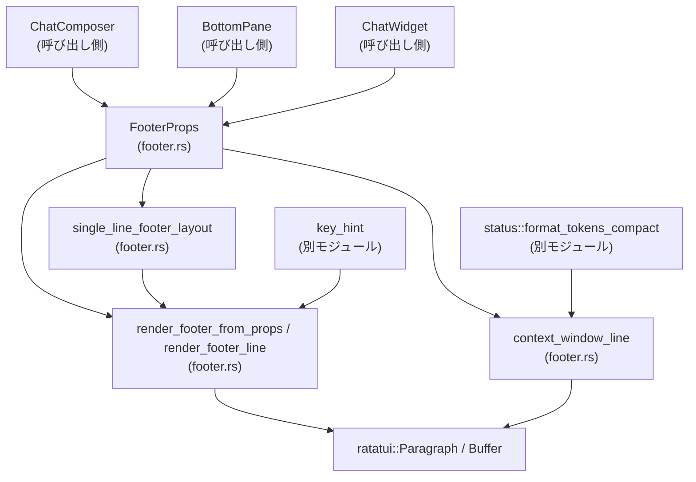
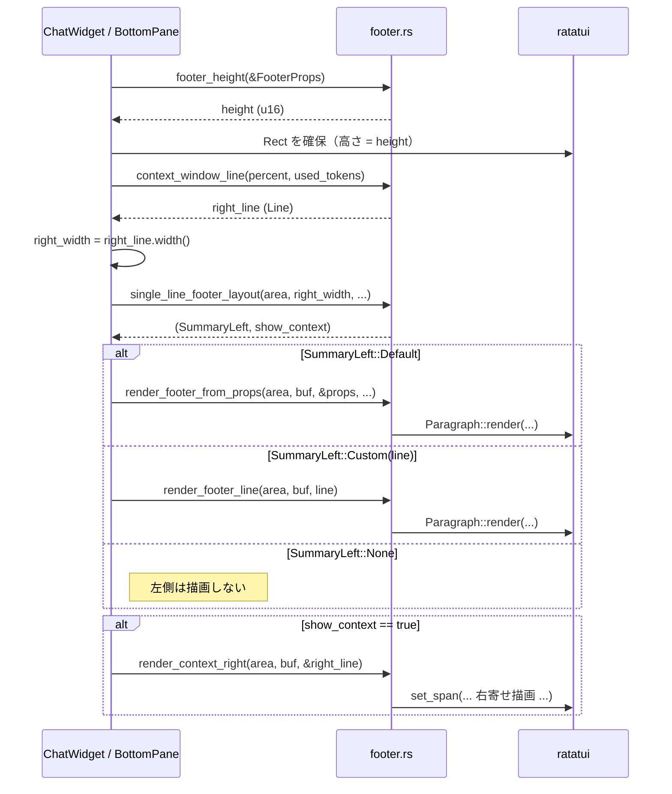

# tui/src/bottom_pane/footer.rs コード解説

※この回答では、ユーザー指定の「`ファイル名:L開始-終了` 形式の行番号」を付与したいところですが、こちらの環境からは元ソースの行番号情報を取得できないため、**関数や型の位置はファイル名ベースのみ**で示します。行番号を仮定して書くことは避けています。

---

## 0. ざっくり一言

- チャット入力欄の下に表示されるフッター（ショートカット説明・キュー状態・ステータス行・コンテキスト残量など）を、**状態 (`FooterProps`) から `Line` 群へ純粋にレンダリングするモジュール**です。
- 幅に応じた「表示内容の切り詰め（単一行レイアウトの崩し）」や、ショートカットオーバーレイの組み立てもここで行います。

---

## 1. このモジュールの役割

### 1.1 概要

- このモジュールは、チャット UI の下部に表示するフッター行のテキストとレイアウトを決定し、`ratatui` の `Buffer` / `Rect` に描画する役割を持ちます（`FooterProps` を入力とします）。
- 「現在の入力状態（空 / 下書きあり / 実行中）」「Esc / Ctrl+C のヒント状態」「コラボレーションモード」「コンテキスト残量」「ステータスライン設定」などを組み合わせて、**左側の“何をすべきか”ヒント**と **右側のコンテキスト指標**を決定します。
- モード遷移の制御（どのフッターをいつ表示するか）は `ChatComposer` や `ChatWidget` 側の責務であり、本モジュールは**純粋な表示ロジック**に限定されています（先頭ドキュコメントより）。

### 1.2 アーキテクチャ内での位置づけ

- 呼び出し側（`ChatComposer` / `BottomPane` / `ChatWidget`）が `FooterProps` を構築し、本モジュールの関数を呼んで `ratatui` のウィジェットに描画します（モジュールコメントより）。
- 右側のコンテキスト表示には `crate::status::format_tokens_compact` を経由した `context_window_line` が使われます。
- キー表記の装飾には `crate::key_hint`、インデントには `crate::ui_consts::FOOTER_INDENT_COLS`、左寄せ行の前後には `crate::render::line_utils::prefix_lines` が利用されます。
- 描画は `ratatui::widgets::Paragraph` と `render_context_right` から `ratatui::buffer::Buffer` へ行います。



### 1.3 設計上のポイント

- **純粋レンダリング**  
  - `FooterProps` とレイアウト用パラメータのみを入力とし、内部状態を持たず、副作用は `Buffer` への描画に限られます。
- **左側ヒントと右側コンテキストの明確な分離**
  - 左側: ショートカット・キュー・モードラベル（`left_side_line`, `single_line_footer_layout`）
  - 右側: コンテキスト残量 or モードインジケータ（`context_window_line`, `mode_indicator_line`, `render_context_right`）
- **幅に応じた段階的な“崩し（フォールバック）”**
  - デフォルトは「最も情報量の多い左側 + 右側コンテキスト」。幅が足りない場合に、キュー/ショートカットの短縮・削除やコンテキスト非表示などを段階的に試します（`single_line_footer_layout` のコメントと処理）。
- **モードごとの責務分離**
  - 表示対象の種類は `FooterMode`（Quit リマインダ・ショートカットオーバーレイ・Esc ヒント・通常フッター）で分け、テキスト生成は `footer_from_props_lines` が集中管理します。
- **Rust の安全性**
  - インデックス計算には `saturating_sub` を多用し、0 幅・小さいエリアでもパニックせずに動作するようになっています（`left_fits`, `right_aligned_x`, `render_context_right` など）。
  - すべて Safe Rust で書かれており、ポインタ操作やスレッド共有は行っていません。
- **時間ベースのヒントは外部に依存**
  - 「もう一度押すと終了」などの時間制御は呼び出し側がタイマー管理し、本モジュールは `FooterMode::QuitShortcutReminder` と `FooterProps` の値を受け取り描画のみを行います（モジュールコメントより）。

---

## 2. 主要な機能一覧

- フッター状態の表現: `FooterProps`, `FooterMode`, `CollaborationModeIndicator` による状態のモデリング。
- モード切替ユーティリティ:
  - `toggle_shortcut_mode`: `?` 押下時のショートカットオーバーレイの ON/OFF 切替。
  - `esc_hint_mode`: Esc ヒントモード遷移（実行中なら抑制）。
  - `reset_mode_after_activity`: ユーザー操作後のモードリセット。
- フッター高さの決定:
  - `footer_height`: 現在の `FooterProps` に基づいて必要な行数を計算。
- 単一行フッターの幅ベースレイアウト:
  - `single_line_footer_layout`: 左側ヒントと右側コンテキストの両立可否と、具体的な左側内容を決定。
- フッターの描画:
  - `render_footer_from_props`: `FooterProps` から `Line` 群を生成し、インデント付きで描画。
  - `render_footer_line`: 既に決定済みの `Line` 1 本を描画。
  - `render_context_right`: 右寄せコンテキスト行の描画。
- ステータスライン・エージェントラベル:
  - `passive_footer_status_line`: ステータスライン + アクティブエージェント表示の合成。
  - `shows_passive_footer_line` / `uses_passive_footer_status_layout`: いつステータスライン行を使うかの判定。
- コンテキスト残量表示:
  - `context_window_line`: コンテキスト残量（% もしくは使用トークン数）から右側表示用の `Line` を構築。
- ショートカットオーバーレイ:
  - `shortcut_overlay_lines` + `SHORTCUTS`: ショートカット説明の複数行テーブルを生成（内部実装）。
- フッター内のヒント群（`items: &[(String, String)]`）の描画:
  - `render_footer_hint_items`, `footer_hint_items_width`。

---

## 3. 公開 API と詳細解説

### 3.1 型一覧（構造体・列挙体など）

| 名前 | 種別 | 公開範囲 | 役割 / 用途 |
|------|------|----------|-------------|
| `FooterProps` | 構造体 | `pub(crate)` | フッター描画に必要な全ての状態（モード、タスク実行中フラグ、Esc ヒント、コンテキスト残量、ステータスライン、アクティブエージェント名など）をまとめた入力。呼び出し側が構築します。 |
| `FooterMode` | 列挙体 | `pub(crate)` | フッター全体の表示モード（通常、ショートカットオーバーレイ、Quit リマインダ、Esc ヒントなど）を表します。 |
| `CollaborationModeIndicator` | 列挙体 | `pub(crate)` | コラボレーションモード（Plan / PairProgramming / Execute）を表し、モードラベルとスタイルを決定します。 |
| `SummaryLeft` | 列挙体 | `pub(crate)` | 単一行フッターレイアウトで選ばれた左側内容の種類（既定、カスタム行、非表示）を表します。 |

※ すべて `pub(crate)` なので「クレート内公開 API」です。外部クレートからは直接使えません。

---

### 3.2 関数詳細（重要な 7 件）

#### `footer_height(props: &FooterProps) -> u16`

**概要**

- 現在の `FooterProps` から、フッターに必要な**行数（高さ）**を計算します。
- ショートカットオーバーレイなど複数行のケースも含めた高さを返し、レイアウト確保に使われます。

**引数**

| 引数名 | 型 | 説明 |
|--------|----|------|
| `props` | `&FooterProps` | 現在のフッター状態。モードや各種フラグを参照します。 |

**戻り値**

- `u16`: フッターに必要な行数。0 行になることはなく、呼び出し側が `.max(1)` するケースもあります（テストコード参照）。

**内部処理の流れ**

1. `props.mode` から「ショートカットヒントを表示するか」「キューヒントを表示するか」を決定します。  
   - `ComposerEmpty` のときのみショートカットヒントを許可。  
   - `ComposerHasDraft` かつ `is_task_running` のときのみキューヒントを許可。
2. `footer_from_props_lines` を呼び出して、現在モードに応じた `Vec<Line>` を生成します。
3. その `Vec` の長さ（行数）を `u16` に変換して返します。

**Examples（使用例）**

```rust
use ratatui::layout::Rect;
use ratatui::backend::TestBackend;
use ratatui::Terminal;

fn render_footer_example() {
    // フッタ状態を構築
    let props = FooterProps {
        mode: FooterMode::ComposerEmpty,
        esc_backtrack_hint: false,
        use_shift_enter_hint: false,
        is_task_running: false,
        collaboration_modes_enabled: false,
        is_wsl: false,
        quit_shortcut_key: crate::key_hint::ctrl(crossterm::event::KeyCode::Char('c')),
        context_window_percent: Some(80),
        context_window_used_tokens: None,
        status_line_value: None,
        status_line_enabled: false,
        active_agent_label: None,
    };

    let height = footer_height(&props).max(1);  // 高さを決定
    let backend = TestBackend::new(80, height);
    let mut terminal = Terminal::new(backend).unwrap();

    terminal.draw(|f| {
        let area = Rect::new(0, 0, f.size().width, height);
        render_footer_from_props(
            area,
            f.buffer_mut(),
            &props,
            None,   // コラボレーションモード非表示
            true,   // show_cycle_hint
            true,   // show_shortcuts_hint
            false,  // show_queue_hint
        );
    }).unwrap();
}
```

**Errors / Panics**

- `Result` やエラーは返さず、内部でもパニックを起こしません。  
  行数は `Vec<Line>` の長さに基づくため、負の値などは発生しません。

**Edge cases（エッジケース）**

- `FooterMode::ShortcutOverlay` の場合、ショートカット説明が複数行になるため、戻り値はそれに応じて増えます。
- `status_line_enabled` や `active_agent_label` が有効な場合も、パッシブステータス行 1 行としてカウントされます。

**使用上の注意点**

- 実際の描画では `height.max(1)` のように **最低 1 行は確保**する前提のコード（テスト）になっています。0 行レイアウトは `ratatui` 側が想定していない可能性があります。

---

#### `render_footer_from_props(area: Rect, buf: &mut Buffer, props: &FooterProps, collaboration_mode_indicator: Option<CollaborationModeIndicator>, show_cycle_hint: bool, show_shortcuts_hint: bool, show_queue_hint: bool)`

**概要**

- `FooterProps` からフッターの `Line` 群を生成し、`ratatui::widgets::Paragraph` 経由で指定エリアに描画します。
- 単一行レイアウトの崩しロジック（幅に応じた表示/非表示）は **別関数**（`single_line_footer_layout`）が担当し、この関数は「与えられた条件に従い素直に描画する」役割です（コメントに「width-based collapse ではない」と明記）。

**引数**

| 引数名 | 型 | 説明 |
|--------|----|------|
| `area` | `Rect` | フッターを描画する矩形領域。 |
| `buf` | `&mut Buffer` | `ratatui` の描画バッファ。 |
| `props` | `&FooterProps` | フッター状態。 |
| `collaboration_mode_indicator` | `Option<CollaborationModeIndicator>` | 左側に表示するコラボレーションモードラベル（任意）。 |
| `show_cycle_hint` | `bool` | コラボレーションモードに `(shift+tab to cycle)` を付けるかどうか。 |
| `show_shortcuts_hint` | `bool` | `? for shortcuts` の左側ヒントを表示するか。 |
| `show_queue_hint` | `bool` | `Tab to queue` のキュー関連ヒントを表示するか。 |

**戻り値**

- なし。副作用として `buf` に描画します。

**内部処理の流れ**

1. `footer_from_props_lines` を呼び出し、`props` と各種フラグから `Vec<Line<'static>>` を生成します。
2. その `Vec<Line>` に対し、`prefix_lines` で左右に `FOOTER_INDENT_COLS` 分の空白インデントを追加します。
3. `ratatui::widgets::Paragraph::new()` でウィジェットを構築し、`.render(area, buf)` で描画します。

**Examples（使用例）**

上記 `footer_height` の例を参照してください。`render_footer_from_props` が実際の描画部分を担います。

**Errors / Panics**

- 自身はパニックを行わず、`Paragraph::render` に委譲します。`Rect` の幅・高さが妥当であれば、通常は問題ありません。
- `area` が極端に狭い場合でも `Paragraph` 側が安全にトリミングします。

**Edge cases**

- `FooterMode::ShortcutOverlay` の場合、複数行の `Line` が生成され、そのすべてが `Paragraph` に渡されます。
- `status_line_enabled` かつ `shows_passive_footer_line` が `true` の場合、ショートカットやキューよりもステータスラインが優先されます（`footer_from_props_lines` 内の条件）。

**使用上の注意点**

- 幅ベースの崩しロジックを使う場合は、**先に `single_line_footer_layout` で左側内容を決めてから `render_footer_line` を使う**、という流れが推奨されています（モジュールコメントの「In short: ...」参照）。
- `show_shortcuts_hint` / `show_queue_hint` は呼び出し側で決定します。`props.mode` からの補助ロジックは `footer_height` やテスト内描画関数を参考にする必要があります。

---

#### `single_line_footer_layout(area: Rect, context_width: u16, collaboration_mode_indicator: Option<CollaborationModeIndicator>, show_cycle_hint: bool, show_shortcuts_hint: bool, show_queue_hint: bool) -> (SummaryLeft, bool)`

**概要**

- エリア幅と右側コンテキストの幅を前提に、**単一行フッターの左側をどの内容で表示するか**、および**右側コンテキストを同時に表示できるか**を決定します。
- 段階的なフォールバックルールが実装されており、キュー中・ショートカットヒント・コラボレーションモードなどを優先度に従って表示/短縮/削除します（モジュール先頭コメントの「Single-line collapse overview」参照）。

**引数**

| 引数名 | 型 | 説明 |
|--------|----|------|
| `area` | `Rect` | フッター全体の描画エリア。 |
| `context_width` | `u16` | 右側コンテキスト行（コンテキスト残量やモードラベルなど）の幅。 |
| `collaboration_mode_indicator` | `Option<CollaborationModeIndicator>` | 左側に表示するコラボレーションモードラベル。 |
| `show_cycle_hint` | `bool` | `(shift+tab to cycle)` をモードラベルに付けられるかどうか。 |
| `show_shortcuts_hint` | `bool` | `? for shortcuts` を候補に含めるか。 |
| `show_queue_hint` | `bool` | キュー関連ヒント（`Tab to queue`）を候補に含めるか。 |

**戻り値**

- `(SummaryLeft, bool)`:
  - `SummaryLeft`: 選ばれた左側内容（デフォルト/カスタム `Line`/何も表示しない）。
  - `bool`: 右側コンテキストを同時に表示してよいか（`render_context_right` を呼ぶかどうかの指示）。

**内部処理の流れ（概要）**

1. `SummaryHintKind` を決定  
   - `show_queue_hint` が `true` なら `QueueMessage`。  
   - そうでなく `show_shortcuts_hint` が `true` なら `Shortcuts`。  
   - どちらもなければ `None`。
2. そのヒント種別と `show_cycle_hint` から `LeftSideState` を作り、`left_side_line` でデフォルト行（左側候補）を生成し、幅を計測。
3. まず「デフォルト行 + 右側コンテキスト」が `can_show_left_with_context` で入るかを確認し、入ればそれで確定します。
4. キュー中の場合:
   - キュー文言付き / `(shift+tab to cycle)` を削った形 / `to queue` に短縮した形、など複数案を幅順に試し、  
     まずは「右側コンテキストも一緒に出せる案」を探し、それが無理ならコンテキストを諦めて左側だけで収まる案を探します。
5. コラボレーションモード表示がある場合:
   - まず shortcut ヒントを落として `(shift+tab to cycle)` 付きモードラベルだけを試し、次に cycle ヒントも削ったモードラベルのみを試します。
   - cycle ヒントが「可能だが右側コンテキストが入らない」場合、cycle ヒントを優先しコンテキストを抑制します（コメント参照）。
6. それでも入らない場合の最終フォールバック:
   - キュー/ショートカットヒントを完全に捨て、モードラベルだけを試します（`SummaryLeft::Custom` または `SummaryLeft::None`）。

**Examples（使用例）**

```rust
use ratatui::layout::Rect;

fn decide_and_render_single_line_footer(
    area: Rect,
    props: &FooterProps,
    mode_indicator: Option<CollaborationModeIndicator>,
) {
    // 右側コンテキスト行を構築し、幅を計算
    let right_line = context_window_line(
        props.context_window_percent,
        props.context_window_used_tokens,
    );
    let right_width = right_line.width() as u16;

    let (summary_left, show_context) = single_line_footer_layout(
        area,
        right_width,
        mode_indicator,
        /*show_cycle_hint*/ !props.is_task_running,
        /*show_shortcuts_hint*/ matches!(props.mode, FooterMode::ComposerEmpty),
        /*show_queue_hint*/ matches!(props.mode, FooterMode::ComposerHasDraft) && props.is_task_running,
    );

    // 左側の描画
    match summary_left {
        SummaryLeft::Default => {
            render_footer_from_props(
                area,
                /* buf */ todo!(),
                props,
                mode_indicator,
                !props.is_task_running,
                matches!(props.mode, FooterMode::ComposerEmpty),
                matches!(props.mode, FooterMode::ComposerHasDraft) && props.is_task_running,
            );
        }
        SummaryLeft::Custom(line) => {
            render_footer_line(area, /* buf */ todo!(), line);
        }
        SummaryLeft::None => {}
    }

    // 右側コンテキストの描画
    if show_context {
        render_context_right(area, /* buf */ todo!(), &right_line);
    }
}
```

※ 上記はテスト内の `draw_footer_frame` を簡略化したイメージです。

**Errors / Panics**

- 計算は `saturating_sub` を利用しており、負の値やオーバーフローを起こさないようになっています。
- `area` が空（`area.is_empty()`）の場合、`right_aligned_x` が `None` を返し、その場合 `can_show_left_with_context` は「コンテキストが表示可能」とみなしますが、実際の描画関数側 (`render_context_right`) は空エリアを検出して即 return するため、パニックにはなりません。

**Edge cases**

- 端末幅が非常に狭い場合:
  - キュー関連ヒント → ショートカットヒント → `(shift+tab to cycle)` → モードラベル → 何も表示しない、と段階的に情報量を削りつつ、可能なら右側コンテキストを保持します。
- キュー中 (`show_queue_hint = true`) の場合:
  - **右側コンテキストよりキュー表示が優先**され、コンテキストを先に落とします（コメント「In queue mode, prefer dropping context before dropping the queue hint.」）。

**使用上の注意点**

- 戻り値の `bool`（右側コンテキストを出すかどうか）を**必ず尊重する必要**があります。無視して `render_context_right` を呼ぶと、左側テキストと重なって表示される可能性があります。
- `context_width` は右側行の実際の `Line::width()` を渡す必要があります。誤った値を渡すと折り返しロジックが狂います。

---

#### `passive_footer_status_line(props: &FooterProps) -> Option<Line<'static>>`

**概要**

- フッターが「指示表示（ショートカット・Quit ヒントなど）」で忙しくないときに、代わりに表示できる**パッシブなステータス行**を返します。
- ステータスライン（`status_line_value`）とアクティブエージェントラベル（`active_agent_label`）を組み合わせ、`" · "` で連結します。

**引数**

| 引数名 | 型 | 説明 |
|--------|----|------|
| `props` | `&FooterProps` | 現在のフッター状態。モード・ステータスライン設定・エージェント名を参照します。 |

**戻り値**

- `Option<Line<'static>>`:
  - `Some(Line)` : ステータスライン、エージェントラベル、あるいはその両方を含む行。
  - `None` : パッシブ表示が許可されていないモード（Quit ヒント中など）や、表示する内容がない場合。

**内部処理の流れ**

1. `shows_passive_footer_line(props)` を呼び、パッシブフッターを出してよいモードか判定します。
   - `ComposerEmpty` → `true`  
   - `ComposerHasDraft` → `!props.is_task_running`  
   - その他（Quit リマインダ / Esc ヒント / ショートカットオーバーレイ）→ `false`
2. `status_line_enabled` が `true` なら `status_line_value` をベース行として採用、`false` なら `None` をベースにします。
3. `active_agent_label` がある場合:
   - ベース行があれば `spans` に `" · "` とラベル文字列を追加。  
   - ベース行が `None` なら、ラベル単体の `Line` を新たに作成します。
4. 最終的な `Option<Line>` を返します。

**Examples（使用例）**

```rust
let props = FooterProps {
    mode: FooterMode::ComposerEmpty,
    status_line_enabled: true,
    status_line_value: Some(Line::from("Status line content")),
    active_agent_label: Some("Robie [explorer]".to_string()),
    // 他フィールドは省略
    ..dummy_props()
};

if let Some(line) = passive_footer_status_line(&props) {
    // line は "Status line content · Robie [explorer]" という内容になる
    render_footer_line(area, buf, line.dim());
}
```

**Errors / Panics**

- ありません。`Option` を丁寧に合成しているだけです。

**Edge cases**

- `status_line_enabled = true` だが `status_line_value = None` の場合:
  - ベース行は `None` となり、`active_agent_label` があればラベルだけが表示されます。
- `active_agent_label` のみ設定されている場合:
  - ラベル単体の行が返されます（テスト `footer_active_agent_label` でスナップショット検証）。

**使用上の注意点**

- この関数は「**パッシブな状態なら指示の代わりに文脈を出す**」というポリシーをカプセル化しています。`FooterMode` を拡張する場合は `shows_passive_footer_line` も一緒に見直す必要があります。

---

#### `context_window_line(percent: Option<i64>, used_tokens: Option<i64>) -> Line<'static>`

**概要**

- コンテキストウィンドウの使用状況を右側に表示するための `Line` を生成します。
- `percent` があれば `%` ベース、「なければ `used_tokens` ベース」、どちらもなければ `"100% context left"` を表示します。

**引数**

| 引数名 | 型 | 説明 |
|--------|----|------|
| `percent` | `Option<i64>` | 残りコンテキストのパーセント。 |
| `used_tokens` | `Option<i64>` | すでに使用したトークン数。 |

**戻り値**

- `Line<'static>`: `"72% context left"` あるいは `"123k used"` のような dim スタイルの行。

**内部処理の流れ**

1. `percent` が `Some` の場合:
   - `percent.clamp(0, 100)` により 0〜100% にクランプします。
   - `"{percent}% context left"` という文字列を生成し、dim スタイル付き `Line` を返します。
2. `percent` が `None` で `used_tokens` が `Some(tokens)` の場合:
   - `format_tokens_compact(tokens)` を呼び出して短い文字列表現（例: `"123k"` のような形式と推測されます）に変換します。
   - `"{used_fmt} used"` という文字列を dim スタイル付きで返します。
3. 両方 `None` の場合:
   - `"100% context left"` を dim スタイル付きで返します。

**Examples（使用例）**

```rust
let line = context_window_line(Some(72), None);
// 表示例: "72% context left" （右寄せで表示）

let line2 = context_window_line(None, Some(123_456));
// 表示例: "123k used" のようなフォーマット（実際の整形は format_tokens_compact に依存）
```

テスト `footer_context_tokens_used` で `"context_window_used_tokens: Some(123_456)"` のスナップショットが検証されています。

**Errors / Panics**

- `i64` のクランプと文字列整形のみであり、パニックしません。

**Edge cases**

- `percent` に 200 などの異常値が来ても `clamp(0, 100)` により 100 に丸められます。
- `used_tokens` が非常に大きな値でも `format_tokens_compact` 側に委譲されます。文字列長が長くなりすぎた場合、右寄せ描画側 (`render_context_right`) で自動的にトリミングされます。

**使用上の注意点**

- `percent` と `used_tokens` の両方を同時に渡した場合、**`percent` が優先**されます。`used_tokens` は無視されます。

---

#### `toggle_shortcut_mode(current: FooterMode, ctrl_c_hint: bool, is_empty: bool) -> FooterMode`

**概要**

- `?` キーが押されたときなどに使用される、ショートカットオーバーレイモードのトグル関数です。
- Ctrl+C リマインダ表示中かどうか、コンポーザが空かどうかに応じて新しい `FooterMode` を返します。

**引数**

| 引数名 | 型 | 説明 |
|--------|----|------|
| `current` | `FooterMode` | 現在のフッターモード。 |
| `ctrl_c_hint` | `bool` | 「Ctrl+C 再押下で終了」ヒントがアクティブかどうか。 |
| `is_empty` | `bool` | コンポーザが空かどうか（入力がないか）。 |

**戻り値**

- `FooterMode`: 次に採用すべきモード。

**内部処理の流れ**

1. `ctrl_c_hint` が `true` かつ `current` が `QuitShortcutReminder` の場合は、**現在のモードを維持**して返します（Quit リマインダ表示中は `?` で干渉しない）。
2. ベースモード `base_mode` を決定:
   - `is_empty` なら `ComposerEmpty`、そうでなければ `ComposerHasDraft`。
3. `current` による分岐:
   - `ShortcutOverlay` または `QuitShortcutReminder` のとき → `base_mode` に戻す（ショートカットオーバーレイの終了）。
   - それ以外 → `ShortcutOverlay` に切り替える（オーバーレイを開く）。

**Examples（使用例）**

```rust
let current = FooterMode::ComposerEmpty;
let next = toggle_shortcut_mode(current, /*ctrl_c_hint*/ false, /*is_empty*/ true);
// next == FooterMode::ShortcutOverlay
```

**Errors / Panics**

- ありません。単純な列挙体のマッチです。

**Edge cases**

- Quit リマインダ表示中に `ctrl_c_hint = true` のまま `toggle_shortcut_mode` を呼んでも、モードは変わりません（Quit ヒントを優先する挙動）。

**使用上の注意点**

- 呼び出し側は `FooterProps.mode` の更新にこの関数の戻り値を使う必要があります。  
  `FooterProps` は不変構造体なので、新しいインスタンスに差し替える想定です。

---

#### `render_context_right(area: Rect, buf: &mut Buffer, line: &Line<'static>)`

**概要**

- 渡された `Line` を、指定エリアの**右端寄せ**で描画します。
- 左側フッターとの最小ギャップ `FOOTER_CONTEXT_GAP_COLS` を考慮した上で `right_aligned_x` に従って描きます（`max_left_width_for_right` で事前計算）。

**引数**

| 引数名 | 型 | 説明 |
|--------|----|------|
| `area` | `Rect` | 描画エリア。 |
| `buf` | `&mut Buffer` | `ratatui` のバッファ。 |
| `line` | `&Line<'static>` | 右側に表示するコンテキスト行。 |

**戻り値**

- なし。

**内部処理の流れ**

1. `area.is_empty()` の場合は何もせず return。
2. `line.width()` を計算し、`right_aligned_x(area, context_width)` で描画開始 x 座標を決定。
   - コンテンツ幅がエリア幅以上のときは、インデント位置から描画開始します（コメント参照）。
3. y 座標は `area.y + area.height - 1`（最下行）を使用。
4. 各 `Span` を走査し、描画可能幅（`remaining`）を超える場合はトリミングしつつ `buf.set_span(x, y, span, draw_width)` で描画します。
5. 描画済み `span` の幅分 `x` を進め、右端超過したらループを抜けます。

**Examples（使用例）**

```rust
let right_line = context_window_line(Some(50), None);
render_context_right(area, buf, &right_line);
```

**Errors / Panics**

- `right_aligned_x` 内で `area.is_empty()` チェックを行うため、空のエリアでも安全です。
- `saturating_add` / `saturating_sub` を用いて座標計算しており、オーバーフローを防いでいます。

**Edge cases**

- コンテンツ幅 > エリア幅の場合:
  - `right_aligned_x` がインデント位置を返し、`render_context_right` 内で `draw_width` を `remaining` に合わせてトリミングすることで、右エッジで切られた表示になります。
- `line` が空 (`width == 0`) の場合:
  - `right_aligned_x` が `None` を返し、早期 return します。

**使用上の注意点**

- 左側のコンテンツとの重なりを避けるには、**事前に `can_show_left_with_context` で可否判定し、`false` のときは `render_context_right` を呼ばない**ようにする必要があります（テスト内 `draw_footer_frame` のロジック参照）。

---

### 3.3 その他の関数（概要一覧）

| 関数名 | 公開 | 役割（1 行） |
|--------|------|--------------|
| `esc_hint_mode` | `pub(crate)` | タスク実行中でない場合に `FooterMode::EscHint` へ遷移させるモード更新関数。 |
| `reset_mode_after_activity` | `pub(crate)` | Esc/ショートカット/Quit リマインダから通常モードへ戻すユーティリティ。 |
| `render_footer_line` | `pub(crate)` | 単一の `Line` をインデント付き `Paragraph` として描画する簡易ラッパ。 |
| `left_fits` | `pub(crate)` | インデントを考慮した上で、左側コンテンツがエリア内に収まるか判定。 |
| `mode_indicator_line` | `pub(crate)` | `CollaborationModeIndicator` を 1 行の `Line` に変換。 |
| `max_left_width_for_right` | `pub(crate)` | 右側コンテキストを出したいとき、左側に許される最大幅を計算。 |
| `can_show_left_with_context` | `pub(crate)` | 左右の幅とギャップから、左右を同時表示できるか判定。 |
| `inset_footer_hint_area` | `pub(crate)` | フッターヒント用エリアを左右から 2 カラム分内側に縮める。 |
| `render_footer_hint_items` | `pub(crate)` | `(key, label)` のペア配列を 1 行のヒント行として描画。 |
| `shows_passive_footer_line` | `pub(crate)` | 現在モードでステータスラインなどパッシブな行を出せるか判定。 |
| `uses_passive_footer_status_layout` | `pub(crate)` | ステータスライン専用レイアウト（別行）を使うべきか判定。 |
| `footer_line_width` | `pub(crate)` | 現在モードで描画されるフッター最終行の幅を計算。 |
| `footer_hint_items_width` | `pub(crate)` | `(key, label)` ペアで構成されるヒント行の幅を計算。 |

内部専用の補助関数（`left_side_line`, `footer_from_props_lines`, `shortcut_overlay_lines`, `build_columns` など）は、左側ヒント・ショートカットオーバーレイの組み立てに使われます。

---

## 4. データフロー

### 4.1 代表的な処理シナリオ（通常フッター + コンテキスト残量）

`FooterMode::ComposerEmpty` で、ステータスライン無効・コンテキスト残量が右側に表示される典型ケースを例にします。テスト内 `draw_footer_frame` のロジックをベースにした流れです。

1. 呼び出し側（例: `ChatWidget`）が現在状態から `FooterProps` を構築する。
2. フッターの高さを `footer_height(&props)` で算出し、その高さを持つ下部エリア `Rect` をレイアウトで確保する。
3. 右側のコンテキスト行を `context_window_line(props.context_window_percent, props.context_window_used_tokens)` で作成し、その幅を計算する。
4. 左側を `single_line_footer_layout(area, right_width, collaboration_mode_indicator, show_cycle_hint, show_shortcuts_hint, show_queue_hint)` で決定する。
5. 戻り値 `SummaryLeft` に応じて:
   - `Default` なら `render_footer_from_props` で通常マッピングを描画。
   - `Custom(line)` なら `render_footer_line` でその行だけを描画。
   - `None` なら左側は何も描画しない。
6. `single_line_footer_layout` が返した `show_context` が `true` の場合のみ、`render_context_right(area, buf, &right_line)` で右側コンテキストを描画する。



このように、**レイアウト判定（どの内容をどこに出すか）と実際の描画が分離**されているため、呼び出し側は `SummaryLeft` と `show_context` を尊重するだけで表示が崩れない構造になっています。

---

## 5. 使い方（How to Use）

### 5.1 基本的な使用方法

最も単純な「通常フッター（ショートカット + コンテキスト）」の例です。ステータスラインは使わず、単一行レイアウトです。

```rust
use ratatui::Terminal;
use ratatui::backend::TestBackend;
use ratatui::layout::Rect;
use crossterm::event::KeyCode;
use crate::tui::bottom_pane::footer::*;

fn render_basic_footer() {
    // 1. FooterProps を構築
    let props = FooterProps {
        mode: FooterMode::ComposerEmpty,
        esc_backtrack_hint: false,
        use_shift_enter_hint: false,
        is_task_running: false,
        collaboration_modes_enabled: false,
        is_wsl: false,
        quit_shortcut_key: key_hint::ctrl(KeyCode::Char('c')),
        context_window_percent: Some(80),
        context_window_used_tokens: None,
        status_line_value: None,
        status_line_enabled: false,
        active_agent_label: None,
    };

    // 2. 高さを決定して Terminal を用意
    let height = footer_height(&props).max(1);
    let mut terminal = Terminal::new(TestBackend::new(80, height)).unwrap();

    terminal.draw(|f| {
        let area = Rect::new(0, 0, f.size().width, height);

        // 右側コンテキスト行
        let right_line = context_window_line(
            props.context_window_percent,
            props.context_window_used_tokens,
        );
        let right_width = right_line.width() as u16;

        // 左側レイアウトの決定
        let (summary_left, show_context) = single_line_footer_layout(
            area,
            right_width,
            /*collaboration_mode_indicator*/ None,
            /*show_cycle_hint*/ !props.is_task_running,
            /*show_shortcuts_hint*/ matches!(props.mode, FooterMode::ComposerEmpty),
            /*show_queue_hint*/ false,
        );

        // 左側描画
        match summary_left {
            SummaryLeft::Default => {
                render_footer_from_props(
                    area,
                    f.buffer_mut(),
                    &props,
                    None,
                    !props.is_task_running,
                    true,
                    false,
                );
            }
            SummaryLeft::Custom(line) => {
                render_footer_line(area, f.buffer_mut(), line);
            }
            SummaryLeft::None => {}
        }

        // 右側コンテキスト描画
        if show_context {
            render_context_right(area, f.buffer_mut(), &right_line);
        }
    }).unwrap();
}
```

### 5.2 よくある使用パターン

1. **ステータスライン優先パターン**

   - `/statusline` 機能有効時は、`uses_passive_footer_status_layout` が `true` のとき、**ステータスラインを専用行として使い、右側にモードインジケータ（コラボレーションモード）を出す**パターンです（テスト `footer_status_line_enabled_mode_right` など参照）。

2. **ショートカットオーバーレイ**

   - `FooterMode::ShortcutOverlay` に切り替え、`render_footer_from_props` を呼ぶだけで、複数行のショートカット一覧が描画されます。  
     `use_shift_enter_hint`・`esc_backtrack_hint`・`is_wsl`・`collaboration_modes_enabled` によって内容が分岐します。

3. **キュー中のヒント表示**

   - `mode = ComposerHasDraft` かつ `is_task_running = true` で、`show_queue_hint = true` を渡すと `Tab to queue message` 系のヒントが左側に表示されます。幅が狭い場合は `Tab to queue` に短縮されます（`SummaryHintKind::QueueShort`）。

### 5.3 よくある間違い

```rust
// 誤り: single_line_footer_layout の show_context を無視して常に右側を描画
let (summary_left, _show_context) = single_line_footer_layout(...);
render_context_right(area, buf, &right_line);  // 左側と重なる可能性

// 正しい例: show_context を尊重する
let (summary_left, show_context) = single_line_footer_layout(...);
if show_context {
    render_context_right(area, buf, &right_line);
}
```

```rust
// 誤り: FooterMode を直接切り替えているが、Quit ヒントとの兼ね合いが崩れる
props.mode = FooterMode::ShortcutOverlay;

// 正しい例: toggle_shortcut_mode を通して切り替える
props.mode = toggle_shortcut_mode(props.mode, ctrl_c_hint_active, composer_is_empty);
```

```rust
// 誤り: status_line_enabled を true にしているが、status_line_value を設定していない
let props = FooterProps {
    status_line_enabled: true,
    status_line_value: None,
    // ...
};

// この場合でも active_agent_label があれば表示されるが、ステータスライン自体は出ません。
// 「空のステータスライン」とは限らないことに注意。
```

### 5.4 使用上の注意点（まとめ）

- **レイアウト契約**
  - `single_line_footer_layout` の戻り値（`SummaryLeft` と `show_context`）を尊重しないと、左側と右側のテキストが重なり、不自然な表示になります。
- **モード遷移の一貫性**
  - `FooterMode` の変更は、`toggle_shortcut_mode`, `esc_hint_mode`, `reset_mode_after_activity` を通すことで、Quit ヒントや Esc ヒントとの一貫性が保たれます。
- **ステータスライン vs 指示テキスト**
  - Quit リマインダや Esc ヒントなどの「行動を促す表示」が優先されるため、これらのモード中はステータスラインやエージェントラベルは表示されません。
- **Rust の安全性/並行性の観点**
  - このモジュールは**純粋関数 + バッファへの描画**のみで、グローバル状態やスレッド共有を行わず、全て Safe Rust で実装されています。
  - タイマーや非同期処理は上位ウィジェット側の責務であり、本モジュールは同期的に呼び出される前提です。

---

## 6. 変更の仕方（How to Modify）

### 6.1 新しい機能を追加する場合

1. **新しいモードを追加したい（例: 入力エラー用フッター）**
   - `FooterMode` に新しいバリアントを追加します。
   - `footer_from_props_lines` に、そのモードに対応するテキストマッピングを追加します。
   - 必要なら `shows_passive_footer_line` / `uses_passive_footer_status_layout` で、新モード中にステータスラインを出すかどうかを定義します。
   - モード遷移ロジックは `ChatComposer` / `ChatWidget` 側で実装し、必要なら `reset_mode_after_activity` などを拡張します。

2. **新しいショートカットをショートカットオーバーレイに追加したい**
   - `ShortcutId` に新しい値を追加。
   - `SHORTCUTS` 配列に対応する `ShortcutDescriptor` を追加。  
     - `bindings`: `ShortcutBinding { key: key_hint::..., condition: ... }` を必要に応じて列挙。
     - `prefix` と `label` を設定。
   - `shortcut_overlay_lines` 内の `match descriptor.id` に新しい ID を追加し、適切な行変数へ割り当てます。
   - テスト `footer_snapshots` にスナップショットを追加/更新して、新しいショートカットが期待通り表示されることを確認します。

3. **コンテキスト残量の表示ロジックを拡張したい（例: 残量が少ないときに色を変える）**
   - `context_window_line` 内で `percent` や `tokens` の値に応じて `Span` のスタイルを変えるように修正します。
   - 呼び出し側ロジック（`draw_footer_frame` 相当）は変更不要です。

### 6.2 既存の機能を変更する場合

- **影響範囲の確認**
  - `FooterProps` のフィールドを変更する場合は、`footer.rs` 以外にも `ChatComposer` / `BottomPane` / `ChatWidget` など `FooterProps` を構築している箇所（このチャンクには登場しません）をすべて確認する必要があります。
- **契約の維持**
  - `single_line_footer_layout` のフォールバック順序や `show_context` の意味は、テストのスナップショットと密接に結びついています。変更前後で**幅に対する振る舞いが変わる**場合、関連テストを更新する必要があります。
- **テストの再確認**
  - テストモジュール内では多くのスナップショットテスト (`footer_snapshots` および関連スナップショット名) が、様々な組み合わせの `FooterProps` に対する描画結果を固定しています。機能変更後はこれらのテストを実行し、必要に応じてスナップショットを更新する必要があります。
- **パフォーマンス上の注意**
  - このモジュールは基本的に 1 フレームごとに呼ばれる UI レンダリングパスなので、文字列生成や幅計算を極端に高コストにしないことが望ましいです。ただし現在の実装は単純な `Line` 操作のみであり、パフォーマンス上の大きな懸念は見られません。

---

## 7. 関連ファイル

| パス / モジュール | 役割 / 関係 |
|-------------------|------------|
| `crate::key_hint` | キーバインドを表す `KeyBinding` 型と、`plain` / `ctrl` / `shift` / `ctrl_alt` などのヘルパー関数を提供し、フッター内のショートカット表示に使用されます。 |
| `crate::render::line_utils::prefix_lines` | `Vec<Line>` に共通のプレフィックス（インデント）を付与するユーティリティで、`render_footer_from_props` / `render_footer_line` 内で使用されています。 |
| `crate::status::format_tokens_compact` | トークン数をコンパクトな文字列表現に整形する関数として `context_window_line` から呼び出されています（関数名と利用箇所からの推測であり、実装はこのチャンクにはありません）。 |
| `crate::ui_consts::FOOTER_INDENT_COLS` | フッターの左右インデント幅を定める定数で、各種描画関数に利用されています。 |
| `crate::line_truncation::truncate_line_with_ellipsis_if_overflow` | ステータスラインが長すぎる場合に、`…` で省略するためにテスト内描画ロジックから使用されています。 |
| `crate::test_backend::VT100Backend` | テキスト UI のスナップショットテスト用バックエンド。`render_footer_with_mode_indicator` で使用されています。 |
| `crate::clipboard_paste::is_probably_wsl` | WSL 上かどうかを判定するヘルパーとして、テスト `paste_image_shortcut_prefers_ctrl_alt_v_under_wsl` 内で使用されています。 |
| `ChatComposer` / `BottomPane` / `ChatWidget` | モジュール先頭コメントに名前のみ登場する呼び出し側コンポーネントで、実際に `FooterProps` を構築し本モジュールの API を呼び出す役割を持つと説明されています（定義位置はこのチャンクには現れません）。 |

---

### テスト・安全性・バグ / セキュリティ についての補足

- **テスト**
  - `#[cfg(test)] mod tests` 内で、さまざまな `FooterProps` 組み合わせに対するスナップショットテスト (`insta::assert_snapshot`) が定義されています。  
    例: `footer_shortcuts_default`, `footer_ctrl_c_quit_idle`, `footer_status_line_truncates_to_keep_mode_indicator` など。
  - レイアウト・トランケーション・モードインジケータの優先表示など、UI 振る舞いの回帰検知に使われます。
- **言語固有の安全性**
  - 全て Safe Rust であり、`saturating_add` / `saturating_sub` を使った座標計算や `Option` による presence/absence の表現など、Rust の型システムによりランタイムエラーを避けています。
- **並行性**
  - 本モジュール内でスレッドや `async` は一切使用されておらず、描画時に同期的に呼ばれる前提です。上位層で UI 更新を並行処理したとしても、`FooterProps` を渡すまでの間にデータ競合がないよう設計する必要がありますが、それはこのモジュールの外側の責務です。
- **バグ/セキュリティ上の懸念**
  - 外部入力（ユーザー入力文字列）を直接扱うコードはなく、表示される文字列はほぼ全て定数または上位層で整形済みのものです。
  - ファイル I/O・ネットワーク・コマンド実行は一切行っていないため、このモジュール自体がセキュリティホールになる可能性は低いと考えられます。
  - 行番号情報がないため細部まで網羅的に検証はできませんが、scan した範囲では明白な panic や out-of-bounds アクセスは見当たりません。
