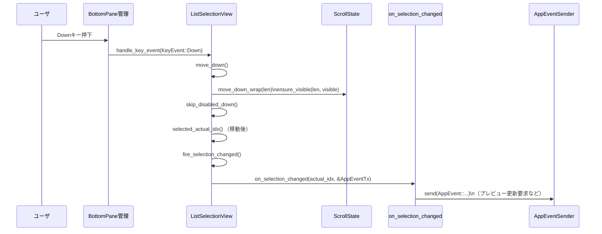
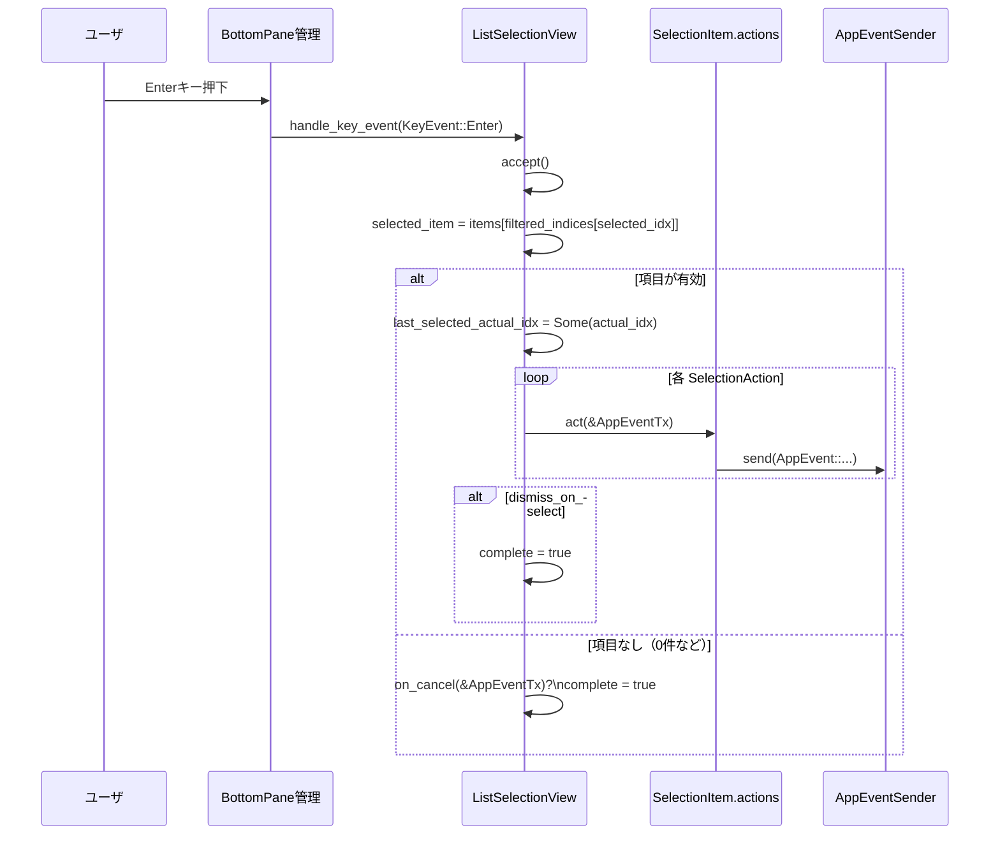

# tui/src/bottom_pane/list_selection_view.rs

## 0. ざっくり一言

`ListSelectionView` は、TUI のボトムペインに表示される「選択肢リストポップアップ」を扱うビューです。  
検索付きリスト、スクロール、無効化行のスキップ、サイドペインでのプレビュー表示、選択／キャンセル時のコールバック呼び出しまでを一括で担います。

> ※元ソースの行番号情報はチャットには含まれていないため、本解説では「関数名・構造体名」を根拠として示し、厳密な行番号は付与できません。

---

## 1. このモジュールの役割

### 1.1 概要

このモジュールは **リスト形式の選択ポップアップ UI** を実装し、次の問題を解決します。

- 任意の項目リストからキーボードで選択させたい
- 項目数が多くても、検索・スクロールで快適に操作させたい
- 一部項目を無効化したり、選択中項目に応じて右側にプレビューを表示したい
- 選択／キャンセル／選択変更をアプリケーション側のイベントとして受け取りたい

そのために、`SelectionItem` という項目モデル・`ListSelectionView` という状態付きビュー・レイアウト／描画処理・キーハンドリングを提供します。

### 1.2 アーキテクチャ内での位置づけ

このモジュールは「ボトムペイン（下部ポップアップ）」用のビューの 1 つとして、共通の `BottomPaneView` と `Renderable` を実装します。  
外部とは主に以下の依存関係があります。

```mermaid
graph TD
  subgraph tui::bottom_pane
    A[ListSelectionView] 
    B[SelectionItem]
    C[SelectionViewParams]
  end

  A -->|implements| D[BottomPaneView]
  A -->|implements| E[Renderable]

  A --> F[ScrollState]
  A --> G[selection_popup_common\n(render_rows, measure_*)]
  A --> H[popup_consts::MAX_POPUP_ROWS]
  A --> I[AppEventSender]

  A --> J[crossterm::event\n(KeyEvent, KeyCode)]
  A --> K[ratatui\n(Buffer, Layout, Rect, Paragraph, Line, Span)]
```

- `BottomPaneView` 経由でボトムペイン全体の管理ロジックから呼ばれます。
- `Renderable` 経由で描画レイヤ（`render_menu_surface` など）から使われます。
- `AppEventSender` によって、ユーザ操作をアプリケーションのイベントストリームに送出します。
- レイアウト・描画には `ratatui`、キーボード入力には `crossterm` を利用しています。

### 1.3 設計上のポイント

コードから読み取れる設計上の特徴は次の通りです。

- **モデルとビュー状態の分離**
  - 選択肢の「元データ」は `SelectionItem` に集約されています。
  - 現在のフィルタ結果・選択位置・スクロール状態は `ListSelectionView` 内の `filtered_indices` と `ScrollState` が管理します。

- **フィルタリングと選択保持**
  - `apply_filter` が `search_query` に応じて `filtered_indices` を更新し、その際に「元の実インデックス」を基準に選択を極力維持します。
  - 行が 0 件になった場合は、「Enter でキャンセル扱いにしてコールバックを呼ぶ」という仕様になっています（`accept` 内の分岐）。

- **無効化行の扱い**
  - `SelectionItem` の `is_disabled` か `disabled_reason` がセットされると、その行は「選択はできるが Enter では確定されない」項目として扱われます。
  - 上下移動時に `skip_disabled_up/down` で無効行をスキップしようとしますが、すべてが無効な場合には同じ行に留まる挙動になります。

- **サイドコンテンツ（プレビュー）のレイアウト**
  - 列幅計算ロジック `side_by_side_layout_widths` により、
    - ポップアップ内横幅が十分あれば「リスト＋右側プレビュー」の2カラム表示
    - 足りなければリストの下にスタック表示  
    に自動で切り替えます。
  - サイドコンテンツの背景色を保持する／しないを `preserve_side_content_bg` で切り替え可能です。

- **コールバック駆動のイベント処理**
  - 選択確定時のアクション `SelectionAction` は `Box<dyn Fn(&AppEventSender) + Send + Sync>` として保持され、`accept` 時に逐次実行されます。
  - 選択変更時・キャンセル時も同様にコールバックを `AppEventSender` に渡して呼び出します。

- **Rust の安全性**
  - すべてのインデックスアクセスは `get` / `positions` / `checked_sub` などで境界チェック付きで行われており、インデックス越えパニックを避けています。
  - `u16::saturating_sub` を多用しており、幅や座標の計算でアンダーフローが起きないようになっています。
  - クロージャ型には `Send + Sync` 制約が付き、マルチスレッドなイベントループとの連携を安全に行える前提になっています。

---

## 2. 主要な機能一覧

このモジュールが提供する主な機能は次の通りです。

- 選択項目モデル `SelectionItem`: 名前・説明・ショートカット・無効化理由・アクションなどを保持する行モデル。
- ビュー構成 `SelectionViewParams`: タイトル／フッタ／サイドコンテンツ／検索設定など、ビュー構築時のパラメータ。
- レイアウトモード `SideContentWidth`: サイドコンテンツの幅指定（固定 or 半分）。
- サイドバイサイドレイアウト計算: `popup_content_width`, `side_by_side_layout_widths`, `ListSelectionView::side_layout_width`。
- フィルタリングと選択状態管理: `ListSelectionView::apply_filter`, `selected_actual_idx`, `filtered_indices`, `ScrollState` 利用。
- キーボード操作:
  - 上下移動（Up/Down, Ctrl-P/N, j/k）
  - 検索クエリ編集とインクリメンタルフィルタ
  - 数字キーによる直接選択（非検索モード）
  - Enter で確定、Esc/Ctrl+C でキャンセル。
- 描画:
  - ヘッダ（タイトル＋サブタイトル＋任意の Renderable）
  - 検索バー
  - 行リスト（番号・選択マーク・description の折り返し、無効行マーカー）
  - サイドコンテンツ（横並び or 下部スタック）
  - フッターノートとキーヒント。

---

## 3. 公開 API と詳細解説

### 3.1 型一覧（構造体・列挙体など）

> ※行番号は元ファイルに含まれていないため「不明」としています。

| 名前 | 種別 | 可視性 | 役割 / 用途 | 根拠 |
|------|------|--------|-------------|------|
| `SideContentWidth` | enum | `pub(crate)` | サイドコンテンツパネルの幅指定。`Fixed(u16)` または `Half`。`Fixed(0)` はサイドコンテンツ無効。 | enum 定義とコメント |
| `SelectionAction` | type alias | `pub(crate)` | 選択確定時に呼び出されるアクション。`Fn(&AppEventSender) + Send + Sync` を動的ディスパッチで保持。 | `type SelectionAction = Box<dyn Fn(&AppEventSender) + Send + Sync>;` |
| `OnSelectionChangedCallback` | type alias | `pub(crate)` | ハイライトが変わったときに呼ばれるコールバック。`(usize, &AppEventSender)` を受け取る。 | コメントと型定義 |
| `OnCancelCallback` | type alias | `pub(crate)` | Esc/Ctrl+C で閉じたときに呼ばれるコールバック。 | コメントと型定義 |
| `SelectionItem` | struct | `pub(crate)` | リストの 1 行分のモデル。名前・説明・無効化状態・アクション等を保持。 | 構造体定義とコメント |
| `SelectionViewParams` | struct | `pub(crate)` | `ListSelectionView::new` 用の構築パラメータ。タイトル・フッタ・項目・検索設定・サイドコンテンツ等を含む。 | 構造体定義とコメント |
| `ListSelectionView` | struct | `pub(crate)` | 実行時のビュー状態とロジック（フィルタリング、スクロール、描画、キーハンドリング）を保持するメイン型。 | 構造体定義 |
| `ColumnWidthMode` | enum (re-export) | `pub(crate)` | 列幅計算モードの再エクスポート。`AutoVisible` / `AutoAllRows` / `Fixed`。 | `pub(crate) use super::selection_popup_common::ColumnWidthMode;` |

### 3.2 関数詳細（代表 7 件）

#### `ListSelectionView::new(params: SelectionViewParams, app_event_tx: AppEventSender) -> Self`

**概要**

`SelectionViewParams` から `ListSelectionView` を構築し、ヘッダの組み立てと初期フィルタ適用を行います。  
検索有無・初期選択・サイドコンテンツなど、ほとんどの設定はここで固定されます。

**引数**

| 引数名 | 型 | 説明 |
|--------|----|------|
| `params` | `SelectionViewParams` | タイトルや項目リスト、検索可否、サイドコンテンツなどの構築パラメータ。消費されます（ムーブ）。 |
| `app_event_tx` | `AppEventSender` | アクションやコールバックで利用するアプリ側へのイベント送信ハンドル。 |

**戻り値**

- `ListSelectionView`: 初期化済みのビュー。`filtered_indices` や選択インデックスは `apply_filter` 済みで、常に有効な状態になっています。

**内部処理の流れ**

1. `params.header` をベースに、`title` や `subtitle` があれば `ColumnRenderable::with` でヘッダを縦に積んだ `Renderable` に変換する。
2. `ListSelectionView` の各フィールドに `params` の値をムーブまたはコピーして代入する。
   - `search_placeholder` は `is_searchable` が `true` のときのみ設定し、それ以外では `None` にする。
   - `side_content_width`, `side_content_min_width`, `stacked_side_content`, `preserve_side_content_bg`, コールバック類もここで保持する。
3. `ScrollState` は `ScrollState::new()` でリセットした状態で開始する。
4. 最後に `apply_filter()` を呼び出し、`filtered_indices` と `selected_idx` を初期化する。

**Examples（使用例）**

```rust
use crate::app_event::AppEvent;
use crate::app_event_sender::AppEventSender;
use crate::bottom_pane::bottom_pane_view::BottomPaneView;
use crate::bottom_pane::list_selection_view::{ListSelectionView, SelectionItem, SelectionViewParams};
use tokio::sync::mpsc::unbounded_channel;

fn make_view() -> ListSelectionView {
    // AppEventSender の準備（実際の AppEvent は crate 側の定義）
    let (tx_raw, _rx) = unbounded_channel::<AppEvent>();
    let app_tx = AppEventSender::new(tx_raw);

    let items = vec![
        SelectionItem {
            name: "Option A".into(),
            dismiss_on_select: true,
            ..Default::default()
        },
        SelectionItem {
            name: "Option B".into(),
            dismiss_on_select: true,
            ..Default::default()
        },
    ];

    ListSelectionView::new(
        SelectionViewParams {
            title: Some("Choose option".into()),
            items,
            is_searchable: false,
            ..Default::default()
        },
        app_tx,
    )
}
```

**Errors / Panics**

- コンストラクタ内では `Result` は返しておらず、パニックを発生させるような `unwrap` も使っていません。
- 渡された `params` に不整合があっても（たとえば `side_content_min_width` が極端に大きいなど）、そのまま状態に保持され、レイアウト計算で「サイドバイサイド不可」などの結果になるだけです。

**Edge cases（エッジケース）**

- `params.items` が空の場合:
  - `apply_filter` により `filtered_indices` も空になりますが、`max_visible_rows` が `len.max(1)` を使うため高さは 1 行分確保されます。
  - 選択インデックスは `None` のままになります。
- `params.initial_selected_idx` が範囲外でも、`apply_filter` 内で `filtered_indices` に存在しないため無視されます。

**使用上の注意点**

- `header` や `side_content` には、必ず `Renderable` を実装した型を渡す必要があります。ファイル内のテストでは `MarkerRenderable` のようなカスタム struct で実装例があります。
- `on_selection_changed` / `on_cancel` などのコールバックは、`Send + Sync` なクロージャでなければなりません（型定義参照）。内部で共有状態にアクセスする場合はスレッドセーフな構造（`Arc<Mutex<...>>` など）が前提になります。

---

#### `ListSelectionView::apply_filter(&mut self)`

**概要**

検索クエリ `search_query` に基づいて `items` をフィルタし、`filtered_indices` と選択インデックスを更新します。  
選択をできる限り維持しつつ、スクロール状態を正しく保ちます。

**引数**

- なし（`&mut self` のみ）

**戻り値**

- なし（`self` の内部状態を更新）

**内部処理の流れ**

1. **以前の選択を記録**
   - `selected_actual_idx()` から「以前の実インデックス」を取得。
   - まだ選択がなく `!is_searchable` の場合は、`items` の中で `is_current` な行を探してそれを優先。
   - それもなければ `initial_selected_idx.take()` を使い、一度だけ初期選択を適用する。

2. **フィルタリング**
   - `is_searchable && !search_query.is_empty()` の場合:
     - `search_query.to_lowercase()` を作り、`items.iter().positions(...)` で `search_value` に部分一致する行のインデックスだけを `filtered_indices` に詰める。
     - `search_value` が `None` の行は一致対象外 → クエリ非空のとき画面から消える。
   - それ以外の場合（検索無効 or クエリ空文字列）:
     - `filtered_indices = (0..items.len()).collect()` として全件表示。

3. **新しい選択インデックスを決定**
   - まず、元の `state.selected_idx` から「実インデックス」を取り出し、新しい `filtered_indices` 内での位置を探す。
   - それで見つからなければ、`previously_selected`（実インデックス）を基準に `filtered_indices.iter().position(...)` で探す。
   - どちらでも見つからず、かつ `len > 0` であれば `0`（最初の行）を選択する。

4. **スクロール状態の更新**
   - `max_visible_rows(len)` で表示可能行数（最大 `MAX_POPUP_ROWS`）を計算。
   - `ScrollState::clamp_selection(len)` で `selected_idx` を `[0, len)` に収まるよう調整。
   - `ScrollState::ensure_visible(len, visible)` で、現在の選択がスクロール範囲内に入るよう調整。

5. **選択変更コールバックの呼び出し**
   - 新しい `selected_actual_idx()` と `previously_selected` を比較し、異なっていれば `fire_selection_changed()` を呼ぶ。

**Examples（使用例）**

テスト内での典型的な利用パターン（`set_search_query` 経由）:

```rust
let mut view = ListSelectionView::new(params, app_tx);

// 検索クエリをセットし、apply_filter が呼ばれてフィルタリングされる
view.set_search_query("filters".to_string());

// 以降、表示される行と選択位置は検索結果に応じて変わる
```

**Errors / Panics**

- ループやインデックス処理はすべて `get` や `positions` を使っており、境界外インデックスアクセスは行われません。
- `to_lowercase` や `contains` などは UTF-8 対応であり、パニックの可能性は通常はありません。

**Edge cases**

- 検索結果が 0 件の場合:
  - `filtered_indices.len() == 0` となり、`state.selected_idx` は `None` のままになります。
  - この状態で Enter を押すと `accept` がキャンセル扱いになり、`on_cancel` が呼ばれます（テスト `enter_with_no_matches_triggers_cancel_callback` 参照）。
- `search_value` をセットしていない項目:
  - クエリが空の間は表示されますが、何か文字を入力した瞬間に結果から除外されます（コメントにも注意書きあり）。

**使用上の注意点**

- 検索可能なビューを使う場合は、**必ず `SelectionItem::search_value` を埋める**ことが推奨されます。そうしないと、「検索したら行が消える」ように見える場合があります。
- `initial_selected_idx` は `apply_filter` の中で `.take()` されるため、「最初の 1 回だけ」有効です。再度初期値を適用したい場合は、別途状態を持つ必要があります。

---

#### `ListSelectionView::build_rows(&self) -> Vec<GenericDisplayRow>`

**概要**

`SelectionItem` とフィルタ・選択状態から、描画用の行モデル `GenericDisplayRow` の配列を生成します。  
番号付きプレフィックスや `(current)/(default)` マーカー、無効行の判定などをここで行います。

**引数**

- なし（`&self` のみ）

**戻り値**

- `Vec<GenericDisplayRow>`: 各行に対して、名前・プレフィックス・説明・無効化情報を含む描画用モデル。

**内部処理の流れ**

1. `filtered_indices` を `enumerate()` し、`(visible_idx, actual_idx)` として列挙。
2. `items.get(*actual_idx)` で元の `SelectionItem` を取得できたものだけを対象にする（`filter_map`）。
3. 各行について:
   - `is_selected` を `state.selected_idx == Some(visible_idx)` で判定。
   - 選択行ならプレフィックス `'›'`、それ以外は `' '` を付与。
   - `is_current` / `is_default` に応じて `"(current)"` / `"(default)"` を名前に追記。
   - `is_disabled` を `is_disabled || disabled_reason.is_some()` で判定。
   - 行番号 `n = visible_idx + 1` を計算し、検索不可かつ有効な行なら `"› 1. "` のような番号付きプレフィックスを作成。
   - 検索可能な場合は数字キーを使わないので、番号なしの `"› "` のみ。
   - `name_prefix_spans` にプレフィックスと `SelectionItem::name_prefix_spans` を結合。
   - 説明は「選択時専用説明 `selected_description`」があればそれを優先し、なければ通常の `description` を使う。
   - 説明なしの場合のみ、折り返しインデント `wrap_indent` にプレフィックス分の幅を設定する。
4. 以上を `GenericDisplayRow` として `Vec` に集める。

**Examples（使用例）**

`render` 内での利用例:

```rust
let rows = self.build_rows();
// rows を measure_rows_height / render_rows に渡して一覧を描画する
```

**Errors / Panics**

- `items.get(*actual_idx)` に失敗した行は `filter_map` で自動的にスキップされるため、パニックしません。
- `UnicodeWidthStr::width` を使っているため、全角文字を含むプレフィックスでも幅計算が安全に行われます。

**Edge cases**

- すべての行が無効 (`is_disabled` or `disabled_reason.is_some()`) の場合:
  - すべて `is_disabled == true` となり、番号部分はスペースで埋められます（`format!("{prefix} {}", " ".repeat(...))`）。
- 検索可能モードでは、常に番号を付与しません（コメントで明示）。そのため、`visible_idx` は「目に見える番号」と一致しません。

**使用上の注意点**

- 「番号キーでのジャンプ」は `handle_key_event` の数字処理側で `items` の実インデックスを直接見ています。`build_rows` の `visible_idx` 番号表示とは切り離されています（検索可能モードでは数字キーを使わないため問題ありません）。

---

#### `ListSelectionView::accept(&mut self)`

**概要**

現在選択されている行を確定し、対応する `SelectionAction` を実行します。  
選択行が存在しない場合はキャンセル扱いになり、`on_cancel` コールバックを呼び出します。

**引数**

- なし（`&mut self`）

**戻り値**

- なし（内部状態 `complete` や `last_selected_actual_idx` を更新）

**内部処理の流れ**

1. `state.selected_idx`（表示インデックス）から `filtered_indices.get(idx)` を通じて実インデックスを取り出し、`items.get(actual_idx)` で `selected_item` を取得する。
2. `selected_item` が `Some` かつ `disabled_reason.is_none()` かつ `!is_disabled` の場合:
   - 選択実インデックスを `last_selected_actual_idx` に記録。
   - `item.actions` に登録された `SelectionAction` をすべて順に実行し、`&app_event_tx` を渡す。
   - `dismiss_on_select` が `true` なら `complete = true` とし、ビューを閉じる状態にする。
3. それ以外で、`selected_item.is_none()` の場合:
   - `on_cancel` が設定されていれば呼び出し、`&app_event_tx` を渡す。
   - `complete = true` とする。

**Examples（使用例）**

テスト `enter_with_no_matches_triggers_cancel_callback` より:

```rust
let mut view = ListSelectionView::new(
    SelectionViewParams {
        items: vec![SelectionItem {
            name: "Read Only".to_string(),
            dismiss_on_select: true,
            ..Default::default()
        }],
        is_searchable: true,
        on_cancel: Some(Box::new(|tx: &_| {
            tx.send(AppEvent::OpenApprovalsPopup);
        })),
        ..Default::default()
    },
    tx,
);

// 検索で0件にする
view.set_search_query("no-matches".to_string());

// Enter 押下 → selected_item が None なので on_cancel が呼ばれる
view.handle_key_event(KeyEvent::from(KeyCode::Enter));
assert!(view.is_complete());
```

**Errors / Panics**

- すべてのインデックスアクセスは `get` を使うため、パニックしません。
- コールバック内で発生するエラー（`AppEventSender::send` の失敗など）がどう扱われるかは、このファイル単体からは分かりません。

**Edge cases**

- 選択行が無効 (`is_disabled == true` または `disabled_reason.is_some()`) の場合:
  - `if let Some(item) = selected_item && ...` の条件に入らず、何も起きません（キャンセルにもならない）。
  - したがって、ユーザが無効行で Enter を押してもビューは閉じず、コールバックも呼ばれません。
- 行が 0 件の場合:
  - `selected_item` が `None` となり、`on_cancel` が呼ばれて `complete = true` になります（前述テストにより確認）。

**使用上の注意点**

- 「無効行で Enter すると何も起きない」仕様であるため、ユーザにそのことが分かるような UI 表現（スタイルや説明）が別途必要になります（このファイルではスタイリング詳細は不明ですが、`disabled_reason` フィールドがそれに用いられる想定です）。
- `last_selected_actual_idx` は `take_last_selected_index` で取り出すと同時にクリアされるため、多重読み取りはできません。

---

#### `BottomPaneView for ListSelectionView::handle_key_event(&mut self, key_event: KeyEvent)`

**概要**

ボトムペインから渡される `KeyEvent` を受け取り、スクロール・検索・選択確定・キャンセルなどの操作にマッピングします。  
複数のキー（Up/Down, j/k, Ctrl-P/N, 数字, Enter, Esc）をサポートしています。

**引数**

| 引数名 | 型 | 説明 |
|--------|----|------|
| `key_event` | `KeyEvent` | crossterm が提供するキーイベント。コードと修飾キーが含まれる。 |

**戻り値**

- なし（内部状態 `state`, `search_query`, `complete` などを更新）

**内部処理の流れ（分岐）**

大きく次のパターンに分岐します。

1. **上移動**
   - Up Arrow
   - Ctrl+P (`KeyCode::Char('p')` + CONTROL)
   - 端末によっては `'\u{0010}'` + 修飾なし（C0 コントロール ^P）
   - または `KeyCode::Char('k')`（検索無効時のみ）
   → `self.move_up()` を呼び出す。

2. **下移動**
   - Down Arrow
   - Ctrl+N (`KeyCode::Char('n')` + CONTROL)
   - `'\u{000e}'` + 修飾なし（C0 コントロール ^N）
   - または `KeyCode::Char('j')`（検索無効時のみ）
   → `self.move_down()` を呼び出す。

3. **検索クエリ編集（検索可能時）**
   - Backspace: `search_query.pop()` のあと `apply_filter()`
   - 通常文字キー（Control / Alt を含まない）:
     - `search_query.push(c)` のあと `apply_filter()`

4. **数字キーによる直接選択（検索無効時のみ）**
   - Control / Alt を含まない `KeyCode::Char(c)` で、`c.to_digit(10)` が 1〜9 のとき:
     - `idx = digit - 1` として 0 始まりのインデックス化。
     - `idx < items.len()` かつその項目が有効であれば、`state.selected_idx = Some(idx); self.accept();`

5. **キャンセル**
   - Esc: `self.on_ctrl_c()` を呼び出し、`on_cancel` → `complete = true` となる。

6. **確定**
   - Enter（修飾なし）: `self.accept()` を呼び出す。

**Examples（使用例）**

テスト `move_down_without_selection_change_does_not_fire_callback` より:

```rust
let mut view = ListSelectionView::new(/* ... */);
view.handle_key_event(KeyEvent::from(KeyCode::Down));
// 単一項目リストでは move_down しても選択実インデックスは変わらず、
// on_selection_changed コールバックも呼ばれない。
```

**Errors / Panics**

- ここでもインデックス操作は `idx < items.len()` などのチェックを行っており、安全です。
- 想定外のキーは単に `match` の `default`（`_ => {}`）に落ちるだけで、エラーやパニックにはなりません。

**Edge cases**

- 検索可能なビューでは数字キーが検索クエリに追加されるため、「数字キーでの直接選択」は使えません（コメントにも明記）。
- Alt や Control を含む修飾付き文字キーは、検索クエリにも選択操作にも使われません。

**使用上の注意点**

- Vim 風の `j/k` ナビゲーションを有効にしたい場合、`is_searchable` を `false` にしておく必要があります。
- 「数字選択」は `items` の実インデックスに対して行われます。あらかじめ `apply_filter` が全件を `filtered_indices` に並べる仕様なので、表示順と実インデックスが一致している前提です。

---

#### `ListSelectionView::render(&self, area: Rect, buf: &mut Buffer)`

**概要**

ポップアップ全体の描画を行います。  
ヘッダ・検索バー・リスト・サイドコンテンツ・フッタを `ratatui::Layout` を使ってレイアウトし、`render_rows` 系関数で行リストを描画します。

**引数**

| 引数名 | 型 | 説明 |
|--------|----|------|
| `area` | `Rect` | 描画対象領域（ボトムペイン内で割り当てられた矩形）。 |
| `buf` | `&mut Buffer` | TUI バッファ。セル単位で文字とスタイルを書き込む。 |

**戻り値**

- なし（`buf` に描画）

**内部処理の流れ（簡略化）**

1. `area` の高さまたは幅が 0 の場合はすぐに return。
2. フッタノート/ヒントの折り返し行数を `wrap_styled_line` で計測し、`Layout::vertical` で `content_area` と `footer_area` に分割。
3. `render_menu_surface(outer_content_area, buf)` を呼び、罫線付きのメニューサーフェスを描画しつつ、その内側領域を `content_area` として受け取る。
4. `side_layout_width(inner_width)` により、サイドバイサイドレイアウトが可能か判定。
5. ヘッダ高さ・行高さを再計測（`build_rows` + `measure_rows_height*`）し、`Layout::vertical` で
   - `header_area`
   - （空行）
   - `search_area`（検索可能時のみ 1 行）
   - `list_area`（リスト部分）
   - （スタック時の隙間 1 行）
   - `stacked_side_area`（サイドコンテンツを下に積む場合）
   に分割。
6. ヘッダ描画:
   - `header_area.height < header_height` の場合はヘッダを一部だけ描画し、下に `"[… N lines] ctrl + a view all"` といった省略表示を追加。
7. 検索バー描画:
   - `search_query` が空なら `search_placeholder` を `.dim()` つきで描画。
   - 非空ならクエリ文字列を描画。
8. リスト描画:
   - `render_area` を `list_area` から左に 2 列広げた領域に設定し、`render_rows` / `render_rows_stable_col_widths` / `render_rows_with_col_width_mode` をモードに応じて呼び出す。
9. サイドコンテンツ:
   - サイドバイサイドが可能な場合:
     - リスト右側に `side_area` を確保し、その背後（ギャップを含む）を `clear_to_terminal_bg` でクリア。
     - `side_content.render(side_area, buf)` を描画。
     - `preserve_side_content_bg == false` の場合は `force_bg_to_terminal_bg` で背景色をリセット。
   - サイドバイサイド不可の場合（スタック表示）:
     - 下部領域を `clear_to_terminal_bg` でクリアした上で、`stacked_side_content().render(stacked_side_area, buf)` を描画。
10. フッタ:
    - `note_lines` を左から 2 列インデントして複数行描画。
    - `footer_hint` があれば `.dim()` を付けて 1 行描画。

**Examples（使用例）**

テストの補助関数:

```rust
fn render_lines_with_width(view: &ListSelectionView, width: u16) -> String {
    let height = view.desired_height(width);
    let area = Rect::new(0, 0, width, height);
    let mut buf = Buffer::empty(area);
    view.render(area, &mut buf);
    // buf から文字列に変換してスナップショット比較
    /* ... */
}
```

**Errors / Panics**

- `Rect` 計算には `saturating_add` と `min` を組み合わせており、座標のアンダーフロー／オーバーフローを避けています。
- バッファアクセスは `buf[(x, y)]` ですが、ループ範囲は `buf.area()` と `area` の共通部分に制限されているため、範囲外アクセスは発生しません（`clear_to_terminal_bg` / `force_bg_to_terminal_bg` 参照）。

**Edge cases**

- サイドコンテンツが高さ 0 (`desired_height` が 0 を返す) の場合はスタック領域も 0 となり、描画されません。
- サイドコンテンツをサイドバイサイド表示したときに `preserve_side_content_bg == false` だと、side_content が設定した背景色は `force_bg_to_terminal_bg` によってすべて `Color::Reset` に書き換えられます（テスト `preserve_side_content_bg_keeps_rendered_background_colors` / `side_content_clearing_resets_symbols_and_style` 参照）。

**使用上の注意点**

- サイドコンテンツにカラフルなシンタックスハイライトなどを表示したい場合は、`SelectionViewParams::preserve_side_content_bg = true` にする必要があります（`theme_picker_enables_side_content_background_preservation` で検証）。
- `desired_height` と実際の `render` は同じロジックで高さを計算しているため、`desired_height` を無視して小さすぎる領域を渡すと、一部の要素が描画されなかったり省略表示になる可能性があります。

---

#### `side_by_side_layout_widths(content_width: u16, side_content_width: SideContentWidth, side_content_min_width: u16) -> Option<(u16, u16)>`

**概要**

サイドバイサイドレイアウト（リスト + サイドコンテンツ）を行う場合に、リスト部とサイドコンテンツ部の横幅を計算します。  
条件を満たさない場合は `None` を返し、スタック表示にフォールバックします。

**引数**

| 引数名 | 型 | 説明 |
|--------|----|------|
| `content_width` | `u16` | メニューコンテンツ全体の横幅（境界線やインセットを除いた幅）。 |
| `side_content_width` | `SideContentWidth` | サイドコンテンツの幅モード（固定 or Half）。 |
| `side_content_min_width` | `u16` | サイドコンテンツに要求される最小幅。 |

**戻り値**

- `Option<(u16, u16)>`:
  - `Some((list_width, side_width))` サイドバイサイドできる場合。
  - `None` サイドバイサイド不可能（サイド幅が狭すぎる or リスト幅が `MIN_LIST_WIDTH_FOR_SIDE` 未満など）。

**内部処理の流れ**

1. `side_content_width` に応じて `side_width` を決定:
   - `Fixed(0)` → サイドコンテンツ無効 → 即 `None` を返す。
   - `Fixed(width)` → そのまま使う。
   - `Half` → `(content_width - SIDE_CONTENT_GAP) / 2` として左右均等割り。
2. `side_width < side_content_min_width` なら `None`。
3. `list_width = content_width - (SIDE_CONTENT_GAP + side_width)` を計算。
4. `list_width >= MIN_LIST_WIDTH_FOR_SIDE` なら `(list_width, side_width)` を返し、そうでなければ `None`。

**Examples（使用例）**

テスト `side_layout_width_half_uses_exact_split` より:

```rust
let content_width: u16 = 120;
let expected = content_width.saturating_sub(SIDE_CONTENT_GAP) / 2;
assert_eq!(view.side_layout_width(content_width), Some(expected));
```

**Errors / Panics**

- すべての引き算は `saturating_sub` を通して行われており、`u16` のアンダーフローは発生しません。

**Edge cases**

- `content_width < SIDE_CONTENT_GAP` のような極端に狭い場合:
  - `Half` モードだと `side_width` が 0 になり、`side_width < side_content_min_width` により `None` を返します。
- `side_content_min_width` が大きすぎる場合:
  - 幅が足りずに常に `None` となり、サイドコンテンツはスタック表示になります（テスト `side_layout_width_half_falls_back_when_list_would_be_too_narrow` 参照）。

**使用上の注意点**

- 「リスト幅が `MIN_LIST_WIDTH_FOR_SIDE` 未満になったらサイドバイサイドを諦める」仕様なので、`MIN_LIST_WIDTH_FOR_SIDE` を変更すると UI バランスに大きく影響します。

---

（他の重要関数 `desired_height` などについては、既に上記で概略を説明しました）

### 3.3 その他の関数・メソッド

メインロジックに関わるその他の関数・メソッドを一覧でまとめます（テスト用ヘルパーは別扱い）。

| 関数名 / メソッド名 | 役割（1 行） |
|---------------------|--------------|
| `popup_content_width(total_width)` | メニューサーフェス両側のインセット（合計 4 列）を引いたコンテンツ幅を算出。 |
| `ListSelectionView::visible_len` | 現在のフィルタ後の行数を返す。 |
| `ListSelectionView::max_visible_rows` | 行数と `MAX_POPUP_ROWS` から、実際に表示する最大行数を決定。 |
| `ListSelectionView::selected_actual_idx` | 選択中の行の「実インデックス」を `filtered_indices` から逆引きする。 |
| `ListSelectionView::move_up` | スクロール状態を上に 1 つ移動し、無効行をスキップしつつコールバックを必要に応じて発火。 |
| `ListSelectionView::move_down` | 下方向版。 |
| `ListSelectionView::fire_selection_changed` | `on_selection_changed` が設定されていれば、現在の実インデックスを渡して呼び出す。 |
| `ListSelectionView::set_search_query`（test用） | 検索クエリを設定して `apply_filter()` を呼ぶテスト専用メソッド。 |
| `ListSelectionView::take_last_selected_index` | `last_selected_actual_idx` を取り出して `None` にリセットする。 |
| `ListSelectionView::rows_width` | 外側幅から左右の余白（2 列）を引いたリスト部の幅を計算。 |
| `ListSelectionView::clear_to_terminal_bg` | 指定領域をスペース + `Style::reset()` で塗りつぶす。 |
| `ListSelectionView::force_bg_to_terminal_bg` | 指定領域のセル背景色だけを `Color::Reset` に変更する。 |
| `ListSelectionView::stacked_side_content` | スタック表示に使う `Renderable` を返す（`stacked_side_content` があればそれを優先）。 |
| `ListSelectionView::side_layout_width` | `side_by_side_layout_widths` を呼び出して、サイドバイサイド時のサイド幅だけを返す。 |
| `ListSelectionView::skip_disabled_down` | 下方向に移動するとき、無効行を飛ばそうとする内部メソッド。 |
| `ListSelectionView::skip_disabled_up` | 上方向版。 |
| `BottomPaneView::is_complete` | ビューが完了状態かどうか（`complete`）を返す。 |
| `BottomPaneView::view_id` | `view_id` を返す。 |
| `BottomPaneView::selected_index` | 現在の実インデックスを返す（`selected_actual_idx`）。 |
| `BottomPaneView::on_ctrl_c` | キャンセルコールバックを呼び出して `complete = true` にし、`CancellationEvent::Handled` を返す。 |
| `Renderable::desired_height` | 幅に応じてヘッダ・リスト・サイドコンテンツ・フッタを含む総高さを計算。 |

テストモジュール内のヘルパー（`MarkerRenderable`, `StyledMarkerRenderable`, `make_selection_view`, `render_lines_in_area` など）は、挙動確認用のユーティリティであり、本番コードの API ではありません。

---

## 4. データフロー

### 4.1 代表的なシナリオ: 下矢印キーで項目を移動し、プレビューを更新する

このシナリオでは、ユーザが Down キーを押して選択行を変えると、  
`on_selection_changed` コールバックが発火し、アプリケーション側でプレビュー内容を更新できます。



### 4.2 選択確定のデータフロー

Enter キーで選択を確定すると、以下のように `SelectionAction` が実行されます。



---

## 5. 使い方（How to Use）

### 5.1 基本的な使用方法

典型的な利用フローは次の通りです。

1. `SelectionItem` のリストを用意する。
2. 必要に応じて `SelectionAction` や `on_selection_changed` / `on_cancel` を設定した `SelectionViewParams` を作る。
3. `ListSelectionView::new` でビューを構築する。
4. `BottomPaneView` トレイトを通じて `handle_key_event` を呼び、`Renderable` トレイトを通じて `render` を呼ぶ。

```rust
use crate::app_event::AppEvent;
use crate::app_event_sender::AppEventSender;
use crate::bottom_pane::bottom_pane_view::BottomPaneView;
use crate::bottom_pane::list_selection_view::{
    ListSelectionView, SelectionItem, SelectionViewParams, SideContentWidth,
};
use crate::render::renderable::Renderable;
use tokio::sync::mpsc::unbounded_channel;
use ratatui::layout::Rect;
use ratatui::buffer::Buffer;

fn main_like() {
    // 1. イベント送信ハンドル
    let (tx_raw, mut rx) = unbounded_channel::<AppEvent>();
    let app_tx = AppEventSender::new(tx_raw);

    // 2. 項目リスト
    let items = vec![
        SelectionItem {
            name: "Read Only".into(),
            description: Some("Codex can read files".into()),
            dismiss_on_select: true,
            ..Default::default()
        },
        SelectionItem {
            name: "Full Access".into(),
            description: Some("Codex can edit files".into()),
            dismiss_on_select: true,
            ..Default::default()
        },
    ];

    // 3. ビュー構築
    let mut view = ListSelectionView::new(
        SelectionViewParams {
            title: Some("Select Approval Mode".into()),
            items,
            // サイドコンテンツ無しのシンプルな例
            side_content_width: SideContentWidth::Fixed(0),
            ..Default::default()
        },
        app_tx,
    );

    // 4. 描画（実際にはイベントループ内で繰り返す）
    let width = 80;
    let height = view.desired_height(width);
    let area = Rect::new(0, 0, width, height);
    let mut buf = Buffer::empty(area);
    view.render(area, &mut buf);

    // 5. キーイベント処理例
    view.handle_key_event(crossterm::event::KeyEvent::from(
        crossterm::event::KeyCode::Down,
    ));
    view.handle_key_event(crossterm::event::KeyEvent::from(
        crossterm::event::KeyCode::Enter,
    ));

    // 6. AppEvent をアプリ側で処理
    while let Ok(evt) = rx.try_recv() {
        // AppEvent に応じた処理…
        println!("Got event: {:?}", evt);
    }
}
```

### 5.2 よくある使用パターン

1. **検索可能なリスト**

```rust
let items = /* ... */;
let view = ListSelectionView::new(
    SelectionViewParams {
        title: Some("Search branches".into()),
        items,
        is_searchable: true,
        search_placeholder: Some("Type to search branches".into()),
        ..Default::default()
    },
    app_tx,
);
```

- 文字キーで検索クエリを入力し、Backspace で削除。
- 数字キーによる直接選択は無効になります。

1. **右側プレビュー付きテーマピッカーのようなビュー**

```rust
use crate::render::renderable::Renderable;

struct PreviewRenderable; // Renderable を実装してプレビューを描画すると仮定

let view = ListSelectionView::new(
    SelectionViewParams {
        title: Some("Select Theme".into()),
        items,
        side_content: Box::new(PreviewRenderable),
        side_content_width: SideContentWidth::Half,
        side_content_min_width: 40,
        preserve_side_content_bg: true, // シンタックスハイライトなどを保持
        on_selection_changed: Some(Box::new(|idx, tx: &AppEventSender| {
            // idx に応じてプレビュー更新イベントを送る
            tx.send(AppEvent::PreviewThemeAt(idx));
        })),
        ..Default::default()
    },
    app_tx,
);
```

1. **キャンセル時に別ポップアップを開き直す**

テスト `enter_with_no_matches_triggers_cancel_callback` と同様の使い方:

```rust
let view = ListSelectionView::new(
    SelectionViewParams {
        items,
        is_searchable: true,
        on_cancel: Some(Box::new(|tx: &AppEventSender| {
            tx.send(AppEvent::OpenApprovalsPopup);
        })),
        ..Default::default()
    },
    app_tx,
);
```

### 5.3 よくある間違い

```rust
// 間違い例1: 検索可能なのに search_value を埋めない
let items = vec![
    SelectionItem {
        name: "feature/foo".into(),
        // search_value: None のまま
        ..Default::default()
    },
];
// → 何か入力すると行がすべて消えたように見える

// 正しい例:
let items = vec![
    SelectionItem {
        name: "feature/foo".into(),
        search_value: Some("feature/foo".into()),
        ..Default::default()
    },
];
```

```rust
// 間違い例2: 無効行なのに disabled_reason をセットし忘れ、UI 上で理由が分からない
SelectionItem {
    name: "Dangerous option".into(),
    is_disabled: true,
    // disabled_reason: None
    ..Default::default()
}

// 正しい例: disabled_reason に理由を入れておく
SelectionItem {
    name: "Dangerous option".into(),
    is_disabled: true,
    disabled_reason: Some("Not available in this mode".into()),
    ..Default::default()
}
```

### 5.4 使用上の注意点（まとめ）

- **インデックスの整合性**
  - `ListSelectionView` は「表示インデックス (`state.selected_idx`) → 実インデックス (`filtered_indices`) → `items`」という 2 段階のマッピングを前提にしています。
  - `items` を外部から直接書き換えるような API は存在しませんが、もし追加する場合は `filtered_indices` と選択状態の再計算が必要になります。

- **エラー・キャンセルの扱い**
  - 0 件状態で Enter を押すとキャンセルコールバックが呼ばれます。
  - 無効行で Enter した場合は「何も起きない」仕様です。これを誤って「キャンセル扱い」と期待しないよう注意が必要です。

- **Rust 的な安全性**
  - ポインタやインデックスはすべて安全な API (`get`, `positions`, `saturating_*`) で扱われ、未定義動作を引き起こすようなコードは含まれていません。
  - クロージャには `Send + Sync` 制約があるため、将来的に複数スレッドから呼び出す設計にも対応しやすいです。

- **並行性・イベント送信**
  - `SelectionAction` や各種コールバックは `AppEventSender` を通じて `tokio::sync::mpsc::unbounded_channel` にイベントを送る前提でテストされています。
  - unbounded チャネルはバックプレッシャーがないため、短時間に大量のアクションを発火させるとキューが増大する可能性があります（特に `on_selection_changed` の頻度に注意）。

- **性能面の注意**
  - `apply_filter` と `build_rows` は `items` 全体を毎回走査します。`items` が非常に多い場合は、検索キー入力ごとに O(N) 処理が走る点に注意が必要です。
  - 列幅モード `AutoAllRows` はすべての行に対する幅測定を行うため、`AutoVisible` に比べて重くなりますが、スクロール時に列幅が変化しないメリットがあります（テストで確認）。

---

## 6. 変更の仕方（How to Modify）

### 6.1 新しい機能を追加する場合

- **新しいキーボードショートカットを追加したい場合**
  1. `BottomPaneView for ListSelectionView` の `handle_key_event` マッチ式に新しい分岐を追加する。
  2. 既存のショートカットと競合しないよう、`is_searchable` や修飾キー条件を調整する。
  3. 必要なら新しいテストを追加して挙動を確認する。

- **新しい列情報を行に表示したい場合**
  1. `SelectionItem` にフィールドを追加する。
  2. `build_rows` で `GenericDisplayRow` にその情報を詰める。
  3. `selection_popup_common::render_rows*` が新フィールドを描画できるようになっているか確認する（このファイルには実装はありません）。

- **サイドコンテンツのレイアウトモードを追加したい場合**
  1. `SideContentWidth` に新バリアントを追加する。
  2. `side_by_side_layout_widths` でそのバリアントの幅計算を実装する。
  3. 必要であればテストを追加し、期待する分岐結果（`Some` / `None`）を検証する。

### 6.2 既存の機能を変更する場合

- **フィルタリングロジックを変えたい（例: fuzzy search）**
  - 影響範囲:
    - `apply_filter` 内の `items.iter().positions(...)` 部分。
    - 検索結果 0 件時の挙動（Enter → キャンセル）はテストで前提になっているため、変えないか、テストを合わせて修正する必要があります。
  - 契約:
    - `filtered_indices` は常に `items` の有効なインデックスだけから成ること。
    - `state.selected_idx` は `filtered_indices` の範囲内か `None`。

- **無効行の扱いを変えたい**
  - 影響範囲:
    - `build_rows` の `is_disabled` 判定。
    - `skip_disabled_up/down` の条件。
    - `accept` の分岐（無効行で Enter 時の挙動）。
  - 注意:
    - すべての行が無効な場合の挙動（現在は「常に同じ無効行に留まる」）を変えると、ユーザ体験が変化します。必要ならテストを追加して意図した仕様を固定しておくとよいです。

- **描画レイアウトを変えたい**
  - 影響範囲:
    - `desired_height` と `render` は同じレイアウトロジックを共有しています。どちらか一方だけ修正すると高さ計算と描画がずれてしまうため、両方をセットで更新する必要があります。
  - 注意:
    - テストはスナップショット（insta）で描画結果を固定しているため、レイアウト変更時にはスナップショットの更新が必要になります。

---

## 7. 関連ファイル

このモジュールと密接に関係するファイル・ディレクトリは次の通りです（名前はコードから読み取れる範囲）。

| パス | 役割 / 関係 |
|------|------------|
| `tui/src/bottom_pane/selection_popup_common.rs` | `render_rows*`, `measure_rows_height*`, `GenericDisplayRow`, `render_menu_surface`, `wrap_styled_line`, `ColumnWidthMode` など、リストポップアップ共通の描画・レイアウトユーティリティを提供。 |
| `tui/src/bottom_pane/scroll_state.rs` | `ScrollState` の実装。選択インデックスとスクロール位置を管理し、`move_up_wrap` / `move_down_wrap` / `clamp_selection` / `ensure_visible` などを提供。 |
| `tui/src/bottom_pane/popup_consts.rs` | `MAX_POPUP_ROWS` や `standard_popup_hint_line` などポップアップ共通の定数・ヘルパー。 |
| `tui/src/bottom_pane/bottom_pane_view.rs` | `BottomPaneView` トレイトの定義。このトレイトを通じて、ボトムペイン内で `ListSelectionView` を扱う。 |
| `tui/src/app_event_sender.rs` | `AppEventSender` の定義。`tokio::mpsc` のラッパーとして、`SelectionAction` や各種コールバックからイベント送信に使用される。 |
| `tui/src/key_hint.rs` | `KeyBinding` の定義。`SelectionItem::display_shortcut` で表示用のショートカット情報を保持。 |
| `tui/src/render/renderable.rs` | `Renderable` および `ColumnRenderable` の定義。`ListSelectionView` や `MarkerRenderable` などはこのトレイトを実装して描画対象になります。 |
| `tui/src/theme_picker.rs` | テーマピッカーのパラメータ生成 `build_theme_picker_params` で `SelectionViewParams` を構築し、本モジュールのビューを利用。テストで参照されています。 |

---

### 付記: Bugs / Security 観点（このファイルから読み取れる範囲）

- **潜在的な挙動上の注意点**
  - すべての項目が無効な場合、`skip_disabled_up/down` は「選択インデックスが一周して元に戻る」ため、無効行に留まり続けます。このとき Enter を押すと何も起きず、キャンセルにもなりません。仕様としては一貫していますが、UX としては注意が必要です。
  - 検索可能モードで数字キーがすべて検索クエリに吸収されるため、「数字でジャンプできる」と期待していると混乱を招く可能性があります。

- **セキュリティ上の観点**
  - このモジュールはあくまで TUI 表示とイベント送出を行うだけで、外部入力のパースやファイル操作などの危険な処理は行いません。
  - `SelectionAction` / コールバック内で何をするかは呼び出し側次第ですが、型レベルでは `Send + Sync` 制約のみで特別な権限は付与されていません。

テストが多数用意されており、レイアウトやコールバック発火条件、サイドコンテンツの背景処理など重要な挙動がスナップショットやアサーションで検証されています。
