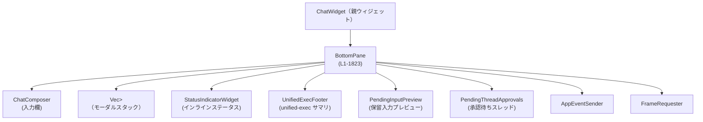
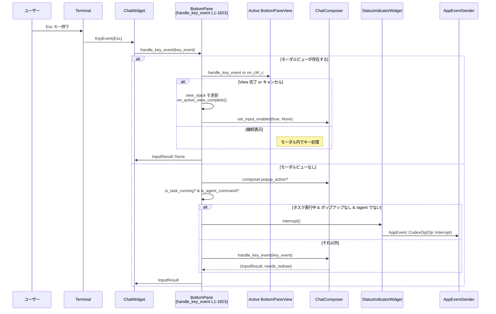

# tui/src/bottom_pane/mod.rs コード解説

## 0. ざっくり一言

チャット画面の一番下に表示される「入力欄＋フッター UI」を管理するモジュールです。  
テキスト入力用の `ChatComposer` と、各種ポップアップ／モーダル (`BottomPaneView`) のスタックをまとめて管理し、キーボード入力や時間ベースのヒント表示を制御します。  
（根拠: `BottomPane` 定義とモジュール先頭コメント `tui/src/bottom_pane/mod.rs:L1-1823`）

---

## 1. このモジュールの役割

### 1.1 概要

このモジュールは **チャット UI 下部のインタラクティブなフッター領域** を実装します。

- **問題**:  
  - プロンプト入力、添付画像、スラッシュコマンド、スキル選択、承認ダイアログなど、多数の UI 要素がフッターに集約される。
  - Ctrl+C / Esc などのキーは「モーダルを閉じる」「タスク中断」「アプリ終了」など複数の意味を持ち、適切なルーティングが必要。
- **提供機能**:
  - `ChatComposer`（入力欄）のライフサイクル管理・設定反映。
  - `BottomPaneView` ベースのモーダル／ポップアップ（選択ビュー、承認ダイアログ、ユーザー入力フォーム、MCP サーバー誘導など）の管理。
  - Esc / Ctrl+C / ペーストなどのキーイベント・ペーストイベントのルーティング。
  - 実行中タスクのステータス表示行 (`StatusIndicatorWidget`) と unified-exec フッターの制御。
  - 保留中メッセージ／ステア／承認スレッドのインラインプレビュー表示。

（根拠: ファイル先頭コメントと `BottomPane` フィールド・メソッド群  
`tui/src/bottom_pane/mod.rs:L1-1823`）

### 1.2 アーキテクチャ内での位置づけ

`BottomPane` は `ChatWidget`（上位のチャット画面ウィジェット）から利用され、内部で複数コンポーネントをまとめています。



- `ChatWidget` がキーイベント・ペースト・エージェントからの要求（承認・入力・MCP 誘導など）を `BottomPane` に渡します。
- `BottomPane` は
  - モーダルがあれば `BottomPaneView` に
  - なければ `ChatComposer` に
  キーをルーティングします。（`handle_key_event`）
- ステータスや unified-exec 情報は `StatusIndicatorWidget` と `UnifiedExecFooter` に表示されます。
- 再描画要求は `FrameRequester` を通じて UI ループに送られます。
（根拠: `BottomPane` フィールドと `handle_key_event` / `set_unified_exec_processes` / `request_redraw`  
`tui/src/bottom_pane/mod.rs:L1-1823`）

### 1.3 設計上のポイント

- **責務分割**:
  - ローカル UI（どのビューがキーを受け取るか）は `BottomPane` が担当。
  - プロセスレベルの「中断・終了の状態遷移」は `ChatWidget`（上位）が担当。  
    （コメントに明記: Ctrl+C / Ctrl+D の扱いなど）
- **状態管理**:
  - `view_stack: Vec<Box<dyn BottomPaneView>>` により複数モーダルを積み上げ可能。
  - `is_task_running` と `status: Option<StatusIndicatorWidget>` により、タスク実行中の状態とステータス表示を管理。
  - ペーストバースト（連続ペースト）状態はビューとコンポーザーがそれぞれ持ち、`flush_paste_burst_if_due` で処理。
- **エラーハンドリング**:
  - メソッドの多くは `Result` ではなく `bool` / `Option` を返して UI 更新の必要性や状態変化を表現。
  - パニックを誘発するような `unwrap` / `expect` はこのファイル内には見当たりません（テスト内の `unwrap_or` は UI 可視化用途）。
- **並行性**:
  - `show_quit_shortcut_hint` でのみ非同期実行を使用。
    - `tokio::runtime::Handle::try_current()` が成功すれば Tokio タスクを spawn。
    - 失敗時（テストや非 Tokio コンテキスト）には `std::thread::spawn` でタイマーを代替。
  - 非同期タスク／スレッドからは `FrameRequester::schedule_frame` のみを呼び出し、UI の再描画をトリガー。

（根拠: `BottomPane` フィールド、`handle_key_event`, `show_quit_shortcut_hint`, `set_task_running` など  
`tui/src/bottom_pane/mod.rs:L1-1823`）

---

## 2. 主要な機能一覧

このモジュールが提供する主要機能を一覧します。

- **入力欄管理**: `ChatComposer` の生成・設定・状態取得（テキスト、画像、メンション、履歴、ファイル検索結果など）。
- **モーダル／ポップアップ管理**: `BottomPaneView` のスタック管理（承認モーダル、ユーザー入力フォーム、MCP サーバー誘導、選択ビュー等）。
- **キー入力ルーティング**:
  - モーダルが優先でキーを受け取り、それ以外の場合は `ChatComposer` に渡す。
  - Esc / Ctrl+C によるキャンセル・中断のハンドリング。
- **ペースト処理**:
  - モーダル／コンポーザーへのペースト転送。
  - ペーストバーストのフラッシュタイミング制御。
- **ステータス表示と unified-exec フッター**:
  - 実行中タスクのインラインステータス表示 (`StatusIndicatorWidget`)。
  - unified-exec プロセス群のサマリ表示行（ステータス行と併置 or 単独フッター）。
- **保留入力プレビュー**:
  - キュー済みメッセージ、保留ステア、拒否されたステアの一覧表示 (`PendingInputPreview`)。
- **承認待ちスレッド表示**:
  - 非アクティブなスレッドの承認待ち情報表示 (`PendingThreadApprovals`)。
- **コンテキストウィンドウ情報の反映**:
  - 使用トークン数・割合表示。
- **録音メータープレースホルダ（非 Linux）**:
  - 音声録音の進捗をテキストでインライン表示するためのプレースホルダ管理。

（根拠: 各種 setter / メソッドの役割  
`tui/src/bottom_pane/mod.rs:L1-1823`）

---

## 3. 公開 API と詳細解説

### 3.1 型一覧（構造体・列挙体など）

#### このファイル内で定義される主要型

| 名前 | 種別 | 役割 / 用途 | 根拠 |
|------|------|-------------|------|
| `LocalImageAttachment` | 構造体 | ローカル画像添付 1 件分（プレースホルダ文字列＋ファイルパス）を表します。送信準備中の画像を管理するために使われます。 | `tui/src/bottom_pane/mod.rs:L1-1823` |
| `MentionBinding` | 構造体 | `$foo` のようなメンションテキストと、その実際のターゲット（アプリ URI や SKILL.md パスなど）の紐付けを表します。 | 同上 |
| `CancellationEvent` | 列挙体 | キャンセルキー（主に Ctrl+C / Esc）がローカルビューで消費されたかどうかを表す結果型。`Handled` / `NotHandled` の 2 値。 | 同上 |
| `BottomPane` | 構造体 | 下部ペイン本体。コンポーザー、モーダルスタック、ステータス行、保留プレビュー等をまとめて管理し、キー入力・ペースト・描画を制御します。 | 同上 |
| `BottomPaneParams` | 構造体 | `BottomPane::new` に渡す初期化パラメータ（イベント送信先、フレームリクエスタ、フォーカス状態等）を保持します。 | 同上 |

#### 本モジュールが再エクスポートする主な型

※ これらの詳細実装は別ファイルにあり、このチャンクには現れません。用途のみを記載します。

| 名前 | 種別 | 役割 / 用途 | 定義場所（推測名） |
|------|------|-------------|--------------------|
| `ChatComposer`, `ChatComposerConfig`, `InputResult` | 構造体/型 | 入力欄（テキスト・画像・メンション・ポップアップ）本体と、その設定、キー処理結果。 | `chat_composer` モジュール |
| `BottomPaneView` | トレイト | モーダル／ポップアップビューが実装する共通インターフェース（キー／ペースト処理、完了状態など）。 | `bottom_pane_view` モジュール |
| `CollaborationModeIndicator` | 構造体 | 協働モード状態のインジケータ。 | `footer` モジュール |
| `SelectionViewParams`, `SelectionItem`, `SelectionAction`, `ColumnWidthMode`, `SideContentWidth` | 構造体/列挙体 | 一般的なリスト選択ビューのパラメータ設定。 | `list_selection_view` モジュール |
| `FeedbackNoteView`, `FeedbackAudience` ほか | 構造体/関数 | フィードバック関連のビューおよびパラメータ。 | `feedback_view` モジュール |
| `StatusLineItem`, `StatusLinePreviewData`, `StatusLineSetupView` | 構造体 | ステータス行設定用ビューとそのデータ。 | `status_line_setup` モジュール |
| `TerminalTitleItem`, `TerminalTitleSetupView` | 構造体 | ターミナルタイトル設定用ビューとそのデータ。 | `title_setup` モジュール |
| `ExperimentalFeaturesView`, `ExperimentalFeatureItem` | 構造体 | 実験的機能の有効化 UI。 | `experimental_features_view` モジュール |
| `AppLinkView`, `AppLinkViewParams`, `AppLinkSuggestionType`, `AppLinkElicitationTarget` | 構造体/列挙体 | MCP サーバー誘導の一環として外部アプリ（ブラウザなど）へのリンクを提示するビューとそのパラメータ。 | `app_link_view` モジュール |
| `ApprovalOverlay`, `ApprovalRequest` | 構造体/列挙体 | コマンド実行などに対するユーザー承認モーダル。 | `approval_overlay` モジュール |
| `McpServerElicitationOverlay`, `McpServerElicitationFormRequest` | 構造体 | MCP サーバーからの追加情報要求（ツールインストール／有効化など）に応じたモーダル。 | `mcp_server_elicitation` モジュール |
| `RequestUserInputOverlay` | 構造体 | エージェントからの任意のユーザー入力要求に応じるモーダル。 | `request_user_input` モジュール |

（根拠: 各 `pub(crate) use` 行  
`tui/src/bottom_pane/mod.rs:L1-1823`）

### 3.2 関数詳細（重要な 7 件）

#### 1. `BottomPane::new(params: BottomPaneParams) -> BottomPane`

**概要**

`BottomPane` のインスタンスを初期化します。  
内部で `ChatComposer` を構築し、フレームリクエスタやスキルメンションを接続します。  
（根拠: `impl BottomPane { pub fn new(...) -> Self { ... } }`  
`tui/src/bottom_pane/mod.rs:L1-1823`）

**引数**

| 引数名 | 型 | 説明 |
|--------|----|------|
| `params` | `BottomPaneParams` | イベント送信先、フレームリクエスタ、初期フォーカス状態、プレースホルダテキストなどの束。 |

**戻り値**

- 初期状態の `BottomPane`。
  - `view_stack` は空。
  - `is_task_running` は `false`。
  - ステータス／unified-exec／プレビュー系は空・非表示。

**内部処理の流れ**

1. `BottomPaneParams` を分解して各フィールドをローカル変数に割り当てる。
2. `ChatComposer::new` を呼び出し、初期フォーカス・イベント送信・プレースホルダなどを渡す。
3. `ChatComposer` に `FrameRequester` とスキルメンションを設定。
4. `UnifiedExecFooter`, `PendingInputPreview`, `PendingThreadApprovals` を `new()` で初期化。
5. フラグ（タスク状態、エスケープヒント、コンテキストウィンドウなど）をデフォルト値に設定。
6. 完成した `BottomPane` を返す。

**Examples（使用例）**

テストコードから簡略化した初期化例です。

```rust
use tui::bottom_pane::{BottomPane, BottomPaneParams};
use crate::app_event_sender::AppEventSender;
use crate::tui::FrameRequester;
use codex_features::Features;
use tokio::sync::mpsc::unbounded_channel;

fn create_pane() -> BottomPane {
    // AppEvent 用のチャンネルを用意
    let (tx_raw, _rx) = unbounded_channel();
    let app_event_tx = AppEventSender::new(tx_raw); // App へのイベント送信に使う

    BottomPane::new(BottomPaneParams {
        app_event_tx,
        frame_requester: FrameRequester::test_dummy(), // テスト用フレームリクエスタ
        has_input_focus: true,
        enhanced_keys_supported: false,
        placeholder_text: "Ask Codex to do anything".to_string(),
        disable_paste_burst: false,
        animations_enabled: true,
        skills: Some(Vec::new()),
    })
}
```

**Errors / Panics**

- この関数内には明示的な `panic!` や `unwrap` はありません。
- `ChatComposer::new` や `UnifiedExecFooter::new` 等がパニックするかどうかは、このチャンクからは分かりません。

**Edge cases（エッジケース）**

- `skills: None` の場合は、スキルメンションが設定されないだけで、他の機能には影響しません。
- `disable_paste_burst` が `true` の場合、後のペースト処理の挙動が変わる可能性がありますが、本ファイルでは詳細は見えません。

**使用上の注意点**

- `BottomPane` は、通常 UI スレッド（イベントループ）の中で作成し、そのスレッドからのみ操作する設計と解釈できます。並行アクセスを想定した `Sync`/`Send` 実装はこのチャンクからは確認できません。

---

#### 2. `BottomPane::handle_key_event(&mut self, key_event: KeyEvent) -> InputResult`

**概要**

1 つのキーボードイベントを下部ペイン内の適切なターゲット（アクティブビュー or コンポーザー）にルーティングします。  
Esc を用いたタスク中断（`Op::Interrupt`）や、ペーストバーストの再描画スケジューリングもここで行います。  
（根拠: `pub fn handle_key_event(&mut self, key_event: KeyEvent) -> InputResult { ... }`  
`tui/src/bottom_pane/mod.rs:L1-1823`）

**引数**

| 引数名 | 型 | 説明 |
|--------|----|------|
| `key_event` | `crossterm::event::KeyEvent` | 押下されたキーと修飾キー、イベント種別（Press / Repeat / Release）を含む。 |

**戻り値**

- `InputResult`（`chat_composer` モジュールで定義）  
  - モーダルビューがアクティブな場合は常に `InputResult::None` が返されます（上位ロジックは `AppEventSender` 経由で結果を受け取る設計）。  
  - コンポーザーにルーティングされた場合は、その処理結果が返ります。

**内部処理の流れ**

1. **モーダルビューが存在する場合 (`!view_stack.is_empty()`)**
   1. `KeyEventKind::Release` の場合は無視して `InputResult::None` を返す（`CountingView` のテストで確認）。  
   2. 最上位ビューを取得。
   3. Esc キーかつ `view.prefer_esc_to_handle_key_event()` が `true` なら、通常の `handle_key_event` に渡し、`on_ctrl_c` は呼ばない。  
      そうでない Esc は「キャンセルキー」として `view.on_ctrl_c()` を呼び、`CancellationEvent::Handled` かつ `view.is_complete()` であれば `ctrl_c_completed = true` とする（`EscRoutingView` のテストで確認）。
   4. `ctrl_c_completed` でなければ、`view.handle_key_event(key_event)` を呼び、`view.is_complete()` と `view.is_in_paste_burst()` を取得。
   5. `ctrl_c_completed` の場合:
      - 最上位ビューを `pop`。
      - `on_active_view_complete()` を呼び、ステータスタイマー再開とコンポーザー入力有効化。
      - 次に現れたビューがペーストバースト中なら、`request_redraw_in(ChatComposer::recommended_paste_flush_delay())`。
   6. `view_complete` だが `ctrl_c_completed` でない場合:
      - `view_stack` を `clear()` し、`on_active_view_complete()` を呼ぶ。
   7. `view_in_paste_burst` の場合:
      - ペーストフラッシュまでの遅延で再描画をスケジュール。
   8. 自身の `request_redraw()` を呼び、`InputResult::None` を返す。

2. **モーダルビューが存在しない場合**
   1. 先頭行を `composer_text()` 経由で取得し、`parse_slash_name` に渡して `/agent` コマンドかどうかを判定。
   2. Esc キーかつ `Press` or `Repeat`、`is_task_running == true`、`!is_agent_command`、`!composer.popup_active()` かつ `status` が存在する場合は:
      - `status.interrupt()` を呼び、実行中タスクに中断リクエストを送る（`esc_interrupts_running_task_when_no_popup` テストで `AppEvent::CodexOp(Op::Interrupt)` を検証）。
      - 再描画を要求し、`InputResult::None` を返す。
   3. 上記以外では、`composer.handle_key_event(key_event)` を呼び、`(input_result, needs_redraw)` を取得。
      - `needs_redraw` が `true` なら `request_redraw()`。
      - コンポーザーがペーストバースト中なら、フラッシュ遅延時間で再描画をスケジュール。
   4. `input_result` を返す。

**Examples（使用例）**

基本的なイベントループ内での利用イメージです。

```rust
use crossterm::event::{read, Event, KeyEvent};
use tui::bottom_pane::BottomPane;

fn event_loop(mut pane: BottomPane) -> crossterm::Result<()> {
    loop {
        match read()? {
            Event::Key(key_event) => {
                let _result = pane.handle_key_event(key_event);
                // 送信や送信完了などの高レベル結果は AppEvent 側で受け取る設計のため、
                // ここでは result を直接解釈しないことが多い。
            }
            Event::Paste(data) => {
                pane.handle_paste(data);
            }
            _ => {}
        }
    }
}
```

**Errors / Panics**

- 本メソッド自身は `Result` を返さず、パニックを起こすコードも見当たりません。
- `status.interrupt()` 内部や `composer.handle_key_event` の挙動はこのチャンクからは不明です。

**Edge cases（エッジケース）**

- **Esc でモーダルを閉じる vs タスク中断**:
  - モーダル or ポップアップがアクティブな場合、Esc はまずそれらを閉じる方向にルーティングされ、実行中タスクの中断にはなりません（いくつかのテスト参照）。
  - `composer.popup_active()` が `true`（スキルポップアップ／スラッシュコマンドポップアップ）でも中断は起こらない。
- **`/agent` コマンド中の Esc**:
  - `/agent` のようにエージェントコマンドを編集中の Esc はタスク中断に使われず、ローカル編集に使われる（`esc_with_agent_command_without_popup_does_not_interrupt_task` テスト）。
- **KeyEventKind::Release**:
  - モーダルアクティブ時は Release イベントを無視し、誤入力を抑制する（`release_events_are_ignored_for_active_view` テスト）。

**使用上の注意点**

- **並行性**:  
  `handle_key_event` は内部で非同期タスクを起動しません。UI スレッドでのみ呼ぶことを前提とした設計に見えます。
- **中断のトリガ条件**を変えたい場合は、テスト（特に Esc 関連）とセットで変更する必要があります。

---

#### 3. `BottomPane::on_ctrl_c(&mut self) -> CancellationEvent`

**概要**

Ctrl+C が押されたときに呼ばれ、モーダルビューまたはコンポーザーのどちらかでキャンセル処理を行うかどうかを決定します。  
プロセス終了可否の判断は行わず、あくまで「ローカルで消費したか」を `CancellationEvent` で返します。  
（根拠: `pub(crate) fn on_ctrl_c(&mut self) -> CancellationEvent { ... }`  
`tui/src/bottom_pane/mod.rs:L1-1823`）

**引数**

- なし（Ctrl+C 入力は呼び出し側が解釈し、このメソッドに委譲します）。

**戻り値**

- `CancellationEvent::Handled`:
  - モーダルビューまたはコンポーザーが Ctrl+C をローカルキャンセルとして処理した。
- `CancellationEvent::NotHandled`:
  - ローカルでは特に何も行わなかった（例: コンポーザーが空）。上位の `ChatWidget` が「終了ショートカットの第一段階」などとして扱うことが想定されます。

**内部処理の流れ**

1. `view_stack.last_mut()` で最上位ビューを取得。
2. ビューが存在する場合:
   - `view.on_ctrl_c()` を呼び、結果を `event` とする。
   - `event` が `Handled` なら:
     - `view.is_complete()` で完了していれば `view_stack.pop()` と `on_active_view_complete()` を実行。
     - `show_quit_shortcut_hint(key_hint::ctrl(KeyCode::Char('c')))` を呼んでヒント表示（ただし、デフォルトでは `DOUBLE_PRESS_QUIT_SHORTCUT_ENABLED == false` のため実際には何も描画されない）。
     - `request_redraw()`。
   - `event` を返す。
3. ビューが存在しない場合:
   - `composer_is_empty()` が `true` なら `CancellationEvent::NotHandled` を返す。
   - そうでない場合:
     - `view_stack.pop()`（空のため no-op）。
     - `clear_composer_for_ctrl_c()` でコンポーザーの入力をクリア。
     - Quit ヒントを表示し（設定次第で実際に描画）、再描画を要求。
     - `CancellationEvent::Handled` を返す。

**Examples（使用例）**

Ctrl+C を受け取った際の単純なルーティング例です。

```rust
use tui::bottom_pane::{BottomPane, CancellationEvent};

fn on_ctrl_c_from_terminal(pane: &mut BottomPane) {
    match pane.on_ctrl_c() {
        CancellationEvent::Handled => {
            // ローカルでキャンセル済み。プロセス終了は行わない。
        }
        CancellationEvent::NotHandled => {
            // ChatWidget 側で「終了ショートカット」の状態遷移に使うなど。
        }
    }
}
```

**Errors / Panics**

- このメソッド内にはパニックを起こすコードは見当たりません。

**Edge cases（エッジケース）**

- **モーダルが Ctrl+C を消費した場合**:
  - ビュー完了後に composer が再度入力可能になる（`on_active_view_complete` にて）。
  - `ctrl_c_on_modal_consumes_without_showing_quit_hint` テストでは、ヒントが表示されないことを確認（`DOUBLE_PRESS_QUIT_SHORTCUT_ENABLED` が `false` のため）。
- **コンポーザーが空の場合**:
  - `CancellationEvent::NotHandled` を返し、上位の二段階終了ロジックに任せる。

**使用上の注意点**

- 実際の「アプリ終了」はこのメソッドでは一切行いません。必ず `CancellationEvent` を見た上で、上位で判断する必要があります。

---

#### 4. `BottomPane::push_approval_request(&mut self, request: ApprovalRequest, features: &Features)`

**概要**

エージェントからの承認要求（コマンド実行等）を受け取り、既存ビューで処理できるか確認し、必要であれば新しい承認モーダル (`ApprovalOverlay`) をスタックに積みます。  
（根拠: `pub fn push_approval_request(&mut self, request: ApprovalRequest, features: &Features) { ... }`  
`tui/src/bottom_pane/mod.rs:L1-1823`）

**引数**

| 引数名 | 型 | 説明 |
|--------|----|------|
| `request` | `ApprovalRequest` | 承認内容（スレッド ID、コマンド、選択可能な決定など）を含む。 |
| `features` | `&Features` | 機能フラグ（実験的機能など）を含む `codex_features::Features`。 |

**戻り値**

- なし。副作用としてビュースタックが変更されます。

**内部処理の流れ**

1. もし `view_stack` の最上位ビューが存在する場合:
   - `view.try_consume_approval_request(request)` を呼び出し、既存ビューでリクエストを統合できるかを確認。
   - `Some(request)` が返ればその値を `request` として使い続ける。
   - `None` が返れば、`request_redraw()` を呼び出し、ここで処理を終了（新たなモーダルは作成しない）。
2. 上記の結果として `request` が残っていれば、新しい `ApprovalOverlay` を生成:
   - `ApprovalOverlay::new(request, self.app_event_tx.clone(), features.clone())`。
3. 実行中ステータスのタイマーを一時停止するために `pause_status_timer_for_modal()` を呼ぶ。
4. `push_view(Box::new(modal))` でビューをスタックに積み、再描画をスケジュール。

**Examples（使用例）**

テストでは次のように承認要求を push しています。

```rust
use codex_features::Features;
use tui::bottom_pane::{BottomPane, BottomPaneParams};
use crate::bottom_pane::ApprovalRequest;

fn push_exec_approval(pane: &mut BottomPane, request: ApprovalRequest) {
    let features = Features::with_defaults();
    pane.push_approval_request(request, &features);
}
```

**Errors / Panics**

- このメソッド内にはパニックを起こすコードは見当たりません。
- `ApprovalOverlay::new` 内部の挙動はこのチャンクでは不明です。

**Edge cases（エッジケース）**

- 既存のモーダルが `try_consume_approval_request` でリクエストを取り込める場合、新しいモーダルは作られません。
- `overlay_not_shown_above_approval_modal` テストで確認されているように、
  - 承認モーダルが表示されているときは、その上にステータスオーバーレイが重ならないレイアウトになります（`as_renderable` のロジックによる）。

**使用上の注意点**

- 実行中タスクのステータス表示と承認モーダルの両方が絡むため、`pause_status_timer_for_modal` / `resume_status_timer_after_modal` の挙動を壊さないように変更する必要があります。

---

#### 5. `BottomPane::push_user_input_request(&mut self, request: RequestUserInputEvent)`

**概要**

エージェントからの追加ユーザー入力要求を受け取り、必要であれば `RequestUserInputOverlay`（ユーザー入力フォーム）をモーダルとしてスタックに追加します。同時にコンポーザー入力を無効化し、プレースホルダメッセージを表示します。  
（根拠: `pub fn push_user_input_request(&mut self, request: RequestUserInputEvent) { ... }`  
`tui/src/bottom_pane/mod.rs:L1-1823`）

**引数**

| 引数名 | 型 | 説明 |
|--------|----|------|
| `request` | `RequestUserInputEvent` | 入力が必要な内容（質問など）をエージェントから表すイベント。 |

**戻り値**

- なし。

**内部処理の流れ**

1. もし `view_stack.last_mut()` が存在する場合:
   - `view.try_consume_user_input_request(request)` を呼び出し、既存モーダルで入力要求を吸収できるか確認。
   - `Some(request)` が返ればそれを使う。
   - `None` が返れば `request_redraw()` を呼び出し、処理終了。
2. `RequestUserInputOverlay::new` を呼び出してモーダルを生成。
   - 引数には `app_event_tx.clone()`, `has_input_focus`, `enhanced_keys_supported`, `disable_paste_burst` などのコンテキストを渡す。
3. ステータスタイマー停止 (`pause_status_timer_for_modal`)。
4. コンポーザー入力を無効化し、プレースホルダに `"Answer the questions to continue."` を設定。
5. モーダルを `push_view` でスタックに追加。

**Examples（使用例）**

```rust
use codex_protocol::request_user_input::RequestUserInputEvent;
use tui::bottom_pane::BottomPane;

fn on_agent_requests_input(pane: &mut BottomPane, req: RequestUserInputEvent) {
    pane.push_user_input_request(req);
    // 以降のキー入力は RequestUserInputOverlay にルーティングされる
}
```

**Errors / Panics**

- 本メソッド内でのパニックは見当たりません。

**Edge cases（エッジケース）**

- 既存モーダルがリクエストを吸収する場合、新しいモーダルは作成されません。
- 入力フォームが閉じられた際には `on_active_view_complete` によりコンポーザーが再度有効化されます。

**使用上の注意点**

- コンポーザー入力は明示的に `set_composer_input_enabled(false, ...)` で無効化されるため、外部から再び有効化する場合は `on_active_view_complete` のパスを通すか、同様に `set_composer_input_enabled(true, None)` を呼ぶ必要があります。

---

#### 6. `BottomPane::push_mcp_server_elicitation_request(&mut self, request: McpServerElicitationFormRequest)`

**概要**

MCP サーバーからの「ツールをインストール／有効化してほしい」といった誘導リクエストを受け取り、  

- ブラウザでのインストール等が必要な場合は `AppLinkView`、  
- そうでない場合は `McpServerElicitationOverlay`  
をモーダルとして表示します。  
（根拠: `pub(crate) fn push_mcp_server_elicitation_request(&mut self, request: McpServerElicitationFormRequest) { ... }`  
`tui/src/bottom_pane/mod.rs:L1-1823`）

**引数**

| 引数名 | 型 | 説明 |
|--------|----|------|
| `request` | `McpServerElicitationFormRequest` | MCP サーバーからの追加アクション要求。ツール名／ID／インストール URL などを含む。 |

**戻り値**

- なし。

**内部処理の流れ**

1. 既存ビューがある場合:
   - `view.try_consume_mcp_server_elicitation_request(request)` を試み、`Some(request)` なら更新された `request` を継続利用。
   - `None` なら `request_redraw()` して処理終了。
2. `request.tool_suggestion()` をチェックし、かつ `tool_suggestion.install_url` が `Some` なら:
   - `suggest_type` に応じて `AppLinkSuggestionType::Install` または `Enable` を設定。
   - `is_installed` フラグを `suggest_type::Enable` のとき `true` にする。
   - `AppLinkViewParams` を組み立て（アプリ ID, タイトル, URL, 説明, elicitation_target など）。
   - `AppLinkView::new(params, app_event_tx.clone())` でビュー生成。
   - ステータスタイマー停止、コンポーザー入力無効化（プレースホルダ `"Respond to the tool suggestion to continue."`）、ビューをスタックに追加して終了。
3. `tool_suggestion` または `install_url` がない場合:
   - `McpServerElicitationOverlay::new` を用いてフォーム型のモーダルを生成。
   - ステータスタイマー停止、コンポーザー入力無効化（プレースホルダ `"Respond to the MCP server request to continue."`）、ビューを追加。

**Examples（使用例）**

```rust
use tui::bottom_pane::BottomPane;
use tui::bottom_pane::McpServerElicitationFormRequest;

fn on_mcp_request(pane: &mut BottomPane, req: McpServerElicitationFormRequest) {
    pane.push_mcp_server_elicitation_request(req);
}
```

**Errors / Panics**

- このメソッド内でのパニックは見当たりません。

**Edge cases（エッジケース）**

- `tool_suggestion` はあるが `install_url` がない場合は、インストールリンクではなくフォーム型モーダル（`McpServerElicitationOverlay`）にフォールバックします。
- `elicitation_target`（スレッド ID・サーバー名・リクエスト ID）は `AppLinkView` 側に渡され、承認後の戻り先を識別するために利用されます。

**使用上の注意点**

- MCP 関連 UI の仕様を変更する場合は、`AppLinkView` と `McpServerElicitationOverlay` 双方の挙動を確認する必要があります。

---

#### 7. `BottomPane::show_quit_shortcut_hint(&mut self, key: KeyBinding)`

**概要**

「もう一度押すと終了します」といった一時的な Quit ショートカットヒントをフッターに表示し、一定時間後に自動で消えるよう再描画をスケジュールします。  
Tokio ランタイムの有無に応じて、非同期タスクまたは OS スレッドを使うのが特徴です。  
（根拠: `pub(crate) fn show_quit_shortcut_hint(&mut self, key: KeyBinding) { ... }`  
`tui/src/bottom_pane/mod.rs:L1-1823`）

**引数**

| 引数名 | 型 | 説明 |
|--------|----|------|
| `key` | `KeyBinding` | 表示するショートカットキー（例: `Ctrl+C`）。 |

**戻り値**

- なし。

**内部処理の流れ**

1. `DOUBLE_PRESS_QUIT_SHORTCUT_ENABLED` が `false` の場合、何もせずに return。  
   （現在は UX 実験を無効化しているため、デフォルト動作ではヒントは表示されません。）
2. 有効な場合:
   1. `composer.show_quit_shortcut_hint(key, self.has_input_focus)` でコンポーザーに表示を依頼。
   2. `frame_requester` をクローン。
   3. `tokio::runtime::Handle::try_current()` を試す。
      - 成功時: 非同期タスクを spawn し、`tokio::time::sleep(QUIT_SHORTCUT_TIMEOUT).await` 後に `frame_requester.schedule_frame()` を呼ぶ。
      - 失敗時: `std::thread::spawn` で同様の処理を行う（テストや非 Tokio 環境向けフォールバック）。
   4. `request_redraw()` で即座に描画更新。

**Examples（使用例）**

通常は内部から呼ばれ、直接使用することは少ないですが、Ctrl+C ハンドラからの利用イメージは次の通りです。

```rust
use tui::bottom_pane::BottomPane;
use crate::key_hint;

fn show_hint_for_ctrl_c(pane: &mut BottomPane) {
    use crossterm::event::KeyCode;
    pane.show_quit_shortcut_hint(key_hint::ctrl(KeyCode::Char('c')));
}
```

**Errors / Panics**

- `tokio::runtime::Handle::try_current()` が失敗してもパニックせず、フォールバックとしてスレッドを使用します。
- スレッド／非同期タスク内では `schedule_frame()` のみが呼ばれ、I/O やロックは（このチャンクからは）見えません。

**Edge cases（エッジケース）**

- **Tokio ランタイムがない場合**:
  - フォールバックスレッドが使われるため、テストや CLI 単体実行でもヒントの消滅が機能します。
- **実験機能が無効な現状**:
  - `DOUBLE_PRESS_QUIT_SHORTCUT_ENABLED == false` のため、実際には呼び出しても何も起こりません（テストはこの前提で書かれています）。

**使用上の注意点**

- 将来 `DOUBLE_PRESS_QUIT_SHORTCUT_ENABLED` を `true` にするときは、ヒントのライフサイクルが全体の UX に与える影響と、スレッド数の増加を考慮する必要があります。
- `FrameRequester::schedule_frame` がスレッドセーフであることが前提です（実装はこのチャンクにはありません）。

---

### 3.3 その他の関数（カテゴリ別まとめ）

このファイルには 140 個以上のメソッドがあります。ここでは、役割ごとに主なメソッド群を整理します（全てを列挙すると冗長になるため、一部は代表のみを記載します）。

| 関数名（代表） | 役割（1 行） | 備考 |
|----------------|--------------|------|
| `set_skills`, `set_plugin_mentions`, `set_connectors_snapshot` | コンポーザーのメンション候補（スキル／プラグイン／コネクタ）を更新し、再描画する。 | `ChatComposer` に委譲。 |
| `set_image_paste_enabled`, `set_collaboration_modes_enabled`, `set_connectors_enabled`, 各種 `*_command_enabled` | ChatComposer の機能フラグをオン／オフし、UI ヒントを更新。 | |
| `set_queued_message_edit_binding` | `PendingInputPreview` 内の「編集」キー表示を更新。 | |
| `composer_text`, `composer_text_elements`, `composer_local_images`, `composer_mention_bindings` | コンポーザーの現在の入力内容・添付を取得する。 | 主にテストやアプリケーション内部チェック向け。 |
| `set_composer_text`, `set_composer_text_with_mention_bindings`, `apply_external_edit` | コンポーザーのテキスト内容を外部から差し替える。 | バリデーション後再投入などに使用。 |
| `set_footer_hint_override`, `set_status_line`, `set_status_line_enabled`, `set_active_agent_label` | フッターやステータス行、アクティブエージェントラベルなどの表示内容を更新。 | |
| `set_remote_image_urls`, `remote_image_urls`, `take_remote_image_urls` | リモート画像の URL 一覧を管理し、入力欄上の画像一覧に反映。 | `remote_images_render_above_composer_text` テスト参照。 |
| `set_pending_input_preview`, `set_pending_thread_approvals` | 保留メッセージ／承認スレッドのプレビュー内容を更新。 | |
| `set_unified_exec_processes` | unified-exec サマリを更新し、ステータス行 or 専用フッターに反映。 | |
| `set_task_running`, `hide_status_indicator`, `ensure_status_indicator`, `set_interrupt_hint_visible`, `update_status` | 実行中タスクのステータス表示の表示／非表示・内容を管理。 | 多数のスナップショットテストでレイアウト確認。 |
| `set_context_window` | コンテキストウィンドウの使用率とトークン数を更新し、コンポーザーへ反映。 | |
| `show_selection_view`, `replace_selection_view_if_active`, `selected_index_for_active_view` | 一般的なリスト選択ビューの表示・すげ替え・選択インデックス取得。 | |
| `show_view` | 任意の `BottomPaneView` をモーダルとしてスタックに積む。 | ラッパー。 |
| `is_normal_backtrack_mode`, `can_launch_external_editor`, `no_modal_or_popup_active` | Esc バックトラックや外部エディタ起動が安全かどうかの状態判定。 | |
| `flush_paste_burst_if_due`, `is_in_paste_burst` | ペーストバースト状態をビュー／コンポーザー双方から確認し、必要ならフラッシュ。 | |
| `on_history_entry_response`, `set_history_metadata` | 履歴エントリ取得の結果をコンポーザーに反映。 | |
| `on_file_search_result` | ファイル検索結果 (`Vec<FileMatch>`) をコンポーザーに渡す。 | |
| `attach_image`, `take_recent_submission_images_with_placeholders`, `drain_pending_submission_state` | 画像添付と送信後のクリーンアップを管理。 | |
| `prepare_inline_args_submission` | インライン引数の送信準備を行い、テキストと `TextElement` を返す。 | |
| `as_renderable`, `render`, `desired_height`, `cursor_pos` | 現在の状態から描画用レイアウトを組み立て、Ratatui バッファ上にレンダリングする。 | Flex レイアウトを使用。 |
| （非 Linux）`insert_recording_meter_placeholder`, `update_recording_meter_in_place`, `remove_recording_meter_placeholder` | 音声録音メーター用のテキストプレースホルダを入力欄内に挿入／更新／削除する。 | |

（根拠: 各メソッド定義およびテスト群  
`tui/src/bottom_pane/mod.rs:L1-1823`）

---

## 4. データフロー

### 4.1 代表的シナリオ: Esc によるタスク中断とモーダル優先処理

ユーザーが Esc キーを押したときの処理フローを示します。  
`BottomPane::handle_key_event (L1-1823)` と `StatusIndicatorWidget::interrupt` が中心です。



- Esc は **モーダルビューがあれば必ずそちらを優先** して処理されます。
- モーダル／ポップアップがない場合にのみ、タスク中断（`Op::Interrupt`）として扱われます。  
  スラッシュコマンドポップアップや `/agent` コマンド編集中などの特例処理はテストで確認されています。

（根拠: `handle_key_event`, 関連テスト（`esc_*` 系）  
`tui/src/bottom_pane/mod.rs:L1-1823`）

---

## 5. 使い方（How to Use）

### 5.1 基本的な使用方法

`BottomPane` をアプリケーションのイベントループから利用する典型的な流れです。

```rust
use tui::bottom_pane::{BottomPane, BottomPaneParams};
use crate::app_event_sender::AppEventSender;
use crate::tui::FrameRequester;
use crossterm::event::{read, Event};

fn main_loop() -> crossterm::Result<()> {
    // AppEvent 送信用チャンネルを準備
    let (tx_raw, _rx) = tokio::sync::mpsc::unbounded_channel();
    let app_event_tx = AppEventSender::new(tx_raw);

    // BottomPane を初期化
    let mut pane = BottomPane::new(BottomPaneParams {
        app_event_tx,
        frame_requester: FrameRequester::test_dummy(), // 実運用では実際のフレームリクエスタに差し替え
        has_input_focus: true,
        enhanced_keys_supported: false,
        placeholder_text: "Ask Codex to do anything".to_string(),
        disable_paste_burst: false,
        animations_enabled: true,
        skills: Some(Vec::new()),
    });

    loop {
        match read()? {
            Event::Key(key_event) => {
                let _result = pane.handle_key_event(key_event);
            }
            Event::Paste(pasted) => {
                pane.handle_paste(pasted);
            }
            _ => {}
        }

        // Ratatui の描画パスで:
        // let area = ...;
        // pane.render(area, &mut frame);
    }
}
```

- タスク開始時に `pane.set_task_running(true)` を呼ぶとステータス行が表示されます。
- エージェント側から承認が必要な操作が来たら `push_approval_request` を呼びます。

### 5.2 よくある使用パターン

1. **承認モーダル付きコマンド実行**

   - コマンド送信時にエージェントが承認要求を発行。
   - アプリ側で `push_approval_request` を呼び出し、モーダルを表示。
   - ユーザーが `y` / `n` などで応答すると、モーダルが閉じてステータス行とコンポーザーが復活。

2. **リスト選択ビュー**

   ```rust
   use tui::bottom_pane::{BottomPane, SelectionViewParams, SelectionItem};

   fn show_agent_picker(pane: &mut BottomPane) {
       let params = SelectionViewParams {
           title: Some("Agents".to_string()),
           items: vec![SelectionItem {
               name: "Main".to_string(),
               ..Default::default()
           }],
           ..Default::default()
       };
       pane.show_selection_view(params);
   }
   ```

   - Esc でモーダルが閉じた後は、`pane.no_modal_or_popup_active()` が `true` になります。

3. **ステータス行と unified-exec フッター**

   - タスク実行中は `set_task_running(true)`。
   - バックグラウンドプロセス情報を表示したい場合は `set_unified_exec_processes(vec![...])` を呼びます。
   - ステータス行が表示されている場合でも、unified-exec テキストはインラインメッセージとして統合され、高さは増えません（対応テストあり）。

### 5.3 よくある間違い

```rust
// 間違い例: モーダルが開いていることを考慮せずに直接コンポーザーを書き換える
pane.set_composer_text("text".into(), vec![], vec![]);
// → モーダルがユーザーに見えているのに、その裏で入力欄が勝手に変わってしまう可能性がある

// 正しい例: 必要に応じてモーダルが完了してからコンポーザーを更新する
if pane.no_modal_or_popup_active() {
    pane.set_composer_text("text".into(), vec![], vec![]);
}
```

```rust
// 間違い例: Esc が常にタスク中断を送ると仮定する
pane.handle_key_event(KeyEvent::new(KeyCode::Esc, KeyModifiers::NONE));
// → スキルポップアップや /agent コマンド編集中は中断されず、ローカル UI のキャンセルとして扱われる

// 正しい例: 「Esc で中断できる状態かどうか」を is_task_running や no_modal_or_popup_active で確認する
if pane.is_task_running() && pane.no_modal_or_popup_active() {
    pane.handle_key_event(KeyEvent::new(KeyCode::Esc, KeyModifiers::NONE));
}
```

### 5.4 使用上の注意点（まとめ）

- **スレッド安全性**:
  - `BottomPane` 自体はスレッド間共有を意図した API にはなっていません。UI スレッドからのみ操作する前提で設計されていると解釈できます。
  - 例外的に `show_quit_shortcut_hint` はバックグラウンドタスクから `FrameRequester::schedule_frame` を呼びますが、このメソッドがスレッドセーフである前提です。
- **エラー処理**:
  - 多くのメソッドは `Result` を返さず、副作用と再描画要求フラグ（`bool`）で状態変化を表現します。
  - 異常状態は「無視される」か「再描画のみ行われる」形が多く、意図的に UI 側でフェイルソフトな設計になっています。
- **Esc / Ctrl+C の意味**:
  - Esc はモーダル／ポップアップ／エージェントコマンドの編集を優先してキャンセルします。
  - タスク中断（`Op::Interrupt`）は「モーダルなし」「ポップアップなし」「`/agent` でない」の条件でのみ発生します。
- **ペーストバースト**:
  - 大量のペーストで描画がスパムされないよう、`flush_paste_burst_if_due` や `request_redraw_in` で間引きが行われます。高頻度で `handle_paste` を呼ぶコードは、この仕組みを前提としています。

---

## 6. 変更の仕方（How to Modify）

### 6.1 新しいモーダルビューを追加する場合

1. **ビュー型の追加**
   - `bottom_pane` 配下に新しいモジュール（例: `my_modal_view.rs`）を作成し、`BottomPaneView` + `Renderable` を実装する。
2. **再エクスポート**
   - 本ファイルの `mod` と `pub(crate) use` を追加して、`BottomPane` からアクセスしやすくする。
3. **表示エントリポイント**
   - `BottomPane` に `push_my_modal(&mut self, ...)` のようなメソッドを追加し、中で `self.push_view(Box::new(MyModalView::new(...)))` を呼ぶ。
4. **Esc / Ctrl+C の挙動**
   - 必要に応じて `BottomPaneView` の `on_ctrl_c` / `prefer_esc_to_handle_key_event` を実装し、既存の Esc テストと整合するようにする。
5. **ステータスタイマー**
   - 実行中タスクと同時に表示する場合は、`pause_status_timer_for_modal` / `resume_status_timer_after_modal` を適切なタイミングで呼ぶ。

### 6.2 既存の機能を変更する場合

- **キー入力ルーティング**:
  - `handle_key_event` の変更は多くのテスト（特に Esc と Ctrl+C 周り）に影響します。テストを確認しながら慎重に変更する必要があります。
- **タスク中断条件**:
  - `is_task_running`, `composer.popup_active()`, `/agent` 判定などの条件を変更する場合、  
    - `esc_with_skill_popup_does_not_interrupt_task`  
    - `esc_with_slash_command_popup_does_not_interrupt_task`  
    - `esc_interrupts_running_task_when_no_popup`  
    などのテストを参照し、期待される UX に合わせて調整します。
- **レイアウト**:
  - `as_renderable` の変更は snapshot テスト（`status_*_snapshot` 系）に反映されます。高さや行構成を変える場合はテキストスナップショットを更新する必要があります。
- **録音メーター（非 Linux）**:
  - `insert_recording_meter_placeholder` 等を変更する場合は、コンポーザーのプレースホルダ挿入ロジックとの整合性を確認する必要があります。

---

## 7. 関連ファイル

このモジュールと密接に関係するファイル・ディレクトリです。

| パス | 役割 / 関係 |
|------|------------|
| `tui/src/bottom_pane/chat_composer.rs` | 入力欄本体。テキスト編集、ポップアップ、添付画像、ヒントなどのロジックを持ち、`BottomPane` から多くのメソッドを委譲されています。 |
| `tui/src/bottom_pane/bottom_pane_view.rs` | モーダル／ポップアップビュー共通のトレイト `BottomPaneView` を定義し、`view_stack` の要素型となります。 |
| `tui/src/bottom_pane/list_selection_view.rs` | 一般的なリスト選択モーダル（エージェント選択など）を実装。`show_selection_view` で利用されます。 |
| `tui/src/bottom_pane/approval_overlay.rs` | コマンド実行などの承認 UI。`push_approval_request` でモーダルとして表示されます。 |
| `tui/src/bottom_pane/request_user_input.rs` | 任意のユーザー入力要求に応じるフォームモーダル。`push_user_input_request` で使用。 |
| `tui/src/bottom_pane/mcp_server_elicitation.rs` | MCP サーバーからのツールインストール／有効化要求に応じる UI。`push_mcp_server_elicitation_request` で利用。 |
| `tui/src/bottom_pane/app_link_view.rs` | 外部アプリ（ブラウザなど）へのリンク表示用ビュー。MCP ツールのインストール誘導に使用されます。 |
| `tui/src/bottom_pane/pending_input_preview.rs` | 保留メッセージやステアのプレビュー表示。`set_pending_input_preview` で更新。 |
| `tui/src/bottom_pane/pending_thread_approvals.rs` | 承認待ちスレッドの一覧表示。`set_pending_thread_approvals` で更新。 |
| `tui/src/status_indicator_widget.rs` | `StatusIndicatorWidget` を定義し、タスク実行中のインラインステータス表示を提供します。 |
| `tui/src/app_event_sender.rs` | `AppEventSender` を通じてアプリケーションロジックにイベント（`Op::Interrupt` など）を送信します。 |
| `tui/src/tui/frame_requester.rs`（推測） | `FrameRequester` を通じて再描画リクエストを UI ループに送ります。非同期タスク／スレッドからも使用されます。 |

（根拠: `mod` 宣言・`use` 文・`pub(crate) use` 文  
`tui/src/bottom_pane/mod.rs:L1-1823`）

---

このレポートでは、本チャンクに現れるコード内容のみを根拠として解説しました。  
他モジュール内部の詳細挙動については、このファイルから直接は読み取れないため、用途レベルの説明にとどめています。
