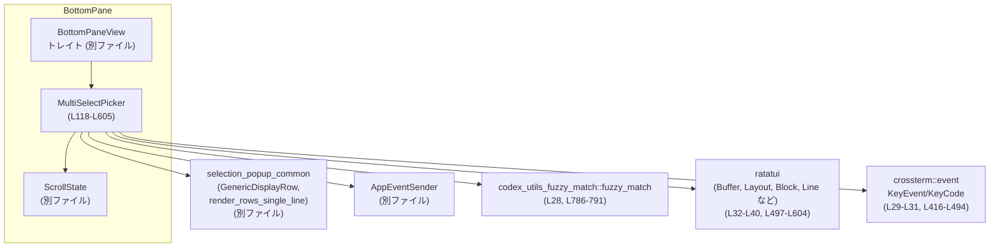
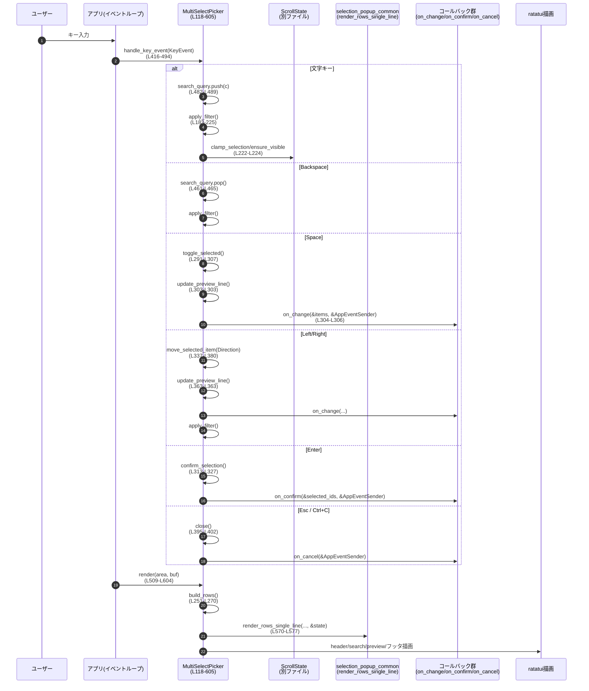

# tui/src/bottom_pane/multi_select_picker.rs

※ 行番号は、この回答内で先頭行を 1 として手動採番した「参考用」です。実際のリポジトリの行番号とはずれる可能性があります。

---

## 0. ざっくり一言

複数の項目をファジー検索しながら選択・トグル・並び替えできる、スクロール付きのポップアップ型マルチセレクトウィジェットを実装しているモジュールです（`MultiSelectPicker` / `MultiSelectPickerBuilder` が中心）  
（例: `MultiSelectPicker` 定義: `multi_select_picker.rs:L118-L160`）

---

## 1. このモジュールの役割

### 1.1 概要

- このモジュールは、**ターミナル UI 上で複数項目を選択するためのポップアップビュー**を提供します。
- ユーザーはキーボードだけで
  - ファジー検索による絞り込み（`apply_filter`、`match_item` `L183-L225`, `L781-L795`）
  - スペースキーでの ON/OFF トグル（`toggle_selected` `L291-L307`）
  - 上下移動・スクロール（`move_up` / `move_down` `L273-L285`）
  - （オプション）左右キーによる並び替え（`move_selected_item` `L337-L380`）
  を行うことができます。
- Enter で確定・Esc/Ctrl-C でキャンセル時に、それぞれ用意されたコールバック（confirm / cancel / change / preview）が呼ばれます（`L73-L86`, `L319-L327`, `L395-L402`）。

### 1.2 アーキテクチャ内での位置づけ

主な依存関係と役割を簡略化すると次のようになります。



- `MultiSelectPicker` は `BottomPaneView` トレイトを実装し、ボトムペインの 1 画面として扱われます（`impl BottomPaneView for MultiSelectPicker: L406-L495`）。
- スクロール位置・選択インデックス管理は `ScrollState` に委譲しています（`self.state: ScrollState` `L122-L123`）。
- 行の描画は `selection_popup_common::render_rows_single_line` を使って共通スタイルで行います（`L570-L577`）。
- ファジー検索は外部クレート `codex_utils_fuzzy_match` に依存しています（`fuzzy_match` 呼び出し `L786-L791`）。
- 描画は `ratatui`、キー入力は `crossterm` を利用しています（`use` 群 `L28-L40`）。

### 1.3 設計上のポイント

- **ビルダーパターン**  
  - 直接 `MultiSelectPicker` を構築するのではなく、`MultiSelectPickerBuilder`（`L620-L631`, `L633-L762`）を通して設定を積み上げる設計になっています。
  - ビルダーが最終的に `build()` で `MultiSelectPicker` を返します（`L721-L762`）。
- **状態管理の分離**
  - 全アイテム本体: `items: Vec<MultiSelectItem>`（`L119-L120`）
  - 絞り込み後の表示順インデックス: `filtered_indices: Vec<usize>`（`L140-L141`）
  - スクロール・選択状態: `state: ScrollState`（`L122-L123`）
  - 検索クエリ: `search_query: String`（`L137-L138`）
  - これにより、検索や並び替えで元データと表示順を分離しています。
- **イベント駆動 & コールバック指向**
  - change / confirm / cancel / preview 用にそれぞれ `Box<dyn Fn(...) + Send + Sync>` 型のコールバックを保持します（`L73-L86`, `L152-L159`）。
  - トグル・並び替えなど状態変化のたびに `on_change` と `preview_builder` が呼ばれます（`L302-L306`, `L363-L365`, `L385-L390`）。
- **完了状態フラグ**
  - `complete: bool`（`L125-L126`）でビューのライフサイクルを管理し、確定・キャンセル後の二重実行を防いでいます（`confirm_selection` `L313-L328`, `close` `L395-L402`）。
- **エラーハンドリング**
  - 本ファイル内には `Result` や `panic!` は登場せず、`Option` と早期 `return` を多用して「何もせず抜ける」形の安全な分岐が中心です（例: `toggle_selected` `L291-L300`）。
  - 整数変換は `try_into().unwrap_or(1)` で失敗時に 1 行にフォールバックし、パニックを避けています（`rows_height` `L243-L245`）。
- **並行性に関する前提**
  - コールバック型には `Send + Sync + 'static` 制約があります（`L73-L86`）が、`MultiSelectPicker` 自体は `&mut self` 前提で扱われるため、**外部で適切に排他して 1 スレッドから操作される**前提とみなせます。
  - このファイル内に `unsafe` コードはありません。

---

## 2. 主要な機能一覧

- マルチセレクトリスト表示: チェックボックス付きで項目を表示（`build_rows` `L251-L270`, `render` `L509-L604`）
- ファジー検索による絞り込み: 入力クエリに応じて項目をフィルタ・ソート（`apply_filter` `L183-L225`, `match_item` `L781-L795`）
- キーボードナビゲーション:
  - 上下キー / Ctrl+P / Ctrl+N / Ctrl+J / Ctrl+K でカーソル移動（`handle_key_event` `L424-L460`, `move_up`/`move_down` `L273-L285`）
  - Backspace で検索クエリ削除（`L461-L467`）
- ON/OFF トグル: スペースキーで現在行の `enabled` を反転（`toggle_selected` `L291-L307`）
- 選択確定 & キャンセル:
  - Enter で enabled な ID 群を `on_confirm` に渡す（`confirm_selection` `L313-L327`）
  - Esc / Ctrl-C で `close` → `on_cancel` を呼び出し、ビュー完了（`on_ctrl_c` `L411-L414`, `handle_key_event` `L477-L481`, `close` `L395-L402`）
- 並び替え（オプション）:
  - 左右キーで項目を上下に移動（`move_selected_item` `L337-L380`, キーバインド `L418-L423`）
- プレビュー表示（オプション）:
  - 現在の `items` から 1 行のプレビュー `Line<'static>` を生成し、フッタ直上に表示（`preview_builder` `L146-L150`, `update_preview_line` `L385-L390`, `render` `L580-L593`）
- ビルダーパターンによる構築: 項目・コールバック・並び替えフラグ・フッタ指示文を組み立てて `MultiSelectPicker` を生成（`MultiSelectPickerBuilder` `L633-L762`）

---

## 3. 公開 API と詳細解説

### 3.1 型一覧（構造体・列挙体・型エイリアス）

| 名前 | 種別 | 可視性 | 役割 / 用途 | 根拠 |
|------|------|--------|-------------|------|
| `Direction` | enum | モジュール内 | 並び替え方向（Up/Down）を表す内部用フラグ | `L67-L71` |
| `ChangeCallBack` | 型エイリアス | `pub` | アイテム状態変更時のコールバック型（全アイテムと `AppEventSender` を受け取る） | `L73-L75` |
| `ConfirmCallback` | 型エイリアス | `pub` | 確定時コールバック型（enabled な ID 一覧と `AppEventSender` を受け取る） | `L77-L79` |
| `CancelCallback` | 型エイリアス | `pub` | キャンセル時コールバック型（`AppEventSender` のみ） | `L81-L82` |
| `PreviewCallback` | 型エイリアス | `pub` | プレビュー生成コールバック型（`&[MultiSelectItem]` → `Option<Line<'static>>`） | `L84-L86` |
| `MultiSelectItem` | 構造体 | `pub(crate)` | 単一項目のデータ（id / name / description / enabled） | `L88-L105` |
| `MultiSelectPicker` | 構造体 | `pub(crate)` | マルチセレクトウィジェットの本体（状態・コールバック・レンダリングロジックを保持） | `L107-L160` |
| `MultiSelectPickerBuilder` | 構造体 | `pub(crate)` | `MultiSelectPicker` の構築用ビルダー | `L607-L631` |

> 補足: ドキュメントコメントには `MultiSelectPicker::new` という名前が出てきますが、このファイル内に `new` メソッド定義はなく、`builder` メソッドのみが定義されています（`L162-L176`, `L633-L647`）。`MultiSelectPicker::new` が別のファイルで定義されている可能性があります。

---

### 3.2 関数詳細（主要 7 件）

#### `MultiSelectPicker::builder(title: String, subtitle: Option<String>, app_event_tx: AppEventSender) -> MultiSelectPickerBuilder`

**概要**

- `MultiSelectPicker` を構築するためのビルダーを返します。
- タイトル・サブタイトル・アプリケーションイベント送信者を初期設定します。

**引数**

| 引数名 | 型 | 説明 |
|--------|----|------|
| `title` | `String` | ピッカーのタイトル。ヘッダの 1 行目に太字で表示されます（`L722-L723`）。 |
| `subtitle` | `Option<String>` | サブタイトル（あればヘッダ 2 行目に淡色で表示, `L725-L727`）。 |
| `app_event_tx` | `AppEventSender` | コールバックからアプリケーションへイベントを送るためのハンドル（`L128-L129`, `L626-L627`）。 |

**戻り値**

- `MultiSelectPickerBuilder`  
  標準状態のビルダー（items 空、instructions 空、ordering 無効、各コールバック None）を返します（`MultiSelectPickerBuilder::new` `L635-L647`）。

**内部処理の流れ**

1. `MultiSelectPickerBuilder::new(title, subtitle, app_event_tx)` を呼び出し（`L174-L175`）。
2. 空の `instructions` / `items` / `preview_builder` 等を持つビルダー構造体を返します（`L635-L647`）。

**Examples（使用例）**

```rust
use crate::app_event_sender::AppEventSender;
use crate::bottom_pane::multi_select_picker::{MultiSelectPicker, MultiSelectItem};

fn create_picker(app_event_tx: AppEventSender) -> MultiSelectPicker {
    // 選択候補の定義
    let items = vec![
        MultiSelectItem { 
            id: "a".into(), 
            name: "Item A".into(), 
            description: None, 
            enabled: true,
        },
        MultiSelectItem { 
            id: "b".into(), 
            name: "Item B".into(), 
            description: Some("説明".into()), 
            enabled: false,
        },
    ];

    MultiSelectPicker::builder("Select items".into(), Some("Choose multiple".into()), app_event_tx)
        .items(items)              // 候補を設定
        .enable_ordering()         // 並び替えを有効化（オプション）
        .build()                   // MultiSelectPicker を生成
}
```

**Errors / Panics**

- ありません（単にビルダーを構築するだけです）。

**Edge cases（エッジケース）**

- `title` / `subtitle` が空文字列でも問題なく動作します。ヘッダとしてそのまま表示されます。

**使用上の注意点**

- `MultiSelectPicker::builder` の返り値に対して `.items(..).on_confirm(..).build()` のように、必要な設定をチェーンしてから `build` を呼ぶ必要があります。
- このファイル内には `MultiSelectPicker::new` の定義がないため、**確実に存在するのは `builder` ベースの API です**。

---

#### `MultiSelectPicker::apply_filter(&mut self)`

**概要**

- 現在の `search_query` に基づいて `items` をフィルタし、`filtered_indices` を更新します（`L183-L225`）。
- ファジーマッチ結果のスコアでソートしつつ、可能なら現在選択中の項目を保持し、スクロール状態を調整します。

**引数**

- なし（`&mut self` のみ）。  
  内部状態 `search_query`, `items`, `filtered_indices`, `state` を更新します。

**戻り値**

- なし（副作用のみ）。

**内部処理の流れ**

1. 以前の選択位置に対応する「元配列 index」を記録します（`previously_selected` `L185-L188`）。
2. `search_query.trim()` をフィルタ文字列 `filter` として取り出します（`L190-L191`）。
3. `filter` が空なら、`filtered_indices = 0..items.len()` として全件を表示対象にします（`L191-L193`）。
4. `filter` が非空なら:
   - 各 `item` に対して `match_item(filter, display_name, &item.name)` を呼び出し（`L195-L198`）。
   - マッチしたもののみ `(index, score)` を `matches` に積みます（`L194-L200`）。
   - `score` 昇順（小さい方から）でソートし、同点の場合は `name` の辞書順で並び替えます（`L202-L208`）。
   - `matches` から index のみ取り出し `filtered_indices` に格納します（`L210-L210`）。
5. `previously_selected` に保存した index が新しい `filtered_indices` に含まれていれば、その表示インデックスに選択を移します。そうでなければ、1 件以上ある場合は 0 番目を選択します（`L213-L221`）。
6. 表示可能行数 `visible` を `max_visible_rows(len)` から求め（`L222-L222`）、`ScrollState` に対して `clamp_selection` / `ensure_visible` でスクロール位置を調整します（`L223-L224`）。

**Examples（使用例）**

通常は `handle_key_event` から呼び出されます（`L461-L467`, `L489-L490`）。  
検索クエリを直接書き換える例:

```rust
fn set_query_and_filter(picker: &mut MultiSelectPicker, query: &str) {
    picker.search_query.clear();
    picker.search_query.push_str(query);
    picker.apply_filter(); // 新しいクエリに基づいて filtered_indices と state を更新
}
```

**Errors / Panics**

- `matches.sort_by` などでパニックする可能性はありません（ソートは `Vec` の範囲内でのみ行われます）。
- `rows.len()` → `clamp` → `try_into().unwrap_or(1)` は `rows_height` 内の処理であり、ここでは呼びません。

**Edge cases（エッジケース）**

- `items` が空:
  - `filtered_indices` は空ベクタになります。
  - 選択インデックス `state.selected_idx` は `None` になります（`len == 0` ⇒ `then_some(0)` にならない, `L220-L220`）。
- すべての項目がマッチしない:
  - `filtered_indices` が空になります。
  - 選択インデックスも `None`。
  - レンダリング時には `render_rows_single_line` が `"no matches"` メッセージを表示します（`L570-L577`）。
- 非 ASCII 文字を含むクエリや名前:
  - `match_item` は `&str` ベースで扱うだけで特別な処理をしていません。`codex_utils_fuzzy_match` 側の実装に依存します（`L781-L795`）。

**使用上の注意点**

- 外部 API として直接呼ぶことは想定されていませんが、**`items` を外部から変更するような API を追加する場合は、`apply_filter` を呼んで `filtered_indices` を再構築する必要があります**。
- ソート順は `score` の昇順になっています（`L202-L208`）。`fuzzy_match` が高スコアを「より良いマッチ」と定義している場合は、昇順か降順かの仕様を確認する必要があります。

---

#### `MultiSelectPicker::toggle_selected(&mut self)`

**概要**

- 現在選択されている可視行に対応する `MultiSelectItem.enabled` を反転します（`true` ↔ `false`）。
- その後、プレビューラインを更新し、`on_change` コールバックが設定されていれば呼び出します（`L291-L307`）。

**引数**

- なし（`&mut self` のみ）。

**戻り値**

- なし（副作用のみ）。

**内部処理の流れ**

1. `state.selected_idx` から現在の「表示インデックス」を取得します。存在しなければ何もせず return（`L292-L294`）。
2. その表示インデックスを `filtered_indices` から「元配列 index」に変換します。存在しなければ return（`L295-L297`）。
3. `items.get_mut(actual_idx)` で対象アイテムの可変参照を取得します。なければ return（`L298-L300`）。
4. `item.enabled = !item.enabled` で ON/OFF を反転します（`L302-L302`）。
5. `update_preview_line()` を呼び出し、プレビューを再生成します（`L303-L303`）。
6. `on_change` が `Some` であれば、全アイテムと `app_event_tx` を渡して呼び出します（`L304-L306`）。

**Examples（使用例）**

通常はスペースキーから呼ばれます（`handle_key_event` `L468-L472`）。  
テストコードから直接呼ぶ場合のイメージ:

```rust
fn toggle_first_item(picker: &mut MultiSelectPicker) {
    picker.state.selected_idx = Some(0); // 0番目を選択中とする（ScrollState の実装に合わせて利用）
    picker.toggle_selected();           // enabled フラグが反転し、on_change が呼ばれる
}
```

**Errors / Panics**

- インデックスは `get` / `get_mut` を通して安全に取得しているため、範囲外アクセスによるパニックは発生しません（`L295-L300`）。

**Edge cases（エッジケース）**

- `selected_idx` が `None` の場合、何もせず終了します（`L292-L294`）。
- `filtered_indices` が空（＝表示行なし）の場合も、何も起きません（`L295-L297`）。
- `items` が空でも安全に何もせず終了します。

**使用上の注意点**

- 変更後、必ず `update_preview_line` と `on_change` が呼ばれるため、`on_change` 側で高コスト処理を行うと、キー入力ごとに UI レスポンスが悪化する可能性があります。
- `enabled` 状態の意味（「有効」「選択」「ON」など）はアプリケーション側のドメインに依存します。confirm 時には `enabled == true` の項目だけが ID リストに含まれます（`L320-L325`）。

---

#### `MultiSelectPicker::move_selected_item(&mut self, direction: Direction)`

**概要**

- 現在選択されている項目を、`Direction::Up` または `Direction::Down` に応じて `items` ベクタ内で前後に移動します（`L337-L380`）。
- 並び替えは **検索クエリが空のとき** にのみ有効です（`L338-L339`）。
- 並び替え後にプレビュー・`on_change`・フィルタを更新し、選択を移動後の項目に合わせて復元します。

**引数**

| 引数名 | 型 | 説明 |
|--------|----|------|
| `direction` | `Direction` | `Up` または `Down`。内部的には Left/Right キーから指定されます（`L418-L423`）。 |

**戻り値**

- なし（副作用のみ）。

**内部処理の流れ**

1. `search_query` が空でない場合は、並び替えを行わず早期 return（`L338-L339`）。  
   → フィルタ中は順序変更できない仕様です。
2. `state.selected_idx` から表示インデックスを取得し、`filtered_indices` 経由で元配列 index (`actual_idx`) を得ます。どこかで `None` になれば return（`L342-L347`）。
3. `len = items.len()` を取り、0 なら何もせず return（`L349-L351`）。
4. `direction` と `actual_idx` から、新しい index `new_idx` を計算します（`L354-L357`）:
   - `Up` かつ `actual_idx > 0` なら `actual_idx - 1`。
   - `Down` かつ `actual_idx + 1 < len` なら `actual_idx + 1`。
   - それ以外（端で押した場合）は何もせず return。
5. `items.swap(actual_idx, new_idx)` で 2 つの要素を入れ替えます（`L360-L361`）。
6. `update_preview_line` と `on_change` を呼びます（`L363-L366`）。
7. `apply_filter()` を呼び、`filtered_indices` とスクロール状態を再計算します（`L368-L369`）。
8. `filtered_indices` から `new_idx` に対応する表示インデックスを探し、見つかれば `state.selected_idx` をその値に設定し直します（`L371-L379`）。

**Examples（使用例）**

通常は左右キーから呼び出されます（`handle_key_event` `L418-L423`）。  
内部の挙動をテストする例:

```rust
fn move_selected_down(picker: &mut MultiSelectPicker) {
    // 事前に selected_idx を設定しておく
    picker.state.selected_idx = Some(0);
    picker.search_query.clear(); // 検索中は並び替えできないため空にする
    picker.apply_filter();       // filtered_indices を 0..items.len() にする

    picker.move_selected_item(Direction::Down);
    // これにより、items[0] と items[1] が swap される
}
```

**Errors / Panics**

- `items.swap` は index の範囲が保証されている状況でのみ呼ばれるため、パニックの心配はありません（`L354-L357`, `L360-L361`）。
- `apply_filter` の呼び出しによるエラーはありません。

**Edge cases（エッジケース）**

- 検索中（`search_query` 非空）の場合は何も行われません（`L338-L339`）。
- 一番上の項目で `Direction::Up`、一番下の項目で `Direction::Down` を指定した場合も何も行われません（`L354-L357`）。
- `items` が 0 または 1 件の場合、移動は行われません（`L349-L351`）。

**使用上の注意点**

- 「リストの見た目の順番」は `items` 内の順番と一致するため、並び替えはアプリケーションのビジネスロジックにも影響する可能性があります。
- 並び替え操作も `on_change` コールバックの対象です。トグルと並び替えの両方で共通処理を行う前提でコールバックの実装を設計する必要があります。

---

#### `MultiSelectPicker::handle_key_event(&mut self, key_event: KeyEvent)`

**概要**

- `BottomPaneView` トレイトの一部として実装される、キー入力処理の中心関数です（`L416-L494`）。
- 各キーに応じて、移動・検索・トグル・確定・キャンセル・並び替えなどの操作を振り分けます。

**引数**

| 引数名 | 型 | 説明 |
|--------|----|------|
| `key_event` | `crossterm::event::KeyEvent` | 1 回分のキー入力イベント（コードと修飾キーを含む）。 |

**戻り値**

- なし（`BottomPaneView` トレイト定義上も `()`）。

**内部処理の流れ（主要分岐）**

1. **左右キーによる並び替え**（`ordering_enabled == true` のときのみ有効）  
   - `KeyCode::Left` ⇒ `move_selected_item(Direction::Up)`（`L418-L420`）  
   - `KeyCode::Right` ⇒ `move_selected_item(Direction::Down)`（`L421-L423`）
2. **カーソル移動（上）**（`move_up`）  
   - `KeyCode::Up`  
   - `Ctrl+P` (`KeyCode::Char('p')` + `KeyModifiers::CONTROL`)  
   - `Ctrl+K` (`KeyCode::Char('k')` + `KeyModifiers::CONTROL`)  
   - `^P` (`KeyCode::Char('\u{0010}')`)  
   いずれも `self.move_up()` にマップ（`L424-L441`）。
3. **カーソル移動（下）**（`move_down`）  
   - `KeyCode::Down`  
   - `Ctrl+J` (`KeyCode::Char('j')` + `CONTROL`)  
   - `Ctrl+N` (`KeyCode::Char('n')` + `CONTROL`)  
   - `^N` (`KeyCode::Char('\u{000e}')`)  
   いずれも `self.move_down()`（`L442-L460`）。
4. **Backspace**  
   - 検索クエリ `search_query` の末尾 1 文字を `pop()` し、`apply_filter()` を呼びます（`L461-L467`）。
5. **スペース**  
   - 修飾キーなしの `KeyCode::Char(' ')` で `toggle_selected()` を呼びます（`L468-L472`）。
6. **Enter**  
   - `confirm_selection()` を呼びます（`L473-L476`）。
7. **Esc**  
   - `close()` を呼びます（`L477-L481`）。
8. **通常文字（Control/Alt なし）**  
   - `KeyCode::Char(c)` かつ `Control`/`Alt` が含まれない場合、`search_query.push(c)` でクエリに追加し、`apply_filter()` を呼びます（`L482-L490`）。
9. その他のキーは無視して何もしません（`_ => {}` `L491-L493`）。

**Examples（使用例）**

`BottomPaneView` を利用するイベントループからの呼び出し例（疑似コード）:

```rust
fn handle_input(picker: &mut MultiSelectPicker, key_event: crossterm::event::KeyEvent) {
    picker.handle_key_event(key_event); // ここで apply_filter, toggle_selected, confirm_selection などが呼ばれる
}
```

**Errors / Panics**

- ここで呼び出される内部関数はいずれもパニックしないよう配慮されており、範囲外アクセスなどは `Option` チェックで防いでいます。

**Edge cases（エッジケース）**

- Control / Alt 修飾付きの文字キーは検索クエリに追加されません（`L486-L488`）。
- 並び替え (`Left`/`Right`) は `ordering_enabled == true` の場合にのみ有効で、それ以外は無視されます（`L418-L423`）。

**使用上の注意点**

- 新しいキーバインドを追加する場合は、この `match key_event` に分岐を足す必要があります。
- `BottomPaneView` トレイトの他の実装との一貫性を保つために、基本ショートカット（Enter/ESC/Ctrl+C）は変えない方が分かりやすい設計になります。

---

#### `MultiSelectPicker::render(&self, area: Rect, buf: &mut Buffer)`

**概要**

- `Renderable` トレイトの一部として実装される描画関数です（`L509-L604`）。
- ヘッダ・検索欄・リスト・プレビュー・フッタの 5 つの領域をレイアウトし、各種スタイルで `ratatui::buffer::Buffer` に書き込みます。

**引数**

| 引数名 | 型 | 説明 |
|--------|----|------|
| `area` | `Rect` | このウィジェットに割り当てられた描画領域。 |
| `buf` | `&mut Buffer` | 描画先バッファ。 |

**戻り値**

- なし。

**内部処理の流れ（概略）**

1. `area.height == 0 || area.width == 0` の場合は何も描画せず return（`L509-L512`）。
2. プレビュー行があるかどうかでフッタの高さ (`footer_height`) を決定し、`content_area` と `footer_area` に分割（`L514-L518`）。
3. `content_area` 全体に `Block` を描画し、共通スタイルを適用（`user_message_style`, `L520-L522`）。
4. ヘッダの高さを `header.desired_height(...)` から求め（`L524-L526`）、`build_rows` / `rows_width` / `rows_height` を使ってリスト表示に必要な寸法を計算（`L527-L529`）。
5. ヘッダ・空行・検索エリア・リストエリアの 4 分割レイアウトを作り（`L530-L536`）、`Insets::vh(1,2)` で上下左右インセットを適用（`L535-L536`）。
6. ヘッダを描画（`self.header.render` `L538-L538`）。
7. 検索欄 (`search_area`) を 2 行または 1 行で描画:
   - 2 行以上ある場合: 上段にプレースホルダ、下段に `> query` を描画（`L540-L553`）。
   - 1 行だけの場合: プレースホルダまたはクエリ文字列のみを表示（`L554-L560`）。
8. リストエリア (`list_area`) が 1 行以上あれば、`render_rows_single_line` を使って行を描画（`L563-L577`）。
9. フッタ:
   - `preview_line` がある場合はフッタを上下 2 行に分割し、上段にプレビュー、下段にキーヒントを描画（`L580-L593`）。
   - ない場合は全体をキーヒント表示に使用（`L594-L603`）。

**Examples（使用例）**

通常は TUI のフレームワークから呼び出されます。単体で描画する最小例:

```rust
fn draw<B: ratatui::backend::Backend>(
    f: &mut ratatui::Frame<B>,
    picker: &MultiSelectPicker,
) {
    let area = f.size();
    let mut buf = Buffer::empty(area);
    picker.render(area, &mut buf);
    // 通常は ratatui の Frame 経由で描画されるため、実際には Frame::render_widget を使う
}
```

**Errors / Panics**

- `saturating_*` を多用しており、幅や高さが 0 の場合でもパニックにならないよう配慮されています（`L509-L512`, `L517-L518`, `L567-L569`, `L583-L587`, `L597-L602`）。

**Edge cases（エッジケース）**

- 表示領域が極端に小さい場合:
  - ヘッダや検索欄が一部または全く表示されない可能性がありますが、コード上は `Constraint::Max` と `saturating_sub` で安全に処理されます（`L530-L535`, `L524-L526`）。
- `preview_line` が非常に長い場合:
  - `truncate_line_with_ellipsis_if_overflow` で幅に合わせて省略表示されます（`L589-L591`）。
- `items` が 0 件、`filtered_indices` が空の場合:
  - `render_rows_single_line` に `"no matches"` という文字列が渡され、メッセージ表示が行われます（`L570-L577`）。

**使用上の注意点**

- レイアウトの仕様変更（例えば検索欄の高さを変えるなど）は、この `render` のレイアウトロジックを修正する必要があります。
- `desired_height`（`L498-L507`）と `render` のレイアウトロジックは連動しているため、大きく変える場合は両方を確認する必要があります。

---

#### `MultiSelectPickerBuilder::build(self) -> MultiSelectPicker`

**概要**

- ビルダーに設定された項目・フラグ・コールバックを元に `MultiSelectPicker` インスタンスを構築します（`L721-L762`）。
- 初回の `apply_filter` と `update_preview_line` を行い、表示・プレビュー状態を初期化します。

**引数**

- なし（`self` をムーブ）。

**戻り値**

- `MultiSelectPicker`  
  即座に `BottomPaneView` / `Renderable` として利用可能なウィジェット。

**内部処理の流れ**

1. `ColumnRenderable::new()` でヘッダ用コンテナを作成（`L722-L722`）。
2. タイトルを太字の `Line` としてヘッダに追加（`L723-L723`）。
3. `subtitle` が `Some` の場合、淡色の `Line` をヘッダに追加（`L725-L727`）。
4. フッタの説明 (`instructions`) を決定:
   - 明示的に渡されていない場合は、デフォルトの説明（`Press <Space> to toggle...`）を構築（`L729-L738`）。
   - 渡されていればそれを採用（`L739-L741`）。
5. `MultiSelectPicker` 構造体を組み立て:
   - `items: self.items`
   - `state: ScrollState::new()`
   - `complete: false`
   - `app_event_tx: self.app_event_tx`
   - `header: Box::new(header)`
   - `footer_hint: Line::from(instructions)`
   - その他フラグ・コールバックをコピー（`L743-L757`）。
6. `view.apply_filter()` を呼んで `filtered_indices` と選択状態を初期化（`L759-L759`）。
7. `view.update_preview_line()` を呼んでプレビューを生成（`L760-L760`）。
8. `view` を返す（`L761-L761`）。

**Examples（使用例）**

```rust
use ratatui::text::Line;
use crate::bottom_pane::multi_select_picker::{MultiSelectPicker, MultiSelectItem};

fn build_picker(tx: AppEventSender) -> MultiSelectPicker {
    let items = vec![
        MultiSelectItem { id: "1".into(), name: "First".into(), description: None, enabled: true },
        MultiSelectItem { id: "2".into(), name: "Second".into(), description: None, enabled: false },
    ];

    MultiSelectPicker::builder("Title".into(), None, tx)
        .items(items)
        .enable_ordering()
        .on_preview(|items| {
            let enabled_count = items.iter().filter(|i| i.enabled).count();
            Some(Line::from(format!("Enabled: {}", enabled_count)))
        })
        .on_confirm(|ids, tx| {
            // IDs を使ってアプリにイベントを送るなど
            // tx.send(...); // AppEventSender の API 次第
        })
        .on_cancel(|_tx| {
            // キャンセル時の処理
        })
        .build()
}
```

**Errors / Panics**

- `build` 自体はパニックしません。
- `apply_filter` と `update_preview_line` は前述の通り安全に実装されています。

**Edge cases（エッジケース）**

- `items` が空でも問題なくビルドされます。この場合、初期状態で表示行はなく、`"no matches"` メッセージが出る想定です。
- `instructions` をカスタムで渡さない場合、デフォルトの英語文が使用されます（`L729-L738`）。

**使用上の注意点**

- `build` 後に `MultiSelectPickerBuilder` を再利用することはできません（`self` を消費するムーブセマンティクス）。
- `items` 内の `id` は confirm 時に識別子として使われるため、**アプリケーション側で重複のない ID を用意することが前提**と考えられます（`L320-L325`）。

---

### 3.3 その他の関数・メソッド一覧（インベントリー）

| 関数名 / メソッド | 所属 | 役割（1 行） | 根拠 |
|-------------------|------|--------------|------|
| `MultiSelectPicker::visible_len(&self)` | `MultiSelectPicker` | フィルタ後の表示件数を返す | `L227-L230` |
| `MultiSelectPicker::max_visible_rows(len: usize)` | `MultiSelectPicker` | 表示可能な最大行数を `MAX_POPUP_ROWS` と `len` から決定 | `L232-L235` |
| `MultiSelectPicker::rows_width(total_width: u16)` | `MultiSelectPicker` | 左右の枠を除いたリスト横幅を計算 | `L237-L240` |
| `MultiSelectPicker::rows_height(&self, rows: &[GenericDisplayRow])` | `MultiSelectPicker` | リストに必要な縦高さを算出（1〜`MAX_POPUP_ROWS` に clamp） | `L242-L245` |
| `MultiSelectPicker::build_rows(&self)` | `MultiSelectPicker` | `filtered_indices` に基づき、1 行ずつの `GenericDisplayRow` を構築 | `L247-L270` |
| `MultiSelectPicker::move_up(&mut self)` | `MultiSelectPicker` | 選択行を 1 つ上（ラップあり）に移動し、`ScrollState` を更新 | `L272-L278` |
| `MultiSelectPicker::move_down(&mut self)` | `MultiSelectPicker` | 選択行を 1 つ下（ラップあり）に移動し、`ScrollState` を更新 | `L280-L285` |
| `MultiSelectPicker::confirm_selection(&mut self)` | `MultiSelectPicker` | enabled な項目の ID を収集して `on_confirm` を呼び、`complete` を true にする | `L309-L328` |
| `MultiSelectPicker::update_preview_line(&mut self)` | `MultiSelectPicker` | `preview_builder` があればプレビュー行を再生成 | `L382-L390` |
| `MultiSelectPicker::close(&mut self)` | `MultiSelectPicker` | `complete` を true にし、`on_cancel` を呼ぶ | `L392-L402` |
| `BottomPaneView::is_complete(&self)` | トレイト実装 | ビューが完了しているかどうかを返すラッパー | `L406-L409` |
| `BottomPaneView::on_ctrl_c(&mut self)` | トレイト実装 | Ctrl+C 入力時に `close()` を呼び、`CancellationEvent::Handled` を返す | `L411-L414` |
| `Renderable::desired_height(&self, width: u16)` | トレイト実装 | レイアウト計算用に必要な高さを返す | `L498-L507` |
| `MultiSelectPickerBuilder::new(...)` | ビルダー | タイトル等を受け取り、初期状態のビルダーを作る | `L635-L647` |
| `MultiSelectPickerBuilder::items(self, Vec<MultiSelectItem>)` | ビルダー | 候補リストを設定する | `L650-L654` |
| `MultiSelectPickerBuilder::instructions(self, Vec<Span<'static>>)` | ビルダー | フッタに表示するカスタム指示文を設定する | `L656-L663` |
| `MultiSelectPickerBuilder::enable_ordering(self)` | ビルダー | 並び替え機能を有効化する | `L665-L671` |
| `MultiSelectPickerBuilder::on_preview<F>(...)` | ビルダー | プレビュー生成コールバックを設定する | `L673-L683` |
| `MultiSelectPickerBuilder::on_change<F>(...)` | ビルダー | 状態変更コールバックを設定する | `L685-L694` |
| `MultiSelectPickerBuilder::on_confirm<F>(...)` | ビルダー | 確定コールバックを設定する | `L697-L705` |
| `MultiSelectPickerBuilder::on_cancel<F>(...)` | ビルダー | キャンセルコールバックを設定する | `L708-L715` |
| `match_item(filter, display_name, name)` | 自由関数 | `fuzzy_match` を使って display/name 両方を対象にファジーマッチし、スコアとインデックスを返す | `L781-L795` |

---

## 4. データフロー

### 4.1 典型シナリオ: ユーザーが検索して複数選択し、確定する

このシナリオでは、キー入力から描画までの流れは以下のようになります。

1. ユーザーが文字キーを押す。
2. アプリケーションのイベントループが `crossterm` から `KeyEvent` を取得し、アクティブな `BottomPaneView` に渡す。
3. `MultiSelectPicker::handle_key_event` が `search_query` を更新し、`apply_filter` を実行。
4. スクロール状態や選択行は `ScrollState` により更新される。
5. レンダリングフェーズで `render` が呼び出され、`build_rows` と `render_rows_single_line` を通してリストが描画される。
6. ユーザーがスペース・Enter・Esc などを押すと、対応するコールバックが `AppEventSender` とともに呼び出される。

### 4.2 シーケンス図



---

## 5. 使い方（How to Use）

### 5.1 基本的な使用方法

#### 1. アイテムとピッカーの構築

```rust
use ratatui::text::Line;
use crate::app_event_sender::AppEventSender;
use crate::bottom_pane::multi_select_picker::{MultiSelectPicker, MultiSelectItem};

fn create_multi_select_picker(tx: AppEventSender) -> MultiSelectPicker {
    // 1. 候補アイテムを用意する
    let items = vec![
        MultiSelectItem {
            id: "a".into(),
            name: "Item A".into(),
            description: Some("説明 A".into()),
            enabled: true,
        },
        MultiSelectItem {
            id: "b".into(),
            name: "Item B".into(),
            description: None,
            enabled: false,
        },
    ];

    // 2. ビルダーで設定し、build する
    MultiSelectPicker::builder("Select items".into(), Some("Choose multiple".into()), tx)
        .items(items)
        .enable_ordering() // 左右キーで順序変更を許可
        .on_preview(|items| {
            // enabled な件数を表示するプレビュー
            let enabled = items.iter().filter(|i| i.enabled).count();
            Some(Line::from(format!("Enabled: {enabled}")))
        })
        .on_confirm(|ids, _tx| {
            // ids: enabled な ID の一覧
            println!("Confirmed: {:?}", ids);
        })
        .on_cancel(|_tx| {
            println!("Canceled");
        })
        .build()
}
```

#### 2. イベントループへの組み込み（概念的な例）

```rust
use crossterm::event::{read, Event, KeyEvent};
use crate::bottom_pane::bottom_pane_view::BottomPaneView;

fn run(mut picker: MultiSelectPicker) {
    loop {
        // 描画フェーズ（TUI フレームワークに合わせて実装）
        // frame.render_widget(&picker, area);

        // 入力待ち
        if let Event::Key(key_event) = read().unwrap() {
            picker.handle_key_event(key_event); // BottomPaneView 実装経由

            if picker.is_complete() {
                break;
            }
        }
    }
}
```

### 5.2 よくある使用パターン

1. **並び替えなしの単純マルチセレクト**

```rust
let picker = MultiSelectPicker::builder("Features".into(), None, tx)
    .items(feature_items)
    // enable_ordering() を呼ばない
    .on_confirm(|ids, _| { /* 選択された機能 ID の処理 */ })
    .build();
```

1. **`on_change` でリアルタイムに外部状態を更新**

```rust
let picker = MultiSelectPicker::builder("Flags".into(), None, tx.clone())
    .items(flag_items)
    .on_change(|items, tx| {
        // 選択中のフラグをまとめて App に通知するなど
        let enabled_ids: Vec<_> = items.iter()
            .filter(|i| i.enabled)
            .map(|i| i.id.clone())
            .collect();
        // tx.send(AppEvent::FlagsChanged(enabled_ids));
    })
    .build();
```

1. **カスタムフッタメッセージ**

```rust
use ratatui::text::Span;

let instructions = vec![
    Span::raw("Space=toggle "),
    Span::raw("Enter=apply "),
    Span::raw("Esc=cancel "),
];

let picker = MultiSelectPicker::builder("Custom".into(), None, tx)
    .items(items)
    .instructions(instructions)
    .build();
```

### 5.3 よくある間違いとその回避

```rust
// 間違い例: build を呼び忘れてビルダーをそのまま使おうとしている
let builder = MultiSelectPicker::builder("Title".into(), None, tx)
    .items(items);
// builder.handle_key_event(...); // コンパイルエラー: builder は MultiSelectPicker ではない

// 正しい例: build を呼んで MultiSelectPicker を得てから使う
let picker = MultiSelectPicker::builder("Title".into(), None, tx)
    .items(items)
    .build();
// picker.handle_key_event(...); // OK
```

```rust
// 注意例: ID が重複している
let items = vec![
    MultiSelectItem { id: "same".into(), name: "A".into(), description: None, enabled: true },
    MultiSelectItem { id: "same".into(), name: "B".into(), description: None, enabled: true },
];

// confirm 時には ["same", "same"] のように ID が重複した配列が返る
// → 識別子として ID を使う設計の場合、重複しないように管理する必要がある
```

### 5.4 使用上の注意点（まとめ）

- **ID の一意性**  
  confirm 時に渡されるのは ID 文字列の配列であり、`MultiSelectItem` 自体ではありません（`L320-L325`）。アプリケーション側で ID をキーにして何らかの状態を更新する場合、ID が一意である前提で設計する必要があります。
- **検索中の並び替え禁止**  
  `search_query` が空でないときは `move_selected_item` が何もしないため、「検索結果を並べ替える」ことはできません（`L338-L339`）。仕様としてその制約を理解しておく必要があります。
- **コールバックのコスト**  
  `on_change` / `preview_builder` はキー入力のたびに呼ばれる可能性があります。I/O や重い計算を直接行うと UI が固くなるため、必要ならキューイングやバッチ処理を検討する必要があります。
- **並行性**  
  コールバック型に `Send + Sync + 'static` 制約がありますが、`MultiSelectPicker` 自体は `&mut self` で操作する前提です。複数スレッドから同時に操作する場合は、外側で `Mutex` 等による排他が必要です。
- **テスト**  
  このファイル内にはテストコードは含まれていません（`#[cfg(test)]` などがない）。`apply_filter` や `match_item` の挙動を確認するユニットテストは、別ファイルで用意する必要があります。

---

## 6. 変更の仕方（How to Modify）

### 6.1 新しい機能を追加する場合

1. **新しい入力操作を追加したい場合（例: Home/End で先頭/末尾へジャンプ）**
   - 変更するファイル: 本ファイル `handle_key_event`（`L416-L494`）。
   - 手順:
     1. `match key_event` の分岐に `KeyCode::Home` / `KeyCode::End` のパターンを追加。
     2. 新しいメソッド（例: `move_to_top`, `move_to_bottom`）を `MultiSelectPicker` の `impl` に追加し、`ScrollState` を通じて選択インデックスを変更。
   - 注意点: 追加したメソッドでは、`move_up`/`move_down` と同様に `max_visible_rows` と `ensure_visible` を利用し、スクロールとの整合性を取るのが安全です（`L272-L285`, `L222-L224`）。

2. **各行の表示内容をカスタマイズしたい場合（アイコンや追加情報を表示など）**
   - 変更箇所:
     - 行データ構築: `build_rows`（`L251-L270`）
     - 実際の描画: `selection_popup_common::render_rows_single_line`（別ファイル）
   - 手順:
     1. `GenericDisplayRow` に必要なフィールドがあるか確認（別ファイル）。なければそちらにフィールドを追加。
     2. `build_rows` 内で `GenericDisplayRow` の新フィールドに値を設定。
     3. `render_rows_single_line` 側で新フィールドを用いた描画ロジックを追加。

3. **検索アルゴリズムを変えたい場合**
   - 変更箇所:
     - `match_item`（`L781-L795`）
     - もしくは `apply_filter` のループ部分（`L194-L210`）
   - 手順:
     1. `fuzzy_match` の代わりに別のマッチ関数を呼ぶ、あるいはスクアリング・ソートロジックを変更。
     2. スコアの意味が変わる場合は `sort_by` の向き（昇順/降順）を見直す（`L202-L208`）。

### 6.2 既存の機能を変更する場合

- **選択確定の挙動を変えたい（例: `enabled == false` も ID を渡したい）**
  - 変更箇所: `confirm_selection`（`L313-L327`）。
  - 注意点:
    - ここでの絞り込み条件 (`filter(|item| item.enabled)`) を変更すると、`on_confirm` のコントラクトが変わるため、呼び出し側の全ての利用箇所を確認する必要があります。
- **キャンセル時に `complete` を true にしたくない場合**
  - 変更箇所: `close`（`L395-L402`）と `is_complete`（`L406-L409`）。
  - 注意点:
    - `BottomPaneView` を利用してビューのライフサイクルを管理している側のコードが `is_complete` を前提に動いている可能性が高く、変更の影響範囲が大きくなりやすいです。
- **エッジケース（空リストやフィルタ結果 0 件）の表示メッセージを変えたい場合**
  - 変更箇所: `render_rows_single_line` 呼び出しの `"no matches"` 部分（`L570-L577`）。
  - ここを `"No items"` 等に変更することでメッセージをカスタマイズできます。

---

## 7. 関連ファイル

このモジュールと密接に関係するファイルは、`use` 文から次のように推定できます。

| パス | 役割 / 関係 |
|------|------------|
| `crate::bottom_pane::bottom_pane_view` | `BottomPaneView` トレイト定義。`MultiSelectPicker` が実装し、ボトムペインの 1 ビューとして利用されます（`L45`, `L406-L495`）。 |
| `crate::bottom_pane::scroll_state` | `ScrollState` 型。リストの選択インデックスとスクロール位置の管理を担当します（`L47`, `L119-L123`, `L272-L285`）。 |
| `crate::bottom_pane::popup_consts` | `MAX_POPUP_ROWS` を提供し、1 画面あたりの最大表示行数を定義します（`L46`, `L233-L235`, `L243-L245`）。 |
| `crate::bottom_pane::selection_popup_common` | `GenericDisplayRow` 型と `render_rows_single_line` 関数を提供し、複数のポップアップで共通のスタイルで行を描画するために使われます（`L42`, `L48`, `L247-L270`, `L570-L577`）。 |
| `crate::app_event_sender` | `AppEventSender` 型。confirm / cancel / change コールバックに渡され、アプリケーション側へイベントを送る手段になります（`L43`, `L73-L82`, `L319-L327`, `L395-L402`）。 |
| `crate::render::renderable` | `Renderable` トレイトおよび `ColumnRenderable` 型を提供します。ヘッダの複数行をまとめるのに利用しています（`L53-L54`, `L722-L727`, `L497-L605`）。 |
| `crate::style::user_message_style` | ポップアップ全体のスタイル（色など）を定義する関数です（`L55`, `L520-L522`）。 |
| `crate::line_truncation::truncate_line_with_ellipsis_if_overflow` | プレビュー行を幅に合わせて省略表示するユーティリティです（`L50`, `L589-L591`）。 |
| `crate::text_formatting::truncate_text` | 項目名を `ITEM_NAME_TRUNCATE_LEN` 文字に切り詰めるための関数です（`L56`, `L260-L261`）。 |

---

### Bugs / Security / Contracts / Edge Cases についての補足

- **バグの可能性**  
  - ドキュメントコメントでは `MultiSelectPicker::new` を参照していますが、このファイル内には `builder` しかありません（`L117`, `L607-L619`, `L162-L176`）。`new` がどこか別に定義されているか、コメントが古いかは、このチャンクだけでは判別できません。
  - `fuzzy_match` のスコアが「大きいほど良いマッチ」である場合、`matches.sort_by(|a, b| a.1.cmp(&b.1))`（昇順）は意図と逆の並びになる可能性があります（`L202-L208`）。`codex_utils_fuzzy_match` の仕様を確認する必要があります。
- **セキュリティ**  
  - 入力はローカルのキーボードイベントとコード内で定義された文字列のみであり、外部からの不正なデータを直接扱わないため、このモジュール単体でのセキュリティリスクは低いと言えます。
  - ただし、`AppEventSender` を通じてどのような処理が行われるかは別ファイルの実装に依存します。
- **Contracts（前提条件）**  
  - `items` と `filtered_indices` の対応が常に保たれていること（全てのアイテム操作後に `apply_filter` を呼んでいる点からも、この前提が重要です `L368-L369`, `L759-L759`）。
  - `complete == true` の後は `confirm_selection` / `close` が何もしない契約（`L313-L317`, `L395-L399`）。
- **Edge Cases**  
  - 空リスト / マッチなし / 狭い描画領域などに対して、早期 return や `"no matches"` メッセージなどで安全に動作するよう設計されています（`L509-L512`, `L570-L577`）。

このレポートは、このファイルに現れている情報のみを元にしています。他ファイルに存在する `MultiSelectPicker::new` や `AppEventSender` の具体的な挙動などは、このチャンクからは分かりません。
