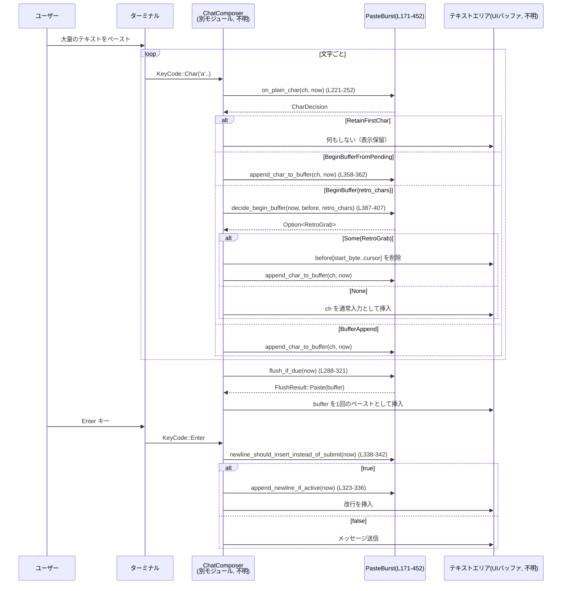

tui/src/bottom_pane/paste_burst.rs コード解説
======================================

## 0. ざっくり一言

キーボード入力から「高速に連続して届く文字列」を検出し、それをまとめて「ペースト」として扱うための**純粋なステートマシン**を提供するモジュールです（paste_burst.rs:L24-25, L171-180）。

---

## 1. このモジュールの役割

### 1.1 概要

- Windows など bracketed paste をサポートしないターミナルで、「ペーストらしい」連続文字入力を検出するモジュールです（paste_burst.rs:L3-4, L56-61）。
- 文字入力のタイミングと連続数から、以下を判定します（paste_burst.rs:L43-52, L56-64）。
  - 一時的に 1 文字だけ保留してフリッカー（表示が一瞬だけ変わること）を防ぐ。
  - 連続文字列をバッファに溜めて 1 回のペーストとして扱う。
  - 通常のタイピングとしてそのまま通す。
- 実際のテキストエリアの変更は行わず、**決定（enum）とバッファ文字列を返すだけ**です（paste_burst.rs:L24-25, L114-116）。

### 1.2 アーキテクチャ内での位置づけ

このモジュールは TUI のチャット入力コンポーネント `ChatComposer` から呼び出される補助ステートマシンとして位置づけられています（`ChatComposer` 自体の定義はこのチャンクにはありません）。

```mermaid
graph TD
    subgraph TUI入力
        A["ユーザーのキー入力"]
        B["ChatComposer<br/>(別モジュール, 不明)"]
        C["テキストエリア<br/>(UIバッファ, 不明)"]
    end

    subgraph Paste検出 (paste_burst.rs)
        PB["PasteBurst 構造体<br/>(L171-180)"]
        OP["on_plain_char / on_plain_char_no_hold<br/>(L221-275)"]
        FI["flush_if_due<br/>(L288-321)"]
        DB["decide_begin_buffer<br/>(L387-407)"]
    end

    A --> B
    B --> OP
    OP --> B
    B --> DB
    DB --> B
    B --> PB
    PB --> FI
    FI --> B
    B --> C
```

- `ChatComposer` は「プレーンな文字キーイベント」を `PasteBurst` に渡し、返ってきた `CharDecision` / `FlushResult` に応じて UI を更新します（paste_burst.rs:L112-146, L221-252, L288-297）。
- `PasteBurst` は内部状態（タイムスタンプ、文字バッファ、保留文字など）を持ちつつも、UI バッファには触れません（paste_burst.rs:L24-25, L171-180）。

### 1.3 設計上のポイント

- **純粋なステートマシン**  
  - UI テキストを直接変更せず、常に「何をすべきか」という決定のみを返します（paste_burst.rs:L24-25, L114-116）。
- **時間ベースのヒューリスティクス**  
  - 複数の `Duration` 定数を使って「ペーストらしい」速度を判断します（paste_burst.rs:L151-169）。
  - Windows とそれ以外で閾値を変えています（`#[cfg(windows)]` / `#[cfg(not(windows))]`, paste_burst.rs:L159-169）。
- **状態変数の分離**（paste_burst.rs:L171-180, L39-52）
  - `active`: 現在バースト中か。
  - `buffer`: 現在のバーストで溜めている文字列。
  - `pending_first_char`: 1 文字だけ保留中か（フリッカー抑制用）。
  - `last_plain_char_time` / `consecutive_plain_char_burst`: 連続文字のタイミングと回数。
  - `burst_window_until`: Enter を改行扱いにする「猶予時間」の終了時刻。
- **エラー・安全性**
  - `unsafe` は使用しておらず、インデックス計算も UTF-8 境界を守るユーティリティ経由で行われます（paste_burst.rs:L455-465）。
  - 全ての状態更新は `&mut self` 経由の同期 API で行われ、スレッド間で同一インスタンスを同時に操作することはできません。

---

## 2. 主要な機能一覧

### 2.1 コンポーネント一覧（型・関数・定数）

| 名前 | 種別 | 公開範囲 | 行番号 | 役割 / 用途 |
|------|------|----------|--------|-------------|
| `PASTE_BURST_MIN_CHARS` | 定数 | モジュール内 | L153 | バースト判定に必要な連続入力文字数の閾値（デフォルト 3） |
| `PASTE_ENTER_SUPPRESS_WINDOW` | 定数 | モジュール内 | L154 | Enter を改行として扱う猶予時間 |
| `PASTE_BURST_CHAR_INTERVAL` | 定数 | モジュール内（cfg） | L159-162 | 連続入力とみなす最大インターバル（OS別） |
| `PASTE_BURST_ACTIVE_IDLE_TIMEOUT` | 定数 | モジュール内（cfg） | L166-169 | バースト中に最後の文字からどれだけ待つかのタイムアウト（OS別） |
| `PasteBurst` | 構造体 | `pub(crate)` | L171-180 | バースト検出ステートマシン本体 |
| `CharDecision` | enum | `pub(crate)` | L182-192 | 各文字入力ごとの判定結果（保持・バッファ開始・追記など） |
| `RetroGrab` | 構造体 | `pub(crate)` | L194-197 | 過去に入力済みのテキストを「遡って」バッファに取り込むときの情報 |
| `FlushResult` | enum | `pub(crate)` | L199-203 | タイムアウト時のフラッシュ結果（ペースト文字列 / 単一文字 / なし） |
| `PasteBurst::recommended_flush_delay` | 関数 | `pub` | L205-214 | テストや UI がタイムアウト境界を確実に越えるための待ち時間を計算 |
| `PasteBurst::on_plain_char` | 関数 | `pub` | L221-252 | ASCII 文字入力 1 回に対する判定のメインエントリ |
| `PasteBurst::on_plain_char_no_hold` | 関数 | `pub` | L254-275 | 非 ASCII（IME など）向けの入力判定。保持は行わない |
| `PasteBurst::flush_if_due` | 関数 | `pub` | L288-321 | タイムアウトに達していればバッファや保留文字をフラッシュ |
| `PasteBurst::append_newline_if_active` | 関数 | `pub` | L323-336 | バースト中であれば Enter を改行としてバッファに追加 |
| `PasteBurst::newline_should_insert_instead_of_submit` | 関数 | `pub` | L338-342 | Enter を「送信」ではなく「改行」にすべきか判定 |
| `PasteBurst::extend_window` | 関数 | `pub` | L344-347 | Enter 猶予時間の延長 |
| `PasteBurst::begin_with_retro_grabbed` | 関数 | `pub` | L349-356 | 過去テキストをまとめてバッファに取り込んでバースト開始 |
| `PasteBurst::append_char_to_buffer` | 関数 | `pub` | L358-362 | 現在のバーストバッファに 1 文字追加 |
| `PasteBurst::try_append_char_if_active` | 関数 | `pub` | L364-373 | すでにバースト中であれば文字をバッファへ追加 |
| `PasteBurst::decide_begin_buffer` | 関数 | `pub` | L387-407 | 既に入力済みの文字を「ペーストらしい」か判定し、必要なら retro grab を開始 |
| `PasteBurst::flush_before_modified_input` | 関数 | `pub` | L409-420 | Ctrl/Alt など非文字入力の前に、バースト状態を強制フラッシュ |
| `PasteBurst::clear_window_after_non_char` | 関数 | `pub` | L422-432 | タイミング情報と保留文字をクリア（バッファ自体はクリアしない） |
| `PasteBurst::is_active` | 関数 | `pub` | L434-439 | 何らかのバースト関連の一時状態が存在するか判定 |
| `PasteBurst::clear_after_explicit_paste` | 関数 | `pub` | L445-452 | 明示的なペースト処理後に、状態を完全リセット |
| `retro_start_index` | 関数 | `pub(crate)` | L455-465 | retro grab で最後から `retro_chars` 文字分の先頭バイト位置を計算 |

（テストモジュール内のテスト関数は後述します）

### 2.2 主要な機能

- ペーストバースト検出: タイミングと連続文字数から「ペーストらしい入力」を検出（paste_burst.rs:L151-169, L221-252, L254-275）。
- 一文字保持によるフリッカー抑制: 最初の ASCII 文字を短時間だけ保留し、後続の入力を見てから挿入するかを決める（paste_burst.rs:L171-180, L221-252, L288-321）。
- Retro capture（遡りバッファ）: すでに UI に挿入済みのプレフィックスを「まとめてペースト」に再分類する仕組み（paste_burst.rs:L66-83, L376-407, L455-465）。
- Enter の抑制ウィンドウ: ペースト直後の Enter を「送信」ではなく「改行」として扱うための時間窓（paste_burst.rs:L154, L323-342, L550-574）。
- 非文字入力との整合性: 矢印キーや修飾付きキー入力の前にバッファをフラッシュし、状態が別入力にまたがらないようにする（paste_burst.rs:L85-94, L409-432）。

---

## 3. 公開 API と詳細解説

### 3.1 型一覧（構造体・列挙体）

| 名前 | 種別 | 行番号 | 役割 / 用途 |
|------|------|--------|-------------|
| `PasteBurst` | 構造体 | L171-180 | バースト検出状態（タイミング、バッファ、保留文字など）を保持するステートマシン本体 |
| `CharDecision` | enum | L182-192 | 1 文字入力に対する「どう扱うか」の決定（保持 / retro 開始 / 追記） |
| `RetroGrab` | 構造体 | L194-197 | retro capture で「どこから」「どの文字列を」バッファへ取り込むかを表す |
| `FlushResult` | enum | L199-203 | 時間経過によるフラッシュの結果（ペースト・タイピング・なし） |

`CharDecision` のバリアント:

- `BeginBuffer { retro_chars: u16 }`（L183-184）  
  直近の `retro_chars` 文字分を retro capture しつつバッファリング開始候補。
- `BufferAppend`（L185-186）  
  現在バースト中なので新しい文字をバッファへ追加すべき。
- `RetainFirstChar`（L187-189）  
  文字を一旦 UI に表示せず保留し、次の入力を待つ。
- `BeginBufferFromPending`（L190-191）  
  すでに保留している最初の 1 文字をバッファに移してからバースト開始。

`FlushResult` のバリアント:

- `Paste(String)`（L200）  
  バッファ全体を 1 回のペーストとして扱う。
- `Typed(char)`（L201）  
  保留していた単一文字を通常のタイピングとして挿入する。
- `None`（L202）  
  何もフラッシュしない。

### 3.2 関数詳細（重要 API 最大 7 件）

#### `PasteBurst::on_plain_char(&mut self, ch: char, now: Instant) -> CharDecision`  

**概要**（L221-252）

- ASCII のプレーンな文字入力 1 回に対して、「保持するか・retro を開始するか・バッファに追記するか」を決めるメインエントリです。
- 内部でタイミングと連続入力数を更新し、必要に応じて `pending_first_char` を設定します（L171-180, L277-285）。

**引数**

| 引数名 | 型 | 説明 |
|--------|----|------|
| `ch` | `char` | 入力されたプレーンな ASCII 文字（ASCII であることは呼び出し側の前提条件） |
| `now` | `Instant` | この入力が発生した現在時刻 |

**戻り値**

- `CharDecision`（L182-192）  
  - `RetainFirstChar`: 1 文字目を短時間保持。UI にまだ挿入してはいけない。
  - `BeginBufferFromPending`: すでに保持していた 1 文字目をバッファに移し、現在の文字もバッファへ追加するべき。
  - `BeginBuffer { retro_chars }`: retro capture を行う候補。呼び出し側で `decide_begin_buffer` を使って retro 実行可否を決める。
  - `BufferAppend`: すでにバースト中なのでバッファに追記すべき。

**内部処理の流れ**

1. `note_plain_char(now)` で直近の plain char 時刻と連続カウントを更新（L277-285）。
2. `self.active` が `true` であれば、既にバースト中とみなし `BurstAppend` を返却（L225-228）。
3. まだアクティブでなく `pending_first_char` が存在し、かつ保持から `PASTE_BURST_CHAR_INTERVAL` 以内なら（L230-240）:
   - `active = true` にして保持していた 1 文字目を `buffer` に push。
   - Enter 抑制ウィンドウを更新し（`burst_window_until`）、`BeginBufferFromPending` を返す。
4. それ以外で `consecutive_plain_char_burst >= PASTE_BURST_MIN_CHARS`（デフォルト 3）なら（L243-247）:
   - retro capture 用として `BeginBuffer { retro_chars = consecutive_plain_char_burst - 1 }` を返す。
5. 上記いずれでもなければ（L249-251）:
   - `pending_first_char = Some((ch, now))` として保持し、`RetainFirstChar` を返す。

**Examples（使用例）**

基本的な ASCII 入力とフラッシュの流れを示す例です。

```rust
use std::time::{Instant, Duration};
use tui::bottom_pane::paste_burst::{PasteBurst, CharDecision, FlushResult}; // 実際のパスはプロジェクト構成に依存

fn handle_ascii_typing_example() {
    let mut burst = PasteBurst::default();                      // ステートマシンを初期化
    let t0 = Instant::now();                                    // 最初のキー入力時刻

    // 1文字目: 一旦保持される
    match burst.on_plain_char('a', t0) {                        // 'a' を入力
        CharDecision::RetainFirstChar => {                      // フリッカー抑制のため保持
            // この時点では UI に 'a' を描画しない
        }
        _ => unreachable!(),
    }

    // 十分に時間が経過した後に flush_if_due を呼ぶ
    let t1 = t0 + PasteBurst::recommended_flush_delay()
        + Duration::from_millis(1);                             // 閾値を超えるように少し余裕を持たせる
    match burst.flush_if_due(t1) {                              // タイムアウトによるフラッシュ
        FlushResult::Typed(ch) => assert_eq!(ch, 'a'),          // 保留文字が通常のタイピングとして返る
        _ => panic!("unexpected flush result"),
    }
}
```

**Errors / Panics**

- この関数自身はエラー値を返さず、`panic!` も使用していません。
- 想定外の入力（非 ASCII 文字など）を渡しても、ロジック上は動作しますが、設計上は `on_plain_char_no_hold` を使うことが前提です（paste_burst.rs:L105-110）。

**Edge cases（エッジケース）**

- バースト中 (`active == true`) に呼ばれた場合は常に `BufferAppend` を返し、保持ロジックは走りません（L225-228）。
- `pending_first_char` に対して 2 回目の文字が遅れて到着し、`PASTE_BURST_CHAR_INTERVAL` を超えている場合は、保持は解除されず、再び 1 文字目として扱われます（L230-240, L277-285）。
- `consecutive_plain_char_burst` が `u16` の上限を超える場合にも `saturating_add` を使ってオーバーフローしないようにしています（L279-282）。

**使用上の注意点**

- **ASCII 専用**: 非 ASCII 文字（絵文字や CJK など）には `on_plain_char_no_hold` を使う契約になっています（paste_burst.rs:L105-110, L254-260）。
- 戻り値 `CharDecision` を解釈し、UI 側で
  - `RetainFirstChar` → 挿入しない
  - `BeginBufferFromPending` / `BufferAppend` → `append_char_to_buffer` を呼ぶ
  - `BeginBuffer { .. }` → `decide_begin_buffer` の結果に従う  
 という処理を行うことが前提です（paste_burst.rs:L117-126）。

---

#### `PasteBurst::on_plain_char_no_hold(&mut self, now: Instant) -> Option<CharDecision>`

**概要**（L254-275）

- IME や非 ASCII 文字入力に対して、**文字を保持せずに** バースト検出を行う関数です。
- 返り値は `Option<CharDecision>` で、`None` の場合は通常入力として流すことを意味します。

**引数**

| 引数名 | 型 | 説明 |
|--------|----|------|
| `now` | `Instant` | 入力イベントの時刻 |

※ 実際の文字は `ChatComposer` がすでに UI に挿入済みであることが想定されます（retro capture 用に文字数 `retro_chars` を渡すため、paste_burst.rs:L127-134）。

**戻り値**

- `Some(CharDecision::BufferAppend)`  
  すでにバースト中であり、現在の文字をバッファに追記すべき。
- `Some(CharDecision::BeginBuffer { retro_chars })`  
  retro capture を含むバッファリング開始候補。
- `None`  
  バースト条件を満たしていないので、通常のタイピングとして扱う。

**内部処理の流れ**

1. `note_plain_char(now)` でタイミングと連続カウントを更新（L260-262, L277-285）。
2. すでに `active == true` であれば Enter 抑制ウィンドウを延長しつつ `BufferAppend` を返却（L263-266）。
3. そうでなく `consecutive_plain_char_burst >= PASTE_BURST_MIN_CHARS` なら `BeginBuffer` を返却（L268-271）。
4. いずれにも当てはまらなければ `None` を返す（L273-274）。

**Examples**

```rust
use std::time::Instant;
use tui::bottom_pane::paste_burst::{PasteBurst, CharDecision};

fn handle_non_ascii_ime() {
    let mut burst = PasteBurst::default();                  // ステートマシンを準備
    let t0 = Instant::now();                                // 最初の文字の時刻

    // 1文字目: 何も起きず None
    assert!(burst.on_plain_char_no_hold(t0).is_none());     // IME文字1個ではバースト扱いしない

    // 2,3文字目を短時間に続けて入力したと仮定
    let t1 = t0;                                            // ここでは同時刻と仮定
    let t2 = t0;
    let _ = burst.on_plain_char_no_hold(t1);                // 2文字目
    if let Some(decision) = burst.on_plain_char_no_hold(t2) { // 3文字目で
        match decision {
            CharDecision::BeginBuffer { retro_chars } => {
                // retro_chars には過去に入力済みの文字数-1が入る
                assert!(retro_chars >= 1);
            }
            _ => {}
        }
    }
}
```

**Errors / Panics**

- `panic` を発生させる可能性はありません。
- `None` を返した場合に呼び出し側が retro capture を試みたりすると、設計上の意図から外れます（ただしクラッシュはしません）。

**Edge cases**

- `consecutive_plain_char_burst` は `note_plain_char` のロジックに依存するため、間隔が広い入力が混ざると 1 からカウントし直されます（L279-284）。
- ASCII / 非 ASCII を誤って混用すると、UI 上の動作が想定からずれる可能性があります（`pending_first_char` が使われないため）。

**使用上の注意点**

- `on_plain_char` と違い、この関数は「保持」や「保留文字のフラッシュ」には関与しません。
- 非 ASCII 入力経路では、**必ず** `on_plain_char_no_hold` を使うという分離が前提契約です（paste_burst.rs:L105-110, L128-134）。

---

#### `PasteBurst::flush_if_due(&mut self, now: Instant) -> FlushResult`

**概要**（L288-321）

- 一定時間入力が途切れたときに、状態に応じて
  - バッファ全体をペーストとして返すか、
  - 保留中の 1 文字を通常入力として返すか、
  - 何もしないか  
  を決定します。

**引数**

| 引数名 | 型 | 説明 |
|--------|----|------|
| `now` | `Instant` | 現在時刻 |

**戻り値**

- `FlushResult::Paste(String)`  
  バースト中 (`is_active_internal == true`) かつタイムアウトを超えた場合。バッファを空にして返却（L298-310）。
- `FlushResult::Typed(char)`  
  バーストではなく、保留していた 1 文字のみ存在する場合に、その文字を返却（L310-315）。
- `FlushResult::None`  
  タイムアウト前、またはフラッシュすべきものがない時（L296-297, L315-320）。

**内部処理の流れ**

1. `is_active_internal()` に応じてタイムアウト値を切り替え（アクティブ時: `PASTE_BURST_ACTIVE_IDLE_TIMEOUT`、非アクティブ時: `PASTE_BURST_CHAR_INTERVAL`）（L298-302, L441-443）。
2. `last_plain_char_time` が `Some` かつ `now - last_plain_char_time > timeout` ならタイムアウトと判定（`>` を使っている点がコメントで明示されています, L303-305, L63-64）。
3. タイムアウトかつ `is_active_internal() == true` の場合（L306-310）:
   - `active = false` にし、`buffer` を `std::mem::take` で取り出して `Paste` を返却。
4. タイムアウトだが `is_active_internal() == false` の場合（L310-317）:
   - `pending_first_char` を `take` して `Typed` を返却 (存在しなければ `None`)。
5. タイムアウトでなければ `None`（L318-320）。

**Examples**

```rust
use std::time::{Instant, Duration};
use tui::bottom_pane::paste_burst::{PasteBurst, CharDecision, FlushResult};

fn flush_paste_after_idle() {
    let mut burst = PasteBurst::default();                       // ステートマシン初期化
    let t0 = Instant::now();

    // 'a' を保持 → 'b' でバースト開始
    assert!(matches!(
        burst.on_plain_char('a', t0),
        CharDecision::RetainFirstChar
    ));

    let t1 = t0 + Duration::from_millis(1);
    assert!(matches!(
        burst.on_plain_char('b', t1),
        CharDecision::BeginBufferFromPending
    ));
    burst.append_char_to_buffer('b', t1);                        // 'b' をバッファに追加

    // バースト用の長いタイムアウトを超えるまで待つ
    let t2 = t1 + PasteBurst::recommended_flush_delay()
        + Duration::from_millis(10);                             // 実際には recommended_active_flush_delay() がテスト向けに用意されている
    match burst.flush_if_due(t2) {
        FlushResult::Paste(s) => assert_eq!(s, "ab".to_string()),// 'a' + 'b' がペーストとして返却
        other => panic!("unexpected flush result: {:?}", other),
    }
}
```

**Errors / Panics**

- バッファの取り出しには `std::mem::take` を用いており、`String` の所有権移動のみで panic 要素はありません（L308-309）。
- `last_plain_char_time` が `None` の場合でも `is_some_and` を用いて安全に処理しています（L303-305）。

**Edge cases**

- `clear_window_after_non_char` によって `last_plain_char_time` が `None` にされた場合、`flush_if_due` は **どれだけ時間が経っても**バッファをフラッシュしません（L422-432, L303-305）。  
  → バッファが残っている場合は、呼び出し側が `flush_before_modified_input` 等で明示的にフラッシュする必要があります。
- タイムアウトの比較は `>=` ではなく `>` で行われるため、テストや UI からの呼び出しは 1ms 以上余裕を持ってスケジューリングする必要があります（L63-64, L212-214）。

**使用上の注意点**

- UI 側では、一定周期の「tick」ごとに `flush_if_due` を呼び、必要に応じてペースト処理や単一文字の反映を行う前提です（paste_burst.rs:L31-33, L140-143）。
- `clear_window_after_non_char` を誤って先に呼び出すと、バッファが「永続的に溜まり続ける」状態になり得るため、呼び出し順序（まずフラッシュ、次に window クリア）が契約として重要です（L85-94, L409-432）。

---

#### `PasteBurst::append_newline_if_active(&mut self, now: Instant) -> bool`

**概要**（L323-336）

- バースト中に Enter キーが押されたとき、テキストエリアの「送信」を阻止し、バッファに改行文字 `\n` を追加するための関数です。
- 追加された場合は Enter 抑制ウィンドウも更新します。

**引数**

| 引数名 | 型 | 説明 |
|--------|----|------|
| `now` | `Instant` | Enter 入力時刻 |

**戻り値**

- `true`  
  `is_active()` が `true` のとき。`buffer` に `\n` を追加し、`burst_window_until` を更新したことを示す（L329-333）。
- `false`  
  バーストコンテキストではないので、呼び出し側は通常の Enter 処理（送信など）を行うべき（L333-335）。

**内部処理の流れ**

1. `is_active()` を呼び、バースト関連状態が存在するか確認（L329-330, L434-439）。
2. `true` の場合:
   - `buffer.push('\n')` で改行を追加（L330）。
   - `burst_window_until` を `now + PASTE_ENTER_SUPPRESS_WINDOW` に更新（L331）。
3. `false` の場合は何もせず `false` を返す（L333-335）。

**Examples**

```rust
use std::time::{Instant, Duration};
use tui::bottom_pane::paste_burst::{PasteBurst, CharDecision};

fn handle_enter_during_paste() {
    let mut burst = PasteBurst::default();
    let t0 = Instant::now();

    // バースト開始（ここでは単純化のため詳細は省略）
    let _ = burst.on_plain_char('a', t0);                        // 1文字目保持
    let t1 = t0 + Duration::from_millis(1);
    let _ = burst.on_plain_char('b', t1);                        // 2文字目で BeginBufferFromPending
    burst.append_char_to_buffer('b', t1);                        // 'b' 追加 → buffer="ab"

    // Enter が押されたとき
    let t_enter = t1 + Duration::from_millis(2);
    if burst.append_newline_if_active(t_enter) {                 // バースト中なら true
        // buffer には "ab\n" が入っている
    } else {
        // 通常の送信処理を行う
    }
}
```

**Errors / Panics**

- `String::push` のみを行っており、panic 要素はありません。
- `is_active` は内部で `is_active_internal` と `pending_first_char` を見るだけで、外部状態には依存しません（L434-443）。

**Edge cases**

- `active == false` でも `buffer` が非空であれば `is_active()` は `true` となるため、過去のバースト残りに対して改行が追加される可能性があります（L437-443）。  
  → `clear_after_explicit_paste` を適切に呼んでバッファをクリアすることが重要です（L445-452）。

**使用上の注意点**

- この関数は **Enter キーが「送信」以外の意味を持つかどうか** の判定にのみ関与し、UI 側で「送信をキャンセルする」という処理は別途必要です。
- 通常は `newline_should_insert_instead_of_submit` と組み合わせて利用されます（L338-342）。

---

#### `PasteBurst::newline_should_insert_instead_of_submit(&self, now: Instant) -> bool`

**概要**（L338-342）

- 現在の状態と時間から、「Enter を改行として扱うか」「送信として扱うか」を判定する関数です。
- バッファがすでにフラッシュされた後でも、短い抑制ウィンドウ内であれば改行扱いを続けます（テストで検証, L550-574）。

**引数**

| 引数名 | 型 | 説明 |
|--------|----|------|
| `now` | `Instant` | Enter 入力時刻 |

**戻り値**

- `true`  
  - バースト関連状態がまだアクティブ (`is_active() == true`) である場合、または  
  - `burst_window_until` が `Some` かつ `now <= burst_window_until` の場合（L340-341）。
- `false`  
  上記に該当しない場合（Enter を送信として扱う）。

**内部処理の流れ**

1. `burst_window_until` が `Some` かつ `now <= until` であれば `in_burst_window = true`（L340）。
2. `self.is_active()` か `in_burst_window` のどちらかが `true` なら `true` を返す（L341）。

**Examples**

```rust
use std::time::{Instant, Duration};
use tui::bottom_pane::paste_burst::{PasteBurst, CharDecision, FlushResult};

fn enter_behavior_after_paste() {
    let mut burst = PasteBurst::default();
    let t0 = Instant::now();

    // 簡易的にバーストを開始→フラッシュする（詳細は省略）
    let _ = burst.on_plain_char('a', t0);                      // 1文字目
    let t1 = t0 + Duration::from_millis(1);
    let _ = burst.on_plain_char('b', t1);                      // 2文字目
    burst.append_char_to_buffer('b', t1);
    let t2 = t1 + Duration::from_millis(50);
    let _ = burst.flush_if_due(t2);                            // バッファをフラッシュ

    assert!(!burst.is_active());                              // バーストは非アクティブ
    assert!(burst.newline_should_insert_instead_of_submit(t2));// しかしまだ抑制ウィンドウ内

    let t3 = t1 + Duration::from_millis(200);                 // 抑制ウィンドウを超える
    assert!(!burst.newline_should_insert_instead_of_submit(t3));// ここでは送信扱いに戻る
}
```

**Errors / Panics**

- 読み取り専用であり、panic に繋がる処理はありません。

**Edge cases**

- `clear_window_after_non_char` や `clear_after_explicit_paste` により `burst_window_until` が `None` にされた場合、必ず `false` を返すようになります（L422-432, L445-452）。
- 時刻 `now` が過去の `burst_window_until` より前の値（時計の巻き戻りなど）になった場合の挙動はこのコードからは特に考慮されていませんが、通常の `Instant` の使用では想定されません。

**使用上の注意点**

- UI 側で Enter キーが押されたとき、
  - `newline_should_insert_instead_of_submit(now)` が `true` → 改行挿入
  - `false` → メッセージ送信  
  という分岐の入り口として使うことが意図されています（コメント, L323-327）。

---

#### `PasteBurst::decide_begin_buffer(&mut self, now: Instant, before: &str, retro_chars: usize) -> Option<RetroGrab>`

**概要**（L387-407）

- `on_plain_char` / `on_plain_char_no_hold` が返した `BeginBuffer { retro_chars }` に応じて、
  - 既にテキストエリアに挿入済みの末尾 `retro_chars` 文字分を「retro capture」するかどうかを評価し、
  - 必要であればバッファに取り込んでバーストを開始する関数です。
- ここでは「ペーストらしさ」を、空白を含むか、十分な長さ（>= 16 文字）として判定しています（L395-397）。

**引数**

| 引数名 | 型 | 説明 |
|--------|----|------|
| `now` | `Instant` | 判定時刻 |
| `before` | `&str` | カーソル位置より前にある既存テキスト（UTF-8 文字列） |
| `retro_chars` | `usize` | retro capture 対象とする「末尾の文字数」（文字単位） |

**戻り値**

- `Some(RetroGrab { start_byte, grabbed })`  
  retro capture を行うべきと判定した場合  
  → `begin_with_retro_grabbed` を内部で呼び出し、バッファと状態を更新した上で、呼び出し元 UI に対して削除すべきスライス情報を返す（L393-403）。
- `None`  
  retro capture をすべきではないと判定した場合  
  → 呼び出し元は既存テキストをそのまま残し、通常のタイピングとして扱うことが推奨されます（コメント, L376-383）。

**内部処理の流れ**

1. `retro_start_index(before, retro_chars)` で `before` の末尾 `retro_chars` 文字分の開始バイト位置を決定（L393, L455-465）。
2. `before[start_byte..]` を `grabbed` として取得（L394）。
3. `looks_pastey` を以下で判定（L395-397）:
   - `grabbed` に空白を含む (`char::is_whitespace`) か、
   - `grabbed.chars().count() >= 16` か。
4. `looks_pastey == true` の場合:
   - `begin_with_retro_grabbed(grabbed.clone(), now)` を呼び出して状態をバースト開始状態に更新（L398-399, L349-356）。
   - `RetroGrab { start_byte, grabbed }` を `Some` で返す（L400-403）。
5. そうでなければ `None`（L404-405）。

**Examples**

```rust
use std::time::Instant;
use tui::bottom_pane::paste_burst::{PasteBurst, CharDecision};

fn retro_capture_example() {
    let mut burst = PasteBurst::default();
    let now = Instant::now();

    // すでに UI 上には "a b" という文字列があるとする
    let before = "a b";

    // on_plain_char / on_plain_char_no_hold の結果として retro_chars = 2 を受け取ったと仮定
    let retro_chars = 2;

    if let Some(grab) = burst.decide_begin_buffer(now, before, retro_chars) {
        // grab.start_byte は "a b" の ' ' の位置 (byte index 1)（テストで確認, L542-546）
        assert_eq!(grab.start_byte, 1);
        assert_eq!(grab.grabbed, " b");                        // " b" が retro capture 対象

        // UI 側では before[grab.start_byte..] を削除し、current char を含めてバッファに集約する
    } else {
        // retro capture せず、通常のタイピングとして扱う
    }
}
```

**Errors / Panics**

- `before[start_byte..]` は UTF-8 境界上のインデックスを使っているため、panic しません（`retro_start_index` が char boundary を返す, L455-465）。
- `retro_chars` が `before` の長さを超えていても `retro_start_index` が `0` を返すため、安全に全文を対象にできます（L455-465）。

**Edge cases**

- `retro_chars == 0` の場合、`start_byte = before.len()` となり、空文字列が `grabbed` になります（L455-458）。  
  → `looks_pastey` は必ず `false` になるので `None` を返します。
- `before` が非常に長い場合でも、`char_indices().rev().nth(...)` により末尾から数えるため、性能は入力長に比例します（L459-463）。

**使用上の注意点**

- 呼び出し側 UI は `RetroGrab.start_byte` を使って、**必ず文字境界でカーソルを合わせてから** `before[start_byte..cursor]` を削除する必要があります（契約はコメントで明記, L80-83）。
- `looks_pastey` の条件はヒューリスティックであり、短い単語（例: 「abc」）は retro capture を行わない設計です（L379-383, L528-539）。

---

#### `PasteBurst::flush_before_modified_input(&mut self) -> Option<String>`

**概要**（L409-420）

- 非文字入力（Ctrl/Alt 修飾キーや矢印キーなど）を適用する前に、**一時的なバースト状態や保留文字をすべてまとめてフラッシュする**ための関数です。
- 呼び出し後、`active` と `pending_first_char` はクリアされます。

**引数**

- なし

**戻り値**

- `Some(String)`  
  - `is_active()` が `true` の場合  
  - `buffer` の内容＋保留中の 1 文字（存在する場合）が連結された文字列（L414-419）。
- `None`  
  - バースト関連状態が全く存在しない場合（L411-413）。

**内部処理の流れ**

1. `is_active()` が `false` なら `None` を返す（L411-413）。
2. `active = false` に設定（L414）。
3. `buffer` を `std::mem::take` で取り出し `out` に格納（L415）。
4. `pending_first_char` が存在する場合は、その文字を `out` の末尾に追加（L416-417）。
5. `Some(out)` を返却（L419）。

**Examples**

```rust
use std::time::Instant;
use tui::bottom_pane::paste_burst::{PasteBurst, CharDecision};

fn flush_before_ctrl_key() {
    let mut burst = PasteBurst::default();
    let t0 = Instant::now();

    // 'a' を保持中の状態にする
    assert!(matches!(
        burst.on_plain_char('a', t0),
        CharDecision::RetainFirstChar
    ));

    // ここで Ctrl+Left など非文字入力を処理する前にフラッシュ
    if let Some(s) = burst.flush_before_modified_input() {
        assert_eq!(s, "a".to_string());                        // 保留中の 'a' が返る
        // UI 側では s を通常のペースト経路などで反映してから Ctrl+Left を処理する
    }
}
```

**Errors / Panics**

- `std::mem::take` と文字の連結のみであり、panic を発生させる要素はありません。

**Edge cases**

- `buffer` が空で `pending_first_char` だけが存在する状態でも `Some(1文字)` を返すため、「単一文字のフリッカー抑制」状態も漏れなく処理できます（テストで検証, L513-526）。
- `clear_window_after_non_char` より **前に** 呼ぶことが想定されており、順番を逆にすると `flush_if_due` からのフラッシュが不可能になったバッファが残る場合があります（L85-94, L422-432）。

**使用上の注意点**

- ドキュメント上、「非文字入力の前には必ず `flush_before_modified_input` を呼ぶ」という契約です（L34-37, L136-138）。
- この関数は Enter 抑制ウィンドウ (`burst_window_until`) は変更しないため、必要に応じて `clear_window_after_non_char` も組み合わせて使います（L422-432）。

---

#### `PasteBurst::recommended_flush_delay() -> Duration`

**概要**（L205-214）

- テストおよび TUI 側が `flush_if_due` を呼ぶタイミングを決める際に、「閾値を 1ms 確実に超える」ための推奨遅延を返す関数です。
- 具体的には `PASTE_BURST_CHAR_INTERVAL + 1ms` を返します（L212-214）。

**引数 / 戻り値**

- 引数なし。
- 戻り値: `Duration`  
  `PASTE_BURST_CHAR_INTERVAL + Duration::from_millis(1)`。

**使用例**

テストコードの中で直接利用されています（L483-484）。

```rust
use std::time::{Instant, Duration};
use tui::bottom_pane::paste_burst::PasteBurst;

fn schedule_tick_example() {
    let t0 = Instant::now();
    let delay = PasteBurst::recommended_flush_delay();       // 閾値を安全に超える遅延
    let next_tick = t0 + delay + Duration::from_millis(1);   // さらに余裕をもたせることも可能

    // UI のタイマーなどで next_tick を目安に flush_if_due を呼ぶ
}
```

**注意点**

- Windows と非 Windows で `PASTE_BURST_CHAR_INTERVAL` が異なるため、この関数を通じて環境依存の閾値差を吸収するのが意図された使い方です（L159-162, L212-214）。

---

### 3.3 その他の関数（補助関数）

| 関数名 | シグネチャ | 行番号 | 役割（1 行） |
|--------|------------|--------|--------------|
| `note_plain_char` | `fn note_plain_char(&mut self, now: Instant)` | L277-285 | 連続 plain char のタイミングと回数を更新する内部ヘルパー |
| `extend_window` | `pub fn extend_window(&mut self, now: Instant)` | L344-347 | Enter 抑制ウィンドウを手動で延長する |
| `begin_with_retro_grabbed` | `pub fn begin_with_retro_grabbed(&mut self, grabbed: String, now: Instant)` | L349-356 | retro capture 済み文字列でバーストを開始する |
| `append_char_to_buffer` | `pub fn append_char_to_buffer(&mut self, ch: char, now: Instant)` | L358-362 | バーストバッファに 1 文字追加し、Enter 抑制ウィンドウを更新 |
| `try_append_char_if_active` | `pub fn try_append_char_if_active(&mut self, ch: char, now: Instant) -> bool` | L367-373 | `active` またはバッファ非空であれば文字を追加する |
| `clear_window_after_non_char` | `pub fn clear_window_after_non_char(&mut self)` | L426-432 | タイミング情報と保留文字をクリアする（バッファはそのまま） |
| `is_active` | `pub fn is_active(&self) -> bool` | L437-439 | バースト関連の一時状態が存在するかどうかを判定 |
| `is_active_internal` | `fn is_active_internal(&self) -> bool` | L441-443 | `active` またはバッファ非空かどうかを判定する内部関数 |
| `clear_after_explicit_paste` | `pub fn clear_after_explicit_paste(&mut self)` | L445-452 | 明示的なペースト処理後に、すべての状態を完全にクリア |
| `retro_start_index` | `pub(crate) fn retro_start_index(before: &str, retro_chars: usize) -> usize` | L455-465 | UTF-8 文字列 `before` の末尾 `retro_chars` 文字を切り出す開始バイト位置を返す |

---

## 4. データフロー

代表的なシナリオ: **ASCII 文字列が高速に貼り付けられ、最終的にペーストとして処理されるケース**です。

### 概要

1. ユーザーがターミナルに大量の ASCII テキストをペーストすると、ターミナルはそれを多数の `KeyCode::Char` イベントとして送ってくる（ドキュメント, L3-4）。
2. `ChatComposer` は各 ASCII 文字ごとに `PasteBurst::on_plain_char` を呼び、`CharDecision` に応じて UI バッファまたは `PasteBurst.buffer` を更新する（L112-126, L221-252）。
3. 一定時間入力が途切れると、`flush_if_due` が `FlushResult::Paste` を返し、`ChatComposer` はそれを 1 回のペーストとして扱う（L288-297, L31-33）。
4. フラッシュ後もしばらくの間は Enter が改行として扱われる（L323-342, テスト L550-574）。

### シーケンス図



---

## 5. 使い方（How to Use）

### 5.1 基本的な使用方法

ASCII 入力とペースト検出を組み合わせた最小構成の例です（擬似的な `ChatComposer`）。

```rust
use std::time::Instant;
use tui::bottom_pane::paste_burst::{
    PasteBurst, CharDecision, FlushResult, RetroGrab
}; // 実際のパスはプロジェクトに合わせて調整する

// 簡易的な UI バッファ
#[derive(Default)]
struct UiBuffer {
    text: String,                                           // テキストエリアの内容
    cursor: usize,                                          // カーソルのバイト位置（文字境界にある前提）
}

impl UiBuffer {
    fn insert_str(&mut self, s: &str) {                     // 文字列を現在のカーソル位置に挿入
        self.text.insert_str(self.cursor, s);               // text に s を挿入
        self.cursor += s.len();                             // カーソル位置を進める
    }

    fn remove_range(&mut self, start: usize, end: usize) {  // [start, end) を削除
        self.text.replace_range(start..end, "");            // 範囲を空文字列に置き換える
        self.cursor = start;                                // カーソルを削除開始位置へ移動
    }
}

fn handle_ascii_input(ui: &mut UiBuffer,
                      burst: &mut PasteBurst,
                      ch: char,
                      now: Instant) {
    match burst.on_plain_char(ch, now) {                    // ASCII 文字をステートマシンに渡す
        CharDecision::RetainFirstChar => {
            // まだ UI に挿入しない（フリッカー抑制）
        }
        CharDecision::BeginBufferFromPending => {
            // 以前の1文字はすでにバッファに入っているので、今の文字だけ追加
            burst.append_char_to_buffer(ch, now);           // buffer += ch
        }
        CharDecision::BeginBuffer { retro_chars } => {
            let before = &ui.text[..ui.cursor];             // カーソル前のテキスト
            if let Some(RetroGrab { start_byte, grabbed }) =
                burst.decide_begin_buffer(now, before, retro_chars)
            {
                ui.remove_range(start_byte, ui.cursor);     // retro capture 分を UI から削除
                burst.append_char_to_buffer(ch, now);       // 現在の文字もバッファに追加
            } else {
                ui.insert_str(&ch.to_string());             // retro 不採用 → 通常入力
            }
        }
        CharDecision::BufferAppend => {
            burst.append_char_to_buffer(ch, now);           // バースト中 → 追記
        }
    }
}

fn periodic_tick(ui: &mut UiBuffer, burst: &mut PasteBurst, now: Instant) {
    match burst.flush_if_due(now) {                         // 時間経過によるフラッシュ
        FlushResult::Paste(s) => ui.insert_str(&s),         // 全体を1回のペーストとして挿入
        FlushResult::Typed(ch) => ui.insert_str(&ch.to_string()), // 保留1文字を通常入力
        FlushResult::None => {}
    }
}
```

### 5.2 よくある使用パターン

1. **ASCII と非 ASCII の入力経路を分ける**

```rust
fn handle_key_event(ui: &mut UiBuffer,
                    burst: &mut PasteBurst,
                    key: KeyEvent,
                    now: Instant) {
    match key {
        KeyEvent::Char(ch) if ch.is_ascii() => {            // ASCII 文字
            handle_ascii_input(ui, burst, ch, now);         // 上述の関数を利用
        }
        KeyEvent::Char(_ch) => {                            // 非ASCII (IMEなど)
            if let Some(decision) = burst.on_plain_char_no_hold(now) {
                match decision {
                    CharDecision::BufferAppend => {
                        // 非ASCII文字をバッファに追加（UI側で渡す必要がある）
                    }
                    CharDecision::BeginBuffer { retro_chars } => {
                        // before/cursor などを使って retro capture を試みる
                    }
                    _ => {}
                }
            } else {
                // 通常挿入
            }
        }
        _ => {
            // 非文字入力の前にフラッシュ
            if let Some(s) = burst.flush_before_modified_input() {
                ui.insert_str(&s);                          // ペーストとして挿入
            }
            burst.clear_window_after_non_char();            // タイミング情報をクリア
            // ここで矢印キー等の処理を行う
        }
    }
}
```

1. **Enter キーの扱い**

```rust
fn handle_enter(ui: &mut UiBuffer, burst: &mut PasteBurst, now: Instant) {
    if burst.newline_should_insert_instead_of_submit(now) { // 改行にすべきか判定
        let appended = burst.append_newline_if_active(now); // バースト中ならバッファに '\n'
        if !appended {
            ui.insert_str("\n");                            // バースト状態でなければ通常の改行挿入
        }
    } else {
        // メッセージ送信処理
    }
}
```

### 5.3 よくある間違い

```rust
// 間違い例: 非文字入力の前に flush_before_modified_input を呼ばない
fn wrong_handle_non_char(burst: &mut PasteBurst) {
    burst.clear_window_after_non_char();                   // 先に timing をクリアしてしまう
    // ... Ctrl/Alt 入力などを処理 ...
    // この状態だと、buffer に残っている文字列が flush_if_due ではフラッシュされない
}

// 正しい例: 先にフラッシュしてから timing をクリア
fn correct_handle_non_char(ui: &mut UiBuffer, burst: &mut PasteBurst) {
    if let Some(s) = burst.flush_before_modified_input() { // まずバッファと保留文字をフラッシュ
        ui.insert_str(&s);                                 // UI に反映
    }
    burst.clear_window_after_non_char();                   // 次に timing をリセット
}
```

```rust
// 間違い例: 非ASCII文字にも on_plain_char を使う
fn wrong_handle_non_ascii(burst: &mut PasteBurst, ch: char, now: Instant) {
    let _ = burst.on_plain_char(ch, now);                  // 設計上は非推奨
}

// 正しい例: 非ASCII には on_plain_char_no_hold を使う
fn correct_handle_non_ascii(burst: &mut PasteBurst, ch: char, now: Instant) {
    if let Some(decision) = burst.on_plain_char_no_hold(now) {
        // decision に応じて retro capture などを行う
    } else {
        // 通常挿入
    }
}
```

### 5.4 使用上の注意点（まとめ）

- **前提条件**
  - `ChatComposer` は plain char と修飾付き / 非文字入力を明確に区別して呼び分ける必要があります（L27-37, L136-138）。
  - `retro_start_index` を使うとき、UI 側のカーソル位置は必ず文字境界にあるべきです（契約, L80-83）。
- **禁止事項 / 誤用注意**
  - `clear_window_after_non_char` をバッファフラッシュより先に呼ぶと、`flush_if_due` では二度とバッファがフラッシュされなくなります（L85-94, L422-432, L303-305）。
  - ASCII / 非 ASCII で `on_plain_char` / `on_plain_char_no_hold` を混同すると、フリッカー抑制や retro capture の挙動が想定と異なる可能性があります（L105-110, L254-275）。
- **スレッド安全性・並行性**
  - 全ての状態変更関数は `&mut self` を取るため、1 インスタンスを同時に複数スレッドから操作することはコンパイル時に防止されます。
  - このモジュール自身はスレッドや非同期処理を生成しません。タイマーやイベントループは上位層（TUI）が担います。
- **エラー・パニック**
  - `panic!` や `unwrap`（panic する方）は一切使われておらず、UTF-8 インデックスも常に文字境界になるよう設計されています（L455-465）。
- **パフォーマンス**
  - バッファは `String` 1 つだけで、各入力ごとに O(1) ないし O(文字列長) の処理です。
  - `decide_begin_buffer` / `retro_start_index` は `before` の長さに比例してコストがかかるため、非常に長い入力に対して頻繁に呼ぶと負荷になる可能性はあります（L459-463, L393-397）。

---

## 6. 変更の仕方（How to Modify）

### 6.1 新しい機能を追加する場合

例: 「ペーストらしさ」の判定条件をカスタマイズしたい場合。

1. **判定ロジックの追加**
   - 現在のヒューリスティックは `decide_begin_buffer` 内の `looks_pastey`（L395-397）に集中しています。
   - ここに新しい条件（例: 特定のプレフィックス・URL 判定など）を追加すると、retro capture の開始条件を拡張できます。
2. **設定値の導入**
   - 閾値（文字数 16 など）を外部設定から変更したい場合は、`PasteBurst` に設定用フィールドを追加し、コンストラクタ（現状 `Default` のみ, L171-172）や `impl PasteBurst` に `new(config: ...)` を追加するのが自然です。
3. **呼び出し元との契約整理**
   - `docs/tui-chat-composer.md` と、モジュール冒頭の契約コメント（L112-146）を更新し、新しい `CharDecision` や挙動について説明を追記する必要があります。

### 6.2 既存の機能を変更する場合

- **影響範囲の確認**
  - 連続文字数やタイムアウトに関わる変更は、定数定義部（L151-169）と、それを参照している関数（`note_plain_char`, `flush_if_due`, `recommended_flush_delay` など）に影響します。
  - retro capture ロジックの変更は `decide_begin_buffer` と `retro_start_index`（L387-407, L455-465）、およびテスト `decide_begin_buffer_only_triggers_for_pastey_prefixes`（L528-548）を確認する必要があります。
- **契約・前提条件の保持**
  - `PasteBurst` は「UI バッファを直接いじらない」という契約に基づいており（L24-25, L114-116）、新たに UI への副作用を追加するのはこの設計方針と矛盾します。
  - `CharDecision` / `FlushResult` の意味が変わる場合は、呼び出し側（`ChatComposer`）の処理を全て確認する必要があります。
- **テストの更新**
  - 挙動変更時には、既存のテスト（L472-575）を確認し、必要であれば期待値や新しいテストケースを追加することが推奨されます。
- **想定される不具合・安全性の観点**
  - タイムアウト値や連続文字数閾値を極端に小さく／大きくすると、
    - ペーストが通常タイピング扱いになったり、
    - 通常タイピングが誤ってペースト扱いになる可能性があります。
  - これは機能的なバグとして現れますが、メモリ安全性が損なわれることはありません（本モジュールは純粋なロジックのみ, L24-25）。

---

## 7. 関連ファイル

このチャンクから直接参照できる他ファイル・モジュールは限定的ですが、文書コメントから以下が読み取れます。

| パス / 識別子 | 種別 | 役割 / 関係 |
|---------------|------|-------------|
| `docs/tui-chat-composer.md` | ドキュメント | `PasteBurst` が `ChatComposer` とどのように統合されるかの高レベルな説明（L19-20）。ファイル内容はこのチャンクには含まれていません。 |
| `ChatComposer` | 他モジュール（構造体名のみ判明） | 本モジュールの主な呼び出し元。plain char イベントを `PasteBurst` に渡し、`CharDecision` / `FlushResult` に基づいて UI を更新します（L112-146）。定義場所はこのチャンクには現れません。 |
| `tui/src/bottom_pane` ディレクトリ | コンテキスト | `paste_burst.rs` が所属する TUI 底部ペイン関連ディレクトリ。ここには他の UI ロジックが含まれていると推測されますが、このチャンクには詳細はありません。 |

---

### テストについて（補足）

- テストモジュール `tests`（L467-575）は、主に以下の挙動を検証しています。
  - ASCII 1 文字保持 → タイムアウト後に `FlushResult::Typed` として返る（L472-486）。
  - 2 文字の高速入力 → バッファ開始 → ペーストとしてフラッシュ（L488-511）。
  - `flush_before_modified_input` が保留文字も含めてフラッシュすること（L513-526）。
  - `decide_begin_buffer` が空白を含むプレフィックスのみをペースト扱いにすること（L528-548）。
  - Enter 抑制ウィンドウがバッファフラッシュ後もしばらく有効であること（L550-574）。

これらのテストにより、本モジュールの契約とエッジケースが具体的な形で担保されています。
