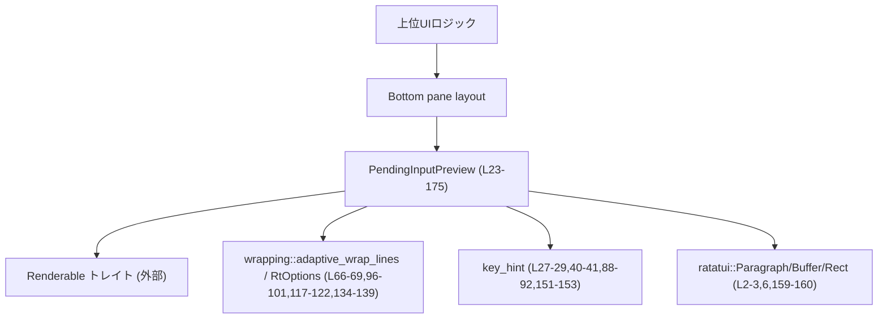
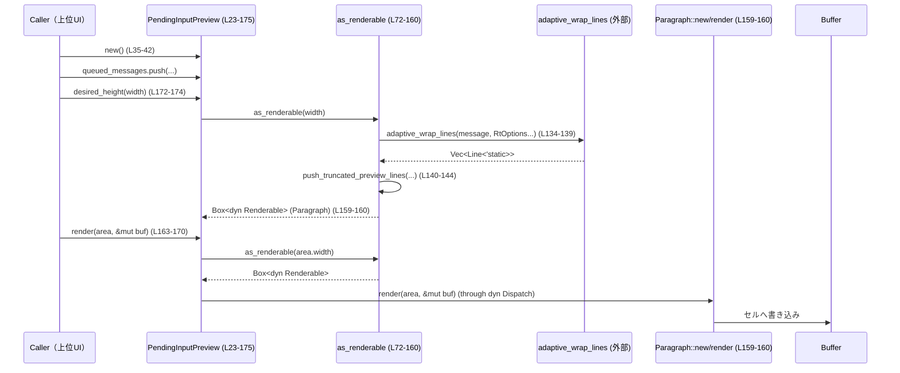

# tui/src/bottom_pane/pending_input_preview.rs

## 0. ざっくり一言

ターン進行中に保留されている「steer」（指示メッセージ）や、キューされたフォローアップメッセージの一覧を、下部ペインにプレビュー表示する ratatui 用ウィジェットを定義しているモジュールです（pending_input_preview.rs:L13-22, L23-30, L163-175）。

---

## 1. このモジュールの役割

### 1.1 概要

- このモジュールは、**対話セッション中にまだ送信されていないユーザー入力の一覧を、簡略プレビューとして表示する**ために存在します（pending_input_preview.rs:L13-22）。
- 表示対象は 3 種類です（pending_input_preview.rs:L23-26, L83-147）。

  1. `pending_steers`: 次のツール呼び出し後に送信予定のメッセージ
  2. `rejected_steers`: 今ターンの最後に再送予定のメッセージ
  3. `queued_messages`: 通常のフォローアップメッセージ

- 各メッセージは折り返し・行数制限付きで描画され、末尾には「最後のキューされたメッセージを編集する」ためのキーバインドヒントが表示されます（pending_input_preview.rs:L148-157）。

### 1.2 アーキテクチャ内での位置づけ

外部との関係は以下のとおりです。

- 入力側
  - 他のコンポーネントが `PendingInputPreview` のフィールド `pending_steers`, `rejected_steers`, `queued_messages` を更新します（pending_input_preview.rs:L23-29）。
  - 必要であれば `set_edit_binding` でキー表示だけ変更します（pending_input_preview.rs:L44-49）。
- 表示側
  - TUI レイアウト側から `Renderable::render` / `desired_height` が呼び出され、内部で `as_renderable` が `ratatui::widgets::Paragraph` に変換します（pending_input_preview.rs:L72-80, L163-175）。
- 補助モジュール
  - `crate::wrapping::{adaptive_wrap_lines, RtOptions}` によるテキスト折り返し（pending_input_preview.rs:L66-69, L96-101, L117-122, L134-139）。
  - `crate::key_hint` によるキーバインド表示の生成（pending_input_preview.rs:L27-29, L40-41, L88-92, L151-153）。
  - 低レベル描画は ratatui (`Buffer`, `Rect`, `Paragraph`) と crossterm (`KeyCode`) に依存（pending_input_preview.rs:L1-6）。



### 1.3 設計上のポイント

- **状態保持ウィジェット**  
  - `PendingInputPreview` 自体が `Vec<String>` でメッセージを保持し（pending_input_preview.rs:L23-29）、描画時にそれを読み取って Paragraph を構築します（pending_input_preview.rs:L81-159）。
- **階層化された描画ロジック**  
  - 高レベル API: `render` / `desired_height`（Renderable 実装, pending_input_preview.rs:L163-175）。  
  - 中レベル: `as_renderable` が `Box<dyn Renderable>` に変換（pending_input_preview.rs:L72-160）。  
  - 低レベルヘルパー: 行数制限 (`push_truncated_preview_lines`) とセクションヘッダ (`push_section_header`)（pending_input_preview.rs:L51-60, L63-70）。
- **プレビュー行数の制限**  
  - 1 メッセージ当たり最大 PREVIEW_LINE_LIMIT 行だけ表示し、それ以上は省略記号行を追加する設計です（pending_input_preview.rs:L32, L51-60, L102-103, L123-124, L140-144）。
- **幅が狭い場合の無描画**  
  - 幅が 4 未満、またはメッセージが 1 つもないときは、空の `Renderable`（`()`）を返します（pending_input_preview.rs:L72-80）。  
    → `desired_height` が 0 になり（テストで確認, pending_input_preview.rs:L183-187）、描画コストを避けています。
- **エラーハンドリング**  
  - このファイル内には `Result` や `panic!` 呼び出しはなく、明示的なエラー処理は行っていません。外部関数（`adaptive_wrap_lines`, `Paragraph::new` など）のエラー挙動は、このチャンクからは分かりません。

---

## 2. 主要な機能一覧

- ペンディングメッセージの状態保持: `pending_steers`, `rejected_steers`, `queued_messages` による 3 種類の待機中メッセージ管理（pending_input_preview.rs:L23-29）。
- プレビュー用描画コンポーネントの生成: `as_renderable` が状態から Paragraph を構築（pending_input_preview.rs:L72-160）。
- メッセージの折り返しと行数制限: `adaptive_wrap_lines` + `PREVIEW_LINE_LIMIT` + `push_truncated_preview_lines` により、最大 3 行＋省略記号行へ切り詰め（pending_input_preview.rs:L32, L51-60, L96-103, L117-124, L134-144）。
- セクションヘッダ付きリスト表示: 各カテゴリごとに見出しを付与して表示（pending_input_preview.rs:L83-94, L106-115, L127-132）。
- 編集キーバインドヒントの表示: `edit_binding` を使った「最後のキューされたメッセージを編集」ヒントの描画（pending_input_preview.rs:L27-29, L148-157）。
- Renderable トレイト実装: `render` / `desired_height` により他の UI コンポーネントと同様に扱えるウィジェットとして機能（pending_input_preview.rs:L163-175）。

---

## 3. 公開 API と詳細解説

### 3.1 型一覧（構造体・定数など）

| 名前 | 種別 | 役割 / 用途 | 定義位置 |
|------|------|-------------|----------|
| `PendingInputPreview` | 構造体 | ペンディング／キューされたメッセージのリストを保持し、そのプレビューを描画するウィジェット | pending_input_preview.rs:L23-L30 |
| `pending_steers` | フィールド `Vec<String>` | 次のツール呼び出し後に送信予定のメッセージ一覧 | pending_input_preview.rs:L24-L24 |
| `rejected_steers` | フィールド `Vec<String>` | 今ターンの最後に再送予定のメッセージ一覧 | pending_input_preview.rs:L25-L25 |
| `queued_messages` | フィールド `Vec<String>` | 通常のキューされたフォローアップメッセージ一覧 | pending_input_preview.rs:L26-L26 |
| `edit_binding` | フィールド `key_hint::KeyBinding` | ヒント行に表示する編集キーバインド | pending_input_preview.rs:L27-L29 |
| `PREVIEW_LINE_LIMIT` | 定数 `usize` | 各メッセージのプレビューに使う最大行数（3） | pending_input_preview.rs:L32-L32 |

### 3.2 関数詳細

#### `PendingInputPreview::new() -> Self`（pending_input_preview.rs:L35-L42）

**概要**

- `PendingInputPreview` のデフォルトインスタンスを生成します。
- すべてのメッセージリストは空で、`edit_binding` は `Alt+Up` に設定されます（pending_input_preview.rs:L37-L41）。

**引数**

なし。

**戻り値**

- `PendingInputPreview`  
  空のメッセージリストとデフォルトのキーバインド (`key_hint::alt(KeyCode::Up)`) を持つインスタンスです（pending_input_preview.rs:L37-L41）。

**内部処理の流れ**

1. `pending_steers`, `rejected_steers`, `queued_messages` にそれぞれ `Vec::new()` を設定（pending_input_preview.rs:L37-L39）。
2. `edit_binding` に `key_hint::alt(KeyCode::Up)` を設定（pending_input_preview.rs:L40-L40）。
3. 生成した構造体を返却（pending_input_preview.rs:L35-L42）。

**Examples（使用例）**

```rust
// キューを初期化する
let mut preview = PendingInputPreview::new(); // 空のリストと Alt+Up のバインドを持つ

// フォローアップメッセージを追加する
preview.queued_messages.push("Hello, world!".to_string());

// 高さを計算する（幅 40 の場合）
let h = preview.desired_height(40); // テストより 3 が返ることが確認されている
```

**Errors / Panics**

- この関数自体はエラーや panic を発生させません（単純な構造体初期化のみ, pending_input_preview.rs:L35-L42）。

**Edge cases（エッジケース）**

- 特になし（内部ステートを固定値で初期化するだけです）。

**使用上の注意点**

- フィールドは `pub` なので、`new` で生成したあとに直接ベクタを変更する設計になっています（pending_input_preview.rs:L24-L26）。  
  必要であればラッパーメソッドを追加する拡張余地がありますが、現状このモジュールには存在しません。

---

#### `PendingInputPreview::set_edit_binding(&mut self, binding: key_hint::KeyBinding)`（pending_input_preview.rs:L44-L49）

**概要**

- ヒント行に表示する編集キーバインド (`edit_binding`) を差し替えます（pending_input_preview.rs:L44-L49）。

**引数**

| 引数名 | 型 | 説明 |
|--------|----|------|
| `binding` | `key_hint::KeyBinding` | ヒント行に表示したい新しいキーバインド |

**戻り値**

- なし（`()`）。

**内部処理の流れ**

1. 渡された `binding` を `self.edit_binding` に代入（pending_input_preview.rs:L47-L48）。

**Examples（使用例）**

```rust
let mut preview = PendingInputPreview::new(); // Alt+Up がデフォルト

// Shift+Left で編集する UI に合わせて表示だけ変更する
preview.set_edit_binding(key_hint::shift(KeyCode::Left));

// 以降の描画では「Shift+Left edit last queued message」のようなヒントが表示される
```

これはテスト `render_one_message_with_shift_left_binding` でも確認されています（pending_input_preview.rs:L207-L219）。

**Errors / Panics**

- エラーや panic は行っていません（単純なフィールド代入のみ）。

**Edge cases（エッジケース）**

- `binding` にどのような値を渡しても、この関数はそれをそのまま格納します。  
  実際にそのキーイベントが UI から送られてくるかどうかは、別コンポーネント側の責務です（コメントでも明示, pending_input_preview.rs:L44-L46）。

**使用上の注意点**

- コメントにある通り、「対応するキーイベントハンドラを他の箇所で正しく紐付ける責任は呼び出し側にある」とされています（pending_input_preview.rs:L44-L46）。  
  表示だけ変えてイベントハンドラを変更しないと、UI 上の表示と実際の挙動が一致しなくなります。

---

#### `PendingInputPreview::push_truncated_preview_lines(...)`（pending_input_preview.rs:L51-L60）

```rust
fn push_truncated_preview_lines(
    lines: &mut Vec<Line<'static>>,
    wrapped: Vec<Line<'static>>,
    overflow_line: Line<'static>,
)
```

**概要**

- すでに折り返されたメッセージ行 `wrapped` から、最大 `PREVIEW_LINE_LIMIT` 行だけを `lines` に追加し、
  それ以上の行があった場合に省略記号などを含む `overflow_line` を追加します（pending_input_preview.rs:L51-L60）。

**引数**

| 引数名 | 型 | 説明 |
|--------|----|------|
| `lines` | `&mut Vec<Line<'static>>` | 画面全体の行バッファ（描画対象の行がここに追加される） |
| `wrapped` | `Vec<Line<'static>>` | 1 メッセージ分を折り返した結果の行リスト |
| `overflow_line` | `Line<'static>` | 行数制限超過時に末尾に追加する行（例: `"    …"`） |

**戻り値**

- なし。

**内部処理の流れ**

1. `wrapped_len = wrapped.len()` で折り返し結果の行数を取得（pending_input_preview.rs:L56-L56）。
2. `wrapped.into_iter().take(PREVIEW_LINE_LIMIT)` で先頭 `PREVIEW_LINE_LIMIT` 行を `lines` に追加（pending_input_preview.rs:L57-L57）。
3. もし `wrapped_len > PREVIEW_LINE_LIMIT` ならば `overflow_line` を追加（pending_input_preview.rs:L58-L60）。

**Examples（使用例）**

この関数は直接呼ばれることはなく、`as_renderable` から使用されています。

```rust
// queued_messages 内の 1 メッセージを折り返してから、最大 3 行＋省略記号に切り詰めて lines に追加する例
let wrapped = adaptive_wrap_lines(
    message.lines().map(|line| Line::from(line.dim().italic())),
    RtOptions::new(width as usize)
        .initial_indent(Line::from("  ↳ ".dim()))
        .subsequent_indent(Line::from("    ")),
);
PendingInputPreview::push_truncated_preview_lines(
    &mut lines,
    wrapped,
    Line::from("    …".dim().italic()),
);
```

（pending_input_preview.rs:L133-L145）

**Errors / Panics**

- インデックスアクセスなどはなく、`Vec::extend` だけなので、この関数自体からの panic の可能性は低いです。
- ヒープ確保に失敗した場合など、Rust ランタイムレベルの問題はこのファイルからは扱っていません。

**Edge cases（エッジケース）**

- `wrapped` が空 (`len() == 0`) の場合  
  → 何も追加されません。`wrapped_len > PREVIEW_LINE_LIMIT` にもならないため、省略行も追加されません（pending_input_preview.rs:L56-L60）。
- `wrapped` の長さがちょうど `PREVIEW_LINE_LIMIT` の場合  
  → ちょうど `PREVIEW_LINE_LIMIT` 行分だけ追加され、省略行は追加されません（pending_input_preview.rs:L57-L60）。
- `wrapped` が `PREVIEW_LINE_LIMIT+1` 以上の長さの場合  
  → 先頭 `PREVIEW_LINE_LIMIT` 行＋`overflow_line` の 1 行となり、合計 `PREVIEW_LINE_LIMIT+1` 行が追加されます。

**使用上の注意点**

- `overflow_line` に「…」などの分かりやすい表示を用意することで、ユーザーに「メッセージの続きがある」ことを示す前提になっています（pending_input_preview.rs:L102-L103, L123-L124, L140-L144）。

---

#### `PendingInputPreview::push_section_header(...)`（pending_input_preview.rs:L63-L70）

```rust
fn push_section_header(
    lines: &mut Vec<Line<'static>>,
    width: u16,
    header: Line<'static>,
)
```

**概要**

- セクションの見出し行（先頭に `•` を付けた行）を、幅 `width` に収まるように折り返して `lines` に追加します（pending_input_preview.rs:L63-L70）。

**引数**

| 引数名 | 型 | 説明 |
|--------|----|------|
| `lines` | `&mut Vec<Line<'static>>` | 画面全体の行バッファ |
| `width` | `u16` | スクリーンの横幅（折り返し計算に使用） |
| `header` | `Line<'static>` | ヘッダ本体のテキスト（スタイル付き） |

**戻り値**

- なし。

**内部処理の流れ**

1. `spans` に dim スタイルの `"• "` を加え、続けて `header.spans` を結合し、1 行分の `Line` を構築（pending_input_preview.rs:L64-L65, L67-L67）。
2. `adaptive_wrap_lines` に `width` と `RtOptions::new(width as usize)` を渡し、`subsequent_indent` に `"  "`（dim）を設定して折り返します（pending_input_preview.rs:L66-L69）。
3. 得られた複数行をすべて `lines` に追加します（pending_input_preview.rs:L66-L69）。

**Examples（使用例）**

```rust
// pending_steers セクションヘッダの追加
PendingInputPreview::push_section_header(
    &mut lines,
    width,
    Line::from(vec![
        "Messages to be submitted after next tool call".into(),
        " (press ".dim(),
        key_hint::plain(KeyCode::Esc).into(),
        " to interrupt and send immediately)".dim(),
    ]),
);
```

（pending_input_preview.rs:L83-L93）

**Errors / Panics**

- この関数自体からのエラー・panic は想定されていません。

**Edge cases（エッジケース）**

- 非常に小さな `width` を渡した場合でも `adaptive_wrap_lines` が処理しますが、呼び出し元の `as_renderable` では `width < 4` の場合はそもそも呼ばれません（pending_input_preview.rs:L72-L80）。

**使用上の注意点**

- `header` は `Line` 型として受け取るため、事前にスタイルを付けてから渡す想定になっています（pending_input_preview.rs:L83-L93, L110-L114, L131-L131）。

---

#### `PendingInputPreview::as_renderable(&self, width: u16) -> Box<dyn Renderable>`（pending_input_preview.rs:L72-L160）

**概要**

- 内部状態（3 種類のメッセージとキーバインド）から ratatui の `Paragraph` などの `Renderable` 実装を構築します。
- メッセージが一切ない場合、または `width < 4` の場合は、何も描画しない空の `Renderable`（`()`）を返します（pending_input_preview.rs:L72-L80）。

**引数**

| 引数名 | 型 | 説明 |
|--------|----|------|
| `width` | `u16` | 描画領域の幅。折り返しとレイアウト計算に使用されます。 |

**戻り値**

- `Box<dyn Renderable>`  
  - メッセージが存在する場合: `Paragraph::new(lines).into()` で得られた Paragraph（pending_input_preview.rs:L159-L160）。
  - それ以外: `Box::new(())`（何も描画しない `Renderable` の実装を想定, pending_input_preview.rs:L78-L79）。  
    テスト `desired_height_empty` により高さ 0 であることが確認されています（pending_input_preview.rs:L183-L187）。

**内部処理の流れ（アルゴリズム）**

1. **早期リターン条件**  
   - 3 つのメッセージリストがすべて空、または `width < 4` の場合は `Box::new(())` を返します（pending_input_preview.rs:L72-L80）。

2. **行バッファの初期化**  
   - `let mut lines = vec![];` で表示行を溜めるベクタを用意（pending_input_preview.rs:L81-L81）。

3. **pending_steers セクション**（存在する場合のみ）

   - セクションヘッダを追加（pending_input_preview.rs:L83-L94）。
   - 各 steer 文字列に対して:
     - `steer.lines()` で改行ごとの行に分解（pending_input_preview.rs:L97-L97）。
     - 各行に dim スタイルを付けた `Line` に変換（pending_input_preview.rs:L97-L97）。
     - `adaptive_wrap_lines` で折り返し。  
       - 最初の行には `"  ↳ "`（dim）をインデント（`initial_indent`）。  
       - 2 行目以降は `"    "` をインデント（`subsequent_indent`）（pending_input_preview.rs:L98-L101）。
     - `push_truncated_preview_lines` により、最大 3 行＋`"    …"` 行に切り詰めて `lines` に追加（pending_input_preview.rs:L102-L103）。

4. **rejected_steers セクション**

   - `pending_steers` が何か描画されていれば空行を挿入して区切る（pending_input_preview.rs:L106-L109）。
   - `push_section_header` で「Messages to be submitted at end of turn」のヘッダを追加（pending_input_preview.rs:L110-L114）。
   - 各 steer について pending_steers と同様に折り返し・行数制限を行う（pending_input_preview.rs:L116-L124）。

5. **queued_messages セクション**

   - 何らかの行がすでにある場合は空行で区切る（pending_input_preview.rs:L127-L130）。
   - `push_section_header` で「Queued follow-up messages」のヘッダを追加（pending_input_preview.rs:L131-L131）。
   - 各 message について:
     - `message.lines()` で改行ごとに分割（pending_input_preview.rs:L135-L135）。
     - dim + italic スタイルを付けた `Line` に変換（pending_input_preview.rs:L135-L135）。
     - pending_steers 同様のインデント設定で折り返し（pending_input_preview.rs:L136-L139）。
     - `push_truncated_preview_lines` で最大 3 行＋italic の `"    …"` 行に制限（pending_input_preview.rs:L140-L144）。

6. **編集ヒント行の追加**

   - `queued_messages` が一つでもあるとき、最後に dim スタイルのヒント行を追加（pending_input_preview.rs:L148-L157）。  
     - `"    "`（インデント）
     - `self.edit_binding`（キーバインド表示, `Into` 実装を使用, pending_input_preview.rs:L151-L153）
     - `" edit last queued message"`

7. **Paragraph への変換**

   - 最終的な `lines` ベクタを `Paragraph::new(lines)` でラップし、`into()` で `Box<dyn Renderable>` に変換（pending_input_preview.rs:L159-L160）。

**Examples（使用例）**

```rust
// 1 件の queued メッセージだけを持つプレビューを Paragraph として取得する例
let mut preview = PendingInputPreview::new();
preview.queued_messages.push("Hello, world!".to_string());

let width = 40;
let renderable = preview.as_renderable(width); // Paragraph または () を返す

let height = renderable.desired_height(width); // テストでは 3 行になることが確認されている
```

**Errors / Panics**

- この関数内で `Result` は使っておらず、明示的な panic もありません。
- ただし、`Paragraph::new` や `adaptive_wrap_lines` の内部実装に依存するエラー挙動については、このファイルからは分かりません。

**Edge cases（エッジケース）**

- **メッセージが 1 つもない**  
  → `Box::new(())` を返し、高さ 0 / 描画なしになることが `desired_height_empty` テストで確認されています（pending_input_preview.rs:L72-L80, L183-L187）。
- **width < 4**  
  → どのようなメッセージがあっても `Box::new(())` を返し、描画しません（pending_input_preview.rs:L72-L80）。  
    これはインデントやプレフィックス（`"  ↳ "` など）を安全に表示できる最小幅を考慮した条件と考えられますが、コードからの事実は「描画しない」ことのみです。
- **非常に長い URL 風メッセージ**  
  → テスト `long_url_like_message_does_not_expand_into_wrapped_ellipsis_rows` では、長い URL 風文字列（pending_input_preview.rs:L288-L290）に対して高さが 3 行（ヘッダ＋1 メッセージ行＋ヒント行）であり、どの行にも `…` が含まれていないことが確認されています（pending_input_preview.rs:L293-L297, L303-L313）。  
    これは `adaptive_wrap_lines` がそのようなトークンを複数行に分割しないことを示唆します。

**使用上の注意点**

- 高さ計算 (`desired_height`) と描画 (`render`) はどちらもこの関数を内部で使用するため、**状態が同じであれば高さと実際の描画内容が整合する**前提で設計されています（pending_input_preview.rs:L163-L175）。
- `queued_messages` が空の場合、編集ヒント行は一切表示されません（pending_input_preview.rs:L148-L157）。

---

#### `impl Renderable for PendingInputPreview::render(&self, area: Rect, buf: &mut Buffer)`（pending_input_preview.rs:L163-L170）

**概要**

- `Renderable` トレイトの `render` 実装であり、指定された領域 `area` に対してプレビューを描画します。

**引数**

| 引数名 | 型 | 説明 |
|--------|----|------|
| `area` | `Rect` | 描画領域（位置と幅・高さ） |
| `buf` | `&mut Buffer` | ratatui の描画バッファ |

**戻り値**

- なし。

**内部処理の流れ**

1. `area.is_empty()` をチェックし、空の領域なら何もしないで return（pending_input_preview.rs:L165-L167）。
2. `self.as_renderable(area.width)` を呼び、`Box<dyn Renderable>` を取得（pending_input_preview.rs:L169-L169）。
3. 得られた `Renderable` に対して `render(area, buf)` を委譲（pending_input_preview.rs:L169-L169）。

**Examples（使用例）**

```rust
let mut preview = PendingInputPreview::new();
preview.queued_messages.push("Hello, world!".to_string());

let width = 40;
let height = preview.desired_height(width);               // 高さを計算
let mut buf = Buffer::empty(Rect::new(0, 0, width, height)); // バッファを用意

preview.render(Rect::new(0, 0, width, height), &mut buf); // 実際に描画
```

テスト `render_one_message` などでこのパターンが使われています（pending_input_preview.rs:L197-L205）。

**Errors / Panics**

- この関数自体に panic 要素はありません。
- `as_renderable` や返された `Renderable` の `render` 実装に依存するエラー挙動は、このファイルからは分かりません。

**Edge cases（エッジケース）**

- `area` が空 (`area.is_empty() == true`) の場合は、描画処理を完全にスキップします（pending_input_preview.rs:L165-L167）。
- `width < 4` の領域の場合でも `as_renderable` 側が空の `Renderable` を返すため、実質的に何も描画されません（pending_input_preview.rs:L72-L80, L169-L169）。

**使用上の注意点**

- `desired_height` を用いて高さを事前に計算し、その高さに合う `Rect` を渡すことで、クリッピングや描画欠けを防ぐ設計になっています（テストコードの利用例, pending_input_preview.rs:L197-L205 など）。

---

#### `impl Renderable for PendingInputPreview::desired_height(&self, width: u16) -> u16`（pending_input_preview.rs:L172-L174）

**概要**

- 指定した `width` に対して、このウィジェットが必要とする高さ（行数）を返します。
- 実装は `as_renderable(width).desired_height(width)` に完全委譲しています（pending_input_preview.rs:L172-L174）。

**引数**

| 引数名 | 型 | 説明 |
|--------|----|------|
| `width` | `u16` | 横幅。`as_renderable` と内部の Paragraph の高さ計算に使用されます。 |

**戻り値**

- `u16`: 必要高さ（行数）。  
  テストより、以下が確認されています。
  - メッセージ 0 件: 0（pending_input_preview.rs:L183-L187）
  - queued message 1 件, 幅 40: 3（ヘッダ＋メッセージ＋ヒント, pending_input_preview.rs:L189-L194）

**内部処理の流れ**

1. `self.as_renderable(width)` を呼び出し、`Box<dyn Renderable>` を取得（pending_input_preview.rs:L172-L173）。
2. それに対して `desired_height(width)` を呼び、結果をそのまま返します（pending_input_preview.rs:L172-L174）。

**Examples（使用例）**

```rust
let mut preview = PendingInputPreview::new();
preview.queued_messages.push("Hello, world!".to_string());

// 幅 40 における必要高さを取得
let h = preview.desired_height(40);
assert_eq!(h, 3); // テストで確認されている挙動
```

**Errors / Panics**

- `self.as_renderable(width)` が返す `Renderable` に依存しますが、この関数自体は単なる委譲のみです。

**Edge cases（エッジケース）**

- メッセージが一切ない、あるいは `width < 4` の場合は `as_renderable` が `Box::new(())` を返すため、その `desired_height` は 0 になります（pending_input_preview.rs:L72-L80, L183-L187）。

**使用上の注意点**

- レイアウト計画時には必ずこの関数を使い、高さを算出してから `render` に渡す `Rect` を決める前提で設計されています（テストコードのパターンから読み取れます, pending_input_preview.rs:L197-L205 など）。

---

### 3.3 その他の関数（テスト関数）

本ファイルの残りの関数は、すべてテストコードです（pending_input_preview.rs:L183-L365）。

| 関数名 | 役割（1 行） | 定義位置 |
|--------|--------------|----------|
| `desired_height_empty` | メッセージがない場合に `desired_height` が 0 になることを検証 | pending_input_preview.rs:L183-L187 |
| `desired_height_one_message` | 1 件の queued message で高さ 3 になることを検証 | pending_input_preview.rs:L189-L194 |
| `render_one_message` | 1 件の queued message の描画スナップショットを検証 | pending_input_preview.rs:L196-L205 |
| `render_one_message_with_shift_left_binding` | キーバインド表示変更時の描画スナップショットを検証 | pending_input_preview.rs:L207-L219 |
| `render_two_messages` | 2 件の queued message の描画スナップショットを検証 | pending_input_preview.rs:L222-L234 |
| `render_more_than_three_messages` | 3 件超の queued message の描画と省略処理をスナップショットで検証 | pending_input_preview.rs:L236-L253 |
| `render_wrapped_message` | 長いメッセージの折り返し描画を検証 | pending_input_preview.rs:L256-L269 |
| `render_many_line_message` | 改行を含むメッセージの描画と行制限を検証 | pending_input_preview.rs:L272-L283 |
| `long_url_like_message_does_not_expand_into_wrapped_ellipsis_rows` | URL 風の長いトークンが省略記号付きの複数行に展開されないことを検証 | pending_input_preview.rs:L285-L315 |
| `render_one_pending_steer` | pending_steers の描画をスナップショットで検証 | pending_input_preview.rs:L317-L326 |
| `render_pending_steers_above_queued_messages` | pending / rejected / queued の順序とレイアウトを検証 | pending_input_preview.rs:L328-L348 |
| `render_multiline_pending_steer_uses_single_prefix_and_truncates` | 複数行 pending steer に単一プレフィックス＋行制限が適用されることを検証 | pending_input_preview.rs:L351-L364 |

---

## 4. データフロー

ここでは「queued message が 1 件ある場合に描画される」典型シナリオを説明します。

1. 上位コンポーネントが `PendingInputPreview::new` を呼び、`queued_messages` に 1 件追加する（pending_input_preview.rs:L35-L42, L191-L193）。
2. レイアウト計画のために `desired_height(width)` を呼び、高さを取得（pending_input_preview.rs:L189-L194）。
3. 同じ `width` と計算した高さで `Rect` と `Buffer` を用意し、`render(area, &mut buf)` を呼ぶ（pending_input_preview.rs:L196-L205）。
4. `render` が `as_renderable` を呼び、内部で `Paragraph::new(lines)` を構築（pending_input_preview.rs:L163-L170, L72-L160）。
5. Paragraph の `render` が Buffer に行ごとのセルを書き込み、ヘッダ行・メッセージ行・ヒント行が描画されます。



---

## 5. 使い方（How to Use）

### 5.1 基本的な使用方法

以下は、1 件の queued message を持つプレビューを描画する最小例です。

```rust
use ratatui::buffer::Buffer;                      // 描画バッファ
use ratatui::layout::Rect;                        // 描画領域
use crate::bottom_pane::pending_input_preview::PendingInputPreview;

fn draw_preview() {
    // 1. 状態を用意する
    let mut preview = PendingInputPreview::new(); // Alt+Up がデフォルト (L35-42)
    preview.queued_messages.push("Hello, world!".to_string()); // queued_messages を更新 (L26)

    // 2. 必要高さを計算する
    let width = 40;
    let height = preview.desired_height(width);   // as_renderable に委譲 (L172-174)

    // 3. バッファと領域を作成する
    let area = Rect::new(0, 0, width, height);    // 左上 (0,0)、width x height
    let mut buf = Buffer::empty(area);            // 空のバッファを作成

    // 4. 描画する
    preview.render(area, &mut buf);               // Paragraph へ委譲 (L163-170)

    // buf には「ヘッダ・メッセージ・ヒント」が描画されている
}
```

### 5.2 よくある使用パターン

1. **編集キーバインドの変更**

```rust
use crossterm::event::KeyCode;
use crate::key_hint;                              // key_hint モジュール (L8)

let mut preview = PendingInputPreview::new();

// UI 側では Shift+Left で「最後のメッセージを編集」としたい場合
preview.set_edit_binding(key_hint::shift(KeyCode::Left)); // L44-49

// 以降の描画ではヒント行に新しいバインドが表示される (L148-157)
```

1. **pending / rejected / queued をすべて表示する**

```rust
let mut preview = PendingInputPreview::new();

preview.pending_steers.push("Please continue.".to_string());   // L24
preview.rejected_steers.push("Will be retried.".to_string());  // L25
preview.queued_messages.push("Queued follow-up question".to_string()); // L26

let width = 52;
let height = preview.desired_height(width);
let area = Rect::new(0, 0, width, height);
let mut buf = Buffer::empty(area);
preview.render(area, &mut buf);
// テスト render_pending_steers_above_queued_messages と同様の構造になる (L328-L348)
```

### 5.3 よくある間違い

コードから推測できる範囲で起こりやすい誤用と、その修正版を示します。

#### 例1: 幅が小さすぎて何も表示されない

```rust
// 間違い例: 幅が 2 の領域に描画しても何も表示されない
let width = 2;                                       // width < 4
let height = preview.desired_height(width);          // 0 が返る (L72-80)
let area = Rect::new(0, 0, width, height);
let mut buf = Buffer::empty(area);
preview.render(area, &mut buf);                      // 実質的に描画なし
```

```rust
// 正しい例: 最低限 4 以上の幅を確保する
let width = 40;                                      // width >= 4
let height = preview.desired_height(width);          // 実際の高さが返る
let area = Rect::new(0, 0, width, height);
let mut buf = Buffer::empty(area);
preview.render(area, &mut buf);                      // プレビューが描画される
```

#### 例2: ヒント行の表示だけ変えて、実際のキーイベントを変えない

これはコード上では検出できませんが、コメントで注意されている点です。

```rust
// 間違い例: 表示だけ Shift+Left に変更したが、イベントハンドラは Alt+Up のまま
preview.set_edit_binding(key_hint::shift(KeyCode::Left)); // 表示だけ変更 (L44-49)
// ... しかしキーイベント処理は Alt+Up のまま ...

// 正しい例: 表示変更と同時に、イベントハンドラ側でも同じキーに対応させる
preview.set_edit_binding(key_hint::shift(KeyCode::Left));
// イベントループ側でも、Shift+Left が来たら最後の queued message をエディタに戻す処理を実装する
```

### 5.4 使用上の注意点（まとめ）

- **幅の前提**  
  - `width < 4` の場合は何も描画されません（pending_input_preview.rs:L72-L80）。  
    レイアウト設計時には、少なくとも 4 以上の幅を割り当てる必要があります。
- **メッセージの行数制限**  
  - 各メッセージは最大 3 行＋省略記号行までしか表示されません（pending_input_preview.rs:L32, L51-L60）。  
    長文のメッセージはプレビューでは途中までしか見えないことを前提とする必要があります。
- **ステート管理**  
  - `PendingInputPreview` は単なるステートホルダであり、メッセージの追加・削除ロジックは呼び出し側の責務です（pending_input_preview.rs:L23-L29）。
- **スレッド安全性**  
  - このモジュール内でマルチスレッド処理は行っておらず、特別な同期もありません。  
    通常の Rust の所有権ルールに従い、同時に複数スレッドから可変アクセスしないようにする必要があります。

---

## 6. 変更の仕方（How to Modify）

### 6.1 新しい機能を追加する場合

例として、「別種のメッセージカテゴリ」を追加したい場合の概要です。

1. **状態の追加**
   - `PendingInputPreview` に新しい `Vec<String>` フィールドを追加します（pending_input_preview.rs:L23-L29 に倣う）。

2. **描画ロジックへの反映**
   - `as_renderable` に新カテゴリ用のセクション処理を追加します（pending_input_preview.rs:L83-L147 を参考）。  
     - `push_section_header` で見出しを追加。
     - `adaptive_wrap_lines` と `push_truncated_preview_lines` で行制限付きのメッセージ表示を追加。

3. **テストの追加**
   - 既存のテストモジュールに、新カテゴリを含んだ描画スナップショットテストを追加します（pending_input_preview.rs:L317-L364 のパターンに倣う）。

### 6.2 既存の機能を変更する場合

- **プレビュー行数を変更したい場合**
  - `PREVIEW_LINE_LIMIT` の値を変更します（pending_input_preview.rs:L32）。  
  - これにより `push_truncated_preview_lines` の挙動が変わるため、関連テスト（特に `render_many_line_message`, `render_multiline_pending_steer_uses_single_prefix_and_truncates`）を更新する必要があります（pending_input_preview.rs:L272-L283, L351-L364）。

- **ヘッダ文言やスタイルを変更したい場合**
  - `as_renderable` 内の `Line::from(...)` 部分を編集します（pending_input_preview.rs:L83-L94, L110-L114, L131-L131）。  
  - `push_section_header` の振る舞い（先頭の "• " やインデント）は共通なので、その影響範囲も確認します（pending_input_preview.rs:L63-L70）。

- **キーバインドヒントの表示形式を変更したい場合**
  - `as_renderable` のヒント行構築部分（pending_input_preview.rs:L148-L157）を修正します。  
  - テスト `render_one_message_with_shift_left_binding` などが影響を受けるため、スナップショットの更新が必要です（pending_input_preview.rs:L207-L219）。

---

## 7. 関連ファイル

このモジュールと密接に関係する（import されている）ファイル・モジュールは次の通りです。

| パス / モジュール | 役割 / 関係 |
|-------------------|------------|
| `crate::render::renderable::Renderable` | このファイルで実装されているトレイト。`render` / `desired_height` のインターフェースを提供します（pending_input_preview.rs:L9, L163-L175）。 |
| `crate::key_hint` | キーバインドを表現し、表示用の型 `KeyBinding` と `alt` / `shift` / `plain` などのヘルパーを提供するモジュール（pending_input_preview.rs:L8, L27-L29, L40-L41, L88-L92, L151-L153）。 |
| `crate::wrapping::RtOptions` | 折り返し設定（インデントなど）を構築するためのオプション型（pending_input_preview.rs:L10, L66-L69, L98-L101, L119-L122, L136-L139）。 |
| `crate::wrapping::adaptive_wrap_lines` | 幅とオプションに応じて `Line` のイテレータを折り返し行に変換する関数（pending_input_preview.rs:L11, L66-L69, L96-L101, L117-L122, L134-L139）。 |
| `ratatui::widgets::Paragraph` | `Line` のリストからテキストウィジェットを構築し、`Renderable` として描画するために使用（pending_input_preview.rs:L6, L159-L160）。 |
| `crossterm::event::KeyCode` | キーボードのキーコード表現。`KeyBinding` の生成や Esc キーの表示に使用（pending_input_preview.rs:L1, L40-L41, L90-L90, L211-L211）。 |

このモジュール自体は描画ロジックに特化しており、メッセージキューの管理や実際のキー入力処理は、他のコンポーネント側で実装される前提になっています。
