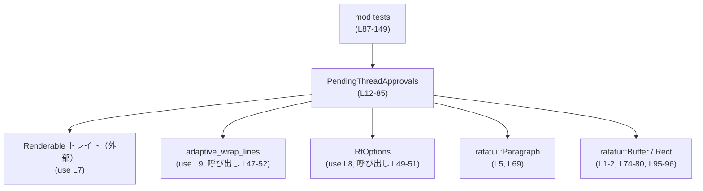

# tui/src/bottom_pane/pending_thread_approvals.rs コード解説

## 0. ざっくり一言

非アクティブなスレッドのうち、承認待ちのものを一覧表示するための TUI ウィジェット（`PendingThreadApprovals`）を実装したモジュールです（pending_thread_approvals.rs:L11-14）。

---

## 1. このモジュールの役割

### 1.1 概要

- 承認待ちスレッド名の一覧（`Vec<String>`）を内部に保持し、TUI 上に表示するウィジェットです（pending_thread_approvals.rs:L12-13）。
- 最大 3 件まで「Approval needed in {thread}」形式で表示し、それ以上ある場合は `...` 行で省略を示します（pending_thread_approvals.rs:L46-58）。
- 下部に「`/agent to switch threads`」という操作ヒント行を追加します（pending_thread_approvals.rs:L60-67）。
- ラッパー関数 `as_renderable` を介して ratatui の `Paragraph` に変換し、`Renderable` トレイトを通じて描画・高さ計算に対応します（pending_thread_approvals.rs:L40-70, L73-85）。

### 1.2 アーキテクチャ内での位置づけ

このモジュールは、アプリ固有の `Renderable` トレイトの実装として TUI のボトムペインに組み込まれる位置づけとみなせます。外部との主な依存関係は次のとおりです。

- `crate::render::renderable::Renderable` トレイトを実装（pending_thread_approvals.rs:L7, L73-85）。
- 行折り返しユーティリティ `adaptive_wrap_lines` とオプション型 `RtOptions` を利用（pending_thread_approvals.rs:L8-9, L47-52）。
- ratatui の `Buffer`, `Rect`, `Paragraph`, スタイル API を利用（pending_thread_approvals.rs:L1-5, L60-67, L74-80, L95-96）。

これを簡略図で示します。



### 1.3 設計上のポイント

- **状態保持型**  
  - `PendingThreadApprovals` は承認待ちスレッド名の `Vec<String>` を保持するシンプルな状態持ち構造体です（pending_thread_approvals.rs:L12-13）。
- **変更検知付きセッター**  
  - `set_threads` は同一内容のベクタが渡された場合は内部状態を更新せず `false` を返すことで、変更の有無を呼び出し側に知らせます（pending_thread_approvals.rs:L23-29）。
- **レンダリング本体を private 関数に集約**  
  - `render`・`desired_height` は共に `as_renderable` に委譲し、実際の行生成ロジックを 1 箇所に集約しています（pending_thread_approvals.rs:L40-70, L74-84）。
- **trait オブジェクトによる多態性**  
  - `as_renderable` は `Box<dyn Renderable>` を返すため、空状態では `Box::new(())`、それ以外では `Paragraph::new(lines).into()` と異なる型を統一的に扱えます（pending_thread_approvals.rs:L40-43, L69）。
- **安全なエラーハンドリング・並行性**  
  - このモジュール内には `unsafe` ブロックやスレッド／非同期関連のコードはなく、操作はすべてシングルスレッド前提の `&mut self`／`&self` 経由です（pending_thread_approvals.rs:L16-85）。
  - エラーを返す `Result` 型や `panic!` の利用もなく、通常の使用でランタイムエラー／パニックを起こすコードは含まれていません（テスト内の `unwrap_or` は安全なフォールバックを伴います: pending_thread_approvals.rs:L101-101）。

---

## 2. 主要な機能一覧

- 承認待ちスレッド一覧の保持と更新（`PendingThreadApprovals::new`, `set_threads`）（pending_thread_approvals.rs:L17-21, L23-29）
- 承認待ちスレッドが空かどうかの判定（`is_empty`）（pending_thread_approvals.rs:L31-33）
- スレッド一覧に基づくレンダリング対象の構築（`as_renderable`）（pending_thread_approvals.rs:L40-70）
- TUI バッファへの描画（`Renderable::render` 実装）（pending_thread_approvals.rs:L73-80）
- 必要な高さ（行数）の計算（`Renderable::desired_height` 実装）（pending_thread_approvals.rs:L82-84）
- スナップショットテスト用のレンダリングヘルパーとテスト（`snapshot_rows` と 3 つの `#[test]`）（pending_thread_approvals.rs:L93-106, L108-148）

---

## 3. 公開 API と詳細解説

### 3.1 型一覧（構造体・モジュールなど）

| 名前 | 種別 | 定義行 | 役割 / 用途 |
|------|------|--------|-------------|
| `PendingThreadApprovals` | 構造体 | `pending_thread_approvals.rs:L12-14` | 承認待ちスレッド名一覧を保持し、`Renderable` として描画するウィジェット本体 |
| `tests` | モジュール（`#[cfg(test)]`） | `pending_thread_approvals.rs:L87-149` | スナップショットテストおよび高さ計算テストをまとめたテストモジュール |

> 備考: `PendingThreadApprovals` は `pub(crate)` で、クレート内から利用される内部 API です（pending_thread_approvals.rs:L12）。

### 3.2 関数詳細（主要 6 件）

#### `PendingThreadApprovals::new() -> Self`

**概要**

- 承認待ちスレッド一覧が空の `PendingThreadApprovals` インスタンスを生成します（pending_thread_approvals.rs:L17-21）。

**引数**

- なし

**戻り値**

- `PendingThreadApprovals`  
  内部フィールド `threads` が空の状態のインスタンス（pending_thread_approvals.rs:L18-20）。

**内部処理の流れ**

1. `Self { threads: Vec::new() }` を返すだけの定数時間処理です（pending_thread_approvals.rs:L18-20）。

**Examples（使用例）**

```rust
use crate::bottom_pane::pending_thread_approvals::PendingThreadApprovals; // ウィジェット型をインポートする

fn create_widget() {
    let widget = PendingThreadApprovals::new(); // 空の承認待ちスレッド一覧を持つウィジェットを生成する
    assert!(widget.is_empty());                 // 生成直後は空であることが期待される
}
```

**Errors / Panics**

- 発生しません。単純な構造体生成のみです。

**Edge cases（エッジケース）**

- 特にありません（引数もなくメモリ確保のみ）。

**使用上の注意点**

- 生成後に実際のスレッド一覧を表示するには、`set_threads` を呼び出す必要があります。

---

#### `PendingThreadApprovals::set_threads(&mut self, threads: Vec<String>) -> bool`

**概要**

- 内部のスレッド一覧を新しい `Vec<String>` に置き換えます。
- 変更があった場合のみ `true` を返し、全く同じ内容の場合は何もせず `false` を返します（pending_thread_approvals.rs:L23-29）。

**引数**

| 引数名 | 型 | 説明 |
|--------|----|------|
| `threads` | `Vec<String>` | 新しい承認待ちスレッド名一覧。順序も含めて比較に使われます（pending_thread_approvals.rs:L23-28）。 |

**戻り値**

- `bool`  
  - `true`: 内部の `threads` が新しく設定され、以前と内容が変わった場合（pending_thread_approvals.rs:L27-29）。
  - `false`: 引数 `threads` が現在の `self.threads` と `==` で等しい場合（pending_thread_approvals.rs:L24-26）。

**内部処理の流れ**

1. `self.threads == threads` で現在の一覧と新しい一覧を比較します（pending_thread_approvals.rs:L24）。
2. 等しければ何も変更せず `false` を返します（pending_thread_approvals.rs:L24-26）。
3. 異なっていれば `self.threads` に引数 `threads` を代入し（ムーブ）、`true` を返します（pending_thread_approvals.rs:L27-29）。

**Examples（使用例）**

```rust
use crate::bottom_pane::pending_thread_approvals::PendingThreadApprovals; // ウィジェット型をインポートする

fn update_threads_example() {
    let mut widget = PendingThreadApprovals::new();                            // 空のウィジェットを作成する
    let changed = widget.set_threads(vec!["Main [default]".to_string()]);     // スレッド一覧を1件設定する
    assert!(changed);                                                          // 初回なので変更あり（true）が返る

    let changed_again = widget.set_threads(vec!["Main [default]".to_string()]); // 同じ内容を再度設定する
    assert!(!changed_again);                                                    // 変更なし（false）が返る
}
```

**Errors / Panics**

- 発生しません。`Vec<String>` の比較と代入のみです。

**Edge cases（エッジケース）**

- **順序の違い**: `Vec<String>` の `==` 比較は要素順序も含むため、同じスレッド名でも順序が違うと「変更あり」と判定されます（pending_thread_approvals.rs:L24）。
- **大量要素**: 大きなベクタを比較する場合、`==` 比較は O(n) であるためコストがかかりますが、このファイル内では特別な対策は行っていません。

**使用上の注意点**

- 返り値の `bool` は「レイアウトが変わった可能性があるか」を判断するフラグとして利用できます。再描画処理を最適化する場合に役立ちます。
- 呼び出し後、レンダリングに変化を反映させるには `render` / `desired_height` を再度呼び出す必要があります。

---

#### `PendingThreadApprovals::is_empty(&self) -> bool`

**概要**

- 内部のスレッド一覧が空かどうかを返します（pending_thread_approvals.rs:L31-33）。

**引数**

- なし（`&self` のみ）

**戻り値**

- `bool`  
  - `true`: `self.threads.is_empty()` が `true` の場合（pending_thread_approvals.rs:L32）。
  - `false`: 要素が 1 つ以上ある場合。

**内部処理の流れ**

1. `self.threads.is_empty()` をそのまま返すワンライナーです（pending_thread_approvals.rs:L32）。

**Examples（使用例）**

```rust
use crate::bottom_pane::pending_thread_approvals::PendingThreadApprovals; // ウィジェット型をインポートする

fn check_empty_example() {
    let mut widget = PendingThreadApprovals::new();      // 空のウィジェットを作成する
    assert!(widget.is_empty());                          // まだスレッドはない

    widget.set_threads(vec!["Inspector".to_string()]);   // スレッドを1件追加する
    assert!(!widget.is_empty());                         // もう空ではない
}
```

**Errors / Panics**

- 発生しません。

**Edge cases（エッジケース）**

- 特になし。単純なベクタの空チェックです。

**使用上の注意点**

- レイアウト側で「承認待ちがない場合はウィジェット自体を非表示にする」かどうか判断する際に利用できます。

---

#### `PendingThreadApprovals::as_renderable(&self, width: u16) -> Box<dyn Renderable>`

**概要**

- 内部のスレッド一覧と与えられた描画幅に基づき、実際に描画を行う `Renderable` トレイトオブジェクト（`Box<dyn Renderable>`）を生成します（pending_thread_approvals.rs:L40-70）。
- 空状態または極端に狭い幅の場合は、何も描画しない `Renderable`（`Box::new(())`）を返します（pending_thread_approvals.rs:L41-43）。

**引数**

| 引数名 | 型 | 説明 |
|--------|----|------|
| `width` | `u16` | 描画エリアの幅（列数）。折り返しやインデント計算に使用されます（pending_thread_approvals.rs:L40-41, L49）。 |

**戻り値**

- `Box<dyn Renderable>`  
  - 空状態または幅が狭い場合: `Box::new(())`（pending_thread_approvals.rs:L41-43）。  
  - それ以外: 承認待ちスレッドと `/agent` ヒントを含む `Paragraph` を `into()` した `Renderable`（pending_thread_approvals.rs:L60-69）。

**内部処理の流れ（アルゴリズム）**

1. **空・狭幅判定**  
   - `if self.threads.is_empty() || width < 4` で、スレッドが空または幅が 4 未満の場合、`Box::new(())` を返し早期リターンします（pending_thread_approvals.rs:L41-43）。
2. **表示行バッファの初期化**  
   - `let mut lines = Vec::new();` で表示用の `Vec<Line>` を用意します（pending_thread_approvals.rs:L45）。
3. **承認待ちスレッド行の生成**  
   - `self.threads.iter().take(3)` で先頭 3 スレッドだけを対象に（pending_thread_approvals.rs:L46）、  
     各スレッドについて:
     - `Line::from(format!("Approval needed in {thread}"))` から 1 行を作り（pending_thread_approvals.rs:L48）、
     - `RtOptions::new(width as usize)` で折り返しオプションを作成（pending_thread_approvals.rs:L49）、
     - `.initial_indent(...)` で `"  " + 赤太字の`"!"` + `" "` のインデント行を設定（pending_thread_approvals.rs:L50）、
     - `.subsequent_indent(Line::from("    "))` で折り返し行のインデントを 4 空白に設定（pending_thread_approvals.rs:L51）、
     - これらを `adaptive_wrap_lines` に渡し、折り返し済み `Line` 群を得て `lines` に追加します（pending_thread_approvals.rs:L47-53）。
4. **スレッドが 4 件以上ある場合の省略表示**  
   - `if self.threads.len() > 3` のときに `"    ..."` に `dim().italic()` を適用した行を末尾に追加します（pending_thread_approvals.rs:L56-58）。
5. **操作ヒント行の追加**  
   - `"    ".into()`, `"/agent".cyan().bold()`, `" to switch threads".dim()` を 1 行の `Vec<Span>` として組み立て、さらに `.dim()` を全体に適用し（pending_thread_approvals.rs:L60-67）、`lines` に追加します。
6. **Paragraph への変換**  
   - `Paragraph::new(lines).into()` で ratatui の `Paragraph` から `Box<dyn Renderable>` への変換を行います（pending_thread_approvals.rs:L69）。

**Examples（使用例）**

> 通常は `render` / `desired_height` 経由で間接的に呼ばれるため、直接呼び出す必要はありませんが、挙動の理解用に例を示します。

```rust
use crate::bottom_pane::pending_thread_approvals::PendingThreadApprovals; // ウィジェット型をインポートする

fn debug_renderable(width: u16) {
    let mut widget = PendingThreadApprovals::new();                          // ウィジェット生成
    widget.set_threads(vec!["Robie [explorer]".to_string()]);               // 1件だけ承認待ちスレッドを設定

    let renderable = widget.as_renderable(width);                           // 指定幅に基づく Renderable を取得（private 関数のため実際は同モジュール内でのみ使用可能）
    // ここで renderable.render(...) や desired_height(...) を呼び出せる（Renderable トレイトの仕様に依存）
}
```

**Errors / Panics**

- 本体コード内にパニックの可能性は見当たりません。
- 外部ライブラリ側（`adaptive_wrap_lines` や ratatui）でのパニック可能性については、このチャンクには情報がありません。

**Edge cases（エッジケース）**

- **スレッドが空**: `self.threads.is_empty()` により `Box::new(())` を返し、何も描画されません（pending_thread_approvals.rs:L41-43）。
- **幅が 4 未満 (`width < 4`)**: 同様に `Box::new(())` を返し、極端に狭い領域では描画を行いません（pending_thread_approvals.rs:L41-43）。
- **スレッド数が 3 件以下**: すべてのスレッドが「Approval needed in ...」行として表示され、`...` 行は追加されません（pending_thread_approvals.rs:L46-54, L56）。
- **スレッド数が 4 件以上**: 先頭 3 件のみ本文表示され、4 件目以降の存在は `"    ..."` 行で示されます（pending_thread_approvals.rs:L46-58）。
- **長いスレッド名**: 折り返し処理は `adaptive_wrap_lines` に委譲されており、このファイルから詳細な挙動は分かりません（pending_thread_approvals.rs:L47-52）。

**使用上の注意点**

- `width` は `Rect.width` から直接与えられることを想定しており、`0` でも安全に扱われます（`width < 4` 分岐による無描画, pending_thread_approvals.rs:L41-43）。
- この関数は `fn as_renderable(&self, width: u16)` として private であり、モジュール外から直接呼び出すことはできません（pending_thread_approvals.rs:L40）。

---

#### `impl Renderable for PendingThreadApprovals::render(&self, area: Rect, buf: &mut Buffer)`

**概要**

- 与えられた矩形領域 `area` と `Buffer` に対し、`PendingThreadApprovals` の内容を描画します（pending_thread_approvals.rs:L73-80）。

**引数**

| 引数名 | 型 | 説明 |
|--------|----|------|
| `area` | `Rect` | 描画ターゲットとなる矩形領域。幅・高さを含む（pending_thread_approvals.rs:L74-80）。 |
| `buf` | `&mut Buffer` | ratatui の描画バッファ。描画結果がここに書き込まれます（pending_thread_approvals.rs:L74-80）。 |

**戻り値**

- なし（戻り値型は `()`）。

**内部処理の流れ**

1. **空領域チェック**  
   - `if area.is_empty() { return; }` で、幅または高さが 0 の領域なら何も描画せず終了します（pending_thread_approvals.rs:L75-77）。
2. **レンダリング委譲**  
   - `self.as_renderable(area.width)` で描画対象 `Renderable` を取得し、その `render(area, buf)` を呼び出します（pending_thread_approvals.rs:L79-79）。

**Examples（使用例）**

```rust
use ratatui::{buffer::Buffer, layout::Rect};                             // ratatui の型をインポートする
use crate::bottom_pane::pending_thread_approvals::PendingThreadApprovals; // ウィジェット型をインポートする

fn render_widget_example() {
    let mut widget = PendingThreadApprovals::new();                      // ウィジェットを生成する
    widget.set_threads(vec!["Main [default]".to_string()]);             // スレッド一覧を設定する

    let width = 40;                                                      // 描画幅を決める
    let height = widget.desired_height(width);                           // 必要な高さを計算する
    let area = Rect::new(0, 0, width, height);                           // 描画領域を構築する
    let mut buf = Buffer::empty(area);                                   // 空のバッファを用意する

    widget.render(area, &mut buf);                                       // バッファに描画する
}
```

**Errors / Panics**

- `area.is_empty()` 判定により、無効な領域（幅・高さ 0）の描画を即座にスキップするため、その点でのパニックは発生しません（pending_thread_approvals.rs:L75-77）。
- それ以外のパニック可能性は `Renderable` 実装や ratatui に依存し、このチャンクからは分かりません。

**Edge cases（エッジケース）**

- **高さ 0 の領域**: `area.is_empty()` に該当するため何も描画されません（pending_thread_approvals.rs:L75-77）。
- **幅 0 の領域**: 同上。
- **幅 < 4 の領域**: `as_renderable(area.width)` が `Box::new(())` を返すため、実質的に何も描画されません（pending_thread_approvals.rs:L41-43, L79）。

**使用上の注意点**

- 一般的には、事前に `desired_height` で高さを取得し、その高さを用いた `Rect` を渡すことが想定されます（テストの `snapshot_rows` 参照: pending_thread_approvals.rs:L93-97）。
- 同じ `PendingThreadApprovals` を複数スレッドから同時に描画するようなパターンは、このファイルからは想定されておらず、スレッドセーフ性は不明です。

---

#### `impl Renderable for PendingThreadApprovals::desired_height(&self, width: u16) -> u16`

**概要**

- 与えられた幅に対して、このウィジェットを描画するのに必要な行数（高さ）を返します（pending_thread_approvals.rs:L82-84）。

**引数**

| 引数名 | 型 | 説明 |
|--------|----|------|
| `width` | `u16` | 描画領域の幅。折り返し計算に影響します（pending_thread_approvals.rs:L82-84）。 |

**戻り値**

- `u16`  
  `self.as_renderable(width).desired_height(width)` の結果（pending_thread_approvals.rs:L83）。

**内部処理の流れ**

1. `as_renderable(width)` で `Renderable` トレイトオブジェクトを生成します（pending_thread_approvals.rs:L83）。
2. その `desired_height(width)` を呼び出し、そのまま返します（pending_thread_approvals.rs:L83）。

**Examples（使用例）**

```rust
use crate::bottom_pane::pending_thread_approvals::PendingThreadApprovals; // ウィジェット型をインポートする

fn compute_height_example() {
    let mut widget = PendingThreadApprovals::new();                      // ウィジェットを生成する
    widget.set_threads(vec!["Inspector".to_string()]);                  // 1件のスレッドを設定する

    let width = 40;                                                     // 描画幅を指定する
    let height = widget.desired_height(width);                          // 必要な高さを取得する

    assert!(height > 0);                                                // 少なくとも1行以上の高さが必要なことが期待される
}
```

**Errors / Panics**

- この関数自身にはパニック要因はありません。
- 実際の高さ計算は `Renderable` 実装に依存するため、詳細はこのチャンクからは分かりません。

**Edge cases（エッジケース）**

- **空のスレッド一覧**: テスト `desired_height_empty` により、幅 40 の場合に `0` が返ることが検証されています（pending_thread_approvals.rs:L108-112）。
- **幅 < 4**: `as_renderable` が `Box::new(())` を返すため、その `desired_height` が返されます。テストから少なくとも空の場合は 0 であることが分かりますが、具体的な実装は別モジュールにあります（pending_thread_approvals.rs:L41-43, L108-112）。

**使用上の注意点**

- レイアウト計算時に必ず `width` を指定する必要があります。`render` との整合性を保つため、同じ `width` を使うことが重要です。
- 高さ 0 が返る場合、描画をスキップするレイアウト戦略も考えられます（テストでは高さ 0 の場合に `Buffer::empty` が `height=0` で呼ばれています: pending_thread_approvals.rs:L94-96）。

---

### 3.3 その他の関数（ヘルパー・テスト）

| 関数名 | 種別 | 定義行 | 役割（1 行） |
|--------|------|--------|--------------|
| `PendingThreadApprovals::threads(&self) -> &[String]` | メソッド（`#[cfg(test)]`） | `pending_thread_approvals.rs:L35-38` | テスト用に内部の `threads` スライスを公開するゲッター |
| `snapshot_rows(widget: &PendingThreadApprovals, width: u16) -> String` | テスト用ヘルパー関数 | `pending_thread_approvals.rs:L93-106` | ウィジェットを描画し、行ごとのテキスト表現を結合した文字列を返す |
| `desired_height_empty()` | テスト関数 | `pending_thread_approvals.rs:L108-112` | 空状態の `desired_height` が 0 であることを検証する |
| `render_single_thread_snapshot()` | テスト関数 | `pending_thread_approvals.rs:L114-126` | 1 スレッドのみの場合の描画結果を insta スナップショットで検証する |
| `render_multiple_threads_snapshot()` | テスト関数 | `pending_thread_approvals.rs:L128-148` | 4 スレッドの場合の描画結果（3 件＋...＋ヒント行）を insta スナップショットで検証する |

---

## 4. データフロー

このモジュールにおける典型的な処理の流れは次のようになります。

1. 外部モジュール（このチャンクには現れません）が `PendingThreadApprovals` を保持し、必要に応じて `set_threads` で一覧を更新します（pending_thread_approvals.rs:L16-29）。
2. レイアウト処理の一環として、そのウィジェットに対して `desired_height(width)` が呼ばれ、高さが計算されます（pending_thread_approvals.rs:L82-84）。
3. 同じ幅・計算した高さから `Rect` が作られ、`render(area, buf)` が呼ばれます（テストの `snapshot_rows` 参照: pending_thread_approvals.rs:L93-97）。
4. `render` は `as_renderable(area.width)` を呼び、その結果の `Renderable` オブジェクトに処理を委譲します（pending_thread_approvals.rs:L74-80）。
5. `as_renderable` はスレッド一覧を元に行群を構築し、`Paragraph::new(lines).into()` で `Box<dyn Renderable>` に変換します（pending_thread_approvals.rs:L45-69）。
6. 最終的に ratatui の `Buffer` に文字が書き込まれます（pending_thread_approvals.rs:L74-80, L95-101）。

これをシーケンス図で表します。

```mermaid
sequenceDiagram
    participant C as 呼び出し元（外部・不明）
    participant W as PendingThreadApprovals<br/>(L12-85)
    participant DH as desired_height(width)<br/>(L82-84)
    participant R as render(area, buf)<br/>(L74-80)
    participant AR as as_renderable(width)<br/>(L40-70)
    participant P as Paragraph::new(lines)<br/>(L69)
    participant B as ratatui::Buffer<br/>(L1, L74-80, L95-101)

    C->>W: set_threads(threads) (L23-29)
    C->>DH: desired_height(width) (L82-84)
    DH->>AR: as_renderable(width) (L83)
    AR->>AR: スレッドから行を構築 (L45-58)
    AR->>P: Paragraph::new(lines) (L69)
    P-->>DH: Box&lt;dyn Renderable&gt; へ into() (L69)
    C->>R: render(area, &mut buf) (L74-80)
    R->>AR: as_renderable(area.width) (L79)
    AR->>P: Paragraph::new(lines) (L69)
    P-->>R: Box&lt;dyn Renderable&gt; (L69)
    R->>B: render(area, buf) を通じて描画 (L79, 実装は外部)
```

---

## 5. 使い方（How to Use）

### 5.1 基本的な使用方法

`PendingThreadApprovals` を使って承認待ちスレッドを描画する典型的な流れです。テスト内の `snapshot_rows` の処理（pending_thread_approvals.rs:L93-97）を簡略化しています。

```rust
use ratatui::{buffer::Buffer, layout::Rect};                             // ratatui の Buffer と Rect をインポートする
use crate::bottom_pane::pending_thread_approvals::PendingThreadApprovals; // 同一クレート内のウィジェット型をインポートする

fn render_pending_threads_example() {
    // 1. ウィジェットを作成する
    let mut widget = PendingThreadApprovals::new();                      // 空の承認待ち一覧を持つウィジェットを生成する

    // 2. 承認待ちスレッド一覧を設定する
    widget.set_threads(vec![
        "Main [default]".to_string(),                                    // スレッド1
        "Robie [explorer]".to_string(),                                  // スレッド2
        "Inspector".to_string(),                                         // スレッド3
    ]);

    // 3. レイアウト計算用に必要な高さを取得する
    let width: u16 = 44;                                                 // 描画に使う幅（列数）を決める
    let height: u16 = widget.desired_height(width);                      // この幅で必要となる高さ（行数）を計算する

    // 4. 描画領域とバッファを用意する
    let area = Rect::new(0, 0, width, height);                           // 左上(0,0)、指定の幅と高さの領域を作る
    let mut buf = Buffer::empty(area);                                   // その領域サイズの空バッファを用意する

    // 5. バッファにウィジェットを描画する
    widget.render(area, &mut buf);                                       // ウィジェットの内容をバッファに書き込む

    // 6. 以後、buf の内容をターミナルに反映する処理は外部（アプリ側）で行う
}
```

### 5.2 よくある使用パターン

1. **変更検知を利用した再描画の最適化**

```rust
use crate::bottom_pane::pending_thread_approvals::PendingThreadApprovals; // ウィジェット型をインポートする

fn update_if_changed(widget: &mut PendingThreadApprovals, new_threads: Vec<String>) {
    // 新しい一覧を設定しつつ、変更があったかどうかを検知する
    let changed = widget.set_threads(new_threads);                        // 変更があれば true, なければ false が返る

    if changed {
        // レイアウトの再計算や再描画をスケジュールする                     // 変更があった場合のみ更新処理を行う
    }
}
```

1. **空のときにウィジェットごと隠す**

```rust
use crate::bottom_pane::pending_thread_approvals::PendingThreadApprovals; // ウィジェット型をインポートする

fn maybe_render(widget: &PendingThreadApprovals) {
    if widget.is_empty() {
        // 承認待ちがないので、このウィジェットはレイアウトから省く         // is_empty により空を判定する
    } else {
        // レイアウトに組み込んで render / desired_height を呼ぶ            // 承認待ちがある場合のみ描画する
    }
}
```

### 5.3 よくある間違い

```rust
use ratatui::{buffer::Buffer, layout::Rect};
use crate::bottom_pane::pending_thread_approvals::PendingThreadApprovals;

// 間違い例: desired_height を使わずに高さ 0 の Rect を渡してしまう
fn wrong_render() {
    let mut widget = PendingThreadApprovals::new();                      // ウィジェットを生成する
    widget.set_threads(vec!["Inspector".to_string()]);                  // スレッドを設定する

    let width = 40;                                                     // 幅だけを決める
    let height = 0;                                                     // 高さを 0 にしてしまう
    let area = Rect::new(0, 0, width, height);                          // 高さ 0 の領域を作る
    let mut buf = Buffer::empty(area);                                  // 高さ 0 のバッファを作る

    widget.render(area, &mut buf);                                      // area.is_empty() が true なので何も描画されない
}

// 正しい例: desired_height で高さを計算してから描画する
fn correct_render() {
    let mut widget = PendingThreadApprovals::new();                      // ウィジェットを生成する
    widget.set_threads(vec!["Inspector".to_string()]);                  // スレッドを設定する

    let width = 40;                                                     // 幅を決める
    let height = widget.desired_height(width);                          // 必要な高さを計算する
    let area = Rect::new(0, 0, width, height);                          // 計算した高さの領域を作る
    let mut buf = Buffer::empty(area);                                  // そのサイズのバッファを作る

    widget.render(area, &mut buf);                                      // 正しく描画される
}
```

その他の注意点:

- `threads()` メソッドは `#[cfg(test)]` 付きであり、本番コードからは利用できません（pending_thread_approvals.rs:L35-38）。内部状態を読みたい場合は別途 API を追加する必要があります。
- `set_threads` の戻り値を無視すると、「変更があったか」を外部で判定できなくなり、不要な再描画を行う可能性があります。

### 5.4 使用上の注意点（まとめ）

- **高さ計算と描画**: 必ず `desired_height(width)` で高さを計算してから、その高さを使って `Rect` を構築し `render` を呼ぶと、`area.is_empty()` によるスキップを避けられます（pending_thread_approvals.rs:L74-80, L93-97, L108-112）。
- **幅の制約**: 幅が 4 未満の場合は、`as_renderable` が空の `Renderable` を返すため、何も表示されません（pending_thread_approvals.rs:L41-43）。
- **スレッド数の上限表示**: 3 件を超えるスレッドは `...` にまとめられる設計です。すべて表示したい場合は `as_renderable` の `take(3)` 部分を変更する必要があります（pending_thread_approvals.rs:L46）。
- **安全性・セキュリティ**: このモジュールは文字列をそのまま表示するだけであり、ファイル I/O やネットワーク、コマンド実行などの危険な操作は含みません（pending_thread_approvals.rs:L12-85）。ただし、スレッド名自体のサニタイズの有無は入力元の実装に依存します。
- **並行性**: `&mut self` を取る `set_threads` と `&self` の読み出しメソッドのみで構成されており、このファイル内にはスレッドや非同期処理に関するコードは存在しません（pending_thread_approvals.rs:L16-85）。

---

## 6. 変更の仕方（How to Modify）

### 6.1 新しい機能を追加する場合

1. **表示フォーマットの変更や追加情報の表示**
   - メッセージテキストやインデント、色付けを変えたい場合は、`as_renderable` 内の行生成部分を編集します（pending_thread_approvals.rs:L45-67）。
     - 例: `"Approval needed in {thread}"` の文言を変える（pending_thread_approvals.rs:L48）。
     - 例: インデント・装飾を変える場合は `initial_indent` / `subsequent_indent` の引数を変更（pending_thread_approvals.rs:L50-51）。

2. **表示するスレッド数の上限を増やす**
   - 現在は `iter().take(3)` で 3 件に制限されているため、この数値を変更することで上限を変えられます（pending_thread_approvals.rs:L46）。
   - それに応じてテストのスナップショット（`render_multiple_threads_snapshot`）も更新する必要があります（pending_thread_approvals.rs:L128-148）。

3. **ヒント行の追加・変更**
   - `/agent to switch threads` の表示を変更したい場合は、`lines.push` でヒント行を生成している部分を編集します（pending_thread_approvals.rs:L60-67）。

### 6.2 既存の機能を変更する場合

- **`set_threads` の挙動変更**
  - 変更判定の条件（順序無視の比較など）を変えたい場合は、`self.threads == threads` の部分を修正します（pending_thread_approvals.rs:L24）。
  - 返り値の契約（`true` = 変更あり）を変えると、呼び出し側に影響する可能性が高いため、利用箇所の確認が必要です（このチャンク外の情報は不明）。

- **折り返しロジックの変更**
  - 折り返しのスタイル（インデントや最大幅など）を変えたい場合は、`adaptive_wrap_lines` と `RtOptions` の引数を調整します（pending_thread_approvals.rs:L47-52）。
  - `adaptive_wrap_lines` / `RtOptions` 自体の仕様は別ファイルに定義されており、このチャンクには詳細がありません。

- **テストの更新**
  - 表示内容を変更した場合、`render_single_thread_snapshot` と `render_multiple_threads_snapshot` の insta スナップショットが一致しなくなるため、スナップショットの更新が必要です（pending_thread_approvals.rs:L114-126, L128-148）。
  - 高さ計算のロジックを変更した場合は、`desired_height_empty` など高さに関するテストも見直す必要があります（pending_thread_approvals.rs:L108-112）。

---

## 7. 関連ファイル

このモジュールと密接に関係する他ファイル・モジュール（このチャンクから参照されているもの）は次のとおりです。

| パス / モジュール | 役割 / 関係 |
|-------------------|------------|
| `crate::render::renderable::Renderable` | `PendingThreadApprovals` が実装するトレイト。`render` と `desired_height` のシグネチャを定義します（use: pending_thread_approvals.rs:L7, 実装: L73-85）。このトレイトの詳細はこのチャンクには現れません。 |
| `crate::wrapping::RtOptions` | 折り返し処理のためのオプションを構築する型。`initial_indent` / `subsequent_indent` メソッドを通じてインデントを指定します（pending_thread_approvals.rs:L8, L49-51）。定義は別ファイルにあります。 |
| `crate::wrapping::adaptive_wrap_lines` | `Line` のイテレータを折り返し処理するユーティリティ関数。承認メッセージ行の行分割に使用されます（pending_thread_approvals.rs:L9, L47-52）。 |
| `ratatui::buffer::Buffer` | TUI 描画バッファ。`render` 実装およびテストで使用されています（pending_thread_approvals.rs:L1, L74-80, L95-101）。 |
| `ratatui::layout::Rect` | 描画領域を表す矩形型。`render` やテストのレイアウト指定に利用されています（pending_thread_approvals.rs:L2, L74-80, L95-96）。 |
| `ratatui::widgets::Paragraph` | 実際の表示処理を担う ratatui ウィジェット。`as_renderable` 内で `lines` から生成されます（pending_thread_approvals.rs:L5, L69）。 |
| `insta` / `pretty_assertions` | テスト用クレート。レンダリング結果のスナップショット比較と整形されたアサーションに用いられています（pending_thread_approvals.rs:L90-91）。 |

> これらの関連モジュール・型の具体的な実装はこのファイルには含まれておらず、より詳細な挙動を知るには該当ファイルを参照する必要があります。
